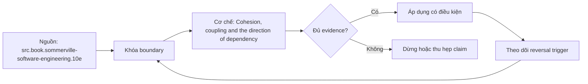

# Cohesion, coupling and the direction of dependency

**Tóm tắt bản chất:** Vẽ đồ thị phụ thuộc của một kho mã và chỉ ra mọi cạnh đi sai chiều. Cơ chế chỉ có giá trị khi workload, version, state owner và failure boundary đã được khóa; một con số đẹp ngoài bốn điều kiện đó không đủ để ra quyết định.

> [!abstract] Câu hỏi trung tâm
> Làm thế nào mô hình, đo và ra quyết định đúng về Cohesion, coupling and the direction of dependency?

## Nỗi Đau & Động Lực

Chia lớp theo loại kỹ thuật thay vì theo lý do thay đổi · để lõi nhập thư viện cơ sở dữ liệu · lộ mọi thứ ra ngoài mô đun · đánh giá độ phụ thuộc bằng cảm nhận. Đây không phải danh sách lỗi cú pháp. Mỗi lỗi làm người vận hành chọn nhầm owner hoặc chữa symptom ở layer sau, khiến thời gian phục hồi tăng dù command vừa chạy trả về thành công.

Năng lực cần giữ sau bài là: Vẽ đồ thị phụ thuộc của một kho mã và chỉ ra mọi cạnh đi sai chiều. Nếu learner chỉ nhắc lại định nghĩa nhưng không phân biệt được hai state gần nhau trên số đo, bài chưa đạt.

## Cơ Chế Tác Động

Hai đại lượng quyết định mã có sửa được không, và chúng đo được chứ chỉ cảm nhận. Độ gắn kết: các thứ trong một mô đun có cùng lý do thay đổi không. Độ phụ thuộc: đổi mô đun này buộc đổi bao nhiêu mô đun khác. Chiều phụ thuộc là thứ quan trọng nhất và hay bị làm sai: **lõi nghiệp vụ không được phụ thuộc vào khung, cơ sở dữ liệu hay định dạng tệp**, mà ngược lại. Lý do không phải thẩm mỹ mà là khả năng kiểm thử và khả năng thay thế: lõi không biết gì về cơ sở dữ liệu thì kiểm thử lõi không cần cơ sở dữ liệu, và đổi cơ sở dữ liệu không đụng lõi. Đảo ngược phụ thuộc là kỹ thuật đạt điều đó: lõi định nghĩa giao diện nó cần, tầng ngoài cài đặt giao diện đó. Che giấu thông tin: mô đun lộ ra ít nhất có thể, vì mọi thứ lộ ra đều thành hợp đồng mà người khác dựa vào.

Tách ba lớp khi đọc cơ chế `wiki.de-foundation.cohesion-coupling-and-the-direction-of-dependency`: declared state là điều cấu hình hoặc API yêu cầu; executed state là việc runtime thực sự làm; consumer-visible state là điều client hay operator quan sát. Ba lớp có thể lệch nhau vì cache, buffering, retry, scheduling, queue hoặc failure giữa hai transition. Evidence phải chỉ ra lớp nào đang được đo.

## Bản Đồ Quyết Định

| Bước | Câu hỏi phải khóa | Điều kiện đạt |
|---|---|---|
| Vocabulary | Một concept miền có một tên trong scope | Business reviewer hiểu cùng nghĩa |
| Contract | Input, output, pre/postcondition và error | Caller biết mọi outcome |
| Boundary | Policy phụ thuộc vào port, mechanism cài adapter | Đổi adapter không đổi policy |
| Review | Changed-use-case test | Quyết định giữ hoặc đảo có bằng chứng |

Quy tắc mặc định là chọn phép giải thích đơn giản nhất qua được hard constraints, rồi viết trước reversal trigger. Với `Cohesion, coupling and the direction of dependency`, absence of error không phải pass; pass cần observation đúng grain, một oracle độc lập và changed-constraint case đủ làm model có cơ hội thất bại.

## Case Study Thực Chiến: Cohesion, coupling and the direction of dependency

Cho hai kho mã, một có lõi phụ thuộc cơ sở dữ liệu và một đã đảo ngược. Vẽ đồ thị phụ thuộc cho cả hai bằng cách đọc phần nhập mô đun. Chỉ ra cạnh sai chiều. Với kho có vấn đề, đếm số tệp phải sửa nếu đổi cơ sở dữ liệu; làm tương tự với kho kia và so hai con số.

Trong case `wiki.de-foundation.cohesion-coupling-and-the-direction-of-dependency`, learner ghi expected transition, input snapshot, version và giới hạn an toàn trước khi chạy. Sau execution, họ giữ raw counter, timestamp, exit status, state trước–sau và giải thích delta bằng mechanism ở trên. Đánh giá không cho phép sửa expected result sau khi nhìn output mà không ghi change record.

Biến thể khó hơn đổi một constraint có khả năng đảo kết luận: workload shape, memory pressure, connection reuse, retry budget, permission hoặc dependency direction. Tầng *phân tích*. Objective đòi đọc cấu trúc thật và đánh giá nó theo tiêu chí, chứ nhớ định nghĩa. Kiểm bằng bài phân tích hai kho mã; đạt khi vẽ đúng đồ thị và chỉ ra đủ các cạnh sai chiều ở kho có vấn đề.

## Góc Khuất & Ngộ Nhận

**Hiểu lầm:** Chia lớp theo loại kỹ thuật thay vì theo lý do thay đổi. **Thực tế:** tín hiệu chỉ chứng minh điều nó đo trong đúng scope; state ở layer khác vẫn có thể trái ngược. **Vì sao nghe hợp lý:** happy path nhỏ thường không chạm queue, cache, partial progress hoặc restart.

**Hiểu lầm:** để lõi nhập thư viện cơ sở dữ liệu. **Thực tế:** tool và API cung cấp primitive, không tự cấp ownership, deadline, idempotency hay recovery policy. **Vì sao nghe hợp lý:** syntax gọn che mất protocol và lifecycle phía dưới.

Với `wiki.de-foundation.cohesion-coupling-and-the-direction-of-dependency`, một edge case đáng giữ là observation đúng nhưng diagnosis sai: counter tăng thật, song nguyên nhân điều khiển nằm ở layer trước. Muốn tránh, timeline phải nối trigger tới consumer harm và ghi rõ negative control nào đã loại giả thuyết cạnh tranh.

## Nếu Bạn Dạy Lại Điều Này...

Mở bài bằng một dự đoán dễ sai về `Cohesion, coupling and the direction of dependency`, không mở bằng định nghĩa. Cho hai trace gần giống nhau nhưng khác đúng một state boundary; learner phải chọn probe tiếp theo trước khi được xem đáp án.

Bài tập seed dùng chính lab của DE-L090, sau đó đổi constraint đủ mạnh để buộc giữ hoặc đảo quyết định. Người dạy chấm reasoning chain và evidence, không chấm việc learner đoán đúng tên công cụ.

## Ma trận kiểm chứng từng mệnh đề

Protocol riêng của `Cohesion, coupling and the direction of dependency` dùng điều kiện hoàn thành sau: Đồ thị phụ thuộc vẽ đúng cho cả hai kho, chỉ đủ cạnh sai chiều, và hai con số tệp phải sửa chênh nhau rõ rệt. Mỗi probe phải có prediction, failure signal và independent oracle.

### Probe 1: state transition và invariant

**Mệnh đề P1 cần kiểm.** Hai đại lượng quyết định mã có sửa được không, và chúng đo được chứ chỉ cảm nhận.

**Thiết kế phép thử cho `wiki.de-foundation.cohesion-coupling-and-the-direction-of-dependency`.** Với `wiki.de-foundation.cohesion-coupling-and-the-direction-of-dependency`, tạo positive và negative control chỉ khác một điều kiện; khóa workload, version, identity, permission, clock và state ban đầu. Expected result được viết trước execution để tiêu chí không trôi theo output.

**Bằng chứng P1 cần giữ.** Với `wiki.de-foundation.cohesion-coupling-and-the-direction-of-dependency`, lưu command hoặc harness, raw observation, transition trước–sau, coverage và limitation. Kết luận chỉ đạt khi oracle độc lập khớp đúng grain; nếu chưa chạy thì đây vẫn là protocol, không phải observation.

### Probe 2: identity, ownership và boundary

**Mệnh đề P2 cần kiểm.** Vẽ đồ thị phụ thuộc của một kho mã và chỉ ra mọi cạnh đi sai chiều.

**Thiết kế phép thử cho `wiki.de-foundation.cohesion-coupling-and-the-direction-of-dependency`.** Với `wiki.de-foundation.cohesion-coupling-and-the-direction-of-dependency`, tạo boundary case ngay trước và sau ngưỡng; khóa workload, version, identity, permission, clock và state ban đầu. Expected result được viết trước execution để tiêu chí không trôi theo output.

**Bằng chứng P2 cần giữ.** Với `wiki.de-foundation.cohesion-coupling-and-the-direction-of-dependency`, lưu command hoặc harness, raw observation, transition trước–sau, coverage và limitation. Kết luận chỉ đạt khi oracle độc lập khớp đúng grain; nếu chưa chạy thì đây vẫn là protocol, không phải observation.

### Probe 3: failure path và recovery

**Mệnh đề P3 cần kiểm.** Tầng *phân tích*.

**Thiết kế phép thử cho `wiki.de-foundation.cohesion-coupling-and-the-direction-of-dependency`.** Với `wiki.de-foundation.cohesion-coupling-and-the-direction-of-dependency`, tạo replay cùng identity nhưng đổi state; khóa workload, version, identity, permission, clock và state ban đầu. Expected result được viết trước execution để tiêu chí không trôi theo output.

**Bằng chứng P3 cần giữ.** Với `wiki.de-foundation.cohesion-coupling-and-the-direction-of-dependency`, lưu command hoặc harness, raw observation, transition trước–sau, coverage và limitation. Kết luận chỉ đạt khi oracle độc lập khớp đúng grain; nếu chưa chạy thì đây vẫn là protocol, không phải observation.

### Probe 4: decision trade-off và reversal trigger

**Mệnh đề P4 cần kiểm.** Cho hai kho mã, một có lõi phụ thuộc cơ sở dữ liệu và một đã đảo ngược.

**Thiết kế phép thử cho `wiki.de-foundation.cohesion-coupling-and-the-direction-of-dependency`.** Với `wiki.de-foundation.cohesion-coupling-and-the-direction-of-dependency`, tạo failure inject trước và sau transition bền vững; khóa workload, version, identity, permission, clock và state ban đầu. Expected result được viết trước execution để tiêu chí không trôi theo output.

**Bằng chứng P4 cần giữ.** Với `wiki.de-foundation.cohesion-coupling-and-the-direction-of-dependency`, lưu command hoặc harness, raw observation, transition trước–sau, coverage và limitation. Kết luận chỉ đạt khi oracle độc lập khớp đúng grain; nếu chưa chạy thì đây vẫn là protocol, không phải observation.

### Probe 5: evidence package và oracle

**Mệnh đề P5 cần kiểm.** Chia lớp theo loại kỹ thuật thay vì theo lý do thay đổi · để lõi nhập thư viện cơ sở dữ liệu · lộ mọi thứ ra ngoài mô đun · đánh giá độ phụ thuộc bằng cảm nhận.

**Thiết kế phép thử cho `wiki.de-foundation.cohesion-coupling-and-the-direction-of-dependency`.** Với `wiki.de-foundation.cohesion-coupling-and-the-direction-of-dependency`, tạo changed scale làm cost model đổi; khóa workload, version, identity, permission, clock và state ban đầu. Expected result được viết trước execution để tiêu chí không trôi theo output.

**Bằng chứng P5 cần giữ.** Với `wiki.de-foundation.cohesion-coupling-and-the-direction-of-dependency`, lưu command hoặc harness, raw observation, transition trước–sau, coverage và limitation. Kết luận chỉ đạt khi oracle độc lập khớp đúng grain; nếu chưa chạy thì đây vẫn là protocol, không phải observation.

### Probe 6: changed-constraint transfer

**Mệnh đề P6 cần kiểm.** Đồ thị phụ thuộc vẽ đúng cho cả hai kho, chỉ đủ cạnh sai chiều, và hai con số tệp phải sửa chênh nhau rõ rệt.

**Thiết kế phép thử cho `wiki.de-foundation.cohesion-coupling-and-the-direction-of-dependency`.** Với `wiki.de-foundation.cohesion-coupling-and-the-direction-of-dependency`, tạo adversarial order, skew hoặc packet timing; khóa workload, version, identity, permission, clock và state ban đầu. Expected result được viết trước execution để tiêu chí không trôi theo output.

**Bằng chứng P6 cần giữ.** Với `wiki.de-foundation.cohesion-coupling-and-the-direction-of-dependency`, lưu command hoặc harness, raw observation, transition trước–sau, coverage và limitation. Kết luận chỉ đạt khi oracle độc lập khớp đúng grain; nếu chưa chạy thì đây vẫn là protocol, không phải observation.

### Probe 7: state transition và invariant

**Mệnh đề P7 cần kiểm.** Hai đại lượng quyết định mã có sửa được không, và chúng đo được chứ chỉ cảm nhận.

**Thiết kế phép thử cho `wiki.de-foundation.cohesion-coupling-and-the-direction-of-dependency`.** Với `wiki.de-foundation.cohesion-coupling-and-the-direction-of-dependency`, tạo fresh environment không cache; khóa workload, version, identity, permission, clock và state ban đầu. Expected result được viết trước execution để tiêu chí không trôi theo output.

**Bằng chứng P7 cần giữ.** Với `wiki.de-foundation.cohesion-coupling-and-the-direction-of-dependency`, lưu command hoặc harness, raw observation, transition trước–sau, coverage và limitation. Kết luận chỉ đạt khi oracle độc lập khớp đúng grain; nếu chưa chạy thì đây vẫn là protocol, không phải observation.

### Probe 8: identity, ownership và boundary

**Mệnh đề P8 cần kiểm.** Vẽ đồ thị phụ thuộc của một kho mã và chỉ ra mọi cạnh đi sai chiều.

**Thiết kế phép thử cho `wiki.de-foundation.cohesion-coupling-and-the-direction-of-dependency`.** Với `wiki.de-foundation.cohesion-coupling-and-the-direction-of-dependency`, tạo independent oracle không dùng chung implementation; khóa workload, version, identity, permission, clock và state ban đầu. Expected result được viết trước execution để tiêu chí không trôi theo output.

**Bằng chứng P8 cần giữ.** Với `wiki.de-foundation.cohesion-coupling-and-the-direction-of-dependency`, lưu command hoặc harness, raw observation, transition trước–sau, coverage và limitation. Kết luận chỉ đạt khi oracle độc lập khớp đúng grain; nếu chưa chạy thì đây vẫn là protocol, không phải observation.

### Probe 9: failure path và recovery

**Mệnh đề P9 cần kiểm.** Tầng *phân tích*.

**Thiết kế phép thử cho `wiki.de-foundation.cohesion-coupling-and-the-direction-of-dependency`.** Với `wiki.de-foundation.cohesion-coupling-and-the-direction-of-dependency`, tạo partial progress rồi restart; khóa workload, version, identity, permission, clock và state ban đầu. Expected result được viết trước execution để tiêu chí không trôi theo output.

**Bằng chứng P9 cần giữ.** Với `wiki.de-foundation.cohesion-coupling-and-the-direction-of-dependency`, lưu command hoặc harness, raw observation, transition trước–sau, coverage và limitation. Kết luận chỉ đạt khi oracle độc lập khớp đúng grain; nếu chưa chạy thì đây vẫn là protocol, không phải observation.

### Probe 10: decision trade-off và reversal trigger

**Mệnh đề P10 cần kiểm.** Cho hai kho mã, một có lõi phụ thuộc cơ sở dữ liệu và một đã đảo ngược.

**Thiết kế phép thử cho `wiki.de-foundation.cohesion-coupling-and-the-direction-of-dependency`.** Với `wiki.de-foundation.cohesion-coupling-and-the-direction-of-dependency`, tạo missing evidence phải abstain; khóa workload, version, identity, permission, clock và state ban đầu. Expected result được viết trước execution để tiêu chí không trôi theo output.

**Bằng chứng P10 cần giữ.** Với `wiki.de-foundation.cohesion-coupling-and-the-direction-of-dependency`, lưu command hoặc harness, raw observation, transition trước–sau, coverage và limitation. Kết luận chỉ đạt khi oracle độc lập khớp đúng grain; nếu chưa chạy thì đây vẫn là protocol, không phải observation.

### Probe 11: evidence package và oracle

**Mệnh đề P11 cần kiểm.** Chia lớp theo loại kỹ thuật thay vì theo lý do thay đổi · để lõi nhập thư viện cơ sở dữ liệu · lộ mọi thứ ra ngoài mô đun · đánh giá độ phụ thuộc bằng cảm nhận.

**Thiết kế phép thử cho `wiki.de-foundation.cohesion-coupling-and-the-direction-of-dependency`.** Với `wiki.de-foundation.cohesion-coupling-and-the-direction-of-dependency`, tạo reviewer tái hiện từ evidence package; khóa workload, version, identity, permission, clock và state ban đầu. Expected result được viết trước execution để tiêu chí không trôi theo output.

**Bằng chứng P11 cần giữ.** Với `wiki.de-foundation.cohesion-coupling-and-the-direction-of-dependency`, lưu command hoặc harness, raw observation, transition trước–sau, coverage và limitation. Kết luận chỉ đạt khi oracle độc lập khớp đúng grain; nếu chưa chạy thì đây vẫn là protocol, không phải observation.

### Probe 12: changed-constraint transfer

**Mệnh đề P12 cần kiểm.** Đồ thị phụ thuộc vẽ đúng cho cả hai kho, chỉ đủ cạnh sai chiều, và hai con số tệp phải sửa chênh nhau rõ rệt.

**Thiết kế phép thử cho `wiki.de-foundation.cohesion-coupling-and-the-direction-of-dependency`.** Với `wiki.de-foundation.cohesion-coupling-and-the-direction-of-dependency`, tạo constraint đổi đủ để quyết định đảo; khóa workload, version, identity, permission, clock và state ban đầu. Expected result được viết trước execution để tiêu chí không trôi theo output.

**Bằng chứng P12 cần giữ.** Với `wiki.de-foundation.cohesion-coupling-and-the-direction-of-dependency`, lưu command hoặc harness, raw observation, transition trước–sau, coverage và limitation. Kết luận chỉ đạt khi oracle độc lập khớp đúng grain; nếu chưa chạy thì đây vẫn là protocol, không phải observation.

## Tự Kiểm Tra Nhanh

1. Boundary đầu tiên khiến mô hình `Cohesion, coupling and the direction of dependency` không còn đúng là gì?

<details><summary>Đáp án</summary>Chia lớp theo loại kỹ thuật thay vì theo lý do thay đổi · để lõi nhập thư viện cơ sở dữ liệu · lộ mọi thứ ra ngoài mô đun · đánh giá độ phụ thuộc bằng cảm nhận.</details>

2. Evidence nào phân biệt được hai state dễ nhầm?

<details><summary>Đáp án</summary>Tầng *phân tích*. Objective đòi đọc cấu trúc thật và đánh giá nó theo tiêu chí, chứ nhớ định nghĩa. Kiểm bằng bài phân tích hai kho mã; đạt khi vẽ đúng đồ thị và chỉ ra đủ các cạnh sai chiều ở kho có vấn đề.</details>

3. Khi constraint đổi, điều gì quyết định giữ hay đảo lựa chọn?

<details><summary>Đáp án</summary>Đồ thị phụ thuộc vẽ đúng cho cả hai kho, chỉ đủ cạnh sai chiều, và hai con số tệp phải sửa chênh nhau rõ rệt.</details>

## Giới hạn và điều chưa cho phép kết luận

- Lab của `Cohesion, coupling and the direction of dependency` chưa được tuyên bố đã chạy trên production; note mô tả curriculum và expected evidence.
- Hành vi phụ thuộc kernel, distribution, library, network path hoặc hardware phải được kiểm lại trên target đã ghi version.
- Concept key `ck.de.cohesion-coupling-and-the-direction-of-dependency` đã được owner phê duyệt `canonical`; note thuộc canonical registry coverage. Trạng thái này không tự chứng minh learner mastery.
- Một trace đơn lẻ không chứng minh capacity, reliability hoặc security cho population khác.
- Note giữ trạng thái `review` cho tới khi owner duyệt semantics và learner artifact.

## Reference
1. [[SRC-SOMMERVILLE-SOFTWARE-ENGINEERING-10E]]
2. [[SRC-HUNT-THOMAS-PRAGMATIC-PROGRAMMER-20AE]]

## Source coverage

| Source slice | Locator | Kiến thức phải giữ | Vị trí | Trạng thái | Ngoài phạm vi |
|---|---|---|---|---|---|
| [[SRC-SOMMERVILLE-SOFTWARE-ENGINEERING-10E]] — `src.book.sommerville-software-engineering.10e` | Chapters 4, 6–8 và 25; PDF 103–756 | mechanism và boundary liên quan trực tiếp tới `Cohesion, coupling and the direction of dependency` | cơ chế, quyết định, case và probe | Đã phủ | phần ngoài objective DE-L090 |
| [[SRC-HUNT-THOMAS-PRAGMATIC-PROGRAMMER-20AE]] — `src.book.hunt-thomas-pragmatic-programmer.20ae` | Topics 10, 23–25 và 40; PDF 76–280 | mechanism và boundary liên quan trực tiếp tới `Cohesion, coupling and the direction of dependency` | cơ chế, quyết định, case và probe | Đã phủ | phần ngoài objective DE-L090 |

## Key takeaways
- Vẽ đồ thị phụ thuộc của một kho mã và chỉ ra mọi cạnh đi sai chiều.
- Đồ thị phụ thuộc vẽ đúng cho cả hai kho, chỉ đủ cạnh sai chiều, và hai con số tệp phải sửa chênh nhau rõ rệt.
- `Cohesion, coupling and the direction of dependency` chỉ có nghĩa trong scope, state, identity và version đã ghi.
- Trước khi lab chạy, đây là note có provenance và protocol, chưa phải production evidence hay bằng chứng mastery.

<!-- ATOMIC-EXECUTION-CAPSULE:START -->

## Execution capsule — kiểm chứng `wiki.de-foundation.cohesion-coupling-and-the-direction-of-dependency`

> [!important] Phân loại mệnh đề
> Với `wiki.de-foundation.cohesion-coupling-and-the-direction-of-dependency`, sơ đồ, ví dụ và artifact về **Cohesion, coupling and the direction of dependency** là **synthesis để kiểm chứng**; chúng không phải trích dẫn hay case nguyên văn của nguồn.

### Sơ đồ cơ chế và điểm kiểm soát



Đọc sơ đồ `wiki.de-foundation.cohesion-coupling-and-the-direction-of-dependency` từ trái sang phải: source chỉ cung cấp claim ban đầu cho **Cohesion, coupling and the direction of dependency**; quyết định chỉ được đi tiếp sau khi boundary, evidence và điều kiện đảo quyết định đã hiện hữu.

### Artifact thực thi tối thiểu

```python
from dataclasses import dataclass

@dataclass(frozen=True)
class WikiDeFoundationCohesionCouplingAndTheDirEvidence:
    boundary_declared: bool
    independent_oracle: bool
    reversal_trigger: str

    def accepted(self) -> bool:
        return (
            self.boundary_declared
            and self.independent_oracle
            and bool(self.reversal_trigger.strip())
        )

# Concept: Cohesion, coupling and the direction of dependency
# Primary question: Làm thế nào mô hình, đo và ra quyết định đúng về Cohesion, coupling and the direction of dependency?
evidence = WikiDeFoundationCohesionCouplingAndTheDirEvidence(
    boundary_declared=True,
    independent_oracle=True,
    reversal_trigger="Đảo quyết định khi hard constraint bị vi phạm",
)
assert evidence.accepted()
```

Artifact của `wiki.de-foundation.cohesion-coupling-and-the-direction-of-dependency` buộc người dùng ghi boundary, oracle và reversal trigger cho **Cohesion, coupling and the direction of dependency**. Các giá trị minh họa phải được thay bằng evidence thật trước khi dùng cho quyết định.

<!-- ATOMIC-EXECUTION-CAPSULE:END -->
