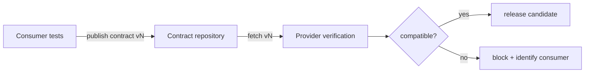
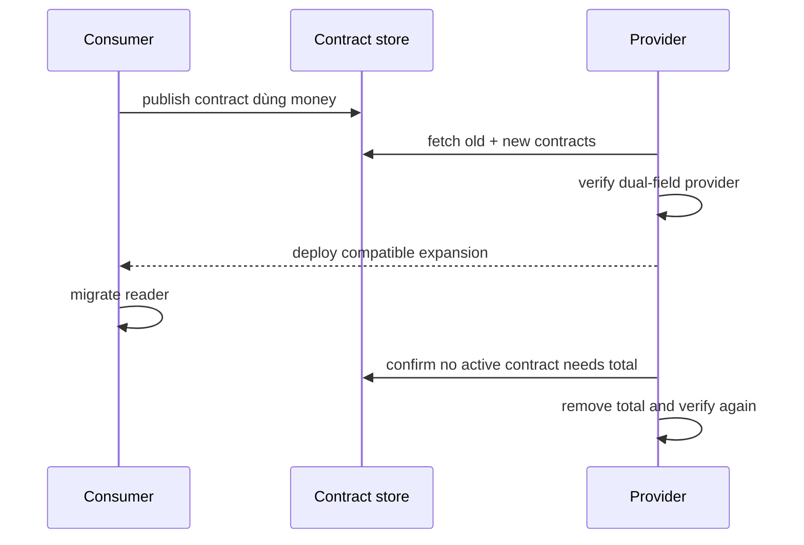

# Kiểm thử hợp đồng giữa producer và consumer

> [!abstract] Câu hỏi trung tâm
> Producer test xanh và consumer test xanh riêng rẽ vẫn có thể không nói chuyện được với nhau. Contract test phải ghi đúng kỳ vọng mà consumer thật sự dùng, chạy được ở cả hai phía và chặn thay đổi phá vỡ trước khi phiên bản mới đi vào môi trường dùng chung.

## 1. Bài toán hai phía cùng “đúng”

Producer trả:

```json
{"order_id": "O-1", "total": 125.0}
```

Consumer kỳ vọng:

```json
{"id": "O-1", "total": "125.00"}
```

Mỗi bên có unit test xanh theo hiểu biết của mình. Lỗi chỉ xuất hiện tại interaction boundary.

## 2. Contract gồm những gì?

Với HTTP:

- method và path;
- headers cần thiết;
- request body và constraint liên quan;
- status code;
- response headers/body;
- error examples mà consumer xử lý;
- semantic rules không biểu diễn được chỉ bằng schema.

Với message/event:

- channel/topic;
- key và partition-relevant field;
- message envelope;
- payload schema;
- event type/version;
- ordering, duplication và delivery assumptions;
- tombstone/null semantics nếu có.

> [!source-fact]
> Richardson định nghĩa consumer contract test là integration test của provider để xác minh API khớp kỳ vọng consumer; với REST, nó kiểm method, path, headers, request và response shape. *Microservices Patterns*, Chapter 9, PDF 331–332.

## 3. Consumer sở hữu kỳ vọng, producer sở hữu implementation

Consumer viết hoặc phê duyệt interaction examples nó thực sự cần. Producer chạy verification trên implementation hiện tại. Contract artifact đứng giữa hai pipeline.



Producer tự viết “contract” từ response hiện tại chỉ tạo mirror test: nó chứng minh code giống chính nó, không chứng minh consumer dùng được.

## 4. Hai phía đều phải được kiểm

### Consumer-side verification

Contract cấu hình stub/mock server. Consumer client gửi request thật qua serializer của nó và phải đọc được response example.

### Provider-side verification

Contract tạo request với provider endpoint thật ở component scope. Response được match theo rule của contract.

> [!source-fact]
> Richardson mô tả contract vừa cấu hình HTTP stub cho consumer, vừa sinh provider-side test; kiểm cả hai phía xác nhận chúng đồng ý về API. *Microservices Patterns*, Chapters 9–10, PDF 333–335 và 353–360.

## 5. Contract test không làm gì

Nó không tự chứng minh:

- business calculation đúng;
- mọi input hợp lệ đã được phủ;
- performance/SLO đạt;
- authorization policy đầy đủ;
- producer deploy được;
- consumer sử dụng field với đúng meaning;
- toàn bộ hệ thống chạy end-to-end.

Contract test bổ sung unit, integration và một số E2E; không thay tất cả.

## 6. Schema compatibility khác interaction compatibility

Schema checker có thể xác nhận field/type theo rule. Interaction contract còn chứa example request, status, header và consumer usage. Cả hai vẫn có thể bỏ sót semantic change.

Ví dụ field `total` giữ type number nhưng đổi từ gross sang net. Schema và shape đều pass, còn meaning đã vỡ. Cần semantic invariant hoặc domain-level acceptance test.

## 7. Compatibility được định nghĩa bằng consumer observation

Hai phiên bản provider tương thích khi client hiện có tiếp tục hoạt động theo contract đã công bố.

> [!source-fact]
> Geewax định nghĩa compatibility theo việc có thể thay server version mà client hiện hữu không ngừng hoạt động, đồng thời nhấn mạnh policy phụ thuộc kỳ vọng user. *API Design Patterns*, Chapter 24, PDF 643–648.

Điều này loại bỏ các luật tuyệt đối kiểu “thêm luôn an toàn, xóa luôn nguy hiểm”. Policy vẫn cần test trên consumer thực tế.

## 8. Ba thay đổi bắt buộc của DE-L094

### A. Thêm field tùy chọn

Kỳ vọng thường gặp: tương thích nếu consumer bỏ qua field lạ. Nhưng có ngoại lệ:

- strict decoder từ chối unknown field;
- snapshot equality đòi object đúng từng field;
- payload tăng vượt giới hạn memory/bandwidth;
- field mới thay đổi resource lifecycle;
- field “optional” nhưng semantics khiến consumer phải xử lý.

> [!source-fact]
> Geewax nêu thêm field có thể làm client giới hạn bộ nhớ hỏng và nhấn mạnh compatibility policy phải dựa vào user profile. *API Design Patterns*, Chapter 24, PDF 648–651.

### B. Xóa field bắt buộc

Breaking nếu consumer đọc field đó. Provider verification phải fail với tên consumer và interaction.

### C. Đổi type

`number` sang `string` thường breaking, kể cả giá trị nhìn giống nhau. Coercion âm thầm có thể làm lỗi đi xa hơn boundary.

## 9. Consumer-driven không có nghĩa consumer muốn gì cũng được

Producer review contract để tránh:

- đóng băng implementation detail;
- match toàn bộ payload khi consumer chỉ dùng hai field;
- yêu cầu timestamp/ID cụ thể không thuộc semantics;
- biến accidental behavior thành API;
- tạo contract mâu thuẫn giữa các consumer.

Contract là điểm bắt đầu conversation, không phải cách consumer chiếm quyền thiết kế API.

> [!source-fact]
> Newman xem consumer-driven contracts vừa là kiểm thử vừa là cách làm explicit cuộc trao đổi giữa các team; producer và consumer nên cộng tác khi tạo expectation. *Building Microservices*, Chapter 9, PDF 369–372.

## 10. Matching rule đủ chặt nhưng không brittle

| Dữ liệu | Matcher phù hợp | Matcher dễ vỡ |
|---|---|---|
| `order_id` | string theo pattern/semantic ID | đúng `O-123` duy nhất |
| `total` | decimal/number với scale contract | snapshot toàn JSON |
| timestamp | RFC 3339 + timezone rule | timestamp hiện tại cụ thể |
| array order | ordered chỉ khi contract hứa | luôn ordered vì fixture tình cờ vậy |
| optional field | absent hoặc valid value | bắt luôn có mặt |
| error code | stable machine code | match nguyên message cho người đọc |

## 11. Contract artifact cần identity

Metadata tối thiểu:

```text
contract_id
consumer_name + consumer_version
provider_name + provider_version
interaction_name
schema/protocol version
created_at
source commit
verification result + timestamp
content SHA-256
```

Không dùng file `latest.json` không version làm bằng chứng release.

## 12. Pipeline gate

Một release candidate của provider chỉ được đi tiếp khi:

1. lấy tập contract của consumer đang production;
2. lấy thêm contract của consumer candidate nếu policy yêu cầu;
3. verify tất cả trên cùng provider artifact;
4. ghi kết quả theo cặp version;
5. không có pending breaking change chưa có migration plan;
6. artifact deploy đúng artifact đã verify.

Broker giúp lưu version và verification matrix, nhưng broker không tự tạo governance đúng.

## 13. Quy trình thay đổi phá vỡ hai giai đoạn

Giả sử đổi `total` từ number sang object `{amount, currency}`.

### Giai đoạn mở rộng

1. producer thêm `money` và vẫn giữ `total`;
2. consumer contract mới chấp nhận/đọc `money`;
3. provider verify contract cũ và mới;
4. deploy producer tương thích;
5. deploy từng consumer dùng field mới;
6. quan sát usage của field cũ.

### Giai đoạn thu hẹp

7. xác nhận không consumer active còn contract cần `total`;
8. công bố deprecation deadline;
9. xóa `total` khỏi provider candidate;
10. verify toàn bộ active contracts;
11. release và giữ rollback compatibility theo policy.



## 14. Thay đổi tương thích vẫn cần policy

Geewax chỉ ra compatibility không có một đáp án chung. Các chiều cần quyết định:

- strict hay tolerant reader;
- new field/resource có được thêm trong version hiện tại không;
- bug fix làm output đổi có được coi compatible không;
- latency change có làm programming model đổi không;
- semantic change được version hóa thế nào;
- deprecation window dài bao lâu;
- consumer nào được tính là active.

SemVer không cứu được contract thiếu policy. Major/minor/patch chỉ có nghĩa sau khi tổ chức định nghĩa breaking/compatible.

## 15. HTTP và event contract khác nhau ở đâu?

| Khía cạnh | HTTP | Event/stream |
|---|---|---|
| Interaction | request/response tức thời | publish rồi nhiều consumer đọc sau |
| Compatibility window | client/server versions đang chạy | cả event cũ trong retention/replay |
| Failure feedback | response trực tiếp | thường trễ, qua DLQ/lag |
| Contract cần thêm | method/path/status/header | topic/key/order/delivery/retention |
| Migration | dual endpoint/field | dual-read/write, event upcast hoặc new type |

Với event, verify schema mới trên consumer hiện tại chưa đủ; phải thử replay event cũ theo retention policy.

## 16. Negative contracts và error path

Happy-path contract bỏ sót phần dễ lệch nhất. Cần examples cho:

- validation failure;
- not found;
- conflict/idempotency replay;
- unauthorized/forbidden;
- rate limit;
- dependency unavailable nếu public contract lộ trạng thái này;
- malformed message hoặc unsupported version.

Error code phải ổn định cho máy đọc; message cho người đọc có thể thay đổi.

## 17. False confidence thường gặp

### Provider test từ OpenAPI xanh

Có thể response hợp schema nhưng consumer serializer vẫn không đọc được hoặc semantics lệch.

### Consumer test với hand-written stub xanh

Stub có thể khác provider. Stub phải sinh hoặc verify từ cùng contract artifact.

### Contract test xanh nhưng production vỡ

Khả năng còn lại: config, auth, routing, TLS, performance, data state hoặc contract coverage thiếu.

### Mọi consumer contract xanh nhưng không thể xóa field

Có consumer không đăng ký, contract stale hoặc consumer production version không được đưa vào matrix.

## 18. Bằng chứng cho DE-L094

Nộp:

1. producer và consumer source/version;
2. ít nhất một contract happy path và hai error paths;
3. consumer-side verification result;
4. provider-side verification result;
5. compatibility matrix cho ba thay đổi;
6. log chứng minh optional-field case pass theo policy;
7. failure chứng minh remove/type-change bị chặn;
8. commit sequence của migration hai giai đoạn;
9. active-consumer inventory;
10. final verification matrix và artifact hashes.

## 19. Ma trận ba thay đổi

| Thay đổi | Kỳ vọng policy mẫu | Consumer verify | Provider verify | Release |
|---|---|---|---|---|
| thêm optional `note` | compatible nếu reader tolerant | pass | pass | cho phép |
| xóa required `order_id` | breaking | contract không đổi | fail | chặn |
| đổi `total` number → string | breaking | có thể fail decode | fail matcher | chặn |

Policy mẫu phải được thay nếu consumer thực dùng strict decoder hoặc payload limit khác.

## 20. Ma trận chấm

| Tiêu chí | Đạt | Không đạt |
|---|---|---|
| Ownership | expectation xuất phát từ consumer và được producer review | producer tự snapshot response |
| Two-sided proof | cả client serializer và provider endpoint được chạy | chỉ validate schema tĩnh |
| CI integration | breaking change chặn trước release | report chỉ để tham khảo |
| Version lineage | contract gắn consumer/provider version và hash | file latest không identity |
| Migration | expand, migrate, observe, contract | xóa trước rồi báo consumer |
| Semantics | có policy và semantic cases | coi shape pass là đủ |

## 21. Ngộ nhận thường gặp

- “OpenAPI chính là contract test”: spec là input; test phải chạy behavior hai phía.
- “Thêm field luôn tương thích”: strict decoder, memory và semantics có thể phá vỡ.
- “CDC thay E2E”: CDC giảm một nhóm E2E nhưng không kiểm deploy/config toàn tuyến.
- “Producer quyết định contract”: producer quyết định API, nhưng consumer phải khai báo phần nó dựa vào.
- “Contract càng match nhiều càng an toàn”: over-specification đóng băng accidental detail.
- “Version mới giải quyết breaking change”: consumer vẫn cần migration và deprecation window.

## 22. Câu hỏi tự kiểm tra

1. Vì sao unit test xanh hai phía vẫn chưa đủ?
2. Contract artifact được dùng khác nhau ở consumer và provider ra sao?
3. Contract test không chứng minh phần nào của business logic?
4. Vì sao thêm optional field có thể breaking?
5. Shape compatibility và semantic compatibility khác nhau thế nào?
6. Active-consumer inventory quyết định contraction ra sao?
7. Hai giai đoạn expand/contract gồm các bước nào?
8. Event contract cần thêm điều gì so với HTTP?
9. Matcher nào tránh brittle nhưng vẫn bảo vệ semantics?
10. Bằng chứng nào cho thấy breaking change bị chặn trước deploy?

> [!synthesis]
> Bộ ba thay đổi bắt buộc, evidence pack và scoring matrix là phép kiểm tổng hợp cho DE-L094. Các nguồn cung cấp contract-testing và compatibility semantics; rubric cụ thể thuộc thiết kế giáo trình này.

## Source coverage

| Source slice | Nội dung phải giữ | Vị trí trong note | Trạng thái |
|---|---|---|---|
| [[SRC-RICHARDSON-MICROSERVICES-PATTERNS-1E]], pp. 331–335, 353–360 | consumer-driven contract và pipeline hai phía | §§1–5, 11–13 | Đã trình bày consumer/provider ownership và verification |
| [[SRC-NEWMAN-BUILDING-MICROSERVICES-2E]], Ch. 9 pp. 369–372 | contract test so với E2E và breaking-change detection | §§5, 12, 17 | Đã trình bày phạm vi chứng minh và false confidence |
| [[SRC-GEEWAX-API-DESIGN-PATTERNS-1E]], Ch. 24 pp. 642–680 | compatibility, versioning và evolution | §§6–10, 13–16 | Đã trình bày schema/semantic compatibility và two-stage change |
| Tổng hợp bài DE-L094 | ba thay đổi, negative contract, evidence pack và scoring matrix | §§8, 16, 18–20 | Đã trình bày như synthesis; không tuyên bố contract pass chứng minh business correctness |

Registry/broker behavior và matching DSL phụ thuộc tool. Note giữ identity, matching semantics và pipeline gate ở mức chuyển giao được.

## Key takeaways
- Contract test nối expectation của consumer với verification trên provider implementation.
- Cả consumer serializer và provider endpoint phải chạy từ cùng contract artifact.
- Contract test tập trung vào interaction boundary, không thay business test hay E2E smoke.
- Compatibility là promise cho consumer cụ thể; thêm field cũng cần policy và test.
- Breaking change được di trú bằng expand–migrate–observe–contract, không đổi một bước.
- Release evidence cần version và checksum của contract, consumer, provider và verification result.

## 24. Giới hạn

- Ví dụ chưa cài bằng Pact hoặc Spring Cloud Contract; tool choice được để mở.
- Compatibility matrix là policy mẫu, chưa được domain/API owner phê duyệt.
- Chưa kiểm contract discovery cho consumer không đăng ký.
- Event replay, schema registry và upcasting mới được giới thiệu, chưa triển khai.
- Ba nguồn tập trung vào service/API; database schema contract cần note riêng ở module sau.

## 25. Liên kết chương trình

- Tiền đề: [[Test Strategy and Test Double Placement|Chiến lược kiểm thử và vị trí đặt test double]].
- Bài áp dụng: `DE-L094`.
- Bài sau dùng contract suite làm safety net khi refactor: `DE-L095`.

## Reference
1. [[SRC-RICHARDSON-MICROSERVICES-PATTERNS-1E]] — Chris Richardson, *Microservices Patterns*, Chapters 9–10, PDF 331–335 và 353–360.
2. [[SRC-NEWMAN-BUILDING-MICROSERVICES-2E]] — Sam Newman, *Building Microservices*, Second Edition, Chapter 9, PDF 369–372.
3. [[SRC-GEEWAX-API-DESIGN-PATTERNS-1E]] — JJ Geewax, *API Design Patterns*, Chapter 24, PDF 642–680.

## Lịch sử biên tập

| Ngày | Trạng thái | Thay đổi |
|---|---|---|
| 2026-09-28 | `review` | Đọc 56 trang từ ba nguồn; xây two-sided contract flow, compatibility policy, three-change matrix, two-stage migration và Humanizer tiếng Việt |

<!-- ATOMIC-EXECUTION-CAPSULE:START -->

## Execution capsule — kiểm chứng `wiki.software-engineering.consumer-provider-contract-testing`

> [!important] Phân loại mệnh đề
> Với `wiki.software-engineering.consumer-provider-contract-testing`, sơ đồ, ví dụ và artifact về **Kiểm thử hợp đồng giữa producer và consumer** là **synthesis để kiểm chứng**; chúng không phải trích dẫn hay case nguyên văn của nguồn.

### Tự kiểm tra trước khi tái sử dụng

1. Bạn có thể trả lời `Làm sao chứng minh producer và consumer hiểu cùng một contract, chặn breaking change trước deploy và di trú contract theo hai giai đoạn?` bằng một câu mà không kéo thêm concept thứ hai không?
2. Source locator nào đỡ cho claim, và phần nào chỉ là synthesis trong note?
3. Observation nào khiến bạn dừng, thu hẹp hoặc đảo quyết định?
4. Artifact nào cho phép một reviewer độc lập tái hiện kết quả?

<!-- ATOMIC-EXECUTION-CAPSULE:END -->
