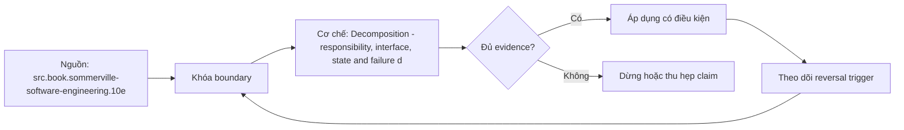

# Decomposition - responsibility, interface, state and failure domain

> [!abstract] Câu hỏi trung tâm
> Làm sao chia một hệ thành các boundary có trách nhiệm, interface, state và failure domain nhất quán?

## 1. Ranh giới bắt đầu từ responsibility

Một component nên có một lý do nghiệp vụ hoặc vận hành rõ để thay đổi. Chia theo controller, service và repository có thể hữu ích cho tổ chức mã nhưng chưa nói ai sở hữu invariant. Nếu cùng quy tắc order bị kiểm ở API, worker và SQL script, responsibility đang bị phân tán.

Cách kiểm thực dụng là đặt một change scenario: đổi policy refund hoặc đổi storage engine thì phần nào phải sửa? Nếu diff lan qua nhiều boundary không liên quan, decomposition chưa cô lập được quyết định volatile.

## 2. Interface là lời hứa tối thiểu

Interface cần nêu operation, input/output semantics, error contract và invariants mà caller được dựa vào. Nó không nên lộ ORM entity, table layout hoặc exception của driver nếu những thứ đó không thuộc domain contract. Public surface càng rộng thì số assumption bên ngoài càng nhiều.

Một abstraction rò rỉ khi caller vẫn phải biết chi tiết bị tuyên bố là đã che. Ví dụ repository trả SQLAlchemy Session buộc domain biết transaction mechanism. Không phải mọi leak đều tránh được, nhưng leak phải được gọi tên và kiểm soát thay vì ẩn dưới một interface đẹp.

> [!synthesis]
> Phần này ghép contract của roadmap DE-L002 với các lát nguồn đã khai báo. Mọi threshold và tình huống cụ thể là thiết kế giáo trình, không phải lời trích nguyên văn của tác giả.

## 3. State quyết định độ khó thay thế

Stateless function dễ nhân bản vì kết quả chỉ phụ thuộc input. Component giữ state cần nói state nào là authoritative, lifecycle ra sao, ai được mutate và phục hồi thế nào. Cache, checkpoint và dedup ledger là ba state có semantics khác nhau; gom chúng vào một hộp ‘storage’ che mất recovery contract.

Invariant phải sống gần owner của state. Nếu hai component cùng có quyền cập nhật một state machine mà không có protocol, failure giữa hai write tạo trạng thái trung gian. Decomposition cần làm rõ transaction boundary hoặc compensation, không chỉ vẽ mũi tên gọi hàm.

## 4. Failure domain không đồng nghĩa deployment unit

Failure domain trả lời một phần hỏng kéo theo phần nào mất chức năng hoặc mất dữ liệu. Hai module cùng process có thể lỗi độc lập ở semantics nhưng crash cùng process. Hai service khác nhau vẫn có chung failure domain nếu đều phụ thuộc một database hoặc credential.

Hãy trace từ fault tới consumer harm: timeout, retry, queue growth, stale output và recovery. Boundary tốt giúp khoanh blast radius hoặc ít nhất làm nó quan sát được. Tách service mà không tách dependency và state đôi khi chỉ tăng network failure mà không giảm blast radius.

## 5. Cohesion, coupling và chiều phụ thuộc

Cohesion hỏi code bên trong có phục vụ cùng capability; coupling hỏi boundary này đặt assumption gì lên boundary kia; dependency direction hỏi policy có biết mechanism hay ngược lại. Ba khái niệm liên quan nhưng một biểu đồ import không chứng minh đủ runtime, temporal và data coupling.

Orthogonality là phép thử thay đổi: thay một quyết định thì bao nhiêu module không liên quan bị chạm. Đây là heuristic chẩn đoán, không phải mục tiêu tuyệt đối. Một contract ổn định vẫn tạo coupling có chủ ý; vấn đề là coupling có được công bố, version và kiểm thử hay không.

## 6. Đồ thị phụ thuộc và vòng lặp

Một vòng A→B→C→A khiến không boundary nào đứng độc lập để kiểm thử hoặc thay thế. Phá vòng bằng cách chuyển policy về owner, tách protocol hoặc đảo dependency qua port. Không nên tạo package ‘common’ chỉ để giấu vòng; shared package vẫn là một node có ownership và release contract.

Sau khi vẽ source graph, bổ sung data owner, runtime call và failure dependency. Một cạnh phải ghi assumption cụ thể: schema, ordering, availability hay identity. Danh sách cạnh có ý nghĩa hơn số lượng hộp vì nó cho biết điều gì thực sự phải phối hợp khi thay đổi.

## 7. Tình huống xuyên suốt

Hệ bán hàng được chia thành order policy, payment adapter, inventory adapter và fulfillment workflow. Order policy sở hữu state transition; adapters cài port do application sở hữu; workflow điều phối nhưng không cập nhật trực tiếp bảng của adapters. Nhóm inject payment timeout và chứng minh order vẫn ở trạng thái recoverable trong khi catalog read tiếp tục phục vụ.

Tình huống của `wiki.engineering-foundation.decomposition-four-axes` phải được chạy trong sandbox hoặc fixture có version. Nếu chưa chạy, các kết quả mong đợi chỉ là protocol đánh giá; không được ghi thành observation. Người học giữ input, command, state trước–sau, raw output và một oracle độc lập đủ để reviewer tái hiện câu hỏi riêng của bài `Decomposition - responsibility, interface, state and failure domain`.

## 8. Failure modes và ngộ nhận

- **Failure mode.** Chia theo công nghệ rồi gọi đó là domain boundary. Cần đưa một counterexample nhỏ nhất để chứng minh hậu quả, sau đó ghi owner và cách phục hồi thay vì chỉ sửa câu chữ.

- **Failure mode.** Vẽ component nhưng không ghi state owner hoặc invariant. Cần đưa một counterexample nhỏ nhất để chứng minh hậu quả, sau đó ghi owner và cách phục hồi thay vì chỉ sửa câu chữ.

- **Failure mode.** Chỉ đọc import graph rồi kết luận không có coupling. Cần đưa một counterexample nhỏ nhất để chứng minh hậu quả, sau đó ghi owner và cách phục hồi thay vì chỉ sửa câu chữ.

- **Failure mode.** Tách deployment nhưng giữ shared database và shared credential nên failure domain không đổi. Cần đưa một counterexample nhỏ nhất để chứng minh hậu quả, sau đó ghi owner và cách phục hồi thay vì chỉ sửa câu chữ.

## 9. Ma trận kiểm chứng

Mỗi probe dưới đây bắt đầu bằng dự đoán viết trước. Kết quả đạt chỉ được ghi khi artifact thực tế khớp oracle; exit code thành công không thay thế kiểm tra semantics.

### 9.1. Đổi database không buộc domain model import type mới.

**Mệnh đề.** Đổi database không buộc domain model import type mới.

**Thiết kế phép thử cho `wiki.engineering-foundation.decomposition-four-axes`.** Tạo positive control và một boundary hoặc changed-constraint case chỉ khác đúng biến cần kiểm. Khóa fixture, phiên bản, identity và state ban đầu; ghi expected result trước khi chạy.

**Bằng chứng.** Giữ command, raw output, state transition và reconciliation với oracle không dùng chung assumption. Nếu evidence không phân biệt được mệnh đề đúng và sai, probe chưa có giá trị quyết định.

### 9.2. Kill payment adapter không làm mất order intent.

**Mệnh đề.** Kill payment adapter không làm mất order intent.

**Thiết kế phép thử cho `wiki.engineering-foundation.decomposition-four-axes`.** Tạo positive control và một boundary hoặc changed-constraint case chỉ khác đúng biến cần kiểm. Khóa fixture, phiên bản, identity và state ban đầu; ghi expected result trước khi chạy.

**Bằng chứng.** Giữ command, raw output, state transition và reconciliation với oracle không dùng chung assumption. Nếu evidence không phân biệt được mệnh đề đúng và sai, probe chưa có giá trị quyết định.

### 9.3. Một state transition chỉ có một authoritative writer.

**Mệnh đề.** Một state transition chỉ có một authoritative writer.

**Thiết kế phép thử cho `wiki.engineering-foundation.decomposition-four-axes`.** Tạo positive control và một boundary hoặc changed-constraint case chỉ khác đúng biến cần kiểm. Khóa fixture, phiên bản, identity và state ban đầu; ghi expected result trước khi chạy.

**Bằng chứng.** Giữ command, raw output, state transition và reconciliation với oracle không dùng chung assumption. Nếu evidence không phân biệt được mệnh đề đúng và sai, probe chưa có giá trị quyết định.

### 9.4. Mỗi public field đều gắn với một consumer assumption hợp lệ.

**Mệnh đề.** Mỗi public field đều gắn với một consumer assumption hợp lệ.

**Thiết kế phép thử cho `wiki.engineering-foundation.decomposition-four-axes`.** Tạo positive control và một boundary hoặc changed-constraint case chỉ khác đúng biến cần kiểm. Khóa fixture, phiên bản, identity và state ban đầu; ghi expected result trước khi chạy.

**Bằng chứng.** Giữ command, raw output, state transition và reconciliation với oracle không dùng chung assumption. Nếu evidence không phân biệt được mệnh đề đúng và sai, probe chưa có giá trị quyết định.

### 9.5. Đồ thị source dependency không có vòng.

**Mệnh đề.** Đồ thị source dependency không có vòng.

**Thiết kế phép thử cho `wiki.engineering-foundation.decomposition-four-axes`.** Tạo positive control và một boundary hoặc changed-constraint case chỉ khác đúng biến cần kiểm. Khóa fixture, phiên bản, identity và state ban đầu; ghi expected result trước khi chạy.

**Bằng chứng.** Giữ command, raw output, state transition và reconciliation với oracle không dùng chung assumption. Nếu evidence không phân biệt được mệnh đề đúng và sai, probe chưa có giá trị quyết định.

### 9.6. Changed-requirement exercise chạm đúng owner và test contract.

**Mệnh đề.** Changed-requirement exercise chạm đúng owner và test contract.

**Thiết kế phép thử cho `wiki.engineering-foundation.decomposition-four-axes`.** Tạo positive control và một boundary hoặc changed-constraint case chỉ khác đúng biến cần kiểm. Khóa fixture, phiên bản, identity và state ban đầu; ghi expected result trước khi chạy.

**Bằng chứng.** Giữ command, raw output, state transition và reconciliation với oracle không dùng chung assumption. Nếu evidence không phân biệt được mệnh đề đúng và sai, probe chưa có giá trị quyết định.

## 10. Câu hỏi tự kiểm tra

1. Boundary nào làm mệnh đề trung tâm không còn đúng?
2. Artifact nào là nguồn thẩm quyền và artifact nào chỉ là tín hiệu?
3. Counterexample nhỏ nhất cần những state nào?
4. Một kiểm tra xanh giả có thể xuất hiện theo đường nào?
5. Constraint nào khiến quyết định phải đảo?
6. Phần nào hiện mới là protocol, chưa phải observation?

## 11. Giới hạn và điều chưa cho phép kết luận

- Nội dung là giáo trình và expected evidence; không tuyên bố đã kiểm chứng trên production.
- Hành vi phụ thuộc phiên bản phải được chạy lại với version ghi trong evidence package.
- Threshold, case study và decision rule tổng hợp cho curriculum không được gán nguyên văn cho nguồn.
- Note giữ trạng thái `review` cho tới khi owner duyệt semantics và learner artifact.

## Reference
1. [[SRC-SOMMERVILLE-SOFTWARE-ENGINEERING-10E]]
2. [[SRC-HUNT-THOMAS-PRAGMATIC-PROGRAMMER-20AE]]

## Source coverage

| Source slice | Locator | Kiến thức phải giữ | Vị trí | Trạng thái | Ngoài phạm vi |
|---|---|---|---|---|---|
| [[SRC-SOMMERVILLE-SOFTWARE-ENGINEERING-10E]] — `src.book.sommerville-software-engineering.10e` | Chapter 4 PDF 103–132; Chapter 7 PDF 169–212 | requirement validation, interface, decomposition và information hiding | §§1–9 | Đã phủ | Nội dung ngoài objective DE-L002 |
| [[SRC-HUNT-THOMAS-PRAGMATIC-PROGRAMMER-20AE]] — `src.book.hunt-thomas-pragmatic-programmer.20ae` | Topic 10 PDF 76–83 | orthogonality, change isolation và decision discipline | §§1–9 | Đã phủ | Nội dung ngoài objective DE-L002 |

## Key takeaways
- Decomposition có giá trị khi cô lập decision, state và failure; số lượng component tự nó không chứng minh điều đó.
- Một kết luận chỉ có giá trị trong scope, version và state đã ghi.
- Counterexample và changed-constraint test mạnh hơn việc lặp lại định nghĩa.
- Trước khi lab chạy, note này đã có provenance và protocol nhưng chưa phải chứng nhận production.

<!-- ATOMIC-EXECUTION-CAPSULE:START -->

## Execution capsule — kiểm chứng `wiki.engineering-foundation.decomposition-four-axes`

> [!important] Phân loại mệnh đề
> Với `wiki.engineering-foundation.decomposition-four-axes`, sơ đồ, ví dụ và artifact về **Decomposition - responsibility, interface, state and failure domain** là **synthesis để kiểm chứng**; chúng không phải trích dẫn hay case nguyên văn của nguồn.

### Sơ đồ cơ chế và điểm kiểm soát



Đọc sơ đồ `wiki.engineering-foundation.decomposition-four-axes` từ trái sang phải: source chỉ cung cấp claim ban đầu cho **Decomposition - responsibility, interface, state and failure domain**; quyết định chỉ được đi tiếp sau khi boundary, evidence và điều kiện đảo quyết định đã hiện hữu.

### Artifact thực thi tối thiểu

```python
from dataclasses import dataclass

@dataclass(frozen=True)
class WikiEngineeringFoundationDecompositionFourAEvidence:
    boundary_declared: bool
    independent_oracle: bool
    reversal_trigger: str

    def accepted(self) -> bool:
        return (
            self.boundary_declared
            and self.independent_oracle
            and bool(self.reversal_trigger.strip())
        )

# Concept: Decomposition - responsibility, interface, state and failure domain
# Primary question: Làm sao chia một hệ thành các boundary có trách nhiệm, interface, state và failure domain nhất quán?
evidence = WikiEngineeringFoundationDecompositionFourAEvidence(
    boundary_declared=True,
    independent_oracle=True,
    reversal_trigger="Đảo quyết định khi hard constraint bị vi phạm",
)
assert evidence.accepted()
```

Artifact của `wiki.engineering-foundation.decomposition-four-axes` buộc người dùng ghi boundary, oracle và reversal trigger cho **Decomposition - responsibility, interface, state and failure domain**. Các giá trị minh họa phải được thay bằng evidence thật trước khi dùng cho quyết định.

### Tự kiểm tra trước khi tái sử dụng

1. Bạn có thể trả lời `Làm sao chia một hệ thành các boundary có trách nhiệm, interface, state và failure domain nhất quán?` bằng một câu mà không kéo thêm concept thứ hai không?
2. Source locator nào đỡ cho claim, và phần nào chỉ là synthesis trong note?
3. Observation nào khiến bạn dừng, thu hẹp hoặc đảo quyết định?
4. Artifact nào cho phép một reviewer độc lập tái hiện kết quả?

<!-- ATOMIC-EXECUTION-CAPSULE:END -->
