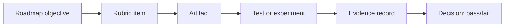

# Dự án delivery: modular package có đường phát hành

> [!abstract] Câu hỏi trung tâm
> Dự án không được nghiệm thu bằng số thư mục hoặc ảnh chụp CI xanh. Mỗi yêu cầu phải dẫn tới artifact, phép thử hoặc số đo có thể chạy lại; hai phép thử cuối phải chứng minh adapter thay được mà core test không đổi và một release lỗi có thể rollback trong hạn.

## 1. Phạm vi sản phẩm

Nâng công cụ xử lý dữ liệu đã có thành một sản phẩm deploy được. Sản phẩm tối thiểu có một entry point công khai, một use case chính, storage adapter, dữ liệu kiểm thử, pipeline CI và release artifact.

Không thêm chức năng chỉ để dự án trông lớn. Complexity đến từ chất lượng boundary và đường phát hành, không từ số endpoint.

## 2. Definition of Ready

Trước khi triển khai cần có:

- use case và user-visible outcome;
- input/output/error contract;
- fixture chuẩn cùng expected output;
- repository và lệnh build/test;
- storage adapter hiện tại và adapter thay thế mục tiêu;
- môi trường deploy/rollback cô lập;
- SLO hoặc hạn rollback dùng trong nghiệm thu;
- owner cho architecture, quality gate và release.

Nếu không có fixture hoặc rollback environment, hai acceptance experiment chưa sẵn sàng.

## 3. Cấu trúc tham chiếu

```text
src/
  domain/
  application/
  ports/
  adapters/
    inbound/
    outbound/
  bootstrap/
tests/
  unit/
  integration/
  component/
  contract/
deploy/
  migrations/
  manifests/
docs/
  adr/
  contracts/
  runbooks/
evidence/
```

Cấu trúc này là một khả năng, không phải rubric theo tên thư mục. Rubric kiểm dependency direction, ownership và replaceability thực tế.

## 4. Tám điểm danh mục kiểm

### 4.1 Ba tầng và đồ thị phụ thuộc đúng chiều

Domain không import framework, driver hoặc adapter. Application điều phối use case qua port. Adapter dịch protocol/storage. Composition root nối implementation.

**Bằng chứng:** dependency graph, architecture test và đường dẫn tới composition root.

### 4.2 Hợp đồng bốn phần cho entry point

Mỗi entry point công khai ghi input, output, error và side effect. Contract dùng từ vựng miền, không lộ driver type.

**Bằng chứng:** contract document, schema và example success/failure.

### 4.3 Thiết kế lỗi hai trục

Phân loại expected/defect và transient/permanent; nêu retry, quarantine, stop hoặc translate. Timeout có outcome uncertainty phải được xử lý riêng.

**Bằng chứng:** error taxonomy, decision table và fault-injection report.

### 4.4 Bộ kiểm bốn tầng

Tối thiểu unit, integration, component/contract và end-to-end smoke. Double đặt ngoài scope đang kiểm; không mock internal collaborator chỉ để test dễ.

**Bằng chứng:** test inventory ánh xạ risk → scope → test file.

### 4.5 Consumer-provider contract

Một consumer thật hoặc representative client xuất kỳ vọng; provider verification chạy trong pipeline. Có case thêm field, xóa field bắt buộc và đổi kiểu.

**Bằng chứng:** contract artifact, consumer test và provider verification report.

### 4.6 Bốn loại kiểm tự động và ngưỡng

Formatter, static/type analysis, dependency scan và secret scan. Policy ghi block/warn, owner, exception và expiry. Sinh SBOM gắn artifact.

**Bằng chứng:** pinned config, injection tests, report và policy document.

### 4.7 Artifact bất biến có version

Build một lần, lưu digest, promote cùng artifact. Release manifest nối commit, build, tests, SBOM và migration.

**Bằng chứng:** artifact digest, registry record và release manifest.

### 4.8 Di trú hai giai đoạn đã diễn tập

Thay đổi schema theo expand-migrate-contract; old/new version cùng chạy trong compatibility window. Contract step chỉ thực hiện sau exit criteria.

**Bằng chứng:** migration state log, reconciliation và mixed-version test.

## 5. Evidence ledger

Không ghi đã có test hoặc CI pass chung chung. Mỗi claim có locator và phương pháp tái hiện.

| ID | Claim | Artifact | Reproduce | Expected |
|---|---|---|---|---|
| E1 | core không import adapter | dependency report | `make architecture-test` | zero forbidden edge |
| E2 | output chuẩn đúng | test report | `make test-component` | fixture hash khớp |
| E3 | scanner chặn secret fixture | CI run | injection branch/run ID | secret gate fail |
| E4 | artifact được promote | release manifest | resolve digest ở staging/prod | cùng digest |
| E5 | rollback trong hạn | drill timeline | chạy runbook | recovery ≤ threshold |

Evidence phải chứa version và timestamp. Link tới một thư mục không đủ nếu reviewer vẫn phải đoán file nào chứng minh claim.

## 6. Acceptance experiment A: thay storage adapter

### Mục tiêu

Đổi từ adapter A sang adapter B mà domain/application test không sửa dòng nào. Chỉ wiring, adapter implementation và adapter-specific tests được thay.

### Procedure

1. Chạy baseline với fixture chuẩn, lưu output/schema/error/side-effect ledger.
2. Chụp hash của core tests.
3. Implement adapter B theo output port hiện có.
4. Chạy contract/integration tests của adapter B.
5. Đổi binding ở composition root.
6. Chạy core, component và parity tests.
7. So hash core tests trước-sau.

### Fail conditions

- sửa assertion của core test để hợp adapter mới;
- domain import driver B;
- error driver lọt qua port;
- output giống nhưng transaction/idempotency đổi ngoài contract;
- adapter B chỉ là fake, không chạy dependency thật ở integration scope.

## 7. Acceptance experiment B: deploy lỗi và rollback

### Chuẩn bị

- stable và candidate digest;
- lỗi test có kiểm soát;
- traffic generator có correlation ID;
- metric/alert theo version;
- rollback precondition về schema/data;
- detection, decision và recovery threshold.

### Procedure

1. Deploy canary candidate.
2. Chờ alert thật phát hiện lỗi.
3. Ghi detection time và decision time.
4. Dừng promotion, route về stable hoặc thực hiện runbook đã chọn.
5. Xác nhận user signal và data invariant phục hồi.
6. Ghi request thất bại, in-flight work và side effect trong cửa sổ lỗi.

### Fail conditions

- người thực hiện được báo trước chính xác lúc lỗi thay vì alert;
- rollback dùng image build lại;
- chỉ kiểm replica state, không kiểm business outcome;
- schema candidate đã làm stable binary không đọc được;
- không lưu timeline.

## 8. Architecture Decision Record

ADR chọn monolith, modular monolith hoặc nhiều service dựa trên bằng chứng. Với dự án module này, modular package/monolith thường là baseline hợp lý; nếu chọn service split phải chứng minh data ownership và operational readiness.

ADR gồm context, forces, alternatives, decision, consequences, trigger review và owner. Ba trigger phải đo được theo chuẩn ở [[Monolith Modular Monolith and the Cost of Splitting|Monolith, modular monolith và chi phí tách dịch vụ]].

## 9. Traceability matrix



Không có cạnh từ rubric tới evidence nghĩa là claim chưa chứng minh. Artifact tồn tại nhưng chưa được test cũng chưa đủ.

## 10. Reproducibility package

Nộp kèm:

- lệnh setup có version;
- seed/fixture và checksum;
- lệnh build/test/scan;
- artifact/release manifest;
- migration procedure;
- rollback runbook;
- evidence ledger;
- known limitations.

Một reviewer mới phải chạy được phép thử mà không cần hỏi tác giả về bước ẩn. Secret và credential môi trường không đưa vào package; chỉ mô tả cách cấp.

## 11. Review hai lượt

### Lượt 1: specification compliance

Kiểm đủ tám điểm, hai experiment và ADR. Mỗi claim có evidence. Phần ngoài phạm vi được loại khỏi chấm.

### Lượt 2: artifact quality

Kiểm semantic correctness, boundary, failure handling, security, operability và maintainability. Không cho cấu trúc đẹp che lỗi data consistency hoặc rollback.

## 12. Ma trận chấm

| Hạng mục | Pass | Fail |
|---|---|---|
| Architecture | zero forbidden edge; adapter thay được | layer chỉ là thư mục |
| Contract | bốn phần, có examples/errors | chỉ có function signature |
| Error | taxonomy + injection | catch-all/log-and-continue |
| Tests | risk mapped, real boundary tests | mock internal implementation |
| Contract test | consumer/provider verification | provider tự mirror response |
| Gates | policy + four injections | tool list không có evidence |
| Release | same digest promoted | rebuild per environment |
| Migration | mixed-version + reconcile | one-step breaking DDL |
| Adapter experiment | core tests unchanged | sửa core test |
| Rollback experiment | recovery in threshold + invariant | chỉ deploy lại thành công |

## 13. Failure modes

- over-engineer ba tầng cho code không có boundary thay đổi;
- README nói kiến trúc nhưng import graph vi phạm;
- coverage cao nhờ test implementation detail;
- report scan được tạo nhưng gate không chặn injection;
- release tag mutable;
- migration demo không có concurrent traffic;
- rollback thủ công bằng trí nhớ;
- evidence dùng screenshot không có command/version;
- thay acceptance threshold sau khi thấy kết quả.

## 14. Câu hỏi tự kiểm tra

1. Bằng chứng nào phân biệt modular package thật với ba thư mục trang trí?
2. Vì sao core test hash cần giữ trong adapter replacement experiment?
3. Một scanner report pass nhưng injection không bị chặn cho thấy lỗi gì?
4. Rollback replica thành công nhưng data invariant sai có đạt không?
5. Evidence ledger cần locator và reproduce command để làm gì?

## 15. Giới hạn

- Note là project specification; chưa chạy repository Lesson 32 hoặc môi trường deploy.
- Tám mục không bao phủ mọi yêu cầu production như capacity, DR, compliance và cost.
- Threshold rollback do dự án định trước, không có số chung.
- Một adapter replacement không chứng minh mọi adapter tương lai thay được.
- Test pass không thay owner review cho architecture và risk acceptance.

## 16. Liên kết chương trình

- Tổng hợp DE-L089 đến DE-L099.
- Bài áp dụng: `DE-L100`.
- Bài tiếp theo mở module backend: [[The Request Lifecycle End to End|Vòng đời request từ đầu đến cuối]].

## Reference
1. [[SRC-NEWMAN-BUILDING-MICROSERVICES-2E]]: information hiding, modularity, test scope, pipeline và artifact, PDF 56-77, 257-261, 353-372.
2. [[SRC-HUNT-THOMAS-PRAGMATIC-PROGRAMMER-20AE]]: orthogonality, testing và refactoring, PDF 76-83, 276-280.
3. [[SRC-FORSGREN-HUMBLE-KIM-ACCELERATE-1E]]: continuous delivery capabilities và delivery-performance evidence, PDF 45-51, 74-81, 228-232.
4. [[SRC-SOMMERVILLE-SOFTWARE-ENGINEERING-10E]]: architecture, testing, configuration và quality management.

> [!synthesis]
> Tám điểm checklist, evidence ledger và hai acceptance experiment ghép các nguyên tắc modularity, testing, configuration và continuous delivery thành một project specification. Không tác giả nào công bố nguyên bộ tiêu chí này dưới cùng một tên.

## Source coverage

| Source slice | Nội dung phải giữ | Vị trí trong note | Trạng thái |
|---|---|---|---|
| [[SRC-NEWMAN-BUILDING-MICROSERVICES-2E]], pp. 56-77 | information hiding và modular boundary | §§1-4, 6 | Đã chuyển thành acceptance criteria cho package và adapter |
| [[SRC-NEWMAN-BUILDING-MICROSERVICES-2E]], pp. 257-261, 353-372 | artifact/pipeline và test scope | §§4-7, 9-12 | Đã chuyển thành evidence ledger và release-path test |
| [[SRC-HUNT-THOMAS-PRAGMATIC-PROGRAMMER-20AE]], pp. 76-83, 276-280 | orthogonality, test và refactor discipline | §§3-6, 11 | Đã chuyển thành adapter-replacement experiment và review hai lượt |
| [[SRC-FORSGREN-HUMBLE-KIM-ACCELERATE-1E]], pp. 45-51, 74-81, 228-232 | CD capability và delivery evidence | §§4-7, 10-12 | Đã chuyển thành pipeline, rollback drill và reproducibility package |
| [[SRC-SOMMERVILLE-SOFTWARE-ENGINEERING-10E]], architecture/testing/configuration/quality | architecture decision, verification và configuration management | §§4, 8-10, 12 | Đã chuyển thành ADR, traceability matrix và rubric |
| Tổng hợp bài DE-L100 | tám điểm checklist, hai acceptance experiment và evidence package | §§4-12 | Toàn bộ note là project specification; không tuyên bố dự án đã được thực thi |

Note này quy định đầu ra và cách nghiệm thu, không thay note lý thuyết L089-L099. Implementation cụ thể chỉ được công nhận khi evidence ledger chứa command, commit và kết quả thật.

## Key takeaways
- Mỗi rubric item phải dẫn tới artifact và phép kiểm tái hiện được.
- Hai acceptance experiments kiểm replaceability và recoverability, không kiểm hình thức thư mục.
- Cùng artifact digest phải đi qua các environment.
- Project chỉ đạt khi tám claim có evidence và cả hai experiment qua threshold đã đặt trước.

<!-- ATOMIC-EXECUTION-CAPSULE:START -->

## Execution capsule: kiểm chứng `wiki.software-engineering.delivery-project-modular-package-release-path`

> [!important] Phân loại mệnh đề
> Với `wiki.software-engineering.delivery-project-modular-package-release-path`, sơ đồ, ví dụ và artifact về **Dự án delivery: modular package có đường phát hành** là **synthesis để kiểm chứng**; chúng không phải trích dẫn hay case nguyên văn của nguồn.

### Ví dụ làm việc có thể bác bỏ

**Input.** Một đội cần trả lời: Một sản phẩm mô-đun có đường phát hành cần những artifact và phép thử nào để chứng minh kiến trúc, chất lượng và khả năng rollback? cho một phạm vi nhỏ, có owner và deadline rõ.

**Decision.** Đội áp dụng **Dự án delivery: modular package có đường phát hành** trên control và variant chỉ khác một assumption; expected result và hard constraints được khóa trước khi chạy.

**Outcome.** Với `wiki.software-engineering.delivery-project-modular-package-release-path`, nếu observation vi phạm hard constraint hoặc oracle độc lập không xác nhận **Dự án delivery: modular package có đường phát hành**, đội thu hẹp claim hay đảo quyết định. Nếu đạt, kết luận vẫn kèm scope, version và review date; một lần thành công không được nâng thành quy luật phổ quát.

### Artifact thực thi tối thiểu

```python
from dataclasses import dataclass

@dataclass(frozen=True)
class WikiSoftwareEngineeringDeliveryProjectModulEvidence:
    boundary_declared: bool
    independent_oracle: bool
    reversal_trigger: str

    def accepted(self) -> bool:
        return (
            self.boundary_declared
            and self.independent_oracle
            and bool(self.reversal_trigger.strip())
        )

# Concept: Dự án delivery: modular package có đường phát hành
# Primary question: Một sản phẩm mô-đun có đường phát hành cần những artifact và phép thử nào để chứng minh kiến trúc, chất lượng và khả năng rollback?
evidence = WikiSoftwareEngineeringDeliveryProjectModulEvidence(
    boundary_declared=True,
    independent_oracle=True,
    reversal_trigger="Đảo quyết định khi hard constraint bị vi phạm",
)
assert evidence.accepted()
```

Artifact của `wiki.software-engineering.delivery-project-modular-package-release-path` buộc người dùng ghi boundary, oracle và reversal trigger cho **Dự án delivery: modular package có đường phát hành**. Các giá trị minh họa phải được thay bằng evidence thật trước khi dùng cho quyết định.

### Tự kiểm tra trước khi tái sử dụng

1. Bạn có thể trả lời `Một sản phẩm mô-đun có đường phát hành cần những artifact và phép thử nào để chứng minh kiến trúc, chất lượng và khả năng rollback?` bằng một câu mà không kéo thêm concept thứ hai không?
2. Source locator nào đỡ cho claim, và phần nào chỉ là synthesis trong note?
3. Observation nào khiến bạn dừng, thu hẹp hoặc đảo quyết định?
4. Artifact nào cho phép một reviewer độc lập tái hiện kết quả?

<!-- ATOMIC-EXECUTION-CAPSULE:END -->
