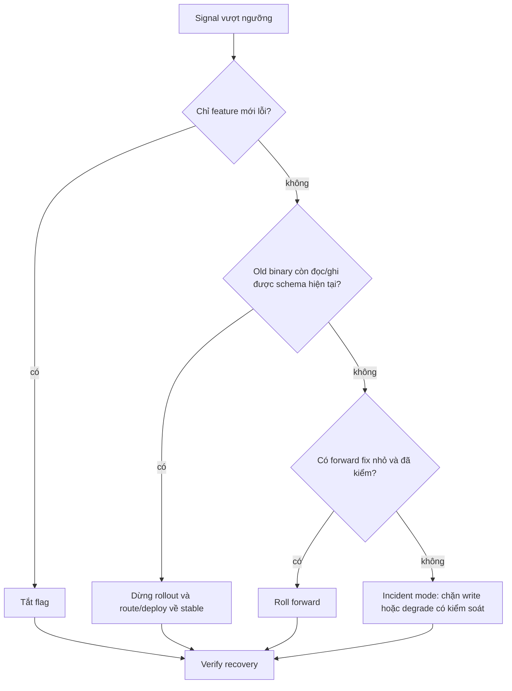

# Chiến lược triển khai và rollback

> [!abstract] Câu hỏi trung tâm
> Chiến lược deployment quyết định blast radius, thời gian phát hiện và đường lùi. Không có lựa chọn “an toàn nhất” tách khỏi observability, capacity, session state và khả năng tương thích dữ liệu.

## 1. Deployment khác release

Deployment đưa code vào môi trường. Release cho user hoặc workload tiếp xúc với capability đó. Feature flag có thể tách hai thời điểm, nhưng flag không thay thế artifact rollback và không giải quyết schema incompatibility.

## 2. Ma trận lựa chọn

| Chiến lược | Hai phiên bản cùng chạy | Capacity phụ | Blast radius ban đầu | Đường lùi |
|---|---:|---:|---:|---|
| Recreate/in-place | không | thấp | toàn bộ | deploy lại; có downtime |
| Rolling | có | vừa | theo batch | reverse rollout nếu compatible |
| Blue-green | có | gần 2× | toàn traffic khi switch | switch route về blue |
| Canary | có | nhỏ lúc đầu | cohort nhỏ | dừng mở rộng, route về stable |
| Feature flag | cùng binary hoặc nhiều binary | tùy | theo user/tenant | tắt flag; code vẫn đã deploy |

Blue-green lùi nhanh ở routing layer nhưng không tự đảo database write đã xảy ra. Canary giảm blast radius chỉ khi cohort đại diện và signal phát hiện được lỗi.

> [!source-fact]
> Newman trình bày feature toggle, canary, blue-green và parallel run như các kỹ thuật tách deployment khỏi release và kiểm soát blast radius. *Building Microservices*, 2e, PDF 342–347.

## 3. Recreate và rolling

**Recreate** phù hợp khi downtime được chấp nhận, state được bảo toàn ngoài process và khởi động lại đủ nhanh. Nó không phù hợp với SLO zero-downtime.

**Rolling** thay từng nhóm instance. Các điều kiện:

- load balancer chỉ gửi traffic sau readiness;
- connection draining đủ dài;
- old/new protocol và schema tương thích;
- capacity còn lại chịu được tải trong rollout;
- `maxUnavailable` và `maxSurge` phù hợp resource budget.

Một rollout “đã hoàn tất” ở orchestrator chưa chứng minh request đúng về semantic.

## 4. Blue-green

Blue giữ phiên bản ổn định, green chạy candidate. Quy trình:

1. deploy green bằng cùng artifact manifest;
2. smoke test và warm cache;
3. mirror hoặc synthetic traffic nếu được;
4. chuyển route;
5. quan sát trong cửa sổ đã định;
6. giữ blue đủ lâu để lùi;
7. chỉ giải phóng blue khi exit criteria đạt.

Rủi ro: chi phí gần gấp đôi, connection dài không chuyển ngay, queue consumer có thể nhận trùng, và cả hai màu vẫn chia sẻ database nên migration phá vỡ làm mất đường lùi.

## 5. Canary

Canary rollout theo các nấc, ví dụ 1% → 5% → 25% → 50% → 100%. Mỗi nấc cần:

- thời lượng tối thiểu hoặc số request tối thiểu;
- success/error/latency signal theo version;
- business invariant như duplicate order hoặc row-count mismatch;
- automatic abort threshold;
- cohort routing ổn định nếu session/user state quan trọng.

Không chọn canary khi không tách telemetry theo version. Error rate gộp có thể che lỗi 100% trong cohort 1%.

> [!source-fact]
> Lukša mô tả rolling update, blue-green, canary và rollback revision trong Kubernetes. Cơ chế vẫn hữu ích, nhưng API/câu lệnh trong ấn bản 2018 phải đối chiếu tài liệu Kubernetes hiện hành trước khi dùng. *Kubernetes in Action*, Chapter 9, PDF 282–307.

## 6. Feature flag

Flag phù hợp để bật capability có thể cô lập theo request/user. Mỗi flag cần:

- owner;
- default và fail-safe value;
- target population;
- metric của nhánh on/off;
- expiry/removal date;
- test cho cả hai trạng thái trong thời gian coexistence.

Flag không phù hợp để che migration database không tương thích. Flag lâu ngày tạo hai đường code và tăng state space kiểm thử.

## 7. Cây quyết định rollback



Rollback không phải luôn là đáp án. Khi dữ liệu đã được writer mới ghi theo format cũ không hiểu, roll forward có thể ít nguy hiểm hơn. Quyết định phải có owner và time budget trước rollout.

## 8. Rollback drill đo được

Một diễn tập tối thiểu:

1. ghi release ID, stable digest và candidate digest;
2. khởi chạy tải có request ID;
3. deploy candidate chứa lỗi test có kiểm soát;
4. phát hiện bằng alert thật, không báo miệng;
5. ghi `detection_time`, `decision_time`, `rollback_start`, `recovery_time`;
6. rollback theo runbook;
7. xác minh error rate, latency và business invariant trở về baseline;
8. kiểm tra request đang bay, queue và dữ liệu viết trong khoảng lỗi;
9. lưu bằng chứng và action item.

Chỉ đo “kubectl báo rollout complete” là thiếu. Recovery hoàn tất khi user-facing signal và data invariant phục hồi.

## 9. Ba tình huống lựa chọn

| Ràng buộc | Lựa chọn hợp lý | Lý do |
|---|---|---|
| dịch vụ nội bộ, downtime 10 phút được phép, capacity sát trần | recreate | đơn giản; không đủ capacity chạy đôi |
| API quan trọng, đủ 2× capacity, switch route nhanh, DB compatible | blue-green | rollback routing nhanh |
| user-facing, telemetry theo version tốt, lỗi có thể chỉ xuất hiện ở tải thật | canary | giới hạn blast radius và học theo nấc |

Đây là đáp án theo ràng buộc, không phải ranking cố định.

## 10. Failure modes

- canary nhưng metric không có label version;
- blue-green xóa blue ngay sau switch;
- rolling không drain connection;
- rollback binary sau migration một chiều;
- feature flag không owner hoặc ngày xóa;
- runbook chưa từng chạy;
- alert chỉ nhìn hạ tầng, bỏ business invariant.

## 11. Deployment là một state machine

Một lần triển khai không chỉ có `started` và `done`. Tối thiểu nên phân biệt:

```text
candidate_created
  -> pre_deploy_checks_passed
  -> instances_starting
  -> ready_for_test_traffic
  -> receiving_limited_traffic
  -> promotion_paused_or_advanced
  -> fully_promoted
  -> stabilized
```

Mỗi transition cần điều kiện vào, signal quan sát, timeout và hành động khi thất bại. Orchestrator báo container `Running` chỉ xác nhận process tồn tại; chưa xác nhận dependency sẵn sàng hay business path đúng.

## 12. Startup, liveness và readiness

- **Startup check** trả lời ứng dụng đã hoàn tất khởi động chưa; tránh liveness giết process đang warm-up.
- **Liveness check** trả lời process có mắc kẹt đến mức cần restart không. Nó nên ít phụ thuộc external service để tránh restart cascade.
- **Readiness check** trả lời instance có nên nhận traffic mới không; có thể phụ thuộc capability bắt buộc như database connection hoặc cache warm-up.

Readiness failure rút instance khỏi routing nhưng không nhất thiết restart. Nếu dùng một endpoint cho cả ba, database outage có thể khiến toàn fleet restart đồng loạt và làm sự cố nặng hơn.

> [!source-fact]
> Tài liệu Kubernetes hiện hành xác nhận startup probe trì hoãn liveness và readiness cho tới khi startup thành công; readiness thất bại làm Pod ngừng nhận traffic qua Service, còn liveness thất bại có thể dẫn tới restart container. Cơ chế này không biến một endpoint health-check duy nhất thành lựa chọn an toàn cho cả ba mục đích. *Kubernetes Documentation*, “Liveness, Readiness, and Startup Probes”, truy cập 2026-09-28.

## 13. Traffic, session và connection dài

Route switch không tức thì cho mọi workload. Cần xét:

- keep-alive connection tiếp tục vào old instance;
- WebSocket/stream kéo dài;
- session affinity giữ user ở một version;
- queue consumer ownership và in-flight message;
- DNS TTL hoặc client-side load balancing;
- connection draining và termination grace period.

Blue-green “switch ngay” chỉ đúng ở control plane. Data plane có thể coexist lâu hơn. Exit criteria phải đo connection cũ còn lại và in-flight work, không chỉ nhìn desired replica count.

## 14. Rolling update và capacity envelope

Giả sử workload cần tối thiểu `N_min` instance để giữ SLO. Với `N` instance hiện có, rollout policy phải đảm bảo số ready không thấp hơn `N_min` sau khi trừ `maxUnavailable`, đồng thời cluster đủ chỗ cho `maxSurge`.

Rolling update thất bại thường do:

- candidate không ready, làm rollout đứng;
- readiness quá nông nên traffic vào sớm;
- surge pod tranh CPU/memory với stable pod;
- schema/protocol không tương thích trong mixed-version window;
- rollback tạo thêm một rollout nhưng dependency state đã đổi.

Đặt progress deadline và giữ event/reason. Không tăng deadline để che startup regression mà không đo nguyên nhân.

> [!source-fact]
> Với Deployment kiểu `RollingUpdate`, Kubernetes dùng `maxUnavailable` để giới hạn số Pod có thể không sẵn sàng và `maxSurge` để giới hạn số Pod tạo thêm. Rollback tạo một revision mới từ Pod template cũ; vì vậy nó không tự đảo dữ liệu hoặc side effect ngoài Pod template. *Kubernetes Documentation*, “Deployments”, truy cập 2026-09-28.

## 15. Blue-green và tài nguyên dùng chung

Hai màu có compute riêng nhưng thường vẫn dùng chung database, queue, object store hoặc third-party API. Vì vậy isolation không hoàn toàn.

Trước switch cần kiểm:

- green dùng additive schema;
- background job không chạy hai lần ngoài chủ đích;
- cache key có version khi representation đổi;
- queue consumer tránh double consumption;
- callback/webhook không gửi từ cả hai màu;
- config và secret của green đúng environment.

Sau switch giữ blue ở trạng thái có thể phục hồi, nhưng ngăn nó tiếp tục chạy scheduled job nếu điều đó gây side effect kép.

## 16. Canary cần thống kê đủ để ra quyết định

Canary 1% với 100 request/phút chỉ có một request/phút; lỗi hiếm có thể không xuất hiện trong cửa sổ ngắn. Gate cần số mẫu tối thiểu và duration bao phủ workload cycle phù hợp.

So sánh canary và control theo:

- error rate và error taxonomy;
- latency distribution, không chỉ average;
- saturation/resource;
- business invariant;
- dependency calls và retry volume;
- cohort composition.

Threshold phải xét baseline variance. Một cảnh báo “p95 tăng 10 ms” không có ý nghĩa nếu noise thường ±30 ms. Ngược lại, business error tuyệt đối bằng 1 có thể phải dừng dù tỷ lệ nhỏ.

## 17. Feature flag taxonomy và debt

Flag release ngắn hạn, experiment flag, permission/entitlement và operational kill switch có lifecycle khác nhau. Không dùng một boolean không owner cho mọi mục đích.

Mỗi flag nên có:

| Trường | Ý nghĩa |
|---|---|
| type | release, experiment, entitlement, ops |
| owner | người chịu trách nhiệm quyết định và xóa |
| created/expires | vòng đời |
| default | hành vi khi control plane lỗi |
| targeting | user/tenant/region/version |
| telemetry | phân tách nhánh on/off |
| cleanup issue | điều kiện xóa code cũ |

Test combinatorial explosion tăng nhanh khi nhiều flag tương tác. Ưu tiên kiểm tổ hợp production-supported, cấm tổ hợp không hợp lệ và xóa release flag sau stabilization.

## 18. Rollback với stateful workload

Rollback stateless binary tương đối đơn giản nếu contract tương thích. Stateful system cần inventory thay đổi:

- schema/data đã ghi;
- event đã publish;
- message đang chờ;
- cache representation;
- external side effect;
- user action đã diễn ra.

Không thể “undo” email đã gửi hoặc thanh toán đã gọi chỉ bằng deploy image cũ. Runbook phải nói rõ phần nào rollback, phần nào compensate, phần nào roll forward và cách reconcile.

## 19. Automatic rollback và human stop

Automatic rollback phù hợp khi signal nhanh, rõ và rollback đã biết an toàn: crash loop, readiness failure, error rate tăng mạnh. Nó nguy hiểm khi metric trễ, deployment chứa migration một chiều hoặc rollback làm mất evidence.

Thiết kế ba mức:

1. **automatic pause** khi signal nghi ngờ;
2. **automatic rollback** cho condition đã diễn tập và data-safe;
3. **human decision** khi cần đánh giá semantic/data impact.

Mọi automation cần cooldown và chống flip-flop giữa hai version.

## 20. Thiết kế rollback drill

Drill phải có hypothesis và success criteria trước khi bắt đầu:

```yaml
hypothesis: lỗi candidate làm business_error_rate vượt 1% trong 2 phút
detection_slo: 3m
decision_slo: 2m
recovery_slo: 5m
data_invariant: no duplicate task transition
rollback_precondition: old reader accepts all writes from candidate
```

Timeline tách `time-to-detect`, `time-to-decide`, `time-to-execute` và `time-to-verify`. Nếu tổng recovery chậm, biết bottleneck nằm ở alert, quyền phê duyệt, automation hay warm-up.

## 21. Post-deploy verification và stabilization

Deploy command thành công chưa kết thúc release. Stabilization window cần:

- version distribution đúng mong đợi;
- request/error/latency theo version;
- dependency saturation;
- queue lag và retry;
- business invariant;
- schema/migration state;
- support/incident signal.

Chỉ xóa stable environment, old artifact hoặc rollback flag sau khi window đóng. Thời lượng phụ thuộc traffic cycle và failure latency, không dùng một con số cố định cho mọi dịch vụ.

## 22. Bài tự kiểm tra

1. Vì sao liveness không nên fail chỉ vì database tạm thời mất kết nối?
2. Blue-green vẫn có thể tạo side effect kép qua thành phần dùng chung nào?
3. Canary cần minimum sample và control cohort ra sao?
4. Khi nào automatic pause phù hợp hơn automatic rollback?
5. Vì sao rollback image không đảo được external side effect?

## 23. Giới hạn

- Chiến lược routing cụ thể phụ thuộc platform, service mesh và load balancer.
- Cơ chế Kubernetes đã được đối chiếu với tài liệu chính thức ngày 2026-09-28; lab vẫn phải ghim phiên bản cluster và kiểm lại feature state trước khi chạy.
- Threshold canary không thể sao chép giữa hệ có traffic và cost-of-failure khác nhau.
- Drill có fault test không chứng minh mọi failure mode đã được bao phủ.
- Rollback nhanh không thay backup, restore, compensation và reconciliation cho dữ liệu.

> [!synthesis]
> Ma trận lựa chọn và cây quyết định rollback tổng hợp từ Newman, Lukša và delivery feedback trong *Accelerate*. Threshold cụ thể phải được hiệu chỉnh bằng SLO, baseline và traffic của hệ thống.

## 24. Liên kết chương trình

- Tiền đề: [[Release Artifacts Versioning and Compatible Migrations|Artifact phát hành, phiên bản và di trú tương thích]].
- Bài áp dụng: `DE-L098`.

## Reference
1. [[SRC-NEWMAN-BUILDING-MICROSERVICES-2E]] — progressive delivery, feature toggle, canary và blue-green, PDF 342–347.
2. [[SRC-LUKSA-KUBERNETES-IN-ACTION-1E]] — Deployment, rolling update, canary và rollback, PDF 282–307.
3. [[SRC-FORSGREN-HUMBLE-KIM-ACCELERATE-1E]] — delivery performance, continuous delivery và feedback, PDF 45–51, 74–81.
4. [[SRC-KUBERNETES-DEPLOYMENTS]] — Deployment, rolling update, rollout status, revision và rollback; truy cập 2026-09-28.
5. [[SRC-KUBERNETES-CONTAINER-PROBES]] — startup, readiness và liveness; truy cập 2026-09-28.

## Source coverage

| Source slice | Nội dung phải giữ | Vị trí trong note | Trạng thái |
|---|---|---|---|
| [[SRC-NEWMAN-BUILDING-MICROSERVICES-2E]], pp. 342–347 | progressive delivery, canary, blue-green và feature toggle | §§1–9, 15–17 | Đã trình bày lựa chọn, traffic shift và flag lifecycle |
| [[SRC-LUKSA-KUBERNETES-IN-ACTION-1E]], pp. 282–307 | Deployment, rolling update, readiness, canary và rollback | §§3, 11–14, 18–21 | Đã trình bày state machine, capacity và rollback mechanics |
| [[SRC-FORSGREN-HUMBLE-KIM-ACCELERATE-1E]], pp. 45–51, 74–81 | delivery feedback và khả năng phục hồi thay đổi | §§2, 8–9, 19–21 | Đã trình bày metric gate, drill và stabilization |
| [[SRC-KUBERNETES-DEPLOYMENTS]], truy cập 2026-09-28 | `RollingUpdate`, `maxUnavailable`, `maxSurge`, revision và giới hạn của rollback | §§11, 14, 18–21 | Đã đối chiếu tài liệu chính thức hiện hành |
| [[SRC-KUBERNETES-CONTAINER-PROBES]], truy cập 2026-09-28 | semantics của startup, readiness và liveness | §§11–12, 19–21 | Đã đối chiếu tài liệu chính thức hiện hành |
| Tổng hợp bài DE-L098 | strategy matrix, stateful rollback inventory, automatic decision levels và drill SLO | §§2, 9, 16, 18–21 | Đã gắn `synthesis`; threshold phải được hiệu chỉnh theo SLO/traffic |

Sách Kubernetes năm 2018 được dùng cho diễn giải nền; hai hồ sơ tài liệu chính thức chốt lại semantics hiện hành tại ngày kiểm chứng. Lab vẫn phải ghim phiên bản cluster. Note không coi rollback image là đảo ngược dữ liệu hoặc external side effect.

## Key takeaways
- Chọn deployment strategy theo capacity, blast radius, observability, state và compatibility.
- Canary không an toàn nếu không nhìn được signal theo version và cohort.
- Rollback code phụ thuộc dữ liệu/schema còn tương thích; đôi lúc phải roll forward.
- Rollback chỉ đáng tin sau một diễn tập có thời gian và invariant đo được.

<!-- ATOMIC-EXECUTION-CAPSULE:START -->

## Execution capsule — kiểm chứng `wiki.software-engineering.deployment-strategies-and-rollback`

> [!important] Phân loại mệnh đề
> Với `wiki.software-engineering.deployment-strategies-and-rollback`, sơ đồ, ví dụ và artifact về **Chiến lược triển khai và rollback** là **synthesis để kiểm chứng**; chúng không phải trích dẫn hay case nguyên văn của nguồn.

### Tự kiểm tra trước khi tái sử dụng

1. Bạn có thể trả lời `Chọn chiến lược triển khai nào cho từng ràng buộc và làm sao chứng minh rollback thực sự hoạt động?` bằng một câu mà không kéo thêm concept thứ hai không?
2. Source locator nào đỡ cho claim, và phần nào chỉ là synthesis trong note?
3. Observation nào khiến bạn dừng, thu hẹp hoặc đảo quyết định?
4. Artifact nào cho phép một reviewer độc lập tái hiện kết quả?

<!-- ATOMIC-EXECUTION-CAPSULE:END -->
