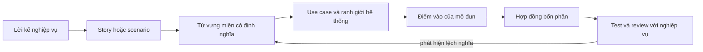
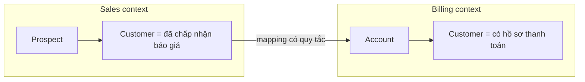
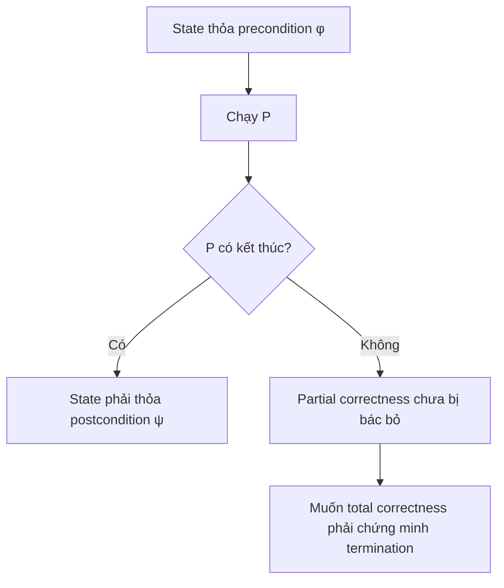

# Từ use case đến hợp đồng điểm vào và từ vựng miền

> [!abstract] Câu hỏi trung tâm
> Một câu như khách đặt hàng chưa đủ để viết hàm. Chưa rõ `khách` là ai trong context này, đơn hàng bắt đầu ở trạng thái nào, dữ liệu nào hợp lệ, thành công làm thay đổi điều gì và người gọi phải xử lý những thất bại nào. Chương này xây một đường đi có kiểm soát từ lời kể nghiệp vụ tới hợp đồng điểm vào gồm input/output, precondition, postcondition và error contract.

## 1. Lỗi bắt đầu từ một từ tưởng như ai cũng hiểu

Nhóm bán hàng gọi một người đã chọn sản phẩm là `customer`. Nhóm thanh toán chỉ gọi họ là customer sau khi đã xác thực phương thức trả tiền. Trong mã, một nhóm dùng `user`, nhóm khác dùng `buyer`, còn bảng dữ liệu vẫn giữ `account`. Bốn tên có thể chỉ một khái niệm, hoặc bốn khái niệm đang bị nhập làm một. Không có định nghĩa và phạm vi, người đọc chỉ đoán.

Giả sử điểm vào mang tên `createOrder(userID, items)`:

- `create` có đồng thời giữ tồn kho không?
- một `user` chưa đăng nhập có đặt được không?
- `items` rỗng bị từ chối hay tạo draft rỗng?
- giá lấy từ request hay từ catalog?
- hàm trả lỗi nào khi SKU không tồn tại, hết hàng hoặc giá vừa đổi?
- timeout có nghĩa đơn chưa được tạo không?

Chữ ký hàm mới nói được một phần của hợp đồng. Phần còn lại nằm rải trong suy đoán, nhánh `if`, câu lệnh ghi dữ liệu và cách caller bắt lỗi. Mỗi chỗ ngầm như vậy là một điểm hai người có thể hiểu khác nhau.

> [!synthesis]
> Boyle cho thấy tên trong mã có thể tạo một lớp dịch không cần thiết giữa mô hình nghiệp vụ và mô hình hệ thống. Sommerville cho thấy requirement mơ hồ dẫn đến cách cài đặt thuận tiện cho developer nhưng khác điều người dùng chờ đợi. Hai luận điểm gặp nhau ở một yêu cầu thực dụng: tên và hành vi quan sát được phải được cố định cùng nhau trước khi coi điểm vào là đã đặc tả.

## 2. Chuỗi chuyển đổi từ nhu cầu tới mã



Mỗi bước giảm một loại mơ hồ:

| Bước | Câu hỏi được chốt | Bằng chứng |
|---|---|---|
| Lời kể | Người dùng đang cố hoàn thành việc gì? | phát biểu bằng ngôn ngữ nghiệp vụ |
| Scenario | Trạng thái đầu, luồng thường, luồng sai và trạng thái cuối là gì? | scenario có cấu trúc |
| Từ vựng miền | Mỗi danh từ và động từ có nghĩa gì trong context này? | glossary được người nghiệp vụ rà soát |
| Use case | Ai tương tác với hệ thống, qua ranh giới nào? | tên use case và mô tả textual |
| Điểm vào | Mô-đun nhận lời gọi nào để thực hiện use case? | tên hàm, command hoặc endpoint |
| Hợp đồng | Caller được phép giả định và buộc phải xử lý điều gì? | bốn phần có thể kiểm tra |
| Test/review | Đặc tả có đúng nhu cầu và kiểm được không? | test case cùng biên bản review |

Chuỗi này không bắt buộc tạo bảy tài liệu riêng. Với mô-đun nhỏ, một trang có thể chứa toàn bộ. Điều không được rút gọn là các quyết định; định dạng có thể ngắn, nghĩa không được ngầm.

## 3. Năm khái niệm thường bị nhập làm một

### 3.1 Story

Story kể bối cảnh ở mức cao: ai đang làm gì, vì sao và môi trường xung quanh ra sao. Nó giúp người đọc thấy bức tranh lớn, nhưng thường chưa đủ chi tiết để cài đặt một điểm vào.

### 3.2 Scenario

Scenario mô tả một phiên tương tác cụ thể. Cấu trúc hữu ích gồm:

1. điều hệ thống và người dùng giả định là đúng khi bắt đầu;
2. luồng sự kiện bình thường;
3. điều có thể sai và cách xử lý;
4. hoạt động đồng thời liên quan;
5. trạng thái hệ thống khi kết thúc.

> [!source-fact]
> Sommerville trình bày đúng năm thành phần trên ở Chapter 4, trang in 119-120, PDF 121-122. Ví dụ upload ảnh tách rõ initial assumption, normal flow, what can go wrong, other activities và system state on completion.

### 3.3 Use case

Use case gọi tên một lớp tương tác giữa actor và hệ thống. Sơ đồ cho biết actor nào tham gia; phần mô tả textual mới mang được điều kiện, trình tự và ngoại lệ. Một cách dùng xem use case là một scenario; cách khác xem nó là tập các scenario gồm happy path và nhiều exception path.

> [!uncertainty]
> Sommerville ghi nhận cả hai cách hiểu về độ hạt của use case và cho rằng use case thường hữu ích hơn ở thiết kế hệ thống so với thảo luận yêu cầu với stakeholder. Vì vậy, chương này không dùng hình oval UML làm bằng chứng rằng yêu cầu đã đủ.

### 3.4 Requirement

Requirement mô tả service hệ thống phải cung cấp và constraint trên hoạt động. User requirement ở mức người dùng có thể đọc; system requirement chi tiết hơn, hướng tới người xây và người kiểm thử. Một functional system requirement tốt phải làm rõ function, input, output và exception.

### 3.5 Hợp đồng điểm vào

Hợp đồng điểm vào quy định nghĩa của một lời gọi cụ thể vào mô-đun. Nó nhỏ hơn system requirement và gần mã hơn use case. Caller cần biết:

- gửi gì và nhận gì;
- điều gì phải đúng trước lời gọi;
- thành công bảo đảm điều gì sau lời gọi;
- thất bại nào có thể quan sát và trạng thái còn lại ra sao.

> [!synthesis]
> Hợp đồng bốn phần trong chương này là cấu trúc phục vụ `DE-L089`, tổng hợp structured specification của Sommerville, pre/postcondition trong Hoare triple và nhu cầu định nghĩa failure của roadmap. Không nguồn nào trong ba nguồn đặt nguyên cụm này thành một framework có tên riêng.

## 4. Domain, sub-domain và bounded context

Domain là vùng tri thức hoặc hoạt động mà hệ thống phục vụ. Sub-domain chỉ một phần hẹp hơn bên trong domain lớn. Ranh giới không phải lúc nào cũng hiển nhiên; nó là một quyết định mô hình hóa cần kiểm lại khi hiểu biết nghiệp vụ thay đổi.

Bounded context đặt phạm vi hiệu lực cho một model và ngôn ngữ. Cùng từ `customer` có thể có model khác nhau trong Sales, Subscription và Collections. Đây không phải lỗi cần xóa bằng một class `EnterpriseCustomer` chứa mọi field. Mỗi context giữ nghĩa đủ chặt cho quyết định của nó; việc chuyển giữa context phải lộ thành mapping có chủ đích.



Một glossary không ghi context sẽ tạo ảo giác rằng tên đã thống nhất. Định nghĩa tốt phải trả lời đúng ở đâu bên cạnh nghĩa là gì.

> [!source-fact]
> Boyle mô tả ubiquitous language là phần giao giữa ngôn ngữ của chuyên gia miền và chuyên gia kỹ thuật; ngôn ngữ này riêng cho nhóm/context, cần được dùng trong requirement, thiết kế và source code, đồng thời phải tiến hóa theo hiểu biết mới. Chapter 2, trang in 16-21, PDF 33-38.

## 5. Từ vựng miền là một tài sản có vòng đời

Từ vựng miền không phải danh sách dịch Anh-Việt. Nó là tập quyết định về nghĩa.

Mỗi mục glossary nên có:

| Trường | Câu hỏi |
|---|---|
| Thuật ngữ chuẩn | Trong context này dùng tên nào? |
| Context | Định nghĩa có hiệu lực ở đâu? |
| Định nghĩa | Điều kiện nào làm một đối tượng thuộc khái niệm? |
| Ví dụ | Trường hợp nào chắc chắn thuộc? |
| Phản ví dụ | Trường hợp gần giống nào không thuộc? |
| Đồng nghĩa bị cấm | Tên nào từng dùng nhưng gây nhập nhằng? |
| Quan hệ | Thuật ngữ này liên hệ với thuật ngữ nào? |
| Nguồn/owner | Ai có thẩm quyền giải thích hoặc thay đổi? |
| Ngày rà soát | Nghĩa này được kiểm lần cuối khi nào? |

Ví dụ:

| Thuật ngữ | Context | Định nghĩa | Phản ví dụ | Tên không dùng |
|---|---|---|---|---|
| Đơn hàng | Ordering | Ý định mua có định danh, line item và state; chưa mặc nhiên là giao dịch đã trả tiền | giỏ hàng chưa checkout; payment transaction | request, bill |
| Xác nhận đơn | Ordering | Chuyển draft hợp lệ sang confirmed sau khi chốt giá và khả năng cung ứng theo policy | chỉ lưu draft | submit, approve nếu chưa định nghĩa |
| Hủy đơn | Ordering | Chuyển đơn được phép hủy sang cancelled và ghi lý do | xóa vật lý bản ghi | delete order |

### Quy tắc vận hành glossary

1. Ghi lại từ lạ khi nghe domain expert nói; không tự điền nghĩa từ từ điển.
2. Đòi ví dụ và phản ví dụ. Định nghĩa chỉ bằng từ đồng nghĩa chưa giúp phân loại.
3. Đưa thuật ngữ đã chốt vào tên command, type, function, event và test.
4. Nếu đổi nghĩa, ghi phiên bản hoặc migration; không sửa glossary mà bỏ lại mã cũ.
5. Nếu hai context dùng cùng từ khác nghĩa, ghi hai entry có context; không ép hợp nhất.
6. Nếu một khái niệm có hai tên trong cùng context, chọn tên chuẩn và lập danh sách thay thế.

> [!inference]
> Một khái niệm một tên là kiểm tra tốt trong một bounded context. Áp nó trên toàn doanh nghiệp có thể phá đúng ranh giới mà DDD muốn giữ. Rubric `DE-L089` vì thế phải rà tên trong phạm vi mô-đun và glossary đã khai báo, không đòi mọi hệ thống dùng chung một model.

## 6. Từ lời kể tới scenario có cấu trúc

Lời kể: Khách chọn hàng, xác nhận rồi bên em thu tiền. Nếu hết hàng thì báo lại. Khách có thể hủy trước khi kho bắt đầu xử lý.

Các từ cần hỏi lại: `khách`, `chọn`, `xác nhận`, `thu tiền`, `hết hàng`, `hủy`, `bắt đầu xử lý`.

Scenario sau khi làm rõ:

| Thành phần | Nội dung |
|---|---|
| Trạng thái đầu | Customer đang hoạt động; draft order thuộc customer; draft có ít nhất một line item |
| Kích hoạt | Customer yêu cầu xác nhận draft order |
| Luồng thường | đọc draft → kiểm ownership/state → chốt giá → kiểm khả năng cung ứng → chuyển confirmed → phát `OrderConfirmed` |
| Có thể sai | không tìm thấy order; không thuộc customer; draft rỗng; SKU ngừng bán; giá đổi; không đủ khả năng cung ứng; xung đột phiên bản |
| Đồng thời | catalog có thể đổi giá; inventory có thể được request khác giữ; cùng order có thể nhận hai lệnh xác nhận |
| Trạng thái cuối thành công | order confirmed đúng một lần, total đã chốt, event có cùng order ID/version |
| Trạng thái cuối thất bại | order không chuyển confirmed; caller nhận failure có mã ổn định; trạng thái reservation được nói rõ |

Scenario này chưa quyết định cách lưu dữ liệu hay giao thức. Nó đủ cụ thể để người nghiệp vụ kiểm nghĩa và người kỹ thuật bắt đầu viết contract.

## 7. Template hợp đồng bốn phần

```text
Tên điểm vào: <động từ miền + đối tượng miền>
Mục đích: <một kết quả nghiệp vụ>

1. Input / Output
   Input: tên, kiểu, đơn vị, optionality, identity và nguồn tin cậy
   Output: kiểu, nghĩa, identity, version và điều caller được phép dựa vào

2. Preconditions
   Điều phải đúng trước lời gọi
   Ai chịu trách nhiệm kiểm từng điều
   Nếu sai thì failure nào được trả

3. Postconditions
   Điều bảo đảm đúng khi thành công
   State transition, invariant, side effect và atomicity boundary
   Điều không được bảo đảm

4. Error contract
   Failure code ổn định
   Điều kiện kích hoạt
   Trạng thái sau failure
   Retry/idempotency semantics
   Thông tin an toàn cho caller và correlation ID cho vận hành
```

Tên điểm vào dùng động từ miền, chẳng hạn `ConfirmOrder`, thay cho động từ kỹ thuật chung như `Process`, `Handle` hoặc `UpdateData`. Tên không thay contract, nhưng tên sai làm caller bắt đầu bằng một mental model sai.

## 8. Phần 1: input và output

Kiểu dữ liệu không chỉ là `string` hay `int`:

- identity: `OrderID` khác `CustomerID` dù cùng được serialize thành UUID;
- unit: `Money` phải gắn currency; số lượng phải nói có cho phép lẻ không;
- optionality: không có giá trị khác chuỗi rỗng;
- trust: `unit_price` từ client không có cùng authority với giá trong catalog;
- version: command sửa aggregate cần expected version nếu phải phát hiện lost update;
- time: timestamp do caller gửi khác timestamp do hệ thống ghi nhận.

Output phải nói nghĩa. Trả `Order` không rõ đó là snapshot trước hay sau commit, có đủ field hay chỉ projection, và version nào. Một output gọn nhưng có semantics rõ tốt hơn object lớn lộ toàn bộ cấu trúc lưu trữ.

### Kiểm tra input/output

- Có primitive obsession khiến hai ID bị truyền nhầm không?
- Field nào do caller khai báo, field nào hệ thống tự tính?
- Đơn vị và timezone có nằm trong type hoặc contract không?
- Output nào là ổn định; field nào chỉ phục vụ nội bộ?
- Dữ liệu nhạy cảm có vô tình thành output không?

## 9. Phần 2: precondition

Precondition là mệnh đề phải đúng trước khi thực hiện operation. Nó không được viết như lời chúc: input hợp lệ, user đúng, order sẵn sàng. Hãy viết điều có thể phân biệt đúng/sai:

- `quantity > 0`;
- order tồn tại và `order.customer_id == command.customer_id`;
- `order.status == DRAFT`;
- `expected_version == order.version`;
- mọi SKU trong order đang có trạng thái sellable tại thời điểm policy quy định.

Mỗi precondition cần một nơi cưỡng chế:

| Loại | Nơi kiểm thường gặp | Khi sai |
|---|---|---|
| shape/type | parser hoặc boundary adapter | malformed input |
| quyền truy cập | application boundary/policy | forbidden |
| state transition | domain model | invalid state |
| uniqueness/version | domain + persistence constraint | conflict |
| external eligibility | port tới policy/system có thẩm quyền | business rejection hoặc unavailable |

Nếu caller không thể bảo đảm precondition vì chỉ callee có dữ liệu, contract không nên giả vờ đẩy trách nhiệm sang caller. Callee kiểm và trả failure đã định nghĩa.

> [!source-fact]
> Handout Program Verification định nghĩa Hoare triple `{φ} P {ψ}`, trong đó `φ` là precondition và `ψ` là postcondition. Nếu bắt đầu ở state thỏa `φ`, state sau khi `P` thực thi phải thỏa `ψ` theo loại correctness đang xét. PDF 20-28.

## 10. Phần 3: postcondition và side effect

Postcondition mô tả điều được bảo đảm sau một lần thành công, không kể lại các dòng code. Với `ConfirmOrder`, postcondition tốt có thể là:

- order chuyển từ `DRAFT` sang `CONFIRMED`;
- total được tính từ price snapshot theo policy đã nêu;
- version tăng đúng một;
- một record event/outbox tương ứng được ghi trong cùng atomic boundary với state change;
- line item và currency invariant vẫn đúng;
- gọi lại cùng idempotency key không tạo xác nhận thứ hai.

Side effect phải được ghi riêng nếu caller quan sát hoặc vận hành phụ thuộc vào nó: ghi database, tạo event, giữ inventory, gửi email, gọi payment gateway. Phải nói side effect nào nằm trong transaction, side effect nào eventual và failure sau commit được phục hồi ra sao.

Gửi email xác nhận không nên nằm trong postcondition đồng bộ nếu transaction đã commit rồi email được worker gửi sau. Contract đúng hơn là outbox chứa notification intent; delivery thuộc contract của worker khác.

### Điều không được bảo đảm

Negative guarantee ngăn caller suy diễn quá mức:

- `ConfirmOrder` không bảo đảm payment đã captured;
- `CreateOrder` không giữ inventory nếu contract chưa nói vậy;
- output thành công không bảo đảm consumer downstream đã xử lý event;
- timeout ở caller không chứng minh transaction chưa commit.

## 11. Phần 4: error contract

Error contract trả lời bốn câu:

1. Caller phân nhánh bằng mã nào?
2. Failure xảy ra trong điều kiện nào?
3. State còn lại sau failure là gì?
4. Retry có an toàn không, với identity nào?

| Nhóm | Ví dụ | State sau failure | Hành động caller |
|---|---|---|---|
| malformed input | quantity bằng 0 | chưa bắt đầu operation | sửa request, không retry nguyên trạng |
| not found | order ID không tồn tại | không đổi | kiểm ID hoặc dừng |
| forbidden | order thuộc customer khác | không đổi | không tiết lộ chi tiết nhạy cảm |
| business rejection | order không còn ở DRAFT | không đổi theo operation này | refresh state, chọn hành động khác |
| conflict | expected version cũ | không đổi theo attempt này | đọc state mới rồi quyết định |
| dependency unavailable | inventory service không trả lời | phải ghi rõ reservation có thể đã xảy ra không | retry chỉ theo idempotency policy |
| internal defect | invariant bị phá do bug | không hứa tiếp tục bình thường | fail closed, correlation ID, điều tra |

Message cho người đọc có thể đổi; failure code cho máy đọc cần ổn định. Không để caller parse chuỗi `"order not ready"`. Không trả stack trace hoặc chi tiết nội bộ cho boundary công khai.

### Error contract và exception flow

Scenario đã hỏi what can go wrong; error contract đưa mỗi nhánh đó vào interface cụ thể. Nếu một failure có trong scenario nhưng không có trong contract, caller không biết xử lý. Nếu contract có mười failure chưa từng nối với scenario hoặc policy, có thể implementation detail đang rò ra ngoài.

> [!synthesis]
> Sommerville yêu cầu functional system requirement mô tả input, output và exception chi tiết; mẫu structured specification thêm requires, precondition, postcondition và side effect, Chapter 4, trang in 123-124, PDF 125-126. Roadmap thêm yêu cầu error contract. Bảng trên biến các yếu tố đó thành interface mà caller có thể lập trình theo.

## 12. Partial correctness không phải total correctness

Với Hoare triple `{φ} P {ψ}`:

- partial correctness: nếu state đầu thỏa `φ` **và** `P` kết thúc, state cuối thỏa `ψ`;
- total correctness: với mọi state đầu thỏa `φ`, `P` được bảo đảm kết thúc và state cuối thỏa `ψ`.



> [!source-fact]
> Handout định nghĩa partial correctness với qualifier provided that P terminates, rồi dùng vòng lặp vô hạn làm phản ví dụ: triple có thể đúng một cách rỗng vì không có final state. Total correctness thêm bảo đảm termination. PDF 28-30.

Hệ thống dịch vụ hiếm khi chứng minh termination theo nghĩa hình thức cho toàn bộ call graph. Thay vào đó, contract vận hành cần deadline, cancellation và failure semantics. Những cơ chế này tạo hành vi có giới hạn cho caller, nhưng không nên được gọi là proof of total correctness.

> [!inference]
> Test một tập input chỉ cung cấp bằng chứng trên tập đó. Nó không nâng một postcondition trong tài liệu thành định lý cho mọi state. Chương này dùng tư duy Hoare để viết mệnh đề rõ, không tuyên bố hoàn tất formal verification.

## 13. Invariant đứng ở đâu

Invariant là điều phải luôn đúng tại những boundary đã định nghĩa, chẳng hạn:

- order có ít nhất một line item trước khi confirmed;
- mọi line item có `quantity > 0`;
- mọi amount trong một order dùng cùng currency;
- cancelled order không quay lại confirmed;
- order total bằng tổng line total theo rounding policy.

Precondition cho biết operation được phép bắt đầu khi nào. Postcondition cho biết operation bảo đảm gì khi thành công. Invariant giới hạn mọi state hợp lệ trước và sau operation. Viết invariant chỉ trong glossary nhưng không cưỡng chế ở model, database hoặc boundary tương ứng thì chưa tạo bằng chứng.

## 14. Năm hợp đồng cho hệ đặt hàng

Phần này là artifact mẫu cho `DE-L089`. Tên và policy được đặt trong `Ordering context`; Billing và Inventory là context ngoài.

### 14.1 `CreateDraftOrder`

**Mục đích:** tạo một draft order rỗng thuộc customer để bắt đầu phiên đặt hàng.

**Input / Output**

- Input: `CustomerID`, `IdempotencyKey`.
- Output: `OrderSnapshot{id, customer_id, status=DRAFT, version=1, lines=[]}`.

**Preconditions**

- `CustomerID` đúng định dạng.
- customer đang active theo customer policy.
- `IdempotencyKey` không rỗng và có scope theo customer.

**Postconditions**

- tồn tại đúng một draft order cho cặp `(CustomerID, IdempotencyKey)`;
- retry cùng key trả cùng `OrderID`, không tạo order thứ hai;
- chưa giữ inventory và chưa tạo payment.

**Error contract**

| Code | Khi nào | State | Retry |
|---|---|---|---|
| `CUSTOMER_NOT_FOUND` | không có customer | không tạo order | không |
| `CUSTOMER_INACTIVE` | policy từ chối | không tạo order | chỉ sau khi state đổi |
| `DEPENDENCY_UNAVAILABLE` | chưa xác định được customer state | không được báo thành công; reconciliation theo key | có backoff, cùng key |
| `INTERNAL` | lỗi ngoài contract dự kiến | outcome có thể chưa rõ; trả correlation ID | chỉ theo runbook |

### 14.2 `AddOrderLine`

**Mục đích:** thêm hoặc tăng một SKU trong draft order.

**Input / Output**

- Input: `OrderID`, `CustomerID`, `SKU`, `Quantity`, `ExpectedVersion`.
- Output: snapshot mới gồm line, provisional price và version.

**Preconditions**

- `Quantity` là số nguyên dương trong limit của policy;
- order thuộc customer, đang ở `DRAFT`, version khớp;
- SKU tồn tại và sellable; giá lấy từ Catalog, không tin giá từ client.

**Postconditions**

- line của SKU có quantity mới theo merge policy;
- amount và currency lấy từ price snapshot;
- version tăng một; invariant currency và quantity giữ nguyên;
- chưa hứa inventory đã được giữ.

**Error contract:** `ORDER_NOT_FOUND`, `FORBIDDEN`, `INVALID_QUANTITY`, `ORDER_NOT_DRAFT`, `SKU_NOT_SELLABLE`, `VERSION_CONFLICT`, `CATALOG_UNAVAILABLE`, `INTERNAL`. Với mọi business rejection, order không đổi. Với `INTERNAL`, caller không suy ra state; dùng idempotency/query để xác minh.

### 14.3 `ConfirmOrder`

**Mục đích:** chốt một draft order thành order được hệ thống chấp nhận xử lý.

**Input / Output**

- Input: `OrderID`, `CustomerID`, `ExpectedVersion`, `IdempotencyKey`.
- Output: `ConfirmedOrder{id, total, currency, confirmed_at, version}`.

**Preconditions**

- order tồn tại, thuộc customer, status `DRAFT`, version khớp;
- có ít nhất một line; mọi line vẫn sellable;
- price-change policy và availability policy đều cho phép xác nhận.

**Postconditions**

- state là `CONFIRMED`; total/currency đã chốt; version tăng một;
- state change và outbox `OrderConfirmed` được ghi trong cùng transaction;
- cùng idempotency key không tạo lần xác nhận hoặc event thứ hai;
- payment capture không thuộc guarantee của operation này.

**Error contract**

| Code | State được bảo đảm | Caller |
|---|---|---|
| `EMPTY_ORDER` | vẫn DRAFT | thêm line |
| `ORDER_NOT_DRAFT` | không đổi bởi attempt | đọc state hiện tại |
| `PRICE_CHANGED` | vẫn DRAFT; trả version giá mới nếu policy cho phép | xin người dùng chấp nhận lại |
| `UNAVAILABLE_ITEM` | vẫn DRAFT; chỉ ra SKU an toàn để hiển thị | sửa order |
| `VERSION_CONFLICT` | không đổi bởi attempt | reload |
| `DEPENDENCY_UNAVAILABLE` | không báo confirmed; trạng thái reservation phải query bằng operation ID | retry theo policy |
| `INTERNAL` | outcome chưa chắc chắn | query bằng key; không tạo request mới |

### 14.4 `RecordPaymentResult`

**Mục đích:** ghi nhận kết quả thanh toán do Billing context công bố.

**Input / Output**

- Input: `PaymentEventID`, `OrderID`, `PaymentStatus`, `Amount`, `Currency`, `OccurredAt`.
- Output: `PaymentRecordingResult{order_id, payment_state, duplicate}`.

**Preconditions**

- event có identity và schema version được hỗ trợ;
- source đã được xác thực;
- order tồn tại và amount/currency khớp invoice policy.

**Postconditions**

- mỗi `PaymentEventID` được áp dụng nhiều nhất một lần;
- payment state chuyển theo state machine, không lùi từ settled về pending;
- duplicate hợp lệ trả success với `duplicate=true`;
- mismatch được lưu bằng chứng nhưng không làm order thành paid.

**Error contract:** `UNSUPPORTED_EVENT_VERSION`, `ORDER_NOT_FOUND`, `AMOUNT_MISMATCH`, `INVALID_PAYMENT_TRANSITION`, `TEMPORARY_STORAGE_FAILURE`, `INTERNAL`. Retry storage failure dùng cùng event ID. `AMOUNT_MISMATCH` không được retry mù; chuyển reconciliation.

### 14.5 `CancelOrder`

**Mục đích:** yêu cầu hủy order theo policy của Ordering context.

**Input / Output**

- Input: `OrderID`, `CustomerID`, `CancellationReason`, `ExpectedVersion`, `IdempotencyKey`.
- Output: `CancelledOrder{id, cancelled_at, reason_code, version}`.

**Preconditions**

- actor có quyền trên order;
- status nằm trong tập cancellable;
- reason code thuộc vocabulary đã công bố;
- version khớp.

**Postconditions**

- status là `CANCELLED`, version tăng một, lý do được lưu;
- outbox có `OrderCancelled` đúng một lần;
- không xóa vật lý order;
- release inventory/refund là workflow downstream, trừ khi contract phiên bản này nói rõ khác.

**Error contract:** `ORDER_NOT_FOUND`, `FORBIDDEN`, `NOT_CANCELLABLE`, `INVALID_REASON`, `VERSION_CONFLICT`, `INTERNAL`. `NOT_CANCELLABLE` trả state hiện tại nhưng không lộ dữ liệu của order không thuộc caller.

## 15. Ma trận đối chiếu năm điểm vào

| Điểm vào | I/O | Precondition | Postcondition | Error contract | Thuật ngữ miền chính |
|---|---:|---:|---:|---:|---|
| `CreateDraftOrder` | có | có | có | có | draft order, customer |
| `AddOrderLine` | có | có | có | có | line, SKU, quantity |
| `ConfirmOrder` | có | có | có | có | confirmed, total, availability |
| `RecordPaymentResult` | có | có | có | có | payment event, settled |
| `CancelOrder` | có | có | có | có | cancelled, cancellation reason |

Ma trận chỉ kiểm sự hiện diện. Review nội dung vẫn phải hỏi mệnh đề có đo được, có owner và có nối với scenario hay không.

## 16. Quy trình thực hiện DE-L089

### Bước 1: Chốt boundary

Viết tên bounded context, actor, hệ ngoài và năm điểm vào dự kiến. Nếu chưa biết boundary, glossary sẽ liên tục tranh cãi vì các bên đang nói về model khác nhau.

### Bước 2: Thu lời nói thật

Lấy mô tả nghiệp vụ, ghi nguyên các danh từ và động từ quan trọng. Đánh dấu từ mơ hồ, từ có nhiều nghĩa và thuật ngữ kỹ thuật người nghiệp vụ không dùng.

### Bước 3: Viết glossary có phản ví dụ

Mỗi term có definition, example, counterexample, context và owner. Gộp synonym trong cùng context; giữ riêng homonym ở context khác.

### Bước 4: Viết scenario

Ghi state đầu, normal flow, failure flow, concurrent activity và state cuối. Chưa chọn database hay framework.

### Bước 5: Chọn điểm vào

Mỗi điểm vào hoàn thành một kết quả nghiệp vụ. Tránh một `ProcessOrder` làm mọi thứ hoặc CRUD method không lộ state transition.

### Bước 6: Viết input/output

Chốt identity, type, unit, optionality, authority, version và dữ liệu nhạy cảm.

### Bước 7: Viết pre/postcondition

Mỗi condition là mệnh đề có thể bác bỏ. Ghi nơi kiểm và atomic boundary. Tách guarantee đồng bộ khỏi eventual effect.

### Bước 8: Viết error contract từ failure flow

Mỗi failure có code, trigger, state sau failure và retry semantics. Loại lỗi thư viện khỏi public contract nếu caller không thể hành động dựa trên nó.

### Bước 9: Review chéo

Người đóng vai nghiệp vụ đọc glossary, tên điểm vào, pre/postcondition bằng ngôn ngữ miền. Người kỹ thuật khác đóng vai caller và viết pseudo-code xử lý mọi output/failure mà không hỏi tác giả.

### Bước 10: Sinh test trước khi kết luận contract đủ

Tạo ít nhất một happy-path test, một test cho mỗi precondition boundary, một test state transition, một test idempotency/concurrency và một test cho mỗi failure mà caller phải phân nhánh.

## 17. Rubric review chéo

| Mã | Câu kiểm | Fail khi |
|---|---|---|
| V1 | Một khái niệm có đúng một tên trong context? | `order`, `request`, `bill` cùng chỉ một object |
| V2 | Mọi tên có định nghĩa và phản ví dụ? | định nghĩa vòng tròn hoặc chỉ dịch từ |
| V3 | Tên trong code khớp glossary? | nghiệp vụ nói `confirm`, code nói `approve` không mapping |
| C1 | Input/output có identity, unit, optionality và authority? | `string`, `number` không semantics |
| C2 | Precondition có thể kiểm và có nơi cưỡng chế? | dữ liệu hợp lệ |
| C3 | Postcondition nói state/side effect quan sát được? | mô tả thuật toán nội bộ |
| C4 | Atomic và eventual effect được tách? | hứa email đã gửi khi mới ghi outbox |
| E1 | Mỗi failure có code và trigger? | caller parse message |
| E2 | State sau failure rõ? | timeout nhưng không biết đã commit chưa |
| E3 | Retry/idempotency rõ? | bảo thử lại không có key |
| P1 | Partial và total correctness không bị nhập một? | viết postcondition rồi tuyên bố hàm luôn kết thúc |
| T1 | Có test hoặc review chứng minh từng mệnh đề? | contract chỉ được đọc bởi tác giả |

`DE-L089` đạt khi cả năm điểm vào có đủ bốn phần và người đóng vai nghiệp vụ không tìm thấy khái niệm mang hai tên trong phạm vi context. Rubric trên làm rõ cách thu bằng chứng cho tiêu chí đó.

## 18. Những cách làm sai thường gặp

### Đã có type hints nên đã có contract

Type hints không nói state transition, side effect, idempotency hay failure semantics.

### Precondition là việc của caller

Chỉ đúng khi caller có authority và dữ liệu để bảo đảm. Boundary công khai vẫn phải bảo vệ invariant.

### Exception nào cũng trả INTERNAL

Caller mất khả năng phân biệt sửa input, refresh state, dừng hay retry. Ngược lại, phơi mọi exception class của database cũng làm implementation leak vào contract.

### Ubiquitous language nghĩa là cả công ty chỉ có một định nghĩa

Ngôn ngữ phải nhất quán trong bounded context. Cùng từ có thể mang model khác ở context khác; mapping giữa chúng cần được làm lộ.

### Use-case diagram đã mô tả đủ yêu cầu

Hình chỉ nêu actor và interaction. Normal flow, exception flow, condition và state cuối vẫn cần văn bản.

### Postcondition chứng minh chương trình đúng

Postcondition là claim cần được kiểm hoặc chứng minh. Partial correctness còn giả định termination; test hữu hạn không chứng minh mọi state.

### Hợp đồng càng dài càng an toàn

Hợp đồng dài nhưng chứa implementation detail sẽ khó đổi và che mất guarantee. Chỉ công bố điều caller cần dựa vào và điều hệ thống thực sự cưỡng chế.

## 19. Câu hỏi tự kiểm tra

1. Vì sao `customer` có thể hợp lệ với hai nghĩa ở hai bounded context nhưng không nên có hai nghĩa trong cùng một context?
2. Story, scenario và use case khác nhau ở độ chi tiết và mục đích ra sao?
3. Vì sao input `price` do client gửi không nên có cùng authority với price snapshot từ Catalog?
4. Precondition order hợp lệ cần được viết lại thành những mệnh đề nào?
5. Postcondition nào thuộc `ConfirmOrder`, điều nào phải chuyển sang contract của worker downstream?
6. Timeout cần error contract bổ sung điều gì để caller không tạo duplicate?
7. Partial correctness bỏ ngỏ câu hỏi nào?
8. Vì sao glossary cần counterexample và context?
9. Khi nào tên lỗi của thư viện được phép xuất hiện trong public error contract?
10. Review nào chứng minh một người khác có thể dùng contract mà không hỏi tác giả?

## Source coverage

| Source slice | Nội dung phải giữ | Vị trí trong note | Trạng thái |
|---|---|---|---|
| [[SRC-BOYLE-DDD-GOLANG-1E]], Ch. 2 pp. 30-42 | domain, subdomain, bounded context và ubiquitous language | §§1-5 | Đã trình bày khái niệm cùng ranh giới dùng từ |
| [[SRC-SOMMERVILLE-SOFTWARE-ENGINEERING-10E]], Ch. 4 pp. 103-109 | functional/non-functional requirement, scenario và use case | §§2-7 | Đã trình bày chuỗi từ lời kể tới scenario có cấu trúc |
| [[SRC-SOMMERVILLE-SOFTWARE-ENGINEERING-10E]], Ch. 4 pp. 120-132 | structured specification, pre/postcondition và requirement validation | §§7-13 | Đã trình bày hợp đồng input/output/error/side effect |
| [[SRC-HCMUT-PROGRAM-VERIFICATION-2020]], pp. 18-30 | predicate, Hoare triple, partial và total correctness | §§8-13 | Đã trình bày logic cần cho precondition, postcondition và termination boundary |
| Tổng hợp bài DE-L089 | template bốn phần, năm hợp đồng, traceability matrix và review rubric | §§7-18 | Đã gắn `synthesis`/`inference`; không gán template này cho một tác giả |

Error taxonomy đầy đủ và runtime exception handling được chuyển sang DE-L092 vì ba lát nguồn trên không đủ để đóng chủ đề đó.

## Key takeaways
- Từ vựng miền là model có phạm vi, owner và vòng đời; không phải bảng dịch thuật ngữ.
- Story tạo bối cảnh; scenario làm rõ luồng và state; use case gọi tên interaction; entry-point contract quy định điều caller có thể dựa vào.
- Hợp đồng điểm vào gồm input/output, precondition, postcondition và error contract.
- Side effect, atomicity, idempotency và state sau failure phải được nói rõ nếu caller phụ thuộc vào chúng.
- Pre/postcondition làm claim chính xác hơn; chúng không tự chứng minh termination hay correctness.
- Bằng chứng của `DE-L089` là năm contract có thể dùng và một vòng review nghiệp vụ phát hiện được lệch tên.

## 21. Giới hạn của nguồn và của chương

- Chương chưa thiết kế taxonomy đầy đủ cho expected failure, defect, transient và permanent failure; phần đó thuộc `DE-L092` và cần nguồn riêng.
- Chưa triển khai năm contract thành code hay chạy test; các snippet là đặc tả mẫu để owner review.
- Không có quan sát từ domain expert thật của một doanh nghiệp; Ordering context là case giảng dạy.
- DDD source là sách thực hành thứ cấp; khi cần truy nguyên định nghĩa lịch sử phải đọc Eric Evans.
- PDF Sommerville đã từng được chỉnh bằng công cụ PDF; checksum xác nhận tệp đang đọc, không chứng minh nó byte-identical với bản Pearson gốc.
- Học liệu verification dùng core language đơn giản; không suy rộng trực tiếp thành proof cho dịch vụ có network, concurrency và external side effect.

## 22. Liên kết chương trình

- Bài áp dụng trực tiếp: `DE-L089`.
- Bài kế tiếp dùng đầu ra này: `DE-L090`, `DE-L091`, `DE-L092`, `DE-L094`.
- Liên hệ: [[Rate Limiting Backpressure and Circuit Breakers Between Services|Rate limiting backpressure và circuit breaker giữa các dịch vụ]] cho failure vận hành; [[End-to-End Request Tracing and Evidence-Based Diagnosis|Truy vết request end-to-end và chẩn đoán bằng bằng chứng]] cho correlation và unknown outcome.

## Reference
### Nguồn chính

1. [[SRC-BOYLE-DDD-GOLANG-1E]]: Matthew Boyle, *Domain-Driven Design with Golang*, Chapter 2, PDF 30-42, trang in 13-25.
2. [[SRC-SOMMERVILLE-SOFTWARE-ENGINEERING-10E]]: Ian Sommerville, *Software Engineering*, 10th Global Edition, Chapter 4, PDF 103-109 và 120-132.
3. [[SRC-HCMUT-PROGRAM-VERIFICATION-2020]]: Nguyen An Khuong, *Program Verification*, Mathematical Modeling CO2011, PDF 18-30.

### Phân loại claim

- Định nghĩa DDD, requirement, scenario, use case, structured specification và Hoare correctness được giữ locator trong các callout `source-fact`.
- Hợp đồng bốn phần, template error contract, workflow DE-L089 và case đặt hàng là `synthesis`.
- Các suy luận về phạm vi rubric, giới hạn test và contract vận hành được ghi `inference` hoặc nêu giới hạn.

## Lịch sử biên tập

| Ngày | Trạng thái | Thay đổi |
|---|---|---|
| 2026-09-28 | `review` | Đọc 46 trang từ ba nguồn; xây glossary, pipeline story-scenario-use case-contract, template bốn phần, năm contract hệ đặt hàng và rubric DE-L089; biên tập Humanizer tiếng Việt |

<!-- ATOMIC-EXECUTION-CAPSULE:START -->

## Execution capsule: kiểm chứng `wiki.software-engineering.use-case-entry-point-contract-domain-vocabulary`

> [!important] Phân loại mệnh đề
> Với `wiki.software-engineering.use-case-entry-point-contract-domain-vocabulary`, sơ đồ, ví dụ và artifact về **Từ use case đến hợp đồng điểm vào và từ vựng miền** là **synthesis để kiểm chứng**; chúng không phải trích dẫn hay case nguyên văn của nguồn.

### Artifact thực thi tối thiểu

```python
from dataclasses import dataclass

@dataclass(frozen=True)
class WikiSoftwareEngineeringUseCaseEntryPointCEvidence:
    boundary_declared: bool
    independent_oracle: bool
    reversal_trigger: str

    def accepted(self) -> bool:
        return (
            self.boundary_declared
            and self.independent_oracle
            and bool(self.reversal_trigger.strip())
        )

# Concept: Từ use case đến hợp đồng điểm vào và từ vựng miền
# Primary question: Làm sao chuyển một ca sử dụng nghiệp vụ thành hợp đồng điểm vào đủ rõ để người viết mã, người kiểm thử và người nghiệp vụ cùng phát hiện được chỗ hiểu
evidence = WikiSoftwareEngineeringUseCaseEntryPointCEvidence(
    boundary_declared=True,
    independent_oracle=True,
    reversal_trigger="Đảo quyết định khi hard constraint bị vi phạm",
)
assert evidence.accepted()
```

Artifact của `wiki.software-engineering.use-case-entry-point-contract-domain-vocabulary` buộc người dùng ghi boundary, oracle và reversal trigger cho **Từ use case đến hợp đồng điểm vào và từ vựng miền**. Các giá trị minh họa phải được thay bằng evidence thật trước khi dùng cho quyết định.

### Tự kiểm tra trước khi tái sử dụng

1. Bạn có thể trả lời `Làm sao chuyển một ca sử dụng nghiệp vụ thành hợp đồng điểm vào đủ rõ để người viết mã, người kiểm thử và người nghiệp vụ cùng phát hiện được chỗ hiểu khác nhau?` bằng một câu mà không kéo thêm concept thứ hai không?
2. Source locator nào đỡ cho claim, và phần nào chỉ là synthesis trong note?
3. Observation nào khiến bạn dừng, thu hẹp hoặc đảo quyết định?
4. Artifact nào cho phép một reviewer độc lập tái hiện kết quả?

<!-- ATOMIC-EXECUTION-CAPSULE:END -->
