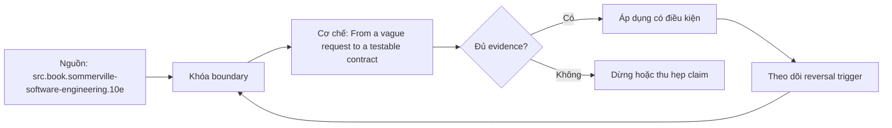

# From a vague request to a testable contract

> [!abstract] Câu hỏi trung tâm
> Làm sao biến một yêu cầu mơ hồ thành contract đủ rõ để hai người độc lập tạo cùng một phép kiểm chấp nhận?

## 1. Bắt đầu từ quyết định, không bắt đầu từ giải pháp

Câu làm dashboard doanh thu chưa nói ai sẽ dùng kết quả để quyết định điều gì. Trước khi chọn dữ liệu hay công cụ, người viết contract phải xác định actor, trigger và quyết định cần hỗ trợ. Nếu bỏ ba điểm này, đội kỹ thuật có thể giao đúng màn hình nhưng sai công việc.

Một contract tốt không cố đoán mọi chi tiết ngay từ đầu. Nó khóa phần có thể quan sát: ai kích hoạt, input nào được chấp nhận, output nào xuất hiện, ràng buộc nào bắt buộc và điều gì nằm ngoài phạm vi. Phần chưa biết được ghi thành câu hỏi có owner, không được ngụy trang thành mặc định.

## 2. Sáu phần của một phát biểu kiểm thử được

Sáu phần gồm user, trigger, input, output, constraints và non-goals. User là vai trò chịu hậu quả, không nhất thiết là người bấm nút. Trigger là sự kiện hoặc lịch chạy. Input phải có boundary và nguồn thẩm quyền. Output mô tả hành vi nhìn thấy được, không chỉ tên artifact.

Constraints cần tách correctness, performance và operability. Đúng số tiền theo sổ cái, trả trong 10 giây và replay không tạo bản ghi kép dẫn tới ba loại bằng chứng khác nhau. Non-goal chặn việc phạm vi nở âm thầm; nó phải viết thành câu có thể phản biện, không nằm trong trí nhớ của người họp.

> [!synthesis]
> Phần này ghép contract của roadmap DE-L001 với các lát nguồn đã khai báo. Mọi threshold và tình huống cụ thể là thiết kế giáo trình, không phải lời trích nguyên văn của tác giả.

## 3. Từ requirement tới acceptance check

Acceptance check gồm trạng thái đầu, hành động, dữ liệu cụ thể và kết quả mong đợi. Chạy không lỗi chỉ chứng minh process trả exit code thuận lợi; nó không chứng minh đúng population, đúng số tiền hay đúng thời điểm. Một check tốt sẽ thất bại khi một mệnh đề nghiệp vụ bị vi phạm.

Mỗi requirement cần cả positive case và boundary hoặc negative case. Nếu yêu cầu nói hỗ trợ đơn hàng hợp lệ, hãy đưa thêm đơn thiếu currency hoặc trùng identity. Hai người đọc contract phải có thể dựng cùng oracle mà không hỏi tác giả kết quả đúng là gì.

## 4. Assumption ledger và câu hỏi chưa đóng

Mọi contract đều dựa trên assumption: timezone nào, duplicate được nhận diện ra sao, dữ liệu sửa muộn đến khi nào, ai có quyền phê duyệt. Ghi assumption cùng impact-if-wrong giúp đội biết điểm nào cần xác minh trước khi code và điểm nào có thể chấp nhận tạm thời.

Một unknown có thể không chặn thiết kế nếu đã có giới hạn an toàn. Ngược lại, identity key chưa rõ thường chặn deduplication vì mọi test phía sau đều có thể xanh giả. Quy tắc dừng là: nếu unknown làm thay đổi semantics, blast radius hoặc tiêu chí đạt, phải giải quyết trước mutation.

## 5. Traceability hai chiều

Requirement nối tới acceptance check; check nối tới fixture và kết quả; thay đổi code nối ngược về requirement. Chuỗi này cho phép trả lời vì sao một test tồn tại và requirement nào chưa có phép kiểm. Traceability không phải bảng quản trị trang trí mà là công cụ phát hiện lỗ hổng.

Khi requirement đổi, đừng sửa test cho xanh trước rồi mới cập nhật contract. Hãy ghi thay đổi semantics, xem lại non-goal và boundary, sau đó cập nhật oracle. Nếu không, test chỉ chứng minh implementation mới khớp chính nó.

## 6. Definition of Ready và điểm dừng

Một yêu cầu sẵn sàng khi actor, trigger, input, output, constraints, non-goals và acceptance checks đều đủ để bắt đầu một increment nhỏ. Ready không có nghĩa mọi câu hỏi tương lai đã biến mất; nó có nghĩa phần việc sắp làm có boundary và bằng chứng hoàn thành rõ.

Nếu reviewer vẫn tạo được hai kết quả trái nhau nhưng đều hợp văn bản, contract chưa sẵn sàng. Phản biện cần tập trung vào counterexample chứ không tranh câu chữ: đưa một input sát biên, hỏi output nào đúng và ai chịu trách nhiệm khi không đủ dữ liệu.

## 7. Tình huống xuyên suốt

Một quản lý nhắn mỗi sáng gửi doanh thu hôm qua. Sau khi hỏi lại, đội xác định finance analyst là consumer, 07:00 Asia/Ho_Chi_Minh là trigger, ledger đã posted là nguồn, output là tổng gross/refund/net theo currency, dữ liệu chưa posted là non-goal, và gửi trễ hơn 07:10 là vi phạm vận hành. Hai acceptance checks dùng một fixture bình thường và một refund tới sát cutoff.

Tình huống của `wiki.engineering-foundation.testable-contract` phải được chạy trong sandbox hoặc fixture có version. Nếu chưa chạy, các kết quả mong đợi chỉ là protocol đánh giá; không được ghi thành observation. Người học giữ input, command, state trước-sau, raw output và một oracle độc lập đủ để reviewer tái hiện câu hỏi riêng của bài `From a vague request to a testable contract`.

## 8. Failure modes và ngộ nhận

- **Failure mode.** Dùng động từ mơ hồ như nhanh, đầy đủ hoặc realtime mà không có ngưỡng. Cần đưa một counterexample nhỏ nhất để chứng minh hậu quả, sau đó ghi owner và cách phục hồi thay vì chỉ sửa câu chữ.

- **Failure mode.** Đưa tên công cụ vào requirement khiến một lựa chọn implementation biến thành nhu cầu giả. Cần đưa một counterexample nhỏ nhất để chứng minh hậu quả, sau đó ghi owner và cách phục hồi thay vì chỉ sửa câu chữ.

- **Failure mode.** Viết happy path nhưng không viết duplicate, missing hoặc boundary time. Cần đưa một counterexample nhỏ nhất để chứng minh hậu quả, sau đó ghi owner và cách phục hồi thay vì chỉ sửa câu chữ.

- **Failure mode.** Không ghi non-goal nên mọi ý tưởng hợp lý đều bị xem là cam kết. Cần đưa một counterexample nhỏ nhất để chứng minh hậu quả, sau đó ghi owner và cách phục hồi thay vì chỉ sửa câu chữ.

## 9. Ma trận kiểm chứng

Mỗi probe dưới đây bắt đầu bằng dự đoán viết trước. Kết quả đạt chỉ được ghi khi artifact thực tế khớp oracle; exit code thành công không thay thế kiểm tra semantics.

### 9.1. Hai reviewer độc lập viết cùng expected output từ một fixture.

**Mệnh đề.** Hai reviewer độc lập viết cùng expected output từ một fixture.

**Thiết kế phép thử cho `wiki.engineering-foundation.testable-contract`.** Tạo positive control và một boundary hoặc changed-constraint case chỉ khác đúng biến cần kiểm. Khóa fixture, phiên bản, identity và state ban đầu; ghi expected result trước khi chạy.

**Bằng chứng.** Giữ command, raw output, state transition và reconciliation với oracle không dùng chung assumption. Nếu evidence không phân biệt được mệnh đề đúng và sai, probe chưa có giá trị quyết định.

### 9.2. Một input ở đúng cutoff và một input sau cutoff cho kết quả khác đúng policy.

**Mệnh đề.** Một input ở đúng cutoff và một input sau cutoff cho kết quả khác đúng policy.

**Thiết kế phép thử cho `wiki.engineering-foundation.testable-contract`.** Tạo positive control và một boundary hoặc changed-constraint case chỉ khác đúng biến cần kiểm. Khóa fixture, phiên bản, identity và state ban đầu; ghi expected result trước khi chạy.

**Bằng chứng.** Giữ command, raw output, state transition và reconciliation với oracle không dùng chung assumption. Nếu evidence không phân biệt được mệnh đề đúng và sai, probe chưa có giá trị quyết định.

### 9.3. Bỏ trường identity phải làm contract bị chặn thay vì tự chọn mặc định.

**Mệnh đề.** Bỏ trường identity phải làm contract bị chặn thay vì tự chọn mặc định.

**Thiết kế phép thử cho `wiki.engineering-foundation.testable-contract`.** Tạo positive control và một boundary hoặc changed-constraint case chỉ khác đúng biến cần kiểm. Khóa fixture, phiên bản, identity và state ban đầu; ghi expected result trước khi chạy.

**Bằng chứng.** Giữ command, raw output, state transition và reconciliation với oracle không dùng chung assumption. Nếu evidence không phân biệt được mệnh đề đúng và sai, probe chưa có giá trị quyết định.

### 9.4. Đổi SLO từ 10 phút xuống 30 giây phải lộ thay đổi thiết kế.

**Mệnh đề.** Đổi SLO từ 10 phút xuống 30 giây phải lộ thay đổi thiết kế.

**Thiết kế phép thử cho `wiki.engineering-foundation.testable-contract`.** Tạo positive control và một boundary hoặc changed-constraint case chỉ khác đúng biến cần kiểm. Khóa fixture, phiên bản, identity và state ban đầu; ghi expected result trước khi chạy.

**Bằng chứng.** Giữ command, raw output, state transition và reconciliation với oracle không dùng chung assumption. Nếu evidence không phân biệt được mệnh đề đúng và sai, probe chưa có giá trị quyết định.

### 9.5. Một non-goal bị yêu cầu lại phải tạo change request, không lén mở rộng scope.

**Mệnh đề.** Một non-goal bị yêu cầu lại phải tạo change request, không lén mở rộng scope.

**Thiết kế phép thử cho `wiki.engineering-foundation.testable-contract`.** Tạo positive control và một boundary hoặc changed-constraint case chỉ khác đúng biến cần kiểm. Khóa fixture, phiên bản, identity và state ban đầu; ghi expected result trước khi chạy.

**Bằng chứng.** Giữ command, raw output, state transition và reconciliation với oracle không dùng chung assumption. Nếu evidence không phân biệt được mệnh đề đúng và sai, probe chưa có giá trị quyết định.

### 9.6. Trace một failed check về đúng requirement và owner.

**Mệnh đề.** Trace một failed check về đúng requirement và owner.

**Thiết kế phép thử cho `wiki.engineering-foundation.testable-contract`.** Tạo positive control và một boundary hoặc changed-constraint case chỉ khác đúng biến cần kiểm. Khóa fixture, phiên bản, identity và state ban đầu; ghi expected result trước khi chạy.

**Bằng chứng.** Giữ command, raw output, state transition và reconciliation với oracle không dùng chung assumption. Nếu evidence không phân biệt được mệnh đề đúng và sai, probe chưa có giá trị quyết định.

## 10. Câu hỏi tự kiểm tra

1. Boundary nào làm mệnh đề trung tâm không còn đúng?
2. Artifact nào là nguồn thẩm quyền và artifact nào chỉ là tín hiệu?
3. Counterexample nhỏ nhất cần những state nào?
4. Một kiểm tra xanh giả có thể xuất hiện theo đường nào?
5. Constraint nào khiến quyết định phải đảo?
6. Phần nào hiện mới là protocol, chưa phải observation?

## 11. Giới hạn và điều chưa cho phép kết luận

- Nội dung là giáo trình và expected evidence; không tuyên bố đã kiểm chứng trên production.
- Hành vi phụ thuộc phiên bản phải được chạy lại với version ghi trong evidence package.
- Threshold, case study và decision rule tổng hợp cho curriculum không được gán nguyên văn cho nguồn.
- Note giữ trạng thái `review` cho tới khi owner duyệt semantics và learner artifact.

## Reference
1. [[SRC-SOMMERVILLE-SOFTWARE-ENGINEERING-10E]]

## Source coverage

| Source slice | Locator | Kiến thức phải giữ | Vị trí | Trạng thái | Ngoài phạm vi |
|---|---|---|---|---|---|
| [[SRC-SOMMERVILLE-SOFTWARE-ENGINEERING-10E]]: `src.book.sommerville-software-engineering.10e` | Chapter 4 PDF 103-132; Chapter 7 PDF 169-212 | requirement validation, interface, decomposition và information hiding | §§1-9 | Đã phủ | Nội dung ngoài objective DE-L001 |

## Key takeaways
- Yêu cầu chỉ sẵn sàng để xây khi hành vi quan sát được, boundary và oracle đều rõ hơn tên giải pháp.
- Một kết luận chỉ có giá trị trong scope, version và state đã ghi.
- Counterexample và changed-constraint test mạnh hơn việc lặp lại định nghĩa.
- Trước khi lab chạy, note này đã có provenance và protocol nhưng chưa phải chứng nhận production.

<!-- ATOMIC-EXECUTION-CAPSULE:START -->

## Execution capsule: kiểm chứng `wiki.engineering-foundation.testable-contract`

> [!important] Phân loại mệnh đề
> Với `wiki.engineering-foundation.testable-contract`, sơ đồ, ví dụ và artifact về **From a vague request to a testable contract** là **synthesis để kiểm chứng**; chúng không phải trích dẫn hay case nguyên văn của nguồn.

### Sơ đồ cơ chế và điểm kiểm soát



Đọc sơ đồ `wiki.engineering-foundation.testable-contract` từ trái sang phải: source chỉ cung cấp claim ban đầu cho **From a vague request to a testable contract**; quyết định chỉ được đi tiếp sau khi boundary, evidence và điều kiện đảo quyết định đã hiện hữu.

### Artifact thực thi tối thiểu

```python
from dataclasses import dataclass

@dataclass(frozen=True)
class WikiEngineeringFoundationTestableContractEvidence:
    boundary_declared: bool
    independent_oracle: bool
    reversal_trigger: str

    def accepted(self) -> bool:
        return (
            self.boundary_declared
            and self.independent_oracle
            and bool(self.reversal_trigger.strip())
        )

# Concept: From a vague request to a testable contract
# Primary question: Làm sao biến một yêu cầu mơ hồ thành contract đủ rõ để hai người độc lập tạo cùng một phép kiểm chấp nhận?
evidence = WikiEngineeringFoundationTestableContractEvidence(
    boundary_declared=True,
    independent_oracle=True,
    reversal_trigger="Đảo quyết định khi hard constraint bị vi phạm",
)
assert evidence.accepted()
```

Artifact của `wiki.engineering-foundation.testable-contract` buộc người dùng ghi boundary, oracle và reversal trigger cho **From a vague request to a testable contract**. Các giá trị minh họa phải được thay bằng evidence thật trước khi dùng cho quyết định.

### Tự kiểm tra trước khi tái sử dụng

1. Bạn có thể trả lời `Làm sao biến một yêu cầu mơ hồ thành contract đủ rõ để hai người độc lập tạo cùng một phép kiểm chấp nhận?` bằng một câu mà không kéo thêm concept thứ hai không?
2. Source locator nào đỡ cho claim, và phần nào chỉ là synthesis trong note?
3. Observation nào khiến bạn dừng, thu hẹp hoặc đảo quyết định?
4. Artifact nào cho phép một reviewer độc lập tái hiện kết quả?

<!-- ATOMIC-EXECUTION-CAPSULE:END -->
