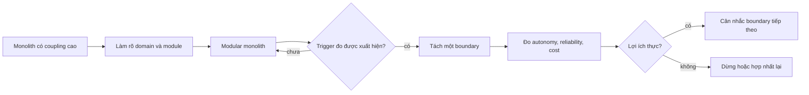

# Monolith, modular monolith và chi phí tách dịch vụ

> [!abstract] Câu hỏi trung tâm
> Tách dịch vụ chỉ hợp lý khi lợi ích của quyền tự chủ triển khai, sở hữu và scaling lớn hơn chi phí phân tán. Quyết định phải dựa trên ranh giới thay đổi, quyền sở hữu dữ liệu, cấu trúc đội và failure model; số dòng code hoặc mong muốn dùng công nghệ mới không đủ làm bằng chứng.

## 1. Ba dạng cần phân biệt

### Monolith không có ranh giới rõ

Một sản phẩm deploy có thể chứa các phần phụ thuộc chéo tùy ý, dùng chung model và truy cập trực tiếp cùng bảng. Thay đổi nhỏ lan rộng, test cần dựng nhiều phần và ownership mờ. Vấn đề không nằm ở việc có một artifact; vấn đề nằm ở ranh giới không được diễn đạt hoặc cưỡng chế.

### Modular monolith

Hệ vẫn build và deploy như một đơn vị, nhưng code và dữ liệu được tổ chức theo module có contract rõ. Module không truy cập implementation hoặc bảng riêng của module khác; giao tiếp qua public API, event nội bộ hoặc application service đã định nghĩa.

### Nhiều dịch vụ triển khai độc lập

Mỗi dịch vụ có lifecycle deploy, runtime và ownership riêng. Ranh giới process buộc communication đi qua network hoặc messaging. Quyền tự chủ tăng, đồng thời failure, consistency, observability và security trở thành bài toán phân tán.

> [!source-fact]
> Newman phân biệt monolith triển khai như một đơn vị với modular monolith có module boundary bên trong, đồng thời nhấn mạnh information hiding và khả năng deploy độc lập là các trục khác nhau. *Building Microservices*, 2e, PDF 32-37 và 56-77.

## 2. Một artifact không đồng nghĩa một khối code rối

Hai hệ cùng là monolith có thể khác nhau mạnh:

| Thuộc tính | Monolith rối | Modular monolith |
|---|---|---|
| Dependency | vòng và xuyên module tùy ý | hướng phụ thuộc được kiểm |
| Data access | mọi phần đọc/ghi mọi bảng | ownership theo module |
| Contract | gọi internal class trực tiếp | public module API |
| Test | phần lớn cần dựng cả hệ | core/module test cô lập |
| Change surface | lan rộng, khó dự đoán | giới hạn theo boundary |
| Deploy | một đơn vị | một đơn vị |

Monolith có lợi thế giao dịch cục bộ, debug một process, deployment đơn giản và ít infrastructure. Những lợi thế này không nên bỏ chỉ để đạt một hình dạng kiến trúc đang thịnh hành.

## 3. Ranh giới module đến từ change coupling

Nhóm code thành module khi chúng:

- phục vụ cùng capability nghiệp vụ;
- thay đổi cùng nhau vì cùng rule;
- cần cùng invariant và transaction;
- dùng cùng ngôn ngữ miền trong một context;
- có owner có thể chịu trách nhiệm đầu cuối.

Không chia theo layer kỹ thuật thành `controllers`, `services`, `repositories` rồi gọi đó là module nghiệp vụ. Cách chia này khiến một feature đi xuyên mọi thư mục và ranh giới change vẫn không rõ.

> [!synthesis]
> Quy tắc change together, own together tổng hợp information hiding của Sommerville, coupling của Newman và decomposition theo business capability/subdomain của Richardson. Đây là decision heuristic, không phải thuật toán tạo ra một ranh giới duy nhất.

## 4. Ranh giới dữ liệu là phép thử thật

Hai service chạy ở hai process nhưng cùng ghi trực tiếp một tập bảng chưa có quyền tự chủ. Một service có thể đổi schema làm service kia hỏng; deploy vẫn phải phối hợp.

Ba mức cần phân biệt:

1. **Shared database server:** nhiều owner có database/schema riêng trên cùng hạ tầng; vẫn có thể độc lập logic.
2. **Shared schema, read-only cross access:** giảm độc lập và tạo coupling query/schema.
3. **Shared writes:** ownership mâu thuẫn; invariant và migration không có một owner duy nhất.

Tách database không bắt buộc mỗi service có một máy chủ vật lý. Điều bắt buộc là write ownership và contract truy cập rõ. Cross-service report có thể dùng API, replicated read model hoặc analytical pipeline thay vì cho phép ghi chung.

> [!source-fact]
> Richardson trình bày Database per Service như cách giữ dữ liệu private cho service và xem Shared Database là pattern đánh đổi khác, với coupling ở schema và transaction. *Microservices Patterns*, PDF 44-55.

## 5. Thuế vận hành của phân tán

Tách một call trong process thành remote call thêm các biến trạng thái:

- DNS, connection, TLS và load balancing;
- timeout, retry và unknown outcome;
- partial failure và cascading failure;
- serialization và contract version;
- authentication/authorization giữa service;
- trace/log/metric correlation;
- deployment compatibility;
- data consistency, messaging và reconciliation;
- capacity cho từng service;
- on-call và runbook.

Một hàm gọi trực tiếp có failure mode tương đối hẹp. Remote call có thể hoàn tất ở server nhưng response bị mất; caller không biết retry có tạo tác động kép không. Thuế này lặp lại trên mọi boundary.

## 6. Lợi ích nào có thể biện minh việc tách?

### Quyền tự chủ đội

Một đội có thể thay đổi, test và deploy capability mà không chờ đội khác. Điều kiện là code, data và release path thực sự độc lập; đổi repo nhưng vẫn cần synchronized release không tạo autonomy.

### Scaling khác biệt

Một phần có profile CPU, memory, I/O hoặc traffic khác rõ rệt và chi phí scale toàn monolith đáng kể. Trước khi tách, đo xem component-level concurrency, queue hoặc cache trong monolith đã giải quyết được chưa.

### Isolation

Một workload có failure/resource profile cần cô lập, ví dụ parser không tin cậy hoặc batch nặng ảnh hưởng request path. Process boundary có thể tạo bulkhead, nhưng chỉ hữu ích khi resource quota, timeout và dependency cũng được tách.

### Technology/lifecycle khác

Một capability cần runtime hoặc release cadence khác vì lý do kỹ thuật có bằng chứng. Muốn thử framework mới không phải bằng chứng.

## 7. Ba điều kiện cần trước khi tách

Không phải mọi hệ đều cần đạt đúng một checklist, nhưng ba điều kiện sau thường là tối thiểu:

1. **Boundary evidence:** change history, domain model hoặc ownership cho thấy phần dự kiến tách có cohesion cao và contract hẹp.
2. **Operational readiness:** đội vận hành được deploy tự động, observability xuyên service, timeout/retry, incident response và secret/access lifecycle.
3. **Data separation plan:** write owner, migration, consistency model và query/reporting path đã rõ.

Thiếu một điều kiện, modular monolith thường là bước an toàn hơn.

## 8. Dấu hiệu tách quá sớm

- một đội nhỏ phải vận hành nhiều pipeline/runtime;
- boundary đổi liên tục vì domain chưa hiểu;
- service chủ yếu chuyển tiếp request;
- phần lớn change cần sửa nhiều service cùng lúc;
- nhiều service dùng chung một database/schema và shared library model;
- chưa có tracing, contract test hoặc rollback;
- scaling problem chưa được đo;
- số service tăng nhưng lead time không giảm.

Distributed monolith là trạng thái nhiều deployment nhưng vẫn coupling chặt. Nó giữ cả độ phức tạp phân tán lẫn change coordination của monolith.

## 9. Modular monolith như một lựa chọn chủ động

Modular monolith không phải microservice chưa hoàn thành. Nó phù hợp khi:

- một hoặc vài đội cần tốc độ thay đổi nhưng chưa cần release độc lập;
- transaction nhất quán trong process/database còn có giá trị lớn;
- load profile tương đối đồng nhất;
- boundary cần được học thêm;
- chi phí platform/on-call của nhiều service chưa được biện minh.

Để lựa chọn này bền, boundary phải được kiểm tự động: import rules, module API, schema ownership và test scope. Nếu chỉ ghi trong sơ đồ, code sẽ quay lại coupling trực tiếp.

## 10. Đường tiến hóa không bắt buộc tách



Tách từng boundary giảm blast radius và cho phép kiểm giả thuyết. Chuyển toàn bộ sang microservices là programme rủi ro cao, khó quy thuộc lợi ích.

## 11. Trigger phải đo được

Trigger tốt có metric, ngưỡng, cửa sổ và owner. Ví dụ:

- trong ba tháng, trên 30% release của module A phải chờ release train vì module B;
- module ingestion cần scale gấp 10 lần request API và làm chi phí scale toàn monolith vượt budget;
- hai đội có roadmap độc lập nhưng trên 40% change chạm cùng package, sau khi boundary cleanup đã thử;
- batch workload gây vượt SLO request ở ba incident dù đã áp dụng quota trong process;
- compliance yêu cầu isolation/access boundary không thể thỏa trong deployment hiện tại.

Các con số trên là ví dụ cấu trúc, không phải ngưỡng chung. Dữ liệu thực của hệ quyết định.

## 12. ADR cho quyết định giữ modular monolith

ADR nên có:

- context và lực ép hiện tại;
- lựa chọn: monolith, modular monolith, service split;
- bằng chứng change, load, ownership và incident;
- chi phí vận hành dự kiến;
- quyết định và phạm vi;
- boundary/data ownership;
- ba trigger có thể kiểm;
- ngày review và owner;
- migration/reversal path.

Chưa cần microservices không đủ. ADR phải nói điều gì sẽ khiến quyết định thay đổi.

## 13. Ba tình huống đánh giá

### Tình huống A: một đội, domain còn đổi nhanh

Một đội sáu người, traffic vừa, mỗi tuần model nghiệp vụ đổi. Chọn modular monolith: giữ deploy đơn, dùng module boundary để học domain. Tách service lúc này làm contract churn và distributed migration tăng.

### Tình huống B: batch nặng ảnh hưởng API

Batch parser ăn toàn bộ memory làm API vi phạm SLO. Trước hết thử process isolation/worker queue và resource quota. Chỉ tách deployment khi đo cho thấy scaling/failure isolation không đạt trong cấu trúc hiện tại và đội có operational readiness.

### Tình huống C: hai capability có đội và dữ liệu độc lập

Hai đội deploy khác cadence; boundary ổn định, mỗi capability sở hữu bảng riêng, contract test và tracing đã có. Tách một service có thể hợp lý. Vẫn cần migration và rollback plan.

## 14. Failure modes của quyết định

- đếm số dòng code để quyết định boundary;
- tách theo entity CRUD thay vì capability/invariant;
- tạo service nhưng chia sẻ write model;
- bỏ chi phí on-call/platform khỏi business case;
- xem network như function call chậm;
- trigger mơ hồ như khi hệ lớn hơn;
- không đặt review date nên ADR thành tài liệu chết;
- không đo kết quả sau tách.

## 15. Bằng chứng cho DE-L099

- quyết định cho ba tình huống, trong đó ít nhất hai tình huống không tách ngay;
- một ADR chọn modular monolith;
- ba trigger có metric, ngưỡng/cửa sổ và owner;
- dependency/data ownership diagram;
- danh sách operational tax áp dụng cho hệ cụ thể;
- lý do loại hai phương án còn lại.

## 16. Câu hỏi tự kiểm tra

1. Modular monolith khác monolith rối ở invariant nào, ngoài cấu trúc thư mục?
2. Hai service cùng ghi một bảng mất quyền tự chủ ở đâu?
3. Khi nào scaling là lý do thật để tách?
4. Một trigger khi traffic tăng thiếu trường gì để kiểm được?
5. Distributed monolith giữ lại hai nhóm chi phí nào?

## 17. Giới hạn

- Không có số service hoặc team size phổ quát quyết định kiến trúc.
- Change history phản ánh tổ chức và quy trình hiện tại; nó không tự xác định domain boundary đúng.
- Tách service có thể cần vì regulation hoặc blast-radius requirement dù traffic thấp.
- Modular monolith vẫn cần kỷ luật boundary; một artifact không tự tạo simplicity.
- Ví dụ trigger trong note là mẫu cách viết, không phải benchmark ngành.

## 18. Liên kết chương trình

- Tiền đề: [[Deployment Strategies and Rollback|Chiến lược triển khai và rollback]].
- Bài áp dụng: `DE-L099`.
- Bài tổng hợp tiếp theo: [[Delivery Project - Modular Package with a Release Path|Dự án delivery: modular package có đường phát hành]].

## Reference
1. [[SRC-NEWMAN-BUILDING-MICROSERVICES-2E]]: modular monolith, information hiding, coupling và decomposition, PDF 32-37, 56-77, 98-112.
2. [[SRC-RICHARDSON-MICROSERVICES-PATTERNS-1E]]: monolithic architecture, microservice trade-offs, decomposition và database patterns, PDF 32-55, 81-95.
3. [[SRC-SOMMERVILLE-SOFTWARE-ENGINEERING-10E]]: architectural design, decomposition và information hiding, PDF 169-200.

## Source coverage

| Source slice | Nội dung phải giữ | Vị trí trong note | Trạng thái |
|---|---|---|---|
| [[SRC-NEWMAN-BUILDING-MICROSERVICES-2E]], pp. 32-37 | monolith, modular monolith và deployability | §§1-2, 9-10 | Đã trình bày artifact boundary tách khỏi code modularity |
| [[SRC-NEWMAN-BUILDING-MICROSERVICES-2E]], pp. 56-77, 98-112 | information hiding, coupling và decomposition | §§3-7, 10-12 | Đã trình bày change boundary, data ownership và trigger |
| [[SRC-RICHARDSON-MICROSERVICES-PATTERNS-1E]], pp. 32-55 | monolith/microservice benefits và drawbacks | §§1, 5-8 | Đã trình bày operational tax và dấu hiệu tách sớm |
| [[SRC-RICHARDSON-MICROSERVICES-PATTERNS-1E]], pp. 81-95 | decomposition và database boundary | §§3-7, 11 | Đã trình bày ownership, consistency và measurable trigger |
| [[SRC-SOMMERVILLE-SOFTWARE-ENGINEERING-10E]], pp. 169-200 | architectural decomposition và information hiding | §§2-4, 9-12 | Đã dùng làm nền cho decision record |
| Tổng hợp bài DE-L099 | ba tình huống, ba điều kiện cần, ADR và evidence | §§7, 11-15 | Đã gắn `synthesis`; không lấy xu hướng làm trigger |

Note không giả định microservice là đích đến. Quyết định tách chỉ hợp lệ khi có pain đo được, boundary đủ rõ và năng lực vận hành tương ứng.

## Key takeaways
- Deployment count và modularity là hai trục khác nhau.
- Modular monolith giữ simplicity vận hành nhưng chỉ hiệu quả khi boundary được cưỡng chế.
- Tách service cần boundary, operational readiness và data ownership rõ.
- Trigger phải đo được; xu hướng công nghệ không phải trigger.

<!-- ATOMIC-EXECUTION-CAPSULE:START -->

## Execution capsule: kiểm chứng `wiki.software-engineering.monolith-modular-monolith-cost-of-splitting`

> [!important] Phân loại mệnh đề
> Với `wiki.software-engineering.monolith-modular-monolith-cost-of-splitting`, sơ đồ, ví dụ và artifact về **Monolith, modular monolith và chi phí tách dịch vụ** là **synthesis để kiểm chứng**; chúng không phải trích dẫn hay case nguyên văn của nguồn.

### Artifact thực thi tối thiểu

```python
from dataclasses import dataclass

@dataclass(frozen=True)
class WikiSoftwareEngineeringMonolithModularMonolEvidence:
    boundary_declared: bool
    independent_oracle: bool
    reversal_trigger: str

    def accepted(self) -> bool:
        return (
            self.boundary_declared
            and self.independent_oracle
            and bool(self.reversal_trigger.strip())
        )

# Concept: Monolith, modular monolith và chi phí tách dịch vụ
# Primary question: Khi nào một hệ nên giữ dạng monolith, khi nào cần modular monolith, và bằng chứng nào đủ để tách thành nhiều dịch vụ triển khai độc lập?
evidence = WikiSoftwareEngineeringMonolithModularMonolEvidence(
    boundary_declared=True,
    independent_oracle=True,
    reversal_trigger="Đảo quyết định khi hard constraint bị vi phạm",
)
assert evidence.accepted()
```

Artifact của `wiki.software-engineering.monolith-modular-monolith-cost-of-splitting` buộc người dùng ghi boundary, oracle và reversal trigger cho **Monolith, modular monolith và chi phí tách dịch vụ**. Các giá trị minh họa phải được thay bằng evidence thật trước khi dùng cho quyết định.

### Tự kiểm tra trước khi tái sử dụng

1. Bạn có thể trả lời `Khi nào một hệ nên giữ dạng monolith, khi nào cần modular monolith, và bằng chứng nào đủ để tách thành nhiều dịch vụ triển khai độc lập?` bằng một câu mà không kéo thêm concept thứ hai không?
2. Source locator nào đỡ cho claim, và phần nào chỉ là synthesis trong note?
3. Observation nào khiến bạn dừng, thu hẹp hoặc đảo quyết định?
4. Artifact nào cho phép một reviewer độc lập tái hiện kết quả?

<!-- ATOMIC-EXECUTION-CAPSULE:END -->
