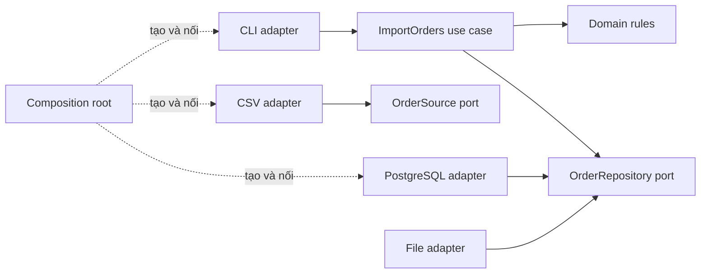
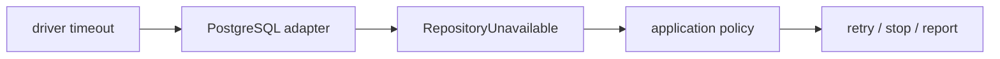

# Ports và adapters trong một pipeline dữ liệu

> [!abstract] Câu hỏi trung tâm
> Một pipeline đọc CSV, chuẩn hóa order rồi ghi vào PostgreSQL thường bắt đầu như một script. Khi nào cần tách nó, mỗi tầng sở hữu điều gì, và bằng chứng nào cho thấy ranh giới thật sự ngăn chi tiết lưu trữ lọt vào core?

## 1. Ca thay đổi dùng để kiểm kiến trúc

Ta dùng một phép thử cụ thể thay cho nhận xét “kiến trúc sạch”:

1. bản đầu đọc order từ CSV và ghi kết quả ra tệp;
2. giữ nguyên quy tắc chuẩn hóa, loại trùng và tính tổng;
3. thay đầu ra bằng PostgreSQL;
4. không sửa bất kỳ phép kiểm core nào;
5. core không import CSV parser, ORM, driver hoặc type của framework.

Nếu phép thay này buộc sửa domain object, use case hoặc core test, chi tiết I/O đã đi qua boundary.

## 2. Bốn phần, không phải ba thư mục trang trí

| Phần | Sở hữu | Được biết | Không được biết |
|---|---|---|---|
| Domain | quy tắc và invariant nghiệp vụ | value object, entity, domain error | CSV, SQL, HTTP, ORM |
| Application | trình tự một use case và transaction intent | domain, port do nó cần | driver và cấu hình triển khai |
| Port | contract đi vào hoặc đi ra core | type ổn định của core | type của adapter cụ thể |
| Adapter | dịch contract ngoài sang port và ngược lại | thư viện, schema, protocol | quyền thay đổi luật nghiệp vụ |

Composition root đứng ngoài bốn phần trên. Nó tạo object cụ thể và nối dependency khi khởi động.

> [!source-fact]
> Richardson mô tả hexagonal architecture với business logic ở giữa, inbound adapter gọi inbound port, outbound adapter cài outbound port, và business logic không phụ thuộc adapter. *Microservices Patterns*, Chapter 2, PDF 68–70.

### Port là contract do phía dùng sở hữu

Outbound port được đặt gần application/core vì nó phát biểu đúng nhu cầu của use case. PostgreSQL adapter phải thích nghi với contract này. Nếu interface được thiết kế theo API của ORM, core vẫn đang phụ thuộc công nghệ dù file interface nằm trong thư mục `ports`.

### Adapter là bộ dịch ở boundary

- inbound adapter: CLI, HTTP handler, scheduler, message consumer;
- outbound adapter: CSV reader, filesystem writer, PostgreSQL repository, object storage client;
- adapter chuyển type ngoài sang type core;
- adapter dịch lỗi thư viện sang error vocabulary của application.

> [!source-fact]
> Sommerville yêu cầu interface nêu signature và semantics nhưng không lộ representation. Khi biểu diễn dữ liệu được giấu, implementation có thể đổi mà client không bị ảnh hưởng. *Software Engineering*, Chapter 7, PDF 208–209.

## 3. Dependency graph đúng chiều



Mũi tên biểu diễn source dependency. Runtime call có thể đi từ use case ra PostgreSQL adapter, nhưng source code của adapter phụ thuộc port do core sở hữu.

## 4. Cấu trúc tối thiểu cho bài nạp CSV

```text
src/
  domain/
    order.py
    normalization.py
  application/
    import_orders.py
    ports.py
  adapters/
    inbound/cli.py
    outbound/csv_source.py
    outbound/file_repository.py
    outbound/postgres_repository.py
  bootstrap.py
tests/
  core/test_import_orders.py
  adapters/test_csv_source.py
  adapters/test_postgres_repository.py
```

Tên thư mục không tạo boundary. Import rule và replacement test mới làm việc đó.

## 5. Domain model không mang dấu vết lưu trữ

Một `Order` trong core có thể gồm:

```python
@dataclass(frozen=True)
class Order:
    order_id: OrderId
    customer_id: CustomerId
    occurred_at: datetime
    amount: Decimal
```

Các dấu hiệu rò rỉ:

- decorator của ORM trên entity;
- `DataFrame`, `Row`, `Cursor`, `Session` trong chữ ký core;
- tên field bám theo cột legacy thay vì từ vựng miền;
- `SQLException` hoặc parser error xuất hiện trong error contract công khai;
- core tự đọc environment variable hoặc connection string.

## 6. Thiết kế port từ nhu cầu của use case

```python
class OrderSource(Protocol):
    def read(self) -> Iterable[OrderCandidate]: ...

class OrderRepository(Protocol):
    def existing_ids(self, ids: set[OrderId]) -> set[OrderId]: ...
    def save(self, orders: Sequence[Order]) -> SaveReport: ...
```

Port không cần phản chiếu toàn bộ database API. Nó nên:

- dùng type thuộc core;
- có operation theo nhu cầu nghiệp vụ;
- nói rõ atomicity, ordering và duplicate semantics;
- khai báo failure mà application có thể xử lý;
- đủ hẹp để adapter khác cài được mà không giả lập cả database.

> [!synthesis]
> Richardson cung cấp cấu trúc port/adapter; Sommerville cung cấp nguyên tắc giấu representation; Newman xem boundary là tập assumptions. Ghép ba cách nhìn cho một tiêu chí: port tốt làm giảm số assumption công nghệ mà core phải biết, nhưng vẫn giữ đủ semantics để use case đúng.

## 7. Application service điều phối, không chứa driver

```python
class ImportOrders:
    def __init__(self, source: OrderSource, repository: OrderRepository):
        self.source = source
        self.repository = repository

    def execute(self) -> ImportReport:
        candidates = list(self.source.read())
        valid, rejected = normalize_and_validate(candidates)
        known = self.repository.existing_ids({x.order_id for x in valid})
        new_orders = [x for x in valid if x.order_id not in known]
        saved = self.repository.save(new_orders)
        return ImportReport(saved=saved.count, rejected=rejected)
```

Application quyết định trình tự và policy. Adapter quyết định cách đọc/ghi cụ thể.

## 8. Composition root là nơi duy nhất biết object cụ thể

```python
def build_import_job(settings: Settings) -> ImportOrders:
    source = CsvOrderSource(settings.input_path)
    repository = PostgresOrderRepository(settings.database_url)
    return ImportOrders(source, repository)
```

Không đặt factory này trong domain. Nó thuộc outermost layer vì biết mọi implementation.

## 9. Dịch dữ liệu tại boundary

CSV adapter chịu trách nhiệm:

1. đọc encoding và delimiter;
2. kiểm header vật lý;
3. chuyển string thành `OrderCandidate`;
4. gắn locator dòng/tệp cho lỗi;
5. không tự quyết định quy tắc nghiệp vụ như giới hạn giá trị order.

PostgreSQL adapter chịu trách nhiệm:

1. ánh xạ value object sang cột;
2. quản lý connection/transaction theo contract;
3. dùng parameterized statement;
4. ánh xạ unique violation hoặc timeout sang error của port;
5. không trả ORM entity ra core.

## 10. Dịch lỗi tại boundary



Adapter giữ original exception làm cause để chẩn đoán, nhưng application nhận vocabulary ổn định. Chi tiết phân loại lỗi được mở rộng ở [[Error Design for Data Pipelines|Thiết kế lỗi cho pipeline dữ liệu]].

## 11. Core test không dùng tệp hoặc database

```python
def test_import_skips_existing_order():
    source = InMemorySource([candidate("O-1"), candidate("O-2")])
    repository = InMemoryRepository(existing={OrderId("O-1")})

    report = ImportOrders(source, repository).execute()

    assert repository.saved_ids == {OrderId("O-2")}
    assert report.saved == 1
```

In-memory implementation ở đây là test adapter của port, không mô phỏng chi tiết bên trong use case. Test chỉ quan sát behavior công khai.

## 12. Adapter test giữ việc tích hợp ở đúng tầng

| Test | Hạ tầng thật | Câu hỏi |
|---|---:|---|
| core test | không | luật nghiệp vụ và orchestration đúng không? |
| CSV adapter test | tệp tạm thật | header, encoding và locator được dịch đúng không? |
| PostgreSQL adapter test | PostgreSQL thật trong môi trường test | mapping, constraint và transaction đúng không? |
| acceptance test | cả pipeline tối thiểu | các contract ghép lại có chạy không? |

Không dùng in-memory repository để kết luận SQL và constraint thật hoạt động.

## 13. Replacement experiment

### Trước thay đổi

```text
Composition root -> FileOrderRepository -> JSONL output
```

### Sau thay đổi

```text
Composition root -> PostgresOrderRepository -> orders table
```

Danh mục thay đổi hợp lệ:

| Tệp | Hành động | Lý do |
|---|---|---|
| `postgres_repository.py` | thêm | implementation mới |
| `bootstrap.py` | sửa | chọn adapter mới |
| `test_postgres_repository.py` | thêm | kiểm contract với PostgreSQL thật |
| core files | không đổi | storage không thuộc policy |
| core tests | không đổi | behavior contract giữ nguyên |

Số file nhỏ chỉ là proxy. Tiêu chí mạnh hơn là **loại file** phải đổi: core và core test bằng 0.

## 14. Kiểm tự động ranh giới import

Một rule tối thiểu:

```text
domain      may import: standard library, domain
application may import: standard library, domain, application ports
adapters    may import: domain, application, external libraries
bootstrap   may import: everything required to compose
```

CI cần fail nếu `domain` hoặc `application` import ORM, database driver hay adapter package.

## 15. Khi nào không nên dựng đủ cấu trúc này

Ports/adapters có chi phí: thêm interface, mapping, test contract và composition. Không nên áp máy móc cho script dùng một lần khi:

- lifetime ngắn và không có yêu cầu đổi I/O;
- một người sở hữu toàn bộ, không có boundary cần bảo vệ;
- cost of failure thấp;
- mapping nhiều hơn logic nghiệp vụ.

Tín hiệu nên đầu tư:

- có ít nhất hai adapter cùng một capability;
- logic sống lâu hơn công nghệ I/O;
- core cần kiểm nhanh, không phụ thuộc hạ tầng;
- thay storage/protocol là scenario có thật;
- nhiều đội phát triển hai phía boundary.

> [!source-fact]
> Newman lưu ý không có cách tổ chức code tốt tuyệt đối; cohesion và coupling là ngôn ngữ để nói rõ trade-off quanh boundary. *Building Microservices*, Chapter 2, PDF 57–61.

## 16. Bằng chứng cho DE-L091

Nộp một evidence pack gồm:

1. dependency graph trước và sau;
2. import-policy report;
3. danh sách core test cùng checksum trước/sau;
4. test result với file adapter;
5. test result với PostgreSQL adapter;
6. changed-file manifest có phân loại core/application/adapter/bootstrap;
7. error translation table cho adapter mới;
8. decision note giải thích vì sao mức tách này xứng đáng.

### Lệnh kiểm chứng gợi ý

```bash
sha256sum tests/core/*.py
git diff --name-only BEFORE_ADAPTER_REPLACEMENT..AFTER_ADAPTER_REPLACEMENT
pytest tests/core tests/adapters
```

Không dùng chỉ một ảnh chụp “tests passed”; cần command, exit status và commit hoặc tree hash.

## 17. Ma trận chấm

| Tiêu chí | Đạt | Không đạt |
|---|---|---|
| Dependency direction | core chỉ trỏ vào contract nó sở hữu | core import adapter hoặc thư viện ngoài |
| Type boundary | chữ ký core dùng type core | ORM/DataFrame/driver type lọt vào |
| Error boundary | lỗi được dịch và giữ cause | lỗi thư viện lan ra hoặc mất context |
| Replacement | core test không đổi và xanh | phải sửa expectation/fixture core |
| Integration proof | adapter test dùng hệ thật | chỉ dùng fake rồi kết luận PostgreSQL đúng |
| Proportionality | decision note nêu cost/benefit | thêm tầng theo mẫu mà không có pressure |

## 18. Ngộ nhận thường gặp

- “Có interface là đã đảo dependency”: sai nếu interface chứa type của framework.
- “Repository phải có CRUD”: sai; port diễn đạt nhu cầu use case, không nhân API database.
- “Mọi adapter phải thay nóng”: không cần nếu contract không yêu cầu runtime plugin.
- “Core test xanh chứng minh adapter đúng”: core test không kiểm SQL, transaction hay constraint.
- “Composition root là service locator toàn cục”: composition diễn ra lúc khởi động; core không tự kéo dependency từ registry.
- “Ba tầng đồng nghĩa ba deployment”: đây là source boundary; vẫn có thể là một executable.

## 19. Câu hỏi tự kiểm tra

1. Ai sở hữu outbound port và vì sao?
2. Runtime call và source dependency ngược chiều ở đâu?
3. Ba dấu hiệu type hoặc error leakage là gì?
4. Vì sao `Session` trong use-case signature làm replacement test mất ý nghĩa?
5. Core test chứng minh được gì và không chứng minh được gì?
6. Composition root biết những gì mà domain không được biết?
7. Khi nào in-memory adapter là hợp lệ?
8. File count và file category khác nhau thế nào trong replacement experiment?
9. Khi nào ports/adapters là overengineering?
10. Evidence nào chứng minh core test thật sự không bị sửa?

## Source coverage

| Source slice | Nội dung phải giữ | Vị trí trong note | Trạng thái |
|---|---|---|---|
| [[SRC-RICHARDSON-MICROSERVICES-PATTERNS-1E]], Ch. 2 pp. 68–73 | hexagonal architecture, inbound/outbound port và adapter | §§2–4, 6–8 | Đã trình bày bằng dependency graph và cấu trúc code |
| [[SRC-NEWMAN-BUILDING-MICROSERVICES-2E]], Ch. 2 pp. 56–61 | information hiding, coupling và boundary trade-off | §§1–3, 13–15 | Đã trình bày qua replacement experiment và điều kiện không nên tách |
| [[SRC-SOMMERVILLE-SOFTWARE-ENGINEERING-10E]], Ch. 7 pp. 208–212 | component/interface decomposition | §§5–12 | Đã trình bày domain type, port contract, mapping và adapter test |
| Tổng hợp bài DE-L091 | pipeline CSV/PostgreSQL, import policy, evidence pack và rubric | §§4–17 | Đã gắn `synthesis`; code là teaching specification, chưa phải output lab đã chạy |

Framework-specific DI container, ORM và database behavior không thuộc lát nguồn. Note đặt chúng sau port boundary và yêu cầu integration evidence riêng.

## Key takeaways
- Port là contract do phía cần capability sở hữu; adapter dịch công nghệ cụ thể vào contract đó.
- Boundary đạt yêu cầu khi type, lỗi và schema của thư viện không lọt vào core.
- Composition root là chỗ duy nhất nối implementation cụ thể.
- Core test nhanh và độc lập; adapter test vẫn phải dùng I/O hoặc database thật ở tầng tích hợp.
- Phép đổi file storage sang PostgreSQL, kèm checksum core test và changed-file manifest, là bằng chứng mạnh hơn sơ đồ thư mục.
- Không áp cấu trúc này cho mọi script; quyết định dựa vào lifetime, change pressure và cost of failure.

## 21. Giới hạn

- Pipeline và code snippet là mô hình giảng dạy, chưa chạy trên repository thực của Bài 32.
- Chưa chọn framework dependency checker hoặc PostgreSQL test harness cụ thể.
- Transaction boundary chỉ được nêu ở contract; phần triển khai sâu thuộc bài backend sau.
- Không kết luận hexagonal architecture tốt hơn cho mọi hệ thống.
- Ba nguồn tập trung vào software/service design; benchmark chi phí mapping chưa được thực hiện.

## 22. Liên kết chương trình

- Tiền đề: [[Cohesion Coupling and Dependency Direction|Độ gắn kết độ phụ thuộc và chiều phụ thuộc]].
- Bài áp dụng: `DE-L091`.
- Bài kế tiếp dùng error boundary: [[Error Design for Data Pipelines|Thiết kế lỗi cho pipeline dữ liệu]].

## Reference
1. [[SRC-RICHARDSON-MICROSERVICES-PATTERNS-1E]] — Chris Richardson, *Microservices Patterns*, Chapter 2, PDF 68–73.
2. [[SRC-NEWMAN-BUILDING-MICROSERVICES-2E]] — Sam Newman, *Building Microservices*, Second Edition, Chapter 2, PDF 56–61.
3. [[SRC-SOMMERVILLE-SOFTWARE-ENGINEERING-10E]] — Ian Sommerville, *Software Engineering*, Chapter 7, PDF 208–212.

## Lịch sử biên tập

| Ngày | Trạng thái | Thay đổi |
|---|---|---|
| 2026-09-28 | `review` | Đọc 17 trang từ ba nguồn; xây cấu trúc port/adapter, pipeline mẫu, replacement experiment, evidence pack và Humanizer tiếng Việt |

<!-- ATOMIC-EXECUTION-CAPSULE:START -->

## Execution capsule — kiểm chứng `wiki.software-engineering.ports-adapters-data-pipeline`

> [!important] Phân loại mệnh đề
> Với `wiki.software-engineering.ports-adapters-data-pipeline`, sơ đồ, ví dụ và artifact về **Ports và adapters trong một pipeline dữ liệu** là **synthesis để kiểm chứng**; chúng không phải trích dẫn hay case nguyên văn của nguồn.

### Tự kiểm tra trước khi tái sử dụng

1. Bạn có thể trả lời `Làm sao tách một pipeline nạp dữ liệu thành core, application, port và adapter để đổi CSV sang PostgreSQL mà không sửa phép kiểm lõi?` bằng một câu mà không kéo thêm concept thứ hai không?
2. Source locator nào đỡ cho claim, và phần nào chỉ là synthesis trong note?
3. Observation nào khiến bạn dừng, thu hẹp hoặc đảo quyết định?
4. Artifact nào cho phép một reviewer độc lập tái hiện kết quả?

<!-- ATOMIC-EXECUTION-CAPSULE:END -->
