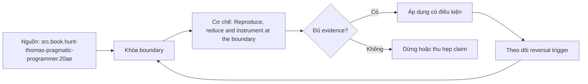

# Reproduce, reduce and instrument at the boundary

**Tóm tắt bản chất:** khóa input/version/seed, giảm case nhưng giữ failure, rồi đo state trước-sau ở boundary nơi semantics đổi Sai boundary ở `reproduction, minimal failing case và instrumentation tại boundary` làm kết quả có vẻ đúng trong happy path nhưng không chịu được failure hoặc changed constraint.

> [!abstract] Câu hỏi trung tâm
> Làm thế nào mô hình, kiểm chứng và áp dụng reproduction, minimal failing case và instrumentation tại boundary?

## Problem Definition and Operational Relevance

khóa input/version/seed, giảm case nhưng giữ failure, rồi đo state trước-sau ở boundary nơi semantics đổi Với `wiki.de-foundation.reproduce-reduce-instrument-boundary`, điểm phải khóa là state transition và invariant; nếu trường nào chưa biết thì ghi unknown và nêu impact-if-wrong thay vì tự điền mặc định.

Không có mô hình này, lỗi thường lộ ở consumer sau cùng: output sai, latency vọt, resource không được giải phóng hoặc lịch sử không còn tái hiện được. Chi phí thật của `Reproduce, reduce and instrument at the boundary` vì thế nằm ở thời gian chẩn đoán và phạm vi phục hồi, không nằm ở số dòng syntax.

## Mechanism

minimal case phải giữ causal condition; instrumentation phải có identity và không thay đổi timing quá mức Với `wiki.de-foundation.reproduce-reduce-instrument-boundary`, điểm phải khóa là identity, ownership và boundary; nếu trường nào chưa biết thì ghi unknown và nêu impact-if-wrong thay vì tự điền mặc định.

Hãy tách declared state, executed state và published state của `reproduction, minimal failing case và instrumentation tại boundary`. Một command thành công chỉ là executed signal; muốn kết luận cần đối soát consumer-visible invariant và trạng thái còn lại sau restart hoặc replay.

## Decision Framework

case quá nhỏ có thể làm race biến mất; log thiếu correlation trộn hai executions thành một Với `wiki.de-foundation.reproduce-reduce-instrument-boundary`, điểm phải khóa là failure path và recovery; nếu trường nào chưa biết thì ghi unknown và nêu impact-if-wrong thay vì tự điền mặc định.

Quy tắc mặc định cho `Reproduce, reduce and instrument at the boundary` là chọn phương án đơn giản nhất qua được hard constraints, rồi ghi rõ điều kiện đảo. Bảng quyết định tối thiểu gồm workload, identity, state owner, time/memory budget, failure domain và khả năng rollback.

## Worked Case: Reproduce, reduce and instrument at the boundary

giảm theo delta có oracle, instrument trước và sau transform, dừng khi case còn đủ đại diện Với `wiki.de-foundation.reproduce-reduce-instrument-boundary`, điểm phải khóa là decision trade-off và reversal trigger; nếu trường nào chưa biết thì ghi unknown và nêu impact-if-wrong thay vì tự điền mặc định.

Case dùng fixture nhỏ nhưng phải giữ cơ chế chi phối. Trước khi chạy, learner viết expected transition; sau khi chạy, họ đối chiếu raw artifact với oracle và giải thích mọi khác biệt thay vì sửa expected cho khớp output.

## Limits and Common Errors

fixture, seed, command, trace/counters, expected signal và negative control Với `wiki.de-foundation.reproduce-reduce-instrument-boundary`, điểm phải khóa là evidence package và oracle; nếu trường nào chưa biết thì ghi unknown và nêu impact-if-wrong thay vì tự điền mặc định.

**Hiểu lầm:** Happy path chạy nhanh nghĩa là thiết kế đúng. **Thực tế:** case quá nhỏ có thể làm race biến mất; log thiếu correlation trộn hai executions thành một **Vì sao nghe hợp lý:** case nhỏ thường không chạm capacity, concurrency, failure hoặc version boundary.

**Hiểu lầm:** Tool hoặc API tự bảo đảm semantics. **Thực tế:** guarantee chỉ tồn tại trong scope và state đã công bố. **Vì sao nghe hợp lý:** syntax che mất protocol phía dưới.

## Nếu Bạn Dạy Lại Điều Này...

thay concurrency hoặc order để chứng minh reproduction ổn định chứ không phải may mắn Với `wiki.de-foundation.reproduce-reduce-instrument-boundary`, điểm phải khóa là changed-constraint transfer; nếu trường nào chưa biết thì ghi unknown và nêu impact-if-wrong thay vì tự điền mặc định.

Hook dạy lại bắt đầu bằng một dự đoán dễ sai về `reproduction, minimal failing case và instrumentation tại boundary`. Bài tập seed đổi đúng một constraint, yêu cầu learner giữ hoặc đảo quyết định và chỉ ra evidence nào đủ mạnh để thuyết phục một reviewer không tham dự buổi học.

## Ma trận kiểm chứng từng mệnh đề

Protocol riêng của `Reproduce, reduce and instrument at the boundary` là: fixture, seed, command, trace/counters, expected signal và negative control Mỗi probe nối input boundary với failure signal và oracle có thể bác bỏ kết luận.

### Probe 1: state transition và invariant

**Mệnh đề cần kiểm.** khóa input/version/seed, giảm case nhưng giữ failure, rồi đo state trước-sau ở boundary nơi semantics đổi

**Thiết kế phép thử cho `wiki.de-foundation.reproduce-reduce-instrument-boundary`.** Với `wiki.de-foundation.reproduce-reduce-instrument-boundary`, tạo positive và negative control chỉ khác một điều kiện; khóa input snapshot, phiên bản, seed, identity và state ban đầu. Viết expected result trước execution để tránh đổi tiêu chí sau khi nhìn output.

**Bằng chứng cần giữ.** Lưu command hoặc harness, raw observation, transition trước-sau, coverage và limitation. Kết luận chỉ đạt khi oracle độc lập khớp ở đúng grain; nếu chưa chạy, phần này vẫn là protocol chứ không phải observation.

### Probe 2: identity, ownership và boundary

**Mệnh đề cần kiểm.** minimal case phải giữ causal condition; instrumentation phải có identity và không thay đổi timing quá mức

**Thiết kế phép thử cho `wiki.de-foundation.reproduce-reduce-instrument-boundary`.** Với `wiki.de-foundation.reproduce-reduce-instrument-boundary`, tạo boundary case ngay trước và sau ngưỡng; khóa input snapshot, phiên bản, seed, identity và state ban đầu. Viết expected result trước execution để tránh đổi tiêu chí sau khi nhìn output.

**Bằng chứng cần giữ.** Lưu command hoặc harness, raw observation, transition trước-sau, coverage và limitation. Kết luận chỉ đạt khi oracle độc lập khớp ở đúng grain; nếu chưa chạy, phần này vẫn là protocol chứ không phải observation.

### Probe 3: failure path và recovery

**Mệnh đề cần kiểm.** case quá nhỏ có thể làm race biến mất; log thiếu correlation trộn hai executions thành một

**Thiết kế phép thử cho `wiki.de-foundation.reproduce-reduce-instrument-boundary`.** Với `wiki.de-foundation.reproduce-reduce-instrument-boundary`, tạo replay cùng identity với state khác; khóa input snapshot, phiên bản, seed, identity và state ban đầu. Viết expected result trước execution để tránh đổi tiêu chí sau khi nhìn output.

**Bằng chứng cần giữ.** Lưu command hoặc harness, raw observation, transition trước-sau, coverage và limitation. Kết luận chỉ đạt khi oracle độc lập khớp ở đúng grain; nếu chưa chạy, phần này vẫn là protocol chứ không phải observation.

### Probe 4: decision trade-off và reversal trigger

**Mệnh đề cần kiểm.** giảm theo delta có oracle, instrument trước và sau transform, dừng khi case còn đủ đại diện

**Thiết kế phép thử cho `wiki.de-foundation.reproduce-reduce-instrument-boundary`.** Với `wiki.de-foundation.reproduce-reduce-instrument-boundary`, tạo failure inject trước và sau durable transition; khóa input snapshot, phiên bản, seed, identity và state ban đầu. Viết expected result trước execution để tránh đổi tiêu chí sau khi nhìn output.

**Bằng chứng cần giữ.** Lưu command hoặc harness, raw observation, transition trước-sau, coverage và limitation. Kết luận chỉ đạt khi oracle độc lập khớp ở đúng grain; nếu chưa chạy, phần này vẫn là protocol chứ không phải observation.

### Probe 5: evidence package và oracle

**Mệnh đề cần kiểm.** fixture, seed, command, trace/counters, expected signal và negative control

**Thiết kế phép thử cho `wiki.de-foundation.reproduce-reduce-instrument-boundary`.** Với `wiki.de-foundation.reproduce-reduce-instrument-boundary`, tạo changed scale làm cost model đổi; khóa input snapshot, phiên bản, seed, identity và state ban đầu. Viết expected result trước execution để tránh đổi tiêu chí sau khi nhìn output.

**Bằng chứng cần giữ.** Lưu command hoặc harness, raw observation, transition trước-sau, coverage và limitation. Kết luận chỉ đạt khi oracle độc lập khớp ở đúng grain; nếu chưa chạy, phần này vẫn là protocol chứ không phải observation.

### Probe 6: changed-constraint transfer

**Mệnh đề cần kiểm.** thay concurrency hoặc order để chứng minh reproduction ổn định chứ không phải may mắn

**Thiết kế phép thử cho `wiki.de-foundation.reproduce-reduce-instrument-boundary`.** Với `wiki.de-foundation.reproduce-reduce-instrument-boundary`, tạo adversarial order hoặc skew; khóa input snapshot, phiên bản, seed, identity và state ban đầu. Viết expected result trước execution để tránh đổi tiêu chí sau khi nhìn output.

**Bằng chứng cần giữ.** Lưu command hoặc harness, raw observation, transition trước-sau, coverage và limitation. Kết luận chỉ đạt khi oracle độc lập khớp ở đúng grain; nếu chưa chạy, phần này vẫn là protocol chứ không phải observation.

### Probe 7: state transition và invariant

**Mệnh đề cần kiểm.** khóa input/version/seed, giảm case nhưng giữ failure, rồi đo state trước-sau ở boundary nơi semantics đổi

**Thiết kế phép thử cho `wiki.de-foundation.reproduce-reduce-instrument-boundary`.** Với `wiki.de-foundation.reproduce-reduce-instrument-boundary`, tạo fresh environment không cache; khóa input snapshot, phiên bản, seed, identity và state ban đầu. Viết expected result trước execution để tránh đổi tiêu chí sau khi nhìn output.

**Bằng chứng cần giữ.** Lưu command hoặc harness, raw observation, transition trước-sau, coverage và limitation. Kết luận chỉ đạt khi oracle độc lập khớp ở đúng grain; nếu chưa chạy, phần này vẫn là protocol chứ không phải observation.

### Probe 8: identity, ownership và boundary

**Mệnh đề cần kiểm.** minimal case phải giữ causal condition; instrumentation phải có identity và không thay đổi timing quá mức

**Thiết kế phép thử cho `wiki.de-foundation.reproduce-reduce-instrument-boundary`.** Với `wiki.de-foundation.reproduce-reduce-instrument-boundary`, tạo independent oracle không dùng chung implementation; khóa input snapshot, phiên bản, seed, identity và state ban đầu. Viết expected result trước execution để tránh đổi tiêu chí sau khi nhìn output.

**Bằng chứng cần giữ.** Lưu command hoặc harness, raw observation, transition trước-sau, coverage và limitation. Kết luận chỉ đạt khi oracle độc lập khớp ở đúng grain; nếu chưa chạy, phần này vẫn là protocol chứ không phải observation.

### Probe 9: failure path và recovery

**Mệnh đề cần kiểm.** case quá nhỏ có thể làm race biến mất; log thiếu correlation trộn hai executions thành một

**Thiết kế phép thử cho `wiki.de-foundation.reproduce-reduce-instrument-boundary`.** Với `wiki.de-foundation.reproduce-reduce-instrument-boundary`, tạo partial progress rồi restart; khóa input snapshot, phiên bản, seed, identity và state ban đầu. Viết expected result trước execution để tránh đổi tiêu chí sau khi nhìn output.

**Bằng chứng cần giữ.** Lưu command hoặc harness, raw observation, transition trước-sau, coverage và limitation. Kết luận chỉ đạt khi oracle độc lập khớp ở đúng grain; nếu chưa chạy, phần này vẫn là protocol chứ không phải observation.

### Probe 10: decision trade-off và reversal trigger

**Mệnh đề cần kiểm.** giảm theo delta có oracle, instrument trước và sau transform, dừng khi case còn đủ đại diện

**Thiết kế phép thử cho `wiki.de-foundation.reproduce-reduce-instrument-boundary`.** Với `wiki.de-foundation.reproduce-reduce-instrument-boundary`, tạo missing evidence phải abstain; khóa input snapshot, phiên bản, seed, identity và state ban đầu. Viết expected result trước execution để tránh đổi tiêu chí sau khi nhìn output.

**Bằng chứng cần giữ.** Lưu command hoặc harness, raw observation, transition trước-sau, coverage và limitation. Kết luận chỉ đạt khi oracle độc lập khớp ở đúng grain; nếu chưa chạy, phần này vẫn là protocol chứ không phải observation.

### Probe 11: evidence package và oracle

**Mệnh đề cần kiểm.** fixture, seed, command, trace/counters, expected signal và negative control

**Thiết kế phép thử cho `wiki.de-foundation.reproduce-reduce-instrument-boundary`.** Với `wiki.de-foundation.reproduce-reduce-instrument-boundary`, tạo reviewer tái hiện từ package; khóa input snapshot, phiên bản, seed, identity và state ban đầu. Viết expected result trước execution để tránh đổi tiêu chí sau khi nhìn output.

**Bằng chứng cần giữ.** Lưu command hoặc harness, raw observation, transition trước-sau, coverage và limitation. Kết luận chỉ đạt khi oracle độc lập khớp ở đúng grain; nếu chưa chạy, phần này vẫn là protocol chứ không phải observation.

### Probe 12: changed-constraint transfer

**Mệnh đề cần kiểm.** thay concurrency hoặc order để chứng minh reproduction ổn định chứ không phải may mắn

**Thiết kế phép thử cho `wiki.de-foundation.reproduce-reduce-instrument-boundary`.** Với `wiki.de-foundation.reproduce-reduce-instrument-boundary`, tạo constraint đổi đủ để quyết định đảo; khóa input snapshot, phiên bản, seed, identity và state ban đầu. Viết expected result trước execution để tránh đổi tiêu chí sau khi nhìn output.

**Bằng chứng cần giữ.** Lưu command hoặc harness, raw observation, transition trước-sau, coverage và limitation. Kết luận chỉ đạt khi oracle độc lập khớp ở đúng grain; nếu chưa chạy, phần này vẫn là protocol chứ không phải observation.

## Tự Kiểm Tra Nhanh

1. Boundary đầu tiên của `reproduction, minimal failing case và instrumentation tại boundary` nằm ở đâu?

<details><summary>Đáp án</summary>minimal case phải giữ causal condition; instrumentation phải có identity và không thay đổi timing quá mức</details>

2. Failure nào dễ tạo kết quả xanh giả nhất?

<details><summary>Đáp án</summary>case quá nhỏ có thể làm race biến mất; log thiếu correlation trộn hai executions thành một</details>

3. Constraint nào khiến quyết định phải đảo?

<details><summary>Đáp án</summary>thay concurrency hoặc order để chứng minh reproduction ổn định chứ không phải may mắn</details>

## Giới hạn và điều chưa cho phép kết luận

- Lab của `Reproduce, reduce and instrument at the boundary` chưa được tuyên bố đã chạy trên production; note mô tả curriculum và expected evidence.
- Mọi kết luận phụ thuộc version, workload, operating system, interpreter/compiler hoặc hardware phải được kiểm lại trên target.
- Concept key `ck.de.reproduce-reduce-instrument-boundary` đã được owner phê duyệt `canonical`; note thuộc canonical registry coverage. Trạng thái này không tự chứng minh learner mastery.
- Note giữ trạng thái `review` cho tới khi owner duyệt semantics và learner artifact.

## Reference
1. [[SRC-HUNT-THOMAS-PRAGMATIC-PROGRAMMER-20AE]]
2. [[SRC-SOMMERVILLE-SOFTWARE-ENGINEERING-10E]]
3. [[SRC-GOOGLE-SRE-MONITORING]]

## Source coverage

| Source slice | Locator | Kiến thức phải giữ | Vị trí | Trạng thái | Ngoài phạm vi |
|---|---|---|---|---|---|
| [[SRC-HUNT-THOMAS-PRAGMATIC-PROGRAMMER-20AE]]: `src.book.hunt-thomas-pragmatic-programmer.20ae` | Topic 10 PDF 76-83; Topics 23-25 PDF 148-166; Topic 40 PDF 276-280 | cơ chế và boundary liên quan trực tiếp tới `reproduction, minimal failing case và instrumentation tại boundary` | các mục cơ chế, quyết định và probe | Đã phủ | phần ngoài objective DE-L009 |
| [[SRC-SOMMERVILLE-SOFTWARE-ENGINEERING-10E]]: `src.book.sommerville-software-engineering.10e` | Chapters 4, 7, 8 và 25; PDF 103-132, 169-212, 228-242, 732-756 | cơ chế và boundary liên quan trực tiếp tới `reproduction, minimal failing case và instrumentation tại boundary` | các mục cơ chế, quyết định và probe | Đã phủ | phần ngoài objective DE-L009 |
| [[SRC-GOOGLE-SRE-MONITORING]]: `src.web.google-sre-monitoring` | Monitoring distributed systems; accessed 2026-10-01 | cơ chế và boundary liên quan trực tiếp tới `reproduction, minimal failing case và instrumentation tại boundary` | các mục cơ chế, quyết định và probe | Đã phủ | phần ngoài objective DE-L009 |

## Key takeaways
- giảm theo delta có oracle, instrument trước và sau transform, dừng khi case còn đủ đại diện
- fixture, seed, command, trace/counters, expected signal và negative control
- `reproduction, minimal failing case và instrumentation tại boundary` chỉ có nghĩa trong scope, identity, state và version đã ghi.
- Trước khi lab chạy, đây là note có provenance và protocol, chưa phải production evidence hay bằng chứng mastery.

<!-- ATOMIC-EXECUTION-CAPSULE:START -->

## Execution capsule: kiểm chứng `wiki.de-foundation.reproduce-reduce-instrument-boundary`

> [!important] Phân loại mệnh đề
> Với `wiki.de-foundation.reproduce-reduce-instrument-boundary`, sơ đồ, ví dụ và artifact về **Reproduce, reduce and instrument at the boundary** là **synthesis để kiểm chứng**; chúng không phải trích dẫn hay case nguyên văn của nguồn.

### Sơ đồ cơ chế và điểm kiểm soát



Đọc sơ đồ `wiki.de-foundation.reproduce-reduce-instrument-boundary` từ trái sang phải: source chỉ cung cấp claim ban đầu cho **Reproduce, reduce and instrument at the boundary**; quyết định chỉ được đi tiếp sau khi boundary, evidence và điều kiện đảo quyết định đã hiện hữu.

### Artifact thực thi tối thiểu

```python
from dataclasses import dataclass

@dataclass(frozen=True)
class WikiDeFoundationReproduceReduceInstrumentBEvidence:
    boundary_declared: bool
    independent_oracle: bool
    reversal_trigger: str

    def accepted(self) -> bool:
        return (
            self.boundary_declared
            and self.independent_oracle
            and bool(self.reversal_trigger.strip())
        )

# Concept: Reproduce, reduce and instrument at the boundary
# Primary question: Làm thế nào mô hình, kiểm chứng và áp dụng reproduction, minimal failing case và instrumentation tại boundary?
evidence = WikiDeFoundationReproduceReduceInstrumentBEvidence(
    boundary_declared=True,
    independent_oracle=True,
    reversal_trigger="Đảo quyết định khi hard constraint bị vi phạm",
)
assert evidence.accepted()
```

Artifact của `wiki.de-foundation.reproduce-reduce-instrument-boundary` buộc người dùng ghi boundary, oracle và reversal trigger cho **Reproduce, reduce and instrument at the boundary**. Các giá trị minh họa phải được thay bằng evidence thật trước khi dùng cho quyết định.

<!-- ATOMIC-EXECUTION-CAPSULE:END -->
