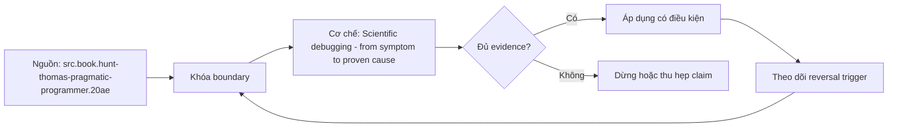

# Scientific debugging - from symptom to proven cause

**Tóm tắt bản chất:** capture symptom, dựng hypothesis có prediction, thay một biến và chạy phép thử phân biệt trước khi fix Sai boundary ở `scientific debugging từ symptom tới nguyên nhân đã được chứng minh` làm kết quả có vẻ đúng trong happy path nhưng không chịu được failure hoặc changed constraint.

> [!abstract] Câu hỏi trung tâm
> Làm thế nào mô hình, kiểm chứng và áp dụng scientific debugging từ symptom tới nguyên nhân đã được chứng minh?

## Problem Definition and Operational Relevance

capture symptom, dựng hypothesis có prediction, thay một biến và chạy phép thử phân biệt trước khi fix Với `wiki.de-foundation.scientific-debugging-symptom-proven-cause`, điểm phải khóa là state transition và invariant; nếu trường nào chưa biết thì ghi unknown và nêu impact-if-wrong thay vì tự điền mặc định.

Không có mô hình này, lỗi thường lộ ở consumer sau cùng: output sai, latency vọt, resource không được giải phóng hoặc lịch sử không còn tái hiện được. Chi phí thật của `Scientific debugging - from symptom to proven cause` vì thế nằm ở thời gian chẩn đoán và phạm vi phục hồi, không nằm ở số dòng syntax.

## Mechanism

correlation trong log không đủ causality; nguyên nhân phải giải thích symptom, timing và counterfactual Với `wiki.de-foundation.scientific-debugging-symptom-proven-cause`, điểm phải khóa là identity, ownership và boundary; nếu trường nào chưa biết thì ghi unknown và nêu impact-if-wrong thay vì tự điền mặc định.

Hãy tách declared state, executed state và published state của `scientific debugging từ symptom tới nguyên nhân đã được chứng minh`. Một command thành công chỉ là executed signal; muốn kết luận cần đối soát consumer-visible invariant và trạng thái còn lại sau restart hoặc replay.

## Decision Framework

stack nhiều fix làm mất khả năng biết biến nào tác động; confirmation bias chỉ tìm evidence ủng hộ Với `wiki.de-foundation.scientific-debugging-symptom-proven-cause`, điểm phải khóa là failure path và recovery; nếu trường nào chưa biết thì ghi unknown và nêu impact-if-wrong thay vì tự điền mặc định.

Quy tắc mặc định cho `Scientific debugging - from symptom to proven cause` là chọn phương án đơn giản nhất qua được hard constraints, rồi ghi rõ điều kiện đảo. Bảng quyết định tối thiểu gồm workload, identity, state owner, time/memory budget, failure domain và khả năng rollback.

## Worked Case: Scientific debugging - from symptom to proven cause

ưu tiên earliest controllable cause và hypothesis có phép thử rẻ nhất nhưng phân biệt mạnh nhất Với `wiki.de-foundation.scientific-debugging-symptom-proven-cause`, điểm phải khóa là decision trade-off và reversal trigger; nếu trường nào chưa biết thì ghi unknown và nêu impact-if-wrong thay vì tự điền mặc định.

Case dùng fixture nhỏ nhưng phải giữ cơ chế chi phối. Trước khi chạy, learner viết expected transition; sau khi chạy, họ đối chiếu raw artifact với oracle và giải thích mọi khác biệt thay vì sửa expected cho khớp output.

## Limits and Common Errors

giữ input, environment, timeline, hypothesis ledger, raw observation và regression test Với `wiki.de-foundation.scientific-debugging-symptom-proven-cause`, điểm phải khóa là evidence package và oracle; nếu trường nào chưa biết thì ghi unknown và nêu impact-if-wrong thay vì tự điền mặc định.

**Hiểu lầm:** Happy path chạy nhanh nghĩa là thiết kế đúng. **Thực tế:** stack nhiều fix làm mất khả năng biết biến nào tác động; confirmation bias chỉ tìm evidence ủng hộ **Vì sao nghe hợp lý:** case nhỏ thường không chạm capacity, concurrency, failure hoặc version boundary.

**Hiểu lầm:** Tool hoặc API tự bảo đảm semantics. **Thực tế:** guarantee chỉ tồn tại trong scope và state đã công bố. **Vì sao nghe hợp lý:** syntax che mất protocol phía dưới.

## Nếu Bạn Dạy Lại Điều Này...

dùng một bug có hai nguyên nhân hợp lý rồi tạo observation chỉ một giả thuyết dự đoán đúng Với `wiki.de-foundation.scientific-debugging-symptom-proven-cause`, điểm phải khóa là changed-constraint transfer; nếu trường nào chưa biết thì ghi unknown và nêu impact-if-wrong thay vì tự điền mặc định.

Hook dạy lại bắt đầu bằng một dự đoán dễ sai về `scientific debugging từ symptom tới nguyên nhân đã được chứng minh`. Bài tập seed đổi đúng một constraint, yêu cầu learner giữ hoặc đảo quyết định và chỉ ra evidence nào đủ mạnh để thuyết phục một reviewer không tham dự buổi học.

## Ma trận kiểm chứng từng mệnh đề

Protocol riêng của `Scientific debugging - from symptom to proven cause` là: giữ input, environment, timeline, hypothesis ledger, raw observation và regression test Mỗi probe nối input boundary với failure signal và oracle có thể bác bỏ kết luận.

### Probe 1: state transition và invariant

**Mệnh đề cần kiểm.** capture symptom, dựng hypothesis có prediction, thay một biến và chạy phép thử phân biệt trước khi fix

**Thiết kế phép thử cho `wiki.de-foundation.scientific-debugging-symptom-proven-cause`.** Với `wiki.de-foundation.scientific-debugging-symptom-proven-cause`, tạo positive và negative control chỉ khác một điều kiện; khóa input snapshot, phiên bản, seed, identity và state ban đầu. Viết expected result trước execution để tránh đổi tiêu chí sau khi nhìn output.

**Bằng chứng cần giữ.** Lưu command hoặc harness, raw observation, transition trước-sau, coverage và limitation. Kết luận chỉ đạt khi oracle độc lập khớp ở đúng grain; nếu chưa chạy, phần này vẫn là protocol chứ không phải observation.

### Probe 2: identity, ownership và boundary

**Mệnh đề cần kiểm.** correlation trong log không đủ causality; nguyên nhân phải giải thích symptom, timing và counterfactual

**Thiết kế phép thử cho `wiki.de-foundation.scientific-debugging-symptom-proven-cause`.** Với `wiki.de-foundation.scientific-debugging-symptom-proven-cause`, tạo boundary case ngay trước và sau ngưỡng; khóa input snapshot, phiên bản, seed, identity và state ban đầu. Viết expected result trước execution để tránh đổi tiêu chí sau khi nhìn output.

**Bằng chứng cần giữ.** Lưu command hoặc harness, raw observation, transition trước-sau, coverage và limitation. Kết luận chỉ đạt khi oracle độc lập khớp ở đúng grain; nếu chưa chạy, phần này vẫn là protocol chứ không phải observation.

### Probe 3: failure path và recovery

**Mệnh đề cần kiểm.** stack nhiều fix làm mất khả năng biết biến nào tác động; confirmation bias chỉ tìm evidence ủng hộ

**Thiết kế phép thử cho `wiki.de-foundation.scientific-debugging-symptom-proven-cause`.** Với `wiki.de-foundation.scientific-debugging-symptom-proven-cause`, tạo replay cùng identity với state khác; khóa input snapshot, phiên bản, seed, identity và state ban đầu. Viết expected result trước execution để tránh đổi tiêu chí sau khi nhìn output.

**Bằng chứng cần giữ.** Lưu command hoặc harness, raw observation, transition trước-sau, coverage và limitation. Kết luận chỉ đạt khi oracle độc lập khớp ở đúng grain; nếu chưa chạy, phần này vẫn là protocol chứ không phải observation.

### Probe 4: decision trade-off và reversal trigger

**Mệnh đề cần kiểm.** ưu tiên earliest controllable cause và hypothesis có phép thử rẻ nhất nhưng phân biệt mạnh nhất

**Thiết kế phép thử cho `wiki.de-foundation.scientific-debugging-symptom-proven-cause`.** Với `wiki.de-foundation.scientific-debugging-symptom-proven-cause`, tạo failure inject trước và sau durable transition; khóa input snapshot, phiên bản, seed, identity và state ban đầu. Viết expected result trước execution để tránh đổi tiêu chí sau khi nhìn output.

**Bằng chứng cần giữ.** Lưu command hoặc harness, raw observation, transition trước-sau, coverage và limitation. Kết luận chỉ đạt khi oracle độc lập khớp ở đúng grain; nếu chưa chạy, phần này vẫn là protocol chứ không phải observation.

### Probe 5: evidence package và oracle

**Mệnh đề cần kiểm.** giữ input, environment, timeline, hypothesis ledger, raw observation và regression test

**Thiết kế phép thử cho `wiki.de-foundation.scientific-debugging-symptom-proven-cause`.** Với `wiki.de-foundation.scientific-debugging-symptom-proven-cause`, tạo changed scale làm cost model đổi; khóa input snapshot, phiên bản, seed, identity và state ban đầu. Viết expected result trước execution để tránh đổi tiêu chí sau khi nhìn output.

**Bằng chứng cần giữ.** Lưu command hoặc harness, raw observation, transition trước-sau, coverage và limitation. Kết luận chỉ đạt khi oracle độc lập khớp ở đúng grain; nếu chưa chạy, phần này vẫn là protocol chứ không phải observation.

### Probe 6: changed-constraint transfer

**Mệnh đề cần kiểm.** dùng một bug có hai nguyên nhân hợp lý rồi tạo observation chỉ một giả thuyết dự đoán đúng

**Thiết kế phép thử cho `wiki.de-foundation.scientific-debugging-symptom-proven-cause`.** Với `wiki.de-foundation.scientific-debugging-symptom-proven-cause`, tạo adversarial order hoặc skew; khóa input snapshot, phiên bản, seed, identity và state ban đầu. Viết expected result trước execution để tránh đổi tiêu chí sau khi nhìn output.

**Bằng chứng cần giữ.** Lưu command hoặc harness, raw observation, transition trước-sau, coverage và limitation. Kết luận chỉ đạt khi oracle độc lập khớp ở đúng grain; nếu chưa chạy, phần này vẫn là protocol chứ không phải observation.

### Probe 7: state transition và invariant

**Mệnh đề cần kiểm.** capture symptom, dựng hypothesis có prediction, thay một biến và chạy phép thử phân biệt trước khi fix

**Thiết kế phép thử cho `wiki.de-foundation.scientific-debugging-symptom-proven-cause`.** Với `wiki.de-foundation.scientific-debugging-symptom-proven-cause`, tạo fresh environment không cache; khóa input snapshot, phiên bản, seed, identity và state ban đầu. Viết expected result trước execution để tránh đổi tiêu chí sau khi nhìn output.

**Bằng chứng cần giữ.** Lưu command hoặc harness, raw observation, transition trước-sau, coverage và limitation. Kết luận chỉ đạt khi oracle độc lập khớp ở đúng grain; nếu chưa chạy, phần này vẫn là protocol chứ không phải observation.

### Probe 8: identity, ownership và boundary

**Mệnh đề cần kiểm.** correlation trong log không đủ causality; nguyên nhân phải giải thích symptom, timing và counterfactual

**Thiết kế phép thử cho `wiki.de-foundation.scientific-debugging-symptom-proven-cause`.** Với `wiki.de-foundation.scientific-debugging-symptom-proven-cause`, tạo independent oracle không dùng chung implementation; khóa input snapshot, phiên bản, seed, identity và state ban đầu. Viết expected result trước execution để tránh đổi tiêu chí sau khi nhìn output.

**Bằng chứng cần giữ.** Lưu command hoặc harness, raw observation, transition trước-sau, coverage và limitation. Kết luận chỉ đạt khi oracle độc lập khớp ở đúng grain; nếu chưa chạy, phần này vẫn là protocol chứ không phải observation.

### Probe 9: failure path và recovery

**Mệnh đề cần kiểm.** stack nhiều fix làm mất khả năng biết biến nào tác động; confirmation bias chỉ tìm evidence ủng hộ

**Thiết kế phép thử cho `wiki.de-foundation.scientific-debugging-symptom-proven-cause`.** Với `wiki.de-foundation.scientific-debugging-symptom-proven-cause`, tạo partial progress rồi restart; khóa input snapshot, phiên bản, seed, identity và state ban đầu. Viết expected result trước execution để tránh đổi tiêu chí sau khi nhìn output.

**Bằng chứng cần giữ.** Lưu command hoặc harness, raw observation, transition trước-sau, coverage và limitation. Kết luận chỉ đạt khi oracle độc lập khớp ở đúng grain; nếu chưa chạy, phần này vẫn là protocol chứ không phải observation.

### Probe 10: decision trade-off và reversal trigger

**Mệnh đề cần kiểm.** ưu tiên earliest controllable cause và hypothesis có phép thử rẻ nhất nhưng phân biệt mạnh nhất

**Thiết kế phép thử cho `wiki.de-foundation.scientific-debugging-symptom-proven-cause`.** Với `wiki.de-foundation.scientific-debugging-symptom-proven-cause`, tạo missing evidence phải abstain; khóa input snapshot, phiên bản, seed, identity và state ban đầu. Viết expected result trước execution để tránh đổi tiêu chí sau khi nhìn output.

**Bằng chứng cần giữ.** Lưu command hoặc harness, raw observation, transition trước-sau, coverage và limitation. Kết luận chỉ đạt khi oracle độc lập khớp ở đúng grain; nếu chưa chạy, phần này vẫn là protocol chứ không phải observation.

### Probe 11: evidence package và oracle

**Mệnh đề cần kiểm.** giữ input, environment, timeline, hypothesis ledger, raw observation và regression test

**Thiết kế phép thử cho `wiki.de-foundation.scientific-debugging-symptom-proven-cause`.** Với `wiki.de-foundation.scientific-debugging-symptom-proven-cause`, tạo reviewer tái hiện từ package; khóa input snapshot, phiên bản, seed, identity và state ban đầu. Viết expected result trước execution để tránh đổi tiêu chí sau khi nhìn output.

**Bằng chứng cần giữ.** Lưu command hoặc harness, raw observation, transition trước-sau, coverage và limitation. Kết luận chỉ đạt khi oracle độc lập khớp ở đúng grain; nếu chưa chạy, phần này vẫn là protocol chứ không phải observation.

### Probe 12: changed-constraint transfer

**Mệnh đề cần kiểm.** dùng một bug có hai nguyên nhân hợp lý rồi tạo observation chỉ một giả thuyết dự đoán đúng

**Thiết kế phép thử cho `wiki.de-foundation.scientific-debugging-symptom-proven-cause`.** Với `wiki.de-foundation.scientific-debugging-symptom-proven-cause`, tạo constraint đổi đủ để quyết định đảo; khóa input snapshot, phiên bản, seed, identity và state ban đầu. Viết expected result trước execution để tránh đổi tiêu chí sau khi nhìn output.

**Bằng chứng cần giữ.** Lưu command hoặc harness, raw observation, transition trước-sau, coverage và limitation. Kết luận chỉ đạt khi oracle độc lập khớp ở đúng grain; nếu chưa chạy, phần này vẫn là protocol chứ không phải observation.

## Tự Kiểm Tra Nhanh

1. Boundary đầu tiên của `scientific debugging từ symptom tới nguyên nhân đã được chứng minh` nằm ở đâu?

<details><summary>Đáp án</summary>correlation trong log không đủ causality; nguyên nhân phải giải thích symptom, timing và counterfactual</details>

2. Failure nào dễ tạo kết quả xanh giả nhất?

<details><summary>Đáp án</summary>stack nhiều fix làm mất khả năng biết biến nào tác động; confirmation bias chỉ tìm evidence ủng hộ</details>

3. Constraint nào khiến quyết định phải đảo?

<details><summary>Đáp án</summary>dùng một bug có hai nguyên nhân hợp lý rồi tạo observation chỉ một giả thuyết dự đoán đúng</details>

## Giới hạn và điều chưa cho phép kết luận

- Lab của `Scientific debugging - from symptom to proven cause` chưa được tuyên bố đã chạy trên production; note mô tả curriculum và expected evidence.
- Mọi kết luận phụ thuộc version, workload, operating system, interpreter/compiler hoặc hardware phải được kiểm lại trên target.
- Concept key `ck.de.scientific-debugging-symptom-proven-cause` đã được owner phê duyệt `canonical`; note thuộc canonical registry coverage. Trạng thái này không tự chứng minh learner mastery.
- Note giữ trạng thái `review` cho tới khi owner duyệt semantics và learner artifact.

## Reference
1. [[SRC-HUNT-THOMAS-PRAGMATIC-PROGRAMMER-20AE]]
2. [[SRC-SOMMERVILLE-SOFTWARE-ENGINEERING-10E]]

## Source coverage

| Source slice | Locator | Kiến thức phải giữ | Vị trí | Trạng thái | Ngoài phạm vi |
|---|---|---|---|---|---|
| [[SRC-HUNT-THOMAS-PRAGMATIC-PROGRAMMER-20AE]]: `src.book.hunt-thomas-pragmatic-programmer.20ae` | Topic 10 PDF 76-83; Topics 23-25 PDF 148-166; Topic 40 PDF 276-280 | cơ chế và boundary liên quan trực tiếp tới `scientific debugging từ symptom tới nguyên nhân đã được chứng minh` | các mục cơ chế, quyết định và probe | Đã phủ | phần ngoài objective DE-L008 |
| [[SRC-SOMMERVILLE-SOFTWARE-ENGINEERING-10E]]: `src.book.sommerville-software-engineering.10e` | Chapters 4, 7, 8 và 25; PDF 103-132, 169-212, 228-242, 732-756 | cơ chế và boundary liên quan trực tiếp tới `scientific debugging từ symptom tới nguyên nhân đã được chứng minh` | các mục cơ chế, quyết định và probe | Đã phủ | phần ngoài objective DE-L008 |

## Key takeaways
- ưu tiên earliest controllable cause và hypothesis có phép thử rẻ nhất nhưng phân biệt mạnh nhất
- giữ input, environment, timeline, hypothesis ledger, raw observation và regression test
- `scientific debugging từ symptom tới nguyên nhân đã được chứng minh` chỉ có nghĩa trong scope, identity, state và version đã ghi.
- Trước khi lab chạy, đây là note có provenance và protocol, chưa phải production evidence hay bằng chứng mastery.

<!-- ATOMIC-EXECUTION-CAPSULE:START -->

## Execution capsule: kiểm chứng `wiki.de-foundation.scientific-debugging-symptom-proven-cause`

> [!important] Phân loại mệnh đề
> Với `wiki.de-foundation.scientific-debugging-symptom-proven-cause`, sơ đồ, ví dụ và artifact về **Scientific debugging - from symptom to proven cause** là **synthesis để kiểm chứng**; chúng không phải trích dẫn hay case nguyên văn của nguồn.

### Sơ đồ cơ chế và điểm kiểm soát



Đọc sơ đồ `wiki.de-foundation.scientific-debugging-symptom-proven-cause` từ trái sang phải: source chỉ cung cấp claim ban đầu cho **Scientific debugging - from symptom to proven cause**; quyết định chỉ được đi tiếp sau khi boundary, evidence và điều kiện đảo quyết định đã hiện hữu.

### Artifact thực thi tối thiểu

```python
from dataclasses import dataclass

@dataclass(frozen=True)
class WikiDeFoundationScientificDebuggingSymptomEvidence:
    boundary_declared: bool
    independent_oracle: bool
    reversal_trigger: str

    def accepted(self) -> bool:
        return (
            self.boundary_declared
            and self.independent_oracle
            and bool(self.reversal_trigger.strip())
        )

# Concept: Scientific debugging - from symptom to proven cause
# Primary question: Làm thế nào mô hình, kiểm chứng và áp dụng scientific debugging từ symptom tới nguyên nhân đã được chứng minh?
evidence = WikiDeFoundationScientificDebuggingSymptomEvidence(
    boundary_declared=True,
    independent_oracle=True,
    reversal_trigger="Đảo quyết định khi hard constraint bị vi phạm",
)
assert evidence.accepted()
```

Artifact của `wiki.de-foundation.scientific-debugging-symptom-proven-cause` buộc người dùng ghi boundary, oracle và reversal trigger cho **Scientific debugging - from symptom to proven cause**. Các giá trị minh họa phải được thay bằng evidence thật trước khi dùng cho quyết định.

<!-- ATOMIC-EXECUTION-CAPSULE:END -->
