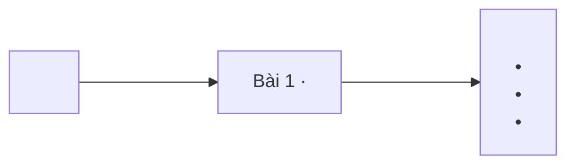

# Quy chuẩn định dạng roadmap

Trạng thái: đã được chủ sở hữu chốt ngày 2026-09-25  
Phạm vi: roadmap cấp chương trình, giai đoạn và mô-đun  
Trạng thái nội dung roadmap: bản nháp chờ rà soát

## Quyết định

Dùng cấu trúc hợp đồng phân cấp. Mỗi cấp chịu trách nhiệm cho một nhóm quyết định riêng:

- Cấp chương trình xác định vai trò đích, phạm vi chương trình, thứ tự các giai đoạn và bằng chứng
  tốt nghiệp.
- Cấp giai đoạn xác định năng lực tích hợp, thứ tự các mô-đun và bài kiểm tra cuối giai đoạn.
- Cấp mô-đun xác định đầu ra có thể giảng dạy, thứ tự bài học, ma trận đánh giá và tiêu chí hoàn
  thành.

Markdown là nguồn để con người đọc và duyệt. Tệp `roadmap.yaml` đặt cùng thư mục chỉ lưu mã định
danh, quan hệ cha–con, phiên bản và trạng thái phê duyệt. Giao diện web có thể tổng hợp các cấp,
nhưng tệp nguồn không được sao chép nội dung diễn giải thuộc cấp khác.

## Lý do chọn định dạng này

Trước chuyển đổi, roadmap tổng có khoảng 2.700 dòng ở DA và 9.038 dòng ở DE. Hai tệp này lặp lại đặc
tả mô-đun và bài học đã có ở các cấp thấp hơn. Cấu trúc đó làm phần thay đổi khó đọc, không rõ nơi
chịu trách nhiệm và cho phép hai bản của cùng một nội dung lệch nhau.

Quy chuẩn áp dụng ba nguyên tắc đã có tài liệu đối chiếu:

- Hướng dẫn viết tài liệu của Google: tiêu đề mô tả đúng nội dung, viết hoa kiểu câu, dùng câu chủ
  động, nghĩa đen và yêu cầu trực tiếp.
- Tính đồng bộ của giáo trình: đầu ra, hoạt động học và phương pháp đánh giá phải hỗ trợ lẫn nhau.
- Rà soát thiết kế kỹ thuật: mục tiêu, phần không làm, quyết định, phương án thay thế, rủi ro và
  bằng chứng phải đủ rõ để người khác phản biện.

Không có một “định dạng roadmap FAANG” công khai và thống nhất. Trong tài liệu này, cách làm thường
gắn nhãn “FAANG” được hiểu là: phạm vi rõ, có thể rà soát, truy vết được, phần thay đổi dễ đọc và
quyết định được ghi minh bạch. Nhãn này không phải lý do để dùng từ ngữ doanh nghiệp hoặc trang trí
hình thức.

## Các phương án đã xem xét

### Phương án A — Một tài liệu chương trình đầy đủ

Một tệp chứa đặc tả chương trình, giai đoạn, mô-đun và bài học.

Phù hợp khi:

- cần đọc toàn bộ trong một tệp;
- cần xuất một tệp PDF mà không phải ghép nội dung.

Không phù hợp khi:

- nhiều mô-đun thay đổi độc lập;
- cùng một mô-đun được hiển thị ở trang chương trình, trang mô-đun và website;
- người duyệt cần phần thay đổi nhỏ và truy được người chịu trách nhiệm.

Không chọn vì phương án này lặp lại vấn đề trùng nội dung và khó rà soát hiện nay.

### Phương án B — Hợp đồng phân cấp với siêu dữ liệu tối thiểu

Mỗi cấp có một tài liệu Markdown và một tệp YAML nhỏ. Cấp cha chỉ tóm tắt và dẫn liên kết; cấp con
sở hữu nội dung chi tiết.

Phù hợp khi cần:

- phân định rõ nơi chịu trách nhiệm;
- phần thay đổi nhỏ;
- con người rà soát trực tiếp;
- dựng web theo quy tắc xác định;
- giữ khả năng truy vết học thuật.

Không phù hợp nếu sản phẩm duy nhất là một bản in bất biến và không có người duy trì cấu trúc phân
cấp.

Chọn phương án này vì kho nội dung phải phục vụ đồng thời trang chương trình, giai đoạn, mô-đun và
website mà không duy trì nhiều bản diễn giải giống nhau.

### Phương án C — Dùng YAML có kiểu làm nguồn chuẩn duy nhất

Mọi trường dữ liệu nằm trong YAML hoặc JSON; Markdown được sinh tự động.

Phù hợp khi cần:

- kiểm tra bằng lược đồ;
- truy vấn và xuất bản tự động;
- tính nhất quán tuyệt đối ở cấp máy.

Không phù hợp khi chuyên gia nội dung phải phản biện lập luận, giới hạn của bằng chứng và tính liền
mạch của giáo trình qua từng phần thay đổi.

Không chọn vì lược đồ có kiểu phù hợp với mã định danh và quan hệ, nhưng không đủ tốt để làm phương
tiện duy nhất cho việc rà soát lập luận giáo dục.

## Cấu trúc tệp nguồn

```text
Material/<DA|DE>/Roadmap/
├── roadmap.md
├── roadmap.yaml
└── Phase_<NN>-<slug>/
    ├── roadmap.md
    ├── roadmap.yaml
    └── Module_<NN>-<slug>/
        ├── roadmap.md
        ├── roadmap.yaml
        └── Lesson_<NNN>-<slug>/
            └── roadmap.yaml
```

Tệp YAML ở cấp bài học trỏ đến dòng bài học do mô-đun sở hữu. Không cần một roadmap diễn giải riêng
cho từng bài: hợp đồng của bài học nằm trong dòng tương ứng ở roadmap mô-đun và được triển khai bằng
`note.md` cùng `after-note.md`.

## Phân định nội dung theo cấp

| Nội dung | Chương trình | Giai đoạn | Mô-đun |
|---|:---:|:---:|:---:|
| Vai trò đích và ranh giới chương trình | Sở hữu | Dẫn chiếu | Dẫn chiếu |
| Đầu ra chương trình | Sở hữu | Ánh xạ | Ánh xạ |
| Đầu ra và bài kiểm tra giai đoạn | Tóm tắt | Sở hữu | Ánh xạ |
| Đầu ra và tiêu chí hoàn thành mô-đun | Liệt kê | Tóm tắt | Sở hữu |
| Đầu ra và bằng chứng bài học | Chỉ đếm | Chỉ đếm | Sở hữu |
| Quan hệ tiên quyết giữa các mô-đun | Tóm tắt | Sở hữu thứ tự cục bộ | Sở hữu điều kiện trực tiếp |
| Ma trận đánh giá | Cấp tốt nghiệp | Cấp giai đoạn | Cấp mô-đun và bài học |
| Lỗi loại trực tiếp | Chỉ lỗi toàn chương trình | Cấp giai đoạn | Sở hữu quy tắc chi tiết |
| Nguồn | Nguồn khung năng lực | Nguồn cho giai đoạn | Nguồn kỹ thuật và đánh giá |
| Lịch dạy và số giờ | Kế hoạch riêng | Kế hoạch riêng | Kế hoạch riêng |

Không lặp lại nội dung do cấp khác sở hữu. Chỉ dùng mã định danh và liên kết tương đối.

## Tệp siêu dữ liệu đi kèm

Mỗi thư mục roadmap có một tệp `roadmap.yaml`. Tệp này lưu cấu trúc và trạng thái vòng đời, không
lưu nội dung giáo trình.

### Siêu dữ liệu chương trình

```yaml
schema_version: 1
kind: programme
id: DE
version: 1.0.0
status: draft # draft | review | approved | superseded
owner: kina2711
document: roadmap.md
children:
  - DE-P01
  - DE-P02
approval_ref: null
```

### Siêu dữ liệu giai đoạn

```yaml
schema_version: 1
kind: phase
id: DE-P02
parent: DE
version: 1.0.0
status: draft
document: roadmap.md
children:
  - DE-M04
  - DE-M05
  - DE-M06
```

### Siêu dữ liệu mô-đun

```yaml
schema_version: 1
kind: module
id: DE-M04
parent: DE-P02
version: 1.0.0
status: draft
document: roadmap.md
children:
  - DE-L045
  - DE-L046
```

Quy tắc:

- Mã định danh không đổi khi tiêu đề đổi.
- Thứ tự lấy từ danh sách `children`, không lấy từ thứ tự tên thư mục.
- Bản phê duyệt phải gắn với đúng phiên bản và mã SHA-256, lưu ngoài phần diễn giải.
- Thời lượng, câu quảng bá và mô tả nội dung không nằm trong tệp YAML này.

## Roadmap cấp chương trình

### Mục đích

Roadmap cấp chương trình là hợp đồng giáo trình ở cấp tổng thể. Người duyệt phải trả lời được:

- Chương trình chuẩn bị cho vai trò nào và phạm vi quyết định nào?
- Người hoàn thành có thể tạo ra công việc quan sát được nào?
- Nội dung nào chủ động không đưa vào?
- Vì sao các giai đoạn được xếp theo thứ tự này?
- Cần bằng chứng nào để công nhận hoàn thành chương trình?

Tài liệu này không chứa đặc tả đầy đủ của từng bài học.

### Cấu trúc bắt buộc

```markdown
# <Tên chương trình>

<Một đoạn: năng lực đích, phạm vi và ranh giới.>

## Năng lực đích

<Một đầu ra chương trình có thể quan sát.>

## Phạm vi

### Bao gồm

- ...

### Không bao gồm

- ...

## Điều kiện đầu vào

- ...

## Đầu ra chương trình

| Mã | Người hoàn thành có thể | Bằng chứng | Ngưỡng đạt |
|---|---|---|---|
| PO-01 | | | |

## Bản đồ giáo trình

| Giai đoạn | Năng lực được bổ sung | Mô-đun | Bằng chứng cuối giai đoạn |
|---|---|---|---|
| P01 | | | |

## Mô hình phụ thuộc

<Một đồ thị và phần giải thích ngắn cho các quan hệ phụ thuộc chính.>

## Hệ thống đánh giá

### Bài kiểm tra cuối giai đoạn

| Bài kiểm tra | Đầu ra được kiểm tra | Sản phẩm | Ngưỡng đạt | Lỗi loại trực tiếp |
|---|---|---|---|---|

### Quyết định hoàn thành chương trình

<Bằng chứng bắt buộc, quy tắc kiểm tra lại và giới hạn của kết luận.>

## Độ phủ và khả năng truy vết

| Năng lực đối chiếu bên ngoài | Đầu ra chương trình | Giai đoạn | Bằng chứng |
|---|---|---|---|

## Rủi ro của chương trình

| Rủi ro | Hệ quả | Biện pháp kiểm soát | Điều kiện rà soát lại |
|---|---|---|---|

## Quyết định

| Quyết định | Lý do | Phương án không chọn | Xem xét lại khi |
|---|---|---|---|

## Tài liệu tham khảo

| Mã | Nguồn | Vị trí | Dùng cho |
|---|---|---|---|
```

### Giới hạn trình bày ở cấp chương trình

- 250–450 dòng, không tính bảng sinh tự động.
- Một đoạn mở đầu trước mục đầu tiên.
- Một tuyên bố đầu ra tổng quát, được cụ thể hóa bằng nhiều dòng đầu ra.
- Không liệt kê đầy đủ từng bài học.
- Không có mục thị trường hoặc lương, trừ khi một dữ kiện có nguồn và thời điểm làm thay đổi quyết
  định về giáo trình.

## Roadmap cấp giai đoạn

### Mục đích

Roadmap cấp giai đoạn giải thích một bước chuyển năng lực. Nó không phải lời dẫn chương và không
phải bản sao của các roadmap mô-đun.

Người duyệt phải trả lời được:

- Sau giai đoạn này, người học làm được gì mà trước đó chưa làm được?
- Cần bằng chứng tiên quyết nào khi bắt đầu?
- Vì sao các mô-đun được nhóm và xếp theo thứ tự này?
- Nhiệm vụ tích hợp nào chứng minh người học đã hoàn thành?
- Lỗi nào buộc người học phải khắc phục trước khi kiểm tra lại?

### Cấu trúc bắt buộc

```markdown
# Giai đoạn <N>: <Tên giai đoạn>

<Một đoạn: bước chuyển năng lực và lý do tồn tại của giai đoạn.>

## Điều kiện đầu vào

| Năng lực bắt buộc | Bằng chứng được chấp nhận | Cách khắc phục |
|---|---|---|

## Đầu ra giai đoạn

<Một đầu ra có thể quan sát, tích hợp mọi mô-đun trong giai đoạn.>

## Thứ tự mô-đun

| Mô-đun | Năng lực được bổ sung | Phụ thuộc | Bằng chứng hoàn thành |
|---|---|---|---|

**Sơ đồ thứ tự:** đọc từ trái sang phải; mỗi mô-đun tạo bằng chứng đầu vào cho mô-đun kế tiếp và bài kiểm tra cuối giai đoạn.


## Lý do sắp xếp

<Chỉ giải thích những quan hệ phụ thuộc không hiển nhiên.>

## Bài kiểm tra cuối giai đoạn

### Nhiệm vụ

<Tình huống sát công việc, gồm dữ liệu đầu vào, ràng buộc và sản phẩm bắt buộc.>

### Cách đánh giá

| Tiêu chí | Bằng chứng | Ngưỡng đạt | Lỗi loại trực tiếp |
|---|---|---|---|

## Điểm tích hợp

| Năng lực trước được dùng lại | Mô-đun sử dụng | Năng lực sau được mở khóa |
|---|---|---|

## Khắc phục

| Tiêu chí chưa đạt | Bằng chứng chẩn đoán | Phần phải làm lại | Cách kiểm tra lại |
|---|---|---|---|

## Rủi ro của giai đoạn

| Rủi ro | Cách phát hiện | Biện pháp kiểm soát |
|---|---|---|

## Tài liệu tham khảo

| Mã | Nguồn | Vị trí | Dùng cho |
|---|---|---|---|
```

### Giới hạn trình bày ở cấp giai đoạn

- 120–220 dòng, không tính bảng tiêu chí chấm.
- Một đầu ra tích hợp, không viết một đoạn riêng cho từng mô-đun.
- Một tình huống kiểm tra cần năng lực từ mọi mô-đun.
- Không mô tả từng bài học.

## Roadmap cấp mô-đun

### Mục đích

Roadmap cấp mô-đun là hợp đồng giảng dạy hoàn chỉnh nhỏ nhất. Cấp này sở hữu thứ tự bài học và phải
chứng minh rằng các đầu ra bài học hợp thành đầu ra mô-đun.

Người duyệt phải trả lời được:

- Sản phẩm nào chứng minh đầu ra mô-đun?
- Khái niệm và nguyên tắc bất biến nào được dạy?
- Vì sao từng bài học tồn tại?
- Mỗi bài có đóng góp vào một đầu ra hoặc điều kiện tiên quyết không?
- Phương pháp đánh giá có phù hợp với mức độ tư duy yêu cầu không?

### Cấu trúc bắt buộc

```markdown
# Mô-đun <N>: <Tên mô-đun>

<Một đoạn: trách nhiệm của mô-đun trong giai đoạn.>

## Điều kiện đầu vào

| Mã | Người học có thể | Bằng chứng |
|---|---|---|

## Đầu ra mô-đun

<Hành động quan sát được + sản phẩm + bối cảnh + ràng buộc + ngưỡng đạt.>

## Tiêu chí hoàn thành

| Mã | Bằng chứng bắt buộc | Ngưỡng đạt | Lỗi loại trực tiếp |
|---|---|---|---|

## Khái niệm và nguyên tắc bất biến

| Mã khái niệm | Ranh giới định nghĩa | Nguyên tắc bất biến hoặc quy tắc quyết định | Bài chính |
|---|---|---|---|

## Các bài trong mô-đun

| Bài | Dạng | Đầu ra | Bằng chứng | Điều kiện tiên quyết |
|---|---|---|---|---|
| L001 | LT | | | |

## Nội dung từng bài

> **Sơ đồ <trạng thái> — <mã mô-đun và phiên bản>.** Mỗi nhánh đi từ bài học đến các nội dung
> nguyên tử bắt buộc của bài. Thứ tự dạy lấy từ bảng `Các bài trong mô-đun`.



### Bài <N>: <Tên bài>

<Đoạn 1: vấn đề được học, cơ chế và các khái niệm nằm trong phạm vi bài.>

<Đoạn 2: việc người học phải thực hiện và bằng chứng phải tạo ra.>

<Lặp lại cấu trúc trên cho mọi bài trong mô-đun, theo đúng thứ tự dạy.>

## Lý do sắp xếp

<Giải thích chuỗi tiên quyết và những chỗ chủ động học lại ở mức sâu hơn.>

## Ma trận đánh giá

| Mã đầu ra | Mức độ tư duy | Cách đánh giá | Ngưỡng đạt | Hình thức kiểm tra lại |
|---|---|---|---|---|

## Bài thực hành bắt buộc

| Bài thực hành hoặc dự án | Bài liên quan | Sản phẩm bắt buộc | Lỗi được cài vào tình huống |
|---|---|---|---|

## Ngộ nhận và lỗi loại trực tiếp

| Lỗi | Hệ quả | Nơi phát hiện | Cách khắc phục |
|---|---|---|---|

## Điểm nối với mô-đun khác

| Kế thừa từ | Cung cấp cho mô-đun sau | Cam kết đầu ra |
|---|---|---|

## Tài liệu tham khảo

| Mã | Nguồn | Vị trí | Dùng cho |
|---|---|---|---|
```

### Giới hạn trình bày ở cấp mô-đun

- 180–350 dòng, không tính phần `Nội dung từng bài` và bảng sinh tự động.
- Mỗi bài có đúng một dòng trong `Các bài trong mô-đun` và đúng một mục trong `Nội dung từng bài`.
- Mỗi `roadmap.md` cấp mô-đun có đúng một khối Mermaid trong `Nội dung từng bài`, thể hiện quan hệ
  `Bài học → nội dung nguyên tử` cho toàn bộ mô-đun.
- Dòng trong bảng là hợp đồng kiểm tra nhanh; mục nội dung cho biết bài dạy vấn đề gì, cơ chế nào,
  người học phải làm gì và phải tạo ra bằng chứng nào.
- Phần nội dung chỉ xác định phạm vi dạy, không viết thay nội dung giáo trình thuộc `note.md`.
- Bài không đóng góp vào tiêu chí hoàn thành, điều kiện tiên quyết hoặc cách khắc phục phải bị loại
  hoặc có lý do giữ lại rõ ràng.

## Ví dụ điền sẵn

Ví dụ dùng Giai đoạn 2 và Mô-đun 4 trong DE để minh họa định dạng.

### Trích đoạn cấp chương trình

```markdown
# Data Engineer

Chương trình chuẩn bị người học thiết kế, xây dựng và vận hành hệ thống dữ liệu có thể kiểm tra,
phục hồi và giải thích được dưới ràng buộc về độ đúng, độ trễ, thông lượng và chi phí.

## Đầu ra chương trình

| Mã | Người hoàn thành có thể | Bằng chứng | Ngưỡng đạt |
|---|---|---|---|
| PO-01 | Chuyển yêu cầu dữ liệu thành hợp đồng có thể kiểm thử | Hồ sơ thiết kế và phép kiểm chấp nhận | Không còn yêu cầu hai nghĩa; mọi ràng buộc có phép kiểm |
| PO-02 | Xây pipeline chịu được chạy lại và lỗi từng phần | Pipeline, nhật ký lỗi và lần chạy phục hồi | Không tạo bản ghi trùng; phục hồi đạt RPO/RTO đã khai báo |

## Bản đồ giáo trình

| Giai đoạn | Năng lực được bổ sung | Mô-đun | Bằng chứng cuối giai đoạn |
|---|---|---|---|
| P02 | Giải thích hành vi hệ thống từ giới hạn máy, hệ điều hành và mạng | M04–M06 | Báo cáo chẩn đoán một yêu cầu xuyên suốt hệ thống |
```

### Trích đoạn cấp giai đoạn

```markdown
# Giai đoạn 2: Máy tính, hệ điều hành và mạng

Giai đoạn này nối mô hình chi phí phần cứng với hành vi quan sát được của tiến trình và yêu cầu qua
mạng. Người học phải dự đoán điểm nghẽn, đo nó và loại các giả thuyết sai bằng bằng chứng.

## Đầu ra giai đoạn

Chẩn đoán một dịch vụ dữ liệu chậm bằng số đo CPU, bộ nhớ, lưu trữ, tiến trình và mạng; xác định
đúng miền sự cố và bảo vệ kết luận bằng một chuỗi bằng chứng tái hiện được.

## Thứ tự mô-đun

| Mô-đun | Năng lực được bổ sung | Phụ thuộc | Bằng chứng hoàn thành |
|---|---|---|---|
| M04 | Mô hình chi phí của máy | P01 | Báo cáo hiệu năng có dự đoán trước phép đo |
| M05 | Quan sát tài nguyên và tiến trình | M04 | Quy trình chẩn đoán có thể tái hiện |
| M06 | Theo vết yêu cầu qua mạng | M05 | Dấu vết độ trễ xuyên suốt hệ thống |
```

### Trích đoạn cấp mô-đun

```markdown
# Mô-đun 4: Kiến trúc máy tính và mô hình hiệu năng

Mô-đun cung cấp mô hình chi phí để người học dự đoán cách bố trí dữ liệu, tính cục bộ, vector hóa và
truy cập lưu trữ làm thay đổi hiệu năng. Mô hình này là đầu vào cho việc chẩn đoán hệ điều hành ở
M05.

## Đầu ra mô-đun

Với một tải công việc chưa gặp, dự đoán điểm nghẽn và điểm gãy, thiết kế phép đo hiệu năng cô lập
biến, rồi viết báo cáo giải thích sai khác giữa dự đoán và số đo.

## Các bài trong mô-đun

| Bài | Dạng | Đầu ra | Bằng chứng | Điều kiện tiên quyết |
|---|---|---|---|---|
| L045 | LT | Dựng mô hình chi phí theo phân cấp bộ nhớ | Bảng dự đoán độ trễ theo kích thước tập dữ liệu hoạt động | P01 |
| L046 | TH | Đo điểm suy giảm bộ đệm khi tập dữ liệu hoạt động tăng | Phép đo và biểu đồ có điểm gãy | L045 |
| L047 | TH | So sánh bố trí theo hàng và theo cột cho từng kiểu truy cập | Phép đo có kiểm soát cách bố trí | L046 |

## Ma trận đánh giá

| Mã đầu ra | Mức độ tư duy | Cách đánh giá | Ngưỡng đạt | Hình thức kiểm tra lại |
|---|---|---|---|---|
| MO-04 | Phân tích và bảo vệ kết luận | Điều tra hiệu năng | Dự đoán trước phép đo; phép đo cô lập biến; kết luận nêu điều kiện | Tải công việc mới, cùng bảng tiêu chí chấm |
```

## Cú pháp viết đầu ra

Viết mỗi đầu ra theo thứ tự sau:

```text
Hành động quan sát được + sản phẩm + bối cảnh + ràng buộc + ngưỡng đạt
```

Đạt yêu cầu:

> Chẩn đoán một pipeline có dữ liệu trùng bằng nhật ký thực thi và mẫu dữ liệu nguồn; xác định đúng
> ranh giới sự cố, đề xuất thay đổi giữ được tính idempotent và chứng minh bằng ba lần chạy lại không
> tăng số bản ghi.

Không đạt:

> Hiểu sâu về tính idempotent và làm chủ pipeline production.

Câu không đạt không có hành động quan sát được, sản phẩm, bối cảnh hoặc ngưỡng đánh giá.

## Quy chuẩn ngôn ngữ

### Cách viết bắt buộc

- Dùng tiếng Việt cho lập luận và yêu cầu. Giữ thuật ngữ kỹ thuật tiếng Anh khi bản dịch làm giảm
  độ chính xác; định nghĩa thuật ngữ ở lần xuất hiện đầu tiên.
- Dùng câu chủ động. Nêu rõ chủ thể khi trách nhiệm là một phần của yêu cầu.
- Đặt điều kiện trước hành động bắt buộc.
- Mỗi câu chỉ nêu một khẳng định nếu khẳng định đó có ngưỡng, quan hệ phụ thuộc hoặc ngoại lệ.
- Tiêu đề viết hoa kiểu câu và gọi đúng tên chủ đề; không dùng tiêu đề để quảng bá tầm quan trọng.
- Phân biệt rõ “phải”, “có thể” và “có khả năng”. Tránh dùng “nên” khi không rõ đó là yêu cầu hay
  gợi ý.
- Nêu độ bất định ngay cạnh khẳng định liên quan. Không giấu trong một đoạn miễn trừ chung.
- Chỉ dùng bảng cho các trường lặp lại. Dùng văn xuôi để giải thích nguyên nhân và lập luận.
- Dẫn đúng chương, mục, trang, phiên bản tiêu chuẩn hoặc phiên bản tài liệu đã sử dụng.

### Từ không được dùng nếu thiếu bằng chứng

Không dùng các từ sau để khen hoặc mở rộng phạm vi, trừ khi tài liệu đã định nghĩa và chứng minh:

- toàn diện;
- chuyên sâu;
- tiên tiến;
- hiện đại;
- thực chiến;
- đẳng cấp;
- làm chủ;
- tối ưu;
- mạnh mẽ;
- linh hoạt;
- sẵn sàng cho doanh nghiệp;
- chuẩn quốc tế;
- chuẩn FAANG.

Thay tính từ bằng một thuộc tính quan sát được. Ví dụ, thay “pipeline mạnh mẽ” bằng “pipeline không
tạo bản ghi trùng qua ba lần chạy lại và phục hồi trong RTO đã công bố”.

### Mẫu câu bị loại vì mang dấu hiệu văn máy

- “không chỉ X mà còn Y”;
- “trong bối cảnh ngày nay”;
- “đóng vai trò quan trọng/then chốt”;
- “chìa khóa để mở ra”;
- “hành trình trở thành”;
- câu kết một dòng nhằm tạo cảm hứng;
- lặp dấu gạch ngang dài ở nơi dấu chấm hoặc quan hệ từ chỉ nguyên nhân rõ hơn;
- tiêu đề theo sau bởi một câu chỉ nhắc lại tiêu đề;
- ba tính từ song song nhưng không có cách đo;
- chữ đậm chỉ để nhấn giọng.

Xóa câu nếu việc xóa nó không làm thay đổi quyết định hoặc cách đánh giá.

## Bảng, sơ đồ và tài liệu tham khảo

### Bảng

- Mỗi cột phải biểu diễn một trường ổn định, được dùng trong ít nhất hai dòng.
- Không đặt cả đoạn văn vào ô bảng.
- Tách bằng chứng khỏi ngưỡng đạt.
- Dùng mã định danh ổn định ở cột đầu nếu tệp khác cần dẫn chiếu dòng đó.
- Sắp xếp theo thứ tự dạy, trừ khi bảng nêu rõ quy tắc khác.

### Sơ đồ

Mỗi `roadmap.md` cấp chương trình, giai đoạn và mô-đun có đúng một khối Mermaid. Cấp chương trình
thể hiện thứ tự giai đoạn; cấp giai đoạn thể hiện thứ tự mô-đun và cổng tích hợp; cấp mô-đun thể
hiện quan hệ `Bài học → nội dung nguyên tử`.

Chỉ dùng sơ đồ cho:

- đồ thị tiên quyết;
- quan hệ thành phần giữa giai đoạn và mô-đun;
- truy vết đánh giá có ít nhất ba quan hệ;
- chuyển trạng thái mà văn xuôi không diễn đạt gọn được.

Không dùng sơ đồ như một bảng có trang trí. Mọi nút phải dùng mã định danh có thật trong roadmap.

#### Quy tắc cho sơ đồ bài học → nội dung nguyên tử

- Nguồn chuẩn nằm trong khối mã `mermaid` của `roadmap.md`; không duy trì một bản Mermaid khác cho
  Artifact hoặc Web.
- Mỗi bài có một nút `L<lesson>` và một nút `A<lesson>` chứa danh sách nội dung nguyên tử. Hai mã
  phải duy nhất trong mô-đun.
- Mỗi nội dung nguyên tử nằm trên một dòng riêng, bắt đầu bằng dấu `•`; không ghép nhiều ý bằng dấu
  chấm giữa hoặc để renderer tự ngắt giữa một thuật ngữ.
- Hộp nội dung dùng `wrappingWidth` tối thiểu 520 px, căn trái phần danh sách và giữ khoảng cách cấp
  tối thiểu 120 px. Thuật ngữ ghép như `column-major` hoặc `memory-bound` không được tách dòng.
- Sơ đồ phải ghi rõ trạng thái `BẢN ĐỀ XUẤT` hoặc `ĐÃ DUYỆT`, mã mô-đun và phiên bản ngay trên hình.
- Caption phải nói rõ kết luận người đọc cần rút ra và cách xác định thứ tự dạy.
- Bảng `Các bài trong mô-đun` cùng phần diễn giải là bản thay thế bằng văn bản cho người không xem
  được hình.
- Artifact và Web phải dùng ảnh SVG render từ khối Mermaid, có cuộn ngang hoặc thu phóng khi hình
  rộng. Giao diện không hiển thị mã Mermaid thô thay cho ảnh.
- Nếu Mermaid không parse được, bước build phải thất bại và chỉ đúng tệp cùng dòng lỗi; không xuất
  trang chứa mã nguồn thay cho sơ đồ.
- Web phải ghim phiên bản Mermaid, đóng gói cùng ứng dụng và lọc nội dung SVG; không phụ thuộc CDN ở
  bản phát hành.

### Tài liệu tham khảo

```markdown
## Tài liệu tham khảo

| Mã | Nguồn | Vị trí | Dùng cho |
|---|---|---|---|
| R1 | <publisher, title, version, year> | <chapter/section/page> | <decision or claim> |
```

Quy tắc:

- Khẳng định về thị trường, lương, mức độ sử dụng hoặc tỷ lệ phần trăm phải có nguồn, năm và ngày
  truy cập.
- Ánh xạ sang khung năng lực phải ghi phiên bản của khung.
- Chỉ ghi tên nguồn chưa đủ để xác định vị trí thông tin.
- Nguồn chỉ hỗ trợ một quyết định giáo trình khi cột `Dùng cho` gọi đúng tên quyết định đó.
- Ghi chú nghiên cứu nằm trong `Reference/`; roadmap chỉ giữ trích dẫn và quyết định liên quan.

## Các điều kiện bất biến giữa các cấp

Các điều kiện sau phải kiểm tra tự động được:

1. Mỗi đầu ra chương trình ánh xạ đến ít nhất một bài kiểm tra cuối giai đoạn.
2. Mỗi đầu ra giai đoạn ánh xạ đến tiêu chí của bài kiểm tra và đầu ra của mọi mô-đun con.
3. Mỗi đầu ra mô-đun ánh xạ đến tiêu chí hoàn thành và ít nhất một dòng đánh giá.
4. Mỗi bài học đóng góp vào đầu ra mô-đun, điều kiện tiên quyết hoặc cách khắc phục.
5. Mỗi điều kiện tiên quyết trỏ về một mã đã tồn tại ở trước nó.
6. Không đánh giá đầu ra chỉ bằng nhớ lại nếu đầu ra yêu cầu áp dụng, chẩn đoán, thiết kế hoặc bảo
   vệ kết luận.
7. Lỗi loại trực tiếp phải xuất hiện trong bảng tiêu chí chấm có khả năng phát hiện lỗi đó.
8. Khẳng định về độ phủ phải liên kết đến bằng chứng, không chỉ đến tiêu đề bài học.
9. Cấp cha tóm tắt cấp con bằng mã định danh, không sao chép văn xuôi của cấp con.
10. Đổi tiêu đề ở cấp con không buộc phải sửa phần diễn giải ở mọi cấp cha.

## Danh sách kiểm tra khi rà soát

### Cấp chương trình

- Năng lực đích quan sát được và có ranh giới.
- Phần bao gồm và không bao gồm không chồng lấn.
- Mỗi giai đoạn bổ sung một năng lực riêng.
- Bằng chứng tốt nghiệp kiểm tra đúng đầu ra chương trình.
- Ánh xạ khung năng lực có phiên bản, thời điểm và bằng chứng.

### Cấp giai đoạn

- Bằng chứng đầu vào có thể kiểm tra.
- Đầu ra giai đoạn tích hợp mọi mô-đun.
- Thứ tự mô-đun được giải thích bằng điều kiện tiên quyết hoặc nhu cầu tích hợp.
- Mermaid có đủ mọi mô-đun, đúng thứ tự và nối tới bài kiểm tra cuối giai đoạn.
- Bài kiểm tra dùng tình huống mới và yêu cầu bằng chứng từ mọi mô-đun.
- Cách khắc phục và kiểm tra lại đã được xác định.

### Cấp mô-đun

- Đầu ra có hành động, sản phẩm, bối cảnh, ràng buộc và ngưỡng đạt.
- Bảng `Các bài trong mô-đun` liệt kê đủ bài và đúng thứ tự dạy.
- Mỗi bài có một mục `Nội dung từng bài`, nêu rõ vấn đề, cơ chế, việc phải làm và bằng chứng.
- Mermaid có đủ mọi bài, mỗi bài nối tới đúng một danh sách nội dung nguyên tử và render được trong
  Artifact.
- Các đầu ra bài học hợp thành đầu ra mô-đun.
- Mức độ tư duy của phép đánh giá khớp với đầu ra.
- Lỗi loại trực tiếp có thể được phát hiện.
- Vị trí trích dẫn hỗ trợ đúng quyết định đã nêu.

### Ngôn ngữ

- Không dùng tính từ khen thay cho thuộc tính có thể kiểm tra.
- Không có đoạn văn chỉ nhắc lại tiêu đề.
- Không dùng khẩu hiệu thay cho kết luận hoặc quyết định.
- Mọi con số đều được tính, có nguồn hoặc được ghi rõ là ước tính.
- Chữ đậm, khối chú ý và dấu câu chỉ phục vụ cấu trúc, không dùng để trang trí.

## Trạng thái chuyển đổi

| Hạng mục | Trạng thái |
|---|---|
| Chủ sở hữu chốt định dạng | Hoàn thành ngày 2026-09-25 |
| 56 sơ đồ roadmap trong Artifact | Hoàn thành |
| Roadmap Markdown cấp chương trình | Đã chuyển đổi, chờ rà soát nội dung |
| Roadmap Markdown cấp giai đoạn | Đã tạo đủ 14 tệp, chờ rà soát nội dung |
| Roadmap Markdown cấp mô-đun | Đã chuyển đổi đủ 40 tệp, chờ rà soát nội dung |
| YAML cấp chương trình và mô-đun | Chưa thực hiện |
| Kiểm thử với giảng viên hoặc người học | Chưa thực hiện |

Git giữ bản trước chuyển đổi để có thể đối chiếu hoặc quay lui theo từng tệp. Không cập nhật mã băm
phê duyệt nội dung cho đến khi chủ sở hữu duyệt đúng phiên bản roadmap sau chuyển đổi.

## Nguồn dùng để xây dựng quy chuẩn

- [Google developer documentation style guide — highlights](https://developers.google.com/style/highlights)
- [Google developer documentation style guide — headings and titles](https://developers.google.com/style/headings)
- [Google developer documentation style guide — prescriptive documentation](https://developers.google.com/style/prescriptive-documentation)
- [Google Style Guides — documentation best practices](https://google.github.io/styleguide/docguide/best_practices.html)
- [Carnegie Mellon Eberly Center — alignment of objectives, assessments and instruction](https://www.cmu.edu/teaching/assessment/basics/alignment.html)
