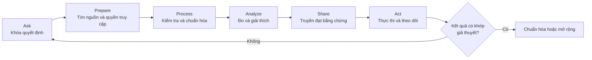
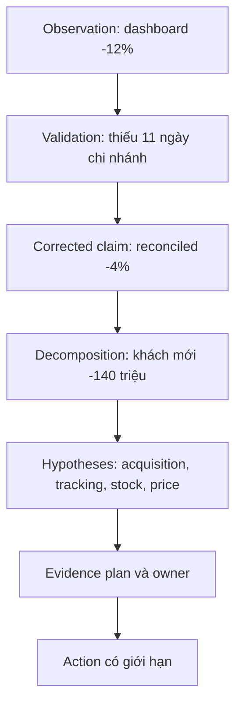

# Phase 1: Nền tảng và vai trò Data Analyst
# Module 1: Nhập môn vai trò Data Analyst
# Lesson 1: What a Data Analyst actually does all day

## Kết quả cần đạt

Sau bài này, người học có thể:

1. Biến một yêu cầu mơ hồ thành chuỗi **consumer → decision → question → evidence → action**.
2. Mô tả sáu pha Ask, Prepare, Process, Analyze, Share, Act như một vòng kiểm soát có phản hồi.
3. Phân biệt DA, DE, AE, BI, BA và DS bằng trách nhiệm cùng artifact bàn giao, không bằng tên công cụ.
4. Kiểm tra một kết luận phân tích theo chuỗi claim, evidence, uncertainty và consequence.
5. Viết decision memo ngắn có owner, ngưỡng hành động và điều kiện đảo quyết định.

Ngưỡng đạt tối thiểu: phân loại đúng ít nhất 6/8 nhiệm vụ, giải thích bằng outcome hoặc artifact, và không đề xuất hành động từ một con số chưa được kiểm tra population, grain, thời gian và độ phủ dữ liệu.

Một Data Analyst không được trả lương để làm dashboard. Dashboard, SQL hay spreadsheet chỉ là phương tiện. Giá trị xuất hiện khi một người ra quyết định hiểu điều gì đã xảy ra, bằng chứng nào đáng tin, còn điều gì chưa biết và nên làm gì tiếp theo.

Ta sẽ theo một case mô phỏng xuyên bài: trưởng bộ phận bán lẻ nhận dashboard báo doanh thu tháng 10 giảm 12% so với tháng 9. Người này cần quyết định có cắt ngân sách marketing hay không. Con số 12% có vẻ rõ ràng, nhưng chưa đủ để hành động.

> **Case mô phỏng:** mọi tên, số liệu và bảng trong bài là dữ liệu giảng dạy tổng hợp. Chúng minh họa phương pháp, không phải bằng chứng về một doanh nghiệp thật.

## Giá trị bắt đầu từ quyết định, không bắt đầu từ dashboard

Một yêu cầu thường đến dưới dạng output: làm dashboard, kéo số, xem vì sao giảm. DA phải tìm decision ẩn phía sau output đó.

| Thành phần | Câu hỏi khóa nghĩa | Trong case doanh thu |
|---|---|---|
| Consumer | Ai chịu hậu quả của câu trả lời? | Trưởng bộ phận bán lẻ |
| Decision | Họ sẽ làm gì khác đi? | Giữ hay cắt ngân sách marketing |
| Question | Bất định nào cản quyết định? | Mức giảm có thật không, do nhóm nào? |
| Evidence | Dữ liệu nào có thể xác nhận hoặc bác bỏ? | Giao dịch, coverage theo chi nhánh, khách mới/cũ |
| Action | Ai làm gì, khi nào? | Growth owner điều chỉnh chiến dịch; data owner sửa thiếu dữ liệu |

Nếu chưa biết decision, cùng một biểu đồ có thể dẫn tới những hành động trái ngược. Revenue giảm do mất dữ liệu cần mở incident; giảm do khách mới cần xem acquisition; giảm do khách cũ cần xem retention. Output giống nhau, cơ chế và owner khác nhau.

Quy tắc làm việc đầu tiên:

> Trước khi viết query, hãy hoàn thành câu: Nếu kết quả là A, B hoặc chưa đủ chắc chắn, **ai** sẽ thay đổi **quyết định gì**?

## Sáu pha tạo thành một vòng kiểm soát

Chứng chỉ Data Analytics của Google trình bày sáu pha Ask, Prepare, Process, Analyze, Share và Act. Đây không phải quy trình một chiều; phát hiện ở pha sau có thể buộc quay lại pha trước. [S1A][S2]



| Pha | Artifact tối thiểu | Failure mode nếu bỏ qua |
|---|---|---|
| Ask | decision brief, metric, comparison | Trả lời đúng một câu hỏi không ai cần |
| Prepare | source inventory, access, grain dự kiến | Chọn nguồn tiện nhất thay vì nguồn phù hợp |
| Process | quality report, exclusions, lineage | Lỗi dữ liệu bị diễn giải thành hành vi |
| Analyze | query/notebook, checks, uncertainty | Có con số nhưng không có cơ chế |
| Share | decision memo, visual, limitations | Người nhận nhớ biểu đồ nhưng không biết hành động |
| Act | owner, deadline, monitor, reversal trigger | Recommendation không tạo thay đổi hoặc không học được |

Trong case, phát hiện thiếu dữ liệu Đà Nẵng ở pha Process buộc quay lại Prepare để xác minh nguồn và cutoff. Đó không phải làm lại; đó là cơ chế kiểm soát chất lượng.

## Công việc thật được nhìn qua artifact và rủi ro

Một ngày của DA thường pha trộn nhiều loại việc:

| Nhóm việc | Artifact quan sát được | Rủi ro cần kiểm soát |
|---|---|---|
| Làm rõ yêu cầu | analytical brief | hỏi sai population hoặc comparison |
| Truy xuất và kiểm dữ liệu | query, profile, reconciliation | thiếu, trùng, join sai grain |
| Phân tích | decomposition, segment table, model đơn giản | nhầm tương quan với nguyên nhân |
| Truyền đạt | memo, chart, walkthrough | che uncertainty hoặc thiếu consequence |
| Hỗ trợ hành động | owner, experiment, monitor | recommendation không được thực thi |
| Duy trì tri thức | metric definition, note, lineage | cùng khái niệm bị định nghĩa nhiều lần |

## Ranh giới vai trò nằm ở thứ phải chịu trách nhiệm

Tên công cụ không xác định vai trò. SQL xuất hiện trong DA, DE, AE và BI; Python xuất hiện trong DA, DE và DS. Hãy hỏi: nếu sản phẩm hỏng, vai nào phải đứng ra bảo vệ invariant nào?

| Vai trò | Trách nhiệm trung tâm | Artifact chính | Critical failure điển hình |
|---|---|---|---|
| Data Analyst | câu trả lời và khuyến nghị cho quyết định | analysis, decision memo | kết luận không khớp bằng chứng |
| Data Engineer | dòng dữ liệu tin cậy và vận hành được | pipeline, data contract, runbook | mất/trùng dữ liệu, không phục hồi được |
| Analytics Engineer | mô hình và metric dùng chung | tested model, semantic definition | grain/metric không nhất quán |
| BI Analyst/Developer | trải nghiệm theo dõi lặp lại | dashboard, semantic report | người dùng đọc sai hoặc dữ liệu stale |
| Business Analyst | yêu cầu, quy tắc và quy trình nghiệp vụ | process map, requirement, acceptance rule | giải pháp không giải quyết quy trình |
| Data Scientist | ước lượng, dự báo hoặc quyết định dưới bất định | experiment/model, evaluation | leakage, calibration kém, claim vượt thiết kế |

Ranh giới có thể chồng lấn. DA có thể phát hiện pipeline mất dữ liệu; DE sửa cơ chế ingestion; AE sửa model và test; BI cập nhật trạng thái dashboard. Một người ở startup có thể làm cả bốn, nhưng vẫn phải đổi mũ rõ ràng để biết tiêu chí hoàn thành.

RACI tối thiểu cho một phân tích:

- **Responsible:** người trực tiếp tạo và kiểm bằng chứng.
- **Accountable:** owner ký quyết định hoặc chấp nhận rủi ro.
- **Consulted:** chuyên gia nguồn, metric hoặc nghiệp vụ.
- **Informed:** người cần biết kết quả nhưng không quyết định.

## Đơn vị công việc hoàn chỉnh là một decision trace

Một task không hoàn chỉnh chỉ vì file đã được gửi. Nó hoàn chỉnh khi reviewer lần được từ quyết định về nguồn dữ liệu và từ nguồn dữ liệu trở lại quyết định. Chuỗi này được gọi là decision trace.

| Mắt xích | Nội dung phải khóa | Câu hỏi kiểm tra |
|---|---|---|
| Decision | lựa chọn, người chịu trách nhiệm, phạm vi tác động | Kết quả khác đi thì hành động nào đổi? |
| Analytical question | population, comparison, dimension, outcome | Câu hỏi có tạo được một kết quả bác bỏ được không? |
| Metric | tử số, mẫu số, grain, exclusions, status | Hai người có tính ra cùng một số không? |
| Model | bảng, join path, aggregation, cutoff | Phép biến đổi có giữ đúng population không? |
| Source | hệ thống gốc, control total, owner | Có oracle độc lập với model đang kiểm không? |
| Action | owner, giới hạn, điều kiện dừng | Ai nhận việc và khi nào phải xem lại quyết định? |

Decision trace giúp xử lý hai lỗi thường gặp. Lỗi thứ nhất là kết luận không tìm được nguồn đã tạo ra con số. Lỗi thứ hai là một bảng được duy trì nhưng không ai chỉ ra quyết định nào còn phụ thuộc vào nó. Cả hai đều là lỗi truy vết, không phải lỗi trình bày.

Ví dụ trong case:

```text
DEC-REV-01
  needs QUESTION-REV-DROP
  answered_by METRIC-NET-REVENUE
  computed_from MART-PAYMENTS-DAILY
  derived_from SOURCE-SETTLEMENT
  checked_by RECON-SETTLEMENT-01
  results_in ACTION-GROWTH-REVIEW
```

Mỗi ID cần owner và phiên bản. Khi định nghĩa revenue đổi, impact analysis phải tìm được decision, report và consumer bị ảnh hưởng. Một đường lineage chỉ nối bảng với bảng chưa đủ để trả lời câu hỏi đó.

## Bốn lớp kiểm tra trước khi tin một kết luận

Kiểm tra nhiều không đồng nghĩa kiểm tra đúng. Các check phải bao phủ bốn lớp khác nhau.

### Lớp 1: Measurement validity

Metric có đo đúng khái niệm không? Nếu mục tiêu là doanh thu đã thu tiền, `order_created` không phải event phù hợp. Nếu refund được ghi ở kỳ sau, gross revenue và net revenue trả lời hai câu hỏi khác nhau.

### Lớp 2: Data validity

Record có đủ, không trùng, đúng type và đúng state không? Đây là nơi kiểm coverage, uniqueness, accepted values, referential integrity và reconciliation.

### Lớp 3: Analytical validity

Phép so sánh có hợp lệ không? Cần kiểm population shift, mix effect, seasonality, join fan-out, multiple testing và uncertainty. Một tổng đúng vẫn có thể che subgroup sai.

### Lớp 4: Decision validity

Evidence có đủ mạnh cho hành động đề xuất không? Một mô tả cho biết nơi xảy ra chênh lệch. Nó không tự chứng minh intervention nào sẽ sửa được chênh lệch. Quyết định còn phụ thuộc cost, reversibility, affected users và hậu quả nếu sai.

| Dấu hiệu | Lớp có khả năng hỏng | Hành động đầu tiên |
|---|---|---|
| Dashboard và settlement lệch | Data validity | kiểm population, cutoff, coverage |
| Hai team có hai revenue | Measurement validity | khóa metric contract và owner |
| Tổng giảm nhưng nhóm lớn tăng | Analytical validity | phân rã contribution và mix |
| Claim đúng nhưng action quá rộng | Decision validity | thu hẹp action, thêm trigger |

Một check không nên vừa tạo output vừa tự làm oracle. Nếu cùng query dùng chung filter sai để tính revenue và xác nhận revenue, hai kết quả giống nhau nhưng không tạo thêm bằng chứng.

## Claim ladder giới hạn độ mạnh của câu trả lời

DA cần nói rõ claim đang đứng ở bậc nào.

| Bậc | Câu hỏi | Bằng chứng tối thiểu | Điều chưa được phép nói |
|---|---|---|---|
| Descriptive | Chuyện gì đã xảy ra? | metric đã reconcile | vì sao xảy ra |
| Diagnostic | Biến động tập trung ở đâu? | decomposition, segment, competing hypotheses | nguyên nhân đã được chứng minh |
| Causal | Can thiệp nào tạo ra thay đổi? | experiment hoặc causal design phù hợp | hiệu ứng ngoài population đã nghiên cứu |
| Predictive | Điều gì có khả năng xảy ra? | out-of-sample evaluation, calibration | hành động tối ưu |
| Prescriptive | Nên chọn action nào? | value, cost, constraints, uncertainty | chắc chắn không có lựa chọn tốt hơn |

Trong case, ta có descriptive claim về mức giảm 4% và diagnostic claim về khách mới. Ta chưa có causal claim về marketing. Nếu memo viết marketing làm doanh thu giảm, câu văn đã vượt quá bằng chứng.

Quy tắc biên tập là dùng động từ đúng với bậc:

- quan sát, ghi nhận, tập trung ở cho descriptive và diagnostic;
- ước lượng tác động cho causal;
- dự báo xác suất cho predictive;
- đề xuất có điều kiện cho prescriptive.

Không dùng các cụm chứng minh rằng hoặc chắc chắn do khi thiết kế bằng chứng chưa hỗ trợ chúng.

## Một con số chỉ có giá trị khi giữ được chuỗi lập luận

Dashboard cho biết:

| Tháng | Revenue hiển thị | So với tháng trước |
|---|---:|---:|
| 09 | 3,00 tỷ | baseline |
| 10 | 2,64 tỷ | -12,0% |

Trước khi giải thích, DA kiểm ba lớp:

1. **Nghĩa:** revenue là gross order value, paid revenue hay net sau refund?
2. **Coverage:** tất cả chi nhánh và ngày đã có dữ liệu chưa?
3. **Comparison:** tháng có số ngày khác nhau, seasonality hay campaign khác nhau không?

Profile theo chi nhánh phát hiện Đà Nẵng chỉ có dữ liệu tới 20/10. Sau khi source owner nạp bù 0,24 tỷ và đối soát với báo cáo thanh toán, revenue tháng 10 là 2,88 tỷ. Mức giảm được xác nhận là:

```text
(2.88 - 3.00) / 3.00 = -4.0%
```

12% là **observed dashboard change**; 4% là **reconciled business change** trong fixture mô phỏng. Không được gọi 4% là sự thật tuyệt đối: nó đúng trong definition, cutoff và nguồn đối soát đã nêu.

```sql
-- Mục đích: kiểm coverage và revenue ở grain chi nhánh-ngày.
-- Input: payments có payment_id, branch_id, paid_at, net_amount, status.
-- Output: số ngày có dữ liệu và net revenue từng chi nhánh-tháng.
-- Boundary: timezone Asia/Ho_Chi_Minh; chỉ status = 'settled';
--           chưa chứng minh source ghi nhận đủ mọi thanh toán.
SELECT
    branch_id,
    DATE_TRUNC('month', paid_at AT TIME ZONE 'Asia/Ho_Chi_Minh') AS month_start,
    COUNT(DISTINCT DATE(paid_at AT TIME ZONE 'Asia/Ho_Chi_Minh')) AS covered_days,
    COUNT(DISTINCT payment_id) AS payments,
    SUM(net_amount) AS net_revenue
FROM payments
WHERE status = 'settled'
  AND paid_at >= TIMESTAMPTZ '2026-09-01 00:00:00+07'
  AND paid_at <  TIMESTAMPTZ '2026-11-01 00:00:00+07'
GROUP BY 1, 2
ORDER BY 2, 1;
```

Query này có thể phát hiện coverage bất thường; nó không tự chứng minh completeness. Cần oracle độc lập như settlement report hoặc source control total.

Metric contract dùng trong case phải đủ chi tiết để query không tự quyết nghĩa:

| Trường | Giá trị đã khóa |
|---|---|
| Metric ID | METRIC-NET-REVENUE-v1 |
| Population | payment có status settled |
| Grain đầu vào | một dòng trên payment_id |
| Giá trị | settled amount trừ refund thuộc cùng policy |
| Event time | paid_at theo Asia/Ho_Chi_Minh |
| Exclusions | test account, voided payment |
| Cutoff | snapshot đã công bố cho kỳ báo cáo |
| Owner | Finance metric owner |
| Quality gate | reconciliation với settlement trong tolerance đã duyệt |

Nếu refund policy hoặc cutoff thay đổi, phải tạo phiên bản mới hoặc ghi effective boundary. Sửa query mà giữ nguyên tên metric khiến báo cáo cũ và mới có cùng nhãn nhưng khác nghĩa.

Sau reconciliation, DA phân rã phần giảm 120 triệu:

| Nhóm | Tháng 09 | Tháng 10 | Chênh lệch |
|---|---:|---:|---:|
| Khách cũ | 2,10 tỷ | 2,12 tỷ | +20 triệu |
| Khách mới | 0,90 tỷ | 0,76 tỷ | -140 triệu |
| Tổng | 3,00 tỷ | 2,88 tỷ | -120 triệu |

Đây là bằng chứng mô tả rằng mức giảm tập trung ở khách mới. Nó **chưa chứng minh** marketing là nguyên nhân. Campaign mix, tracking, giá, stock và seasonality vẫn là các giả thuyết cạnh tranh.

Chuỗi lập luận hợp lệ:



## Từ phân tích tới hành động cần decision memo

Một memo tốt ngắn nhưng không cắt mất logic:

> **Decision:** chưa cắt toàn bộ ngân sách marketing.<br>
> **Claim:** revenue tháng 10 giảm 4% sau reconciliation, không phải 12%.<br>
> **Evidence:** dữ liệu Đà Nẵng thiếu 11 ngày đã nạp bù và đối soát; chênh lệch tập trung ở khách mới.<br>
> **Uncertainty:** chưa tách được tác động campaign, stock và tracking.<br>
> **Action:** Growth owner kiểm tra funnel theo campaign; Data owner thêm coverage alert theo chi nhánh-ngày.<br>
> **Review point:** đánh giá lại khi có breakdown theo campaign và coverage check đạt ngưỡng.<br>
> **Reversal trigger:** nếu settlement reconciliation lệch quá 0,5% hoặc tracking coverage dưới 98%, dừng quyết định ngân sách.

Điểm quan trọng là tách hai luồng: xử lý incident dữ liệu và xử lý vấn đề kinh doanh. Trộn chúng tạo ra một recommendation vừa không sửa hệ thống vừa không giải quyết hành vi.

## Quyền truy cập và đạo đức là một phần của phân tích

Có thể query không đồng nghĩa được phép sử dụng cho mọi mục đích. Pha Prepare phải xác nhận quyền truy cập, mục đích sử dụng, mức tổng hợp cần thiết và dữ liệu nhạy cảm. Source note của khóa học nhấn mạnh responsible handling và việc công bố giới hạn. [S1A]

Trong case, phân tích khách mới không cần xuất email hay số điện thoại vào notebook. Dùng customer surrogate key và aggregate theo cohort giảm rủi ro mà vẫn trả lời được câu hỏi. Nếu cần mở rộng mục đích sử dụng, phải có owner phê duyệt thay vì coi đó là chi tiết kỹ thuật.

## Bối cảnh tổ chức làm thay đổi phạm vi, không đổi tiêu chuẩn

- Ở đội nhỏ, một DA có thể tự ingest file, viết model và dựng dashboard. Tiêu chuẩn completeness, grain và handoff vẫn tồn tại.
- Ở tổ chức có platform, DA nhận curated data nhưng vẫn phải kiểm definition, cutoff và fitness-for-use.
- Trong consulting, artifact bàn giao cần tái lập được vì người phân tích có thể rời dự án.
- Trong product team, vòng phản hồi ngắn hơn, nhưng claim nhân quả vẫn cần thiết kế bằng chứng phù hợp.

Phạm vi công việc rộng hay hẹp không cho phép bỏ qua câu hỏi: Bằng chứng nào đủ để người khác kiểm tra lại kết luận này?

## Những ngộ nhận làm analyst tạo output nhưng không tạo giá trị

| Ngộ nhận | Vì sao sai | Hành vi thay thế |
|---|---|---|
| DA là người làm dashboard | Đồng nhất vai trò với một output | Bắt đầu từ decision và consumer |
| Query chạy là số đúng | Syntax không kiểm grain, meaning, coverage | Profile và reconcile với oracle độc lập |
| Segment giảm mạnh là nguyên nhân | Decomposition không tự tạo causal evidence | Nêu giả thuyết cạnh tranh và evidence plan |
| Công ty nhỏ không cần phân vai | Một người vẫn có nhiều invariant khác nhau | Gọi đúng mũ và tiêu chí bàn giao |
| Phải có câu trả lời chắc chắn | Ép chắc chắn che uncertainty | Nêu confidence, giới hạn, reversal trigger |
| Presentation là bước cuối | Hành động tạo dữ liệu phản hồi mới | Theo dõi hậu quả và quay lại Ask |

## Key takeaways

1. DA tạo giá trị bằng cách giảm bất định cho một quyết định, không bằng số lượng dashboard.
2. Ask, Prepare, Process, Analyze, Share và Act là vòng phản hồi, không phải checklist một chiều.
3. Phân vai bằng trách nhiệm, artifact và critical failure; không phân vai bằng công cụ.
4. Một con số cần definition, grain, time boundary, coverage và reconciliation trước khi giải thích.
5. Decomposition chỉ mô tả nơi biến động tập trung; causal claim cần bằng chứng mạnh hơn.
6. Recommendation phải có owner, deadline, uncertainty và reversal trigger.
7. Quyền truy cập, mục đích sử dụng và mức tổng hợp là một phần của chất lượng phân tích.
8. Bối cảnh thay đổi phạm vi công việc nhưng không xóa tiêu chuẩn kiểm chứng.

## Reference

| ID | Nguồn | Phần được dùng | Giới hạn sử dụng |
|---|---|---|---|
| S1 | [[wiki.da.operating-as-a-data-analyst|Second Brain: Operating as a Data Analyst]] | vai trò, quản lý yêu cầu, ranh giới và đạo đức dữ liệu | note tổng hợp; mở nguồn sách trong Library để kiểm provenance |
| S2B | [[wiki.data-product.decision-first-discovery|Second Brain: Decision-First Discovery]] | decision, consumer, action branch và traceability | note tổng hợp; không thay owner xác nhận semantics |
| S3B | [[wiki.da.revenue-and-commerce-analytics|Second Brain: Revenue and commerce analytics]] | metric revenue và phân rã commerce | note tổng hợp; không phải dữ liệu của case mô phỏng |
| S1A | `Material/DA/Reference/Library/Source-Notes/COURSE-C-DA-INTRO.md` | sáu pha, tính lặp, stakeholder action, responsible handling | note nội bộ đã deep-read; không dùng để suy ra tỷ lệ thời gian phổ quát |
| S2 | Google Career Certificate, Data Analytics | quy trình Ask, Prepare, Process, Analyze, Share, Act | nguồn giới thiệu chương trình, không phải time-and-motion study |
| S3 | Microsoft, PL-300 study guide | nhóm năng lực prepare, model, visualize/analyze, manage/secure | khung chứng chỉ Power BI; không đại diện toàn bộ nghề DA |
| S4 | `Material/DA/Roadmap/DA_Curriculum_Roadmap.md` | mục tiêu năng lực và ranh giới bài học | nguồn định hướng nội bộ, không phải bằng chứng thị trường |
