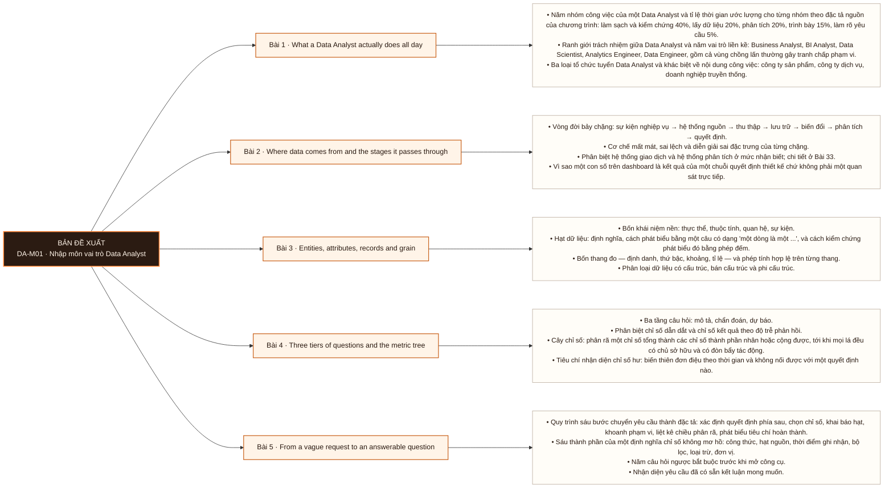

# Mô-đun 1: Nhập môn vai trò Data Analyst

Module không dạy công cụ. Nó thiết lập bốn khái niệm mà 80 bài sau viện dẫn: hạt dữ liệu, vòng đời dữ liệu, cây chỉ số, và đặc tả câu hỏi. Ba bài đầu ở tầng hiểu, hai bài cuối chuyển sang áp dụng và sáng tạo.

## Điều kiện đầu vào

| Mã | Người học có thể | Bằng chứng được chấp nhận |
|---|---|---|
| EN-01-01 | Không | Không yêu cầu |

## Đầu ra mô-đun

Chuyển một yêu cầu phát biểu mơ hồ thành đặc tả phân tích mà người thứ hai triển khai được không cần hỏi lại

## Tiêu chí hoàn thành

| Mã | Bằng chứng bắt buộc | Ngưỡng đạt | Lỗi loại trực tiếp |
|---|---|---|---|
| EC-01-01 | Nộp sáu đặc tả cho sáu yêu cầu mơ hồ. Một học viên khác đọc và triển khai được ít nhất năm trong sáu, không đặt câu hỏi làm rõ nào | Nộp sáu đặc tả, và ≥ 5/6 được một học viên khác triển khai mà không đặt câu hỏi làm rõ. Đây cũng là exit criterion của Mô-đun 1. | Học lướt vì tưởng là module dẫn nhập, dẫn tới ở M7 không định vị được điểm bắt đầu điều tra |

## Khái niệm và nguyên tắc bất biến

| Mã khái niệm | Ranh giới định nghĩa | Nguyên tắc bất biến hoặc quy tắc quyết định | Bài chính |
|---|---|---|---|
| C01-001 | Năm nhóm công việc của một Data Analyst và tỉ lệ thời gian ước lượng cho từng nhóm theo đặc tả nguồn của chương trình: làm sạch và kiểm chứng 40%, lấy dữ liệu 20%, phân tích 20%, trình bày 15%, làm rõ yêu cầu 5%. | Ranh giới trách nhiệm giữa Data Analyst và năm vai trò liền kề: Business Analyst, BI Analyst, Data Scientist, Analytics Engineer, Data Engineer, gồm cả vùng chồng lấn thường gây tranh chấp phạm vi. | L001 |
| C01-002 | Vòng đời bảy chặng: sự kiện nghiệp vụ → hệ thống nguồn → thu thập → lưu trữ → biến đổi → phân tích → quyết định. | Cơ chế mất mát, sai lệch và diễn giải sai đặc trưng của từng chặng. | L002 |
| C01-003 | Bốn khái niệm nền: thực thể, thuộc tính, quan hệ, sự kiện. | Hạt dữ liệu: định nghĩa, cách phát biểu bằng một câu có dạng "một dòng là một ...", và cách kiểm chứng phát biểu đó bằng phép đếm. | L003 |
| C01-004 | Ba tầng câu hỏi: mô tả, chẩn đoán, dự báo. | Phân biệt chỉ số dẫn dắt và chỉ số kết quả theo độ trễ phản hồi. | L004 |
| C01-005 | Quy trình sáu bước chuyển yêu cầu thành đặc tả: xác định quyết định phía sau, chọn chỉ số, khai báo hạt, khoanh phạm vi, liệt kê chiều phân rã, phát biểu tiêu chí hoàn thành. | Sáu thành phần của một định nghĩa chỉ số không mơ hồ: công thức, hạt nguồn, thời điểm ghi nhận, bộ lọc, loại trừ, đơn vị. | L005 |

## Các bài trong mô-đun

| Bài | Dạng | Đầu ra | Bằng chứng | Điều kiện tiên quyết |
|---|---|---|---|---|
| L001 · What a Data Analyst actually does all day | LT | Phân định trách nhiệm của sáu vai trò trong đội dữ liệu cho một danh sách nhiệm vụ cho trước, và định vị khoảng cách giữa năng lực hiện có của bản thân và ma trận năng lực của chương trình. | Nộp bảng tần suất kỹ năng từ 10 tin tuyển dụng có ghi nguồn và ngày truy cập, và bài gán nhiệm vụ đạt ≥ 12/15. | M01: Không |
| L002 · Where data comes from and the stages it passes through | LT | Tái dựng vòng đời bảy chặng từ trí nhớ và chỉ ra một cơ chế sai lệch cụ thể tại mỗi chặng. | Vẽ lại đủ bảy chặng đúng thứ tự không nhìn tài liệu, và nộp bảng theo dấu giao dịch có gán chặng cho từng bản ghi. | L001 |
| L003 · Entities, attributes, records and grain | LT | Phát biểu hạt của một bảng chưa từng thấy bằng một câu, kiểm chứng phát biểu đó bằng phép đếm, và định lượng sai số tổng hợp khi hai hạt bị trộn trong một bảng. | Phát biểu đúng hạt của 5/5 bảng trong bài kiểm, mỗi phát biểu kèm phép đếm kiểm chứng, và tính đúng mức thổi phồng của bảng trộn hạt. | L002 |
| L004 · Three tiers of questions and the metric tree | LT | Dựng cây chỉ số cho một mô hình kinh doanh cho trước, sao cho mọi lá đều nêu được chủ sở hữu và một đòn bẩy tác động cụ thể. | Nộp ba cây chỉ số, mỗi lá có chủ sở hữu và đòn bẩy, phân rã kiểm được bằng số học, và bảo vệ được trước hai câu phản biện. | L003 |
| L005 · From a vague request to an answerable question | TH | Chuyển sáu yêu cầu phát biểu mơ hồ thành sáu đặc tả đủ sáu bước, mà người thứ hai triển khai được không cần đặt câu hỏi làm rõ. | Nộp sáu đặc tả, và ≥ 5/6 được một học viên khác triển khai mà không đặt câu hỏi làm rõ. Đây cũng là exit criterion của Mô-đun 1. | L004 |

## Nội dung từng bài

> **Sơ đồ đề xuất — DA-M01 v0.1.0.** Mỗi nhánh đi từ một bài học đến các nội dung nguyên tử bắt buộc. Thứ tự dạy lấy từ bảng `Các bài trong mô-đun`.

### Bài 1: What a Data Analyst actually does all day

Năm nhóm công việc của một Data Analyst và tỉ lệ thời gian ước lượng cho từng nhóm theo đặc tả nguồn của chương trình: làm sạch và kiểm chứng 40%, lấy dữ liệu 20%, phân tích 20%, trình bày 15%, làm rõ yêu cầu 5%. Ranh giới trách nhiệm giữa Data Analyst và năm vai trò liền kề: Business Analyst, BI Analyst, Data Scientist, Analytics Engineer, Data Engineer, gồm cả vùng chồng lấn thường gây tranh chấp phạm vi. Ba loại tổ chức tuyển Data Analyst và khác biệt về nội dung công việc: công ty sản phẩm, công ty dịch vụ, doanh nghiệp truyền thống.

Người học phải phân định trách nhiệm của sáu vai trò trong đội dữ liệu cho một danh sách nhiệm vụ cho trước, và định vị khoảng cách giữa năng lực hiện có của bản thân và ma trận năng lực của chương trình. Bằng chứng thực hành: Đọc 10 tin tuyển dụng Data Analyst đang mở tại Việt Nam trên ITViec hoặc TopDev. Lập bảng tần suất: mỗi kỹ năng xuất hiện trong bao nhiêu tin. Đối chiếu bảng tần suất với bản đồ giáo trình ở roadmap chương trình và chỉ ra kỹ năng nào chương trình không phủ. Bài hoàn tất khi nộp bảng tần suất kỹ năng từ 10 tin tuyển dụng có ghi nguồn và ngày truy cập, và bài gán nhiệm vụ đạt ≥ 12/15.

Cách đánh giá: Tầng *hiểu*. Bài mở đầu chương trình, người học chưa có dữ liệu để thao tác, nên objective dừng ở mức phân định và giải thích. Kiểm bằng bài tập gán 15 nhiệm vụ cho sáu vai trò kèm một câu lý do mỗi nhiệm vụ; chấm theo đáp án cố định, đạt khi đúng ≥ 12/15 và lý do không mâu thuẫn với bảng ranh giới trong roadmap nguồn.

### Bài 2: Where data comes from and the stages it passes through

Vòng đời bảy chặng: sự kiện nghiệp vụ → hệ thống nguồn → thu thập → lưu trữ → biến đổi → phân tích → quyết định. Cơ chế mất mát, sai lệch và diễn giải sai đặc trưng của từng chặng. Phân biệt hệ thống giao dịch và hệ thống phân tích ở mức nhận biết; chi tiết ở Bài 33. Vì sao một con số trên dashboard là kết quả của một chuỗi quyết định thiết kế chứ không phải một quan sát trực tiếp.

Người học phải tái dựng vòng đời bảy chặng từ trí nhớ và chỉ ra một cơ chế sai lệch cụ thể tại mỗi chặng. Bằng chứng thực hành: Theo dấu một giao dịch mua hàng trên sàn thương mại điện tử: liệt kê mọi bản ghi dữ liệu nó sinh ra, từ thao tác xem sản phẩm tới xác nhận nhận hàng, và gán mỗi bản ghi vào một chặng trong vòng đời. Bài hoàn tất khi vẽ lại đủ bảy chặng đúng thứ tự không nhìn tài liệu, và nộp bảng theo dấu giao dịch có gán chặng cho từng bản ghi.

Cách đánh giá: Tầng *hiểu*. Bài xây mô hình khái niệm làm nền cho Bài 3 và cho toàn bộ M4, chưa có thao tác trên dữ liệu. Kiểm bằng bài vẽ lại sơ đồ bảy chặng không nhìn tài liệu, kèm một chú thích cơ chế sai lệch mỗi chặng; đạt khi đủ bảy chặng đúng thứ tự và ≥ 5/7 chú thích nêu được cơ chế cụ thể thay vì phát biểu chung.

### Bài 3: Entities, attributes, records and grain

Bốn khái niệm nền: thực thể, thuộc tính, quan hệ, sự kiện. Hạt dữ liệu: định nghĩa, cách phát biểu bằng một câu có dạng "một dòng là một ...", và cách kiểm chứng phát biểu đó bằng phép đếm. Bốn thang đo — định danh, thứ bậc, khoảng, tỉ lệ — và phép tính hợp lệ trên từng thang. Phân loại dữ liệu có cấu trúc, bán cấu trúc và phi cấu trúc.

Người học phải phát biểu hạt của một bảng chưa từng thấy bằng một câu, kiểm chứng phát biểu đó bằng phép đếm, và định lượng sai số tổng hợp khi hai hạt bị trộn trong một bảng. Bằng chứng thực hành: Tháo rời một hoá đơn bán hàng giấy thành thực thể, thuộc tính và quan hệ, rồi lắp lại thành hai bảng có hạt khác nhau. Cho một bảng đã trộn hạt đơn hàng với hạt dòng hàng, tính tổng doanh thu và định lượng chính xác mức thổi phồng. Bài hoàn tất khi phát biểu đúng hạt của 5/5 bảng trong bài kiểm, mỗi phát biểu kèm phép đếm kiểm chứng, và tính đúng mức thổi phồng của bảng trộn hạt.

Cách đánh giá: Tầng *áp dụng*. Hạt là khái niệm được viện dẫn nhiều nhất trong chương trình — ở Bài 22, 24, 34 và 49 — nên objective phải ở tầng thao tác được ngay, không dừng ở giải thích. Kiểm bằng bài thực hiện trên năm bảng chưa gặp: phát biểu hạt, viết phép đếm kiểm chứng, và với bảng trộn hạt thì tính ra con số sai lệch. Không kiểm bằng câu hỏi nhiều lựa chọn.

### Bài 4: Three tiers of questions and the metric tree

Ba tầng câu hỏi: mô tả, chẩn đoán, dự báo. Phân biệt chỉ số dẫn dắt và chỉ số kết quả theo độ trễ phản hồi. Cây chỉ số: phân rã một chỉ số tổng thành các chỉ số thành phần nhân hoặc cộng được, tới khi mọi lá đều có chủ sở hữu và có đòn bẩy tác động. Tiêu chí nhận diện chỉ số hư: biến thiên đơn điệu theo thời gian và không nối được với một quyết định nào.

Người học phải dựng cây chỉ số cho một mô hình kinh doanh cho trước, sao cho mọi lá đều nêu được chủ sở hữu và một đòn bẩy tác động cụ thể. Bằng chứng thực hành: Dựng cây chỉ số đầy đủ cho ba mô hình kinh doanh: thương mại điện tử, ứng dụng thuê bao, chuỗi cửa hàng. Rà một bộ 12 chỉ số cho sẵn và loại ra những chỉ số không thoả tiêu chí tác động được. Bài hoàn tất khi nộp ba cây chỉ số, mỗi lá có chủ sở hữu và đòn bẩy, phân rã kiểm được bằng số học, và bảo vệ được trước hai câu phản biện.

Cách đánh giá: Tầng *sáng tạo*. Cây chỉ số không có đáp án duy nhất; hai cây khác nhau đều hợp lệ nếu phân rã đúng về mặt số học và mọi lá đều tác động được. Kiểm bằng sản phẩm: nộp cây, bảo vệ trước hai câu hỏi phản biện về tính đầy đủ của phân rã và tính tác động được của lá. Không kiểm bằng đáp án cố định.

### Bài 5: From a vague request to an answerable question

Quy trình sáu bước chuyển yêu cầu thành đặc tả: xác định quyết định phía sau, chọn chỉ số, khai báo hạt, khoanh phạm vi, liệt kê chiều phân rã, phát biểu tiêu chí hoàn thành. Sáu thành phần của một định nghĩa chỉ số không mơ hồ: công thức, hạt nguồn, thời điểm ghi nhận, bộ lọc, loại trừ, đơn vị. Năm câu hỏi ngược bắt buộc trước khi mở công cụ. Nhận diện yêu cầu đã có sẵn kết luận mong muốn. Thủ tục từ chối một yêu cầu không trả lời được bằng dữ liệu hiện có.

Người học phải chuyển sáu yêu cầu phát biểu mơ hồ thành sáu đặc tả đủ sáu bước, mà người thứ hai triển khai được không cần đặt câu hỏi làm rõ. Bằng chứng thực hành: Đóng vai theo cặp. Một người giữ vai bên yêu cầu, cầm phiếu ghi quyết định thật không được tiết lộ. Người kia phỏng vấn trong 7 phút rồi viết đặc tả sáu bước. Đổi vai sau ba lượt. Bài hoàn tất khi nộp sáu đặc tả, và ≥ 5/6 được một học viên khác triển khai mà không đặt câu hỏi làm rõ. Đây cũng là exit criterion của Mô-đun 1.

Cách đánh giá: Tầng *sáng tạo*. Đặc tả là một sản phẩm mới do người học tạo ra dưới ràng buộc, không phải lời giải của một bài có đáp án. Kiểm bằng rà soát chéo: một học viên khác nhận đặc tả và phải triển khai được; mỗi câu hỏi làm rõ họ buộc phải đặt là một khuyết điểm của đặc tả. Đạt khi ≥ 5/6 đặc tả không sinh câu hỏi làm rõ nào.

## Lý do sắp xếp

Mô-đun bắt đầu từ `M01: Không` và đi theo các quan hệ tiên quyết đã ghi trong bảng. Mỗi bài chỉ sử dụng khái niệm hoặc thao tác đã được giới thiệu trước đó; bài cuối L005 tích hợp đầu ra của toàn mô-đun.

## Ma trận đánh giá

| Mã đầu ra | Mức độ tư duy | Cách đánh giá | Ngưỡng đạt | Hình thức kiểm tra lại |
|---|---|---|---|---|
| L001 | Hiểu | Tầng *hiểu*. Bài mở đầu chương trình, người học chưa có dữ liệu để thao tác, nên objective dừng ở mức phân định và giải thích. Kiểm bằng bài tập gán 15 nhiệm vụ cho sáu vai trò kèm một câu lý do mỗi nhiệm vụ; chấm theo đáp án cố định, đạt khi đúng ≥ 12/15 và lý do không mâu thuẫn với bảng ranh giới trong roadmap nguồn. | Nộp bảng tần suất kỹ năng từ 10 tin tuyển dụng có ghi nguồn và ngày truy cập, và bài gán nhiệm vụ đạt ≥ 12/15. | Tình huống mới, giữ nguyên đầu ra và ngưỡng |
| L002 | Hiểu | Tầng *hiểu*. Bài xây mô hình khái niệm làm nền cho Bài 3 và cho toàn bộ M4, chưa có thao tác trên dữ liệu. Kiểm bằng bài vẽ lại sơ đồ bảy chặng không nhìn tài liệu, kèm một chú thích cơ chế sai lệch mỗi chặng; đạt khi đủ bảy chặng đúng thứ tự và ≥ 5/7 chú thích nêu được cơ chế cụ thể thay vì phát biểu chung. | Vẽ lại đủ bảy chặng đúng thứ tự không nhìn tài liệu, và nộp bảng theo dấu giao dịch có gán chặng cho từng bản ghi. | Tình huống mới, giữ nguyên đầu ra và ngưỡng |
| L003 | Áp dụng | Tầng *áp dụng*. Hạt là khái niệm được viện dẫn nhiều nhất trong chương trình — ở Bài 22, 24, 34 và 49 — nên objective phải ở tầng thao tác được ngay, không dừng ở giải thích. Kiểm bằng bài thực hiện trên năm bảng chưa gặp: phát biểu hạt, viết phép đếm kiểm chứng, và với bảng trộn hạt thì tính ra con số sai lệch. Không kiểm bằng câu hỏi nhiều lựa chọn. | Phát biểu đúng hạt của 5/5 bảng trong bài kiểm, mỗi phát biểu kèm phép đếm kiểm chứng, và tính đúng mức thổi phồng của bảng trộn hạt. | Tình huống mới, giữ nguyên đầu ra và ngưỡng |
| L004 | Sáng tạo | Tầng *sáng tạo*. Cây chỉ số không có đáp án duy nhất; hai cây khác nhau đều hợp lệ nếu phân rã đúng về mặt số học và mọi lá đều tác động được. Kiểm bằng sản phẩm: nộp cây, bảo vệ trước hai câu hỏi phản biện về tính đầy đủ của phân rã và tính tác động được của lá. Không kiểm bằng đáp án cố định. | Nộp ba cây chỉ số, mỗi lá có chủ sở hữu và đòn bẩy, phân rã kiểm được bằng số học, và bảo vệ được trước hai câu phản biện. | Tình huống mới, giữ nguyên đầu ra và ngưỡng |
| L005 | Sáng tạo | Tầng *sáng tạo*. Đặc tả là một sản phẩm mới do người học tạo ra dưới ràng buộc, không phải lời giải của một bài có đáp án. Kiểm bằng rà soát chéo: một học viên khác nhận đặc tả và phải triển khai được; mỗi câu hỏi làm rõ họ buộc phải đặt là một khuyết điểm của đặc tả. Đạt khi ≥ 5/6 đặc tả không sinh câu hỏi làm rõ nào. | Nộp sáu đặc tả, và ≥ 5/6 được một học viên khác triển khai mà không đặt câu hỏi làm rõ. Đây cũng là exit criterion của Mô-đun 1. | Tình huống mới, giữ nguyên đầu ra và ngưỡng |

Không cộng điểm để bù cho lỗi loại trực tiếp. Người học phải sửa đúng lỗi, nộp lại bằng chứng và thực hiện kiểm tra lại trên một tình huống khác.

## Bài thực hành bắt buộc

| Bài thực hành hoặc dự án | Bài liên quan | Sản phẩm bắt buộc | Lỗi được cài vào tình huống |
|---|---|---|---|
| What a Data Analyst actually does all day | L001 | Đọc 10 tin tuyển dụng Data Analyst đang mở tại Việt Nam trên ITViec hoặc TopDev. Lập bảng tần suất: mỗi kỹ năng xuất hiện trong bao nhiêu tin. Đối chiếu bảng tần suất với bản đồ giáo trình ở roadmap chương trình và chỉ ra kỹ năng nào chương trình không phủ. | Quy vai trò Data Analyst về việc lập báo cáo · giả định thành thạo công cụ là điều kiện đủ · bỏ qua phần nghiệp vụ vì không đo được trực tiếp. |
| Where data comes from and the stages it passes through | L002 | Theo dấu một giao dịch mua hàng trên sàn thương mại điện tử: liệt kê mọi bản ghi dữ liệu nó sinh ra, từ thao tác xem sản phẩm tới xác nhận nhận hàng, và gán mỗi bản ghi vào một chặng trong vòng đời. | Giả định dữ liệu trong hệ thống nguồn là chính xác · không phân biệt giá trị thiếu với giá trị bằng 0 · bỏ qua chặng biến đổi khi truy nguyên chênh lệch. |
| Entities, attributes, records and grain | L003 | Tháo rời một hoá đơn bán hàng giấy thành thực thể, thuộc tính và quan hệ, rồi lắp lại thành hai bảng có hạt khác nhau. Cho một bảng đã trộn hạt đơn hàng với hạt dòng hàng, tính tổng doanh thu và định lượng chính xác mức thổi phồng. | Đồng nhất hạt với khoá chính · tính trung bình trên thang thứ bậc · giả định thêm một cột không đổi hạt. |
| Three tiers of questions and the metric tree | L004 | Dựng cây chỉ số đầy đủ cho ba mô hình kinh doanh: thương mại điện tử, ứng dụng thuê bao, chuỗi cửa hàng. Rà một bộ 12 chỉ số cho sẵn và loại ra những chỉ số không thoả tiêu chí tác động được. | Cây chứa lá không có đòn bẩy · trộn chỉ số dẫn dắt và chỉ số kết quả ở cùng một cấp · chọn chỉ số theo mức độ dễ đo. |
| From a vague request to an answerable question | L005 | Đóng vai theo cặp. Một người giữ vai bên yêu cầu, cầm phiếu ghi quyết định thật không được tiết lộ. Người kia phỏng vấn trong 7 phút rồi viết đặc tả sáu bước. Đổi vai sau ba lượt. | Mở công cụ viết truy vấn trước khi chốt đặc tả · giả định định nghĩa chỉ số thay vì hỏi · bỏ qua câu hỏi kết quả dùng cho quyết định nào · nhận việc không có tiêu chí hoàn thành. |

## Ngộ nhận và lỗi loại trực tiếp

| Lỗi | Hệ quả | Nơi phát hiện | Cách khắc phục |
|---|---|---|---|
| Quy vai trò Data Analyst về việc lập báo cáo · giả định thành thạo công cụ là điều kiện đủ · bỏ qua phần nghiệp vụ vì không đo được trực tiếp. | Không tạo được bằng chứng hợp lệ cho đầu ra L001 | L001 | Làm lại phép đánh giá trên tình huống mới và đạt tiêu chí `Done when` |
| Giả định dữ liệu trong hệ thống nguồn là chính xác · không phân biệt giá trị thiếu với giá trị bằng 0 · bỏ qua chặng biến đổi khi truy nguyên chênh lệch. | Không tạo được bằng chứng hợp lệ cho đầu ra L002 | L002 | Làm lại phép đánh giá trên tình huống mới và đạt tiêu chí `Done when` |
| Đồng nhất hạt với khoá chính · tính trung bình trên thang thứ bậc · giả định thêm một cột không đổi hạt. | Không tạo được bằng chứng hợp lệ cho đầu ra L003 | L003 | Làm lại phép đánh giá trên tình huống mới và đạt tiêu chí `Done when` |
| Cây chứa lá không có đòn bẩy · trộn chỉ số dẫn dắt và chỉ số kết quả ở cùng một cấp · chọn chỉ số theo mức độ dễ đo. | Không tạo được bằng chứng hợp lệ cho đầu ra L004 | L004 | Làm lại phép đánh giá trên tình huống mới và đạt tiêu chí `Done when` |
| Mở công cụ viết truy vấn trước khi chốt đặc tả · giả định định nghĩa chỉ số thay vì hỏi · bỏ qua câu hỏi kết quả dùng cho quyết định nào · nhận việc không có tiêu chí hoàn thành. | Không tạo được bằng chứng hợp lệ cho đầu ra L005 | L005 | Làm lại phép đánh giá trên tình huống mới và đạt tiêu chí `Done when` |

## Điểm nối với mô-đun khác

| Kế thừa từ | Cung cấp cho mô-đun sau | Cam kết đầu ra |
|---|---|---|
| Không | Mô-đun kế tiếp trong chương trình | Chuyển một yêu cầu phát biểu mơ hồ thành đặc tả phân tích mà người thứ hai triển khai được không cần hỏi lại |

## Tài liệu tham khảo

| Mã | Nguồn | Vị trí | Dùng cho |
|---|---|---|---|
| R01-01 | Roadmap Data Analyst nguồn | `Material/DA/Reference/Library/roadmap-v1-goc.md` | Phạm vi chương trình và thứ tự bài học |
| R01-02 | Manifest nguồn cấp bài | `Material/DA/Reference/.../Lesson_*/sources.yaml` | Truy vết nguồn khi manifest được điền |

## Đối chiếu năng lực

| Khung hoặc mã năng lực | Phạm vi sử dụng | Bằng chứng |
|---|---|---|
| `DAAN` mức 2 | Đầu ra và phép đánh giá của mô-đun | EC-01-01 và ma trận đánh giá theo bài |

Ánh xạ này mô tả phạm vi được thực hành; nó không tự động chứng nhận cấp độ của người học trong khung năng lực.

## Giới hạn của mô-đun

- Roadmap xác định phạm vi, bằng chứng và cách đánh giá; nội dung giảng giải đầy đủ thuộc `note.md`.
- Manifest nguồn cấp bài hiện chưa có dữ liệu. Không được dùng tên tệp trong `Reference/Library` làm bằng chứng cho một khẳng định.
- Hoàn thành mô-đun chỉ chứng minh các đầu ra được nêu trong tài liệu này; không tự động chứng nhận chức danh hoặc kinh nghiệm làm việc.
