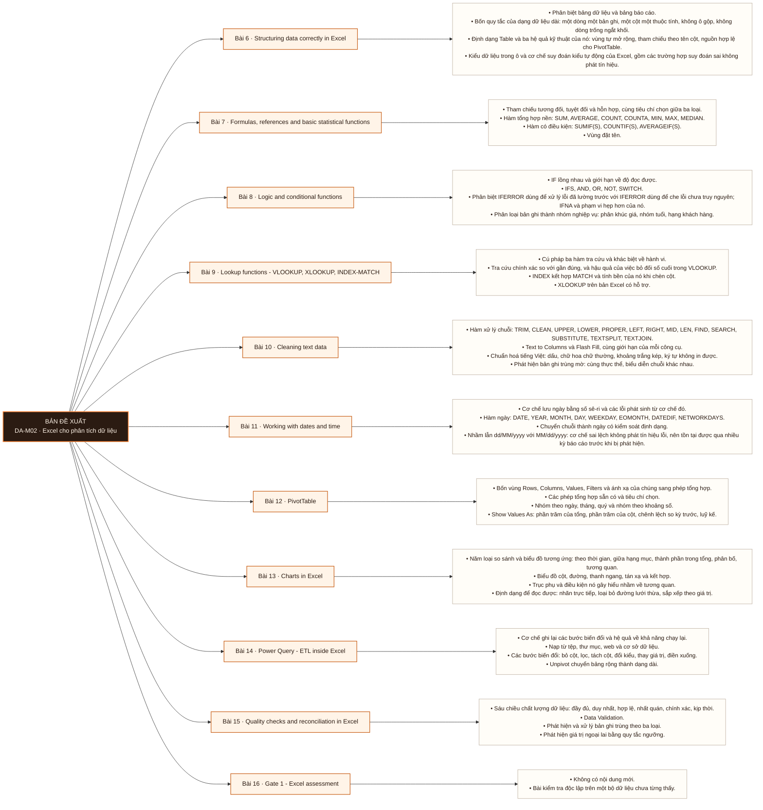

# Mô-đun 2: Excel cho phân tích dữ liệu

Excel không phải công cụ tạm dùng trước khi chuyển sang SQL. Nó là công cụ đối soát và trao đổi với người không dùng công cụ kỹ thuật, và được dùng suốt vòng đời nghề. Module dạy Excel ở mức thao tác của người phân tích: dạng dữ liệu dài, hàm tra cứu có kiểm chứng, và quy trình biến đổi ghi lại được. Chín bài từ Bài 6 tới 15 nằm ở tầng áp dụng, trừ Bài 13 và 15 ở tầng đánh giá.

## Điều kiện đầu vào

| Mã | Người học có thể | Bằng chứng được chấp nhận |
|---|---|---|
| EN-02-01 | M01 | Bằng chứng hoàn thành điều kiện được nêu trong cột trước |

Nếu chưa có bằng chứng đầu vào, người học phải hoàn thành lại bài hoặc mô-đun được dẫn chiếu trước khi thực hiện phép đánh giá của mô-đun này.

## Đầu ra mô-đun

Chuyển một tệp Excel không chuẩn thành quy trình nạp và làm sạch chạy lại được bằng một thao tác, có đối soát

## Tiêu chí hoàn thành

| Mã | Bằng chứng bắt buộc | Ngưỡng đạt | Lỗi loại trực tiếp |
|---|---|---|---|
| EC-02-01 | Đạt Cổng 1 ≥ 70/100, không phần nào dưới 50% | ≥ 70/100 và không phần nào dưới 50%. Không đạt thì áp dụng quy trình khắc phục của roadmap giai đoạn, thi lại một lần. Đạt ≥ 70/100 và không phần nào dưới 50%. Đây là exit criterion của Mô-đun 2. | Bỏ qua module vì đã dùng Excel trong công việc trước đó, trong khi phần Power Query và dạng dữ liệu dài mới là phần vai trò phân tích cần |

## Khái niệm và nguyên tắc bất biến

| Mã khái niệm | Ranh giới định nghĩa | Nguyên tắc bất biến hoặc quy tắc quyết định | Bài chính |
|---|---|---|---|
| C02-006 | Phân biệt bảng dữ liệu và bảng báo cáo. | Bốn quy tắc của dạng dữ liệu dài: một dòng một bản ghi, một cột một thuộc tính, không ô gộp, không dòng trống ngắt khối. | L006 |
| C02-007 | Tham chiếu tương đối, tuyệt đối và hỗn hợp, cùng tiêu chí chọn giữa ba loại. | Hàm tổng hợp nền: SUM, AVERAGE, COUNT, COUNTA, MIN, MAX, MEDIAN. | L007 |
| C02-008 | IF lồng nhau và giới hạn về độ đọc được. | IFS, AND, OR, NOT, SWITCH. | L008 |
| C02-009 | Cú pháp ba hàm tra cứu và khác biệt về hành vi. | Tra cứu chính xác so với gần đúng, và hậu quả của việc bỏ đối số cuối trong VLOOKUP. | L009 |
| C02-010 | Hàm xử lý chuỗi: TRIM, CLEAN, UPPER, LOWER, PROPER, LEFT, RIGHT, MID, LEN, FIND, SEARCH, SUBSTITUTE, TEXTSPLIT, TEXTJOIN. | Text to Columns và Flash Fill, cùng giới hạn của mỗi công cụ. | L010 |
| C02-011 | Cơ chế lưu ngày bằng số sê-ri và các lỗi phát sinh từ cơ chế đó. | Hàm ngày: DATE, YEAR, MONTH, DAY, WEEKDAY, EOMONTH, DATEDIF, NETWORKDAYS. | L011 |
| C02-012 | Bốn vùng Rows, Columns, Values, Filters và ánh xạ của chúng sang phép tổng hợp. | Các phép tổng hợp sẵn có và tiêu chí chọn. | L012 |
| C02-013 | Năm loại so sánh và biểu đồ tương ứng: theo thời gian, giữa hạng mục, thành phần trong tổng, phân bố, tương quan. | Biểu đồ cột, đường, thanh ngang, tán xạ và kết hợp. | L013 |
| C02-014 | Cơ chế ghi lại các bước biến đổi và hệ quả về khả năng chạy lại. | Nạp từ tệp, thư mục, web và cơ sở dữ liệu. | L014 |
| C02-015 | Sáu chiều chất lượng dữ liệu: đầy đủ, duy nhất, hợp lệ, nhất quán, chính xác, kịp thời. | Data Validation. | L015 |
| C02-016 | Không có nội dung mới. | Bài kiểm tra độc lập trên một bộ dữ liệu chưa từng thấy. | L016 |

## Các bài trong mô-đun

| Bài | Dạng | Đầu ra | Bằng chứng | Điều kiện tiên quyết |
|---|---|---|---|---|
| L006 · Structuring data correctly in Excel | TH | Chuyển một tệp Excel có ô gộp, tiêu đề nhiều tầng và số lưu dạng văn bản thành một Table ở dạng dữ liệu dài, và chứng minh kết quả bằng một PivotTable chạy được. | Tệp kết quả tạo được PivotTable không lỗi, và tổng doanh thu khớp tuyệt đối với tổng tính từ tệp gốc. | M02: M01 · L003 |
| L007 · Formulas, references and basic statistical functions | TH | Viết công thức có điều kiện nhiều tầng và sao chép nó qua một vùng mà không sai tham chiếu, kiểm chứng bằng đối chiếu với kết quả tính độc lập. | Ba bảng kết quả khớp với đáp án, và công thức sao chép được qua toàn vùng không sinh lỗi tham chiếu. | L006 |
| L008 · Logic and conditional functions | TH | Phân loại 10.000 bản ghi vào các nhóm nghiệp vụ bằng một công thức duy nhất mà người khác đọc và sửa được. | Phân phối bốn hạng khách khớp đáp án, mọi đơn bất thường được đánh dấu đủ, và công thức đạt rà soát chéo. | L007 |
| L009 · Lookup functions - VLOOKUP, XLOOKUP, INDEX-MATCH | TH | Ghép hai bảng theo khoá và truy nguyên nguyên nhân cho 100% mã không khớp, phân loại theo nhóm nguyên nhân. | Cả 14 mã không khớp được gán nguyên nhân có bằng chứng, và tổng sau ghép khớp với tổng trước ghép. | L008 |
| L010 · Cleaning text data | TH | Chuẩn hoá một cột tên hoặc địa chỉ nhập tay về dạng so sánh được, và định lượng số cặp trùng thực chất phát hiện thêm sau chuẩn hoá. | Phát hiện ≥ 44/47 cặp trùng thực chất và không gộp nhầm cặp nào ngoài danh sách đáp án. | L009 |
| L011 · Working with dates and time | TH | Chuyển một cột ngày trộn nhiều định dạng về một định dạng thống nhất, và chứng minh không có bản ghi nào bị hoán đổi ngày với tháng. | Cột ngày về một định dạng thống nhất, và nộp được phép kiểm tra chứng minh không có bản ghi bị đảo. | L010 |
| L012 · PivotTable | TH | Trả lời 15 câu hỏi nghiệp vụ bằng PivotTable trong 20 phút, mỗi câu trả lời đối chiếu được với phép tính độc lập. | Trả lời đúng ≥ 13/15 câu hỏi nghiệp vụ trong 20 phút, có tính giờ. | L011 |
| L013 · Charts in Excel | TH | Chọn loại biểu đồ cho 10 tình huống và biện minh mỗi lựa chọn bằng loại so sánh, không bằng sở thích trình bày. | Nộp 10 lựa chọn biểu đồ kèm lý do nhất quán với loại so sánh, và sáu biểu đồ đã vẽ lại có ghi vấn đề đã khắc phục. | L012 |
| L014 · Power Query - ETL inside Excel | TH | Dựng một quy trình nạp và làm sạch chạy lại được bằng một thao tác, và chứng minh nó xử lý đúng một tệp nguồn mới thêm vào mà không cần sửa bước nào. | Thêm tệp tháng thứ 13 và bấm làm mới cho ra bảng đúng, không sửa bước nào. | L013 |
| L015 · Quality checks and reconciliation in Excel | TH | Kết luận một con số có dùng được hay không, kèm bằng chứng định lượng trên sáu chiều chất lượng và phần giả định đi kèm. | Kết luận đúng con số nào dùng được, và truy được nguồn gốc của cả ba khoản chênh lệch còn lại. | L014 |
| L016 · Gate 1 - Excel assessment | KT | Thực hiện trọn quy trình từ tệp không chuẩn tới báo cáo có đối soát, trên dữ liệu chưa gặp, trong giới hạn thời gian. | ≥ 70/100 và không phần nào dưới 50%. Không đạt thì áp dụng quy trình khắc phục của roadmap giai đoạn, thi lại một lần. Đạt ≥ 70/100 và không phần nào dưới 50%. Đây là exit criterion của Mô-đun 2. | L015 |

## Nội dung từng bài

> **Sơ đồ đề xuất — DA-M02 v0.1.0.** Mỗi nhánh đi từ một bài học đến các nội dung nguyên tử bắt buộc. Thứ tự dạy lấy từ bảng `Các bài trong mô-đun`.

### Bài 6: Structuring data correctly in Excel

Phân biệt bảng dữ liệu và bảng báo cáo. Bốn quy tắc của dạng dữ liệu dài: một dòng một bản ghi, một cột một thuộc tính, không ô gộp, không dòng trống ngắt khối. Định dạng Table và ba hệ quả kỹ thuật của nó: vùng tự mở rộng, tham chiếu theo tên cột, nguồn hợp lệ cho PivotTable. Kiểu dữ liệu trong ô và cơ chế suy đoán kiểu tự động của Excel, gồm các trường hợp suy đoán sai không phát tín hiệu.

Người học phải chuyển một tệp Excel có ô gộp, tiêu đề nhiều tầng và số lưu dạng văn bản thành một Table ở dạng dữ liệu dài, và chứng minh kết quả bằng một PivotTable chạy được. Bằng chứng thực hành: Cho một tệp báo cáo bán hàng có ô gộp, tiêu đề hai tầng và cột số lưu dạng văn bản. Chuyển thành một Table sạch. Kiểm chứng bằng một PivotTable chạy được và bằng phép đối chiếu tổng với tệp gốc. Bài hoàn tất khi tệp kết quả tạo được PivotTable không lỗi, và tổng doanh thu khớp tuyệt đối với tổng tính từ tệp gốc.

Cách đánh giá: Tầng *áp dụng*. Bài mở đầu module thực hành, nội dung là một quy trình có đáp án đúng xác định được. Kiểm bằng sản phẩm: tệp kết quả phải tạo được PivotTable không báo lỗi và tổng phải khớp với tổng tính từ tệp gốc. Không kiểm bằng câu hỏi nhiều lựa chọn.

### Bài 7: Formulas, references and basic statistical functions

Tham chiếu tương đối, tuyệt đối và hỗn hợp, cùng tiêu chí chọn giữa ba loại. Hàm tổng hợp nền: `SUM`, `AVERAGE`, `COUNT`, `COUNTA`, `MIN`, `MAX`, `MEDIAN`. Hàm có điều kiện: `SUMIF(S)`, `COUNTIF(S)`, `AVERAGEIF(S)`. Vùng đặt tên. Ba hành vi gây sai lệch không báo lỗi: `COUNT` và `COUNTA` đếm tập khác nhau, `AVERAGE` bỏ qua ô rỗng nhưng tính cả giá trị 0, và `COUNTIF` không khớp khi chuỗi điều kiện chứa khoảng trắng thừa.

Người học phải viết công thức có điều kiện nhiều tầng và sao chép nó qua một vùng mà không sai tham chiếu, kiểm chứng bằng đối chiếu với kết quả tính độc lập. Bằng chứng thực hành: Trên `DS1` xuất ra Excel: tính doanh thu theo chi nhánh, số đơn theo trạng thái, và giá trị đơn trung bình theo tháng. Toàn bộ bằng hàm, không dùng PivotTable. Bài hoàn tất khi ba bảng kết quả khớp với đáp án, và công thức sao chép được qua toàn vùng không sinh lỗi tham chiếu.

Cách đánh giá: Tầng *áp dụng*. Bài luyện kỹ thuật công thức trên dữ liệu thật, đáp án xác định được. Kiểm bằng sản phẩm: bảng kết quả phải khớp với đáp án tính bằng phương pháp độc lập; sai một tham chiếu là sai cả cột nên lỗi hiển thị ngay.

### Bài 8: Logic and conditional functions

`IF` lồng nhau và giới hạn về độ đọc được. `IFS`, `AND`, `OR`, `NOT`, `SWITCH`. Phân biệt `IFERROR` dùng để xử lý lỗi đã lường trước với `IFERROR` dùng để che lỗi chưa truy nguyên; `IFNA` và phạm vi hẹp hơn của nó. Phân loại bản ghi thành nhóm nghiệp vụ: phân khúc giá, nhóm tuổi, hạng khách hàng.

Người học phải phân loại 10.000 bản ghi vào các nhóm nghiệp vụ bằng một công thức duy nhất mà người khác đọc và sửa được. Bằng chứng thực hành: Phân nhóm khách hàng theo tổng chi tiêu thành bốn hạng. Gắn nhãn đơn hàng theo khoảng giá. Đánh dấu đơn bất thường: giá trị âm, số lượng bằng 0, ngày nằm trong tương lai. Bài hoàn tất khi phân phối bốn hạng khách khớp đáp án, mọi đơn bất thường được đánh dấu đủ, và công thức đạt rà soát chéo.

Cách đánh giá: Tầng *áp dụng*. Kiểm bằng hai điều kiện đồng thời: phân phối nhóm kết quả khớp đáp án, và công thức đạt rà soát chéo về độ đọc được bởi một học viên khác. Điều kiện thứ hai cần thiết vì `IF` lồng sâu cho kết quả đúng nhưng không bảo trì được.

### Bài 9: Lookup functions - VLOOKUP, XLOOKUP, INDEX-MATCH

Cú pháp ba hàm tra cứu và khác biệt về hành vi. Tra cứu chính xác so với gần đúng, và hậu quả của việc bỏ đối số cuối trong `VLOOKUP`. `INDEX` kết hợp `MATCH` và tính bền của nó khi chèn cột. `XLOOKUP` trên bản Excel có hỗ trợ. Tra cứu hai chiều. Xử lý `#N/A` theo nghĩa nghiệp vụ thay vì thay thế bằng giá trị rỗng.

Người học phải ghép hai bảng theo khoá và truy nguyên nguyên nhân cho 100% mã không khớp, phân loại theo nhóm nguyên nhân. Bằng chứng thực hành: Ghép bảng đơn hàng 2.000 dòng với bảng sản phẩm. Trong dữ liệu có 14 mã sản phẩm không khớp. Truy nguyên và phân loại cả 14 theo nhóm nguyên nhân. Bài hoàn tất khi cả 14 mã không khớp được gán nguyên nhân có bằng chứng, và tổng sau ghép khớp với tổng trước ghép.

Cách đánh giá: Tầng *phân tích*. Phần khó của bài không phải viết hàm mà là truy nguyên vì sao một mã không khớp — mã bị đổi, khoảng trắng thừa, hay khác biệt chữ hoa chữ thường. Kiểm bằng báo cáo truy nguyên: mỗi mã không khớp phải được gán một nguyên nhân có bằng chứng, không chấp nhận gán chung.

### Bài 10: Cleaning text data

Hàm xử lý chuỗi: `TRIM`, `CLEAN`, `UPPER`, `LOWER`, `PROPER`, `LEFT`, `RIGHT`, `MID`, `LEN`, `FIND`, `SEARCH`, `SUBSTITUTE`, `TEXTSPLIT`, `TEXTJOIN`. Text to Columns và Flash Fill, cùng giới hạn của mỗi công cụ. Chuẩn hoá tiếng Việt: dấu, chữ hoa chữ thường, khoảng trắng kép, ký tự không in được. Phát hiện bản ghi trùng mờ: cùng thực thể, biểu diễn chuỗi khác nhau.

Người học phải chuẩn hoá một cột tên hoặc địa chỉ nhập tay về dạng so sánh được, và định lượng số cặp trùng thực chất phát hiện thêm sau chuẩn hoá. Bằng chứng thực hành: Cho 3.000 tên khách hàng nhập tay có khoảng trắng thừa, chữ hoa chữ thường không nhất quán và dấu thiếu. Chuẩn hoá và phát hiện 47 cặp trùng thực chất. Bài hoàn tất khi phát hiện ≥ 44/47 cặp trùng thực chất và không gộp nhầm cặp nào ngoài danh sách đáp án.

Cách đánh giá: Tầng *áp dụng*. Kiểm bằng sản phẩm có ngưỡng: số cặp trùng phát hiện được so với đáp án. Chuẩn hoá thiếu thì bỏ sót, chuẩn hoá quá tay thì gộp nhầm hai thực thể khác nhau, nên bài chấm cả hai loại sai.

### Bài 11: Working with dates and time

Cơ chế lưu ngày bằng số sê-ri và các lỗi phát sinh từ cơ chế đó. Hàm ngày: `DATE`, `YEAR`, `MONTH`, `DAY`, `WEEKDAY`, `EOMONTH`, `DATEDIF`, `NETWORKDAYS`. Chuyển chuỗi thành ngày có kiểm soát định dạng. Nhầm lẫn `dd/MM/yyyy` với `MM/dd/yyyy`: cơ chế sai lệch không phát tín hiệu lỗi, nên tồn tại được qua nhiều kỳ báo cáo trước khi bị phát hiện. Tính tuổi, thâm niên và khoảng cách ngày.

Người học phải chuyển một cột ngày trộn nhiều định dạng về một định dạng thống nhất, và chứng minh không có bản ghi nào bị hoán đổi ngày với tháng. Bằng chứng thực hành: Cho một cột ngày trộn ba định dạng khác nhau. Phát hiện, phân loại theo định dạng, chuyển đổi đúng, và nộp phép kiểm tra chứng minh không có bản ghi nào bị đảo tháng với ngày. Bài hoàn tất khi cột ngày về một định dạng thống nhất, và nộp được phép kiểm tra chứng minh không có bản ghi bị đảo.

Cách đánh giá: Tầng *áp dụng*. Kiểm bằng nghĩa vụ chứng minh: nộp phép kiểm tra cho thấy không có ngày nào bị đảo, không chấp nhận khẳng định suông. Đây là bài đầu tiên trong chương trình yêu cầu bằng chứng phủ định; mẫu này lặp lại ở Bài 24, 36 và 37.

### Bài 12: PivotTable

Bốn vùng Rows, Columns, Values, Filters và ánh xạ của chúng sang phép tổng hợp. Các phép tổng hợp sẵn có và tiêu chí chọn. Nhóm theo ngày, tháng, quý và nhóm theo khoảng số. Show Values As: phần trăm của tổng, phần trăm của cột, chênh lệch so kỳ trước, luỹ kế. Slicer và Timeline. `GETPIVOTDATA`. Cơ chế làm mới và trường hợp PivotTable giữ dữ liệu cũ sau khi nguồn đã đổi.

Người học phải trả lời 15 câu hỏi nghiệp vụ bằng PivotTable trong 20 phút, mỗi câu trả lời đối chiếu được với phép tính độc lập. Bằng chứng thực hành: Trên `DS1`: doanh thu theo chi nhánh × tháng, mười sản phẩm bán chạy nhất, tỉ trọng theo nhóm hàng, tăng trưởng so kỳ trước. Toàn bộ bằng PivotTable. Bài hoàn tất khi trả lời đúng ≥ 13/15 câu hỏi nghiệp vụ trong 20 phút, có tính giờ.

Cách đánh giá: Tầng *áp dụng*. Có ràng buộc thời gian vì mục tiêu là thao tác thành thục, không phải giải được một lần. Kiểm bằng bài có tính giờ; đạt khi ≥ 13/15 câu đúng trong 20 phút.

### Bài 13: Charts in Excel

Năm loại so sánh và biểu đồ tương ứng: theo thời gian, giữa hạng mục, thành phần trong tổng, phân bố, tương quan. Biểu đồ cột, đường, thanh ngang, tán xạ và kết hợp. Trục phụ và điều kiện nó gây hiểu nhầm về tương quan. Định dạng để đọc được: nhãn trực tiếp, loại bỏ đường lưới thừa, sắp xếp theo giá trị. Sparkline. Conditional Formatting: thang màu, data bar, icon set.

Người học phải chọn loại biểu đồ cho 10 tình huống và biện minh mỗi lựa chọn bằng loại so sánh, không bằng sở thích trình bày. Bằng chứng thực hành: Vẽ lại sáu biểu đồ khó đọc cho sẵn thành bản đọc được, ghi rõ mỗi lần sửa đã khắc phục vấn đề gì. Dựng một trang tổng quan một màn hình cho quản lý cửa hàng. Bài hoàn tất khi nộp 10 lựa chọn biểu đồ kèm lý do nhất quán với loại so sánh, và sáu biểu đồ đã vẽ lại có ghi vấn đề đã khắc phục.

Cách đánh giá: Tầng *đánh giá*. Objective là chọn và biện minh giữa nhiều phương án hợp lệ, nên hình thức kiểm phải chấp nhận nhiều đáp án đúng. Kiểm bằng bài chọn kèm lý do; chấm theo tính nhất quán giữa loại so sánh và loại biểu đồ, không theo một đáp án duy nhất.

### Bài 14: Power Query - ETL inside Excel

Cơ chế ghi lại các bước biến đổi và hệ quả về khả năng chạy lại. Nạp từ tệp, thư mục, web và cơ sở dữ liệu. Các bước biến đổi: bỏ cột, lọc, tách cột, đổi kiểu, thay giá trị, điền xuống. Unpivot chuyển bảng rộng thành dạng dài. Merge ghép ngang và Append nối dọc. Gộp mọi tệp trong một thư mục theo một lược đồ chung. Làm mới bằng một thao tác.

Người học phải dựng một quy trình nạp và làm sạch chạy lại được bằng một thao tác, và chứng minh nó xử lý đúng một tệp nguồn mới thêm vào mà không cần sửa bước nào. Bằng chứng thực hành: Gộp 12 tệp báo cáo tháng, mỗi tệp một sheet có tiêu đề hai tầng, thành một bảng dài duy nhất. Kiểm chứng bằng cách thêm tệp tháng thứ 13 và làm mới. Bài hoàn tất khi thêm tệp tháng thứ 13 và bấm làm mới cho ra bảng đúng, không sửa bước nào.

Cách đánh giá: Tầng *áp dụng*. Kiểm bằng phép thử chạy lại: thêm tệp tháng thứ 13 vào thư mục nguồn và bấm làm mới. Quy trình phải cho kết quả đúng mà không sửa bước — đây là điều kiện phân biệt quy trình ghi lại được với thao tác tay.

### Bài 15: Quality checks and reconciliation in Excel

Sáu chiều chất lượng dữ liệu: đầy đủ, duy nhất, hợp lệ, nhất quán, chính xác, kịp thời. Data Validation. Phát hiện và xử lý bản ghi trùng theo ba loại. Phát hiện giá trị ngoại lai bằng quy tắc ngưỡng. Bốn kỹ thuật đối soát: tổng kiểm tra, đối chiếu chéo hai nguồn, kiểm tra biên, kiểm tra thứ nguyên. Cấu trúc phần giả định và giới hạn của một kết quả.

Người học phải kết luận một con số có dùng được hay không, kèm bằng chứng định lượng trên sáu chiều chất lượng và phần giả định đi kèm. Bằng chứng thực hành: Nhận bốn báo cáo về cùng một tháng cho bốn con số doanh thu khác nhau. Truy nguyên nguồn gốc chênh lệch của từng cặp và kết luận con số nào đúng. Bài hoàn tất khi kết luận đúng con số nào dùng được, và truy được nguồn gốc của cả ba khoản chênh lệch còn lại.

Cách đánh giá: Tầng *đánh giá*. Objective là phán quyết về độ tin cậy, không phải thực hiện một quy trình. Kiểm bằng bài có đáp án là một kết luận cộng bằng chứng: bốn báo cáo mâu thuẫn, người học phải chỉ ra báo cáo nào đúng và truy được nguồn gốc chênh lệch. Chấm kết luận và chấm chuỗi bằng chứng riêng.

### Bài 16: Gate 1 - Excel assessment

Không có nội dung mới. Bài kiểm tra độc lập trên một bộ dữ liệu chưa từng thấy.

Người học phải thực hiện trọn quy trình từ tệp không chuẩn tới báo cáo có đối soát, trên dữ liệu chưa gặp, trong giới hạn thời gian. Bằng chứng thực hành: Phần A (25đ) chuyển tệp không chuẩn về dạng dài · Phần B (25đ) làm sạch văn bản và ngày tháng có đối soát · Phần C (20đ) ghép ba bảng và truy nguyên mã không khớp · Phần D (20đ) PivotTable trả lời 8 câu hỏi nghiệp vụ · Phần E (10đ) một trang tổng quan có biểu đồ chọn đúng loại kèm lý do. Bài hoàn tất khi ≥ 70/100 và không phần nào dưới 50%. Không đạt thì áp dụng quy trình khắc phục của roadmap giai đoạn, thi lại một lần. Đạt ≥ 70/100 và không phần nào dưới 50%. Đây là exit criterion của Mô-đun 2.

Cách đánh giá: Tầng *áp dụng* và *đánh giá*. Phần A tới D kiểm tầng áp dụng bằng sản phẩm; phần E kiểm tầng đánh giá bằng lựa chọn biểu đồ có biện minh. Không có phần nào dùng câu hỏi nhiều lựa chọn.

## Lý do sắp xếp

Mô-đun bắt đầu từ `M02: M01 · L003` và đi theo các quan hệ tiên quyết đã ghi trong bảng. Mỗi bài chỉ sử dụng khái niệm hoặc thao tác đã được giới thiệu trước đó; bài cuối L016 tích hợp đầu ra của toàn mô-đun.

## Ma trận đánh giá

| Mã đầu ra | Mức độ tư duy | Cách đánh giá | Ngưỡng đạt | Hình thức kiểm tra lại |
|---|---|---|---|---|
| L006 | Áp dụng | Tầng *áp dụng*. Bài mở đầu module thực hành, nội dung là một quy trình có đáp án đúng xác định được. Kiểm bằng sản phẩm: tệp kết quả phải tạo được PivotTable không báo lỗi và tổng phải khớp với tổng tính từ tệp gốc. Không kiểm bằng câu hỏi nhiều lựa chọn. | Tệp kết quả tạo được PivotTable không lỗi, và tổng doanh thu khớp tuyệt đối với tổng tính từ tệp gốc. | Tình huống mới, giữ nguyên đầu ra và ngưỡng |
| L007 | Áp dụng | Tầng *áp dụng*. Bài luyện kỹ thuật công thức trên dữ liệu thật, đáp án xác định được. Kiểm bằng sản phẩm: bảng kết quả phải khớp với đáp án tính bằng phương pháp độc lập; sai một tham chiếu là sai cả cột nên lỗi hiển thị ngay. | Ba bảng kết quả khớp với đáp án, và công thức sao chép được qua toàn vùng không sinh lỗi tham chiếu. | Tình huống mới, giữ nguyên đầu ra và ngưỡng |
| L008 | Áp dụng | Tầng *áp dụng*. Kiểm bằng hai điều kiện đồng thời: phân phối nhóm kết quả khớp đáp án, và công thức đạt rà soát chéo về độ đọc được bởi một học viên khác. Điều kiện thứ hai cần thiết vì `IF` lồng sâu cho kết quả đúng nhưng không bảo trì được. | Phân phối bốn hạng khách khớp đáp án, mọi đơn bất thường được đánh dấu đủ, và công thức đạt rà soát chéo. | Tình huống mới, giữ nguyên đầu ra và ngưỡng |
| L009 | Phân tích | Tầng *phân tích*. Phần khó của bài không phải viết hàm mà là truy nguyên vì sao một mã không khớp — mã bị đổi, khoảng trắng thừa, hay khác biệt chữ hoa chữ thường. Kiểm bằng báo cáo truy nguyên: mỗi mã không khớp phải được gán một nguyên nhân có bằng chứng, không chấp nhận gán chung. | Cả 14 mã không khớp được gán nguyên nhân có bằng chứng, và tổng sau ghép khớp với tổng trước ghép. | Tình huống mới, giữ nguyên đầu ra và ngưỡng |
| L010 | Áp dụng | Tầng *áp dụng*. Kiểm bằng sản phẩm có ngưỡng: số cặp trùng phát hiện được so với đáp án. Chuẩn hoá thiếu thì bỏ sót, chuẩn hoá quá tay thì gộp nhầm hai thực thể khác nhau, nên bài chấm cả hai loại sai. | Phát hiện ≥ 44/47 cặp trùng thực chất và không gộp nhầm cặp nào ngoài danh sách đáp án. | Tình huống mới, giữ nguyên đầu ra và ngưỡng |
| L011 | Áp dụng | Tầng *áp dụng*. Kiểm bằng nghĩa vụ chứng minh: nộp phép kiểm tra cho thấy không có ngày nào bị đảo, không chấp nhận khẳng định suông. Đây là bài đầu tiên trong chương trình yêu cầu bằng chứng phủ định; mẫu này lặp lại ở Bài 24, 36 và 37. | Cột ngày về một định dạng thống nhất, và nộp được phép kiểm tra chứng minh không có bản ghi bị đảo. | Tình huống mới, giữ nguyên đầu ra và ngưỡng |
| L012 | Áp dụng | Tầng *áp dụng*. Có ràng buộc thời gian vì mục tiêu là thao tác thành thục, không phải giải được một lần. Kiểm bằng bài có tính giờ; đạt khi ≥ 13/15 câu đúng trong 20 phút. | Trả lời đúng ≥ 13/15 câu hỏi nghiệp vụ trong 20 phút, có tính giờ. | Tình huống mới, giữ nguyên đầu ra và ngưỡng |
| L013 | Đánh giá | Tầng *đánh giá*. Objective là chọn và biện minh giữa nhiều phương án hợp lệ, nên hình thức kiểm phải chấp nhận nhiều đáp án đúng. Kiểm bằng bài chọn kèm lý do; chấm theo tính nhất quán giữa loại so sánh và loại biểu đồ, không theo một đáp án duy nhất. | Nộp 10 lựa chọn biểu đồ kèm lý do nhất quán với loại so sánh, và sáu biểu đồ đã vẽ lại có ghi vấn đề đã khắc phục. | Tình huống mới, giữ nguyên đầu ra và ngưỡng |
| L014 | Áp dụng | Tầng *áp dụng*. Kiểm bằng phép thử chạy lại: thêm tệp tháng thứ 13 vào thư mục nguồn và bấm làm mới. Quy trình phải cho kết quả đúng mà không sửa bước — đây là điều kiện phân biệt quy trình ghi lại được với thao tác tay. | Thêm tệp tháng thứ 13 và bấm làm mới cho ra bảng đúng, không sửa bước nào. | Tình huống mới, giữ nguyên đầu ra và ngưỡng |
| L015 | Đánh giá | Tầng *đánh giá*. Objective là phán quyết về độ tin cậy, không phải thực hiện một quy trình. Kiểm bằng bài có đáp án là một kết luận cộng bằng chứng: bốn báo cáo mâu thuẫn, người học phải chỉ ra báo cáo nào đúng và truy được nguồn gốc chênh lệch. Chấm kết luận và chấm chuỗi bằng chứng riêng. | Kết luận đúng con số nào dùng được, và truy được nguồn gốc của cả ba khoản chênh lệch còn lại. | Tình huống mới, giữ nguyên đầu ra và ngưỡng |
| L016 | Áp dụng | Tầng *áp dụng* và *đánh giá*. Phần A tới D kiểm tầng áp dụng bằng sản phẩm; phần E kiểm tầng đánh giá bằng lựa chọn biểu đồ có biện minh. Không có phần nào dùng câu hỏi nhiều lựa chọn. | ≥ 70/100 và không phần nào dưới 50%. Không đạt thì áp dụng quy trình khắc phục của roadmap giai đoạn, thi lại một lần. Đạt ≥ 70/100 và không phần nào dưới 50%. Đây là exit criterion của Mô-đun 2. | Tình huống mới, giữ nguyên đầu ra và ngưỡng |

Không cộng điểm để bù cho lỗi loại trực tiếp. Người học phải sửa đúng lỗi, nộp lại bằng chứng và thực hiện kiểm tra lại trên một tình huống khác.

## Bài thực hành bắt buộc

| Bài thực hành hoặc dự án | Bài liên quan | Sản phẩm bắt buộc | Lỗi được cài vào tình huống |
|---|---|---|---|
| Structuring data correctly in Excel | L006 | Cho một tệp báo cáo bán hàng có ô gộp, tiêu đề hai tầng và cột số lưu dạng văn bản. Chuyển thành một Table sạch. Kiểm chứng bằng một PivotTable chạy được và bằng phép đối chiếu tổng với tệp gốc. | Gộp ô để trình bày rồi mất khả năng dùng hàm · để số điện thoại ở kiểu số và mất chữ số 0 đầu · trộn dữ liệu với ghi chú trong cùng một cột. |
| Formulas, references and basic statistical functions | L007 | Trên `DS1` xuất ra Excel: tính doanh thu theo chi nhánh, số đơn theo trạng thái, và giá trị đơn trung bình theo tháng. Toàn bộ bằng hàm, không dùng PivotTable. | Thiếu `$` rồi sao chép công thức ra sai vùng · dùng `AVERAGE` trên cột có ô rỗng mà không kiểm tra · `COUNTIF` không khớp vì khoảng trắng thừa trong dữ liệu. |
| Logic and conditional functions | L008 | Phân nhóm khách hàng theo tổng chi tiêu thành bốn hạng. Gắn nhãn đơn hàng theo khoảng giá. Đánh dấu đơn bất thường: giá trị âm, số lượng bằng 0, ngày nằm trong tương lai. | Dùng `IFERROR` bao toàn bộ công thức và che mất lỗi chưa biết nguyên nhân · thứ tự nhánh sai làm nhóm đầu nuốt hết bản ghi · thiếu nhánh mặc định. |
| Lookup functions - VLOOKUP, XLOOKUP, INDEX-MATCH | L009 | Ghép bảng đơn hàng 2.000 dòng với bảng sản phẩm. Trong dữ liệu có 14 mã sản phẩm không khớp. Truy nguyên và phân loại cả 14 theo nhóm nguyên nhân. | Bỏ đối số tra cứu chính xác của `VLOOKUP` · bọc `IFERROR` quanh `#N/A` trước khi truy nguyên · dùng `VLOOKUP` rồi chèn cột làm hỏng chỉ số. |
| Cleaning text data | L010 | Cho 3.000 tên khách hàng nhập tay có khoảng trắng thừa, chữ hoa chữ thường không nhất quán và dấu thiếu. Chuẩn hoá và phát hiện 47 cặp trùng thực chất. | Chuẩn hoá quá tay rồi gộp nhầm hai khách hàng khác nhau · bỏ qua ký tự không in được · áp `PROPER` lên tên riêng viết tắt. |
| Working with dates and time | L011 | Cho một cột ngày trộn ba định dạng khác nhau. Phát hiện, phân loại theo định dạng, chuyển đổi đúng, và nộp phép kiểm tra chứng minh không có bản ghi nào bị đảo tháng với ngày. | Đổi định dạng hiển thị và tưởng đã đổi giá trị · để Excel tự suy đoán định dạng khi nhập · bỏ qua các ngày mà cả hai cách đọc đều hợp lệ. |
| PivotTable | L012 | Trên `DS1`: doanh thu theo chi nhánh × tháng, mười sản phẩm bán chạy nhất, tỉ trọng theo nhóm hàng, tăng trưởng so kỳ trước. Toàn bộ bằng PivotTable. | Dùng nguồn không phải Table nên vùng không tự mở rộng · quên làm mới sau khi nguồn đổi · nhóm ngày trên cột kiểu văn bản. |
| Charts in Excel | L013 | Vẽ lại sáu biểu đồ khó đọc cho sẵn thành bản đọc được, ghi rõ mỗi lần sửa đã khắc phục vấn đề gì. Dựng một trang tổng quan một màn hình cho quản lý cửa hàng. | Dùng biểu đồ tròn cho so sánh nhiều hơn bốn hạng mục · trục phụ gợi tương quan không tồn tại · sắp xếp theo bảng chữ cái thay vì theo giá trị. |
| Power Query - ETL inside Excel | L014 | Gộp 12 tệp báo cáo tháng, mỗi tệp một sheet có tiêu đề hai tầng, thành một bảng dài duy nhất. Kiểm chứng bằng cách thêm tệp tháng thứ 13 và làm mới. | Sửa dữ liệu bằng tay sau khi nạp nên mất khả năng chạy lại · đặt bước lọc trước bước đổi kiểu nên lọc theo chuỗi thay vì theo số · đường dẫn tuyệt đối làm quy trình hỏng trên máy khác. |
| Quality checks and reconciliation in Excel | L015 | Nhận bốn báo cáo về cùng một tháng cho bốn con số doanh thu khác nhau. Truy nguyên nguồn gốc chênh lệch của từng cặp và kết luận con số nào đúng. | Kết luận theo báo cáo của nguồn có thẩm quyền cao nhất thay vì theo bằng chứng · bỏ qua chiều kịp thời · viết phần giới hạn chung chung không gắn với dữ liệu cụ thể. |
| Gate 1 - Excel assessment | L016 | Phần A (25đ) chuyển tệp không chuẩn về dạng dài · Phần B (25đ) làm sạch văn bản và ngày tháng có đối soát · Phần C (20đ) ghép ba bảng và truy nguyên mã không khớp · Phần D (20đ) PivotTable trả lời 8 câu hỏi nghiệp vụ · Phần E (10đ) một trang tổng quan có biểu đồ chọn đúng loại kèm lý do. | Thao tác tay thay vì Power Query rồi hết giờ · bỏ phần đối soát · chọn biểu đồ không nêu được lý do. |

## Ngộ nhận và lỗi loại trực tiếp

| Lỗi | Hệ quả | Nơi phát hiện | Cách khắc phục |
|---|---|---|---|
| Gộp ô để trình bày rồi mất khả năng dùng hàm · để số điện thoại ở kiểu số và mất chữ số 0 đầu · trộn dữ liệu với ghi chú trong cùng một cột. | Không tạo được bằng chứng hợp lệ cho đầu ra L006 | L006 | Làm lại phép đánh giá trên tình huống mới và đạt tiêu chí `Done when` |
| Thiếu `$` rồi sao chép công thức ra sai vùng · dùng `AVERAGE` trên cột có ô rỗng mà không kiểm tra · `COUNTIF` không khớp vì khoảng trắng thừa trong dữ liệu. | Không tạo được bằng chứng hợp lệ cho đầu ra L007 | L007 | Làm lại phép đánh giá trên tình huống mới và đạt tiêu chí `Done when` |
| Dùng `IFERROR` bao toàn bộ công thức và che mất lỗi chưa biết nguyên nhân · thứ tự nhánh sai làm nhóm đầu nuốt hết bản ghi · thiếu nhánh mặc định. | Không tạo được bằng chứng hợp lệ cho đầu ra L008 | L008 | Làm lại phép đánh giá trên tình huống mới và đạt tiêu chí `Done when` |
| Bỏ đối số tra cứu chính xác của `VLOOKUP` · bọc `IFERROR` quanh `#N/A` trước khi truy nguyên · dùng `VLOOKUP` rồi chèn cột làm hỏng chỉ số. | Không tạo được bằng chứng hợp lệ cho đầu ra L009 | L009 | Làm lại phép đánh giá trên tình huống mới và đạt tiêu chí `Done when` |
| Chuẩn hoá quá tay rồi gộp nhầm hai khách hàng khác nhau · bỏ qua ký tự không in được · áp `PROPER` lên tên riêng viết tắt. | Không tạo được bằng chứng hợp lệ cho đầu ra L010 | L010 | Làm lại phép đánh giá trên tình huống mới và đạt tiêu chí `Done when` |
| Đổi định dạng hiển thị và tưởng đã đổi giá trị · để Excel tự suy đoán định dạng khi nhập · bỏ qua các ngày mà cả hai cách đọc đều hợp lệ. | Không tạo được bằng chứng hợp lệ cho đầu ra L011 | L011 | Làm lại phép đánh giá trên tình huống mới và đạt tiêu chí `Done when` |
| Dùng nguồn không phải Table nên vùng không tự mở rộng · quên làm mới sau khi nguồn đổi · nhóm ngày trên cột kiểu văn bản. | Không tạo được bằng chứng hợp lệ cho đầu ra L012 | L012 | Làm lại phép đánh giá trên tình huống mới và đạt tiêu chí `Done when` |
| Dùng biểu đồ tròn cho so sánh nhiều hơn bốn hạng mục · trục phụ gợi tương quan không tồn tại · sắp xếp theo bảng chữ cái thay vì theo giá trị. | Không tạo được bằng chứng hợp lệ cho đầu ra L013 | L013 | Làm lại phép đánh giá trên tình huống mới và đạt tiêu chí `Done when` |
| Sửa dữ liệu bằng tay sau khi nạp nên mất khả năng chạy lại · đặt bước lọc trước bước đổi kiểu nên lọc theo chuỗi thay vì theo số · đường dẫn tuyệt đối làm quy trình hỏng trên máy khác. | Không tạo được bằng chứng hợp lệ cho đầu ra L014 | L014 | Làm lại phép đánh giá trên tình huống mới và đạt tiêu chí `Done when` |
| Kết luận theo báo cáo của nguồn có thẩm quyền cao nhất thay vì theo bằng chứng · bỏ qua chiều kịp thời · viết phần giới hạn chung chung không gắn với dữ liệu cụ thể. | Không tạo được bằng chứng hợp lệ cho đầu ra L015 | L015 | Làm lại phép đánh giá trên tình huống mới và đạt tiêu chí `Done when` |
| Thao tác tay thay vì Power Query rồi hết giờ · bỏ phần đối soát · chọn biểu đồ không nêu được lý do. | Không tạo được bằng chứng hợp lệ cho đầu ra L016 | L016 | Làm lại phép đánh giá trên tình huống mới và đạt tiêu chí `Done when` |

## Điểm nối với mô-đun khác

| Kế thừa từ | Cung cấp cho mô-đun sau | Cam kết đầu ra |
|---|---|---|
| M01 | M01 | Chuyển một tệp Excel không chuẩn thành quy trình nạp và làm sạch chạy lại được bằng một thao tác, có đối soát |

## Tài liệu tham khảo

| Mã | Nguồn | Vị trí | Dùng cho |
|---|---|---|---|
| R02-01 | Roadmap Data Analyst nguồn | `Material/DA/Reference/Library/roadmap-v1-goc.md` | Phạm vi chương trình và thứ tự bài học |
| R02-02 | Manifest nguồn cấp bài | `Material/DA/Reference/.../Lesson_*/sources.yaml` | Truy vết nguồn khi manifest được điền |

## Đối chiếu năng lực

| Khung hoặc mã năng lực | Phạm vi sử dụng | Bằng chứng |
|---|---|---|
| `BINT` mức 2 · `DTAN` mức 2 | Đầu ra và phép đánh giá của mô-đun | EC-02-01 và ma trận đánh giá theo bài |

Ánh xạ này mô tả phạm vi được thực hành; nó không tự động chứng nhận cấp độ của người học trong khung năng lực.

## Giới hạn của mô-đun

- Roadmap xác định phạm vi, bằng chứng và cách đánh giá; nội dung giảng giải đầy đủ thuộc `note.md`.
- Manifest nguồn cấp bài hiện chưa có dữ liệu. Không được dùng tên tệp trong `Reference/Library` làm bằng chứng cho một khẳng định.
- Hoàn thành mô-đun chỉ chứng minh các đầu ra được nêu trong tài liệu này; không tự động chứng nhận chức danh hoặc kinh nghiệm làm việc.
