# Mô-đun 3: SQL và cơ sở dữ liệu

Module dài nhất của chương trình: 14 bài. SQL là kỹ năng bắt buộc trong mô tả công việc trong roadmap nguồn; chương trình chưa có khảo sát tuyển dụng có phương pháp để nói mạnh hơn thế. Trọng tâm là chuyển từ thao tác trên ô sang thao tác trên tập hợp, và thiết lập thói quen kiểm chứng số dòng trước khi tin kết quả. Bài 23 và 26 là hai điểm gãy về độ khó; Bài 23 đặt ở tầng hiểu trước khi Bài 24 đẩy lên áp dụng.

## Điều kiện đầu vào

| Mã | Người học có thể | Bằng chứng được chấp nhận |
|---|---|---|
| EN-03-01 | M02 | Bằng chứng hoàn thành điều kiện được nêu trong cột trước |

Nếu chưa có bằng chứng đầu vào, người học phải hoàn thành lại bài hoặc mô-đun được dẫn chiếu trước khi thực hiện phép đánh giá của mô-đun này.

## Đầu ra mô-đun

Viết truy vấn trả lời câu hỏi nghiệp vụ trên một cơ sở dữ liệu chưa từng thấy và không có tài liệu, kèm phép kiểm chứng kết quả

## Tiêu chí hoàn thành

| Mã | Bằng chứng bắt buộc | Ngưỡng đạt | Lỗi loại trực tiếp |
|---|---|---|---|
| EC-03-01 | Đạt Cổng 2 ≥ 70/100, không phần nào dưới 50% | ≥ 70/100 và không phần nào dưới 50%. Không đạt thì áp dụng quy trình khắc phục của roadmap giai đoạn, thi lại một lần. Đạt ≥ 70/100 và không phần nào dưới 50%. Đây là exit criterion của Mô-đun 3. | Học cú pháp mà bỏ qua thứ tự thực thi logic và phát biểu hạt, dẫn tới truy vấn đúng cú pháp nhưng sai ngữ nghĩa và không phát hiện được |

## Khái niệm và nguyên tắc bất biến

| Mã khái niệm | Ranh giới định nghĩa | Nguyên tắc bất biến hoặc quy tắc quyết định | Bài chính |
|---|---|---|---|
| C03-017 | Bốn thuộc tính mà bảng tính không cung cấp: truy cập đồng thời, toàn vẹn tham chiếu, quy mô, dấu vết kiểm toán. | Bảng, dòng, cột, khoá chính, khoá ngoại. | L017 |
| C03-018 | Sáu mệnh đề và thứ tự thực thi logic FROM → WHERE → GROUP BY → HAVING → SELECT → ORDER BY. | Hệ quả trực tiếp của thứ tự này: bí danh cột dùng được trong ORDER BY nhưng không dùng được trong WHERE. | L018 |
| C03-019 | NULL biểu thị sự vắng mặt của giá trị, không phải một giá trị. | Logic ba trạng thái TRUE, FALSE, UNKNOWN. | L019 |
| C03-020 | Hàm chuỗi: CONCAT, SUBSTRING, TRIM, UPPER, LOWER, REPLACE, POSITION, LENGTH, SPLIT_PART. | Hàm số: ROUND, CEIL, FLOOR, ABS, POWER, phân biệt chia nguyên và chia thực. | L020 |
| C03-021 | CASE dạng đơn giản và CASE dạng tìm kiếm. | Cơ chế dừng ở nhánh khớp đầu tiên và hệ quả của thứ tự nhánh lên kết quả. | L021 |
| C03-022 | GROUP BY là một phép biến đổi hạt; cách trình bày này suy ra được mọi quy tắc còn lại của mệnh đề. | Hệ quả: mọi cột trong SELECT phải nằm trong GROUP BY hoặc trong một hàm tổng hợp. | L022 |
| C03-023 | JOIN trình bày như tích Descartes cộng một điều kiện lọc, trong đó CROSS JOIN là trường hợp không có điều kiện. | INNER, LEFT, RIGHT, FULL OUTER đối chiếu trên một cặp bảng 4×3 tính bằng tay. | L023 |
| C03-024 | Nhân bản dòng: cơ chế bảng bên phải có nhiều dòng khớp làm tổng bị thổi phồng, cách phát hiện bằng đếm và cách xử lý bằng gộp trước khi ghép. | LEFT JOIN có điều kiện bảng phải đặt trong WHERE và cơ chế nó biến thành INNER JOIN. | L024 |
| C03-025 | Ba vị trí đặt truy vấn con: trong SELECT, trong FROM, trong WHERE. | Truy vấn con tương quan và chi phí thực thi của nó. | L025 |
| C03-026 | Khác biệt nền tảng: GROUP BY thu gọn số dòng, OVER giữ nguyên số dòng. | Cấu trúc OVER (PARTITION BY ... | L026 |
| C03-027 | Mệnh đề khung ROWS BETWEEN UNBOUNDED PRECEDING AND CURRENT ROW. | Khác biệt giữa ROWS đếm theo dòng và RANGE đếm theo giá trị, kèm ví dụ hai mệnh đề cho kết quả khác nhau. | L027 |
| C03-028 | UNION so với UNION ALL và chi phí khử trùng. | INTERSECT và EXCEPT dùng để đối chiếu hai nguồn. | L028 |
| C03-029 | Đọc siêu dữ liệu hệ thống qua INFORMATION_SCHEMA. | Bảy truy vấn khảo sát chuẩn: đếm dòng, đếm giá trị phân biệt, tỉ lệ NULL, khoảng min–max, các giá trị xuất hiện nhiều nhất, phân bố độ dài chuỗi, phân bố theo ngày. | L029 |
| C03-030 | Không có nội dung mới. | Bài kiểm tra độc lập trên một cơ sở dữ liệu chưa từng thấy và không có tài liệu. | L030 |

## Các bài trong mô-đun

| Bài | Dạng | Đầu ra | Bằng chứng | Điều kiện tiên quyết |
|---|---|---|---|---|
| L017 · Relational databases and environment setup | LT | Dựng được môi trường chạy trên máy cá nhân, nạp dữ liệu từ script, và xác nhận số bảng và số dòng khớp với giá trị công bố. | `DS1` nạp xong, số bảng bằng 8 và số dòng khớp giá trị trong manifest bộ dữ liệu DS1. | M03: M02 |
| L018 · SELECT, WHERE and logical execution order | TH | Dự đoán số dòng trả về của một truy vấn lọc trước khi chạy, và giải thích sai lệch giữa dự đoán và kết quả bằng thứ tự thực thi logic. | ≥ 16/20 dự đoán số dòng khớp kết quả, và mọi dự đoán sai đều có giải thích nguyên nhân. | L017 |
| L019 · Three-valued logic and handling NULL | TH | Dự đoán đúng giá trị của một biểu thức chứa `NULL`, và chọn cách xử lý phù hợp với nghĩa nghiệp vụ trong ba nghĩa đó. | Dự đoán đúng ≥ 13/15 biểu thức, và ba cách xử lý `NULL` trên `orders.csv` đều có lý do ngữ nghĩa kèm con số hậu quả. | L018 |
| L020 · String, numeric and date functions | TH | Thực hiện chuẩn hoá dữ liệu bẩn trong truy vấn thay vì xuất ra công cụ khác, và chứng minh kết quả khớp với bản chuẩn hoá đối chứng. | Kết quả chuẩn hoá trên `DS2` khớp từng dòng với bản đối chứng, và không có dòng nào bị loại trong im lặng do lỗi ép kiểu. | L019 |
| L021 · CASE WHEN and data classification | TH | Phân loại bản ghi thành nhóm nghiệp vụ và xoay một bảng dài thành bảng ma trận, với kiểm chứng rằng tổng theo nhóm bằng tổng toàn bộ. | Tổng theo nhóm bằng tổng toàn bảng ở cả ba bài lab, và không nhóm nào chứa bản ghi `NULL` ngoài ý định. | L020 |
| L022 · GROUP BY, aggregate functions and HAVING | TH | Phát biểu hạt trước và sau mỗi phép `GROUP BY`, và chọn đúng biến thể `COUNT` theo câu hỏi nghiệp vụ. | ≥ 18/20 truy vấn đúng cả kết quả lẫn phát biểu hạt trước và sau. | L021 · L003 · L012 |
| L023 · JOIN (1) - the mechanism and four types | LT | Suy ra kiểu `JOIN` cần dùng từ một phát biểu nghiệp vụ, và dự đoán số dòng kết quả trước khi chạy. | Bốn bảng kết quả tính tay khớp hoàn toàn với kết quả máy, kể cả số dòng và các dòng có `NULL`. | L022 |
| L024 · JOIN (2) - row fan-out and multi-table joins | TH | Viết truy vấn ghép nhiều bảng và chứng minh bằng phép đếm rằng kết quả không mất dòng và không nhân dòng. | Tổng doanh thu từ truy vấn 5 bảng khớp tuyệt đối với tổng từ bảng hoá đơn, và nộp đủ phép đếm dòng tại mỗi bước ghép. | L023 |
| L025 · Subqueries and CTEs | TH | Tái cấu trúc một truy vấn lồng nhiều tầng thành chuỗi CTE đặt tên theo hạt, giữ nguyên kết quả và đạt rà soát chéo về độ đọc được. | Kết quả sau tái cấu trúc khớp từng dòng với kết quả gốc, và một học viên khác giải thích được luồng dữ liệu chỉ từ tên CTE. | L024 |
| L026 · Window functions (1) - ranking and positioning | TH | Giải bài toán lấy N dòng đầu theo nhóm, và chọn giữa bốn hàm xếp hạng theo yêu cầu nghiệp vụ về cách xử lý giá trị trùng. | Cả ba bài cho số dòng đúng trên dữ liệu có giá trị trùng, và mỗi bài kèm lý do chọn hàm xếp hạng. | L025 |
| L027 · Window functions (2) - running totals and period comparison | TH | Dựng báo cáo có tăng trưởng so kỳ, luỹ kế và trung bình trượt, cho kết quả đúng cả ở những kỳ không có giao dịch. | Báo cáo 24 tháng khớp với bản đối chứng bằng Excel ở cả ba chỉ số, gồm cả các tháng khuyết giao dịch. | L026 |
| L028 · Set operations and data quality in SQL | TH | Lập báo cáo chất lượng dữ liệu định lượng trên sáu chiều cho một bảng chưa từng thấy, và định vị đúng loại lỗi có trong dữ liệu. | Phát hiện ≥ 5/7 loại lỗi cài sẵn trong `DS2` và định lượng đúng số bản ghi của mỗi loại đã phát hiện. | L027 · L015 |
| L029 · Exploring an unfamiliar database | TH | Tái dựng sơ đồ quan hệ của một cơ sở dữ liệu không có tài liệu, chỉ bằng truy vấn, và phát biểu hạt của từng bảng. | Xác định đúng ≥ 4/5 quan hệ khoá ngoại và phát biểu đúng hạt của cả 6 bảng, chỉ dùng truy vấn. | L028 |
| L030 · Gate 2 - SQL assessment | KT | Khảo sát một cơ sở dữ liệu lạ, viết truy vấn trả lời câu hỏi nghiệp vụ trên đó, và nộp kèm bằng chứng kiểm chứng kết quả, trong giới hạn thời gian. | ≥ 70/100 và không phần nào dưới 50%. Không đạt thì áp dụng quy trình khắc phục của roadmap giai đoạn, thi lại một lần. Đạt ≥ 70/100 và không phần nào dưới 50%. Đây là exit criterion của Mô-đun 3. | L029 |

## Nội dung từng bài

> **Sơ đồ đề xuất — DA-M03 v0.1.0.** Mỗi nhánh đi từ một bài học đến các nội dung nguyên tử bắt buộc. Thứ tự dạy lấy từ bảng `Các bài trong mô-đun`.

```mermaid
%%{init: {"flowchart": {"htmlLabels": true, "wrappingWidth": 720, "nodeSpacing": 64, "rankSpacing": 160}}}%%
flowchart LR
  M03["BẢN ĐỀ XUẤT<br/>DA-M03 · SQL và cơ sở dữ liệu"]
  M03 --> L017["Bài 17 · Relational databases and environment setup"]
  L017 --> A017["• Bốn thuộc tính mà bảng tính không cung cấp: truy cập đồng thời, toàn vẹn tham chiếu, quy mô, dấu vết kiểm toán.<br/>• Bảng, dòng, cột, khoá chính, khoá ngoại.<br/>• Bốn đảm bảo ACID giải thích bằng phản ví dụ giao dịch chuyển tiền bị ngắt giữa chừng.<br/>• Kiểu dữ liệu và chi phí của việc chọn sai kiểu."]
  M03 --> L018["Bài 18 · SELECT, WHERE and logical execution order"]
  L018 --> A018["• Sáu mệnh đề và thứ tự thực thi logic FROM → WHERE → GROUP BY → HAVING → SELECT → ORDER BY.<br/>• Hệ quả trực tiếp của thứ tự này: bí danh cột dùng được trong ORDER BY nhưng không dùng được trong WHERE.<br/>• Toán tử so sánh, BETWEEN, IN, LIKE.<br/>• ORDER BY, LIMIT, DISTINCT."]
  M03 --> L019["Bài 19 · Three-valued logic and handling NULL"]
  L019 --> A019["• NULL biểu thị sự vắng mặt của giá trị, không phải một giá trị.<br/>• Logic ba trạng thái TRUE, FALSE, UNKNOWN.<br/>• Hành vi của NULL trong số học, so sánh, nối chuỗi, IN, hàm tổng hợp và ORDER BY.<br/>• Cơ chế khiến WHERE cot &lt;&gt; &#x27;A&#x27; loại luôn các dòng có cot bằng NULL."]
  M03 --> L020["Bài 20 · String, numeric and date functions"]
  L020 --> A020["• Hàm chuỗi: CONCAT, SUBSTRING, TRIM, UPPER, LOWER, REPLACE, POSITION, LENGTH, SPLIT_PART.<br/>• Hàm số: ROUND, CEIL, FLOOR, ABS, POWER, phân biệt chia nguyên và chia thực.<br/>• Hàm ngày: CURRENT_DATE, EXTRACT, DATE_TRUNC, phép cộng trừ khoảng thời gian, chênh lệch hai ngày.<br/>• Ép kiểu có kiểm soát lỗi: CAST và TRY_CAST."]
  M03 --> L021["Bài 21 · CASE WHEN and data classification"]
  L021 --> A021["• CASE dạng đơn giản và CASE dạng tìm kiếm.<br/>• Cơ chế dừng ở nhánh khớp đầu tiên và hệ quả của thứ tự nhánh lên kết quả.<br/>• ELSE và giá trị NULL phát sinh khi thiếu nó.<br/>• Bốn ứng dụng: phân nhóm, sắp xếp tuỳ biến, gộp nhóm có điều kiện, xoay bảng thủ công."]
  M03 --> L022["Bài 22 · GROUP BY, aggregate functions and HAVING"]
  L022 --> A022["• GROUP BY là một phép biến đổi hạt; cách trình bày này suy ra được mọi quy tắc còn lại của mệnh đề.<br/>• Hệ quả: mọi cột trong SELECT phải nằm trong GROUP BY hoặc trong một hàm tổng hợp.<br/>• Ba biến thể đếm COUNT(*), COUNT(cot), COUNT(DISTINCT cot) và tập bản ghi mỗi biến thể tính.<br/>• SUM, AVG, MIN, MAX và cách chúng bỏ qua NULL."]
  M03 --> L023["Bài 23 · JOIN (1) - the mechanism and four types"]
  L023 --> A023["• JOIN trình bày như tích Descartes cộng một điều kiện lọc, trong đó CROSS JOIN là trường hợp không có điều kiện.<br/>• INNER, LEFT, RIGHT, FULL OUTER đối chiếu trên một cặp bảng 4×3 tính bằng tay.<br/>• Đọc sơ đồ quan hệ.<br/>• Bản số quan hệ: một–một, một–nhiều, nhiều–nhiều."]
  M03 --> L024["Bài 24 · JOIN (2) - row fan-out and multi-table joins"]
  L024 --> A024["• Nhân bản dòng: cơ chế bảng bên phải có nhiều dòng khớp làm tổng bị thổi phồng, cách phát hiện bằng đếm và cách xử lý bằng gộp trước khi ghép.<br/>• LEFT JOIN có điều kiện bảng phải đặt trong WHERE và cơ chế nó biến thành INNER JOIN.<br/>• Ghép ba bảng trở lên và thứ tự ghép.<br/>• Tự ghép cho quan hệ phân cấp."]
  M03 --> L025["Bài 25 · Subqueries and CTEs"]
  L025 --> A025["• Ba vị trí đặt truy vấn con: trong SELECT, trong FROM, trong WHERE.<br/>• Truy vấn con tương quan và chi phí thực thi của nó.<br/>• Khác biệt ngữ nghĩa giữa EXISTS, IN và JOIN khi tập con chứa NULL.<br/>• CTE với WITH: cú pháp, chuỗi nhiều CTE."]
  M03 --> L026["Bài 26 · Window functions (1) - ranking and positioning"]
  L026 --> A026["• Khác biệt nền tảng: GROUP BY thu gọn số dòng, OVER giữ nguyên số dòng.<br/>• Cấu trúc OVER (PARTITION BY ...<br/>• ORDER BY ...).<br/>• ROW_NUMBER, RANK, DENSE_RANK, NTILE, với khác biệt chỉ biểu hiện khi tồn tại giá trị trùng."]
  M03 --> L027["Bài 27 · Window functions (2) - running totals and period comparison"]
  L027 --> A027["• Mệnh đề khung ROWS BETWEEN UNBOUNDED PRECEDING AND CURRENT ROW.<br/>• Khác biệt giữa ROWS đếm theo dòng và RANGE đếm theo giá trị, kèm ví dụ hai mệnh đề cho kết quả khác nhau.<br/>• LAG và LEAD cho so sánh kỳ trước và cùng kỳ năm trước.<br/>• Luỹ kế và trung bình trượt."]
  M03 --> L028["Bài 28 · Set operations and data quality in SQL"]
  L028 --> A028["• UNION so với UNION ALL và chi phí khử trùng.<br/>• INTERSECT và EXCEPT dùng để đối chiếu hai nguồn.<br/>• Ba loại trùng lặp: trùng toàn bộ cột, trùng khoá nghiệp vụ, trùng mờ.<br/>• Khử trùng bằng ROW_NUMBER và tiêu chí quyết định giữ dòng nào."]
  M03 --> L029["Bài 29 · Exploring an unfamiliar database"]
  L029 --> A029["• Đọc siêu dữ liệu hệ thống qua INFORMATION_SCHEMA.<br/>• Bảy truy vấn khảo sát chuẩn: đếm dòng, đếm giá trị phân biệt, tỉ lệ NULL, khoảng min–max, các giá trị xuất hiện nhiều nhất, phân bố độ dài chuỗi, phân bố theo ngày.<br/>• Suy ra khoá chính và khoá ngoại từ dữ liệu khi không có ràng buộc khai báo.<br/>• Kiểm chứng hạt bằng phép đếm."]
  M03 --> L030["Bài 30 · Gate 2 - SQL assessment"]
  L030 --> A030["• Không có nội dung mới.<br/>• Bài kiểm tra độc lập trên một cơ sở dữ liệu chưa từng thấy và không có tài liệu."]

  classDef module fill:#2b1b12,color:#fff4e8,stroke:#ff8a3d,stroke-width:2px;
  classDef lesson fill:#fff4e8,color:#2b1b12,stroke:#c85e16,stroke-width:1.5px;
  classDef atom fill:#fffdf8,color:#2b1b12,stroke:#b8a99a,stroke-width:1px,font-size:15px;
  class M03 module;
  class L017,L018,L019,L020,L021,L022,L023,L024,L025,L026,L027,L028,L029,L030 lesson;
  class A017,A018,A019,A020,A021,A022,A023,A024,A025,A026,A027,A028,A029,A030 atom;
```

### Bài 17: Relational databases and environment setup

Bốn thuộc tính mà bảng tính không cung cấp: truy cập đồng thời, toàn vẹn tham chiếu, quy mô, dấu vết kiểm toán. Bảng, dòng, cột, khoá chính, khoá ngoại. Bốn đảm bảo ACID giải thích bằng phản ví dụ giao dịch chuyển tiền bị ngắt giữa chừng. Kiểu dữ liệu và chi phí của việc chọn sai kiểu. Cài đặt PostgreSQL và DBeaver.

Người học phải dựng được môi trường chạy trên máy cá nhân, nạp dữ liệu từ script, và xác nhận số bảng và số dòng khớp với giá trị công bố. Bằng chứng thực hành: Cài đặt PostgreSQL và DBeaver. Nạp `DS1` từ script. Chạy `SELECT` đầu tiên. Tự kiểm tra số bảng và số dòng so với giá trị công bố trong manifest bộ dữ liệu DS1. Bài hoàn tất khi `DS1` nạp xong, số bảng bằng 8 và số dòng khớp giá trị trong manifest bộ dữ liệu DS1.

Cách đánh giá: Tầng *áp dụng*. Bài thiết lập môi trường, đo được trực tiếp bằng trạng thái hệ thống. Kiểm bằng kết quả chạy lệnh: truy vấn đầu tiên trả về đúng số bảng và số dòng của `DS1`. Không kiểm bằng câu hỏi lý thuyết về ACID; phần ACID được kiểm lại ở Bài 33.

### Bài 18: SELECT, WHERE and logical execution order

Sáu mệnh đề và thứ tự thực thi logic `FROM → WHERE → GROUP BY → HAVING → SELECT → ORDER BY`. Hệ quả trực tiếp của thứ tự này: bí danh cột dùng được trong `ORDER BY` nhưng không dùng được trong `WHERE`. Toán tử so sánh, `BETWEEN`, `IN`, `LIKE`. `ORDER BY`, `LIMIT`, `DISTINCT`.

Người học phải dự đoán số dòng trả về của một truy vấn lọc trước khi chạy, và giải thích sai lệch giữa dự đoán và kết quả bằng thứ tự thực thi logic. Bằng chứng thực hành: 20 truy vấn trên `DS1`. Với mỗi truy vấn, ghi dự đoán số dòng trả về trước rồi mới chạy. Với dự đoán sai, viết một câu giải thích nguyên nhân. Bài hoàn tất khi ≥ 16/20 dự đoán số dòng khớp kết quả, và mọi dự đoán sai đều có giải thích nguyên nhân.

Cách đánh giá: Tầng *áp dụng*. Hình thức kiểm là dự đoán trước rồi đối chiếu, vì mục tiêu là mô hình tinh thần đúng về thứ tự thực thi chứ không phải viết đúng cú pháp. Đạt khi ≥ 16/20 dự đoán khớp; mỗi dự đoán sai phải kèm giải thích nguyên nhân.

### Bài 19: Three-valued logic and handling NULL

`NULL` biểu thị sự vắng mặt của giá trị, không phải một giá trị. Logic ba trạng thái `TRUE`, `FALSE`, `UNKNOWN`. Hành vi của `NULL` trong số học, so sánh, nối chuỗi, `IN`, hàm tổng hợp và `ORDER BY`. Cơ chế khiến `WHERE cot <> 'A'` loại luôn các dòng có `cot` bằng `NULL`. `IS NULL`, `COALESCE`, `NULLIF`. Ba nghĩa nghiệp vụ khác nhau bị biểu diễn chung bằng `NULL`: chưa nhập, không áp dụng, bằng không.

Người học phải dự đoán đúng giá trị của một biểu thức chứa `NULL`, và chọn cách xử lý phù hợp với nghĩa nghiệp vụ trong ba nghĩa đó. Bằng chứng thực hành: Dự đoán kết quả 15 biểu thức chứa `NULL` và giải thích cả 15. Trên `orders.csv`, xử lý cột `Tinh` thiếu ở 6% số dòng theo ba cách khác nhau và so sánh hậu quả lên giá trị trung bình. Bài hoàn tất khi dự đoán đúng ≥ 13/15 biểu thức, và ba cách xử lý `NULL` trên `orders.csv` đều có lý do ngữ nghĩa kèm con số hậu quả.

Cách đánh giá: Tầng *áp dụng*. Kiểm hai phần: phần dự đoán 15 biểu thức có đáp án xác định, và phần chọn cách xử lý phải kèm lý do ngữ nghĩa vì cùng một cột `NULL` có thể cần ba cách xử lý khác nhau tuỳ nghĩa.

### Bài 20: String, numeric and date functions

Hàm chuỗi: `CONCAT`, `SUBSTRING`, `TRIM`, `UPPER`, `LOWER`, `REPLACE`, `POSITION`, `LENGTH`, `SPLIT_PART`. Hàm số: `ROUND`, `CEIL`, `FLOOR`, `ABS`, `POWER`, phân biệt chia nguyên và chia thực. Hàm ngày: `CURRENT_DATE`, `EXTRACT`, `DATE_TRUNC`, phép cộng trừ khoảng thời gian, chênh lệch hai ngày. Ép kiểu có kiểm soát lỗi: `CAST` và `TRY_CAST`.

Người học phải thực hiện chuẩn hoá dữ liệu bẩn trong truy vấn thay vì xuất ra công cụ khác, và chứng minh kết quả khớp với bản chuẩn hoá đối chứng. Bằng chứng thực hành: Trên `DS2`: chuẩn hoá cột tên khách, tách họ và tên, gom ngày về đầu tháng, tính tuổi đơn hàng theo ngày. Bài hoàn tất khi kết quả chuẩn hoá trên `DS2` khớp từng dòng với bản đối chứng, và không có dòng nào bị loại trong im lặng do lỗi ép kiểu.

Cách đánh giá: Tầng *áp dụng*. Kiểm bằng đối chiếu: kết quả chuẩn hoá trong SQL phải khớp từng dòng với bản làm bằng Excel ở Bài 10. Ràng buộc đối chiếu chéo công cụ được đặt ở đây vì nó là mẫu lặp lại ở Bài 71 và 72.

### Bài 21: CASE WHEN and data classification

`CASE` dạng đơn giản và `CASE` dạng tìm kiếm. Cơ chế dừng ở nhánh khớp đầu tiên và hệ quả của thứ tự nhánh lên kết quả. `ELSE` và giá trị `NULL` phát sinh khi thiếu nó. Bốn ứng dụng: phân nhóm, sắp xếp tuỳ biến, gộp nhóm có điều kiện, xoay bảng thủ công.

Người học phải phân loại bản ghi thành nhóm nghiệp vụ và xoay một bảng dài thành bảng ma trận, với kiểm chứng rằng tổng theo nhóm bằng tổng toàn bộ. Bằng chứng thực hành: Phân khúc khách hàng theo giá trị đơn. Xoay doanh thu theo tháng thành 12 cột. Đếm số đơn theo trạng thái trên cùng một dòng. Bài hoàn tất khi tổng theo nhóm bằng tổng toàn bảng ở cả ba bài lab, và không nhóm nào chứa bản ghi `NULL` ngoài ý định.

Cách đánh giá: Tầng *áp dụng*. Kiểm bằng ràng buộc số học: tổng các nhóm phải bằng tổng toàn bảng. Ràng buộc này bắt được cả hai lỗi phổ biến — thiếu `ELSE` làm rơi bản ghi, và nhánh chồng lấn làm đếm trùng.

### Bài 22: GROUP BY, aggregate functions and HAVING

`GROUP BY` là một phép biến đổi hạt; cách trình bày này suy ra được mọi quy tắc còn lại của mệnh đề. Hệ quả: mọi cột trong `SELECT` phải nằm trong `GROUP BY` hoặc trong một hàm tổng hợp. Ba biến thể đếm `COUNT(*)`, `COUNT(cot)`, `COUNT(DISTINCT cot)` và tập bản ghi mỗi biến thể tính. `SUM`, `AVG`, `MIN`, `MAX` và cách chúng bỏ qua `NULL`. `WHERE` lọc dòng trước gộp, `HAVING` lọc nhóm sau gộp. Gộp nhóm trên biểu thức.

Người học phải phát biểu hạt trước và sau mỗi phép `GROUP BY`, và chọn đúng biến thể `COUNT` theo câu hỏi nghiệp vụ. Bằng chứng thực hành: 20 truy vấn gộp nhóm trên `DS1`, mỗi truy vấn nộp kèm phát biểu hạt trước và sau khi gộp. Bài hoàn tất khi ≥ 18/20 truy vấn đúng cả kết quả lẫn phát biểu hạt trước và sau.

Cách đánh giá: Tầng *áp dụng*. Kiểm bằng sản phẩm kèm nghĩa vụ phát biểu: mỗi truy vấn nộp kèm phát biểu hạt trước và sau. Truy vấn cho số đúng nhưng phát biểu hạt sai vẫn tính là sai, vì chương trình đo mô hình tinh thần chứ không đo kết quả đơn lẻ.

### Bài 23: JOIN (1) - the mechanism and four types

`JOIN` trình bày như tích Descartes cộng một điều kiện lọc, trong đó `CROSS JOIN` là trường hợp không có điều kiện. `INNER`, `LEFT`, `RIGHT`, `FULL OUTER` đối chiếu trên một cặp bảng 4×3 tính bằng tay. Đọc sơ đồ quan hệ. Bản số quan hệ: một–một, một–nhiều, nhiều–nhiều.

Người học phải suy ra kiểu `JOIN` cần dùng từ một phát biểu nghiệp vụ, và dự đoán số dòng kết quả trước khi chạy. Bằng chứng thực hành: Tính bằng tay kết quả của bốn kiểu `JOIN` trên cặp bảng 4×3, ghi ra giấy, rồi chạy máy đối chiếu từng dòng. Bài hoàn tất khi bốn bảng kết quả tính tay khớp hoàn toàn với kết quả máy, kể cả số dòng và các dòng có `NULL`.

Cách đánh giá: Tầng *hiểu*. Bài xây cơ chế; thao tác trên dữ liệu thật nằm ở Bài 24. Kiểm bằng bài tính tay: tính đủ bốn kết quả `JOIN` trên bảng 4×3 trước khi chạy máy, rồi đối chiếu. Sai lệch giữa tính tay và kết quả máy là dấu hiệu mô hình cơ chế chưa đúng.

### Bài 24: JOIN (2) - row fan-out and multi-table joins

Nhân bản dòng: cơ chế bảng bên phải có nhiều dòng khớp làm tổng bị thổi phồng, cách phát hiện bằng đếm và cách xử lý bằng gộp trước khi ghép. `LEFT JOIN` có điều kiện bảng phải đặt trong `WHERE` và cơ chế nó biến thành `INNER JOIN`. Ghép ba bảng trở lên và thứ tự ghép. Tự ghép cho quan hệ phân cấp. Quy trình kiểm chứng bắt buộc: đếm dòng trước và sau mỗi phép ghép.

Người học phải viết truy vấn ghép nhiều bảng và chứng minh bằng phép đếm rằng kết quả không mất dòng và không nhân dòng. Bằng chứng thực hành: Trên `DS1`, ghép 5 bảng để ra báo cáo doanh thu theo khách hàng × sản phẩm. Chứng minh tổng khớp với tổng tính trực tiếp từ bảng hoá đơn. Bài hoàn tất khi tổng doanh thu từ truy vấn 5 bảng khớp tuyệt đối với tổng từ bảng hoá đơn, và nộp đủ phép đếm dòng tại mỗi bước ghép.

Cách đánh giá: Tầng *áp dụng*. Kiểm bằng nghĩa vụ chứng minh: nộp kèm phép đếm trước và sau mỗi phép ghép, và phép đối chiếu tổng doanh thu với tổng tính trực tiếp từ bảng hoá đơn. Truy vấn không kèm bằng chứng không được chấm.

### Bài 25: Subqueries and CTEs

Ba vị trí đặt truy vấn con: trong `SELECT`, trong `FROM`, trong `WHERE`. Truy vấn con tương quan và chi phí thực thi của nó. Khác biệt ngữ nghĩa giữa `EXISTS`, `IN` và `JOIN` khi tập con chứa `NULL`. CTE với `WITH`: cú pháp, chuỗi nhiều CTE. Quy ước đặt tên CTE theo hạt của kết quả thay vì theo thao tác.

Người học phải tái cấu trúc một truy vấn lồng nhiều tầng thành chuỗi CTE đặt tên theo hạt, giữ nguyên kết quả và đạt rà soát chéo về độ đọc được. Bằng chứng thực hành: Nhận một truy vấn 80 dòng lồng bốn tầng, tái cấu trúc thành 5 CTE. Sau đó làm chiều ngược lại: từ một bài toán mới, viết thẳng bằng CTE. Bài hoàn tất khi kết quả sau tái cấu trúc khớp từng dòng với kết quả gốc, và một học viên khác giải thích được luồng dữ liệu chỉ từ tên CTE.

Cách đánh giá: Tầng *áp dụng*. Kiểm hai điều kiện: kết quả trước và sau tái cấu trúc phải khớp từng dòng, và một học viên khác phải giải thích được luồng dữ liệu chỉ bằng cách đọc tên CTE. Điều kiện thứ hai không kiểm được bằng máy nên dùng rà soát chéo.

### Bài 26: Window functions (1) - ranking and positioning

Khác biệt nền tảng: `GROUP BY` thu gọn số dòng, `OVER` giữ nguyên số dòng. Cấu trúc `OVER (PARTITION BY ... ORDER BY ...)`. `ROW_NUMBER`, `RANK`, `DENSE_RANK`, `NTILE`, với khác biệt chỉ biểu hiện khi tồn tại giá trị trùng. Mẫu lấy N dòng đầu mỗi nhóm. Nguyên nhân không dùng được hàm cửa sổ trong `WHERE` và cách vòng qua bằng truy vấn con hoặc CTE.

Người học phải giải bài toán lấy N dòng đầu theo nhóm, và chọn giữa bốn hàm xếp hạng theo yêu cầu nghiệp vụ về cách xử lý giá trị trùng. Bằng chứng thực hành: Ba sản phẩm bán chạy nhất mỗi chi nhánh. Đơn hàng gần nhất của mỗi khách. Chia khách thành 5 nhóm ngũ phân vị theo chi tiêu. Dữ liệu có chứa giá trị trùng ở cả ba bài. Bài hoàn tất khi cả ba bài cho số dòng đúng trên dữ liệu có giá trị trùng, và mỗi bài kèm lý do chọn hàm xếp hạng.

Cách đánh giá: Tầng *áp dụng*. Kiểm bằng bài có cài giá trị trùng: bốn hàm cho bốn kết quả khác nhau trên cùng dữ liệu, nên chọn sai hàm sẽ hiện ra ở số dòng kết quả. Yêu cầu nộp kèm một câu nêu lý do chọn hàm.

### Bài 27: Window functions (2) - running totals and period comparison

Mệnh đề khung `ROWS BETWEEN UNBOUNDED PRECEDING AND CURRENT ROW`. Khác biệt giữa `ROWS` đếm theo dòng và `RANGE` đếm theo giá trị, kèm ví dụ hai mệnh đề cho kết quả khác nhau. `LAG` và `LEAD` cho so sánh kỳ trước và cùng kỳ năm trước. Luỹ kế và trung bình trượt. Vấn đề kỳ khuyết: tháng không có giao dịch biến mất khỏi kết quả và làm lệch mọi phép so kỳ, xử lý bằng bảng lịch. Khung mặc định của `LAST_VALUE` và kết quả ngoài ý định của nó.

Người học phải dựng báo cáo có tăng trưởng so kỳ, luỹ kế và trung bình trượt, cho kết quả đúng cả ở những kỳ không có giao dịch. Bằng chứng thực hành: Báo cáo 24 tháng trên `DS2` có đủ ba chỉ số. Đối chiếu khớp với bản làm bằng Excel. Bài hoàn tất khi báo cáo 24 tháng khớp với bản đối chứng bằng Excel ở cả ba chỉ số, gồm cả các tháng khuyết giao dịch.

Cách đánh giá: Tầng *áp dụng*. Kiểm bằng đối chiếu chéo công cụ: kết quả phải khớp với bản làm bằng Excel. Dữ liệu `DS2` có chứa tháng khuyết, nên bài không xử lý kỳ khuyết sẽ lệch ở đúng những tháng đó và lộ ra khi đối chiếu.

### Bài 28: Set operations and data quality in SQL

`UNION` so với `UNION ALL` và chi phí khử trùng. `INTERSECT` và `EXCEPT` dùng để đối chiếu hai nguồn. Ba loại trùng lặp: trùng toàn bộ cột, trùng khoá nghiệp vụ, trùng mờ. Khử trùng bằng `ROW_NUMBER` và tiêu chí quyết định giữ dòng nào. Bản ghi mồ côi và toàn vẹn tham chiếu. Bộ truy vấn kiểm tra chất lượng dùng lại được trên bảng bất kỳ.

Người học phải lập báo cáo chất lượng dữ liệu định lượng trên sáu chiều cho một bảng chưa từng thấy, và định vị đúng loại lỗi có trong dữ liệu. Bằng chứng thực hành: Trên `DS2`, có 7 loại lỗi cài sẵn và không cho biết trước là lỗi gì. Tìm và định lượng. Bài hoàn tất khi phát hiện ≥ 5/7 loại lỗi cài sẵn trong `DS2` và định lượng đúng số bản ghi của mỗi loại đã phát hiện.

Cách đánh giá: Tầng *phân tích*. Người học không được cho biết dữ liệu có lỗi gì; nhiệm vụ là phát hiện và định lượng. Kiểm bằng độ phủ so với danh sách lỗi cài sẵn: đạt khi tìm được ≥ 5/7 loại và định lượng đúng số bản ghi của từng loại tìm được.

### Bài 29: Exploring an unfamiliar database

Đọc siêu dữ liệu hệ thống qua `INFORMATION_SCHEMA`. Bảy truy vấn khảo sát chuẩn: đếm dòng, đếm giá trị phân biệt, tỉ lệ `NULL`, khoảng min–max, các giá trị xuất hiện nhiều nhất, phân bố độ dài chuỗi, phân bố theo ngày. Suy ra khoá chính và khoá ngoại từ dữ liệu khi không có ràng buộc khai báo. Kiểm chứng hạt bằng phép đếm. Đọc tên cột như một giả thuyết cần kiểm chứng chứ không như một định nghĩa. Nguyên nhân truy vấn chậm và vai trò của chỉ mục, ở mức nhận biết.

Người học phải tái dựng sơ đồ quan hệ của một cơ sở dữ liệu không có tài liệu, chỉ bằng truy vấn, và phát biểu hạt của từng bảng. Bằng chứng thực hành: Nhận `DS1` không kèm sơ đồ. Tái dựng sơ đồ quan hệ và phát biểu hạt của cả 6 bảng. Đối chiếu với đáp án sau khi nộp. Bài hoàn tất khi xác định đúng ≥ 4/5 quan hệ khoá ngoại và phát biểu đúng hạt của cả 6 bảng, chỉ dùng truy vấn.

Cách đánh giá: Tầng *phân tích*. Kiểm bằng đối chiếu với sơ đồ đáp án bị giữ kín trong lúc làm bài: đạt khi xác định đúng ≥ 4/5 quan hệ khoá ngoại và phát biểu đúng hạt của cả 6 bảng. Bài mô phỏng trực tiếp nhiệm vụ ngày đầu đi làm.

### Bài 30: Gate 2 - SQL assessment

Không có nội dung mới. Bài kiểm tra độc lập trên một cơ sở dữ liệu chưa từng thấy và không có tài liệu.

Người học phải khảo sát một cơ sở dữ liệu lạ, viết truy vấn trả lời câu hỏi nghiệp vụ trên đó, và nộp kèm bằng chứng kiểm chứng kết quả, trong giới hạn thời gian. Bằng chứng thực hành: Phần A (20đ) khảo sát lược đồ và phát biểu hạt · Phần B (25đ) truy vấn gộp nhóm và ghép bảng có kiểm chứng số dòng · Phần C (25đ) hàm cửa sổ: top-N theo nhóm, luỹ kế, so kỳ · Phần D (20đ) báo cáo chất lượng dữ liệu định lượng · Phần E (10đ) truy nguyên một truy vấn cho kết quả sai. Bài hoàn tất khi ≥ 70/100 và không phần nào dưới 50%. Không đạt thì áp dụng quy trình khắc phục của roadmap giai đoạn, thi lại một lần. Đạt ≥ 70/100 và không phần nào dưới 50%. Đây là exit criterion của Mô-đun 3.

Cách đánh giá: Tầng *phân tích*. Đề không cho sơ đồ, nên phần lớn điểm nằm ở khảo sát và kiểm chứng chứ không ở cú pháp. Chấm tách hai phần: kết quả đúng, và bằng chứng kèm theo. Không có phần nào dùng câu hỏi nhiều lựa chọn.

## Lý do sắp xếp

Mô-đun bắt đầu từ `M03: M02` và đi theo các quan hệ tiên quyết đã ghi trong bảng. Mỗi bài chỉ sử dụng khái niệm hoặc thao tác đã được giới thiệu trước đó; bài cuối L030 tích hợp đầu ra của toàn mô-đun.

## Ma trận đánh giá

| Mã đầu ra | Mức độ tư duy | Cách đánh giá | Ngưỡng đạt | Hình thức kiểm tra lại |
|---|---|---|---|---|
| L017 | Áp dụng | Tầng *áp dụng*. Bài thiết lập môi trường, đo được trực tiếp bằng trạng thái hệ thống. Kiểm bằng kết quả chạy lệnh: truy vấn đầu tiên trả về đúng số bảng và số dòng của `DS1`. Không kiểm bằng câu hỏi lý thuyết về ACID; phần ACID được kiểm lại ở Bài 33. | `DS1` nạp xong, số bảng bằng 8 và số dòng khớp giá trị trong manifest bộ dữ liệu DS1. | Tình huống mới, giữ nguyên đầu ra và ngưỡng |
| L018 | Áp dụng | Tầng *áp dụng*. Hình thức kiểm là dự đoán trước rồi đối chiếu, vì mục tiêu là mô hình tinh thần đúng về thứ tự thực thi chứ không phải viết đúng cú pháp. Đạt khi ≥ 16/20 dự đoán khớp; mỗi dự đoán sai phải kèm giải thích nguyên nhân. | ≥ 16/20 dự đoán số dòng khớp kết quả, và mọi dự đoán sai đều có giải thích nguyên nhân. | Tình huống mới, giữ nguyên đầu ra và ngưỡng |
| L019 | Áp dụng | Tầng *áp dụng*. Kiểm hai phần: phần dự đoán 15 biểu thức có đáp án xác định, và phần chọn cách xử lý phải kèm lý do ngữ nghĩa vì cùng một cột `NULL` có thể cần ba cách xử lý khác nhau tuỳ nghĩa. | Dự đoán đúng ≥ 13/15 biểu thức, và ba cách xử lý `NULL` trên `orders.csv` đều có lý do ngữ nghĩa kèm con số hậu quả. | Tình huống mới, giữ nguyên đầu ra và ngưỡng |
| L020 | Áp dụng | Tầng *áp dụng*. Kiểm bằng đối chiếu: kết quả chuẩn hoá trong SQL phải khớp từng dòng với bản làm bằng Excel ở Bài 10. Ràng buộc đối chiếu chéo công cụ được đặt ở đây vì nó là mẫu lặp lại ở Bài 71 và 72. | Kết quả chuẩn hoá trên `DS2` khớp từng dòng với bản đối chứng, và không có dòng nào bị loại trong im lặng do lỗi ép kiểu. | Tình huống mới, giữ nguyên đầu ra và ngưỡng |
| L021 | Áp dụng | Tầng *áp dụng*. Kiểm bằng ràng buộc số học: tổng các nhóm phải bằng tổng toàn bảng. Ràng buộc này bắt được cả hai lỗi phổ biến — thiếu `ELSE` làm rơi bản ghi, và nhánh chồng lấn làm đếm trùng. | Tổng theo nhóm bằng tổng toàn bảng ở cả ba bài lab, và không nhóm nào chứa bản ghi `NULL` ngoài ý định. | Tình huống mới, giữ nguyên đầu ra và ngưỡng |
| L022 | Áp dụng | Tầng *áp dụng*. Kiểm bằng sản phẩm kèm nghĩa vụ phát biểu: mỗi truy vấn nộp kèm phát biểu hạt trước và sau. Truy vấn cho số đúng nhưng phát biểu hạt sai vẫn tính là sai, vì chương trình đo mô hình tinh thần chứ không đo kết quả đơn lẻ. | ≥ 18/20 truy vấn đúng cả kết quả lẫn phát biểu hạt trước và sau. | Tình huống mới, giữ nguyên đầu ra và ngưỡng |
| L023 | Hiểu | Tầng *hiểu*. Bài xây cơ chế; thao tác trên dữ liệu thật nằm ở Bài 24. Kiểm bằng bài tính tay: tính đủ bốn kết quả `JOIN` trên bảng 4×3 trước khi chạy máy, rồi đối chiếu. Sai lệch giữa tính tay và kết quả máy là dấu hiệu mô hình cơ chế chưa đúng. | Bốn bảng kết quả tính tay khớp hoàn toàn với kết quả máy, kể cả số dòng và các dòng có `NULL`. | Tình huống mới, giữ nguyên đầu ra và ngưỡng |
| L024 | Áp dụng | Tầng *áp dụng*. Kiểm bằng nghĩa vụ chứng minh: nộp kèm phép đếm trước và sau mỗi phép ghép, và phép đối chiếu tổng doanh thu với tổng tính trực tiếp từ bảng hoá đơn. Truy vấn không kèm bằng chứng không được chấm. | Tổng doanh thu từ truy vấn 5 bảng khớp tuyệt đối với tổng từ bảng hoá đơn, và nộp đủ phép đếm dòng tại mỗi bước ghép. | Tình huống mới, giữ nguyên đầu ra và ngưỡng |
| L025 | Áp dụng | Tầng *áp dụng*. Kiểm hai điều kiện: kết quả trước và sau tái cấu trúc phải khớp từng dòng, và một học viên khác phải giải thích được luồng dữ liệu chỉ bằng cách đọc tên CTE. Điều kiện thứ hai không kiểm được bằng máy nên dùng rà soát chéo. | Kết quả sau tái cấu trúc khớp từng dòng với kết quả gốc, và một học viên khác giải thích được luồng dữ liệu chỉ từ tên CTE. | Tình huống mới, giữ nguyên đầu ra và ngưỡng |
| L026 | Áp dụng | Tầng *áp dụng*. Kiểm bằng bài có cài giá trị trùng: bốn hàm cho bốn kết quả khác nhau trên cùng dữ liệu, nên chọn sai hàm sẽ hiện ra ở số dòng kết quả. Yêu cầu nộp kèm một câu nêu lý do chọn hàm. | Cả ba bài cho số dòng đúng trên dữ liệu có giá trị trùng, và mỗi bài kèm lý do chọn hàm xếp hạng. | Tình huống mới, giữ nguyên đầu ra và ngưỡng |
| L027 | Áp dụng | Tầng *áp dụng*. Kiểm bằng đối chiếu chéo công cụ: kết quả phải khớp với bản làm bằng Excel. Dữ liệu `DS2` có chứa tháng khuyết, nên bài không xử lý kỳ khuyết sẽ lệch ở đúng những tháng đó và lộ ra khi đối chiếu. | Báo cáo 24 tháng khớp với bản đối chứng bằng Excel ở cả ba chỉ số, gồm cả các tháng khuyết giao dịch. | Tình huống mới, giữ nguyên đầu ra và ngưỡng |
| L028 | Phân tích | Tầng *phân tích*. Người học không được cho biết dữ liệu có lỗi gì; nhiệm vụ là phát hiện và định lượng. Kiểm bằng độ phủ so với danh sách lỗi cài sẵn: đạt khi tìm được ≥ 5/7 loại và định lượng đúng số bản ghi của từng loại tìm được. | Phát hiện ≥ 5/7 loại lỗi cài sẵn trong `DS2` và định lượng đúng số bản ghi của mỗi loại đã phát hiện. | Tình huống mới, giữ nguyên đầu ra và ngưỡng |
| L029 | Phân tích | Tầng *phân tích*. Kiểm bằng đối chiếu với sơ đồ đáp án bị giữ kín trong lúc làm bài: đạt khi xác định đúng ≥ 4/5 quan hệ khoá ngoại và phát biểu đúng hạt của cả 6 bảng. Bài mô phỏng trực tiếp nhiệm vụ ngày đầu đi làm. | Xác định đúng ≥ 4/5 quan hệ khoá ngoại và phát biểu đúng hạt của cả 6 bảng, chỉ dùng truy vấn. | Tình huống mới, giữ nguyên đầu ra và ngưỡng |
| L030 | Phân tích | Tầng *phân tích*. Đề không cho sơ đồ, nên phần lớn điểm nằm ở khảo sát và kiểm chứng chứ không ở cú pháp. Chấm tách hai phần: kết quả đúng, và bằng chứng kèm theo. Không có phần nào dùng câu hỏi nhiều lựa chọn. | ≥ 70/100 và không phần nào dưới 50%. Không đạt thì áp dụng quy trình khắc phục của roadmap giai đoạn, thi lại một lần. Đạt ≥ 70/100 và không phần nào dưới 50%. Đây là exit criterion của Mô-đun 3. | Tình huống mới, giữ nguyên đầu ra và ngưỡng |

Không cộng điểm để bù cho lỗi loại trực tiếp. Người học phải sửa đúng lỗi, nộp lại bằng chứng và thực hiện kiểm tra lại trên một tình huống khác.

## Bài thực hành bắt buộc

| Bài thực hành hoặc dự án | Bài liên quan | Sản phẩm bắt buộc | Lỗi được cài vào tình huống |
|---|---|---|---|
| Relational databases and environment setup | L017 | Cài đặt PostgreSQL và DBeaver. Nạp `DS1` từ script. Chạy `SELECT` đầu tiên. Tự kiểm tra số bảng và số dòng so với giá trị công bố trong manifest bộ dữ liệu DS1. | Cài bản có thành phần không cần thiết · không ghi lại mật khẩu superuser lúc cài · dùng kiểu chuỗi cho mọi cột. |
| SELECT, WHERE and logical execution order | L018 | 20 truy vấn trên `DS1`. Với mỗi truy vấn, ghi dự đoán số dòng trả về trước rồi mới chạy. Với dự đoán sai, viết một câu giải thích nguyên nhân. | Dùng bí danh cột trong `WHERE` · dùng `DISTINCT` che nhân bản dòng thay vì truy nguyên · bỏ `LIMIT` khi khảo sát bảng lớn. |
| Three-valued logic and handling NULL | L019 | Dự đoán kết quả 15 biểu thức chứa `NULL` và giải thích cả 15. Trên `orders.csv`, xử lý cột `Tinh` thiếu ở 6% số dòng theo ba cách khác nhau và so sánh hậu quả lên giá trị trung bình. | Dùng `= NULL` thay vì `IS NULL` · thay `NULL` bằng 0 khi nghĩa là chưa nhập · quên `NULL` bị loại khỏi `COUNT(cot)` nhưng không bị loại khỏi `COUNT(*)`. |
| String, numeric and date functions | L020 | Trên `DS2`: chuẩn hoá cột tên khách, tách họ và tên, gom ngày về đầu tháng, tính tuổi đơn hàng theo ngày. | Dùng `CAST` không bắt lỗi trên dữ liệu bẩn nên truy vấn dừng giữa chừng · chia nguyên khi cần chia thực · `DATE_TRUNC` sai đơn vị làm lệch kỳ báo cáo. |
| CASE WHEN and data classification | L021 | Phân khúc khách hàng theo giá trị đơn. Xoay doanh thu theo tháng thành 12 cột. Đếm số đơn theo trạng thái trên cùng một dòng. | Thiếu `ELSE` nên bản ghi không khớp nhánh nào rơi vào `NULL` · thứ tự nhánh làm nhóm rộng nuốt nhóm hẹp · nhánh chồng lấn gây đếm trùng. |
| GROUP BY, aggregate functions and HAVING | L022 | 20 truy vấn gộp nhóm trên `DS1`, mỗi truy vấn nộp kèm phát biểu hạt trước và sau khi gộp. | Đặt điều kiện trên giá trị tổng hợp vào `WHERE` · dùng `COUNT(*)` khi câu hỏi cần `COUNT(DISTINCT)` · lấy trung bình của trung bình. |
| JOIN (1) - the mechanism and four types | L023 | Tính bằng tay kết quả của bốn kiểu `JOIN` trên cặp bảng 4×3, ghi ra giấy, rồi chạy máy đối chiếu từng dòng. | Hình dung `JOIN` bằng biểu đồ Venn nên không giải thích được nhân bản dòng · giả định `LEFT JOIN` luôn giữ nguyên số dòng bảng trái · nhầm bản số quan hệ với kiểu `JOIN`. |
| JOIN (2) - row fan-out and multi-table joins | L024 | Trên `DS1`, ghép 5 bảng để ra báo cáo doanh thu theo khách hàng × sản phẩm. Chứng minh tổng khớp với tổng tính trực tiếp từ bảng hoá đơn. | Ghép bảng chi tiết vào bảng tổng rồi cộng cột tổng · đặt điều kiện bảng phải vào `WHERE` sau `LEFT JOIN` · không đếm dòng trước và sau nên không phát hiện nhân bản. |
| Subqueries and CTEs | L025 | Nhận một truy vấn 80 dòng lồng bốn tầng, tái cấu trúc thành 5 CTE. Sau đó làm chiều ngược lại: từ một bài toán mới, viết thẳng bằng CTE. | Đặt tên CTE theo thao tác nên tên không mang thông tin về hạt · dùng truy vấn con tương quan ở nơi `JOIN` làm được · thay `NOT EXISTS` bằng `NOT IN` trên tập có `NULL`. |
| Window functions (1) - ranking and positioning | L026 | Ba sản phẩm bán chạy nhất mỗi chi nhánh. Đơn hàng gần nhất của mỗi khách. Chia khách thành 5 nhóm ngũ phân vị theo chi tiêu. Dữ liệu có chứa giá trị trùng ở cả ba bài. | Dùng `RANK` khi nghiệp vụ cần đúng N dòng · đặt hàm cửa sổ trong `WHERE` · thiếu `PARTITION BY` nên xếp hạng trên toàn bảng. |
| Window functions (2) - running totals and period comparison | L027 | Báo cáo 24 tháng trên `DS2` có đủ ba chỉ số. Đối chiếu khớp với bản làm bằng Excel. | Bỏ qua tháng khuyết nên so kỳ lệch một bậc · dùng `RANGE` khi cần `ROWS` · dựa vào khung mặc định của `LAST_VALUE`. |
| Set operations and data quality in SQL | L028 | Trên `DS2`, có 7 loại lỗi cài sẵn và không cho biết trước là lỗi gì. Tìm và định lượng. | Dùng `UNION` thay `UNION ALL` rồi mất dòng trùng hợp lệ · khử trùng không xác định được thứ tự nên kết quả đổi giữa các lần chạy · báo cáo tỉ lệ lỗi mà không nêu mẫu số. |
| Exploring an unfamiliar database | L029 | Nhận `DS1` không kèm sơ đồ. Tái dựng sơ đồ quan hệ và phát biểu hạt của cả 6 bảng. Đối chiếu với đáp án sau khi nộp. | Suy khoá ngoại từ tên cột mà không kiểm chứng bằng dữ liệu · giả định cột tên giống nhau thì nghĩa giống nhau · bỏ qua bảng trung gian của quan hệ nhiều–nhiều. |
| Gate 2 - SQL assessment | L030 | Phần A (20đ) khảo sát lược đồ và phát biểu hạt · Phần B (25đ) truy vấn gộp nhóm và ghép bảng có kiểm chứng số dòng · Phần C (25đ) hàm cửa sổ: top-N theo nhóm, luỹ kế, so kỳ · Phần D (20đ) báo cáo chất lượng dữ liệu định lượng · Phần E (10đ) truy nguyên một truy vấn cho kết quả sai. | Viết truy vấn trước khi khảo sát lược đồ · nộp kết quả không kèm phép kiểm chứng · dùng hết thời gian cho phần C và bỏ phần D. |

## Ngộ nhận và lỗi loại trực tiếp

| Lỗi | Hệ quả | Nơi phát hiện | Cách khắc phục |
|---|---|---|---|
| Cài bản có thành phần không cần thiết · không ghi lại mật khẩu superuser lúc cài · dùng kiểu chuỗi cho mọi cột. | Không tạo được bằng chứng hợp lệ cho đầu ra L017 | L017 | Làm lại phép đánh giá trên tình huống mới và đạt tiêu chí `Done when` |
| Dùng bí danh cột trong `WHERE` · dùng `DISTINCT` che nhân bản dòng thay vì truy nguyên · bỏ `LIMIT` khi khảo sát bảng lớn. | Không tạo được bằng chứng hợp lệ cho đầu ra L018 | L018 | Làm lại phép đánh giá trên tình huống mới và đạt tiêu chí `Done when` |
| Dùng `= NULL` thay vì `IS NULL` · thay `NULL` bằng 0 khi nghĩa là chưa nhập · quên `NULL` bị loại khỏi `COUNT(cot)` nhưng không bị loại khỏi `COUNT(*)`. | Không tạo được bằng chứng hợp lệ cho đầu ra L019 | L019 | Làm lại phép đánh giá trên tình huống mới và đạt tiêu chí `Done when` |
| Dùng `CAST` không bắt lỗi trên dữ liệu bẩn nên truy vấn dừng giữa chừng · chia nguyên khi cần chia thực · `DATE_TRUNC` sai đơn vị làm lệch kỳ báo cáo. | Không tạo được bằng chứng hợp lệ cho đầu ra L020 | L020 | Làm lại phép đánh giá trên tình huống mới và đạt tiêu chí `Done when` |
| Thiếu `ELSE` nên bản ghi không khớp nhánh nào rơi vào `NULL` · thứ tự nhánh làm nhóm rộng nuốt nhóm hẹp · nhánh chồng lấn gây đếm trùng. | Không tạo được bằng chứng hợp lệ cho đầu ra L021 | L021 | Làm lại phép đánh giá trên tình huống mới và đạt tiêu chí `Done when` |
| Đặt điều kiện trên giá trị tổng hợp vào `WHERE` · dùng `COUNT(*)` khi câu hỏi cần `COUNT(DISTINCT)` · lấy trung bình của trung bình. | Không tạo được bằng chứng hợp lệ cho đầu ra L022 | L022 | Làm lại phép đánh giá trên tình huống mới và đạt tiêu chí `Done when` |
| Hình dung `JOIN` bằng biểu đồ Venn nên không giải thích được nhân bản dòng · giả định `LEFT JOIN` luôn giữ nguyên số dòng bảng trái · nhầm bản số quan hệ với kiểu `JOIN`. | Không tạo được bằng chứng hợp lệ cho đầu ra L023 | L023 | Làm lại phép đánh giá trên tình huống mới và đạt tiêu chí `Done when` |
| Ghép bảng chi tiết vào bảng tổng rồi cộng cột tổng · đặt điều kiện bảng phải vào `WHERE` sau `LEFT JOIN` · không đếm dòng trước và sau nên không phát hiện nhân bản. | Không tạo được bằng chứng hợp lệ cho đầu ra L024 | L024 | Làm lại phép đánh giá trên tình huống mới và đạt tiêu chí `Done when` |
| Đặt tên CTE theo thao tác nên tên không mang thông tin về hạt · dùng truy vấn con tương quan ở nơi `JOIN` làm được · thay `NOT EXISTS` bằng `NOT IN` trên tập có `NULL`. | Không tạo được bằng chứng hợp lệ cho đầu ra L025 | L025 | Làm lại phép đánh giá trên tình huống mới và đạt tiêu chí `Done when` |
| Dùng `RANK` khi nghiệp vụ cần đúng N dòng · đặt hàm cửa sổ trong `WHERE` · thiếu `PARTITION BY` nên xếp hạng trên toàn bảng. | Không tạo được bằng chứng hợp lệ cho đầu ra L026 | L026 | Làm lại phép đánh giá trên tình huống mới và đạt tiêu chí `Done when` |
| Bỏ qua tháng khuyết nên so kỳ lệch một bậc · dùng `RANGE` khi cần `ROWS` · dựa vào khung mặc định của `LAST_VALUE`. | Không tạo được bằng chứng hợp lệ cho đầu ra L027 | L027 | Làm lại phép đánh giá trên tình huống mới và đạt tiêu chí `Done when` |
| Dùng `UNION` thay `UNION ALL` rồi mất dòng trùng hợp lệ · khử trùng không xác định được thứ tự nên kết quả đổi giữa các lần chạy · báo cáo tỉ lệ lỗi mà không nêu mẫu số. | Không tạo được bằng chứng hợp lệ cho đầu ra L028 | L028 | Làm lại phép đánh giá trên tình huống mới và đạt tiêu chí `Done when` |
| Suy khoá ngoại từ tên cột mà không kiểm chứng bằng dữ liệu · giả định cột tên giống nhau thì nghĩa giống nhau · bỏ qua bảng trung gian của quan hệ nhiều–nhiều. | Không tạo được bằng chứng hợp lệ cho đầu ra L029 | L029 | Làm lại phép đánh giá trên tình huống mới và đạt tiêu chí `Done when` |
| Viết truy vấn trước khi khảo sát lược đồ · nộp kết quả không kèm phép kiểm chứng · dùng hết thời gian cho phần C và bỏ phần D. | Không tạo được bằng chứng hợp lệ cho đầu ra L030 | L030 | Làm lại phép đánh giá trên tình huống mới và đạt tiêu chí `Done when` |

## Điểm nối với mô-đun khác

| Kế thừa từ | Cung cấp cho mô-đun sau | Cam kết đầu ra |
|---|---|---|
| M02 | M02 | Viết truy vấn trả lời câu hỏi nghiệp vụ trên một cơ sở dữ liệu chưa từng thấy và không có tài liệu, kèm phép kiểm chứng kết quả |

## Tài liệu tham khảo

| Mã | Nguồn | Vị trí | Dùng cho |
|---|---|---|---|
| R03-01 | Roadmap Data Analyst nguồn | `Material/DA/Reference/Library/roadmap-v1-goc.md` | Phạm vi chương trình và thứ tự bài học |
| R03-02 | Manifest nguồn cấp bài | `Material/DA/Reference/.../Lesson_*/sources.yaml` | Truy vết nguồn khi manifest được điền |

## Đối chiếu năng lực

| Khung hoặc mã năng lực | Phạm vi sử dụng | Bằng chứng |
|---|---|---|
| `DAAN` mức 3 | Đầu ra và phép đánh giá của mô-đun | EC-03-01 và ma trận đánh giá theo bài |

Ánh xạ này mô tả phạm vi được thực hành; nó không tự động chứng nhận cấp độ của người học trong khung năng lực.

## Giới hạn của mô-đun

- Roadmap xác định phạm vi, bằng chứng và cách đánh giá; nội dung giảng giải đầy đủ thuộc `note.md`.
- Manifest nguồn cấp bài hiện chưa có dữ liệu. Không được dùng tên tệp trong `Reference/Library` làm bằng chứng cho một khẳng định.
- Hoàn thành mô-đun chỉ chứng minh các đầu ra được nêu trong tài liệu này; không tự động chứng nhận chức danh hoặc kinh nghiệm làm việc.
