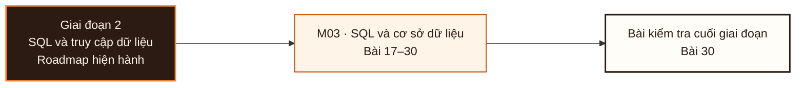

# Giai đoạn 2: SQL và truy cập dữ liệu

Giai đoạn này kết hợp M03-M03. Người học chuyển từ `Bằng chứng hoàn thành Giai đoạn 1` sang khả năng tạo và bảo vệ bằng chứng tích hợp ở L030.

## Điều kiện đầu vào

| Năng lực bắt buộc | Bằng chứng được chấp nhận | Cách khắc phục |
|---|---|---|
| Bằng chứng hoàn thành Giai đoạn 1 | Sản phẩm và kết quả đánh giá của giai đoạn trước | Hoàn thành lại tiêu chí chưa đạt trước khi vào bài kiểm tra tích hợp |

## Đầu ra giai đoạn

Khảo sát một cơ sở dữ liệu lạ, viết truy vấn trả lời câu hỏi nghiệp vụ trên đó, và nộp kèm bằng chứng kiểm chứng kết quả, trong giới hạn thời gian.

## Thứ tự mô-đun

| Mô-đun | Năng lực được bổ sung | Phụ thuộc | Bằng chứng hoàn thành |
|---|---|---|---|
| [DA-M03](Module_03-sql-and-databases/roadmap.md) | Viết truy vấn trả lời câu hỏi nghiệp vụ trên một cơ sở dữ liệu chưa từng thấy và không có tài liệu, kèm phép kiểm chứng kết quả | M02 | Đạt Cổng 2 ≥ 70/100, không phần nào dưới 50% |

**Sơ đồ thứ tự:** đọc từ trái sang phải; mỗi mô-đun tạo bằng chứng đầu vào cho mô-đun kế tiếp và bài kiểm tra cuối giai đoạn.

## Lý do sắp xếp

## Bài kiểm tra cuối giai đoạn

### Nhiệm vụ

Phần A (20đ) khảo sát lược đồ và phát biểu hạt · Phần B (25đ) truy vấn gộp nhóm và ghép bảng có kiểm chứng số dòng · Phần C (25đ) hàm cửa sổ: top-N theo nhóm, luỹ kế, so kỳ · Phần D (20đ) báo cáo chất lượng dữ liệu định lượng · Phần E (10đ) truy nguyên một truy vấn cho kết quả sai.

### Cách đánh giá

| Tiêu chí | Bằng chứng | Ngưỡng đạt | Lỗi loại trực tiếp |
|---|---|---|---|
| Khảo sát một cơ sở dữ liệu lạ, viết truy vấn trả lời câu hỏi nghiệp vụ trên đó, và nộp kèm bằng chứng kiểm chứng kết quả, trong giới hạn thời gian. | Phần A (20đ) khảo sát lược đồ và phát biểu hạt · Phần B (25đ) truy vấn gộp nhóm và ghép bảng có kiểm chứng số dòng · Phần C (25đ) hàm cửa sổ: top-N theo nhóm, luỹ kế, so kỳ · Phần D (20đ) báo cáo chất lượng dữ liệu định lượng · Phần E (10đ) truy nguyên một truy vấn cho kết quả sai. | ≥ 70/100 và không phần nào dưới 50%. Không đạt thì áp dụng quy trình khắc phục của roadmap giai đoạn, thi lại một lần. Đạt ≥ 70/100 và không phần nào dưới 50%. Đây là exit criterion của Mô-đun 3. | Viết truy vấn trước khi khảo sát lược đồ · nộp kết quả không kèm phép kiểm chứng · dùng hết thời gian cho phần C và bỏ phần D. |

## Điểm tích hợp

| Năng lực trước được dùng lại | Mô-đun sử dụng | Năng lực sau được mở khóa |
|---|---|---|
| M02 | M03 | Viết truy vấn trả lời câu hỏi nghiệp vụ trên một cơ sở dữ liệu chưa từng thấy và không có tài liệu, kèm phép kiểm chứng kết quả |

## Khắc phục

| Tiêu chí chưa đạt | Bằng chứng chẩn đoán | Phần phải làm lại | Cách kiểm tra lại |
|---|---|---|---|
| Viết truy vấn trước khi khảo sát lược đồ · nộp kết quả không kèm phép kiểm chứng · dùng hết thời gian cho phần C và bỏ phần D. | Bài làm, nhật ký và phản hồi theo tiêu chí L030 | Bài hoặc mô-đun tạo ra bằng chứng còn thiếu | Tình huống mới, giữ nguyên đầu ra và ngưỡng đạt |

## Rủi ro của giai đoạn

| Rủi ro | Cách phát hiện | Biện pháp kiểm soát |
|---|---|---|
| Học cú pháp mà bỏ qua thứ tự thực thi logic và phát biểu hạt, dẫn tới truy vấn đúng cú pháp nhưng sai ngữ nghĩa và không phát hiện được | Không đạt tiêu chí hoàn thành M03 | Khắc phục tại M03 trước khi thực hiện bài kiểm tra cuối giai đoạn |

## Tài liệu tham khảo

| Mã | Nguồn | Vị trí | Dùng cho |
|---|---|---|---|
| DA-M03 | Roadmap mô-đun | `Module_03-sql-and-databases/roadmap.md` | Đầu ra, thứ tự bài và tiêu chí đánh giá của mô-đun |

Roadmap giai đoạn không thay thế roadmap mô-đun. Khi hai cấp diễn đạt khác nhau, mã đầu ra và tiêu chí do roadmap mô-đun sở hữu được dùng để rà soát.
