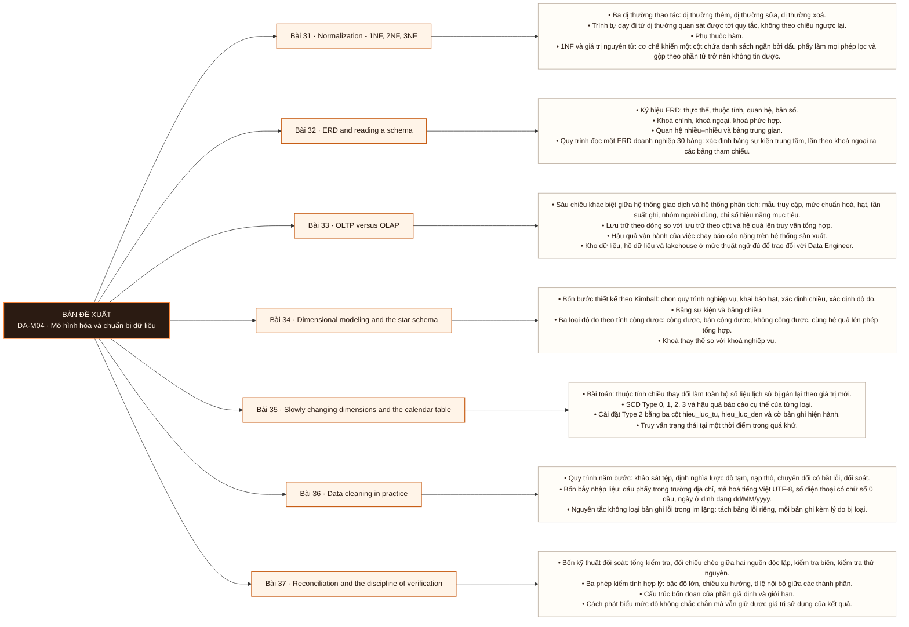

# Mô-đun 4: Mô hình hóa và chuẩn bị dữ liệu

Bảy bài này phục vụ nhóm việc chiếm 40% thời gian làm việc thật theo phân bổ trong đặc tả nguồn của chương trình. Trình tự đi từ chuẩn hoá cho hệ thống giao dịch (31-32) sang mô hình chiều cho phân tích (33-35) rồi tới nạp và đối soát dữ liệu thật (36-37). Bài 37 đặt nguyên tắc chứng minh bằng hai đường độc lập, và nguyên tắc đó được viện dẫn lại ở Bài 45, 61 và 85.

## Điều kiện đầu vào

| Mã | Người học có thể | Bằng chứng được chấp nhận |
|---|---|---|
| EN-04-01 | M03 | Bằng chứng hoàn thành điều kiện được nêu trong cột trước |

Nếu chưa có bằng chứng đầu vào, người học phải hoàn thành lại bài hoặc mô-đun được dẫn chiếu trước khi thực hiện phép đánh giá của mô-đun này.

## Đầu ra mô-đun

Nạp một tệp nguồn có lỗi vào cơ sở dữ liệu theo một mô hình tự thiết kế, và chứng minh kết quả đúng bằng hai phép đối soát độc lập

## Tiêu chí hoàn thành

| Mã | Bằng chứng bắt buộc | Ngưỡng đạt | Lỗi loại trực tiếp |
|---|---|---|---|
| EC-04-01 | Nộp lược đồ sao tự thiết kế cho `DS1` trả lời được 5 câu hỏi phân tích cho trước, cộng bản đối soát `orders_dirty.csv` chứng minh 50.005 = 49.985 + 20, mỗi bản ghi lỗi có lý do ghi rõ | Nộp bản ghi điều tra truy được nguồn gốc cả ba khoản chênh lệch, hai đường chứng minh không dùng chung nguồn trung gian, và bản ghi qua được phản biện chéo. Đây là exit criterion của Mô-đun 4. | Học chuẩn hoá như quy tắc hình thức mà không gặp dị thường trước, nên không nhận ra khi nào nên phi chuẩn hoá |

## Khái niệm và nguyên tắc bất biến

| Mã khái niệm | Ranh giới định nghĩa | Nguyên tắc bất biến hoặc quy tắc quyết định | Bài chính |
|---|---|---|---|
| C04-031 | Ba dị thường thao tác: dị thường thêm, dị thường sửa, dị thường xoá. | Trình tự dạy đi từ dị thường quan sát được tới quy tắc, không theo chiều ngược lại. | L031 |
| C04-032 | Ký hiệu ERD: thực thể, thuộc tính, quan hệ, bản số. | Khoá chính, khoá ngoại, khoá phức hợp. | L032 |
| C04-033 | Sáu chiều khác biệt giữa hệ thống giao dịch và hệ thống phân tích: mẫu truy cập, mức chuẩn hoá, hạt, tần suất ghi, nhóm người dùng, chỉ số hiệu năng mục tiêu. | Lưu trữ theo dòng so với lưu trữ theo cột và hệ quả lên truy vấn tổng hợp. | L033 |
| C04-034 | Bốn bước thiết kế theo Kimball: chọn quy trình nghiệp vụ, khai báo hạt, xác định chiều, xác định độ đo. | Bảng sự kiện và bảng chiều. | L034 |
| C04-035 | Bài toán: thuộc tính chiều thay đổi làm toàn bộ số liệu lịch sử bị gán lại theo giá trị mới. | SCD Type 0, 1, 2, 3 và hậu quả báo cáo cụ thể của từng loại. | L035 |
| C04-036 | Quy trình năm bước: khảo sát tệp, định nghĩa lược đồ tạm, nạp thô, chuyển đổi có bắt lỗi, đối soát. | Bốn bẫy nhập liệu: dấu phẩy trong trường địa chỉ, mã hoá tiếng Việt UTF-8, số điện thoại có chữ số 0 đầu, ngày ở định dạng dd/MM/yyyy. | L036 |
| C04-037 | Bốn kỹ thuật đối soát: tổng kiểm tra, đối chiếu chéo giữa hai nguồn độc lập, kiểm tra biên, kiểm tra thứ nguyên. | Ba phép kiểm tính hợp lý: bậc độ lớn, chiều xu hướng, tỉ lệ nội bộ giữa các thành phần. | L037 |

## Các bài trong mô-đun

| Bài | Dạng | Đầu ra | Bằng chứng | Điều kiện tiên quyết |
|---|---|---|---|---|
| L031 · [[wiki.da.normalization-1nf-2nf-3nf|Normalization - 1NF, 2NF, 3NF]]| LT | Chuẩn hoá một bảng phẳng tới 3NF và chỉ ra dị thường nào được loại bỏ ở bước nào. | Ba bước tách được ánh xạ đúng sang ba dạng chuẩn, và mỗi bước nêu được dị thường cụ thể đã loại bỏ. | M04: M03 |
| L032 · [[wiki.da.erd-and-reading-a-schema|ERD and reading a schema]]| TH | Viết truy vấn đúng cho một câu hỏi nghiệp vụ chỉ dựa trên ERD, không truy cập dữ liệu và không đặt câu hỏi làm rõ. | Trả lời đúng ≥ 8/10 câu hỏi về quan hệ trên ERD 22 bảng, không truy cập dữ liệu. | L031 |
| L033 · [[wiki.da.oltp-versus-olap|OLTP versus OLAP]]| LT | Chọn loại hệ thống phù hợp cho một tình huống cho trước và biện minh lựa chọn bằng ít nhất ba trong sáu chiều khác biệt. | Nộp số đo thời gian chạy trên hai lược đồ, và biện minh lựa chọn hệ thống cho ba tình huống bằng ít nhất ba chiều mỗi tình huống. | L032 |
| L034 · [[wiki.da.dimensional-modeling-and-the-star-schema|Dimensional modeling and the star schema]]| TH | Thiết kế một lược đồ sao từ một lược đồ chuẩn hoá cho trước, và bảo vệ lựa chọn hạt của bảng sự kiện trước năm câu hỏi phân tích mà lược đồ phải trả lời được. | Lược đồ sao trả lời được cả 5 câu hỏi phân tích ở đúng hạt, và hạt bảng sự kiện được phát biểu bằng một câu kiểm chứng được bằng phép đếm. | L033 |
| L035 · [[wiki.da.slowly-changing-dimensions-and-the-calendar-table|Slowly changing dimensions and the calendar table]]| TH | Cài đặt một chiều Type 2 và chứng minh rằng một báo cáo lịch sử cho kết quả không đổi sau khi thuộc tính chiều thay đổi. | Báo cáo lịch sử cho kết quả giống hệt trước và sau khi thay đổi thuộc tính chiều, và không có khoảng hiệu lực nào chồng lấn. | L034 |
| L036 · [[wiki.da.data-cleaning-in-practice|Data cleaning in practice]]| TH | Nạp một tệp CSV có lỗi vào cơ sở dữ liệu và chứng minh bằng phép cộng rằng tổng số bản ghi đầu vào bằng số bản ghi sạch cộng số bản ghi lỗi. | Đẳng thức 50.000 = 49.985 + 15 kiểm được bằng truy vấn, và cả 15 bản ghi lỗi có lý do ghi rõ. | L035 |
| L037 · [[wiki.da.reconciliation-and-the-discipline-of-verification|Reconciliation and the discipline of verification]]| TH | Chứng minh một kết quả bằng hai đường tính toán độc lập, và truy nguyên nguồn gốc của mọi khoản chênh lệch giữa các báo cáo mâu thuẫn. | Nộp bản ghi điều tra truy được nguồn gốc cả ba khoản chênh lệch, hai đường chứng minh không dùng chung nguồn trung gian, và bản ghi qua được phản biện chéo. Đây là exit criterion của Mô-đun 4. | L036 · L015 |

## Nội dung từng bài

> **Sơ đồ đề xuất: DA-M04 v0.1.0.** Mỗi nhánh đi từ một bài học đến các nội dung nguyên tử bắt buộc. Thứ tự dạy lấy từ bảng `Các bài trong mô-đun`.

### Lesson 31: Normalization - 1NF, 2NF, 3NF

Ba dị thường thao tác: dị thường thêm, dị thường sửa, dị thường xoá. Trình tự dạy đi từ dị thường quan sát được tới quy tắc, không theo chiều ngược lại. Phụ thuộc hàm. 1NF và giá trị nguyên tử: cơ chế khiến một cột chứa danh sách ngăn bởi dấu phẩy làm mọi phép lọc và gộp theo phần tử trở nên không tin được. 2NF, 3NF và phụ thuộc bắc cầu. Phi chuẩn hoá có chủ đích: điều kiện áp dụng và chi phí đi kèm.

Người học phải chuẩn hoá một bảng phẳng tới 3NF và chỉ ra dị thường nào được loại bỏ ở bước nào. Bằng chứng thực hành: Từ một bảng phẳng chứa mọi thuộc tính, tự tạo ba dị thường, rồi tách bảng để loại bỏ từng dị thường. Ánh xạ mỗi bước tách sang 1NF, 2NF hoặc 3NF. Bài hoàn tất khi ba bước tách được ánh xạ đúng sang ba dạng chuẩn, và mỗi bước nêu được dị thường cụ thể đã loại bỏ.

Cách đánh giá: Tầng *hiểu*. Bài xây khung khái niệm; thiết kế mô hình thật nằm ở Bài 34. Kiểm bằng bài yêu cầu người học tự tạo ra ba dị thường trên một bảng phẳng rồi tách bảng để loại bỏ, và ánh xạ mỗi bước tách sang một dạng chuẩn. Đạt khi ánh xạ đúng cả ba bước.

### Lesson 32: ERD and reading a schema

Ký hiệu ERD: thực thể, thuộc tính, quan hệ, bản số. Khoá chính, khoá ngoại, khoá phức hợp. Quan hệ nhiều-nhiều và bảng trung gian. Quy trình đọc một ERD doanh nghiệp 30 bảng: xác định bảng sự kiện trung tâm, lần theo khoá ngoại ra các bảng tham chiếu. Vẽ ERD bằng công cụ.

Người học phải viết truy vấn đúng cho một câu hỏi nghiệp vụ chỉ dựa trên ERD, không truy cập dữ liệu và không đặt câu hỏi làm rõ. Bằng chứng thực hành: Vẽ ERD cho nghiệp vụ quán cà phê với 5 thực thể. Đọc ERD hệ thống bán lẻ 22 bảng và trả lời 10 câu hỏi về quan hệ. Bài hoàn tất khi trả lời đúng ≥ 8/10 câu hỏi về quan hệ trên ERD 22 bảng, không truy cập dữ liệu.

Cách đánh giá: Tầng *áp dụng*. Ràng buộc không truy cập dữ liệu là điều kiện then chốt: nó tách năng lực đọc lược đồ khỏi năng lực thử sai bằng truy vấn. Kiểm bằng 10 câu hỏi về quan hệ trên một ERD 22 bảng chưa từng thấy, chấm theo đáp án cố định.

### Lesson 33: OLTP versus OLAP

Sáu chiều khác biệt giữa hệ thống giao dịch và hệ thống phân tích: mẫu truy cập, mức chuẩn hoá, hạt, tần suất ghi, nhóm người dùng, chỉ số hiệu năng mục tiêu. Lưu trữ theo dòng so với lưu trữ theo cột và hệ quả lên truy vấn tổng hợp. Hậu quả vận hành của việc chạy báo cáo nặng trên hệ thống sản xuất. Kho dữ liệu, hồ dữ liệu và lakehouse ở mức thuật ngữ đủ để trao đổi với Data Engineer. Bốn mức độ trễ dữ liệu và chi phí tương ứng.

Người học phải chọn loại hệ thống phù hợp cho một tình huống cho trước và biện minh lựa chọn bằng ít nhất ba trong sáu chiều khác biệt. Bằng chứng thực hành: Chạy cùng một truy vấn phân tích trên lược đồ chuẩn hoá và trên lược đồ sao. Đo thời gian thực thi của cả hai và giải thích chênh lệch bằng mẫu truy cập. Bài hoàn tất khi nộp số đo thời gian chạy trên hai lược đồ, và biện minh lựa chọn hệ thống cho ba tình huống bằng ít nhất ba chiều mỗi tình huống.

Cách đánh giá: Tầng *đánh giá*. Objective là lựa chọn có biện minh giữa các phương án, nên hình thức kiểm phải chấp nhận nhiều lời giải đúng. Kiểm bằng bài chọn kèm lý do, chấm theo chất lượng biện minh; đồng thời nộp số đo thời gian chạy từ lab làm bằng chứng thực nghiệm.

### Lesson 34: Dimensional modeling and the star schema

Bốn bước thiết kế theo Kimball: chọn quy trình nghiệp vụ, khai báo hạt, xác định chiều, xác định độ đo. Bảng sự kiện và bảng chiều. Ba loại độ đo theo tính cộng được: cộng được, bán cộng được, không cộng được, cùng hệ quả lên phép tổng hợp. Khoá thay thế so với khoá nghiệp vụ. Lược đồ sao so với lược đồ bông tuyết và điều kiện chọn giữa hai loại.

Người học phải thiết kế một lược đồ sao từ một lược đồ chuẩn hoá cho trước, và bảo vệ lựa chọn hạt của bảng sự kiện trước năm câu hỏi phân tích mà lược đồ phải trả lời được. Bằng chứng thực hành: Chuyển `DS1` từ 6 bảng chuẩn hoá thành một lược đồ sao. Bảo vệ thiết kế trước 5 câu hỏi phân tích cho trước. Bài hoàn tất khi lược đồ sao trả lời được cả 5 câu hỏi phân tích ở đúng hạt, và hạt bảng sự kiện được phát biểu bằng một câu kiểm chứng được bằng phép đếm.

Cách đánh giá: Tầng *sáng tạo*. Không tồn tại lược đồ sao đúng duy nhất; tiêu chí là lược đồ trả lời được tập câu hỏi cho trước ở đúng hạt. Kiểm bằng sản phẩm cộng bảo vệ: nộp lược đồ, rồi trả lời năm câu hỏi phân tích trên chính lược đồ đó. Câu hỏi nào lược đồ không trả lời được là một khuyết điểm thiết kế.

### Lesson 35: Slowly changing dimensions and the calendar table

Bài toán: thuộc tính chiều thay đổi làm toàn bộ số liệu lịch sử bị gán lại theo giá trị mới. SCD Type 0, 1, 2, 3 và hậu quả báo cáo cụ thể của từng loại. Cài đặt Type 2 bằng ba cột `hieu_luc_tu`, `hieu_luc_den` và cờ bản ghi hiện hành. Truy vấn trạng thái tại một thời điểm trong quá khứ. Bảng lịch: lý do tồn tại và tập thuộc tính tối thiểu.

Người học phải cài đặt một chiều Type 2 và chứng minh rằng một báo cáo lịch sử cho kết quả không đổi sau khi thuộc tính chiều thay đổi. Bằng chứng thực hành: Cài đặt chiều khách hàng Type 2 trên `DS1`. Chạy một báo cáo doanh thu theo vùng, thay đổi vùng của một khách, chạy lại báo cáo và chứng minh số lịch sử không đổi. Bài hoàn tất khi báo cáo lịch sử cho kết quả giống hệt trước và sau khi thay đổi thuộc tính chiều, và không có khoảng hiệu lực nào chồng lấn.

Cách đánh giá: Tầng *áp dụng*. Kiểm bằng nghĩa vụ chứng minh bất biến: chạy báo cáo, thay đổi thuộc tính chiều, chạy lại, và kết quả lịch sử phải giống hệt. Đây là phép thử phân biệt Type 2 cài đúng với Type 1 cài nhầm.

### Lesson 36: Data cleaning in practice

Quy trình năm bước: khảo sát tệp, định nghĩa lược đồ tạm, nạp thô, chuyển đổi có bắt lỗi, đối soát. Bốn bẫy nhập liệu: dấu phẩy trong trường địa chỉ, mã hoá tiếng Việt UTF-8, số điện thoại có chữ số 0 đầu, ngày ở định dạng `dd/MM/yyyy`. Nguyên tắc không loại bản ghi lỗi trong im lặng: tách bảng lỗi riêng, mỗi bản ghi kèm lý do bị loại.

Người học phải nạp một tệp CSV có lỗi vào cơ sở dữ liệu và chứng minh bằng phép cộng rằng tổng số bản ghi đầu vào bằng số bản ghi sạch cộng số bản ghi lỗi. Bằng chứng thực hành: Nạp `orders.csv` gồm 50.000 dòng và xử lý đủ bốn bẫy định dạng. Rồi nạp `orders_dirty.csv` gồm 50.005 dòng vào bảng trung chuyển; kết quả phải chứng minh 50.005 = 49.985 bản ghi qua được ép kiểu + 20 bản ghi bị loại, mỗi bản ghi bị loại có lý do ghi rõ. Nếu áp thêm khoá chính và ràng buộc không rỗng thì bảng chính chỉ nhận 49.980 dòng; giải thích chênh lệch 5 dòng. Bài hoàn tất khi đẳng thức 50.000 = 49.985 + 15 kiểm được bằng truy vấn, và cả 15 bản ghi lỗi có lý do ghi rõ.

Cách đánh giá: Tầng *áp dụng*. Kiểm bằng một đẳng thức kiểm chứng được: 50.000 = 49.985 + 15, và mỗi bản ghi trong bảng lỗi phải có lý do ghi rõ. Đẳng thức này bắt được lỗi phổ biến nhất của bài: loại bản ghi hỏng mà không ghi lại.

### Lesson 37: Reconciliation and the discipline of verification

Bốn kỹ thuật đối soát: tổng kiểm tra, đối chiếu chéo giữa hai nguồn độc lập, kiểm tra biên, kiểm tra thứ nguyên. Ba phép kiểm tính hợp lý: bậc độ lớn, chiều xu hướng, tỉ lệ nội bộ giữa các thành phần. Cấu trúc bốn đoạn của phần giả định và giới hạn. Cách phát biểu mức độ không chắc chắn mà vẫn giữ được giá trị sử dụng của kết quả.

Người học phải chứng minh một kết quả bằng hai đường tính toán độc lập, và truy nguyên nguồn gốc của mọi khoản chênh lệch giữa các báo cáo mâu thuẫn. Bằng chứng thực hành: Nhận bốn báo cáo mâu thuẫn về cùng một tháng. Truy nguyên nguồn gốc từng khoản chênh lệch, kết luận con số nào đúng, viết bản ghi điều tra. Phản biện chéo giữa các nhóm. Bài hoàn tất khi nộp bản ghi điều tra truy được nguồn gốc cả ba khoản chênh lệch, hai đường chứng minh không dùng chung nguồn trung gian, và bản ghi qua được phản biện chéo. Đây là exit criterion của Mô-đun 4.

Cách đánh giá: Tầng *đánh giá*. Objective là phán quyết về độ tin cậy dựa trên bằng chứng tự thu thập. Kiểm bằng bản ghi điều tra cộng phản biện chéo giữa các nhóm: nhóm khác phải tìm được lỗ hổng trong chuỗi lập luận hoặc xác nhận không tìm được. Chấm chuỗi bằng chứng, không chỉ chấm kết luận.

## Lý do sắp xếp

Mô-đun bắt đầu từ `M04: M03` và đi theo các quan hệ tiên quyết đã ghi trong bảng. Mỗi bài chỉ sử dụng khái niệm hoặc thao tác đã được giới thiệu trước đó; bài cuối L037 tích hợp đầu ra của toàn mô-đun.

## Ma trận đánh giá

| Mã đầu ra | Mức độ tư duy | Cách đánh giá | Ngưỡng đạt | Hình thức kiểm tra lại |
|---|---|---|---|---|
| L031 | Hiểu | Tầng *hiểu*. Bài xây khung khái niệm; thiết kế mô hình thật nằm ở Bài 34. Kiểm bằng bài yêu cầu người học tự tạo ra ba dị thường trên một bảng phẳng rồi tách bảng để loại bỏ, và ánh xạ mỗi bước tách sang một dạng chuẩn. Đạt khi ánh xạ đúng cả ba bước. | Ba bước tách được ánh xạ đúng sang ba dạng chuẩn, và mỗi bước nêu được dị thường cụ thể đã loại bỏ. | Tình huống mới, giữ nguyên đầu ra và ngưỡng |
| L032 | Áp dụng | Tầng *áp dụng*. Ràng buộc không truy cập dữ liệu là điều kiện then chốt: nó tách năng lực đọc lược đồ khỏi năng lực thử sai bằng truy vấn. Kiểm bằng 10 câu hỏi về quan hệ trên một ERD 22 bảng chưa từng thấy, chấm theo đáp án cố định. | Trả lời đúng ≥ 8/10 câu hỏi về quan hệ trên ERD 22 bảng, không truy cập dữ liệu. | Tình huống mới, giữ nguyên đầu ra và ngưỡng |
| L033 | Đánh giá | Tầng *đánh giá*. Objective là lựa chọn có biện minh giữa các phương án, nên hình thức kiểm phải chấp nhận nhiều lời giải đúng. Kiểm bằng bài chọn kèm lý do, chấm theo chất lượng biện minh; đồng thời nộp số đo thời gian chạy từ lab làm bằng chứng thực nghiệm. | Nộp số đo thời gian chạy trên hai lược đồ, và biện minh lựa chọn hệ thống cho ba tình huống bằng ít nhất ba chiều mỗi tình huống. | Tình huống mới, giữ nguyên đầu ra và ngưỡng |
| L034 | Sáng tạo | Tầng *sáng tạo*. Không tồn tại lược đồ sao đúng duy nhất; tiêu chí là lược đồ trả lời được tập câu hỏi cho trước ở đúng hạt. Kiểm bằng sản phẩm cộng bảo vệ: nộp lược đồ, rồi trả lời năm câu hỏi phân tích trên chính lược đồ đó. Câu hỏi nào lược đồ không trả lời được là một khuyết điểm thiết kế. | Lược đồ sao trả lời được cả 5 câu hỏi phân tích ở đúng hạt, và hạt bảng sự kiện được phát biểu bằng một câu kiểm chứng được bằng phép đếm. | Tình huống mới, giữ nguyên đầu ra và ngưỡng |
| L035 | Áp dụng | Tầng *áp dụng*. Kiểm bằng nghĩa vụ chứng minh bất biến: chạy báo cáo, thay đổi thuộc tính chiều, chạy lại, và kết quả lịch sử phải giống hệt. Đây là phép thử phân biệt Type 2 cài đúng với Type 1 cài nhầm. | Báo cáo lịch sử cho kết quả giống hệt trước và sau khi thay đổi thuộc tính chiều, và không có khoảng hiệu lực nào chồng lấn. | Tình huống mới, giữ nguyên đầu ra và ngưỡng |
| L036 | Áp dụng | Tầng *áp dụng*. Kiểm bằng một đẳng thức kiểm chứng được: 50.000 = 49.985 + 15, và mỗi bản ghi trong bảng lỗi phải có lý do ghi rõ. Đẳng thức này bắt được lỗi phổ biến nhất của bài: loại bản ghi hỏng mà không ghi lại. | Đẳng thức 50.000 = 49.985 + 15 kiểm được bằng truy vấn, và cả 15 bản ghi lỗi có lý do ghi rõ. | Tình huống mới, giữ nguyên đầu ra và ngưỡng |
| L037 | Đánh giá | Tầng *đánh giá*. Objective là phán quyết về độ tin cậy dựa trên bằng chứng tự thu thập. Kiểm bằng bản ghi điều tra cộng phản biện chéo giữa các nhóm: nhóm khác phải tìm được lỗ hổng trong chuỗi lập luận hoặc xác nhận không tìm được. Chấm chuỗi bằng chứng, không chỉ chấm kết luận. | Nộp bản ghi điều tra truy được nguồn gốc cả ba khoản chênh lệch, hai đường chứng minh không dùng chung nguồn trung gian, và bản ghi qua được phản biện chéo. Đây là exit criterion của Mô-đun 4. | Tình huống mới, giữ nguyên đầu ra và ngưỡng |

Không cộng điểm để bù cho lỗi loại trực tiếp. Người học phải sửa đúng lỗi, nộp lại bằng chứng và thực hiện kiểm tra lại trên một tình huống khác.

## Bài thực hành bắt buộc

| Bài thực hành hoặc dự án | Bài liên quan | Sản phẩm bắt buộc | Lỗi được cài vào tình huống |
|---|---|---|---|
| Normalization - 1NF, 2NF, 3NF | L031 | Từ một bảng phẳng chứa mọi thuộc tính, tự tạo ba dị thường, rồi tách bảng để loại bỏ từng dị thường. Ánh xạ mỗi bước tách sang 1NF, 2NF hoặc 3NF. | Học quy tắc dạng chuẩn trước khi gặp dị thường nên không giải thích được vì sao tách · chuẩn hoá tới mức làm mọi truy vấn phân tích cần bảy phép ghép · nhầm phụ thuộc hàm với tương quan thống kê. |
| ERD and reading a schema | L032 | Vẽ ERD cho nghiệp vụ quán cà phê với 5 thực thể. Đọc ERD hệ thống bán lẻ 22 bảng và trả lời 10 câu hỏi về quan hệ. | Bỏ qua bản số nên viết `JOIN` sai chiều · giả định mọi quan hệ là một-nhiều · không nhận ra bảng trung gian nên ghép trực tiếp hai bảng nhiều-nhiều. |
| OLTP versus OLAP | L033 | Chạy cùng một truy vấn phân tích trên lược đồ chuẩn hoá và trên lược đồ sao. Đo thời gian thực thi của cả hai và giải thích chênh lệch bằng mẫu truy cập. | Quy khác biệt về mỗi tốc độ · chạy truy vấn khảo sát nặng trên hệ thống sản xuất · dùng thuật ngữ kho dữ liệu và hồ dữ liệu thay thế cho nhau. |
| Dimensional modeling and the star schema | L034 | Chuyển `DS1` từ 6 bảng chuẩn hoá thành một lược đồ sao. Bảo vệ thiết kế trước 5 câu hỏi phân tích cho trước. | Khai báo hạt sau khi đã chọn chiều · đưa độ đo không cộng được vào bảng sự kiện mà không đánh dấu · dùng khoá nghiệp vụ làm khoá của bảng chiều rồi mất khả năng theo dõi thay đổi. |
| Slowly changing dimensions and the calendar table | L035 | Cài đặt chiều khách hàng Type 2 trên `DS1`. Chạy một báo cáo doanh thu theo vùng, thay đổi vùng của một khách, chạy lại báo cáo và chứng minh số lịch sử không đổi. | Cài Type 2 nhưng vẫn ghép theo khoá nghiệp vụ nên vẫn bị gán lại · khoảng hiệu lực chồng lấn làm nhân bản dòng khi ghép · thiếu bảng lịch nên kỳ khuyết biến mất. |
| Data cleaning in practice | L036 | Nạp `orders.csv` gồm 50.000 dòng và xử lý đủ bốn bẫy định dạng. Rồi nạp `orders_dirty.csv` gồm 50.005 dòng vào bảng trung chuyển; kết quả phải chứng minh 50.005 = 49.985 bản ghi qua được ép kiểu + 20 bản ghi bị loại, mỗi bản ghi bị loại có lý do ghi rõ. Nếu áp thêm khoá chính và ràng buộc không rỗng thì bảng chính chỉ nhận 49.980 dòng; giải thích chênh lệch 5 dòng. | Bỏ qua dòng lỗi trong im lặng nên mất dấu vết · đặt bước lọc trước bước ép kiểu · để công cụ tự suy đoán mã hoá ký tự. |
| Reconciliation and the discipline of verification | L037 | Nhận bốn báo cáo mâu thuẫn về cùng một tháng. Truy nguyên nguồn gốc từng khoản chênh lệch, kết luận con số nào đúng, viết bản ghi điều tra. Phản biện chéo giữa các nhóm. | Chứng minh bằng hai đường không thực sự độc lập vì cùng dùng một nguồn trung gian · bỏ kiểm tra thứ nguyên · viết phần giới hạn mà không gắn với dữ liệu cụ thể. |

## Ngộ nhận và lỗi loại trực tiếp

| Lỗi | Hệ quả | Nơi phát hiện | Cách khắc phục |
|---|---|---|---|
| Học quy tắc dạng chuẩn trước khi gặp dị thường nên không giải thích được vì sao tách · chuẩn hoá tới mức làm mọi truy vấn phân tích cần bảy phép ghép · nhầm phụ thuộc hàm với tương quan thống kê. | Không tạo được bằng chứng hợp lệ cho đầu ra L031 | L031 | Làm lại phép đánh giá trên tình huống mới và đạt tiêu chí `Done when` |
| Bỏ qua bản số nên viết `JOIN` sai chiều · giả định mọi quan hệ là một-nhiều · không nhận ra bảng trung gian nên ghép trực tiếp hai bảng nhiều-nhiều. | Không tạo được bằng chứng hợp lệ cho đầu ra L032 | L032 | Làm lại phép đánh giá trên tình huống mới và đạt tiêu chí `Done when` |
| Quy khác biệt về mỗi tốc độ · chạy truy vấn khảo sát nặng trên hệ thống sản xuất · dùng thuật ngữ kho dữ liệu và hồ dữ liệu thay thế cho nhau. | Không tạo được bằng chứng hợp lệ cho đầu ra L033 | L033 | Làm lại phép đánh giá trên tình huống mới và đạt tiêu chí `Done when` |
| Khai báo hạt sau khi đã chọn chiều · đưa độ đo không cộng được vào bảng sự kiện mà không đánh dấu · dùng khoá nghiệp vụ làm khoá của bảng chiều rồi mất khả năng theo dõi thay đổi. | Không tạo được bằng chứng hợp lệ cho đầu ra L034 | L034 | Làm lại phép đánh giá trên tình huống mới và đạt tiêu chí `Done when` |
| Cài Type 2 nhưng vẫn ghép theo khoá nghiệp vụ nên vẫn bị gán lại · khoảng hiệu lực chồng lấn làm nhân bản dòng khi ghép · thiếu bảng lịch nên kỳ khuyết biến mất. | Không tạo được bằng chứng hợp lệ cho đầu ra L035 | L035 | Làm lại phép đánh giá trên tình huống mới và đạt tiêu chí `Done when` |
| Bỏ qua dòng lỗi trong im lặng nên mất dấu vết · đặt bước lọc trước bước ép kiểu · để công cụ tự suy đoán mã hoá ký tự. | Không tạo được bằng chứng hợp lệ cho đầu ra L036 | L036 | Làm lại phép đánh giá trên tình huống mới và đạt tiêu chí `Done when` |
| Chứng minh bằng hai đường không thực sự độc lập vì cùng dùng một nguồn trung gian · bỏ kiểm tra thứ nguyên · viết phần giới hạn mà không gắn với dữ liệu cụ thể. | Không tạo được bằng chứng hợp lệ cho đầu ra L037 | L037 | Làm lại phép đánh giá trên tình huống mới và đạt tiêu chí `Done when` |

## Điểm nối với mô-đun khác

| Kế thừa từ | Cung cấp cho mô-đun sau | Cam kết đầu ra |
|---|---|---|
| M03 | M03 | Nạp một tệp nguồn có lỗi vào cơ sở dữ liệu theo một mô hình tự thiết kế, và chứng minh kết quả đúng bằng hai phép đối soát độc lập |

## Tài liệu tham khảo

| Mã | Nguồn | Vị trí | Dùng cho |
|---|---|---|---|
| R04-01 | Roadmap Data Analyst nguồn | `Material/DA/Reference/Library/roadmap-v1-goc.md` | Phạm vi chương trình và thứ tự bài học |
| R04-02 | Manifest nguồn cấp bài | `Material/DA/Reference/.../Lesson_*/sources.yaml` | Truy vết nguồn khi manifest được điền |

## Đối chiếu năng lực

| Khung hoặc mã năng lực | Phạm vi sử dụng | Bằng chứng |
|---|---|---|
| `DTAN` mức 2, chạm 3 | Đầu ra và phép đánh giá của mô-đun | EC-04-01 và ma trận đánh giá theo bài |

Ánh xạ này mô tả phạm vi được thực hành; nó không tự động chứng nhận cấp độ của người học trong khung năng lực.

## Giới hạn của mô-đun

- Roadmap xác định phạm vi, bằng chứng và cách đánh giá; nội dung giảng giải đầy đủ thuộc `note.md`.
- Manifest nguồn cấp bài hiện chưa có dữ liệu. Không được dùng tên tệp trong `Reference/Library` làm bằng chứng cho một khẳng định.
- Hoàn thành mô-đun chỉ chứng minh các đầu ra được nêu trong tài liệu này; không tự động chứng nhận chức danh hoặc kinh nghiệm làm việc.
