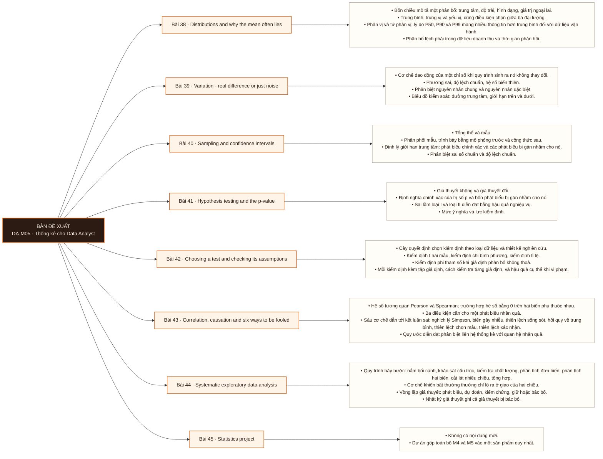

# Mô-đun 5: Thống kê cho Data Analyst

Trình tự đi từ mô tả (38–39) sang suy diễn (40–42) rồi sang nhận diện ngụy biện (43) và tổng hợp (44–45). Bài 41 dạy trị số p ở tầng hiểu thay vì áp dụng, vì sai lầm phổ biến ở bài này là diễn giải sai chứ không phải tính sai; phần tính toán nằm ở Bài 42.

## Điều kiện đầu vào

| Mã | Người học có thể | Bằng chứng được chấp nhận |
|---|---|---|
| EN-05-01 | M04 | Bằng chứng hoàn thành điều kiện được nêu trong cột trước |

Nếu chưa có bằng chứng đầu vào, người học phải hoàn thành lại bài hoặc mô-đun được dẫn chiếu trước khi thực hiện phép đánh giá của mô-đun này.

## Đầu ra mô-đun

Kết luận một khác biệt quan sát được là hiệu ứng thật hay dao động, kèm định lượng mức không chắc chắn và phát biểu giả định

## Tiêu chí hoàn thành

| Mã | Bằng chứng bắt buộc | Ngưỡng đạt | Lỗi loại trực tiếp |
|---|---|---|---|
| EC-05-01 | Hoàn thành dự án Bài 45 đạt ≥ 70/100, kết luận được chứng minh bằng hai đường độc lập, có nhật ký giả thuyết ghi cả giả thuyết bị bác bỏ | Nộp đủ năm đầu ra, đạt ≥ 70/100 theo rubric, kết luận được chứng minh bằng hai đường độc lập, và một học viên khác chạy lại được theo tài liệu mà không đặt câu hỏi. Đây là exit criterion của Mô-đun 5. | Học công thức kiểm định mà bỏ kiểm tra giả định, dẫn tới kết luận có vẻ chặt chẽ trên dữ liệu vi phạm điều kiện áp dụng |

## Khái niệm và nguyên tắc bất biến

| Mã khái niệm | Ranh giới định nghĩa | Nguyên tắc bất biến hoặc quy tắc quyết định | Bài chính |
|---|---|---|---|
| C05-038 | Bốn chiều mô tả một phân bố: trung tâm, độ trải, hình dạng, giá trị ngoại lai. | Trung bình, trung vị và yếu vị, cùng điều kiện chọn giữa ba đại lượng. | L038 |
| C05-039 | Cơ chế dao động của một chỉ số khi quy trình sinh ra nó không thay đổi. | Phương sai, độ lệch chuẩn, hệ số biến thiên. | L039 |
| C05-040 | Tổng thể và mẫu. | Phân phối mẫu, trình bày bằng mô phỏng trước và công thức sau. | L040 |
| C05-041 | Giả thuyết không và giả thuyết đối. | Định nghĩa chính xác của trị số p và bốn phát biểu bị gán nhầm cho nó. | L041 |
| C05-042 | Cây quyết định chọn kiểm định theo loại dữ liệu và thiết kế nghiên cứu. | Kiểm định t hai mẫu, kiểm định chi bình phương, kiểm định tỉ lệ. | L042 |
| C05-043 | Hệ số tương quan Pearson và Spearman; trường hợp hệ số bằng 0 trên hai biến phụ thuộc nhau. | Ba điều kiện cần cho một phát biểu nhân quả. | L043 |
| C05-044 | Quy trình bảy bước: nắm bối cảnh, khảo sát cấu trúc, kiểm tra chất lượng, phân tích đơn biến, phân tích hai biến, cắt lát nhiều chiều, tổng hợp. | Cơ chế khiến bất thường thường chỉ lộ ra ở giao của hai chiều. | L044 |
| C05-045 | Không có nội dung mới. | Dự án gộp toàn bộ M4 và M5 vào một sản phẩm duy nhất. | L045 |

## Các bài trong mô-đun

| Bài | Dạng | Đầu ra | Bằng chứng | Điều kiện tiên quyết |
|---|---|---|---|---|
| L038 · Distributions and why the mean often lies | LT | Mô tả một phân bố trên cả bốn chiều và chọn đại lượng trung tâm phù hợp với hình dạng của nó, nêu lý do. | Mô tả đúng khác biệt của cả bốn tập dữ liệu bằng đại lượng thống kê trước khi vẽ, và chọn đúng đại lượng trung tâm cho từng tập kèm lý do. | M05: M04 |
| L039 · Variation - real difference or just noise | TH | Phân loại một thay đổi quan sát được là nguyên nhân chung hay nguyên nhân đặc biệt, kèm bằng chứng từ biểu đồ kiểm soát. | Phân loại đúng ≥ 8/10 thay đổi, và mỗi phân loại dẫn được tiêu chí cụ thể từ biểu đồ kiểm soát. | L038 |
| L040 · Sampling and confidence intervals | LT | Báo cáo một ước lượng kèm khoảng tin cậy và phát biểu đúng ý nghĩa của khoảng đó. | Viết lại đúng ≥ 8/10 phát biểu sai, và mô phỏng chạy được cho ra phân phối mẫu tiệm cận chuẩn. | L039 |
| L041 · Hypothesis testing and the p-value | LT | Phát biểu ý nghĩa của một trị số p cho người nhận không có nền thống kê, không chứa phát biểu sai. | Chỉ đúng chỗ sai của ≥ 7/8 phát biểu, và phần trình bày cho người nghe không chuyên không chứa phát biểu sai nào. | L040 |
| L042 · Choosing a test and checking its assumptions | TH | Chọn kiểm định phù hợp cho một tình huống, kiểm tra từng giả định trước khi chạy, và đổi phương pháp khi giả định không thoả. | Chọn đúng kiểm định cho ≥ 5/6 tình huống, phát hiện được tình huống vi phạm giả định, và đổi sang phương pháp phù hợp. | L041 |
| L043 · Correlation, causation and six ways to be fooled | TH | Nhận diện cơ chế thiên lệch cụ thể trong một kết luận cho trước và viết lại kết luận đó ở mức độ chắc chắn mà dữ liệu cho phép. | Gọi đúng tên cơ chế của ≥ 5/6 kết luận sai, và tái hiện được nghịch lý Simpson trên `DS3` bằng số liệu cụ thể. | L042 |
| L044 · Systematic exploratory data analysis | TH | Thực hiện một khảo sát đầy đủ bảy bước trên bộ dữ liệu 2 triệu event chưa từng xem, và định vị một bất thường chỉ phát hiện được khi cắt theo hai chiều đồng thời. | Định vị đúng bất thường ở giao hai chiều, và nộp nhật ký giả thuyết có ghi ít nhất ba giả thuyết bị bác bỏ. | L043 |
| L045 · Statistics project | DA | Chuyển một câu hỏi nghiệp vụ mơ hồ thành một phân tích hoàn chỉnh có kết luận định lượng, khoảng không chắc chắn, và phần giả định giới hạn, trên dữ liệu chưa từng xem. | Nộp đủ năm đầu ra, đạt ≥ 70/100 theo rubric, kết luận được chứng minh bằng hai đường độc lập, và một học viên khác chạy lại được theo tài liệu mà không đặt câu hỏi. Đây là exit criterion của Mô-đun 5. | L044 · M04 |

## Nội dung từng bài

> **Sơ đồ đề xuất — DA-M05 v0.1.0.** Mỗi nhánh đi từ một bài học đến các nội dung nguyên tử bắt buộc. Thứ tự dạy lấy từ bảng `Các bài trong mô-đun`.

### Bài 38: Distributions and why the mean often lies

Bốn chiều mô tả một phân bố: trung tâm, độ trải, hình dạng, giá trị ngoại lai. Trung bình, trung vị và yếu vị, cùng điều kiện chọn giữa ba đại lượng. Phân vị và tứ phân vị; lý do P50, P90 và P99 mang nhiều thông tin hơn trung bình đối với dữ liệu vận hành. Phân bố lệch phải trong dữ liệu doanh thu và thời gian phản hồi. Phân bố đa đỉnh như dấu hiệu hai tổng thể bị trộn.

Người học phải mô tả một phân bố trên cả bốn chiều và chọn đại lượng trung tâm phù hợp với hình dạng của nó, nêu lý do. Bằng chứng thực hành: Nhận bốn tập dữ liệu có cùng giá trị trung bình nhưng phân bố khác hẳn. Mô tả khác biệt bằng đại lượng thống kê trước khi được phép vẽ đồ thị, sau đó vẽ để đối chiếu. Bài hoàn tất khi mô tả đúng khác biệt của cả bốn tập dữ liệu bằng đại lượng thống kê trước khi vẽ, và chọn đúng đại lượng trung tâm cho từng tập kèm lý do.

Cách đánh giá: Tầng *hiểu*. Kiểm bằng bài có ràng buộc đặc thù: bốn tập dữ liệu có cùng trung bình nhưng hình dạng khác nhau, và người học phải mô tả khác biệt trước khi được phép vẽ đồ thị. Ràng buộc này buộc mô tả bằng đại lượng thống kê thay vì bằng quan sát thị giác.

### Bài 39: Variation - real difference or just noise

Cơ chế dao động của một chỉ số khi quy trình sinh ra nó không thay đổi. Phương sai, độ lệch chuẩn, hệ số biến thiên. Phân biệt nguyên nhân chung và nguyên nhân đặc biệt. Biểu đồ kiểm soát: đường trung tâm, giới hạn trên và dưới. Đặt ngưỡng cảnh báo như một đánh đổi định lượng giữa tỉ lệ báo động giả và tỉ lệ bỏ sót. Quy tắc chuỗi.

Người học phải phân loại một thay đổi quan sát được là nguyên nhân chung hay nguyên nhân đặc biệt, kèm bằng chứng từ biểu đồ kiểm soát. Bằng chứng thực hành: Dựng biểu đồ kiểm soát cho ba chỉ số vận hành trên `DS3`. Phân loại 10 thay đổi là nguyên nhân chung hay đặc biệt, mỗi phân loại nêu tiêu chí đã dùng. Bài hoàn tất khi phân loại đúng ≥ 8/10 thay đổi, và mỗi phân loại dẫn được tiêu chí cụ thể từ biểu đồ kiểm soát.

Cách đánh giá: Tầng *phân tích*. Objective là phân loại có bằng chứng trên dữ liệu chưa gán nhãn, không phải áp dụng một công thức. Kiểm bằng bài phân loại 10 thay đổi với đáp án giữ kín; đạt khi đúng ≥ 8/10 và mỗi phân loại dẫn được tiêu chí đã dùng.

### Bài 40: Sampling and confidence intervals

Tổng thể và mẫu. Phân phối mẫu, trình bày bằng mô phỏng trước và công thức sau. Định lý giới hạn trung tâm: phát biểu chính xác và các phát biểu bị gán nhầm cho nó. Phân biệt sai số chuẩn và độ lệch chuẩn. Xây dựng khoảng tin cậy và bốn cách diễn giải sai phổ biến. Trình bày khoảng cho người nhận không có nền thống kê.

Người học phải báo cáo một ước lượng kèm khoảng tin cậy và phát biểu đúng ý nghĩa của khoảng đó. Bằng chứng thực hành: Viết mô phỏng chứng minh định lý giới hạn trung tâm trên một phân bố lệch. Viết lại 10 phát biểu kết quả sai thành phát biểu đúng. Bài hoàn tất khi viết lại đúng ≥ 8/10 phát biểu sai, và mô phỏng chạy được cho ra phân phối mẫu tiệm cận chuẩn.

Cách đánh giá: Tầng *hiểu*. Sai lầm chủ đạo ở bài này là diễn giải, không phải tính toán, nên hình thức kiểm nhắm vào diễn giải: viết lại 10 phát biểu kết quả sai thành phát biểu đúng. Chấm theo tính đúng của phát biểu, không theo con số.

### Bài 41: Hypothesis testing and the p-value

Giả thuyết không và giả thuyết đối. Định nghĩa chính xác của trị số p và bốn phát biểu bị gán nhầm cho nó. Sai lầm loại I và loại II diễn đạt bằng hậu quả nghiệp vụ. Mức ý nghĩa và lực kiểm định. Phân biệt ý nghĩa thống kê và ý nghĩa thực tiễn. Kích thước hiệu ứng. Cơ chế khiến cỡ mẫu rất lớn làm mọi khác biệt đạt ngưỡng ý nghĩa thống kê.

Người học phải phát biểu ý nghĩa của một trị số p cho người nhận không có nền thống kê, không chứa phát biểu sai. Bằng chứng thực hành: Mô phỏng phân phối trị số p dưới giả thuyết không. Phân tích 8 phát biểu kết quả và chỉ ra chỗ sai của từng phát biểu. Bài hoàn tất khi chỉ đúng chỗ sai của ≥ 7/8 phát biểu, và phần trình bày cho người nghe không chuyên không chứa phát biểu sai nào.

Cách đánh giá: Tầng *hiểu*. Kiểm bằng bài phân tích 8 phát biểu kết quả và chỉ ra chỗ sai của từng phát biểu, cộng phần trình bày miệng cho một bạn học đóng vai người nghe không chuyên. Không kiểm bằng bài tính trị số p; phần tính nằm ở Bài 42.

### Bài 42: Choosing a test and checking its assumptions

Cây quyết định chọn kiểm định theo loại dữ liệu và thiết kế nghiên cứu. Kiểm định t hai mẫu, kiểm định chi bình phương, kiểm định tỉ lệ. Kiểm định phi tham số khi giả định phân bố không thoả. Mỗi kiểm định kèm tập giả định, cách kiểm tra từng giả định, và hậu quả cụ thể khi vi phạm. Vấn đề so sánh bội và các phương pháp hiệu chỉnh.

Người học phải chọn kiểm định phù hợp cho một tình huống, kiểm tra từng giả định trước khi chạy, và đổi phương pháp khi giả định không thoả. Bằng chứng thực hành: Sáu tình huống nghiệp vụ. Với mỗi tình huống: chọn kiểm định, kiểm tra giả định, chạy, diễn giải. Ít nhất một tình huống có giả định bị vi phạm và đòi đổi phương pháp. Bài hoàn tất khi chọn đúng kiểm định cho ≥ 5/6 tình huống, phát hiện được tình huống vi phạm giả định, và đổi sang phương pháp phù hợp.

Cách đánh giá: Tầng *áp dụng*. Kiểm bằng sáu tình huống trong đó ít nhất một tình huống có giả định bị vi phạm. Người học phải phát hiện vi phạm và đổi sang kiểm định phi tham số. Chấm ba phần riêng: chọn kiểm định, kiểm tra giả định, diễn giải kết quả.

### Bài 43: Correlation, causation and six ways to be fooled

Hệ số tương quan Pearson và Spearman; trường hợp hệ số bằng 0 trên hai biến phụ thuộc nhau. Ba điều kiện cần cho một phát biểu nhân quả. Sáu cơ chế dẫn tới kết luận sai: nghịch lý Simpson, biến gây nhiễu, thiên lệch sống sót, hồi quy về trung bình, thiên lệch chọn mẫu, thiên lệch xác nhận. Quy ước diễn đạt phân biệt liên hệ thống kê với quan hệ nhân quả.

Người học phải nhận diện cơ chế thiên lệch cụ thể trong một kết luận cho trước và viết lại kết luận đó ở mức độ chắc chắn mà dữ liệu cho phép. Bằng chứng thực hành: Nhận sáu kết luận nghe hợp lý nhưng đều sai. Gọi tên cơ chế thiên lệch của từng cái và viết lại kết luận. Tái hiện nghịch lý Simpson trên `DS3`. Bài hoàn tất khi gọi đúng tên cơ chế của ≥ 5/6 kết luận sai, và tái hiện được nghịch lý Simpson trên `DS3` bằng số liệu cụ thể.

Cách đánh giá: Tầng *phân tích*. Kiểm bằng sáu kết luận đều sai theo sáu cơ chế khác nhau; người học phải gọi tên đúng cơ chế, không chỉ nói kết luận sai. Cộng phần tái hiện nghịch lý Simpson trên dữ liệu thật để chứng minh cơ chế được hiểu chứ không chỉ được nhớ tên.

### Bài 44: Systematic exploratory data analysis

Quy trình bảy bước: nắm bối cảnh, khảo sát cấu trúc, kiểm tra chất lượng, phân tích đơn biến, phân tích hai biến, cắt lát nhiều chiều, tổng hợp. Cơ chế khiến bất thường thường chỉ lộ ra ở giao của hai chiều. Vòng lặp giả thuyết: phát biểu, dự đoán, kiểm chứng, giữ hoặc bác bỏ. Nhật ký giả thuyết ghi cả giả thuyết bị bác bỏ. Tiêu chí dừng khảo sát.

Người học phải thực hiện một khảo sát đầy đủ bảy bước trên bộ dữ liệu 2 triệu event chưa từng xem, và định vị một bất thường chỉ phát hiện được khi cắt theo hai chiều đồng thời. Bằng chứng thực hành: Khảo sát `DS3` theo bảy bước. Bộ dữ liệu chứa một bất thường chỉ lộ ra khi cắt theo hai chiều cùng lúc. Nộp kèm nhật ký giả thuyết ghi cả giả thuyết bị bác bỏ. Bài hoàn tất khi định vị đúng bất thường ở giao hai chiều, và nộp nhật ký giả thuyết có ghi ít nhất ba giả thuyết bị bác bỏ.

Cách đánh giá: Tầng *phân tích*. Bộ dữ liệu chứa một bất thường cài sẵn ở giao nền tảng × phiên bản ứng dụng; số tổng không biểu hiện gì. Kiểm bằng kết quả tìm được hay không, cộng nhật ký giả thuyết chứng minh quá trình có hệ thống chứ không phải ngẫu nhiên.

### Bài 45: Statistics project

Không có nội dung mới. Dự án gộp toàn bộ M4 và M5 vào một sản phẩm duy nhất.

Người học phải chuyển một câu hỏi nghiệp vụ mơ hồ thành một phân tích hoàn chỉnh có kết luận định lượng, khoảng không chắc chắn, và phần giả định giới hạn, trên dữ liệu chưa từng xem. Bằng chứng thực hành: Nhận một bộ dữ liệu kinh doanh và một câu hỏi mơ hồ. Nộp: bản đặc tả câu hỏi theo sáu bước của Bài 5, báo cáo chất lượng dữ liệu, phân tích khảo sát có nhật ký giả thuyết, kết luận kèm khoảng không chắc chắn, phần giả định và giới hạn. Bài hoàn tất khi nộp đủ năm đầu ra, đạt ≥ 70/100 theo rubric, kết luận được chứng minh bằng hai đường độc lập, và một học viên khác chạy lại được theo tài liệu mà không đặt câu hỏi. Đây là exit criterion của Mô-đun 5.

Cách đánh giá: Tầng *sáng tạo*. Dự án là sản phẩm mới do người học tạo ra dưới ràng buộc, không có lời giải mẫu. Chấm theo rubric 5 mục, ngưỡng đạt 70/100, không mục nào dưới 50%. Tiêu chí có trọng số cao nhất: kết luận có được chứng minh bằng hai đường độc lập hay không, theo nguyên tắc đặt ở Bài 37.

## Lý do sắp xếp

Mô-đun bắt đầu từ `M05: M04` và đi theo các quan hệ tiên quyết đã ghi trong bảng. Mỗi bài chỉ sử dụng khái niệm hoặc thao tác đã được giới thiệu trước đó; bài cuối L045 tích hợp đầu ra của toàn mô-đun.

## Ma trận đánh giá

| Mã đầu ra | Mức độ tư duy | Cách đánh giá | Ngưỡng đạt | Hình thức kiểm tra lại |
|---|---|---|---|---|
| L038 | Hiểu | Tầng *hiểu*. Kiểm bằng bài có ràng buộc đặc thù: bốn tập dữ liệu có cùng trung bình nhưng hình dạng khác nhau, và người học phải mô tả khác biệt trước khi được phép vẽ đồ thị. Ràng buộc này buộc mô tả bằng đại lượng thống kê thay vì bằng quan sát thị giác. | Mô tả đúng khác biệt của cả bốn tập dữ liệu bằng đại lượng thống kê trước khi vẽ, và chọn đúng đại lượng trung tâm cho từng tập kèm lý do. | Tình huống mới, giữ nguyên đầu ra và ngưỡng |
| L039 | Phân tích | Tầng *phân tích*. Objective là phân loại có bằng chứng trên dữ liệu chưa gán nhãn, không phải áp dụng một công thức. Kiểm bằng bài phân loại 10 thay đổi với đáp án giữ kín; đạt khi đúng ≥ 8/10 và mỗi phân loại dẫn được tiêu chí đã dùng. | Phân loại đúng ≥ 8/10 thay đổi, và mỗi phân loại dẫn được tiêu chí cụ thể từ biểu đồ kiểm soát. | Tình huống mới, giữ nguyên đầu ra và ngưỡng |
| L040 | Hiểu | Tầng *hiểu*. Sai lầm chủ đạo ở bài này là diễn giải, không phải tính toán, nên hình thức kiểm nhắm vào diễn giải: viết lại 10 phát biểu kết quả sai thành phát biểu đúng. Chấm theo tính đúng của phát biểu, không theo con số. | Viết lại đúng ≥ 8/10 phát biểu sai, và mô phỏng chạy được cho ra phân phối mẫu tiệm cận chuẩn. | Tình huống mới, giữ nguyên đầu ra và ngưỡng |
| L041 | Hiểu | Tầng *hiểu*. Kiểm bằng bài phân tích 8 phát biểu kết quả và chỉ ra chỗ sai của từng phát biểu, cộng phần trình bày miệng cho một bạn học đóng vai người nghe không chuyên. Không kiểm bằng bài tính trị số p; phần tính nằm ở Bài 42. | Chỉ đúng chỗ sai của ≥ 7/8 phát biểu, và phần trình bày cho người nghe không chuyên không chứa phát biểu sai nào. | Tình huống mới, giữ nguyên đầu ra và ngưỡng |
| L042 | Áp dụng | Tầng *áp dụng*. Kiểm bằng sáu tình huống trong đó ít nhất một tình huống có giả định bị vi phạm. Người học phải phát hiện vi phạm và đổi sang kiểm định phi tham số. Chấm ba phần riêng: chọn kiểm định, kiểm tra giả định, diễn giải kết quả. | Chọn đúng kiểm định cho ≥ 5/6 tình huống, phát hiện được tình huống vi phạm giả định, và đổi sang phương pháp phù hợp. | Tình huống mới, giữ nguyên đầu ra và ngưỡng |
| L043 | Phân tích | Tầng *phân tích*. Kiểm bằng sáu kết luận đều sai theo sáu cơ chế khác nhau; người học phải gọi tên đúng cơ chế, không chỉ nói kết luận sai. Cộng phần tái hiện nghịch lý Simpson trên dữ liệu thật để chứng minh cơ chế được hiểu chứ không chỉ được nhớ tên. | Gọi đúng tên cơ chế của ≥ 5/6 kết luận sai, và tái hiện được nghịch lý Simpson trên `DS3` bằng số liệu cụ thể. | Tình huống mới, giữ nguyên đầu ra và ngưỡng |
| L044 | Phân tích | Tầng *phân tích*. Bộ dữ liệu chứa một bất thường cài sẵn ở giao nền tảng × phiên bản ứng dụng; số tổng không biểu hiện gì. Kiểm bằng kết quả tìm được hay không, cộng nhật ký giả thuyết chứng minh quá trình có hệ thống chứ không phải ngẫu nhiên. | Định vị đúng bất thường ở giao hai chiều, và nộp nhật ký giả thuyết có ghi ít nhất ba giả thuyết bị bác bỏ. | Tình huống mới, giữ nguyên đầu ra và ngưỡng |
| L045 | Sáng tạo | Tầng *sáng tạo*. Dự án là sản phẩm mới do người học tạo ra dưới ràng buộc, không có lời giải mẫu. Chấm theo rubric 5 mục, ngưỡng đạt 70/100, không mục nào dưới 50%. Tiêu chí có trọng số cao nhất: kết luận có được chứng minh bằng hai đường độc lập hay không, theo nguyên tắc đặt ở Bài 37. | Nộp đủ năm đầu ra, đạt ≥ 70/100 theo rubric, kết luận được chứng minh bằng hai đường độc lập, và một học viên khác chạy lại được theo tài liệu mà không đặt câu hỏi. Đây là exit criterion của Mô-đun 5. | Tình huống mới, giữ nguyên đầu ra và ngưỡng |

Không cộng điểm để bù cho lỗi loại trực tiếp. Người học phải sửa đúng lỗi, nộp lại bằng chứng và thực hiện kiểm tra lại trên một tình huống khác.

## Bài thực hành bắt buộc

| Bài thực hành hoặc dự án | Bài liên quan | Sản phẩm bắt buộc | Lỗi được cài vào tình huống |
|---|---|---|---|
| Distributions and why the mean often lies | L038 | Nhận bốn tập dữ liệu có cùng giá trị trung bình nhưng phân bố khác hẳn. Mô tả khác biệt bằng đại lượng thống kê trước khi được phép vẽ đồ thị, sau đó vẽ để đối chiếu. | Báo cáo trung bình cho phân bố lệch mạnh · kết luận từ trung bình và độ lệch chuẩn mà không xem hình dạng · loại giá trị ngoại lai trước khi truy nguyên. |
| Variation - real difference or just noise | L039 | Dựng biểu đồ kiểm soát cho ba chỉ số vận hành trên `DS3`. Phân loại 10 thay đổi là nguyên nhân chung hay đặc biệt, mỗi phân loại nêu tiêu chí đã dùng. | Đặt giới hạn kiểm soát từ dữ liệu đã chứa nguyên nhân đặc biệt · phản ứng với mọi dao động như thể là tín hiệu · dùng ngưỡng cố định cho chỉ số có mùa vụ. |
| Sampling and confidence intervals | L040 | Viết mô phỏng chứng minh định lý giới hạn trung tâm trên một phân bố lệch. Viết lại 10 phát biểu kết quả sai thành phát biểu đúng. | Phát biểu khoảng tin cậy như xác suất tham số nằm trong khoảng · áp định lý giới hạn trung tâm cho cỡ mẫu nhỏ trên phân bố lệch mạnh · nhầm sai số chuẩn với độ lệch chuẩn. |
| Hypothesis testing and the p-value | L041 | Mô phỏng phân phối trị số p dưới giả thuyết không. Phân tích 8 phát biểu kết quả và chỉ ra chỗ sai của từng phát biểu. | Phát biểu trị số p là xác suất giả thuyết không đúng · kết luận không có tác dụng khi trị số p vượt ngưỡng · báo cáo ý nghĩa thống kê mà không báo kích thước hiệu ứng. |
| Choosing a test and checking its assumptions | L042 | Sáu tình huống nghiệp vụ. Với mỗi tình huống: chọn kiểm định, kiểm tra giả định, chạy, diễn giải. Ít nhất một tình huống có giả định bị vi phạm và đòi đổi phương pháp. | Chạy kiểm định t trên dữ liệu lệch mạnh cỡ mẫu nhỏ · bỏ hiệu chỉnh khi so sánh nhiều nhóm · kiểm tra giả định sau khi đã thấy kết quả. |
| Correlation, causation and six ways to be fooled | L043 | Nhận sáu kết luận nghe hợp lý nhưng đều sai. Gọi tên cơ chế thiên lệch của từng cái và viết lại kết luận. Tái hiện nghịch lý Simpson trên `DS3`. | Gọi tên cơ chế sai vì hai cơ chế cho triệu chứng giống nhau · kết luận nhân quả từ dữ liệu quan sát đã kiểm soát biến nhiễu · dùng từ chỉ nhân quả cho quan hệ tương quan. |
| Systematic exploratory data analysis | L044 | Khảo sát `DS3` theo bảy bước. Bộ dữ liệu chứa một bất thường chỉ lộ ra khi cắt theo hai chiều cùng lúc. Nộp kèm nhật ký giả thuyết ghi cả giả thuyết bị bác bỏ. | Dừng ở phân tích đơn biến · chỉ ghi giả thuyết được xác nhận vào nhật ký · cắt lát không có giả thuyết dẫn đường nên bỏ sót giao hai chiều. |
| Statistics project | L045 | Nhận một bộ dữ liệu kinh doanh và một câu hỏi mơ hồ. Nộp: bản đặc tả câu hỏi theo sáu bước của Bài 5, báo cáo chất lượng dữ liệu, phân tích khảo sát có nhật ký giả thuyết, kết luận kèm khoảng không chắc chắn, phần giả định và giới hạn. | Bỏ bước kiểm tra chất lượng dữ liệu · phát biểu kết luận chắc chắn hơn mức dữ liệu cho phép · viết phần giới hạn tách rời khỏi kết luận. |

## Ngộ nhận và lỗi loại trực tiếp

| Lỗi | Hệ quả | Nơi phát hiện | Cách khắc phục |
|---|---|---|---|
| Báo cáo trung bình cho phân bố lệch mạnh · kết luận từ trung bình và độ lệch chuẩn mà không xem hình dạng · loại giá trị ngoại lai trước khi truy nguyên. | Không tạo được bằng chứng hợp lệ cho đầu ra L038 | L038 | Làm lại phép đánh giá trên tình huống mới và đạt tiêu chí `Done when` |
| Đặt giới hạn kiểm soát từ dữ liệu đã chứa nguyên nhân đặc biệt · phản ứng với mọi dao động như thể là tín hiệu · dùng ngưỡng cố định cho chỉ số có mùa vụ. | Không tạo được bằng chứng hợp lệ cho đầu ra L039 | L039 | Làm lại phép đánh giá trên tình huống mới và đạt tiêu chí `Done when` |
| Phát biểu khoảng tin cậy như xác suất tham số nằm trong khoảng · áp định lý giới hạn trung tâm cho cỡ mẫu nhỏ trên phân bố lệch mạnh · nhầm sai số chuẩn với độ lệch chuẩn. | Không tạo được bằng chứng hợp lệ cho đầu ra L040 | L040 | Làm lại phép đánh giá trên tình huống mới và đạt tiêu chí `Done when` |
| Phát biểu trị số p là xác suất giả thuyết không đúng · kết luận không có tác dụng khi trị số p vượt ngưỡng · báo cáo ý nghĩa thống kê mà không báo kích thước hiệu ứng. | Không tạo được bằng chứng hợp lệ cho đầu ra L041 | L041 | Làm lại phép đánh giá trên tình huống mới và đạt tiêu chí `Done when` |
| Chạy kiểm định t trên dữ liệu lệch mạnh cỡ mẫu nhỏ · bỏ hiệu chỉnh khi so sánh nhiều nhóm · kiểm tra giả định sau khi đã thấy kết quả. | Không tạo được bằng chứng hợp lệ cho đầu ra L042 | L042 | Làm lại phép đánh giá trên tình huống mới và đạt tiêu chí `Done when` |
| Gọi tên cơ chế sai vì hai cơ chế cho triệu chứng giống nhau · kết luận nhân quả từ dữ liệu quan sát đã kiểm soát biến nhiễu · dùng từ chỉ nhân quả cho quan hệ tương quan. | Không tạo được bằng chứng hợp lệ cho đầu ra L043 | L043 | Làm lại phép đánh giá trên tình huống mới và đạt tiêu chí `Done when` |
| Dừng ở phân tích đơn biến · chỉ ghi giả thuyết được xác nhận vào nhật ký · cắt lát không có giả thuyết dẫn đường nên bỏ sót giao hai chiều. | Không tạo được bằng chứng hợp lệ cho đầu ra L044 | L044 | Làm lại phép đánh giá trên tình huống mới và đạt tiêu chí `Done when` |
| Bỏ bước kiểm tra chất lượng dữ liệu · phát biểu kết luận chắc chắn hơn mức dữ liệu cho phép · viết phần giới hạn tách rời khỏi kết luận. | Không tạo được bằng chứng hợp lệ cho đầu ra L045 | L045 | Làm lại phép đánh giá trên tình huống mới và đạt tiêu chí `Done when` |

## Điểm nối với mô-đun khác

| Kế thừa từ | Cung cấp cho mô-đun sau | Cam kết đầu ra |
|---|---|---|
| M04 | M04 | Kết luận một khác biệt quan sát được là hiệu ứng thật hay dao động, kèm định lượng mức không chắc chắn và phát biểu giả định |

## Tài liệu tham khảo

| Mã | Nguồn | Vị trí | Dùng cho |
|---|---|---|---|
| R05-01 | Roadmap Data Analyst nguồn | `Material/DA/Reference/Library/roadmap-v1-goc.md` | Phạm vi chương trình và thứ tự bài học |
| R05-02 | Manifest nguồn cấp bài | `Material/DA/Reference/.../Lesson_*/sources.yaml` | Truy vết nguồn khi manifest được điền |

## Đối chiếu năng lực

| Khung hoặc mã năng lực | Phạm vi sử dụng | Bằng chứng |
|---|---|---|
| `DAAN` mức 3 | Đầu ra và phép đánh giá của mô-đun | EC-05-01 và ma trận đánh giá theo bài |

Ánh xạ này mô tả phạm vi được thực hành; nó không tự động chứng nhận cấp độ của người học trong khung năng lực.

## Giới hạn của mô-đun

- Roadmap xác định phạm vi, bằng chứng và cách đánh giá; nội dung giảng giải đầy đủ thuộc `note.md`.
- Manifest nguồn cấp bài hiện chưa có dữ liệu. Không được dùng tên tệp trong `Reference/Library` làm bằng chứng cho một khẳng định.
- Hoàn thành mô-đun chỉ chứng minh các đầu ra được nêu trong tài liệu này; không tự động chứng nhận chức danh hoặc kinh nghiệm làm việc.
