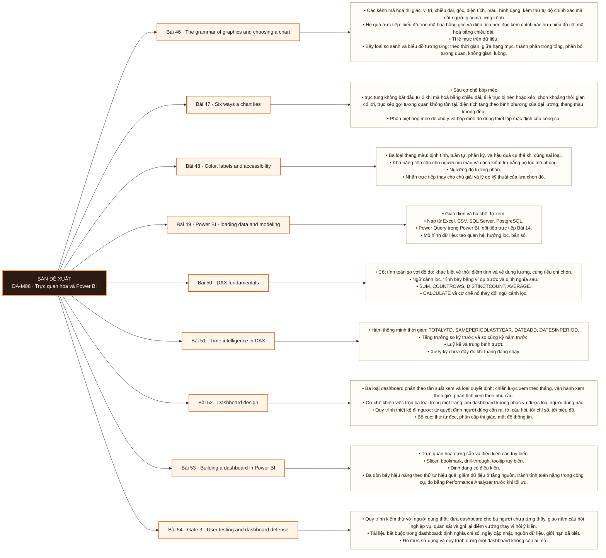

# Mô-đun 6: Trực quan hóa và Power BI

Trực quan hoá được dạy như một môn có nguyên tắc kiểm chứng được, không như vấn đề thẩm mỹ. Ba bài đầu (46–48) xây nguyên lý mã hoá thị giác và được kiểm ở tầng đánh giá; bốn bài giữa (49–51, 53) là kỹ thuật công cụ ở tầng áp dụng; Bài 52 là thiết kế ở tầng sáng tạo. Power BI được chọn vì nó xuất hiện ở mức bắt buộc trong mô tả công việc trong roadmap nguồn, và vì nó là công cụ người học tiếp cận được không mất phí ở bản máy để bàn. Căn cứ thứ nhất chỉ dựa trên một mẫu, nên nó là lý do yếu.

## Điều kiện đầu vào

| Mã | Người học có thể | Bằng chứng được chấp nhận |
|---|---|---|
| EN-06-01 | M02 · M03 | Bằng chứng hoàn thành điều kiện được nêu trong cột trước |

Nếu chưa có bằng chứng đầu vào, người học phải hoàn thành lại bài hoặc mô-đun được dẫn chiếu trước khi thực hiện phép đánh giá của mô-đun này.

## Đầu ra mô-đun

Dựng một dashboard mà ba người chưa từng thấy nó trả lời được năm câu hỏi nghiệp vụ không cần hướng dẫn

## Tiêu chí hoàn thành

| Mã | Bằng chứng bắt buộc | Ngưỡng đạt | Lỗi loại trực tiếp |
|---|---|---|---|
| EC-06-01 | Đạt Cổng 3 ≥ 70/100, phần kiểm thử người dùng ≥ 60% | ≥ 70/100 và phần A ≥ 60%. Không đạt thì làm lại với đề khác, theo quy trình khắc phục của roadmap giai đoạn. Đạt ≥ 70/100 và phần kiểm thử người dùng ≥ 60%. Đây là exit criterion của Mô-đun 6. | Tập trung vào tính năng công cụ thay vì vào câu hỏi người dùng cần trả lời, cho ra dashboard nhiều biểu đồ mà không ai mở lại |

## Khái niệm và nguyên tắc bất biến

| Mã khái niệm | Ranh giới định nghĩa | Nguyên tắc bất biến hoặc quy tắc quyết định | Bài chính |
|---|---|---|---|
| C06-046 | Các kênh mã hoá thị giác: vị trí, chiều dài, góc, diện tích, màu, hình dạng, kèm thứ tự độ chính xác mà mắt người giải mã từng kênh. | Hệ quả trực tiếp: biểu đồ tròn mã hoá bằng góc và diện tích nên đọc kém chính xác hơn biểu đồ cột mã hoá bằng chiều dài. | L046 |
| C06-047 | Sáu cơ chế bóp méo | trục tung không bắt đầu từ 0 khi mã hoá bằng chiều dài, tỉ lệ trục bị nén hoặc kéo, chọn khoảng thời gian có lợi, trục kép gợi tương quan không tồn tại, diện tích tăng theo bình phương của đại lượng, thang màu không đều. | L047 |
| C06-048 | Ba loại thang màu: định tính, tuần tự, phân kỳ, và hậu quả cụ thể khi dùng sai loại. | Khả năng tiếp cận cho người mù màu và cách kiểm tra bằng bộ lọc mô phỏng. | L048 |
| C06-049 | Giao diện và ba chế độ xem. | Nạp từ Excel, CSV, SQL Server, PostgreSQL. | L049 |
| C06-050 | Cột tính toán so với độ đo: khác biệt về thời điểm tính và về dung lượng, cùng tiêu chí chọn. | Ngữ cảnh lọc, trình bày bằng ví dụ trước và định nghĩa sau. | L050 |
| C06-051 | Hàm thông minh thời gian: TOTALYTD, SAMEPERIODLASTYEAR, DATEADD, DATESINPERIOD. | Tăng trưởng so kỳ trước và so cùng kỳ năm trước. | L051 |
| C06-052 | Ba loại dashboard phân theo tần suất xem và loại quyết định: chiến lược xem theo tháng, vận hành xem theo giờ, phân tích xem theo nhu cầu. | Cơ chế khiến việc trộn ba loại trong một trang làm dashboard không phục vụ được loại người dùng nào. | L052 |
| C06-053 | Trực quan hoá dựng sẵn và điều kiện cần tuỳ biến. | Slicer, bookmark, drill-through, tooltip tuỳ biến. | L053 |
| C06-054 | Quy trình kiểm thử với người dùng thật: đưa dashboard cho ba người chưa từng thấy, giao năm câu hỏi nghiệp vụ, quan sát và ghi lại điểm vướng thay vì hỏi ý kiến. | Tài liệu bắt buộc trong dashboard: định nghĩa chỉ số, ngày cập nhật, nguồn dữ liệu, giới hạn đã biết. | L054 |

## Các bài trong mô-đun

| Bài | Dạng | Đầu ra | Bằng chứng | Điều kiện tiên quyết |
|---|---|---|---|---|
| L046 · The grammar of graphics and choosing a chart | LT | Chọn biểu đồ cho một loại so sánh và biện minh lựa chọn bằng kênh mã hoá thị giác, không bằng sở thích. | Nộp bảng chọn biểu đồ tự lập, và áp đúng cho ≥ 10/12 tình huống với lý do nhất quán theo kênh mã hoá. | M06: M02 · M03 |
| L047 · Six ways a chart lies | TH | Định vị cơ chế bóp méo cụ thể trong một biểu đồ cho trước và vẽ lại bản trung thực của nó. | Gọi đúng tên cơ chế bóp méo của ≥ 10/12 biểu đồ, và nộp đủ 12 bản vẽ lại giữ nguyên loại so sánh gốc. | L046 |
| L048 · Color, labels and accessibility | TH | Lập một bộ nguyên tắc màu và nhãn kiểm chứng được bằng công cụ, và áp nó để sửa ba dashboard không đạt. | Cả ba dashboard sau khi sửa qua được bộ lọc mù màu và đạt ngưỡng độ tương phản, kiểm bằng công cụ. | L047 |
| L049 · Power BI - loading data and modeling | TH | Nạp dữ liệu từ cơ sở dữ liệu và dựng mô hình sao trong Power BI, với tổng kiểm chứng khớp với kết quả tính bằng SQL. | Tổng trên mô hình Power BI khớp tuyệt đối với tổng tính bằng SQL, và mô hình không chứa quan hệ vòng. | L048 · L014 · L034 |
| L050 · DAX fundamentals | TH | Viết độ đo cho kết quả đúng và giải thích được vì sao giá trị thay đổi khi người dùng chọn một lát cắt. | Cả 15 độ đo khớp với SQL ở mức tổng và ở ít nhất ba lát cắt, và giải thích được thay đổi giá trị theo lát cắt cho 5 độ đo bất kỳ. | L049 |
| L051 · Time intelligence in DAX | TH | Dựng bộ chỉ số so sánh theo thời gian cho kết quả đúng cả ở kỳ khuyết dữ liệu và kỳ chưa đầy đủ. | Cả 8 độ đo thời gian khớp với báo cáo SQL ở Bài 27, gồm cả các tháng khuyết giao dịch. | L050 · L027 |
| L052 · Dashboard design | LT | Phác thảo một dashboard trên giấy trước khi mở công cụ, và biện minh từng thành phần bằng một quyết định cụ thể của người dùng. | Nộp ba bản phác thảo, mỗi thành phần nối được với một quyết định cụ thể từ bản ghi phỏng vấn, và không có thành phần thừa. | L051 |
| L053 · Building a dashboard in Power BI | TH | Dựng một dashboard hoàn chỉnh theo bản phác thảo ở Bài 52 và đưa thời gian tải xuống dưới ngưỡng đo được. | Dashboard khớp bản phác thảo đã bảo vệ, và thời gian tải đo bằng Performance Analyzer dưới 3 giây trên `DS2`. | L052 |
| L054 · Gate 3 - User testing and dashboard defense | KT | Chứng minh bằng quan sát rằng ba người chưa từng thấy dashboard trả lời được năm câu hỏi nghiệp vụ trên đó mà không cần hướng dẫn. | ≥ 70/100 và phần A ≥ 60%. Không đạt thì làm lại với đề khác, theo quy trình khắc phục của roadmap giai đoạn. Đạt ≥ 70/100 và phần kiểm thử người dùng ≥ 60%. Đây là exit criterion của Mô-đun 6. | L053 |

## Nội dung từng bài

> **Sơ đồ đề xuất — DA-M06 v0.1.0.** Mỗi nhánh đi từ một bài học đến các nội dung nguyên tử bắt buộc. Thứ tự dạy lấy từ bảng `Các bài trong mô-đun`.

### Bài 46: The grammar of graphics and choosing a chart

Các kênh mã hoá thị giác: vị trí, chiều dài, góc, diện tích, màu, hình dạng, kèm thứ tự độ chính xác mà mắt người giải mã từng kênh. Hệ quả trực tiếp: biểu đồ tròn mã hoá bằng góc và diện tích nên đọc kém chính xác hơn biểu đồ cột mã hoá bằng chiều dài. Tỉ lệ mực trên dữ liệu. Bảy loại so sánh và biểu đồ tương ứng: theo thời gian, giữa hạng mục, thành phần trong tổng, phân bố, tương quan, không gian, luồng.

Người học phải chọn biểu đồ cho một loại so sánh và biện minh lựa chọn bằng kênh mã hoá thị giác, không bằng sở thích. Bằng chứng thực hành: Lập bảng chọn biểu đồ của riêng mình, mỗi dòng ghi loại so sánh, kênh mã hoá và biểu đồ. Áp bảng đó cho 12 tình huống nghiệp vụ. Bài hoàn tất khi nộp bảng chọn biểu đồ tự lập, và áp đúng cho ≥ 10/12 tình huống với lý do nhất quán theo kênh mã hoá.

Cách đánh giá: Tầng *đánh giá*. Objective là biện minh có tiêu chí giữa nhiều phương án hợp lệ. Kiểm bằng bảng chọn biểu đồ do người học tự lập, áp cho 12 tình huống; chấm theo tính nhất quán giữa loại so sánh, kênh mã hoá và biểu đồ chọn, không theo một đáp án duy nhất.

### Bài 47: Six ways a chart lies

Sáu cơ chế bóp méo: trục tung không bắt đầu từ 0 khi mã hoá bằng chiều dài, tỉ lệ trục bị nén hoặc kéo, chọn khoảng thời gian có lợi, trục kép gợi tương quan không tồn tại, diện tích tăng theo bình phương của đại lượng, thang màu không đều. Phân biệt bóp méo do chủ ý và bóp méo do dùng thiết lập mặc định của công cụ.

Người học phải định vị cơ chế bóp méo cụ thể trong một biểu đồ cho trước và vẽ lại bản trung thực của nó. Bằng chứng thực hành: Nhận 12 biểu đồ có thật từ báo cáo doanh nghiệp và báo chí. Gọi tên cơ chế bóp méo của từng cái và vẽ lại bản trung thực. Bài hoàn tất khi gọi đúng tên cơ chế bóp méo của ≥ 10/12 biểu đồ, và nộp đủ 12 bản vẽ lại giữ nguyên loại so sánh gốc.

Cách đánh giá: Tầng *phân tích*. Kiểm bằng 12 biểu đồ có thật: người học phải gọi tên cơ chế bóp méo của từng cái và nộp bản vẽ lại. Gọi tên cơ chế là điều kiện bắt buộc; nhận xét chung rằng biểu đồ gây hiểu nhầm không được tính.

### Bài 48: Color, labels and accessibility

Ba loại thang màu: định tính, tuần tự, phân kỳ, và hậu quả cụ thể khi dùng sai loại. Khả năng tiếp cận cho người mù màu và cách kiểm tra bằng bộ lọc mô phỏng. Ngưỡng độ tương phản. Nhãn trực tiếp thay cho chú giải và lý do kỹ thuật của lựa chọn đó. Chú thích mang nội dung diễn giải: tiêu đề nêu điều đáng chú ý thay vì nêu biểu đồ đang hiển thị dữ liệu gì.

Người học phải lập một bộ nguyên tắc màu và nhãn kiểm chứng được bằng công cụ, và áp nó để sửa ba dashboard không đạt. Bằng chứng thực hành: Kiểm tra ba dashboard cho sẵn qua bộ lọc mù màu và phép đo độ tương phản. Sửa phần không đạt và kiểm lại. Bài hoàn tất khi cả ba dashboard sau khi sửa qua được bộ lọc mù màu và đạt ngưỡng độ tương phản, kiểm bằng công cụ.

Cách đánh giá: Tầng *áp dụng*. Kiểm bằng công cụ chứ không bằng ý kiến: dashboard sau khi sửa phải qua được bộ lọc mô phỏng mù màu và đạt ngưỡng độ tương phản. Đây là bài duy nhất trong M6 có tiêu chí kiểm tự động hoàn toàn.

### Bài 49: Power BI - loading data and modeling

Giao diện và ba chế độ xem. Nạp từ Excel, CSV, SQL Server, PostgreSQL. Power Query trong Power BI, nối tiếp trực tiếp Bài 14. Mô hình dữ liệu: tạo quan hệ, hướng lọc, bản số. Cơ chế khiến lược đồ sao từ Bài 34 cho kết quả tổng hợp đúng còn bảng phẳng gây sai số. Bảng lịch và thao tác đánh dấu bảng ngày.

Người học phải nạp dữ liệu từ cơ sở dữ liệu và dựng mô hình sao trong Power BI, với tổng kiểm chứng khớp với kết quả tính bằng SQL. Bằng chứng thực hành: Nạp `DS1` từ PostgreSQL. Dựng mô hình sao có bảng lịch. Kiểm chứng tổng khớp với SQL. Bài hoàn tất khi tổng trên mô hình Power BI khớp tuyệt đối với tổng tính bằng SQL, và mô hình không chứa quan hệ vòng.

Cách đánh giá: Tầng *áp dụng*. Kiểm bằng đối chiếu chéo công cụ: tổng trên mô hình Power BI phải khớp tuyệt đối với tổng tính bằng SQL trên cùng dữ liệu. Sai hướng lọc hoặc sai bản số sẽ làm lệch tổng và lộ ra ngay ở phép đối chiếu này.

### Bài 50: DAX fundamentals

Cột tính toán so với độ đo: khác biệt về thời điểm tính và về dung lượng, cùng tiêu chí chọn. Ngữ cảnh lọc, trình bày bằng ví dụ trước và định nghĩa sau. `SUM`, `COUNTROWS`, `DISTINCTCOUNT`, `AVERAGE`. `CALCULATE` và cơ chế nó thay đổi ngữ cảnh lọc. `FILTER`, `ALL`, `ALLEXCEPT`. Chỉ số dạng tỉ lệ và sai số phát sinh khi tổng hợp tỉ lệ ở hạt khác với hạt tính.

Người học phải viết độ đo cho kết quả đúng và giải thích được vì sao giá trị thay đổi khi người dùng chọn một lát cắt. Bằng chứng thực hành: Viết 15 độ đo: doanh thu thuần, số khách hàng duy nhất, tỉ lệ đơn hoàn, tỉ trọng theo nhóm, giá trị đơn trung bình. Đối chiếu từng độ đo với SQL ở cả mức tổng và mức lát cắt. Bài hoàn tất khi cả 15 độ đo khớp với SQL ở mức tổng và ở ít nhất ba lát cắt, và giải thích được thay đổi giá trị theo lát cắt cho 5 độ đo bất kỳ.

Cách đánh giá: Tầng *áp dụng*. Kiểm hai phần: 15 độ đo đối chiếu khớp với SQL, và phần giải thích thay đổi giá trị theo lát cắt. Phần thứ hai cần thiết vì độ đo có thể khớp ở mức tổng nhưng sai ở mức lát cắt do ngữ cảnh lọc.

### Bài 51: Time intelligence in DAX

Hàm thông minh thời gian: `TOTALYTD`, `SAMEPERIODLASTYEAR`, `DATEADD`, `DATESINPERIOD`. Tăng trưởng so kỳ trước và so cùng kỳ năm trước. Luỹ kế và trung bình trượt. Xử lý kỳ chưa đầy đủ khi tháng đang chạy. Hai trường hợp gây sai lệch: tuần tài chính không trùng tuần lịch, và năm tài chính lệch năm dương lịch.

Người học phải dựng bộ chỉ số so sánh theo thời gian cho kết quả đúng cả ở kỳ khuyết dữ liệu và kỳ chưa đầy đủ. Bằng chứng thực hành: Dựng 8 độ đo thời gian trên `DS2`. Đối chiếu khớp với báo cáo SQL đã làm ở Bài 27. Bài hoàn tất khi cả 8 độ đo thời gian khớp với báo cáo SQL ở Bài 27, gồm cả các tháng khuyết giao dịch.

Cách đánh giá: Tầng *áp dụng*. Kiểm bằng đối chiếu với báo cáo SQL đã làm ở Bài 27 trên cùng dữ liệu. Vì `DS2` chứa tháng khuyết, bài xử lý sai kỳ khuyết sẽ lệch đúng ở những tháng đó, và phép đối chiếu định vị được chính xác chỗ lệch.

### Bài 52: Dashboard design

Ba loại dashboard phân theo tần suất xem và loại quyết định: chiến lược xem theo tháng, vận hành xem theo giờ, phân tích xem theo nhu cầu. Cơ chế khiến việc trộn ba loại trong một trang làm dashboard không phục vụ được loại người dùng nào. Quy trình thiết kế đi ngược: từ quyết định người dùng cần ra, tới câu hỏi, tới chỉ số, tới biểu đồ. Bố cục: thứ tự đọc, phân cấp thị giác, mật độ thông tin. Tiêu chí thêm bộ lọc và tương tác.

Người học phải phác thảo một dashboard trên giấy trước khi mở công cụ, và biện minh từng thành phần bằng một quyết định cụ thể của người dùng. Bằng chứng thực hành: Phỏng vấn ba người dùng do bạn học đóng vai, mỗi người thuộc một loại dashboard khác nhau. Phác thảo ba dashboard trên giấy, mỗi thành phần ghi rõ phục vụ quyết định nào. Bài hoàn tất khi nộp ba bản phác thảo, mỗi thành phần nối được với một quyết định cụ thể từ bản ghi phỏng vấn, và không có thành phần thừa.

Cách đánh giá: Tầng *sáng tạo*. Bản phác thảo là sản phẩm thiết kế mới dưới ràng buộc, không có đáp án mẫu. Kiểm bằng bảo vệ: mỗi thành phần trên bản phác phải nối được với một quyết định người dùng nêu ra trong phỏng vấn. Thành phần không nối được là thành phần phải bỏ.

### Bài 53: Building a dashboard in Power BI

Trực quan hoá dựng sẵn và điều kiện cần tuỳ biến. Slicer, bookmark, drill-through, tooltip tuỳ biến. Định dạng có điều kiện. Ba đòn bẩy hiệu năng theo thứ tự hiệu quả: giảm dữ liệu ở tầng nguồn, tránh tính toán nặng trong công cụ, đo bằng Performance Analyzer trước khi tối ưu. Xuất bản và chia sẻ; quyền truy cập theo hàng ở mức nhận biết.

Người học phải dựng một dashboard hoàn chỉnh theo bản phác thảo ở Bài 52 và đưa thời gian tải xuống dưới ngưỡng đo được. Bằng chứng thực hành: Dựng dashboard bán hàng trên `DS2` theo bản phác thảo ở Bài 52. Đo thời gian tải bằng Performance Analyzer và tối ưu xuống dưới 3 giây. Bài hoàn tất khi dashboard khớp bản phác thảo đã bảo vệ, và thời gian tải đo bằng Performance Analyzer dưới 3 giây trên `DS2`.

Cách đánh giá: Tầng *áp dụng*. Kiểm bằng hai số đo: dashboard khớp bản phác thảo đã bảo vệ, và thời gian tải đo bằng Performance Analyzer dưới 3 giây trên dữ liệu 2,2 triệu dòng. Cả hai đều đo được, không phụ thuộc đánh giá chủ quan.

### Bài 54: Gate 3 - User testing and dashboard defense

Quy trình kiểm thử với người dùng thật: đưa dashboard cho ba người chưa từng thấy, giao năm câu hỏi nghiệp vụ, quan sát và ghi lại điểm vướng thay vì hỏi ý kiến. Tài liệu bắt buộc trong dashboard: định nghĩa chỉ số, ngày cập nhật, nguồn dữ liệu, giới hạn đã biết. Đo mức sử dụng và quy trình dừng một dashboard không còn ai mở.

Người học phải chứng minh bằng quan sát rằng ba người chưa từng thấy dashboard trả lời được năm câu hỏi nghiệp vụ trên đó mà không cần hướng dẫn. Bằng chứng thực hành: Phần A (30đ) kết quả kiểm thử với ba người dùng · Phần B (20đ) tài liệu chỉ số trong dashboard · Phần C (20đ) chất lượng thiết kế theo nguyên tắc Bài 46–48 · Phần D (15đ) hiệu năng đo được · Phần E (15đ) bảo vệ lựa chọn thiết kế dưới chất vấn. Bài hoàn tất khi ≥ 70/100 và phần A ≥ 60%. Không đạt thì làm lại với đề khác, theo quy trình khắc phục của roadmap giai đoạn. Đạt ≥ 70/100 và phần kiểm thử người dùng ≥ 60%. Đây là exit criterion của Mô-đun 6.

Cách đánh giá: Tầng *đánh giá*. Điểm không chấm theo ý kiến giảng viên về dashboard mà theo kết quả đo trên người dùng: số câu hỏi họ trả lời đúng và số điểm vướng ghi nhận được. Phần bảo vệ kiểm khả năng biện minh lựa chọn thiết kế trước chất vấn.

## Lý do sắp xếp

Mô-đun bắt đầu từ `M06: M02 · M03` và đi theo các quan hệ tiên quyết đã ghi trong bảng. Mỗi bài chỉ sử dụng khái niệm hoặc thao tác đã được giới thiệu trước đó; bài cuối L054 tích hợp đầu ra của toàn mô-đun.

## Ma trận đánh giá

| Mã đầu ra | Mức độ tư duy | Cách đánh giá | Ngưỡng đạt | Hình thức kiểm tra lại |
|---|---|---|---|---|
| L046 | Đánh giá | Tầng *đánh giá*. Objective là biện minh có tiêu chí giữa nhiều phương án hợp lệ. Kiểm bằng bảng chọn biểu đồ do người học tự lập, áp cho 12 tình huống; chấm theo tính nhất quán giữa loại so sánh, kênh mã hoá và biểu đồ chọn, không theo một đáp án duy nhất. | Nộp bảng chọn biểu đồ tự lập, và áp đúng cho ≥ 10/12 tình huống với lý do nhất quán theo kênh mã hoá. | Tình huống mới, giữ nguyên đầu ra và ngưỡng |
| L047 | Phân tích | Tầng *phân tích*. Kiểm bằng 12 biểu đồ có thật: người học phải gọi tên cơ chế bóp méo của từng cái và nộp bản vẽ lại. Gọi tên cơ chế là điều kiện bắt buộc; nhận xét chung rằng biểu đồ gây hiểu nhầm không được tính. | Gọi đúng tên cơ chế bóp méo của ≥ 10/12 biểu đồ, và nộp đủ 12 bản vẽ lại giữ nguyên loại so sánh gốc. | Tình huống mới, giữ nguyên đầu ra và ngưỡng |
| L048 | Áp dụng | Tầng *áp dụng*. Kiểm bằng công cụ chứ không bằng ý kiến: dashboard sau khi sửa phải qua được bộ lọc mô phỏng mù màu và đạt ngưỡng độ tương phản. Đây là bài duy nhất trong M6 có tiêu chí kiểm tự động hoàn toàn. | Cả ba dashboard sau khi sửa qua được bộ lọc mù màu và đạt ngưỡng độ tương phản, kiểm bằng công cụ. | Tình huống mới, giữ nguyên đầu ra và ngưỡng |
| L049 | Áp dụng | Tầng *áp dụng*. Kiểm bằng đối chiếu chéo công cụ: tổng trên mô hình Power BI phải khớp tuyệt đối với tổng tính bằng SQL trên cùng dữ liệu. Sai hướng lọc hoặc sai bản số sẽ làm lệch tổng và lộ ra ngay ở phép đối chiếu này. | Tổng trên mô hình Power BI khớp tuyệt đối với tổng tính bằng SQL, và mô hình không chứa quan hệ vòng. | Tình huống mới, giữ nguyên đầu ra và ngưỡng |
| L050 | Áp dụng | Tầng *áp dụng*. Kiểm hai phần: 15 độ đo đối chiếu khớp với SQL, và phần giải thích thay đổi giá trị theo lát cắt. Phần thứ hai cần thiết vì độ đo có thể khớp ở mức tổng nhưng sai ở mức lát cắt do ngữ cảnh lọc. | Cả 15 độ đo khớp với SQL ở mức tổng và ở ít nhất ba lát cắt, và giải thích được thay đổi giá trị theo lát cắt cho 5 độ đo bất kỳ. | Tình huống mới, giữ nguyên đầu ra và ngưỡng |
| L051 | Áp dụng | Tầng *áp dụng*. Kiểm bằng đối chiếu với báo cáo SQL đã làm ở Bài 27 trên cùng dữ liệu. Vì `DS2` chứa tháng khuyết, bài xử lý sai kỳ khuyết sẽ lệch đúng ở những tháng đó, và phép đối chiếu định vị được chính xác chỗ lệch. | Cả 8 độ đo thời gian khớp với báo cáo SQL ở Bài 27, gồm cả các tháng khuyết giao dịch. | Tình huống mới, giữ nguyên đầu ra và ngưỡng |
| L052 | Sáng tạo | Tầng *sáng tạo*. Bản phác thảo là sản phẩm thiết kế mới dưới ràng buộc, không có đáp án mẫu. Kiểm bằng bảo vệ: mỗi thành phần trên bản phác phải nối được với một quyết định người dùng nêu ra trong phỏng vấn. Thành phần không nối được là thành phần phải bỏ. | Nộp ba bản phác thảo, mỗi thành phần nối được với một quyết định cụ thể từ bản ghi phỏng vấn, và không có thành phần thừa. | Tình huống mới, giữ nguyên đầu ra và ngưỡng |
| L053 | Áp dụng | Tầng *áp dụng*. Kiểm bằng hai số đo: dashboard khớp bản phác thảo đã bảo vệ, và thời gian tải đo bằng Performance Analyzer dưới 3 giây trên dữ liệu 2,2 triệu dòng. Cả hai đều đo được, không phụ thuộc đánh giá chủ quan. | Dashboard khớp bản phác thảo đã bảo vệ, và thời gian tải đo bằng Performance Analyzer dưới 3 giây trên `DS2`. | Tình huống mới, giữ nguyên đầu ra và ngưỡng |
| L054 | Đánh giá | Tầng *đánh giá*. Điểm không chấm theo ý kiến giảng viên về dashboard mà theo kết quả đo trên người dùng: số câu hỏi họ trả lời đúng và số điểm vướng ghi nhận được. Phần bảo vệ kiểm khả năng biện minh lựa chọn thiết kế trước chất vấn. | ≥ 70/100 và phần A ≥ 60%. Không đạt thì làm lại với đề khác, theo quy trình khắc phục của roadmap giai đoạn. Đạt ≥ 70/100 và phần kiểm thử người dùng ≥ 60%. Đây là exit criterion của Mô-đun 6. | Tình huống mới, giữ nguyên đầu ra và ngưỡng |

Không cộng điểm để bù cho lỗi loại trực tiếp. Người học phải sửa đúng lỗi, nộp lại bằng chứng và thực hiện kiểm tra lại trên một tình huống khác.

## Bài thực hành bắt buộc

| Bài thực hành hoặc dự án | Bài liên quan | Sản phẩm bắt buộc | Lỗi được cài vào tình huống |
|---|---|---|---|
| The grammar of graphics and choosing a chart | L046 | Lập bảng chọn biểu đồ của riêng mình, mỗi dòng ghi loại so sánh, kênh mã hoá và biểu đồ. Áp bảng đó cho 12 tình huống nghiệp vụ. | Chọn biểu đồ theo thói quen của công cụ · dùng diện tích để mã hoá đại lượng cần so sánh chính xác · trộn hai loại so sánh trong một biểu đồ. |
| Six ways a chart lies | L047 | Nhận 12 biểu đồ có thật từ báo cáo doanh nghiệp và báo chí. Gọi tên cơ chế bóp méo của từng cái và vẽ lại bản trung thực. | Kết luận mọi trục không bắt đầu từ 0 đều là bóp méo · bỏ sót bóp méo do thang màu vì nó kín đáo hơn · vẽ lại mà đổi luôn loại so sánh. |
| Color, labels and accessibility | L048 | Kiểm tra ba dashboard cho sẵn qua bộ lọc mù màu và phép đo độ tương phản. Sửa phần không đạt và kiểm lại. | Dùng thang tuần tự cho dữ liệu định tính · phân biệt hạng mục chỉ bằng màu đỏ và xanh lá · tiêu đề chỉ mô tả dữ liệu thay vì nêu kết luận. |
| Power BI - loading data and modeling | L049 | Nạp `DS1` từ PostgreSQL. Dựng mô hình sao có bảng lịch. Kiểm chứng tổng khớp với SQL. | Nạp bảng phẳng thay vì lược đồ sao · để hướng lọc hai chiều mặc định gây vòng lặp · quên đánh dấu bảng ngày nên hàm thời gian không chạy đúng. |
| DAX fundamentals | L050 | Viết 15 độ đo: doanh thu thuần, số khách hàng duy nhất, tỉ lệ đơn hoàn, tỉ trọng theo nhóm, giá trị đơn trung bình. Đối chiếu từng độ đo với SQL ở cả mức tổng và mức lát cắt. | Dùng cột tính toán ở nơi cần độ đo · tổng hợp tỉ lệ bằng cách lấy trung bình các tỉ lệ · dùng `ALL` xoá cả bộ lọc cần giữ. |
| Time intelligence in DAX | L051 | Dựng 8 độ đo thời gian trên `DS2`. Đối chiếu khớp với báo cáo SQL đã làm ở Bài 27. | Dùng hàm thời gian mà chưa đánh dấu bảng ngày · so cùng kỳ năm trước trên bảng lịch không liên tục · gộp tháng đang chạy vào so sánh mà không đánh dấu là kỳ chưa đầy đủ. |
| Dashboard design | L052 | Phỏng vấn ba người dùng do bạn học đóng vai, mỗi người thuộc một loại dashboard khác nhau. Phác thảo ba dashboard trên giấy, mỗi thành phần ghi rõ phục vụ quyết định nào. | Bắt đầu từ dữ liệu có sẵn thay vì từ quyết định · trộn ba loại dashboard trong một trang · thêm bộ lọc không ai yêu cầu. |
| Building a dashboard in Power BI | L053 | Dựng dashboard bán hàng trên `DS2` theo bản phác thảo ở Bài 52. Đo thời gian tải bằng Performance Analyzer và tối ưu xuống dưới 3 giây. | Kéo toàn bộ bảng chi tiết vào mô hình thay vì gộp ở nguồn · tối ưu trước khi đo nên tối ưu nhầm chỗ · thêm thành phần không có trong bản phác thảo đã bảo vệ. |
| Gate 3 - User testing and dashboard defense | L054 | Phần A (30đ) kết quả kiểm thử với ba người dùng · Phần B (20đ) tài liệu chỉ số trong dashboard · Phần C (20đ) chất lượng thiết kế theo nguyên tắc Bài 46–48 · Phần D (15đ) hiệu năng đo được · Phần E (15đ) bảo vệ lựa chọn thiết kế dưới chất vấn. | Hướng dẫn người dùng trong lúc kiểm thử nên kết quả không dùng được · hỏi ý kiến thay vì quan sát thao tác · bỏ phần tài liệu chỉ số. |

## Ngộ nhận và lỗi loại trực tiếp

| Lỗi | Hệ quả | Nơi phát hiện | Cách khắc phục |
|---|---|---|---|
| Chọn biểu đồ theo thói quen của công cụ · dùng diện tích để mã hoá đại lượng cần so sánh chính xác · trộn hai loại so sánh trong một biểu đồ. | Không tạo được bằng chứng hợp lệ cho đầu ra L046 | L046 | Làm lại phép đánh giá trên tình huống mới và đạt tiêu chí `Done when` |
| Kết luận mọi trục không bắt đầu từ 0 đều là bóp méo · bỏ sót bóp méo do thang màu vì nó kín đáo hơn · vẽ lại mà đổi luôn loại so sánh. | Không tạo được bằng chứng hợp lệ cho đầu ra L047 | L047 | Làm lại phép đánh giá trên tình huống mới và đạt tiêu chí `Done when` |
| Dùng thang tuần tự cho dữ liệu định tính · phân biệt hạng mục chỉ bằng màu đỏ và xanh lá · tiêu đề chỉ mô tả dữ liệu thay vì nêu kết luận. | Không tạo được bằng chứng hợp lệ cho đầu ra L048 | L048 | Làm lại phép đánh giá trên tình huống mới và đạt tiêu chí `Done when` |
| Nạp bảng phẳng thay vì lược đồ sao · để hướng lọc hai chiều mặc định gây vòng lặp · quên đánh dấu bảng ngày nên hàm thời gian không chạy đúng. | Không tạo được bằng chứng hợp lệ cho đầu ra L049 | L049 | Làm lại phép đánh giá trên tình huống mới và đạt tiêu chí `Done when` |
| Dùng cột tính toán ở nơi cần độ đo · tổng hợp tỉ lệ bằng cách lấy trung bình các tỉ lệ · dùng `ALL` xoá cả bộ lọc cần giữ. | Không tạo được bằng chứng hợp lệ cho đầu ra L050 | L050 | Làm lại phép đánh giá trên tình huống mới và đạt tiêu chí `Done when` |
| Dùng hàm thời gian mà chưa đánh dấu bảng ngày · so cùng kỳ năm trước trên bảng lịch không liên tục · gộp tháng đang chạy vào so sánh mà không đánh dấu là kỳ chưa đầy đủ. | Không tạo được bằng chứng hợp lệ cho đầu ra L051 | L051 | Làm lại phép đánh giá trên tình huống mới và đạt tiêu chí `Done when` |
| Bắt đầu từ dữ liệu có sẵn thay vì từ quyết định · trộn ba loại dashboard trong một trang · thêm bộ lọc không ai yêu cầu. | Không tạo được bằng chứng hợp lệ cho đầu ra L052 | L052 | Làm lại phép đánh giá trên tình huống mới và đạt tiêu chí `Done when` |
| Kéo toàn bộ bảng chi tiết vào mô hình thay vì gộp ở nguồn · tối ưu trước khi đo nên tối ưu nhầm chỗ · thêm thành phần không có trong bản phác thảo đã bảo vệ. | Không tạo được bằng chứng hợp lệ cho đầu ra L053 | L053 | Làm lại phép đánh giá trên tình huống mới và đạt tiêu chí `Done when` |
| Hướng dẫn người dùng trong lúc kiểm thử nên kết quả không dùng được · hỏi ý kiến thay vì quan sát thao tác · bỏ phần tài liệu chỉ số. | Không tạo được bằng chứng hợp lệ cho đầu ra L054 | L054 | Làm lại phép đánh giá trên tình huống mới và đạt tiêu chí `Done when` |

## Điểm nối với mô-đun khác

| Kế thừa từ | Cung cấp cho mô-đun sau | Cam kết đầu ra |
|---|---|---|
| M02 · M03 | M02, M03 | Dựng một dashboard mà ba người chưa từng thấy nó trả lời được năm câu hỏi nghiệp vụ không cần hướng dẫn |

## Tài liệu tham khảo

| Mã | Nguồn | Vị trí | Dùng cho |
|---|---|---|---|
| R06-01 | Roadmap Data Analyst nguồn | `Material/DA/Reference/Library/roadmap-v1-goc.md` | Phạm vi chương trình và thứ tự bài học |
| R06-02 | Manifest nguồn cấp bài | `Material/DA/Reference/.../Lesson_*/sources.yaml` | Truy vết nguồn khi manifest được điền |

## Đối chiếu năng lực

| Khung hoặc mã năng lực | Phạm vi sử dụng | Bằng chứng |
|---|---|---|
| `VISL` mức 3 · `BINT` mức 3 | Đầu ra và phép đánh giá của mô-đun | EC-06-01 và ma trận đánh giá theo bài |

Ánh xạ này mô tả phạm vi được thực hành; nó không tự động chứng nhận cấp độ của người học trong khung năng lực.

## Giới hạn của mô-đun

- Roadmap xác định phạm vi, bằng chứng và cách đánh giá; nội dung giảng giải đầy đủ thuộc `note.md`.
- Manifest nguồn cấp bài hiện chưa có dữ liệu. Không được dùng tên tệp trong `Reference/Library` làm bằng chứng cho một khẳng định.
- Hoàn thành mô-đun chỉ chứng minh các đầu ra được nêu trong tài liệu này; không tự động chứng nhận chức danh hoặc kinh nghiệm làm việc.
