# Giai đoạn 3: Nền tảng phân tích và BI

Giai đoạn này kết hợp M04-M06. Người học chuyển từ `Bằng chứng hoàn thành Giai đoạn 2` sang khả năng tạo và bảo vệ bằng chứng tích hợp ở L054.

## Điều kiện đầu vào

| Năng lực bắt buộc | Bằng chứng được chấp nhận | Cách khắc phục |
|---|---|---|
| Bằng chứng hoàn thành Giai đoạn 2 | Sản phẩm và kết quả đánh giá của giai đoạn trước | Hoàn thành lại tiêu chí chưa đạt trước khi vào bài kiểm tra tích hợp |

## Đầu ra giai đoạn

Chứng minh bằng quan sát rằng ba người chưa từng thấy dashboard trả lời được năm câu hỏi nghiệp vụ trên đó mà không cần hướng dẫn.

## Thứ tự mô-đun

| Mô-đun | Năng lực được bổ sung | Phụ thuộc | Bằng chứng hoàn thành |
|---|---|---|---|
| [DA-M04](Module_04-data-modeling-and-preparation/roadmap.md) | Nạp một tệp nguồn có lỗi vào cơ sở dữ liệu theo một mô hình tự thiết kế, và chứng minh kết quả đúng bằng hai phép đối soát độc lập | M03 | Nộp lược đồ sao tự thiết kế cho `DS1` trả lời được 5 câu hỏi phân tích cho trước, cộng bản đối soát `orders_dirty.csv` chứng minh 50.005 = 49.985 + 20, mỗi bản ghi lỗi có lý do ghi rõ |
| [DA-M05](Module_05-statistics-for-data-analysts/roadmap.md) | Kết luận một khác biệt quan sát được là hiệu ứng thật hay dao động, kèm định lượng mức không chắc chắn và phát biểu giả định | M04 | Hoàn thành dự án Bài 45 đạt ≥ 70/100, kết luận được chứng minh bằng hai đường độc lập, có nhật ký giả thuyết ghi cả giả thuyết bị bác bỏ |
| [DA-M06](Module_06-visualization-and-power-bi/roadmap.md) | Dựng một dashboard mà ba người chưa từng thấy nó trả lời được năm câu hỏi nghiệp vụ không cần hướng dẫn | M02 · M03 | Đạt Cổng 3 ≥ 70/100, phần kiểm thử người dùng ≥ 60% |

**Sơ đồ thứ tự:** đọc từ trái sang phải; mỗi mô-đun tạo bằng chứng đầu vào cho mô-đun kế tiếp và bài kiểm tra cuối giai đoạn.

```mermaid
%%{init: {"flowchart": {"htmlLabels": true, "wrappingWidth": 520, "nodeSpacing": 64, "rankSpacing": 160}}}%%
flowchart LR
  P03["Giai đoạn 3<br/>Nền tảng phân tích và BI<br/>Roadmap hiện hành"]
  M04["M04 · Mô hình hóa và chuẩn bị dữ liệu<br/>Bài 31–37"]
  P03 --> M04
  M05["M05 · Thống kê cho Data Analyst<br/>Bài 38–45"]
  M04 --> M05
  M06["M06 · Trực quan hóa và Power BI<br/>Bài 46–54"]
  M05 --> M06
  G03["Bài kiểm tra cuối giai đoạn<br/>Bài 54"]
  M06 --> G03

  classDef phase fill:#2b1b12,color:#fff4e8,stroke:#ff8a3d,stroke-width:2px;
  classDef module fill:#fff4e8,color:#2b1b12,stroke:#c85e16,stroke-width:1.5px;
  classDef gate fill:#fffdf8,color:#2b1b12,stroke:#2b1b12,stroke-width:2px;
  class P03 phase;
  class M04,M05,M06 module;
  class G03 gate;
```

## Lý do sắp xếp

- M04 đứng trước M05 vì điều kiện đầu vào của M05 sử dụng bằng chứng hoặc cơ chế đã hình thành ở mô-đun trước.
- M05 đứng trước M06 vì điều kiện đầu vào của M06 sử dụng bằng chứng hoặc cơ chế đã hình thành ở mô-đun trước.

## Bài kiểm tra cuối giai đoạn

### Nhiệm vụ

Phần A (30đ) kết quả kiểm thử với ba người dùng · Phần B (20đ) tài liệu chỉ số trong dashboard · Phần C (20đ) chất lượng thiết kế theo nguyên tắc Bài 46-48 · Phần D (15đ) hiệu năng đo được · Phần E (15đ) bảo vệ lựa chọn thiết kế dưới chất vấn.

### Cách đánh giá

| Tiêu chí | Bằng chứng | Ngưỡng đạt | Lỗi loại trực tiếp |
|---|---|---|---|
| Chứng minh bằng quan sát rằng ba người chưa từng thấy dashboard trả lời được năm câu hỏi nghiệp vụ trên đó mà không cần hướng dẫn. | Phần A (30đ) kết quả kiểm thử với ba người dùng · Phần B (20đ) tài liệu chỉ số trong dashboard · Phần C (20đ) chất lượng thiết kế theo nguyên tắc Bài 46-48 · Phần D (15đ) hiệu năng đo được · Phần E (15đ) bảo vệ lựa chọn thiết kế dưới chất vấn. | ≥ 70/100 và phần A ≥ 60%. Không đạt thì làm lại với đề khác, theo quy trình khắc phục của roadmap giai đoạn. Đạt ≥ 70/100 và phần kiểm thử người dùng ≥ 60%. Đây là exit criterion của Mô-đun 6. | Hướng dẫn người dùng trong lúc kiểm thử nên kết quả không dùng được · hỏi ý kiến thay vì quan sát thao tác · bỏ phần tài liệu chỉ số. |

## Điểm tích hợp

| Năng lực trước được dùng lại | Mô-đun sử dụng | Năng lực sau được mở khóa |
|---|---|---|
| M03 | M04 | Nạp một tệp nguồn có lỗi vào cơ sở dữ liệu theo một mô hình tự thiết kế, và chứng minh kết quả đúng bằng hai phép đối soát độc lập |
| M04 | M05 | Kết luận một khác biệt quan sát được là hiệu ứng thật hay dao động, kèm định lượng mức không chắc chắn và phát biểu giả định |
| M02 · M03 | M06 | Dựng một dashboard mà ba người chưa từng thấy nó trả lời được năm câu hỏi nghiệp vụ không cần hướng dẫn |

## Khắc phục

| Tiêu chí chưa đạt | Bằng chứng chẩn đoán | Phần phải làm lại | Cách kiểm tra lại |
|---|---|---|---|
| Hướng dẫn người dùng trong lúc kiểm thử nên kết quả không dùng được · hỏi ý kiến thay vì quan sát thao tác · bỏ phần tài liệu chỉ số. | Bài làm, nhật ký và phản hồi theo tiêu chí L054 | Bài hoặc mô-đun tạo ra bằng chứng còn thiếu | Tình huống mới, giữ nguyên đầu ra và ngưỡng đạt |

## Rủi ro của giai đoạn

| Rủi ro | Cách phát hiện | Biện pháp kiểm soát |
|---|---|---|
| Học chuẩn hoá như quy tắc hình thức mà không gặp dị thường trước, nên không nhận ra khi nào nên phi chuẩn hoá | Không đạt tiêu chí hoàn thành M04 | Khắc phục tại M04 trước khi thực hiện bài kiểm tra cuối giai đoạn |
| Học công thức kiểm định mà bỏ kiểm tra giả định, dẫn tới kết luận có vẻ chặt chẽ trên dữ liệu vi phạm điều kiện áp dụng | Không đạt tiêu chí hoàn thành M05 | Khắc phục tại M05 trước khi thực hiện bài kiểm tra cuối giai đoạn |
| Tập trung vào tính năng công cụ thay vì vào câu hỏi người dùng cần trả lời, cho ra dashboard nhiều biểu đồ mà không ai mở lại | Không đạt tiêu chí hoàn thành M06 | Khắc phục tại M06 trước khi thực hiện bài kiểm tra cuối giai đoạn |

## Tài liệu tham khảo

| Mã | Nguồn | Vị trí | Dùng cho |
|---|---|---|---|
| DA-M04 | Roadmap mô-đun | `Module_04-data-modeling-and-preparation/roadmap.md` | Đầu ra, thứ tự bài và tiêu chí đánh giá của mô-đun |
| DA-M05 | Roadmap mô-đun | `Module_05-statistics-for-data-analysts/roadmap.md` | Đầu ra, thứ tự bài và tiêu chí đánh giá của mô-đun |
| DA-M06 | Roadmap mô-đun | `Module_06-visualization-and-power-bi/roadmap.md` | Đầu ra, thứ tự bài và tiêu chí đánh giá của mô-đun |

Roadmap giai đoạn không thay thế roadmap mô-đun. Khi hai cấp diễn đạt khác nhau, mã đầu ra và tiêu chí do roadmap mô-đun sở hữu được dùng để rà soát.
