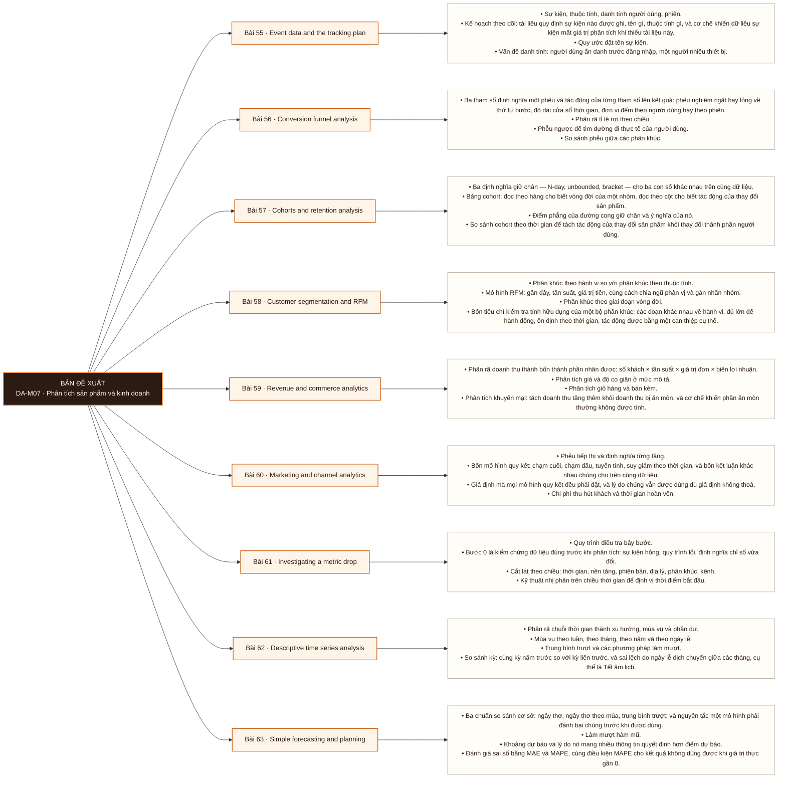

# Mô-đun 7: Phân tích sản phẩm và kinh doanh

Module này là nơi các kỹ thuật của M3 và M5 được áp vào dữ liệu sự kiện. Một chủ đề xuyên suốt: mọi chỉ số sản phẩm đều có tham số định nghĩa ẩn, và đổi tham số thì đổi kết luận. Bài 61 là bài trọng tâm, ở tầng phân tích, và là một trong các đầu ra chương trình.

## Điều kiện đầu vào

| Mã | Người học có thể | Bằng chứng được chấp nhận |
|---|---|---|
| EN-07-01 | M03 · M05 | Bằng chứng hoàn thành điều kiện được nêu trong cột trước |

Nếu chưa có bằng chứng đầu vào, người học phải hoàn thành lại bài hoặc mô-đun được dẫn chiếu trước khi thực hiện phép đánh giá của mô-đun này.

## Đầu ra mô-đun

Điều tra một chỉ số sản phẩm thay đổi và định vị nguyên nhân kèm bằng chứng từng bước, trên dữ liệu sự kiện 2 triệu event

## Tiêu chí hoàn thành

| Mã | Bằng chứng bắt buộc | Ngưỡng đạt | Lỗi loại trực tiếp |
|---|---|---|---|
| EC-07-01 | Nộp báo cáo điều tra Bài 61 định vị đúng bất thường ở giao hai chiều, mỗi bước có bằng chứng, và bước 0 kiểm chất lượng dữ liệu được thực hiện trước | Dự báo kèm khoảng, đánh bại cả ba chuẩn cơ sở trên đánh giá lùi bằng cửa sổ trượt tiến, và nêu được giới hạn áp dụng. | Dựng phễu và cohort bằng công thức mẫu mà không khai báo ba tham số định nghĩa, nên hai người cho hai con số khác nhau trên cùng dữ liệu |

## Khái niệm và nguyên tắc bất biến

| Mã khái niệm | Ranh giới định nghĩa | Nguyên tắc bất biến hoặc quy tắc quyết định | Bài chính |
|---|---|---|---|
| C07-055 | Sự kiện, thuộc tính, danh tính người dùng, phiên. | Kế hoạch theo dõi: tài liệu quy định sự kiện nào được ghi, tên gì, thuộc tính gì, và cơ chế khiến dữ liệu sự kiện mất giá trị phân tích khi thiếu tài liệu này. | L055 |
| C07-056 | Ba tham số định nghĩa một phễu và tác động của từng tham số lên kết quả: phễu nghiêm ngặt hay lỏng về thứ tự bước, độ dài cửa sổ thời gian, đơn vị đếm theo người dùng hay theo phiên. | Phân rã tỉ lệ rơi theo chiều. | L056 |
| C07-057 | Ba định nghĩa giữ chân — N-day, unbounded, bracket — cho ba con số khác nhau trên cùng dữ liệu. | Bảng cohort: đọc theo hàng cho biết vòng đời của một nhóm, đọc theo cột cho biết tác động của thay đổi sản phẩm. | L057 |
| C07-058 | Phân khúc theo hành vi so với phân khúc theo thuộc tính. | Mô hình RFM: gần đây, tần suất, giá trị tiền, cùng cách chia ngũ phân vị và gán nhãn nhóm. | L058 |
| C07-059 | Phân rã doanh thu thành bốn thành phần nhân được: số khách × tần suất × giá trị đơn × biên lợi nhuận. | Phân tích giá và độ co giãn ở mức mô tả. | L059 |
| C07-060 | Phễu tiếp thị và định nghĩa từng tầng. | Bốn mô hình quy kết: chạm cuối, chạm đầu, tuyến tính, suy giảm theo thời gian, và bốn kết luận khác nhau chúng cho trên cùng dữ liệu. | L060 |
| C07-061 | Quy trình điều tra bảy bước. | Bước 0 là kiểm chứng dữ liệu đúng trước khi phân tích: sự kiện hỏng, quy trình lỗi, định nghĩa chỉ số vừa đổi. | L061 |
| C07-062 | Phân rã chuỗi thời gian thành xu hướng, mùa vụ và phần dư. | Mùa vụ theo tuần, theo tháng, theo năm và theo ngày lễ. | L062 |
| C07-063 | Ba chuẩn so sánh cơ sở: ngây thơ, ngây thơ theo mùa, trung bình trượt; và nguyên tắc một mô hình phải đánh bại chúng trước khi được dùng. | Làm mượt hàm mũ. | L063 |

## Các bài trong mô-đun

| Bài | Dạng | Đầu ra | Bằng chứng | Điều kiện tiên quyết |
|---|---|---|---|---|
| L055 · Event data and the tracking plan | LT | Viết kế hoạch theo dõi cho một luồng sản phẩm, và định lượng ba loại lỗi sự kiện trong một tập dữ liệu có sẵn. | Kế hoạch theo dõi đủ để một học viên khác cài đặt không cần hỏi, và ba loại lỗi sự kiện trong `DS3` được định lượng đúng. | M07: M03 · M05 |
| L056 · Conversion funnel analysis | TH | Dựng một phân tích phễu có khai báo đủ ba tham số, định vị bước rơi nghiêm trọng nhất, và định lượng tác động của việc đổi một tham số lên kết quả. | Phễu khai báo đủ ba tham số, định vị đúng bước rơi nghiêm trọng nhất, và giải thích được chênh lệch 12 điểm giữa hai cửa sổ. | L055 |
| L057 · Cohorts and retention analysis | TH | Dựng bảng cohort và rút kết luận đúng từ nó theo cả hai chiều đọc, với định nghĩa giữ chân được khai báo rõ. | Bảng cohort từ SQL và từ Power BI khớp nhau, ba định nghĩa giữ chân cho ba con số có giải thích, và hai chiều đọc cho hai kết luận đúng. | L056 |
| L058 · Customer segmentation and RFM | TH | Xây một bộ phân khúc RFM, kiểm nó qua bốn tiêu chí, và đề xuất một can thiệp cụ thể cho từng đoạn lớn. | Mọi đoạn giữ lại đều qua cả bốn tiêu chí có số liệu kèm theo, và ba đoạn lớn nhất có can thiệp cụ thể khác nhau. | L057 |
| L059 · Revenue and commerce analytics | TH | Phân rã doanh thu theo bốn thành phần và kết luận một chương trình khuyến mại tạo thêm doanh thu hay chỉ dịch chuyển thời điểm mua, kèm định lượng phần ăn mòn. | Bốn thành phần nhân lại bằng đúng tổng doanh thu, và kết luận về khuyến mại có kèm con số ăn mòn định lượng được. | L058 |
| L060 · Marketing and channel analytics | TH | Đọc một báo cáo quy kết và định vị giả định nào của mô hình đang chi phối kết luận của báo cáo đó. | Bốn bảng đóng góp theo bốn mô hình được tính trên cùng dữ liệu, và giả định gây tổng vượt 100% được chỉ ra cụ thể. | L059 |
| L061 · Investigating a metric drop | TH | Nhận một chỉ số sụt giảm và định vị nguyên nhân kèm bằng chứng cho từng bước, bắt đầu bằng phép kiểm chứng dữ liệu. | Báo cáo định vị đúng bất thường ở giao hai chiều, mỗi bước có bằng chứng, và bước 0 được thực hiện trước bước 1. Đây là exit criterion của Mô-đun 7. | L060 · L044 |
| L062 · Descriptive time series analysis | TH | Phân rã một chuỗi thời gian thành ba thành phần và thực hiện so sánh kỳ không bị mùa vụ và ngày lễ dịch chuyển làm lệch. | Ba chỉ số được phân rã thành ba thành phần, và so sánh kỳ ở hai tháng có Tết khớp với đáp án sau khi chỉnh ngày lễ dịch chuyển. | L061 |
| L063 · Simple forecasting and planning | TH | Đưa ra một dự báo kèm khoảng, chứng minh nó đánh bại ba chuẩn cơ sở bằng đánh giá lùi, và phát biểu giới hạn áp dụng của nó. | Dự báo kèm khoảng, đánh bại cả ba chuẩn cơ sở trên đánh giá lùi bằng cửa sổ trượt tiến, và nêu được giới hạn áp dụng. | L062 |

## Nội dung từng bài

> **Sơ đồ đề xuất — DA-M07 v0.1.0.** Mỗi nhánh đi từ một bài học đến các nội dung nguyên tử bắt buộc. Thứ tự dạy lấy từ bảng `Các bài trong mô-đun`.

### Bài 55: Event data and the tracking plan

Sự kiện, thuộc tính, danh tính người dùng, phiên. Kế hoạch theo dõi: tài liệu quy định sự kiện nào được ghi, tên gì, thuộc tính gì, và cơ chế khiến dữ liệu sự kiện mất giá trị phân tích khi thiếu tài liệu này. Quy ước đặt tên sự kiện. Vấn đề danh tính: người dùng ẩn danh trước đăng nhập, một người nhiều thiết bị. Bốn lỗi đặc trưng của dữ liệu sự kiện: mất sự kiện, trùng sự kiện, sai thứ tự, lệch đồng hồ giữa thiết bị và máy chủ.

Người học phải viết kế hoạch theo dõi cho một luồng sản phẩm, và định lượng ba loại lỗi sự kiện trong một tập dữ liệu có sẵn. Bằng chứng thực hành: Viết kế hoạch theo dõi cho luồng mua hàng 8 bước. Rà soát `DS3` và định lượng ba loại lỗi sự kiện có trong đó. Bài hoàn tất khi kế hoạch theo dõi đủ để một học viên khác cài đặt không cần hỏi, và ba loại lỗi sự kiện trong `DS3` được định lượng đúng.

Cách đánh giá: Tầng *áp dụng*. Kiểm hai phần: kế hoạch theo dõi đạt rà soát chéo về tính đủ để một người khác cài đặt, và phần rà soát chất lượng phải định lượng đúng ba loại lỗi có trong `DS3`.

### Bài 56: Conversion funnel analysis

Ba tham số định nghĩa một phễu và tác động của từng tham số lên kết quả: phễu nghiêm ngặt hay lỏng về thứ tự bước, độ dài cửa sổ thời gian, đơn vị đếm theo người dùng hay theo phiên. Phân rã tỉ lệ rơi theo chiều. Phễu ngược để tìm đường đi thực tế của người dùng. So sánh phễu giữa các phân khúc.

Người học phải dựng một phân tích phễu có khai báo đủ ba tham số, định vị bước rơi nghiêm trọng nhất, và định lượng tác động của việc đổi một tham số lên kết quả. Bằng chứng thực hành: Dựng phễu 5 bước trên `DS3` có phân rã theo bốn chiều. Chạy lại với cửa sổ 1 ngày và 7 ngày, và giải thích vì sao tỉ lệ chuyển đổi chênh 12 điểm phần trăm. Bài hoàn tất khi phễu khai báo đủ ba tham số, định vị đúng bước rơi nghiêm trọng nhất, và giải thích được chênh lệch 12 điểm giữa hai cửa sổ.

Cách đánh giá: Tầng *phân tích*. Kiểm bằng yêu cầu định lượng độ nhạy: người học phải chạy phễu ở hai giá trị cửa sổ khác nhau và giải thích chênh lệch. Yêu cầu này bắt buộc vì nó là cơ chế phân biệt người hiểu định nghĩa phễu với người chạy theo công thức mẫu.

### Bài 57: Cohorts and retention analysis

Ba định nghĩa giữ chân — N-day, unbounded, bracket — cho ba con số khác nhau trên cùng dữ liệu. Bảng cohort: đọc theo hàng cho biết vòng đời của một nhóm, đọc theo cột cho biết tác động của thay đổi sản phẩm. Điểm phẳng của đường cong giữ chân và ý nghĩa của nó. So sánh cohort theo thời gian để tách tác động của thay đổi sản phẩm khỏi thay đổi thành phần người dùng.

Người học phải dựng bảng cohort và rút kết luận đúng từ nó theo cả hai chiều đọc, với định nghĩa giữ chân được khai báo rõ. Bằng chứng thực hành: Dựng bảng cohort 12 tháng trên `DS3` bằng cả SQL và Power BI. So ba định nghĩa giữ chân trên cùng dữ liệu và giải thích chênh lệch. Bài hoàn tất khi bảng cohort từ SQL và từ Power BI khớp nhau, ba định nghĩa giữ chân cho ba con số có giải thích, và hai chiều đọc cho hai kết luận đúng.

Cách đánh giá: Tầng *phân tích*. Kiểm bằng yêu cầu so ba định nghĩa: người học tính giữ chân theo cả ba định nghĩa trên cùng dữ liệu và giải thích vì sao ba con số khác nhau. Cộng phần đọc bảng theo hàng và theo cột với hai kết luận khác nhau.

### Bài 58: Customer segmentation and RFM

Phân khúc theo hành vi so với phân khúc theo thuộc tính. Mô hình RFM: gần đây, tần suất, giá trị tiền, cùng cách chia ngũ phân vị và gán nhãn nhóm. Phân khúc theo giai đoạn vòng đời. Bốn tiêu chí kiểm tra tính hữu dụng của một bộ phân khúc: các đoạn khác nhau về hành vi, đủ lớn để hành động, ổn định theo thời gian, tác động được bằng một can thiệp cụ thể.

Người học phải xây một bộ phân khúc RFM, kiểm nó qua bốn tiêu chí, và đề xuất một can thiệp cụ thể cho từng đoạn lớn. Bằng chứng thực hành: Dựng RFM đầy đủ trên `DS2` bằng hàm cửa sổ. Kiểm bốn tiêu chí cho từng đoạn. Đề xuất can thiệp marketing cho ba đoạn lớn nhất. Bài hoàn tất khi mọi đoạn giữ lại đều qua cả bốn tiêu chí có số liệu kèm theo, và ba đoạn lớn nhất có can thiệp cụ thể khác nhau.

Cách đánh giá: Tầng *sáng tạo*. Bộ phân khúc là sản phẩm thiết kế; không tồn tại phân khúc đúng duy nhất. Kiểm bằng bốn tiêu chí định lượng được cộng phần đề xuất can thiệp. Đoạn không qua được cả bốn tiêu chí phải bị loại hoặc gộp, và người học phải làm điều đó chứ không chỉ báo cáo.

### Bài 59: Revenue and commerce analytics

Phân rã doanh thu thành bốn thành phần nhân được: số khách × tần suất × giá trị đơn × biên lợi nhuận. Phân tích giá và độ co giãn ở mức mô tả. Phân tích giỏ hàng và bán kèm. Phân tích khuyến mại: tách doanh thu tăng thêm khỏi doanh thu bị ăn mòn, và cơ chế khiến phần ăn mòn thường không được tính. Giá trị vòng đời khách hàng ở mức mô tả.

Người học phải phân rã doanh thu theo bốn thành phần và kết luận một chương trình khuyến mại tạo thêm doanh thu hay chỉ dịch chuyển thời điểm mua, kèm định lượng phần ăn mòn. Bằng chứng thực hành: Phân rã doanh thu `DS2` theo bốn thành phần. Đánh giá một đợt khuyến mại, có tính và trừ phần doanh thu bị ăn mòn. Bài hoàn tất khi bốn thành phần nhân lại bằng đúng tổng doanh thu, và kết luận về khuyến mại có kèm con số ăn mòn định lượng được.

Cách đánh giá: Tầng *đánh giá*. Objective là một phán quyết kinh doanh dựa trên bằng chứng định lượng. Kiểm bằng yêu cầu bắt buộc trừ phần ăn mòn: báo cáo chỉ tính doanh thu tăng thêm mà không trừ ăn mòn bị chấm không đạt, kể cả khi số học đúng.

### Bài 60: Marketing and channel analytics

Phễu tiếp thị và định nghĩa từng tầng. Bốn mô hình quy kết: chạm cuối, chạm đầu, tuyến tính, suy giảm theo thời gian, và bốn kết luận khác nhau chúng cho trên cùng dữ liệu. Giả định mà mọi mô hình quy kết đều phải đặt, và lý do chúng vẫn được dùng dù giả định không thoả. Chi phí thu hút khách và thời gian hoàn vốn. Trùng lặp kênh và cơ chế làm tổng đóng góp vượt 100%.

Người học phải đọc một báo cáo quy kết và định vị giả định nào của mô hình đang chi phối kết luận của báo cáo đó. Bằng chứng thực hành: Tính đóng góp kênh theo cả bốn mô hình quy kết trên cùng dữ liệu. Giải thích vì sao tổng đóng góp vượt 100% và giả định nào gây ra điều đó. Bài hoàn tất khi bốn bảng đóng góp theo bốn mô hình được tính trên cùng dữ liệu, và giả định gây tổng vượt 100% được chỉ ra cụ thể.

Cách đánh giá: Tầng *phân tích*. Kiểm bằng bài tính đóng góp kênh theo cả bốn mô hình trên cùng dữ liệu, rồi giải thích cơ chế khiến tổng vượt 100%. Người học phải chỉ ra giả định cụ thể, không dừng ở nhận xét rằng các mô hình cho kết quả khác nhau.

### Bài 61: Investigating a metric drop

Quy trình điều tra bảy bước. Bước 0 là kiểm chứng dữ liệu đúng trước khi phân tích: sự kiện hỏng, quy trình lỗi, định nghĩa chỉ số vừa đổi. Cắt lát theo chiều: thời gian, nền tảng, phiên bản, địa lý, phân khúc, kênh. Kỹ thuật nhị phân trên chiều thời gian để định vị thời điểm bắt đầu. Phân biệt thay đổi thành phần với thay đổi hành vi, và cách kiểm tra bằng chuẩn hoá thành phần.

Người học phải nhận một chỉ số sụt giảm và định vị nguyên nhân kèm bằng chứng cho từng bước, bắt đầu bằng phép kiểm chứng dữ liệu. Bằng chứng thực hành: `DS3` chứa một bất thường chỉ lộ ra ở giao nền tảng × phiên bản ứng dụng. Nộp báo cáo điều tra có bằng chứng từng bước. Bài hoàn tất khi báo cáo định vị đúng bất thường ở giao hai chiều, mỗi bước có bằng chứng, và bước 0 được thực hiện trước bước 1. Đây là exit criterion của Mô-đun 7.

Cách đánh giá: Tầng *phân tích*. Đây là một trong các đầu ra chương trình. Kiểm bằng báo cáo điều tra: định vị đúng nguyên nhân, bằng chứng đủ cho từng bước, và bước 0 phải được thực hiện trước bước 1. Báo cáo định vị đúng nguyên nhân nhưng bỏ bước 0 bị trừ, vì thứ tự là phần đang được dạy.

### Bài 62: Descriptive time series analysis

Phân rã chuỗi thời gian thành xu hướng, mùa vụ và phần dư. Mùa vụ theo tuần, theo tháng, theo năm và theo ngày lễ. Trung bình trượt và các phương pháp làm mượt. So sánh kỳ: cùng kỳ năm trước so với kỳ liền trước, và sai lệch do ngày lễ dịch chuyển giữa các tháng, cụ thể là Tết âm lịch. Phát hiện điểm gãy trong chuỗi.

Người học phải phân rã một chuỗi thời gian thành ba thành phần và thực hiện so sánh kỳ không bị mùa vụ và ngày lễ dịch chuyển làm lệch. Bằng chứng thực hành: Phân rã ba chỉ số trên `DS2`. Xử lý đúng ảnh hưởng của Tết âm lịch dịch chuyển giữa tháng 1 và tháng 2. Bài hoàn tất khi ba chỉ số được phân rã thành ba thành phần, và so sánh kỳ ở hai tháng có Tết khớp với đáp án sau khi chỉnh ngày lễ dịch chuyển.

Cách đánh giá: Tầng *áp dụng*. Kiểm bằng trường hợp cụ thể có đáp án: `DS2` chứa Tết âm lịch rơi vào tháng 1 ở một năm và tháng 2 ở năm khác. Bài xử lý sai sẽ cho chênh lệch so cùng kỳ rất lớn ở đúng hai tháng đó, nên lỗi định vị được chính xác.

### Bài 63: Simple forecasting and planning

Ba chuẩn so sánh cơ sở: ngây thơ, ngây thơ theo mùa, trung bình trượt; và nguyên tắc một mô hình phải đánh bại chúng trước khi được dùng. Làm mượt hàm mũ. Khoảng dự báo và lý do nó mang nhiều thông tin quyết định hơn điểm dự báo. Đánh giá sai số bằng MAE và MAPE, cùng điều kiện MAPE cho kết quả không dùng được khi giá trị thực gần 0. Đánh giá lùi bằng cửa sổ trượt tiến. Dự báo theo kịch bản.

Người học phải đưa ra một dự báo kèm khoảng, chứng minh nó đánh bại ba chuẩn cơ sở bằng đánh giá lùi, và phát biểu giới hạn áp dụng của nó. Bằng chứng thực hành: Dự báo doanh thu 3 tháng tới trên `DS2`. So với ba chuẩn cơ sở. Đánh giá lùi bằng cửa sổ trượt tiến. Bài hoàn tất khi dự báo kèm khoảng, đánh bại cả ba chuẩn cơ sở trên đánh giá lùi bằng cửa sổ trượt tiến, và nêu được giới hạn áp dụng.

Cách đánh giá: Tầng *đánh giá*. Kiểm bằng nghĩa vụ so chuẩn: dự báo không kèm kết quả đối chiếu với cả ba chuẩn cơ sở bị chấm không đạt. Đánh giá lùi phải dùng cửa sổ trượt tiến, không dùng phép chia ngẫu nhiên, vì dữ liệu có thứ tự thời gian.

## Lý do sắp xếp

Mô-đun bắt đầu từ `M07: M03 · M05` và đi theo các quan hệ tiên quyết đã ghi trong bảng. Mỗi bài chỉ sử dụng khái niệm hoặc thao tác đã được giới thiệu trước đó; bài cuối L063 tích hợp đầu ra của toàn mô-đun.

## Ma trận đánh giá

| Mã đầu ra | Mức độ tư duy | Cách đánh giá | Ngưỡng đạt | Hình thức kiểm tra lại |
|---|---|---|---|---|
| L055 | Áp dụng | Tầng *áp dụng*. Kiểm hai phần: kế hoạch theo dõi đạt rà soát chéo về tính đủ để một người khác cài đặt, và phần rà soát chất lượng phải định lượng đúng ba loại lỗi có trong `DS3`. | Kế hoạch theo dõi đủ để một học viên khác cài đặt không cần hỏi, và ba loại lỗi sự kiện trong `DS3` được định lượng đúng. | Tình huống mới, giữ nguyên đầu ra và ngưỡng |
| L056 | Phân tích | Tầng *phân tích*. Kiểm bằng yêu cầu định lượng độ nhạy: người học phải chạy phễu ở hai giá trị cửa sổ khác nhau và giải thích chênh lệch. Yêu cầu này bắt buộc vì nó là cơ chế phân biệt người hiểu định nghĩa phễu với người chạy theo công thức mẫu. | Phễu khai báo đủ ba tham số, định vị đúng bước rơi nghiêm trọng nhất, và giải thích được chênh lệch 12 điểm giữa hai cửa sổ. | Tình huống mới, giữ nguyên đầu ra và ngưỡng |
| L057 | Phân tích | Tầng *phân tích*. Kiểm bằng yêu cầu so ba định nghĩa: người học tính giữ chân theo cả ba định nghĩa trên cùng dữ liệu và giải thích vì sao ba con số khác nhau. Cộng phần đọc bảng theo hàng và theo cột với hai kết luận khác nhau. | Bảng cohort từ SQL và từ Power BI khớp nhau, ba định nghĩa giữ chân cho ba con số có giải thích, và hai chiều đọc cho hai kết luận đúng. | Tình huống mới, giữ nguyên đầu ra và ngưỡng |
| L058 | Sáng tạo | Tầng *sáng tạo*. Bộ phân khúc là sản phẩm thiết kế; không tồn tại phân khúc đúng duy nhất. Kiểm bằng bốn tiêu chí định lượng được cộng phần đề xuất can thiệp. Đoạn không qua được cả bốn tiêu chí phải bị loại hoặc gộp, và người học phải làm điều đó chứ không chỉ báo cáo. | Mọi đoạn giữ lại đều qua cả bốn tiêu chí có số liệu kèm theo, và ba đoạn lớn nhất có can thiệp cụ thể khác nhau. | Tình huống mới, giữ nguyên đầu ra và ngưỡng |
| L059 | Đánh giá | Tầng *đánh giá*. Objective là một phán quyết kinh doanh dựa trên bằng chứng định lượng. Kiểm bằng yêu cầu bắt buộc trừ phần ăn mòn: báo cáo chỉ tính doanh thu tăng thêm mà không trừ ăn mòn bị chấm không đạt, kể cả khi số học đúng. | Bốn thành phần nhân lại bằng đúng tổng doanh thu, và kết luận về khuyến mại có kèm con số ăn mòn định lượng được. | Tình huống mới, giữ nguyên đầu ra và ngưỡng |
| L060 | Phân tích | Tầng *phân tích*. Kiểm bằng bài tính đóng góp kênh theo cả bốn mô hình trên cùng dữ liệu, rồi giải thích cơ chế khiến tổng vượt 100%. Người học phải chỉ ra giả định cụ thể, không dừng ở nhận xét rằng các mô hình cho kết quả khác nhau. | Bốn bảng đóng góp theo bốn mô hình được tính trên cùng dữ liệu, và giả định gây tổng vượt 100% được chỉ ra cụ thể. | Tình huống mới, giữ nguyên đầu ra và ngưỡng |
| L061 | Phân tích | Tầng *phân tích*. Đây là một trong các đầu ra chương trình. Kiểm bằng báo cáo điều tra: định vị đúng nguyên nhân, bằng chứng đủ cho từng bước, và bước 0 phải được thực hiện trước bước 1. Báo cáo định vị đúng nguyên nhân nhưng bỏ bước 0 bị trừ, vì thứ tự là phần đang được dạy. | Báo cáo định vị đúng bất thường ở giao hai chiều, mỗi bước có bằng chứng, và bước 0 được thực hiện trước bước 1. Đây là exit criterion của Mô-đun 7. | Tình huống mới, giữ nguyên đầu ra và ngưỡng |
| L062 | Áp dụng | Tầng *áp dụng*. Kiểm bằng trường hợp cụ thể có đáp án: `DS2` chứa Tết âm lịch rơi vào tháng 1 ở một năm và tháng 2 ở năm khác. Bài xử lý sai sẽ cho chênh lệch so cùng kỳ rất lớn ở đúng hai tháng đó, nên lỗi định vị được chính xác. | Ba chỉ số được phân rã thành ba thành phần, và so sánh kỳ ở hai tháng có Tết khớp với đáp án sau khi chỉnh ngày lễ dịch chuyển. | Tình huống mới, giữ nguyên đầu ra và ngưỡng |
| L063 | Đánh giá | Tầng *đánh giá*. Kiểm bằng nghĩa vụ so chuẩn: dự báo không kèm kết quả đối chiếu với cả ba chuẩn cơ sở bị chấm không đạt. Đánh giá lùi phải dùng cửa sổ trượt tiến, không dùng phép chia ngẫu nhiên, vì dữ liệu có thứ tự thời gian. | Dự báo kèm khoảng, đánh bại cả ba chuẩn cơ sở trên đánh giá lùi bằng cửa sổ trượt tiến, và nêu được giới hạn áp dụng. | Tình huống mới, giữ nguyên đầu ra và ngưỡng |

Không cộng điểm để bù cho lỗi loại trực tiếp. Người học phải sửa đúng lỗi, nộp lại bằng chứng và thực hiện kiểm tra lại trên một tình huống khác.

## Bài thực hành bắt buộc

| Bài thực hành hoặc dự án | Bài liên quan | Sản phẩm bắt buộc | Lỗi được cài vào tình huống |
|---|---|---|---|
| Event data and the tracking plan | L055 | Viết kế hoạch theo dõi cho luồng mua hàng 8 bước. Rà soát `DS3` và định lượng ba loại lỗi sự kiện có trong đó. | Đặt tên sự kiện theo vị trí giao diện nên tên hỏng khi giao diện đổi · bỏ qua sự kiện của người dùng ẩn danh · giả định dấu thời gian của thiết bị là chính xác. |
| Conversion funnel analysis | L056 | Dựng phễu 5 bước trên `DS3` có phân rã theo bốn chiều. Chạy lại với cửa sổ 1 ngày và 7 ngày, và giải thích vì sao tỉ lệ chuyển đổi chênh 12 điểm phần trăm. | Không khai báo cửa sổ thời gian nên kết quả không tái lập được · đếm theo phiên khi câu hỏi hỏi theo người dùng · so sánh phễu giữa hai kỳ có định nghĩa bước khác nhau. |
| Cohorts and retention analysis | L057 | Dựng bảng cohort 12 tháng trên `DS3` bằng cả SQL và Power BI. So ba định nghĩa giữ chân trên cùng dữ liệu và giải thích chênh lệch. | Không khai báo định nghĩa giữ chân nên số không so được với kỳ trước · đọc theo hàng rồi kết luận về thay đổi sản phẩm · gộp cohort kích thước rất khác nhau rồi lấy trung bình. |
| Customer segmentation and RFM | L058 | Dựng RFM đầy đủ trên `DS2` bằng hàm cửa sổ. Kiểm bốn tiêu chí cho từng đoạn. Đề xuất can thiệp marketing cho ba đoạn lớn nhất. | Tạo 125 đoạn rồi không đoạn nào đủ lớn để hành động · chia ngũ phân vị trên phân bố lệch mạnh mà không kiểm tra · đề xuất can thiệp giống nhau cho các đoạn khác nhau. |
| Revenue and commerce analytics | L059 | Phân rã doanh thu `DS2` theo bốn thành phần. Đánh giá một đợt khuyến mại, có tính và trừ phần doanh thu bị ăn mòn. | Báo cáo doanh thu tăng thêm mà không trừ ăn mòn · phân rã thành các thành phần không nhân được với nhau · so sánh kỳ khuyến mại với kỳ liền trước mà không xét mùa vụ. |
| Marketing and channel analytics | L060 | Tính đóng góp kênh theo cả bốn mô hình quy kết trên cùng dữ liệu. Giải thích vì sao tổng đóng góp vượt 100% và giả định nào gây ra điều đó. | Trình bày một mô hình quy kết như con số khách quan · cộng đóng góp từ hai mô hình khác nhau · bỏ qua kênh không đo được khi kết luận về hiệu quả. |
| Investigating a metric drop | L061 | `DS3` chứa một bất thường chỉ lộ ra ở giao nền tảng × phiên bản ứng dụng. Nộp báo cáo điều tra có bằng chứng từng bước. | Bắt đầu phân tích trước khi xác nhận dữ liệu đúng · dừng ở chiều đầu tiên cho kết quả · kết luận thay đổi hành vi khi thực chất là thay đổi thành phần. |
| Descriptive time series analysis | L062 | Phân rã ba chỉ số trên `DS2`. Xử lý đúng ảnh hưởng của Tết âm lịch dịch chuyển giữa tháng 1 và tháng 2. | So cùng kỳ năm trước theo số tháng mà không chỉnh ngày lễ dịch chuyển · làm mượt bằng cửa sổ dài hơn chu kỳ mùa vụ nên xoá mất tín hiệu · coi điểm gãy do đổi định nghĩa chỉ số là thay đổi thật. |
| Simple forecasting and planning | L063 | Dự báo doanh thu 3 tháng tới trên `DS2`. So với ba chuẩn cơ sở. Đánh giá lùi bằng cửa sổ trượt tiến. | Đánh giá lùi bằng phép chia ngẫu nhiên nên rò rỉ thông tin tương lai · báo cáo MAPE trên chuỗi có giá trị gần 0 · trình bày điểm dự báo mà không kèm khoảng. |

## Ngộ nhận và lỗi loại trực tiếp

| Lỗi | Hệ quả | Nơi phát hiện | Cách khắc phục |
|---|---|---|---|
| Đặt tên sự kiện theo vị trí giao diện nên tên hỏng khi giao diện đổi · bỏ qua sự kiện của người dùng ẩn danh · giả định dấu thời gian của thiết bị là chính xác. | Không tạo được bằng chứng hợp lệ cho đầu ra L055 | L055 | Làm lại phép đánh giá trên tình huống mới và đạt tiêu chí `Done when` |
| Không khai báo cửa sổ thời gian nên kết quả không tái lập được · đếm theo phiên khi câu hỏi hỏi theo người dùng · so sánh phễu giữa hai kỳ có định nghĩa bước khác nhau. | Không tạo được bằng chứng hợp lệ cho đầu ra L056 | L056 | Làm lại phép đánh giá trên tình huống mới và đạt tiêu chí `Done when` |
| Không khai báo định nghĩa giữ chân nên số không so được với kỳ trước · đọc theo hàng rồi kết luận về thay đổi sản phẩm · gộp cohort kích thước rất khác nhau rồi lấy trung bình. | Không tạo được bằng chứng hợp lệ cho đầu ra L057 | L057 | Làm lại phép đánh giá trên tình huống mới và đạt tiêu chí `Done when` |
| Tạo 125 đoạn rồi không đoạn nào đủ lớn để hành động · chia ngũ phân vị trên phân bố lệch mạnh mà không kiểm tra · đề xuất can thiệp giống nhau cho các đoạn khác nhau. | Không tạo được bằng chứng hợp lệ cho đầu ra L058 | L058 | Làm lại phép đánh giá trên tình huống mới và đạt tiêu chí `Done when` |
| Báo cáo doanh thu tăng thêm mà không trừ ăn mòn · phân rã thành các thành phần không nhân được với nhau · so sánh kỳ khuyến mại với kỳ liền trước mà không xét mùa vụ. | Không tạo được bằng chứng hợp lệ cho đầu ra L059 | L059 | Làm lại phép đánh giá trên tình huống mới và đạt tiêu chí `Done when` |
| Trình bày một mô hình quy kết như con số khách quan · cộng đóng góp từ hai mô hình khác nhau · bỏ qua kênh không đo được khi kết luận về hiệu quả. | Không tạo được bằng chứng hợp lệ cho đầu ra L060 | L060 | Làm lại phép đánh giá trên tình huống mới và đạt tiêu chí `Done when` |
| Bắt đầu phân tích trước khi xác nhận dữ liệu đúng · dừng ở chiều đầu tiên cho kết quả · kết luận thay đổi hành vi khi thực chất là thay đổi thành phần. | Không tạo được bằng chứng hợp lệ cho đầu ra L061 | L061 | Làm lại phép đánh giá trên tình huống mới và đạt tiêu chí `Done when` |
| So cùng kỳ năm trước theo số tháng mà không chỉnh ngày lễ dịch chuyển · làm mượt bằng cửa sổ dài hơn chu kỳ mùa vụ nên xoá mất tín hiệu · coi điểm gãy do đổi định nghĩa chỉ số là thay đổi thật. | Không tạo được bằng chứng hợp lệ cho đầu ra L062 | L062 | Làm lại phép đánh giá trên tình huống mới và đạt tiêu chí `Done when` |
| Đánh giá lùi bằng phép chia ngẫu nhiên nên rò rỉ thông tin tương lai · báo cáo MAPE trên chuỗi có giá trị gần 0 · trình bày điểm dự báo mà không kèm khoảng. | Không tạo được bằng chứng hợp lệ cho đầu ra L063 | L063 | Làm lại phép đánh giá trên tình huống mới và đạt tiêu chí `Done when` |

## Điểm nối với mô-đun khác

| Kế thừa từ | Cung cấp cho mô-đun sau | Cam kết đầu ra |
|---|---|---|
| M03 · M05 | M03, M05 | Điều tra một chỉ số sản phẩm thay đổi và định vị nguyên nhân kèm bằng chứng từng bước, trên dữ liệu sự kiện 2 triệu event |

## Tài liệu tham khảo

| Mã | Nguồn | Vị trí | Dùng cho |
|---|---|---|---|
| R07-01 | Roadmap Data Analyst nguồn | `Material/DA/Reference/Library/roadmap-v1-goc.md` | Phạm vi chương trình và thứ tự bài học |
| R07-02 | Manifest nguồn cấp bài | `Material/DA/Reference/.../Lesson_*/sources.yaml` | Truy vết nguồn khi manifest được điền |

## Đối chiếu năng lực

| Khung hoặc mã năng lực | Phạm vi sử dụng | Bằng chứng |
|---|---|---|
| `DAAN` mức 3 | Đầu ra và phép đánh giá của mô-đun | EC-07-01 và ma trận đánh giá theo bài |

Ánh xạ này mô tả phạm vi được thực hành; nó không tự động chứng nhận cấp độ của người học trong khung năng lực.

## Giới hạn của mô-đun

- Roadmap xác định phạm vi, bằng chứng và cách đánh giá; nội dung giảng giải đầy đủ thuộc `note.md`.
- Manifest nguồn cấp bài hiện chưa có dữ liệu. Không được dùng tên tệp trong `Reference/Library` làm bằng chứng cho một khẳng định.
- Hoàn thành mô-đun chỉ chứng minh các đầu ra được nêu trong tài liệu này; không tự động chứng nhận chức danh hoặc kinh nghiệm làm việc.
