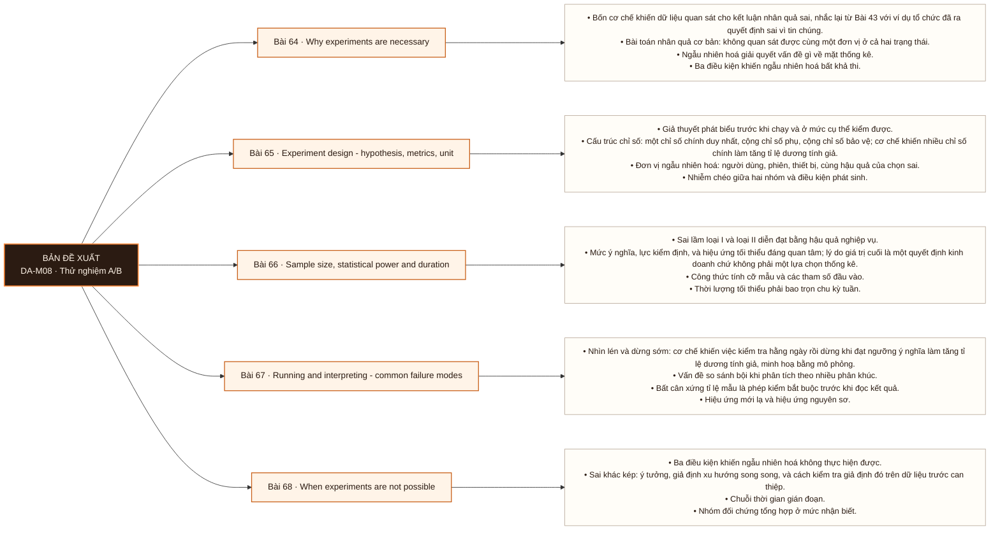

# Mô-đun 8: Thử nghiệm A/B

Năm bài, ngắn nhất trong chương trình sau M11, nhưng là module duy nhất dạy suy luận nhân quả. Trọng tâm không phải chạy kiểm định: phần đó đã có ở Bài 42: mà là thiết kế trước khi chạy và nhận diện chế độ hỏng sau khi chạy. Bài 66 ở tầng đánh giá vì kết luận quan trọng nhất của nó là quyết định không chạy.

## Điều kiện đầu vào

| Mã | Người học có thể | Bằng chứng được chấp nhận |
|---|---|---|
| EN-08-01 | M05 | Bằng chứng hoàn thành điều kiện được nêu trong cột trước |

Nếu chưa có bằng chứng đầu vào, người học phải hoàn thành lại bài hoặc mô-đun được dẫn chiếu trước khi thực hiện phép đánh giá của mô-đun này.

## Đầu ra mô-đun

Viết một tài liệu thiết kế thí nghiệm đầy đủ và kết luận đúng từ kết quả, gồm cả kết luận rằng thí nghiệm không kết luận được

## Tiêu chí hoàn thành

| Mã | Bằng chứng bắt buộc | Ngưỡng đạt | Lỗi loại trực tiếp |
|---|---|---|---|
| EC-08-01 | Nộp tài liệu thiết kế cho ba tình huống, có tính cỡ mẫu, và kết luận đúng rằng ít nhất một trong ba không đủ lực để chạy | Chọn đúng phương pháp cho ≥ 3/4 tình huống kèm giả định, và phân tích sai khác kép có phần kiểm xu hướng song song trên dữ liệu trước can thiệp. | Chạy thí nghiệm rồi mới tính cỡ mẫu, nên thí nghiệm không đủ lực nhưng vẫn được diễn giải như thể có kết luận |

## Khái niệm và nguyên tắc bất biến

| Mã khái niệm | Ranh giới định nghĩa | Nguyên tắc bất biến hoặc quy tắc quyết định | Bài chính |
|---|---|---|---|
| C08-064 | Bốn cơ chế khiến dữ liệu quan sát cho kết luận nhân quả sai, nhắc lại từ Bài 43 với ví dụ tổ chức đã ra quyết định sai vì tin chúng. | Bài toán nhân quả cơ bản: không quan sát được cùng một đơn vị ở cả hai trạng thái. | L064 |
| C08-065 | Giả thuyết phát biểu trước khi chạy và ở mức cụ thể kiểm được. | Cấu trúc chỉ số: một chỉ số chính duy nhất, cộng chỉ số phụ, cộng chỉ số bảo vệ; cơ chế khiến nhiều chỉ số chính làm tăng tỉ lệ dương tính giả. | L065 |
| C08-066 | Sai lầm loại I và loại II diễn đạt bằng hậu quả nghiệp vụ. | Mức ý nghĩa, lực kiểm định, và hiệu ứng tối thiểu đáng quan tâm; lý do giá trị cuối là một quyết định kinh doanh chứ không phải một lựa chọn thống kê. | L066 |
| C08-067 | Nhìn lén và dừng sớm: cơ chế khiến việc kiểm tra hằng ngày rồi dừng khi đạt ngưỡng ý nghĩa làm tăng tỉ lệ dương tính giả, minh hoạ bằng mô phỏng. | Vấn đề so sánh bội khi phân tích theo nhiều phân khúc. | L067 |
| C08-068 | Ba điều kiện khiến ngẫu nhiên hoá không thực hiện được. | Sai khác kép: ý tưởng, giả định xu hướng song song, và cách kiểm tra giả định đó trên dữ liệu trước can thiệp. | L068 |

## Các bài trong mô-đun

| Bài | Dạng | Đầu ra | Bằng chứng | Điều kiện tiên quyết |
|---|---|---|---|---|
| L064 · [[wiki.da.why-experiments-are-necessary|Why experiments are necessary]]| LT | Định vị chỗ sai trong một kết luận nhân quả rút ra từ dữ liệu quan sát, và đề xuất thiết kế thí nghiệm thay thế. | Chỉ đúng chỗ sai của cả 4 tình huống, và mỗi tình huống có một thiết kế thay thế khả thi về vận hành. | M08: M05 |
| L065 · [[wiki.da.experiment-design-hypothesis-metrics-unit|Experiment design - hypothesis, metrics, unit]]| TH | Viết phần thiết kế của một tài liệu thí nghiệm: giả thuyết, cấu trúc chỉ số, đơn vị ngẫu nhiên hoá, và đánh giá nguy cơ nhiễm chéo. | Ba tài liệu thiết kế đủ bốn thành phần, và tình huống có nguy cơ nhiễm chéo được xác định đúng kèm cách xử lý. | L064 |
| L066 · [[wiki.da.sample-size-statistical-power-and-duration|Sample size, statistical power and duration]]| TH | Tính cỡ mẫu cho một thiết kế và kết luận thí nghiệm có khả thi hay không trước khi chạy. | Cỡ mẫu tính đúng cho cả ba thiết kế, và thiết kế không đủ lực được xác định đúng kèm lý do định lượng. Đây là exit criterion của Mô-đun 8. | L065 |
| L067 · [[wiki.da.running-and-interpreting-common-failure-modes|Running and interpreting - common failure modes]]| TH | Đọc một báo cáo thí nghiệm và định vị lỗi thiết kế hoặc lỗi phân tích trong đó trước khi chấp nhận kết luận. | Gọi đúng tên lỗi của cả ba báo cáo có lỗi thiết kế, và nhận đúng trường hợp không kết luận được. | L066 |
| L068 · [[wiki.da.when-experiments-are-not-possible|When experiments are not possible]]| LT | Chọn phương pháp suy luận cho một tình huống không thí nghiệm được, nêu giả định của phương pháp, và kiểm giả định đó trên dữ liệu. | Chọn đúng phương pháp cho ≥ 3/4 tình huống kèm giả định, và phân tích sai khác kép có phần kiểm xu hướng song song trên dữ liệu trước can thiệp. | L067 |

## Nội dung từng bài

> **Sơ đồ đề xuất: DA-M08 v0.1.0.** Mỗi nhánh đi từ một bài học đến các nội dung nguyên tử bắt buộc. Thứ tự dạy lấy từ bảng `Các bài trong mô-đun`.

### Lesson 64: Why experiments are necessary

Bốn cơ chế khiến dữ liệu quan sát cho kết luận nhân quả sai, nhắc lại từ Bài 43 với ví dụ tổ chức đã ra quyết định sai vì tin chúng. Bài toán nhân quả cơ bản: không quan sát được cùng một đơn vị ở cả hai trạng thái. Ngẫu nhiên hoá giải quyết vấn đề gì về mặt thống kê. Ba điều kiện khiến ngẫu nhiên hoá bất khả thi.

Người học phải định vị chỗ sai trong một kết luận nhân quả rút ra từ dữ liệu quan sát, và đề xuất thiết kế thí nghiệm thay thế. Bằng chứng thực hành: Bốn tình huống có kết luận nhân quả rút từ dữ liệu quan sát. Chỉ ra chỗ suy luận sai và đề xuất thí nghiệm thay thế. Bài hoàn tất khi chỉ đúng chỗ sai của cả 4 tình huống, và mỗi tình huống có một thiết kế thay thế khả thi về vận hành.

Cách đánh giá: Tầng *phân tích*. Kiểm bằng bốn tình huống: chỉ ra chỗ suy luận sai và đề xuất thí nghiệm thay thế cho từng tình huống. Phần đề xuất bắt buộc, vì chỉ ra lỗi mà không đưa được phương án thay thế chưa đủ để dùng trong công việc.

### Lesson 65: Experiment design - hypothesis, metrics, unit

Giả thuyết phát biểu trước khi chạy và ở mức cụ thể kiểm được. Cấu trúc chỉ số: một chỉ số chính duy nhất, cộng chỉ số phụ, cộng chỉ số bảo vệ; cơ chế khiến nhiều chỉ số chính làm tăng tỉ lệ dương tính giả. Đơn vị ngẫu nhiên hoá: người dùng, phiên, thiết bị, cùng hậu quả của chọn sai. Nhiễm chéo giữa hai nhóm và điều kiện phát sinh. A/A test để kiểm tra cơ chế ngẫu nhiên hoá.

Người học phải viết phần thiết kế của một tài liệu thí nghiệm: giả thuyết, cấu trúc chỉ số, đơn vị ngẫu nhiên hoá, và đánh giá nguy cơ nhiễm chéo. Bằng chứng thực hành: Viết ba thiết kế cho ba tình huống sản phẩm khác nhau. Xác định tình huống nào có nguy cơ nhiễm chéo và nêu cách xử lý. Bài hoàn tất khi ba tài liệu thiết kế đủ bốn thành phần, và tình huống có nguy cơ nhiễm chéo được xác định đúng kèm cách xử lý.

Cách đánh giá: Tầng *sáng tạo*. Tài liệu thiết kế là sản phẩm mới dưới ràng buộc. Kiểm bằng rà soát chéo: một học viên khác đọc tài liệu và phải chỉ ra được nguy cơ nhiễm chéo nếu người viết bỏ sót. Một trong ba tình huống có nguy cơ nhiễm chéo cài sẵn.

### Lesson 66: Sample size, statistical power and duration

Sai lầm loại I và loại II diễn đạt bằng hậu quả nghiệp vụ. Mức ý nghĩa, lực kiểm định, và hiệu ứng tối thiểu đáng quan tâm; lý do giá trị cuối là một quyết định kinh doanh chứ không phải một lựa chọn thống kê. Công thức tính cỡ mẫu và các tham số đầu vào. Thời lượng tối thiểu phải bao trọn chu kỳ tuần. Kết luận không chạy khi lưu lượng không đủ đạt cỡ mẫu trong thời gian chấp nhận được.

Người học phải tính cỡ mẫu cho một thiết kế và kết luận thí nghiệm có khả thi hay không trước khi chạy. Bằng chứng thực hành: Tính cỡ mẫu cho ba thiết kế đã viết ở Bài 65. Ít nhất một thiết kế phải bị kết luận là không đủ lực trong thời gian chấp nhận được. Bài hoàn tất khi cỡ mẫu tính đúng cho cả ba thiết kế, và thiết kế không đủ lực được xác định đúng kèm lý do định lượng. Đây là exit criterion của Mô-đun 8.

Cách đánh giá: Tầng *đánh giá*. Kết luận có giá trị nhất của bài là quyết định không chạy, nên bài kiểm được thiết kế để ít nhất một trong ba trường hợp phải bị kết luận là không đủ lực. Người học kết luận cả ba đều chạy được là không đạt, kể cả khi phép tính đúng.

### Lesson 67: Running and interpreting - common failure modes

Nhìn lén và dừng sớm: cơ chế khiến việc kiểm tra hằng ngày rồi dừng khi đạt ngưỡng ý nghĩa làm tăng tỉ lệ dương tính giả, minh hoạ bằng mô phỏng. Vấn đề so sánh bội khi phân tích theo nhiều phân khúc. Bất cân xứng tỉ lệ mẫu là phép kiểm bắt buộc trước khi đọc kết quả. Hiệu ứng mới lạ và hiệu ứng nguyên sơ. Phân biệt kết quả không đạt ngưỡng ý nghĩa với kết luận không có tác dụng.

Người học phải đọc một báo cáo thí nghiệm và định vị lỗi thiết kế hoặc lỗi phân tích trong đó trước khi chấp nhận kết luận. Bằng chứng thực hành: Phân tích năm kết quả thí nghiệm. Ba trong số đó có lỗi thiết kế, và một không kết luận được. Gọi tên lỗi của từng trường hợp. Bài hoàn tất khi gọi đúng tên lỗi của cả ba báo cáo có lỗi thiết kế, và nhận đúng trường hợp không kết luận được.

Cách đánh giá: Tầng *phân tích*. Kiểm bằng năm báo cáo kết quả, trong đó ba chứa lỗi thiết kế và một không kết luận được. Nhận ra trường hợp không kết luận được là tiêu chí phân biệt chính; báo cáo mọi trường hợp đều có kết luận là không đạt.

### Lesson 68: When experiments are not possible

Ba điều kiện khiến ngẫu nhiên hoá không thực hiện được. Sai khác kép: ý tưởng, giả định xu hướng song song, và cách kiểm tra giả định đó trên dữ liệu trước can thiệp. Chuỗi thời gian gián đoạn. Nhóm đối chứng tổng hợp ở mức nhận biết. Nguyên tắc chung: mỗi phương pháp đi kèm một tập giả định, nên phải nêu và kiểm giả định, và trình bày kết quả với mức chắc chắn thấp hơn thí nghiệm ngẫu nhiên.

Người học phải chọn phương pháp suy luận cho một tình huống không thí nghiệm được, nêu giả định của phương pháp, và kiểm giả định đó trên dữ liệu. Bằng chứng thực hành: Bốn tình huống: chọn phương pháp, nêu giả định, chỉ ra cách kiểm. Thực hiện một phân tích sai khác kép đầy đủ có kiểm giả định xu hướng song song. Bài hoàn tất khi chọn đúng phương pháp cho ≥ 3/4 tình huống kèm giả định, và phân tích sai khác kép có phần kiểm xu hướng song song trên dữ liệu trước can thiệp.

Cách đánh giá: Tầng *áp dụng*. Kiểm bằng bốn tình huống chọn phương pháp cộng một phân tích sai khác kép thực hiện đầy đủ, trong đó phần kiểm giả định xu hướng song song trên dữ liệu trước can thiệp là bắt buộc.

## Lý do sắp xếp

Mô-đun bắt đầu từ `M08: M05` và đi theo các quan hệ tiên quyết đã ghi trong bảng. Mỗi bài chỉ sử dụng khái niệm hoặc thao tác đã được giới thiệu trước đó; bài cuối L068 tích hợp đầu ra của toàn mô-đun.

## Ma trận đánh giá

| Mã đầu ra | Mức độ tư duy | Cách đánh giá | Ngưỡng đạt | Hình thức kiểm tra lại |
|---|---|---|---|---|
| L064 | Phân tích | Tầng *phân tích*. Kiểm bằng bốn tình huống: chỉ ra chỗ suy luận sai và đề xuất thí nghiệm thay thế cho từng tình huống. Phần đề xuất bắt buộc, vì chỉ ra lỗi mà không đưa được phương án thay thế chưa đủ để dùng trong công việc. | Chỉ đúng chỗ sai của cả 4 tình huống, và mỗi tình huống có một thiết kế thay thế khả thi về vận hành. | Tình huống mới, giữ nguyên đầu ra và ngưỡng |
| L065 | Sáng tạo | Tầng *sáng tạo*. Tài liệu thiết kế là sản phẩm mới dưới ràng buộc. Kiểm bằng rà soát chéo: một học viên khác đọc tài liệu và phải chỉ ra được nguy cơ nhiễm chéo nếu người viết bỏ sót. Một trong ba tình huống có nguy cơ nhiễm chéo cài sẵn. | Ba tài liệu thiết kế đủ bốn thành phần, và tình huống có nguy cơ nhiễm chéo được xác định đúng kèm cách xử lý. | Tình huống mới, giữ nguyên đầu ra và ngưỡng |
| L066 | Đánh giá | Tầng *đánh giá*. Kết luận có giá trị nhất của bài là quyết định không chạy, nên bài kiểm được thiết kế để ít nhất một trong ba trường hợp phải bị kết luận là không đủ lực. Người học kết luận cả ba đều chạy được là không đạt, kể cả khi phép tính đúng. | Cỡ mẫu tính đúng cho cả ba thiết kế, và thiết kế không đủ lực được xác định đúng kèm lý do định lượng. Đây là exit criterion của Mô-đun 8. | Tình huống mới, giữ nguyên đầu ra và ngưỡng |
| L067 | Phân tích | Tầng *phân tích*. Kiểm bằng năm báo cáo kết quả, trong đó ba chứa lỗi thiết kế và một không kết luận được. Nhận ra trường hợp không kết luận được là tiêu chí phân biệt chính; báo cáo mọi trường hợp đều có kết luận là không đạt. | Gọi đúng tên lỗi của cả ba báo cáo có lỗi thiết kế, và nhận đúng trường hợp không kết luận được. | Tình huống mới, giữ nguyên đầu ra và ngưỡng |
| L068 | Áp dụng | Tầng *áp dụng*. Kiểm bằng bốn tình huống chọn phương pháp cộng một phân tích sai khác kép thực hiện đầy đủ, trong đó phần kiểm giả định xu hướng song song trên dữ liệu trước can thiệp là bắt buộc. | Chọn đúng phương pháp cho ≥ 3/4 tình huống kèm giả định, và phân tích sai khác kép có phần kiểm xu hướng song song trên dữ liệu trước can thiệp. | Tình huống mới, giữ nguyên đầu ra và ngưỡng |

Không cộng điểm để bù cho lỗi loại trực tiếp. Người học phải sửa đúng lỗi, nộp lại bằng chứng và thực hiện kiểm tra lại trên một tình huống khác.

## Bài thực hành bắt buộc

| Bài thực hành hoặc dự án | Bài liên quan | Sản phẩm bắt buộc | Lỗi được cài vào tình huống |
|---|---|---|---|
| Why experiments are necessary | L064 | Bốn tình huống có kết luận nhân quả rút từ dữ liệu quan sát. Chỉ ra chỗ suy luận sai và đề xuất thí nghiệm thay thế. | Cho rằng kiểm soát đủ biến nhiễu là tương đương với ngẫu nhiên hoá · đề xuất thí nghiệm không khả thi về mặt vận hành · bỏ qua trường hợp ngẫu nhiên hoá vi phạm ràng buộc đạo đức hoặc pháp lý. |
| Experiment design - hypothesis, metrics, unit | L065 | Viết ba thiết kế cho ba tình huống sản phẩm khác nhau. Xác định tình huống nào có nguy cơ nhiễm chéo và nêu cách xử lý. | Khai báo nhiều chỉ số chính · chọn phiên làm đơn vị khi tác động kéo dài qua nhiều phiên · bỏ chỉ số bảo vệ nên không phát hiện tác hại ngoài chỉ số chính. |
| Sample size, statistical power and duration | L066 | Tính cỡ mẫu cho ba thiết kế đã viết ở Bài 65. Ít nhất một thiết kế phải bị kết luận là không đủ lực trong thời gian chấp nhận được. | Chọn hiệu ứng tối thiểu theo mức làm cỡ mẫu vừa đủ khả thi · bỏ qua ràng buộc chu kỳ tuần · tính cỡ mẫu sau khi thí nghiệm đã chạy. |
| Running and interpreting - common failure modes | L067 | Phân tích năm kết quả thí nghiệm. Ba trong số đó có lỗi thiết kế, và một không kết luận được. Gọi tên lỗi của từng trường hợp. | Bỏ kiểm tra bất cân xứng tỉ lệ mẫu · diễn giải kết quả không đạt ngưỡng thành không có tác dụng · phân tích theo nhiều phân khúc mà không hiệu chỉnh so sánh bội. |
| When experiments are not possible | L068 | Bốn tình huống: chọn phương pháp, nêu giả định, chỉ ra cách kiểm. Thực hiện một phân tích sai khác kép đầy đủ có kiểm giả định xu hướng song song. | Dùng sai khác kép mà không kiểm xu hướng song song · trình bày kết quả phương pháp quan sát với mức chắc chắn ngang thí nghiệm · chọn nhóm đối chứng bị ảnh hưởng gián tiếp bởi can thiệp. |

## Ngộ nhận và lỗi loại trực tiếp

| Lỗi | Hệ quả | Nơi phát hiện | Cách khắc phục |
|---|---|---|---|
| Cho rằng kiểm soát đủ biến nhiễu là tương đương với ngẫu nhiên hoá · đề xuất thí nghiệm không khả thi về mặt vận hành · bỏ qua trường hợp ngẫu nhiên hoá vi phạm ràng buộc đạo đức hoặc pháp lý. | Không tạo được bằng chứng hợp lệ cho đầu ra L064 | L064 | Làm lại phép đánh giá trên tình huống mới và đạt tiêu chí `Done when` |
| Khai báo nhiều chỉ số chính · chọn phiên làm đơn vị khi tác động kéo dài qua nhiều phiên · bỏ chỉ số bảo vệ nên không phát hiện tác hại ngoài chỉ số chính. | Không tạo được bằng chứng hợp lệ cho đầu ra L065 | L065 | Làm lại phép đánh giá trên tình huống mới và đạt tiêu chí `Done when` |
| Chọn hiệu ứng tối thiểu theo mức làm cỡ mẫu vừa đủ khả thi · bỏ qua ràng buộc chu kỳ tuần · tính cỡ mẫu sau khi thí nghiệm đã chạy. | Không tạo được bằng chứng hợp lệ cho đầu ra L066 | L066 | Làm lại phép đánh giá trên tình huống mới và đạt tiêu chí `Done when` |
| Bỏ kiểm tra bất cân xứng tỉ lệ mẫu · diễn giải kết quả không đạt ngưỡng thành không có tác dụng · phân tích theo nhiều phân khúc mà không hiệu chỉnh so sánh bội. | Không tạo được bằng chứng hợp lệ cho đầu ra L067 | L067 | Làm lại phép đánh giá trên tình huống mới và đạt tiêu chí `Done when` |
| Dùng sai khác kép mà không kiểm xu hướng song song · trình bày kết quả phương pháp quan sát với mức chắc chắn ngang thí nghiệm · chọn nhóm đối chứng bị ảnh hưởng gián tiếp bởi can thiệp. | Không tạo được bằng chứng hợp lệ cho đầu ra L068 | L068 | Làm lại phép đánh giá trên tình huống mới và đạt tiêu chí `Done when` |

## Điểm nối với mô-đun khác

| Kế thừa từ | Cung cấp cho mô-đun sau | Cam kết đầu ra |
|---|---|---|
| M05 | M05 | Viết một tài liệu thiết kế thí nghiệm đầy đủ và kết luận đúng từ kết quả, gồm cả kết luận rằng thí nghiệm không kết luận được |

## Tài liệu tham khảo

| Mã | Nguồn | Vị trí | Dùng cho |
|---|---|---|---|
| R08-01 | Roadmap Data Analyst nguồn | `Material/DA/Reference/Library/roadmap-v1-goc.md` | Phạm vi chương trình và thứ tự bài học |
| R08-02 | Manifest nguồn cấp bài | `Material/DA/Reference/.../Lesson_*/sources.yaml` | Truy vết nguồn khi manifest được điền |

## Đối chiếu năng lực

| Khung hoặc mã năng lực | Phạm vi sử dụng | Bằng chứng |
|---|---|---|
| `DAAN` mức 3, chạm 4 | Đầu ra và phép đánh giá của mô-đun | EC-08-01 và ma trận đánh giá theo bài |

Ánh xạ này mô tả phạm vi được thực hành; nó không tự động chứng nhận cấp độ của người học trong khung năng lực.

## Giới hạn của mô-đun

- Roadmap xác định phạm vi, bằng chứng và cách đánh giá; nội dung giảng giải đầy đủ thuộc `note.md`.
- Manifest nguồn cấp bài hiện chưa có dữ liệu. Không được dùng tên tệp trong `Reference/Library` làm bằng chứng cho một khẳng định.
- Hoàn thành mô-đun chỉ chứng minh các đầu ra được nêu trong tài liệu này; không tự động chứng nhận chức danh hoặc kinh nghiệm làm việc.
