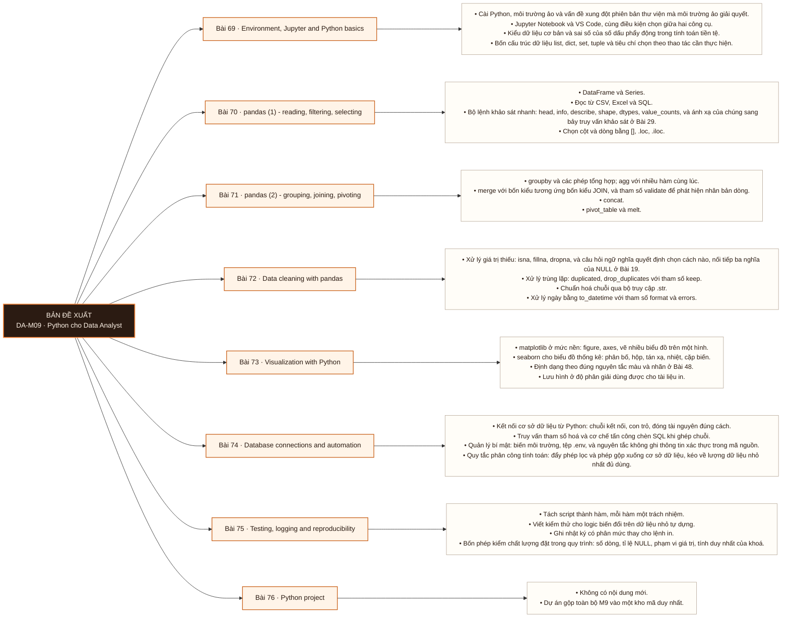

# Mô-đun 9: Python cho Data Analyst

Tám bài nén Python vào phần cuối chương trình. Trình tự bám một nguyên tắc: mọi thao tác pandas đều được giới thiệu bằng cách đối chiếu với truy vấn SQL tương ứng đã học ở M3. Bài 75 và 76 chuyển trọng tâm từ viết mã sang khả năng tái lập, và đó là phần phân biệt module này với một khoá Python nhập môn.

## Điều kiện đầu vào

| Mã | Người học có thể | Bằng chứng được chấp nhận |
|---|---|---|
| EN-09-01 | M03 | Bằng chứng hoàn thành điều kiện được nêu trong cột trước |

Nếu chưa có bằng chứng đầu vào, người học phải hoàn thành lại bài hoặc mô-đun được dẫn chiếu trước khi thực hiện phép đánh giá của mô-đun này.

## Đầu ra mô-đun

Đóng gói một quy trình phân tích thành kho mã mà người thứ hai chạy lại được bằng một lệnh và cho ra kết quả giống hệt

## Tiêu chí hoàn thành

| Mã | Bằng chứng bắt buộc | Ngưỡng đạt | Lỗi loại trực tiếp |
|---|---|---|---|
| EC-09-01 | Hoán đổi kho mã với một học viên khác; người đó chạy lại thành công không đặt câu hỏi nào | Một học viên khác chạy lại kho mã thành công bằng một lệnh, cho ra kết quả giống hệt, và không đặt câu hỏi nào. Đây là exit criterion của Mô-đun 9. | Học pandas như tập hợp cú pháp rời rạc mà không đối chiếu với SQL đã biết, nên kéo toàn bộ dữ liệu về máy thay vì đẩy phép gộp xuống cơ sở dữ liệu |

## Khái niệm và nguyên tắc bất biến

| Mã khái niệm | Ranh giới định nghĩa | Nguyên tắc bất biến hoặc quy tắc quyết định | Bài chính |
|---|---|---|---|
| C09-069 | Cài Python, môi trường ảo và vấn đề xung đột phiên bản thư viện mà môi trường ảo giải quyết. | Jupyter Notebook và VS Code, cùng điều kiện chọn giữa hai công cụ. | L069 |
| C09-070 | DataFrame và Series. | Đọc từ CSV, Excel và SQL. | L070 |
| C09-071 | groupby và các phép tổng hợp; agg với nhiều hàm cùng lúc. | merge với bốn kiểu tương ứng bốn kiểu JOIN, và tham số validate để phát hiện nhân bản dòng. | L071 |
| C09-072 | Xử lý giá trị thiếu: isna, fillna, dropna, và câu hỏi ngữ nghĩa quyết định chọn cách nào, nối tiếp ba nghĩa của NULL ở Bài 19. | Xử lý trùng lặp: duplicated, drop_duplicates với tham số keep. | L072 |
| C09-073 | matplotlib ở mức nền: figure, axes, vẽ nhiều biểu đồ trên một hình. | seaborn cho biểu đồ thống kê: phân bố, hộp, tán xạ, nhiệt, cặp biến. | L073 |
| C09-074 | Kết nối cơ sở dữ liệu từ Python: chuỗi kết nối, con trỏ, đóng tài nguyên đúng cách. | Truy vấn tham số hoá và cơ chế tấn công chèn SQL khi ghép chuỗi. | L074 |
| C09-075 | Tách script thành hàm, mỗi hàm một trách nhiệm. | Viết kiểm thử cho logic biến đổi trên dữ liệu nhỏ tự dựng. | L075 |
| C09-076 | Không có nội dung mới. | Dự án gộp toàn bộ M9 vào một kho mã duy nhất. | L076 |

## Các bài trong mô-đun

| Bài | Dạng | Đầu ra | Bằng chứng | Điều kiện tiên quyết |
|---|---|---|---|---|
| L069 · [[wiki.da.environment-jupyter-and-python-basics|Environment, Jupyter and Python basics]]| TH | Viết script Python đọc một tệp dữ liệu và tính các chỉ số cơ bản, cho kết quả khớp với kết quả tính bằng SQL trên cùng dữ liệu. | Script chạy được trong môi trường ảo, và kết quả khớp với truy vấn SQL tương ứng trên cùng dữ liệu. | M09: M03 |
| L070 · [[wiki.da.pandas-1-reading-filtering-selecting|pandas (1) - reading, filtering, selecting]]| TH | Nạp một bộ dữ liệu chưa từng thấy và hoàn thành khảo sát cấu trúc trong 10 phút, trả lời được câu hỏi về hạt và chất lượng. | Trả lời đúng ≥ 8/10 câu hỏi khám phá trên `DS2` trong 10 phút, có tính giờ. | L069 |
| L071 · [[wiki.da.pandas-2-grouping-joining-pivoting|pandas (2) - grouping, joining, pivoting]]| TH | Thực hiện bằng pandas mọi phép biến đổi đã làm được bằng SQL, và nêu tiêu chí quyết định phép nào nên chạy ở cơ sở dữ liệu. | Cả 10 kết quả khớp từng dòng với truy vấn SQL, và bảng so thời gian chạy được nộp kèm kết luận về nơi nên chạy phép gộp. | L070 |
| L072 · [[wiki.da.data-cleaning-with-pandas|Data cleaning with pandas]]| TH | Viết một quy trình làm sạch cho ra kết quả giống hệt ở mỗi lần chạy, và khớp từng dòng với kết quả làm bằng SQL. | Hai lần chạy cho kết quả giống hệt, và kết quả khớp từng dòng với bản làm bằng SQL ở Bài 36. | L071 · L036 |
| L073 · [[wiki.da.visualization-with-python|Visualization with Python]]| TH | Dựng một bộ biểu đồ khảo sát cho bộ dữ liệu chưa từng xem trong 30 phút, đạt kiểm tra màu và nhãn bằng công cụ. | Nộp 8 biểu đồ trong 30 phút, và cả 8 qua được kiểm tra mù màu và ngưỡng tương phản. | L072 · L048 |
| L074 · [[wiki.da.database-connections-and-automation|Database connections and automation]]| TH | Viết script kéo dữ liệu, biến đổi và xuất báo cáo, chạy được bằng một lệnh trên máy chưa cấu hình sẵn. | Script chạy bằng một lệnh và xuất đúng tệp Excel 4 sheet, và quét mã không tìm thấy thông tin xác thực nào. | L073 |
| L075 · [[wiki.da.testing-logging-and-reproducibility|Testing, logging and reproducibility]]| TH | Bổ sung kiểm thử và kiểm tra chất lượng cho một quy trình sao cho nó phát hiện được lỗi dữ liệu đầu vào thay vì chạy tiếp và cho kết quả sai. | Quy trình bắt được ≥ 4/5 loại lỗi tiêm vào, và kho mã không chứa tệp dữ liệu hay thông tin xác thực. | L074 |
| L076 · [[wiki.da.python-project|Python project]]| DA | Đóng gói một quy trình phân tích thành kho mã mà một người chưa từng thấy nó chạy lại được bằng một lệnh và cho ra kết quả giống hệt. | Một học viên khác chạy lại kho mã thành công bằng một lệnh, cho ra kết quả giống hệt, và không đặt câu hỏi nào. Đây là exit criterion của Mô-đun 9. | L075 |

## Nội dung từng bài

> **Sơ đồ đề xuất: DA-M09 v0.1.0.** Mỗi nhánh đi từ một bài học đến các nội dung nguyên tử bắt buộc. Thứ tự dạy lấy từ bảng `Các bài trong mô-đun`.

### Lesson 69: Environment, Jupyter and Python basics

Cài Python, môi trường ảo và vấn đề xung đột phiên bản thư viện mà môi trường ảo giải quyết. Jupyter Notebook và VS Code, cùng điều kiện chọn giữa hai công cụ. Kiểu dữ liệu cơ bản và sai số của số dấu phẩy động trong tính toán tiền tệ. Bốn cấu trúc dữ liệu `list`, `dict`, `set`, `tuple` và tiêu chí chọn theo thao tác cần thực hiện. Điều kiện, vòng lặp, hiểu danh sách. Hàm.

Người học phải viết script Python đọc một tệp dữ liệu và tính các chỉ số cơ bản, cho kết quả khớp với kết quả tính bằng SQL trên cùng dữ liệu. Bằng chứng thực hành: Đọc `orders.csv` bằng thư viện chuẩn `csv`. Đếm bản ghi theo trạng thái. Tìm bản ghi có giá trị bất thường. Đối chiếu kết quả với truy vấn SQL tương ứng. Bài hoàn tất khi script chạy được trong môi trường ảo, và kết quả khớp với truy vấn SQL tương ứng trên cùng dữ liệu.

Cách đánh giá: Tầng *áp dụng*. Kiểm bằng đối chiếu chéo công cụ ngay từ bài đầu module, để thiết lập thói quen áp dụng suốt M9. Script dùng thư viện chuẩn, chưa dùng pandas, nên bài đo được năng lực lập trình tách khỏi năng lực dùng thư viện.

### Lesson 70: pandas (1) - reading, filtering, selecting

`DataFrame` và `Series`. Đọc từ CSV, Excel và SQL. Bộ lệnh khảo sát nhanh: `head`, `info`, `describe`, `shape`, `dtypes`, `value_counts`, và ánh xạ của chúng sang bảy truy vấn khảo sát ở Bài 29. Chọn cột và dòng bằng `[]`, `.loc`, `.iloc`. Lọc theo một và nhiều điều kiện. Sắp xếp. Đổi tên cột và đổi kiểu dữ liệu.

Người học phải nạp một bộ dữ liệu chưa từng thấy và hoàn thành khảo sát cấu trúc trong 10 phút, trả lời được câu hỏi về hạt và chất lượng. Bằng chứng thực hành: Nạp `DS2` gồm 2,2 triệu dòng. Khảo sát cấu trúc và trả lời 10 câu hỏi khám phá cơ bản trong giới hạn thời gian. Bài hoàn tất khi trả lời đúng ≥ 8/10 câu hỏi khám phá trên `DS2` trong 10 phút, có tính giờ.

Cách đánh giá: Tầng *áp dụng*. Có ràng buộc thời gian vì mục tiêu là khảo sát thành thục, tương đương Bài 29 nhưng bằng công cụ khác. Kiểm bằng 10 câu hỏi khám phá có tính giờ; đạt khi ≥ 8/10 đúng trong 10 phút.

### Lesson 71: pandas (2) - grouping, joining, pivoting

`groupby` và các phép tổng hợp; `agg` với nhiều hàm cùng lúc. `merge` với bốn kiểu tương ứng bốn kiểu `JOIN`, và tham số `validate` để phát hiện nhân bản dòng. `concat`. `pivot_table` và `melt`. `sort_values` và `nlargest`. Mỗi thao tác được giới thiệu kèm truy vấn SQL tương đương từ Bài 22 tới 24.

Người học phải thực hiện bằng pandas mọi phép biến đổi đã làm được bằng SQL, và nêu tiêu chí quyết định phép nào nên chạy ở cơ sở dữ liệu. Bằng chứng thực hành: Làm lại 10 truy vấn SQL từ Bài 22-24 bằng pandas. So kết quả từng dòng. Đo và so thời gian chạy của hai cách. Bài hoàn tất khi cả 10 kết quả khớp từng dòng với truy vấn SQL, và bảng so thời gian chạy được nộp kèm kết luận về nơi nên chạy phép gộp.

Cách đánh giá: Tầng *áp dụng*. Kiểm bằng hai số đo: kết quả khớp từng dòng với truy vấn SQL gốc, và thời gian chạy của cả hai cách. Số đo thứ hai cung cấp bằng chứng cho tiêu chí quyết định nơi chạy phép gộp, thay vì để người học kết luận theo cảm tính.

### Lesson 72: Data cleaning with pandas

Xử lý giá trị thiếu: `isna`, `fillna`, `dropna`, và câu hỏi ngữ nghĩa quyết định chọn cách nào, nối tiếp ba nghĩa của `NULL` ở Bài 19. Xử lý trùng lặp: `duplicated`, `drop_duplicates` với tham số `keep`. Chuẩn hoá chuỗi qua bộ truy cập `.str`. Xử lý ngày bằng `to_datetime` với tham số `format` và `errors`. Ép kiểu có kiểm soát. Phát hiện giá trị ngoại lai.

Người học phải viết một quy trình làm sạch cho ra kết quả giống hệt ở mỗi lần chạy, và khớp từng dòng với kết quả làm bằng SQL. Bằng chứng thực hành: Làm sạch `orders_dirty.csv` bằng pandas. Kết quả phải khớp từng dòng với bản làm bằng SQL ở Bài 36, và hai lần chạy phải cho kết quả giống hệt. Bài hoàn tất khi hai lần chạy cho kết quả giống hệt, và kết quả khớp từng dòng với bản làm bằng SQL ở Bài 36.

Cách đánh giá: Tầng *áp dụng*. Kiểm bằng hai điều kiện: chạy hai lần cho kết quả giống hệt, và khớp từng dòng với bản làm bằng SQL ở Bài 36. Điều kiện thứ nhất bắt được lỗi khử trùng không xác định thứ tự, loại lỗi không hiện ra nếu chỉ chạy một lần.

### Lesson 73: Visualization with Python

`matplotlib` ở mức nền: figure, axes, vẽ nhiều biểu đồ trên một hình. `seaborn` cho biểu đồ thống kê: phân bố, hộp, tán xạ, nhiệt, cặp biến. Định dạng theo đúng nguyên tắc màu và nhãn ở Bài 48. Lưu hình ở độ phân giải dùng được cho tài liệu in. Ba điều kiện chọn Python thay vì Power BI: khảo sát nhanh, biểu đồ thống kê không có sẵn trong công cụ BI, báo cáo chạy lặp theo lịch.

Người học phải dựng một bộ biểu đồ khảo sát cho bộ dữ liệu chưa từng xem trong 30 phút, đạt kiểm tra màu và nhãn bằng công cụ. Bằng chứng thực hành: Dựng 8 biểu đồ khảo sát cho `DS3`, áp đúng nguyên tắc màu và nhãn của Bài 48. Kiểm bằng công cụ. Bài hoàn tất khi nộp 8 biểu đồ trong 30 phút, và cả 8 qua được kiểm tra mù màu và ngưỡng tương phản.

Cách đánh giá: Tầng *áp dụng*. Kiểm bằng hai tiêu chí đo được: hoàn thành trong giới hạn thời gian, và toàn bộ 8 biểu đồ qua được bộ lọc mù màu cùng ngưỡng tương phản của Bài 48. Nguyên tắc thiết kế đã kiểm ở M6 nên bài này chỉ kiểm việc áp dụng nhất quán.

### Lesson 74: Database connections and automation

Kết nối cơ sở dữ liệu từ Python: chuỗi kết nối, con trỏ, đóng tài nguyên đúng cách. Truy vấn tham số hoá và cơ chế tấn công chèn SQL khi ghép chuỗi. Quản lý bí mật: biến môi trường, tệp `.env`, và nguyên tắc không ghi thông tin xác thực trong mã nguồn. Quy tắc phân công tính toán: đẩy phép lọc và phép gộp xuống cơ sở dữ liệu, kéo về lượng dữ liệu nhỏ nhất đủ dùng. Xuất kết quả ra tệp Excel nhiều sheet.

Người học phải viết script kéo dữ liệu, biến đổi và xuất báo cáo, chạy được bằng một lệnh trên máy chưa cấu hình sẵn. Bằng chứng thực hành: Viết script tự động: kết nối `DS2`, tính bộ chỉ số tháng, xuất tệp Excel có 4 sheet kèm biểu đồ. Chạy bằng một lệnh. Bài hoàn tất khi script chạy bằng một lệnh và xuất đúng tệp Excel 4 sheet, và quét mã không tìm thấy thông tin xác thực nào.

Cách đánh giá: Tầng *áp dụng*. Kiểm bằng phép thử vận hành: script chạy được bằng một lệnh sau khi đặt biến môi trường, và không chứa thông tin xác thực trong mã. Điều kiện thứ hai kiểm bằng quét mã, không bằng tự khai báo.

### Lesson 75: Testing, logging and reproducibility

Tách script thành hàm, mỗi hàm một trách nhiệm. Viết kiểm thử cho logic biến đổi trên dữ liệu nhỏ tự dựng. Ghi nhật ký có phân mức thay cho lệnh in. Bốn phép kiểm chất lượng đặt trong quy trình: số dòng, tỉ lệ `NULL`, phạm vi giá trị, tính duy nhất của khoá. Tệp cấu hình thay cho giá trị viết cứng. Git ở mức commit, branch, `.gitignore`, và nguyên tắc không đưa dữ liệu và thông tin xác thực vào kho mã.

Người học phải bổ sung kiểm thử và kiểm tra chất lượng cho một quy trình sao cho nó phát hiện được lỗi dữ liệu đầu vào thay vì chạy tiếp và cho kết quả sai. Bằng chứng thực hành: Bổ sung kiểm thử, nhật ký và bốn phép kiểm chất lượng cho script ở Bài 74. Giảng viên tiêm 5 loại lỗi vào dữ liệu đầu vào; quy trình phải bắt được ≥ 4/5. Bài hoàn tất khi quy trình bắt được ≥ 4/5 loại lỗi tiêm vào, và kho mã không chứa tệp dữ liệu hay thông tin xác thực.

Cách đánh giá: Tầng *áp dụng*. Kiểm bằng phép thử tiêm lỗi: giảng viên đưa năm loại lỗi vào dữ liệu đầu vào, quy trình phải bắt được ít nhất bốn. Hình thức này đo khả năng phát hiện lỗi chưa biết trước, không đo số lượng kiểm thử đã viết.

### Lesson 76: Python project

Không có nội dung mới. Dự án gộp toàn bộ M9 vào một kho mã duy nhất.

Người học phải đóng gói một quy trình phân tích thành kho mã mà một người chưa từng thấy nó chạy lại được bằng một lệnh và cho ra kết quả giống hệt. Bằng chứng thực hành: Nhận một bài toán phân tích kèm yêu cầu tự động hoá. Nộp kho mã gồm: README đủ để người lạ chạy lại, script chạy bằng một lệnh, kiểm thử, nhật ký, và kết quả xuất ra. Hoán đổi kho mã với một học viên khác. Bài hoàn tất khi một học viên khác chạy lại kho mã thành công bằng một lệnh, cho ra kết quả giống hệt, và không đặt câu hỏi nào. Đây là exit criterion của Mô-đun 9.

Cách đánh giá: Tầng *sáng tạo*. Tiêu chí đạt là một phép thử vận hành duy nhất, không phải rubric nhiều mục: người nhận kho mã chạy lại thành công mà không đặt câu hỏi nào. Mỗi câu hỏi họ buộc phải hỏi là một khuyết điểm của tài liệu hoặc của mã.

## Lý do sắp xếp

Mô-đun bắt đầu từ `M09: M03` và đi theo các quan hệ tiên quyết đã ghi trong bảng. Mỗi bài chỉ sử dụng khái niệm hoặc thao tác đã được giới thiệu trước đó; bài cuối L076 tích hợp đầu ra của toàn mô-đun.

## Ma trận đánh giá

| Mã đầu ra | Mức độ tư duy | Cách đánh giá | Ngưỡng đạt | Hình thức kiểm tra lại |
|---|---|---|---|---|
| L069 | Áp dụng | Tầng *áp dụng*. Kiểm bằng đối chiếu chéo công cụ ngay từ bài đầu module, để thiết lập thói quen áp dụng suốt M9. Script dùng thư viện chuẩn, chưa dùng pandas, nên bài đo được năng lực lập trình tách khỏi năng lực dùng thư viện. | Script chạy được trong môi trường ảo, và kết quả khớp với truy vấn SQL tương ứng trên cùng dữ liệu. | Tình huống mới, giữ nguyên đầu ra và ngưỡng |
| L070 | Áp dụng | Tầng *áp dụng*. Có ràng buộc thời gian vì mục tiêu là khảo sát thành thục, tương đương Bài 29 nhưng bằng công cụ khác. Kiểm bằng 10 câu hỏi khám phá có tính giờ; đạt khi ≥ 8/10 đúng trong 10 phút. | Trả lời đúng ≥ 8/10 câu hỏi khám phá trên `DS2` trong 10 phút, có tính giờ. | Tình huống mới, giữ nguyên đầu ra và ngưỡng |
| L071 | Áp dụng | Tầng *áp dụng*. Kiểm bằng hai số đo: kết quả khớp từng dòng với truy vấn SQL gốc, và thời gian chạy của cả hai cách. Số đo thứ hai cung cấp bằng chứng cho tiêu chí quyết định nơi chạy phép gộp, thay vì để người học kết luận theo cảm tính. | Cả 10 kết quả khớp từng dòng với truy vấn SQL, và bảng so thời gian chạy được nộp kèm kết luận về nơi nên chạy phép gộp. | Tình huống mới, giữ nguyên đầu ra và ngưỡng |
| L072 | Áp dụng | Tầng *áp dụng*. Kiểm bằng hai điều kiện: chạy hai lần cho kết quả giống hệt, và khớp từng dòng với bản làm bằng SQL ở Bài 36. Điều kiện thứ nhất bắt được lỗi khử trùng không xác định thứ tự, loại lỗi không hiện ra nếu chỉ chạy một lần. | Hai lần chạy cho kết quả giống hệt, và kết quả khớp từng dòng với bản làm bằng SQL ở Bài 36. | Tình huống mới, giữ nguyên đầu ra và ngưỡng |
| L073 | Áp dụng | Tầng *áp dụng*. Kiểm bằng hai tiêu chí đo được: hoàn thành trong giới hạn thời gian, và toàn bộ 8 biểu đồ qua được bộ lọc mù màu cùng ngưỡng tương phản của Bài 48. Nguyên tắc thiết kế đã kiểm ở M6 nên bài này chỉ kiểm việc áp dụng nhất quán. | Nộp 8 biểu đồ trong 30 phút, và cả 8 qua được kiểm tra mù màu và ngưỡng tương phản. | Tình huống mới, giữ nguyên đầu ra và ngưỡng |
| L074 | Áp dụng | Tầng *áp dụng*. Kiểm bằng phép thử vận hành: script chạy được bằng một lệnh sau khi đặt biến môi trường, và không chứa thông tin xác thực trong mã. Điều kiện thứ hai kiểm bằng quét mã, không bằng tự khai báo. | Script chạy bằng một lệnh và xuất đúng tệp Excel 4 sheet, và quét mã không tìm thấy thông tin xác thực nào. | Tình huống mới, giữ nguyên đầu ra và ngưỡng |
| L075 | Áp dụng | Tầng *áp dụng*. Kiểm bằng phép thử tiêm lỗi: giảng viên đưa năm loại lỗi vào dữ liệu đầu vào, quy trình phải bắt được ít nhất bốn. Hình thức này đo khả năng phát hiện lỗi chưa biết trước, không đo số lượng kiểm thử đã viết. | Quy trình bắt được ≥ 4/5 loại lỗi tiêm vào, và kho mã không chứa tệp dữ liệu hay thông tin xác thực. | Tình huống mới, giữ nguyên đầu ra và ngưỡng |
| L076 | Sáng tạo | Tầng *sáng tạo*. Tiêu chí đạt là một phép thử vận hành duy nhất, không phải rubric nhiều mục: người nhận kho mã chạy lại thành công mà không đặt câu hỏi nào. Mỗi câu hỏi họ buộc phải hỏi là một khuyết điểm của tài liệu hoặc của mã. | Một học viên khác chạy lại kho mã thành công bằng một lệnh, cho ra kết quả giống hệt, và không đặt câu hỏi nào. Đây là exit criterion của Mô-đun 9. | Tình huống mới, giữ nguyên đầu ra và ngưỡng |

Không cộng điểm để bù cho lỗi loại trực tiếp. Người học phải sửa đúng lỗi, nộp lại bằng chứng và thực hiện kiểm tra lại trên một tình huống khác.

## Bài thực hành bắt buộc

| Bài thực hành hoặc dự án | Bài liên quan | Sản phẩm bắt buộc | Lỗi được cài vào tình huống |
|---|---|---|---|
| Environment, Jupyter and Python basics | L069 | Đọc `orders.csv` bằng thư viện chuẩn `csv`. Đếm bản ghi theo trạng thái. Tìm bản ghi có giá trị bất thường. Đối chiếu kết quả với truy vấn SQL tương ứng. | Dùng `float` cho giá trị tiền tệ · cài thư viện vào môi trường toàn cục · so sánh chuỗi mà không chuẩn hoá khoảng trắng. |
| pandas (1) - reading, filtering, selecting | L070 | Nạp `DS2` gồm 2,2 triệu dòng. Khảo sát cấu trúc và trả lời 10 câu hỏi khám phá cơ bản trong giới hạn thời gian. | Dùng `[]` chuỗi liên tiếp rồi gán giá trị vào bản sao thay vì bản gốc · nhầm `.loc` với `.iloc` khi chỉ mục không liên tục · nạp toàn bộ tệp lớn khi chỉ cần một phần cột. |
| pandas (2) - grouping, joining, pivoting | L071 | Làm lại 10 truy vấn SQL từ Bài 22-24 bằng pandas. So kết quả từng dòng. Đo và so thời gian chạy của hai cách. | Bỏ tham số `validate` nên không phát hiện nhân bản dòng khi `merge` · kéo toàn bộ bảng về rồi gộp trong pandas · dùng `apply` theo dòng ở nơi có phép vector hoá. |
| Data cleaning with pandas | L072 | Làm sạch `orders_dirty.csv` bằng pandas. Kết quả phải khớp từng dòng với bản làm bằng SQL ở Bài 36, và hai lần chạy phải cho kết quả giống hệt. | `drop_duplicates` trên dữ liệu chưa sắp xếp nên giữ bản ghi khác nhau giữa các lần chạy · `to_datetime` không chỉ định `format` nên pandas tự suy đoán · `fillna(0)` cho cột mà giá trị thiếu nghĩa là chưa nhập. |
| Visualization with Python | L073 | Dựng 8 biểu đồ khảo sát cho `DS3`, áp đúng nguyên tắc màu và nhãn của Bài 48. Kiểm bằng công cụ. | Dùng bảng màu mặc định không an toàn cho người mù màu · vẽ biểu đồ tán xạ trên 5 triệu điểm mà không lấy mẫu hoặc gộp · lưu hình ở độ phân giải màn hình rồi đưa vào tài liệu in. |
| Database connections and automation | L074 | Viết script tự động: kết nối `DS2`, tính bộ chỉ số tháng, xuất tệp Excel có 4 sheet kèm biểu đồ. Chạy bằng một lệnh. | Ghép tham số vào chuỗi truy vấn · để chuỗi kết nối trong mã rồi đưa lên kho mã · kéo toàn bộ bảng về rồi lọc trong Python. |
| Testing, logging and reproducibility | L075 | Bổ sung kiểm thử, nhật ký và bốn phép kiểm chất lượng cho script ở Bài 74. Giảng viên tiêm 5 loại lỗi vào dữ liệu đầu vào; quy trình phải bắt được ≥ 4/5. | Viết kiểm thử chỉ cho trường hợp thuận lợi · ghi nhật ký bằng lệnh in nên không tắt được khi chạy sản xuất · đưa tệp dữ liệu vào kho mã. |
| Python project | L076 | Nhận một bài toán phân tích kèm yêu cầu tự động hoá. Nộp kho mã gồm: README đủ để người lạ chạy lại, script chạy bằng một lệnh, kiểm thử, nhật ký, và kết quả xuất ra. Hoán đổi kho mã với một học viên khác. | README ghi thư viện đã dùng thay vì ghi cách chạy · phụ thuộc đường dẫn tuyệt đối trên máy người viết · không ghim phiên bản thư viện nên môi trường người khác cho kết quả khác. |

## Ngộ nhận và lỗi loại trực tiếp

| Lỗi | Hệ quả | Nơi phát hiện | Cách khắc phục |
|---|---|---|---|
| Dùng `float` cho giá trị tiền tệ · cài thư viện vào môi trường toàn cục · so sánh chuỗi mà không chuẩn hoá khoảng trắng. | Không tạo được bằng chứng hợp lệ cho đầu ra L069 | L069 | Làm lại phép đánh giá trên tình huống mới và đạt tiêu chí `Done when` |
| Dùng `[]` chuỗi liên tiếp rồi gán giá trị vào bản sao thay vì bản gốc · nhầm `.loc` với `.iloc` khi chỉ mục không liên tục · nạp toàn bộ tệp lớn khi chỉ cần một phần cột. | Không tạo được bằng chứng hợp lệ cho đầu ra L070 | L070 | Làm lại phép đánh giá trên tình huống mới và đạt tiêu chí `Done when` |
| Bỏ tham số `validate` nên không phát hiện nhân bản dòng khi `merge` · kéo toàn bộ bảng về rồi gộp trong pandas · dùng `apply` theo dòng ở nơi có phép vector hoá. | Không tạo được bằng chứng hợp lệ cho đầu ra L071 | L071 | Làm lại phép đánh giá trên tình huống mới và đạt tiêu chí `Done when` |
| `drop_duplicates` trên dữ liệu chưa sắp xếp nên giữ bản ghi khác nhau giữa các lần chạy · `to_datetime` không chỉ định `format` nên pandas tự suy đoán · `fillna(0)` cho cột mà giá trị thiếu nghĩa là chưa nhập. | Không tạo được bằng chứng hợp lệ cho đầu ra L072 | L072 | Làm lại phép đánh giá trên tình huống mới và đạt tiêu chí `Done when` |
| Dùng bảng màu mặc định không an toàn cho người mù màu · vẽ biểu đồ tán xạ trên 5 triệu điểm mà không lấy mẫu hoặc gộp · lưu hình ở độ phân giải màn hình rồi đưa vào tài liệu in. | Không tạo được bằng chứng hợp lệ cho đầu ra L073 | L073 | Làm lại phép đánh giá trên tình huống mới và đạt tiêu chí `Done when` |
| Ghép tham số vào chuỗi truy vấn · để chuỗi kết nối trong mã rồi đưa lên kho mã · kéo toàn bộ bảng về rồi lọc trong Python. | Không tạo được bằng chứng hợp lệ cho đầu ra L074 | L074 | Làm lại phép đánh giá trên tình huống mới và đạt tiêu chí `Done when` |
| Viết kiểm thử chỉ cho trường hợp thuận lợi · ghi nhật ký bằng lệnh in nên không tắt được khi chạy sản xuất · đưa tệp dữ liệu vào kho mã. | Không tạo được bằng chứng hợp lệ cho đầu ra L075 | L075 | Làm lại phép đánh giá trên tình huống mới và đạt tiêu chí `Done when` |
| README ghi thư viện đã dùng thay vì ghi cách chạy · phụ thuộc đường dẫn tuyệt đối trên máy người viết · không ghim phiên bản thư viện nên môi trường người khác cho kết quả khác. | Không tạo được bằng chứng hợp lệ cho đầu ra L076 | L076 | Làm lại phép đánh giá trên tình huống mới và đạt tiêu chí `Done when` |

## Điểm nối với mô-đun khác

| Kế thừa từ | Cung cấp cho mô-đun sau | Cam kết đầu ra |
|---|---|---|
| M03 | M03 | Đóng gói một quy trình phân tích thành kho mã mà người thứ hai chạy lại được bằng một lệnh và cho ra kết quả giống hệt |

## Tài liệu tham khảo

| Mã | Nguồn | Vị trí | Dùng cho |
|---|---|---|---|
| R09-01 | Roadmap Data Analyst nguồn | `Material/DA/Reference/Library/roadmap-v1-goc.md` | Phạm vi chương trình và thứ tự bài học |
| R09-02 | Manifest nguồn cấp bài | `Material/DA/Reference/.../Lesson_*/sources.yaml` | Truy vết nguồn khi manifest được điền |

## Đối chiếu năng lực

| Khung hoặc mã năng lực | Phạm vi sử dụng | Bằng chứng |
|---|---|---|
| `DAAN` mức 3 | Đầu ra và phép đánh giá của mô-đun | EC-09-01 và ma trận đánh giá theo bài |

Ánh xạ này mô tả phạm vi được thực hành; nó không tự động chứng nhận cấp độ của người học trong khung năng lực.

## Giới hạn của mô-đun

- Roadmap xác định phạm vi, bằng chứng và cách đánh giá; nội dung giảng giải đầy đủ thuộc `note.md`.
- Manifest nguồn cấp bài hiện chưa có dữ liệu. Không được dùng tên tệp trong `Reference/Library` làm bằng chứng cho một khẳng định.
- Hoàn thành mô-đun chỉ chứng minh các đầu ra được nêu trong tài liệu này; không tự động chứng nhận chức danh hoặc kinh nghiệm làm việc.
