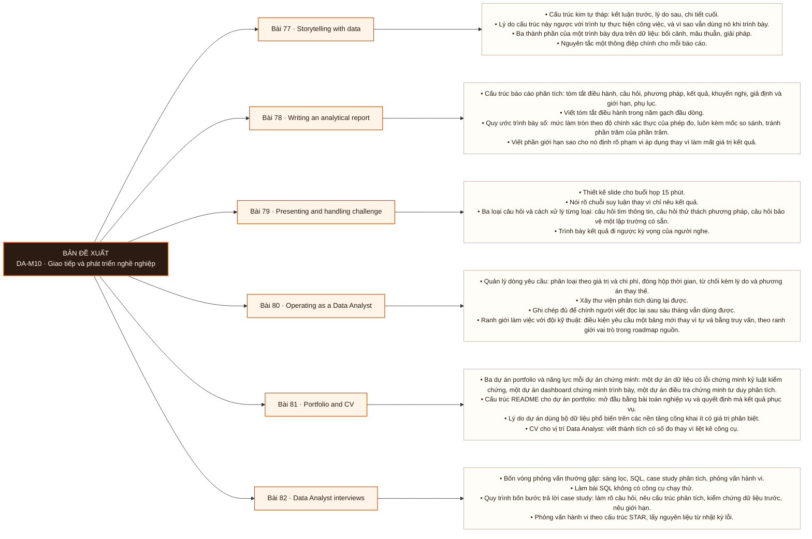

# Mô-đun 10: Giao tiếp và phát triển nghề nghiệp

Sáu bài chuyển từ tạo ra kết quả sang làm cho kết quả được dùng. Bài 79 ở tầng đánh giá và là bài khó đo nhất trong chương trình, nên hình thức kiểm dùng hội đồng đóng vai với câu phản biện chuẩn bị trước. Bài 81 và 82 phục vụ trực tiếp việc ứng tuyển.

## Điều kiện đầu vào

| Mã | Người học có thể | Bằng chứng được chấp nhận |
|---|---|---|
| EN-10-01 | M07 | Bằng chứng hoàn thành điều kiện được nêu trong cột trước |

Nếu chưa có bằng chứng đầu vào, người học phải hoàn thành lại bài hoặc mô-đun được dẫn chiếu trước khi thực hiện phép đánh giá của mô-đun này.

## Đầu ra mô-đun

Trình bày một kết luận phân tích cho người nhận không có nền kỹ thuật và giữ được kết luận đúng dưới chất vấn

## Tiêu chí hoàn thành

| Mã | Bằng chứng bắt buộc | Ngưỡng đạt | Lỗi loại trực tiếp |
|---|---|---|---|
| EC-10-01 | Đạt phỏng vấn thử đủ bốn vòng ở Bài 82, và nộp portfolio ba dự án cùng CV một trang đã qua chấm chéo | Đạt ngưỡng ở cả bốn vòng phỏng vấn thử, và vòng case study có thực hiện bước kiểm chứng dữ liệu trước khi phân tích. Đây là exit criterion của Mô-đun 10. | Coi module này là phần phụ sau phần kỹ thuật, trong khi nó quyết định kết quả phỏng vấn và mức độ kết quả phân tích được sử dụng |

## Khái niệm và nguyên tắc bất biến

| Mã khái niệm | Ranh giới định nghĩa | Nguyên tắc bất biến hoặc quy tắc quyết định | Bài chính |
|---|---|---|---|
| C10-077 | Cấu trúc kim tự tháp: kết luận trước, lý do sau, chi tiết cuối. | Lý do cấu trúc này ngược với trình tự thực hiện công việc, và vì sao vẫn dùng nó khi trình bày. | L077 |
| C10-078 | Cấu trúc báo cáo phân tích: tóm tắt điều hành, câu hỏi, phương pháp, kết quả, khuyến nghị, giả định và giới hạn, phụ lục. | Viết tóm tắt điều hành trong năm gạch đầu dòng. | L078 |
| C10-079 | Thiết kế slide cho buổi họp 15 phút. | Nói rõ chuỗi suy luận thay vì chỉ nêu kết quả. | L079 |
| C10-080 | Quản lý dòng yêu cầu: phân loại theo giá trị và chi phí, đóng hộp thời gian, từ chối kèm lý do và phương án thay thế. | Xây thư viện phân tích dùng lại được. | L080 |
| C10-081 | Ba dự án portfolio và năng lực mỗi dự án chứng minh: một dự án dữ liệu có lỗi chứng minh kỷ luật kiểm chứng, một dự án dashboard chứng minh trình bày, một dự án điều tra chứng minh tư duy phân tích. | Cấu trúc README cho dự án portfolio: mở đầu bằng bài toán nghiệp vụ và quyết định mà kết quả phục vụ. | L081 |
| C10-082 | Bốn vòng phỏng vấn thường gặp: sàng lọc, SQL, case study phân tích, phỏng vấn hành vi. | Làm bài SQL không có công cụ chạy thử. | L082 |

## Các bài trong mô-đun

| Bài | Dạng | Đầu ra | Bằng chứng | Điều kiện tiên quyết |
|---|---|---|---|---|
| L077 · [[wiki.da.storytelling-with-data|Storytelling with data]]| LT | Sắp xếp lại một báo cáo viết theo trình tự thời gian thành cấu trúc kim tự tháp và rút xuống một trang, giữ nguyên kết luận và bằng chứng. | Ba bản viết lại đều trong một trang, và người đọc trong 2 phút nêu lại đúng kết luận của cả ba. | M10: M07 |
| L078 · [[wiki.da.writing-an-analytical-report|Writing an analytical report]]| TH | Viết một báo cáo mà người quản lý đọc trong 2 phút ra được quyết định, và ba phiên bản của cùng kết quả cho ba nhóm người đọc khác nhau. | Người đọc đóng vai quản lý nêu được quyết định cụ thể sau 2 phút đọc bản một trang, và ba phiên bản nhất quán về kết luận và số liệu. | L077 |
| L079 · [[wiki.da.presenting-and-handling-challenge|Presenting and handling challenge]]| TH | Bảo vệ một kết luận bất lợi trước hội đồng, giữ được phần có bằng chứng và nhượng bộ đúng phần chưa đủ bằng chứng. | Giữ được phần kết luận có bằng chứng qua cả năm câu phản biện, và nhượng bộ đúng câu nêu giới hạn có thật. | L078 |
| L080 · [[wiki.da.operating-as-a-data-analyst|Operating as a Data Analyst]]| LT | Xử lý một dòng 12 yêu cầu đến cùng lúc: phân loại, ước lượng, từ chối có lý do, và thương lượng hạn, không để yêu cầu nào rơi. | Cả 12 yêu cầu đều có trạng thái xác định, hai yêu cầu bị từ chối đều kèm lý do và phương án thay thế, và không yêu cầu nào không được xử lý. | L079 |
| L081 · [[wiki.da.portfolio-and-cv|Portfolio and CV]]| TH | Đóng gói ba dự án đã làm trong chương trình thành portfolio có README theo cấu trúc, và viết một CV một trang gửi được ngay. | Ba README đều mở đầu bằng bài toán nghiệp vụ và quyết định phục vụ, và người chấm chéo nêu đúng năng lực ứng viên sau 30 giây đọc CV. | L080 |
| L082 · [[wiki.da.data-analyst-interviews|Data Analyst interviews]]| TH | Hoàn thành một buổi phỏng vấn thử đủ bốn vòng đạt ngưỡng theo rubric của người đóng vai nhà tuyển dụng. | Đạt ngưỡng ở cả bốn vòng phỏng vấn thử, và vòng case study có thực hiện bước kiểm chứng dữ liệu trước khi phân tích. Đây là exit criterion của Mô-đun 10. | L081 |

## Nội dung từng bài

> **Sơ đồ đề xuất: DA-M10 v0.1.0.** Mỗi nhánh đi từ một bài học đến các nội dung nguyên tử bắt buộc. Thứ tự dạy lấy từ bảng `Các bài trong mô-đun`.

### Lesson 77: Storytelling with data

Cấu trúc kim tự tháp: kết luận trước, lý do sau, chi tiết cuối. Lý do cấu trúc này ngược với trình tự thực hiện công việc, và vì sao vẫn dùng nó khi trình bày. Ba thành phần của một trình bày dựa trên dữ liệu: bối cảnh, mâu thuẫn, giải pháp. Nguyên tắc một thông điệp chính cho mỗi báo cáo. Xác định điều gì làm người nhận thay đổi quyết định.

Người học phải sắp xếp lại một báo cáo viết theo trình tự thời gian thành cấu trúc kim tự tháp và rút xuống một trang, giữ nguyên kết luận và bằng chứng. Bằng chứng thực hành: Nhận ba báo cáo viết theo trình tự thời gian làm việc. Viết lại theo cấu trúc kim tự tháp, rút mỗi bản xuống một trang. Thử với bạn học đọc trong 2 phút. Bài hoàn tất khi ba bản viết lại đều trong một trang, và người đọc trong 2 phút nêu lại đúng kết luận của cả ba.

Cách đánh giá: Tầng *áp dụng*. Kiểm bằng ràng buộc đo được: bản viết lại phải trong một trang, và một người đọc chỉ trong 2 phút phải nêu lại đúng kết luận. Ràng buộc thứ hai kiểm bằng thử trên bạn học, không bằng đánh giá của giảng viên.

### Lesson 78: Writing an analytical report

Cấu trúc báo cáo phân tích: tóm tắt điều hành, câu hỏi, phương pháp, kết quả, khuyến nghị, giả định và giới hạn, phụ lục. Viết tóm tắt điều hành trong năm gạch đầu dòng. Quy ước trình bày số: mức làm tròn theo độ chính xác thực của phép đo, luôn kèm mốc so sánh, tránh phần trăm của phần trăm. Viết phần giới hạn sao cho nó định rõ phạm vi áp dụng thay vì làm mất giá trị kết quả.

Người học phải viết một báo cáo mà người quản lý đọc trong 2 phút ra được quyết định, và ba phiên bản của cùng kết quả cho ba nhóm người đọc khác nhau. Bằng chứng thực hành: Viết báo cáo hoàn chỉnh cho kết quả điều tra ở Bài 61, ba phiên bản: một trang cho giám đốc, năm trang cho đồng nghiệp kỹ thuật, và bản lưu trữ đầy đủ. Bài hoàn tất khi người đọc đóng vai quản lý nêu được quyết định cụ thể sau 2 phút đọc bản một trang, và ba phiên bản nhất quán về kết luận và số liệu.

Cách đánh giá: Tầng *áp dụng*. Kiểm bằng thử với người đọc: bản một trang phải đủ để một bạn học đóng vai quản lý nêu ra quyết định cụ thể. Ba phiên bản được chấm theo tính nhất quán về kết luận và về số liệu giữa chúng.

### Lesson 79: Presenting and handling challenge

Thiết kế slide cho buổi họp 15 phút. Nói rõ chuỗi suy luận thay vì chỉ nêu kết quả. Ba loại câu hỏi và cách xử lý từng loại: câu hỏi tìm thông tin, câu hỏi thử thách phương pháp, câu hỏi bảo vệ một lập trường có sẵn. Trình bày kết quả đi ngược kỳ vọng của người nghe. Cách phát biểu rằng dữ liệu hiện có không trả lời được câu hỏi được đặt ra.

Người học phải bảo vệ một kết luận bất lợi trước hội đồng, giữ được phần có bằng chứng và nhượng bộ đúng phần chưa đủ bằng chứng. Bằng chứng thực hành: Trình bày 10 phút kết quả Bài 61 trước hội đồng đóng vai. Hội đồng chuẩn bị trước năm câu phản biện, trong đó có ít nhất một câu nêu giới hạn có thật. Bài hoàn tất khi giữ được phần kết luận có bằng chứng qua cả năm câu phản biện, và nhượng bộ đúng câu nêu giới hạn có thật.

Cách đánh giá: Tầng *đánh giá*. Hội đồng chuẩn bị trước năm câu phản biện nhắm vào điểm yếu nhất của phân tích, trong đó ít nhất một câu chỉ ra một giới hạn có thật. Tiêu chí đạt gồm cả việc nhượng bộ đúng câu đó; giữ nguyên lập trường trước mọi câu hỏi là không đạt.

### Lesson 80: Operating as a Data Analyst

Quản lý dòng yêu cầu: phân loại theo giá trị và chi phí, đóng hộp thời gian, từ chối kèm lý do và phương án thay thế. Xây thư viện phân tích dùng lại được. Ghi chép đủ để chính người viết đọc lại sau sáu tháng vẫn dùng được. Ranh giới làm việc với đội kỹ thuật: điều kiện yêu cầu một bảng mới thay vì tự vá bằng truy vấn, theo ranh giới vai trò trong roadmap nguồn. Đạo đức dữ liệu: quyền riêng tư, dữ liệu cá nhân, giới hạn của việc phân khúc người dùng.

Người học phải xử lý một dòng 12 yêu cầu đến cùng lúc: phân loại, ước lượng, từ chối có lý do, và thương lượng hạn, không để yêu cầu nào rơi. Bằng chứng thực hành: Mô phỏng một tuần làm việc: nhận 12 yêu cầu qua tin nhắn. Phân loại, ước lượng, từ chối 2 kèm lý do và phương án thay thế, thương lượng hạn cho 3. Bài hoàn tất khi cả 12 yêu cầu đều có trạng thái xác định, hai yêu cầu bị từ chối đều kèm lý do và phương án thay thế, và không yêu cầu nào không được xử lý.

Cách đánh giá: Tầng *đánh giá*. Objective là một chuỗi quyết định ưu tiên dưới ràng buộc nguồn lực, không có phương án đúng duy nhất. Kiểm bằng mô phỏng: bài đặt ra 12 yêu cầu trong đó có ít nhất hai yêu cầu nên bị từ chối, và người học phải từ chối chúng kèm lý do và phương án thay thế.

### Lesson 81: Portfolio and CV

Ba dự án portfolio và năng lực mỗi dự án chứng minh: một dự án dữ liệu có lỗi chứng minh kỷ luật kiểm chứng, một dự án dashboard chứng minh trình bày, một dự án điều tra chứng minh tư duy phân tích. Cấu trúc README cho dự án portfolio: mở đầu bằng bài toán nghiệp vụ và quyết định mà kết quả phục vụ. Lý do dự án dùng bộ dữ liệu phổ biến trên các nền tảng công khai ít có giá trị phân biệt. CV cho vị trí Data Analyst: viết thành tích có số đo thay vì liệt kê công cụ. Hồ sơ LinkedIn và GitHub.

Người học phải đóng gói ba dự án đã làm trong chương trình thành portfolio có README theo cấu trúc, và viết một CV một trang gửi được ngay. Bằng chứng thực hành: Đóng gói ba dự án đã làm trong khoá thành portfolio. Viết CV một trang. Chấm chéo theo góc nhìn nhà tuyển dụng, với giới hạn 30 giây đọc CV. Bài hoàn tất khi ba README đều mở đầu bằng bài toán nghiệp vụ và quyết định phục vụ, và người chấm chéo nêu đúng năng lực ứng viên sau 30 giây đọc CV.

Cách đánh giá: Tầng *áp dụng*. Kiểm bằng chấm chéo theo góc nhìn nhà tuyển dụng: bạn học đọc CV trong 30 giây và phải nêu được ứng viên làm được gì. Portfolio chấm theo việc README có mở đầu bằng bài toán nghiệp vụ hay bằng danh sách công cụ.

### Lesson 82: Data Analyst interviews

Bốn vòng phỏng vấn thường gặp: sàng lọc, SQL, case study phân tích, phỏng vấn hành vi. Làm bài SQL không có công cụ chạy thử. Quy trình bốn bước trả lời case study: làm rõ câu hỏi, nêu cấu trúc phân tích, kiểm chứng dữ liệu trước, nêu giới hạn. Phỏng vấn hành vi theo cấu trúc STAR, lấy nguyên liệu từ nhật ký lỗi. Câu hỏi nên đặt ngược cho nhà tuyển dụng. Đàm phán lương ở mức cơ bản.

Người học phải hoàn thành một buổi phỏng vấn thử đủ bốn vòng đạt ngưỡng theo rubric của người đóng vai nhà tuyển dụng. Bằng chứng thực hành: Phỏng vấn thử đầy đủ bốn vòng với người đóng vai nhà tuyển dụng. Ghi hình. Tự đánh giá theo rubric rồi nhận nhận xét. Bài hoàn tất khi đạt ngưỡng ở cả bốn vòng phỏng vấn thử, và vòng case study có thực hiện bước kiểm chứng dữ liệu trước khi phân tích. Đây là exit criterion của Mô-đun 10.

Cách đánh giá: Tầng *áp dụng*. Kiểm bằng phỏng vấn thử có ghi hình và chấm theo rubric bốn vòng. Vòng case study chấm cấu trúc tư duy chứ không chấm đáp án, và bước kiểm chứng dữ liệu là tiêu chí phân biệt chính.

## Lý do sắp xếp

Mô-đun bắt đầu từ `M10: M07` và đi theo các quan hệ tiên quyết đã ghi trong bảng. Mỗi bài chỉ sử dụng khái niệm hoặc thao tác đã được giới thiệu trước đó; bài cuối L082 tích hợp đầu ra của toàn mô-đun.

## Ma trận đánh giá

| Mã đầu ra | Mức độ tư duy | Cách đánh giá | Ngưỡng đạt | Hình thức kiểm tra lại |
|---|---|---|---|---|
| L077 | Áp dụng | Tầng *áp dụng*. Kiểm bằng ràng buộc đo được: bản viết lại phải trong một trang, và một người đọc chỉ trong 2 phút phải nêu lại đúng kết luận. Ràng buộc thứ hai kiểm bằng thử trên bạn học, không bằng đánh giá của giảng viên. | Ba bản viết lại đều trong một trang, và người đọc trong 2 phút nêu lại đúng kết luận của cả ba. | Tình huống mới, giữ nguyên đầu ra và ngưỡng |
| L078 | Áp dụng | Tầng *áp dụng*. Kiểm bằng thử với người đọc: bản một trang phải đủ để một bạn học đóng vai quản lý nêu ra quyết định cụ thể. Ba phiên bản được chấm theo tính nhất quán về kết luận và về số liệu giữa chúng. | Người đọc đóng vai quản lý nêu được quyết định cụ thể sau 2 phút đọc bản một trang, và ba phiên bản nhất quán về kết luận và số liệu. | Tình huống mới, giữ nguyên đầu ra và ngưỡng |
| L079 | Đánh giá | Tầng *đánh giá*. Hội đồng chuẩn bị trước năm câu phản biện nhắm vào điểm yếu nhất của phân tích, trong đó ít nhất một câu chỉ ra một giới hạn có thật. Tiêu chí đạt gồm cả việc nhượng bộ đúng câu đó; giữ nguyên lập trường trước mọi câu hỏi là không đạt. | Giữ được phần kết luận có bằng chứng qua cả năm câu phản biện, và nhượng bộ đúng câu nêu giới hạn có thật. | Tình huống mới, giữ nguyên đầu ra và ngưỡng |
| L080 | Đánh giá | Tầng *đánh giá*. Objective là một chuỗi quyết định ưu tiên dưới ràng buộc nguồn lực, không có phương án đúng duy nhất. Kiểm bằng mô phỏng: bài đặt ra 12 yêu cầu trong đó có ít nhất hai yêu cầu nên bị từ chối, và người học phải từ chối chúng kèm lý do và phương án thay thế. | Cả 12 yêu cầu đều có trạng thái xác định, hai yêu cầu bị từ chối đều kèm lý do và phương án thay thế, và không yêu cầu nào không được xử lý. | Tình huống mới, giữ nguyên đầu ra và ngưỡng |
| L081 | Áp dụng | Tầng *áp dụng*. Kiểm bằng chấm chéo theo góc nhìn nhà tuyển dụng: bạn học đọc CV trong 30 giây và phải nêu được ứng viên làm được gì. Portfolio chấm theo việc README có mở đầu bằng bài toán nghiệp vụ hay bằng danh sách công cụ. | Ba README đều mở đầu bằng bài toán nghiệp vụ và quyết định phục vụ, và người chấm chéo nêu đúng năng lực ứng viên sau 30 giây đọc CV. | Tình huống mới, giữ nguyên đầu ra và ngưỡng |
| L082 | Áp dụng | Tầng *áp dụng*. Kiểm bằng phỏng vấn thử có ghi hình và chấm theo rubric bốn vòng. Vòng case study chấm cấu trúc tư duy chứ không chấm đáp án, và bước kiểm chứng dữ liệu là tiêu chí phân biệt chính. | Đạt ngưỡng ở cả bốn vòng phỏng vấn thử, và vòng case study có thực hiện bước kiểm chứng dữ liệu trước khi phân tích. Đây là exit criterion của Mô-đun 10. | Tình huống mới, giữ nguyên đầu ra và ngưỡng |

Không cộng điểm để bù cho lỗi loại trực tiếp. Người học phải sửa đúng lỗi, nộp lại bằng chứng và thực hiện kiểm tra lại trên một tình huống khác.

## Bài thực hành bắt buộc

| Bài thực hành hoặc dự án | Bài liên quan | Sản phẩm bắt buộc | Lỗi được cài vào tình huống |
|---|---|---|---|
| Storytelling with data | L077 | Nhận ba báo cáo viết theo trình tự thời gian làm việc. Viết lại theo cấu trúc kim tự tháp, rút mỗi bản xuống một trang. Thử với bạn học đọc trong 2 phút. | Đặt kết luận ở cuối theo thói quen viết báo cáo học thuật · rút gọn bằng cách bỏ bằng chứng thay vì bỏ chi tiết quy trình · đưa nhiều thông điệp chính vào một báo cáo. |
| Writing an analytical report | L078 | Viết báo cáo hoàn chỉnh cho kết quả điều tra ở Bài 61, ba phiên bản: một trang cho giám đốc, năm trang cho đồng nghiệp kỹ thuật, và bản lưu trữ đầy đủ. | Làm tròn khác nhau giữa ba phiên bản nên số không khớp · viết phần giới hạn chung chung nên người đọc bỏ qua kết luận · đưa phương pháp lên trước kết quả. |
| Presenting and handling challenge | L079 | Trình bày 10 phút kết quả Bài 61 trước hội đồng đóng vai. Hội đồng chuẩn bị trước năm câu phản biện, trong đó có ít nhất một câu nêu giới hạn có thật. | Nhượng bộ mọi câu phản biện để tránh xung đột · bảo vệ cả phần không có bằng chứng · trả lời câu hỏi thử thách phương pháp bằng cách nhắc lại kết quả. |
| Operating as a Data Analyst | L080 | Mô phỏng một tuần làm việc: nhận 12 yêu cầu qua tin nhắn. Phân loại, ước lượng, từ chối 2 kèm lý do và phương án thay thế, thương lượng hạn cho 3. | Nhận mọi yêu cầu rồi trễ hạn toàn bộ · từ chối mà không đưa phương án thay thế · vá cùng một logic ở nhiều nơi thay vì yêu cầu một bảng. |
| Portfolio and CV | L081 | Đóng gói ba dự án đã làm trong khoá thành portfolio. Viết CV một trang. Chấm chéo theo góc nhìn nhà tuyển dụng, với giới hạn 30 giây đọc CV. | README mở đầu bằng danh sách thư viện đã dùng · CV liệt kê công cụ mà không có thành tích đo được · dùng bộ dữ liệu phổ biến mà không đặt câu hỏi mới. |
| Data Analyst interviews | L082 | Phỏng vấn thử đầy đủ bốn vòng với người đóng vai nhà tuyển dụng. Ghi hình. Tự đánh giá theo rubric rồi nhận nhận xét. | Trả lời case study bằng cách nêu công cụ sẽ dùng · bỏ bước làm rõ câu hỏi · kể tình huống hành vi không có kết quả đo được. |

## Ngộ nhận và lỗi loại trực tiếp

| Lỗi | Hệ quả | Nơi phát hiện | Cách khắc phục |
|---|---|---|---|
| Đặt kết luận ở cuối theo thói quen viết báo cáo học thuật · rút gọn bằng cách bỏ bằng chứng thay vì bỏ chi tiết quy trình · đưa nhiều thông điệp chính vào một báo cáo. | Không tạo được bằng chứng hợp lệ cho đầu ra L077 | L077 | Làm lại phép đánh giá trên tình huống mới và đạt tiêu chí `Done when` |
| Làm tròn khác nhau giữa ba phiên bản nên số không khớp · viết phần giới hạn chung chung nên người đọc bỏ qua kết luận · đưa phương pháp lên trước kết quả. | Không tạo được bằng chứng hợp lệ cho đầu ra L078 | L078 | Làm lại phép đánh giá trên tình huống mới và đạt tiêu chí `Done when` |
| Nhượng bộ mọi câu phản biện để tránh xung đột · bảo vệ cả phần không có bằng chứng · trả lời câu hỏi thử thách phương pháp bằng cách nhắc lại kết quả. | Không tạo được bằng chứng hợp lệ cho đầu ra L079 | L079 | Làm lại phép đánh giá trên tình huống mới và đạt tiêu chí `Done when` |
| Nhận mọi yêu cầu rồi trễ hạn toàn bộ · từ chối mà không đưa phương án thay thế · vá cùng một logic ở nhiều nơi thay vì yêu cầu một bảng. | Không tạo được bằng chứng hợp lệ cho đầu ra L080 | L080 | Làm lại phép đánh giá trên tình huống mới và đạt tiêu chí `Done when` |
| README mở đầu bằng danh sách thư viện đã dùng · CV liệt kê công cụ mà không có thành tích đo được · dùng bộ dữ liệu phổ biến mà không đặt câu hỏi mới. | Không tạo được bằng chứng hợp lệ cho đầu ra L081 | L081 | Làm lại phép đánh giá trên tình huống mới và đạt tiêu chí `Done when` |
| Trả lời case study bằng cách nêu công cụ sẽ dùng · bỏ bước làm rõ câu hỏi · kể tình huống hành vi không có kết quả đo được. | Không tạo được bằng chứng hợp lệ cho đầu ra L082 | L082 | Làm lại phép đánh giá trên tình huống mới và đạt tiêu chí `Done when` |

## Điểm nối với mô-đun khác

| Kế thừa từ | Cung cấp cho mô-đun sau | Cam kết đầu ra |
|---|---|---|
| M07 | M07 | Trình bày một kết luận phân tích cho người nhận không có nền kỹ thuật và giữ được kết luận đúng dưới chất vấn |

## Tài liệu tham khảo

| Mã | Nguồn | Vị trí | Dùng cho |
|---|---|---|---|
| R10-01 | Roadmap Data Analyst nguồn | `Material/DA/Reference/Library/roadmap-v1-goc.md` | Phạm vi chương trình và thứ tự bài học |
| R10-02 | Manifest nguồn cấp bài | `Material/DA/Reference/.../Lesson_*/sources.yaml` | Truy vết nguồn khi manifest được điền |

## Đối chiếu năng lực

| Khung hoặc mã năng lực | Phạm vi sử dụng | Bằng chứng |
|---|---|---|
| `VISL` mức 3 · `DAAN` mức 3 | Đầu ra và phép đánh giá của mô-đun | EC-10-01 và ma trận đánh giá theo bài |

Ánh xạ này mô tả phạm vi được thực hành; nó không tự động chứng nhận cấp độ của người học trong khung năng lực.

## Giới hạn của mô-đun

- Roadmap xác định phạm vi, bằng chứng và cách đánh giá; nội dung giảng giải đầy đủ thuộc `note.md`.
- Manifest nguồn cấp bài hiện chưa có dữ liệu. Không được dùng tên tệp trong `Reference/Library` làm bằng chứng cho một khẳng định.
- Hoàn thành mô-đun chỉ chứng minh các đầu ra được nêu trong tài liệu này; không tự động chứng nhận chức danh hoặc kinh nghiệm làm việc.
