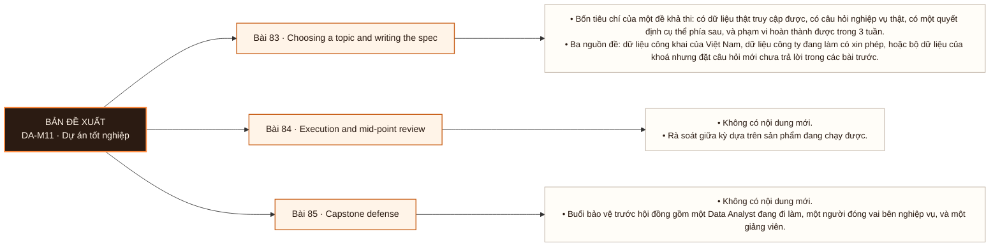

# Mô-đun 11: Dự án tốt nghiệp

Đề bài chứa một lỗi chất lượng dữ liệu cài sẵn; không phát hiện ra sẽ dẫn tới khuyến nghị sai và bị trừ ở cả phần kiểm chất lượng lẫn phần khuyến nghị. Đây là cơ chế kiểm cả các đầu ra chương trình trong một sản phẩm.

## Điều kiện đầu vào

| Mã | Người học có thể | Bằng chứng được chấp nhận |
|---|---|---|
| EN-11-01 | Toàn bộ M01-M10 | Bằng chứng hoàn thành điều kiện được nêu trong cột trước |

Nếu chưa có bằng chứng đầu vào, người học phải hoàn thành lại bài hoặc mô-đun được dẫn chiếu trước khi thực hiện phép đánh giá của mô-đun này.

## Đầu ra mô-đun

Thực hiện trọn một dự án phân tích từ câu hỏi mơ hồ tới khuyến nghị có định lượng, và bảo vệ nó trước hội đồng

## Tiêu chí hoàn thành

| Mã | Bằng chứng bắt buộc | Ngưỡng đạt | Lỗi loại trực tiếp |
|---|---|---|---|
| EC-11-01 | Đạt bảo vệ ≥ 75/100, phần bảo vệ dưới chất vấn ≥ 60%, và phần đối soát không bị bỏ | ≥ 75/100, phần G ≥ 60%, và phần E không được bỏ. Đề bài chứa một lỗi chất lượng dữ liệu cài sẵn; không phát hiện ra sẽ bị trừ ở cả phần B lẫn phần F. Đạt ≥ 75/100, phần G ≥ 60%, phần E có làm, và lỗi chất lượng dữ liệu cài sẵn được phát hiện. Đây là exit criterion của Mô-đun 11 và của toàn chương trình. | Chọn đề không có quyết định thật phía sau, nên dự án dừng ở mô tả dữ liệu và không có khuyến nghị kiểm chứng được |

## Khái niệm và nguyên tắc bất biến

| Mã khái niệm | Ranh giới định nghĩa | Nguyên tắc bất biến hoặc quy tắc quyết định | Bài chính |
|---|---|---|---|
| C11-083 | Bốn tiêu chí của một đề khả thi: có dữ liệu thật truy cập được, có câu hỏi nghiệp vụ thật, có một quyết định cụ thể phía sau, và phạm vi hoàn thành được trong 3 tuần. | Ba nguồn đề: dữ liệu công khai của Việt Nam, dữ liệu công ty đang làm có xin phép, hoặc bộ dữ liệu của khoá nhưng đặt câu hỏi mới chưa trả lời trong các bài trước. | L083 |
| C11-084 | Không có nội dung mới. | Rà soát giữa kỳ dựa trên sản phẩm đang chạy được. | L084 |
| C11-085 | Không có nội dung mới. | Buổi bảo vệ trước hội đồng gồm một Data Analyst đang đi làm, một người đóng vai bên nghiệp vụ, và một giảng viên. | L085 |

## Các bài trong mô-đun

| Bài | Dạng | Đầu ra | Bằng chứng | Điều kiện tiên quyết |
|---|---|---|---|---|
| L083 · [[wiki.da.choosing-a-topic-and-writing-the-spec|Choosing a topic and writing the spec]]| DA | Viết một đặc tả dự án đủ sáu bước của Bài 5 và bảo vệ nó qua bốn tiêu chí khả thi. | Đặc tả đủ sáu bước và được duyệt qua cả bốn tiêu chí khả thi. | M11: Toàn bộ M01-M10 |
| L084 · [[wiki.da.execution-and-mid-point-review|Execution and mid-point review]]| DA | Trình bày tiến độ dự án trong 10 phút, tiếp nhận phản biện, và điều chỉnh phạm vi khi bằng chứng cho thấy phạm vi ban đầu không hoàn thành được. | Nộp đủ năm đầu ra bắt buộc ở trạng thái đang chạy được, và quyết định về phạm vi có bằng chứng tiến độ kèm theo. | L083 |
| L085 · [[wiki.da.capstone-defense|Capstone defense]]| KT | Bảo vệ trọn một dự án phân tích trước hội đồng: nêu được câu hỏi, phương pháp, bằng chứng đối soát, khuyến nghị có định lượng, và giới hạn, dưới chất vấn. | ≥ 75/100, phần G ≥ 60%, và phần E không được bỏ. Đề bài chứa một lỗi chất lượng dữ liệu cài sẵn; không phát hiện ra sẽ bị trừ ở cả phần B lẫn phần F. Đạt ≥ 75/100, phần G ≥ 60%, phần E có làm, và lỗi chất lượng dữ liệu cài sẵn được phát hiện. Đây là exit criterion của Mô-đun 11 và của toàn chương trình. | L084 |

## Nội dung từng bài

> **Sơ đồ đề xuất: DA-M11 v0.1.0.** Mỗi nhánh đi từ một bài học đến các nội dung nguyên tử bắt buộc. Thứ tự dạy lấy từ bảng `Các bài trong mô-đun`.

### Lesson 83: Choosing a topic and writing the spec

Bốn tiêu chí của một đề khả thi: có dữ liệu thật truy cập được, có câu hỏi nghiệp vụ thật, có một quyết định cụ thể phía sau, và phạm vi hoàn thành được trong 3 tuần. Ba nguồn đề: dữ liệu công khai của Việt Nam, dữ liệu công ty đang làm có xin phép, hoặc bộ dữ liệu của khoá nhưng đặt câu hỏi mới chưa trả lời trong các bài trước.

Người học phải viết một đặc tả dự án đủ sáu bước của Bài 5 và bảo vệ nó qua bốn tiêu chí khả thi. Bằng chứng thực hành: Viết đặc tả dự án đủ sáu bước của Bài 5. Bảo vệ đề trước giảng viên qua bốn tiêu chí. Chỉ đề được duyệt mới làm tiếp. Bài hoàn tất khi đặc tả đủ sáu bước và được duyệt qua cả bốn tiêu chí khả thi.

Cách đánh giá: Tầng *sáng tạo*. Đặc tả là sản phẩm thiết kế dưới ràng buộc. Kiểm bằng bảo vệ đề: đề không qua đủ bốn tiêu chí không được duyệt, và người học phải sửa hoặc đổi đề. Tiêu chí thường trượt nhất là có quyết định cụ thể phía sau.

### Lesson 84: Execution and mid-point review

Không có nội dung mới. Rà soát giữa kỳ dựa trên sản phẩm đang chạy được.

Người học phải trình bày tiến độ dự án trong 10 phút, tiếp nhận phản biện, và điều chỉnh phạm vi khi bằng chứng cho thấy phạm vi ban đầu không hoàn thành được. Bằng chứng thực hành: Buổi này trình bày tiến độ 10 phút, nhận phản biện, và điều chỉnh phạm vi nếu cần. Năm đầu ra bắt buộc phải có ở trạng thái đang chạy được: kho mã chạy lại được · báo cáo chất lượng dữ liệu · phân tích có nhật ký giả thuyết · dashboard hoặc bộ biểu đồ · báo cáo ba phiên bản theo Bài 78. Bài hoàn tất khi nộp đủ năm đầu ra bắt buộc ở trạng thái đang chạy được, và quyết định về phạm vi có bằng chứng tiến độ kèm theo.

Cách đánh giá: Tầng *đánh giá*. Kiểm bằng chất lượng quyết định điều chỉnh phạm vi: người học phải nêu bằng chứng cho quyết định giữ hoặc thu hẹp phạm vi. Giữ nguyên phạm vi trong khi tiến độ cho thấy không kịp là một quyết định không đạt.

### Lesson 85: Capstone defense

Không có nội dung mới. Buổi bảo vệ trước hội đồng gồm một Data Analyst đang đi làm, một người đóng vai bên nghiệp vụ, và một giảng viên.

Người học phải bảo vệ trọn một dự án phân tích trước hội đồng: nêu được câu hỏi, phương pháp, bằng chứng đối soát, khuyến nghị có định lượng, và giới hạn, dưới chất vấn. Bằng chứng thực hành: Trình bày, bảo vệ dưới chất vấn và nhận xét hội đồng. | Phần | Điểm | Nội dung | |---|---|---| | A | 10 | Làm rõ câu hỏi và đặc tả | | B | 15 | Kiểm tra chất lượng dữ liệu trước khi phân tích | | C | 20 | Phân tích: SQL, thống kê, điều tra | | D | 15 | Trực quan hoá hoặc dashboard | | E | 10 | Đối soát: chứng minh kết quả bằng hai đường độc lập | | F | 10 | Khuyến nghị hành động có định lượng tác động | | G | 20 | Bảo vệ dưới chất vấn, gồm nêu rõ giới hạn | Bài hoàn tất khi ≥ 75/100, phần G ≥ 60%, và phần E không được bỏ. Đề bài chứa một lỗi chất lượng dữ liệu cài sẵn; không phát hiện ra sẽ bị trừ ở cả phần B lẫn phần F. Đạt ≥ 75/100, phần G ≥ 60%, phần E có làm, và lỗi chất lượng dữ liệu cài sẵn được phát hiện. Đây là exit criterion của Mô-đun 11 và của toàn chương trình.

Cách đánh giá: Tầng *đánh giá* và *sáng tạo*. Kiểm bằng rubric bảy phần trước hội đồng. Đề chứa một lỗi chất lượng dữ liệu cài sẵn, nên phần B và phần F cùng phản ánh việc có phát hiện ra lỗi đó hay không. Phần G kiểm khả năng giữ kết luận dưới chất vấn.

## Lý do sắp xếp

Mô-đun bắt đầu từ `M11: Toàn bộ M01-M10` và đi theo các quan hệ tiên quyết đã ghi trong bảng. Mỗi bài chỉ sử dụng khái niệm hoặc thao tác đã được giới thiệu trước đó; bài cuối L085 tích hợp đầu ra của toàn mô-đun.

## Ma trận đánh giá

| Mã đầu ra | Mức độ tư duy | Cách đánh giá | Ngưỡng đạt | Hình thức kiểm tra lại |
|---|---|---|---|---|
| L083 | Sáng tạo | Tầng *sáng tạo*. Đặc tả là sản phẩm thiết kế dưới ràng buộc. Kiểm bằng bảo vệ đề: đề không qua đủ bốn tiêu chí không được duyệt, và người học phải sửa hoặc đổi đề. Tiêu chí thường trượt nhất là có quyết định cụ thể phía sau. | Đặc tả đủ sáu bước và được duyệt qua cả bốn tiêu chí khả thi. | Tình huống mới, giữ nguyên đầu ra và ngưỡng |
| L084 | Đánh giá | Tầng *đánh giá*. Kiểm bằng chất lượng quyết định điều chỉnh phạm vi: người học phải nêu bằng chứng cho quyết định giữ hoặc thu hẹp phạm vi. Giữ nguyên phạm vi trong khi tiến độ cho thấy không kịp là một quyết định không đạt. | Nộp đủ năm đầu ra bắt buộc ở trạng thái đang chạy được, và quyết định về phạm vi có bằng chứng tiến độ kèm theo. | Tình huống mới, giữ nguyên đầu ra và ngưỡng |
| L085 | Đánh giá | Tầng *đánh giá* và *sáng tạo*. Kiểm bằng rubric bảy phần trước hội đồng. Đề chứa một lỗi chất lượng dữ liệu cài sẵn, nên phần B và phần F cùng phản ánh việc có phát hiện ra lỗi đó hay không. Phần G kiểm khả năng giữ kết luận dưới chất vấn. | ≥ 75/100, phần G ≥ 60%, và phần E không được bỏ. Đề bài chứa một lỗi chất lượng dữ liệu cài sẵn; không phát hiện ra sẽ bị trừ ở cả phần B lẫn phần F. Đạt ≥ 75/100, phần G ≥ 60%, phần E có làm, và lỗi chất lượng dữ liệu cài sẵn được phát hiện. Đây là exit criterion của Mô-đun 11 và của toàn chương trình. | Tình huống mới, giữ nguyên đầu ra và ngưỡng |

Không cộng điểm để bù cho lỗi loại trực tiếp. Người học phải sửa đúng lỗi, nộp lại bằng chứng và thực hiện kiểm tra lại trên một tình huống khác.

## Bài thực hành bắt buộc

| Bài thực hành hoặc dự án | Bài liên quan | Sản phẩm bắt buộc | Lỗi được cài vào tình huống |
|---|---|---|---|
| Choosing a topic and writing the spec | L083 | Viết đặc tả dự án đủ sáu bước của Bài 5. Bảo vệ đề trước giảng viên qua bốn tiêu chí. Chỉ đề được duyệt mới làm tiếp. | Chọn đề theo mức độ sẵn có của dữ liệu thay vì theo quyết định phía sau · phạm vi rộng hơn mức làm được trong 3 tuần · câu hỏi đã được trả lời trong một bài của khoá. |
| Execution and mid-point review | L084 | Buổi này trình bày tiến độ 10 phút, nhận phản biện, và điều chỉnh phạm vi nếu cần. Năm đầu ra bắt buộc phải có ở trạng thái đang chạy được: kho mã chạy lại được · báo cáo chất lượng dữ liệu · phân tích có nhật ký giả thuyết · dashboard hoặc bộ biểu đồ · báo cáo ba phiên bản theo Bài 78. | Giữ nguyên phạm vi dù tiến độ cho thấy không kịp · bỏ phần chất lượng dữ liệu để kịp phần phân tích · trình bày kế hoạch thay vì trình bày kết quả đã có. |
| Capstone defense | L085 | Trình bày, bảo vệ dưới chất vấn và nhận xét hội đồng. \| Phần \| Điểm \| Nội dung \| \|---\|---\|---\| \| A \| 10 \| Làm rõ câu hỏi và đặc tả \| \| B \| 15 \| Kiểm tra chất lượng dữ liệu trước khi phân tích \| \| C \| 20 \| Phân tích: SQL, thống kê, điều tra \| \| D \| 15 \| Trực quan hoá hoặc dashboard \| \| E \| 10 \| Đối soát: chứng minh kết quả bằng hai đường độc lập \| \| F \| 10 \| Khuyến nghị hành động có định lượng tác động \| \| G \| 20 \| Bảo vệ dưới chất vấn, gồm nêu rõ giới hạn \| | Bỏ phần đối soát để dành thời gian cho phần phân tích · khuyến nghị không định lượng được tác động · không phát hiện lỗi dữ liệu cài sẵn. |

## Ngộ nhận và lỗi loại trực tiếp

| Lỗi | Hệ quả | Nơi phát hiện | Cách khắc phục |
|---|---|---|---|
| Chọn đề theo mức độ sẵn có của dữ liệu thay vì theo quyết định phía sau · phạm vi rộng hơn mức làm được trong 3 tuần · câu hỏi đã được trả lời trong một bài của khoá. | Không tạo được bằng chứng hợp lệ cho đầu ra L083 | L083 | Làm lại phép đánh giá trên tình huống mới và đạt tiêu chí `Done when` |
| Giữ nguyên phạm vi dù tiến độ cho thấy không kịp · bỏ phần chất lượng dữ liệu để kịp phần phân tích · trình bày kế hoạch thay vì trình bày kết quả đã có. | Không tạo được bằng chứng hợp lệ cho đầu ra L084 | L084 | Làm lại phép đánh giá trên tình huống mới và đạt tiêu chí `Done when` |
| Bỏ phần đối soát để dành thời gian cho phần phân tích · khuyến nghị không định lượng được tác động · không phát hiện lỗi dữ liệu cài sẵn. | Không tạo được bằng chứng hợp lệ cho đầu ra L085 | L085 | Làm lại phép đánh giá trên tình huống mới và đạt tiêu chí `Done when` |

## Điểm nối với mô-đun khác

| Kế thừa từ | Cung cấp cho mô-đun sau | Cam kết đầu ra |
|---|---|---|
| Toàn bộ M01-M10 | M01, M10 | Thực hiện trọn một dự án phân tích từ câu hỏi mơ hồ tới khuyến nghị có định lượng, và bảo vệ nó trước hội đồng |

## Tài liệu tham khảo

| Mã | Nguồn | Vị trí | Dùng cho |
|---|---|---|---|
| R11-01 | Roadmap Data Analyst nguồn | `Material/DA/Reference/Library/roadmap-v1-goc.md` | Phạm vi chương trình và thứ tự bài học |
| R11-02 | Manifest nguồn cấp bài | `Material/DA/Reference/.../Lesson_*/sources.yaml` | Truy vết nguồn khi manifest được điền |

## Đối chiếu năng lực

| Khung hoặc mã năng lực | Phạm vi sử dụng | Bằng chứng |
|---|---|---|
| Tổng hợp `DAAN`, `BINT`, `VISL`, `DTAN` ở mức 3 | Đầu ra và phép đánh giá của mô-đun | EC-11-01 và ma trận đánh giá theo bài |

Ánh xạ này mô tả phạm vi được thực hành; nó không tự động chứng nhận cấp độ của người học trong khung năng lực.

## Giới hạn của mô-đun

- Roadmap xác định phạm vi, bằng chứng và cách đánh giá; nội dung giảng giải đầy đủ thuộc `note.md`.
- Manifest nguồn cấp bài hiện chưa có dữ liệu. Không được dùng tên tệp trong `Reference/Library` làm bằng chứng cho một khẳng định.
- Hoàn thành mô-đun chỉ chứng minh các đầu ra được nêu trong tài liệu này; không tự động chứng nhận chức danh hoặc kinh nghiệm làm việc.
