# Giai đoạn 4: Phân tích ứng dụng và capstone

Giai đoạn này kết hợp M07-M11. Người học chuyển từ `Bằng chứng hoàn thành Giai đoạn 3` sang khả năng tạo và bảo vệ bằng chứng tích hợp ở L085.

## Điều kiện đầu vào

| Năng lực bắt buộc | Bằng chứng được chấp nhận | Cách khắc phục |
|---|---|---|
| Bằng chứng hoàn thành Giai đoạn 3 | Sản phẩm và kết quả đánh giá của giai đoạn trước | Hoàn thành lại tiêu chí chưa đạt trước khi vào bài kiểm tra tích hợp |

## Đầu ra giai đoạn

Bảo vệ trọn một dự án phân tích trước hội đồng: nêu được câu hỏi, phương pháp, bằng chứng đối soát, khuyến nghị có định lượng, và giới hạn, dưới chất vấn.

## Thứ tự mô-đun

| Mô-đun | Năng lực được bổ sung | Phụ thuộc | Bằng chứng hoàn thành |
|---|---|---|---|
| [DA-M07](Module_07-product-and-business-analytics/roadmap.md) | Điều tra một chỉ số sản phẩm thay đổi và định vị nguyên nhân kèm bằng chứng từng bước, trên dữ liệu sự kiện 2 triệu event | M03 · M05 | Nộp báo cáo điều tra Bài 61 định vị đúng bất thường ở giao hai chiều, mỗi bước có bằng chứng, và bước 0 kiểm chất lượng dữ liệu được thực hiện trước |
| [DA-M08](Module_08-a-b-testing/roadmap.md) | Viết một tài liệu thiết kế thí nghiệm đầy đủ và kết luận đúng từ kết quả, gồm cả kết luận rằng thí nghiệm không kết luận được | M05 | Nộp tài liệu thiết kế cho ba tình huống, có tính cỡ mẫu, và kết luận đúng rằng ít nhất một trong ba không đủ lực để chạy |
| [DA-M09](Module_09-python-for-data-analysts/roadmap.md) | Đóng gói một quy trình phân tích thành kho mã mà người thứ hai chạy lại được bằng một lệnh và cho ra kết quả giống hệt | M03 | Hoán đổi kho mã với một học viên khác; người đó chạy lại thành công không đặt câu hỏi nào |
| [DA-M10](Module_10-communication-and-career/roadmap.md) | Trình bày một kết luận phân tích cho người nhận không có nền kỹ thuật và giữ được kết luận đúng dưới chất vấn | M07 | Đạt phỏng vấn thử đủ bốn vòng ở Bài 82, và nộp portfolio ba dự án cùng CV một trang đã qua chấm chéo |
| [DA-M11](Module_11-capstone-project/roadmap.md) | Thực hiện trọn một dự án phân tích từ câu hỏi mơ hồ tới khuyến nghị có định lượng, và bảo vệ nó trước hội đồng | Toàn bộ M01-M10 | Đạt bảo vệ ≥ 75/100, phần bảo vệ dưới chất vấn ≥ 60%, và phần đối soát không bị bỏ |

**Sơ đồ thứ tự:** đọc từ trái sang phải; mỗi mô-đun tạo bằng chứng đầu vào cho mô-đun kế tiếp và bài kiểm tra cuối giai đoạn.

```mermaid
%%{init: {"flowchart": {"htmlLabels": true, "wrappingWidth": 520, "nodeSpacing": 64, "rankSpacing": 160}}}%%
flowchart LR
  P04["Giai đoạn 4<br/>Phân tích ứng dụng và capstone<br/>Roadmap hiện hành"]
  M07["M07 · Phân tích sản phẩm và kinh doanh<br/>Bài 55–63"]
  P04 --> M07
  M08["M08 · Thử nghiệm A/B<br/>Bài 64–68"]
  M07 --> M08
  M09["M09 · Python cho Data Analyst<br/>Bài 69–76"]
  M08 --> M09
  M10["M10 · Giao tiếp và phát triển nghề nghiệp<br/>Bài 77–82"]
  M09 --> M10
  M11["M11 · Dự án tốt nghiệp<br/>Bài 83–85"]
  M10 --> M11
  G04["Bài kiểm tra cuối giai đoạn<br/>Bài 85"]
  M11 --> G04

  classDef phase fill:#2b1b12,color:#fff4e8,stroke:#ff8a3d,stroke-width:2px;
  classDef module fill:#fff4e8,color:#2b1b12,stroke:#c85e16,stroke-width:1.5px;
  classDef gate fill:#fffdf8,color:#2b1b12,stroke:#2b1b12,stroke-width:2px;
  class P04 phase;
  class M07,M08,M09,M10,M11 module;
  class G04 gate;
```

## Lý do sắp xếp

- M07 đứng trước M08 vì điều kiện đầu vào của M08 sử dụng bằng chứng hoặc cơ chế đã hình thành ở mô-đun trước.
- M08 đứng trước M09 vì điều kiện đầu vào của M09 sử dụng bằng chứng hoặc cơ chế đã hình thành ở mô-đun trước.
- M09 đứng trước M10 vì điều kiện đầu vào của M10 sử dụng bằng chứng hoặc cơ chế đã hình thành ở mô-đun trước.
- M10 đứng trước M11 vì điều kiện đầu vào của M11 sử dụng bằng chứng hoặc cơ chế đã hình thành ở mô-đun trước.

## Bài kiểm tra cuối giai đoạn

### Nhiệm vụ

Trình bày, bảo vệ dưới chất vấn và nhận xét hội đồng. | Phần | Điểm | Nội dung | |---|---|---| | A | 10 | Làm rõ câu hỏi và đặc tả | | B | 15 | Kiểm tra chất lượng dữ liệu trước khi phân tích | | C | 20 | Phân tích: SQL, thống kê, điều tra | | D | 15 | Trực quan hoá hoặc dashboard | | E | 10 | Đối soát: chứng minh kết quả bằng hai đường độc lập | | F | 10 | Khuyến nghị hành động có định lượng tác động | | G | 20 | Bảo vệ dưới chất vấn, gồm nêu rõ giới hạn |

### Cách đánh giá

| Tiêu chí | Bằng chứng | Ngưỡng đạt | Lỗi loại trực tiếp |
|---|---|---|---|
| Bảo vệ trọn một dự án phân tích trước hội đồng: nêu được câu hỏi, phương pháp, bằng chứng đối soát, khuyến nghị có định lượng, và giới hạn, dưới chất vấn. | Trình bày, bảo vệ dưới chất vấn và nhận xét hội đồng. \| Phần \| Điểm \| Nội dung \| \|---\|---\|---\| \| A \| 10 \| Làm rõ câu hỏi và đặc tả \| \| B \| 15 \| Kiểm tra chất lượng dữ liệu trước khi phân tích \| \| C \| 20 \| Phân tích: SQL, thống kê, điều tra \| \| D \| 15 \| Trực quan hoá hoặc dashboard \| \| E \| 10 \| Đối soát: chứng minh kết quả bằng hai đường độc lập \| \| F \| 10 \| Khuyến nghị hành động có định lượng tác động \| \| G \| 20 \| Bảo vệ dưới chất vấn, gồm nêu rõ giới hạn \| | ≥ 75/100, phần G ≥ 60%, và phần E không được bỏ. Đề bài chứa một lỗi chất lượng dữ liệu cài sẵn; không phát hiện ra sẽ bị trừ ở cả phần B lẫn phần F. Đạt ≥ 75/100, phần G ≥ 60%, phần E có làm, và lỗi chất lượng dữ liệu cài sẵn được phát hiện. Đây là exit criterion của Mô-đun 11 và của toàn chương trình. | Bỏ phần đối soát để dành thời gian cho phần phân tích · khuyến nghị không định lượng được tác động · không phát hiện lỗi dữ liệu cài sẵn. |

## Điểm tích hợp

| Năng lực trước được dùng lại | Mô-đun sử dụng | Năng lực sau được mở khóa |
|---|---|---|
| M03 · M05 | M07 | Điều tra một chỉ số sản phẩm thay đổi và định vị nguyên nhân kèm bằng chứng từng bước, trên dữ liệu sự kiện 2 triệu event |
| M05 | M08 | Viết một tài liệu thiết kế thí nghiệm đầy đủ và kết luận đúng từ kết quả, gồm cả kết luận rằng thí nghiệm không kết luận được |
| M03 | M09 | Đóng gói một quy trình phân tích thành kho mã mà người thứ hai chạy lại được bằng một lệnh và cho ra kết quả giống hệt |
| M07 | M10 | Trình bày một kết luận phân tích cho người nhận không có nền kỹ thuật và giữ được kết luận đúng dưới chất vấn |
| Toàn bộ M01-M10 | M11 | Thực hiện trọn một dự án phân tích từ câu hỏi mơ hồ tới khuyến nghị có định lượng, và bảo vệ nó trước hội đồng |

## Khắc phục

| Tiêu chí chưa đạt | Bằng chứng chẩn đoán | Phần phải làm lại | Cách kiểm tra lại |
|---|---|---|---|
| Bỏ phần đối soát để dành thời gian cho phần phân tích · khuyến nghị không định lượng được tác động · không phát hiện lỗi dữ liệu cài sẵn. | Bài làm, nhật ký và phản hồi theo tiêu chí L085 | Bài hoặc mô-đun tạo ra bằng chứng còn thiếu | Tình huống mới, giữ nguyên đầu ra và ngưỡng đạt |

## Rủi ro của giai đoạn

| Rủi ro | Cách phát hiện | Biện pháp kiểm soát |
|---|---|---|
| Dựng phễu và cohort bằng công thức mẫu mà không khai báo ba tham số định nghĩa, nên hai người cho hai con số khác nhau trên cùng dữ liệu | Không đạt tiêu chí hoàn thành M07 | Khắc phục tại M07 trước khi thực hiện bài kiểm tra cuối giai đoạn |
| Chạy thí nghiệm rồi mới tính cỡ mẫu, nên thí nghiệm không đủ lực nhưng vẫn được diễn giải như thể có kết luận | Không đạt tiêu chí hoàn thành M08 | Khắc phục tại M08 trước khi thực hiện bài kiểm tra cuối giai đoạn |
| Học pandas như tập hợp cú pháp rời rạc mà không đối chiếu với SQL đã biết, nên kéo toàn bộ dữ liệu về máy thay vì đẩy phép gộp xuống cơ sở dữ liệu | Không đạt tiêu chí hoàn thành M09 | Khắc phục tại M09 trước khi thực hiện bài kiểm tra cuối giai đoạn |
| Coi module này là phần phụ sau phần kỹ thuật, trong khi nó quyết định kết quả phỏng vấn và mức độ kết quả phân tích được sử dụng | Không đạt tiêu chí hoàn thành M10 | Khắc phục tại M10 trước khi thực hiện bài kiểm tra cuối giai đoạn |
| Chọn đề không có quyết định thật phía sau, nên dự án dừng ở mô tả dữ liệu và không có khuyến nghị kiểm chứng được | Không đạt tiêu chí hoàn thành M11 | Khắc phục tại M11 trước khi thực hiện bài kiểm tra cuối giai đoạn |

## Tài liệu tham khảo

| Mã | Nguồn | Vị trí | Dùng cho |
|---|---|---|---|
| DA-M07 | Roadmap mô-đun | `Module_07-product-and-business-analytics/roadmap.md` | Đầu ra, thứ tự bài và tiêu chí đánh giá của mô-đun |
| DA-M08 | Roadmap mô-đun | `Module_08-a-b-testing/roadmap.md` | Đầu ra, thứ tự bài và tiêu chí đánh giá của mô-đun |
| DA-M09 | Roadmap mô-đun | `Module_09-python-for-data-analysts/roadmap.md` | Đầu ra, thứ tự bài và tiêu chí đánh giá của mô-đun |
| DA-M10 | Roadmap mô-đun | `Module_10-communication-and-career/roadmap.md` | Đầu ra, thứ tự bài và tiêu chí đánh giá của mô-đun |
| DA-M11 | Roadmap mô-đun | `Module_11-capstone-project/roadmap.md` | Đầu ra, thứ tự bài và tiêu chí đánh giá của mô-đun |

Roadmap giai đoạn không thay thế roadmap mô-đun. Khi hai cấp diễn đạt khác nhau, mã đầu ra và tiêu chí do roadmap mô-đun sở hữu được dùng để rà soát.
