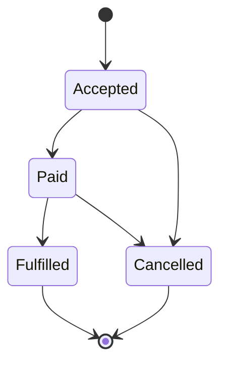
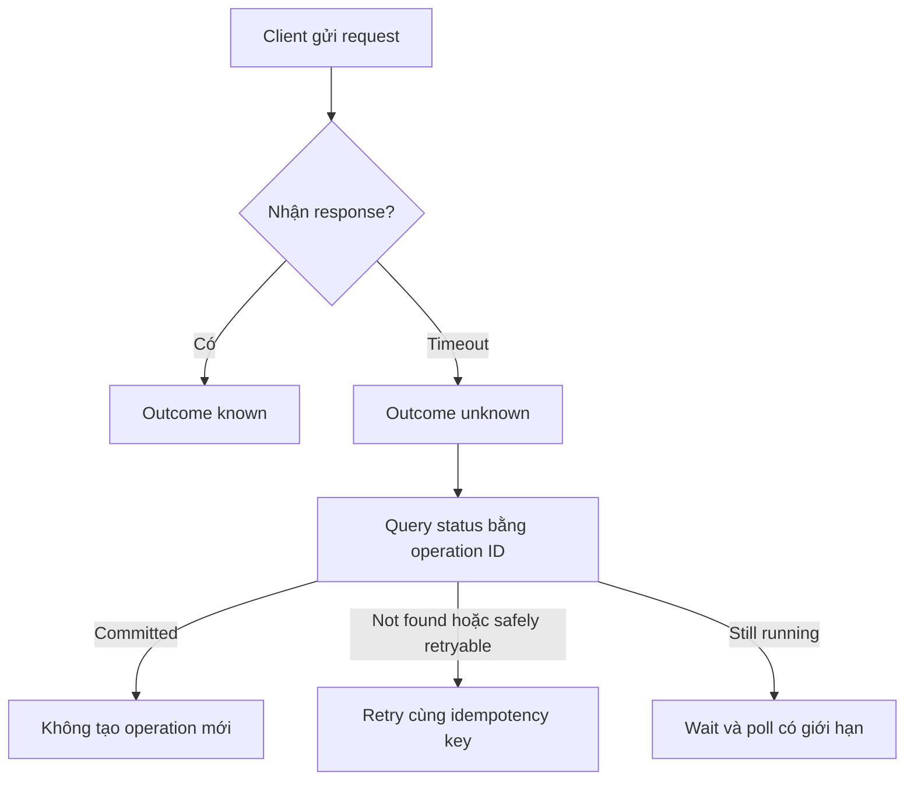

# Phase 1: Nền tảng kỹ thuật
# Module 1: Tư duy kỹ thuật, Git và gỡ lỗi
# Lesson 1: From a vague request to a testable contract

## Kết quả cần đạt

Sau bài này, người học có thể:

1. Chỉ ra vì sao một yêu cầu mơ hồ không tạo được expected result duy nhất.
2. Viết contract gồm decision, boundary, semantics, invariants, failure behavior và evidence.
3. Khóa identity, time và state trước khi định nghĩa duplicate, late hay complete.
4. Dùng Given/When/Then để mô tả hành vi quan sát được, không khóa implementation.
5. Phân tích timeout và retry bằng trạng thái **unknown outcome** cùng idempotency key.
6. Chuyển từ nhanh, ổn định sang SLI, SLO, cửa sổ đo và error budget rõ ràng.

Ngưỡng đạt tối thiểu: viết được contract mà hai reviewer độc lập tạo ra cùng expected output từ cùng fixture, có ít nhất một failure path, một oracle, một changed constraint và không còn từ định tính chưa có threshold.

Yêu cầu đồng bộ orders nhanh, không trùng, có lỗi thì retry nghe có vẻ đủ để bắt đầu code. Thực ra nó che hàng loạt quyết định: order nào thuộc phạm vi, identity là gì, nhanh bao nhiêu, duplicate được đo ở đâu, timeout nghĩa là thất bại hay chưa biết, và bằng chứng nào cho thấy job hoàn tất.

Ta sẽ theo một case mô phỏng xuyên bài: API đối tác cung cấp orders; đội dữ liệu phải đưa chúng vào bảng curated trong warehouse. Đây là tình huống giảng dạy tổng hợp, không mô tả một hệ thống production cụ thể.

## Yêu cầu mơ hồ không có oracle

Một test cần oracle: quy tắc xác định observed result là đúng hay sai. Với câu không được trùng, ta chưa biết:

- Trùng theo `order_id`, `source + order_id` hay payload?
- Một order có nhiều version hợp lệ không?
- Đếm duplicate trong raw, staging hay curated?
- Retry cùng request có được tạo nhiều attempt record không?
- Một row bị update có được xem là duplicate không?

NASA Software Engineering Guidebook yêu cầu requirement phải rõ, không mơ hồ và có thể verify/test. [S1] Điểm thực dụng là: nếu cùng input mà hai reviewer suy ra hai expected result khác nhau, requirement chưa đủ để chuyển sang mutation.

So sánh:

| Câu | Test được? | Phần còn thiếu |
|---|---|---|
| Pipeline phải nhanh | Không | percentile, threshold, workload, window |
| Không được mất dữ liệu | Không | population, source control, cutoff |
| Không được trùng order | Không | identity, state, boundary |
| 99% order accepted trước 12:00 xuất hiện đúng một lần ở curated trước 12:10 | Gần đủ | exclusions, failure semantics, oracle |

## Contract kiểm thử được khóa sáu lớp nghĩa

Một contract tốt không phải bản thiết kế chi tiết. Nó khóa những điều implementation phải chứng minh.

| Lớp | Câu hỏi | Ví dụ trong case |
|---|---|---|
| Decision | Ai dùng kết quả để làm gì? | Fulfillment chỉ xử lý order đã complete |
| Boundary | Hệ thống chịu trách nhiệm từ đâu đến đâu? | Từ API response hợp lệ tới curated table |
| Semantics | Entity, identity, time, state là gì? | identity = source_system + order_id |
| Invariants | Điều gì luôn phải đúng? | tối đa một current row mỗi identity |
| Failure behavior | Timeout, invalid input, partial commit xử lý ra sao? | quarantine invalid; timeout là unknown |
| Evidence | Log, metric, query hay fixture nào chứng minh? | source count, run manifest, reconciliation |

Contract một trang cho case:

> Với mọi order có `status=accepted` mà API trả trước cutoff 12:00 ICT, hệ thống phải tạo đúng một current record theo `(source_system, order_id)` trong `curated.orders` trước 12:10. Payload mới hơn thay thế state hiện tại theo `source_updated_at`; payload cũ hơn không được rollback state. Record sai schema đi vào quarantine và không làm hỏng batch. Nếu client timeout sau khi gửi request, lần retry dùng cùng idempotency key; hệ thống phải cho phép tra cứu outcome. Reconciliation dựa trên source control total và run manifest độc lập với phép insert.

Contract này vẫn có thể sai nếu source control total không đáng tin. Contract làm lộ giả định để kiểm tra; nó không biến giả định thành sự thật.

## Contract cần phân biệt safety và liveness

Hai nhóm thuộc tính cần cách kiểm khác nhau.

**Safety property** mô tả điều không được phép xảy ra. Ví dụ:

- không có hai current row cho cùng order identity;
- event cũ không được ghi đè state mới;
- cùng idempotency key với payload khác phải bị từ chối;
- record sai schema không được đi vào curated.

Một phản ví dụ đủ để bác bỏ safety property. Test cần chủ động tạo duplicate, reordering, conflict và malformed input.

**Liveness property** mô tả điều cuối cùng phải xảy ra. Ví dụ:

- order hợp lệ cuối cùng xuất hiện ở curated;
- operation accepted cuối cùng đi tới terminal state;
- record quarantine tạo được tín hiệu cho owner xử lý;
- retry hợp lệ cuối cùng nhận lại outcome của logical operation.

Liveness không thể được chứng minh chỉ bằng một snapshot chưa thấy lỗi. Nó cần state transition, bounded expectation và evidence cho tiến trình. Một hệ thống có thể đạt safety bằng cách từ chối mọi request, nhưng như vậy liveness bằng không.

Contract cần có cả hai:

| Requirement | Loại | Counterexample |
|---|---|---|
| Tối đa một current row trên mỗi identity | Safety | hai row cùng `is_current=true` |
| Mọi order hợp lệ thuộc population có terminal outcome | Liveness | operation nằm pending không có recovery path |
| Event cũ không rollback state | Safety | state từ paid quay về accepted |
| Invalid record tạo quarantine evidence | Liveness | row bị bỏ im lặng |

Từ đúng một lần thường gộp nhiều thuộc tính và tạo hiểu lầm. Hệ phân tán hiếm khi chỉ cần một transport guarantee. Điều consumer cần thường là at-least-once delivery cộng deduplication, atomic state transition và reconciliation. Hãy viết từng invariant thay vì dùng một nhãn bao quát.

## Identity, time và state quyết định thế nào là đúng

Ba khái niệm thường bị bỏ sót:

### Identity

`order_id=42` từ hai nguồn có thể là hai order khác nhau. Vì vậy:

```text
order_identity = (source_system, order_id)
```

Nếu upstream tái sử dụng ID, cần thêm tenant hoặc namespace. Hash toàn payload không phải identity ổn định vì một cập nhật hợp lệ sẽ đổi hash.

### Time

Ít nhất ba thời điểm có thể tồn tại:

- `source_updated_at`: lúc trạng thái thay đổi ở nguồn.
- `ingested_at`: lúc hệ thống nhận record.
- `curated_at`: lúc record sẵn sàng cho consumer.

Trong 10 phút phải nói 10 phút từ mốc nào. Late event không giống slow processing.

### State

Order có thể đi qua `accepted → paid → fulfilled → cancelled`. Hai event cho cùng identity có thể là lịch sử hợp lệ, không phải duplicate. Contract phải nói bảng curated giữ current state, event history hay cả hai.



Không được cho phép event cũ đến muộn kéo state từ `fulfilled` về `paid` nếu business rule không cho rollback.

State transition cần bảng quy tắc, không chỉ sơ đồ:

| Current state | Incoming state | Version relation | Decision | Evidence |
|---|---|---|---|---|
| none | accepted | first seen | create current | insert outcome |
| accepted | paid | newer | advance | before/after state |
| paid | accepted | older | ignore current, retain audit | stale-event counter |
| paid | cancelled | newer | apply nếu rule cho phép | transition rule ID |
| fulfilled | cancelled | newer | route manual review nếu không hợp lệ | quarantine reason |
| any | same state | same version | return prior outcome | idempotency ledger |

Không được để thứ tự arrival tự quyết state. Contract phải chỉ ra field nào tạo order, cách xử lý equal version và policy khi version bị thiếu.

## Given When Then chỉ hữu ích khi mô tả hành vi quan sát được

Cucumber định nghĩa Given là trạng thái ban đầu, When là event/action, Then là outcome quan sát được. [S2] Gherkin không tự làm requirement tốt hơn; scenario vẫn tệ nếu dùng từ mơ hồ hoặc kiểm implementation detail.

```gherkin
Feature: Idempotent order ingestion

  Rule: One current row per order identity

    Scenario: The same accepted order is retried after a client timeout
      Given source "partner_a" has accepted order "O-42" updated at "2026-10-03T11:55:00+07:00"
      And no current row exists for identity "partner_a|O-42"
      When ingestion request "req-781" is submitted twice with idempotency key "partner_a|O-42|2026-10-03T11:55:00+07:00"
      Then curated orders contains exactly one current row for "partner_a|O-42"
      And both attempts resolve to the same logical operation
      And the run manifest records two attempts and one committed outcome
```

Scenario không nói phải dùng MERGE, transaction hay message queue. Nó khóa outcome, còn thiết kế được tự do miễn chứng minh được outcome đó.

Example Mapping của Cucumber tách story thành rules, examples và questions. [S6] Dùng nó trước khi viết scenario giúp phát hiện câu hỏi như payload cũ đến sau thì sao? hoặc API 202 là accepted hay completed?.

## Timeout tạo trạng thái unknown, retry tạo side effect

Timeout chỉ nói client không nhận được response đúng hạn. Server có thể chưa nhận request, đang xử lý, đã commit nhưng response mất, hoặc đã thất bại. Vì vậy `timeout ≠ failure`.



RFC 9110 gọi một method là idempotent khi nhiều request giống nhau có intended effect như một request, đồng thời cảnh báo client không nên tự động retry non-idempotent request nếu không có cách biết retry an toàn. [S3] AWS Builders Library mô tả idempotent API bằng caller-provided request identifier để dịch vụ nhận ra retry của cùng một operation. [S4]

Một idempotency key tốt:

- gắn với **ý định logic**, không gắn ngẫu nhiên với từng attempt;
- có scope và thời hạn lưu rõ;
- từ chối cùng key nhưng payload xung đột;
- cho phép trả lại outcome cũ hoặc trạng thái đang chạy;
- không được dùng như lý do bỏ reconciliation.

| Tình huống | Hành vi an toàn |
|---|---|
| Cùng key, cùng payload, operation committed | trả outcome đã lưu |
| Cùng key, cùng payload, operation đang chạy | trả trạng thái pending |
| Cùng key, payload khác | reject conflict |
| Key mới sau timeout | nguy cơ tạo side effect thứ hai |

## Idempotency cần atomicity và concurrency control

Lưu key sau khi side effect hoàn tất tạo một khoảng trống:

```text
check key absent
perform side effect
process crashes
persist key
```

Nếu process chết giữa hai bước cuối, retry không thấy key và lặp side effect. Vì vậy deduplication record và business mutation cần chung transaction boundary, hoặc cần một protocol có trạng thái phục hồi rõ.

Một state machine tối thiểu:

```text
ABSENT -> IN_PROGRESS -> SUCCEEDED
                     -> FAILED_TERMINAL
                     -> RECOVERABLE
```

Các transition phải atomic theo scoped key. Hai request đồng thời cùng key không được cùng vượt qua `ABSENT`. Có thể dùng unique constraint, compare-and-set hoặc lock phù hợp. Yêu cầu bắt buộc là bằng chứng về invariant, không phải tên cơ chế.

Ví dụ schema:

```sql
CREATE TABLE idempotency_ledger (
    tenant_id        text        NOT NULL,
    operation_name   text        NOT NULL,
    idempotency_key  text        NOT NULL,
    request_hash     text        NOT NULL,
    state            text        NOT NULL,
    outcome_ref      text,
    created_at       timestamptz NOT NULL,
    updated_at       timestamptz NOT NULL,
    PRIMARY KEY (tenant_id, operation_name, idempotency_key),
    CHECK (state IN ('IN_PROGRESS', 'SUCCEEDED', 'FAILED_TERMINAL', 'RECOVERABLE'))
);
```

Schema chỉ tạo uniqueness. Contract vẫn phải định nghĩa:

- request hash được canonicalize ra sao;
- `IN_PROGRESS` quá hạn được phục hồi thế nào;
- terminal error nào được replay;
- state được giữ bao lâu;
- key hết hạn thì client nhận behavior gì;
- outcome chứa dữ liệu nhạy cảm được bảo vệ ra sao.

Một race test cần hai worker gửi cùng key đồng thời. Expected result phải khóa trước: một logical operation, một side effect, hai attempt records và outcome nhất quán.

## SLO biến nhanh và ổn định thành phép đo

Google SRE Workbook bắt đầu SLO từ điều người dùng quan tâm, rồi chọn SLI, target và measurement window. [S5] Với pipeline:

```text
SLI freshness =
  số order hợp lệ xuất hiện ở curated trong <= 10 phút
  ---------------------------------------------------
  tổng order hợp lệ thuộc cutoff

SLO: SLI >= 99.0% trong rolling 28 days
```

Phải phân biệt:

- **Correctness gate:** mỗi identity có đúng current state, không mất record thuộc population.
- **Performance SLO:** tỷ lệ record đạt latency threshold.
- **Availability signal:** job/schedule có chạy và quan sát được hay không.

Một job chạy xanh nhưng output sai không đạt correctness. Một batch đúng nhưng 6 giờ mới xong có thể đạt correctness và trượt freshness SLO. Hai lỗi có response khác nhau.

Nếu SLO thay từ 10 phút xuống 30 giây, đó có thể là thay đổi kiến trúc: batch polling, warehouse load và source rate limit có thể không còn phù hợp. Contract làm lộ change request thay vì che nó dưới nhãn tối ưu.

## Traceability biến lỗi test thành tín hiệu thay đổi

Mỗi requirement cần nối tới acceptance check và evidence:

| Requirement ID | Rule | Test | Evidence | Owner |
|---|---|---|---|---|
| R1 | identity là source + order_id | duplicate fixture | uniqueness query | data producer |
| R2 | latest source state thắng | out-of-order fixture | state transition log | pipeline owner |
| R3 | invalid record không chặn batch | malformed fixture | quarantine count | operations |
| R4 | retry không nhân side effect | timeout/retry fixture | idempotency ledger | API owner |
| R5 | 99% trong 10 phút | latency distribution | SLI dashboard | service owner |

Khi test R2 fail, ta biết requirement nào bị đe dọa và owner nào phải quyết định. Một bộ test không trace được requirement dễ trở thành danh sách assertion mà không ai hiểu consequence.

## Acceptance matrix phải bao phủ đường lỗi

Một acceptance suite cân bằng không đếm test case, mà đếm behavior boundary.

| Dimension | Control | Variant | Expected observation |
|---|---|---|---|
| Identity | source A, order 42 | source B, order 42 | hai identity độc lập |
| Version | paid mới hơn | accepted cũ đến sau | current state vẫn paid |
| Delivery | một attempt | cùng request được gửi lại | một logical outcome |
| Conflict | cùng key, cùng payload | cùng key, payload khác | conflict được ghi trace |
| Validation | record hợp lệ | thiếu order_id | valid sibling vẫn commit, invalid vào quarantine |
| Commit | response nhận được | commit xong nhưng response mất | status lookup tìm thấy outcome |
| Completeness | control total khớp | một record mất trước curated | reconciliation fail |
| Concurrency | request nối tiếp | hai request đồng thời | unique logical operation |

Test chỉ có happy path không chứng minh contract. Test chỉ có unit assertion cũng không chứng minh behavior qua transaction, queue và warehouse boundary. Mỗi invariant cần phép kiểm ở boundary mà consumer quan sát.

## Observability phải trả lời được operation đang ở đâu

Log nhiều không bảo đảm điều tra được. Mỗi logical operation cần các trường có nghĩa:

| Field | Mục đích |
|---|---|
| operation_id | theo dõi một logical operation |
| idempotency_key_hash | nối các attempt mà không log raw secret |
| attempt_id | phân biệt từng delivery attempt |
| requirement_id | biết invariant nào liên quan |
| source_identity | xác định order trong scope |
| state_before, state_after | chứng minh transition |
| outcome | committed, rejected, quarantined, recoverable |
| evidence_ref | trỏ tới manifest, batch hoặc transaction |

Không log toàn payload theo mặc định. Log cần đủ cho traceability nhưng vẫn tuân thủ data classification và retention. Với payload nhạy cảm, giữ hash có version cùng locator tới evidence được kiểm quyền.

Ba truy vấn vận hành phải trả lời được:

1. Operation này đã commit chưa?
2. Hai attempt này có thuộc cùng logical operation không?
3. Record nào thuộc source population nhưng chưa có terminal outcome?

## Case xuyên chương: đồng bộ orders từ API vào warehouse

### Fixture tối thiểu

```json
[
  {"source":"partner_a","order_id":"O-42","status":"paid","source_updated_at":"2026-10-03T11:55:00+07:00","amount":120000},
  {"source":"partner_a","order_id":"O-42","status":"paid","source_updated_at":"2026-10-03T11:55:00+07:00","amount":120000},
  {"source":"partner_a","order_id":"O-42","status":"accepted","source_updated_at":"2026-10-03T11:50:00+07:00","amount":120000},
  {"source":"partner_b","order_id":"O-42","status":"paid","source_updated_at":"2026-10-03T11:56:00+07:00","amount":90000},
  {"source":"partner_a","order_id":null,"status":"paid","source_updated_at":"2026-10-03T11:57:00+07:00","amount":50000}
]
```

Expected behavior:

1. Hai payload đầu là cùng version và cùng identity: một current state, hai attempt có thể quan sát.
2. Payload thứ ba đến muộn và cũ hơn: không rollback `paid` về `accepted`.
3. `partner_b|O-42` là identity khác, không bị deduplicate với partner A.
4. Record thiếu `order_id` vào quarantine và không chặn record hợp lệ.

```sql
-- Oracle 1: uniqueness ở boundary curated current-state.
SELECT source_system, order_id, COUNT(*) AS current_rows
FROM curated.orders
WHERE is_current = TRUE
GROUP BY 1, 2
HAVING COUNT(*) <> 1;

-- Oracle 2: completeness theo run manifest và source control.
SELECT
  m.run_id,
  m.source_valid_records,
  COUNT(c.order_id) AS curated_or_existing,
  m.quarantined_records
FROM ops.run_manifest AS m
LEFT JOIN ops.run_record_outcomes AS c USING (run_id)
GROUP BY 1, 2, 4;
```

Oracle 1 chỉ bắt duplicate/missing current row trong bảng đã thấy. Oracle 2 cần source control total độc lập để tránh hai bên cùng mất nên vẫn bằng nhau.

### Definition of Ready

Chỉ bắt đầu mutation khi:

- population, boundary, identity, state và time semantics đã có owner chấp nhận;
- fixture gồm happy path, duplicate, out-of-order, invalid input và timeout;
- expected result duy nhất được viết ra;
- non-goals và change-control trigger rõ;
- môi trường rollback/replay và evidence location đã biết.

Nếu thiếu identity hoặc failure semantics, dừng là hành vi kỹ thuật có trách nhiệm. Nếu chỉ thiếu threshold tối ưu, có thể pilot trong range giới hạn với owner, deadline và reversal trigger.

## Contract không thay thế thiết kế, test hay vận hành

Contract nói hệ thống phải chứng minh điều gì. Thiết kế chọn cách đạt nó; test tìm phản ví dụ; observability chứng minh behavior khi chạy; runbook hướng dẫn phục hồi. Một contract tốt vẫn có thể:

- bỏ sót scenario chưa ai nghĩ tới;
- dùng oracle cùng lỗi với implementation;
- khóa một business rule sai;
- đạt test fixture nhưng thất bại dưới concurrency;
- không đủ cho migration và backward compatibility.

Vì vậy contract phải sống cùng code, test, telemetry và change log. Nó là biên giới có thể tranh luận, không phải tài liệu đóng băng.

## Key takeaways

1. Yêu cầu test được phải tạo expected result duy nhất từ một fixture xác định.
2. Contract khóa decision, boundary, semantics, invariant, failure behavior và evidence.
3. Identity, time và state phải được định nghĩa trước duplicate, late hay complete.
4. Given/When/Then mô tả behavior quan sát được; không nên khóa implementation detail.
5. Timeout tạo unknown outcome; retry an toàn cần idempotency semantics và status lookup.
6. Correctness, freshness và availability là các trục khác nhau.
7. Traceability nối requirement, test, evidence và owner để lỗi có ý nghĩa.
8. Definition of Ready tạo quyền dừng trước mutation khi semantics cốt lõi còn thiếu.

## Reference

| ID | Nguồn | Phần được dùng | Giới hạn sử dụng |
|---|---|---|---|
| W1 | [[wiki.data-product.decision-first-discovery|Second Brain: Decision-First Discovery]] | decision contract, boundary và action branch | note tổng hợp; không thay owner xác nhận requirement |
| W2 | [[wiki.backend.idempotency-keys-deduplication-state|Second Brain: Idempotency key và trạng thái chống trùng]] | unknown outcome, scoped key, atomic state và conflict | note tổng hợp có liên kết trực tiếp tới sách trong Library |
| W3 | [[wiki.data-product.requirements-traceability|Second Brain: Requirements Traceability]] | requirement ID, test, evidence và owner | note tổng hợp; traceability không thay correctness |
| W4 | [[wiki.data-quality.sli-slo-design|Second Brain: Data SLI and SLO design]] | SLI, SLO và quality boundary | note tổng hợp; SLO không thay contract |
| S1 | NASA Software Engineering Guidebook, Requirements | requirement rõ, không mơ hồ, verify/test được | hướng dẫn software engineering; cần điều chỉnh theo risk tier |
| S2 | Cucumber, Gherkin Reference | Given, When, Then và observable outcome | syntax không tự bảo đảm requirement đúng |
| S3 | RFC 9110, section 9.2.2 | định nghĩa idempotent method và điều kiện retry | HTTP semantics; không tự thiết kế data pipeline |
| S4 | AWS Builders Library, Making retries safe with idempotent APIs | caller request ID, retry và semantic equivalence | pattern thiết kế; implementation cụ thể tùy hệ thống |
| S5 | Google SRE Workbook, Implementing SLOs | SLI, target, window, user-centered objective | SLO không thay correctness contract |
| S6 | Cucumber, Example Mapping | rules, examples, questions để khám phá requirement | kỹ thuật discovery, không phải formal proof |
| S7 | `Material/DE/Roadmap/DE_Curriculum_Roadmap.md` | mục tiêu lesson và hướng transfer | nguồn curriculum nội bộ |
