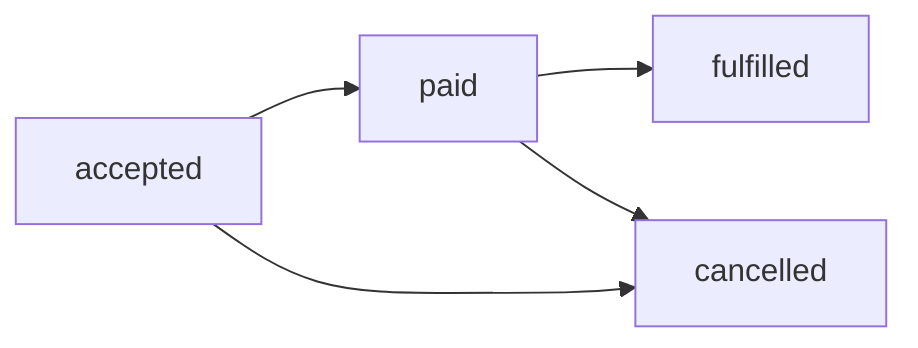

# Bản giảng dạy: Từ yêu cầu mơ hồ đến contract kiểm thử được

## Yêu cầu đồng bộ đơn hàng

Một người nói với đội kỹ thuật:

> Hãy đồng bộ đơn hàng thật nhanh, không được trùng, nếu lỗi thì thử lại.

Nghe có vẻ rõ. Nhưng nếu bắt đầu code ngay, mỗi người có thể hiểu một cách khác.

Ta chưa biết:

- một đơn hàng được nhận diện bằng trường nào;
- hai bản ghi giống nhau có luôn là bản trùng không;
- nhanh được đo từ mốc nào;
- lỗi nào được thử lại;
- timeout có nghĩa là thất bại hay chỉ là chưa biết kết quả;
- dữ liệu sai sẽ bị loại, giữ lại hay làm hỏng cả lượt chạy;
- bằng chứng nào cho thấy đồng bộ đã hoàn tất.

Data Engineer cần biến câu nói ban đầu thành một contract. Contract là tập quy tắc mà input, hệ thống và output phải cùng tuân theo. Mỗi quy tắc phải kiểm được.

## Khi nào một yêu cầu được xem là kiểm thử được?

Một yêu cầu kiểm thử được phải cho hai người độc lập cùng một câu trả lời đúng hoặc sai khi họ nhìn cùng input.

Ví dụ yếu:

> Không được có đơn trùng.

Hai người có thể hiểu trùng theo hai cách:

- cùng `order_id`;
- cùng `source_system` và `order_id`;
- cùng toàn bộ payload;
- cùng đơn nhưng khác phiên bản vẫn bị xem là trùng.

Ví dụ rõ hơn:

> Trong bảng trạng thái hiện tại, mỗi cặp `(source_system, order_id)` có tối đa một dòng đang hiệu lực.

Yêu cầu rõ này có thể được kiểm bằng truy vấn:

```sql
SELECT
    source_system,
    order_id,
    COUNT(*) AS current_rows
FROM curated_orders
WHERE is_current = TRUE
GROUP BY source_system, order_id
HAVING COUNT(*) > 1;
```

Nếu truy vấn trả về dòng, invariant đã bị vi phạm.

`Invariant` là điều luôn phải đúng trong phạm vi contract.

## Sáu phần của một contract rõ ràng

### 1. Decision: hệ thống phục vụ quyết định hay hành động nào?

Ví dụ:

> Fulfillment chỉ xử lý đơn hàng đã được nguồn xác nhận.

Phần này ngăn đội kỹ thuật tối ưu một output không ai dùng.

### 2. Boundary: trách nhiệm bắt đầu và kết thúc ở đâu?

Ví dụ:

> Contract bắt đầu khi API trả payload hợp lệ và kết thúc khi mỗi record có một terminal outcome trong curated hoặc quarantine.

Nếu không có boundary, đội upstream và downstream có thể cùng nghĩ lỗi thuộc về đội kia.

### 3. Semantics: các từ quan trọng có nghĩa gì?

Ta phải định nghĩa:

- entity là gì;
- identity là gì;
- phiên bản nào mới hơn;
- trạng thái nào được phép chuyển sang trạng thái nào;
- complete nghĩa là gì;
- duplicate nghĩa là gì.

### 4. Invariants: điều gì không được phép sai?

Ví dụ:

- tối đa một current row cho mỗi identity;
- event cũ không được ghi đè state mới;
- cùng idempotency key với payload khác phải bị từ chối;
- record sai schema không được lọt vào curated.

### 5. Failure behavior: hệ thống làm gì khi có lỗi?

Ví dụ:

- record sai đi vào quarantine;
- request timeout có trạng thái unknown;
- retry phải dùng lại idempotency key;
- operation đang chạy không được tạo thành operation mới;
- lỗi không thể thử lại phải có terminal outcome.

### 6. Evidence: bằng chứng nằm ở đâu?

Ví dụ:

- run manifest;
- bảng idempotency;
- log state transition;
- reconciliation query;
- metric về số record hợp lệ, lỗi và quarantine;
- fixture cùng expected result đã khóa trước.

Contract quy định hành vi của hệ thống và bằng chứng dùng để kiểm hành vi đó.

## Identity: biết ta đang nói về cùng một thứ

Giả sử nguồn A có `order_id = 42` và nguồn B cũng có `order_id = 42`.

Hai dòng này có thể là hai đơn khác nhau. Vì vậy identity có thể cần cả nguồn:

```text
order_identity = source_system + order_id
```

Nếu chỉ dùng `order_id`, hệ thống có thể xóa nhầm một đơn hợp lệ vì tưởng đó là bản trùng.

Hash toàn bộ payload thay đổi mỗi khi trạng thái đơn hàng đổi, nên không thể đại diện ổn định cho identity của đơn.

### Dừng và hỏi

Hai record có cùng identity nhưng khác trạng thái có phải là duplicate không?

Không nhất thiết. Chúng có thể là hai phiên bản hợp lệ của cùng entity. Contract phải nói hệ thống giữ lịch sử, trạng thái hiện tại hay cả hai.

## State: biết điều gì được phép thay đổi

Một đơn hàng có thể đi qua các trạng thái:



Sơ đồ cho biết các đường chuyển trạng thái. Bảng quy tắc bổ sung điều kiện cho từng đường chuyển.

| State hiện tại | State đến | Quan hệ phiên bản | Quyết định |
|---|---|---|---|
| chưa có | accepted | lần đầu | tạo current row |
| accepted | paid | mới hơn | chuyển sang paid |
| paid | accepted | cũ hơn | giữ paid, ghi nhận event cũ |
| paid | cancelled | mới hơn | áp dụng nếu rule cho phép |
| fulfilled | cancelled | mới hơn | review nếu nghiệp vụ không cho phép |
| bất kỳ | cùng state | cùng phiên bản | trả lại outcome cũ |

Nếu chỉ dùng thứ tự record đến hệ thống, event cũ đến muộn có thể kéo trạng thái từ `paid` về `accepted`. Đó là lỗi.

## Safety và liveness

Hai từ này nghe khó nhưng ý rất đơn giản.

**Safety** hỏi:

> Có điều xấu nào tuyệt đối không được xảy ra không?

Ví dụ:

- không tạo hai current row cho cùng identity;
- event cũ không ghi đè event mới;
- payload sai không vào curated.

Chỉ cần một phản ví dụ là safety đã hỏng.

**Liveness** hỏi:

> Công việc hợp lệ có cuối cùng đi tới kết quả không?

Ví dụ:

- record hợp lệ cuối cùng xuất hiện trong curated;
- record sai cuối cùng có quarantine outcome;
- operation không nằm ở trạng thái đang chạy mãi mãi;
- client cuối cùng tra được outcome.

Một hệ thống có thể giữ safety bằng cách từ chối mọi request. Nhưng hệ thống đó không làm được việc. Vì vậy contract cần cả safety và liveness.

## Given, When, Then để kể một hành vi có thể nhìn thấy

Ta dùng ba phần:

- `Given`: trạng thái ban đầu;
- `When`: việc xảy ra;
- `Then`: kết quả có thể quan sát.

```gherkin
Scenario: Gửi lại cùng một order sau khi client timeout
  Given chưa có current row cho identity partner_a|O-42
  And order O-42 có trạng thái paid
  When cùng request được gửi hai lần với cùng idempotency key
  Then curated có đúng một current row cho partner_a|O-42
  And hai attempt trỏ tới cùng một logical operation
  And manifest ghi hai attempt và một committed outcome
```

Scenario khóa hành vi người dùng có thể quan sát. Đội kỹ thuật vẫn được chọn `MERGE`, queue hoặc cơ chế khác để tạo ra hành vi đó.

## Timeout không đồng nghĩa với thất bại

Khi client timeout, có ít nhất ba khả năng:

1. Request chưa tới server.
2. Server nhận request nhưng chưa commit.
3. Server đã commit nhưng response bị mất.

Client không phân biệt được ba trường hợp đó chỉ từ timeout. Outcome đang ở trạng thái unknown.

Nếu client tạo một request hoàn toàn mới, trường hợp 3 có thể tạo side effect lần thứ hai. Vì vậy retry cần một idempotency key ổn định.

## Idempotency key: nhiều lần gửi, một ý định

Idempotency key giúp server hiểu nhiều request đang nói về cùng một logical operation.

Hành vi tối thiểu:

| Tình huống | Kết quả |
|---|---|
| cùng key, cùng payload, đã thành công | trả outcome cũ |
| cùng key, cùng payload, đang chạy | trả trạng thái đang chạy |
| cùng key, payload khác | trả conflict |
| key mới sau timeout | có nguy cơ tạo operation thứ hai |

Key phải có scope. Ví dụ:

```text
(tenant_id, operation_name, idempotency_key)
```

Nếu hai tenant cùng dùng key `123`, họ vẫn phải có hai operation khác nhau.

## Vì sao kiểm tra rồi mới insert vẫn có thể sai?

Giả sử hai worker chạy cùng lúc:

```text
Worker A: kiểm tra key chưa có
Worker B: kiểm tra key chưa có
Worker A: tạo side effect
Worker B: tạo side effect
```

Cả hai cùng nhìn thấy chưa có vì việc kiểm tra và tạo record không atomic.

Ta cần unique constraint hoặc cơ chế tương đương tại nơi lưu trạng thái:

```sql
CREATE TABLE idempotency_ledger (
    tenant_id        text NOT NULL,
    operation_name   text NOT NULL,
    idempotency_key  text NOT NULL,
    request_hash     text NOT NULL,
    state            text NOT NULL,
    outcome_ref      text,
    PRIMARY KEY (tenant_id, operation_name, idempotency_key)
);
```

Unique key giúp chọn một owner. Nhưng nó chưa trả lời mọi câu hỏi. Contract vẫn phải nói:

- request hash được tạo thế nào;
- operation đang chạy bị bỏ dở được phục hồi thế nào;
- outcome được giữ trong bao lâu;
- key hết hạn có hành vi gì;
- dữ liệu nhạy cảm trong outcome được bảo vệ thế nào.

## Một failure khó: process chết giữa chừng

Thứ tự gây ra vấn đề:

```text
kiểm tra key
thực hiện side effect
process chết
lưu outcome
```

Nếu process chết sau side effect nhưng trước khi lưu outcome, retry có thể không biết việc đã hoàn tất.

Cách xử lý phụ thuộc boundary:

- Nếu dedupe record và business mutation cùng một database, ta có thể đặt chúng trong một transaction.
- Nếu side effect nằm ở hệ thống ngoài, ta cần downstream idempotency hoặc reconciliation.
- Nếu không có cả hai, phải nói rõ vẫn còn rủi ro tạo side effect trùng.

Không được hứa exactly once chỉ vì có idempotency key.

## Biến từ định tính thành phép đo

Yêu cầu nhanh không kiểm được. Ta cần một phép đo.

Ví dụ:

```text
Freshness SLI =
  số order hợp lệ xuất hiện trong curated trước ngưỡng đã thống nhất
  --------------------------------------------------------------
  tổng order hợp lệ thuộc population
```

Ba điều khác nhau phải được tách ra:

- Correctness: dữ liệu có đúng không?
- Freshness: dữ liệu có sẵn đúng ngưỡng không?
- Availability: job và dịch vụ có chạy được không?

Job xanh không chứng minh dữ liệu đúng. Dữ liệu đúng nhưng đến quá muộn vẫn có thể không dùng được cho consumer.

## Acceptance matrix: kiểm cả đường tốt và đường lỗi

Acceptance matrix thay đổi từng yếu tố có thể làm hành vi của hệ thống khác đi.

| Điều thay đổi | Control | Variant | Expected result |
|---|---|---|---|
| Identity | source A, order 42 | source B, order 42 | hai identity độc lập |
| Version | state mới đến trước | state cũ đến sau | state mới được giữ |
| Delivery | một request | cùng request gửi lại | một logical outcome |
| Conflict | cùng key, cùng payload | cùng key, payload khác | conflict được ghi nhận |
| Validation | record hợp lệ | thiếu order ID | record sai vào quarantine |
| Commit | nhận response | commit xong nhưng response mất | status lookup tìm thấy outcome |
| Concurrency | request nối tiếp | hai request đồng thời | một owner, một side effect |

Test chỉ có happy path không đủ. Lỗi thường nằm ở duplicate, out of order, partial failure và concurrency.

## Case đầy đủ: đồng bộ orders

Input nhỏ:

```json
[
  {"source":"partner_a", "order_id":"O-42", "state":"paid", "version":3},
  {"source":"partner_a", "order_id":"O-42", "state":"paid", "version":3},
  {"source":"partner_a", "order_id":"O-42", "state":"accepted", "version":2},
  {"source":"partner_b", "order_id":"O-42", "state":"paid", "version":1},
  {"source":"partner_a", "order_id":null, "state":"paid", "version":1}
]
```

Expected result:

1. Hai record đầu cùng identity và version, nên tạo một current state và có thể có hai attempt.
2. Record thứ ba cũ hơn, nên không kéo state từ `paid` về `accepted`.
3. Record của partner B là identity khác.
4. Record thiếu `order_id` vào quarantine.
5. Mỗi input record có một outcome để reconciliation kiểm được.

Một truy vấn kiểm current state:

```sql
SELECT source_system, order_id, COUNT(*)
FROM curated_orders
WHERE is_current = TRUE
GROUP BY source_system, order_id
HAVING COUNT(*) <> 1;
```

Truy vấn này chỉ kiểm những record đã vào curated. Để bắt record bị mất trước curated, ta cần một control total độc lập từ source và run manifest.

## Cách biết contract đã đủ rõ để bắt đầu làm

Trước khi mutation, hãy kiểm:

- population đã rõ;
- identity đã rõ;
- state transition đã rõ;
- duplicate và conflict đã rõ;
- timeout và retry đã rõ;
- fixture có happy path và failure path;
- expected result được viết trước khi chạy;
- evidence location đã biết;
- điều chưa biết có owner xử lý.

Nếu identity hoặc failure semantics chưa rõ, dừng lại là đúng. Code sớm không làm cho nghĩa của yêu cầu rõ hơn.

## Kiểm tra hiểu bài

Tự trả lời bằng lời của mình:

1. Vì sao timeout không có nghĩa là operation thất bại?
2. Idempotency key khác unique ID của từng attempt ở đâu?
3. Vì sao cùng key nhưng payload khác phải bị từ chối?
4. Safety khác liveness ở đâu?
5. Unique constraint giải quyết race nào?
6. Vì sao truy vấn trên curated chưa đủ để chứng minh không mất dữ liệu?

Nếu chưa trả lời rõ, quay lại sáu phần của contract: decision, boundary, semantics, invariants, failure behavior và evidence.

## Điều cần mang theo

- Một yêu cầu chỉ kiểm được khi cùng input tạo ra expected result rõ ràng.
- Identity, state và version phải được định nghĩa trước duplicate.
- Timeout tạo unknown outcome; retry an toàn cần logical operation identity.
- Idempotency cần key, atomic state và concurrency control.
- Contract cần cả safety và liveness.
- Evidence phải cho biết mỗi input đã đi đâu và operation đã kết thúc thế nào.

## Đọc tiếp trong Second Brain

- [[wiki.data-product.decision-first-discovery|Bắt đầu từ quyết định và boundary]]
- [[wiki.backend.idempotency-keys-deduplication-state|Idempotency key và trạng thái chống trùng]]
- [[wiki.data-product.requirements-traceability|Nối requirement, test và evidence]]
- [[wiki.data-quality.sli-slo-design|Thiết kế SLI và SLO cho dữ liệu]]
