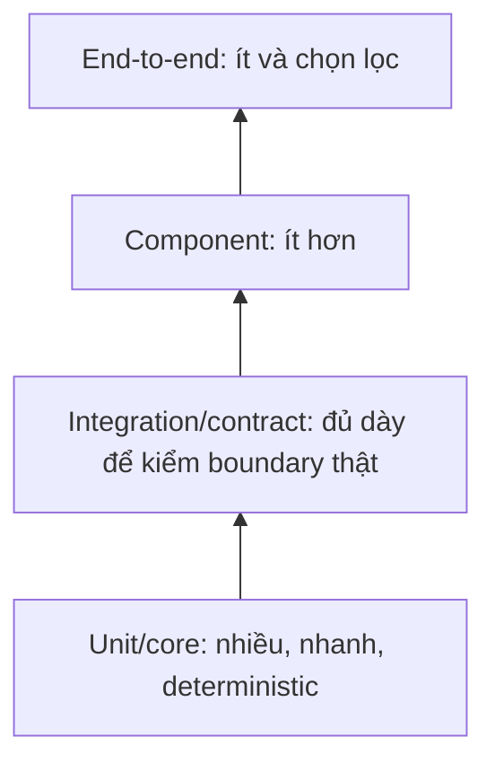

# Phase 3: Software and Backend Engineering
# Module 7: Software Design and Delivery
# Lesson 93: The test pyramid and where to place a double

## Mục tiêu bài học

**Năng lực cần chứng minh.** Đặt đúng tầng cho mười phép kiểm và chứng minh bộ kiểm không đỏ khi tái cấu trúc mà hành vi không đổi.

**Điều kiện hoàn thành.** Mười phép kiểm đặt đúng tầng, và sau khi tái cấu trúc nội bộ thì bộ kiểm xanh mà không sửa phép kiểm nào.

> [!abstract] Câu hỏi trung tâm
> Một test suite tốt phải bắt được lỗi ở database, file format và contract, nhưng không được buộc sửa test mỗi khi đổi cấu trúc bên trong. Cần chọn scope nhỏ nhất có đủ bằng chứng cho rủi ro đang kiểm.

## Bắt đầu từ rủi ro, không từ tên tầng

Mỗi phép kiểm cần trả lời bốn câu:

1. failure nào cần phát hiện?
2. thành phần thật tối thiểu nào phải chạy để failure đó xuất hiện?
3. boundary nào được thay bằng double mà không xóa đúng rủi ro đang kiểm?
4. khi fail, evidence có chỉ ra vị trí đủ hẹp không?

“Unit”, “integration” hay “end-to-end” là mô tả scope. Chúng không tự bảo đảm chất lượng.

## Năm scope hữu dụng

| Scope | Thành phần thật | Rủi ro chính | Tốc độ và chẩn đoán |
|---|---|---|---|
| Unit/core | một unit hành vi, dependency thay thế | rule, branch, invariant | nhanh, lỗi định vị hẹp |
| Integration | adapter + dependency thật | SQL, schema, serialization, protocol | chậm hơn, vẫn hẹp |
| Component/service | một deployable component | wiring, endpoint, internal collaboration | vừa, cần setup |
| Contract | hai phía kiểm cùng interaction spec nhưng chạy riêng | consumer/provider hiểu lệch | nhanh hơn E2E, lỗi rõ |
| End-to-end | đường nghiệp vụ qua hệ đã triển khai | wiring và emergent behavior toàn tuyến | chậm, dễ nhiễu |

> [!source-fact]
> Richardson phân biệt unit, integration, component và end-to-end chủ yếu theo scope; scope càng lớn thường càng chậm, phức tạp và kém ổn định. *Microservices Patterns*, Chapter 9, PDF 321–328.

## Test pyramid là allocation heuristic



Pyramid nói số lượng giảm khi scope tăng. Nó không quy định tỷ lệ cố định.

Với pipeline dữ liệu, integration layer thường dày hơn ứng dụng thuần tính toán vì lỗi hay nằm ở:

- SQL dialect, transaction và constraint;
- encoding, delimiter và schema file;
- serialization của timestamp/decimal/null;
- object store, message broker và permission;
- version drift của dependency.

> [!synthesis]
> Richardson cung cấp test pyramid; Sommerville nhấn mạnh interface error không lộ ra qua unit test của từng object. Vì vậy “nhiều unit, rất ít mọi thứ khác” là thiếu bằng chứng cho pipeline có nhiều boundary dữ liệu.

## Test double là gì?

Test double thay một dependency trong scope kiểm. Các vai trò thường gặp:

| Loại | Hành vi | Dùng để |
|---|---|---|
| Stub | trả dữ liệu đã định | đưa SUT vào nhánh cụ thể |
| Fake | implementation rút gọn nhưng chạy được | thay dependency đắt khi semantics đủ gần |
| Mock | ghi/kiểm interaction kỳ vọng | kiểm protocol quan trọng |
| Spy | ghi lại call trong khi vẫn chạy behavior | quan sát interaction |
| Dummy | chỉ lấp tham số, không được dùng | hoàn tất construction |

Richardson dùng phân biệt hẹp: stub trả giá trị; mock còn xác minh SUT gọi dependency thế nào. Thuật ngữ giữa framework có thể khác, nên test phải mô tả behavior thay vì dựa vào nhãn.

## Quy tắc placement: double ở boundary bên ngoài scope

Đặt double tại port hoặc protocol mà scope kiểm **không sở hữu** hoặc không cần xác minh trong phép kiểm đó.

Ví dụ khi unit-test `ImportOrders`:

- double `OrderSource` và `OrderRepository`: hợp lý;
- mock `Normalizer` private method: làm test bám implementation;
- mock từng call của list/dict/domain entity: sai scope;
- dùng database fake rồi kết luận SQL đúng: xóa rủi ro cần kiểm.

### Owner không đồng nghĩa “công ty mình viết”

Boundary cần xét theo unit đang kiểm. Một adapter do cùng đội viết vẫn nằm ngoài core test, nhưng phải được kiểm thật ở integration test riêng.

## Behavior test và implementation-coupled test

Behavior test:

```python
report = ImportOrders(source, repository).execute()
assert report.saved == 2
assert repository.saved_orders == expected_orders
```

Implementation-coupled test:

```python
normalizer.normalize.assert_called_once()
deduplicator.find_existing.assert_called_before(repository.save)
```

Nếu contract không hứa call order, test thứ hai biến cấu trúc hiện tại thành requirement giả.

## Phép thử refactor

Một test suite đạt yêu cầu L093 phải sống qua thay đổi sau:

```text
Trước: ImportOrders vừa normalize, deduplicate, save
Sau:   tách NormalizationPolicy và DuplicatePolicy nội bộ
```

Public input, output và side effect không đổi. Không test nào được sửa. Nếu test đỏ vì class private mới hoặc call order đổi, double đã đặt quá sâu.

## Mười tình huống và tầng phù hợp

| # | Tình huống | Tầng chính | Double? | Lý do |
|---:|---|---|---|---|
| 1 | amount âm bị từ chối | unit/domain | không hoặc builder | pure invariant |
| 2 | duplicate trong cùng batch | unit/application | fake repository port | kiểm policy, không kiểm SQL |
| 3 | CSV quoted comma | integration CSV adapter | không với parser/tệp | chính parser là rủi ro |
| 4 | timestamp ghi/đọc giữ timezone | integration PostgreSQL | DB thật | fake không chứng minh DB conversion |
| 5 | unique constraint khi concurrent write | integration PostgreSQL | không | cần concurrency/constraint thật |
| 6 | repository timeout được dịch đúng | adapter integration | faulting boundary hoặc proxy | cần exception translation |
| 7 | CLI map exit code đúng | component | double outbound ports | kiểm inbound wiring |
| 8 | consumer đọc response hiện tại | contract | stub sinh từ contract | kiểm interaction shape |
| 9 | pipeline tối thiểu từ CSV tới DB | component/E2E hẹp | dependency ngoài scope | kiểm wiring chính |
| 10 | deploy toàn hệ xử lý một golden order | E2E | hạn chế double | smoke đường quan trọng |

Không có đáp án chỉ dựa vào “test này nghe giống integration”. Bằng chứng cần quyết định.

## Integration test không phải test mọi thứ cùng lúc

Một integration test tốt giữ scope hẹp:

```text
PostgresOrderRepository + PostgreSQL container + migration
```

Nó không cần CLI, CSV reader hay scheduler. Khi fail, ta biết boundary database có vấn đề.

> [!source-fact]
> Sommerville cho rằng component interface testing cần tập trung vào interface của nhóm object vì lỗi interaction có thể không phát hiện được khi test từng object riêng. *Software Engineering*, Chapter 8, PDF 238–240.

## Contract test không thay business test

Contract test trả lời hai phía có đồng ý về method/path/header/message shape hay không. Nó không chứng minh provider tính đúng tổng tiền hoặc consumer hiển thị đúng quyết định nghiệp vụ.

Contract testing được triển khai sâu ở [[Consumer-Provider Contract Testing|Kiểm thử hợp đồng giữa producer và consumer]].

## End-to-end: giữ ít nhưng có chủ đích

E2E phù hợp để kiểm:

- deploy/wiring/configuration;
- authentication và routing;
- một số user journey có giá trị cao;
- emergent behavior chỉ xuất hiện khi ghép hệ.

Không phù hợp để phủ mọi edge case vì:

- setup chậm;
- failure localization kém;
- phụ thuộc dữ liệu, clock, network và service availability;
- số tổ hợp bùng nổ;
- flakiness làm đội bỏ qua tín hiệu.

> [!source-fact]
> Newman khuyến nghị giảm test có scope lớn, dùng service/contract tests để nhận feedback nhanh hơn; consumer-driven contracts có thể phát hiện breaking change trước production mà không dựng E2E đắt đỏ. *Building Microservices*, Chapter 9, PDF 353–372.

## Determinism

Kiểm soát các nguồn không xác định:

- clock qua `Clock` port;
- random bằng seed được ghi;
- ID generator qua port;
- sort order được contract hóa;
- test data có namespace riêng;
- cleanup độc lập và idempotent;
- concurrency test ghi worker count và scheduling conditions.

Không mock clock bên trong mọi class; đưa time dependency ra boundary nơi policy dùng nó.

## Test data builder

Builder giữ test tập trung vào khác biệt:

```python
def an_order(**overrides):
    base = {
        "order_id": "O-100",
        "customer_id": "C-1",
        "occurred_at": "2026-09-28T00:00:00Z",
        "amount": "125.00",
    }
    return base | overrides
```

Builder không được che field quan trọng đến mức test vô tình dùng default sai. Snapshot của toàn object cũng cần review để tránh approve thay đổi hàng loạt mà không đọc semantics.

## Characterization test cho mã cũ

Khi refactor module chưa có test:

1. chọn input đại diện và edge cases;
2. ghi output và side effect hiện tại;
3. xác nhận với owner phần behavior cần giữ;
4. biến chúng thành characterization tests;
5. refactor từng bước;
6. sửa bug ở change riêng với expected behavior mới.

Characterization test ghi nhận hiện trạng; nó không tuyên bố mọi hành vi hiện tại là đúng.

## Contract của integration fixture

Fixture phải nói rõ:

- dependency version/image digest;
- migration version;
- seed data và isolation strategy;
- startup readiness condition;
- cleanup semantics;
- resource limits;
- timeout;
- evidence khi setup fail.

Nếu fixture tự động fallback sang SQLite khi PostgreSQL không lên, test có thể xanh nhưng mất rủi ro cần kiểm.

## Flaky test là defect của bộ đo

Quy trình:

1. giữ failure artifact;
2. phân loại nondeterminism: clock, order, race, network, shared state;
3. tái hiện bằng seed/load/loop;
4. sửa nguyên nhân;
5. chỉ quarantine test có owner và expiry;
6. không rerun đến xanh rồi bỏ qua.

Flake rate cần đo, nhưng không có ngưỡng phổ quát trong ba nguồn.

## Ngộ nhận thường gặp

- “Unit test phải test một function”: unit là scope hành vi có ý nghĩa.
- “Mock làm test nhanh nên mock càng nhiều càng tốt”: mock sai boundary làm test brittle.
- “Integration test luôn chậm”: scope hẹp và fixture tốt có thể chạy nhanh, nhưng vẫn đắt hơn core.
- “E2E giống người dùng nên đáng tin nhất”: nó kiểm đường rộng nhưng định vị kém và bỏ sót tổ hợp.
- “Coverage cao nghĩa là test tốt”: coverage không chứng minh assertion hoặc rủi ro đúng.
- “Refactor làm test đỏ là bình thường”: nếu behavior giữ nguyên, đó là tín hiệu test bám implementation.

## Source coverage

| Source slice | Nội dung phải giữ | Vị trí trong note | Trạng thái |
|---|---|---|---|
| [[SRC-RICHARDSON-MICROSERVICES-PATTERNS-1E]], Ch. 9–10 pp. 321–348 | service/component/integration test scope và test double | §§2, 4–11 | Đã trình bày scope và double placement theo boundary |
| [[SRC-NEWMAN-BUILDING-MICROSERVICES-2E]], Ch. 9 pp. 353–372 | test pyramid, service/contract/E2E trade-off | §§3, 8–11 | Đã trình bày allocation heuristic và chi phí feedback |
| [[SRC-SOMMERVILLE-SOFTWARE-ENGINEERING-10E]], Ch. 8 pp. 228–242 | unit/component/interface/system testing | §§1–2, 9, 15 | Đã trình bày interface risk và fixture contract |
| Tổng hợp bài DE-L093 | 10 scenario, refactor-resilience test, determinism và evidence pack | §§7–8, 12–18 | Đã gắn `synthesis`; lựa chọn tầng dựa trên rủi ro chứ không dựa tên gọi |

Tool/framework cụ thể không được coi là định nghĩa của tầng test. Note giữ semantics của scope để chuyển được giữa ngôn ngữ và runtime.

## Key takeaways

- Chọn tầng theo failure cần phát hiện và thành phần thật tối thiểu cần chạy.
- Pyramid là heuristic phân bổ, không phải tỷ lệ cứng.
- Pipeline dữ liệu cần đủ integration test cho database, file format và protocol.
- Double đặt ở boundary ngoài scope; mock thành phần nội bộ làm test bám cấu trúc.
- Refactor giữ behavior phải không buộc sửa test.
- Contract test và E2E có mục đích riêng; không tầng nào thay toàn bộ tầng khác.

## Giới hạn

- Mười tình huống là thiết kế kiểm thử, chưa được cài trên code Bài 32.
- Nguồn dùng thuật ngữ test double không hoàn toàn đồng nhất; note công bố định nghĩa đang dùng.
- Chưa benchmark runtime hoặc flake rate của test suite thật.
- Không đặt tỷ lệ unit/integration/E2E phổ quát.
- Security, performance và chaos testing chỉ nằm ngoài phạm vi note này.

## Reference

1. [[SRC-RICHARDSON-MICROSERVICES-PATTERNS-1E]] — Chris Richardson, *Microservices Patterns*, Chapters 9–10, PDF 321–348.
2. [[SRC-NEWMAN-BUILDING-MICROSERVICES-2E]] — Sam Newman, *Building Microservices*, Second Edition, Chapter 9, PDF 353–372.
3. [[SRC-SOMMERVILLE-SOFTWARE-ENGINEERING-10E]] — Ian Sommerville, *Software Engineering*, Chapter 8, PDF 228–242.
