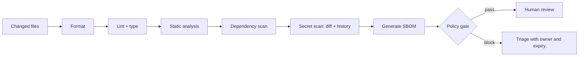

# Phase 3: Software and Backend Engineering
# Module 7: Software Design and Delivery
# Lesson 96: Static analysis, dependency and security scanning

## Mục tiêu bài học

**Năng lực cần chứng minh.** Dựng bộ kiểm tự động bốn loại với ngưỡng chặn rõ, và chứng minh nó bắt được lỗi ở cả bốn loại.

**Điều kiện hoàn thành.** Bốn vi phạm đều bị chặn ở đúng bước, và tài liệu ngưỡng chặn nêu rõ mức nào chặn mức nào cảnh báo.

> [!abstract] Câu hỏi trung tâm
> Gate tốt chặn lỗi có tín hiệu rõ trước review, nhưng vẫn cho biết vì sao bị chặn, ai sở hữu finding và ngoại lệ hết hạn khi nào. “Bật mọi rule” không phải một security programme.

## Sáu lớp kiểm không thay thế nhau

| Lớp | Câu hỏi | Ví dụ failure | Giới hạn |
|---|---|---|---|
| Formatter | văn bản có canonical form? | spacing/import order | không hiểu correctness |
| Linter | có pattern đáng ngờ? | biến không dùng, branch vô hiệu | có false positive |
| Type checker | value có phù hợp contract kiểu? | nullable bị dùng như non-null | không chứng minh runtime semantics |
| Static analyzer | data/control flow có đường lỗi? | resource leak, injection path | model không bao phủ mọi runtime |
| Dependency scanner | component có advisory đã biết? | package/version khớp CVE | match sai hoặc chưa biết exploitability |
| Secret scanner | credential có nằm trong content/history? | token, private key | phát hiện không đồng nghĩa đã rotate |

> [!source-fact]
> Sommerville mô tả static analyzer là công cụ parse source để nhận diện anomaly và possible fault mà không chạy chương trình; kết quả phải được con người đánh giá vì có thể gồm false alarm. *Software Engineering*, 10e, PDF 359–364.

## Pipeline từ rẻ đến đắt



Formatter và lint chạy local để feedback trong giây. Scan sâu chạy trong CI nhưng vẫn phải deterministic và pin tool/rule version. Human review tập trung vào logic, model và trade-off thay vì spacing.

## Dependency scanning không phải grep tên package

Quy trình tối thiểu:

1. lấy dependency graph đã resolve, gồm transitive dependency;
2. chuẩn hóa identity và version;
3. đối chiếu advisory database tại một thời điểm ghi nhận;
4. giữ evidence của match;
5. xác định package có thực sự được đóng gói và code path có reachable không;
6. chọn upgrade, mitigation, accept tạm thời hoặc loại dependency;
7. quét lại khi advisory database cập nhật.

> [!source-fact]
> OWASP Dependency-Check mô tả SCA là nhận diện dependency rồi đối chiếu với lỗ hổng đã công bố. Vì identification có thể dựa trên evidence và CPE mapping, report cần triage chứ không phải mọi match đều tự động là exploitable. Trang dự án OWASP, truy cập 2026-09-28.

Một dependency “không có CVE” chỉ có nghĩa scanner chưa tìm thấy advisory phù hợp trong dữ liệu nó có; không chứng minh dependency an toàn.

## Secret đã commit là sự cố credential

Xóa chuỗi khỏi commit mới không làm nó biến mất khỏi history hoặc clone đã tồn tại. Thứ tự phản ứng:

1. revoke hoặc rotate credential;
2. xác định scope và log sử dụng;
3. thay consumer sang secret mới;
4. quét toàn history và các branch;
5. chỉ rewrite history khi risk/cost biện minh;
6. thêm push protection hoặc pre-commit control.

> [!source-fact]
> GitHub Docs nêu secret scanning quét toàn bộ Git history trên mọi branch đối với loại secret được hỗ trợ và khuyến nghị rotate credential bị lộ. Khả năng áp dụng cho private repository phụ thuộc gói sản phẩm. Truy cập 2026-09-28.

## SBOM là inventory, không phải bản án

Một SBOM hữu dụng cần ít nhất:

- định danh artifact tạo BOM;
- component name, version và package identifier;
- dependency relationship;
- tool và thời điểm tạo;
- schema/spec version;
- provenance đủ để tái tạo.

CycloneDX biểu diễn component và quan hệ của chúng, cùng metadata/provenance. SBOM giúp trả lời “artifact nào chứa component X?” khi advisory mới xuất hiện. Nó không tự kết luận vulnerability reachable và không thay dependency scanner.

## Policy gate phải được viết trước finding

Ví dụ policy có thể tái hiện:

```yaml
format: block-any-diff
lint: block-error
typecheck: block-error
static_analysis:
  block: [high-confidence-high-impact]
  warn: [medium-confidence]
dependency:
  block: [critical, high]
  exception_requires: [owner, reason, compensating-control, expires_at]
secret:
  block: true
  response: rotate-first
sbom:
  required: true
```

Severity do tool gắn không đủ. Policy cần confidence, reachability nếu có, môi trường triển khai và thời hạn ngoại lệ. Baseline debt cũ có thể được snapshot, nhưng **new findings** không được tăng.

## Triage có trạng thái

Mỗi finding cần:

- fingerprint ổn định;
- file/component và evidence;
- owner;
- disposition: fix, false positive, accepted risk, not affected;
- lý do và link ticket;
- ngày hết hạn;
- tool/ruleset/advisory DB version.

Suppress không có expiry biến thành kho chôn lỗi. Đổi tool version mà không lưu baseline làm số finding thay đổi không giải thích được.

## Failure modes

- bật hàng nghìn rule cùng lúc, CI đỏ liên tục rồi cả đội bypass;
- chỉ quét working tree nên bỏ secret trong history;
- dùng severity làm policy duy nhất;
- không pin tool/ruleset nên cùng commit cho kết quả khác;
- tạo SBOM nhưng không lưu cạnh artifact;
- chấp nhận risk không owner, không expiry;
- coi scan pass là chứng minh bảo mật.

## Static analysis hoạt động trên mô hình nào?

Formatter chỉ chuẩn hóa text. Linter thường xét syntax tree và pattern cục bộ. Static analyzer sâu hơn có thể dựng control-flow graph, data-flow facts và call graph để suy luận đường giá trị đi qua chương trình mà không thực thi code.

Ví dụ taint analysis cần ít nhất ba loại mô hình:

- **source:** nơi dữ liệu chưa tin cậy đi vào, như request parameter;
- **propagation:** phép gán, nối chuỗi hoặc wrapper truyền taint;
- **sink:** thao tác nhạy cảm như SQL execution hoặc shell command;
- **sanitizer:** phép biến đổi được chứng minh phù hợp với sink cụ thể.

Nếu library wrapper không được model, analyzer có thể bỏ sót propagation hoặc báo sai. Finding phải giữ rule ID, path và đoạn trace; chỉ ghi “SAST failed” làm mất bằng chứng cần cho triage.

## Type checking và runtime validation

Type checker bắt mâu thuẫn trong model kiểu, nhưng input từ JSON, database, queue hoặc file vẫn đi vào runtime dưới dạng byte/string. Boundary cần parse và validate trước khi biến input thành domain type.

Ba lớp không đồng nhất:

1. schema validation kiểm shape và constraint của payload;
2. type checker kiểm chương trình sử dụng giá trị theo declaration;
3. business validation kiểm invariant phụ thuộc trạng thái hoặc ngữ cảnh.

Một object thỏa JSON Schema vẫn có thể vi phạm rule “ngày kết thúc phải sau ngày bắt đầu” hoặc “customer phải còn hoạt động”. Không dùng type-check pass làm bằng chứng dữ liệu hợp lệ.

## Dependency graph, lockfile và identity

Scanner cần biết dependency đã resolve, không chỉ manifest khai báo range. Lockfile hoặc build graph cho biết version thực tế, nhưng container/base image và binary vendored có thể nằm ngoài graph của package manager.

Inventory nên phân biệt:

- direct và transitive dependency;
- development/test và runtime dependency;
- source package và component thực sự có trong artifact;
- package version, commit hoặc digest;
- platform-specific variant;
- container base image và OS packages.

Sai identity tạo hai loại lỗi: bỏ sót advisory của component thật hoặc gán CVE cho component trùng tên. Vì vậy finding cần Package URL/CPE hoặc identifier tương đương cùng evidence mapping.

## Severity, exploitability và quyết định chặn

CVSS hoặc severity mô tả thuộc tính của vulnerability theo dữ liệu công bố; nó không tự trả lời component có reachable trong deployment hiện tại hay không. Policy gate nên kết hợp:

- severity và confidence của match;
- component có nằm trong artifact deploy không;
- affected version range;
- exploit precondition;
- network exposure và privilege;
- fix version khả dụng;
- compensating control;
- thời gian tồn tại của exception.

Reachability analysis có thể giảm nhiễu nhưng cũng phụ thuộc call graph và dynamic behavior. `not reachable` là một finding cần evidence, không phải lý do đóng tự động vĩnh viễn.

## Secret detection: pattern, entropy và validity

Scanner có thể dùng prefix/pattern của provider, entropy hoặc custom regex. Pattern chặt giảm false positive nhưng bỏ sót secret nội bộ; entropy bắt chuỗi ngẫu nhiên nhưng dễ báo nhầm hash hoặc fixture.

Triage phải tránh làm lộ lại secret trong log. Chỉ lưu fingerprint, location và provider metadata cần thiết. Nếu scanner hỗ trợ validity check, kết quả “không còn hợp lệ” không xóa sự kiện exposure; vẫn cần kiểm thời gian token còn hiệu lực và audit log.

Test injection dùng token giả có prefix dành cho fixture. Không commit credential thật để chứng minh scanner hoạt động.

## SBOM gắn với artifact nào?

SBOM phải được sinh từ hoặc đối chiếu với artifact cụ thể. Một BOM sinh từ source tree trước build có thể khác thứ được đóng gói. Tối thiểu cần liên kết:

```text
source commit
  -> build run
  -> artifact digest
  -> SBOM digest
  -> scan report + advisory DB timestamp
  -> release manifest
```

Khi advisory mới xuất hiện, truy vấn theo component identity để tìm artifact/release bị ảnh hưởng rồi quét lại. Nếu SBOM không có dependency relationship hoặc artifact identity, nó chỉ là danh sách package khó dùng cho incident response.

## Rollout policy không làm CI tê liệt

Với kho đã có technical debt, bật gate theo ba giai đoạn:

1. **Observe:** chạy scanner, đo volume, precision và thời gian xử lý; chưa chặn.
2. **Baseline:** chốt debt hiện tại, gán owner và không cho finding mới tăng.
3. **Enforce:** chặn class finding đã đạt precision và SLA xử lý đủ tốt.

Không hạ severity để làm dashboard đẹp. Baseline phải có fingerprint, ngày chụp và điều kiện xóa. Rule mới hoặc tool upgrade cần chạy shadow trước khi thay policy.

## Thiết kế pipeline có khả năng tái hiện

Mỗi bước ghi lại:

- tool image/digest và rule pack version;
- input commit và artifact digest;
- config/policy version;
- advisory database timestamp;
- output report ở định dạng máy đọc;
- exit code và reason của gate;
- exception record được áp dụng.

Cache có thể tăng tốc nhưng không được làm scanner dùng advisory DB cũ vô thời hạn. Network failure khi cập nhật database phải có policy fail-open hay fail-closed rõ; lựa chọn phụ thuộc risk tier, không giấu dưới một retry vô hạn.

## Ma trận ownership

| Finding | Owner đầu tiên | Evidence đóng finding |
|---|---|---|
| Format/lint | tác giả change | formatter/lint pass |
| Type/static defect | code owner | fix + regression test hoặc suppression có lý do |
| Vulnerable dependency | service owner | upgraded artifact hoặc accepted-risk record còn hạn |
| Exposed secret | credential owner + security | revoke/rotate time và audit scope |
| SBOM thiếu component | build/platform owner | BOM mới gắn artifact digest |

Scanner team sở hữu chất lượng rule và infrastructure; họ không thể thay service owner quyết định business exposure.

## Giới hạn

- Static analysis không quan sát đầy đủ reflection, code generation, runtime configuration hoặc native boundary.
- SCA phụ thuộc inventory và advisory data; zero finding không chứng minh zero vulnerability.
- Secret scanner không phát hiện mọi credential format và không xác định toàn bộ blast radius.
- SBOM cho biết thành phần và quan hệ theo schema; nó không thay provenance attestation hoặc chữ ký artifact.
- Policy mẫu trong note là teaching specification, không phải ngưỡng production dùng chung.

> [!synthesis]
> Ma trận gate, baseline debt và phép thử tiêm là thiết kế giảng dạy cho DE-L096. Nguồn hỗ trợ từng cơ chế; ngưỡng cụ thể phải do threat model và risk appetite của hệ thống quyết định.

## Reference

1. [[SRC-SOMMERVILLE-SOFTWARE-ENGINEERING-10E]] — static program analysis, PDF 359–364.
2. [[SRC-FORSGREN-HUMBLE-KIM-ACCELERATE-1E]] — continuous delivery feedback và automation, PDF 74–81, 228–232.
3. [[SRC-NEWMAN-BUILDING-MICROSERVICES-2E]] — pipeline, static analysis và artifact traceability, PDF 257–261.
4. [[SRC-OWASP-DEPENDENCY-CHECK]] — SCA và known-vulnerability matching, truy cập 2026-09-28.
5. [[SRC-GITHUB-SECRET-SCANNING]] — history scanning và remediation qualifier, truy cập 2026-09-28.
6. [[SRC-CYCLONEDX-SPEC-OVERVIEW]] — BOM structure và provenance, truy cập 2026-09-28.

## Source coverage

| Source slice | Nội dung phải giữ | Vị trí trong note | Trạng thái |
|---|---|---|---|
| [[SRC-SOMMERVILLE-SOFTWARE-ENGINEERING-10E]], pp. 359–364 | static program analysis và giới hạn của phân tích không thực thi | §§1–3, 10–11 | Đã trình bày syntax/control/data-flow model và boundary validation |
| [[SRC-FORSGREN-HUMBLE-KIM-ACCELERATE-1E]], pp. 74–81, 228–232 | automation, fast feedback và delivery capability | §§2, 6–7, 16–17 | Đã trình bày pipeline order, rollout policy và reproducibility |
| [[SRC-NEWMAN-BUILDING-MICROSERVICES-2E]], pp. 257–261 | pipeline và artifact traceability | §§2, 15, 17 | Đã trình bày chuỗi source–artifact–SBOM–scan |
| [[SRC-OWASP-DEPENDENCY-CHECK]] | dependency identity và known-vulnerability matching | §§3, 12–13 | Đã trình bày SCA, reachability qualifier và gate decision |
| [[SRC-GITHUB-SECRET-SCANNING]] | history scanning và remediation | §§4, 14 | Đã trình bày rotation, history scope và safe fixture |
| [[SRC-CYCLONEDX-SPEC-OVERVIEW]] | BOM structure, component identity và provenance | §§5, 15 | Đã trình bày SBOM gắn artifact digest và incident lookup |
| Tổng hợp bài DE-L096 | bốn injection, triage state, ownership và baseline rollout | §§7–9, 16, 18 | Đã gắn `synthesis`; threshold cụ thể phải theo risk appetite |

Scanner pass không chứng minh hệ thống an toàn. Tool version, ruleset và advisory database phải được pin khi biến note thành lab có kết quả tái hiện.

## Key takeaways

- Mỗi scanner trả lời một câu hỏi khác; không lớp nào thay review hay runtime test.
- Gate chỉ bền khi policy, owner, exception và expiry được định nghĩa trước.
- Credential đã commit phải rotate; xóa text khỏi HEAD chưa xử lý exposure.
- SBOM là inventory có lineage, không phải kết luận vulnerability hay exploitability.
