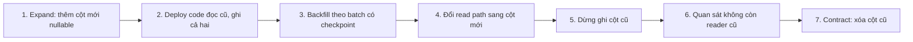
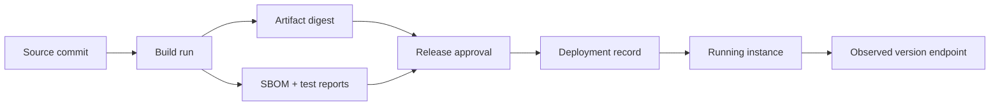

# Phase 3: Software and Backend Engineering
# Module 7: Software Design and Delivery
# Lesson 97: Release artifacts, versions and migration compatibility

## Mục tiêu bài học

**Năng lực cần chứng minh.** Thực hiện một thay đổi lược đồ phá vỡ theo quy trình hai giai đoạn mà không gây gián đoạn.

**Điều kiện hoàn thành.** Không yêu cầu nào thất bại qua toàn bộ quá trình, và cả hai phiên bản cùng chạy được ở mọi bước trung gian.

> [!abstract] Câu hỏi trung tâm
> Release đáng tin không bắt đầu bằng “build lại ở production”. Nó bắt đầu bằng một artifact bất biến đã qua kiểm thử, có danh tính và provenance; sau đó mọi thay đổi dữ liệu phải giữ được vùng tương thích trong lúc bản cũ và bản mới cùng tồn tại.

## Tách build, release và deploy

- **Build:** biến source cùng dependency/toolchain thành artifact.
- **Release:** phê duyệt một artifact version cụ thể cho một phạm vi sử dụng.
- **Deploy:** đặt artifact đã phê duyệt vào một environment.

Cùng một commit nhưng build hai lần có thể khác vì dependency resolution, base image, compiler hoặc timestamp. Vì vậy, “build lại cho staging rồi build lại cho production” làm mất bằng chứng rằng thứ được kiểm thử là thứ đang chạy.

> [!source-fact]
> Newman khuyến nghị build deployment artifact một lần, lưu trong repository và dùng chính artifact đó qua các stage; configuration theo environment nằm ngoài artifact. *Building Microservices*, 2e, PDF 257–261.

## Release identity

Một release manifest tối thiểu:

```yaml
release_id: orders-2026.09.28.3
artifact:
  digest: sha256:...
  registry: registry.example/orders
source:
  commit: 4f2d...
build:
  pipeline_run: 9182
  toolchain: go1.25.1
checks:
  test_report: reports/test-9182.json
  sbom: orders-2026.09.28.3.cdx.json
  migration_set: db/20260928
```

Version giúp con người nói chuyện; digest chứng minh byte identity. Mutable tag như `latest` không đủ làm bằng chứng deploy.

## Version nói về contract nào?

Cần tách:

- artifact version;
- API/event contract version;
- database schema version;
- configuration version;
- data model hoặc semantic version nếu consumer phụ thuộc.

Semantic versioning có ích khi public contract và quy tắc compatibility được xác định. Nó không tự làm thay đổi trở nên tương thích. “Chỉ tăng major” vẫn có thể làm consumer hỏng nếu rollout không có giai đoạn coexistence.

## Vùng tương thích khi rollout

Trong rolling, blue-green hoặc canary, có lúc hai phiên bản cùng chạy:

| Thành phần | Bản cũ cần | Bản mới cần |
|---|---|---|
| Reader | đọc schema cũ | đọc được schema cũ và mới |
| Writer | ghi format cũ | tạm thời ghi format tương thích hoặc dual-write |
| Database | giữ cột/field cũ | thêm cấu trúc mới không phá cũ |
| Consumer | hiểu event cũ | chuyển dần sang event mới |

Compatibility phải xét cả đọc lẫn ghi. Backward compatible trong API response không đủ nếu một writer mới ghi dữ liệu mà binary cũ không đọc được sau rollback.

## Expand → migrate → contract

Ví dụ đổi `customer_name` thành `customer_display_name`:



Mỗi bước phải có invariant và rollback point.

| Bước | Invariant | Rollback an toàn khi |
|---|---|---|
| expand | code cũ vẫn chạy | DDL additive đã hoàn tất |
| dual-write | hai cột thống nhất | writer cũ/mới đều đọc được |
| backfill | không bỏ sót, chạy lại được | job có checkpoint và idempotent |
| switch-read | metric mismatch bằng 0 | cột cũ vẫn còn |
| contract | không còn consumer cũ | rollback binary cũ không còn là yêu cầu |

## Backfill không phải một câu SQL vô danh

Backfill production cần:

- batch key ổn định và checkpoint;
- idempotency;
- throttle để không chiếm I/O của workload chính;
- count trước/sau và reconciliation;
- xử lý record được cập nhật đồng thời;
- trạng thái hoàn tất có thể audit.

Dual-write có nguy cơ một bên thành công, một bên lỗi. Nếu không có transaction chung, phải ghi mismatch metric hoặc outbox/reconciliation path. Không nói “ghi cả hai” như thể atomicity tự xuất hiện.

## Release notes phục vụ vận hành

Release note không phải danh sách commit. Nó cần:

- thay đổi contract mà consumer quan sát;
- migration và thứ tự chạy;
- compatibility window;
- feature flag/config mới;
- metric và alert dùng để xác nhận;
- rollback/roll-forward condition;
- thao tác không thể đảo ngược.

> [!source-fact]
> *Accelerate* dùng lead time, deployment frequency, time to restore và change fail rate để đo delivery performance; sách tránh đánh đổi tốc độ và ổn định thành hai cực loại trừ nhau. PDF 45–51.

## Failure modes

- build riêng cho từng environment;
- deploy bằng mutable tag;
- migration phá vỡ chạy trước binary tương thích;
- dual-write không có reconciliation;
- xóa cột cũ ngay khi bản mới vừa lên;
- version tăng nhưng contract change không được công bố;
- rollback code sau khi dữ liệu đã đổi một chiều.

## Artifact bất biến và build có thể tái tạo

**Build once** yêu cầu pipeline tạo một artifact rồi promote artifact đó. **Reproducible build** là yêu cầu mạnh hơn: cùng source, dependency và toolchain tạo cùng output. Hai khái niệm hỗ trợ nhau nhưng không đồng nhất.

Build once bảo vệ đường phát hành hiện tại khỏi drift giữa environment. Reproducible build giúp audit và recovery về sau, nhưng đòi kiểm soát timestamp, dependency resolution, compiler, locale và build input. Một dự án có thể build once đúng dù chưa đạt byte-for-byte reproducibility; release manifest phải ghi giới hạn này.

Artifact nên bất biến theo digest. Nếu registry cho phép đẩy lại cùng tag, policy deploy phải resolve tag thành digest và lưu digest thực tế. Promotion đổi trạng thái phê duyệt hoặc location, không rebuild.

## Configuration và secret không nằm trong artifact

Artifact dùng chung giữa environment chỉ khả thi khi configuration được cấp lúc deploy hoặc runtime. Cần phân biệt:

- configuration không nhạy cảm, có version và schema;
- secret do secret manager cấp, không ghi vào image;
- feature flag có owner và lifecycle;
- environment identity dùng để chọn dependency endpoint;
- migration bundle gắn release nhưng chạy theo stage riêng.

Externalized configuration không có nghĩa đọc tùy ý từ environment variable ở mọi chỗ. Application nên parse một lần, validate đầy đủ và tạo typed configuration. Sai cấu hình phải fail trước khi nhận traffic, không phát hiện ngẫu nhiên ở request thứ một nghìn.

## Provenance từ source đến runtime

Một đường truy vết hoàn chỉnh:



Runtime nên xuất release ID hoặc digest qua metric/build-info endpoint có kiểm soát. Nếu incident chỉ biết “version 2.3” nhưng tag đã bị ghi đè, không thể nối behavior về source và test report.

## Version compatibility là quan hệ có hướng

Gọi `R_old` và `R_new` là reader cũ và mới; `W_old`, `W_new` là writer cũ và mới. Một rollout có rollback an toàn thường cần kiểm bốn cặp:

| Writer → Reader | Câu hỏi |
|---|---|
| `W_old → R_old` | baseline còn hoạt động? |
| `W_old → R_new` | bản mới đọc dữ liệu cũ? |
| `W_new → R_new` | đường mới đúng? |
| `W_new → R_old` | rollback binary cũ còn đọc dữ liệu mới? |

Nhiều đội chỉ kiểm cặp thứ ba. Cặp thứ tư quyết định rollback. Nếu `W_new` ghi enum value hoặc format mà `R_old` không biết, schema có thể vẫn parse nhưng semantic compatibility đã mất.

## Các dạng thay đổi lược đồ

### Thêm field hoặc cột

Thêm nullable field thường ít rủi ro hơn nhưng vẫn cần kiểm consumer strict, payload size, default semantics và index/build cost. Nếu field mới bắt buộc, rollout nên bắt đầu bằng nullable/default rồi backfill trước khi enforce constraint.

### Đổi tên

Đổi tên trực tiếp vừa là xóa cũ vừa thêm mới. Dùng hai field trong compatibility window, dual-write hoặc derive một field từ field kia, chuyển reader rồi mới xóa.

### Đổi kiểu

Không cast in-place khi old reader còn chạy. Thêm field/cột mới, chuyển đổi có kiểm soát, so sánh hai representation và xử lý record không chuyển được.

### Tách hoặc gộp entity

Đây là data migration có semantic mapping. Cần mapping version, reconciliation và quy tắc cho record cập nhật đồng thời. Không coi nó như một lệnh DDL đơn.

## Backfill dưới concurrent writes

Trong lúc backfill, writer vẫn sửa record. Một job đọc giá trị cũ rồi ghi cột mới có thể ghi đè thay đổi mới hơn. Các chiến lược gồm:

- dual-write bắt đầu trước backfill;
- update có điều kiện theo version/updated_at;
- backfill chỉ record chưa có giá trị mới;
- change data capture để bắt thay đổi xảy ra trong cửa sổ;
- reconciliation pass sau khi bulk copy.

Checkpoint phải ghi stable key cuối, code/mapping version và count. Retry cùng batch không tạo duplicate side effect. Với bảng lớn, theo dõi lock time, replication lag và latency workload chính.

## State machine của migration

```text
planned
  -> expanded
  -> dual_write_enabled
  -> backfill_running
  -> reconciled
  -> read_switched
  -> old_write_disabled
  -> compatibility_window_closed
  -> contracted
```

Mỗi transition có precondition, command, metric và abort action. Không cho phép nhảy từ `expanded` thẳng tới `contracted`. State được lưu trong release/migration ledger, không chỉ nằm trong trí nhớ người triển khai.

## Rollback và roll-forward theo từng stage

| Stage | Rollback khả thi | Roll-forward thường cần |
|---|---|---|
| artifact chưa nhận traffic | bỏ candidate | không |
| old/new đang coexist, schema additive | route về old | dừng rollout, giữ schema mới |
| dual-write đang chạy | route về old nếu old đọc được new writes | reconcile mismatch |
| read path đã chuyển | bật lại old read nếu dữ liệu cũ còn cập nhật | fix reader mới |
| old field đã xóa | binary rollback thường mất an toàn | restore data hoặc forward fix |

Drop column/table thường là bước không đảo ngược nhanh. Cần backup/restore plan đã đo thời gian, nhưng restore toàn database có thể gây mất write mới; vì vậy trì hoãn contract thường rẻ hơn dựa vào restore.

## Case study đổi cột dưới tải

Giả sử API đang đọc/ghi `customer_name`, cần chuyển sang `customer_display_name`.

1. Release A thêm cột mới nullable; old code không bị ảnh hưởng.
2. Release B đọc cột mới nếu có, fallback cột cũ; ghi cả hai trong một transaction.
3. Backfill theo primary key, chỉ cập nhật row có cột mới null; ghi mismatch metric.
4. Reconciliation xác nhận count null bằng 0 và hai cột tương đương theo mapping.
5. Release C đọc cột mới; tiếp tục dual-write để rollback B/C.
6. Sau compatibility window, dừng ghi cột cũ và quan sát không còn old binary.
7. Release D xóa fallback; migration cuối mới drop cột cũ.

Ở mỗi release, chạy old/new mixed-version test. Nếu request failure bằng 0 nhưng mismatch metric tăng, migration chưa đạt.

## Giới hạn

- Build once không tự tạo reproducible build hoặc provenance chống giả mạo.
- Semantic version chỉ hữu ích khi public contract và compatibility rule rõ.
- DDL behavior, lock và online migration phụ thuộc database/version cụ thể.
- Zero failed request trong lab không chứng minh migration an toàn cho mọi concurrency pattern.
- Backup tồn tại chưa chứng minh restore đáp ứng RTO hoặc không làm mất write mới.

> [!synthesis]
> Release manifest và bảng invariant/rollback point là tổng hợp vận hành cho DE-L097 từ build-once của Newman, capability/measurement của *Accelerate* và configuration management của Sommerville.

## Reference

1. [[SRC-NEWMAN-BUILDING-MICROSERVICES-2E]] — expand/contract và artifact creation, PDF 193–197, 257–261.
2. [[SRC-FORSGREN-HUMBLE-KIM-ACCELERATE-1E]] — delivery performance và CD capabilities, PDF 45–51, 74–81, 228–232.
3. [[SRC-SOMMERVILLE-SOFTWARE-ENGINEERING-10E]] — configuration management, change management và system building, Chapter 25.

## Source coverage

| Source slice | Nội dung phải giữ | Vị trí trong note | Trạng thái |
|---|---|---|---|
| [[SRC-NEWMAN-BUILDING-MICROSERVICES-2E]], pp. 193–197 | backward compatibility, coexistence và expand/contract | §§3–6, 13–17 | Đã trình bày compatibility có hướng và migration state |
| [[SRC-NEWMAN-BUILDING-MICROSERVICES-2E]], pp. 257–261 | build artifact, identity và promotion | §§1–2, 10–12, 18 | Đã trình bày build-once, digest, config separation và provenance |
| [[SRC-FORSGREN-HUMBLE-KIM-ACCELERATE-1E]], pp. 45–51, 74–81, 228–232 | delivery performance, CD và feedback | §§7–8, 18–19 | Đã trình bày evidence, continuous load và release feedback |
| [[SRC-SOMMERVILLE-SOFTWARE-ENGINEERING-10E]], Ch. 25 | configuration, change và system building | §§1–3, 10–12, 18 | Đã trình bày manifest và configuration boundary |
| Tổng hợp bài DE-L097 | concurrent backfill, state machine, rollback matrix và case đổi cột | §§15–19 | Đã gắn `synthesis`; DDL behavior cụ thể cần tài liệu database/version |

Không có tuyên bố “zero downtime” chung cho mọi database. Note yêu cầu mixed-version test, reconciliation và evidence theo từng transition.

## Key takeaways

- Build một lần, định danh bằng digest, promote đúng artifact đã kiểm thử.
- Version chỉ có nghĩa khi gắn với một contract và compatibility policy rõ.
- Thay đổi phá vỡ phải tách thành expand, migrate và contract với invariant ở từng bước.
- Rollback binary chỉ an toàn nếu schema và dữ liệu vẫn nằm trong vùng tương thích.
