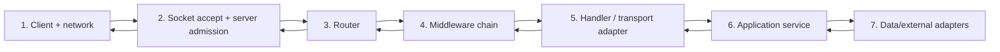

# Phase 3: Software and Backend Engineering
# Module 8: Backend and API Engineering
# Lesson 101: The request lifecycle end to end

## Mục tiêu bài học

**Năng lực cần chứng minh.** Vẽ đường đi của một yêu cầu qua bảy chặng và chỉ ra hạn chờ cùng chế độ hỏng của từng chặng.

**Điều kiện hoàn thành.** Sơ đồ đủ bảy chặng với hạn chờ và chế độ hỏng, và hai điểm kiểm phản ứng khác nhau khi mất kết nối cơ sở dữ liệu.

> [!abstract] Câu hỏi trung tâm
> “API chậm” không chỉ ra chặng nào giữ thời gian hoặc request đã đi tới đâu. Cần theo request qua connection, server admission, routing, middleware, handler, application service và data adapter; mỗi chặng có budget, signal và failure mode riêng.

## Bảy chặng của đường đi



Số chặng là mô hình chẩn đoán, không phải yêu cầu mọi framework có đúng bảy class. Một framework có thể gộp router và middleware; trách nhiệm và failure boundary vẫn cần được phân biệt.

## Chặng 1: client, DNS, connection và HTTP

Trước khi server application thấy request, client phải resolve endpoint, mở hoặc tái sử dụng connection, hoàn tất TLS nếu có và gửi HTTP message. Failure gồm DNS error, connect timeout, handshake error, reset, partial write và timeout chờ response.

Client timeout không chứng minh server chưa xử lý. Request có thể đã commit side effect nhưng response bị mất. Với operation không idempotent, retry mù có thể tạo tác động kép.

> [!source-fact]
> Kurose và Ross trình bày HTTP request/response trên TCP, persistent connection và proxy/cache boundary. *Computer Networking: A Top-Down Approach*, 8e, §2.2, trang in 126–142.

## Chặng 2: accept, queue và admission

Kernel nhận connection vào listen queue; server accept rồi gán work cho thread, process hoặc event loop. Request có thể chờ trước khi handler bắt đầu vì:

- listen/backlog đầy;
- worker pool hết slot;
- event loop bị blocking task giữ;
- connection limit/admission control;
- request body chưa đọc xong;
- TLS termination hoặc proxy phía trước.

Chỉ đo handler duration bỏ qua queueing. Cần timestamp lúc edge nhận, server bắt đầu xử lý và response kết thúc.

## Ba mô hình concurrency

### Nhiều thread trong một process

Mỗi request hoặc connection được một thread xử lý. Code blocking dễ viết, nhưng thread, stack và lock tạo chi phí. Shared mutable state cần synchronization; blocking dependency có thể làm cạn pool.

### Nhiều process

Process isolation giảm shared-memory coupling và tận dụng nhiều CPU core. Đổi lại, connection distribution, shared cache/state và graceful shutdown cần phối hợp. Memory footprint thường cao hơn.

### Event loop/async

Một hoặc vài loop multiplex nhiều I/O. Hiệu quả khi task chủ yếu chờ I/O và mọi operation hợp tác không block. Một CPU-bound hoặc blocking call trên loop làm nhiều request cùng trễ.

Chọn model theo workload và runtime. “Async nhanh hơn” không đúng nếu code gọi blocking driver hoặc contention nằm ở database.

## Chặng 3: routing

Router ánh xạ method, path, host và đôi khi content type/version tới handler. Failure cần phân biệt:

- không có route: thường 404;
- method không được phép trên resource: thường 405 và có thể nêu allowed methods;
- content type không hỗ trợ;
- version/host không hợp lệ;
- path parameter parse fail.

Router không nên chứa business rule. Nó chọn transport adapter và tạo input sơ bộ.

## Chặng 4: middleware chain

Middleware chạy trước và/hoặc sau handler. Thứ tự ảnh hưởng correctness:

```text
request id
  -> access log start
  -> panic/error recovery
  -> authentication
  -> authorization
  -> rate limit
  -> body limit / decode
  -> handler
  -> response mapping
  -> access log finish
```

Nếu logging chạy sau authentication, request bị từ chối sớm có thể không có correlation ID. Nếu error recovery nằm sai vị trí, panic trong middleware ngoài nó không được map. Nếu body limit đặt sau decoder, server có thể đọc payload quá lớn trước khi chặn.

Middleware cần ghi rõ short-circuit behavior: có gọi `next` không, response do ai sở hữu và context nào được thêm.

## Chặng 5: handler là inbound adapter

Handler chịu trách nhiệm transport:

- đọc path/query/header/body;
- parse và validate shape;
- tạo command/query theo application contract;
- gọi application service;
- map result/error sang status/header/body;
- không chứa SQL hoặc domain workflow.

Validation ranh giới không thay business invariant. Handler có thể kiểm `due_date` đúng định dạng; application/domain quyết định task có được chuyển trạng thái ở thời điểm đó hay không.

## Chặng 6: application service

Application service điều phối một use case: authorization theo domain nếu cần, transaction boundary, gọi repository, domain operation và outbound port. Nó không phụ thuộc HTTP status hoặc JSON type.

Context/deadline đi từ request xuống dependency, nhưng không nên biến thành domain data. Cancellation cần được adapter tôn trọng. Nếu client ngắt sau commit, application vẫn cần xác định outcome và observability; không giả định cancellation tự rollback external side effect.

## Chặng 7: database và external dependency

Một database call gồm chờ connection pool, gửi query, database queue/execution và nhận result. Timeout tổng ở adapter cần bao phủ đúng phần, đồng thời query/database statement timeout có thể ngắn hơn outer request budget.

Failure gồm:

- pool exhausted;
- connect/auth/TLS fail;
- query timeout/deadlock;
- constraint violation;
- transaction conflict;
- connection reset sau commit;
- result decode/type mismatch.

External HTTP/queue adapter có failure khác nhưng cùng nguyên tắc: budget, bounded concurrency, outcome certainty và error translation.

## Response đi ngược qua stack

Handler map domain/application result thành transport response. Middleware sau handler có thể thêm header, metric, compression hoặc access log. Server encode message và ghi xuống socket; proxy/client vẫn có thể mất connection sau khi application hoàn tất.

“Handler returned 200” chưa chắc client nhận đủ body. Phân biệt application outcome, server write outcome và client observation.

## Timeout budget

Nếu client deadline là 2 giây, không thể đặt mỗi dependency timeout 2 giây theo chuỗi. Budget cần trừ queueing, middleware, application và response margin.

Ví dụ teaching budget:

| Chặng | Budget |
|---|---:|
| edge + admission | 150 ms |
| middleware/parse | 100 ms |
| application local work | 100 ms |
| database pool + query | 900 ms |
| external call | 400 ms |
| response + safety margin | 350 ms |

Các số chỉ minh họa phép phân bổ. Parallel call, retry và tail latency làm budget phức tạp hơn. Deadline phải propagation; dependency không biết outer deadline có thể tiếp tục dùng tài nguyên sau khi client đã bỏ.

## Cancellation không phải rollback

Cancellation signal có thể ngăn work chưa bắt đầu hoặc hủy I/O hỗ trợ cancellation. Nó không đảo side effect đã commit và không bảo đảm goroutine/thread dừng ngay.

Mỗi stage cần quyết định:

- còn kiểm cancellation ở đâu;
- cleanup/resource close nào luôn chạy;
- transaction nào rollback được;
- external operation nào cần idempotency/reconciliation;
- log outcome nào khi response không gửi được.

## Correlation và telemetry

Một request ID được tạo ở edge nếu client chưa cung cấp giá trị hợp lệ; truyền qua context và outbound call. Log mỗi chặng dùng structured fields:

```json
{
  "request_id": "r-123",
  "stage": "database.query",
  "start_ms": 171,
  "duration_ms": 84,
  "outcome": "timeout",
  "release_id": "orders-2026.09.28.3"
}
```

Metric cần stage/version/outcome nhưng tránh label cardinality cao như raw request ID. Trace span phù hợp để nối latency/failure qua boundary; log giữ chi tiết discrete event.

## Health, readiness và liveness

### Liveness

Process có đang tiến triển hay mắc kẹt đến mức restart có ích? Không nên phụ thuộc database ngắn hạn nếu restart không giải quyết database outage.

### Readiness

Instance có thể phục vụ request mới theo capability bắt buộc không? Mất database có thể làm readiness fail và rút khỏi routing, trong khi liveness vẫn pass.

### Startup

Ứng dụng đã load config, migration prerequisite, cache/model và bắt đầu nhận request chưa? Startup probe ngăn liveness giết process khởi động chậm.

> [!source-fact]
> Titmus trình bày service health endpoints, middleware/interceptor và service lifecycle trong *Cloud Native Go*, PDF 293–323. Chi tiết orchestrator cần đối chiếu platform đang dùng.

## Bảng bảy chặng

| Chặng | Timeout/budget | Failure tiêu biểu | Signal |
|---|---|---|---|
| Client/network | connect/read deadline | DNS, reset, response lost | client metric, edge log |
| Admission | queue/accept timeout | backlog/pool exhausted | queue depth, accepted connections |
| Router | rất ngắn | 404/405/version mismatch | route outcome |
| Middleware | per middleware hoặc shared | auth/rate/body/recovery | span/event theo stage |
| Handler | trong request deadline | parse/map/write response | status/error code |
| Application | use-case deadline | invariant, cancellation, orchestration | application outcome |
| Data/external | query/call timeout | pool, deadlock, remote timeout | dependency span/metric |

## Failure modes

- chỉ đo handler duration;
- middleware thiếu correlation ID ở early failure;
- timeout mỗi dependency bằng toàn request deadline;
- không propagate cancellation;
- liveness phụ thuộc database và tạo restart storm;
- readiness chỉ kiểm process, nhận traffic khi dependency chưa dùng được;
- handler chứa SQL/domain rule;
- log message tự do không có stage/outcome/version;
- retry sau timeout không xét unknown outcome.

## Giới hạn

- Framework có thể chia/gộp stage khác nhau; mô hình dùng để phân trách nhiệm và evidence.
- Timeout minh họa không phải cấu hình production.
- Readiness dependency policy phụ thuộc service capability và failure strategy.
- Trace không tự chứng minh business outcome hoặc data consistency.
- Note chưa chạy service/lab DE-L101.

## Reference

1. [[SRC-KUROSE-ROSS-NETWORKING-8E]] — HTTP request/response, persistent connection, proxy/cache và TCP foundation, §2.2, trang in 126–142.
2. [[SRC-TITMUS-CLOUD-NATIVE-GO-1E]] — HTTP/gRPC service, middleware, health và service lifecycle, PDF 293–323.
3. [[SRC-NEWMAN-BUILDING-MICROSERVICES-2E]] — request interaction, resilience, observability và distributed tracing, các chương 4, 11.

> [!synthesis]
> Mô hình bảy chặng là công cụ chẩn đoán tổng hợp từ HTTP/TCP boundary, server lifecycle, middleware, resilience và observability. Nó không phải pipeline class cố định của một framework hay sơ đồ nguyên văn từ một nguồn.

## Source coverage

| Source slice | Nội dung phải giữ | Vị trí trong note | Trạng thái |
|---|---|---|---|
| [[SRC-KUROSE-ROSS-NETWORKING-8E]], §2.2 pp. 126–142 | HTTP request/response, connection reuse và proxy/cache boundary | §§1–2, 10 | Đã trình bày phần trước và sau application server |
| [[SRC-TITMUS-CLOUD-NATIVE-GO-1E]], pp. 293–323 | service lifecycle, HTTP/gRPC server, middleware và health | §§3–10, 14–15 | Đã trình bày concurrency model, middleware chain, handler và health semantics |
| [[SRC-NEWMAN-BUILDING-MICROSERVICES-2E]], Ch. 4 và 11 | interaction, resilience, observability và distributed tracing | §§11–15 | Đã trình bày timeout budget, cancellation, correlation và telemetry |
| Tổng hợp bài DE-L101 | mô hình bảy chặng, failure matrix và database-outage experiment | §§1, 15–18 | Đã gắn là mô hình chẩn đoán; không khẳng định framework nào có đúng bảy class |

Chi tiết scheduler, router API và database driver phụ thuộc runtime/version. Note giữ chúng ngoài claim chung và yêu cầu tài liệu implementation khi dạy lab cụ thể.

## Key takeaways

- Request path gồm nhiều queue và boundary trước/sau handler.
- Mỗi chặng cần budget, failure taxonomy và signal riêng.
- Cancellation không đảo side effect; timeout có thể tạo unknown outcome.
- Liveness và readiness trả lời hai câu hỏi khác nhau.
