# Mô-đun 1: Tư duy kỹ thuật, Git và gỡ lỗi

Module mở đầu và là module đặt kỷ luật cho cả 428 bài còn lại. Ba năng lực ở đây được dùng lại ở mọi module sau: phát biểu hợp đồng trước khi viết mã, quản lý thay đổi có thể lùi, và chẩn đoán có bằng chứng. Không dạy công cụ dữ liệu nào. Đây là chủ ý: người học vào thẳng công cụ dữ liệu mà thiếu ba năng lực này sẽ dựng được pipeline chạy nhưng không sửa được khi nó hỏng.

## Điều kiện đầu vào

| Mã | Người học có thể | Bằng chứng được chấp nhận |
|---|---|---|
| EN-01-01 | Không. Dùng được terminal và sửa được tệp văn bản | Bằng chứng hoàn thành điều kiện được nêu trong cột trước |

Nếu chưa có bằng chứng đầu vào, người học phải hoàn thành lại bài hoặc mô-đun được dẫn chiếu trước khi thực hiện phép đánh giá của mô-đun này.

## Đầu ra mô-đun

Biến một yêu cầu mơ hồ thành hợp đồng kiểm thử được, quản lý thay đổi an toàn, và chẩn đoán lỗi bằng bằng chứng chứ bằng thử sai

## Tiêu chí hoàn thành

| Mã | Bằng chứng bắt buộc | Ngưỡng đạt | Lỗi loại trực tiếp |
|---|---|---|---|
| EC-01-01 | Vẽ đúng đồ thị đối tượng của một kho Git và dự đoán đúng `HEAD` sau merge, rebase, reset; nhật ký gỡ lỗi có ít nhất ba giả thuyết bị bác bỏ bằng bằng chứng | Đạt ≥ 80% bài nhớ lại sau 14 ngày, và lặp lại được quy trình chia đôi không nhìn hướng dẫn. | Học thuộc lệnh Git rời rạc mà không có mô hình đối tượng, nên mất commit là mất luôn, và sửa lỗi bằng cách đổi thử tới khi hết báo lỗi |

## Khái niệm và nguyên tắc bất biến

| Mã khái niệm | Ranh giới định nghĩa | Nguyên tắc bất biến hoặc quy tắc quyết định | Bài chính |
|---|---|---|---|
| C01-001 | Yêu cầu nghiệp vụ tới dưới dạng một câu mơ hồ, và khoảng cách giữa câu đó với một thứ kiểm thử được là nơi phần lớn công sức bị lãng phí. | Sáu phần của một phát biểu bài toán dùng được: ai là người dùng, sự kiện nào kích hoạt, đầu vào gì, đầu ra gì, ràng buộc nào, và cái gì cố ý không làm. | L001 |
| C01-002 | Chia một hệ thành phần là quyết định thiết kế đầu tiên và khó sửa nhất. | Bốn trục để chia và mỗi trục trả lời một câu hỏi khác nhau: trách nhiệm tức phần này chịu trách nhiệm về cái gì, giao diện tức nó hứa gì với bên ngoài, trạng thái tức nó nhớ gì, và phạm vi hỏng tức nó chết thì kéo theo những gì. | L002 |
| C01-003 | Phần lớn quyết định kỹ thuật không có phương án đúng tuyệt đối, chỉ có phương án phù hợp ràng buộc, nên thứ cần lưu lại là lý do chứ kết luận. | Tài liệu quyết định kiến trúc có năm phần: bối cảnh và ràng buộc, các phương án đã cân nhắc, quyết định, hệ quả gồm cả mặt xấu, và điều kiện xem lại. | L003 |
| C01-004 | Học Git bằng cách nhớ lệnh thì mỗi tình huống lạ là một lần bế tắc; học bằng mô hình đối tượng thì suy ra được lệnh. | Bốn loại đối tượng: blob giữ nội dung tệp, cây giữ danh sách tên trỏ tới blob và cây con, commit giữ một cây cộng danh sách cha cộng siêu dữ liệu, và thẻ có chú thích. | L004 |
| C01-005 | Hợp nhất ba chiều dùng tổ tiên chung làm gốc so sánh, nên hiểu tổ tiên chung là hiểu vì sao xung đột xảy ra ở đúng chỗ đó. | Xung đột không phải lỗi mà là chỗ Git không tự quyết được; giải xung đột là một quyết định nội dung chứ thao tác cơ khí. | L005 |
| C01-006 | Hai kỹ năng cứu nguy mà phần lớn người dùng Git chỉ học sau khi đã mất việc một lần. | Nhật ký tham chiếu ghi lại mọi vị trí HEAD từng đứng, kể cả những vị trí không còn nhánh nào trỏ tới, nên gần như mọi commit đã tạo đều tìm lại được trong thời gian giữ mặc định. | L006 |
| C01-007 | Làm việc nhóm đặt ra ràng buộc mà làm một mình không có, và ba ràng buộc quan trọng nhất đều nằm ở kích thước và ranh giới thay đổi. | Commit nhỏ và một mục đích: dễ rà soát, dễ lùi, và làm chia đôi ở Bài 6 thật sự dùng được. | L007 |
| C01-008 | Sửa lỗi bằng cách đổi thử tới khi hết báo lỗi là cách tạo ra lỗi tiếp theo, vì nguyên nhân chưa từng được chứng minh. | Quy trình sáu bước | L008 |
| C01-009 | Ba kỹ năng làm cho quy trình ở Bài 8 chạy được trong thực tế. | Tái hiện xác định: cố định đầu vào, cố định thời gian và ngẫu nhiên, cố định phiên bản; lỗi chỉ xuất hiện thỉnh thoảng thì phải tìm ra biến còn thay đổi chứ kết luận là lỗi ngẫu nhiên. | L009 |
| C01-010 | Bốn tài liệu mà mọi thành phần chạy trong sản xuất phải có, và mỗi tài liệu phục vụ một người đọc ở một thời điểm khác nhau. | README phục vụ người mới: mục đích, kiến trúc một đoạn, cách cài, cách chạy và kiểm, và giới hạn đã biết. | L010 |
| C01-011 | Bài dự án gộp toàn module: một công cụ dòng lệnh nạp tệp CSV, kiểm tra lược đồ, và ghi ra kết quả. | Yêu cầu bắt buộc và mỗi yêu cầu đến từ một bài trước | L011 |
| C01-012 | Bài chốt module, và nó đặt một thói quen dùng cho cả 416 bài còn lại. | Ôn lại có khoảng cách: kiểm tra lại sau 1 ngày, 7 ngày và 30 ngày, vì nhớ ngay sau buổi học không dự đoán được việc nhớ sau một tháng. | L012 |

## Các bài trong mô-đun

| Bài | Dạng | Đầu ra | Bằng chứng | Điều kiện tiên quyết |
|---|---|---|---|---|
| L001 · From a vague request to a testable contract | LT | Viết lại một yêu cầu mơ hồ thành phát biểu sáu phần, và cho mỗi yêu cầu một phép kiểm chấp nhận kiểm được. | Ba yêu cầu đều có đủ sáu phần, mỗi yêu cầu có ≥ 2 phép kiểm chấp nhận cụ thể, và người đổi bài không tìm được chỗ hiểu hai nghĩa. | M01: Không |
| L002 · Decomposition - responsibility, interface, state and failure domain | LT | Phân rã một hệ cho trước theo bốn trục và chỉ ra chiều phụ thuộc cùng phạm vi hỏng của từng phần. | Bốn trục được trả lời cho mọi phần, đồ thị phụ thuộc không có vòng, và chỉ đúng phạm vi hỏng của ít nhất ba phần. | L001 |
| L003 · Trade-offs and the architecture decision record | TH | Viết một tài liệu quyết định đủ năm phần cho một lựa chọn thật, và người không dự buổi quyết định đọc hiểu được lý do. | Tài liệu đủ năm phần và dưới hai trang, người rà soát không còn câu hỏi về lý do, và điều kiện xem lại nêu được mốc kiểm được. | L002 |
| L004 · Git as a content-addressed object database | LT | Vẽ đúng đồ thị đối tượng của một kho nhỏ và dự đoán con trỏ nào thay đổi sau mỗi thao tác. | Đồ thị đối tượng vẽ đúng, và dự đoán khớp thực tế ở ≥ 5/6 thao tác. | L003 |
| L005 · Branching, merge, rebase and commit identity | TH | Chọn đúng giữa hợp nhất, rebase và đảo ngược cho một tình huống cho trước, và giải thích bằng định danh commit cùng phạm vi ảnh hưởng. | Chọn đúng ≥ 3/4 tình huống kèm phạm vi ảnh hưởng, và giải thích đúng vị trí xung đột bằng tổ tiên chung. | L004 |
| L006 · Recovering lost work - reflog, detached HEAD and bisect | TH | Phục hồi được việc đã mất trong ba tình huống, và định vị commit gây hồi quy bằng tìm kiếm chia đôi tự động. | Phục hồi thành công cả ba tình huống có ghi chú, và chia đôi tự động chỉ đúng commit 4. | L005 |
| L007 · Collaboration - small commits, review and release discipline | TH | Nộp một yêu cầu hợp nhất đủ bốn phần, rà soát yêu cầu của người khác bằng ba câu hỏi bắt buộc, và chỉ ra được một thay đổi mà lùi mã không đủ để lùi. | Bốn commit đều một mục đích và có lý do, yêu cầu hợp nhất đủ bốn phần, bản rà soát nêu được ít nhất một rủi ro thật, và phép thử lùi chỉ ra đúng chỗ lùi mã không đủ với kế hoạch tương thích làm lần lùi thứ hai thành công. | L006 |
| L008 · Scientific debugging - from symptom to proven cause | LT | Lập bảng giả thuyết cho một lỗi cho trước, với mỗi giả thuyết nêu một phép thử bác bỏ được. | Ba hồ sơ triệu chứng đủ sáu phần, mọi giả thuyết có phép thử bác bỏ được, và người đổi bài không tìm được giả thuyết không kiểm được. | L007 |
| L009 · Reproduce, reduce and instrument at the boundary | TH | Tái hiện xác định một lỗi, thu nhỏ về trường hợp nhỏ nhất, và chứng minh nguyên nhân bằng quan sát ở ranh giới. | Chứng minh đúng nguyên nhân ≥ 2/3 lỗi, mỗi lần có ≥ 3 giả thuyết bị bác bỏ bằng bằng chứng, và trường hợp nhỏ nhất dưới 20 dòng. | L008 |
| L010 · Technical artifacts - README, runbook and postmortem | TH | Viết bộ bốn tài liệu cho một thành phần nhỏ, và người khác dùng được mà không phải hỏi. | Người nhận cài và chạy được, xử lý được tình huống theo sổ tay, và số câu hỏi phải hỏi dưới ngưỡng. | L009 |
| L011 · Putting it together - a small CLI with contract, tests and logs | DA | Nộp một công cụ đạt tám yêu cầu, xử lý đúng năm loại đầu vào hỏng, và có bộ tài liệu dùng được. | Năm đầu vào hỏng đều được phân loại đúng với mã thoát đúng, tám yêu cầu đều có bằng chứng, và một học viên khác chẩn đoán được cả năm chỉ bằng nhật ký. | L010 |
| L012 · Delayed recall and the evidence habit | LT | Thiết lập được hệ ôn tập có khoảng cách và nhật ký lỗi, và đạt ngưỡng nhớ lại trên nội dung của module. | Đạt ≥ 80% bài nhớ lại sau 14 ngày, và lặp lại được quy trình chia đôi không nhìn hướng dẫn. | L011 |

## Nội dung từng bài

> **Sơ đồ đề xuất — DE-M01 v0.1.0.** Mỗi nhánh đi từ một bài học đến các nội dung nguyên tử bắt buộc. Thứ tự dạy lấy từ bảng `Các bài trong mô-đun`.

```mermaid
%%{init: {"flowchart": {"htmlLabels": true, "wrappingWidth": 720, "nodeSpacing": 64, "rankSpacing": 160}}}%%
flowchart LR
  M01["BẢN ĐỀ XUẤT<br/>DE-M01 · Tư duy kỹ thuật, Git và gỡ lỗi"]
  M01 --> L001["Bài 1 · From a vague request to a testable contract"]
  L001 --> A001["• Yêu cầu nghiệp vụ tới dưới dạng một câu mơ hồ, và khoảng cách giữa câu đó với một thứ kiểm thử được là nơi phần lớn công sức bị lãng phí.<br/>• Sáu phần của một phát biểu bài toán dùng được: ai là người dùng, sự kiện nào kích hoạt, đầu vào gì, đầu ra gì, ràng buộc nào, và cái gì cố ý không làm.<br/>• Phần cuối là phần hay thiếu nhất và cũng là phần cứu dự án khỏi phình.<br/>• Chuyển mỗi yêu cầu thành hành vi quan sát được rồi thành một phép kiểm chấp nhận: nếu không viết được phép kiểm thì yêu cầu chưa đủ rõ để bắt đầu."]
  M01 --> L002["Bài 2 · Decomposition - responsibility, interface, state and failure domain"]
  L002 --> A002["• Chia một hệ thành phần là quyết định thiết kế đầu tiên và khó sửa nhất.<br/>• Bốn trục để chia và mỗi trục trả lời một câu hỏi khác nhau: trách nhiệm tức phần này chịu trách nhiệm về cái gì, giao diện tức nó hứa gì với bên ngoài, trạng thái tức nó nhớ gì, và phạm vi hỏng tức nó chết thì kéo theo những gì.<br/>• Độ gắn kết và độ phụ thuộc: gắn kết cao trong một phần, phụ thuộc thấp giữa các phần, và chiều phụ thuộc phải một chiều chứ vòng.<br/>• Trừu tượng hoá che cái gì và bắt buộc lộ cái gì; trừu tượng rò rỉ là trừu tượng che một thứ mà người dùng vẫn phải biết, và nhận ra nó sớm tiết kiệm rất nhiều thời gian về sau."]
  M01 --> L003["Bài 3 · Trade-offs and the architecture decision record"]
  L003 --> A003["• Phần lớn quyết định kỹ thuật không có phương án đúng tuyệt đối, chỉ có phương án phù hợp ràng buộc, nên thứ cần lưu lại là lý do chứ kết luận.<br/>• Tài liệu quyết định kiến trúc có năm phần: bối cảnh và ràng buộc, các phương án đã cân nhắc, quyết định, hệ quả gồm cả mặt xấu, và điều kiện xem lại.<br/>• Phần các phương án bị loại là phần giá trị nhất: người đọc sau cần biết phương án kia đã được xét và loại vì gì, nếu không họ đề xuất lại đúng phương án đó.<br/>• Điều kiện xem lại làm tài liệu này khác một biên bản: ghi mốc nào thì quyết định nên được xét lại."]
  M01 --> L004["Bài 4 · Git as a content-addressed object database"]
  L004 --> A004["• Học Git bằng cách nhớ lệnh thì mỗi tình huống lạ là một lần bế tắc; học bằng mô hình đối tượng thì suy ra được lệnh.<br/>• Bốn loại đối tượng: blob giữ nội dung tệp, cây giữ danh sách tên trỏ tới blob và cây con, commit giữ một cây cộng danh sách cha cộng siêu dữ liệu, và thẻ có chú thích.<br/>• Điểm quyết định: commit là ảnh chụp toàn bộ cây cộng con trỏ cha, không phải một bản khác biệt; phần khác biệt chỉ là thứ Git tính ra khi cần hiển thị.<br/>• Ba vùng và ba con trỏ: cây làm việc, vùng chờ, kho; HEAD trỏ tới nhánh, nhánh trỏ tới commit."]
  M01 --> L005["Bài 5 · Branching, merge, rebase and commit identity"]
  L005 --> A005["• Hợp nhất ba chiều dùng tổ tiên chung làm gốc so sánh, nên hiểu tổ tiên chung là hiểu vì sao xung đột xảy ra ở đúng chỗ đó.<br/>• Xung đột không phải lỗi mà là chỗ Git không tự quyết được; giải xung đột là một quyết định nội dung chứ thao tác cơ khí.<br/>• Rebase phát lại các commit lên một gốc mới, và điều quan trọng là commit mới có mã định danh mới dù nội dung giống hệt; từ đó suy ra quy tắc không rebase nhánh người khác đang dùng.<br/>• Ba cách hợp nhất và hệ quả lên lịch sử: hợp nhất thường giữ đồ thị thật, rebase cho lịch sử thẳng nhưng viết lại định danh, và gộp thành một commit làm mất bước trung gian."]
  M01 --> L006["Bài 6 · Recovering lost work - reflog, detached HEAD and bisect"]
  L006 --> A006["• Hai kỹ năng cứu nguy mà phần lớn người dùng Git chỉ học sau khi đã mất việc một lần.<br/>• Nhật ký tham chiếu ghi lại mọi vị trí HEAD từng đứng, kể cả những vị trí không còn nhánh nào trỏ tới, nên gần như mọi commit đã tạo đều tìm lại được trong thời gian giữ mặc định.<br/>• Ba tình huống mất việc hay gặp và cách phục hồi từng cái: reset --hard nhầm, xoá nhánh chưa hợp nhất, và rebase hỏng giữa chừng.<br/>• HEAD tách rời là trạng thái bình thường chứ lỗi, nhưng commit tạo ra trong đó không có nhánh giữ nên dễ mất."]
  M01 --> L007["Bài 7 · Collaboration - small commits, review and release discipline"]
  L007 --> A007["• Làm việc nhóm đặt ra ràng buộc mà làm một mình không có, và ba ràng buộc quan trọng nhất đều nằm ở kích thước và ranh giới thay đổi.<br/>• Commit nhỏ và một mục đích: dễ rà soát, dễ lùi, và làm chia đôi ở Bài 6 thật sự dùng được.<br/>• Thông điệp commit nói vì sao chứ cái gì, vì cái gì đã nằm trong phần khác biệt.<br/>• Yêu cầu hợp nhất là đơn vị rà soát: kèm mô tả, phạm vi ảnh hưởng, cách kiểm chứng, và ghi chú lùi."]
  M01 --> L008["Bài 8 · Scientific debugging - from symptom to proven cause"]
  L008 --> A008["• Sửa lỗi bằng cách đổi thử tới khi hết báo lỗi là cách tạo ra lỗi tiếp theo, vì nguyên nhân chưa từng được chứng minh.<br/>• Quy trình sáu bước<br/>• ghi lại triệu chứng gồm mong đợi, thực tế, thời điểm, phiên bản, đầu vào và môi trường<br/>• tái hiện một cách xác định"]
  M01 --> L009["Bài 9 · Reproduce, reduce and instrument at the boundary"]
  L009 --> A009["• Ba kỹ năng làm cho quy trình ở Bài 8 chạy được trong thực tế.<br/>• Tái hiện xác định: cố định đầu vào, cố định thời gian và ngẫu nhiên, cố định phiên bản; lỗi chỉ xuất hiện thỉnh thoảng thì phải tìm ra biến còn thay đổi chứ kết luận là lỗi ngẫu nhiên.<br/>• Thu nhỏ: cắt dần đầu vào và cắt dần mã cho tới khi bỏ thêm một thứ nữa thì lỗi biến mất; trường hợp nhỏ nhất thường tự nó chỉ ra nguyên nhân.<br/>• Thêm khả năng quan sát ở ranh giới chứ rải khắp nơi: ghi lại đầu vào và đầu ra tại mỗi ranh giới giữa hai thành phần, vì lỗi nằm ở chỗ hai bên hiểu khác nhau về hợp đồng."]
  M01 --> L010["Bài 10 · Technical artifacts - README, runbook and postmortem"]
  L010 --> A010["• Bốn tài liệu mà mọi thành phần chạy trong sản xuất phải có, và mỗi tài liệu phục vụ một người đọc ở một thời điểm khác nhau.<br/>• README phục vụ người mới: mục đích, kiến trúc một đoạn, cách cài, cách chạy và kiểm, và giới hạn đã biết.<br/>• Tài liệu quyết định ở Bài 3 phục vụ người sửa kiến trúc về sau.<br/>• Sổ tay vận hành phục vụ người trực lúc ba giờ sáng, nên cấu trúc phải theo đúng trình tự họ cần: cảnh báo nào, ảnh hưởng gì, chẩn đoán ra sao, giảm nhẹ thế nào, leo thang cho ai, và xác nhận đã hồi phục bằng cách nào."]
  M01 --> L011["Bài 11 · Putting it together - a small CLI with contract, tests and logs"]
  L011 --> A011["• Bài dự án gộp toàn module: một công cụ dòng lệnh nạp tệp CSV, kiểm tra lược đồ, và ghi ra kết quả.<br/>• Yêu cầu bắt buộc và mỗi yêu cầu đến từ một bài trước<br/>• phát biểu bài toán sáu phần theo Bài 1<br/>• ranh giới thành phần rõ theo Bài 2"]
  M01 --> L012["Bài 12 · Delayed recall and the evidence habit"]
  L012 --> A012["• Bài chốt module, và nó đặt một thói quen dùng cho cả 416 bài còn lại.<br/>• Ôn lại có khoảng cách: kiểm tra lại sau 1 ngày, 7 ngày và 30 ngày, vì nhớ ngay sau buổi học không dự đoán được việc nhớ sau một tháng.<br/>• Phân biệt nhận ra với nhớ lại: đọc lại tài liệu thấy quen thuộc là nhận ra, và nó tạo cảm giác đã học xong mà không tương ứng với năng lực; phép kiểm thật là viết lại hoặc làm lại mà không nhìn.<br/>• Ghi chú chín phần dùng suốt chương trình và lý do từng phần."]

  classDef module fill:#2b1b12,color:#fff4e8,stroke:#ff8a3d,stroke-width:2px;
  classDef lesson fill:#fff4e8,color:#2b1b12,stroke:#c85e16,stroke-width:1.5px;
  classDef atom fill:#fffdf8,color:#2b1b12,stroke:#b8a99a,stroke-width:1px,font-size:15px;
  class M01 module;
  class L001,L002,L003,L004,L005,L006,L007,L008,L009,L010,L011,L012 lesson;
  class A001,A002,A003,A004,A005,A006,A007,A008,A009,A010,A011,A012 atom;
```

### Bài 1: From a vague request to a testable contract

Yêu cầu nghiệp vụ tới dưới dạng một câu mơ hồ, và khoảng cách giữa câu đó với một thứ kiểm thử được là nơi phần lớn công sức bị lãng phí. Sáu phần của một phát biểu bài toán dùng được: ai là người dùng, sự kiện nào kích hoạt, đầu vào gì, đầu ra gì, ràng buộc nào, và cái gì cố ý không làm. Phần cuối là phần hay thiếu nhất và cũng là phần cứu dự án khỏi phình. Chuyển mỗi yêu cầu thành hành vi quan sát được rồi thành một phép kiểm chấp nhận: nếu không viết được phép kiểm thì yêu cầu chưa đủ rõ để bắt đầu. Ba loại ràng buộc phải tách bạch vì chúng dẫn tới ba thiết kế khác nhau: ràng buộc về đúng đắn, về hiệu năng, và về vận hành. Phi mục tiêu viết ra thành câu chứ để ngầm hiểu.

Người học phải viết lại một yêu cầu mơ hồ thành phát biểu sáu phần, và cho mỗi yêu cầu một phép kiểm chấp nhận kiểm được. Bằng chứng thực hành: Nhận ba yêu cầu viết theo cách người nghiệp vụ thật hay nhắn. Viết lại từng cái thành phát biểu sáu phần. Với mỗi yêu cầu, viết ít nhất hai phép kiểm chấp nhận có đầu vào và kết quả mong đợi cụ thể. Đổi bài với một học viên khác: họ chỉ ra chỗ nào còn mơ hồ tới mức hai người có thể hiểu khác nhau. Bài hoàn tất khi ba yêu cầu đều có đủ sáu phần, mỗi yêu cầu có ≥ 2 phép kiểm chấp nhận cụ thể, và người đổi bài không tìm được chỗ hiểu hai nghĩa.

Cách đánh giá: Tầng *áp dụng*. Bài mở chương trình, người học chưa có nền kỹ thuật nào nên objective dừng ở việc áp một khuôn có sẵn vào tình huống mới. Kiểm bằng bài viết lại ba yêu cầu; đạt khi cả ba có đủ sáu phần và mọi phép kiểm chấp nhận đều nêu được đầu vào cùng kết quả mong đợi.

### Bài 2: Decomposition - responsibility, interface, state and failure domain

Chia một hệ thành phần là quyết định thiết kế đầu tiên và khó sửa nhất. Bốn trục để chia và mỗi trục trả lời một câu hỏi khác nhau: trách nhiệm tức phần này chịu trách nhiệm về cái gì, giao diện tức nó hứa gì với bên ngoài, trạng thái tức nó nhớ gì, và phạm vi hỏng tức nó chết thì kéo theo những gì. Độ gắn kết và độ phụ thuộc: gắn kết cao trong một phần, phụ thuộc thấp giữa các phần, và chiều phụ thuộc phải một chiều chứ vòng. Trừu tượng hoá che cái gì và bắt buộc lộ cái gì; trừu tượng rò rỉ là trừu tượng che một thứ mà người dùng vẫn phải biết, và nhận ra nó sớm tiết kiệm rất nhiều thời gian về sau. Bất biến là điều luôn đúng qua mọi lần chuyển trạng thái; bài này chỉ đặt khái niệm, còn chỗ đặt bất biến vào cơ sở dữ liệu sẽ quay lại ở M10.

Người học phải phân rã một hệ cho trước theo bốn trục và chỉ ra chiều phụ thuộc cùng phạm vi hỏng của từng phần. Bằng chứng thực hành: Cho mô tả một hệ bán hàng nhỏ. Phân rã thành các phần, với mỗi phần ghi bốn trục. Vẽ chiều phụ thuộc và chỉ ra phụ thuộc vòng nếu có. Với mỗi phần, trả lời: phần này chết thì cái gì còn chạy được. Hai bạn cùng lớp phản biện ranh giới bạn chọn. Bài hoàn tất khi bốn trục được trả lời cho mọi phần, đồ thị phụ thuộc không có vòng, và chỉ đúng phạm vi hỏng của ít nhất ba phần.

Cách đánh giá: Tầng *phân tích*. Objective đòi tách một chỉnh thể thành các phần có ranh giới lý giải được, chứ vẽ lại sơ đồ có sẵn. Kiểm bằng bài phân rã cộng phản biện; đạt khi bốn trục đều được trả lời và không có phụ thuộc vòng.

### Bài 3: Trade-offs and the architecture decision record

Phần lớn quyết định kỹ thuật không có phương án đúng tuyệt đối, chỉ có phương án phù hợp ràng buộc, nên thứ cần lưu lại là lý do chứ kết luận. Tài liệu quyết định kiến trúc có năm phần: bối cảnh và ràng buộc, các phương án đã cân nhắc, quyết định, hệ quả gồm cả mặt xấu, và điều kiện xem lại. Phần các phương án bị loại là phần giá trị nhất: người đọc sau cần biết phương án kia đã được xét và loại vì gì, nếu không họ đề xuất lại đúng phương án đó. Điều kiện xem lại làm tài liệu này khác một biên bản: ghi mốc nào thì quyết định nên được xét lại. Tiêu chí so sánh phải nêu trước khi so, nếu không thì việc so biến thành biện minh cho lựa chọn đã có sẵn trong đầu. Khả năng đảo ngược là một tiêu chí thường bị bỏ: quyết định dễ lùi thì quyết nhanh, quyết định khó lùi thì cần bằng chứng.

Người học phải viết một tài liệu quyết định đủ năm phần cho một lựa chọn thật, và người không dự buổi quyết định đọc hiểu được lý do. Bằng chứng thực hành: Chọn định dạng tệp cho một bài toán trao đổi dữ liệu giữa hai đội: so CSV, JSON và Parquet theo lược đồ, kích thước, khả năng liên thông và mẫu quét. Nêu tiêu chí trước, rồi mới so. Viết tài liệu quyết định đủ năm phần, dưới hai trang. Đưa cho một học viên khác đọc và ghi lại mọi câu họ phải hỏi. Bài hoàn tất khi tài liệu đủ năm phần và dưới hai trang, người rà soát không còn câu hỏi về lý do, và điều kiện xem lại nêu được mốc kiểm được.

Cách đánh giá: Tầng *áp dụng*. Objective là một sản phẩm viết theo chuẩn, kiểm được bằng phản ứng của người đọc chứ bằng độ dài. Kiểm bằng rà soát chéo; đạt khi người rà soát không còn câu hỏi nào về lý do và điều kiện xem lại là kiểm được.

### Bài 4: Git as a content-addressed object database

Học Git bằng cách nhớ lệnh thì mỗi tình huống lạ là một lần bế tắc; học bằng mô hình đối tượng thì suy ra được lệnh. Bốn loại đối tượng: blob giữ nội dung tệp, cây giữ danh sách tên trỏ tới blob và cây con, commit giữ một cây cộng danh sách cha cộng siêu dữ liệu, và thẻ có chú thích. Điểm quyết định: commit là ảnh chụp toàn bộ cây cộng con trỏ cha, không phải một bản khác biệt; phần khác biệt chỉ là thứ Git tính ra khi cần hiển thị. Ba vùng và ba con trỏ: cây làm việc, vùng chờ, kho; `HEAD` trỏ tới nhánh, nhánh trỏ tới commit. Từ mô hình này suy ra ngay: xoá nhánh không xoá commit, nên commit vẫn còn và phục hồi được; hai nhánh chia sẻ phần lịch sử chung vì cùng trỏ ngược về một tổ tiên. Cách tự kiểm chứng mọi khẳng định trên bằng lệnh đọc đối tượng thô, thay vì tin lời giảng.

Người học phải vẽ đúng đồ thị đối tượng của một kho nhỏ và dự đoán con trỏ nào thay đổi sau mỗi thao tác. Bằng chứng thực hành: Tạo một kho mới, tạo ba commit. Dùng lệnh đọc đối tượng thô để liệt kê blob, cây và commit, rồi vẽ đồ thị. Với sáu thao tác gồm `add`, `commit`, `checkout`, `branch`, `reset --soft` và `reset --hard`, viết dự đoán con trỏ nào đổi trước khi chạy, rồi chạy và đối chiếu. Bài hoàn tất khi đồ thị đối tượng vẽ đúng, và dự đoán khớp thực tế ở ≥ 5/6 thao tác.

Cách đánh giá: Tầng *hiểu*. Bài lý thuyết nền, chưa đòi xử lý sự cố. Kiểm bằng bài vẽ cộng dự đoán viết trước khi chạy; đạt khi đồ thị đúng và dự đoán khớp thực tế ở ít nhất năm trong sáu thao tác.

### Bài 5: Branching, merge, rebase and commit identity

Hợp nhất ba chiều dùng tổ tiên chung làm gốc so sánh, nên hiểu tổ tiên chung là hiểu vì sao xung đột xảy ra ở đúng chỗ đó. Xung đột không phải lỗi mà là chỗ Git không tự quyết được; giải xung đột là một quyết định nội dung chứ thao tác cơ khí. Rebase phát lại các commit lên một gốc mới, và điều quan trọng là commit mới có mã định danh mới dù nội dung giống hệt; từ đó suy ra quy tắc không rebase nhánh người khác đang dùng. Ba cách hợp nhất và hệ quả lên lịch sử: hợp nhất thường giữ đồ thị thật, rebase cho lịch sử thẳng nhưng viết lại định danh, và gộp thành một commit làm mất bước trung gian. Phân biệt viết lại lịch sử với commit đảo ngược: `revert` tạo một commit mới huỷ hiệu lực commit cũ và an toàn trên nhánh chung, còn `reset` viết lại và chỉ an toàn trên nhánh riêng.

Người học phải chọn đúng giữa hợp nhất, rebase và đảo ngược cho một tình huống cho trước, và giải thích bằng định danh commit cùng phạm vi ảnh hưởng. Bằng chứng thực hành: Dựng hai nhánh có xung đột nội dung. Giải xung đột và giải thích vì sao Git dừng ở đúng đoạn đó, dẫn bằng tổ tiên chung. Thực hiện cả ba cách hợp nhất trên ba bản sao của cùng kho, so đồ thị kết quả. Cho bốn tình huống và chọn cách xử lý, nêu ai bị ảnh hưởng nếu chọn sai. Bài hoàn tất khi chọn đúng ≥ 3/4 tình huống kèm phạm vi ảnh hưởng, và giải thích đúng vị trí xung đột bằng tổ tiên chung.

Cách đánh giá: Tầng *đánh giá*. Objective đòi cân giữa lịch sử sạch và an toàn cho người khác, chứ nhớ cú pháp. Kiểm bằng bốn tình huống; đạt khi chọn đúng ít nhất ba và mỗi lần nêu đúng ai bị ảnh hưởng.

### Bài 6: Recovering lost work - reflog, detached HEAD and bisect

Hai kỹ năng cứu nguy mà phần lớn người dùng Git chỉ học sau khi đã mất việc một lần. Nhật ký tham chiếu ghi lại mọi vị trí `HEAD` từng đứng, kể cả những vị trí không còn nhánh nào trỏ tới, nên gần như mọi commit đã tạo đều tìm lại được trong thời gian giữ mặc định. Ba tình huống mất việc hay gặp và cách phục hồi từng cái: `reset --hard` nhầm, xoá nhánh chưa hợp nhất, và rebase hỏng giữa chừng. `HEAD` tách rời là trạng thái bình thường chứ lỗi, nhưng commit tạo ra trong đó không có nhánh giữ nên dễ mất. Tìm lỗi bằng chia đôi biến việc truy hồi quy thành bài toán tìm kiếm nhị phân: với một phép kiểm tự động trả đúng mã thoát thì toàn bộ quá trình tự chạy. Điều kiện để dùng được: có phép kiểm tái hiện lỗi, và lịch sử có commit nhỏ chứ commit khổng lồ.

Người học phải phục hồi được việc đã mất trong ba tình huống, và định vị commit gây hồi quy bằng tìm kiếm chia đôi tự động. Bằng chứng thực hành: Tự gây cả ba tình huống mất việc rồi phục hồi từng cái bằng nhật ký tham chiếu, ghi lại ghi chú phục hồi. Tạo 8 commit, cài một hồi quy ở commit thứ tư, viết một phép kiểm trả mã thoát đúng, rồi chạy chia đôi tự động và xác nhận nó chỉ ra commit 4. Bài hoàn tất khi phục hồi thành công cả ba tình huống có ghi chú, và chia đôi tự động chỉ đúng commit 4.

Cách đánh giá: Tầng *áp dụng*. Objective là hai thao tác cứu nguy kiểm được bằng kết quả. Kiểm bằng ba tình huống mất việc cộng một lần chia đôi; đạt khi phục hồi cả ba và chia đôi chỉ đúng commit gây lỗi.

### Bài 7: Collaboration - small commits, review and release discipline

Làm việc nhóm đặt ra ràng buộc mà làm một mình không có, và ba ràng buộc quan trọng nhất đều nằm ở kích thước và ranh giới thay đổi. Commit nhỏ và một mục đích: dễ rà soát, dễ lùi, và làm chia đôi ở Bài 6 thật sự dùng được. Thông điệp commit nói vì sao chứ cái gì, vì cái gì đã nằm trong phần khác biệt. Yêu cầu hợp nhất là đơn vị rà soát: kèm mô tả, phạm vi ảnh hưởng, cách kiểm chứng, và ghi chú lùi. Rà soát mã là việc tìm hiểu lầm và rủi ro chứ bắt lỗi chính tả; ba câu hỏi người rà soát phải trả lời được. Chính sách nhánh và nhánh được bảo vệ. Đánh số phiên bản theo ngữ nghĩa và ý nghĩa thật của từng số với người dùng thư viện. Ghi chú lùi phải nói được lùi bằng cách nào, chứ chỉ nói có lùi được hay không; và đây là chỗ một loại thay đổi phá vỡ giả định: thay đổi có kèm sửa cấu trúc dữ liệu thì lùi mã không đủ, vì mã cũ không đọc được dữ liệu đã đổi. Lời giải là kế hoạch tương thích: đổi cấu trúc theo hướng cộng thêm trước, để mã cũ và mã mới cùng chạy được trong một cửa sổ, rồi mới bỏ phần cũ. Quy tắc suy ra: khả năng lùi là một thuộc tính phải thiết kế, không phải một nút bấm có sẵn. Vì sao phần này nằm ở module đầu chứ module cuối: mọi lab từ đây trở đi đều nộp qua yêu cầu hợp nhất, nên kỷ luật phải có trước.

Người học phải nộp một yêu cầu hợp nhất đủ bốn phần, rà soát yêu cầu của người khác bằng ba câu hỏi bắt buộc, và chỉ ra được một thay đổi mà lùi mã không đủ để lùi. Bằng chứng thực hành: Chia nhỏ một thay đổi lớn thành bốn commit một mục đích, mỗi commit có thông điệp nói vì sao. Nộp yêu cầu hợp nhất đủ mô tả, phạm vi ảnh hưởng, cách kiểm chứng và ghi chú lùi. Rà soát yêu cầu của một học viên khác theo ba câu hỏi bắt buộc và ghi ít nhất một rủi ro. Tạo một thay đổi có kèm sửa cấu trúc dữ liệu, lùi mã về bản trước, và ghi lại chuyện gì xảy ra với dữ liệu đã đổi. Viết kế hoạch tương thích cho phép mã cũ và mã mới cùng chạy, rồi lùi lại lần nữa và chứng minh lần này lùi được. Bài hoàn tất khi bốn commit đều một mục đích và có lý do, yêu cầu hợp nhất đủ bốn phần, bản rà soát nêu được ít nhất một rủi ro thật, và phép thử lùi chỉ ra đúng chỗ lùi mã không đủ với kế hoạch tương thích làm lần lùi thứ hai thành công.

Cách đánh giá: Tầng *áp dụng*. Objective là hai vai trong cùng một quy trình, kiểm được bằng sản phẩm của cả hai phía. Kiểm bằng một vòng nộp và rà soát chéo cộng một phép thử lùi; đạt khi yêu cầu đủ bốn phần, bản rà soát nêu được ít nhất một rủi ro thật, và phép thử lùi cho thấy đúng chỗ lùi mã không đủ.

### Bài 8: Scientific debugging - from symptom to proven cause

Sửa lỗi bằng cách đổi thử tới khi hết báo lỗi là cách tạo ra lỗi tiếp theo, vì nguyên nhân chưa từng được chứng minh. Quy trình sáu bước: ghi lại triệu chứng gồm mong đợi, thực tế, thời điểm, phiên bản, đầu vào và môi trường; tái hiện một cách xác định; thu nhỏ về trường hợp hỏng nhỏ nhất; thêm khả năng quan sát ở ranh giới; lập bảng giả thuyết; và sửa đúng nguyên nhân nhỏ nhất rồi thêm phép kiểm hồi quy. Bảng giả thuyết là công cụ trung tâm và có ba cột: dự đoán, phép thử có thể bác bỏ nó, và kết quả. Giả thuyết không kèm phép thử bác bỏ được thì không phải giả thuyết. Phân biệt tương quan với nguyên nhân: hai thứ cùng xảy ra không chứng minh cái này gây cái kia. Định vị theo tầng từ trên xuống: dữ liệu đầu vào, ứng dụng, phụ thuộc, hệ điều hành và mạng, nền tảng.

Người học phải lập bảng giả thuyết cho một lỗi cho trước, với mỗi giả thuyết nêu một phép thử bác bỏ được. Bằng chứng thực hành: Cho ba mô tả lỗi. Với mỗi lỗi, viết hồ sơ triệu chứng sáu phần và lập bảng giả thuyết ít nhất ba dòng. Đổi bài: học viên khác chỉ ra giả thuyết nào không bác bỏ được bằng phép thử bạn đề ra. Bài hoàn tất khi ba hồ sơ triệu chứng đủ sáu phần, mọi giả thuyết có phép thử bác bỏ được, và người đổi bài không tìm được giả thuyết không kiểm được.

Cách đánh giá: Tầng *hiểu*. Bài lý thuyết đặt quy trình, phần thực hành nằm ở Bài 9. Kiểm bằng bảng giả thuyết cho ba lỗi mẫu; đạt khi mọi giả thuyết đều có phép thử bác bỏ được và không có giả thuyết nào không kiểm được.

### Bài 9: Reproduce, reduce and instrument at the boundary

Ba kỹ năng làm cho quy trình ở Bài 8 chạy được trong thực tế. Tái hiện xác định: cố định đầu vào, cố định thời gian và ngẫu nhiên, cố định phiên bản; lỗi chỉ xuất hiện thỉnh thoảng thì phải tìm ra biến còn thay đổi chứ kết luận là lỗi ngẫu nhiên. Thu nhỏ: cắt dần đầu vào và cắt dần mã cho tới khi bỏ thêm một thứ nữa thì lỗi biến mất; trường hợp nhỏ nhất thường tự nó chỉ ra nguyên nhân. Thêm khả năng quan sát ở ranh giới chứ rải khắp nơi: ghi lại đầu vào và đầu ra tại mỗi ranh giới giữa hai thành phần, vì lỗi nằm ở chỗ hai bên hiểu khác nhau về hợp đồng. Nhật ký có cấu trúc và mã theo dõi để nối các dòng thuộc cùng một lần chạy. Ba loại lỗi hay gặp với dữ liệu và cách nhận ra từng loại: dữ liệu không đúng hình dạng, tài nguyên cạn, và thiếu quyền.

Người học phải tái hiện xác định một lỗi, thu nhỏ về trường hợp nhỏ nhất, và chứng minh nguyên nhân bằng quan sát ở ranh giới. Bằng chứng thực hành: Nhận một chương trình xử lý CSV có ba lỗi tiêm sẵn: một dòng sai định dạng, một tình huống hết chỗ trống trên đĩa mô phỏng, và một lỗi thiếu quyền. Với mỗi lỗi, tái hiện xác định, thu nhỏ đầu vào, thêm ghi nhật ký ở ranh giới, và nộp bảng giả thuyết có ít nhất ba dòng bị bác bỏ. Bài hoàn tất khi chứng minh đúng nguyên nhân ≥ 2/3 lỗi, mỗi lần có ≥ 3 giả thuyết bị bác bỏ bằng bằng chứng, và trường hợp nhỏ nhất dưới 20 dòng.

Cách đánh giá: Tầng *phân tích*. Objective là truy từ triệu chứng về nguyên nhân bằng bằng chứng, kỹ năng nền cho mọi module sau. Kiểm bằng ba lỗi tiêm sẵn; đạt khi chứng minh đúng nguyên nhân ít nhất hai và trường hợp nhỏ nhất thật sự nhỏ.

### Bài 10: Technical artifacts - README, runbook and postmortem

Bốn tài liệu mà mọi thành phần chạy trong sản xuất phải có, và mỗi tài liệu phục vụ một người đọc ở một thời điểm khác nhau. README phục vụ người mới: mục đích, kiến trúc một đoạn, cách cài, cách chạy và kiểm, và giới hạn đã biết. Tài liệu quyết định ở Bài 3 phục vụ người sửa kiến trúc về sau. Sổ tay vận hành phục vụ người trực lúc ba giờ sáng, nên cấu trúc phải theo đúng trình tự họ cần: cảnh báo nào, ảnh hưởng gì, chẩn đoán ra sao, giảm nhẹ thế nào, leo thang cho ai, và xác nhận đã hồi phục bằng cách nào. Phân tích sau sự cố phục vụ cả đội về sau: dòng thời gian, điều kiện góp phần, khoảng trống trong phát hiện, và hành động khắc phục có chủ. Nguyên tắc chung: viết cho người chưa có bối cảnh, và mọi từ viết tắt được định nghĩa ở chỗ người đọc gặp nó lần đầu.

Người học phải viết bộ bốn tài liệu cho một thành phần nhỏ, và người khác dùng được mà không phải hỏi. Bằng chứng thực hành: Viết bốn tài liệu cho công cụ CSV ở Bài 9. Đưa cho một học viên chưa xem mã: họ cài, chạy, và xử lý một tình huống lỗi chỉ dựa vào sổ tay. Ghi lại mọi câu họ phải hỏi rồi sửa tài liệu theo danh sách đó. Bài hoàn tất khi người nhận cài và chạy được, xử lý được tình huống theo sổ tay, và số câu hỏi phải hỏi dưới ngưỡng.

Cách đánh giá: Tầng *áp dụng*. Objective là sản phẩm viết theo chuẩn, đo bằng kết quả của người đọc. Kiểm bằng phép thử bàn giao; đạt khi người nhận chạy được và xử lý được tình huống trong sổ tay với số câu hỏi dưới ngưỡng.

### Bài 11: Putting it together - a small CLI with contract, tests and logs

Bài dự án gộp toàn module: một công cụ dòng lệnh nạp tệp CSV, kiểm tra lược đồ, và ghi ra kết quả. Yêu cầu bắt buộc và mỗi yêu cầu đến từ một bài trước: phát biểu bài toán sáu phần theo Bài 1; ranh giới thành phần rõ theo Bài 2; một tài liệu quyết định theo Bài 3; lịch sử Git gồm commit nhỏ một mục đích theo Bài 7; mã thoát đúng để hệ gọi biết thành công hay thất bại; nhật ký có cấu trúc ở ranh giới theo Bài 9; phép kiểm đơn vị và phép kiểm tích hợp; và bộ bốn tài liệu theo Bài 10. Phép thử nghiệm thu là phép thử tiêm lỗi: giảng viên đưa năm tệp đầu vào hỏng theo năm cách, và công cụ phải phân loại đúng, thoát đúng mã, và ghi đủ để chẩn đoán mà không cần chạy lại.

Người học phải nộp một công cụ đạt tám yêu cầu, xử lý đúng năm loại đầu vào hỏng, và có bộ tài liệu dùng được. Bằng chứng thực hành: Xây công cụ. Nộp qua yêu cầu hợp nhất. Giảng viên đưa năm tệp hỏng: thiếu cột, sai kiểu, bảng mã sai, dòng có dấu phân cách trong trường, và tệp rỗng. Với mỗi tệp, công cụ phải phân loại, thoát đúng mã, và nhật ký đủ để một người khác chẩn đoán. Bài hoàn tất khi năm đầu vào hỏng đều được phân loại đúng với mã thoát đúng, tám yêu cầu đều có bằng chứng, và một học viên khác chẩn đoán được cả năm chỉ bằng nhật ký.

Cách đánh giá: Tầng *sáng tạo*. Bài dự án tổng hợp, đòi ghép tám yêu cầu rời thành một sản phẩm chạy được. Kiểm bằng phép thử tiêm lỗi cộng rà soát tám yêu cầu; đạt khi cả năm đầu vào hỏng được xử lý đúng và tám yêu cầu đều có bằng chứng.

### Bài 12: Delayed recall and the evidence habit

Bài chốt module, và nó đặt một thói quen dùng cho cả 416 bài còn lại. Ôn lại có khoảng cách: kiểm tra lại sau 1 ngày, 7 ngày và 30 ngày, vì nhớ ngay sau buổi học không dự đoán được việc nhớ sau một tháng. Phân biệt nhận ra với nhớ lại: đọc lại tài liệu thấy quen thuộc là nhận ra, và nó tạo cảm giác đã học xong mà không tương ứng với năng lực; phép kiểm thật là viết lại hoặc làm lại mà không nhìn. Ghi chú chín phần dùng suốt chương trình và lý do từng phần. Nhật ký lỗi cá nhân: mỗi lỗi ghi triệu chứng, nguyên nhân thật, và dấu hiệu nhận ra sớm lần sau; đây là tài liệu người học dùng lại nhiều nhất về sau. Thói quen bằng chứng: mọi khẳng định về hệ thống của mình phải dẫn được về một số đo, một nhật ký hoặc một phép kiểm, chứ dừng ở cảm nhận. Đây chính là cổng thứ tám trong tám cổng xuyên suốt.

Người học phải thiết lập được hệ ôn tập có khoảng cách và nhật ký lỗi, và đạt ngưỡng nhớ lại trên nội dung của module. Bằng chứng thực hành: Dựng ghi chú chín phần cho cả 11 bài trước và nhật ký lỗi từ những lỗi đã gặp trong module. Đặt lịch ôn 1, 7 và 30 ngày. Sau 14 ngày, làm bài nhớ lại gồm 20 câu và thực hiện lại quy trình chia đôi ở Bài 6 mà không nhìn hướng dẫn. Bài hoàn tất khi đạt ≥ 80% bài nhớ lại sau 14 ngày, và lặp lại được quy trình chia đôi không nhìn hướng dẫn.

Cách đánh giá: Tầng *hiểu*. Bài chốt, đo mức giữ lại chứ mở nội dung mới. Kiểm bằng bài nhớ lại có khoảng cách sau 14 ngày; đạt khi đúng ≥ 80% và lặp lại được thao tác chia đôi mà không nhìn hướng dẫn.

## Lý do sắp xếp

Mô-đun bắt đầu từ `M01: Không` và đi theo các quan hệ tiên quyết đã ghi trong bảng. Mỗi bài chỉ sử dụng khái niệm hoặc thao tác đã được giới thiệu trước đó; bài cuối L012 tích hợp đầu ra của toàn mô-đun.

## Ma trận đánh giá

| Mã đầu ra | Mức độ tư duy | Cách đánh giá | Ngưỡng đạt | Hình thức kiểm tra lại |
|---|---|---|---|---|
| L001 | Áp dụng | Tầng *áp dụng*. Bài mở chương trình, người học chưa có nền kỹ thuật nào nên objective dừng ở việc áp một khuôn có sẵn vào tình huống mới. Kiểm bằng bài viết lại ba yêu cầu; đạt khi cả ba có đủ sáu phần và mọi phép kiểm chấp nhận đều nêu được đầu vào cùng kết quả mong đợi. | Ba yêu cầu đều có đủ sáu phần, mỗi yêu cầu có ≥ 2 phép kiểm chấp nhận cụ thể, và người đổi bài không tìm được chỗ hiểu hai nghĩa. | Tình huống mới, giữ nguyên đầu ra và ngưỡng |
| L002 | Phân tích | Tầng *phân tích*. Objective đòi tách một chỉnh thể thành các phần có ranh giới lý giải được, chứ vẽ lại sơ đồ có sẵn. Kiểm bằng bài phân rã cộng phản biện; đạt khi bốn trục đều được trả lời và không có phụ thuộc vòng. | Bốn trục được trả lời cho mọi phần, đồ thị phụ thuộc không có vòng, và chỉ đúng phạm vi hỏng của ít nhất ba phần. | Tình huống mới, giữ nguyên đầu ra và ngưỡng |
| L003 | Áp dụng | Tầng *áp dụng*. Objective là một sản phẩm viết theo chuẩn, kiểm được bằng phản ứng của người đọc chứ bằng độ dài. Kiểm bằng rà soát chéo; đạt khi người rà soát không còn câu hỏi nào về lý do và điều kiện xem lại là kiểm được. | Tài liệu đủ năm phần và dưới hai trang, người rà soát không còn câu hỏi về lý do, và điều kiện xem lại nêu được mốc kiểm được. | Tình huống mới, giữ nguyên đầu ra và ngưỡng |
| L004 | Hiểu | Tầng *hiểu*. Bài lý thuyết nền, chưa đòi xử lý sự cố. Kiểm bằng bài vẽ cộng dự đoán viết trước khi chạy; đạt khi đồ thị đúng và dự đoán khớp thực tế ở ít nhất năm trong sáu thao tác. | Đồ thị đối tượng vẽ đúng, và dự đoán khớp thực tế ở ≥ 5/6 thao tác. | Tình huống mới, giữ nguyên đầu ra và ngưỡng |
| L005 | Đánh giá | Tầng *đánh giá*. Objective đòi cân giữa lịch sử sạch và an toàn cho người khác, chứ nhớ cú pháp. Kiểm bằng bốn tình huống; đạt khi chọn đúng ít nhất ba và mỗi lần nêu đúng ai bị ảnh hưởng. | Chọn đúng ≥ 3/4 tình huống kèm phạm vi ảnh hưởng, và giải thích đúng vị trí xung đột bằng tổ tiên chung. | Tình huống mới, giữ nguyên đầu ra và ngưỡng |
| L006 | Áp dụng | Tầng *áp dụng*. Objective là hai thao tác cứu nguy kiểm được bằng kết quả. Kiểm bằng ba tình huống mất việc cộng một lần chia đôi; đạt khi phục hồi cả ba và chia đôi chỉ đúng commit gây lỗi. | Phục hồi thành công cả ba tình huống có ghi chú, và chia đôi tự động chỉ đúng commit 4. | Tình huống mới, giữ nguyên đầu ra và ngưỡng |
| L007 | Áp dụng | Tầng *áp dụng*. Objective là hai vai trong cùng một quy trình, kiểm được bằng sản phẩm của cả hai phía. Kiểm bằng một vòng nộp và rà soát chéo cộng một phép thử lùi; đạt khi yêu cầu đủ bốn phần, bản rà soát nêu được ít nhất một rủi ro thật, và phép thử lùi cho thấy đúng chỗ lùi mã không đủ. | Bốn commit đều một mục đích và có lý do, yêu cầu hợp nhất đủ bốn phần, bản rà soát nêu được ít nhất một rủi ro thật, và phép thử lùi chỉ ra đúng chỗ lùi mã không đủ với kế hoạch tương thích làm lần lùi thứ hai thành công. | Tình huống mới, giữ nguyên đầu ra và ngưỡng |
| L008 | Hiểu | Tầng *hiểu*. Bài lý thuyết đặt quy trình, phần thực hành nằm ở Bài 9. Kiểm bằng bảng giả thuyết cho ba lỗi mẫu; đạt khi mọi giả thuyết đều có phép thử bác bỏ được và không có giả thuyết nào không kiểm được. | Ba hồ sơ triệu chứng đủ sáu phần, mọi giả thuyết có phép thử bác bỏ được, và người đổi bài không tìm được giả thuyết không kiểm được. | Tình huống mới, giữ nguyên đầu ra và ngưỡng |
| L009 | Phân tích | Tầng *phân tích*. Objective là truy từ triệu chứng về nguyên nhân bằng bằng chứng, kỹ năng nền cho mọi module sau. Kiểm bằng ba lỗi tiêm sẵn; đạt khi chứng minh đúng nguyên nhân ít nhất hai và trường hợp nhỏ nhất thật sự nhỏ. | Chứng minh đúng nguyên nhân ≥ 2/3 lỗi, mỗi lần có ≥ 3 giả thuyết bị bác bỏ bằng bằng chứng, và trường hợp nhỏ nhất dưới 20 dòng. | Tình huống mới, giữ nguyên đầu ra và ngưỡng |
| L010 | Áp dụng | Tầng *áp dụng*. Objective là sản phẩm viết theo chuẩn, đo bằng kết quả của người đọc. Kiểm bằng phép thử bàn giao; đạt khi người nhận chạy được và xử lý được tình huống trong sổ tay với số câu hỏi dưới ngưỡng. | Người nhận cài và chạy được, xử lý được tình huống theo sổ tay, và số câu hỏi phải hỏi dưới ngưỡng. | Tình huống mới, giữ nguyên đầu ra và ngưỡng |
| L011 | Sáng tạo | Tầng *sáng tạo*. Bài dự án tổng hợp, đòi ghép tám yêu cầu rời thành một sản phẩm chạy được. Kiểm bằng phép thử tiêm lỗi cộng rà soát tám yêu cầu; đạt khi cả năm đầu vào hỏng được xử lý đúng và tám yêu cầu đều có bằng chứng. | Năm đầu vào hỏng đều được phân loại đúng với mã thoát đúng, tám yêu cầu đều có bằng chứng, và một học viên khác chẩn đoán được cả năm chỉ bằng nhật ký. | Tình huống mới, giữ nguyên đầu ra và ngưỡng |
| L012 | Hiểu | Tầng *hiểu*. Bài chốt, đo mức giữ lại chứ mở nội dung mới. Kiểm bằng bài nhớ lại có khoảng cách sau 14 ngày; đạt khi đúng ≥ 80% và lặp lại được thao tác chia đôi mà không nhìn hướng dẫn. | Đạt ≥ 80% bài nhớ lại sau 14 ngày, và lặp lại được quy trình chia đôi không nhìn hướng dẫn. | Tình huống mới, giữ nguyên đầu ra và ngưỡng |

Không cộng điểm để bù cho lỗi loại trực tiếp. Người học phải sửa đúng lỗi, nộp lại bằng chứng và thực hiện kiểm tra lại trên một tình huống khác.

## Bài thực hành bắt buộc

| Bài thực hành hoặc dự án | Bài liên quan | Sản phẩm bắt buộc | Lỗi được cài vào tình huống |
|---|---|---|---|
| From a vague request to a testable contract | L001 | Nhận ba yêu cầu viết theo cách người nghiệp vụ thật hay nhắn. Viết lại từng cái thành phát biểu sáu phần. Với mỗi yêu cầu, viết ít nhất hai phép kiểm chấp nhận có đầu vào và kết quả mong đợi cụ thể. Đổi bài với một học viên khác: họ chỉ ra chỗ nào còn mơ hồ tới mức hai người có thể hiểu khác nhau. | Bỏ phần phi mục tiêu · viết phép kiểm dạng chạy không lỗi · trộn ràng buộc đúng đắn với ràng buộc hiệu năng · bắt đầu viết mã khi chưa viết được phép kiểm nào. |
| Decomposition - responsibility, interface, state and failure domain | L002 | Cho mô tả một hệ bán hàng nhỏ. Phân rã thành các phần, với mỗi phần ghi bốn trục. Vẽ chiều phụ thuộc và chỉ ra phụ thuộc vòng nếu có. Với mỗi phần, trả lời: phần này chết thì cái gì còn chạy được. Hai bạn cùng lớp phản biện ranh giới bạn chọn. | Chia theo tầng kỹ thuật thay vì theo trách nhiệm · để phụ thuộc vòng · bỏ qua trạng thái nên không thấy phần nào khó thay thế · vẽ sơ đồ mà không nêu phạm vi hỏng. |
| Trade-offs and the architecture decision record | L003 | Chọn định dạng tệp cho một bài toán trao đổi dữ liệu giữa hai đội: so CSV, JSON và Parquet theo lược đồ, kích thước, khả năng liên thông và mẫu quét. Nêu tiêu chí trước, rồi mới so. Viết tài liệu quyết định đủ năm phần, dưới hai trang. Đưa cho một học viên khác đọc và ghi lại mọi câu họ phải hỏi. | Bỏ phần phương án bị loại · viết hệ quả chỉ có mặt tốt · đặt điều kiện xem lại chung chung · chọn trước rồi mới nghĩ tiêu chí. |
| Git as a content-addressed object database | L004 | Tạo một kho mới, tạo ba commit. Dùng lệnh đọc đối tượng thô để liệt kê blob, cây và commit, rồi vẽ đồ thị. Với sáu thao tác gồm `add`, `commit`, `checkout`, `branch`, `reset --soft` và `reset --hard`, viết dự đoán con trỏ nào đổi trước khi chạy, rồi chạy và đối chiếu. | Nghĩ commit lưu phần khác biệt · nhầm nhánh với thư mục · tin rằng xoá nhánh là mất commit · học lệnh mà không đọc đối tượng lần nào. |
| Branching, merge, rebase and commit identity | L005 | Dựng hai nhánh có xung đột nội dung. Giải xung đột và giải thích vì sao Git dừng ở đúng đoạn đó, dẫn bằng tổ tiên chung. Thực hiện cả ba cách hợp nhất trên ba bản sao của cùng kho, so đồ thị kết quả. Cho bốn tình huống và chọn cách xử lý, nêu ai bị ảnh hưởng nếu chọn sai. | Rebase nhánh đã đẩy lên kho chung · dùng `reset --hard` trên nhánh chung · gộp commit cho một chuỗi cần giữ bước trung gian · giải xung đột bằng cách giữ một bên mà không đọc. |
| Recovering lost work - reflog, detached HEAD and bisect | L006 | Tự gây cả ba tình huống mất việc rồi phục hồi từng cái bằng nhật ký tham chiếu, ghi lại ghi chú phục hồi. Tạo 8 commit, cài một hồi quy ở commit thứ tư, viết một phép kiểm trả mã thoát đúng, rồi chạy chia đôi tự động và xác nhận nó chỉ ra commit 4. | Không biết nhật ký tham chiếu tồn tại · chia đôi thủ công thay vì dùng phép kiểm tự động · commit quá to nên chia đôi chỉ tới một commit đổi 40 tệp · hoảng rồi clone lại kho. |
| Collaboration - small commits, review and release discipline | L007 | Chia nhỏ một thay đổi lớn thành bốn commit một mục đích, mỗi commit có thông điệp nói vì sao. Nộp yêu cầu hợp nhất đủ mô tả, phạm vi ảnh hưởng, cách kiểm chứng và ghi chú lùi. Rà soát yêu cầu của một học viên khác theo ba câu hỏi bắt buộc và ghi ít nhất một rủi ro. Tạo một thay đổi có kèm sửa cấu trúc dữ liệu, lùi mã về bản trước, và ghi lại chuyện gì xảy ra với dữ liệu đã đổi. Viết kế hoạch tương thích cho phép mã cũ và mã mới cùng chạy, rồi lùi lại lần nữa và chứng minh lần này lùi được. | Một commit khổng lồ cho cả tính năng · thông điệp commit chép lại tên tệp đã sửa · rà soát chỉ soi phong cách · bỏ ghi chú lùi · coi lùi mã là lùi được toàn bộ khi thay đổi có kèm sửa cấu trúc dữ liệu. |
| Scientific debugging - from symptom to proven cause | L008 | Cho ba mô tả lỗi. Với mỗi lỗi, viết hồ sơ triệu chứng sáu phần và lập bảng giả thuyết ít nhất ba dòng. Đổi bài: học viên khác chỉ ra giả thuyết nào không bác bỏ được bằng phép thử bạn đề ra. | Đoán nguyên nhân rồi tìm bằng chứng ủng hộ nó · đặt giả thuyết dạng chắc do môi trường · sửa trước khi tái hiện · bỏ bước thu nhỏ nên gỡ trên hệ đầy đủ. |
| Reproduce, reduce and instrument at the boundary | L009 | Nhận một chương trình xử lý CSV có ba lỗi tiêm sẵn: một dòng sai định dạng, một tình huống hết chỗ trống trên đĩa mô phỏng, và một lỗi thiếu quyền. Với mỗi lỗi, tái hiện xác định, thu nhỏ đầu vào, thêm ghi nhật ký ở ranh giới, và nộp bảng giả thuyết có ít nhất ba dòng bị bác bỏ. | Rải lệnh in khắp mã thay vì đặt ở ranh giới · kết luận lỗi ngẫu nhiên khi chưa cố định biến · thu nhỏ bằng cách xoá mã tới khi không chạy nữa · sửa khi chưa tái hiện được. |
| Technical artifacts - README, runbook and postmortem | L010 | Viết bốn tài liệu cho công cụ CSV ở Bài 9. Đưa cho một học viên chưa xem mã: họ cài, chạy, và xử lý một tình huống lỗi chỉ dựa vào sổ tay. Ghi lại mọi câu họ phải hỏi rồi sửa tài liệu theo danh sách đó. | Viết README cho chính mình đọc · sổ tay không có bước xác nhận đã hồi phục · phân tích sau sự cố quy về lỗi cá nhân · dùng từ viết tắt chưa định nghĩa. |
| Putting it together - a small CLI with contract, tests and logs | L011 | Xây công cụ. Nộp qua yêu cầu hợp nhất. Giảng viên đưa năm tệp hỏng: thiếu cột, sai kiểu, bảng mã sai, dòng có dấu phân cách trong trường, và tệp rỗng. Với mỗi tệp, công cụ phải phân loại, thoát đúng mã, và nhật ký đủ để một người khác chẩn đoán. | Nuốt ngoại lệ rồi vẫn thoát mã không · ghi nhật ký dạng chuỗi tự do · nộp một commit duy nhất · bỏ tài liệu vì thấy công cụ nhỏ. |
| Delayed recall and the evidence habit | L012 | Dựng ghi chú chín phần cho cả 11 bài trước và nhật ký lỗi từ những lỗi đã gặp trong module. Đặt lịch ôn 1, 7 và 30 ngày. Sau 14 ngày, làm bài nhớ lại gồm 20 câu và thực hiện lại quy trình chia đôi ở Bài 6 mà không nhìn hướng dẫn. | Đọc lại tài liệu rồi tưởng đã nhớ · bỏ nhật ký lỗi vì thấy mất thời gian · ôn dồn một lần thay vì có khoảng cách · ghi chú chép lại slide. |

## Ngộ nhận và lỗi loại trực tiếp

| Lỗi | Hệ quả | Nơi phát hiện | Cách khắc phục |
|---|---|---|---|
| Bỏ phần phi mục tiêu · viết phép kiểm dạng chạy không lỗi · trộn ràng buộc đúng đắn với ràng buộc hiệu năng · bắt đầu viết mã khi chưa viết được phép kiểm nào. | Không tạo được bằng chứng hợp lệ cho đầu ra L001 | L001 | Làm lại phép đánh giá trên tình huống mới và đạt tiêu chí `Done when` |
| Chia theo tầng kỹ thuật thay vì theo trách nhiệm · để phụ thuộc vòng · bỏ qua trạng thái nên không thấy phần nào khó thay thế · vẽ sơ đồ mà không nêu phạm vi hỏng. | Không tạo được bằng chứng hợp lệ cho đầu ra L002 | L002 | Làm lại phép đánh giá trên tình huống mới và đạt tiêu chí `Done when` |
| Bỏ phần phương án bị loại · viết hệ quả chỉ có mặt tốt · đặt điều kiện xem lại chung chung · chọn trước rồi mới nghĩ tiêu chí. | Không tạo được bằng chứng hợp lệ cho đầu ra L003 | L003 | Làm lại phép đánh giá trên tình huống mới và đạt tiêu chí `Done when` |
| Nghĩ commit lưu phần khác biệt · nhầm nhánh với thư mục · tin rằng xoá nhánh là mất commit · học lệnh mà không đọc đối tượng lần nào. | Không tạo được bằng chứng hợp lệ cho đầu ra L004 | L004 | Làm lại phép đánh giá trên tình huống mới và đạt tiêu chí `Done when` |
| Rebase nhánh đã đẩy lên kho chung · dùng `reset --hard` trên nhánh chung · gộp commit cho một chuỗi cần giữ bước trung gian · giải xung đột bằng cách giữ một bên mà không đọc. | Không tạo được bằng chứng hợp lệ cho đầu ra L005 | L005 | Làm lại phép đánh giá trên tình huống mới và đạt tiêu chí `Done when` |
| Không biết nhật ký tham chiếu tồn tại · chia đôi thủ công thay vì dùng phép kiểm tự động · commit quá to nên chia đôi chỉ tới một commit đổi 40 tệp · hoảng rồi clone lại kho. | Không tạo được bằng chứng hợp lệ cho đầu ra L006 | L006 | Làm lại phép đánh giá trên tình huống mới và đạt tiêu chí `Done when` |
| Một commit khổng lồ cho cả tính năng · thông điệp commit chép lại tên tệp đã sửa · rà soát chỉ soi phong cách · bỏ ghi chú lùi · coi lùi mã là lùi được toàn bộ khi thay đổi có kèm sửa cấu trúc dữ liệu. | Không tạo được bằng chứng hợp lệ cho đầu ra L007 | L007 | Làm lại phép đánh giá trên tình huống mới và đạt tiêu chí `Done when` |
| Đoán nguyên nhân rồi tìm bằng chứng ủng hộ nó · đặt giả thuyết dạng chắc do môi trường · sửa trước khi tái hiện · bỏ bước thu nhỏ nên gỡ trên hệ đầy đủ. | Không tạo được bằng chứng hợp lệ cho đầu ra L008 | L008 | Làm lại phép đánh giá trên tình huống mới và đạt tiêu chí `Done when` |
| Rải lệnh in khắp mã thay vì đặt ở ranh giới · kết luận lỗi ngẫu nhiên khi chưa cố định biến · thu nhỏ bằng cách xoá mã tới khi không chạy nữa · sửa khi chưa tái hiện được. | Không tạo được bằng chứng hợp lệ cho đầu ra L009 | L009 | Làm lại phép đánh giá trên tình huống mới và đạt tiêu chí `Done when` |
| Viết README cho chính mình đọc · sổ tay không có bước xác nhận đã hồi phục · phân tích sau sự cố quy về lỗi cá nhân · dùng từ viết tắt chưa định nghĩa. | Không tạo được bằng chứng hợp lệ cho đầu ra L010 | L010 | Làm lại phép đánh giá trên tình huống mới và đạt tiêu chí `Done when` |
| Nuốt ngoại lệ rồi vẫn thoát mã không · ghi nhật ký dạng chuỗi tự do · nộp một commit duy nhất · bỏ tài liệu vì thấy công cụ nhỏ. | Không tạo được bằng chứng hợp lệ cho đầu ra L011 | L011 | Làm lại phép đánh giá trên tình huống mới và đạt tiêu chí `Done when` |
| Đọc lại tài liệu rồi tưởng đã nhớ · bỏ nhật ký lỗi vì thấy mất thời gian · ôn dồn một lần thay vì có khoảng cách · ghi chú chép lại slide. | Không tạo được bằng chứng hợp lệ cho đầu ra L012 | L012 | Làm lại phép đánh giá trên tình huống mới và đạt tiêu chí `Done when` |

## Điểm nối với mô-đun khác

| Kế thừa từ | Cung cấp cho mô-đun sau | Cam kết đầu ra |
|---|---|---|
| Không. Dùng được terminal và sửa được tệp văn bản | M10 | Biến một yêu cầu mơ hồ thành hợp đồng kiểm thử được, quản lý thay đổi an toàn, và chẩn đoán lỗi bằng bằng chứng chứ bằng thử sai |

## Tài liệu tham khảo

| Mã | Nguồn | Vị trí | Dùng cho |
|---|---|---|---|
| R01-01 | Hợp đồng học tập gốc | `01_ENGINEERING_THINKING_GIT_DEBUGGING.md` | Phạm vi, lab, tiêu chí hoàn thành và lỗi loại trực tiếp |
| R01-02 | Manifest nguồn cấp bài | `Material/DE/Reference/.../Lesson_*/sources.yaml` | Truy vết nguồn khi manifest được điền |

## Đối chiếu năng lực

| Khung hoặc mã năng lực | Phạm vi sử dụng | Bằng chứng |
|---|---|---|
| `PROG` mức 3 · `TEST` mức 3 | Đầu ra và phép đánh giá của mô-đun | EC-01-01 và ma trận đánh giá theo bài |

Ánh xạ này mô tả phạm vi được thực hành; nó không tự động chứng nhận cấp độ của người học trong khung năng lực.

## Giới hạn của mô-đun

- Roadmap xác định phạm vi, bằng chứng và cách đánh giá; nội dung giảng giải đầy đủ thuộc `note.md`.
- Manifest nguồn cấp bài hiện chưa có dữ liệu. Không được dùng tên tệp trong `Reference/Library` làm bằng chứng cho một khẳng định.
- Hoàn thành mô-đun chỉ chứng minh các đầu ra được nêu trong tài liệu này; không tự động chứng nhận chức danh hoặc kinh nghiệm làm việc.
