# Mô-đun 2: Python cho môi trường vận hành

Python là công cụ mức `A` của cả chương trình: mọi module sau đều dùng nó để nạp dữ liệu, biến đổi, kiểm thử và vận hành. Nên module này dạy Python như ngôn ngữ xây sản phẩm chứ ngôn ngữ viết script. Ba phần có thứ tự bắt buộc: hiểu mô hình đối tượng và vòng đời tài nguyên trước, đóng gói và kiểm thử sau, rồi mới tới đồng thời. Học đồng thời trước khi hiểu vòng đời tài nguyên là cách tạo ra lỗi không tái hiện được.

## Điều kiện đầu vào

| Mã | Người học có thể | Bằng chứng được chấp nhận |
|---|---|---|
| EN-02-01 | M01 | Bằng chứng hoàn thành điều kiện được nêu trong cột trước |

Nếu chưa có bằng chứng đầu vào, người học phải hoàn thành lại bài hoặc mô-đun được dẫn chiếu trước khi thực hiện phép đánh giá của mô-đun này.

## Đầu ra mô-đun

Viết Python có hợp đồng, có kiểm thử, đóng gói được, quan sát được, và chọn đúng mô hình đồng thời theo khối lượng công việc

## Tiêu chí hoàn thành

| Mã | Bằng chứng bắt buộc | Ngưỡng đạt | Lỗi loại trực tiếp |
|---|---|---|---|
| EC-02-01 | Gói cài được, có chú thích kiểu, có CI xanh, môi trường tái tạo được trên máy khác; một dịch vụ bất đồng bộ không có tác vụ mồ côi, không phát tán không giới hạn, không rò bể kết nối, và phân biệt được hết giờ cục bộ với hạn chót đầu cuối | Tám điểm đều dẫn được tới tệp hoặc số đo, người khác cài và chạy được trên máy trống, và 20 lần giết tiến trình vẫn đối soát khớp. | Viết script chạy được trên máy mình rồi gọi đó là xong: không đóng gói, không kiểm thử, không đo, và chọn mô hình đồng thời theo lời khuyên trên mạng |

## Khái niệm và nguyên tắc bất biến

| Mã khái niệm | Ranh giới định nghĩa | Nguyên tắc bất biến hoặc quy tắc quyết định | Bài chính |
|---|---|---|---|
| C02-013 | Phần lớn lỗi khó hiểu của người mới học Python bắt nguồn từ việc nhầm tên với đối tượng. | Gán không sao chép giá trị mà gắn một tên vào một đối tượng, nên hai tên có thể trỏ cùng một đối tượng và sửa qua tên này thì tên kia thấy. | L013 |
| C02-014 | Đọc cả tệp vào bộ nhớ là cách viết chạy tốt trên tệp mẫu và chết trên tệp thật, nên đánh giá lười là kỹ thuật nền của mọi module xử lý dữ liệu về sau. | Phân biệt đối tượng lặp được với bộ lặp: một cái tạo ra bộ lặp, một cái giữ trạng thái đang ở đâu; từ đó suy ra vì sao duyệt một bộ lặp hai lần thì lần hai rỗng. | L014 |
| C02-015 | Hai lỗi vận hành phổ biến nhất trong mã xử lý dữ liệu đều nằm ở đây: nuốt ngoại lệ, và rò rỉ tài nguyên. | Phân loại ngoại lệ và nguyên tắc bắt cụ thể chứ bắt chung: bắt mọi thứ rồi bỏ qua là cách biến một lỗi rõ ràng thành dữ liệu sai âm thầm. | L015 |
| C02-016 | Bốn chi tiết bên trong máy thực thi có ảnh hưởng thật tới quyết định thiết kế, phần còn lại thì không nên bận tâm ở mức này. | Đếm tham chiếu cộng bộ dọn rác chu trình: đối tượng được giải phóng ngay khi không còn tham chiếu, nên vòng tham chiếu là chỗ duy nhất cần bộ dọn chu trình; hệ quả thực tế là giữ một tham chiếu quên xoá thì bộ nhớ không về. | L016 |
| C02-017 | Script chạy được trên máy mình không phải phần mềm, và ranh giới giữa hai thứ nằm ở chỗ người khác chạy lại được. | Bố cục dự án và cách Python tìm mô đun: đường dẫn tìm kiếm, nhập tuyệt đối so với nhập tương đối, và nhập vòng cùng cách phá vòng. | L017 |
| C02-018 | Chú thích kiểu không làm chương trình chạy nhanh hơn, nó làm lỗi lộ ra sớm hơn và làm mã đọc được mà không phải đoán. | Cú pháp đủ dùng: kiểu hợp, kiểu tuỳ chọn, kiểu tổng quát cho vùng chứa, và giao thức cho kiểu vịt có kiểm tra. | L018 |
| C02-019 | Bốn loại phép kiểm trả lời bốn câu hỏi khác nhau, và dùng một loại cho mọi việc là cách vừa chậm vừa không bắt được lỗi. | Phép kiểm đơn vị kiểm một đơn vị logic, nhanh, chạy mọi lúc. | L019 |
| C02-020 | Nhật ký là thứ duy nhất còn lại khi sự cố đã qua, nên thiết kế nhật ký là thiết kế khả năng chẩn đoán về sau. | Nhật ký có cấu trúc thay vì chuỗi tự do: có cấu trúc thì truy vấn và tổng hợp được, còn chuỗi tự do thì chỉ đọc mắt được. | L020 |
| C02-021 | Tối ưu dựa trên phỏng đoán là cách tốn thời gian vào chỗ không quan trọng, nên quy tắc không thoả hiệp là đo trước khi sửa. | Ba loại đo cho ba loại nút thắt: đo CPU theo hàm để biết thời gian tiêu ở đâu, đo bộ nhớ theo dòng để tìm chỗ giữ dữ liệu, và đo vào ra để biết đang chờ đĩa hay chờ mạng. | L021 |
| C02-022 | Luồng dùng chung bộ nhớ, nên nhanh khi chia sẻ dữ liệu và nguy hiểm vì hai luồng có thể sửa cùng một chỗ. | Điều kiện tranh đoạt: kết quả phụ thuộc vào thứ tự thực thi, nên chương trình chạy đúng 99 lần và sai lần thứ 100, và đây là loại lỗi khó tái hiện nhất. | L022 |
| C02-023 | Tiến trình có bộ nhớ riêng, nên không có điều kiện tranh đoạt trên biến dùng chung, đổi lại mọi thứ truyền qua lại phải tuần tự hoá. | Ba chi phí phải tính trước khi chọn: thời gian khởi động một tiến trình, bộ nhớ nhân lên theo số tiến trình, và chi phí tuần tự hoá dữ liệu qua lại. | L023 |
| C02-024 | Mô hình thứ ba, hợp nhất với khối lượng công việc có rất nhiều thao tác chờ mạng cùng lúc. | Vòng lặp sự kiện chạy trên một luồng và chuyển qua lại giữa các tác vụ ở những điểm chờ; nên hàng nghìn kết nối đồng thời không tốn hàng nghìn luồng. | L024 |
| C02-025 | Bài mở phần bất đồng bộ sâu bằng việc tách bốn thứ hay bị gọi chung là tác vụ. | Hàm hiệp trình là hàm được khai báo bất đồng bộ; gọi nó không chạy gì cả, chỉ tạo ra một đối tượng hiệp trình, và quên chờ nó là nguồn của lỗi im lặng đầu tiên mà người mới gặp. | L025 |
| C02-026 | Tác vụ tạo ra rồi bỏ mặc là nguồn của rò rỉ và của lỗi biến mất, nên bài này đặt ra một kỷ luật sở hữu. | Đồng thời có cấu trúc buộc mọi tác vụ con thuộc một phạm vi cha, và phạm vi cha không được rời khỏi khi còn tác vụ con đang chạy. | L026 |
| C02-027 | Hai cơ chế giữ một dịch vụ bất đồng bộ không sụp dưới tải, và cả hai đều bị hiểu nhầm là hết giờ. | Hết giờ cục bộ đặt cho từng lời gọi; hạn chót đầu cuối là tổng ngân sách cho cả yêu cầu. | L027 |
| C02-028 | Bài khép phần bất đồng bộ bằng cách tiêm lỗi có chủ ý, vì sáu chế độ hỏng dưới đây đều không lộ ra khi chạy thuận lợi. | Vòng lặp trễ vì một lời gọi chặn hoặc một vòng tính toán dài: bằng chứng là số đo độ trễ của vòng lặp, phòng thủ là đẩy sang luồng hoặc tiến trình riêng. | L028 |
| C02-029 | Bài chốt phần đồng thời, và nó biến ba bài trước thành một quy tắc quyết định. | Ba câu hỏi theo thứ tự: công việc này chờ hay tính, có cần chia sẻ trạng thái không, và quy mô đồng thời là bao nhiêu. | L029 |
| C02-030 | Bài ghép mọi thứ của module thành mẫu sẽ dùng lại ở M16, M21 và M26. | Bốn tính chất của một tiến trình xử lý đáng tin. | L030 |
| C02-031 | Tích hợp liên tục biến kỷ luật cá nhân thành ràng buộc của cả kho, và bài này dựng bộ khung dùng cho mọi module sau. | Các bước tối thiểu theo thứ tự chạy nhanh trước: định dạng và soát lỗi tĩnh, kiểm kiểu, phép kiểm đơn vị, phép kiểm tích hợp, dựng gói, và quét bí mật. | L031 |
| C02-032 | Bài dự án khép module. | Nâng công cụ CSV ở Bài 11 thành một gói đạt chuẩn sản xuất. | L032 |

## Các bài trong mô-đun

| Bài | Dạng | Đầu ra | Bằng chứng | Điều kiện tiên quyết |
|---|---|---|---|---|
| L013 · [[wiki.de-foundation.names-objects-mutability|Names, objects and mutability]]| LT | Dự đoán đúng kết quả của các đoạn mã có chia sẻ đối tượng thay đổi được, và giải thích bằng quan hệ tên với đối tượng. | Dự đoán đúng ≥ 8/10 đoạn, và mỗi đoạn sai được giải thích lại bằng quan hệ tên với đối tượng. | M02: M01 |
| L014 · [[wiki.de-foundation.iterators-generators-lazy-evaluation|Iterators, generators and lazy evaluation]]| TH | Viết lại một đoạn xử lý nạp toàn bộ thành dạng dòng chảy, và chứng minh bằng số đo rằng bộ nhớ không tăng theo kích thước đầu vào. | Bản dòng chảy giữ bộ nhớ đỉnh gần như không đổi qua cả ba kích thước, trong khi bản nạp toàn bộ tăng tuyến tính. | L013 |
| L015 · [[wiki.de-foundation.exceptions-resource-lifetime-context-managers|Exceptions, resource lifetime and context managers]]| TH | Viết mã xử lý lỗi không nuốt ngoại lệ và không rò rỉ tài nguyên, chứng minh bằng thí nghiệm gây lỗi giữa chừng. | Sau 100 lần gây lỗi không còn kết nối nào mở, và mọi lỗi ở ranh giới đều giữ được nguyên nhân gốc trong dấu vết. | L014 |
| L016 · [[wiki.de-foundation.cpython-internals-decisions|CPython internals that change your decisions]]| LT | Giải thích bằng cơ chế vì sao luồng vẫn hữu ích cho khối lượng công việc thiên vào ra, và đo được để chứng minh. | Bảng sáu ô có số đo thật, và giải thích đúng vì sao luồng thắng ở khối lượng công việc thiên vào ra. | L015 |
| L017 · [[wiki.de-foundation.packaging-project-layout-reproducible-environments|Packaging - project layout, build and reproducible environments]]| TH | Đóng gói một công cụ thành gói cài được với môi trường khoá phiên bản, và người khác tái tạo được trên máy trống. | Người khác cài từ gói dựng sẵn và chạy được trên máy trống mà không phải sửa gì, và môi trường tái tạo cho cùng danh sách phiên bản. | L016 |
| L018 · [[wiki.de-foundation.type-hints-validation-boundary|Type hints and validation at the boundary]]| TH | Thêm chú thích kiểu cho một gói tới mức bộ kiểm tĩnh sạch, và xác thực dữ liệu lúc chạy ở đúng ranh giới. | Bộ kiểm tĩnh sạch, 10 bản ghi sai đều bị chặn tại ranh giới với thông báo nêu đúng trường, và mã bên trong không kiểm lại kiểu. | L017 |
| L019 · [[wiki.de-foundation.testing-unit-integration-property-contract|Testing - unit, integration, property and contract]]| TH | Viết đủ bốn loại phép kiểm cho một gói, và chứng minh phép kiểm tính chất bắt được ca biên mà phép kiểm đơn vị bỏ sót. | Bộ kiểm bắt ≥ 4/5 lỗi tiêm, phép kiểm tính chất bắt ≥ 1 ca mà phép kiểm đơn vị bỏ sót, và 20 lần chạy cho kết quả giống nhau. | L018 |
| L020 · [[wiki.de-foundation.structured-logging-correlation-actionable-errors|Structured logging, correlation and actionable errors]]| TH | Dựng nhật ký có cấu trúc kèm mã theo dõi, và truy được toàn bộ đường đi của một bản ghi chỉ bằng mã đó. | Truy được đủ đường đi của cả 3 bản lỗi bằng một truy vấn theo mã theo dõi, và phép quét không tìm thấy bí mật trong nhật ký. | L019 |
| L021 · [[wiki.de-foundation.profiling-before-optimising|Profiling before optimising]]| TH | Định vị nút thắt của một chương trình bằng số đo, sửa đúng nó, và định lượng phần cải thiện. | Định vị đúng nút thắt bằng số đo, cải thiện có số, bộ kiểm vẫn xanh, và chỉ ra được chỗ sai của phép so sánh sai cách. | L020 |
| L022 · [[wiki.de-foundation.threads-shared-memory-races-locks|Threads - shared memory, races and locks]]| TH | Tái hiện được một điều kiện tranh đoạt một cách xác định và sửa bằng cơ chế đồng bộ đúng. | Tái hiện sai 10/10 lần trước khi sửa, 0/1000 lần sau khi sửa, và chẩn đoán được khoá chết bằng bốn điều kiện. | L021 |
| L023 · [[wiki.de-foundation.processes-isolation-serialization-cost|Processes - isolation, serialization and cost]]| TH | Chọn giữa tiến trình và tuần tự cho một khối lượng công việc cho trước, dẫn bằng số đo gồm cả chi phí truyền. | Bảng ba kích thước nhân hai chế độ đủ thời gian và bộ nhớ, chỉ ra đúng điểm giao, và không còn tiến trình mồ côi sau khi giết tiến trình chính. | L022 |
| L024 · [[wiki.de-foundation.asyncio-event-loop-cancellation-timeouts|Asyncio - the event loop, cancellation and timeouts]]| TH | Viết một trình thu thập bất đồng bộ có giới hạn đồng thời, hết giờ và huỷ bỏ đúng, không có lời gọi chặn nào trong vòng lặp. | Không lời gọi chặn nào trong vòng lặp, hết giờ kích hoạt đúng ngưỡng, và sau khi huỷ thì mọi kết nối đã đóng. | L023 |
| L025 · [[wiki.de-foundation.coroutine-task-future-state-model|Coroutine, task and future - the state model]]| TH | Truy được trạng thái của một tác vụ qua đủ năm giai đoạn và chỉ ra hai cách một lỗi bị nuốt. | Năm trạng thái được quan sát bằng công cụ, và hai ca lỗi bị nuốt được tái hiện cùng chỉ ra cách phát hiện. | L024 |
| L026 · [[wiki.de-foundation.structured-concurrency-taskgroup-ownership-cancellation|Structured concurrency - TaskGroup, ownership and cancellation safety]]| TH | Dựng phạm vi đồng thời có cấu trúc đạt bốn bảo đảm và chứng minh không còn tác vụ mồ côi khi tắt. | Số tác vụ còn sống và số kết nối rò đều bằng không ở cả ba kịch bản, và bản không có cấu trúc được định lượng số tác vụ mồ côi. | L025 |
| L027 · [[wiki.de-foundation.end-to-end-deadlines-backpressure|End-to-end deadlines and backpressure]]| TH | Cài truyền hạn chót đầu cuối và áp lực ngược, chứng minh yêu cầu không vượt ngân sách và bể không bị cạn. | Phân vị 99 của thời gian yêu cầu nằm trong ngân sách hạn chót, và không lần nào bể kết nối cạn dưới tải. | L026 |
| L028 · [[wiki.de-foundation.async-failure-injection-six-modes|Async failure injection - six failure modes]]| TH | Tái hiện sáu chế độ hỏng bằng phép thử tự động và chứng minh phòng thủ tương ứng có hiệu lực. | Sáu phép thử tiêm chạy tự động, ≥ 5 phòng thủ có số đo trước sau, và tắt có kiểm soát không để giao dịch dở dang. | L027 |
| L029 · [[wiki.de-foundation.choosing-concurrency-model-workload|Choosing a concurrency model from the workload]]| LT | Chọn mô hình đồng thời cho bốn khối lượng công việc cho trước, mỗi lần dẫn về một số đo đã tự đo. | Chọn đúng ≥ 3/4 khối lượng công việc với số đo dẫn chứng, và nhận ra đúng trường hợp không nên đồng thời. | L028 |
| L030 · [[wiki.de-foundation.resilient-worker-retry-backoff-idempotency-shutdown|A resilient worker - retry, backoff, idempotency and shutdown]]| TH | Viết một tiến trình xử lý đạt bốn tính chất và chứng minh bằng thí nghiệm giết tiến trình rằng không mất và không trùng việc. | Sau 20 lần giết và khởi động lại, đối soát khớp tuyệt đối; lỗi dữ liệu không bị thử lại; và tắt có kiểm soát xong trong hạn. | L029 |
| L031 · [[wiki.de-foundation.continuous-integration-python-package|Continuous integration for a Python package]]| TH | Dựng quy trình tích hợp liên tục sáu bước có cửa chặn hợp nhất, với thời gian phản hồi dưới ngưỡng. | Năm yêu cầu hỏng đều bị chặn ở đúng bước, thời gian chạy dưới ngưỡng sau khi bật bộ nhớ đệm, và cửa chặn hợp nhất hoạt động. | L030 |
| L032 · [[wiki.de-foundation.python-project-packaged-tested-observable-tool|Python project - a packaged, tested, observable tool]]| DA | Nộp một gói đạt cả tám điểm danh mục kiểm, qua được phép thử cài trên máy trống và phép thử giết tiến trình. | Tám điểm đều dẫn được tới tệp hoặc số đo, người khác cài và chạy được trên máy trống, và 20 lần giết tiến trình vẫn đối soát khớp. | L031 |

## Nội dung từng bài

> **Sơ đồ đề xuất: DE-M02 v0.1.0.** Mỗi nhánh đi từ một bài học đến các nội dung nguyên tử bắt buộc. Thứ tự dạy lấy từ bảng `Các bài trong mô-đun`.

```mermaid
%%{init: {"flowchart": {"htmlLabels": true, "wrappingWidth": 720, "nodeSpacing": 64, "rankSpacing": 160}}}%%
flowchart LR
  M02["BẢN ĐỀ XUẤT<br/>DE-M02 · Python cho môi trường vận hành"]
  M02 --> L013["Bài 13 · Names, objects and mutability"]
  L013 --> A013["• Phần lớn lỗi khó hiểu của người mới học Python bắt nguồn từ việc nhầm tên với đối tượng.<br/>• Gán không sao chép giá trị mà gắn một tên vào một đối tượng, nên hai tên có thể trỏ cùng một đối tượng và sửa qua tên này thì tên kia thấy.<br/>• Phân biệt đồng nhất với bằng nhau, và vì sao hai thứ này khác nhau với đối tượng thay đổi được.<br/>• Đối tượng thay đổi được và không thay đổi được: hệ quả trực tiếp là giá trị mặc định của tham số hàm được tạo một lần khi định nghĩa hàm, nên dùng danh sách rỗng làm mặc định là một trong những bẫy kinh điển."]
  M02 --> L014["Bài 14 · Iterators, generators and lazy evaluation"]
  L014 --> A014["• Đọc cả tệp vào bộ nhớ là cách viết chạy tốt trên tệp mẫu và chết trên tệp thật, nên đánh giá lười là kỹ thuật nền của mọi module xử lý dữ liệu về sau.<br/>• Phân biệt đối tượng lặp được với bộ lặp: một cái tạo ra bộ lặp, một cái giữ trạng thái đang ở đâu; từ đó suy ra vì sao duyệt một bộ lặp hai lần thì lần hai rỗng.<br/>• Hàm sinh là một máy trạng thái: mỗi lần gặp lệnh nhường thì dừng lại và giữ nguyên trạng thái cục bộ, lần gọi sau chạy tiếp từ đó.<br/>• Hệ quả cho dữ liệu: xử lý theo dòng chảy dùng bộ nhớ không đổi bất kể kích thước đầu vào."]
  M02 --> L015["Bài 15 · Exceptions, resource lifetime and context managers"]
  L015 --> A015["• Hai lỗi vận hành phổ biến nhất trong mã xử lý dữ liệu đều nằm ở đây: nuốt ngoại lệ, và rò rỉ tài nguyên.<br/>• Phân loại ngoại lệ và nguyên tắc bắt cụ thể chứ bắt chung: bắt mọi thứ rồi bỏ qua là cách biến một lỗi rõ ràng thành dữ liệu sai âm thầm.<br/>• Nối chuỗi ngoại lệ để giữ nguyên nhân gốc khi dịch lỗi sang ngôn ngữ của tầng trên.<br/>• Dịch lỗi ở ranh giới: bên trong dùng ngoại lệ chi tiết, ra tới ranh giới thì dịch sang lỗi có nghĩa với người gọi."]
  M02 --> L016["Bài 16 · CPython internals that change your decisions"]
  L016 --> A016["• Bốn chi tiết bên trong máy thực thi có ảnh hưởng thật tới quyết định thiết kế, phần còn lại thì không nên bận tâm ở mức này.<br/>• Đếm tham chiếu cộng bộ dọn rác chu trình: đối tượng được giải phóng ngay khi không còn tham chiếu, nên vòng tham chiếu là chỗ duy nhất cần bộ dọn chu trình; hệ quả thực tế là giữ một tham chiếu quên xoá thì bộ nhớ không về.<br/>• Cấp phát bộ nhớ theo khối nhỏ và vì sao bộ nhớ trả về hệ điều hành chậm hơn người ta tưởng.<br/>• Khoá thông dịch toàn cục: chỉ một luồng chạy mã Python tại một thời điểm, nhưng phát biểu thường gặp rằng luồng vô dụng là sai, vì khoá được nhả trong lúc chờ vào ra và trong nhiều thư viện tính toán."]
  M02 --> L017["Bài 17 · Packaging - project layout, build and reproducible environments"]
  L017 --> A017["• Script chạy được trên máy mình không phải phần mềm, và ranh giới giữa hai thứ nằm ở chỗ người khác chạy lại được.<br/>• Bố cục dự án và cách Python tìm mô đun: đường dẫn tìm kiếm, nhập tuyệt đối so với nhập tương đối, và nhập vòng cùng cách phá vòng.<br/>• Tệp cấu hình dự án và hậu trường dựng gói: khác biệt giữa gói nguồn và gói dựng sẵn.<br/>• Môi trường ảo giải bài toán xung đột phụ thuộc, còn tệp khoá phiên bản giải bài toán tái tạo: không khoá phiên bản thì bản dựng hôm nay khác bản dựng hôm qua, đúng vấn đề ghim phiên bản sẽ gặp lại ở M25."]
  M02 --> L018["Bài 18 · Type hints and validation at the boundary"]
  L018 --> A018["• Chú thích kiểu không làm chương trình chạy nhanh hơn, nó làm lỗi lộ ra sớm hơn và làm mã đọc được mà không phải đoán.<br/>• Cú pháp đủ dùng: kiểu hợp, kiểu tuỳ chọn, kiểu tổng quát cho vùng chứa, và giao thức cho kiểu vịt có kiểm tra.<br/>• Bộ kiểm kiểu tĩnh chạy trong tích hợp liên tục và ngưỡng chặn.<br/>• Ranh giới quan trọng và hay bị nhầm: chú thích kiểu là kiểm ở thời điểm dịch, không kiểm dữ liệu lúc chạy; dữ liệu từ tệp, từ mạng hay từ cơ sở dữ liệu phải xác thực lúc chạy tại ranh giới nhận."]
  M02 --> L019["Bài 19 · Testing - unit, integration, property and contract"]
  L019 --> A019["• Bốn loại phép kiểm trả lời bốn câu hỏi khác nhau, và dùng một loại cho mọi việc là cách vừa chậm vừa không bắt được lỗi.<br/>• Phép kiểm đơn vị kiểm một đơn vị logic, nhanh, chạy mọi lúc.<br/>• Phép kiểm tích hợp kiểm hai thành phần nói chuyện đúng với nhau, và đây là nơi bắt phần lớn lỗi thật trong mã dữ liệu.<br/>• Phép kiểm tính chất sinh đầu vào ngẫu nhiên và kiểm một bất biến luôn đúng, rất hợp với mã biến đổi dữ liệu vì nó tìm ra ca biên mà con người không nghĩ ra."]
  M02 --> L020["Bài 20 · Structured logging, correlation and actionable errors"]
  L020 --> A020["• Nhật ký là thứ duy nhất còn lại khi sự cố đã qua, nên thiết kế nhật ký là thiết kế khả năng chẩn đoán về sau.<br/>• Nhật ký có cấu trúc thay vì chuỗi tự do: có cấu trúc thì truy vấn và tổng hợp được, còn chuỗi tự do thì chỉ đọc mắt được.<br/>• Bốn mức và quy tắc dùng từng mức, cùng lý do để mức gỡ lỗi chạy trong sản xuất là cách làm hoá đơn tăng mà không ai đọc.<br/>• Mã theo dõi nối mọi dòng thuộc cùng một lần chạy hoặc cùng một bản ghi; đây là cơ chế sẽ dùng lại xuyên suốt tới M26 để truy ngược một bản ghi sai về lô nạp sinh ra nó."]
  M02 --> L021["Bài 21 · Profiling before optimising"]
  L021 --> A021["• Tối ưu dựa trên phỏng đoán là cách tốn thời gian vào chỗ không quan trọng, nên quy tắc không thoả hiệp là đo trước khi sửa.<br/>• Ba loại đo cho ba loại nút thắt: đo CPU theo hàm để biết thời gian tiêu ở đâu, đo bộ nhớ theo dòng để tìm chỗ giữ dữ liệu, và đo vào ra để biết đang chờ đĩa hay chờ mạng.<br/>• Đo lấy mẫu so với đo có dụng cụ: cái đầu nhẹ và dùng được trong sản xuất, cái sau chi tiết hơn nhưng làm chương trình chậm nên số đo lệch.<br/>• Cách chạy so sánh đúng: có giai đoạn khởi động, lặp nhiều lần, có mốc so sánh, và cố định dữ liệu; ba cách làm số đo vô nghĩa gồm đầu vào quá nhỏ, bộ nhớ đệm đã ấm, và không lặp."]
  M02 --> L022["Bài 22 · Threads - shared memory, races and locks"]
  L022 --> A022["• Luồng dùng chung bộ nhớ, nên nhanh khi chia sẻ dữ liệu và nguy hiểm vì hai luồng có thể sửa cùng một chỗ.<br/>• Điều kiện tranh đoạt: kết quả phụ thuộc vào thứ tự thực thi, nên chương trình chạy đúng 99 lần và sai lần thứ 100, và đây là loại lỗi khó tái hiện nhất.<br/>• Vùng tranh chấp và khoá; khoá chết khi hai luồng giữ chéo nhau và chờ nhau, cùng bốn điều kiện cần để nó xảy ra.<br/>• Thao tác nguyên tử và vì sao một phép tăng biến đơn giản không nguyên tử."]
  M02 --> L023["Bài 23 · Processes - isolation, serialization and cost"]
  L023 --> A023["• Tiến trình có bộ nhớ riêng, nên không có điều kiện tranh đoạt trên biến dùng chung, đổi lại mọi thứ truyền qua lại phải tuần tự hoá.<br/>• Ba chi phí phải tính trước khi chọn: thời gian khởi động một tiến trình, bộ nhớ nhân lên theo số tiến trình, và chi phí tuần tự hoá dữ liệu qua lại.<br/>• Hệ quả thực tế hay bị bất ngờ: chia một việc nhỏ cho nhiều tiến trình có thể chậm hơn làm tuần tự, vì chi phí truyền lớn hơn phần tiết kiệm.<br/>• Khi nào tiến trình là lựa chọn đúng: khối lượng công việc thiên CPU, theo bảng đo ở Bài 16."]
  M02 --> L024["Bài 24 · Asyncio - the event loop, cancellation and timeouts"]
  L024 --> A024["• Mô hình thứ ba, hợp nhất với khối lượng công việc có rất nhiều thao tác chờ mạng cùng lúc.<br/>• Vòng lặp sự kiện chạy trên một luồng và chuyển qua lại giữa các tác vụ ở những điểm chờ; nên hàng nghìn kết nối đồng thời không tốn hàng nghìn luồng.<br/>• Chi tiết quyết định thành bại: một lời gọi chặn nằm trong hàm bất đồng bộ sẽ khoá cả vòng lặp, nên mọi thứ khác đứng im, và đây là lỗi phổ biến nhất khi mới dùng.<br/>• Cách phát hiện lời gọi chặn và cách đẩy nó sang luồng riêng."]
  M02 --> L025["Bài 25 · Coroutine, task and future - the state model"]
  L025 --> A025["• Bài mở phần bất đồng bộ sâu bằng việc tách bốn thứ hay bị gọi chung là tác vụ.<br/>• Hàm hiệp trình là hàm được khai báo bất đồng bộ; gọi nó không chạy gì cả, chỉ tạo ra một đối tượng hiệp trình, và quên chờ nó là nguồn của lỗi im lặng đầu tiên mà người mới gặp.<br/>• Đối tượng chờ được là bất cứ thứ gì đặt sau từ khoá chờ.<br/>• Tác vụ là một hiệp trình đã được giao cho vòng lặp sự kiện chạy, nên nó có vòng đời độc lập."]
  M02 --> L026["Bài 26 · Structured concurrency - TaskGroup, ownership and cancellation safety"]
  L026 --> A026["• Tác vụ tạo ra rồi bỏ mặc là nguồn của rò rỉ và của lỗi biến mất, nên bài này đặt ra một kỷ luật sở hữu.<br/>• Đồng thời có cấu trúc buộc mọi tác vụ con thuộc một phạm vi cha, và phạm vi cha không được rời khỏi khi còn tác vụ con đang chạy.<br/>• Bốn bảo đảm kéo theo: một tác vụ con hỏng thì các anh em bị huỷ; ngoại lệ được gom lại chứ mất; phạm vi chờ dọn dẹp xong mới thoát; và không còn tác vụ mồ côi khi tắt.<br/>• Huỷ bỏ an toàn là phần khó: tín hiệu huỷ tới ở một điểm chờ bất kỳ, nên mọi tài nguyên phải nằm trong khối dọn dẹp hoặc trình quản lý ngữ cảnh bất đồng bộ; nuốt tín hiệu huỷ để chạy nốt là lỗi nghiêm trọng vì nó làm việc tắt treo."]
  M02 --> L027["Bài 27 · End-to-end deadlines and backpressure"]
  L027 --> A027["• Hai cơ chế giữ một dịch vụ bất đồng bộ không sụp dưới tải, và cả hai đều bị hiểu nhầm là hết giờ.<br/>• Hết giờ cục bộ đặt cho từng lời gọi; hạn chót đầu cuối là tổng ngân sách cho cả yêu cầu.<br/>• Khác biệt có hậu quả cụ thể: ba chặng mỗi chặng hết giờ 10 giây cho phép một yêu cầu chạy 30 giây, và nếu mỗi chặng còn thử lại thì con số nhân lên nữa; hết giờ cục bộ cộng thử lại tạo ra khuếch đại thời gian chờ.<br/>• Cách đúng là truyền ngân sách còn lại xuống từng chặng, và chặng nào thấy ngân sách cạn thì bỏ sớm thay vì thử."]
  M02 --> L028["Bài 28 · Async failure injection - six failure modes"]
  L028 --> A028["• Bài khép phần bất đồng bộ bằng cách tiêm lỗi có chủ ý, vì sáu chế độ hỏng dưới đây đều không lộ ra khi chạy thuận lợi.<br/>• Vòng lặp trễ vì một lời gọi chặn hoặc một vòng tính toán dài: bằng chứng là số đo độ trễ của vòng lặp, phòng thủ là đẩy sang luồng hoặc tiến trình riêng.<br/>• Tác vụ mồ côi vì tạo rồi bỏ: bằng chứng là danh sách tác vụ còn sống lúc tắt.<br/>• Rò rỉ khi huỷ vì dọn dẹp không chạy: bằng chứng là số bộ mô tả tệp tăng dần."]
  M02 --> L029["Bài 29 · Choosing a concurrency model from the workload"]
  L029 --> A029["• Bài chốt phần đồng thời, và nó biến ba bài trước thành một quy tắc quyết định.<br/>• Ba câu hỏi theo thứ tự: công việc này chờ hay tính, có cần chia sẻ trạng thái không, và quy mô đồng thời là bao nhiêu.<br/>• Bảng quyết định: thiên CPU thì nhiều tiến trình; thiên vào ra với vài chục đồng thời thì luồng đủ và đơn giản hơn; thiên vào ra với hàng nghìn đồng thời thì bất đồng bộ.<br/>• Lựa chọn thứ tư hay bị bỏ qua và thường đúng nhất"]
  M02 --> L030["Bài 30 · A resilient worker - retry, backoff, idempotency and shutdown"]
  L030 --> A030["• Bài ghép mọi thứ của module thành mẫu sẽ dùng lại ở M16, M21 và M26.<br/>• Bốn tính chất của một tiến trình xử lý đáng tin.<br/>• Thử lại có lùi theo hàm mũ và nhiễu ngẫu nhiên: thử lại ngay lập tức làm sự cố nặng thêm vì mọi tiến trình cùng thử lại một lúc; nhiễu ngẫu nhiên phá sự đồng pha đó.<br/>• Chỉ thử lại lỗi tạm thời, còn lỗi dữ liệu thì thử lại vô ích và phải tách ra."]
  M02 --> L031["Bài 31 · Continuous integration for a Python package"]
  L031 --> A031["• Tích hợp liên tục biến kỷ luật cá nhân thành ràng buộc của cả kho, và bài này dựng bộ khung dùng cho mọi module sau.<br/>• Các bước tối thiểu theo thứ tự chạy nhanh trước: định dạng và soát lỗi tĩnh, kiểm kiểu, phép kiểm đơn vị, phép kiểm tích hợp, dựng gói, và quét bí mật.<br/>• Cửa chặn hợp nhất: nhánh chính chỉ nhận thay đổi khi mọi bước xanh, nếu không thì quy trình chỉ là trang trí.<br/>• Chạy trên nhiều phiên bản Python nếu gói tuyên bố hỗ trợ nhiều phiên bản."]
  M02 --> L032["Bài 32 · Python project - a packaged, tested, observable tool"]
  L032 --> A032["• Bài dự án khép module.<br/>• Nâng công cụ CSV ở Bài 11 thành một gói đạt chuẩn sản xuất.<br/>• Danh mục kiểm tám điểm, mỗi điểm đến từ một bài<br/>• đóng gói cài được và môi trường khoá phiên bản"]

  classDef module fill:#2b1b12,color:#fff4e8,stroke:#ff8a3d,stroke-width:2px;
  classDef lesson fill:#fff4e8,color:#2b1b12,stroke:#c85e16,stroke-width:1.5px;
  classDef atom fill:#fffdf8,color:#2b1b12,stroke:#b8a99a,stroke-width:1px,font-size:15px;
  class M02 module;
  class L013,L014,L015,L016,L017,L018,L019,L020,L021,L022,L023,L024,L025,L026,L027,L028,L029,L030,L031,L032 lesson;
  class A013,A014,A015,A016,A017,A018,A019,A020,A021,A022,A023,A024,A025,A026,A027,A028,A029,A030,A031,A032 atom;
```

### Lesson 13: Names, objects and mutability

Phần lớn lỗi khó hiểu của người mới học Python bắt nguồn từ việc nhầm tên với đối tượng. Gán không sao chép giá trị mà gắn một tên vào một đối tượng, nên hai tên có thể trỏ cùng một đối tượng và sửa qua tên này thì tên kia thấy. Phân biệt đồng nhất với bằng nhau, và vì sao hai thứ này khác nhau với đối tượng thay đổi được. Đối tượng thay đổi được và không thay đổi được: hệ quả trực tiếp là giá trị mặc định của tham số hàm được tạo một lần khi định nghĩa hàm, nên dùng danh sách rỗng làm mặc định là một trong những bẫy kinh điển. Sao chép nông và sao chép sâu, cùng chi phí của từng loại. Phạm vi tên và bao đóng: hàm lồng nhau bắt giữ tên chứ giá trị, nên vòng lặp tạo hàm cho kết quả bất ngờ nếu không hiểu điều này. Cách tự kiểm chứng mọi khẳng định trên bằng lệnh xem đồng nhất, thay vì tin lời giảng.

Người học phải dự đoán đúng kết quả của các đoạn mã có chia sẻ đối tượng thay đổi được, và giải thích bằng quan hệ tên với đối tượng. Bằng chứng thực hành: Cho 10 đoạn mã ngắn về chia sẻ đối tượng, mặc định thay đổi được, sao chép nông và bao đóng trong vòng lặp. Viết dự đoán trước, chạy, đối chiếu. Với mỗi đoạn sai dự đoán, vẽ lại quan hệ tên và đối tượng bằng lệnh xem đồng nhất. Bài hoàn tất khi dự đoán đúng ≥ 8/10 đoạn, và mỗi đoạn sai được giải thích lại bằng quan hệ tên với đối tượng.

Cách đánh giá: Tầng *hiểu*. Bài mở module, nền cho mọi bài sau; chưa đòi viết sản phẩm. Kiểm bằng bài dự đoán viết trước khi chạy; đạt khi đúng ≥ 8/10 đoạn và giải thích được bằng tên và đối tượng chứ bằng mô tả hiện tượng.

### Lesson 14: Iterators, generators and lazy evaluation

Đọc cả tệp vào bộ nhớ là cách viết chạy tốt trên tệp mẫu và chết trên tệp thật, nên đánh giá lười là kỹ thuật nền của mọi module xử lý dữ liệu về sau. Phân biệt đối tượng lặp được với bộ lặp: một cái tạo ra bộ lặp, một cái giữ trạng thái đang ở đâu; từ đó suy ra vì sao duyệt một bộ lặp hai lần thì lần hai rỗng. Hàm sinh là một máy trạng thái: mỗi lần gặp lệnh nhường thì dừng lại và giữ nguyên trạng thái cục bộ, lần gọi sau chạy tiếp từ đó. Hệ quả cho dữ liệu: xử lý theo dòng chảy dùng bộ nhớ không đổi bất kể kích thước đầu vào. Áp lực ngược tự nhiên: bên tiêu thụ quyết định nhịp, nên không có chuyện bên sản xuất dồn quá nhanh. Chuỗi hàm sinh nối nhau tạo thành một đường ống trong bộ nhớ, và đây là mô hình sẽ gặp lại ở tầng lớn hơn tại M23.

Người học phải viết lại một đoạn xử lý nạp toàn bộ thành dạng dòng chảy, và chứng minh bằng số đo rằng bộ nhớ không tăng theo kích thước đầu vào. Bằng chứng thực hành: Viết bản nạp toàn bộ xử lý một tệp CSV và đo bộ nhớ đỉnh trên tệp 10 MB, 200 MB và 2 GB. Viết lại bằng hàm sinh và đo lại. Vẽ hai đường. Nối ba hàm sinh thành một chuỗi và chứng minh bộ nhớ vẫn không đổi. Bài hoàn tất khi bản dòng chảy giữ bộ nhớ đỉnh gần như không đổi qua cả ba kích thước, trong khi bản nạp toàn bộ tăng tuyến tính.

Cách đánh giá: Tầng *áp dụng*. Objective là một phép biến đổi mã có kết quả đo được bằng bộ nhớ. Kiểm bằng cặp số đo trên ba kích thước đầu vào; đạt khi bản dòng chảy giữ bộ nhớ gần như không đổi.

### Lesson 15: Exceptions, resource lifetime and context managers

Hai lỗi vận hành phổ biến nhất trong mã xử lý dữ liệu đều nằm ở đây: nuốt ngoại lệ, và rò rỉ tài nguyên. Phân loại ngoại lệ và nguyên tắc bắt cụ thể chứ bắt chung: bắt mọi thứ rồi bỏ qua là cách biến một lỗi rõ ràng thành dữ liệu sai âm thầm. Nối chuỗi ngoại lệ để giữ nguyên nhân gốc khi dịch lỗi sang ngôn ngữ của tầng trên. Dịch lỗi ở ranh giới: bên trong dùng ngoại lệ chi tiết, ra tới ranh giới thì dịch sang lỗi có nghĩa với người gọi. Trình quản lý ngữ cảnh bảo đảm dọn dẹp chạy kể cả khi có ngoại lệ, và đây là cách duy nhất đúng để quản lý tệp, kết nối cơ sở dữ liệu và khoá. Tự viết trình quản lý ngữ cảnh cho một tài nguyên của mình. Nguyên tắc thông báo lỗi dùng được: nêu cái gì hỏng, ở đâu, với dữ liệu nào, và người đọc nên làm gì tiếp.

Người học phải viết mã xử lý lỗi không nuốt ngoại lệ và không rò rỉ tài nguyên, chứng minh bằng thí nghiệm gây lỗi giữa chừng. Bằng chứng thực hành: Viết một hàm mở kết nối, xử lý, rồi đóng. Gây lỗi giữa chừng 100 lần và đếm số kết nối còn mở. Viết lại bằng trình quản lý ngữ cảnh và đếm lại. Dịch một ngoại lệ thấp tầng sang lỗi có nghĩa ở ranh giới, giữ nguyên nhân gốc, và kiểm bằng cách đọc dấu vết. Bài hoàn tất khi sau 100 lần gây lỗi không còn kết nối nào mở, và mọi lỗi ở ranh giới đều giữ được nguyên nhân gốc trong dấu vết.

Cách đánh giá: Tầng *áp dụng*. Objective là hai tính chất kiểm được bằng thực nghiệm chứ bằng đọc mã. Kiểm bằng thí nghiệm gây lỗi; đạt khi không kết nối nào còn mở sau 100 lần lỗi và mọi lỗi đều lộ ra kèm nguyên nhân gốc.

### Lesson 16: CPython internals that change your decisions

Bốn chi tiết bên trong máy thực thi có ảnh hưởng thật tới quyết định thiết kế, phần còn lại thì không nên bận tâm ở mức này. Đếm tham chiếu cộng bộ dọn rác chu trình: đối tượng được giải phóng ngay khi không còn tham chiếu, nên vòng tham chiếu là chỗ duy nhất cần bộ dọn chu trình; hệ quả thực tế là giữ một tham chiếu quên xoá thì bộ nhớ không về. Cấp phát bộ nhớ theo khối nhỏ và vì sao bộ nhớ trả về hệ điều hành chậm hơn người ta tưởng. Khoá thông dịch toàn cục: chỉ một luồng chạy mã Python tại một thời điểm, nhưng phát biểu thường gặp rằng luồng vô dụng là sai, vì khoá được nhả trong lúc chờ vào ra và trong nhiều thư viện tính toán. Từ đó rút ra quy tắc chọn ở Bài 29 chứ chọn theo cảm tính. Mã byte ở mức khái niệm, đủ để biết vì sao một số phép viết nhanh hơn phép khác.

Người học phải giải thích bằng cơ chế vì sao luồng vẫn hữu ích cho khối lượng công việc thiên vào ra, và đo được để chứng minh. Bằng chứng thực hành: Chạy cùng một tác vụ ở ba cấu hình một luồng, nhiều luồng và nhiều tiến trình, trên hai loại khối lượng công việc: một thiên CPU và một thiên vào ra. Lập bảng sáu ô. Giải thích từng ô bằng cơ chế khoá. Tạo một vòng tham chiếu và quan sát bộ nhớ không về cho tới khi bộ dọn chu trình chạy. Bài hoàn tất khi bảng sáu ô có số đo thật, và giải thích đúng vì sao luồng thắng ở khối lượng công việc thiên vào ra.

Cách đánh giá: Tầng *hiểu*. Objective là bác bỏ một hiểu lầm phổ biến bằng cơ chế cộng số đo. Kiểm bằng thí nghiệm hai loại khối lượng công việc; đạt khi số đo cho thấy đúng chiều và giải thích đúng vai trò của khoá.

### Lesson 17: Packaging - project layout, build and reproducible environments

Script chạy được trên máy mình không phải phần mềm, và ranh giới giữa hai thứ nằm ở chỗ người khác chạy lại được. Bố cục dự án và cách Python tìm mô đun: đường dẫn tìm kiếm, nhập tuyệt đối so với nhập tương đối, và nhập vòng cùng cách phá vòng. Tệp cấu hình dự án và hậu trường dựng gói: khác biệt giữa gói nguồn và gói dựng sẵn. Môi trường ảo giải bài toán xung đột phụ thuộc, còn tệp khoá phiên bản giải bài toán tái tạo: không khoá phiên bản thì bản dựng hôm nay khác bản dựng hôm qua, đúng vấn đề ghim phiên bản sẽ gặp lại ở M25. Đánh số phiên bản theo ngữ nghĩa và ý nghĩa với người dùng gói. Cấu hình theo thứ tự ưu tiên và ranh giới biến môi trường; bí mật không bao giờ vào kho mã hay vào nhật ký, quy tắc này lặp lại ở M24 và M26.

Người học phải đóng gói một công cụ thành gói cài được với môi trường khoá phiên bản, và người khác tái tạo được trên máy trống. Bằng chứng thực hành: Chuyển công cụ CSV ở Bài 11 thành gói có tệp cấu hình dự án. Tạo môi trường ảo và khoá phiên bản. Dựng gói nguồn và gói dựng sẵn. Đưa cho một học viên khác cài trên máy trống từ gói dựng sẵn, chạy, và ghi lại mọi chỗ họ phải hỏi. Bài hoàn tất khi người khác cài từ gói dựng sẵn và chạy được trên máy trống mà không phải sửa gì, và môi trường tái tạo cho cùng danh sách phiên bản.

Cách đánh giá: Tầng *áp dụng*. Objective là tiêu chí *clone, một lệnh, cùng kết quả* ở mức gói. Kiểm bằng phép thử tái tạo do người khác chạy; đạt khi họ cài và chạy được mà không phải sửa gì.

### Lesson 18: Type hints and validation at the boundary

Chú thích kiểu không làm chương trình chạy nhanh hơn, nó làm lỗi lộ ra sớm hơn và làm mã đọc được mà không phải đoán. Cú pháp đủ dùng: kiểu hợp, kiểu tuỳ chọn, kiểu tổng quát cho vùng chứa, và giao thức cho kiểu vịt có kiểm tra. Bộ kiểm kiểu tĩnh chạy trong tích hợp liên tục và ngưỡng chặn. Ranh giới quan trọng và hay bị nhầm: chú thích kiểu là kiểm ở thời điểm dịch, không kiểm dữ liệu lúc chạy; dữ liệu từ tệp, từ mạng hay từ cơ sở dữ liệu phải xác thực lúc chạy tại ranh giới nhận. Xác thực ở ranh giới chứ rải khắp nơi: vào tới trong thì dữ liệu đã đúng hình dạng và mã bên trong không phải kiểm lại. Lớp dữ liệu để mô tả bản ghi có cấu trúc thay vì dùng từ điển, và vì sao điều đó quan trọng với mã xử lý dữ liệu: từ điển sai khoá chỉ lộ ra lúc chạy, còn lớp dữ liệu lộ ra lúc kiểm.

Người học phải thêm chú thích kiểu cho một gói tới mức bộ kiểm tĩnh sạch, và xác thực dữ liệu lúc chạy ở đúng ranh giới. Bằng chứng thực hành: Thêm chú thích kiểu cho gói ở Bài 17 tới khi bộ kiểm tĩnh sạch. Thêm xác thực lúc chạy tại ranh giới đọc tệp. Đưa vào 10 bản ghi sai hình dạng và chứng minh cả 10 bị chặn ở ranh giới với thông báo nêu rõ trường nào sai. Chứng minh mã bên trong không còn kiểm lại kiểu. Bài hoàn tất khi bộ kiểm tĩnh sạch, 10 bản ghi sai đều bị chặn tại ranh giới với thông báo nêu đúng trường, và mã bên trong không kiểm lại kiểu.

Cách đánh giá: Tầng *áp dụng*. Objective gồm hai cơ chế khác nhau mà người học hay gộp làm một. Kiểm bằng bộ kiểm tĩnh cộng thí nghiệm dữ liệu bẩn; đạt khi bộ kiểm sạch và dữ liệu sai hình dạng bị chặn ngay tại ranh giới.

### Lesson 19: Testing - unit, integration, property and contract

Bốn loại phép kiểm trả lời bốn câu hỏi khác nhau, và dùng một loại cho mọi việc là cách vừa chậm vừa không bắt được lỗi. Phép kiểm đơn vị kiểm một đơn vị logic, nhanh, chạy mọi lúc. Phép kiểm tích hợp kiểm hai thành phần nói chuyện đúng với nhau, và đây là nơi bắt phần lớn lỗi thật trong mã dữ liệu. Phép kiểm tính chất sinh đầu vào ngẫu nhiên và kiểm một bất biến luôn đúng, rất hợp với mã biến đổi dữ liệu vì nó tìm ra ca biên mà con người không nghĩ ra. Phép kiểm hợp đồng kiểm hai bên vẫn hiểu giống nhau về giao diện. Bộ thay thế và ranh giới đặt chúng: chỉ thay thế ở ranh giới hệ ngoài, thay thế bên trong là tự kiểm mã giả của mình. Tính xác định: cố định thời gian và ngẫu nhiên, dùng thư mục tạm; phép kiểm chạy lúc được lúc không thì tệ hơn không có. Độ phủ không đồng nghĩa chất lượng.

Người học phải viết đủ bốn loại phép kiểm cho một gói, và chứng minh phép kiểm tính chất bắt được ca biên mà phép kiểm đơn vị bỏ sót. Bằng chứng thực hành: Viết cả bốn loại phép kiểm cho gói ở Bài 18. Giảng viên tiêm năm lỗi vào mã. Chạy bộ kiểm và ghi lỗi nào bị bắt bởi loại nào. Cố định thời gian và ngẫu nhiên, chạy bộ kiểm 20 lần liên tiếp và chứng minh kết quả không đổi. Bài hoàn tất khi bộ kiểm bắt ≥ 4/5 lỗi tiêm, phép kiểm tính chất bắt ≥ 1 ca mà phép kiểm đơn vị bỏ sót, và 20 lần chạy cho kết quả giống nhau.

Cách đánh giá: Tầng *áp dụng*. Objective đòi chọn đúng loại phép kiểm cho từng mục tiêu, chứ tăng độ phủ. Kiểm bằng bài tiêm lỗi; đạt khi bộ kiểm bắt được ít nhất bốn trong năm lỗi và phép kiểm tính chất bắt ít nhất một ca mà phép kiểm đơn vị bỏ sót.

### Lesson 20: Structured logging, correlation and actionable errors

Nhật ký là thứ duy nhất còn lại khi sự cố đã qua, nên thiết kế nhật ký là thiết kế khả năng chẩn đoán về sau. Nhật ký có cấu trúc thay vì chuỗi tự do: có cấu trúc thì truy vấn và tổng hợp được, còn chuỗi tự do thì chỉ đọc mắt được. Bốn mức và quy tắc dùng từng mức, cùng lý do để mức gỡ lỗi chạy trong sản xuất là cách làm hoá đơn tăng mà không ai đọc. Mã theo dõi nối mọi dòng thuộc cùng một lần chạy hoặc cùng một bản ghi; đây là cơ chế sẽ dùng lại xuyên suốt tới M26 để truy ngược một bản ghi sai về lô nạp sinh ra nó. Ghi cái gì ở ranh giới: đầu vào tóm tắt, quyết định đã lấy, và kết quả. Không ghi bí mật và không ghi dữ liệu cá nhân, quy tắc nối tới M26. Thông báo lỗi dùng được nêu bốn thứ: cái gì hỏng, ở đâu, với dữ liệu nào, và nên làm gì.

Người học phải dựng nhật ký có cấu trúc kèm mã theo dõi, và truy được toàn bộ đường đi của một bản ghi chỉ bằng mã đó. Bằng chứng thực hành: Thêm nhật ký có cấu trúc và mã theo dõi vào gói. Chạy trên 10.000 bản ghi trong đó có 3 bản lỗi. Với mỗi bản lỗi, truy toàn bộ đường đi chỉ bằng mã theo dõi và dựng lại chuyện đã xảy ra. Kiểm nhật ký không chứa bí mật bằng một phép quét. Bài hoàn tất khi truy được đủ đường đi của cả 3 bản lỗi bằng một truy vấn theo mã theo dõi, và phép quét không tìm thấy bí mật trong nhật ký.

Cách đánh giá: Tầng *áp dụng*. Objective là một thiết kế kiểm được bằng phép truy ngược thật. Kiểm bằng bài truy ngược; đạt khi truy được đủ đường đi của bản ghi bằng một truy vấn theo mã theo dõi.

### Lesson 21: Profiling before optimising

Tối ưu dựa trên phỏng đoán là cách tốn thời gian vào chỗ không quan trọng, nên quy tắc không thoả hiệp là đo trước khi sửa. Ba loại đo cho ba loại nút thắt: đo CPU theo hàm để biết thời gian tiêu ở đâu, đo bộ nhớ theo dòng để tìm chỗ giữ dữ liệu, và đo vào ra để biết đang chờ đĩa hay chờ mạng. Đo lấy mẫu so với đo có dụng cụ: cái đầu nhẹ và dùng được trong sản xuất, cái sau chi tiết hơn nhưng làm chương trình chậm nên số đo lệch. Cách chạy so sánh đúng: có giai đoạn khởi động, lặp nhiều lần, có mốc so sánh, và cố định dữ liệu; ba cách làm số đo vô nghĩa gồm đầu vào quá nhỏ, bộ nhớ đệm đã ấm, và không lặp. Nguyên tắc rút ra và dùng lại ở M23: sửa nút thắt lớn nhất, đo lại, rồi mới sang nút thắt kế tiếp; sửa nhiều chỗ cùng lúc thì không biết chỗ nào có tác dụng.

Người học phải định vị nút thắt của một chương trình bằng số đo, sửa đúng nó, và định lượng phần cải thiện. Bằng chứng thực hành: Nhận một chương trình xử lý dữ liệu chạy chậm. Đo CPU, bộ nhớ và vào ra. Viết dự đoán nút thắt trước khi đo, rồi đối chiếu. Sửa đúng một chỗ, đo lại, ghi mức cải thiện. Chạy lại bộ kiểm để chứng minh kết quả không đổi. Cố ý chạy một phép so sánh sai cách và chỉ ra nó sai ở đâu. Bài hoàn tất khi định vị đúng nút thắt bằng số đo, cải thiện có số, bộ kiểm vẫn xanh, và chỉ ra được chỗ sai của phép so sánh sai cách.

Cách đánh giá: Tầng *phân tích*. Objective là truy từ tổng thời gian về một hàm cụ thể bằng dữ liệu đo. Kiểm bằng cặp số đo trước sau; đạt khi định vị đúng nút thắt và cải thiện đo được mà kết quả không đổi.

### Lesson 22: Threads - shared memory, races and locks

Luồng dùng chung bộ nhớ, nên nhanh khi chia sẻ dữ liệu và nguy hiểm vì hai luồng có thể sửa cùng một chỗ. Điều kiện tranh đoạt: kết quả phụ thuộc vào thứ tự thực thi, nên chương trình chạy đúng 99 lần và sai lần thứ 100, và đây là loại lỗi khó tái hiện nhất. Vùng tranh chấp và khoá; khoá chết khi hai luồng giữ chéo nhau và chờ nhau, cùng bốn điều kiện cần để nó xảy ra. Thao tác nguyên tử và vì sao một phép tăng biến đơn giản không nguyên tử. Hàng đợi có giới hạn là cách chia việc giữa các luồng an toàn hơn chia sẻ biến, vì nó gói việc đồng bộ vào một chỗ. Khi nào luồng là lựa chọn đúng: khối lượng công việc thiên vào ra, theo đúng kết luận đã đo ở Bài 16. Tắt có kiểm soát: luồng phải nhận được tín hiệu dừng và kết thúc công việc đang dở chứ bị cắt ngang.

Người học phải tái hiện được một điều kiện tranh đoạt một cách xác định và sửa bằng cơ chế đồng bộ đúng. Bằng chứng thực hành: Viết một bộ đếm dùng chung cho 8 luồng và chứng minh kết quả sai. Tăng khả năng tái hiện bằng cách chèn điểm dừng, đạt 10/10 lần sai. Sửa bằng khoá, chạy 1000 lần và xác nhận không sai lần nào. Tạo một khoá chết có chủ ý, chẩn đoán và sửa bằng cách sắp thứ tự lấy khoá. Bài hoàn tất khi tái hiện sai 10/10 lần trước khi sửa, 0/1000 lần sau khi sửa, và chẩn đoán được khoá chết bằng bốn điều kiện.

Cách đánh giá: Tầng *phân tích*. Objective đòi biến một lỗi ngẫu nhiên thành lỗi tái hiện được, kỹ năng khó và dùng lại ở M5. Kiểm bằng bài tái hiện cộng sửa; đạt khi tái hiện được 10/10 lần trước khi sửa và 0/1000 lần sau khi sửa.

### Lesson 23: Processes - isolation, serialization and cost

Tiến trình có bộ nhớ riêng, nên không có điều kiện tranh đoạt trên biến dùng chung, đổi lại mọi thứ truyền qua lại phải tuần tự hoá. Ba chi phí phải tính trước khi chọn: thời gian khởi động một tiến trình, bộ nhớ nhân lên theo số tiến trình, và chi phí tuần tự hoá dữ liệu qua lại. Hệ quả thực tế hay bị bất ngờ: chia một việc nhỏ cho nhiều tiến trình có thể chậm hơn làm tuần tự, vì chi phí truyền lớn hơn phần tiết kiệm. Khi nào tiến trình là lựa chọn đúng: khối lượng công việc thiên CPU, theo bảng đo ở Bài 16. Hồ tiến trình và cách chia việc theo khối thay vì theo từng phần tử để giảm số lần truyền. Điều gì không truyền được qua ranh giới tiến trình và cách xử lý. Tắt có kiểm soát với hồ tiến trình: tiến trình con phải được dừng sạch, nếu không thì chúng thành tiến trình mồ côi.

Người học phải chọn giữa tiến trình và tuần tự cho một khối lượng công việc cho trước, dẫn bằng số đo gồm cả chi phí truyền. Bằng chứng thực hành: Chạy cùng phép tính thiên CPU ở ba kích thước dữ liệu, mỗi kích thước ở hai chế độ tuần tự và nhiều tiến trình. Đo thời gian và bộ nhớ. Tìm điểm giao. Đổi cách chia từ từng phần tử sang theo khối và đo lại phần cải thiện. Giết tiến trình chính và kiểm tiến trình con có mồ côi không. Bài hoàn tất khi bảng ba kích thước nhân hai chế độ đủ thời gian và bộ nhớ, chỉ ra đúng điểm giao, và không còn tiến trình mồ côi sau khi giết tiến trình chính.

Cách đánh giá: Tầng *đánh giá*. Objective đòi cân chi phí song song với phần tiết kiệm, chứ mặc định song song là nhanh. Kiểm bằng bảng ba kích thước công việc; đạt khi chỉ ra đúng điểm giao mà dưới đó tuần tự thắng.

### Lesson 24: Asyncio - the event loop, cancellation and timeouts

Mô hình thứ ba, hợp nhất với khối lượng công việc có rất nhiều thao tác chờ mạng cùng lúc. Vòng lặp sự kiện chạy trên một luồng và chuyển qua lại giữa các tác vụ ở những điểm chờ; nên hàng nghìn kết nối đồng thời không tốn hàng nghìn luồng. Chi tiết quyết định thành bại: một lời gọi chặn nằm trong hàm bất đồng bộ sẽ khoá cả vòng lặp, nên mọi thứ khác đứng im, và đây là lỗi phổ biến nhất khi mới dùng. Cách phát hiện lời gọi chặn và cách đẩy nó sang luồng riêng. Huỷ bỏ là công dân hạng nhất: tác vụ phải xử lý được việc bị huỷ giữa chừng và dọn dẹp tài nguyên. Hết giờ đặt ở mọi lời gọi ra ngoài, không có ngoại lệ, vì không đặt là chờ vô hạn. Giới hạn đồng thời bằng cờ hiệu có giới hạn để không mở 10.000 kết nối cùng lúc và làm sập bên kia.

Người học phải viết một trình thu thập bất đồng bộ có giới hạn đồng thời, hết giờ và huỷ bỏ đúng, không có lời gọi chặn nào trong vòng lặp. Bằng chứng thực hành: Viết trình thu thập gọi 500 địa chỉ với giới hạn 20 kết nối đồng thời. Cố ý chèn một lời gọi chặn và đo tác động lên toàn vòng lặp, rồi sửa bằng cách đẩy sang luồng riêng. Đặt hết giờ và kiểm nó kích hoạt. Huỷ toàn bộ giữa chừng và chứng minh mọi kết nối được đóng. Bài hoàn tất khi không lời gọi chặn nào trong vòng lặp, hết giờ kích hoạt đúng ngưỡng, và sau khi huỷ thì mọi kết nối đã đóng.

Cách đánh giá: Tầng *áp dụng*. Objective gồm ba cơ chế bắt buộc kiểm được bằng thực nghiệm. Kiểm bằng ba phép thử; đạt khi không lời gọi chặn nào lọt, hết giờ kích hoạt đúng, và huỷ bỏ dọn sạch tài nguyên.

### Lesson 25: Coroutine, task and future - the state model

Bài mở phần bất đồng bộ sâu bằng việc tách bốn thứ hay bị gọi chung là tác vụ. Hàm hiệp trình là hàm được khai báo bất đồng bộ; gọi nó không chạy gì cả, chỉ tạo ra một đối tượng hiệp trình, và quên chờ nó là nguồn của lỗi im lặng đầu tiên mà người mới gặp. Đối tượng chờ được là bất cứ thứ gì đặt sau từ khoá chờ. Tác vụ là một hiệp trình đã được giao cho vòng lặp sự kiện chạy, nên nó có vòng đời độc lập. Tương lai là chỗ giữ kết quả chưa có. Năm trạng thái phải truy được: vừa tạo, đang chạy, đang tạm dừng, đã xong, và đã bị huỷ; phân biệt đã xong vì trả kết quả, vì ném ngoại lệ, và vì bị huỷ. Ngoại lệ trong một tác vụ không ai chờ thì bị nuốt tới lúc chương trình kết thúc mới in ra. Liệt kê tác vụ đang sống là công cụ chẩn đoán chính.

Người học phải truy được trạng thái của một tác vụ qua đủ năm giai đoạn và chỉ ra hai cách một lỗi bị nuốt. Bằng chứng thực hành: Viết chương trình tạo bốn tác vụ: một chạy xong, một ném ngoại lệ, một bị huỷ, một treo. Sau mỗi bước, liệt kê tác vụ đang sống và ghi trạng thái từng cái. Tái hiện hai ca lỗi bị nuốt: gọi hàm hiệp trình mà không chờ, và tạo tác vụ rồi không ai lấy kết quả. Bật chế độ gỡ lỗi của thư viện bất đồng bộ và ghi lại cảnh báo nó đưa ra. Bài hoàn tất khi năm trạng thái được quan sát bằng công cụ, và hai ca lỗi bị nuốt được tái hiện cùng chỉ ra cách phát hiện.

Cách đánh giá: Tầng *phân tích*. Objective đòi quan sát trạng thái thời gian chạy chứ đọc tài liệu. Kiểm bằng bài truy trạng thái; đạt khi năm trạng thái được quan sát bằng công cụ và hai ca lỗi bị nuốt được tái hiện.

### Lesson 26: Structured concurrency - TaskGroup, ownership and cancellation safety

Tác vụ tạo ra rồi bỏ mặc là nguồn của rò rỉ và của lỗi biến mất, nên bài này đặt ra một kỷ luật sở hữu. Đồng thời có cấu trúc buộc mọi tác vụ con thuộc một phạm vi cha, và phạm vi cha không được rời khỏi khi còn tác vụ con đang chạy. Bốn bảo đảm kéo theo: một tác vụ con hỏng thì các anh em bị huỷ; ngoại lệ được gom lại chứ mất; phạm vi chờ dọn dẹp xong mới thoát; và không còn tác vụ mồ côi khi tắt. Huỷ bỏ an toàn là phần khó: tín hiệu huỷ tới ở một điểm chờ bất kỳ, nên mọi tài nguyên phải nằm trong khối dọn dẹp hoặc trình quản lý ngữ cảnh bất đồng bộ; nuốt tín hiệu huỷ để chạy nốt là lỗi nghiêm trọng vì nó làm việc tắt treo. Dọn dẹp trong lúc bị huỷ cần được che chắn để bản thân nó không bị huỷ giữa chừng.

Người học phải dựng phạm vi đồng thời có cấu trúc đạt bốn bảo đảm và chứng minh không còn tác vụ mồ côi khi tắt. Bằng chứng thực hành: Viết một dịch vụ mở 50 tác vụ con trong một phạm vi có cấu trúc. Chạy ba kịch bản: một tác vụ con ném ngoại lệ, phạm vi bị huỷ từ ngoài, và nhận tín hiệu tắt. Sau mỗi kịch bản, đếm tác vụ còn sống và bộ mô tả tệp còn mở. Viết một bản không có cấu trúc để so và định lượng số tác vụ mồ côi. Bài hoàn tất khi số tác vụ còn sống và số kết nối rò đều bằng không ở cả ba kịch bản, và bản không có cấu trúc được định lượng số tác vụ mồ côi.

Cách đánh giá: Tầng *áp dụng*. Objective có tiêu chí nghiệm thu đếm được là số tác vụ còn sống và số tài nguyên chưa đóng. Kiểm bằng ba kịch bản tắt; đạt khi số tác vụ còn sống bằng không và số kết nối rò bằng không ở cả ba.

### Lesson 27: End-to-end deadlines and backpressure

Hai cơ chế giữ một dịch vụ bất đồng bộ không sụp dưới tải, và cả hai đều bị hiểu nhầm là hết giờ. Hết giờ cục bộ đặt cho từng lời gọi; hạn chót đầu cuối là tổng ngân sách cho cả yêu cầu. Khác biệt có hậu quả cụ thể: ba chặng mỗi chặng hết giờ 10 giây cho phép một yêu cầu chạy 30 giây, và nếu mỗi chặng còn thử lại thì con số nhân lên nữa; hết giờ cục bộ cộng thử lại tạo ra khuếch đại thời gian chờ. Cách đúng là truyền ngân sách còn lại xuống từng chặng, và chặng nào thấy ngân sách cạn thì bỏ sớm thay vì thử. Áp lực ngược giới hạn phía sản xuất bằng hàng đợi có giới hạn, cờ hiệu và bể kết nối có giới hạn; khi đầy thì phải chọn tường minh một trong bốn hành vi là từ chối, chờ, loại bớt, hoặc giảm chất lượng. Giữ một kết nối qua một điểm chờ dài làm cạn bể, là chế độ hỏng đặc trưng.

Người học phải cài truyền hạn chót đầu cuối và áp lực ngược, chứng minh yêu cầu không vượt ngân sách và bể không bị cạn. Bằng chứng thực hành: Dựng dịch vụ ba chặng, mỗi chặng gọi một phụ thuộc có thể chậm. Cài bản chỉ có hết giờ cục bộ cộng thử lại, chạy tải với một chặng chậm, và đo phân vị 99. Cài bản truyền hạn chót và đo lại. Thêm hàng đợi có giới hạn cùng bể kết nối có giới hạn, chọn tường minh hành vi khi đầy. Tạo một đoạn giữ kết nối qua điểm chờ dài và quan sát bể cạn. Bài hoàn tất khi phân vị 99 của thời gian yêu cầu nằm trong ngân sách hạn chót, và không lần nào bể kết nối cạn dưới tải.

Cách đánh giá: Tầng *áp dụng*. Objective có hai tiêu chí nghiệm thu đo được dưới tải. Kiểm bằng phép thử tải có chặng chậm; đạt khi phân vị 99 của thời gian yêu cầu nằm trong ngân sách và không lần nào bể kết nối cạn.

### Lesson 28: Async failure injection - six failure modes

Bài khép phần bất đồng bộ bằng cách tiêm lỗi có chủ ý, vì sáu chế độ hỏng dưới đây đều không lộ ra khi chạy thuận lợi. Vòng lặp trễ vì một lời gọi chặn hoặc một vòng tính toán dài: bằng chứng là số đo độ trễ của vòng lặp, phòng thủ là đẩy sang luồng hoặc tiến trình riêng. Tác vụ mồ côi vì tạo rồi bỏ: bằng chứng là danh sách tác vụ còn sống lúc tắt. Rò rỉ khi huỷ vì dọn dẹp không chạy: bằng chứng là số bộ mô tả tệp tăng dần. Khuếch đại thời gian chờ theo Bài 27. Cạn bể kết nối. Bão thử lại khi nhiều tác vụ cùng thử lại một lúc: bằng chứng là đỉnh tải đồng bộ, phòng thủ là ngân sách thử lại cùng nhiễu ngẫu nhiên. Mỗi chế độ hỏng phải có một phép thử tự động tái hiện được, nếu không nó sẽ quay lại. Sáu tình huống tiêm gồm lời gọi chặn, ổ cắm treo, ngoại lệ trong tác vụ, huỷ giữa một giao dịch, hàng đợi đầy, và tín hiệu tắt.

Người học phải tái hiện sáu chế độ hỏng bằng phép thử tự động và chứng minh phòng thủ tương ứng có hiệu lực. Bằng chứng thực hành: Viết sáu phép thử tiêm lỗi chạy tự động. Với mỗi cái, ghi lại bằng chứng quan sát được trước khi phòng thủ, áp phòng thủ, rồi đo lại. Chạy phép thử tắt có kiểm soát nhận tín hiệu kết thúc và chứng minh mọi giao dịch đang dở hoặc hoàn tất hoặc quay lui. Lập bảng sáu hàng gồm cơ chế, bằng chứng và phòng thủ. Bài hoàn tất khi sáu phép thử tiêm chạy tự động, ≥ 5 phòng thủ có số đo trước sau, và tắt có kiểm soát không để giao dịch dở dang.

Cách đánh giá: Tầng *đánh giá*. Objective tổng hợp bốn bài trước thành một hệ phòng vệ có bằng chứng. Kiểm bằng sáu phép thử tiêm; đạt khi cả sáu tái hiện được tự động và ít nhất năm có phòng thủ chứng minh bằng số đo trước sau.

### Lesson 29: Choosing a concurrency model from the workload

Bài chốt phần đồng thời, và nó biến ba bài trước thành một quy tắc quyết định. Ba câu hỏi theo thứ tự: công việc này chờ hay tính, có cần chia sẻ trạng thái không, và quy mô đồng thời là bao nhiêu. Bảng quyết định: thiên CPU thì nhiều tiến trình; thiên vào ra với vài chục đồng thời thì luồng đủ và đơn giản hơn; thiên vào ra với hàng nghìn đồng thời thì bất đồng bộ. Lựa chọn thứ tư hay bị bỏ qua và thường đúng nhất: không đồng thời, vì mã tuần tự dễ đọc và dễ gỡ hơn nhiều, và phần lớn công việc dữ liệu theo lô không cần đồng thời trong tiến trình mà cần chia việc ở tầng trên, đúng cách M17 và M23 làm. Ba dấu hiệu cho thấy đã chọn sai. Mọi kết luận ở bài này phải dẫn về bảng số đo của chính mình ở Bài 16, 22, 23 và 24 chứ về lời khuyên chung.

Người học phải chọn mô hình đồng thời cho bốn khối lượng công việc cho trước, mỗi lần dẫn về một số đo đã tự đo. Bằng chứng thực hành: Cho bốn khối lượng công việc. Với mỗi cái, chọn mô hình và dẫn một số đo từ Bài 16, 22, 23 hoặc 24 làm căn cứ. Với khối lượng công việc không nên đồng thời, ước lượng phần phức tạp thêm vào so với phần thời gian tiết kiệm được. Bài hoàn tất khi chọn đúng ≥ 3/4 khối lượng công việc với số đo dẫn chứng, và nhận ra đúng trường hợp không nên đồng thời.

Cách đánh giá: Tầng *đánh giá*. Objective đòi áp một quy tắc quyết định có bằng chứng, chuẩn bị cho mọi module vận hành sau. Kiểm bằng bốn khối lượng công việc trong đó ít nhất một không nên đồng thời; đạt khi chọn đúng ít nhất ba và nhận ra trường hợp không nên đồng thời.

### Lesson 30: A resilient worker - retry, backoff, idempotency and shutdown

Bài ghép mọi thứ của module thành mẫu sẽ dùng lại ở M16, M21 và M26. Bốn tính chất của một tiến trình xử lý đáng tin. Thử lại có lùi theo hàm mũ và nhiễu ngẫu nhiên: thử lại ngay lập tức làm sự cố nặng thêm vì mọi tiến trình cùng thử lại một lúc; nhiễu ngẫu nhiên phá sự đồng pha đó. Chỉ thử lại lỗi tạm thời, còn lỗi dữ liệu thì thử lại vô ích và phải tách ra. Khoá bất biến: vì thử lại nghĩa là cùng một việc chạy hai lần, nên ghi phải cho cùng kết quả khi lặp; đây là nguyên tắc nền của cả chương trình và sẽ quay lại ở M17 và M21. Hàng đợi có giới hạn giữa các giai đoạn để tạo áp lực ngược thay vì dồn vô hạn. Tắt có kiểm soát: nhận tín hiệu, ngừng nhận việc mới, hoàn tất việc đang dở trong hạn, rồi thoát với mã đúng.

Người học phải viết một tiến trình xử lý đạt bốn tính chất và chứng minh bằng thí nghiệm giết tiến trình rằng không mất và không trùng việc. Bằng chứng thực hành: Viết tiến trình xử lý đọc từ hàng đợi có giới hạn và ghi vào tệp kết quả có khoá bất biến. Tiêm lỗi tạm thời và lỗi dữ liệu, chứng minh chỉ loại đầu được thử lại. Giết tiến trình 20 lần ở các thời điểm ngẫu nhiên, khởi động lại, và đối soát kết quả với đầu vào. Gửi tín hiệu dừng và đo thời gian tắt. Bài hoàn tất khi sau 20 lần giết và khởi động lại, đối soát khớp tuyệt đối; lỗi dữ liệu không bị thử lại; và tắt có kiểm soát xong trong hạn.

Cách đánh giá: Tầng *sáng tạo*. Objective đòi ghép bốn cơ chế rời thành một mẫu chạy được dưới sự cố. Kiểm bằng thí nghiệm giết tiến trình 20 lần; đạt khi đối soát khớp tuyệt đối và tắt có kiểm soát hoàn tất trong hạn.

### Lesson 31: Continuous integration for a Python package

Tích hợp liên tục biến kỷ luật cá nhân thành ràng buộc của cả kho, và bài này dựng bộ khung dùng cho mọi module sau. Các bước tối thiểu theo thứ tự chạy nhanh trước: định dạng và soát lỗi tĩnh, kiểm kiểu, phép kiểm đơn vị, phép kiểm tích hợp, dựng gói, và quét bí mật. Cửa chặn hợp nhất: nhánh chính chỉ nhận thay đổi khi mọi bước xanh, nếu không thì quy trình chỉ là trang trí. Chạy trên nhiều phiên bản Python nếu gói tuyên bố hỗ trợ nhiều phiên bản. Bộ nhớ đệm phụ thuộc để vòng lặp phản hồi đủ nhanh, vì quy trình chạy 20 phút là quy trình người ta tìm cách vòng qua. Quét bí mật cả lịch sử kho chứ chỉ mã hiện tại, vì xoá ở lần nộp sau không xoá được ở lần nộp trước. Mã thoát và thông báo hỏng phải nói được hỏng ở bước nào, nối lại nguyên tắc thông báo lỗi ở Bài 15.

Người học phải dựng quy trình tích hợp liên tục sáu bước có cửa chặn hợp nhất, với thời gian phản hồi dưới ngưỡng. Bằng chứng thực hành: Dựng quy trình sáu bước cho gói. Bật cửa chặn hợp nhất. Nộp năm yêu cầu hợp nhất hỏng theo năm cách khác nhau, mỗi cách ứng với một bước, và xác nhận cả năm bị chặn ở đúng bước. Bật bộ nhớ đệm phụ thuộc và đo thời gian trước sau. Bài hoàn tất khi năm yêu cầu hỏng đều bị chặn ở đúng bước, thời gian chạy dưới ngưỡng sau khi bật bộ nhớ đệm, và cửa chặn hợp nhất hoạt động.

Cách đánh giá: Tầng *áp dụng*. Objective là một cấu hình có hai ràng buộc đo được là tính chặn và thời gian. Kiểm bằng phép thử nộp mã hỏng; đạt khi mọi loại hỏng đều bị chặn và thời gian chạy dưới ngưỡng.

### Lesson 32: Python project - a packaged, tested, observable tool

Bài dự án khép module. Nâng công cụ CSV ở Bài 11 thành một gói đạt chuẩn sản xuất. Danh mục kiểm tám điểm, mỗi điểm đến từ một bài: đóng gói cài được và môi trường khoá phiên bản; chú thích kiểu sạch với bộ kiểm tĩnh; xác thực dữ liệu tại ranh giới; đủ bốn loại phép kiểm; nhật ký có cấu trúc và mã theo dõi; hồ sơ đo hiệu năng có trước và sau; mô hình đồng thời chọn có số đo; và quy trình tích hợp liên tục xanh có cửa chặn. Phép thử nghiệm thu gồm hai phần: một học viên khác cài từ gói dựng sẵn trên máy trống và chạy được; và công cụ chịu được 20 lần giết tiến trình giữa chừng mà đối soát vẫn khớp. Bằng chứng nộp kèm: bảng danh mục kiểm tám điểm, mỗi điểm dẫn tới một tệp hoặc một số đo cụ thể.

Người học phải nộp một gói đạt cả tám điểm danh mục kiểm, qua được phép thử cài trên máy trống và phép thử giết tiến trình. Bằng chứng thực hành: Nâng công cụ thành gói đạt tám điểm. Nộp bảng danh mục kiểm, mỗi điểm dẫn tới tệp hoặc số đo. Đưa cho một học viên khác cài trên máy trống. Chạy phép thử giết tiến trình 20 lần và đối soát. Bài hoàn tất khi tám điểm đều dẫn được tới tệp hoặc số đo, người khác cài và chạy được trên máy trống, và 20 lần giết tiến trình vẫn đối soát khớp.

Cách đánh giá: Tầng *sáng tạo*. Bài tổng hợp toàn module thành một sản phẩm đạt chuẩn. Kiểm bằng hai phép thử nghiệm thu cộng rà soát danh mục; đạt khi cả tám điểm có bằng chứng và cả hai phép thử qua.

## Lý do sắp xếp

Mô-đun bắt đầu từ `M02: M01` và đi theo các quan hệ tiên quyết đã ghi trong bảng. Mỗi bài chỉ sử dụng khái niệm hoặc thao tác đã được giới thiệu trước đó; bài cuối L032 tích hợp đầu ra của toàn mô-đun.

## Ma trận đánh giá

| Mã đầu ra | Mức độ tư duy | Cách đánh giá | Ngưỡng đạt | Hình thức kiểm tra lại |
|---|---|---|---|---|
| L013 | Hiểu | Tầng *hiểu*. Bài mở module, nền cho mọi bài sau; chưa đòi viết sản phẩm. Kiểm bằng bài dự đoán viết trước khi chạy; đạt khi đúng ≥ 8/10 đoạn và giải thích được bằng tên và đối tượng chứ bằng mô tả hiện tượng. | Dự đoán đúng ≥ 8/10 đoạn, và mỗi đoạn sai được giải thích lại bằng quan hệ tên với đối tượng. | Tình huống mới, giữ nguyên đầu ra và ngưỡng |
| L014 | Áp dụng | Tầng *áp dụng*. Objective là một phép biến đổi mã có kết quả đo được bằng bộ nhớ. Kiểm bằng cặp số đo trên ba kích thước đầu vào; đạt khi bản dòng chảy giữ bộ nhớ gần như không đổi. | Bản dòng chảy giữ bộ nhớ đỉnh gần như không đổi qua cả ba kích thước, trong khi bản nạp toàn bộ tăng tuyến tính. | Tình huống mới, giữ nguyên đầu ra và ngưỡng |
| L015 | Áp dụng | Tầng *áp dụng*. Objective là hai tính chất kiểm được bằng thực nghiệm chứ bằng đọc mã. Kiểm bằng thí nghiệm gây lỗi; đạt khi không kết nối nào còn mở sau 100 lần lỗi và mọi lỗi đều lộ ra kèm nguyên nhân gốc. | Sau 100 lần gây lỗi không còn kết nối nào mở, và mọi lỗi ở ranh giới đều giữ được nguyên nhân gốc trong dấu vết. | Tình huống mới, giữ nguyên đầu ra và ngưỡng |
| L016 | Hiểu | Tầng *hiểu*. Objective là bác bỏ một hiểu lầm phổ biến bằng cơ chế cộng số đo. Kiểm bằng thí nghiệm hai loại khối lượng công việc; đạt khi số đo cho thấy đúng chiều và giải thích đúng vai trò của khoá. | Bảng sáu ô có số đo thật, và giải thích đúng vì sao luồng thắng ở khối lượng công việc thiên vào ra. | Tình huống mới, giữ nguyên đầu ra và ngưỡng |
| L017 | Áp dụng | Tầng *áp dụng*. Objective là tiêu chí *clone, một lệnh, cùng kết quả* ở mức gói. Kiểm bằng phép thử tái tạo do người khác chạy; đạt khi họ cài và chạy được mà không phải sửa gì. | Người khác cài từ gói dựng sẵn và chạy được trên máy trống mà không phải sửa gì, và môi trường tái tạo cho cùng danh sách phiên bản. | Tình huống mới, giữ nguyên đầu ra và ngưỡng |
| L018 | Áp dụng | Tầng *áp dụng*. Objective gồm hai cơ chế khác nhau mà người học hay gộp làm một. Kiểm bằng bộ kiểm tĩnh cộng thí nghiệm dữ liệu bẩn; đạt khi bộ kiểm sạch và dữ liệu sai hình dạng bị chặn ngay tại ranh giới. | Bộ kiểm tĩnh sạch, 10 bản ghi sai đều bị chặn tại ranh giới với thông báo nêu đúng trường, và mã bên trong không kiểm lại kiểu. | Tình huống mới, giữ nguyên đầu ra và ngưỡng |
| L019 | Áp dụng | Tầng *áp dụng*. Objective đòi chọn đúng loại phép kiểm cho từng mục tiêu, chứ tăng độ phủ. Kiểm bằng bài tiêm lỗi; đạt khi bộ kiểm bắt được ít nhất bốn trong năm lỗi và phép kiểm tính chất bắt ít nhất một ca mà phép kiểm đơn vị bỏ sót. | Bộ kiểm bắt ≥ 4/5 lỗi tiêm, phép kiểm tính chất bắt ≥ 1 ca mà phép kiểm đơn vị bỏ sót, và 20 lần chạy cho kết quả giống nhau. | Tình huống mới, giữ nguyên đầu ra và ngưỡng |
| L020 | Áp dụng | Tầng *áp dụng*. Objective là một thiết kế kiểm được bằng phép truy ngược thật. Kiểm bằng bài truy ngược; đạt khi truy được đủ đường đi của bản ghi bằng một truy vấn theo mã theo dõi. | Truy được đủ đường đi của cả 3 bản lỗi bằng một truy vấn theo mã theo dõi, và phép quét không tìm thấy bí mật trong nhật ký. | Tình huống mới, giữ nguyên đầu ra và ngưỡng |
| L021 | Phân tích | Tầng *phân tích*. Objective là truy từ tổng thời gian về một hàm cụ thể bằng dữ liệu đo. Kiểm bằng cặp số đo trước sau; đạt khi định vị đúng nút thắt và cải thiện đo được mà kết quả không đổi. | Định vị đúng nút thắt bằng số đo, cải thiện có số, bộ kiểm vẫn xanh, và chỉ ra được chỗ sai của phép so sánh sai cách. | Tình huống mới, giữ nguyên đầu ra và ngưỡng |
| L022 | Phân tích | Tầng *phân tích*. Objective đòi biến một lỗi ngẫu nhiên thành lỗi tái hiện được, kỹ năng khó và dùng lại ở M5. Kiểm bằng bài tái hiện cộng sửa; đạt khi tái hiện được 10/10 lần trước khi sửa và 0/1000 lần sau khi sửa. | Tái hiện sai 10/10 lần trước khi sửa, 0/1000 lần sau khi sửa, và chẩn đoán được khoá chết bằng bốn điều kiện. | Tình huống mới, giữ nguyên đầu ra và ngưỡng |
| L023 | Đánh giá | Tầng *đánh giá*. Objective đòi cân chi phí song song với phần tiết kiệm, chứ mặc định song song là nhanh. Kiểm bằng bảng ba kích thước công việc; đạt khi chỉ ra đúng điểm giao mà dưới đó tuần tự thắng. | Bảng ba kích thước nhân hai chế độ đủ thời gian và bộ nhớ, chỉ ra đúng điểm giao, và không còn tiến trình mồ côi sau khi giết tiến trình chính. | Tình huống mới, giữ nguyên đầu ra và ngưỡng |
| L024 | Áp dụng | Tầng *áp dụng*. Objective gồm ba cơ chế bắt buộc kiểm được bằng thực nghiệm. Kiểm bằng ba phép thử; đạt khi không lời gọi chặn nào lọt, hết giờ kích hoạt đúng, và huỷ bỏ dọn sạch tài nguyên. | Không lời gọi chặn nào trong vòng lặp, hết giờ kích hoạt đúng ngưỡng, và sau khi huỷ thì mọi kết nối đã đóng. | Tình huống mới, giữ nguyên đầu ra và ngưỡng |
| L025 | Phân tích | Tầng *phân tích*. Objective đòi quan sát trạng thái thời gian chạy chứ đọc tài liệu. Kiểm bằng bài truy trạng thái; đạt khi năm trạng thái được quan sát bằng công cụ và hai ca lỗi bị nuốt được tái hiện. | Năm trạng thái được quan sát bằng công cụ, và hai ca lỗi bị nuốt được tái hiện cùng chỉ ra cách phát hiện. | Tình huống mới, giữ nguyên đầu ra và ngưỡng |
| L026 | Áp dụng | Tầng *áp dụng*. Objective có tiêu chí nghiệm thu đếm được là số tác vụ còn sống và số tài nguyên chưa đóng. Kiểm bằng ba kịch bản tắt; đạt khi số tác vụ còn sống bằng không và số kết nối rò bằng không ở cả ba. | Số tác vụ còn sống và số kết nối rò đều bằng không ở cả ba kịch bản, và bản không có cấu trúc được định lượng số tác vụ mồ côi. | Tình huống mới, giữ nguyên đầu ra và ngưỡng |
| L027 | Áp dụng | Tầng *áp dụng*. Objective có hai tiêu chí nghiệm thu đo được dưới tải. Kiểm bằng phép thử tải có chặng chậm; đạt khi phân vị 99 của thời gian yêu cầu nằm trong ngân sách và không lần nào bể kết nối cạn. | Phân vị 99 của thời gian yêu cầu nằm trong ngân sách hạn chót, và không lần nào bể kết nối cạn dưới tải. | Tình huống mới, giữ nguyên đầu ra và ngưỡng |
| L028 | Đánh giá | Tầng *đánh giá*. Objective tổng hợp bốn bài trước thành một hệ phòng vệ có bằng chứng. Kiểm bằng sáu phép thử tiêm; đạt khi cả sáu tái hiện được tự động và ít nhất năm có phòng thủ chứng minh bằng số đo trước sau. | Sáu phép thử tiêm chạy tự động, ≥ 5 phòng thủ có số đo trước sau, và tắt có kiểm soát không để giao dịch dở dang. | Tình huống mới, giữ nguyên đầu ra và ngưỡng |
| L029 | Đánh giá | Tầng *đánh giá*. Objective đòi áp một quy tắc quyết định có bằng chứng, chuẩn bị cho mọi module vận hành sau. Kiểm bằng bốn khối lượng công việc trong đó ít nhất một không nên đồng thời; đạt khi chọn đúng ít nhất ba và nhận ra trường hợp không nên đồng thời. | Chọn đúng ≥ 3/4 khối lượng công việc với số đo dẫn chứng, và nhận ra đúng trường hợp không nên đồng thời. | Tình huống mới, giữ nguyên đầu ra và ngưỡng |
| L030 | Sáng tạo | Tầng *sáng tạo*. Objective đòi ghép bốn cơ chế rời thành một mẫu chạy được dưới sự cố. Kiểm bằng thí nghiệm giết tiến trình 20 lần; đạt khi đối soát khớp tuyệt đối và tắt có kiểm soát hoàn tất trong hạn. | Sau 20 lần giết và khởi động lại, đối soát khớp tuyệt đối; lỗi dữ liệu không bị thử lại; và tắt có kiểm soát xong trong hạn. | Tình huống mới, giữ nguyên đầu ra và ngưỡng |
| L031 | Áp dụng | Tầng *áp dụng*. Objective là một cấu hình có hai ràng buộc đo được là tính chặn và thời gian. Kiểm bằng phép thử nộp mã hỏng; đạt khi mọi loại hỏng đều bị chặn và thời gian chạy dưới ngưỡng. | Năm yêu cầu hỏng đều bị chặn ở đúng bước, thời gian chạy dưới ngưỡng sau khi bật bộ nhớ đệm, và cửa chặn hợp nhất hoạt động. | Tình huống mới, giữ nguyên đầu ra và ngưỡng |
| L032 | Sáng tạo | Tầng *sáng tạo*. Bài tổng hợp toàn module thành một sản phẩm đạt chuẩn. Kiểm bằng hai phép thử nghiệm thu cộng rà soát danh mục; đạt khi cả tám điểm có bằng chứng và cả hai phép thử qua. | Tám điểm đều dẫn được tới tệp hoặc số đo, người khác cài và chạy được trên máy trống, và 20 lần giết tiến trình vẫn đối soát khớp. | Tình huống mới, giữ nguyên đầu ra và ngưỡng |

Không cộng điểm để bù cho lỗi loại trực tiếp. Người học phải sửa đúng lỗi, nộp lại bằng chứng và thực hiện kiểm tra lại trên một tình huống khác.

## Bài thực hành bắt buộc

| Bài thực hành hoặc dự án | Bài liên quan | Sản phẩm bắt buộc | Lỗi được cài vào tình huống |
|---|---|---|---|
| Names, objects and mutability | L013 | Cho 10 đoạn mã ngắn về chia sẻ đối tượng, mặc định thay đổi được, sao chép nông và bao đóng trong vòng lặp. Viết dự đoán trước, chạy, đối chiếu. Với mỗi đoạn sai dự đoán, vẽ lại quan hệ tên và đối tượng bằng lệnh xem đồng nhất. | Dùng danh sách rỗng làm giá trị mặc định · nghĩ gán là sao chép · dùng so sánh bằng cho kiểm tra đồng nhất · sao chép nông rồi tưởng đã tách hẳn. |
| Iterators, generators and lazy evaluation | L014 | Viết bản nạp toàn bộ xử lý một tệp CSV và đo bộ nhớ đỉnh trên tệp 10 MB, 200 MB và 2 GB. Viết lại bằng hàm sinh và đo lại. Vẽ hai đường. Nối ba hàm sinh thành một chuỗi và chứng minh bộ nhớ vẫn không đổi. | Gọi hàm chuyển thành danh sách ngay trong chuỗi nên mất tính lười · duyệt bộ lặp hai lần · đo bộ nhớ trung bình thay vì đỉnh · kết luận từ tệp mẫu quá nhỏ. |
| Exceptions, resource lifetime and context managers | L015 | Viết một hàm mở kết nối, xử lý, rồi đóng. Gây lỗi giữa chừng 100 lần và đếm số kết nối còn mở. Viết lại bằng trình quản lý ngữ cảnh và đếm lại. Dịch một ngoại lệ thấp tầng sang lỗi có nghĩa ở ranh giới, giữ nguyên nhân gốc, và kiểm bằng cách đọc dấu vết. | Bắt mọi ngoại lệ rồi bỏ qua · đóng tài nguyên trong nhánh thành công mà quên nhánh lỗi · dịch lỗi mà mất nguyên nhân gốc · thông báo lỗi chỉ ghi thất bại. |
| CPython internals that change your decisions | L016 | Chạy cùng một tác vụ ở ba cấu hình một luồng, nhiều luồng và nhiều tiến trình, trên hai loại khối lượng công việc: một thiên CPU và một thiên vào ra. Lập bảng sáu ô. Giải thích từng ô bằng cơ chế khoá. Tạo một vòng tham chiếu và quan sát bộ nhớ không về cho tới khi bộ dọn chu trình chạy. | Kết luận luồng vô dụng trong Python · dùng nhiều tiến trình cho tác vụ thiên vào ra · bỏ qua chi phí khởi động tiến trình khi so · đo một lần rồi kết luận. |
| Packaging - project layout, build and reproducible environments | L017 | Chuyển công cụ CSV ở Bài 11 thành gói có tệp cấu hình dự án. Tạo môi trường ảo và khoá phiên bản. Dựng gói nguồn và gói dựng sẵn. Đưa cho một học viên khác cài trên máy trống từ gói dựng sẵn, chạy, và ghi lại mọi chỗ họ phải hỏi. | Không khoá phiên bản · để cấu hình đường dẫn tuyệt đối của máy mình · đặt bí mật trong tệp cấu hình rồi nộp vào kho · nhập tương đối lung tung gây nhập vòng. |
| Type hints and validation at the boundary | L018 | Thêm chú thích kiểu cho gói ở Bài 17 tới khi bộ kiểm tĩnh sạch. Thêm xác thực lúc chạy tại ranh giới đọc tệp. Đưa vào 10 bản ghi sai hình dạng và chứng minh cả 10 bị chặn ở ranh giới với thông báo nêu rõ trường nào sai. Chứng minh mã bên trong không còn kiểm lại kiểu. | Tưởng chú thích kiểu kiểm được dữ liệu lúc chạy · xác thực rải khắp mã · dùng từ điển cho bản ghi có cấu trúc · tắt bộ kiểm tĩnh vì nhiều cảnh báo. |
| Testing - unit, integration, property and contract | L019 | Viết cả bốn loại phép kiểm cho gói ở Bài 18. Giảng viên tiêm năm lỗi vào mã. Chạy bộ kiểm và ghi lỗi nào bị bắt bởi loại nào. Cố định thời gian và ngẫu nhiên, chạy bộ kiểm 20 lần liên tiếp và chứng minh kết quả không đổi. | Thay thế cả thành phần bên trong · viết phép kiểm phụ thuộc thời gian thật · chạy theo độ phủ · bỏ phép kiểm tích hợp vì chậm. |
| Structured logging, correlation and actionable errors | L020 | Thêm nhật ký có cấu trúc và mã theo dõi vào gói. Chạy trên 10.000 bản ghi trong đó có 3 bản lỗi. Với mỗi bản lỗi, truy toàn bộ đường đi chỉ bằng mã theo dõi và dựng lại chuyện đã xảy ra. Kiểm nhật ký không chứa bí mật bằng một phép quét. | Ghi nhật ký dạng chuỗi tự do · không có mã theo dõi · để mức gỡ lỗi trong sản xuất · ghi cả bản ghi đầy đủ vào nhật ký gồm cả dữ liệu cá nhân. |
| Profiling before optimising | L021 | Nhận một chương trình xử lý dữ liệu chạy chậm. Đo CPU, bộ nhớ và vào ra. Viết dự đoán nút thắt trước khi đo, rồi đối chiếu. Sửa đúng một chỗ, đo lại, ghi mức cải thiện. Chạy lại bộ kiểm để chứng minh kết quả không đổi. Cố ý chạy một phép so sánh sai cách và chỉ ra nó sai ở đâu. | Tối ưu theo cảm giác · sửa nhiều chỗ cùng lúc · so sánh không có giai đoạn khởi động · tối ưu một hàm chiếm 2% tổng thời gian. |
| Threads - shared memory, races and locks | L022 | Viết một bộ đếm dùng chung cho 8 luồng và chứng minh kết quả sai. Tăng khả năng tái hiện bằng cách chèn điểm dừng, đạt 10/10 lần sai. Sửa bằng khoá, chạy 1000 lần và xác nhận không sai lần nào. Tạo một khoá chết có chủ ý, chẩn đoán và sửa bằng cách sắp thứ tự lấy khoá. | Kết luận lỗi ngẫu nhiên nên bỏ qua · thêm khoá khắp nơi rồi mất hết tác dụng của nhiều luồng · dùng luồng cho tác vụ thiên CPU · cắt ngang luồng thay vì báo dừng. |
| Processes - isolation, serialization and cost | L023 | Chạy cùng phép tính thiên CPU ở ba kích thước dữ liệu, mỗi kích thước ở hai chế độ tuần tự và nhiều tiến trình. Đo thời gian và bộ nhớ. Tìm điểm giao. Đổi cách chia từ từng phần tử sang theo khối và đo lại phần cải thiện. Giết tiến trình chính và kiểm tiến trình con có mồ côi không. | Song song hoá mọi thứ · chia theo từng phần tử · bỏ qua bộ nhớ khi tăng số tiến trình · để tiến trình con mồ côi khi tiến trình chính chết. |
| Asyncio - the event loop, cancellation and timeouts | L024 | Viết trình thu thập gọi 500 địa chỉ với giới hạn 20 kết nối đồng thời. Cố ý chèn một lời gọi chặn và đo tác động lên toàn vòng lặp, rồi sửa bằng cách đẩy sang luồng riêng. Đặt hết giờ và kiểm nó kích hoạt. Huỷ toàn bộ giữa chừng và chứng minh mọi kết nối được đóng. | Gọi hàm chặn trong hàm bất đồng bộ · không đặt hết giờ · mở không giới hạn kết nối · bỏ qua việc dọn dẹp khi bị huỷ. |
| Coroutine, task and future - the state model | L025 | Viết chương trình tạo bốn tác vụ: một chạy xong, một ném ngoại lệ, một bị huỷ, một treo. Sau mỗi bước, liệt kê tác vụ đang sống và ghi trạng thái từng cái. Tái hiện hai ca lỗi bị nuốt: gọi hàm hiệp trình mà không chờ, và tạo tác vụ rồi không ai lấy kết quả. Bật chế độ gỡ lỗi của thư viện bất đồng bộ và ghi lại cảnh báo nó đưa ra. | Gọi hàm hiệp trình mà quên chờ · tạo tác vụ rồi không giữ tham chiếu · nhầm đối tượng hiệp trình với tác vụ đang chạy · không bao giờ liệt kê tác vụ đang sống. |
| Structured concurrency - TaskGroup, ownership and cancellation safety | L026 | Viết một dịch vụ mở 50 tác vụ con trong một phạm vi có cấu trúc. Chạy ba kịch bản: một tác vụ con ném ngoại lệ, phạm vi bị huỷ từ ngoài, và nhận tín hiệu tắt. Sau mỗi kịch bản, đếm tác vụ còn sống và bộ mô tả tệp còn mở. Viết một bản không có cấu trúc để so và định lượng số tác vụ mồ côi. | Tạo tác vụ rời rồi quên · nuốt tín hiệu huỷ để chạy nốt · dọn dẹp mà không che chắn nên bị huỷ giữa chừng · rời phạm vi khi tác vụ con còn chạy. |
| End-to-end deadlines and backpressure | L027 | Dựng dịch vụ ba chặng, mỗi chặng gọi một phụ thuộc có thể chậm. Cài bản chỉ có hết giờ cục bộ cộng thử lại, chạy tải với một chặng chậm, và đo phân vị 99. Cài bản truyền hạn chót và đo lại. Thêm hàng đợi có giới hạn cùng bể kết nối có giới hạn, chọn tường minh hành vi khi đầy. Tạo một đoạn giữ kết nối qua điểm chờ dài và quan sát bể cạn. | Chỉ đặt hết giờ cục bộ rồi tin yêu cầu có giới hạn · thử lại ở mọi chặng mà không có ngân sách chung · để hàng đợi không giới hạn · giữ kết nối qua một điểm chờ dài. |
| Async failure injection - six failure modes | L028 | Viết sáu phép thử tiêm lỗi chạy tự động. Với mỗi cái, ghi lại bằng chứng quan sát được trước khi phòng thủ, áp phòng thủ, rồi đo lại. Chạy phép thử tắt có kiểm soát nhận tín hiệu kết thúc và chứng minh mọi giao dịch đang dở hoặc hoàn tất hoặc quay lui. Lập bảng sáu hàng gồm cơ chế, bằng chứng và phòng thủ. | Thử bằng tay một lần rồi coi là xong · huỷ giữa một giao dịch mà không định nghĩa ranh giới công bố · đo phòng thủ mà không đo trước · bỏ tình huống tín hiệu tắt vì khó tái hiện. |
| Choosing a concurrency model from the workload | L029 | Cho bốn khối lượng công việc. Với mỗi cái, chọn mô hình và dẫn một số đo từ Bài 16, 22, 23 hoặc 24 làm căn cứ. Với khối lượng công việc không nên đồng thời, ước lượng phần phức tạp thêm vào so với phần thời gian tiết kiệm được. | Chọn theo mô hình đang thịnh hành · dùng bất đồng bộ cho việc thiên CPU · bỏ qua phương án không đồng thời · dẫn lời khuyên thay vì dẫn số đo. |
| A resilient worker - retry, backoff, idempotency and shutdown | L030 | Viết tiến trình xử lý đọc từ hàng đợi có giới hạn và ghi vào tệp kết quả có khoá bất biến. Tiêm lỗi tạm thời và lỗi dữ liệu, chứng minh chỉ loại đầu được thử lại. Giết tiến trình 20 lần ở các thời điểm ngẫu nhiên, khởi động lại, và đối soát kết quả với đầu vào. Gửi tín hiệu dừng và đo thời gian tắt. | Thử lại mọi loại lỗi · thử lại ngay không lùi và không nhiễu · ghi không bất biến rồi sinh trùng khi thử lại · bỏ qua tín hiệu dừng. |
| Continuous integration for a Python package | L031 | Dựng quy trình sáu bước cho gói. Bật cửa chặn hợp nhất. Nộp năm yêu cầu hợp nhất hỏng theo năm cách khác nhau, mỗi cách ứng với một bước, và xác nhận cả năm bị chặn ở đúng bước. Bật bộ nhớ đệm phụ thuộc và đo thời gian trước sau. | Cho phép hợp nhất khi quy trình đỏ · đặt bước chậm lên đầu · không quét lịch sử kho · thông báo hỏng không nói hỏng ở bước nào. |
| Python project - a packaged, tested, observable tool | L032 | Nâng công cụ thành gói đạt tám điểm. Nộp bảng danh mục kiểm, mỗi điểm dẫn tới tệp hoặc số đo. Đưa cho một học viên khác cài trên máy trống. Chạy phép thử giết tiến trình 20 lần và đối soát. | Bỏ phần đo hiệu năng vì thấy công cụ đủ nhanh · chọn mô hình đồng thời mà không dẫn số đo · nộp khi quy trình còn đỏ · dẫn bằng chứng chung chung. |

## Ngộ nhận và lỗi loại trực tiếp

| Lỗi | Hệ quả | Nơi phát hiện | Cách khắc phục |
|---|---|---|---|
| Dùng danh sách rỗng làm giá trị mặc định · nghĩ gán là sao chép · dùng so sánh bằng cho kiểm tra đồng nhất · sao chép nông rồi tưởng đã tách hẳn. | Không tạo được bằng chứng hợp lệ cho đầu ra L013 | L013 | Làm lại phép đánh giá trên tình huống mới và đạt tiêu chí `Done when` |
| Gọi hàm chuyển thành danh sách ngay trong chuỗi nên mất tính lười · duyệt bộ lặp hai lần · đo bộ nhớ trung bình thay vì đỉnh · kết luận từ tệp mẫu quá nhỏ. | Không tạo được bằng chứng hợp lệ cho đầu ra L014 | L014 | Làm lại phép đánh giá trên tình huống mới và đạt tiêu chí `Done when` |
| Bắt mọi ngoại lệ rồi bỏ qua · đóng tài nguyên trong nhánh thành công mà quên nhánh lỗi · dịch lỗi mà mất nguyên nhân gốc · thông báo lỗi chỉ ghi thất bại. | Không tạo được bằng chứng hợp lệ cho đầu ra L015 | L015 | Làm lại phép đánh giá trên tình huống mới và đạt tiêu chí `Done when` |
| Kết luận luồng vô dụng trong Python · dùng nhiều tiến trình cho tác vụ thiên vào ra · bỏ qua chi phí khởi động tiến trình khi so · đo một lần rồi kết luận. | Không tạo được bằng chứng hợp lệ cho đầu ra L016 | L016 | Làm lại phép đánh giá trên tình huống mới và đạt tiêu chí `Done when` |
| Không khoá phiên bản · để cấu hình đường dẫn tuyệt đối của máy mình · đặt bí mật trong tệp cấu hình rồi nộp vào kho · nhập tương đối lung tung gây nhập vòng. | Không tạo được bằng chứng hợp lệ cho đầu ra L017 | L017 | Làm lại phép đánh giá trên tình huống mới và đạt tiêu chí `Done when` |
| Tưởng chú thích kiểu kiểm được dữ liệu lúc chạy · xác thực rải khắp mã · dùng từ điển cho bản ghi có cấu trúc · tắt bộ kiểm tĩnh vì nhiều cảnh báo. | Không tạo được bằng chứng hợp lệ cho đầu ra L018 | L018 | Làm lại phép đánh giá trên tình huống mới và đạt tiêu chí `Done when` |
| Thay thế cả thành phần bên trong · viết phép kiểm phụ thuộc thời gian thật · chạy theo độ phủ · bỏ phép kiểm tích hợp vì chậm. | Không tạo được bằng chứng hợp lệ cho đầu ra L019 | L019 | Làm lại phép đánh giá trên tình huống mới và đạt tiêu chí `Done when` |
| Ghi nhật ký dạng chuỗi tự do · không có mã theo dõi · để mức gỡ lỗi trong sản xuất · ghi cả bản ghi đầy đủ vào nhật ký gồm cả dữ liệu cá nhân. | Không tạo được bằng chứng hợp lệ cho đầu ra L020 | L020 | Làm lại phép đánh giá trên tình huống mới và đạt tiêu chí `Done when` |
| Tối ưu theo cảm giác · sửa nhiều chỗ cùng lúc · so sánh không có giai đoạn khởi động · tối ưu một hàm chiếm 2% tổng thời gian. | Không tạo được bằng chứng hợp lệ cho đầu ra L021 | L021 | Làm lại phép đánh giá trên tình huống mới và đạt tiêu chí `Done when` |
| Kết luận lỗi ngẫu nhiên nên bỏ qua · thêm khoá khắp nơi rồi mất hết tác dụng của nhiều luồng · dùng luồng cho tác vụ thiên CPU · cắt ngang luồng thay vì báo dừng. | Không tạo được bằng chứng hợp lệ cho đầu ra L022 | L022 | Làm lại phép đánh giá trên tình huống mới và đạt tiêu chí `Done when` |
| Song song hoá mọi thứ · chia theo từng phần tử · bỏ qua bộ nhớ khi tăng số tiến trình · để tiến trình con mồ côi khi tiến trình chính chết. | Không tạo được bằng chứng hợp lệ cho đầu ra L023 | L023 | Làm lại phép đánh giá trên tình huống mới và đạt tiêu chí `Done when` |
| Gọi hàm chặn trong hàm bất đồng bộ · không đặt hết giờ · mở không giới hạn kết nối · bỏ qua việc dọn dẹp khi bị huỷ. | Không tạo được bằng chứng hợp lệ cho đầu ra L024 | L024 | Làm lại phép đánh giá trên tình huống mới và đạt tiêu chí `Done when` |
| Gọi hàm hiệp trình mà quên chờ · tạo tác vụ rồi không giữ tham chiếu · nhầm đối tượng hiệp trình với tác vụ đang chạy · không bao giờ liệt kê tác vụ đang sống. | Không tạo được bằng chứng hợp lệ cho đầu ra L025 | L025 | Làm lại phép đánh giá trên tình huống mới và đạt tiêu chí `Done when` |
| Tạo tác vụ rời rồi quên · nuốt tín hiệu huỷ để chạy nốt · dọn dẹp mà không che chắn nên bị huỷ giữa chừng · rời phạm vi khi tác vụ con còn chạy. | Không tạo được bằng chứng hợp lệ cho đầu ra L026 | L026 | Làm lại phép đánh giá trên tình huống mới và đạt tiêu chí `Done when` |
| Chỉ đặt hết giờ cục bộ rồi tin yêu cầu có giới hạn · thử lại ở mọi chặng mà không có ngân sách chung · để hàng đợi không giới hạn · giữ kết nối qua một điểm chờ dài. | Không tạo được bằng chứng hợp lệ cho đầu ra L027 | L027 | Làm lại phép đánh giá trên tình huống mới và đạt tiêu chí `Done when` |
| Thử bằng tay một lần rồi coi là xong · huỷ giữa một giao dịch mà không định nghĩa ranh giới công bố · đo phòng thủ mà không đo trước · bỏ tình huống tín hiệu tắt vì khó tái hiện. | Không tạo được bằng chứng hợp lệ cho đầu ra L028 | L028 | Làm lại phép đánh giá trên tình huống mới và đạt tiêu chí `Done when` |
| Chọn theo mô hình đang thịnh hành · dùng bất đồng bộ cho việc thiên CPU · bỏ qua phương án không đồng thời · dẫn lời khuyên thay vì dẫn số đo. | Không tạo được bằng chứng hợp lệ cho đầu ra L029 | L029 | Làm lại phép đánh giá trên tình huống mới và đạt tiêu chí `Done when` |
| Thử lại mọi loại lỗi · thử lại ngay không lùi và không nhiễu · ghi không bất biến rồi sinh trùng khi thử lại · bỏ qua tín hiệu dừng. | Không tạo được bằng chứng hợp lệ cho đầu ra L030 | L030 | Làm lại phép đánh giá trên tình huống mới và đạt tiêu chí `Done when` |
| Cho phép hợp nhất khi quy trình đỏ · đặt bước chậm lên đầu · không quét lịch sử kho · thông báo hỏng không nói hỏng ở bước nào. | Không tạo được bằng chứng hợp lệ cho đầu ra L031 | L031 | Làm lại phép đánh giá trên tình huống mới và đạt tiêu chí `Done when` |
| Bỏ phần đo hiệu năng vì thấy công cụ đủ nhanh · chọn mô hình đồng thời mà không dẫn số đo · nộp khi quy trình còn đỏ · dẫn bằng chứng chung chung. | Không tạo được bằng chứng hợp lệ cho đầu ra L032 | L032 | Làm lại phép đánh giá trên tình huống mới và đạt tiêu chí `Done when` |

## Điểm nối với mô-đun khác

| Kế thừa từ | Cung cấp cho mô-đun sau | Cam kết đầu ra |
|---|---|---|
| M01 | M01, M16, M17, M21, M23, M24, M25, M26 | Viết Python có hợp đồng, có kiểm thử, đóng gói được, quan sát được, và chọn đúng mô hình đồng thời theo khối lượng công việc |

## Tài liệu tham khảo

| Mã | Nguồn | Vị trí | Dùng cho |
|---|---|---|---|
| R02-01 | Hợp đồng học tập gốc | `02_PYTHON_PRODUCTION.md` | Phạm vi, lab, tiêu chí hoàn thành và lỗi loại trực tiếp |
| R02-02 | Manifest nguồn cấp bài | `Material/DE/Reference/.../Lesson_*/sources.yaml` | Truy vết nguồn khi manifest được điền |

## Đối chiếu năng lực

| Khung hoặc mã năng lực | Phạm vi sử dụng | Bằng chứng |
|---|---|---|
| `PROG` mức 4 · `TEST` mức 3 | Đầu ra và phép đánh giá của mô-đun | EC-02-01 và ma trận đánh giá theo bài |

Ánh xạ này mô tả phạm vi được thực hành; nó không tự động chứng nhận cấp độ của người học trong khung năng lực.

## Giới hạn của mô-đun

- Roadmap xác định phạm vi, bằng chứng và cách đánh giá; nội dung giảng giải đầy đủ thuộc `note.md`.
- Manifest nguồn cấp bài hiện chưa có dữ liệu. Không được dùng tên tệp trong `Reference/Library` làm bằng chứng cho một khẳng định.
- Hoàn thành mô-đun chỉ chứng minh các đầu ra được nêu trong tài liệu này; không tự động chứng nhận chức danh hoặc kinh nghiệm làm việc.
