# Mô-đun 3: Cấu trúc dữ liệu và thuật toán cho hệ thống

Module này không phải luyện phỏng vấn thuật toán. Mục tiêu là nối cấu trúc dữ liệu với những thứ sẽ gặp ở tầng hệ thống: bảng băm nối với phép kết băm ở M9 và M23, cây B nối với chỉ mục ở M10, đồ thị nối với đồ thị phụ thuộc ở M17 và lineage ở M19, bộ lọc Bloom nối với cấu trúc gộp theo nhật ký ở M10. Nguyên tắc xuyên suốt: mọi kết luận về hiệu năng phải dẫn về một phép đo, vì hằng số nhân và tính cục bộ của bộ nhớ đệm thường lấn át bậc độ phức tạp ở quy mô thật.

## Điều kiện đầu vào

| Mã | Người học có thể | Bằng chứng được chấp nhận |
|---|---|---|
| EN-03-01 | M02 | Bằng chứng hoàn thành điều kiện được nêu trong cột trước |

Nếu chưa có bằng chứng đầu vào, người học phải hoàn thành lại bài hoặc mô-đun được dẫn chiếu trước khi thực hiện phép đánh giá của mô-đun này.

## Đầu ra mô-đun

Chọn cấu trúc dữ liệu theo mẫu truy cập, tính cục bộ và tỉ lệ đọc ghi, rồi bảo vệ lựa chọn bằng số đo chứ bằng ký hiệu độ phức tạp

## Tiêu chí hoàn thành

| Mã | Bằng chứng bắt buộc | Ngưỡng đạt | Lỗi loại trực tiếp |
|---|---|---|---|
| EC-03-01 | Với mỗi cấu trúc đã học, nêu được độ phức tạp thao tác, cách xếp trong bộ nhớ, khối lượng công việc phù hợp, và ca biên làm nó sụp | Đạt ≥ 70/100, phần B và C đều ≥ 60%. Lựa chọn cấu trúc không dẫn được về số đo của chính mình thì phần C bằng không. | Học độ phức tạp như công thức để đọc, rồi không giải thích được vì sao một phép quét tuyến tính thắng một cấu trúc có độ phức tạp tốt hơn |

## Khái niệm và nguyên tắc bất biến

| Mã khái niệm | Ranh giới định nghĩa | Nguyên tắc bất biến hoặc quy tắc quyết định | Bài chính |
|---|---|---|---|
| C03-033 | Ký hiệu độ phức tạp mô tả xu hướng khi dữ liệu lớn dần, nó không nói gì về tốc độ ở quy mô cụ thể, và nhầm hai thứ này là nguồn của rất nhiều quyết định sai. | Ba loại phân tích và khi nào dùng loại nào: xấu nhất cho cam kết, trung bình cho kỳ vọng, và khấu hao cho cấu trúc có thao tác đắt thỉnh thoảng như mảng động. | L033 |
| C03-034 | Mảng liên tục là cấu trúc nền của gần như mọi thứ nhanh, vì nó cho truy cập ngẫu nhiên theo chỉ số và cho phép đọc tuần tự với tính cục bộ tốt nhất. | Mảng động thêm khả năng lớn lên: khi đầy thì cấp vùng lớn hơn và sao chép sang, và nhân đôi kích thước cho chi phí khấu hao hằng số cho mỗi lần thêm. | L034 |
| C03-035 | Bảng băm là cấu trúc được dùng nhiều nhất trong hệ dữ liệu và cũng là cấu trúc bị coi là hộp đen nhiều nhất. | Cơ chế: hàm băm ánh xạ khoá sang vị trí, nhiều khoá có thể rơi cùng vị trí, nên phải có cách xử lý va chạm. | L035 |
| C03-036 | Bảng băm cho tra cứu theo khoá chính xác rất nhanh nhưng không giữ thứ tự, nên không trả lời được truy vấn theo khoảng, và đó là lý do cây tồn tại. | Cây tìm kiếm nhị phân giữ thứ tự nên tra theo khoảng được, nhưng suy biến thành danh sách nếu chèn dữ liệu đã sắp xếp; cây tự cân bằng giải vấn đề đó bằng cách xoay để giữ chiều cao. | L036 |
| C03-037 | Đống là cấu trúc trả lời một câu hỏi rất hẹp nhưng rất hay gặp: phần tử nhỏ nhất hoặc lớn nhất hiện tại là gì. | Cơ chế cây gần đầy đủ lưu trong mảng, nên không cần con trỏ và tính cục bộ tốt. | L037 |
| C03-038 | Đồ thị là mô hình của mọi thứ có quan hệ phụ thuộc, và trong chương trình này nó xuất hiện ba lần: đồ thị phụ thuộc của bộ điều phối ở M17, đồ thị lineage ở M19, và đồ thị thực thi của engine phân tán ở M23. | Hai cách biểu diễn và khi nào dùng cái nào: danh sách kề tiết kiệm cho đồ thị thưa, ma trận kề nhanh cho kiểm tra cạnh trên đồ thị dày. | L038 |
| C03-039 | Bài toán nền của mọi xử lý dữ liệu vượt bộ nhớ, và cũng là thứ engine phân tán ở M23 làm bên trong khi sắp xếp và khi xáo trộn. | Cơ chế hai pha: pha một chia dữ liệu thành các đoạn vừa bộ nhớ, sắp xếp từng đoạn và ghi ra đĩa; pha hai trộn các đoạn đã sắp xếp bằng một đống theo Bài 37. | L039 |
| C03-040 | Hai cách ghép hai tập dữ liệu theo khoá, và đây là bài nối trực tiếp tới M9 và M23 vì mọi engine đều chọn giữa hai cách này. | Phép kết băm dựng bảng băm từ bên nhỏ rồi quét bên lớn để dò; nhanh khi bên nhỏ vừa bộ nhớ, và suy giảm khi không vừa vì phải chia thành phân vùng rồi làm từng phần. | L040 |
| C03-041 | Cấu trúc trả lời câu hỏi khoá này có thể có trong tập không, với một đánh đổi rất cụ thể: nó có thể trả lời nhầm là có, nhưng không bao giờ trả lời nhầm là không. | Tính chất một chiều đó là thứ làm nó hữu dụng: dùng làm bộ lọc trước để tránh một phép tìm đắt, và trả lời nhầm là có chỉ tốn thêm một lần tìm chứ cho kết quả sai. | L041 |
| C03-042 | Bài chốt phần cấu trúc, biến bảy bài trước thành một quy tắc quyết định. | Bốn câu hỏi theo thứ tự: truy cập theo khoá chính xác hay theo khoảng, tỉ lệ đọc so với ghi ra sao, dữ liệu có vừa bộ nhớ không, và có cần giữ thứ tự không. | L042 |
| C03-043 | Bài diễn tập hỏng, và nó kiểm tra xem người học có thật sự hiểu cơ chế hay chỉ chạy được lab. | Năm tình huống hỏng, mỗi tình huống nhắm vào một hiểu lầm cụ thể. | L043 |
| C03-044 | Cổng của Phase 1. | Bài kiểm ba năng lực nền của cả chương trình: kỷ luật kỹ thuật ở M1, Python có chất lượng sản phẩm ở M2, và chọn cấu trúc có bằng chứng ở M3. | L044 |

## Các bài trong mô-đun

| Bài | Dạng | Đầu ra | Bằng chứng | Điều kiện tiên quyết |
|---|---|---|---|---|
| L033 · [[wiki.de-foundation.complexity-constant-factors-benchmark-bias|Complexity, constant factors and benchmark bias]]| LT | Dự đoán và kiểm chứng điểm giao giữa hai cách cài đặt có bậc độ phức tạp khác nhau trên dữ liệu thật. | Tìm được điểm giao bằng số đo, và giải thích đúng nguyên nhân bằng hằng số nhân hoặc tính cục bộ. | M03: M02 |
| L034 · [[wiki.de-foundation.arrays-dynamic-arrays-memory-layout|Arrays, dynamic arrays and memory layout]]| TH | Đo được chênh lệch tốc độ duyệt giữa mảng và danh sách liên kết, và giải thích bằng cách xếp trong bộ nhớ. | Bảng số đo cho thấy mảng duyệt nhanh hơn nhiều lần, và giải thích đúng bằng tính cục bộ bộ nhớ. | L033 |
| L035 · [[wiki.de-foundation.hash-tables-collisions-load-factor-resize|Hash tables - collisions, load factor and resize]]| TH | Đo được quan hệ giữa hệ số tải và tốc độ tra cứu, và chứng minh bằng thực nghiệm tác động của hàm băm kém. | Bảng đo năm mức hệ số tải cho đường cong đúng dạng, và tập khoá va chạm làm tra cứu suy biến có số chứng minh. | L034 |
| L036 · [[wiki.de-foundation.trees-bst-balancing-btree-idea|Trees - BST, balancing and the B-tree idea]]| LT | Giải thích vì sao chỉ mục cơ sở dữ liệu dùng cây B thay vì cây nhị phân hay bảng băm, dẫn bằng chi phí đọc khối. | Chiều cao cây B tính đúng ở cả hai cấu hình, và giải thích nêu đúng vai trò của chi phí đọc khối. | L035 |
| L037 · [[wiki.de-foundation.heaps-priority-queues-top-k|Heaps, priority queues and top-k]]| TH | Giải bài toán lấy N phần tử đầu trên dữ liệu vượt bộ nhớ bằng đống giữ kích thước N, và so bộ nhớ với cách sắp xếp toàn bộ. | Bản dùng đống giữ bộ nhớ đỉnh theo N và cho cùng kết quả, kèm số đo so với cách sắp xếp toàn bộ. | L036 |
| L038 · [[wiki.de-foundation.graphs-topological-order-dependency-scheduling|Graphs, topological order and dependency scheduling]]| TH | Cài bộ thực thi đồ thị phụ thuộc có phát hiện chu trình và chạy song song có giới hạn, và chứng minh thứ tự chạy đúng. | Thứ tự chạy hợp lệ trên cả ba đồ thị, chu trình bị báo lỗi rõ, và số nhiệm vụ đồng thời không vượt giới hạn. | L037 |
| L039 · [[wiki.de-foundation.external-merge-sort-io-amplification|External merge sort and IO amplification]]| TH | Cài sắp xếp ngoài với ngân sách bộ nhớ nhỏ hơn dữ liệu, và đo được quan hệ giữa bộ nhớ cấp và hệ số khuếch đại vào ra. | Kết quả sắp xếp đúng ở cả ba mức bộ nhớ, và hệ số khuếch đại vào ra giảm khi tăng bộ nhớ có số chứng minh. | L038 |
| L040 · [[wiki.de-foundation.hash-join-vs-sort-merge-join|Hash join against sort-merge join]]| TH | Cài cả hai phép kết và tìm được điểm giao theo kích thước dữ liệu, bộ nhớ và độ lệch khoá. | Tìm được điểm giao theo ≥ 2 yếu tố kèm số đo, và giải thích đúng vì sao phép kết băm suy giảm khi khoá lệch. | L039 |
| L041 · [[wiki.de-foundation.bloom-filters-probabilistic-membership|Bloom filters and probabilistic membership]]| TH | Chọn số bit trên mỗi phần tử và số hàm băm cho một tỉ lệ nhầm mục tiêu, và kiểm chứng tỉ lệ thật bằng thực nghiệm. | Tỉ lệ nhầm đo được bám sát lý thuyết trên lưới tham số, không có lần nào trả lời nhầm là không, và có số đo phần tiết kiệm. | L040 |
| L042 · [[wiki.de-foundation.choosing-structure-access-pattern|Choosing a structure from the access pattern]]| LT | Chọn cấu trúc cho năm mẫu truy cập cho trước, mỗi lần dẫn về một số đo đã tự đo. | Chọn đúng ≥ 4/5 mẫu truy cập với số đo dẫn chứng, và nhận ra đúng trường hợp nên dùng cấu trúc đơn giản nhất. | L041 |
| L043 · [[wiki.de-foundation.failure-drills-adversarial-input-measurement-traps|Failure drills - adversarial input and measurement traps]]| TH | Chẩn đoán năm tình huống hỏng về đúng cơ chế và viết phép kiểm hồi quy bắt được từng cái. | Chẩn đoán đúng ≥ 4/5 tình huống, và mọi phép kiểm hồi quy đều báo đỏ trên bản chưa sửa và xanh trên bản đã sửa. | L042 |
| L044 · [[wiki.de-foundation.gate1-structure-choice-measurement|Gate 1 - explain a structure choice and prove it by measurement]]| KT | Nộp lời giải cho một bài toán dữ liệu cho trước, bảo vệ lựa chọn cấu trúc bằng số đo của chính mình, và chẩn đoán được một lỗi tiêm sẵn. | Đạt ≥ 70/100, phần B và C đều ≥ 60%. Lựa chọn cấu trúc không dẫn được về số đo của chính mình thì phần C bằng không. | L043 |

## Nội dung từng bài

> **Sơ đồ đề xuất: DE-M03 v0.1.0.** Mỗi nhánh đi từ một bài học đến các nội dung nguyên tử bắt buộc. Thứ tự dạy lấy từ bảng `Các bài trong mô-đun`.

```mermaid
%%{init: {"flowchart": {"htmlLabels": true, "wrappingWidth": 720, "nodeSpacing": 64, "rankSpacing": 160}}}%%
flowchart LR
  M03["BẢN ĐỀ XUẤT<br/>DE-M03 · Cấu trúc dữ liệu và thuật toán cho hệ thống"]
  M03 --> L033["Bài 33 · Complexity, constant factors and benchmark bias"]
  L033 --> A033["• Ký hiệu độ phức tạp mô tả xu hướng khi dữ liệu lớn dần, nó không nói gì về tốc độ ở quy mô cụ thể, và nhầm hai thứ này là nguồn của rất nhiều quyết định sai.<br/>• Ba loại phân tích và khi nào dùng loại nào: xấu nhất cho cam kết, trung bình cho kỳ vọng, và khấu hao cho cấu trúc có thao tác đắt thỉnh thoảng như mảng động.<br/>• Hằng số nhân và vì sao nó quan trọng: một thuật toán bậc tuyến tính với hằng số nhỏ thường thắng một thuật toán bậc lôgarit với hằng số lớn trong khoảng dữ liệu thực tế của phần lớn hệ.<br/>• Chi phí theo bộ nhớ đệm: đọc một ô nhớ liền kề rẻ hơn nhiều so với nhảy lung tung, nên cách xếp dữ liệu trong bộ nhớ ảnh hưởng tới tốc độ không kém gì thuật toán, và điều này sẽ quay lại ở M4."]
  M03 --> L034["Bài 34 · Arrays, dynamic arrays and memory layout"]
  L034 --> A034["• Mảng liên tục là cấu trúc nền của gần như mọi thứ nhanh, vì nó cho truy cập ngẫu nhiên theo chỉ số và cho phép đọc tuần tự với tính cục bộ tốt nhất.<br/>• Mảng động thêm khả năng lớn lên: khi đầy thì cấp vùng lớn hơn và sao chép sang, và nhân đôi kích thước cho chi phí khấu hao hằng số cho mỗi lần thêm.<br/>• Từ đó suy ra hai hệ quả thực tế: thêm vào cuối rẻ còn chèn vào giữa đắt vì phải dịch chuyển; và biết trước kích thước rồi cấp sẵn thì tránh được nhiều lần sao chép.<br/>• Danh sách liên kết đối lập: thêm và xoá ở giữa rẻ về mặt thao tác con trỏ, nhưng mỗi nút nằm rải rác nên duyệt tốn nhiều lần nhảy bộ nhớ và chậm hơn mảng nhiều lần trong thực tế."]
  M03 --> L035["Bài 35 · Hash tables - collisions, load factor and resize"]
  L035 --> A035["• Bảng băm là cấu trúc được dùng nhiều nhất trong hệ dữ liệu và cũng là cấu trúc bị coi là hộp đen nhiều nhất.<br/>• Cơ chế: hàm băm ánh xạ khoá sang vị trí, nhiều khoá có thể rơi cùng vị trí, nên phải có cách xử lý va chạm.<br/>• Hai cách và đánh đổi: móc xích giữ danh sách tại mỗi vị trí, đơn giản và chịu được hệ số tải cao; địa chỉ mở tìm vị trí kế tiếp, tính cục bộ tốt hơn nhưng xuống cấp nhanh khi gần đầy và cần bia mộ khi xoá.<br/>• Hệ số tải quyết định tốc độ: vượt ngưỡng thì phải cấp lại và băm lại toàn bộ, một thao tác đắt xảy ra thỉnh thoảng."]
  M03 --> L036["Bài 36 · Trees - BST, balancing and the B-tree idea"]
  L036 --> A036["• Bảng băm cho tra cứu theo khoá chính xác rất nhanh nhưng không giữ thứ tự, nên không trả lời được truy vấn theo khoảng, và đó là lý do cây tồn tại.<br/>• Cây tìm kiếm nhị phân giữ thứ tự nên tra theo khoảng được, nhưng suy biến thành danh sách nếu chèn dữ liệu đã sắp xếp; cây tự cân bằng giải vấn đề đó bằng cách xoay để giữ chiều cao.<br/>• Cây B là biến thể cho lưu trữ ngoài và là cấu trúc của gần như mọi chỉ mục cơ sở dữ liệu: mỗi nút chứa nhiều khoá và có nhiều con, nên cây rất thấp và số lần đọc đĩa để tìm một khoá rất nhỏ.<br/>• Lý do thiết kế đó nằm ở chỗ đọc đĩa theo khối: đọc một khối 8 KB tốn gần bằng đọc 100 byte, nên nhồi nhiều khoá vào một nút là tối ưu đúng."]
  M03 --> L037["Bài 37 · Heaps, priority queues and top-k"]
  L037 --> A037["• Đống là cấu trúc trả lời một câu hỏi rất hẹp nhưng rất hay gặp: phần tử nhỏ nhất hoặc lớn nhất hiện tại là gì.<br/>• Cơ chế cây gần đầy đủ lưu trong mảng, nên không cần con trỏ và tính cục bộ tốt.<br/>• Ba ứng dụng trong hệ dữ liệu: lấy N phần tử đầu mà không phải sắp xếp toàn bộ, trộn nhiều dòng đã sắp xếp trong sắp xếp ngoài ở Bài 39, và lập lịch theo độ ưu tiên.<br/>• Lấy N đầu bằng đống giữ kích thước N: duyệt một lần, bộ nhớ chỉ N, so với sắp xếp toàn bộ tốn bộ nhớ theo toàn bộ dữ liệu; đây là ví dụ rõ về chọn cấu trúc theo câu hỏi thay vì theo thói quen."]
  M03 --> L038["Bài 38 · Graphs, topological order and dependency scheduling"]
  L038 --> A038["• Đồ thị là mô hình của mọi thứ có quan hệ phụ thuộc, và trong chương trình này nó xuất hiện ba lần: đồ thị phụ thuộc của bộ điều phối ở M17, đồ thị lineage ở M19, và đồ thị thực thi của engine phân tán ở M23.<br/>• Hai cách biểu diễn và khi nào dùng cái nào: danh sách kề tiết kiệm cho đồ thị thưa, ma trận kề nhanh cho kiểm tra cạnh trên đồ thị dày.<br/>• Duyệt theo chiều rộng và theo chiều sâu, cùng bài toán tương ứng.<br/>• Sắp thứ tự tô pô cho đồ thị có hướng không chu trình là thuật toán trung tâm: nó trả lời câu hỏi chạy các bước theo thứ tự nào, và thuật toán tự phát hiện chu trình vì đồ thị có chu trình thì không sắp được."]
  M03 --> L039["Bài 39 · External merge sort and IO amplification"]
  L039 --> A039["• Bài toán nền của mọi xử lý dữ liệu vượt bộ nhớ, và cũng là thứ engine phân tán ở M23 làm bên trong khi sắp xếp và khi xáo trộn.<br/>• Cơ chế hai pha: pha một chia dữ liệu thành các đoạn vừa bộ nhớ, sắp xếp từng đoạn và ghi ra đĩa; pha hai trộn các đoạn đã sắp xếp bằng một đống theo Bài 37.<br/>• Số đoạn trộn cùng lúc bị giới hạn bởi bộ nhớ, nên dữ liệu rất lớn cần nhiều vòng trộn, và số vòng trộn nhân lên lượng đọc ghi đĩa; đại lượng này gọi là hệ số khuếch đại vào ra và là thứ quyết định thời gian chạy thật.<br/>• Đánh đổi bộ nhớ và số vòng: cho nhiều bộ nhớ hơn thì ít vòng hơn và ít đọc ghi hơn."]
  M03 --> L040["Bài 40 · Hash join against sort-merge join"]
  L040 --> A040["• Hai cách ghép hai tập dữ liệu theo khoá, và đây là bài nối trực tiếp tới M9 và M23 vì mọi engine đều chọn giữa hai cách này.<br/>• Phép kết băm dựng bảng băm từ bên nhỏ rồi quét bên lớn để dò; nhanh khi bên nhỏ vừa bộ nhớ, và suy giảm khi không vừa vì phải chia thành phân vùng rồi làm từng phần.<br/>• Phép kết sắp xếp trộn sắp cả hai bên theo khoá rồi trộn; tốn hơn khi dữ liệu chưa sắp xếp, nhưng miễn phí nếu dữ liệu đã sắp xếp sẵn, và đây là lý do bố trí dữ liệu ở M15 ảnh hưởng tới tốc độ kết.<br/>• Điểm giao phụ thuộc ba yếu tố: kích thước hai bên, bộ nhớ có sẵn, và dữ liệu đã sắp xếp chưa."]
  M03 --> L041["Bài 41 · Bloom filters and probabilistic membership"]
  L041 --> A041["• Cấu trúc trả lời câu hỏi khoá này có thể có trong tập không, với một đánh đổi rất cụ thể: nó có thể trả lời nhầm là có, nhưng không bao giờ trả lời nhầm là không.<br/>• Tính chất một chiều đó là thứ làm nó hữu dụng: dùng làm bộ lọc trước để tránh một phép tìm đắt, và trả lời nhầm là có chỉ tốn thêm một lần tìm chứ cho kết quả sai.<br/>• Cơ chế: một dãy bit và k hàm băm; thêm phần tử thì bật k bit, hỏi thì kiểm k bit.<br/>• Tỉ lệ trả lời nhầm phụ thuộc số bit trên mỗi phần tử và số hàm băm, và có công thức để chọn hai tham số theo tỉ lệ mong muốn."]
  M03 --> L042["Bài 42 · Choosing a structure from the access pattern"]
  L042 --> A042["• Bài chốt phần cấu trúc, biến bảy bài trước thành một quy tắc quyết định.<br/>• Bốn câu hỏi theo thứ tự: truy cập theo khoá chính xác hay theo khoảng, tỉ lệ đọc so với ghi ra sao, dữ liệu có vừa bộ nhớ không, và có cần giữ thứ tự không.<br/>• Bảng quyết định nối bốn câu đó với các cấu trúc đã học.<br/>• Ba cặp đối lập cần thuộc: bảng băm cho tra chính xác còn cây cho tra khoảng; mảng cho duyệt tuần tự còn danh sách liên kết gần như không bao giờ đúng trong mã dữ liệu; đống cho câu hỏi cực trị còn sắp xếp cho thứ tự đầy đủ."]
  M03 --> L043["Bài 43 · Failure drills - adversarial input and measurement traps"]
  L043 --> A043["• Bài diễn tập hỏng, và nó kiểm tra xem người học có thật sự hiểu cơ chế hay chỉ chạy được lab.<br/>• Năm tình huống hỏng, mỗi tình huống nhắm vào một hiểu lầm cụ thể.<br/>• Một là tập khoá cố tình va chạm làm bảng băm suy biến, theo Bài 35.<br/>• Hai là đồ thị có chu trình làm bộ thực thi chạy vô hạn, theo Bài 38."]
  M03 --> L044["Bài 44 · Gate 1 - explain a structure choice and prove it by measurement"]
  L044 --> A044["• Cổng của Phase 1.<br/>• Bài kiểm ba năng lực nền của cả chương trình: kỷ luật kỹ thuật ở M1, Python có chất lượng sản phẩm ở M2, và chọn cấu trúc có bằng chứng ở M3.<br/>• Không có nội dung mới."]

  classDef module fill:#2b1b12,color:#fff4e8,stroke:#ff8a3d,stroke-width:2px;
  classDef lesson fill:#fff4e8,color:#2b1b12,stroke:#c85e16,stroke-width:1.5px;
  classDef atom fill:#fffdf8,color:#2b1b12,stroke:#b8a99a,stroke-width:1px,font-size:15px;
  class M03 module;
  class L033,L034,L035,L036,L037,L038,L039,L040,L041,L042,L043,L044 lesson;
  class A033,A034,A035,A036,A037,A038,A039,A040,A041,A042,A043,A044 atom;
```

### Lesson 33: Complexity, constant factors and benchmark bias

Ký hiệu độ phức tạp mô tả xu hướng khi dữ liệu lớn dần, nó không nói gì về tốc độ ở quy mô cụ thể, và nhầm hai thứ này là nguồn của rất nhiều quyết định sai. Ba loại phân tích và khi nào dùng loại nào: xấu nhất cho cam kết, trung bình cho kỳ vọng, và khấu hao cho cấu trúc có thao tác đắt thỉnh thoảng như mảng động. Hằng số nhân và vì sao nó quan trọng: một thuật toán bậc tuyến tính với hằng số nhỏ thường thắng một thuật toán bậc lôgarit với hằng số lớn trong khoảng dữ liệu thực tế của phần lớn hệ. Chi phí theo bộ nhớ đệm: đọc một ô nhớ liền kề rẻ hơn nhiều so với nhảy lung tung, nên cách xếp dữ liệu trong bộ nhớ ảnh hưởng tới tốc độ không kém gì thuật toán, và điều này sẽ quay lại ở M4. Bốn cách làm phép so sánh vô nghĩa và cách tránh từng cái, nối lại kỷ luật đo ở Bài 21.

Người học phải dự đoán và kiểm chứng điểm giao giữa hai cách cài đặt có bậc độ phức tạp khác nhau trên dữ liệu thật. Bằng chứng thực hành: Cài hai cách tìm kiếm trên dữ liệu đã sắp xếp: quét tuyến tính và tìm nhị phân. Đo trên tám kích thước từ 8 tới 1 triệu phần tử. Vẽ đồ thị và tìm điểm giao. Giải thích vì sao quét tuyến tính thắng ở dưới điểm đó. Cố ý chạy một phép so sánh có bộ nhớ đệm đã ấm và chỉ ra nó lệch bao nhiêu. Bài hoàn tất khi tìm được điểm giao bằng số đo, và giải thích đúng nguyên nhân bằng hằng số nhân hoặc tính cục bộ.

Cách đánh giá: Tầng *phân tích*. Objective đòi nối lý thuyết với số đo và giải thích chênh lệch, chứ tính bậc. Kiểm bằng bài đo có điểm giao; đạt khi tìm ra điểm giao và giải thích đúng bằng hằng số nhân hoặc tính cục bộ.

### Lesson 34: Arrays, dynamic arrays and memory layout

Mảng liên tục là cấu trúc nền của gần như mọi thứ nhanh, vì nó cho truy cập ngẫu nhiên theo chỉ số và cho phép đọc tuần tự với tính cục bộ tốt nhất. Mảng động thêm khả năng lớn lên: khi đầy thì cấp vùng lớn hơn và sao chép sang, và nhân đôi kích thước cho chi phí khấu hao hằng số cho mỗi lần thêm. Từ đó suy ra hai hệ quả thực tế: thêm vào cuối rẻ còn chèn vào giữa đắt vì phải dịch chuyển; và biết trước kích thước rồi cấp sẵn thì tránh được nhiều lần sao chép. Danh sách liên kết đối lập: thêm và xoá ở giữa rẻ về mặt thao tác con trỏ, nhưng mỗi nút nằm rải rác nên duyệt tốn nhiều lần nhảy bộ nhớ và chậm hơn mảng nhiều lần trong thực tế. Đây là ví dụ rõ nhất cho bài học ở Bài 33: bậc độ phức tạp giống nhau mà tốc độ thật khác nhau nhiều lần.

Người học phải đo được chênh lệch tốc độ duyệt giữa mảng và danh sách liên kết, và giải thích bằng cách xếp trong bộ nhớ. Bằng chứng thực hành: Cài mảng động của riêng mình có chiến lược nhân đôi, đo chi phí khấu hao cho mỗi lần thêm qua một triệu lần. So thời gian duyệt giữa mảng và danh sách liên kết cùng số phần tử. Thử cấp sẵn kích thước và đo phần tiết kiệm. Bài hoàn tất khi bảng số đo cho thấy mảng duyệt nhanh hơn nhiều lần, và giải thích đúng bằng tính cục bộ bộ nhớ.

Cách đánh giá: Tầng *áp dụng*. Objective là một phép đo có giải thích cơ chế. Kiểm bằng bảng số đo; đạt khi chênh lệch đo được đúng chiều và giải thích đúng bằng tính cục bộ chứ bằng bậc độ phức tạp.

### Lesson 35: Hash tables - collisions, load factor and resize

Bảng băm là cấu trúc được dùng nhiều nhất trong hệ dữ liệu và cũng là cấu trúc bị coi là hộp đen nhiều nhất. Cơ chế: hàm băm ánh xạ khoá sang vị trí, nhiều khoá có thể rơi cùng vị trí, nên phải có cách xử lý va chạm. Hai cách và đánh đổi: móc xích giữ danh sách tại mỗi vị trí, đơn giản và chịu được hệ số tải cao; địa chỉ mở tìm vị trí kế tiếp, tính cục bộ tốt hơn nhưng xuống cấp nhanh khi gần đầy và cần bia mộ khi xoá. Hệ số tải quyết định tốc độ: vượt ngưỡng thì phải cấp lại và băm lại toàn bộ, một thao tác đắt xảy ra thỉnh thoảng. Chất lượng hàm băm quyết định tất cả: hàm băm kém cho phân bố lệch và bảng băm suy biến về danh sách, và kẻ tấn công cố tình tạo va chạm là một dạng tấn công có thật. Nối tới hệ thống: phép kết băm ở M9 và M23, và phân vùng theo băm ở M21.

Người học phải đo được quan hệ giữa hệ số tải và tốc độ tra cứu, và chứng minh bằng thực nghiệm tác động của hàm băm kém. Bằng chứng thực hành: Cài cả hai cách xử lý va chạm. Đo thời gian tra cứu ở năm mức hệ số tải. Đo chi phí của một lần cấp lại. Thay hàm băm tốt bằng một hàm băm kém có chủ ý và đo lại. Tạo một tập khoá cố tình va chạm và đo mức suy biến. Bài hoàn tất khi bảng đo năm mức hệ số tải cho đường cong đúng dạng, và tập khoá va chạm làm tra cứu suy biến có số chứng minh.

Cách đánh giá: Tầng *phân tích*. Objective đòi nối tham số cấu hình với hành vi quan sát được. Kiểm bằng bảng đo nhiều hệ số tải cộng thí nghiệm va chạm; đạt khi đường cong đúng dạng và thí nghiệm va chạm cho thấy suy biến.

### Lesson 36: Trees - BST, balancing and the B-tree idea

Bảng băm cho tra cứu theo khoá chính xác rất nhanh nhưng không giữ thứ tự, nên không trả lời được truy vấn theo khoảng, và đó là lý do cây tồn tại. Cây tìm kiếm nhị phân giữ thứ tự nên tra theo khoảng được, nhưng suy biến thành danh sách nếu chèn dữ liệu đã sắp xếp; cây tự cân bằng giải vấn đề đó bằng cách xoay để giữ chiều cao. Cây B là biến thể cho lưu trữ ngoài và là cấu trúc của gần như mọi chỉ mục cơ sở dữ liệu: mỗi nút chứa nhiều khoá và có nhiều con, nên cây rất thấp và số lần đọc đĩa để tìm một khoá rất nhỏ. Lý do thiết kế đó nằm ở chỗ đọc đĩa theo khối: đọc một khối 8 KB tốn gần bằng đọc 100 byte, nên nhồi nhiều khoá vào một nút là tối ưu đúng. Đây là bài đặt nền trực tiếp cho chỉ mục ở M10 và cho việc đọc kế hoạch thực thi ở M9.

Người học phải giải thích vì sao chỉ mục cơ sở dữ liệu dùng cây B thay vì cây nhị phân hay bảng băm, dẫn bằng chi phí đọc khối. Bằng chứng thực hành: Cài cây tìm kiếm nhị phân, chèn dữ liệu đã sắp xếp và đo chiều cao để thấy suy biến. Tính chiều cao cây B cho một triệu khoá ở hai kích thước nút khác nhau. Viết ba câu giải thích vì sao cấu trúc này phù hợp với lưu trữ ngoài, và một câu nêu khi nào bảng băm vẫn tốt hơn. Bài hoàn tất khi chiều cao cây B tính đúng ở cả hai cấu hình, và giải thích nêu đúng vai trò của chi phí đọc khối.

Cách đánh giá: Tầng *hiểu*. Bài lý thuyết chuẩn bị cho M9 và M10; chưa đòi cài đặt cây B. Kiểm bằng bài giải thích cộng tính toán; đạt khi tính đúng chiều cao cây ở hai cấu hình và nêu đúng lý do liên quan tới đọc khối.

### Lesson 37: Heaps, priority queues and top-k

Đống là cấu trúc trả lời một câu hỏi rất hẹp nhưng rất hay gặp: phần tử nhỏ nhất hoặc lớn nhất hiện tại là gì. Cơ chế cây gần đầy đủ lưu trong mảng, nên không cần con trỏ và tính cục bộ tốt. Ba ứng dụng trong hệ dữ liệu: lấy N phần tử đầu mà không phải sắp xếp toàn bộ, trộn nhiều dòng đã sắp xếp trong sắp xếp ngoài ở Bài 39, và lập lịch theo độ ưu tiên. Lấy N đầu bằng đống giữ kích thước N: duyệt một lần, bộ nhớ chỉ N, so với sắp xếp toàn bộ tốn bộ nhớ theo toàn bộ dữ liệu; đây là ví dụ rõ về chọn cấu trúc theo câu hỏi thay vì theo thói quen. Dựng đống một lần rẻ hơn chèn lần lượt, và đo được chênh lệch đó. Nối tới hệ thống: bài toán lấy N đầu mỗi nhóm sẽ gặp lại ở M9 dưới dạng hàm cửa sổ.

Người học phải giải bài toán lấy N phần tử đầu trên dữ liệu vượt bộ nhớ bằng đống giữ kích thước N, và so bộ nhớ với cách sắp xếp toàn bộ. Bằng chứng thực hành: Trên tệp 5 GB, lấy 100 bản ghi lớn nhất bằng hai cách: sắp xếp toàn bộ rồi cắt, và đống giữ kích thước 100. Đo thời gian và bộ nhớ đỉnh của cả hai. So dựng đống một lần với chèn lần lượt trên một triệu phần tử. Bài hoàn tất khi bản dùng đống giữ bộ nhớ đỉnh theo N và cho cùng kết quả, kèm số đo so với cách sắp xếp toàn bộ.

Cách đánh giá: Tầng *áp dụng*. Objective là chọn cấu trúc theo ràng buộc bộ nhớ và chứng minh bằng số đo. Kiểm bằng cặp số đo bộ nhớ; đạt khi bản dùng đống giữ bộ nhớ theo N chứ theo kích thước dữ liệu.

### Lesson 38: Graphs, topological order and dependency scheduling

Đồ thị là mô hình của mọi thứ có quan hệ phụ thuộc, và trong chương trình này nó xuất hiện ba lần: đồ thị phụ thuộc của bộ điều phối ở M17, đồ thị lineage ở M19, và đồ thị thực thi của engine phân tán ở M23. Hai cách biểu diễn và khi nào dùng cái nào: danh sách kề tiết kiệm cho đồ thị thưa, ma trận kề nhanh cho kiểm tra cạnh trên đồ thị dày. Duyệt theo chiều rộng và theo chiều sâu, cùng bài toán tương ứng. Sắp thứ tự tô pô cho đồ thị có hướng không chu trình là thuật toán trung tâm: nó trả lời câu hỏi chạy các bước theo thứ tự nào, và thuật toán tự phát hiện chu trình vì đồ thị có chu trình thì không sắp được. Từ đó suy ra cách bộ điều phối báo lỗi phụ thuộc vòng. Chạy song song có giới hạn trên đồ thị: các nút không phụ thuộc nhau chạy đồng thời được, và đó là cách một đồ thị phụ thuộc được thực thi nhanh.

Người học phải cài bộ thực thi đồ thị phụ thuộc có phát hiện chu trình và chạy song song có giới hạn, và chứng minh thứ tự chạy đúng. Bằng chứng thực hành: Cài bộ thực thi nhận một đồ thị nhiệm vụ. Chạy trên ba đồ thị: một chuỗi thẳng, một đồ thị có nhánh song song, và một đồ thị có chu trình. Chứng minh thứ tự chạy hợp lệ bằng nhật ký, chu trình bị báo lỗi rõ ràng, và số nhiệm vụ chạy đồng thời không vượt giới hạn. Thêm trạng thái thử lại cho nhiệm vụ hỏng. Bài hoàn tất khi thứ tự chạy hợp lệ trên cả ba đồ thị, chu trình bị báo lỗi rõ, và số nhiệm vụ đồng thời không vượt giới hạn.

Cách đánh giá: Tầng *sáng tạo*. Objective đòi ghép sắp thứ tự tô pô với giới hạn đồng thời ở Bài 29 thành một bộ thực thi. Kiểm bằng ba đồ thị thử trong đó một có chu trình; đạt khi thứ tự chạy hợp lệ, chu trình bị phát hiện, và giới hạn đồng thời được tôn trọng.

### Lesson 39: External merge sort and IO amplification

Bài toán nền của mọi xử lý dữ liệu vượt bộ nhớ, và cũng là thứ engine phân tán ở M23 làm bên trong khi sắp xếp và khi xáo trộn. Cơ chế hai pha: pha một chia dữ liệu thành các đoạn vừa bộ nhớ, sắp xếp từng đoạn và ghi ra đĩa; pha hai trộn các đoạn đã sắp xếp bằng một đống theo Bài 37. Số đoạn trộn cùng lúc bị giới hạn bởi bộ nhớ, nên dữ liệu rất lớn cần nhiều vòng trộn, và số vòng trộn nhân lên lượng đọc ghi đĩa; đại lượng này gọi là hệ số khuếch đại vào ra và là thứ quyết định thời gian chạy thật. Đánh đổi bộ nhớ và số vòng: cho nhiều bộ nhớ hơn thì ít vòng hơn và ít đọc ghi hơn. Đây là lý do một công việc sắp xếp được cấp thêm bộ nhớ có thể nhanh lên nhiều lần chứ tuyến tính, và là bài học sẽ dùng lại khi chỉnh bộ nhớ ở M23.

Người học phải cài sắp xếp ngoài với ngân sách bộ nhớ nhỏ hơn dữ liệu, và đo được quan hệ giữa bộ nhớ cấp và hệ số khuếch đại vào ra. Bằng chứng thực hành: Cài sắp xếp ngoài cho tệp 2 GB với ngân sách bộ nhớ 100 MB. Kiểm kết quả đã sắp xếp đúng. Chạy lại ở ba mức bộ nhớ và đo tổng byte đọc cùng ghi. Tính hệ số khuếch đại vào ra cho từng mức và vẽ quan hệ. Bài hoàn tất khi kết quả sắp xếp đúng ở cả ba mức bộ nhớ, và hệ số khuếch đại vào ra giảm khi tăng bộ nhớ có số chứng minh.

Cách đánh giá: Tầng *áp dụng*. Objective là một cài đặt có số đo giải thích được bằng cơ chế hai pha. Kiểm bằng bảng ba mức bộ nhớ; đạt khi sắp xếp đúng ở mọi mức và hệ số khuếch đại đo được giảm khi tăng bộ nhớ.

### Lesson 40: Hash join against sort-merge join

Hai cách ghép hai tập dữ liệu theo khoá, và đây là bài nối trực tiếp tới M9 và M23 vì mọi engine đều chọn giữa hai cách này. Phép kết băm dựng bảng băm từ bên nhỏ rồi quét bên lớn để dò; nhanh khi bên nhỏ vừa bộ nhớ, và suy giảm khi không vừa vì phải chia thành phân vùng rồi làm từng phần. Phép kết sắp xếp trộn sắp cả hai bên theo khoá rồi trộn; tốn hơn khi dữ liệu chưa sắp xếp, nhưng miễn phí nếu dữ liệu đã sắp xếp sẵn, và đây là lý do bố trí dữ liệu ở M15 ảnh hưởng tới tốc độ kết. Điểm giao phụ thuộc ba yếu tố: kích thước hai bên, bộ nhớ có sẵn, và dữ liệu đã sắp xếp chưa. Khoá lệch làm phép kết băm suy giảm vì một phân vùng quá lớn, đúng hiện tượng sẽ gặp lại ở M23. Cách đo để tìm điểm giao trên dữ liệu của chính mình thay vì tin quy tắc chung.

Người học phải cài cả hai phép kết và tìm được điểm giao theo kích thước dữ liệu, bộ nhớ và độ lệch khoá. Bằng chứng thực hành: Cài phép kết băm và phép kết sắp xếp trộn. Đo thời gian trên lưới gồm ba kích thước dữ liệu nhân hai mức bộ nhớ. Thêm một khoá chiếm 60% dữ liệu và đo lại cả hai. Chạy lại phép kết sắp xếp trộn trên dữ liệu đã sắp xếp sẵn và ghi phần chênh. Bài hoàn tất khi tìm được điểm giao theo ≥ 2 yếu tố kèm số đo, và giải thích đúng vì sao phép kết băm suy giảm khi khoá lệch.

Cách đánh giá: Tầng *đánh giá*. Objective đòi xác định điều kiện áp dụng của hai thuật toán bằng thực nghiệm, chuẩn bị trực tiếp cho M9. Kiểm bằng bảng ba yếu tố; đạt khi tìm ra điểm giao theo ít nhất hai yếu tố và giải thích đúng cơ chế suy giảm.

### Lesson 41: Bloom filters and probabilistic membership

Cấu trúc trả lời câu hỏi khoá này có thể có trong tập không, với một đánh đổi rất cụ thể: nó có thể trả lời nhầm là có, nhưng không bao giờ trả lời nhầm là không. Tính chất một chiều đó là thứ làm nó hữu dụng: dùng làm bộ lọc trước để tránh một phép tìm đắt, và trả lời nhầm là có chỉ tốn thêm một lần tìm chứ cho kết quả sai. Cơ chế: một dãy bit và k hàm băm; thêm phần tử thì bật k bit, hỏi thì kiểm k bit. Tỉ lệ trả lời nhầm phụ thuộc số bit trên mỗi phần tử và số hàm băm, và có công thức để chọn hai tham số theo tỉ lệ mong muốn. Không xoá được phần tử, và đó là giới hạn phải biết trước khi dùng. Nối tới hệ thống: cấu trúc gộp theo nhật ký ở M10 dùng nó để tránh đọc các tệp không chứa khoá, và engine truy vấn dùng nó để bỏ qua tệp ở M15.

Người học phải chọn số bit trên mỗi phần tử và số hàm băm cho một tỉ lệ nhầm mục tiêu, và kiểm chứng tỉ lệ thật bằng thực nghiệm. Bằng chứng thực hành: Cài bộ lọc Bloom. Quét số bit trên mỗi phần tử từ 4 tới 16 và số hàm băm từ 1 tới 8. Với mỗi tổ hợp, đo tỉ lệ trả lời nhầm thật trên một triệu phép hỏi và so với giá trị lý thuyết. Chứng minh bằng thực nghiệm không có trường hợp nào trả lời nhầm là không. Đo phần tiết kiệm khi dùng nó làm bộ lọc trước một phép tìm trên đĩa. Bài hoàn tất khi tỉ lệ nhầm đo được bám sát lý thuyết trên lưới tham số, không có lần nào trả lời nhầm là không, và có số đo phần tiết kiệm.

Cách đánh giá: Tầng *áp dụng*. Objective là chọn tham số có công thức rồi xác nhận bằng đo. Kiểm bằng bảng quét tham số; đạt khi tỉ lệ nhầm đo được bám sát lý thuyết và không có lần nào trả lời nhầm là không.

### Lesson 42: Choosing a structure from the access pattern

Bài chốt phần cấu trúc, biến bảy bài trước thành một quy tắc quyết định. Bốn câu hỏi theo thứ tự: truy cập theo khoá chính xác hay theo khoảng, tỉ lệ đọc so với ghi ra sao, dữ liệu có vừa bộ nhớ không, và có cần giữ thứ tự không. Bảng quyết định nối bốn câu đó với các cấu trúc đã học. Ba cặp đối lập cần thuộc: bảng băm cho tra chính xác còn cây cho tra khoảng; mảng cho duyệt tuần tự còn danh sách liên kết gần như không bao giờ đúng trong mã dữ liệu; đống cho câu hỏi cực trị còn sắp xếp cho thứ tự đầy đủ. Nguyên tắc cuối và quan trọng nhất: ở quy mô thật, đo quyết định chứ bậc độ phức tạp quyết định, và mọi lựa chọn trong bài này phải dẫn về một số đo đã tự đo ở Bài 33 tới 41. Ba tình huống mà cấu trúc đơn giản nhất là lựa chọn đúng dù có cấu trúc tốt hơn về lý thuyết.

Người học phải chọn cấu trúc cho năm mẫu truy cập cho trước, mỗi lần dẫn về một số đo đã tự đo. Bằng chứng thực hành: Cho năm mẫu truy cập mô tả bằng ngôn ngữ nghiệp vụ. Với mỗi mẫu, trả lời bốn câu hỏi, chọn cấu trúc, và dẫn một số đo từ các bài trước. Với mẫu mà cấu trúc đơn giản là đúng, ước lượng phần phức tạp thêm nếu chọn cấu trúc tinh vi hơn. Bài hoàn tất khi chọn đúng ≥ 4/5 mẫu truy cập với số đo dẫn chứng, và nhận ra đúng trường hợp nên dùng cấu trúc đơn giản nhất.

Cách đánh giá: Tầng *đánh giá*. Objective đòi áp một quy tắc quyết định có bằng chứng. Kiểm bằng năm mẫu truy cập trong đó ít nhất một nên dùng cấu trúc đơn giản nhất; đạt khi chọn đúng ít nhất bốn và nhận ra trường hợp đó.

### Lesson 43: Failure drills - adversarial input and measurement traps

Bài diễn tập hỏng, và nó kiểm tra xem người học có thật sự hiểu cơ chế hay chỉ chạy được lab. Năm tình huống hỏng, mỗi tình huống nhắm vào một hiểu lầm cụ thể. Một là tập khoá cố tình va chạm làm bảng băm suy biến, theo Bài 35. Hai là đồ thị có chu trình làm bộ thực thi chạy vô hạn, theo Bài 38. Ba là đệ quy quá sâu làm tràn ngăn xếp, và cách chuyển sang vòng lặp có ngăn xếp tường minh. Bốn là tràn số khi cộng dồn kích thước, một lỗi ít gặp trong Python nhưng phải hiểu vì sẽ gặp ở M4. Năm là phép so sánh cho kết quả ngược vì đầu vào quá nhỏ hoặc bộ nhớ đệm đã ấm, theo Bài 33. Với mỗi tình huống, yêu cầu không phải chỉ sửa mà là dựng một phép kiểm hồi quy bắt được nó lần sau, đúng kỷ luật đã đặt ở Bài 9.

Người học phải chẩn đoán năm tình huống hỏng về đúng cơ chế và viết phép kiểm hồi quy bắt được từng cái. Bằng chứng thực hành: Giảng viên đưa năm chương trình hỏng theo năm cách trên, mỗi cái 10 phút. Với mỗi cái, chẩn đoán cơ chế, sửa, và viết một phép kiểm hồi quy. Chạy toàn bộ phép kiểm trên bản chưa sửa để chứng minh chúng thật sự bắt được lỗi. Bài hoàn tất khi chẩn đoán đúng ≥ 4/5 tình huống, và mọi phép kiểm hồi quy đều báo đỏ trên bản chưa sửa và xanh trên bản đã sửa.

Cách đánh giá: Tầng *phân tích*. Objective đòi truy từ triệu chứng về cơ chế đã học và biến nó thành một phép kiểm lâu dài. Kiểm bằng năm tình huống tính giờ; đạt khi chẩn đoán đúng ít nhất bốn và mỗi cái có phép kiểm hồi quy chạy được.

### Lesson 44: Gate 1 - explain a structure choice and prove it by measurement

Cổng của Phase 1. Bài kiểm ba năng lực nền của cả chương trình: kỷ luật kỹ thuật ở M1, Python có chất lượng sản phẩm ở M2, và chọn cấu trúc có bằng chứng ở M3. Không có nội dung mới.

Người học phải nộp lời giải cho một bài toán dữ liệu cho trước, bảo vệ lựa chọn cấu trúc bằng số đo của chính mình, và chẩn đoán được một lỗi tiêm sẵn. Bằng chứng thực hành: Nhận một bài toán xử lý tệp 3 GB với ngân sách bộ nhớ 200 MB. Bài chấm sáu phần: A (15đ) phát biểu bài toán sáu phần và phép kiểm chấp nhận · B (20đ) chương trình chạy đúng trong ngân sách bộ nhớ · C (20đ) lựa chọn cấu trúc dẫn bằng số đo của chính mình, không dẫn lý thuyết suông · D (15đ) bộ kiểm đủ bốn loại và quy trình tích hợp xanh · E (20đ) chẩn đoán một lỗi tiêm sẵn bằng bảng giả thuyết có ít nhất ba dòng bị bác bỏ · F (10đ) nhật ký có cấu trúc đủ để người khác chẩn đoán lại. Bài hoàn tất khi đạt ≥ 70/100, phần B và C đều ≥ 60%. Lựa chọn cấu trúc không dẫn được về số đo của chính mình thì phần C bằng không.

Cách đánh giá: Tầng *đánh giá*. Cổng đo năng lực tổng hợp dưới chất vấn, nên hình thức là bài làm cộng bảo vệ chứ trắc nghiệm.

## Lý do sắp xếp

Mô-đun bắt đầu từ `M03: M02` và đi theo các quan hệ tiên quyết đã ghi trong bảng. Mỗi bài chỉ sử dụng khái niệm hoặc thao tác đã được giới thiệu trước đó; bài cuối L044 tích hợp đầu ra của toàn mô-đun.

## Ma trận đánh giá

| Mã đầu ra | Mức độ tư duy | Cách đánh giá | Ngưỡng đạt | Hình thức kiểm tra lại |
|---|---|---|---|---|
| L033 | Phân tích | Tầng *phân tích*. Objective đòi nối lý thuyết với số đo và giải thích chênh lệch, chứ tính bậc. Kiểm bằng bài đo có điểm giao; đạt khi tìm ra điểm giao và giải thích đúng bằng hằng số nhân hoặc tính cục bộ. | Tìm được điểm giao bằng số đo, và giải thích đúng nguyên nhân bằng hằng số nhân hoặc tính cục bộ. | Tình huống mới, giữ nguyên đầu ra và ngưỡng |
| L034 | Áp dụng | Tầng *áp dụng*. Objective là một phép đo có giải thích cơ chế. Kiểm bằng bảng số đo; đạt khi chênh lệch đo được đúng chiều và giải thích đúng bằng tính cục bộ chứ bằng bậc độ phức tạp. | Bảng số đo cho thấy mảng duyệt nhanh hơn nhiều lần, và giải thích đúng bằng tính cục bộ bộ nhớ. | Tình huống mới, giữ nguyên đầu ra và ngưỡng |
| L035 | Phân tích | Tầng *phân tích*. Objective đòi nối tham số cấu hình với hành vi quan sát được. Kiểm bằng bảng đo nhiều hệ số tải cộng thí nghiệm va chạm; đạt khi đường cong đúng dạng và thí nghiệm va chạm cho thấy suy biến. | Bảng đo năm mức hệ số tải cho đường cong đúng dạng, và tập khoá va chạm làm tra cứu suy biến có số chứng minh. | Tình huống mới, giữ nguyên đầu ra và ngưỡng |
| L036 | Hiểu | Tầng *hiểu*. Bài lý thuyết chuẩn bị cho M9 và M10; chưa đòi cài đặt cây B. Kiểm bằng bài giải thích cộng tính toán; đạt khi tính đúng chiều cao cây ở hai cấu hình và nêu đúng lý do liên quan tới đọc khối. | Chiều cao cây B tính đúng ở cả hai cấu hình, và giải thích nêu đúng vai trò của chi phí đọc khối. | Tình huống mới, giữ nguyên đầu ra và ngưỡng |
| L037 | Áp dụng | Tầng *áp dụng*. Objective là chọn cấu trúc theo ràng buộc bộ nhớ và chứng minh bằng số đo. Kiểm bằng cặp số đo bộ nhớ; đạt khi bản dùng đống giữ bộ nhớ theo N chứ theo kích thước dữ liệu. | Bản dùng đống giữ bộ nhớ đỉnh theo N và cho cùng kết quả, kèm số đo so với cách sắp xếp toàn bộ. | Tình huống mới, giữ nguyên đầu ra và ngưỡng |
| L038 | Sáng tạo | Tầng *sáng tạo*. Objective đòi ghép sắp thứ tự tô pô với giới hạn đồng thời ở Bài 29 thành một bộ thực thi. Kiểm bằng ba đồ thị thử trong đó một có chu trình; đạt khi thứ tự chạy hợp lệ, chu trình bị phát hiện, và giới hạn đồng thời được tôn trọng. | Thứ tự chạy hợp lệ trên cả ba đồ thị, chu trình bị báo lỗi rõ, và số nhiệm vụ đồng thời không vượt giới hạn. | Tình huống mới, giữ nguyên đầu ra và ngưỡng |
| L039 | Áp dụng | Tầng *áp dụng*. Objective là một cài đặt có số đo giải thích được bằng cơ chế hai pha. Kiểm bằng bảng ba mức bộ nhớ; đạt khi sắp xếp đúng ở mọi mức và hệ số khuếch đại đo được giảm khi tăng bộ nhớ. | Kết quả sắp xếp đúng ở cả ba mức bộ nhớ, và hệ số khuếch đại vào ra giảm khi tăng bộ nhớ có số chứng minh. | Tình huống mới, giữ nguyên đầu ra và ngưỡng |
| L040 | Đánh giá | Tầng *đánh giá*. Objective đòi xác định điều kiện áp dụng của hai thuật toán bằng thực nghiệm, chuẩn bị trực tiếp cho M9. Kiểm bằng bảng ba yếu tố; đạt khi tìm ra điểm giao theo ít nhất hai yếu tố và giải thích đúng cơ chế suy giảm. | Tìm được điểm giao theo ≥ 2 yếu tố kèm số đo, và giải thích đúng vì sao phép kết băm suy giảm khi khoá lệch. | Tình huống mới, giữ nguyên đầu ra và ngưỡng |
| L041 | Áp dụng | Tầng *áp dụng*. Objective là chọn tham số có công thức rồi xác nhận bằng đo. Kiểm bằng bảng quét tham số; đạt khi tỉ lệ nhầm đo được bám sát lý thuyết và không có lần nào trả lời nhầm là không. | Tỉ lệ nhầm đo được bám sát lý thuyết trên lưới tham số, không có lần nào trả lời nhầm là không, và có số đo phần tiết kiệm. | Tình huống mới, giữ nguyên đầu ra và ngưỡng |
| L042 | Đánh giá | Tầng *đánh giá*. Objective đòi áp một quy tắc quyết định có bằng chứng. Kiểm bằng năm mẫu truy cập trong đó ít nhất một nên dùng cấu trúc đơn giản nhất; đạt khi chọn đúng ít nhất bốn và nhận ra trường hợp đó. | Chọn đúng ≥ 4/5 mẫu truy cập với số đo dẫn chứng, và nhận ra đúng trường hợp nên dùng cấu trúc đơn giản nhất. | Tình huống mới, giữ nguyên đầu ra và ngưỡng |
| L043 | Phân tích | Tầng *phân tích*. Objective đòi truy từ triệu chứng về cơ chế đã học và biến nó thành một phép kiểm lâu dài. Kiểm bằng năm tình huống tính giờ; đạt khi chẩn đoán đúng ít nhất bốn và mỗi cái có phép kiểm hồi quy chạy được. | Chẩn đoán đúng ≥ 4/5 tình huống, và mọi phép kiểm hồi quy đều báo đỏ trên bản chưa sửa và xanh trên bản đã sửa. | Tình huống mới, giữ nguyên đầu ra và ngưỡng |
| L044 | Đánh giá | Tầng *đánh giá*. Cổng đo năng lực tổng hợp dưới chất vấn, nên hình thức là bài làm cộng bảo vệ chứ trắc nghiệm. | Đạt ≥ 70/100, phần B và C đều ≥ 60%. Lựa chọn cấu trúc không dẫn được về số đo của chính mình thì phần C bằng không. | Tình huống mới, giữ nguyên đầu ra và ngưỡng |

Không cộng điểm để bù cho lỗi loại trực tiếp. Người học phải sửa đúng lỗi, nộp lại bằng chứng và thực hiện kiểm tra lại trên một tình huống khác.

## Bài thực hành bắt buộc

| Bài thực hành hoặc dự án | Bài liên quan | Sản phẩm bắt buộc | Lỗi được cài vào tình huống |
|---|---|---|---|
| Complexity, constant factors and benchmark bias | L033 | Cài hai cách tìm kiếm trên dữ liệu đã sắp xếp: quét tuyến tính và tìm nhị phân. Đo trên tám kích thước từ 8 tới 1 triệu phần tử. Vẽ đồ thị và tìm điểm giao. Giải thích vì sao quét tuyến tính thắng ở dưới điểm đó. Cố ý chạy một phép so sánh có bộ nhớ đệm đã ấm và chỉ ra nó lệch bao nhiêu. | Chọn cấu trúc chỉ theo bậc độ phức tạp · đo với dữ liệu quá nhỏ · không lặp lại phép đo · bỏ qua giai đoạn khởi động. |
| Arrays, dynamic arrays and memory layout | L034 | Cài mảng động của riêng mình có chiến lược nhân đôi, đo chi phí khấu hao cho mỗi lần thêm qua một triệu lần. So thời gian duyệt giữa mảng và danh sách liên kết cùng số phần tử. Thử cấp sẵn kích thước và đo phần tiết kiệm. | Giải thích chênh lệch bằng bậc độ phức tạp · dùng danh sách liên kết vì thấy thêm xoá rẻ · tăng kích thước theo hằng số thay vì nhân đôi · không cấp sẵn khi đã biết kích thước. |
| Hash tables - collisions, load factor and resize | L035 | Cài cả hai cách xử lý va chạm. Đo thời gian tra cứu ở năm mức hệ số tải. Đo chi phí của một lần cấp lại. Thay hàm băm tốt bằng một hàm băm kém có chủ ý và đo lại. Tạo một tập khoá cố tình va chạm và đo mức suy biến. | Coi bảng băm là hộp đen · để hệ số tải rất cao · dùng địa chỉ mở mà không xử lý bia mộ khi xoá · giả định hàm băm mặc định luôn an toàn. |
| Trees - BST, balancing and the B-tree idea | L036 | Cài cây tìm kiếm nhị phân, chèn dữ liệu đã sắp xếp và đo chiều cao để thấy suy biến. Tính chiều cao cây B cho một triệu khoá ở hai kích thước nút khác nhau. Viết ba câu giải thích vì sao cấu trúc này phù hợp với lưu trữ ngoài, và một câu nêu khi nào bảng băm vẫn tốt hơn. | Nghĩ cây B là cây nhị phân cân bằng · bỏ qua lý do đọc khối · dùng cây cho tra cứu chỉ theo khoá chính xác · chèn dữ liệu đã sắp xếp vào cây không cân bằng. |
| Heaps, priority queues and top-k | L037 | Trên tệp 5 GB, lấy 100 bản ghi lớn nhất bằng hai cách: sắp xếp toàn bộ rồi cắt, và đống giữ kích thước 100. Đo thời gian và bộ nhớ đỉnh của cả hai. So dựng đống một lần với chèn lần lượt trên một triệu phần tử. | Sắp xếp toàn bộ để lấy vài phần tử · dùng đống khi cần thứ tự đầy đủ · chèn lần lượt thay vì dựng một lần · bỏ qua bộ nhớ khi so. |
| Graphs, topological order and dependency scheduling | L038 | Cài bộ thực thi nhận một đồ thị nhiệm vụ. Chạy trên ba đồ thị: một chuỗi thẳng, một đồ thị có nhánh song song, và một đồ thị có chu trình. Chứng minh thứ tự chạy hợp lệ bằng nhật ký, chu trình bị báo lỗi rõ ràng, và số nhiệm vụ chạy đồng thời không vượt giới hạn. Thêm trạng thái thử lại cho nhiệm vụ hỏng. | Không phát hiện chu trình nên chạy vô hạn · chạy song song không giới hạn · bắt đầu một nhiệm vụ khi phụ thuộc chưa xong · không giữ trạng thái nên chạy lại từ đầu. |
| External merge sort and IO amplification | L039 | Cài sắp xếp ngoài cho tệp 2 GB với ngân sách bộ nhớ 100 MB. Kiểm kết quả đã sắp xếp đúng. Chạy lại ở ba mức bộ nhớ và đo tổng byte đọc cùng ghi. Tính hệ số khuếch đại vào ra cho từng mức và vẽ quan hệ. | Đọc cả tệp vào bộ nhớ · dùng số đoạn trộn quá lớn so với bộ nhớ · chỉ đo thời gian mà không đo byte đọc ghi · không kiểm kết quả đã sắp xếp đúng. |
| Hash join against sort-merge join | L040 | Cài phép kết băm và phép kết sắp xếp trộn. Đo thời gian trên lưới gồm ba kích thước dữ liệu nhân hai mức bộ nhớ. Thêm một khoá chiếm 60% dữ liệu và đo lại cả hai. Chạy lại phép kết sắp xếp trộn trên dữ liệu đã sắp xếp sẵn và ghi phần chênh. | Kết luận một cách luôn nhanh hơn · bỏ qua bộ nhớ khi so · không thử dữ liệu lệch khoá · quên rằng dữ liệu đã sắp xếp đổi hẳn kết luận. |
| Bloom filters and probabilistic membership | L041 | Cài bộ lọc Bloom. Quét số bit trên mỗi phần tử từ 4 tới 16 và số hàm băm từ 1 tới 8. Với mỗi tổ hợp, đo tỉ lệ trả lời nhầm thật trên một triệu phép hỏi và so với giá trị lý thuyết. Chứng minh bằng thực nghiệm không có trường hợp nào trả lời nhầm là không. Đo phần tiết kiệm khi dùng nó làm bộ lọc trước một phép tìm trên đĩa. | Dùng bộ lọc Bloom khi cần câu trả lời chắc chắn · chọn tham số theo cảm tính · quên rằng không xoá được · bỏ qua chi phí tính k hàm băm. |
| Choosing a structure from the access pattern | L042 | Cho năm mẫu truy cập mô tả bằng ngôn ngữ nghiệp vụ. Với mỗi mẫu, trả lời bốn câu hỏi, chọn cấu trúc, và dẫn một số đo từ các bài trước. Với mẫu mà cấu trúc đơn giản là đúng, ước lượng phần phức tạp thêm nếu chọn cấu trúc tinh vi hơn. | Chọn cấu trúc tinh vi vì nghe hay hơn · bỏ qua tỉ lệ đọc ghi · quên hỏi dữ liệu có vừa bộ nhớ không · dẫn lý thuyết thay vì dẫn số đo. |
| Failure drills - adversarial input and measurement traps | L043 | Giảng viên đưa năm chương trình hỏng theo năm cách trên, mỗi cái 10 phút. Với mỗi cái, chẩn đoán cơ chế, sửa, và viết một phép kiểm hồi quy. Chạy toàn bộ phép kiểm trên bản chưa sửa để chứng minh chúng thật sự bắt được lỗi. | Sửa mà không viết phép kiểm hồi quy · tăng giới hạn đệ quy thay vì đổi cách · kết luận từ một lần đo · viết phép kiểm không chạy trên bản chưa sửa. |
| Gate 1 - explain a structure choice and prove it by measurement | L044 | Nhận một bài toán xử lý tệp 3 GB với ngân sách bộ nhớ 200 MB. Bài chấm sáu phần: A (15đ) phát biểu bài toán sáu phần và phép kiểm chấp nhận · B (20đ) chương trình chạy đúng trong ngân sách bộ nhớ · C (20đ) lựa chọn cấu trúc dẫn bằng số đo của chính mình, không dẫn lý thuyết suông · D (15đ) bộ kiểm đủ bốn loại và quy trình tích hợp xanh · E (20đ) chẩn đoán một lỗi tiêm sẵn bằng bảng giả thuyết có ít nhất ba dòng bị bác bỏ · F (10đ) nhật ký có cấu trúc đủ để người khác chẩn đoán lại. | Nạp cả tệp vào bộ nhớ · chọn cấu trúc rồi mới tìm lý do · bỏ phần chẩn đoán vì hết giờ · dẫn bậc độ phức tạp thay vì số đo. |

## Ngộ nhận và lỗi loại trực tiếp

| Lỗi | Hệ quả | Nơi phát hiện | Cách khắc phục |
|---|---|---|---|
| Chọn cấu trúc chỉ theo bậc độ phức tạp · đo với dữ liệu quá nhỏ · không lặp lại phép đo · bỏ qua giai đoạn khởi động. | Không tạo được bằng chứng hợp lệ cho đầu ra L033 | L033 | Làm lại phép đánh giá trên tình huống mới và đạt tiêu chí `Done when` |
| Giải thích chênh lệch bằng bậc độ phức tạp · dùng danh sách liên kết vì thấy thêm xoá rẻ · tăng kích thước theo hằng số thay vì nhân đôi · không cấp sẵn khi đã biết kích thước. | Không tạo được bằng chứng hợp lệ cho đầu ra L034 | L034 | Làm lại phép đánh giá trên tình huống mới và đạt tiêu chí `Done when` |
| Coi bảng băm là hộp đen · để hệ số tải rất cao · dùng địa chỉ mở mà không xử lý bia mộ khi xoá · giả định hàm băm mặc định luôn an toàn. | Không tạo được bằng chứng hợp lệ cho đầu ra L035 | L035 | Làm lại phép đánh giá trên tình huống mới và đạt tiêu chí `Done when` |
| Nghĩ cây B là cây nhị phân cân bằng · bỏ qua lý do đọc khối · dùng cây cho tra cứu chỉ theo khoá chính xác · chèn dữ liệu đã sắp xếp vào cây không cân bằng. | Không tạo được bằng chứng hợp lệ cho đầu ra L036 | L036 | Làm lại phép đánh giá trên tình huống mới và đạt tiêu chí `Done when` |
| Sắp xếp toàn bộ để lấy vài phần tử · dùng đống khi cần thứ tự đầy đủ · chèn lần lượt thay vì dựng một lần · bỏ qua bộ nhớ khi so. | Không tạo được bằng chứng hợp lệ cho đầu ra L037 | L037 | Làm lại phép đánh giá trên tình huống mới và đạt tiêu chí `Done when` |
| Không phát hiện chu trình nên chạy vô hạn · chạy song song không giới hạn · bắt đầu một nhiệm vụ khi phụ thuộc chưa xong · không giữ trạng thái nên chạy lại từ đầu. | Không tạo được bằng chứng hợp lệ cho đầu ra L038 | L038 | Làm lại phép đánh giá trên tình huống mới và đạt tiêu chí `Done when` |
| Đọc cả tệp vào bộ nhớ · dùng số đoạn trộn quá lớn so với bộ nhớ · chỉ đo thời gian mà không đo byte đọc ghi · không kiểm kết quả đã sắp xếp đúng. | Không tạo được bằng chứng hợp lệ cho đầu ra L039 | L039 | Làm lại phép đánh giá trên tình huống mới và đạt tiêu chí `Done when` |
| Kết luận một cách luôn nhanh hơn · bỏ qua bộ nhớ khi so · không thử dữ liệu lệch khoá · quên rằng dữ liệu đã sắp xếp đổi hẳn kết luận. | Không tạo được bằng chứng hợp lệ cho đầu ra L040 | L040 | Làm lại phép đánh giá trên tình huống mới và đạt tiêu chí `Done when` |
| Dùng bộ lọc Bloom khi cần câu trả lời chắc chắn · chọn tham số theo cảm tính · quên rằng không xoá được · bỏ qua chi phí tính k hàm băm. | Không tạo được bằng chứng hợp lệ cho đầu ra L041 | L041 | Làm lại phép đánh giá trên tình huống mới và đạt tiêu chí `Done when` |
| Chọn cấu trúc tinh vi vì nghe hay hơn · bỏ qua tỉ lệ đọc ghi · quên hỏi dữ liệu có vừa bộ nhớ không · dẫn lý thuyết thay vì dẫn số đo. | Không tạo được bằng chứng hợp lệ cho đầu ra L042 | L042 | Làm lại phép đánh giá trên tình huống mới và đạt tiêu chí `Done when` |
| Sửa mà không viết phép kiểm hồi quy · tăng giới hạn đệ quy thay vì đổi cách · kết luận từ một lần đo · viết phép kiểm không chạy trên bản chưa sửa. | Không tạo được bằng chứng hợp lệ cho đầu ra L043 | L043 | Làm lại phép đánh giá trên tình huống mới và đạt tiêu chí `Done when` |
| Nạp cả tệp vào bộ nhớ · chọn cấu trúc rồi mới tìm lý do · bỏ phần chẩn đoán vì hết giờ · dẫn bậc độ phức tạp thay vì số đo. | Không tạo được bằng chứng hợp lệ cho đầu ra L044 | L044 | Làm lại phép đánh giá trên tình huống mới và đạt tiêu chí `Done when` |

## Điểm nối với mô-đun khác

| Kế thừa từ | Cung cấp cho mô-đun sau | Cam kết đầu ra |
|---|---|---|
| M02 | M01, M02, M04, M09, M10, M15, M17, M19, M21, M23 | Chọn cấu trúc dữ liệu theo mẫu truy cập, tính cục bộ và tỉ lệ đọc ghi, rồi bảo vệ lựa chọn bằng số đo chứ bằng ký hiệu độ phức tạp |

## Tài liệu tham khảo

| Mã | Nguồn | Vị trí | Dùng cho |
|---|---|---|---|
| R03-01 | Hợp đồng học tập gốc | `03_DSA_FOR_SYSTEMS_DATA.md` | Phạm vi, lab, tiêu chí hoàn thành và lỗi loại trực tiếp |
| R03-02 | Manifest nguồn cấp bài | `Material/DE/Reference/.../Lesson_*/sources.yaml` | Truy vết nguồn khi manifest được điền |

## Đối chiếu năng lực

| Khung hoặc mã năng lực | Phạm vi sử dụng | Bằng chứng |
|---|---|---|
| `PROG` mức 4 · `HPCC` mức 3 | Đầu ra và phép đánh giá của mô-đun | EC-03-01 và ma trận đánh giá theo bài |

Ánh xạ này mô tả phạm vi được thực hành; nó không tự động chứng nhận cấp độ của người học trong khung năng lực.

## Giới hạn của mô-đun

- Roadmap xác định phạm vi, bằng chứng và cách đánh giá; nội dung giảng giải đầy đủ thuộc `note.md`.
- Manifest nguồn cấp bài hiện chưa có dữ liệu. Không được dùng tên tệp trong `Reference/Library` làm bằng chứng cho một khẳng định.
- Hoàn thành mô-đun chỉ chứng minh các đầu ra được nêu trong tài liệu này; không tự động chứng nhận chức danh hoặc kinh nghiệm làm việc.
