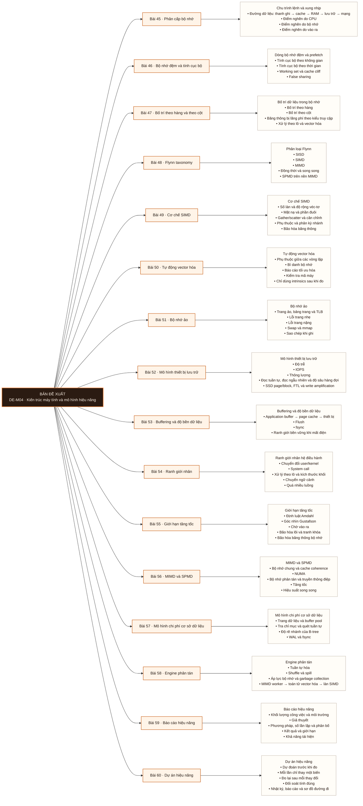

# Mô-đun 4: Kiến trúc máy tính và mô hình hiệu năng

## Second Brain References

- [[wiki.de-foundation.cache-lines-locality-cache-cliff|Cache lines, locality and the cache cliff]]

Mô-đun xây dựng mô hình chi phí từ lệnh máy, bộ nhớ, ranh giới nhân hệ điều hành và thiết bị lưu
trữ. Người học dùng mô hình này để dự đoán điểm nghẽn, thiết kế phép đo và giải thích hành vi của cơ
sở dữ liệu, hệ thống phân tán và dịch vụ dữ liệu. Mọi kết luận về hiệu năng phải dựa trên số đo của
chính khối lượng công việc đang xét.

## Điều kiện đầu vào

| Mã | Người học có thể | Bằng chứng được chấp nhận |
|---|---|---|
| EN-04-01 | Thiết kế một phép đo có giả thuyết và biến kiểm soát | Báo cáo đo từ M03 |
| EN-04-02 | Đọc thống kê mô tả và nhận biết số đo bất thường | Bài thực hành M03 |
| EN-04-03 | Viết, chạy và gỡ lỗi chương trình nhỏ | Mã nguồn và nhật ký chạy từ M02-M03 |

Nếu chưa có bằng chứng EN-04-01 hoặc EN-04-02, người học phải hoàn thành lại bài đo ở Bài 21 và Bài
33 trước khi bắt đầu Bài 45.

## Đầu ra mô-đun

Với một chương trình xử lý dữ liệu chưa từng gặp, người học phải dự đoán điểm nghẽn trước khi đo;
dùng số đo để phân biệt giới hạn do tính toán, rẽ nhánh, bộ nhớ đệm, băng thông bộ nhớ, đồng bộ, vào
ra hoặc truyền thông; thay đổi từng biến một; và viết báo cáo cho phép người khác tái hiện kết quả.

## Tiêu chí hoàn thành

| Mã | Bằng chứng bắt buộc | Ngưỡng đạt | Lỗi loại trực tiếp |
|---|---|---|---|
| EC-04-01 | Sơ đồ đường đi của một phép đọc và một phép ghi | Thể hiện đủ ứng dụng, ranh giới nhân, CPU, bộ nhớ đệm, RAM, bộ đệm trang và thiết bị | Nhầm dữ liệu đã ghi vào bộ đệm với dữ liệu đã bền vững |
| EC-04-02 | Bài phân loại SISD, SIMD, MIMD và SPMD | Đúng ít nhất 6/8 tình huống; giải thích được hai tầng song song lồng nhau | Đồng nhất SIMD với đa luồng hoặc coi SPMD là kiến trúc phần cứng |
| EC-04-03 | Hồ sơ chẩn đoán điểm nghẽn | Xác định đúng ít nhất 3/4 tình huống và dẫn số đo phân biệt | Kết luận từ một chỉ số hoặc thay đổi cấu hình trước khi có giả thuyết |
| EC-04-04 | Đường tăng tốc và hiệu suất song song | Có số đo ở 1, 2, 4 và 8 đơn vị thực thi; giải thích đúng điểm bão hòa | Chỉ báo cáo tăng tốc mà không báo hiệu suất song song |
| EC-04-05 | Báo cáo hiệu năng | Có khối lượng công việc, môi trường, giả thuyết, phương pháp, kết quả, độ phân tán và giới hạn | Không kiểm tính đúng của kết quả hoặc không ghi điều kiện đo |
| EC-04-06 | Dự án cuối mô-đun | Kết quả tính khớp bản gốc; mọi thay đổi có số đo; thời gian chạy giảm ít nhất một bậc độ lớn | Sửa nhiều biến cùng lúc hoặc làm sai kết quả để đổi lấy tốc độ |

## Khái niệm và nguyên tắc bất biến

| Mã | Ranh giới định nghĩa | Nguyên tắc bất biến hoặc quy tắc quyết định | Bài chính |
|---|---|---|---|
| C04-01 | Mã nguồn → trình biên dịch hoặc trình thông dịch → lệnh → pipeline → thanh ghi/ALU → load/store; gồm lời gọi hàm, stack frame, rẽ nhánh, biểu diễn số, tràn số và endianness ở mức nhận biết | Xung nhịp không đồng nghĩa với thông lượng; sai số số thực và tràn số có thể làm sai đối soát | L045 |
| C04-02 | Phân cấp bộ nhớ từ thanh ghi đến lưu trữ và mạng | Dùng số đo tại môi trường đang xét; không dùng bảng độ trễ như hằng số | L045 |
| C04-03 | Dòng bộ nhớ đệm, tính cục bộ, ánh xạ, associativity, replacement/write policy, prefetch và chia sẻ giả | Cùng số phép đọc không có nghĩa là cùng chi phí truy cập | L046 |
| C04-04 | Cấp phát, phân mảnh, bố trí theo hàng, theo cột, căn chỉnh và tập dữ liệu hoạt động | Chọn bố trí theo kiểu truy cập; không có bố trí luôn nhanh hơn | L047 |
| C04-05 | Flynn taxonomy và quan hệ giữa SISD, SIMD, MIMD, SPMD | Luồng lệnh, luồng dữ liệu, tính đồng thời và tính song song là các trục khác nhau | L048 |
| C04-06 | Làn SIMD, độ rộng véc-tơ, mặt nạ, phần đuôi, gather/scatter và phân kỳ nhánh | Tăng số làn chỉ có ích khi dữ liệu, phụ thuộc và băng thông cho phép | L049 |
| C04-07 | Tự động vector hóa, phân tích phụ thuộc và bí danh bộ nhớ | Đọc báo cáo tối ưu hóa và mã máy trước khi dùng intrinsics | L050 |
| C04-08 | Không gian địa chỉ, trang, bảng trang, TLB, tập dữ liệu hoạt động, lỗi trang, swap, sao chép khi ghi và `mmap` | Lỗi trang nhẹ, lỗi trang nặng và cache miss không cùng một hiện tượng | L051 |
| C04-09 | HDD seek/tuần tự, SSD page/block/FTL, độ trễ, IOPS, thông lượng, độ sâu hàng đợi, write amplification và endurance | Đọc tuần tự và đọc ngẫu nhiên phải được đo riêng trên dữ liệu vượt bộ đệm trang | L052 |
| C04-10 | Buffering, page cache, direct I/O, flush, `fsync`, device cache/media và lưu trữ qua mạng hoặc object storage | Lời gọi ghi thành công chưa chứng minh dữ liệu đã bền vững; giao thức mạng bổ sung độ trễ và ngữ nghĩa nhất quán | L053 |
| C04-11 | System call, chuyển chế độ, chuyển ngữ cảnh và xử lý theo lô | Giảm số lần vượt ranh giới nhân trước khi tối ưu phần tính nhỏ bên trong | L054 |
| C04-12 | Định luật Amdahl, góc nhìn Gustafson và hiệu suất song song | Phần tuần tự, mất cân bằng, đồng bộ, truyền thông và băng thông đặt trần tăng tốc | L055 |
| C04-13 | MIMD dùng bộ nhớ chung, NUMA, bộ nhớ phân tán và truyền thông điệp | Vị trí dữ liệu và chi phí truyền thông là một phần của thiết kế | L056 |
| C04-14 | Trang dữ liệu, buffer pool, tra chỉ mục, quét tuần tự, B-tree và WAL | Có chỉ mục không đồng nghĩa với việc dùng chỉ mục rẻ hơn quét | L057 |
| C04-15 | Tuần tự hóa, shuffle, spill, áp lực bộ nhớ và GC | Trong công việc phân tán, di chuyển dữ liệu có thể đắt hơn phép tính | L058 |
| C04-16 | Phương pháp báo cáo hiệu năng | Báo giả thuyết, độ phân tán và giới hạn; không chỉ báo một giá trị trung bình | L059-L060 |

## Các bài trong mô-đun

| Bài | Dạng | Đầu ra | Bằng chứng | Điều kiện tiên quyết |
|---|---|---|---|---|
| L045 · Phân cấp bộ nhớ và mô hình chi phí | LT | Phân loại đúng điểm nghẽn CPU, bộ nhớ hoặc vào ra | Ba ca phân loại và bộ số mốc đo trên máy học viên | M03 |
| L046 · Dòng bộ nhớ đệm, tính cục bộ và vách bộ nhớ đệm | TH | Suy ra dung lượng các mức đệm từ đồ thị đo | Đồ thị quét 4 KB-256 MB và phép thử chia sẻ giả | L045 |
| L047 · Bố trí theo hàng và theo cột | TH | Giải thích chênh lệch bằng băng thông bị lãng phí | Ma trận đo hai bố trí × hai kiểu truy vấn | L046 |
| L048 · Flynn taxonomy: SISD, SIMD, MIMD và SPMD | LT | Phân loại hệ thống theo đúng tầng song song | Bài phân loại tám hệ thống | L047 |
| L049 · SIMD từ làn đến toán tử | TH | Quy mức tăng tốc thấp về đúng cơ chế | Ba phiên bản vòng lặp, bộ đếm phần cứng và số chu kỳ trên mỗi dòng | L048 |
| L050 · Khi trình biên dịch không tự vector hóa | TH | Gỡ ba nguyên nhân cản vector hóa | Báo cáo tối ưu hóa, mã máy và số đo trước-sau | L049 |
| L051 · Bộ nhớ ảo, lỗi trang và `mmap` | LT | Phân biệt lỗi trang nhẹ, nặng và trạng thái swap | Chuỗi số đo khi tăng dần bộ nhớ sử dụng | L050 |
| L052 · Lưu trữ tuần tự, ngẫu nhiên và mô hình thiết bị | TH | Đo độ trễ, IOPS và thông lượng của thiết bị | Bốn cấu hình đo và đồ thị ghi liên tục | L051 |
| L053 · Buffering, page cache và `fsync` | TH | Nối cấu hình ghi với cam kết bền vững | Ba cấu hình ghi, thông lượng và số bản ghi sống sót | L052 |
| L054 · Ranh giới nhân, system call và chuyển ngữ cảnh | TH | Giảm số system call bằng xử lý theo lô | Số lời gọi và thời gian trước-sau; ba mức số luồng | L053 |
| L055 · Amdahl, Gustafson và giới hạn của việc thêm luồng | LT | Chẩn đoán nguyên nhân mất khả năng tăng tốc | Bốn ca được cài lỗi và ước lượng phần tuần tự | L054 |
| L056 · MIMD, bộ nhớ chung, bộ nhớ phân tán và SPMD | TH | Đo tăng tốc, hiệu suất và nguyên nhân bão hòa | Đường đo 1/2/4/8 đơn vị thực thi | L055 |
| L057 · Áp dụng mô hình vào cơ sở dữ liệu | LT | Giải thích quyết định quét hay dùng chỉ mục bằng chi phí đọc | Bốn tình huống chọn kế hoạch và phép tính chiều cao B-tree | L056 |
| L058 · Áp dụng mô hình vào engine phân tán | LT | Xếp hạng chi phí các bước của một công việc phân tán | Phân tích đọc, lọc, shuffle, ghi và phép đo tuần tự hóa | L057 |
| L059 · Viết báo cáo hiệu năng có thể rà soát | TH | Viết báo cáo để người khác lặp lại được | Báo cáo sáu phần và kết quả tái hiện chéo | L058 |
| L060 · Dự án dự đoán, đo và giải thích hiệu năng | DA | Tối ưu chương trình mà không làm đổi kết quả | Mã nguồn, nhật ký giả thuyết, số đo trước-sau, báo cáo và sơ đồ | L059 |

## Nội dung từng bài

> **Sơ đồ đề xuất: DE-M04 v0.1.0.** Mỗi nhánh đi từ một bài học đến các nội dung nguyên tử phải
> được dạy trong bài. Thứ tự dạy vẫn lấy từ bảng `Các bài trong mô-đun`, không lấy từ vị trí nút trên
> sơ đồ.

### Lesson 45: Phân cấp bộ nhớ và mô hình chi phí

Bài học dựng mô hình đường đi của dữ liệu từ thanh ghi, bộ nhớ đệm L001/L002/L003, RAM đến thiết bị lưu
trữ và mạng. Người học phân biệt độ trễ với thông lượng; nhận biết giới hạn do CPU, băng thông bộ nhớ
hoặc vào ra; và hiểu vì sao xung nhịp không thể dùng riêng để dự đoán tốc độ chương trình.

Người học đo ba chương trình có ba loại điểm nghẽn khác nhau, lập bộ số mốc trên chính máy đang dùng
và bảo vệ kết luận bằng số đo CPU, bộ nhớ và thời gian chờ vào ra.

### Lesson 46: Dòng bộ nhớ đệm, tính cục bộ và vách bộ nhớ đệm

Bài học giải thích cách CPU nạp dữ liệu theo dòng bộ nhớ đệm, tính cục bộ theo không gian và thời
gian, working set, prefetch và hiện tượng tốc độ giảm đột ngột khi dữ liệu vượt một cấp bộ nhớ đệm.
Phần chia sẻ giả cho thấy hai luồng có thể tranh chấp dù ghi vào hai biến khác nhau.

Người học quét kích thước dữ liệu từ 4 KB đến 256 MB, thay đổi bước nhảy truy cập, vẽ thời gian trên
mỗi phần tử và suy ra các cấp bộ nhớ đệm. Một phép thử hai luồng được dùng để tái hiện rồi sửa chia sẻ
giả bằng cách thay đổi bố trí dữ liệu.

### Lesson 47: Bố trí dữ liệu theo hàng và theo cột

Bài học so sánh hai cách đặt cùng một bảng trong bộ nhớ. Bố trí theo cột giảm lượng dữ liệu phải nạp
khi chỉ xử lý một số trường; bố trí theo hàng phù hợp hơn khi cần toàn bộ bản ghi. Kết luận phụ thuộc
kiểu truy cập, số cột, kiểu dữ liệu và kích thước bộ nhớ đệm.

Người học dựng một bộ dữ liệu 40 cột ở cả hai bố trí, đo phép gộp một cột và phép đọc toàn bản ghi,
rồi giải thích kết quả bằng tỷ lệ băng thông bị lãng phí. Bài học là nền cho columnar engine và xử lý
theo lô ở M14.

### Lesson 48: Flynn taxonomy, SISD, SIMD, MIMD và SPMD

Bài học đặt từ vựng cho các hình thức song song theo số luồng lệnh và luồng dữ liệu. SISD, SIMD và
MIMD được tách khỏi khái niệm đồng thời, đa luồng và song song. SPMD được trình bày như một khuôn mẫu
lập trình thường chạy trên nền MIMD, không phải một loại phần cứng khác.

Người học phân loại tám hệ thống hoặc đoạn mã, trong đó có vòng lặp vector hóa, bể luồng, cụm phân
tán và engine phân tích. Hai trường hợp có nhiều tầng song song phải được mô tả riêng ở từng tầng.

### Lesson 49: SIMD từ làn đến toán tử

Bài học đi từ lệnh vô hướng đến làn SIMD, độ rộng véc-tơ, độ rộng phần tử, mặt nạ, phần đuôi,
gather/scatter, căn chỉnh và phân kỳ nhánh. Sáu nguyên nhân làm tăng tốc thấp được phân tích: phụ
thuộc vòng lặp, lô quá nhỏ, nhánh phân kỳ, dữ liệu rải rác hoặc nhiều giá trị rỗng, bão hòa băng thông
và cấp phát quá mức.

Người học triển khai cùng phép tính ở dạng vô hướng, tự vector hóa và dùng thư viện vector hóa; sau
đó đo chu kỳ, số lệnh, cache miss, băng thông và số chu kỳ trên mỗi dòng cho ba bố trí dữ liệu.

### Lesson 50: Khi trình biên dịch không tự vector hóa

Bài học giải thích cách trình biên dịch phân tích phụ thuộc vòng lặp, bí danh bộ nhớ, căn chỉnh và
ngữ nghĩa số thực trước khi tạo lệnh véc-tơ. Báo cáo tối ưu hóa và mã máy là bằng chứng bắt buộc;
không suy đoán việc vector hóa từ thời gian chạy.

Người học tạo ba vòng lặp bị từ chối vector hóa vì ba nguyên nhân khác nhau, đọc lý do từ báo cáo,
viết lại từng vòng lặp và xác nhận bằng cả báo cáo, mã máy, số đo trước-sau và kết quả tính không đổi.

### Lesson 51: Bộ nhớ ảo, lỗi trang và `mmap`

Bài học trình bày không gian địa chỉ, trang ảo, bảng trang, TLB, khung trang vật lý, lỗi trang nhẹ,
lỗi trang nặng, swap, sao chép khi ghi và ánh xạ tệp. Cache miss và page fault được tách rõ vì chúng
xảy ra ở các tầng khác nhau và có chi phí khác nhau.

Người học tăng dần lượng bộ nhớ được cấp phát đến khi vượt RAM khả dụng, đo hai loại lỗi trang và
xác định thời điểm hệ thống bắt đầu swap. Một phép thử tạo tiến trình con được dùng để quan sát chi
phí sao chép khi ghi.

### Lesson 52: Lưu trữ tuần tự, ngẫu nhiên và mô hình thiết bị

Bài học phân biệt độ trễ, IOPS và thông lượng; giải thích seek trên HDD, page/block và FTL trên SSD,
độ sâu hàng đợi, write amplification và sự suy giảm tốc độ khi ghi kéo dài. Phép đo phải dùng dữ liệu
lớn hơn bộ đệm trang để không đo nhầm tốc độ RAM.

Người học đo đọc tuần tự và ngẫu nhiên ở hai độ sâu hàng đợi, ghi đủ ba đại lượng cho bốn cấu hình,
chạy ghi liên tục để quan sát mức suy giảm và đối chiếu kết quả với thông số nhà sản xuất.

### Lesson 53: Buffering, page cache và `fsync`

Bài học theo dõi phép ghi qua bộ đệm ứng dụng, system call, page cache, block layer, bộ đệm thiết bị
và vật liệu lưu trữ. `write()`, flush và `fsync` được gắn với ba cam kết bền vững khác nhau; ranh giới
mất điện phải được phát biểu chính xác.

Người học ghi 100.000 bản ghi ở ba cấu hình, đo thông lượng, mô phỏng tiến trình bị dừng đột ngột và
đếm số bản ghi còn lại. Kết quả phải cho thấy rõ phần đánh đổi giữa thông lượng và mức bảo đảm dữ
liệu.

### Lesson 54: Ranh giới nhân, system call và chuyển ngữ cảnh

Bài học giải thích chi phí khi chương trình vượt ranh giới user/kernel, lợi ích của xử lý theo lô và
chi phí lưu, khôi phục trạng thái khi chuyển ngữ cảnh. Quá nhiều luồng có thể làm bộ nhớ đệm nguội và
giảm thông lượng dù số công việc không đổi.

Người học so sánh đọc tệp từng byte với đọc theo khối 64 KB, đo số system call và thời gian. Một tác
vụ tính được chạy với một luồng, số luồng bằng số lõi và số luồng gấp tám lần số lõi để tìm điểm quá
tải.

### Lesson 55: Amdahl, Gustafson và giới hạn của việc thêm luồng

Bài học phân tích bốn nguyên nhân khiến thêm luồng không còn tăng tốc: tác vụ đang chờ vào ra, số
lõi đã bão hòa, tranh khóa hoặc băng thông bộ nhớ đã đầy. Định luật Amdahl mô tả bài toán có kích
thước cố định; góc nhìn Gustafson giải thích trường hợp kích thước bài toán tăng theo tài nguyên.

Người học chẩn đoán bốn chương trình được cài bốn loại giới hạn, đo mức dùng lõi, thời gian chờ vào
ra, thời gian chờ khóa và băng thông bộ nhớ. Từ đường tăng tốc, người học ước lượng phần không thể
song song hóa.

### Lesson 56: MIMD, bộ nhớ chung, bộ nhớ phân tán và SPMD

Bài học so sánh MIMD dùng bộ nhớ chung với MIMD dùng bộ nhớ phân tán. Phần bộ nhớ chung bao gồm
cache coherence, đồng bộ, chia sẻ giả và NUMA; phần phân tán bao gồm truyền thông điệp, độ trễ mạng,
tuần tự hóa, phân vùng dữ liệu và lỗi từng phần. SPMD được đặt trong cả hai mô hình.

Người học chạy cùng tải với 1, 2, 4 và 8 đơn vị thực thi, tính speedup và parallel efficiency, đo
chia sẻ giả, bộ nhớ NUMA ở xa và tách thời gian truyền thông khỏi thời gian tính ở bản phân tán.

### Lesson 57: Áp dụng mô hình vào cơ sở dữ liệu

Bài học nối mô hình phần cứng với trang dữ liệu, buffer pool, B-tree, tra chỉ mục, quét tuần tự và
WAL. Có chỉ mục không đảm bảo kế hoạch dùng chỉ mục rẻ hơn; khi tỷ lệ dòng cần đọc đủ lớn, số lần đọc
ngẫu nhiên có thể làm quét tuần tự trở thành phương án tốt hơn.

Người học phân tích bốn truy vấn lấy từ 0,01% đến 40% bảng, ước lượng số lần đọc cho hai kế hoạch và
dự đoán lựa chọn của bộ tối ưu. Bài tập bổ sung tính B-tree fanout và chiều cao cây cho bảng một triệu
dòng.

### Lesson 58: Áp dụng mô hình vào engine phân tán

Bài học phân tích chi phí tuần tự hóa, shuffle, spill, áp lực bộ nhớ và garbage collection. Shuffle
đồng thời dùng đĩa cục bộ, mạng và lần đọc lại; vì vậy di chuyển dữ liệu thường đắt hơn phép tính.
Bài học cũng nối ba tầng song song: MIMD worker, toán tử xử lý theo lô và làn SIMD.

Người học xếp hạng chi phí của các bước đọc, lọc, gộp nhóm và ghi trong một công việc phân tán; giải
thích từng bước bằng mô hình chi phí; và đo chi phí tuần tự hóa một triệu bản ghi qua ranh giới tiến
trình ở hai định dạng.

### Lesson 59: Viết báo cáo hiệu năng có thể rà soát

Bài học chuẩn hóa sáu phần của báo cáo: khối lượng công việc, môi trường, giả thuyết, phương pháp,
kết quả và giới hạn. Kết quả phải có số lần lặp và độ phân tán; trung vị và phân vị cao được dùng khi
giá trị trung bình che mất đuôi phân bố.

Người học chọn một phép đo đã thực hiện, viết báo cáo đủ sáu phần và giao cho người khác tái hiện chỉ
bằng nội dung báo cáo. Hai kết quả được đối chiếu và phần chênh lệch phải được giải thích bằng môi
trường đo.

### Lesson 60: Dự án dự đoán, đo và giải thích hiệu năng

Bài dự án yêu cầu người học xử lý một chương trình dữ liệu chạy chậm theo thứ tự bắt buộc: viết dự
đoán trước khi đo, đo để bác bỏ hoặc xác nhận, thay đổi đúng một yếu tố, đo lại và ghi cả giả thuyết
sai. Chất lượng lập luận và khả năng tái hiện quan trọng hơn một con số tăng tốc đẹp.

Sản phẩm nộp gồm mã nguồn, đối soát kết quả với bản gốc, nhật ký giả thuyết và thay đổi, số đo
trước-sau, báo cáo sáu phần và sơ đồ đường đi của dữ liệu từ ứng dụng đến thiết bị.

## Lý do sắp xếp

Các bài 45-47 thiết lập mô hình chi phí và tính cục bộ trước khi đưa vào các hình thức song song.
Bài 48 đặt từ vựng; bài 49-50 đi từ cơ chế SIMD đến bằng chứng của trình biên dịch. Bài 51-54 mở
rộng đường đi dữ liệu qua bộ nhớ ảo, lưu trữ và ranh giới nhân. Bài 55-56 mới xét tăng quy mô trên
nhiều lõi hoặc nút vì lúc này người học đã đo được từng nguồn chi phí. Bài 57-58 chuyển mô hình sang
cơ sở dữ liệu và engine phân tán. Bài 59 chuẩn hóa cách báo cáo trước dự án tổng hợp ở Bài 60.

Chuỗi song song lồng nhau phải được giữ xuyên suốt: worker MIMD ở ngoài, toán tử xử lý theo lô hoặc
vector hóa ở giữa, làn SIMD ở trong. Chuỗi này được dùng lại tại M14 và M23; không được rút gọn thành
thêm luồng làm chương trình nhanh hơn.

## Ma trận đánh giá

| Mã đầu ra | Mức độ tư duy | Cách đánh giá | Ngưỡng đạt | Hình thức kiểm tra lại |
|---|---|---|---|---|
| L045 | Phân tích | Phân loại ba chương trình và lập bộ số mốc trên máy đang dùng | Đúng 3/3; mỗi kết luận dẫn ít nhất một số đo phân biệt; ghi đủ môi trường đo | Ba chương trình mới có điểm nghẽn khác |
| L046 | Phân tích | Quét kích thước và bước nhảy; tái hiện rồi sửa false sharing | Đồ thị có phép đo lặp; chỉ đúng các điểm đổi độ dốc; bản sửa giữ nguyên kết quả và giảm tranh chấp | Mảng và kiểu truy cập mới |
| L047 | Phân tích | Đo hai bố trí dữ liệu với phép gộp một cột và phép đọc toàn bản ghi | Đủ ma trận 2 × 2; kết quả tính khớp; giải thích từng chênh lệch bằng lượng dữ liệu phải đọc | Bảng có số cột và kiểu truy cập khác |
| L048 | Phân tích | Phân loại tám hệ thống hoặc đoạn mã theo Flynn và SPMD | Đúng ≥ 6/8; hai trường hợp lồng nhau được mô tả đúng ở từng tầng | Bộ tám tình huống mới |
| L049 | Phân tích | So sánh bản vô hướng, tự vector hóa và thư viện vector hóa | Ba bản cho kết quả khớp; mức tăng hoặc không tăng được dẫn bằng bộ đếm, băng thông hoặc phân kỳ | Phép tính và bố trí dữ liệu mới |
| L050 | Áp dụng | Gỡ ba nguyên nhân khiến trình biên dịch từ chối vector hóa | Đúng 3/3 nguyên nhân; bản sửa có báo cáo tối ưu hóa và mã máy xác nhận; kết quả không đổi | Ba vòng lặp mới có nguyên nhân khác |
| L051 | Phân tích | Tăng dần bộ nhớ sử dụng và đo lỗi trang, swap cùng sao chép khi ghi | Phân biệt đúng lỗi trang nhẹ, lỗi trang nặng và cache miss; xác định được mốc bắt đầu swap từ số đo | Tải bộ nhớ và mẫu truy cập mới |
| L052 | Áp dụng | Đo đọc tuần tự và ngẫu nhiên ở hai độ sâu hàng đợi | Đủ bốn cấu hình; báo đủ độ trễ, IOPS và thông lượng; dữ liệu đo lớn hơn bộ đệm trang | Thiết bị hoặc kích thước khối khác |
| L053 | Phân tích | So sánh ba cấu hình ghi và kiểm tra dữ liệu sống sót sau dừng đột ngột | Báo đúng thông lượng và ranh giới bền vững của cả ba cấu hình; không suy độ bền chỉ từ giá trị trả về của `write()` | Ba cấu hình ghi mới |
| L054 | Áp dụng | So sánh đọc từng byte với đọc theo khối và thay đổi số luồng | Kết quả dữ liệu khớp; số system call và thời gian trước-sau được ghi; giải thích đúng điểm thêm luồng không còn lợi | Tệp và kích thước khối khác |
| L055 | Phân tích | Chẩn đoán bốn chương trình bị giới hạn bởi bốn cơ chế khác nhau | Đúng ≥ 3/4; mỗi kết luận dẫn số đo; ước lượng phần tuần tự khớp đường tăng tốc quan sát được | Bốn chương trình mới, không lộ loại giới hạn |
| L056 | Phân tích | Đo cùng tải với 1, 2, 4 và 8 đơn vị thực thi | Có speedup và parallel efficiency ở đủ bốn điểm; xác định đúng nguyên nhân bão hòa bằng số đo | Tải có nguyên nhân bão hòa khác |
| L057 | Phân tích | Chọn quét hoặc chỉ mục cho bốn truy vấn và tính chiều cao B-tree | Đúng ≥ 3/4 lựa chọn; mọi lựa chọn có ước lượng số lần đọc; phép tính B-tree ghi rõ giả định | Bảng và độ chọn lọc mới |
| L058 | Phân tích | Xếp hạng chi phí các bước của một công việc phân tán | Xác định đúng bước chi phối; có ít nhất một phép đo tuần tự hóa hoặc di chuyển dữ liệu; giải thích đúng ba tầng song song | Công việc phân tán có phân bố chi phí khác |
| L059 | Đánh giá | Viết báo cáo sáu phần và giao cho người khác tái hiện | Đủ sáu phần; kết quả đối soát đúng; người thứ hai tái hiện được kết luận cùng bậc từ tài liệu đã nộp | Viết lại từ bộ số đo khác |
| L060 | Sáng tạo | Tối ưu một chương trình chưa gặp theo quy trình dự đoán-đo-giải thích | Kết quả tính khớp bản gốc; mỗi lần chỉ đổi một biến; mọi thay đổi có số đo; thời gian chạy giảm ít nhất một bậc độ lớn | Chương trình mới, giữ nguyên tiêu chí |

Không cộng điểm để bù cho lỗi loại trực tiếp. Người học phải sửa đúng lỗi, nộp lại bằng chứng và
thực hiện kiểm tra lại trên một tình huống khác.

## Bài thực hành bắt buộc

| Bài thực hành | Bài liên quan | Sản phẩm bắt buộc | Lỗi được cài vào tình huống |
|---|---|---|---|
| Đo truy cập tuần tự và ngẫu nhiên trên mảng lớn | L045-L046 | Đồ thị vách bộ nhớ đệm và bộ số mốc | Dữ liệu ban đầu vừa trong bộ nhớ đệm |
| So sánh bố trí theo hàng và theo cột | L047, L049 | Ma trận đo và giải thích theo băng thông | Một truy vấn gộp và một truy vấn đọc toàn bản ghi cho kết luận ngược nhau |
| So sánh vô hướng, tự vector hóa và thư viện vector hóa | L049-L050 | Báo cáo trình biên dịch, mã máy, bộ đếm và kết quả đối soát | Phụ thuộc vòng lặp, bí danh hoặc dữ liệu rải rác |
| Đo ghi có đệm, flush và `fsync` | L052-L053 | Thông lượng và số bản ghi sống sót sau sự cố mô phỏng | Xác nhận ghi trả về trước ranh giới bền vững |
| Đo CPU, cache, lỗi trang và vào ra | L045, L051-L054 | Hồ sơ `perf stat`, `time`, `iostat`, `vmstat` hoặc công cụ tương đương | Bộ đệm trang che thiết bị; truy vết làm nhiễu phép đo |
| Đo false sharing và khả năng tăng quy mô | L046, L055-L056 | Đường speedup/efficiency và bản sửa có số đo | Bão hòa băng thông, tranh khóa, NUMA xa hoặc chi phí truyền thông |
| Dự án dự đoán-đo-giải thích | L057-L060 | Mã nguồn, nhật ký, sơ đồ và báo cáo sáu phần | Chương trình có nhiều dấu hiệu bề mặt nhưng chỉ một điểm nghẽn chính |
| Các phép thử biên của mô hình | L046, L049, L051-L053, L058 | Kết quả cho lọc có nhánh khó đoán, TLB/lỗi trang, swap/OOM, bộ đệm trang nóng/lạnh và dữ liệu nén/không nén | Một phép thử thay đổi đồng thời nhiều yếu tố hoặc đo nhầm RAM thay cho thiết bị |

## Ngộ nhận và lỗi loại trực tiếp

| Lỗi | Hệ quả | Nơi phát hiện | Cách khắc phục |
|---|---|---|---|
| Học thông số phần cứng như hằng số | Mô hình không còn đúng khi đổi máy hoặc tải | L045-L046 | Đo lại bộ số mốc trên môi trường đang dùng |
| Kết luận từ một phép đo hoặc một chỉ số | Không phân biệt được nguyên nhân với tương quan | L045, L052, L059 | Lặp phép đo, kiểm soát biến và thêm số đo phân biệt |
| Không hâm nóng, không lặp hoặc không đối soát kết quả | Số đo không dùng để so sánh | Mọi bài thực hành | Chạy lại toàn bộ phép đo theo quy trình chuẩn |
| Đồng nhất SIMD với đa luồng hoặc MIMD | Chọn sai tầng tối ưu hóa | L048-L050, L055-L056 | Phân loại lại theo luồng lệnh và luồng dữ liệu |
| Thêm làn, lõi hoặc nút trước khi xác định trần | Chi phí đồng bộ và truyền thông tăng nhưng thông lượng không tăng | L049, L055-L056 | Đo phần tuần tự, băng thông, chờ khóa và truyền thông |
| Coi `write()` thành công là dữ liệu đã bền | Mất dữ liệu sau sự cố nguồn | L053, L057 | Phát biểu và kiểm thử đúng ranh giới `fsync`/durable acknowledgement |
| Thay đổi nhiều biến cùng lúc | Không quy được cải thiện về nguyên nhân | L060 | Quay lại bản chuẩn và thay từng biến một |
| Che giấu giả thuyết sai hoặc giới hạn phép đo | Báo cáo không thể phản biện hoặc sử dụng lại | L059-L060 | Ghi đầy đủ giả thuyết, sai lệch và phạm vi kết luận |

## Điểm nối với mô-đun khác

| Kế thừa từ | Cung cấp cho mô-đun sau | Cam kết đầu ra |
|---|---|---|
| M02-M03: lập trình, cấu trúc dữ liệu, benchmark và gỡ lỗi | M05: hệ điều hành và đồng thời | Phân biệt chi phí tính toán, bộ nhớ, system call và chuyển ngữ cảnh bằng số đo |
| M03: mô hình chi phí thuật toán | M09-M10: SQL, cơ sở dữ liệu và storage engine | Giải thích page, buffer pool, B-tree fanout, quét tuần tự, tra ngẫu nhiên và WAL `fsync` |
| M03: đo và kiểm tính đúng | M14: nội tại OLAP | Giải thích columnar layout, compression, predicate pushdown và vectorized execution từ locality |
| M03: phân rã vấn đề | M23: Spark/Flink | Giải thích serialization, shuffle, spill, GC và hệ phân cấp MIMD worker → toán tử vector hóa → làn SIMD |
| M03: báo cáo thí nghiệm | Các mô-đun có đánh giá hiệu năng | Mẫu báo cáo sáu phần và quy tắc dự đoán trước khi đo |
| M03: mô hình hàng đợi và benchmark | M08: dịch vụ backend | Lập luận về connection pool, chờ system call/mạng, sao chép dữ liệu và điểm bão hòa CPU |

## Suy luận bắt buộc

- Tính độ rẽ nhánh của B-tree từ kích thước trang, khóa và con trỏ; dùng kết quả để ước lượng chiều
 cao cây và số lần đọc ngẫu nhiên.
- Giải thích vì sao lô dữ liệu theo cột kết hợp SIMD làm phép gộp nhanh hơn nhưng có thể làm cập nhật
 một bản ghi đắt hơn.
- Ước lượng ngưỡng spill của một tác vụ phân tán từ tập dữ liệu hoạt động, kích thước phân vùng và
 bộ nhớ cấp cho tác vụ.
- Xác định khi nào nén dữ liệu làm quét nhanh hơn vì lượng vào ra tiết kiệm được lớn hơn chi phí giải
 nén trên CPU.
- Giải thích vì sao tăng tính đồng thời chỉ tăng thông lượng đến khi tài nguyên nghẽn bão hòa hoặc
 hàng đợi tăng mất kiểm soát.
- Phân tích song song lồng nhau theo thứ tự MIMD worker/task → lô hoặc toán tử vector hóa → làn SIMD,
 đồng thời kiểm tra hiện tượng dùng quá nhiều lõi hoặc luồng.

## Đối chiếu năng lực

| Khung | Mức | Phạm vi được dùng trong mô-đun | Bằng chứng |
|---|---|---|---|
| SFIA `HPCC` | 3 | Đo và phân tích hành vi tính toán hiệu năng cao trong phạm vi bài thực hành | EC-04-02 đến EC-04-06 |
| SFIA `SYSP` | 3 | Áp dụng tư duy hệ thống để nối phần cứng, hệ điều hành và phần mềm | EC-04-01, EC-04-03, EC-04-05 |

Ánh xạ trên chỉ mô tả phạm vi năng lực được thực hành trong mô-đun. Nó không tự động chứng nhận cấp
độ SFIA của người học.

## Tài liệu tham khảo

| Mã | Nguồn | Vị trí | Dùng cho |
|---|---|---|---|
| R04-01 | Bryant và OHallaron, *Computer Systems: A Programmer's Perspective* | Chương 1, 5, 6, 8, 9, 10 | Chu trình thực thi, phân cấp bộ nhớ, bộ nhớ ảo và vào ra |
| R04-02 | Nisan và Schocken, *The Elements of Computing Systems* | Phần nền tảng từ phần cứng đến phần mềm | Ranh giới giữa phần cứng, lệnh và chương trình |
| R04-03 | Brendan Gregg, *Systems Performance*, ấn bản 2 | Các chương CPU, bộ nhớ, hệ tệp và đĩa | Phương pháp đo và chẩn đoán điểm nghẽn |
| R04-04 | Brendan Gregg, Linux Performance | USE method và bản đồ công cụ | Lựa chọn số đo và công cụ quan sát |
| R04-05 | Hợp đồng học tập gốc của Mô-đun 04 | `04_COMPUTER_ARCHITECTURE_PERFORMANCE.md` | Phạm vi, lab, tiêu chí hoàn thành và lỗi loại trực tiếp |

## Giới hạn của bản mô-đun

- Mô-đun dạy mô hình và phương pháp đo, không dạy thiết kế vi kiến trúc CPU hoặc viết trình điều
 khiển thiết bị.
- Intrinsics và mã đặc thù tập lệnh chỉ được đọc ở mức nhận biết; không phải đầu ra bắt buộc.
- NUMA, direct I/O, cache associativity, replacement policy, endianness và sai số số thực được dùng
 để nhận biết ranh giới, không được coi là năng lực vận hành production sau một mô-đun.
- Số đo phụ thuộc phần cứng, hệ điều hành, trình biên dịch và tải. Không dùng kết quả của một máy làm
 chuẩn chung cho máy khác.
