# Mô-đun 5: Hệ điều hành, đồng thời và Linux

Đây là module công cụ chẩn đoán của cả chương trình. Mọi module vận hành sau, từ M10 tới M26, đều giả định người học đọc được số đo hệ thống và phân biệt được bốn loại tải. Phần đồng thời ở đây là phần hệ điều hành của chủ đề đã học ở mức ngôn ngữ tại Bài 22 tới 29; hai phần bổ sung nhau chứ lặp lại.

## Điều kiện đầu vào

| Mã | Người học có thể | Bằng chứng được chấp nhận |
|---|---|---|
| EN-05-01 | M02 · M04 | Bằng chứng hoàn thành điều kiện được nêu trong cột trước |

Nếu chưa có bằng chứng đầu vào, người học phải hoàn thành lại bài hoặc mô-đun được dẫn chiếu trước khi thực hiện phép đánh giá của mô-đun này.

## Đầu ra mô-đun

Dùng bằng chứng từ Linux để chẩn đoán tiến trình, bộ nhớ, hệ tệp, socket và tranh chấp, thay vì đoán từ triệu chứng

## Tiêu chí hoàn thành

| Mã | Bằng chứng bắt buộc | Ngưỡng đạt | Lỗi loại trực tiếp |
|---|---|---|---|
| EC-05-01 | Chẩn đoán đúng bốn tình huống tải khác nhau chỉ bằng số đo hệ thống, sửa được một rò rỉ mô tả tệp cùng một khoá chết, và truy được đường từ hiệp trình tới tác vụ tới vòng lặp sự kiện tới bộ theo dõi tới mô tả tệp không chặn | Cả ba vấn đề được sửa và xác nhận hồi phục, mỗi kết luận dẫn được về số đo, và dòng thời gian có ghi nhánh sai đã thử. | Học thuộc danh sách lệnh mà không biết mỗi lệnh đo cái gì, nên khi hệ chậm thì chạy lần lượt mọi lệnh và vẫn không kết luận được |

## Khái niệm và nguyên tắc bất biến

| Mã khái niệm | Ranh giới định nghĩa | Nguyên tắc bất biến hoặc quy tắc quyết định | Bài chính |
|---|---|---|---|
| C05-061 | Hai chế độ thực thi và ranh giới giữa chúng là thứ đã gặp ở Bài 54 dưới góc chi phí; bài này nhìn từ góc cơ chế. | Chương trình chạy ở chế độ người dùng và không đụng trực tiếp vào phần cứng; mọi yêu cầu đều qua lời gọi hệ thống. | L061 |
| C05-062 | Bộ lập lịch quyết định tiến trình nào chạy khi nào, và hiểu nó giải thích vài chỉ số hay bị đọc sai. | Lát thời gian và tính công bằng; độ ưu tiên và giá trị nhường. | L062 |
| C05-063 | Câu hỏi tiến trình này dùng bao nhiêu bộ nhớ không có một câu trả lời duy nhất, và chọn sai chỉ số dẫn tới kết luận sai. | Bốn chỉ số và ý nghĩa | L063 |
| C05-064 | Hệ tệp tách tên khỏi nội dung: nút chỉ mục giữ siêu dữ liệu và con trỏ tới khối, còn thư mục chỉ là ánh xạ tên sang nút chỉ mục. | Từ đó suy ra ba điều hay gây ngạc nhiên | L064 |
| C05-065 | Bài giải thích cơ chế dưới mọi vòng lặp sự kiện, nên nó là nền của phần bất đồng bộ đã học ở M2. | Bộ mô tả chặn làm luồng gọi ngủ tới khi thao tác xong; bộ mô tả không chặn trả về ngay một trạng thái chưa sẵn sàng thay vì chờ, nên một luồng theo dõi được nhiều kết nối. | L065 |
| C05-066 | Hai mô hình vào ra khác nhau ở chỗ hệ điều hành báo gì cho ứng dụng. | Mô hình sẵn sàng báo rằng thao tác có thể tiến triển, còn ứng dụng tự gọi đọc hoặc ghi; mô hình hoàn tất nhận yêu cầu rồi báo khi đã xong. | L066 |
| C05-067 | Tín hiệu là cách nhân và các tiến trình báo cho nhau, và xử lý sai tín hiệu là nguyên nhân mất dữ liệu khi triển khai. | Phân biệt hai tín hiệu dừng: một cái bắt được và cho phép dọn dẹp, một cái không bắt được và giết ngay. | L067 |
| C05-068 | Shell là keo dán của mọi hệ vận hành, và script shell viết ẩu là nguồn sự cố âm thầm vì mặc định của shell là chạy tiếp khi có lỗi. | Ba tuỳ chọn nghiêm ngặt và tác dụng từng cái: dừng khi một lệnh lỗi, coi biến chưa đặt là lỗi, và cho lỗi trong đường ống lan ra. | L068 |
| C05-069 | Chạy một tiến trình lâu dài bằng cách mở terminal rồi để đó không phải cách vận hành, và trình quản lý dịch vụ giải bốn việc: khởi động cùng máy, khởi động lại khi chết, thu thập nhật ký, và quản lý phụ thuộc giữa các dịch vụ. | Tệp định nghĩa dịch vụ và các trường quan trọng: lệnh chạy, người dùng chạy, chính sách khởi động lại, biến môi trường, và giới hạn tài nguyên. | L069 |
| C05-070 | Phần này lặp lại chủ đề của Bài 22 nhưng ở tầng hệ điều hành và với công cụ chẩn đoán thật. | Ba tính chất phải phân biệt vì chúng hỏng theo ba cách khác nhau: tính nguyên tử, tính nhìn thấy được, và thứ tự. | L070 |
| C05-071 | Hai công cụ trả lời hai câu hỏi khác nhau, và biết dùng cái nào cho câu nào tiết kiệm rất nhiều thời gian. | Theo dõi lời gọi hệ thống trả lời chương trình đang nói gì với nhân: mở tệp nào, kết nối tới đâu, chờ ở đâu; rất hữu dụng khi chương trình treo hoặc khi không rõ nó đọc tệp cấu hình nào. | L071 |
| C05-072 | Bài tổng hợp phần chẩn đoán, và nó là thứ dùng nhiều nhất khi trực. | Bốn loại tải và bộ chỉ số phân biệt từng loại. | L072 |
| C05-073 | Quyền trên Linux là tầng phòng vệ đầu tiên và cũng là tầng hay bị vô hiệu hoá vì tiện. | Ba nhóm quyền và ba loại quyền, cùng cách đọc và đặt. | L073 |
| C05-074 | Bộ công cụ tối thiểu để trả lời câu hỏi vì sao không kết nối được, và bài này chuẩn bị trực tiếp cho M6. | Năm câu hỏi theo thứ tự chẩn đoán và công cụ tương ứng cho từng câu | L074 |
| C05-075 | Bài ghép: biến mọi kỹ năng chẩn đoán trong module thành một sổ tay dùng được lúc ba giờ sáng. | Cấu trúc sổ tay theo đúng trình tự người trực cần, đã đặt ở Bài 10: triệu chứng nào, ảnh hưởng ra sao, chẩn đoán theo bước nào, giảm nhẹ thế nào, leo thang cho ai, và xác nhận đã hồi phục bằng gì. | L075 |
| C05-076 | Bài dự án khép module. | Nhận một máy có dịch vụ dữ liệu đang chạy sai theo nhiều cách cùng lúc, và nhiệm vụ là đưa nó về trạng thái khoẻ mạnh với bằng chứng cho từng bước. | L076 |

## Các bài trong mô-đun

| Bài | Dạng | Đầu ra | Bằng chứng | Điều kiện tiên quyết |
|---|---|---|---|---|
| L061 · User mode, kernel mode and the process lifecycle | LT | Đọc trạng thái của một tiến trình và suy ra nó đang chờ cái gì, phân biệt được chờ vào ra với chờ CPU. | Phân loại đúng ≥ 4/5 trạng thái, và nhận ra đúng tiến trình đang chờ vào ra không ngắt được. | M05: M02 · M04 |
| L062 · Scheduling, priority and load average | TH | Phân biệt máy nghẽn CPU với máy nghẽn vào ra chỉ bằng chỉ số hệ thống, không cần đọc mã. | Phân loại đúng ≥ 3/4 tình huống, và chỉ ra đúng tình huống tải trung bình cao trong khi CPU rảnh. | L061 |
| L063 · Memory - virtual, resident, shared and OOM | TH | Chọn đúng chỉ số để trả lời câu hỏi một tiến trình dùng bao nhiêu bộ nhớ, và đọc được bản ghi của bộ giết khi cạn bộ nhớ. | Chọn đúng chỉ số cho cả ba tiến trình kèm giải thích chênh lệch, và đọc đúng nạn nhân cùng lý do từ nhật ký nhân. | L062 |
| L064 · Filesystems, inodes, file descriptors and leaks | TH | Tìm được nguyên nhân đĩa đầy mà không thấy tệp, và định vị một rò rỉ mô tả tệp về đúng đoạn mã. | Tìm đúng tiến trình giữ tệp đã xoá, và sau khi sửa thì số mô tả tệp ổn định qua 10.000 yêu cầu. | L063 |
| L065 · Non-blocking descriptors, select, poll and epoll | TH | Viết một máy chủ một luồng theo dõi nhiều kết nối và đo chi phí của hai cơ chế theo dõi khi số kết nối tăng. | Hai đường chi phí tách nhau rõ ở 10.000 kết nối, và ca treo do báo theo sườn được tái hiện rồi sửa. | L064 |
| L066 · Readiness against completion - partial I/O, cancellation and io_uring awareness | TH | Xử lý đúng đọc thiếu và ghi thiếu dưới tải, và nêu ranh giới mà huỷ bỏ không hoàn tác được. | Không thông điệp nào bị cắt hay ghép sai qua 10.000 lượt, và hậu quả của huỷ giữa chừng được mô tả đúng ở phía bên kia. | L065 |
| L067 · Signals, exit codes and graceful shutdown | TH | Cài đặt tắt có kiểm soát cho một tiến trình xử lý và chứng minh không mất việc đang dở khi nhận tín hiệu dừng. | 20 lần gửi tín hiệu dừng đều không mất việc đang dở, và mã thoát đúng ở cả ba trường hợp. | L066 |
| L068 · Shell scripting that fails loudly | TH | Viết script vận hành dừng đúng lúc lỗi, dọn dẹp khi thoát, và trả mã thoát đúng trong mọi nhánh. | Năm lỗi đều làm script dừng với mã thoát khác không, và thư mục tạm được dọn trong cả năm trường hợp. | L067 |
| L069 · Services with systemd and the journal | TH | Chạy một dịch vụ dữ liệu dưới trình quản lý dịch vụ với chính sách khởi động lại đúng và nhật ký đọc được tập trung. | Dịch vụ tự khởi động lại sau khi bị giết, vòng lặp khởi động bị chặn theo giới hạn, và nhật ký lọc được theo mã theo dõi. | L068 |
| L070 · Races, locks and deadlock at the OS level | TH | Chẩn đoán một khoá chết thật bằng công cụ hệ thống và sửa bằng cách phá đúng một trong bốn điều kiện. | Định vị đúng cặp khoá gây treo bằng bằng chứng hệ thống, sửa xong chương trình không treo qua 1000 lần chạy, và có số đo tranh chấp trước sau. | L069 |
| L071 · Tracing a program with strace and perf | TH | Chọn đúng công cụ cho một triệu chứng cho trước và định vị nguyên nhân từ kết quả của nó. | Chọn đúng công cụ ≥ 2/3 trường hợp và định vị đúng nguyên nhân, kể cả chỉ ra lời gọi mà chương trình treo đang chờ. | L070 |
| L072 · Distinguishing four kinds of system pressure | TH | Chẩn đoán đúng loại tải trong bốn loại chỉ bằng chỉ số hệ thống, trong giới hạn thời gian. | Chẩn đoán đúng ≥ 3/4 tình huống trong giới hạn thời gian, mỗi lần dẫn được hai chỉ số nhất quán. | L071 |
| L073 · Permissions, users and the least-privilege habit | TH | Đặt quyền tối thiểu cho một dịch vụ và chứng minh bằng phép thử rằng tài khoản khác không đọc hay ghi được. | Ba phép thử truy cập trái phép đều bị từ chối, dịch vụ vẫn chạy đúng, và tệp mới sinh ra có quyền đúng theo mặt nạ. | L072 |
| L074 · Networking from the command line | TH | Chẩn đoán một lỗi kết nối về đúng một trong ba loại thất bại, theo đúng thứ tự năm bước. | Phân loại đúng ≥ 2/3 lỗi và chỉ ra đúng bước phát hiện, kèm bảng socket đang mở có đọc trạng thái. | L073 |
| L075 · A diagnosis runbook for a data service | TH | Viết sổ tay năm mục mà một người khác dùng được để chẩn đoán và khắc phục, không cần hỏi. | Người ngoài xử lý được ≥ 3/5 tình huống chỉ bằng sổ tay, và bản sửa sau đó giảm được số câu phải hỏi. | L074 |
| L076 · Linux diagnosis project | DA | Đưa một máy có ba vấn đề về trạng thái khoẻ mạnh, mỗi kết luận dẫn được về số đo, và xác nhận được đã hồi phục. | Cả ba vấn đề được sửa và xác nhận hồi phục, mỗi kết luận dẫn được về số đo, và dòng thời gian có ghi nhánh sai đã thử. | L075 |

## Nội dung từng bài

> **Sơ đồ đề xuất — DE-M05 v0.1.0.** Mỗi nhánh đi từ một bài học đến các nội dung nguyên tử bắt buộc. Thứ tự dạy lấy từ bảng `Các bài trong mô-đun`.

```mermaid
%%{init: {"flowchart": {"htmlLabels": true, "wrappingWidth": 720, "nodeSpacing": 64, "rankSpacing": 160}}}%%
flowchart LR
  M05["BẢN ĐỀ XUẤT<br/>DE-M05 · Hệ điều hành, đồng thời và Linux"]
  M05 --> L061["Bài 61 · User mode, kernel mode and the process lifecycle"]
  L061 --> A061["• Hai chế độ thực thi và ranh giới giữa chúng là thứ đã gặp ở Bài 54 dưới góc chi phí; bài này nhìn từ góc cơ chế.<br/>• Chương trình chạy ở chế độ người dùng và không đụng trực tiếp vào phần cứng; mọi yêu cầu đều qua lời gọi hệ thống.<br/>• Ngắt và bẫy là hai đường vào nhân khác nhau.<br/>• Vòng đời tiến trình: tạo bằng nhân bản rồi thay thế ảnh chương trình, và vì sao hai bước đó tách rời lại hữu dụng."]
  M05 --> L062["Bài 62 · Scheduling, priority and load average"]
  L062 --> A062["• Bộ lập lịch quyết định tiến trình nào chạy khi nào, và hiểu nó giải thích vài chỉ số hay bị đọc sai.<br/>• Lát thời gian và tính công bằng; độ ưu tiên và giá trị nhường.<br/>• Chỉ số tải trung bình là chỉ số bị hiểu sai nhiều nhất trên Linux<br/>• nó đếm cả tiến trình đang chạy lẫn tiến trình đang chờ vào ra không ngắt được, nên tải trung bình cao không đồng nghĩa CPU bận"]
  M05 --> L063["Bài 63 · Memory - virtual, resident, shared and OOM"]
  L063 --> A063["• Câu hỏi tiến trình này dùng bao nhiêu bộ nhớ không có một câu trả lời duy nhất, và chọn sai chỉ số dẫn tới kết luận sai.<br/>• Bốn chỉ số và ý nghĩa<br/>• bộ nhớ ảo là không gian địa chỉ đã đăng ký và thường lớn vô lý nên gần như vô dụng để đánh giá<br/>• bộ nhớ thường trú là phần thật đang trong RAM"]
  M05 --> L064["Bài 64 · Filesystems, inodes, file descriptors and leaks"]
  L064 --> A064["• Hệ tệp tách tên khỏi nội dung: nút chỉ mục giữ siêu dữ liệu và con trỏ tới khối, còn thư mục chỉ là ánh xạ tên sang nút chỉ mục.<br/>• Từ đó suy ra ba điều hay gây ngạc nhiên<br/>• liên kết cứng là hai tên trỏ cùng nút chỉ mục nên xoá một tên không xoá dữ liệu<br/>• xoá một tệp đang được tiến trình mở thì dung lượng không được giải phóng cho tới khi tiến trình đóng, và đây là nguyên nhân kinh điển của việc đĩa đầy mà tìm không ra tệp nào"]
  M05 --> L065["Bài 65 · Non-blocking descriptors, select, poll and epoll"]
  L065 --> A065["• Bài giải thích cơ chế dưới mọi vòng lặp sự kiện, nên nó là nền của phần bất đồng bộ đã học ở M2.<br/>• Bộ mô tả chặn làm luồng gọi ngủ tới khi thao tác xong; bộ mô tả không chặn trả về ngay một trạng thái chưa sẵn sàng thay vì chờ, nên một luồng theo dõi được nhiều kết nối.<br/>• Ba thế hệ cơ chế theo dõi và khác biệt về chi phí<br/>• hai cơ chế cũ quét toàn bộ tập bộ mô tả mỗi lần gọi nên chi phí tăng theo số kết nối"]
  M05 --> L066["Bài 66 · Readiness against completion - partial I/O, cancellation and io_uring awareness"]
  L066 --> A066["• Hai mô hình vào ra khác nhau ở chỗ hệ điều hành báo gì cho ứng dụng.<br/>• Mô hình sẵn sàng báo rằng thao tác có thể tiến triển, còn ứng dụng tự gọi đọc hoặc ghi; mô hình hoàn tất nhận yêu cầu rồi báo khi đã xong.<br/>• Hệ quả quan trọng nhất của mô hình sẵn sàng và là lỗi hay gặp: sẵn sàng không bảo đảm đọc hoặc ghi được trọn vẹn thông điệp, nên mọi lời gọi phải xử lý đọc thiếu và ghi thiếu, và ứng dụng phải tự đóng khung thông điệp.<br/>• Huỷ bỏ ở tầng ứng dụng không tự hoàn tác một lời gọi hệ thống đã phát ra hay một tác dụng phụ đã xảy ra ở bên kia, nên ranh giới sở hữu, dọn dẹp và công bố phải do mã định nghĩa, đúng nguyên tắc ở Bài 27."]
  M05 --> L067["Bài 67 · Signals, exit codes and graceful shutdown"]
  L067 --> A067["• Tín hiệu là cách nhân và các tiến trình báo cho nhau, và xử lý sai tín hiệu là nguyên nhân mất dữ liệu khi triển khai.<br/>• Phân biệt hai tín hiệu dừng: một cái bắt được và cho phép dọn dẹp, một cái không bắt được và giết ngay.<br/>• Quy trình tắt đúng của một tiến trình xử lý dữ liệu: nhận tín hiệu, ngừng nhận việc mới, hoàn tất việc đang dở trong hạn, đẩy dữ liệu xuống đĩa, rồi thoát với mã đúng.<br/>• Thời gian chờ trước khi bị giết cứng là hữu hạn nên phần dọn dẹp phải nằm trong hạn đó, và đây là ràng buộc sẽ gặp lại ở M25."]
  M05 --> L068["Bài 68 · Shell scripting that fails loudly"]
  L068 --> A068["• Shell là keo dán của mọi hệ vận hành, và script shell viết ẩu là nguồn sự cố âm thầm vì mặc định của shell là chạy tiếp khi có lỗi.<br/>• Ba tuỳ chọn nghiêm ngặt và tác dụng từng cái: dừng khi một lệnh lỗi, coi biến chưa đặt là lỗi, và cho lỗi trong đường ống lan ra.<br/>• Kèm theo là cảnh báo về các trường hợp tuỳ chọn dừng khi lỗi không kích hoạt, vì tin tưởng mù vào nó cũng nguy hiểm.<br/>• Trích dẫn và khai triển: quên ngoặc kép quanh biến là nguồn lỗi số một khi tên tệp có dấu cách."]
  M05 --> L069["Bài 69 · Services with systemd and the journal"]
  L069 --> A069["• Chạy một tiến trình lâu dài bằng cách mở terminal rồi để đó không phải cách vận hành, và trình quản lý dịch vụ giải bốn việc: khởi động cùng máy, khởi động lại khi chết, thu thập nhật ký, và quản lý phụ thuộc giữa các dịch vụ.<br/>• Tệp định nghĩa dịch vụ và các trường quan trọng: lệnh chạy, người dùng chạy, chính sách khởi động lại, biến môi trường, và giới hạn tài nguyên.<br/>• Chính sách khởi động lại và bẫy vòng lặp: dịch vụ chết ngay khi khởi động cộng với chính sách luôn khởi động lại cho ra vòng lặp khởi động liên tục, nên phải đặt giới hạn số lần trong một khoảng.<br/>• Nhật ký tập trung: đọc theo dịch vụ, theo thời gian, theo mức, và vì sao ghi ra luồng chuẩn tiện hơn tự ghi tệp, nối lại nguyên tắc ở Bài 20."]
  M05 --> L070["Bài 70 · Races, locks and deadlock at the OS level"]
  L070 --> A070["• Phần này lặp lại chủ đề của Bài 22 nhưng ở tầng hệ điều hành và với công cụ chẩn đoán thật.<br/>• Ba tính chất phải phân biệt vì chúng hỏng theo ba cách khác nhau: tính nguyên tử, tính nhìn thấy được, và thứ tự.<br/>• Ba nguyên hàm đồng bộ và khi nào dùng cái nào: khoá loại trừ, cờ hiệu đếm, và biến điều kiện.<br/>• Bốn điều kiện cần cùng lúc để có khoá chết, và phá bất kỳ điều kiện nào là chặn được; cách phá thực dụng nhất là quy định thứ tự lấy khoá."]
  M05 --> L071["Bài 71 · Tracing a program with strace and perf"]
  L071 --> A071["• Hai công cụ trả lời hai câu hỏi khác nhau, và biết dùng cái nào cho câu nào tiết kiệm rất nhiều thời gian.<br/>• Theo dõi lời gọi hệ thống trả lời chương trình đang nói gì với nhân: mở tệp nào, kết nối tới đâu, chờ ở đâu; rất hữu dụng khi chương trình treo hoặc khi không rõ nó đọc tệp cấu hình nào.<br/>• Nhược điểm là làm chương trình chậm đáng kể nên không dùng trong sản xuất khi tải cao.<br/>• Lấy mẫu hiệu năng trả lời thời gian CPU tiêu ở hàm nào, nhẹ nên dùng được trong sản xuất, nhưng không thấy phần chờ."]
  M05 --> L072["Bài 72 · Distinguishing four kinds of system pressure"]
  L072 --> A072["• Bài tổng hợp phần chẩn đoán, và nó là thứ dùng nhiều nhất khi trực.<br/>• Bốn loại tải và bộ chỉ số phân biệt từng loại.<br/>• Bão hoà CPU: mức dùng cao ở phần người dùng hoặc phần nhân, hàng đợi chạy dài, chờ vào ra thấp.<br/>• Nghẽn vào ra: chờ vào ra cao, độ sâu hàng đợi thiết bị cao, thời gian phục vụ cao, trong khi CPU rảnh."]
  M05 --> L073["Bài 73 · Permissions, users and the least-privilege habit"]
  L073 --> A073["• Quyền trên Linux là tầng phòng vệ đầu tiên và cũng là tầng hay bị vô hiệu hoá vì tiện.<br/>• Ba nhóm quyền và ba loại quyền, cùng cách đọc và đặt.<br/>• Mặt nạ tạo tệp quyết định quyền mặc định của tệp mới và là nguồn lỗi hay gặp khi một dịch vụ ghi tệp mà dịch vụ khác không đọc được.<br/>• Quyền trên thư mục có nghĩa khác quyền trên tệp và đây là chỗ hay nhầm: quyền thực thi trên thư mục nghĩa là đi vào được."]
  M05 --> L074["Bài 74 · Networking from the command line"]
  L074 --> A074["• Bộ công cụ tối thiểu để trả lời câu hỏi vì sao không kết nối được, và bài này chuẩn bị trực tiếp cho M6.<br/>• Năm câu hỏi theo thứ tự chẩn đoán và công cụ tương ứng cho từng câu<br/>• tên miền phân giải ra địa chỉ nào, máy có đường đi tới địa chỉ đó không, cổng có mở và có ai đang nghe không, bắt tay có thành công không, và ứng dụng trả lời gì.<br/>• Đi theo thứ tự này tránh được việc đoán lung tung."]
  M05 --> L075["Bài 75 · A diagnosis runbook for a data service"]
  L075 --> A075["• Bài ghép: biến mọi kỹ năng chẩn đoán trong module thành một sổ tay dùng được lúc ba giờ sáng.<br/>• Cấu trúc sổ tay theo đúng trình tự người trực cần, đã đặt ở Bài 10: triệu chứng nào, ảnh hưởng ra sao, chẩn đoán theo bước nào, giảm nhẹ thế nào, leo thang cho ai, và xác nhận đã hồi phục bằng gì.<br/>• Năm mục bắt buộc cho một dịch vụ dữ liệu, mỗi mục tương ứng một bài đã học: dịch vụ không khởi động, dịch vụ chậm bất thường, đĩa đầy, rò rỉ mô tả tệp, và không kết nối được tới nguồn.<br/>• Nguyên tắc viết: mỗi bước là một lệnh chạy được kèm cái cần nhìn trong kết quả, chứ một lời khuyên chung."]
  M05 --> L076["Bài 76 · Linux diagnosis project"]
  L076 --> A076["• Bài dự án khép module.<br/>• Nhận một máy có dịch vụ dữ liệu đang chạy sai theo nhiều cách cùng lúc, và nhiệm vụ là đưa nó về trạng thái khoẻ mạnh với bằng chứng cho từng bước.<br/>• Ba loại vấn đề cài sẵn, mỗi loại thuộc một nhóm đã học: một vấn đề tài nguyên, một vấn đề cấu hình dịch vụ, và một vấn đề quyền hoặc kết nối.<br/>• Yêu cầu nộp: dòng thời gian chẩn đoán ghi theo thứ tự thật gồm cả nhánh sai đã thử, bằng chứng số đo cho từng kết luận, thay đổi đã thực hiện, và cách xác nhận đã hồi phục."]

  classDef module fill:#2b1b12,color:#fff4e8,stroke:#ff8a3d,stroke-width:2px;
  classDef lesson fill:#fff4e8,color:#2b1b12,stroke:#c85e16,stroke-width:1.5px;
  classDef atom fill:#fffdf8,color:#2b1b12,stroke:#b8a99a,stroke-width:1px,font-size:15px;
  class M05 module;
  class L061,L062,L063,L064,L065,L066,L067,L068,L069,L070,L071,L072,L073,L074,L075,L076 lesson;
  class A061,A062,A063,A064,A065,A066,A067,A068,A069,A070,A071,A072,A073,A074,A075,A076 atom;
```

### Bài 61: User mode, kernel mode and the process lifecycle

Hai chế độ thực thi và ranh giới giữa chúng là thứ đã gặp ở Bài 54 dưới góc chi phí; bài này nhìn từ góc cơ chế. Chương trình chạy ở chế độ người dùng và không đụng trực tiếp vào phần cứng; mọi yêu cầu đều qua lời gọi hệ thống. Ngắt và bẫy là hai đường vào nhân khác nhau. Vòng đời tiến trình: tạo bằng nhân bản rồi thay thế ảnh chương trình, và vì sao hai bước đó tách rời lại hữu dụng. Các trạng thái của tiến trình và ý nghĩa vận hành của từng trạng thái, đặc biệt trạng thái chờ vào ra không ngắt được vì nó là dấu hiệu đĩa hoặc mạng có vấn đề. Tiến trình xác sống và tiến trình mồ côi, cùng cách chúng phát sinh; nối lại vấn đề tiến trình con mồ côi đã gặp ở Bài 23. Tiến trình so với luồng ở mức nhân: khác nhau ở chỗ chia sẻ không gian địa chỉ hay không, và mọi hệ quả suy ra từ đó.

Người học phải đọc trạng thái của một tiến trình và suy ra nó đang chờ cái gì, phân biệt được chờ vào ra với chờ CPU. Bằng chứng thực hành: Tạo năm tiến trình ở năm trạng thái khác nhau gồm đang chạy, chờ được cấp CPU, chờ vào ra, dừng, và xác sống. Quan sát trạng thái qua công cụ hệ thống và qua hệ tệp ảo của nhân. Phân loại từng cái. Tạo một tiến trình mồ côi và quan sát nó được nhận nuôi. Bài hoàn tất khi phân loại đúng ≥ 4/5 trạng thái, và nhận ra đúng tiến trình đang chờ vào ra không ngắt được.

Cách đánh giá: Tầng *hiểu*. Bài mở module, đặt từ vựng cho phần chẩn đoán sau. Kiểm bằng bài đọc trạng thái trên năm tiến trình thật; đạt khi phân loại đúng ít nhất bốn và nhận ra đúng tiến trình đang ở trạng thái chờ vào ra không ngắt được.

### Bài 62: Scheduling, priority and load average

Bộ lập lịch quyết định tiến trình nào chạy khi nào, và hiểu nó giải thích vài chỉ số hay bị đọc sai. Lát thời gian và tính công bằng; độ ưu tiên và giá trị nhường. Chỉ số tải trung bình là chỉ số bị hiểu sai nhiều nhất trên Linux: nó đếm cả tiến trình đang chạy lẫn tiến trình đang chờ vào ra không ngắt được, nên tải trung bình cao không đồng nghĩa CPU bận; một máy đĩa hỏng có tải trung bình rất cao trong khi CPU rảnh. Cách đọc đúng: so tải trung bình với số lõi, rồi đối chiếu với tỉ lệ CPU chờ vào ra để biết đang nghẽn ở đâu. Mức dùng CPU chia theo loại và ý nghĩa của từng loại, đặc biệt phần chờ vào ra và phần bị đánh cắp trên máy ảo. Độ dài hàng đợi chạy. Ba tình huống mà thêm tiến trình làm mọi thứ chậm đi thay vì nhanh lên.

Người học phải phân biệt máy nghẽn CPU với máy nghẽn vào ra chỉ bằng chỉ số hệ thống, không cần đọc mã. Bằng chứng thực hành: Tạo bốn tình huống tải: bão hoà CPU, chờ vào ra nặng, áp lực bộ nhớ, và nhiều tiến trình chờ được cấp CPU. Với mỗi tình huống, ghi tải trung bình, mức dùng CPU chia theo loại, và độ dài hàng đợi chạy. Phân loại từng tình huống. Chỉ ra tình huống nào có tải trung bình cao mà CPU rảnh. Bài hoàn tất khi phân loại đúng ≥ 3/4 tình huống, và chỉ ra đúng tình huống tải trung bình cao trong khi CPU rảnh.

Cách đánh giá: Tầng *phân tích*. Objective là đọc và diễn giải chỉ số đúng, kỹ năng dùng trực tiếp khi trực. Kiểm bằng bốn máy mô phỏng; đạt khi phân loại đúng ít nhất ba và mỗi lần dẫn được chỉ số phân biệt chứ chỉ tải trung bình.

### Bài 63: Memory - virtual, resident, shared and OOM

Câu hỏi tiến trình này dùng bao nhiêu bộ nhớ không có một câu trả lời duy nhất, và chọn sai chỉ số dẫn tới kết luận sai. Bốn chỉ số và ý nghĩa: bộ nhớ ảo là không gian địa chỉ đã đăng ký và thường lớn vô lý nên gần như vô dụng để đánh giá; bộ nhớ thường trú là phần thật đang trong RAM; bộ nhớ chia sẻ bị đếm nhiều lần khi cộng các tiến trình; và kích thước tập làm việc là phần thật sự đang được dùng. Bộ nhớ khả dụng khác bộ nhớ trống: phần bộ đệm trang tính là dùng nhưng giải phóng được ngay, nên bộ nhớ trống thấp không phải vấn đề, và đây là báo động giả phổ biến nhất. Bộ giết khi cạn bộ nhớ: khi nào kích hoạt, chọn nạn nhân theo điểm số nào, và cách đọc bản ghi của nó trong nhật ký nhân; nối lại tình huống tác vụ bị giết ở tầng container sẽ gặp ở M25.

Người học phải chọn đúng chỉ số để trả lời câu hỏi một tiến trình dùng bao nhiêu bộ nhớ, và đọc được bản ghi của bộ giết khi cạn bộ nhớ. Bằng chứng thực hành: Chạy ba tiến trình có hồ sơ bộ nhớ khác nhau gồm ánh xạ tệp lớn, cấp phát thật lớn, và dùng chung thư viện. Với mỗi cái, ghi cả bốn chỉ số và giải thích chênh lệch. Đẩy máy tới cạn bộ nhớ, tìm bản ghi của bộ giết trong nhật ký nhân và xác định nạn nhân cùng lý do. Bài hoàn tất khi chọn đúng chỉ số cho cả ba tiến trình kèm giải thích chênh lệch, và đọc đúng nạn nhân cùng lý do từ nhật ký nhân.

Cách đánh giá: Tầng *phân tích*. Objective đòi chọn đúng công cụ đo cho câu hỏi, chỗ rất dễ kết luận sai. Kiểm bằng bài đo cộng thí nghiệm cạn bộ nhớ; đạt khi chọn đúng chỉ số và đọc đúng nguyên nhân từ nhật ký nhân.

### Bài 64: Filesystems, inodes, file descriptors and leaks

Hệ tệp tách tên khỏi nội dung: nút chỉ mục giữ siêu dữ liệu và con trỏ tới khối, còn thư mục chỉ là ánh xạ tên sang nút chỉ mục. Từ đó suy ra ba điều hay gây ngạc nhiên: liên kết cứng là hai tên trỏ cùng nút chỉ mục nên xoá một tên không xoá dữ liệu; xoá một tệp đang được tiến trình mở thì dung lượng không được giải phóng cho tới khi tiến trình đóng, và đây là nguyên nhân kinh điển của việc đĩa đầy mà tìm không ra tệp nào; và đổi tên trong cùng hệ tệp là thao tác rẻ vì chỉ đổi mục thư mục. Mô tả tệp là chỉ số trỏ vào bảng của tiến trình, và giới hạn số mô tả tệp là giới hạn hay chạm trong dịch vụ dữ liệu. Rò rỉ mô tả tệp: triệu chứng, cách tìm bằng hệ tệp ảo của nhân, và cách sửa bằng trình quản lý ngữ cảnh ở Bài 15. Hai lệnh đo dung lượng cho kết quả khác nhau và lý do.

Người học phải tìm được nguyên nhân đĩa đầy mà không thấy tệp, và định vị một rò rỉ mô tả tệp về đúng đoạn mã. Bằng chứng thực hành: Tạo tình huống đĩa đầy do tệp đã xoá nhưng còn mở; dùng công cụ hệ thống tìm ra tiến trình giữ nó. Chạy một dịch vụ rò rỉ mô tả tệp, quan sát số mô tả tăng theo thời gian, định vị đoạn mã, sửa bằng trình quản lý ngữ cảnh, và chứng minh số mô tả ổn định sau 10.000 yêu cầu. Bài hoàn tất khi tìm đúng tiến trình giữ tệp đã xoá, và sau khi sửa thì số mô tả tệp ổn định qua 10.000 yêu cầu.

Cách đánh giá: Tầng *phân tích*. Objective là hai chẩn đoán cụ thể mà người mới gần như luôn bế tắc. Kiểm bằng hai tình huống tiêm sẵn tính giờ; đạt khi tìm ra nguyên nhân cả hai và sửa được rò rỉ có bằng chứng số mô tả tệp không tăng.

### Bài 65: Non-blocking descriptors, select, poll and epoll

Bài giải thích cơ chế dưới mọi vòng lặp sự kiện, nên nó là nền của phần bất đồng bộ đã học ở M2. Bộ mô tả chặn làm luồng gọi ngủ tới khi thao tác xong; bộ mô tả không chặn trả về ngay một trạng thái chưa sẵn sàng thay vì chờ, nên một luồng theo dõi được nhiều kết nối. Ba thế hệ cơ chế theo dõi và khác biệt về chi phí: hai cơ chế cũ quét toàn bộ tập bộ mô tả mỗi lần gọi nên chi phí tăng theo số kết nối; cơ chế mới giữ sẵn tập quan tâm và chỉ trả về phần đã sẵn sàng, nên chi phí không tăng theo số kết nối đang mở. Hai chế độ báo: báo theo mức lặp lại trạng thái tới khi được xử lý, báo theo sườn chỉ báo một lần khi trạng thái đổi; chế độ báo theo sườn bắt buộc đọc tới khi hết dữ liệu, và bỏ quy tắc đó làm treo kết nối mà không có lỗi nào. Tệp thường không có ngữ nghĩa sẵn sàng hữu ích như ổ cắm.

Người học phải viết một máy chủ một luồng theo dõi nhiều kết nối và đo chi phí của hai cơ chế theo dõi khi số kết nối tăng. Bằng chứng thực hành: Viết máy chủ một luồng dùng bộ mô tả không chặn. Cài cả hai cơ chế theo dõi. Đo thời gian mỗi vòng lặp ở 100, 1.000 và 10.000 kết nối nhàn rỗi, vẽ hai đường. Chuyển sang chế độ báo theo sườn mà không đọc tới khi hết dữ liệu, tái hiện kết nối treo, rồi sửa theo quy tắc đọc cạn. Bài hoàn tất khi hai đường chi phí tách nhau rõ ở 10.000 kết nối, và ca treo do báo theo sườn được tái hiện rồi sửa.

Cách đánh giá: Tầng *áp dụng*. Objective có tiêu chí nghiệm thu là đường chi phí theo số kết nối. Kiểm bằng phép đo thay đổi quy mô; đạt khi hai đường chi phí tách nhau rõ ở 10.000 kết nối và ca báo theo sườn bị treo được tái hiện rồi sửa.

### Bài 66: Readiness against completion - partial I/O, cancellation and io_uring awareness

Hai mô hình vào ra khác nhau ở chỗ hệ điều hành báo gì cho ứng dụng. Mô hình sẵn sàng báo rằng thao tác có thể tiến triển, còn ứng dụng tự gọi đọc hoặc ghi; mô hình hoàn tất nhận yêu cầu rồi báo khi đã xong. Hệ quả quan trọng nhất của mô hình sẵn sàng và là lỗi hay gặp: sẵn sàng không bảo đảm đọc hoặc ghi được trọn vẹn thông điệp, nên mọi lời gọi phải xử lý đọc thiếu và ghi thiếu, và ứng dụng phải tự đóng khung thông điệp. Huỷ bỏ ở tầng ứng dụng không tự hoàn tác một lời gọi hệ thống đã phát ra hay một tác dụng phụ đã xảy ra ở bên kia, nên ranh giới sở hữu, dọn dẹp và công bố phải do mã định nghĩa, đúng nguyên tắc ở Bài 27. Giao diện gửi và nhận theo hàng đợi ở mức nhận biết: nó giảm số lời gọi hệ thống và chi phí chuyển ngữ cảnh, và không dùng chỉ vì nó mới khi khối lượng công việc và môi trường chạy chưa hưởng lợi.

Người học phải xử lý đúng đọc thiếu và ghi thiếu dưới tải, và nêu ranh giới mà huỷ bỏ không hoàn tác được. Bằng chứng thực hành: Viết bên gửi và bên nhận trao đổi thông điệp lớn hơn bộ đệm ổ cắm. Chạy 10.000 lượt dưới tải và đếm số thông điệp bị cắt hoặc ghép sai khi chưa xử lý đọc thiếu, rồi sửa bằng cách đóng khung và lặp tới đủ. Huỷ một thao tác giữa chừng sau khi đã ghi một phần và mô tả trạng thái bên kia nhìn thấy. Viết một đoạn nêu điều kiện mà giao diện theo hàng đợi đáng cân nhắc. Bài hoàn tất khi không thông điệp nào bị cắt hay ghép sai qua 10.000 lượt, và hậu quả của huỷ giữa chừng được mô tả đúng ở phía bên kia.

Cách đánh giá: Tầng *áp dụng*. Objective có một ca hỏng đặc trưng chỉ lộ ra dưới tải. Kiểm bằng phép thử thông điệp lớn; đạt khi không thông điệp nào bị cắt hay ghép sai qua 10.000 lượt và ca huỷ giữa chừng được mô tả đúng hậu quả.

### Bài 67: Signals, exit codes and graceful shutdown

Tín hiệu là cách nhân và các tiến trình báo cho nhau, và xử lý sai tín hiệu là nguyên nhân mất dữ liệu khi triển khai. Phân biệt hai tín hiệu dừng: một cái bắt được và cho phép dọn dẹp, một cái không bắt được và giết ngay. Quy trình tắt đúng của một tiến trình xử lý dữ liệu: nhận tín hiệu, ngừng nhận việc mới, hoàn tất việc đang dở trong hạn, đẩy dữ liệu xuống đĩa, rồi thoát với mã đúng. Thời gian chờ trước khi bị giết cứng là hữu hạn nên phần dọn dẹp phải nằm trong hạn đó, và đây là ràng buộc sẽ gặp lại ở M25. Mã thoát và quy ước: không là thành công, khác không là thất bại, và bị tín hiệu giết thì mã thoát mã hoá số hiệu tín hiệu. Vì sao mã thoát đúng quan trọng: hệ điều phối ở M17 và hệ chạy container ở M25 đều dựa vào nó để biết việc thành công hay thất bại.

Người học phải cài đặt tắt có kiểm soát cho một tiến trình xử lý và chứng minh không mất việc đang dở khi nhận tín hiệu dừng. Bằng chứng thực hành: Viết tiến trình xử lý hàng đợi. Cài bắt tín hiệu dừng, hoàn tất việc đang dở, đẩy dữ liệu xuống đĩa rồi thoát. Gửi tín hiệu dừng 20 lần ở thời điểm ngẫu nhiên và đối soát kết quả. Gửi tín hiệu giết cứng và ghi lại khác biệt. Kiểm mã thoát ở ba trường hợp thành công, thất bại và bị giết. Bài hoàn tất khi 20 lần gửi tín hiệu dừng đều không mất việc đang dở, và mã thoát đúng ở cả ba trường hợp.

Cách đánh giá: Tầng *áp dụng*. Objective là một cơ chế kiểm được bằng thí nghiệm dừng. Kiểm bằng 20 lần gửi tín hiệu ở thời điểm ngẫu nhiên; đạt khi không lần nào mất việc và mã thoát đúng ở mọi trường hợp.

### Bài 68: Shell scripting that fails loudly

Shell là keo dán của mọi hệ vận hành, và script shell viết ẩu là nguồn sự cố âm thầm vì mặc định của shell là chạy tiếp khi có lỗi. Ba tuỳ chọn nghiêm ngặt và tác dụng từng cái: dừng khi một lệnh lỗi, coi biến chưa đặt là lỗi, và cho lỗi trong đường ống lan ra. Kèm theo là cảnh báo về các trường hợp tuỳ chọn dừng khi lỗi không kích hoạt, vì tin tưởng mù vào nó cũng nguy hiểm. Trích dẫn và khai triển: quên ngoặc kép quanh biến là nguồn lỗi số một khi tên tệp có dấu cách. Bẫy để dọn dẹp khi thoát, tương đương trình quản lý ngữ cảnh ở Bài 15. Mã thoát và cách kiểm tra từng bước theo Bài 67. Khi nào nên dừng viết shell và chuyển sang Python: ba dấu hiệu cụ thể, thường là khi cần cấu trúc dữ liệu, cần xử lý lỗi phân tầng, hoặc script vượt khoảng một trăm dòng.

Người học phải viết script vận hành dừng đúng lúc lỗi, dọn dẹp khi thoát, và trả mã thoát đúng trong mọi nhánh. Bằng chứng thực hành: Viết script nạp dữ liệu có tạo thư mục tạm, tải tệp, xử lý, rồi dọn. Tiêm năm lỗi: lệnh thất bại giữa chừng, biến chưa đặt, lỗi trong đường ống, tên tệp có dấu cách, và bị dừng giữa chừng. Chứng minh cả năm được xử lý đúng và thư mục tạm luôn được dọn. Bài hoàn tất khi năm lỗi đều làm script dừng với mã thoát khác không, và thư mục tạm được dọn trong cả năm trường hợp.

Cách đánh giá: Tầng *áp dụng*. Objective là một tập quy tắc kiểm được bằng thí nghiệm tiêm lỗi. Kiểm bằng năm lỗi tiêm; đạt khi cả năm đều làm script dừng với mã thoát khác không và tài nguyên tạm được dọn.

### Bài 69: Services with systemd and the journal

Chạy một tiến trình lâu dài bằng cách mở terminal rồi để đó không phải cách vận hành, và trình quản lý dịch vụ giải bốn việc: khởi động cùng máy, khởi động lại khi chết, thu thập nhật ký, và quản lý phụ thuộc giữa các dịch vụ. Tệp định nghĩa dịch vụ và các trường quan trọng: lệnh chạy, người dùng chạy, chính sách khởi động lại, biến môi trường, và giới hạn tài nguyên. Chính sách khởi động lại và bẫy vòng lặp: dịch vụ chết ngay khi khởi động cộng với chính sách luôn khởi động lại cho ra vòng lặp khởi động liên tục, nên phải đặt giới hạn số lần trong một khoảng. Nhật ký tập trung: đọc theo dịch vụ, theo thời gian, theo mức, và vì sao ghi ra luồng chuẩn tiện hơn tự ghi tệp, nối lại nguyên tắc ở Bài 20. Ranh giới bí mật: biến môi trường trong tệp định nghĩa đọc được bởi ai, và cách đưa bí mật vào đúng cách.

Người học phải chạy một dịch vụ dữ liệu dưới trình quản lý dịch vụ với chính sách khởi động lại đúng và nhật ký đọc được tập trung. Bằng chứng thực hành: Đóng gói tiến trình xử lý ở Bài 67 thành một dịch vụ. Giết nó và xác nhận tự khởi động lại. Làm nó chết ngay khi khởi động và xác nhận giới hạn số lần chặn được vòng lặp. Đọc nhật ký theo dịch vụ và lọc theo mã theo dõi. Đưa một bí mật vào đúng cách và kiểm tài khoản thường không đọc được. Bài hoàn tất khi dịch vụ tự khởi động lại sau khi bị giết, vòng lặp khởi động bị chặn theo giới hạn, và nhật ký lọc được theo mã theo dõi.

Cách đánh giá: Tầng *áp dụng*. Objective là một cấu hình vận hành kiểm được bằng thí nghiệm giết tiến trình. Kiểm bằng ba phép thử; đạt khi dịch vụ tự khởi động lại, vòng lặp khởi động bị chặn, và nhật ký truy được theo mã theo dõi.

### Bài 70: Races, locks and deadlock at the OS level

Phần này lặp lại chủ đề của Bài 22 nhưng ở tầng hệ điều hành và với công cụ chẩn đoán thật. Ba tính chất phải phân biệt vì chúng hỏng theo ba cách khác nhau: tính nguyên tử, tính nhìn thấy được, và thứ tự. Ba nguyên hàm đồng bộ và khi nào dùng cái nào: khoá loại trừ, cờ hiệu đếm, và biến điều kiện. Bốn điều kiện cần cùng lúc để có khoá chết, và phá bất kỳ điều kiện nào là chặn được; cách phá thực dụng nhất là quy định thứ tự lấy khoá. Đói tài nguyên và khoá sống là hai chế độ hỏng khác khoá chết và cần cách chữa khác. Đo tranh chấp: thời gian tiến trình nằm chờ ở nguyên hàm đồng bộ quan sát được bằng công cụ theo dõi lời gọi hệ thống, nên tranh chấp là thứ đo được chứ đoán. Từ số đo đó suy ra phần song song thật, nối lại định luật ở Bài 55.

Người học phải chẩn đoán một khoá chết thật bằng công cụ hệ thống và sửa bằng cách phá đúng một trong bốn điều kiện. Bằng chứng thực hành: Viết chương trình có hai khoá lấy theo thứ tự chéo nhau và làm nó treo. Dùng công cụ theo dõi lời gọi hệ thống để thấy cả hai luồng đang chờ ở đâu. Sửa bằng cách quy định thứ tự lấy khoá. Đo thời gian chờ ở nguyên hàm đồng bộ trước và sau khi giảm vùng tranh chấp. Bài hoàn tất khi định vị đúng cặp khoá gây treo bằng bằng chứng hệ thống, sửa xong chương trình không treo qua 1000 lần chạy, và có số đo tranh chấp trước sau.

Cách đánh giá: Tầng *phân tích*. Objective đòi truy từ hiện tượng treo về cấu trúc lấy khoá, dùng bằng chứng hệ thống. Kiểm bằng tình huống khoá chết tiêm sẵn tính giờ; đạt khi định vị đúng cặp khoá và nêu đúng điều kiện đã phá.

### Bài 71: Tracing a program with strace and perf

Hai công cụ trả lời hai câu hỏi khác nhau, và biết dùng cái nào cho câu nào tiết kiệm rất nhiều thời gian. Theo dõi lời gọi hệ thống trả lời chương trình đang nói gì với nhân: mở tệp nào, kết nối tới đâu, chờ ở đâu; rất hữu dụng khi chương trình treo hoặc khi không rõ nó đọc tệp cấu hình nào. Nhược điểm là làm chương trình chậm đáng kể nên không dùng trong sản xuất khi tải cao. Lấy mẫu hiệu năng trả lời thời gian CPU tiêu ở hàm nào, nhẹ nên dùng được trong sản xuất, nhưng không thấy phần chờ. Từ đó rút ra quy tắc chọn: chương trình bận CPU thì lấy mẫu hiệu năng, chương trình treo hoặc chờ thì theo dõi lời gọi hệ thống. Cách đọc kết quả: đếm theo lời gọi để thấy cái nào nhiều, và xem thời gian nằm trong lời gọi nào để thấy chờ ở đâu. Nối tới M26: đây là hai công cụ của bước chẩn đoán trong quy trình xử lý sự cố.

Người học phải chọn đúng công cụ cho một triệu chứng cho trước và định vị nguyên nhân từ kết quả của nó. Bằng chứng thực hành: Cho ba chương trình: một treo khi khởi động, một bận CPU bất thường, một chậm vì gọi hệ thống quá nhiều. Với mỗi cái, chọn công cụ, chạy, và định vị nguyên nhân. Với chương trình treo, chỉ ra chính xác lời gọi hệ thống nó đang chờ. Bài hoàn tất khi chọn đúng công cụ ≥ 2/3 trường hợp và định vị đúng nguyên nhân, kể cả chỉ ra lời gọi mà chương trình treo đang chờ.

Cách đánh giá: Tầng *phân tích*. Objective là chọn công cụ theo câu hỏi rồi đọc kết quả, kỹ năng dùng lại suốt phần vận hành. Kiểm bằng ba chương trình có ba triệu chứng; đạt khi chọn đúng công cụ ít nhất hai và định vị đúng nguyên nhân.

### Bài 72: Distinguishing four kinds of system pressure

Bài tổng hợp phần chẩn đoán, và nó là thứ dùng nhiều nhất khi trực. Bốn loại tải và bộ chỉ số phân biệt từng loại. Bão hoà CPU: mức dùng cao ở phần người dùng hoặc phần nhân, hàng đợi chạy dài, chờ vào ra thấp. Nghẽn vào ra: chờ vào ra cao, độ sâu hàng đợi thiết bị cao, thời gian phục vụ cao, trong khi CPU rảnh. Áp lực bộ nhớ: lỗi trang nặng tăng, hoạt động hoán đổi, bộ nhớ khả dụng thấp; phân biệt với bộ nhớ trống thấp theo Bài 63. Đĩa đầy: khác ba loại trên vì nó làm thao tác ghi thất bại chứ chỉ chậm, và có thể do tệp đã xoá còn mở theo Bài 64. Quy trình chẩn đoán bốn bước theo thứ tự cố định để không bỏ sót. Nguyên tắc: kết luận phải dẫn được về ít nhất hai chỉ số nhất quán với nhau, vì một chỉ số đơn lẻ dễ dẫn tới kết luận sai.

Người học phải chẩn đoán đúng loại tải trong bốn loại chỉ bằng chỉ số hệ thống, trong giới hạn thời gian. Bằng chứng thực hành: Giảng viên tạo lần lượt bốn loại tải trên một máy, mỗi lần 8 phút. Với mỗi lần, chạy quy trình bốn bước, ghi bộ chỉ số, và kết luận. Với tình huống đĩa đầy, xác định thêm nguyên nhân là tệp thật hay tệp đã xoá còn mở. Bài hoàn tất khi chẩn đoán đúng ≥ 3/4 tình huống trong giới hạn thời gian, mỗi lần dẫn được hai chỉ số nhất quán.

Cách đánh giá: Tầng *phân tích*. Objective là chẩn đoán dưới áp lực thời gian, đúng điều kiện khi trực. Kiểm bằng bốn tình huống tiêm sẵn, mỗi tình huống 8 phút; đạt khi chẩn đoán đúng ít nhất ba và mỗi lần dẫn được hai chỉ số nhất quán.

### Bài 73: Permissions, users and the least-privilege habit

Quyền trên Linux là tầng phòng vệ đầu tiên và cũng là tầng hay bị vô hiệu hoá vì tiện. Ba nhóm quyền và ba loại quyền, cùng cách đọc và đặt. Mặt nạ tạo tệp quyết định quyền mặc định của tệp mới và là nguồn lỗi hay gặp khi một dịch vụ ghi tệp mà dịch vụ khác không đọc được. Quyền trên thư mục có nghĩa khác quyền trên tệp và đây là chỗ hay nhầm: quyền thực thi trên thư mục nghĩa là đi vào được. Chạy dịch vụ bằng người dùng riêng có quyền tối thiểu thay vì quyền quản trị: lý do không phải hình thức mà là phạm vi thiệt hại khi dịch vụ bị lợi dụng. Chủ sở hữu tệp giữa tiến trình trong container và tiến trình trên máy chủ, một vấn đề sẽ gặp lại ở M25. Ba phép thử truy cập trái phép phải chạy sau khi đặt quyền, vì đặt quyền mà không thử là không biết nó có tác dụng không.

Người học phải đặt quyền tối thiểu cho một dịch vụ và chứng minh bằng phép thử rằng tài khoản khác không đọc hay ghi được. Bằng chứng thực hành: Chạy dịch vụ ở Bài 69 bằng người dùng riêng. Đặt quyền tối thiểu cho thư mục dữ liệu và tệp cấu hình. Thử đọc, ghi và thực thi bằng một tài khoản khác và ghi lại kết quả cả ba. Đặt mặt nạ tạo tệp và kiểm tệp mới sinh ra có quyền đúng. Bài hoàn tất khi ba phép thử truy cập trái phép đều bị từ chối, dịch vụ vẫn chạy đúng, và tệp mới sinh ra có quyền đúng theo mặt nạ.

Cách đánh giá: Tầng *áp dụng*. Objective là một cấu hình bảo mật kiểm được bằng phép thử phủ định. Kiểm bằng ba phép thử truy cập trái phép; đạt khi cả ba bị từ chối và dịch vụ vẫn chạy đúng.

### Bài 74: Networking from the command line

Bộ công cụ tối thiểu để trả lời câu hỏi vì sao không kết nối được, và bài này chuẩn bị trực tiếp cho M6. Năm câu hỏi theo thứ tự chẩn đoán và công cụ tương ứng cho từng câu: tên miền phân giải ra địa chỉ nào, máy có đường đi tới địa chỉ đó không, cổng có mở và có ai đang nghe không, bắt tay có thành công không, và ứng dụng trả lời gì. Đi theo thứ tự này tránh được việc đoán lung tung. Phân biệt ba loại thất bại có triệu chứng giống nhau nhưng nguyên nhân khác hẳn: không phân giải được tên, kết nối bị từ chối, và kết nối hết giờ; loại thứ ba thường là tường lửa chặn im lặng. Xem socket đang mở và trạng thái của chúng, đặc biệt trạng thái chờ đóng tích tụ nhiều là dấu hiệu cạn cổng tạm. Bắt gói ở mức đủ để xác nhận gói có đi ra không, chưa cần phân tích sâu vì phần đó ở M6.

Người học phải chẩn đoán một lỗi kết nối về đúng một trong ba loại thất bại, theo đúng thứ tự năm bước. Bằng chứng thực hành: Giảng viên tạo ba lỗi kết nối: tên miền trỏ sai, dịch vụ không nghe cổng, và tường lửa chặn im lặng. Với mỗi lỗi, chạy đủ năm bước theo thứ tự và ghi bước nào phát hiện ra. Liệt kê socket đang mở và chỉ ra trạng thái chờ đóng nếu có. Bài hoàn tất khi phân loại đúng ≥ 2/3 lỗi và chỉ ra đúng bước phát hiện, kèm bảng socket đang mở có đọc trạng thái.

Cách đánh giá: Tầng *phân tích*. Objective là một quy trình chẩn đoán có thứ tự, chuẩn bị cho M6. Kiểm bằng ba lỗi kết nối tiêm sẵn; đạt khi phân loại đúng ít nhất hai và chỉ ra bước nào trong năm bước phát hiện ra.

### Bài 75: A diagnosis runbook for a data service

Bài ghép: biến mọi kỹ năng chẩn đoán trong module thành một sổ tay dùng được lúc ba giờ sáng. Cấu trúc sổ tay theo đúng trình tự người trực cần, đã đặt ở Bài 10: triệu chứng nào, ảnh hưởng ra sao, chẩn đoán theo bước nào, giảm nhẹ thế nào, leo thang cho ai, và xác nhận đã hồi phục bằng gì. Năm mục bắt buộc cho một dịch vụ dữ liệu, mỗi mục tương ứng một bài đã học: dịch vụ không khởi động, dịch vụ chậm bất thường, đĩa đầy, rò rỉ mô tả tệp, và không kết nối được tới nguồn. Nguyên tắc viết: mỗi bước là một lệnh chạy được kèm cái cần nhìn trong kết quả, chứ một lời khuyên chung. Ngưỡng phải là số chứ tính từ. Phép thử của một sổ tay tốt là người chưa từng chạm vào hệ làm theo được, và đó chính là cách bài này chấm điểm.

Người học phải viết sổ tay năm mục mà một người khác dùng được để chẩn đoán và khắc phục, không cần hỏi. Bằng chứng thực hành: Viết sổ tay năm mục cho dịch vụ ở Bài 69. Đưa cho một học viên chưa từng chạm vào dịch vụ đó. Giảng viên tạo lần lượt năm tình huống; người kia chỉ được dùng sổ tay. Ghi lại tình huống nào họ xử lý được và mọi câu họ phải hỏi. Sửa sổ tay theo danh sách đó. Bài hoàn tất khi người ngoài xử lý được ≥ 3/5 tình huống chỉ bằng sổ tay, và bản sửa sau đó giảm được số câu phải hỏi.

Cách đánh giá: Tầng *đánh giá*. Objective đo chất lượng sổ tay bằng kết quả của người dùng nó chứ bằng độ dày. Kiểm bằng phép thử với người ngoài; đạt khi họ xử lý được ít nhất ba trong năm tình huống mà không phải hỏi.

### Bài 76: Linux diagnosis project

Bài dự án khép module. Nhận một máy có dịch vụ dữ liệu đang chạy sai theo nhiều cách cùng lúc, và nhiệm vụ là đưa nó về trạng thái khoẻ mạnh với bằng chứng cho từng bước. Ba loại vấn đề cài sẵn, mỗi loại thuộc một nhóm đã học: một vấn đề tài nguyên, một vấn đề cấu hình dịch vụ, và một vấn đề quyền hoặc kết nối. Yêu cầu nộp: dòng thời gian chẩn đoán ghi theo thứ tự thật gồm cả nhánh sai đã thử, bằng chứng số đo cho từng kết luận, thay đổi đã thực hiện, và cách xác nhận đã hồi phục. Chấm nặng phần lập luận: một chẩn đoán đúng do đoán trúng được ít điểm hơn một chẩn đoán có ba giả thuyết bị bác bỏ bằng bằng chứng, theo đúng kỷ luật đặt ở Bài 8. Cấm khởi động lại máy như bước đầu tiên, vì nó xoá mất bằng chứng.

Người học phải đưa một máy có ba vấn đề về trạng thái khoẻ mạnh, mỗi kết luận dẫn được về số đo, và xác nhận được đã hồi phục. Bằng chứng thực hành: Nhận máy có ba vấn đề cài sẵn, 90 phút. Chẩn đoán và sửa từng cái. Nộp dòng thời gian gồm cả nhánh sai, bằng chứng số đo, thay đổi đã làm, và cách xác nhận. Không được khởi động lại máy trước khi thu thập bằng chứng. Bài hoàn tất khi cả ba vấn đề được sửa và xác nhận hồi phục, mỗi kết luận dẫn được về số đo, và dòng thời gian có ghi nhánh sai đã thử.

Cách đánh giá: Tầng *phân tích*. Bài tổng hợp toàn module thành một buổi chẩn đoán thật. Kiểm bằng trạng thái cuối cộng rà soát dòng thời gian; đạt khi cả ba vấn đề được sửa và mỗi kết luận có số đo dẫn chứng.

## Lý do sắp xếp

Mô-đun bắt đầu từ `M05: M02 · M04` và đi theo các quan hệ tiên quyết đã ghi trong bảng. Mỗi bài chỉ sử dụng khái niệm hoặc thao tác đã được giới thiệu trước đó; bài cuối L076 tích hợp đầu ra của toàn mô-đun.

## Ma trận đánh giá

| Mã đầu ra | Mức độ tư duy | Cách đánh giá | Ngưỡng đạt | Hình thức kiểm tra lại |
|---|---|---|---|---|
| L061 | Hiểu | Tầng *hiểu*. Bài mở module, đặt từ vựng cho phần chẩn đoán sau. Kiểm bằng bài đọc trạng thái trên năm tiến trình thật; đạt khi phân loại đúng ít nhất bốn và nhận ra đúng tiến trình đang ở trạng thái chờ vào ra không ngắt được. | Phân loại đúng ≥ 4/5 trạng thái, và nhận ra đúng tiến trình đang chờ vào ra không ngắt được. | Tình huống mới, giữ nguyên đầu ra và ngưỡng |
| L062 | Phân tích | Tầng *phân tích*. Objective là đọc và diễn giải chỉ số đúng, kỹ năng dùng trực tiếp khi trực. Kiểm bằng bốn máy mô phỏng; đạt khi phân loại đúng ít nhất ba và mỗi lần dẫn được chỉ số phân biệt chứ chỉ tải trung bình. | Phân loại đúng ≥ 3/4 tình huống, và chỉ ra đúng tình huống tải trung bình cao trong khi CPU rảnh. | Tình huống mới, giữ nguyên đầu ra và ngưỡng |
| L063 | Phân tích | Tầng *phân tích*. Objective đòi chọn đúng công cụ đo cho câu hỏi, chỗ rất dễ kết luận sai. Kiểm bằng bài đo cộng thí nghiệm cạn bộ nhớ; đạt khi chọn đúng chỉ số và đọc đúng nguyên nhân từ nhật ký nhân. | Chọn đúng chỉ số cho cả ba tiến trình kèm giải thích chênh lệch, và đọc đúng nạn nhân cùng lý do từ nhật ký nhân. | Tình huống mới, giữ nguyên đầu ra và ngưỡng |
| L064 | Phân tích | Tầng *phân tích*. Objective là hai chẩn đoán cụ thể mà người mới gần như luôn bế tắc. Kiểm bằng hai tình huống tiêm sẵn tính giờ; đạt khi tìm ra nguyên nhân cả hai và sửa được rò rỉ có bằng chứng số mô tả tệp không tăng. | Tìm đúng tiến trình giữ tệp đã xoá, và sau khi sửa thì số mô tả tệp ổn định qua 10.000 yêu cầu. | Tình huống mới, giữ nguyên đầu ra và ngưỡng |
| L065 | Áp dụng | Tầng *áp dụng*. Objective có tiêu chí nghiệm thu là đường chi phí theo số kết nối. Kiểm bằng phép đo thay đổi quy mô; đạt khi hai đường chi phí tách nhau rõ ở 10.000 kết nối và ca báo theo sườn bị treo được tái hiện rồi sửa. | Hai đường chi phí tách nhau rõ ở 10.000 kết nối, và ca treo do báo theo sườn được tái hiện rồi sửa. | Tình huống mới, giữ nguyên đầu ra và ngưỡng |
| L066 | Áp dụng | Tầng *áp dụng*. Objective có một ca hỏng đặc trưng chỉ lộ ra dưới tải. Kiểm bằng phép thử thông điệp lớn; đạt khi không thông điệp nào bị cắt hay ghép sai qua 10.000 lượt và ca huỷ giữa chừng được mô tả đúng hậu quả. | Không thông điệp nào bị cắt hay ghép sai qua 10.000 lượt, và hậu quả của huỷ giữa chừng được mô tả đúng ở phía bên kia. | Tình huống mới, giữ nguyên đầu ra và ngưỡng |
| L067 | Áp dụng | Tầng *áp dụng*. Objective là một cơ chế kiểm được bằng thí nghiệm dừng. Kiểm bằng 20 lần gửi tín hiệu ở thời điểm ngẫu nhiên; đạt khi không lần nào mất việc và mã thoát đúng ở mọi trường hợp. | 20 lần gửi tín hiệu dừng đều không mất việc đang dở, và mã thoát đúng ở cả ba trường hợp. | Tình huống mới, giữ nguyên đầu ra và ngưỡng |
| L068 | Áp dụng | Tầng *áp dụng*. Objective là một tập quy tắc kiểm được bằng thí nghiệm tiêm lỗi. Kiểm bằng năm lỗi tiêm; đạt khi cả năm đều làm script dừng với mã thoát khác không và tài nguyên tạm được dọn. | Năm lỗi đều làm script dừng với mã thoát khác không, và thư mục tạm được dọn trong cả năm trường hợp. | Tình huống mới, giữ nguyên đầu ra và ngưỡng |
| L069 | Áp dụng | Tầng *áp dụng*. Objective là một cấu hình vận hành kiểm được bằng thí nghiệm giết tiến trình. Kiểm bằng ba phép thử; đạt khi dịch vụ tự khởi động lại, vòng lặp khởi động bị chặn, và nhật ký truy được theo mã theo dõi. | Dịch vụ tự khởi động lại sau khi bị giết, vòng lặp khởi động bị chặn theo giới hạn, và nhật ký lọc được theo mã theo dõi. | Tình huống mới, giữ nguyên đầu ra và ngưỡng |
| L070 | Phân tích | Tầng *phân tích*. Objective đòi truy từ hiện tượng treo về cấu trúc lấy khoá, dùng bằng chứng hệ thống. Kiểm bằng tình huống khoá chết tiêm sẵn tính giờ; đạt khi định vị đúng cặp khoá và nêu đúng điều kiện đã phá. | Định vị đúng cặp khoá gây treo bằng bằng chứng hệ thống, sửa xong chương trình không treo qua 1000 lần chạy, và có số đo tranh chấp trước sau. | Tình huống mới, giữ nguyên đầu ra và ngưỡng |
| L071 | Phân tích | Tầng *phân tích*. Objective là chọn công cụ theo câu hỏi rồi đọc kết quả, kỹ năng dùng lại suốt phần vận hành. Kiểm bằng ba chương trình có ba triệu chứng; đạt khi chọn đúng công cụ ít nhất hai và định vị đúng nguyên nhân. | Chọn đúng công cụ ≥ 2/3 trường hợp và định vị đúng nguyên nhân, kể cả chỉ ra lời gọi mà chương trình treo đang chờ. | Tình huống mới, giữ nguyên đầu ra và ngưỡng |
| L072 | Phân tích | Tầng *phân tích*. Objective là chẩn đoán dưới áp lực thời gian, đúng điều kiện khi trực. Kiểm bằng bốn tình huống tiêm sẵn, mỗi tình huống 8 phút; đạt khi chẩn đoán đúng ít nhất ba và mỗi lần dẫn được hai chỉ số nhất quán. | Chẩn đoán đúng ≥ 3/4 tình huống trong giới hạn thời gian, mỗi lần dẫn được hai chỉ số nhất quán. | Tình huống mới, giữ nguyên đầu ra và ngưỡng |
| L073 | Áp dụng | Tầng *áp dụng*. Objective là một cấu hình bảo mật kiểm được bằng phép thử phủ định. Kiểm bằng ba phép thử truy cập trái phép; đạt khi cả ba bị từ chối và dịch vụ vẫn chạy đúng. | Ba phép thử truy cập trái phép đều bị từ chối, dịch vụ vẫn chạy đúng, và tệp mới sinh ra có quyền đúng theo mặt nạ. | Tình huống mới, giữ nguyên đầu ra và ngưỡng |
| L074 | Phân tích | Tầng *phân tích*. Objective là một quy trình chẩn đoán có thứ tự, chuẩn bị cho M6. Kiểm bằng ba lỗi kết nối tiêm sẵn; đạt khi phân loại đúng ít nhất hai và chỉ ra bước nào trong năm bước phát hiện ra. | Phân loại đúng ≥ 2/3 lỗi và chỉ ra đúng bước phát hiện, kèm bảng socket đang mở có đọc trạng thái. | Tình huống mới, giữ nguyên đầu ra và ngưỡng |
| L075 | Đánh giá | Tầng *đánh giá*. Objective đo chất lượng sổ tay bằng kết quả của người dùng nó chứ bằng độ dày. Kiểm bằng phép thử với người ngoài; đạt khi họ xử lý được ít nhất ba trong năm tình huống mà không phải hỏi. | Người ngoài xử lý được ≥ 3/5 tình huống chỉ bằng sổ tay, và bản sửa sau đó giảm được số câu phải hỏi. | Tình huống mới, giữ nguyên đầu ra và ngưỡng |
| L076 | Phân tích | Tầng *phân tích*. Bài tổng hợp toàn module thành một buổi chẩn đoán thật. Kiểm bằng trạng thái cuối cộng rà soát dòng thời gian; đạt khi cả ba vấn đề được sửa và mỗi kết luận có số đo dẫn chứng. | Cả ba vấn đề được sửa và xác nhận hồi phục, mỗi kết luận dẫn được về số đo, và dòng thời gian có ghi nhánh sai đã thử. | Tình huống mới, giữ nguyên đầu ra và ngưỡng |

Không cộng điểm để bù cho lỗi loại trực tiếp. Người học phải sửa đúng lỗi, nộp lại bằng chứng và thực hiện kiểm tra lại trên một tình huống khác.

## Bài thực hành bắt buộc

| Bài thực hành hoặc dự án | Bài liên quan | Sản phẩm bắt buộc | Lỗi được cài vào tình huống |
|---|---|---|---|
| User mode, kernel mode and the process lifecycle | L061 | Tạo năm tiến trình ở năm trạng thái khác nhau gồm đang chạy, chờ được cấp CPU, chờ vào ra, dừng, và xác sống. Quan sát trạng thái qua công cụ hệ thống và qua hệ tệp ảo của nhân. Phân loại từng cái. Tạo một tiến trình mồ côi và quan sát nó được nhận nuôi. | Nhầm chờ vào ra với chờ CPU nên chẩn đoán sai · không biết trạng thái xác sống nghĩa là gì · dùng lệnh liệt kê tiến trình mà không đọc cột trạng thái. |
| Scheduling, priority and load average | L062 | Tạo bốn tình huống tải: bão hoà CPU, chờ vào ra nặng, áp lực bộ nhớ, và nhiều tiến trình chờ được cấp CPU. Với mỗi tình huống, ghi tải trung bình, mức dùng CPU chia theo loại, và độ dài hàng đợi chạy. Phân loại từng tình huống. Chỉ ra tình huống nào có tải trung bình cao mà CPU rảnh. | Kết luận CPU bận vì tải trung bình cao · so tải trung bình mà quên số lõi · bỏ qua phần chờ vào ra trong mức dùng CPU. |
| Memory - virtual, resident, shared and OOM | L063 | Chạy ba tiến trình có hồ sơ bộ nhớ khác nhau gồm ánh xạ tệp lớn, cấp phát thật lớn, và dùng chung thư viện. Với mỗi cái, ghi cả bốn chỉ số và giải thích chênh lệch. Đẩy máy tới cạn bộ nhớ, tìm bản ghi của bộ giết trong nhật ký nhân và xác định nạn nhân cùng lý do. | Dùng bộ nhớ ảo để đánh giá mức dùng · cộng bộ nhớ thường trú của nhiều tiến trình dùng chung thư viện · hoảng vì bộ nhớ trống thấp · không biết tìm bản ghi bộ giết ở đâu. |
| Filesystems, inodes, file descriptors and leaks | L064 | Tạo tình huống đĩa đầy do tệp đã xoá nhưng còn mở; dùng công cụ hệ thống tìm ra tiến trình giữ nó. Chạy một dịch vụ rò rỉ mô tả tệp, quan sát số mô tả tăng theo thời gian, định vị đoạn mã, sửa bằng trình quản lý ngữ cảnh, và chứng minh số mô tả ổn định sau 10.000 yêu cầu. | Xoá tệp rồi tưởng đã giải phóng dung lượng · so hai lệnh đo dung lượng mà không biết vì sao khác nhau · tăng giới hạn mô tả tệp thay vì sửa rò rỉ. |
| Non-blocking descriptors, select, poll and epoll | L065 | Viết máy chủ một luồng dùng bộ mô tả không chặn. Cài cả hai cơ chế theo dõi. Đo thời gian mỗi vòng lặp ở 100, 1.000 và 10.000 kết nối nhàn rỗi, vẽ hai đường. Chuyển sang chế độ báo theo sườn mà không đọc tới khi hết dữ liệu, tái hiện kết nối treo, rồi sửa theo quy tắc đọc cạn. | Dùng bộ mô tả chặn trong vòng lặp sự kiện · dùng chế độ báo theo sườn mà không đọc cạn · đo chi phí chỉ ở số kết nối nhỏ · giả định tệp thường có ngữ nghĩa sẵn sàng như ổ cắm. |
| Readiness against completion - partial I/O, cancellation and io_uring awareness | L066 | Viết bên gửi và bên nhận trao đổi thông điệp lớn hơn bộ đệm ổ cắm. Chạy 10.000 lượt dưới tải và đếm số thông điệp bị cắt hoặc ghép sai khi chưa xử lý đọc thiếu, rồi sửa bằng cách đóng khung và lặp tới đủ. Huỷ một thao tác giữa chừng sau khi đã ghi một phần và mô tả trạng thái bên kia nhìn thấy. Viết một đoạn nêu điều kiện mà giao diện theo hàng đợi đáng cân nhắc. | Giả định một lần gọi đọc trả về trọn thông điệp · không đóng khung thông điệp · tin rằng huỷ bỏ hoàn tác được tác dụng phụ đã gửi đi · chọn giao diện mới vì nghe hiện đại. |
| Signals, exit codes and graceful shutdown | L067 | Viết tiến trình xử lý hàng đợi. Cài bắt tín hiệu dừng, hoàn tất việc đang dở, đẩy dữ liệu xuống đĩa rồi thoát. Gửi tín hiệu dừng 20 lần ở thời điểm ngẫu nhiên và đối soát kết quả. Gửi tín hiệu giết cứng và ghi lại khác biệt. Kiểm mã thoát ở ba trường hợp thành công, thất bại và bị giết. | Không bắt tín hiệu nên bị giết giữa lúc ghi · dọn dẹp quá lâu rồi bị giết cứng · trả mã thoát không khi thực ra thất bại · dùng shell làm tiến trình chính nên tín hiệu không tới được chương trình. |
| Shell scripting that fails loudly | L068 | Viết script nạp dữ liệu có tạo thư mục tạm, tải tệp, xử lý, rồi dọn. Tiêm năm lỗi: lệnh thất bại giữa chừng, biến chưa đặt, lỗi trong đường ống, tên tệp có dấu cách, và bị dừng giữa chừng. Chứng minh cả năm được xử lý đúng và thư mục tạm luôn được dọn. | Quên ngoặc kép quanh biến · tin tuỳ chọn dừng khi lỗi bắt được mọi trường hợp · không dọn khi bị dừng giữa chừng · viết 500 dòng shell cho việc cần Python. |
| Services with systemd and the journal | L069 | Đóng gói tiến trình xử lý ở Bài 67 thành một dịch vụ. Giết nó và xác nhận tự khởi động lại. Làm nó chết ngay khi khởi động và xác nhận giới hạn số lần chặn được vòng lặp. Đọc nhật ký theo dịch vụ và lọc theo mã theo dõi. Đưa một bí mật vào đúng cách và kiểm tài khoản thường không đọc được. | Đặt chính sách luôn khởi động lại mà không giới hạn số lần · chạy dịch vụ bằng quyền quản trị · ghi nhật ký vào tệp riêng thay vì luồng chuẩn · đặt bí mật thẳng trong tệp định nghĩa dịch vụ. |
| Races, locks and deadlock at the OS level | L070 | Viết chương trình có hai khoá lấy theo thứ tự chéo nhau và làm nó treo. Dùng công cụ theo dõi lời gọi hệ thống để thấy cả hai luồng đang chờ ở đâu. Sửa bằng cách quy định thứ tự lấy khoá. Đo thời gian chờ ở nguyên hàm đồng bộ trước và sau khi giảm vùng tranh chấp. | Thêm khoá bao quanh mọi thứ · tăng thời gian chờ khoá thay vì sửa thứ tự · kết luận treo do mạng mà chưa xem tiến trình đang chờ gì · không đo tranh chấp. |
| Tracing a program with strace and perf | L071 | Cho ba chương trình: một treo khi khởi động, một bận CPU bất thường, một chậm vì gọi hệ thống quá nhiều. Với mỗi cái, chọn công cụ, chạy, và định vị nguyên nhân. Với chương trình treo, chỉ ra chính xác lời gọi hệ thống nó đang chờ. | Dùng theo dõi lời gọi hệ thống cho chương trình bận CPU · chạy công cụ theo dõi trên sản xuất lúc tải cao · đọc kết quả mà không đếm theo lời gọi · bỏ qua thời gian nằm trong lời gọi. |
| Distinguishing four kinds of system pressure | L072 | Giảng viên tạo lần lượt bốn loại tải trên một máy, mỗi lần 8 phút. Với mỗi lần, chạy quy trình bốn bước, ghi bộ chỉ số, và kết luận. Với tình huống đĩa đầy, xác định thêm nguyên nhân là tệp thật hay tệp đã xoá còn mở. | Kết luận từ một chỉ số · chạy mọi lệnh rồi vẫn không kết luận · nhầm bộ nhớ trống thấp với áp lực bộ nhớ · bỏ qua bước xác định nguyên nhân sâu hơn. |
| Permissions, users and the least-privilege habit | L073 | Chạy dịch vụ ở Bài 69 bằng người dùng riêng. Đặt quyền tối thiểu cho thư mục dữ liệu và tệp cấu hình. Thử đọc, ghi và thực thi bằng một tài khoản khác và ghi lại kết quả cả ba. Đặt mặt nạ tạo tệp và kiểm tệp mới sinh ra có quyền đúng. | Chạy dịch vụ bằng quyền quản trị cho tiện · đặt quyền mở cho mọi người để hết lỗi · quên mặt nạ tạo tệp nên tệp mới sai quyền · đặt quyền mà không thử truy cập trái phép. |
| Networking from the command line | L074 | Giảng viên tạo ba lỗi kết nối: tên miền trỏ sai, dịch vụ không nghe cổng, và tường lửa chặn im lặng. Với mỗi lỗi, chạy đủ năm bước theo thứ tự và ghi bước nào phát hiện ra. Liệt kê socket đang mở và chỉ ra trạng thái chờ đóng nếu có. | Bắt gói ngay từ đầu thay vì kiểm phân giải tên trước · nhầm bị từ chối với hết giờ · bỏ qua bước kiểm ai đang nghe cổng · không biết trạng thái socket nghĩa là gì. |
| A diagnosis runbook for a data service | L075 | Viết sổ tay năm mục cho dịch vụ ở Bài 69. Đưa cho một học viên chưa từng chạm vào dịch vụ đó. Giảng viên tạo lần lượt năm tình huống; người kia chỉ được dùng sổ tay. Ghi lại tình huống nào họ xử lý được và mọi câu họ phải hỏi. Sửa sổ tay theo danh sách đó. | Viết bước dạng kiểm tra nhật ký mà không nói tìm gì · đặt ngưỡng bằng tính từ · bỏ bước xác nhận đã hồi phục · viết cho người đã biết hệ. |
| Linux diagnosis project | L076 | Nhận máy có ba vấn đề cài sẵn, 90 phút. Chẩn đoán và sửa từng cái. Nộp dòng thời gian gồm cả nhánh sai, bằng chứng số đo, thay đổi đã làm, và cách xác nhận. Không được khởi động lại máy trước khi thu thập bằng chứng. | Khởi động lại máy rồi mất bằng chứng · sửa nhiều thứ cùng lúc nên không biết cái nào có tác dụng · giấu nhánh sai · kết luận không kèm số đo. |

## Ngộ nhận và lỗi loại trực tiếp

| Lỗi | Hệ quả | Nơi phát hiện | Cách khắc phục |
|---|---|---|---|
| Nhầm chờ vào ra với chờ CPU nên chẩn đoán sai · không biết trạng thái xác sống nghĩa là gì · dùng lệnh liệt kê tiến trình mà không đọc cột trạng thái. | Không tạo được bằng chứng hợp lệ cho đầu ra L061 | L061 | Làm lại phép đánh giá trên tình huống mới và đạt tiêu chí `Done when` |
| Kết luận CPU bận vì tải trung bình cao · so tải trung bình mà quên số lõi · bỏ qua phần chờ vào ra trong mức dùng CPU. | Không tạo được bằng chứng hợp lệ cho đầu ra L062 | L062 | Làm lại phép đánh giá trên tình huống mới và đạt tiêu chí `Done when` |
| Dùng bộ nhớ ảo để đánh giá mức dùng · cộng bộ nhớ thường trú của nhiều tiến trình dùng chung thư viện · hoảng vì bộ nhớ trống thấp · không biết tìm bản ghi bộ giết ở đâu. | Không tạo được bằng chứng hợp lệ cho đầu ra L063 | L063 | Làm lại phép đánh giá trên tình huống mới và đạt tiêu chí `Done when` |
| Xoá tệp rồi tưởng đã giải phóng dung lượng · so hai lệnh đo dung lượng mà không biết vì sao khác nhau · tăng giới hạn mô tả tệp thay vì sửa rò rỉ. | Không tạo được bằng chứng hợp lệ cho đầu ra L064 | L064 | Làm lại phép đánh giá trên tình huống mới và đạt tiêu chí `Done when` |
| Dùng bộ mô tả chặn trong vòng lặp sự kiện · dùng chế độ báo theo sườn mà không đọc cạn · đo chi phí chỉ ở số kết nối nhỏ · giả định tệp thường có ngữ nghĩa sẵn sàng như ổ cắm. | Không tạo được bằng chứng hợp lệ cho đầu ra L065 | L065 | Làm lại phép đánh giá trên tình huống mới và đạt tiêu chí `Done when` |
| Giả định một lần gọi đọc trả về trọn thông điệp · không đóng khung thông điệp · tin rằng huỷ bỏ hoàn tác được tác dụng phụ đã gửi đi · chọn giao diện mới vì nghe hiện đại. | Không tạo được bằng chứng hợp lệ cho đầu ra L066 | L066 | Làm lại phép đánh giá trên tình huống mới và đạt tiêu chí `Done when` |
| Không bắt tín hiệu nên bị giết giữa lúc ghi · dọn dẹp quá lâu rồi bị giết cứng · trả mã thoát không khi thực ra thất bại · dùng shell làm tiến trình chính nên tín hiệu không tới được chương trình. | Không tạo được bằng chứng hợp lệ cho đầu ra L067 | L067 | Làm lại phép đánh giá trên tình huống mới và đạt tiêu chí `Done when` |
| Quên ngoặc kép quanh biến · tin tuỳ chọn dừng khi lỗi bắt được mọi trường hợp · không dọn khi bị dừng giữa chừng · viết 500 dòng shell cho việc cần Python. | Không tạo được bằng chứng hợp lệ cho đầu ra L068 | L068 | Làm lại phép đánh giá trên tình huống mới và đạt tiêu chí `Done when` |
| Đặt chính sách luôn khởi động lại mà không giới hạn số lần · chạy dịch vụ bằng quyền quản trị · ghi nhật ký vào tệp riêng thay vì luồng chuẩn · đặt bí mật thẳng trong tệp định nghĩa dịch vụ. | Không tạo được bằng chứng hợp lệ cho đầu ra L069 | L069 | Làm lại phép đánh giá trên tình huống mới và đạt tiêu chí `Done when` |
| Thêm khoá bao quanh mọi thứ · tăng thời gian chờ khoá thay vì sửa thứ tự · kết luận treo do mạng mà chưa xem tiến trình đang chờ gì · không đo tranh chấp. | Không tạo được bằng chứng hợp lệ cho đầu ra L070 | L070 | Làm lại phép đánh giá trên tình huống mới và đạt tiêu chí `Done when` |
| Dùng theo dõi lời gọi hệ thống cho chương trình bận CPU · chạy công cụ theo dõi trên sản xuất lúc tải cao · đọc kết quả mà không đếm theo lời gọi · bỏ qua thời gian nằm trong lời gọi. | Không tạo được bằng chứng hợp lệ cho đầu ra L071 | L071 | Làm lại phép đánh giá trên tình huống mới và đạt tiêu chí `Done when` |
| Kết luận từ một chỉ số · chạy mọi lệnh rồi vẫn không kết luận · nhầm bộ nhớ trống thấp với áp lực bộ nhớ · bỏ qua bước xác định nguyên nhân sâu hơn. | Không tạo được bằng chứng hợp lệ cho đầu ra L072 | L072 | Làm lại phép đánh giá trên tình huống mới và đạt tiêu chí `Done when` |
| Chạy dịch vụ bằng quyền quản trị cho tiện · đặt quyền mở cho mọi người để hết lỗi · quên mặt nạ tạo tệp nên tệp mới sai quyền · đặt quyền mà không thử truy cập trái phép. | Không tạo được bằng chứng hợp lệ cho đầu ra L073 | L073 | Làm lại phép đánh giá trên tình huống mới và đạt tiêu chí `Done when` |
| Bắt gói ngay từ đầu thay vì kiểm phân giải tên trước · nhầm bị từ chối với hết giờ · bỏ qua bước kiểm ai đang nghe cổng · không biết trạng thái socket nghĩa là gì. | Không tạo được bằng chứng hợp lệ cho đầu ra L074 | L074 | Làm lại phép đánh giá trên tình huống mới và đạt tiêu chí `Done when` |
| Viết bước dạng kiểm tra nhật ký mà không nói tìm gì · đặt ngưỡng bằng tính từ · bỏ bước xác nhận đã hồi phục · viết cho người đã biết hệ. | Không tạo được bằng chứng hợp lệ cho đầu ra L075 | L075 | Làm lại phép đánh giá trên tình huống mới và đạt tiêu chí `Done when` |
| Khởi động lại máy rồi mất bằng chứng · sửa nhiều thứ cùng lúc nên không biết cái nào có tác dụng · giấu nhánh sai · kết luận không kèm số đo. | Không tạo được bằng chứng hợp lệ cho đầu ra L076 | L076 | Làm lại phép đánh giá trên tình huống mới và đạt tiêu chí `Done when` |

## Điểm nối với mô-đun khác

| Kế thừa từ | Cung cấp cho mô-đun sau | Cam kết đầu ra |
|---|---|---|
| M02 · M04 | M02, M04, M06, M17, M25, M26 | Dùng bằng chứng từ Linux để chẩn đoán tiến trình, bộ nhớ, hệ tệp, socket và tranh chấp, thay vì đoán từ triệu chứng |

## Tài liệu tham khảo

| Mã | Nguồn | Vị trí | Dùng cho |
|---|---|---|---|
| R05-01 | Hợp đồng học tập gốc | `05_OS_CONCURRENCY_LINUX.md` | Phạm vi, lab, tiêu chí hoàn thành và lỗi loại trực tiếp |
| R05-02 | Manifest nguồn cấp bài | `Material/DE/Reference/.../Lesson_*/sources.yaml` | Truy vết nguồn khi manifest được điền |

## Đối chiếu năng lực

| Khung hoặc mã năng lực | Phạm vi sử dụng | Bằng chứng |
|---|---|---|
| `SYSP` mức 4 · `PROG` mức 3 | Đầu ra và phép đánh giá của mô-đun | EC-05-01 và ma trận đánh giá theo bài |

Ánh xạ này mô tả phạm vi được thực hành; nó không tự động chứng nhận cấp độ của người học trong khung năng lực.

## Giới hạn của mô-đun

- Roadmap xác định phạm vi, bằng chứng và cách đánh giá; nội dung giảng giải đầy đủ thuộc `note.md`.
- Manifest nguồn cấp bài hiện chưa có dữ liệu. Không được dùng tên tệp trong `Reference/Library` làm bằng chứng cho một khẳng định.
- Hoàn thành mô-đun chỉ chứng minh các đầu ra được nêu trong tài liệu này; không tự động chứng nhận chức danh hoặc kinh nghiệm làm việc.
