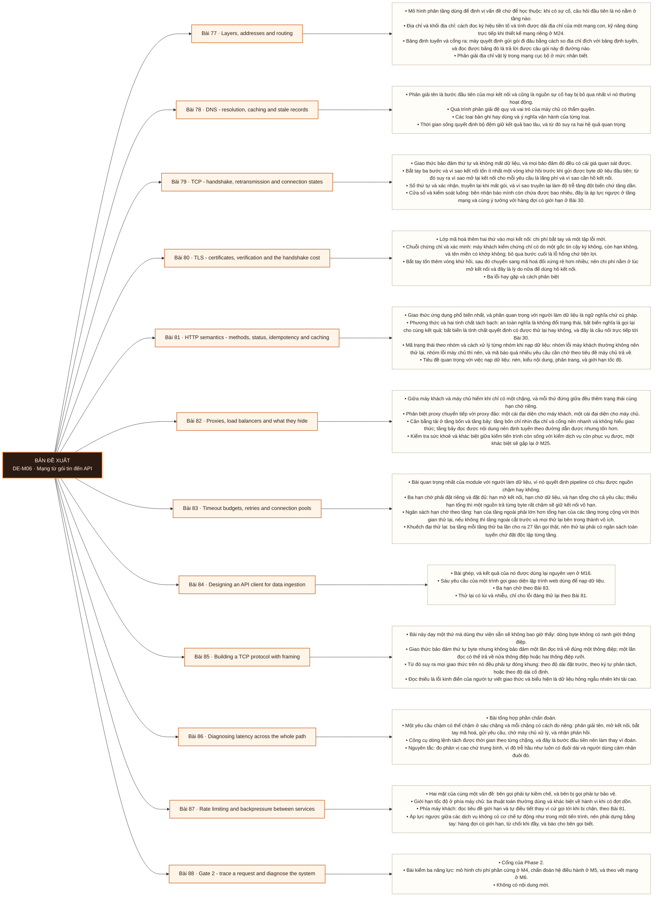

# Mô-đun 6: Mạng từ gói tin đến API

Module này phục vụ trực tiếp M16 khi nạp dữ liệu từ giao diện lập trình web, và M21 cùng M26 khi chẩn đoán hệ phân tán. Trọng tâm không phải lý thuyết mạng mà là đọc được bằng chứng: gói tin, trạng thái socket, và nhật ký. Ba con số sẽ dùng lại suốt phần sau: hạn chờ kết nối, hạn chờ đọc, và hạn chờ tổng. Không đặt đủ ba là để hệ có thể treo vô hạn.

## Điều kiện đầu vào

| Mã | Người học có thể | Bằng chứng được chấp nhận |
|---|---|---|
| EN-06-01 | M05 | Bằng chứng hoàn thành điều kiện được nêu trong cột trước |

Nếu chưa có bằng chứng đầu vào, người học phải hoàn thành lại bài hoặc mô-đun được dẫn chiếu trước khi thực hiện phép đánh giá của mô-đun này.

## Đầu ra mô-đun

Theo được một yêu cầu qua phân giải tên, bắt tay, mã hoá, giao thức ứng dụng, proxy và cân bằng tải, rồi chẩn đoán độ trễ cùng hết giờ bằng gói tin và nhật ký

## Tiêu chí hoàn thành

| Mã | Bằng chứng bắt buộc | Ngưỡng đạt | Lỗi loại trực tiếp |
|---|---|---|---|
| EC-06-01 | Vẽ được trình tự từ phân giải tên tới phản hồi và chỉ ra trạng thái cùng hạn chờ ở từng bước; từ một bản bắt gói phân biệt được truyền lại, đặt lại kết nối và lỗi ứng dụng | Đạt ≥ 70/100, phần A và B đều ≥ 60%. Kết luận nào không dẫn được về số đo hoặc gói tin thì phần đó bằng không. | Gọi giao diện lập trình web mà không đặt hạn chờ và không giới hạn thử lại, rồi một nguồn chậm kéo sập cả pipeline |

## Khái niệm và nguyên tắc bất biến

| Mã khái niệm | Ranh giới định nghĩa | Nguyên tắc bất biến hoặc quy tắc quyết định | Bài chính |
|---|---|---|---|
| C06-077 | Mô hình phân tầng dùng để định vị vấn đề chứ để học thuộc: khi có sự cố, câu hỏi đầu tiên là nó nằm ở tầng nào. | Địa chỉ và khối địa chỉ: cách đọc ký hiệu tiền tố và tính được dải địa chỉ của một mạng con, kỹ năng dùng trực tiếp khi thiết kế mạng riêng ở M24. | L077 |
| C06-078 | Phân giải tên là bước đầu tiên của mọi kết nối và cũng là nguồn sự cố hay bị bỏ qua nhất vì nó thường hoạt động. | Quá trình phân giải đệ quy và vai trò của máy chủ có thẩm quyền. | L078 |
| C06-079 | Giao thức bảo đảm thứ tự và không mất dữ liệu, và mọi bảo đảm đó đều có cái giá quan sát được. | Bắt tay ba bước và vì sao kết nối tốn ít nhất một vòng khứ hồi trước khi gửi được byte dữ liệu đầu tiên; từ đó suy ra vì sao mở lại kết nối cho mỗi yêu cầu là lãng phí và vì sao cần hồ kết nối. | L079 |
| C06-080 | Lớp mã hoá thêm hai thứ vào mọi kết nối: chi phí bắt tay và một tập lỗi mới. | Chuỗi chứng chỉ và xác minh: máy khách kiểm chứng chỉ có do một gốc tin cậy ký không, còn hạn không, và tên miền có khớp không; bỏ qua bước cuối là lỗ hổng chứ tiện lợi. | L080 |
| C06-081 | Giao thức ứng dụng phổ biến nhất, và phần quan trọng với người làm dữ liệu là ngữ nghĩa chứ cú pháp. | Phương thức và hai tính chất tách bạch: an toàn nghĩa là không đổi trạng thái, bất biến nghĩa là gọi lại cho cùng kết quả; bất biến là tính chất quyết định có được thử lại hay không, và đây là cầu nối trực tiếp tới Bài 30. | L081 |
| C06-082 | Giữa máy khách và máy chủ hiếm khi chỉ có một chặng, và mỗi thứ đứng giữa đều thêm trạng thái cùng hạn chờ riêng. | Phân biệt proxy chuyển tiếp với proxy đảo: một cái đại diện cho máy khách, một cái đại diện cho máy chủ. | L082 |
| C06-083 | Bài quan trọng nhất của module với người làm dữ liệu, vì nó quyết định pipeline có chịu được nguồn chậm hay không. | Ba hạn chờ phải đặt riêng và đặt đủ: hạn mở kết nối, hạn chờ dữ liệu, và hạn tổng cho cả yêu cầu; thiếu hạn tổng thì một nguồn trả từng byte rất chậm sẽ giữ kết nối vô hạn. | L083 |
| C06-084 | Bài ghép, và kết quả của nó được dùng lại nguyên vẹn ở M16. | Sáu yêu cầu của một trình gọi giao diện lập trình web dùng để nạp dữ liệu. | L084 |
| C06-085 | Bài này dạy một thứ mà dùng thư viện sẵn sẽ không bao giờ thấy: dòng byte không có ranh giới thông điệp. | Giao thức bảo đảm thứ tự byte nhưng không bảo đảm một lần đọc trả về đúng một thông điệp; một lần đọc có thể trả về nửa thông điệp hoặc hai thông điệp rưỡi. | L085 |
| C06-086 | Bài tổng hợp phần chẩn đoán. | Một yêu cầu chậm có thể chậm ở sáu chặng và mỗi chặng có cách đo riêng: phân giải tên, mở kết nối, bắt tay mã hoá, gửi yêu cầu, chờ máy chủ xử lý, và nhận phản hồi. | L086 |
| C06-087 | Hai mặt của cùng một vấn đề: bên gọi phải tự kiềm chế, và bên bị gọi phải tự bảo vệ. | Giới hạn tốc độ ở phía máy chủ: ba thuật toán thường dùng và khác biệt về hành vi khi có đợt dồn. | L087 |
| C06-088 | Cổng của Phase 2. | Bài kiểm ba năng lực: mô hình chi phí phần cứng ở M4, chẩn đoán hệ điều hành ở M5, và theo vết mạng ở M6. | L088 |

## Các bài trong mô-đun

| Bài | Dạng | Đầu ra | Bằng chứng | Điều kiện tiên quyết |
|---|---|---|---|---|
| L077 · Layers, addresses and routing | LT | Tính được dải địa chỉ của một mạng con và dự đoán đường đi của một gói trước khi kiểm chứng bằng lệnh. | Tính đúng ≥ 4/5 mạng con, và dự đoán đường đi khớp kết quả lệnh tra ở cả ba trường hợp. | M06: M05 |
| L078 · DNS - resolution, caching and stale records | TH | Chẩn đoán một sự cố do bản ghi cũ trong bộ đệm và phân biệt nó với lỗi kết nối thật. | Phân biệt đúng hai tình huống, chỉ ra đúng tầng đệm giữ bản ghi cũ, và có số đo thời gian hiệu lực ở từng tầng. | L077 |
| L079 · TCP - handshake, retransmission and connection states | TH | Từ một bản bắt gói, phân biệt được truyền lại, đặt lại kết nối và lỗi ở tầng ứng dụng. | Phân loại đúng ≥ 2/3 bản bắt gói kèm gói làm bằng chứng, và số socket chờ đóng giảm rõ rệt khi dùng hồ kết nối. | L078 |
| L080 · TLS - certificates, verification and the handshake cost | TH | Chẩn đoán ba loại lỗi chứng chỉ bằng công cụ dòng lệnh và giải thích vì sao trình duyệt chạy được mà thư viện thì không. | Phân loại đúng cả ba lỗi chứng chỉ, giải thích đúng trường hợp thiếu chứng chỉ trung gian, và có số đo chi phí bắt tay. | L079 |
| L081 · HTTP semantics - methods, status, idempotency and caching | LT | Quyết định một yêu cầu thất bại có được thử lại hay không dựa trên phương thức và mã trạng thái. | Quyết định đúng ≥ 8/10 tổ hợp kèm giải thích bằng tính bất biến, và đọc đúng tiêu đề chờ từ giao diện thật. | L080 |
| L082 · Proxies, load balancers and what they hide | LT | Chỉ ra trong một kiến trúc có lớp trung gian chỗ nào có thể cắt kết nối trước ứng dụng, và nêu cách xác minh. | Chỉ đúng ≥ 2/3 chặng có hạn chờ riêng, và chứng minh được kiểm tra sức khoẻ sai loại không phát hiện dịch vụ đã hỏng. | L081 |
| L083 · Timeout budgets, retries and connection pools | TH | Đặt ngân sách hạn chờ nhất quán cho một tuyến ba tầng và chứng minh không có khuếch đại thử lại. | Tổng lời gọi thật nằm trong ngân sách đã đặt, hạn tổng cắt đúng với nguồn trả chậm, và mô tả đúng triệu chứng hồ cạn. | L082 |
| L084 · Designing an API client for data ingestion | TH | Viết trình gọi đạt sáu yêu cầu và chứng minh nó nạp đủ, không trùng, dưới điều kiện nguồn lỗi và giới hạn tốc độ. | Đối soát khớp tuyệt đối dưới cả ba điều kiện lỗi, và sau khi giết tiến trình thì lần chạy sau tiếp tục đúng chỗ. | L083 |
| L085 · Building a TCP protocol with framing | TH | Cài một giao thức có đóng khung xử lý đúng ba tình huống hỏng, và tái hiện được lỗi do đọc thiếu. | Ba tình huống hỏng đều được xử lý đúng, và tái hiện được dữ liệu hỏng ở bản đọc thiếu. | L084 |
| L086 · Diagnosing latency across the whole path | TH | Phân rã độ trễ của một yêu cầu thành sáu chặng và chỉ ra chặng chiếm phần lớn thời gian. | Chỉ đúng chặng nút thắt ở ≥ 2/3 tình huống kèm số đo, và tách được phần mạng khỏi phần xử lý bằng đối chiếu hai phía. | L085 |
| L087 · Rate limiting and backpressure between services | TH | Dựng giới hạn tốc độ và bộ ngắt mạch cho một tuyến, và chứng minh hệ suy giảm có kiểm soát khi quá tải. | Phần ưu tiên cao vẫn được phục vụ ở mức chấp nhận được khi quá tải, và bộ ngắt mạch ngừng gọi khi máy chủ hỏng hoàn toàn. | L086 |
| L088 · Gate 2 - trace a request and diagnose the system | KT | Chẩn đoán đúng ba sự cố thuộc ba tầng khác nhau, mỗi kết luận dẫn được về số đo hoặc gói tin làm bằng chứng. | Đạt ≥ 70/100, phần A và B đều ≥ 60%. Kết luận nào không dẫn được về số đo hoặc gói tin thì phần đó bằng không. | L087 |

## Nội dung từng bài

> **Sơ đồ đề xuất — DE-M06 v0.1.0.** Mỗi nhánh đi từ một bài học đến các nội dung nguyên tử bắt buộc. Thứ tự dạy lấy từ bảng `Các bài trong mô-đun`.

### Bài 77: Layers, addresses and routing

Mô hình phân tầng dùng để định vị vấn đề chứ để học thuộc: khi có sự cố, câu hỏi đầu tiên là nó nằm ở tầng nào. Địa chỉ và khối địa chỉ: cách đọc ký hiệu tiền tố và tính được dải địa chỉ của một mạng con, kỹ năng dùng trực tiếp khi thiết kế mạng riêng ở M24. Bảng định tuyến và cổng ra: máy quyết định gửi gói đi đâu bằng cách so địa chỉ đích với bảng định tuyến, và đọc được bảng đó là trả lời được câu gói này đi đường nào. Phân giải địa chỉ vật lý trong mạng cục bộ ở mức nhận biết. Đơn vị truyền tối đa và phân mảnh: gói vượt kích thước tối đa bị chia hoặc bị loại, và triệu chứng của nó rất dễ nhầm với lỗi ứng dụng vì kết nối thành công nhưng truyền dữ liệu lớn thì treo. Chuyển đổi địa chỉ và tường lửa: hai thứ đứng giữa và làm thay đổi những gì bên kia nhìn thấy.

Người học phải tính được dải địa chỉ của một mạng con và dự đoán đường đi của một gói trước khi kiểm chứng bằng lệnh. Bằng chứng thực hành: Cho năm khối địa chỉ, tính dải địa chỉ dùng được và địa chỉ quảng bá cho từng cái. Đọc bảng định tuyến của máy mình. Với ba địa chỉ đích khác nhau, viết dự đoán gói đi qua cổng nào trước khi chạy lệnh tra đường, rồi đối chiếu. Bài hoàn tất khi tính đúng ≥ 4/5 mạng con, và dự đoán đường đi khớp kết quả lệnh tra ở cả ba trường hợp.

Cách đánh giá: Tầng *áp dụng*. Bài mở module, kỹ năng tính toán cụ thể chuẩn bị cho M24. Kiểm bằng bài tính cộng dự đoán; đạt khi tính đúng ít nhất bốn trong năm mạng con và dự đoán đúng đường đi ở cả ba trường hợp.

### Bài 78: DNS - resolution, caching and stale records

Phân giải tên là bước đầu tiên của mọi kết nối và cũng là nguồn sự cố hay bị bỏ qua nhất vì nó thường hoạt động. Quá trình phân giải đệ quy và vai trò của máy chủ có thẩm quyền. Các loại bản ghi hay dùng và ý nghĩa vận hành của từng loại. Thời gian sống quyết định bộ đệm giữ kết quả bao lâu, và từ đó suy ra hai hệ quả quan trọng: đổi bản ghi không có hiệu lực ngay với mọi nơi, nên kế hoạch chuyển đổi hạ tầng phải hạ thời gian sống trước nhiều giờ; và một bản ghi cũ nằm trong bộ đệm có thể trỏ tới máy đã ngừng hoạt động. Ba tầng đệm hay quên: đệm của thư viện trong tiến trình, đệm của hệ điều hành, và đệm của máy chủ phân giải. Triệu chứng của bản ghi cũ và cách phân biệt với lỗi mạng: một số máy gọi được và một số không, đó là dấu hiệu đặc trưng.

Người học phải chẩn đoán một sự cố do bản ghi cũ trong bộ đệm và phân biệt nó với lỗi kết nối thật. Bằng chứng thực hành: Dựng một tên miền thử trỏ tới một máy, gọi thành công, rồi đổi sang máy khác. Quan sát thời gian bản ghi cũ còn hiệu lực ở từng tầng đệm. Tạo tình huống một số tiến trình gọi được và một số không, rồi chẩn đoán. So thời gian sống đặt trước và sau khi hạ xuống. Bài hoàn tất khi phân biệt đúng hai tình huống, chỉ ra đúng tầng đệm giữ bản ghi cũ, và có số đo thời gian hiệu lực ở từng tầng.

Cách đánh giá: Tầng *phân tích*. Objective là nhận ra một loại sự cố có triệu chứng gây hiểu nhầm. Kiểm bằng hai tình huống trong đó một là bản ghi cũ; đạt khi phân biệt đúng và chỉ ra tầng đệm nào đang giữ bản ghi.

### Bài 79: TCP - handshake, retransmission and connection states

Giao thức bảo đảm thứ tự và không mất dữ liệu, và mọi bảo đảm đó đều có cái giá quan sát được. Bắt tay ba bước và vì sao kết nối tốn ít nhất một vòng khứ hồi trước khi gửi được byte dữ liệu đầu tiên; từ đó suy ra vì sao mở lại kết nối cho mỗi yêu cầu là lãng phí và vì sao cần hồ kết nối. Số thứ tự và xác nhận, truyền lại khi mất gói, và vì sao truyền lại làm độ trễ tăng đột biến chứ tăng dần. Cửa sổ và kiểm soát luồng: bên nhận báo mình còn chứa được bao nhiêu, đây là áp lực ngược ở tầng mạng và cùng ý tưởng với hàng đợi có giới hạn ở Bài 30. Đóng kết nối và trạng thái chờ đóng: vì sao nó tồn tại và vì sao tích tụ nhiều gây cạn cổng tạm. Đặt lại kết nối khác hết giờ: một cái là bên kia chủ động từ chối, một cái là im lặng.

Người học phải từ một bản bắt gói, phân biệt được truyền lại, đặt lại kết nối và lỗi ở tầng ứng dụng. Bằng chứng thực hành: Bắt gói cho ba tình huống: mạng mất gói mô phỏng, dịch vụ từ chối kết nối, và dịch vụ trả về lỗi ứng dụng. Với mỗi bản, chỉ ra gói nào là bằng chứng và phân loại. Đếm số socket ở trạng thái chờ đóng sau khi chạy 10.000 kết nối ngắn, rồi chạy lại với hồ kết nối và đếm lại. Bài hoàn tất khi phân loại đúng ≥ 2/3 bản bắt gói kèm gói làm bằng chứng, và số socket chờ đóng giảm rõ rệt khi dùng hồ kết nối.

Cách đánh giá: Tầng *phân tích*. Objective là đọc bằng chứng thô, kỹ năng mà không đọc được thì mọi chẩn đoán mạng đều là phỏng đoán. Kiểm bằng ba bản bắt gói; đạt khi phân loại đúng ít nhất hai và chỉ ra được gói cụ thể làm bằng chứng.

### Bài 80: TLS - certificates, verification and the handshake cost

Lớp mã hoá thêm hai thứ vào mọi kết nối: chi phí bắt tay và một tập lỗi mới. Chuỗi chứng chỉ và xác minh: máy khách kiểm chứng chỉ có do một gốc tin cậy ký không, còn hạn không, và tên miền có khớp không; bỏ qua bước cuối là lỗ hổng chứ tiện lợi. Bắt tay tốn thêm vòng khứ hồi, sau đó chuyển sang mã hoá đối xứng rẻ hơn nhiều; nên chi phí nằm ở lúc mở kết nối và đây là lý do nữa để dùng hồ kết nối. Ba lỗi hay gặp và cách phân biệt: chứng chỉ hết hạn, tên miền không khớp, và thiếu chứng chỉ trung gian; lỗi thứ ba đặc biệt khó vì trình duyệt thường tự vá được còn thư viện thì không, nên chạy được trên trình duyệt mà hỏng trong mã. Xác thực hai chiều ở mức nhận biết. Ba cách tắt xác minh và vì sao cả ba đều không được xuất hiện trong mã sản xuất.

Người học phải chẩn đoán ba loại lỗi chứng chỉ bằng công cụ dòng lệnh và giải thích vì sao trình duyệt chạy được mà thư viện thì không. Bằng chứng thực hành: Dựng ba tình huống lỗi chứng chỉ. Với mỗi cái, dùng công cụ dòng lệnh xem chuỗi chứng chỉ và xác định nguyên nhân. Với trường hợp thiếu chứng chỉ trung gian, chứng minh trình duyệt gọi được còn thư viện thì lỗi. Đo chi phí bắt tay bằng cách so thời gian yêu cầu đầu với yêu cầu sau trên cùng kết nối. Bài hoàn tất khi phân loại đúng cả ba lỗi chứng chỉ, giải thích đúng trường hợp thiếu chứng chỉ trung gian, và có số đo chi phí bắt tay.

Cách đánh giá: Tầng *phân tích*. Objective là phân biệt ba lỗi có cùng thông báo mơ hồ. Kiểm bằng ba tình huống; đạt khi phân loại đúng cả ba và giải thích đúng trường hợp thiếu chứng chỉ trung gian.

### Bài 81: HTTP semantics - methods, status, idempotency and caching

Giao thức ứng dụng phổ biến nhất, và phần quan trọng với người làm dữ liệu là ngữ nghĩa chứ cú pháp. Phương thức và hai tính chất tách bạch: an toàn nghĩa là không đổi trạng thái, bất biến nghĩa là gọi lại cho cùng kết quả; bất biến là tính chất quyết định có được thử lại hay không, và đây là cầu nối trực tiếp tới Bài 30. Mã trạng thái theo nhóm và cách xử lý từng nhóm khi nạp dữ liệu: nhóm lỗi máy khách thường không nên thử lại, nhóm lỗi máy chủ thì nên, và mã báo quá nhiều yêu cầu cần chờ theo tiêu đề máy chủ trả về. Tiêu đề quan trọng với việc nạp dữ liệu: nén, kiểu nội dung, phân trang, và giới hạn tốc độ. Bộ đệm và các tiêu đề điều khiển. Giữ kết nối sống và ghép nhiều yêu cầu trên một kết nối, nối lại chi phí bắt tay ở Bài 79 và 80.

Người học phải quyết định một yêu cầu thất bại có được thử lại hay không dựa trên phương thức và mã trạng thái. Bằng chứng thực hành: Cho mười tổ hợp phương thức và mã trạng thái. Với mỗi tổ hợp, quyết định có thử lại không và giải thích bằng tính bất biến cùng ngữ nghĩa mã trạng thái. Gọi một giao diện thật có giới hạn tốc độ và đọc tiêu đề cho biết phải chờ bao lâu. Bài hoàn tất khi quyết định đúng ≥ 8/10 tổ hợp kèm giải thích bằng tính bất biến, và đọc đúng tiêu đề chờ từ giao diện thật.

Cách đánh giá: Tầng *hiểu*. Bài lý thuyết chuẩn bị cho Bài 83 và cho M16; chưa đòi cài đặt. Kiểm bằng bảng quyết định trên mười tổ hợp; đạt khi đúng ít nhất tám và giải thích được bằng tính bất biến chứ bằng thói quen.

### Bài 82: Proxies, load balancers and what they hide

Giữa máy khách và máy chủ hiếm khi chỉ có một chặng, và mỗi thứ đứng giữa đều thêm trạng thái cùng hạn chờ riêng. Phân biệt proxy chuyển tiếp với proxy đảo: một cái đại diện cho máy khách, một cái đại diện cho máy chủ. Cân bằng tải ở tầng bốn và tầng bảy: tầng bốn chỉ nhìn địa chỉ và cổng nên nhanh và không hiểu giao thức; tầng bảy đọc được nội dung nên định tuyến theo đường dẫn được nhưng tốn hơn. Kiểm tra sức khoẻ và khác biệt giữa kiểm tiến trình còn sống với kiểm dịch vụ còn phục vụ được, một khác biệt sẽ gặp lại ở M25. Phiên dính và vì sao nó làm việc mở rộng khó. Ba thứ lớp trung gian che mất và gây chẩn đoán sai: địa chỉ thật của máy khách, lỗi thật của máy chủ gốc, và hạn chờ của chính nó thường ngắn hơn hạn chờ của ứng dụng nên cắt kết nối trước. Mạng phân phối nội dung ở mức nhận biết.

Người học phải chỉ ra trong một kiến trúc có lớp trung gian chỗ nào có thể cắt kết nối trước ứng dụng, và nêu cách xác minh. Bằng chứng thực hành: Dựng một proxy đảo đứng trước hai bản sao dịch vụ. Đặt hạn chờ của proxy ngắn hơn thời gian xử lý của dịch vụ và quan sát máy khách nhận lỗi gì. Tắt một bản sao và quan sát kiểm tra sức khoẻ loại nó ra. Thử kiểm tra sức khoẻ chỉ kiểm tiến trình còn sống trong khi dịch vụ đã mất kết nối cơ sở dữ liệu. Bài hoàn tất khi chỉ đúng ≥ 2/3 chặng có hạn chờ riêng, và chứng minh được kiểm tra sức khoẻ sai loại không phát hiện dịch vụ đã hỏng.

Cách đánh giá: Tầng *hiểu*. Objective là nhận ra nguồn gây nhầm lẫn khi chẩn đoán qua nhiều chặng. Kiểm bằng ba kiến trúc; đạt khi chỉ đúng ít nhất hai chặng có hạn chờ riêng và nêu đúng cách xác minh.

### Bài 83: Timeout budgets, retries and connection pools

Bài quan trọng nhất của module với người làm dữ liệu, vì nó quyết định pipeline có chịu được nguồn chậm hay không. Ba hạn chờ phải đặt riêng và đặt đủ: hạn mở kết nối, hạn chờ dữ liệu, và hạn tổng cho cả yêu cầu; thiếu hạn tổng thì một nguồn trả từng byte rất chậm sẽ giữ kết nối vô hạn. Ngân sách hạn chờ theo tầng: hạn của tầng ngoài phải lớn hơn tổng hạn của các tầng trong cộng với thời gian thử lại, nếu không thì tầng ngoài cắt trước và mọi thử lại bên trong thành vô ích. Khuếch đại thử lại: ba tầng mỗi tầng thử ba lần cho ra 27 lần gọi thật, nên thử lại phải có ngân sách toàn tuyến chứ đặt độc lập từng tầng. Lùi theo hàm mũ có nhiễu ngẫu nhiên, theo Bài 30. Hồ kết nối: kích thước hồ là một giới hạn đồng thời, và hồ cạn biểu hiện giống mạng chậm nên hay bị chẩn đoán nhầm.

Người học phải đặt ngân sách hạn chờ nhất quán cho một tuyến ba tầng và chứng minh không có khuếch đại thử lại. Bằng chứng thực hành: Dựng tuyến ba tầng gọi nhau. Đặt hạn chờ độc lập mỗi tầng thử ba lần, đếm số lời gọi thật tới tầng cuối khi nó lỗi. Đặt lại theo ngân sách toàn tuyến và đếm lại. Mô phỏng nguồn trả byte rất chậm và chứng minh hạn tổng cắt đúng lúc. Làm cạn hồ kết nối và ghi triệu chứng. Bài hoàn tất khi tổng lời gọi thật nằm trong ngân sách đã đặt, hạn tổng cắt đúng với nguồn trả chậm, và mô tả đúng triệu chứng hồ cạn.

Cách đánh giá: Tầng *áp dụng*. Objective là một cấu hình có ràng buộc số học kiểm được bằng đếm lời gọi thật. Kiểm bằng thí nghiệm nguồn chậm; đạt khi tổng số lời gọi thật nằm trong ngân sách và không yêu cầu nào treo quá hạn tổng.

### Bài 84: Designing an API client for data ingestion

Bài ghép, và kết quả của nó được dùng lại nguyên vẹn ở M16. Sáu yêu cầu của một trình gọi giao diện lập trình web dùng để nạp dữ liệu. Ba hạn chờ theo Bài 83. Thử lại có lùi và nhiễu, chỉ cho lỗi đáng thử lại theo Bài 81. Tôn trọng giới hạn tốc độ bằng cách đọc tiêu đề máy chủ trả về chứ đoán. Phân trang: ba kiểu phân trang và vì sao phân trang theo số trang không an toàn khi dữ liệu đang thay đổi, một chi tiết sẽ quay lại ở M16. Khoá bất biến khi ghi để thử lại không sinh trùng. Và ghi nhật ký có mã theo dõi theo Bài 20 để truy ngược được. Kèm theo là một phần thường bị bỏ: lưu trạng thái đã nạp tới đâu để lần chạy sau tiếp tục được thay vì bắt đầu lại.

Người học phải viết trình gọi đạt sáu yêu cầu và chứng minh nó nạp đủ, không trùng, dưới điều kiện nguồn lỗi và giới hạn tốc độ. Bằng chứng thực hành: Dựng một máy chủ giả có phân trang, giới hạn tốc độ, lỗi ngẫu nhiên 10%, và chèn thêm bản ghi giữa lúc đang phân trang. Viết trình gọi đạt sáu yêu cầu. Nạp toàn bộ và đối soát số bản ghi với nguồn. Giết tiến trình giữa chừng và chứng minh lần chạy sau tiếp tục đúng chỗ. Bài hoàn tất khi đối soát khớp tuyệt đối dưới cả ba điều kiện lỗi, và sau khi giết tiến trình thì lần chạy sau tiếp tục đúng chỗ.

Cách đánh giá: Tầng *sáng tạo*. Objective đòi ghép sáu cơ chế thành một thành phần chịu lỗi. Kiểm bằng thí nghiệm nguồn xấu; đạt khi đối soát khớp tuyệt đối dưới cả ba điều kiện lỗi.

### Bài 85: Building a TCP protocol with framing

Bài này dạy một thứ mà dùng thư viện sẵn sẽ không bao giờ thấy: dòng byte không có ranh giới thông điệp. Giao thức bảo đảm thứ tự byte nhưng không bảo đảm một lần đọc trả về đúng một thông điệp; một lần đọc có thể trả về nửa thông điệp hoặc hai thông điệp rưỡi. Từ đó suy ra mọi giao thức trên nó đều phải tự đóng khung: theo độ dài đặt trước, theo ký tự phân tách, hoặc theo độ dài cố định. Đọc thiếu là lỗi kinh điển của người tự viết giao thức và biểu hiện là dữ liệu hỏng ngẫu nhiên khi tải cao. Ba tình huống hỏng phải xử lý: máy khách ngắt giữa chừng, máy khách gửi rất chậm, và máy khách gửi thông điệp lớn bất thường. Vì sao bài này quan trọng dù ít khi phải tự viết giao thức: nó giải thích vì sao thư viện có tham số kích thước bộ đệm và vì sao dữ liệu hỏng ở biên thông điệp.

Người học phải cài một giao thức có đóng khung xử lý đúng ba tình huống hỏng, và tái hiện được lỗi do đọc thiếu. Bằng chứng thực hành: Viết máy chủ lặp lại có đóng khung theo độ dài. Cố ý cài bản đọc thiếu và tái hiện dữ liệu hỏng khi tải cao. Sửa. Tiêm ba tình huống: ngắt giữa chừng, gửi rất chậm, và thông điệp vượt giới hạn. Chứng minh máy chủ xử lý đúng cả ba mà không treo và không cạn bộ nhớ. Bài hoàn tất khi ba tình huống hỏng đều được xử lý đúng, và tái hiện được dữ liệu hỏng ở bản đọc thiếu.

Cách đánh giá: Tầng *áp dụng*. Objective là một cài đặt có ba ca biên kiểm được. Kiểm bằng ba phép thử hỏng; đạt khi cả ba được xử lý đúng và tái hiện được lỗi đọc thiếu ở bản chưa sửa.

### Bài 86: Diagnosing latency across the whole path

Bài tổng hợp phần chẩn đoán. Một yêu cầu chậm có thể chậm ở sáu chặng và mỗi chặng có cách đo riêng: phân giải tên, mở kết nối, bắt tay mã hoá, gửi yêu cầu, chờ máy chủ xử lý, và nhận phản hồi. Công cụ dòng lệnh tách được thời gian theo từng chặng, và đây là bước đầu tiên nên làm thay vì đoán. Nguyên tắc: đo phân vị cao chứ trung bình, vì độ trễ hầu như luôn có đuôi dài và người dùng cảm nhận đuôi đó. Ba nguyên nhân chậm có triệu chứng giống nhau và cách phân biệt: mạng mất gói gây truyền lại, máy chủ xử lý chậm, và hồ kết nối cạn ở phía máy khách. Đo từ nhiều phía: chỉ đo ở máy khách thì không biết phần nào là mạng và phần nào là máy chủ, nên phải đối chiếu với nhật ký phía máy chủ qua mã theo dõi ở Bài 20.

Người học phải phân rã độ trễ của một yêu cầu thành sáu chặng và chỉ ra chặng chiếm phần lớn thời gian. Bằng chứng thực hành: Giảng viên tạo ba tình huống chậm ở ba chặng khác nhau. Với mỗi cái, đo tách theo chặng, báo phân vị 95, và chỉ ra chặng nút thắt. Đối chiếu số đo phía máy khách với nhật ký phía máy chủ qua mã theo dõi để tách phần mạng khỏi phần xử lý. Bài hoàn tất khi chỉ đúng chặng nút thắt ở ≥ 2/3 tình huống kèm số đo, và tách được phần mạng khỏi phần xử lý bằng đối chiếu hai phía.

Cách đánh giá: Tầng *phân tích*. Objective là phân rã một số đo tổng thành thành phần, kỹ năng dùng lại ở M26. Kiểm bằng ba tình huống chậm; đạt khi chỉ đúng chặng nút thắt ở ít nhất hai và dẫn được số đo của chặng đó.

### Bài 87: Rate limiting and backpressure between services

Hai mặt của cùng một vấn đề: bên gọi phải tự kiềm chế, và bên bị gọi phải tự bảo vệ. Giới hạn tốc độ ở phía máy chủ: ba thuật toán thường dùng và khác biệt về hành vi khi có đợt dồn. Phía máy khách: đọc tiêu đề giới hạn và tự điều tiết thay vì cứ gọi tới khi bị chặn, theo Bài 81. Áp lực ngược giữa các dịch vụ không có cơ chế tự động như trong một tiến trình, nên phải dựng bằng tay: hàng đợi có giới hạn, từ chối khi đầy, và báo cho bên gọi biết. Giảm tải chủ động: khi quá tải thì từ chối một phần để phần còn lại được phục vụ đúng, và tiêu chí chọn từ chối cái gì phải theo mức ưu tiên nghiệp vụ chứ ngẫu nhiên. Bộ ngắt mạch: ngừng gọi khi bên kia đang hỏng, để không lãng phí tài nguyên vào những lời gọi chắc chắn thất bại và để bên kia có cơ hội hồi phục. Ba cơ chế này sẽ gặp lại ở M26.

Người học phải dựng giới hạn tốc độ và bộ ngắt mạch cho một tuyến, và chứng minh hệ suy giảm có kiểm soát khi quá tải. Bằng chứng thực hành: Dựng giới hạn tốc độ ở máy chủ và bộ ngắt mạch ở máy khách. Đẩy tải gấp năm lần công suất và đo tỉ lệ phục vụ của phần ưu tiên cao, có và không có giảm tải. Làm máy chủ hỏng hoàn toàn và chứng minh bộ ngắt mạch ngừng gọi thay vì tiếp tục thử. Bài hoàn tất khi phần ưu tiên cao vẫn được phục vụ ở mức chấp nhận được khi quá tải, và bộ ngắt mạch ngừng gọi khi máy chủ hỏng hoàn toàn.

Cách đánh giá: Tầng *áp dụng*. Objective là hai cơ chế phòng vệ kiểm được bằng thí nghiệm quá tải. Kiểm bằng phép thử tải gấp năm lần công suất; đạt khi phần ưu tiên cao vẫn được phục vụ và không thành phần nào cạn tài nguyên.

### Bài 88: Gate 2 - trace a request and diagnose the system

Cổng của Phase 2. Bài kiểm ba năng lực: mô hình chi phí phần cứng ở M4, chẩn đoán hệ điều hành ở M5, và theo vết mạng ở M6. Không có nội dung mới.

Người học phải chẩn đoán đúng ba sự cố thuộc ba tầng khác nhau, mỗi kết luận dẫn được về số đo hoặc gói tin làm bằng chứng. Bằng chứng thực hành: Buổi 120 phút: 75 phút làm bài độc lập, 45 phút chữa bài. Làm trên một hệ có ba sự cố cài sẵn ở ba tầng. Bài chấm sáu phần: A (20đ) phân loại đúng loại tải bằng chỉ số hệ thống · B (20đ) chẩn đoán sự cố mạng bằng bản bắt gói, chỉ đúng gói làm bằng chứng · C (20đ) giải thích một hiện tượng hiệu năng bằng mô hình chi phí, dẫn số đo của chính mình · D (15đ) sửa cả ba và xác nhận đã hồi phục · E (15đ) dòng thời gian chẩn đoán có ghi nhánh sai đã thử · F (10đ) báo cáo hiệu năng sáu phần cho một phép đo trong buổi. Bài hoàn tất khi đạt ≥ 70/100, phần A và B đều ≥ 60%. Kết luận nào không dẫn được về số đo hoặc gói tin thì phần đó bằng không.

Cách đánh giá: Tầng *phân tích*. Cổng đo năng lực chẩn đoán dưới áp lực thời gian, nên hình thức là buổi thực hành tính giờ chứ bài viết.

## Lý do sắp xếp

Mô-đun bắt đầu từ `M06: M05` và đi theo các quan hệ tiên quyết đã ghi trong bảng. Mỗi bài chỉ sử dụng khái niệm hoặc thao tác đã được giới thiệu trước đó; bài cuối L088 tích hợp đầu ra của toàn mô-đun.

## Ma trận đánh giá

| Mã đầu ra | Mức độ tư duy | Cách đánh giá | Ngưỡng đạt | Hình thức kiểm tra lại |
|---|---|---|---|---|
| L077 | Áp dụng | Tầng *áp dụng*. Bài mở module, kỹ năng tính toán cụ thể chuẩn bị cho M24. Kiểm bằng bài tính cộng dự đoán; đạt khi tính đúng ít nhất bốn trong năm mạng con và dự đoán đúng đường đi ở cả ba trường hợp. | Tính đúng ≥ 4/5 mạng con, và dự đoán đường đi khớp kết quả lệnh tra ở cả ba trường hợp. | Tình huống mới, giữ nguyên đầu ra và ngưỡng |
| L078 | Phân tích | Tầng *phân tích*. Objective là nhận ra một loại sự cố có triệu chứng gây hiểu nhầm. Kiểm bằng hai tình huống trong đó một là bản ghi cũ; đạt khi phân biệt đúng và chỉ ra tầng đệm nào đang giữ bản ghi. | Phân biệt đúng hai tình huống, chỉ ra đúng tầng đệm giữ bản ghi cũ, và có số đo thời gian hiệu lực ở từng tầng. | Tình huống mới, giữ nguyên đầu ra và ngưỡng |
| L079 | Phân tích | Tầng *phân tích*. Objective là đọc bằng chứng thô, kỹ năng mà không đọc được thì mọi chẩn đoán mạng đều là phỏng đoán. Kiểm bằng ba bản bắt gói; đạt khi phân loại đúng ít nhất hai và chỉ ra được gói cụ thể làm bằng chứng. | Phân loại đúng ≥ 2/3 bản bắt gói kèm gói làm bằng chứng, và số socket chờ đóng giảm rõ rệt khi dùng hồ kết nối. | Tình huống mới, giữ nguyên đầu ra và ngưỡng |
| L080 | Phân tích | Tầng *phân tích*. Objective là phân biệt ba lỗi có cùng thông báo mơ hồ. Kiểm bằng ba tình huống; đạt khi phân loại đúng cả ba và giải thích đúng trường hợp thiếu chứng chỉ trung gian. | Phân loại đúng cả ba lỗi chứng chỉ, giải thích đúng trường hợp thiếu chứng chỉ trung gian, và có số đo chi phí bắt tay. | Tình huống mới, giữ nguyên đầu ra và ngưỡng |
| L081 | Hiểu | Tầng *hiểu*. Bài lý thuyết chuẩn bị cho Bài 83 và cho M16; chưa đòi cài đặt. Kiểm bằng bảng quyết định trên mười tổ hợp; đạt khi đúng ít nhất tám và giải thích được bằng tính bất biến chứ bằng thói quen. | Quyết định đúng ≥ 8/10 tổ hợp kèm giải thích bằng tính bất biến, và đọc đúng tiêu đề chờ từ giao diện thật. | Tình huống mới, giữ nguyên đầu ra và ngưỡng |
| L082 | Hiểu | Tầng *hiểu*. Objective là nhận ra nguồn gây nhầm lẫn khi chẩn đoán qua nhiều chặng. Kiểm bằng ba kiến trúc; đạt khi chỉ đúng ít nhất hai chặng có hạn chờ riêng và nêu đúng cách xác minh. | Chỉ đúng ≥ 2/3 chặng có hạn chờ riêng, và chứng minh được kiểm tra sức khoẻ sai loại không phát hiện dịch vụ đã hỏng. | Tình huống mới, giữ nguyên đầu ra và ngưỡng |
| L083 | Áp dụng | Tầng *áp dụng*. Objective là một cấu hình có ràng buộc số học kiểm được bằng đếm lời gọi thật. Kiểm bằng thí nghiệm nguồn chậm; đạt khi tổng số lời gọi thật nằm trong ngân sách và không yêu cầu nào treo quá hạn tổng. | Tổng lời gọi thật nằm trong ngân sách đã đặt, hạn tổng cắt đúng với nguồn trả chậm, và mô tả đúng triệu chứng hồ cạn. | Tình huống mới, giữ nguyên đầu ra và ngưỡng |
| L084 | Sáng tạo | Tầng *sáng tạo*. Objective đòi ghép sáu cơ chế thành một thành phần chịu lỗi. Kiểm bằng thí nghiệm nguồn xấu; đạt khi đối soát khớp tuyệt đối dưới cả ba điều kiện lỗi. | Đối soát khớp tuyệt đối dưới cả ba điều kiện lỗi, và sau khi giết tiến trình thì lần chạy sau tiếp tục đúng chỗ. | Tình huống mới, giữ nguyên đầu ra và ngưỡng |
| L085 | Áp dụng | Tầng *áp dụng*. Objective là một cài đặt có ba ca biên kiểm được. Kiểm bằng ba phép thử hỏng; đạt khi cả ba được xử lý đúng và tái hiện được lỗi đọc thiếu ở bản chưa sửa. | Ba tình huống hỏng đều được xử lý đúng, và tái hiện được dữ liệu hỏng ở bản đọc thiếu. | Tình huống mới, giữ nguyên đầu ra và ngưỡng |
| L086 | Phân tích | Tầng *phân tích*. Objective là phân rã một số đo tổng thành thành phần, kỹ năng dùng lại ở M26. Kiểm bằng ba tình huống chậm; đạt khi chỉ đúng chặng nút thắt ở ít nhất hai và dẫn được số đo của chặng đó. | Chỉ đúng chặng nút thắt ở ≥ 2/3 tình huống kèm số đo, và tách được phần mạng khỏi phần xử lý bằng đối chiếu hai phía. | Tình huống mới, giữ nguyên đầu ra và ngưỡng |
| L087 | Áp dụng | Tầng *áp dụng*. Objective là hai cơ chế phòng vệ kiểm được bằng thí nghiệm quá tải. Kiểm bằng phép thử tải gấp năm lần công suất; đạt khi phần ưu tiên cao vẫn được phục vụ và không thành phần nào cạn tài nguyên. | Phần ưu tiên cao vẫn được phục vụ ở mức chấp nhận được khi quá tải, và bộ ngắt mạch ngừng gọi khi máy chủ hỏng hoàn toàn. | Tình huống mới, giữ nguyên đầu ra và ngưỡng |
| L088 | Phân tích | Tầng *phân tích*. Cổng đo năng lực chẩn đoán dưới áp lực thời gian, nên hình thức là buổi thực hành tính giờ chứ bài viết. | Đạt ≥ 70/100, phần A và B đều ≥ 60%. Kết luận nào không dẫn được về số đo hoặc gói tin thì phần đó bằng không. | Tình huống mới, giữ nguyên đầu ra và ngưỡng |

Không cộng điểm để bù cho lỗi loại trực tiếp. Người học phải sửa đúng lỗi, nộp lại bằng chứng và thực hiện kiểm tra lại trên một tình huống khác.

## Bài thực hành bắt buộc

| Bài thực hành hoặc dự án | Bài liên quan | Sản phẩm bắt buộc | Lỗi được cài vào tình huống |
|---|---|---|---|
| Layers, addresses and routing | L077 | Cho năm khối địa chỉ, tính dải địa chỉ dùng được và địa chỉ quảng bá cho từng cái. Đọc bảng định tuyến của máy mình. Với ba địa chỉ đích khác nhau, viết dự đoán gói đi qua cổng nào trước khi chạy lệnh tra đường, rồi đối chiếu. | Học thuộc bảy tầng mà không dùng để định vị · tính nhầm số địa chỉ dùng được · bỏ qua đơn vị truyền tối đa nên không giải thích được lỗi treo khi truyền dữ liệu lớn. |
| DNS - resolution, caching and stale records | L078 | Dựng một tên miền thử trỏ tới một máy, gọi thành công, rồi đổi sang máy khác. Quan sát thời gian bản ghi cũ còn hiệu lực ở từng tầng đệm. Tạo tình huống một số tiến trình gọi được và một số không, rồi chẩn đoán. So thời gian sống đặt trước và sau khi hạ xuống. | Bỏ qua bước phân giải tên khi chẩn đoán · đổi bản ghi rồi mong có hiệu lực ngay · quên đệm trong tiến trình · kết luận lỗi mạng khi thực ra là bản ghi cũ. |
| TCP - handshake, retransmission and connection states | L079 | Bắt gói cho ba tình huống: mạng mất gói mô phỏng, dịch vụ từ chối kết nối, và dịch vụ trả về lỗi ứng dụng. Với mỗi bản, chỉ ra gói nào là bằng chứng và phân loại. Đếm số socket ở trạng thái chờ đóng sau khi chạy 10.000 kết nối ngắn, rồi chạy lại với hồ kết nối và đếm lại. | Nhầm đặt lại kết nối với hết giờ · mở kết nối mới cho mỗi yêu cầu · bỏ qua trạng thái chờ đóng tới khi cạn cổng · kết luận từ nhật ký ứng dụng mà không bắt gói. |
| TLS - certificates, verification and the handshake cost | L080 | Dựng ba tình huống lỗi chứng chỉ. Với mỗi cái, dùng công cụ dòng lệnh xem chuỗi chứng chỉ và xác định nguyên nhân. Với trường hợp thiếu chứng chỉ trung gian, chứng minh trình duyệt gọi được còn thư viện thì lỗi. Đo chi phí bắt tay bằng cách so thời gian yêu cầu đầu với yêu cầu sau trên cùng kết nối. | Tắt xác minh chứng chỉ để hết lỗi · kết luận từ thông báo lỗi của thư viện mà không xem chuỗi chứng chỉ · quên chứng chỉ trung gian · đo chi phí bắt tay trên kết nối đã mở sẵn. |
| HTTP semantics - methods, status, idempotency and caching | L081 | Cho mười tổ hợp phương thức và mã trạng thái. Với mỗi tổ hợp, quyết định có thử lại không và giải thích bằng tính bất biến cùng ngữ nghĩa mã trạng thái. Gọi một giao diện thật có giới hạn tốc độ và đọc tiêu đề cho biết phải chờ bao lâu. | Thử lại mọi lỗi · thử lại một yêu cầu tạo tài nguyên mà không có khoá bất biến · bỏ qua tiêu đề chờ của giới hạn tốc độ · nhầm an toàn với bất biến. |
| Proxies, load balancers and what they hide | L082 | Dựng một proxy đảo đứng trước hai bản sao dịch vụ. Đặt hạn chờ của proxy ngắn hơn thời gian xử lý của dịch vụ và quan sát máy khách nhận lỗi gì. Tắt một bản sao và quan sát kiểm tra sức khoẻ loại nó ra. Thử kiểm tra sức khoẻ chỉ kiểm tiến trình còn sống trong khi dịch vụ đã mất kết nối cơ sở dữ liệu. | Nghĩ lỗi đến từ ứng dụng trong khi proxy cắt trước · dùng kiểm tra sức khoẻ chỉ kiểm tiến trình · bật phiên dính mà không cần · quên rằng lớp trung gian che địa chỉ máy khách thật. |
| Timeout budgets, retries and connection pools | L083 | Dựng tuyến ba tầng gọi nhau. Đặt hạn chờ độc lập mỗi tầng thử ba lần, đếm số lời gọi thật tới tầng cuối khi nó lỗi. Đặt lại theo ngân sách toàn tuyến và đếm lại. Mô phỏng nguồn trả byte rất chậm và chứng minh hạn tổng cắt đúng lúc. Làm cạn hồ kết nối và ghi triệu chứng. | Chỉ đặt một hạn chờ chung · để thử lại độc lập từng tầng · không có hạn tổng · chẩn đoán hồ cạn thành mạng chậm. |
| Designing an API client for data ingestion | L084 | Dựng một máy chủ giả có phân trang, giới hạn tốc độ, lỗi ngẫu nhiên 10%, và chèn thêm bản ghi giữa lúc đang phân trang. Viết trình gọi đạt sáu yêu cầu. Nạp toàn bộ và đối soát số bản ghi với nguồn. Giết tiến trình giữa chừng và chứng minh lần chạy sau tiếp tục đúng chỗ. | Phân trang theo số trang trên dữ liệu đang đổi · thử lại mà không có khoá bất biến · đoán thời gian chờ thay vì đọc tiêu đề · không lưu trạng thái nên chạy lại từ đầu. |
| Building a TCP protocol with framing | L085 | Viết máy chủ lặp lại có đóng khung theo độ dài. Cố ý cài bản đọc thiếu và tái hiện dữ liệu hỏng khi tải cao. Sửa. Tiêm ba tình huống: ngắt giữa chừng, gửi rất chậm, và thông điệp vượt giới hạn. Chứng minh máy chủ xử lý đúng cả ba mà không treo và không cạn bộ nhớ. | Giả định một lần đọc trả về đúng một thông điệp · không giới hạn kích thước thông điệp · treo vô hạn với máy khách gửi chậm · không đóng khung mà dựa vào kích thước gói. |
| Diagnosing latency across the whole path | L086 | Giảng viên tạo ba tình huống chậm ở ba chặng khác nhau. Với mỗi cái, đo tách theo chặng, báo phân vị 95, và chỉ ra chặng nút thắt. Đối chiếu số đo phía máy khách với nhật ký phía máy chủ qua mã theo dõi để tách phần mạng khỏi phần xử lý. | Báo độ trễ trung bình · chỉ đo ở một phía · kết luận mạng chậm mà chưa bắt gói · bỏ qua chặng phân giải tên. |
| Rate limiting and backpressure between services | L087 | Dựng giới hạn tốc độ ở máy chủ và bộ ngắt mạch ở máy khách. Đẩy tải gấp năm lần công suất và đo tỉ lệ phục vụ của phần ưu tiên cao, có và không có giảm tải. Làm máy chủ hỏng hoàn toàn và chứng minh bộ ngắt mạch ngừng gọi thay vì tiếp tục thử. | Không có giới hạn nên máy chủ sập · thử lại ngay khi bị từ chối · giảm tải ngẫu nhiên thay vì theo ưu tiên · bộ ngắt mạch không bao giờ đóng lại. |
| Gate 2 - trace a request and diagnose the system | L088 | Buổi 120 phút: 75 phút làm bài độc lập, 45 phút chữa bài. Làm trên một hệ có ba sự cố cài sẵn ở ba tầng. Bài chấm sáu phần: A (20đ) phân loại đúng loại tải bằng chỉ số hệ thống · B (20đ) chẩn đoán sự cố mạng bằng bản bắt gói, chỉ đúng gói làm bằng chứng · C (20đ) giải thích một hiện tượng hiệu năng bằng mô hình chi phí, dẫn số đo của chính mình · D (15đ) sửa cả ba và xác nhận đã hồi phục · E (15đ) dòng thời gian chẩn đoán có ghi nhánh sai đã thử · F (10đ) báo cáo hiệu năng sáu phần cho một phép đo trong buổi. | Khởi động lại hệ rồi mất bằng chứng · kết luận từ một chỉ số · đoán trúng mà không có bằng chứng · bỏ phần dòng thời gian vì hết giờ. |

## Ngộ nhận và lỗi loại trực tiếp

| Lỗi | Hệ quả | Nơi phát hiện | Cách khắc phục |
|---|---|---|---|
| Học thuộc bảy tầng mà không dùng để định vị · tính nhầm số địa chỉ dùng được · bỏ qua đơn vị truyền tối đa nên không giải thích được lỗi treo khi truyền dữ liệu lớn. | Không tạo được bằng chứng hợp lệ cho đầu ra L077 | L077 | Làm lại phép đánh giá trên tình huống mới và đạt tiêu chí `Done when` |
| Bỏ qua bước phân giải tên khi chẩn đoán · đổi bản ghi rồi mong có hiệu lực ngay · quên đệm trong tiến trình · kết luận lỗi mạng khi thực ra là bản ghi cũ. | Không tạo được bằng chứng hợp lệ cho đầu ra L078 | L078 | Làm lại phép đánh giá trên tình huống mới và đạt tiêu chí `Done when` |
| Nhầm đặt lại kết nối với hết giờ · mở kết nối mới cho mỗi yêu cầu · bỏ qua trạng thái chờ đóng tới khi cạn cổng · kết luận từ nhật ký ứng dụng mà không bắt gói. | Không tạo được bằng chứng hợp lệ cho đầu ra L079 | L079 | Làm lại phép đánh giá trên tình huống mới và đạt tiêu chí `Done when` |
| Tắt xác minh chứng chỉ để hết lỗi · kết luận từ thông báo lỗi của thư viện mà không xem chuỗi chứng chỉ · quên chứng chỉ trung gian · đo chi phí bắt tay trên kết nối đã mở sẵn. | Không tạo được bằng chứng hợp lệ cho đầu ra L080 | L080 | Làm lại phép đánh giá trên tình huống mới và đạt tiêu chí `Done when` |
| Thử lại mọi lỗi · thử lại một yêu cầu tạo tài nguyên mà không có khoá bất biến · bỏ qua tiêu đề chờ của giới hạn tốc độ · nhầm an toàn với bất biến. | Không tạo được bằng chứng hợp lệ cho đầu ra L081 | L081 | Làm lại phép đánh giá trên tình huống mới và đạt tiêu chí `Done when` |
| Nghĩ lỗi đến từ ứng dụng trong khi proxy cắt trước · dùng kiểm tra sức khoẻ chỉ kiểm tiến trình · bật phiên dính mà không cần · quên rằng lớp trung gian che địa chỉ máy khách thật. | Không tạo được bằng chứng hợp lệ cho đầu ra L082 | L082 | Làm lại phép đánh giá trên tình huống mới và đạt tiêu chí `Done when` |
| Chỉ đặt một hạn chờ chung · để thử lại độc lập từng tầng · không có hạn tổng · chẩn đoán hồ cạn thành mạng chậm. | Không tạo được bằng chứng hợp lệ cho đầu ra L083 | L083 | Làm lại phép đánh giá trên tình huống mới và đạt tiêu chí `Done when` |
| Phân trang theo số trang trên dữ liệu đang đổi · thử lại mà không có khoá bất biến · đoán thời gian chờ thay vì đọc tiêu đề · không lưu trạng thái nên chạy lại từ đầu. | Không tạo được bằng chứng hợp lệ cho đầu ra L084 | L084 | Làm lại phép đánh giá trên tình huống mới và đạt tiêu chí `Done when` |
| Giả định một lần đọc trả về đúng một thông điệp · không giới hạn kích thước thông điệp · treo vô hạn với máy khách gửi chậm · không đóng khung mà dựa vào kích thước gói. | Không tạo được bằng chứng hợp lệ cho đầu ra L085 | L085 | Làm lại phép đánh giá trên tình huống mới và đạt tiêu chí `Done when` |
| Báo độ trễ trung bình · chỉ đo ở một phía · kết luận mạng chậm mà chưa bắt gói · bỏ qua chặng phân giải tên. | Không tạo được bằng chứng hợp lệ cho đầu ra L086 | L086 | Làm lại phép đánh giá trên tình huống mới và đạt tiêu chí `Done when` |
| Không có giới hạn nên máy chủ sập · thử lại ngay khi bị từ chối · giảm tải ngẫu nhiên thay vì theo ưu tiên · bộ ngắt mạch không bao giờ đóng lại. | Không tạo được bằng chứng hợp lệ cho đầu ra L087 | L087 | Làm lại phép đánh giá trên tình huống mới và đạt tiêu chí `Done when` |
| Khởi động lại hệ rồi mất bằng chứng · kết luận từ một chỉ số · đoán trúng mà không có bằng chứng · bỏ phần dòng thời gian vì hết giờ. | Không tạo được bằng chứng hợp lệ cho đầu ra L088 | L088 | Làm lại phép đánh giá trên tình huống mới và đạt tiêu chí `Done when` |

## Điểm nối với mô-đun khác

| Kế thừa từ | Cung cấp cho mô-đun sau | Cam kết đầu ra |
|---|---|---|
| M05 | M04, M05, M16, M24, M25, M26 | Theo được một yêu cầu qua phân giải tên, bắt tay, mã hoá, giao thức ứng dụng, proxy và cân bằng tải, rồi chẩn đoán độ trễ cùng hết giờ bằng gói tin và nhật ký |

## Tài liệu tham khảo

| Mã | Nguồn | Vị trí | Dùng cho |
|---|---|---|---|
| R06-01 | Hợp đồng học tập gốc | `06_NETWORKING_PACKET_TO_API.md` | Phạm vi, lab, tiêu chí hoàn thành và lỗi loại trực tiếp |
| R06-02 | Manifest nguồn cấp bài | `Material/DE/Reference/.../Lesson_*/sources.yaml` | Truy vết nguồn khi manifest được điền |

## Đối chiếu năng lực

| Khung hoặc mã năng lực | Phạm vi sử dụng | Bằng chứng |
|---|---|---|
| `NTAS` mức 4 · `SYSP` mức 3 | Đầu ra và phép đánh giá của mô-đun | EC-06-01 và ma trận đánh giá theo bài |

Ánh xạ này mô tả phạm vi được thực hành; nó không tự động chứng nhận cấp độ của người học trong khung năng lực.

## Giới hạn của mô-đun

- Roadmap xác định phạm vi, bằng chứng và cách đánh giá; nội dung giảng giải đầy đủ thuộc `note.md`.
- Manifest nguồn cấp bài hiện chưa có dữ liệu. Không được dùng tên tệp trong `Reference/Library` làm bằng chứng cho một khẳng định.
- Hoàn thành mô-đun chỉ chứng minh các đầu ra được nêu trong tài liệu này; không tự động chứng nhận chức danh hoặc kinh nghiệm làm việc.
