# Mô-đun 7: Thiết kế và chuyển giao phần mềm

Module này quyết định mã của cả chương trình còn sửa được sau sáu tháng hay không. Nó cũng là nơi đặt ranh giới mà mọi module dữ liệu sau đều dựa vào: lõi nghiệp vụ không biết gì về nơi dữ liệu đến và đi. Nguyên tắc xuyên suốt: mọi nguyên tắc thiết kế ở đây là công cụ chẩn đoán, dùng để phát hiện mã đang khó đổi ở chỗ nào, không phải luật áp lên mọi dòng.

## Điều kiện đầu vào

| Mã | Người học có thể | Bằng chứng được chấp nhận |
|---|---|---|
| EN-07-01 | M01 · M02, cộng M05 và M06 ở mức nền | Bằng chứng hoàn thành điều kiện được nêu trong cột trước |

Nếu chưa có bằng chứng đầu vào, người học phải hoàn thành lại bài hoặc mô-đun được dẫn chiếu trước khi thực hiện phép đánh giá của mô-đun này.

## Đầu ra mô-đun

Xây một kho mã đổi được mà không phá hợp đồng, có chiến lược kiểm thử theo tầng, và có đường phát hành cùng đường lùi đáng tin

## Tiêu chí hoàn thành

| Mã | Bằng chứng bắt buộc | Ngưỡng đạt | Lỗi loại trực tiếp |
|---|---|---|---|
| EC-07-01 | Đồ thị phụ thuộc không có tầng nghiệp vụ phụ thuộc khung hay cơ sở dữ liệu; đổi một bộ chuyển đổi mà phép kiểm lõi không sửa một dòng | Tám điểm đều dẫn được tới tệp hoặc số đo, đổi bộ chuyển đổi không sửa phép kiểm lõi, và lùi hoàn tất trong hạn. | Áp nguyên tắc thiết kế như luật tuyệt đối, chia lớp thật nhiều rồi mã khó đọc hơn; hoặc kiểm thử mô phỏng cả thành phần bên trong nên đổi cấu trúc là phép kiểm đỏ |

## Khái niệm và nguyên tắc bất biến

| Mã khái niệm | Ranh giới định nghĩa | Nguyên tắc bất biến hoặc quy tắc quyết định | Bài chính |
|---|---|---|---|
| C07-089 | Bài nối Bài 1 với thiết kế mã: sau khi có phát biểu bài toán thì bước tiếp là đặt tên cho các khái niệm và cố định hợp đồng. | Từ vựng miền: dùng đúng từ mà người nghiệp vụ dùng, một khái niệm một tên, và không dịch qua lại giữa hai bộ từ vựng trong cùng một kho mã; mỗi lần dịch là một chỗ có thể sai. | L089 |
| C07-090 | Hai đại lượng quyết định mã có sửa được không, và chúng đo được chứ chỉ cảm nhận. | Độ gắn kết: các thứ trong một mô đun có cùng lý do thay đổi không. | L090 |
| C07-091 | Bài biến nguyên tắc ở Bài 90 thành cấu trúc thư mục cụ thể. | Ba tầng và trách nhiệm: miền chứa quy tắc nghiệp vụ và không nhập gì từ bên ngoài; ứng dụng điều phối các ca sử dụng và định nghĩa cổng tức giao diện nó cần; bộ chuyển đổi cài đặt cổng bằng công nghệ cụ thể. | L091 |
| C07-092 | Phân biệt quan trọng nhất trong thiết kế lỗi và cũng là phân biệt hay bị bỏ: thất bại dự kiến là phần của hợp đồng và người gọi phải xử lý; khiếm khuyết là lỗi lập trình và không nên bắt để chạy tiếp. | Ví dụ với dữ liệu: tệp nguồn thiếu cột là thất bại dự kiến, còn chỉ số mảng vượt biên là khiếm khuyết. | L092 |
| C07-093 | Bài này chi tiết hoá Bài 19 bằng câu hỏi đặt phép kiểm ở tầng nào. | Hình tháp hay hình thoi: nhiều phép kiểm nhanh ở dưới, ít phép kiểm chậm ở trên; với mã dữ liệu thì tầng tích hợp thường dày hơn hình tháp kinh điển vì phần lớn lỗi nằm ở chỗ ghép với cơ sở dữ liệu và định dạng tệp. | L093 |
| C07-094 | Khi hai thành phần do hai người hoặc hai đội viết, phép kiểm của mỗi bên không phát hiện được việc hai bên hiểu khác nhau về giao diện. | Phép kiểm hợp đồng giải đúng chỗ đó: bên tiêu thụ khai báo nó cần gì, bên cung cấp chạy phép kiểm chứng minh nó đáp ứng, và hợp đồng đó nằm trong quy trình tích hợp liên tục của cả hai. | L094 |
| C07-095 | Tái cấu trúc là đổi cấu trúc mà giữ nguyên hành vi, và hai chữ cuối là phần khó. | Quy trình an toàn: có phép kiểm phủ hành vi hiện tại trước, đổi một bước nhỏ, chạy phép kiểm, nộp; lặp lại. | L095 |
| C07-096 | Bốn loại kiểm tự động chạy trước khi mã tới tay người rà soát, để người rà soát dành thời gian cho phần máy không làm được. | Định dạng tự động: chấm dứt tranh luận phong cách bằng một công cụ, không bàn nữa. | L096 |
| C07-097 | Phát hành là chỗ mã gặp người dùng, và ba nguyên tắc quyết định nó có an toàn không. | Sản phẩm dựng bất biến: dựng một lần, cùng một sản phẩm đó đi qua mọi môi trường; dựng lại cho từng môi trường là cách để môi trường sản xuất chạy thứ chưa ai kiểm. | L097 |
| C07-098 | Bốn cách đưa phiên bản mới ra và đánh đổi của từng cách. | Thay thế tại chỗ: đơn giản, có gián đoạn, lùi lại chậm. | L098 |
| C07-099 | Bài chống lại một xu hướng tốn kém: chia nhỏ dịch vụ khi chưa cần. | Ba dạng và điều kiện phù hợp. | L099 |
| C07-100 | Bài dự án khép module. | Nâng công cụ ở Bài 32 thành một sản phẩm có kiến trúc và có đường phát hành. | L100 |

## Các bài trong mô-đun

| Bài | Dạng | Đầu ra | Bằng chứng | Điều kiện tiên quyết |
|---|---|---|---|---|
| L089 · From use case to contract and domain vocabulary | LT | Viết hợp đồng bốn phần cho các điểm vào của một mô đun, với từ vựng khớp từ vựng nghiệp vụ. | Năm điểm vào đều có đủ bốn phần, và người đóng vai nghiệp vụ không tìm được khái niệm nào mang hai tên. | M07: M02 |
| L090 · Cohesion, coupling and the direction of dependency | LT | Vẽ đồ thị phụ thuộc của một kho mã và chỉ ra mọi cạnh đi sai chiều. | Đồ thị phụ thuộc vẽ đúng cho cả hai kho, chỉ đủ cạnh sai chiều, và hai con số tệp phải sửa chênh nhau rõ rệt. | L089 |
| L091 · Ports and adapters in practice | TH | Tái cấu trúc một script thành ba tầng, rồi đổi bộ chuyển đổi lưu trữ mà không sửa phép kiểm lõi. | Phép kiểm lõi không sửa dòng nào và vẫn xanh sau khi đổi bộ chuyển đổi, và tầng miền không nhập thư viện ngoài nào. | L090 |
| L092 · Error design - expected failure against defect | TH | Phân loại lỗi theo hai trục và cài đặt cách xử lý đúng cho từng ô, chứng minh bằng thí nghiệm tiêm lỗi. | Bảng mười lỗi phân loại đủ hai trục, và bốn lỗi tiêm đều đi đúng đường với khiếm khuyết không bị nuốt. | L091 |
| L093 · The test pyramid and where to place a double | TH | Đặt đúng tầng cho mười phép kiểm và chứng minh bộ kiểm không đỏ khi tái cấu trúc mà hành vi không đổi. | Mười phép kiểm đặt đúng tầng, và sau khi tái cấu trúc nội bộ thì bộ kiểm xanh mà không sửa phép kiểm nào. | L092 |
| L094 · Contract testing between a producer and a consumer | TH | Dựng phép kiểm hợp đồng giữa hai thành phần và chứng minh nó bắt được thay đổi phá vỡ trước khi triển khai. | Phép kiểm hợp đồng chặn đúng thay đổi phá vỡ, cho qua thay đổi tương thích, và quy trình hai giai đoạn hoàn tất không gây lỗi. | L093 |
| L095 · Refactoring in small behaviour-preserving steps | TH | Tái cấu trúc một mô đun rối bằng các bước nhỏ, mỗi bước chạy được và có phép kiểm xanh. | Mọi commit đều chạy được với bộ kiểm xanh, và đầu ra trên bộ dữ liệu chuẩn khớp tuyệt đối với bản gốc. | L094 |
| L096 · Static analysis, dependency and security scanning | TH | Dựng bộ kiểm tự động bốn loại với ngưỡng chặn rõ, và chứng minh nó bắt được lỗi ở cả bốn loại. | Bốn vi phạm đều bị chặn ở đúng bước, và tài liệu ngưỡng chặn nêu rõ mức nào chặn mức nào cảnh báo. | L095 |
| L097 · Release - artifacts, versions and migration compatibility | TH | Thực hiện một thay đổi lược đồ phá vỡ theo quy trình hai giai đoạn mà không gây gián đoạn. | Không yêu cầu nào thất bại qua toàn bộ quá trình, và cả hai phiên bản cùng chạy được ở mọi bước trung gian. | L096 |
| L098 · Deployment strategies and rollback | TH | Chọn chiến lược triển khai cho một ràng buộc cho trước và diễn tập được một lần lùi thành công. | Chọn đúng chiến lược cho cả ba tình huống, và diễn tập lùi hoàn tất trong hạn với số đo thời gian. | L097 |
| L099 · Monolith, modular monolith and the cost of splitting | LT | Quyết định có nên tách dịch vụ hay không cho một tình huống cho trước và nêu điều kiện kích hoạt việc tách sau này. | Quyết định đúng cả ba tình huống, và tài liệu quyết định nêu được ba điều kiện kích hoạt kiểm được. | L098 |
| L100 · Delivery project - a modular package with a release path | DA | Nộp một sản phẩm đạt tám điểm danh mục kiểm và qua được hai phép thử nghiệm thu. | Tám điểm đều dẫn được tới tệp hoặc số đo, đổi bộ chuyển đổi không sửa phép kiểm lõi, và lùi hoàn tất trong hạn. | L099 |

## Nội dung từng bài

> **Sơ đồ đề xuất — DE-M07 v0.1.0.** Mỗi nhánh đi từ một bài học đến các nội dung nguyên tử bắt buộc. Thứ tự dạy lấy từ bảng `Các bài trong mô-đun`.

```mermaid
%%{init: {"flowchart": {"htmlLabels": true, "wrappingWidth": 720, "nodeSpacing": 64, "rankSpacing": 160}}}%%
flowchart LR
  M07["BẢN ĐỀ XUẤT<br/>DE-M07 · Thiết kế và chuyển giao phần mềm"]
  M07 --> L089["Bài 89 · From use case to contract and domain vocabulary"]
  L089 --> A089["• Bài nối Bài 1 với thiết kế mã: sau khi có phát biểu bài toán thì bước tiếp là đặt tên cho các khái niệm và cố định hợp đồng.<br/>• Từ vựng miền: dùng đúng từ mà người nghiệp vụ dùng, một khái niệm một tên, và không dịch qua lại giữa hai bộ từ vựng trong cùng một kho mã; mỗi lần dịch là một chỗ có thể sai.<br/>• Ca sử dụng và tiêu chí chấp nhận theo Bài 1, nay gắn với một tên hàm hoặc một điểm vào cụ thể.<br/>• Hợp đồng gồm bốn phần: kiểu dữ liệu vào ra, điều kiện trước, điều kiện sau, và hợp đồng lỗi tức hàm này có thể thất bại theo những cách nào."]
  M07 --> L090["Bài 90 · Cohesion, coupling and the direction of dependency"]
  L090 --> A090["• Hai đại lượng quyết định mã có sửa được không, và chúng đo được chứ chỉ cảm nhận.<br/>• Độ gắn kết: các thứ trong một mô đun có cùng lý do thay đổi không.<br/>• Độ phụ thuộc: đổi mô đun này buộc đổi bao nhiêu mô đun khác.<br/>• Chiều phụ thuộc là thứ quan trọng nhất và hay bị làm sai: lõi nghiệp vụ không được phụ thuộc vào khung, cơ sở dữ liệu hay định dạng tệp, mà ngược lại."]
  M07 --> L091["Bài 91 · Ports and adapters in practice"]
  L091 --> A091["• Bài biến nguyên tắc ở Bài 90 thành cấu trúc thư mục cụ thể.<br/>• Ba tầng và trách nhiệm: miền chứa quy tắc nghiệp vụ và không nhập gì từ bên ngoài; ứng dụng điều phối các ca sử dụng và định nghĩa cổng tức giao diện nó cần; bộ chuyển đổi cài đặt cổng bằng công nghệ cụ thể.<br/>• Gốc kết nối là chỗ duy nhất biết cả ba và ghép chúng lại lúc khởi động.<br/>• Phép thử thật của kiến trúc này không phải sơ đồ đẹp mà là đổi bộ chuyển đổi mà phép kiểm lõi không sửa một dòng; nếu phải sửa thì ranh giới đã rò rỉ."]
  M07 --> L092["Bài 92 · Error design - expected failure against defect"]
  L092 --> A092["• Phân biệt quan trọng nhất trong thiết kế lỗi và cũng là phân biệt hay bị bỏ: thất bại dự kiến là phần của hợp đồng và người gọi phải xử lý; khiếm khuyết là lỗi lập trình và không nên bắt để chạy tiếp.<br/>• Ví dụ với dữ liệu: tệp nguồn thiếu cột là thất bại dự kiến, còn chỉ số mảng vượt biên là khiếm khuyết.<br/>• Hệ quả: bắt hết mọi ngoại lệ rồi ghi nhật ký và chạy tiếp là biến khiếm khuyết thành dữ liệu sai âm thầm.<br/>• Phân loại thứ hai độc lập với phân loại trên và quyết định hành vi vận hành: lỗi thử lại được và lỗi vĩnh viễn, theo đúng phân loại ở Bài 30."]
  M07 --> L093["Bài 93 · The test pyramid and where to place a double"]
  L093 --> A093["• Bài này chi tiết hoá Bài 19 bằng câu hỏi đặt phép kiểm ở tầng nào.<br/>• Hình tháp hay hình thoi: nhiều phép kiểm nhanh ở dưới, ít phép kiểm chậm ở trên; với mã dữ liệu thì tầng tích hợp thường dày hơn hình tháp kinh điển vì phần lớn lỗi nằm ở chỗ ghép với cơ sở dữ liệu và định dạng tệp.<br/>• Quy tắc đặt bộ thay thế và đây là quy tắc quan trọng nhất của bài: chỉ thay thế ở ranh giới mình không sở hữu, tức hệ ngoài; thay thế thành phần bên trong là tự kiểm mã giả của mình và làm mọi lần tái cấu trúc thành phép kiểm đỏ.<br/>• Bộ dựng dữ liệu kiểm thử để phép kiểm đọc được và không lặp."]
  M07 --> L094["Bài 94 · Contract testing between a producer and a consumer"]
  L094 --> A094["• Khi hai thành phần do hai người hoặc hai đội viết, phép kiểm của mỗi bên không phát hiện được việc hai bên hiểu khác nhau về giao diện.<br/>• Phép kiểm hợp đồng giải đúng chỗ đó: bên tiêu thụ khai báo nó cần gì, bên cung cấp chạy phép kiểm chứng minh nó đáp ứng, và hợp đồng đó nằm trong quy trình tích hợp liên tục của cả hai.<br/>• Khác với phép kiểm đầu cuối: hợp đồng chạy nhanh, không cần dựng cả hệ, và chỉ ra chính xác trường nào không khớp.<br/>• Thay đổi phá vỡ và thay đổi tương thích: thêm trường tuỳ chọn thì an toàn, xoá trường bắt buộc hoặc đổi kiểu thì không; đây là cùng bộ quy tắc sẽ gặp ở M19 khi nói về sổ đăng ký lược đồ."]
  M07 --> L095["Bài 95 · Refactoring in small behaviour-preserving steps"]
  L095 --> A095["• Tái cấu trúc là đổi cấu trúc mà giữ nguyên hành vi, và hai chữ cuối là phần khó.<br/>• Quy trình an toàn: có phép kiểm phủ hành vi hiện tại trước, đổi một bước nhỏ, chạy phép kiểm, nộp; lặp lại.<br/>• Bước nhỏ nghĩa là mỗi lần đổi vẫn chạy được, chứ đập ra rồi dựng lại trong ba ngày.<br/>• Với mã cũ chưa có phép kiểm thì dùng phép kiểm đặc tả ở Bài 93 để chốt hành vi hiện tại trước, kể cả hành vi có vẻ sai; sửa cái sai là một thay đổi riêng và phải nộp riêng."]
  M07 --> L096["Bài 96 · Static analysis, dependency and security scanning"]
  L096 --> A096["• Bốn loại kiểm tự động chạy trước khi mã tới tay người rà soát, để người rà soát dành thời gian cho phần máy không làm được.<br/>• Định dạng tự động: chấm dứt tranh luận phong cách bằng một công cụ, không bàn nữa.<br/>• Soát lỗi tĩnh: bắt lỗi thật như biến chưa dùng, so sánh luôn đúng, hoặc tài nguyên chưa đóng.<br/>• Kiểm kiểu theo Bài 18."]
  M07 --> L097["Bài 97 · Release - artifacts, versions and migration compatibility"]
  L097 --> A097["• Phát hành là chỗ mã gặp người dùng, và ba nguyên tắc quyết định nó có an toàn không.<br/>• Sản phẩm dựng bất biến: dựng một lần, cùng một sản phẩm đó đi qua mọi môi trường; dựng lại cho từng môi trường là cách để môi trường sản xuất chạy thứ chưa ai kiểm.<br/>• Đánh số phiên bản theo ngữ nghĩa và ý nghĩa với người dùng theo Bài 17.<br/>• Tương thích khi di trú là phần khó nhất với hệ có dữ liệu: mã mới phải chạy được với lược đồ cũ, và mã cũ phải chạy được với lược đồ mới, ít nhất trong một cửa sổ, vì lúc triển khai thì hai phiên bản cùng chạy."]
  M07 --> L098["Bài 98 · Deployment strategies and rollback"]
  L098 --> A098["• Bốn cách đưa phiên bản mới ra và đánh đổi của từng cách.<br/>• Thay thế tại chỗ: đơn giản, có gián đoạn, lùi lại chậm.<br/>• Xanh và lam: chạy song song hai môi trường rồi chuyển lưu lượng, lùi lại tức thì nhưng tốn gấp đôi tài nguyên.<br/>• Phát hành dần: đưa phiên bản mới cho một phần nhỏ người dùng, quan sát chỉ số, rồi mở rộng; đây là cách an toàn nhất và cũng đòi khả năng quan sát tốt nhất."]
  M07 --> L099["Bài 99 · Monolith, modular monolith and the cost of splitting"]
  L099 --> A099["• Bài chống lại một xu hướng tốn kém: chia nhỏ dịch vụ khi chưa cần.<br/>• Ba dạng và điều kiện phù hợp.<br/>• Khối đơn: một kho mã một sản phẩm triển khai, đơn giản nhất, và đủ cho phần lớn hệ dữ liệu ở quy mô vừa.<br/>• Khối đơn có mô đun: vẫn một sản phẩm triển khai nhưng ranh giới mô đun được cưỡng chế, nên giữ được tính đơn giản vận hành mà vẫn sửa được; đây là lựa chọn mặc định đúng cho phần lớn đội."]
  M07 --> L100["Bài 100 · Delivery project - a modular package with a release path"]
  L100 --> A100["• Bài dự án khép module.<br/>• Nâng công cụ ở Bài 32 thành một sản phẩm có kiến trúc và có đường phát hành.<br/>• Danh mục kiểm tám điểm<br/>• ba tầng với đồ thị phụ thuộc không có cạnh sai chiều"]

  classDef module fill:#2b1b12,color:#fff4e8,stroke:#ff8a3d,stroke-width:2px;
  classDef lesson fill:#fff4e8,color:#2b1b12,stroke:#c85e16,stroke-width:1.5px;
  classDef atom fill:#fffdf8,color:#2b1b12,stroke:#b8a99a,stroke-width:1px,font-size:15px;
  class M07 module;
  class L089,L090,L091,L092,L093,L094,L095,L096,L097,L098,L099,L100 lesson;
  class A089,A090,A091,A092,A093,A094,A095,A096,A097,A098,A099,A100 atom;
```

### Bài 89: From use case to contract and domain vocabulary

Bài nối Bài 1 với thiết kế mã: sau khi có phát biểu bài toán thì bước tiếp là đặt tên cho các khái niệm và cố định hợp đồng. Từ vựng miền: dùng đúng từ mà người nghiệp vụ dùng, một khái niệm một tên, và không dịch qua lại giữa hai bộ từ vựng trong cùng một kho mã; mỗi lần dịch là một chỗ có thể sai. Ca sử dụng và tiêu chí chấp nhận theo Bài 1, nay gắn với một tên hàm hoặc một điểm vào cụ thể. Hợp đồng gồm bốn phần: kiểu dữ liệu vào ra, điều kiện trước, điều kiện sau, và hợp đồng lỗi tức hàm này có thể thất bại theo những cách nào. Phần cuối hay bị bỏ và là phần gây nhiều sự cố nhất, vì người gọi không biết phải xử lý gì. Hợp đồng dữ liệu ở đây là hợp đồng trong mã; hợp đồng giữa hai đội ở tầng cao hơn sẽ học ở M18 và M19.

Người học phải viết hợp đồng bốn phần cho các điểm vào của một mô đun, với từ vựng khớp từ vựng nghiệp vụ. Bằng chứng thực hành: Cho mô tả nghiệp vụ một hệ đặt hàng. Rút từ vựng miền thành danh sách thuật ngữ có định nghĩa. Viết hợp đồng bốn phần cho năm điểm vào chính. Đổi bài: một học viên đóng vai người nghiệp vụ đọc và chỉ ra chỗ nào tên trong mã không khớp tên họ dùng. Bài hoàn tất khi năm điểm vào đều có đủ bốn phần, và người đóng vai nghiệp vụ không tìm được khái niệm nào mang hai tên.

Cách đánh giá: Tầng *áp dụng*. Bài mở module, nối kỹ năng phát biểu bài toán ở M1 với cấu trúc mã. Kiểm bằng rà soát chéo với người đóng vai nghiệp vụ; đạt khi mọi điểm vào có đủ bốn phần và không có khái niệm nào mang hai tên.

### Bài 90: Cohesion, coupling and the direction of dependency

Hai đại lượng quyết định mã có sửa được không, và chúng đo được chứ chỉ cảm nhận. Độ gắn kết: các thứ trong một mô đun có cùng lý do thay đổi không. Độ phụ thuộc: đổi mô đun này buộc đổi bao nhiêu mô đun khác. Chiều phụ thuộc là thứ quan trọng nhất và hay bị làm sai: lõi nghiệp vụ không được phụ thuộc vào khung, cơ sở dữ liệu hay định dạng tệp, mà ngược lại. Lý do không phải thẩm mỹ mà là khả năng kiểm thử và khả năng thay thế: lõi không biết gì về cơ sở dữ liệu thì kiểm thử lõi không cần cơ sở dữ liệu, và đổi cơ sở dữ liệu không đụng lõi. Đảo ngược phụ thuộc là kỹ thuật đạt điều đó: lõi định nghĩa giao diện nó cần, tầng ngoài cài đặt giao diện đó. Che giấu thông tin: mô đun lộ ra ít nhất có thể, vì mọi thứ lộ ra đều thành hợp đồng mà người khác dựa vào.

Người học phải vẽ đồ thị phụ thuộc của một kho mã và chỉ ra mọi cạnh đi sai chiều. Bằng chứng thực hành: Cho hai kho mã, một có lõi phụ thuộc cơ sở dữ liệu và một đã đảo ngược. Vẽ đồ thị phụ thuộc cho cả hai bằng cách đọc phần nhập mô đun. Chỉ ra cạnh sai chiều. Với kho có vấn đề, đếm số tệp phải sửa nếu đổi cơ sở dữ liệu; làm tương tự với kho kia và so hai con số. Bài hoàn tất khi đồ thị phụ thuộc vẽ đúng cho cả hai kho, chỉ đủ cạnh sai chiều, và hai con số tệp phải sửa chênh nhau rõ rệt.

Cách đánh giá: Tầng *phân tích*. Objective đòi đọc cấu trúc thật và đánh giá nó theo tiêu chí, chứ nhớ định nghĩa. Kiểm bằng bài phân tích hai kho mã; đạt khi vẽ đúng đồ thị và chỉ ra đủ các cạnh sai chiều ở kho có vấn đề.

### Bài 91: Ports and adapters in practice

Bài biến nguyên tắc ở Bài 90 thành cấu trúc thư mục cụ thể. Ba tầng và trách nhiệm: miền chứa quy tắc nghiệp vụ và không nhập gì từ bên ngoài; ứng dụng điều phối các ca sử dụng và định nghĩa cổng tức giao diện nó cần; bộ chuyển đổi cài đặt cổng bằng công nghệ cụ thể. Gốc kết nối là chỗ duy nhất biết cả ba và ghép chúng lại lúc khởi động. Phép thử thật của kiến trúc này không phải sơ đồ đẹp mà là đổi bộ chuyển đổi mà phép kiểm lõi không sửa một dòng; nếu phải sửa thì ranh giới đã rò rỉ. Ba dấu hiệu ranh giới rò rỉ: kiểu dữ liệu của thư viện cơ sở dữ liệu xuất hiện trong chữ ký hàm miền, lỗi của thư viện lọt ra ngoài chưa dịch, và cấu trúc bảng lộ nguyên vào tên thuộc tính miền. Cảnh báo về mức độ: kiến trúc này tốn công, và với một script một lần thì nó là thừa.

Người học phải tái cấu trúc một script thành ba tầng, rồi đổi bộ chuyển đổi lưu trữ mà không sửa phép kiểm lõi. Bằng chứng thực hành: Tái cấu trúc công cụ nạp CSV ở Bài 32 thành ba tầng. Viết phép kiểm cho tầng miền không dùng tệp và không dùng cơ sở dữ liệu. Thay bộ chuyển đổi từ tệp sang PostgreSQL. Chứng minh phép kiểm lõi không sửa dòng nào. Đếm số tệp phải sửa cho lần thay đó. Bài hoàn tất khi phép kiểm lõi không sửa dòng nào và vẫn xanh sau khi đổi bộ chuyển đổi, và tầng miền không nhập thư viện ngoài nào.

Cách đánh giá: Tầng *áp dụng*. Objective là một phép biến đổi cấu trúc có tiêu chí nghiệm thu khách quan. Kiểm bằng phép thử đổi bộ chuyển đổi; đạt khi phép kiểm lõi không sửa dòng nào và vẫn xanh.

### Bài 92: Error design - expected failure against defect

Phân biệt quan trọng nhất trong thiết kế lỗi và cũng là phân biệt hay bị bỏ: thất bại dự kiến là phần của hợp đồng và người gọi phải xử lý; khiếm khuyết là lỗi lập trình và không nên bắt để chạy tiếp. Ví dụ với dữ liệu: tệp nguồn thiếu cột là thất bại dự kiến, còn chỉ số mảng vượt biên là khiếm khuyết. Hệ quả: bắt hết mọi ngoại lệ rồi ghi nhật ký và chạy tiếp là biến khiếm khuyết thành dữ liệu sai âm thầm. Phân loại thứ hai độc lập với phân loại trên và quyết định hành vi vận hành: lỗi thử lại được và lỗi vĩnh viễn, theo đúng phân loại ở Bài 30. Truyền ngữ cảnh: lỗi đi lên phải mang theo đủ thông tin để chẩn đoán mà không cần chạy lại, tức là dòng nào, tệp nào, giá trị nào. Dịch lỗi ở ranh giới theo Bài 15, nay đặt vào đúng tầng của kiến trúc ba tầng.

Người học phải phân loại lỗi theo hai trục và cài đặt cách xử lý đúng cho từng ô, chứng minh bằng thí nghiệm tiêm lỗi. Bằng chứng thực hành: Lập bảng hai trục cho mười lỗi có thể xảy ra trong pipeline nạp dữ liệu. Cài đặt xử lý cho từng ô. Tiêm bốn lỗi đại diện bốn ô và chứng minh đường đi đúng: thất bại dự kiến thử lại được thì thử lại, vĩnh viễn thì vào vùng cách ly, còn khiếm khuyết thì dừng và lộ ra. Bài hoàn tất khi bảng mười lỗi phân loại đủ hai trục, và bốn lỗi tiêm đều đi đúng đường với khiếm khuyết không bị nuốt.

Cách đánh giá: Tầng *áp dụng*. Objective là một thiết kế có bốn trường hợp kiểm được riêng. Kiểm bằng bốn loại lỗi tiêm; đạt khi cả bốn đi đúng đường và khiếm khuyết không bị nuốt.

### Bài 93: The test pyramid and where to place a double

Bài này chi tiết hoá Bài 19 bằng câu hỏi đặt phép kiểm ở tầng nào. Hình tháp hay hình thoi: nhiều phép kiểm nhanh ở dưới, ít phép kiểm chậm ở trên; với mã dữ liệu thì tầng tích hợp thường dày hơn hình tháp kinh điển vì phần lớn lỗi nằm ở chỗ ghép với cơ sở dữ liệu và định dạng tệp. Quy tắc đặt bộ thay thế và đây là quy tắc quan trọng nhất của bài: chỉ thay thế ở ranh giới mình không sở hữu, tức hệ ngoài; thay thế thành phần bên trong là tự kiểm mã giả của mình và làm mọi lần tái cấu trúc thành phép kiểm đỏ. Bộ dựng dữ liệu kiểm thử để phép kiểm đọc được và không lặp. Tính xác định theo Bài 19. Phép kiểm đặc tả dùng khi tái cấu trúc mã cũ chưa có phép kiểm: ghi lại hành vi hiện tại làm mốc trước khi sửa, kể cả hành vi đó có vẻ sai.

Người học phải đặt đúng tầng cho mười phép kiểm và chứng minh bộ kiểm không đỏ khi tái cấu trúc mà hành vi không đổi. Bằng chứng thực hành: Cho mười tình huống cần kiểm. Đặt mỗi cái vào một tầng và nêu có dùng bộ thay thế không, ở ranh giới nào. Cài đặt chúng. Sau đó tái cấu trúc nội bộ một mô đun mà giữ nguyên hành vi, và chứng minh không phép kiểm nào phải sửa. Bài hoàn tất khi mười phép kiểm đặt đúng tầng, và sau khi tái cấu trúc nội bộ thì bộ kiểm xanh mà không sửa phép kiểm nào.

Cách đánh giá: Tầng *đánh giá*. Objective đòi phán đoán về vị trí và phạm vi phép kiểm, chỗ hay làm sai theo hướng tốn kém. Kiểm bằng phép thử tái cấu trúc; đạt khi bộ kiểm vẫn xanh sau khi đổi cấu trúc nội bộ mà không sửa phép kiểm nào.

### Bài 94: Contract testing between a producer and a consumer

Khi hai thành phần do hai người hoặc hai đội viết, phép kiểm của mỗi bên không phát hiện được việc hai bên hiểu khác nhau về giao diện. Phép kiểm hợp đồng giải đúng chỗ đó: bên tiêu thụ khai báo nó cần gì, bên cung cấp chạy phép kiểm chứng minh nó đáp ứng, và hợp đồng đó nằm trong quy trình tích hợp liên tục của cả hai. Khác với phép kiểm đầu cuối: hợp đồng chạy nhanh, không cần dựng cả hệ, và chỉ ra chính xác trường nào không khớp. Thay đổi phá vỡ và thay đổi tương thích: thêm trường tuỳ chọn thì an toàn, xoá trường bắt buộc hoặc đổi kiểu thì không; đây là cùng bộ quy tắc sẽ gặp ở M19 khi nói về sổ đăng ký lược đồ. Quy trình đổi hợp đồng an toàn theo hai giai đoạn. Vì sao bài này quan trọng với người làm dữ liệu: mọi nguồn dữ liệu là một bên cung cấp, và không có hợp đồng thì họ đổi lược đồ lúc nào ta hỏng lúc đó.

Người học phải dựng phép kiểm hợp đồng giữa hai thành phần và chứng minh nó bắt được thay đổi phá vỡ trước khi triển khai. Bằng chứng thực hành: Dựng một bên cung cấp và một bên tiêu thụ. Viết hợp đồng từ phía tiêu thụ và đưa vào quy trình của bên cung cấp. Thực hiện ba thay đổi: thêm trường tuỳ chọn, xoá trường bắt buộc, và đổi kiểu. Ghi lại phép kiểm hợp đồng phản ứng thế nào với từng cái. Thực hiện thay đổi phá vỡ theo quy trình hai giai đoạn mà không làm bên tiêu thụ lỗi. Bài hoàn tất khi phép kiểm hợp đồng chặn đúng thay đổi phá vỡ, cho qua thay đổi tương thích, và quy trình hai giai đoạn hoàn tất không gây lỗi.

Cách đánh giá: Tầng *áp dụng*. Objective là một cơ chế kiểm được bằng thí nghiệm đổi lược đồ. Kiểm bằng ba thay đổi; đạt khi phép kiểm hợp đồng chặn đúng thay đổi phá vỡ và cho qua thay đổi tương thích.

### Bài 95: Refactoring in small behaviour-preserving steps

Tái cấu trúc là đổi cấu trúc mà giữ nguyên hành vi, và hai chữ cuối là phần khó. Quy trình an toàn: có phép kiểm phủ hành vi hiện tại trước, đổi một bước nhỏ, chạy phép kiểm, nộp; lặp lại. Bước nhỏ nghĩa là mỗi lần đổi vẫn chạy được, chứ đập ra rồi dựng lại trong ba ngày. Với mã cũ chưa có phép kiểm thì dùng phép kiểm đặc tả ở Bài 93 để chốt hành vi hiện tại trước, kể cả hành vi có vẻ sai; sửa cái sai là một thay đổi riêng và phải nộp riêng. Các mẫu tái cấu trúc phổ biến dùng như công cụ chứ mục tiêu: đưa vào một mẫu khi nó giải một sức ép có thật trong mã, chứ vì mẫu đó nổi tiếng. Ba dấu hiệu mã cần tái cấu trúc và ba dấu hiệu đang tái cấu trúc quá đà. Cách tách tái cấu trúc khỏi sửa lỗi trong lịch sử Git để rà soát được, nối lại kỷ luật commit ở Bài 7.

Người học phải tái cấu trúc một mô đun rối bằng các bước nhỏ, mỗi bước chạy được và có phép kiểm xanh. Bằng chứng thực hành: Nhận một mô đun 300 dòng không có phép kiểm. Viết phép kiểm đặc tả chốt hành vi hiện tại. Tái cấu trúc thành ba tầng theo Bài 91 bằng ít nhất sáu bước nhỏ, mỗi bước một commit chạy được. Chứng minh hành vi đầu ra không đổi trên cùng bộ dữ liệu. Bài hoàn tất khi mọi commit đều chạy được với bộ kiểm xanh, và đầu ra trên bộ dữ liệu chuẩn khớp tuyệt đối với bản gốc.

Cách đánh giá: Tầng *áp dụng*. Objective đòi kỷ luật quy trình chứ kiến thức mới. Kiểm bằng lịch sử Git cộng bộ kiểm; đạt khi mọi commit đều chạy được và bộ kiểm xanh, và hành vi cuối giống hành vi đầu.

### Bài 96: Static analysis, dependency and security scanning

Bốn loại kiểm tự động chạy trước khi mã tới tay người rà soát, để người rà soát dành thời gian cho phần máy không làm được. Định dạng tự động: chấm dứt tranh luận phong cách bằng một công cụ, không bàn nữa. Soát lỗi tĩnh: bắt lỗi thật như biến chưa dùng, so sánh luôn đúng, hoặc tài nguyên chưa đóng. Kiểm kiểu theo Bài 18. Quét phụ thuộc: thư viện có lỗ hổng đã công bố, và đây là loại rủi ro mà đội tự viết mã tốt vẫn dính. Quét bí mật cả lịch sử kho theo Bài 31. Ngưỡng chặn phải quyết trước chứ tuỳ hứng: mức nào chặn hợp nhất, mức nào chỉ cảnh báo; không đặt ngưỡng thì hoặc chặn mọi thứ rồi bị tắt, hoặc không chặn gì. Danh mục thành phần phần mềm ở mức nhận biết: biết mình đang chạy những thư viện nào là điều kiện để phản ứng khi có lỗ hổng mới công bố.

Người học phải dựng bộ kiểm tự động bốn loại với ngưỡng chặn rõ, và chứng minh nó bắt được lỗi ở cả bốn loại. Bằng chứng thực hành: Thêm bốn loại kiểm vào quy trình ở Bài 31. Đặt ngưỡng chặn và ghi thành tài liệu ngắn. Tiêm bốn vi phạm: sai định dạng, một lỗi soát tĩnh thật, một thư viện có lỗ hổng đã biết, và một bí mật trong lịch sử. Chứng minh cả bốn bị chặn. Sinh danh mục thành phần và đọc nó. Bài hoàn tất khi bốn vi phạm đều bị chặn ở đúng bước, và tài liệu ngưỡng chặn nêu rõ mức nào chặn mức nào cảnh báo.

Cách đánh giá: Tầng *áp dụng*. Objective là một cấu hình có tiêu chí nghiệm thu bằng phép thử tiêm. Kiểm bằng bốn vi phạm tiêm; đạt khi cả bốn bị chặn ở đúng bước và ngưỡng chặn được ghi lại thành tài liệu.

### Bài 97: Release - artifacts, versions and migration compatibility

Phát hành là chỗ mã gặp người dùng, và ba nguyên tắc quyết định nó có an toàn không. Sản phẩm dựng bất biến: dựng một lần, cùng một sản phẩm đó đi qua mọi môi trường; dựng lại cho từng môi trường là cách để môi trường sản xuất chạy thứ chưa ai kiểm. Đánh số phiên bản theo ngữ nghĩa và ý nghĩa với người dùng theo Bài 17. Tương thích khi di trú là phần khó nhất với hệ có dữ liệu: mã mới phải chạy được với lược đồ cũ, và mã cũ phải chạy được với lược đồ mới, ít nhất trong một cửa sổ, vì lúc triển khai thì hai phiên bản cùng chạy. Từ đó suy ra quy tắc đổi lược đồ hai giai đoạn: thêm trước, chuyển dữ liệu, đổi mã, rồi mới xoá cái cũ; gộp lại một bước là gây gián đoạn. Nhật ký thay đổi viết cho người dùng chứ chép lại danh sách commit.

Người học phải thực hiện một thay đổi lược đồ phá vỡ theo quy trình hai giai đoạn mà không gây gián đoạn. Bằng chứng thực hành: Dựng dịch vụ đọc ghi một bảng. Cần đổi tên một cột. Thực hiện theo hai giai đoạn trong lúc có tải liên tục: thêm cột mới, ghi cả hai, chuyển dữ liệu, đổi mã đọc, rồi xoá cột cũ. Ở mỗi bước, chạy đồng thời cả phiên bản cũ lẫn mới và đếm số yêu cầu thất bại. Bài hoàn tất khi không yêu cầu nào thất bại qua toàn bộ quá trình, và cả hai phiên bản cùng chạy được ở mọi bước trung gian.

Cách đánh giá: Tầng *áp dụng*. Objective là một quy trình có tiêu chí nghiệm thu bằng việc dịch vụ không lỗi trong suốt quá trình. Kiểm bằng thí nghiệm triển khai có tải; đạt khi không yêu cầu nào thất bại và cả hai phiên bản cùng chạy được.

### Bài 98: Deployment strategies and rollback

Bốn cách đưa phiên bản mới ra và đánh đổi của từng cách. Thay thế tại chỗ: đơn giản, có gián đoạn, lùi lại chậm. Xanh và lam: chạy song song hai môi trường rồi chuyển lưu lượng, lùi lại tức thì nhưng tốn gấp đôi tài nguyên. Phát hành dần: đưa phiên bản mới cho một phần nhỏ người dùng, quan sát chỉ số, rồi mở rộng; đây là cách an toàn nhất và cũng đòi khả năng quan sát tốt nhất. Cờ tính năng: tách việc triển khai mã khỏi việc bật tính năng, nên lùi một tính năng không cần triển khai lại. Điều kiện để mọi cách trên hoạt động với hệ có dữ liệu: tương thích hai chiều theo Bài 97, vì lùi mã mà lược đồ đã đổi một chiều thì không lùi được. Lùi lại phải được diễn tập chứ chỉ viết trong tài liệu, và bài lab này chính là buổi diễn tập đó.

Người học phải chọn chiến lược triển khai cho một ràng buộc cho trước và diễn tập được một lần lùi thành công. Bằng chứng thực hành: Cho ba tình huống có ràng buộc khác nhau về tài nguyên, rủi ro và khả năng quan sát. Chọn chiến lược cho từng cái kèm lý do. Triển khai một phiên bản có lỗi bằng cách phát hành dần, phát hiện qua chỉ số, và lùi lại. Đo thời gian từ lúc triển khai tới lúc lùi xong. Bài hoàn tất khi chọn đúng chiến lược cho cả ba tình huống, và diễn tập lùi hoàn tất trong hạn với số đo thời gian.

Cách đánh giá: Tầng *đánh giá*. Objective đòi chọn theo ràng buộc tài nguyên và rủi ro, rồi chứng minh bằng diễn tập. Kiểm bằng bài chọn cộng diễn tập lùi; đạt khi chọn đúng ba tình huống và lùi hoàn tất trong hạn đã đặt.

### Bài 99: Monolith, modular monolith and the cost of splitting

Bài chống lại một xu hướng tốn kém: chia nhỏ dịch vụ khi chưa cần. Ba dạng và điều kiện phù hợp. Khối đơn: một kho mã một sản phẩm triển khai, đơn giản nhất, và đủ cho phần lớn hệ dữ liệu ở quy mô vừa. Khối đơn có mô đun: vẫn một sản phẩm triển khai nhưng ranh giới mô đun được cưỡng chế, nên giữ được tính đơn giản vận hành mà vẫn sửa được; đây là lựa chọn mặc định đúng cho phần lớn đội. Nhiều dịch vụ: mỗi phần triển khai riêng, chia được theo đội và theo tải, đổi lại thuế vận hành rất lớn gồm mạng giữa các dịch vụ, dữ liệu phân tán, theo vết xuyên dịch vụ, và triển khai phối hợp. Ba điều kiện cần trước khi tách và ba dấu hiệu tách quá sớm. Sở hữu dữ liệu là ranh giới thật: hai dịch vụ cùng ghi một bảng thì chúng chưa thật sự tách.

Người học phải quyết định có nên tách dịch vụ hay không cho một tình huống cho trước và nêu điều kiện kích hoạt việc tách sau này. Bằng chứng thực hành: Cho ba tình huống khác nhau về quy mô đội, tải và ranh giới nghiệp vụ. Quyết định dạng kiến trúc cho từng cái. Viết một tài liệu quyết định theo Bài 3 chọn khối đơn có mô đun cho một trong ba, nêu rõ ba điều kiện kích hoạt việc tách về sau. Bài hoàn tất khi quyết định đúng cả ba tình huống, và tài liệu quyết định nêu được ba điều kiện kích hoạt kiểm được.

Cách đánh giá: Tầng *đánh giá*. Objective đòi cân chi phí vận hành với lợi ích tổ chức, chứ theo xu hướng. Kiểm bằng ba tình huống trong đó ít nhất hai không nên tách; đạt khi quyết định đúng cả ba và nêu điều kiện kích hoạt kiểm được.

### Bài 100: Delivery project - a modular package with a release path

Bài dự án khép module. Nâng công cụ ở Bài 32 thành một sản phẩm có kiến trúc và có đường phát hành. Danh mục kiểm tám điểm: ba tầng với đồ thị phụ thuộc không có cạnh sai chiều; hợp đồng bốn phần cho mọi điểm vào công khai; thiết kế lỗi hai trục; bộ kiểm đủ bốn tầng không mô phỏng thành phần bên trong; phép kiểm hợp đồng với một bên tiêu thụ; quy trình tự động bốn loại kiểm có ngưỡng chặn; sản phẩm dựng bất biến có đánh số phiên bản; và một lần di trú lược đồ hai giai đoạn đã diễn tập. Phép thử nghiệm thu gồm hai phần: đổi bộ chuyển đổi lưu trữ mà phép kiểm lõi không sửa dòng nào; và triển khai một phiên bản có lỗi rồi lùi lại trong hạn đã đặt. Nộp kèm một tài liệu quyết định cho lựa chọn kiến trúc, theo Bài 99.

Người học phải nộp một sản phẩm đạt tám điểm danh mục kiểm và qua được hai phép thử nghiệm thu. Bằng chứng thực hành: Nâng công cụ thành sản phẩm đạt tám điểm. Nộp bảng danh mục kiểm, mỗi điểm dẫn tới tệp hoặc số đo. Thực hiện phép thử đổi bộ chuyển đổi và phép thử lùi. Nộp tài liệu quyết định kiến trúc. Bài hoàn tất khi tám điểm đều dẫn được tới tệp hoặc số đo, đổi bộ chuyển đổi không sửa phép kiểm lõi, và lùi hoàn tất trong hạn.

Cách đánh giá: Tầng *sáng tạo*. Bài tổng hợp toàn module thành một sản phẩm có kiến trúc và quy trình phát hành. Kiểm bằng hai phép thử cộng rà soát danh mục; đạt khi cả tám điểm có bằng chứng và cả hai phép thử qua.

## Lý do sắp xếp

Mô-đun bắt đầu từ `M07: M02` và đi theo các quan hệ tiên quyết đã ghi trong bảng. Mỗi bài chỉ sử dụng khái niệm hoặc thao tác đã được giới thiệu trước đó; bài cuối L100 tích hợp đầu ra của toàn mô-đun.

## Ma trận đánh giá

| Mã đầu ra | Mức độ tư duy | Cách đánh giá | Ngưỡng đạt | Hình thức kiểm tra lại |
|---|---|---|---|---|
| L089 | Áp dụng | Tầng *áp dụng*. Bài mở module, nối kỹ năng phát biểu bài toán ở M1 với cấu trúc mã. Kiểm bằng rà soát chéo với người đóng vai nghiệp vụ; đạt khi mọi điểm vào có đủ bốn phần và không có khái niệm nào mang hai tên. | Năm điểm vào đều có đủ bốn phần, và người đóng vai nghiệp vụ không tìm được khái niệm nào mang hai tên. | Tình huống mới, giữ nguyên đầu ra và ngưỡng |
| L090 | Phân tích | Tầng *phân tích*. Objective đòi đọc cấu trúc thật và đánh giá nó theo tiêu chí, chứ nhớ định nghĩa. Kiểm bằng bài phân tích hai kho mã; đạt khi vẽ đúng đồ thị và chỉ ra đủ các cạnh sai chiều ở kho có vấn đề. | Đồ thị phụ thuộc vẽ đúng cho cả hai kho, chỉ đủ cạnh sai chiều, và hai con số tệp phải sửa chênh nhau rõ rệt. | Tình huống mới, giữ nguyên đầu ra và ngưỡng |
| L091 | Áp dụng | Tầng *áp dụng*. Objective là một phép biến đổi cấu trúc có tiêu chí nghiệm thu khách quan. Kiểm bằng phép thử đổi bộ chuyển đổi; đạt khi phép kiểm lõi không sửa dòng nào và vẫn xanh. | Phép kiểm lõi không sửa dòng nào và vẫn xanh sau khi đổi bộ chuyển đổi, và tầng miền không nhập thư viện ngoài nào. | Tình huống mới, giữ nguyên đầu ra và ngưỡng |
| L092 | Áp dụng | Tầng *áp dụng*. Objective là một thiết kế có bốn trường hợp kiểm được riêng. Kiểm bằng bốn loại lỗi tiêm; đạt khi cả bốn đi đúng đường và khiếm khuyết không bị nuốt. | Bảng mười lỗi phân loại đủ hai trục, và bốn lỗi tiêm đều đi đúng đường với khiếm khuyết không bị nuốt. | Tình huống mới, giữ nguyên đầu ra và ngưỡng |
| L093 | Đánh giá | Tầng *đánh giá*. Objective đòi phán đoán về vị trí và phạm vi phép kiểm, chỗ hay làm sai theo hướng tốn kém. Kiểm bằng phép thử tái cấu trúc; đạt khi bộ kiểm vẫn xanh sau khi đổi cấu trúc nội bộ mà không sửa phép kiểm nào. | Mười phép kiểm đặt đúng tầng, và sau khi tái cấu trúc nội bộ thì bộ kiểm xanh mà không sửa phép kiểm nào. | Tình huống mới, giữ nguyên đầu ra và ngưỡng |
| L094 | Áp dụng | Tầng *áp dụng*. Objective là một cơ chế kiểm được bằng thí nghiệm đổi lược đồ. Kiểm bằng ba thay đổi; đạt khi phép kiểm hợp đồng chặn đúng thay đổi phá vỡ và cho qua thay đổi tương thích. | Phép kiểm hợp đồng chặn đúng thay đổi phá vỡ, cho qua thay đổi tương thích, và quy trình hai giai đoạn hoàn tất không gây lỗi. | Tình huống mới, giữ nguyên đầu ra và ngưỡng |
| L095 | Áp dụng | Tầng *áp dụng*. Objective đòi kỷ luật quy trình chứ kiến thức mới. Kiểm bằng lịch sử Git cộng bộ kiểm; đạt khi mọi commit đều chạy được và bộ kiểm xanh, và hành vi cuối giống hành vi đầu. | Mọi commit đều chạy được với bộ kiểm xanh, và đầu ra trên bộ dữ liệu chuẩn khớp tuyệt đối với bản gốc. | Tình huống mới, giữ nguyên đầu ra và ngưỡng |
| L096 | Áp dụng | Tầng *áp dụng*. Objective là một cấu hình có tiêu chí nghiệm thu bằng phép thử tiêm. Kiểm bằng bốn vi phạm tiêm; đạt khi cả bốn bị chặn ở đúng bước và ngưỡng chặn được ghi lại thành tài liệu. | Bốn vi phạm đều bị chặn ở đúng bước, và tài liệu ngưỡng chặn nêu rõ mức nào chặn mức nào cảnh báo. | Tình huống mới, giữ nguyên đầu ra và ngưỡng |
| L097 | Áp dụng | Tầng *áp dụng*. Objective là một quy trình có tiêu chí nghiệm thu bằng việc dịch vụ không lỗi trong suốt quá trình. Kiểm bằng thí nghiệm triển khai có tải; đạt khi không yêu cầu nào thất bại và cả hai phiên bản cùng chạy được. | Không yêu cầu nào thất bại qua toàn bộ quá trình, và cả hai phiên bản cùng chạy được ở mọi bước trung gian. | Tình huống mới, giữ nguyên đầu ra và ngưỡng |
| L098 | Đánh giá | Tầng *đánh giá*. Objective đòi chọn theo ràng buộc tài nguyên và rủi ro, rồi chứng minh bằng diễn tập. Kiểm bằng bài chọn cộng diễn tập lùi; đạt khi chọn đúng ba tình huống và lùi hoàn tất trong hạn đã đặt. | Chọn đúng chiến lược cho cả ba tình huống, và diễn tập lùi hoàn tất trong hạn với số đo thời gian. | Tình huống mới, giữ nguyên đầu ra và ngưỡng |
| L099 | Đánh giá | Tầng *đánh giá*. Objective đòi cân chi phí vận hành với lợi ích tổ chức, chứ theo xu hướng. Kiểm bằng ba tình huống trong đó ít nhất hai không nên tách; đạt khi quyết định đúng cả ba và nêu điều kiện kích hoạt kiểm được. | Quyết định đúng cả ba tình huống, và tài liệu quyết định nêu được ba điều kiện kích hoạt kiểm được. | Tình huống mới, giữ nguyên đầu ra và ngưỡng |
| L100 | Sáng tạo | Tầng *sáng tạo*. Bài tổng hợp toàn module thành một sản phẩm có kiến trúc và quy trình phát hành. Kiểm bằng hai phép thử cộng rà soát danh mục; đạt khi cả tám điểm có bằng chứng và cả hai phép thử qua. | Tám điểm đều dẫn được tới tệp hoặc số đo, đổi bộ chuyển đổi không sửa phép kiểm lõi, và lùi hoàn tất trong hạn. | Tình huống mới, giữ nguyên đầu ra và ngưỡng |

Không cộng điểm để bù cho lỗi loại trực tiếp. Người học phải sửa đúng lỗi, nộp lại bằng chứng và thực hiện kiểm tra lại trên một tình huống khác.

## Bài thực hành bắt buộc

| Bài thực hành hoặc dự án | Bài liên quan | Sản phẩm bắt buộc | Lỗi được cài vào tình huống |
|---|---|---|---|
| From use case to contract and domain vocabulary | L089 | Cho mô tả nghiệp vụ một hệ đặt hàng. Rút từ vựng miền thành danh sách thuật ngữ có định nghĩa. Viết hợp đồng bốn phần cho năm điểm vào chính. Đổi bài: một học viên đóng vai người nghiệp vụ đọc và chỉ ra chỗ nào tên trong mã không khớp tên họ dùng. | Bỏ hợp đồng lỗi · đặt tên kỹ thuật cho khái niệm nghiệp vụ · một khái niệm mang hai tên ở hai chỗ · viết điều kiện trước mà không kiểm ở đâu cả. |
| Cohesion, coupling and the direction of dependency | L090 | Cho hai kho mã, một có lõi phụ thuộc cơ sở dữ liệu và một đã đảo ngược. Vẽ đồ thị phụ thuộc cho cả hai bằng cách đọc phần nhập mô đun. Chỉ ra cạnh sai chiều. Với kho có vấn đề, đếm số tệp phải sửa nếu đổi cơ sở dữ liệu; làm tương tự với kho kia và so hai con số. | Chia lớp theo loại kỹ thuật thay vì theo lý do thay đổi · để lõi nhập thư viện cơ sở dữ liệu · lộ mọi thứ ra ngoài mô đun · đánh giá độ phụ thuộc bằng cảm nhận. |
| Ports and adapters in practice | L091 | Tái cấu trúc công cụ nạp CSV ở Bài 32 thành ba tầng. Viết phép kiểm cho tầng miền không dùng tệp và không dùng cơ sở dữ liệu. Thay bộ chuyển đổi từ tệp sang PostgreSQL. Chứng minh phép kiểm lõi không sửa dòng nào. Đếm số tệp phải sửa cho lần thay đó. | Cho kiểu dữ liệu của thư viện lọt vào tầng miền · gọi thẳng cơ sở dữ liệu từ miền · dựng ba tầng cho một script dùng một lần · để lỗi thư viện lan ra ngoài chưa dịch. |
| Error design - expected failure against defect | L092 | Lập bảng hai trục cho mười lỗi có thể xảy ra trong pipeline nạp dữ liệu. Cài đặt xử lý cho từng ô. Tiêm bốn lỗi đại diện bốn ô và chứng minh đường đi đúng: thất bại dự kiến thử lại được thì thử lại, vĩnh viễn thì vào vùng cách ly, còn khiếm khuyết thì dừng và lộ ra. | Bắt mọi ngoại lệ rồi chạy tiếp · thử lại một lỗi dữ liệu vĩnh viễn · để lỗi lên tới tầng trên mà mất ngữ cảnh · coi mọi lỗi là thất bại dự kiến. |
| The test pyramid and where to place a double | L093 | Cho mười tình huống cần kiểm. Đặt mỗi cái vào một tầng và nêu có dùng bộ thay thế không, ở ranh giới nào. Cài đặt chúng. Sau đó tái cấu trúc nội bộ một mô đun mà giữ nguyên hành vi, và chứng minh không phép kiểm nào phải sửa. | Thay thế thành phần bên trong · viết phép kiểm đầu cuối cho mọi thứ vì thấy chắc chắn hơn · bỏ tầng tích hợp vì chậm · tái cấu trúc mã cũ mà không có phép kiểm đặc tả. |
| Contract testing between a producer and a consumer | L094 | Dựng một bên cung cấp và một bên tiêu thụ. Viết hợp đồng từ phía tiêu thụ và đưa vào quy trình của bên cung cấp. Thực hiện ba thay đổi: thêm trường tuỳ chọn, xoá trường bắt buộc, và đổi kiểu. Ghi lại phép kiểm hợp đồng phản ứng thế nào với từng cái. Thực hiện thay đổi phá vỡ theo quy trình hai giai đoạn mà không làm bên tiêu thụ lỗi. | Dùng phép kiểm đầu cuối thay cho hợp đồng · viết hợp đồng từ phía cung cấp nên nó chỉ mô tả cái đang có · đổi lược đồ rồi mới báo bên tiêu thụ. |
| Refactoring in small behaviour-preserving steps | L095 | Nhận một mô đun 300 dòng không có phép kiểm. Viết phép kiểm đặc tả chốt hành vi hiện tại. Tái cấu trúc thành ba tầng theo Bài 91 bằng ít nhất sáu bước nhỏ, mỗi bước một commit chạy được. Chứng minh hành vi đầu ra không đổi trên cùng bộ dữ liệu. | Đập ra viết lại từ đầu · trộn sửa lỗi vào commit tái cấu trúc · tái cấu trúc khi chưa có phép kiểm nào · đưa mẫu thiết kế vào vì thấy hay. |
| Static analysis, dependency and security scanning | L096 | Thêm bốn loại kiểm vào quy trình ở Bài 31. Đặt ngưỡng chặn và ghi thành tài liệu ngắn. Tiêm bốn vi phạm: sai định dạng, một lỗi soát tĩnh thật, một thư viện có lỗ hổng đã biết, và một bí mật trong lịch sử. Chứng minh cả bốn bị chặn. Sinh danh mục thành phần và đọc nó. | Bật mọi luật rồi bị tắt vì quá ồn · chỉ quét mã hiện tại · không đặt ngưỡng chặn · coi quét phụ thuộc là việc làm một lần. |
| Release - artifacts, versions and migration compatibility | L097 | Dựng dịch vụ đọc ghi một bảng. Cần đổi tên một cột. Thực hiện theo hai giai đoạn trong lúc có tải liên tục: thêm cột mới, ghi cả hai, chuyển dữ liệu, đổi mã đọc, rồi xoá cột cũ. Ở mỗi bước, chạy đồng thời cả phiên bản cũ lẫn mới và đếm số yêu cầu thất bại. | Đổi tên cột trong một bước · dựng lại sản phẩm cho từng môi trường · xoá cột cũ ngay sau khi đổi mã · viết nhật ký thay đổi bằng danh sách commit. |
| Deployment strategies and rollback | L098 | Cho ba tình huống có ràng buộc khác nhau về tài nguyên, rủi ro và khả năng quan sát. Chọn chiến lược cho từng cái kèm lý do. Triển khai một phiên bản có lỗi bằng cách phát hành dần, phát hiện qua chỉ số, và lùi lại. Đo thời gian từ lúc triển khai tới lúc lùi xong. | Chọn phát hành dần mà không có chỉ số để quan sát · lùi mã khi lược đồ đã đổi một chiều · chưa bao giờ diễn tập lùi · dùng cờ tính năng rồi không bao giờ dọn. |
| Monolith, modular monolith and the cost of splitting | L099 | Cho ba tình huống khác nhau về quy mô đội, tải và ranh giới nghiệp vụ. Quyết định dạng kiến trúc cho từng cái. Viết một tài liệu quyết định theo Bài 3 chọn khối đơn có mô đun cho một trong ba, nêu rõ ba điều kiện kích hoạt việc tách về sau. | Tách dịch vụ vì nghe hiện đại · để hai dịch vụ cùng ghi một bảng rồi gọi là đã tách · bỏ qua thuế vận hành khi so · viết điều kiện kích hoạt chung chung. |
| Delivery project - a modular package with a release path | L100 | Nâng công cụ thành sản phẩm đạt tám điểm. Nộp bảng danh mục kiểm, mỗi điểm dẫn tới tệp hoặc số đo. Thực hiện phép thử đổi bộ chuyển đổi và phép thử lùi. Nộp tài liệu quyết định kiến trúc. | Dựng ba tầng cho phần không cần · mô phỏng thành phần bên trong nên phép kiểm đỏ khi tái cấu trúc · bỏ phép thử lùi vì tốn thời gian · dẫn bằng chứng chung chung. |

## Ngộ nhận và lỗi loại trực tiếp

| Lỗi | Hệ quả | Nơi phát hiện | Cách khắc phục |
|---|---|---|---|
| Bỏ hợp đồng lỗi · đặt tên kỹ thuật cho khái niệm nghiệp vụ · một khái niệm mang hai tên ở hai chỗ · viết điều kiện trước mà không kiểm ở đâu cả. | Không tạo được bằng chứng hợp lệ cho đầu ra L089 | L089 | Làm lại phép đánh giá trên tình huống mới và đạt tiêu chí `Done when` |
| Chia lớp theo loại kỹ thuật thay vì theo lý do thay đổi · để lõi nhập thư viện cơ sở dữ liệu · lộ mọi thứ ra ngoài mô đun · đánh giá độ phụ thuộc bằng cảm nhận. | Không tạo được bằng chứng hợp lệ cho đầu ra L090 | L090 | Làm lại phép đánh giá trên tình huống mới và đạt tiêu chí `Done when` |
| Cho kiểu dữ liệu của thư viện lọt vào tầng miền · gọi thẳng cơ sở dữ liệu từ miền · dựng ba tầng cho một script dùng một lần · để lỗi thư viện lan ra ngoài chưa dịch. | Không tạo được bằng chứng hợp lệ cho đầu ra L091 | L091 | Làm lại phép đánh giá trên tình huống mới và đạt tiêu chí `Done when` |
| Bắt mọi ngoại lệ rồi chạy tiếp · thử lại một lỗi dữ liệu vĩnh viễn · để lỗi lên tới tầng trên mà mất ngữ cảnh · coi mọi lỗi là thất bại dự kiến. | Không tạo được bằng chứng hợp lệ cho đầu ra L092 | L092 | Làm lại phép đánh giá trên tình huống mới và đạt tiêu chí `Done when` |
| Thay thế thành phần bên trong · viết phép kiểm đầu cuối cho mọi thứ vì thấy chắc chắn hơn · bỏ tầng tích hợp vì chậm · tái cấu trúc mã cũ mà không có phép kiểm đặc tả. | Không tạo được bằng chứng hợp lệ cho đầu ra L093 | L093 | Làm lại phép đánh giá trên tình huống mới và đạt tiêu chí `Done when` |
| Dùng phép kiểm đầu cuối thay cho hợp đồng · viết hợp đồng từ phía cung cấp nên nó chỉ mô tả cái đang có · đổi lược đồ rồi mới báo bên tiêu thụ. | Không tạo được bằng chứng hợp lệ cho đầu ra L094 | L094 | Làm lại phép đánh giá trên tình huống mới và đạt tiêu chí `Done when` |
| Đập ra viết lại từ đầu · trộn sửa lỗi vào commit tái cấu trúc · tái cấu trúc khi chưa có phép kiểm nào · đưa mẫu thiết kế vào vì thấy hay. | Không tạo được bằng chứng hợp lệ cho đầu ra L095 | L095 | Làm lại phép đánh giá trên tình huống mới và đạt tiêu chí `Done when` |
| Bật mọi luật rồi bị tắt vì quá ồn · chỉ quét mã hiện tại · không đặt ngưỡng chặn · coi quét phụ thuộc là việc làm một lần. | Không tạo được bằng chứng hợp lệ cho đầu ra L096 | L096 | Làm lại phép đánh giá trên tình huống mới và đạt tiêu chí `Done when` |
| Đổi tên cột trong một bước · dựng lại sản phẩm cho từng môi trường · xoá cột cũ ngay sau khi đổi mã · viết nhật ký thay đổi bằng danh sách commit. | Không tạo được bằng chứng hợp lệ cho đầu ra L097 | L097 | Làm lại phép đánh giá trên tình huống mới và đạt tiêu chí `Done when` |
| Chọn phát hành dần mà không có chỉ số để quan sát · lùi mã khi lược đồ đã đổi một chiều · chưa bao giờ diễn tập lùi · dùng cờ tính năng rồi không bao giờ dọn. | Không tạo được bằng chứng hợp lệ cho đầu ra L098 | L098 | Làm lại phép đánh giá trên tình huống mới và đạt tiêu chí `Done when` |
| Tách dịch vụ vì nghe hiện đại · để hai dịch vụ cùng ghi một bảng rồi gọi là đã tách · bỏ qua thuế vận hành khi so · viết điều kiện kích hoạt chung chung. | Không tạo được bằng chứng hợp lệ cho đầu ra L099 | L099 | Làm lại phép đánh giá trên tình huống mới và đạt tiêu chí `Done when` |
| Dựng ba tầng cho phần không cần · mô phỏng thành phần bên trong nên phép kiểm đỏ khi tái cấu trúc · bỏ phép thử lùi vì tốn thời gian · dẫn bằng chứng chung chung. | Không tạo được bằng chứng hợp lệ cho đầu ra L100 | L100 | Làm lại phép đánh giá trên tình huống mới và đạt tiêu chí `Done when` |

## Điểm nối với mô-đun khác

| Kế thừa từ | Cung cấp cho mô-đun sau | Cam kết đầu ra |
|---|---|---|
| M01 · M02, cộng M05 và M06 ở mức nền | M02, M18, M19 | Xây một kho mã đổi được mà không phá hợp đồng, có chiến lược kiểm thử theo tầng, và có đường phát hành cùng đường lùi đáng tin |

## Tài liệu tham khảo

| Mã | Nguồn | Vị trí | Dùng cho |
|---|---|---|---|
| R07-01 | Hợp đồng học tập gốc | `07_SOFTWARE_DESIGN_DELIVERY.md` | Phạm vi, lab, tiêu chí hoàn thành và lỗi loại trực tiếp |
| R07-02 | Manifest nguồn cấp bài | `Material/DE/Reference/.../Lesson_*/sources.yaml` | Truy vết nguồn khi manifest được điền |

## Đối chiếu năng lực

| Khung hoặc mã năng lực | Phạm vi sử dụng | Bằng chứng |
|---|---|---|
| `PROG` mức 4 · `TEST` mức 4 · `CFMG` mức 3 | Đầu ra và phép đánh giá của mô-đun | EC-07-01 và ma trận đánh giá theo bài |

Ánh xạ này mô tả phạm vi được thực hành; nó không tự động chứng nhận cấp độ của người học trong khung năng lực.

## Giới hạn của mô-đun

- Roadmap xác định phạm vi, bằng chứng và cách đánh giá; nội dung giảng giải đầy đủ thuộc `note.md`.
- Manifest nguồn cấp bài hiện chưa có dữ liệu. Không được dùng tên tệp trong `Reference/Library` làm bằng chứng cho một khẳng định.
- Hoàn thành mô-đun chỉ chứng minh các đầu ra được nêu trong tài liệu này; không tự động chứng nhận chức danh hoặc kinh nghiệm làm việc.
