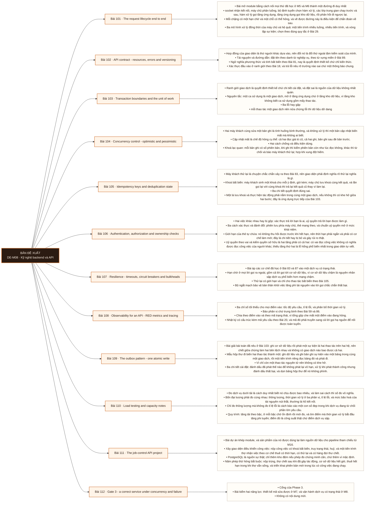

# Mô-đun 8: Kỹ nghệ backend và API

## Second Brain References

- [[wiki.backend.request-lifecycle-end-to-end|Request lifecycle end to end]]

Module này là module cuối trước khi vào tầng dữ liệu, và nó là nơi người học lần đầu chịu trách nhiệm về một hệ có trạng thái dưới tải thật. Ghi chú về phụ thuộc. Hợp đồng nguồn nêu module này cần SQL cơ bản và cho phép học song song phần đầu của M9. Ở đây SQL chỉ dùng ở mức đọc ghi và giao dịch; phần kế hoạch thực thi, chỉ mục và tối ưu thuộc M9 và M10, nên bài 95 chỉ dùng giao dịch chứ chưa đòi đọc kế hoạch. Dự án của module là một giao diện điều khiển công việc, và nó được dùng lại làm nguồn dữ liệu cho pipeline tham chiếu từ M16 trở đi.

## Điều kiện đầu vào

| Mã | Người học có thể | Bằng chứng được chấp nhận |
|---|---|---|
| EN-08-01 | M05 · M06 · M07 | Bằng chứng hoàn thành điều kiện được nêu trong cột trước |

Nếu chưa có bằng chứng đầu vào, người học phải hoàn thành lại bài hoặc mô-đun được dẫn chiếu trước khi thực hiện phép đánh giá của mô-đun này.

## Đầu ra mô-đun

Vận hành đúng một giao diện lập trình web có trạng thái dưới ràng buộc đồng thời, sự cố và bảo mật

## Tiêu chí hoàn thành

| Mã | Bằng chứng bắt buộc | Ngưỡng đạt | Lỗi loại trực tiếp |
|---|---|---|---|
| EC-08-01 | Không sinh tác động kép khi máy khách thử lại trong hợp đồng đã định; bất biến giao dịch được kiểm bằng phép chạy song song; có mô hình mối đe doạ và sổ tay chẩn đoán | Đạt ≥ 70/100, phần B và C đều ≥ 60%. Bất biến nào chỉ được chứng minh bằng phép kiểm tuần tự thì không tính điểm ở phần C. | Xây giao diện chạy đúng khi gọi lần lượt rồi hỏng khi có hai máy khách gọi cùng lúc, vì ranh giới giao dịch và khoá bất biến chưa được thiết kế |

## Khái niệm và nguyên tắc bất biến

| Mã khái niệm | Ranh giới định nghĩa | Nguyên tắc bất biến hoặc quy tắc quyết định | Bài chính |
|---|---|---|---|
| C08-101 | Bài mở module bằng cách nối mọi thứ đã học ở M5 và M6 thành một đường đi duy nhất | socket nhận kết nối, máy chủ phân luồng, bộ định tuyến chọn hàm xử lý, các lớp trung gian chạy trước và sau, hàm xử lý gọi tầng ứng dụng, tầng ứng dụng gọi kho dữ liệu, rồi phản hồi đi ngược lại. | L101 |
| C08-102 | Hợp đồng của giao diện là thứ người khác dựa vào, nên đổi nó là đổi thứ ngoài tầm kiểm soát của mình. | Tài nguyên và đường dẫn: đặt tên theo danh từ nghiệp vụ, theo từ vựng miền ở Bài 89. | L102 |
| C08-103 | Ranh giới giao dịch là quyết định thiết kế chứ chi tiết cài đặt, và đặt sai là nguồn của dữ liệu không nhất quán. | Nguyên tắc: một ca sử dụng là một giao dịch, mở ở tầng ứng dụng chứ ở tầng kho dữ liệu, vì tầng kho không biết ca sử dụng gồm mấy thao tác. | L103 |
| C08-104 | Hai máy khách cùng sửa một bản ghi là tình huống bình thường, và không xử lý thì một bản cập nhật biến mất mà không ai biết. | Cập nhật mất là chế độ hỏng cụ thể: cả hai đọc giá trị cũ, cả hai ghi, bản ghi sau đè bản trước. | L104 |
| C08-105 | Máy khách thử lại là chuyện chắc chắn xảy ra theo Bài 83, nên giao diện phải định nghĩa rõ thử lại nghĩa là gì. | Khoá bất biến: máy khách sinh một khoá cho mỗi ý định, gửi kèm; máy chủ lưu khoá cùng kết quả, và lần gọi lại với cùng khoá thì trả lại kết quả cũ thay vì làm lại. | L105 |
| C08-106 | Hai việc khác nhau hay bị gộp: xác thực trả lời bạn là ai, uỷ quyền trả lời bạn được làm gì. | Ba cách xác thực và đánh đổi: phiên lưu phía máy chủ, thẻ mang theo, và chuẩn uỷ quyền mở ở mức khái niệm. | L106 |
| C08-107 | Bài áp các cơ chế đã học ở Bài 83 và 87 vào một dịch vụ có trạng thái. | Hạn chờ ở mọi lời gọi ra ngoài, gồm cả lời gọi tới cơ sở dữ liệu, vì cơ sở dữ liệu chậm là nguyên nhân sập dịch vụ phổ biến hơn mạng chậm. | L107 |
| C08-108 | Ba chỉ số tối thiểu cho mọi điểm vào: tốc độ yêu cầu, tỉ lệ lỗi, và phân bố thời gian xử lý. | Báo phân vị chứ trung bình theo Bài 59 và 86. | L108 |
| C08-109 | Bài giải bài toán đã nêu ở Bài 103: ghi cơ sở dữ liệu rồi phát một sự kiện là hai thao tác trên hai hệ, nên chết giữa chừng làm hai bên lệch nhau và không có giao dịch nào bao được cả hai. | Mẫu hộp thư đi biến hai thao tác thành một: ghi dữ liệu và ghi bản ghi sự kiện vào một bảng trong cùng một giao dịch, rồi một tiến trình riêng đọc bảng đó và phát đi. | L109 |
| C08-110 | Đo dịch vụ dưới tải là cách duy nhất biết nó chịu được bao nhiêu, và làm sai cách thì số đo vô nghĩa. | Bốn đại lượng phải đo cùng nhau: thông lượng, thời gian xử lý ở ba phân vị, tỉ lệ lỗi, và mức bão hoà của tài nguyên nút thắt, thường là hồ kết nối. | L110 |
| C08-111 | Bài dự án khép module, và sản phẩm của nó được dùng lại làm nguồn dữ liệu cho pipeline tham chiếu từ M16. | Xây giao diện điều khiển công việc: nộp công việc có khoá bất biến, truy trạng thái, huỷ, và một tiến trình thợ nhận việc theo cơ chế thuê có thời hạn, có thử lại và có hàng đợi thư chết. | L111 |
| C08-112 | Cổng của Phase 3. | Bài kiểm hai năng lực: thiết kế mã sửa được ở M7, và vận hành dịch vụ có trạng thái ở M8. | L112 |

## Các bài trong mô-đun

| Bài | Dạng | Đầu ra | Bằng chứng | Điều kiện tiên quyết |
|---|---|---|---|---|
| L101 · The request lifecycle end to end | LT | Vẽ đường đi của một yêu cầu qua bảy chặng và chỉ ra hạn chờ cùng chế độ hỏng của từng chặng. | Sơ đồ đủ bảy chặng với hạn chờ và chế độ hỏng, và hai điểm kiểm phản ứng khác nhau khi mất kết nối cơ sở dữ liệu. | M08: M07 |
| L102 · API contract - resources, errors and versioning | TH | Thiết kế hợp đồng cho một tài nguyên có phân trang và phong bì lỗi thống nhất, và chứng minh hợp đồng ổn định khi thêm trường. | Phân trang theo con trỏ không trùng không sót khi dữ liệu đổi, và ba thay đổi hợp đồng cho phản ứng đúng như thiết kế. | L101 |
| L103 · Transaction boundaries and the unit of work | TH | Đặt đúng ranh giới giao dịch cho ba ca sử dụng và chứng minh không còn trạng thái dở dang khi lỗi giữa chừng. | Ba ca sử dụng không để lại trạng thái dở dang khi lỗi, số truy vấn mỗi yêu cầu trong ngưỡng, và tái hiện được hồ kết nối cạn. | L102 |
| L104 · Concurrency control - optimistic and pessimistic | TH | Chống được cập nhật mất bằng một trong hai cơ chế và chứng minh bằng phép kiểm chạy song song. | Bản chưa sửa mất cập nhật có số chứng minh, cả hai cơ chế đều cho 0 cập nhật mất qua 1000 lần, và có bảng so thông lượng. | L103 |
| L105 · Idempotency keys and deduplication state | TH | Cài khoá bất biến đúng cả ba chi tiết và chứng minh không sinh tác động kép kể cả khi hai yêu cầu cùng khoá tới đồng thời. | Cả ba thí nghiệm đều tạo đúng một công việc, và hợp đồng nêu rõ điều kiện cùng thời hạn thử lại. | L104 |
| L106 · Authentication, authorization and ownership checks | TH | Cài hai tầng uỷ quyền và chứng minh bằng phép thử phủ định rằng người dùng không truy cập được tài nguyên của người khác. | Mọi điểm vào có phép thử phủ định và đều từ chối đúng, và đo được khoảng thời gian thẻ cũ còn hiệu lực sau khi thu hồi. | L105 |
| L107 · Resilience - timeouts, circuit breakers and bulkheads | TH | Dựng bốn cơ chế chịu lỗi và chứng minh dịch vụ suy giảm có kiểm soát khi phụ thuộc hạ nguồn hỏng. | Ba kịch bản hỏng đều giữ được tỉ lệ phục vụ của phần không phụ thuộc, và vách ngăn ngăn được hồ kết nối cạn có số chứng minh. | L106 |
| L108 · Observability for an API - RED metrics and tracing | TH | Dựng bộ chỉ số và theo vết đủ để trả lời ba câu hỏi chẩn đoán mà không cần đọc mã. | Trả lời được ≥ 2/3 câu hỏi chẩn đoán chỉ bằng bảng điều khiển và theo vết, và điểm sẵn sàng đổi trạng thái khi mất cơ sở dữ liệu. | L107 |
| L109 · The outbox pattern - one atomic write | TH | Cài mẫu hộp thư đi và chứng minh bằng thí nghiệm giết tiến trình rằng cơ sở dữ liệu và luồng sự kiện không lệch nhau. | Bản ngây thơ có mức lệch đo được, bản hộp thư đi không thiếu sự kiện nào qua 20 lần giết, và bảng hộp thư được dọn tự động. | L108 |
| L110 · Load testing and capacity notes | TH | Đo được công suất thật của dịch vụ và xác định đúng tài nguyên nút thắt bằng số đo. | Đường cong bốn đại lượng đủ sáu bậc, xác định đúng điểm công suất và tài nguyên nút thắt, và phép thử kéo dài không cho thấy rò rỉ. | L109 |
| L111 · The job-control API project | DA | Nộp giao diện chạy đúng qua cả năm phép thử hỏng, có ghi chú công suất, mô hình mối đe doạ và sổ tay. | Năm phép thử hỏng đều không sinh tác động kép và không mất công việc, và ba tài liệu đều có nội dung kiểm được. | L110 |
| L112 · Gate 3 - a correct service under concurrency and failure | KT | Nộp một dịch vụ giữ đúng bất biến dưới truy cập đồng thời và dưới sự cố, với bằng chứng từ phép kiểm chạy song song. | Đạt ≥ 70/100, phần B và C đều ≥ 60%. Bất biến nào chỉ được chứng minh bằng phép kiểm tuần tự thì không tính điểm ở phần C. | L111 |

## Nội dung từng bài

> **Sơ đồ đề xuất: DE-M08 v0.1.0.** Mỗi nhánh đi từ một bài học đến các nội dung nguyên tử bắt buộc. Thứ tự dạy lấy từ bảng `Các bài trong mô-đun`.

### Lesson 101: The request lifecycle end to end

Bài mở module bằng cách nối mọi thứ đã học ở M5 và M6 thành một đường đi duy nhất: socket nhận kết nối, máy chủ phân luồng, bộ định tuyến chọn hàm xử lý, các lớp trung gian chạy trước và sau, hàm xử lý gọi tầng ứng dụng, tầng ứng dụng gọi kho dữ liệu, rồi phản hồi đi ngược lại. Mỗi chặng có một hạn chờ và một chỗ có thể hỏng, và vẽ được đường này là điều kiện để chẩn đoán về sau. Ba mô hình xử lý đồng thời của máy chủ và hệ quả: một tiến trình nhiều luồng, nhiều tiến trình, và vòng lặp sự kiện; chọn theo đúng quy tắc ở Bài 29. Lớp trung gian làm gì và thứ tự chạy của chúng quan trọng ra sao, đặc biệt lớp ghi nhật ký và lớp xác thực. Điểm kiểm sức khoẻ và điểm kiểm sẵn sàng là hai thứ khác nhau, theo phân biệt đã nêu ở Bài 82.

Người học phải vẽ đường đi của một yêu cầu qua bảy chặng và chỉ ra hạn chờ cùng chế độ hỏng của từng chặng. Bằng chứng thực hành: Dựng một dịch vụ tối thiểu có lớp trung gian ghi nhật ký. Gửi một yêu cầu và ghi lại dấu thời gian ở từng chặng bằng nhật ký có mã theo dõi. Vẽ đường đi có chú thích hạn chờ và chế độ hỏng. Phân biệt điểm kiểm sức khoẻ với điểm kiểm sẵn sàng bằng cách ngắt kết nối cơ sở dữ liệu và xem cái nào đổi trạng thái. Bài hoàn tất khi sơ đồ đủ bảy chặng với hạn chờ và chế độ hỏng, và hai điểm kiểm phản ứng khác nhau khi mất kết nối cơ sở dữ liệu.

Cách đánh giá: Tầng *hiểu*. Bài mở module, tổng hợp kiến thức đã có thành một bản đồ. Kiểm bằng bài vẽ có chú thích; đạt khi đủ bảy chặng, mỗi chặng có hạn chờ và ít nhất một chế độ hỏng.

### Lesson 102: API contract - resources, errors and versioning

Hợp đồng của giao diện là thứ người khác dựa vào, nên đổi nó là đổi thứ ngoài tầm kiểm soát của mình. Tài nguyên và đường dẫn: đặt tên theo danh từ nghiệp vụ, theo từ vựng miền ở Bài 89. Ngữ nghĩa phương thức và tính bất biến theo Bài 81, nay là quyết định thiết kế chứ chỉ kiến thức. Xác thực đầu vào ở ranh giới theo Bài 18, và trả lỗi nêu rõ trường nào sai chứ một thông báo chung. Phong bì lỗi thống nhất: mã lỗi ổn định cho máy đọc, thông điệp cho người đọc, và mã theo dõi để đối chiếu nhật ký. Phân trang, lọc và sắp xếp: ba kiểu phân trang và vì sao phân trang theo con trỏ an toàn hơn theo số trang khi dữ liệu đang đổi, nối lại Bài 84. Đánh phiên bản: ba cách và đánh đổi; nguyên tắc chung là thêm thì được, bớt và đổi kiểu thì cần phiên bản mới, cùng bộ quy tắc với Bài 94.

Người học phải thiết kế hợp đồng cho một tài nguyên có phân trang và phong bì lỗi thống nhất, và chứng minh hợp đồng ổn định khi thêm trường. Bằng chứng thực hành: Thiết kế và cài giao diện cho tài nguyên công việc: tạo, xem, liệt kê có phân trang theo con trỏ, và huỷ. Viết đặc tả giao diện. Dựng phép kiểm hợp đồng từ phía một máy khách. Thực hiện ba thay đổi và ghi phản ứng của phép kiểm. Chèn bản ghi mới giữa lúc phân trang và chứng minh không trùng không sót. Bài hoàn tất khi phân trang theo con trỏ không trùng không sót khi dữ liệu đổi, và ba thay đổi hợp đồng cho phản ứng đúng như thiết kế.

Cách đánh giá: Tầng *áp dụng*. Objective là một thiết kế có tiêu chí nghiệm thu bằng phép kiểm hợp đồng ở Bài 94. Kiểm bằng ba thay đổi hợp đồng; đạt khi thêm trường không làm bên tiêu thụ lỗi và hai thay đổi phá vỡ bị phép kiểm chặn.

### Lesson 103: Transaction boundaries and the unit of work

Ranh giới giao dịch là quyết định thiết kế chứ chi tiết cài đặt, và đặt sai là nguồn của dữ liệu không nhất quán. Nguyên tắc: một ca sử dụng là một giao dịch, mở ở tầng ứng dụng chứ ở tầng kho dữ liệu, vì tầng kho không biết ca sử dụng gồm mấy thao tác. Ba lỗi hay gặp: mỗi thao tác một giao dịch nên nửa chừng lỗi thì dữ liệu dở dang; giữ giao dịch mở trong lúc gọi hệ ngoài nên khoá bị giữ rất lâu; và gọi hệ ngoài bên trong giao dịch rồi giao dịch lùi mà tác động bên ngoài không lùi được. Lỗi thứ ba là bài toán hai hệ và lời giải của nó là mẫu hộp thư đi, đặt ở Bài 109. Hồ kết nối và quan hệ với ranh giới giao dịch: giao dịch giữ một kết nối, nên giao dịch dài làm cạn hồ, và triệu chứng là yêu cầu xếp hàng chờ kết nối chứ chờ cơ sở dữ liệu. Vấn đề truy vấn lặp và cách phát hiện bằng đếm số truy vấn cho mỗi yêu cầu.

Người học phải đặt đúng ranh giới giao dịch cho ba ca sử dụng và chứng minh không còn trạng thái dở dang khi lỗi giữa chừng. Bằng chứng thực hành: Cài ba ca sử dụng, mỗi cái ghi nhiều bảng. Tiêm lỗi ở giữa và đối soát để chứng minh không dở dang. Đếm số truy vấn cho mỗi yêu cầu và phát hiện truy vấn lặp, rồi sửa. Giữ một giao dịch mở trong lúc gọi hệ ngoài chậm và quan sát hồ kết nối cạn. Bài hoàn tất khi ba ca sử dụng không để lại trạng thái dở dang khi lỗi, số truy vấn mỗi yêu cầu trong ngưỡng, và tái hiện được hồ kết nối cạn.

Cách đánh giá: Tầng *áp dụng*. Objective là một quyết định thiết kế kiểm được bằng thí nghiệm lỗi giữa chừng. Kiểm bằng ba ca sử dụng có tiêm lỗi; đạt khi không ca nào để lại trạng thái dở dang và số truy vấn cho mỗi yêu cầu nằm trong ngưỡng.

### Lesson 104: Concurrency control - optimistic and pessimistic

Hai máy khách cùng sửa một bản ghi là tình huống bình thường, và không xử lý thì một bản cập nhật biến mất mà không ai biết. Cập nhật mất là chế độ hỏng cụ thể: cả hai đọc giá trị cũ, cả hai ghi, bản ghi sau đè bản trước. Hai cách chống và điều kiện dùng. Khoá lạc quan: mỗi bản ghi có số phiên bản, khi ghi thì kiểm phiên bản còn như lúc đọc không, khác thì từ chối và báo máy khách thử lại; hợp khi xung đột hiếm. Khoá bi quan: khoá bản ghi lúc đọc, giữ tới khi ghi xong; hợp khi xung đột nhiều, đổi lại giảm đồng thời và có nguy cơ khoá chết theo Bài 70. Mức cô lập giao dịch ở mức đủ dùng, phần chi tiết thuộc M10. Cách kiểm thử: phép kiểm tuần tự không bao giờ phát hiện được lỗi loại này, nên bắt buộc phải có phép kiểm chạy song song thật.

Người học phải chống được cập nhật mất bằng một trong hai cơ chế và chứng minh bằng phép kiểm chạy song song. Bằng chứng thực hành: Cài một điểm cập nhật không có kiểm soát đồng thời. Viết phép kiểm chạy 50 luồng cùng cập nhật và chứng minh có cập nhật bị mất. Cài khoá lạc quan và chạy lại. Cài khoá bi quan và chạy lại. So thông lượng hai cách ở hai mức tỉ lệ xung đột khác nhau. Bài hoàn tất khi bản chưa sửa mất cập nhật có số chứng minh, cả hai cơ chế đều cho 0 cập nhật mất qua 1000 lần, và có bảng so thông lượng.

Cách đánh giá: Tầng *áp dụng*. Objective là một cơ chế chỉ kiểm được bằng phép chạy song song, điểm mà phép kiểm thông thường bỏ sót. Kiểm bằng 1000 lần ghi đồng thời; đạt khi không có cập nhật nào bị mất và số lần từ chối khớp số xung đột thật.

### Lesson 105: Idempotency keys and deduplication state

Máy khách thử lại là chuyện chắc chắn xảy ra theo Bài 83, nên giao diện phải định nghĩa rõ thử lại nghĩa là gì. Khoá bất biến: máy khách sinh một khoá cho mỗi ý định, gửi kèm; máy chủ lưu khoá cùng kết quả, và lần gọi lại với cùng khoá thì trả lại kết quả cũ thay vì làm lại. Ba chi tiết quyết định đúng sai. Một là lưu khoá và thực hiện tác động phải nằm trong cùng một giao dịch, nếu không thì có khe hở giữa hai bước; đây là ứng dụng trực tiếp của Bài 103. Hai là thời gian giữ khoá và điều gì xảy ra sau khi hết hạn. Ba là hành vi khi hai yêu cầu cùng khoá tới đồng thời chứ nối tiếp: bản sau phải chờ hoặc bị từ chối, chứ tạo hai bản ghi. Hợp đồng phải ghi rõ trong tài liệu để máy khách biết mình được thử lại trong điều kiện nào và trong bao lâu.

Người học phải cài khoá bất biến đúng cả ba chi tiết và chứng minh không sinh tác động kép kể cả khi hai yêu cầu cùng khoá tới đồng thời. Bằng chứng thực hành: Cài khoá bất biến cho điểm tạo công việc. Ba thí nghiệm: gọi lại cùng khoá sau khi thành công, gọi lại sau khi máy chủ chết giữa chừng, và gọi hai yêu cầu cùng khoá đồng thời. Với mỗi thí nghiệm, đếm số công việc thật được tạo. Viết phần hợp đồng mô tả điều kiện và thời hạn thử lại. Bài hoàn tất khi cả ba thí nghiệm đều tạo đúng một công việc, và hợp đồng nêu rõ điều kiện cùng thời hạn thử lại.

Cách đánh giá: Tầng *sáng tạo*. Objective đòi ghép giao dịch, lưu trạng thái và xử lý đồng thời thành một cơ chế mà thư viện không cho sẵn. Kiểm bằng ba thí nghiệm; đạt khi cả ba đều không sinh tác động kép.

### Lesson 106: Authentication, authorization and ownership checks

Hai việc khác nhau hay bị gộp: xác thực trả lời bạn là ai, uỷ quyền trả lời bạn được làm gì. Ba cách xác thực và đánh đổi: phiên lưu phía máy chủ, thẻ mang theo, và chuẩn uỷ quyền mở ở mức khái niệm. Giới hạn của thẻ tự chứa: nó không thu hồi được trước khi hết hạn, nên thời hạn phải ngắn và phải có cơ chế làm mới; đây là chi tiết hay bị bỏ và gây rủi ro thật. Uỷ quyền theo vai và kiểm quyền sở hữu là hai tầng phải có cả hai: có vai đọc công việc không có nghĩa được đọc công việc của người khác; thiếu tầng thứ hai là lỗ hổng phổ biến nhất trong giao diện tự viết. Nguyên tắc kiểm ở đâu: kiểm ở tầng ứng dụng chứ ở hàm xử lý, để mọi đường vào đều đi qua. Phép thử phủ định bắt buộc: với mỗi điểm vào, viết một phép kiểm chứng minh người không có quyền bị từ chối.

Người học phải cài hai tầng uỷ quyền và chứng minh bằng phép thử phủ định rằng người dùng không truy cập được tài nguyên của người khác. Bằng chứng thực hành: Cài xác thực bằng thẻ có thời hạn ngắn và cơ chế làm mới. Cài kiểm vai và kiểm quyền sở hữu. Với mỗi điểm vào, viết phép thử phủ định. Thử truy cập tài nguyên của người khác bằng thẻ hợp lệ và chứng minh bị từ chối. Thu hồi quyền một người dùng và đo bao lâu thẻ cũ còn dùng được. Bài hoàn tất khi mọi điểm vào có phép thử phủ định và đều từ chối đúng, và đo được khoảng thời gian thẻ cũ còn hiệu lực sau khi thu hồi.

Cách đánh giá: Tầng *áp dụng*. Objective là một cơ chế bảo mật kiểm được bằng phép thử phủ định, chứ bằng việc đường đi thuận chạy được. Kiểm bằng phép thử phủ định cho mọi điểm vào; đạt khi mọi truy cập trái phép bị từ chối và có ghi nhật ký.

### Lesson 107: Resilience - timeouts, circuit breakers and bulkheads

Bài áp các cơ chế đã học ở Bài 83 và 87 vào một dịch vụ có trạng thái. Hạn chờ ở mọi lời gọi ra ngoài, gồm cả lời gọi tới cơ sở dữ liệu, vì cơ sở dữ liệu chậm là nguyên nhân sập dịch vụ phổ biến hơn mạng chậm. Thử lại có giới hạn và chỉ cho thao tác bất biến theo Bài 105. Bộ ngắt mạch bảo vệ bản thân khỏi việc lãng phí tài nguyên vào lời gọi chắc chắn thất bại. Vách ngăn là cơ chế ít được dùng nhưng rất hiệu quả: chia hồ tài nguyên theo loại việc, để một loại việc chậm không chiếm hết hồ kết nối và làm chết mọi loại còn lại; với dịch vụ dữ liệu thì tách hồ cho truy vấn nhanh và truy vấn nặng là cách đơn giản nhất. Giảm tải và hàng đợi có giới hạn theo Bài 87. Thứ tự áp dụng: đặt hạn chờ trước, rồi mới tới các cơ chế còn lại, vì không có hạn chờ thì mọi cơ chế khác vô nghĩa.

Người học phải dựng bốn cơ chế chịu lỗi và chứng minh dịch vụ suy giảm có kiểm soát khi phụ thuộc hạ nguồn hỏng. Bằng chứng thực hành: Dựng bốn cơ chế. Ba kịch bản: cơ sở dữ liệu chậm gấp mười lần, một phụ thuộc ngoài chết hoàn toàn, và tải gấp năm lần công suất. Với mỗi kịch bản, đo tỉ lệ phục vụ của các điểm vào không phụ thuộc phần hỏng, và kiểm hồ kết nối có cạn không. Thêm vách ngăn tách hồ và đo lại. Bài hoàn tất khi ba kịch bản hỏng đều giữ được tỉ lệ phục vụ của phần không phụ thuộc, và vách ngăn ngăn được hồ kết nối cạn có số chứng minh.

Cách đánh giá: Tầng *áp dụng*. Objective là một tập cấu hình kiểm được bằng thí nghiệm hỏng hạ nguồn. Kiểm bằng ba kịch bản hỏng; đạt khi dịch vụ vẫn phục vụ phần không phụ thuộc và không cạn hồ kết nối.

### Lesson 108: Observability for an API - RED metrics and tracing

Ba chỉ số tối thiểu cho mọi điểm vào: tốc độ yêu cầu, tỉ lệ lỗi, và phân bố thời gian xử lý. Báo phân vị chứ trung bình theo Bài 59 và 86. Chia theo điểm vào và theo mã trạng thái, vì tổng gộp che mất một điểm vào đang hỏng. Nhật ký có cấu trúc kèm mã yêu cầu theo Bài 20, và mã đó phải truyền sang cả lời gọi hạ nguồn để nối được toàn tuyến. Theo vết phân tán ở mức dùng được: một mã theo dõi đi qua nhiều thành phần cho biết thời gian tiêu ở đâu, và đây là thứ duy nhất trả lời được câu chậm ở chặng nào khi có nhiều chặng. Điểm kiểm sức khoẻ và sẵn sàng theo Bài 101, nay gắn với hành vi thật: sẵn sàng phải kiểm được kết nối cơ sở dữ liệu, nếu không thì bộ cân bằng tải gửi lưu lượng tới một bản sao đã hỏng. Ba câu hỏi chẩn đoán mà bộ chỉ số phải trả lời được.

Người học phải dựng bộ chỉ số và theo vết đủ để trả lời ba câu hỏi chẩn đoán mà không cần đọc mã. Bằng chứng thực hành: Gắn ba chỉ số chia theo điểm vào và mã trạng thái. Truyền mã yêu cầu xuống hạ nguồn. Dựng theo vết cho tuyến gọi ba chặng. Giảng viên tiêm một sự cố ở một chặng và đặt ba câu hỏi chẩn đoán; trả lời chỉ bằng bảng điều khiển và theo vết. Kiểm điểm sẵn sàng phản ứng đúng khi mất kết nối cơ sở dữ liệu. Bài hoàn tất khi trả lời được ≥ 2/3 câu hỏi chẩn đoán chỉ bằng bảng điều khiển và theo vết, và điểm sẵn sàng đổi trạng thái khi mất cơ sở dữ liệu.

Cách đánh giá: Tầng *áp dụng*. Objective đo bằng khả năng trả lời câu hỏi chứ bằng số lượng biểu đồ. Kiểm bằng ba câu hỏi chẩn đoán trong lúc có sự cố tiêm sẵn; đạt khi trả lời được ít nhất hai chỉ bằng bảng điều khiển và theo vết.

### Lesson 109: The outbox pattern - one atomic write

Bài giải bài toán đã nêu ở Bài 103: ghi cơ sở dữ liệu rồi phát một sự kiện là hai thao tác trên hai hệ, nên chết giữa chừng làm hai bên lệch nhau và không có giao dịch nào bao được cả hai. Mẫu hộp thư đi biến hai thao tác thành một: ghi dữ liệu và ghi bản ghi sự kiện vào một bảng trong cùng một giao dịch, rồi một tiến trình riêng đọc bảng đó và phát đi. Vì chỉ còn một thao tác nguyên tử nên không có khe hở. Ba chi tiết cài đặt: đánh dấu đã phát thế nào để không phát lại vô hạn, xử lý khi phát thành công nhưng đánh dấu thất bại, và dọn bảng hộp thư để nó không phình. Bên nhận vẫn phải chịu được nhận trùng, vì mẫu này cho ít nhất một lần chứ đúng một lần. Ở M22, tiến trình đọc bảng hộp thư sẽ được thay bằng đọc thẳng nhật ký giao dịch; ở đây làm bản đơn giản trước.

Người học phải cài mẫu hộp thư đi và chứng minh bằng thí nghiệm giết tiến trình rằng cơ sở dữ liệu và luồng sự kiện không lệch nhau. Bằng chứng thực hành: Cài bản ngây thơ ghi cơ sở dữ liệu rồi phát sự kiện, giết tiến trình giữa hai thao tác 20 lần và đếm mức lệch. Cài lại bằng hộp thư đi và lặp thí nghiệm. Xử lý trường hợp phát thành công nhưng đánh dấu thất bại. Thêm việc dọn bảng hộp thư theo lịch. Bài hoàn tất khi bản ngây thơ có mức lệch đo được, bản hộp thư đi không thiếu sự kiện nào qua 20 lần giết, và bảng hộp thư được dọn tự động.

Cách đánh giá: Tầng *sáng tạo*. Objective đòi ghép giao dịch với một tiến trình phát riêng thành một mẫu giải bài toán hai hệ. Kiểm bằng 20 lần giết tiến trình; đạt khi số sự kiện phát ra khớp số bản ghi tạo ra, không thiếu.

### Lesson 110: Load testing and capacity notes

Đo dịch vụ dưới tải là cách duy nhất biết nó chịu được bao nhiêu, và làm sai cách thì số đo vô nghĩa. Bốn đại lượng phải đo cùng nhau: thông lượng, thời gian xử lý ở ba phân vị, tỉ lệ lỗi, và mức bão hoà của tài nguyên nút thắt, thường là hồ kết nối. Chỉ đo thông lượng mà không đo tỉ lệ lỗi là cách báo cáo một con số đẹp trong khi dịch vụ đang từ chối phần lớn yêu cầu. Quy trình: tăng tải theo bậc, ở mỗi bậc chờ ổn định rồi mới đo, và tìm điểm mà thời gian xử lý bắt đầu tăng phi tuyến; điểm đó là công suất thật chứ điểm dịch vụ sập. Phân biệt ba loại phép thử: tải thường, tải đỉnh, và tải kéo dài để phát hiện rò rỉ. Ghi chú công suất viết ra thành tài liệu gồm công suất đo được, nút thắt, và ước lượng khi nào cần mở rộng; đây là đầu vào cho M27.

Người học phải đo được công suất thật của dịch vụ và xác định đúng tài nguyên nút thắt bằng số đo. Bằng chứng thực hành: Chạy tải tăng theo sáu bậc trên giao diện. Ở mỗi bậc đo cả bốn đại lượng. Vẽ đường cong và xác định điểm công suất. Chỉ ra tài nguyên nút thắt bằng số đo. Chạy tải kéo dài 30 phút và kiểm bộ nhớ cùng số kết nối có tăng đơn điệu không. Viết ghi chú công suất một trang. Bài hoàn tất khi đường cong bốn đại lượng đủ sáu bậc, xác định đúng điểm công suất và tài nguyên nút thắt, và phép thử kéo dài không cho thấy rò rỉ.

Cách đánh giá: Tầng *phân tích*. Objective đòi đọc đường cong và định vị nút thắt chứ chỉ chạy công cụ tải. Kiểm bằng đường cong bốn đại lượng; đạt khi xác định đúng điểm công suất và chỉ đúng tài nguyên nút thắt.

### Lesson 111: The job-control API project

Bài dự án khép module, và sản phẩm của nó được dùng lại làm nguồn dữ liệu cho pipeline tham chiếu từ M16. Xây giao diện điều khiển công việc: nộp công việc có khoá bất biến, truy trạng thái, huỷ, và một tiến trình thợ nhận việc theo cơ chế thuê có thời hạn, có thử lại và có hàng đợi thư chết. PostgreSQL là nguồn sự thật; chỉ thêm kho đệm nếu phép đo chứng minh cần, chứ thêm vì mặc định. Năm phép thử hỏng bắt buộc: nộp trùng, thợ chết sau khi đã gây tác động, cơ sở dữ liệu hết giờ, thuê hết hạn trong khi thợ vẫn sống, và triển khai phiên bản mới trong lúc có công việc đang chạy. Phép thử cuối là phép thử khó nhất và nối thẳng tới Bài 97 và 98. Nộp kèm ghi chú công suất theo Bài 110, mô hình mối đe doạ ngắn, và sổ tay chẩn đoán ba mục.

Người học phải nộp giao diện chạy đúng qua cả năm phép thử hỏng, có ghi chú công suất, mô hình mối đe doạ và sổ tay. Bằng chứng thực hành: Xây giao diện theo đặc tả. Chạy năm phép thử hỏng và ghi kết quả từng cái. Chạy tải và viết ghi chú công suất. Viết mô hình mối đe doạ ngắn nêu ba mối đe doạ chính và cách chặn. Viết sổ tay ba mục gồm bão hoà, cơ sở dữ liệu hỏng, và triển khai lỗi. Bài hoàn tất khi năm phép thử hỏng đều không sinh tác động kép và không mất công việc, và ba tài liệu đều có nội dung kiểm được.

Cách đánh giá: Tầng *sáng tạo*. Bài tổng hợp toàn module thành một dịch vụ có trạng thái chịu được sự cố. Kiểm bằng năm phép thử hỏng cộng rà soát tài liệu; đạt khi không phép thử nào sinh tác động kép hoặc mất công việc.

### Lesson 112: Gate 3 - a correct service under concurrency and failure

Cổng của Phase 3. Bài kiểm hai năng lực: thiết kế mã sửa được ở M7, và vận hành dịch vụ có trạng thái ở M8. Không có nội dung mới.

Người học phải nộp một dịch vụ giữ đúng bất biến dưới truy cập đồng thời và dưới sự cố, với bằng chứng từ phép kiểm chạy song song. Bằng chứng thực hành: Nhận một đặc tả dịch vụ nhỏ. Bài chấm sáu phần: A (15đ) đồ thị phụ thuộc không có cạnh sai chiều và phép kiểm lõi không cần cơ sở dữ liệu · B (25đ) không sinh tác động kép khi máy khách thử lại, chứng minh bằng ba thí nghiệm · C (20đ) bất biến giữ đúng dưới 50 luồng đồng thời, chứng minh bằng phép kiểm chạy song song · D (15đ) hạn chờ và giới hạn thử lại đặt đủ, không khuếch đại · E (15đ) chẩn đoán một sự cố tiêm sẵn bằng chỉ số và theo vết · F (10đ) phép thử phủ định cho mọi điểm vào đều từ chối đúng. Bài hoàn tất khi đạt ≥ 70/100, phần B và C đều ≥ 60%. Bất biến nào chỉ được chứng minh bằng phép kiểm tuần tự thì không tính điểm ở phần C.

Cách đánh giá: Tầng *đánh giá*. Cổng đo năng lực xây hệ đúng dưới điều kiện thật, nên hình thức là bài làm có tiêm lỗi và có chất vấn.

## Lý do sắp xếp

Mô-đun bắt đầu từ `M08: M07` và đi theo các quan hệ tiên quyết đã ghi trong bảng. Mỗi bài chỉ sử dụng khái niệm hoặc thao tác đã được giới thiệu trước đó; bài cuối L112 tích hợp đầu ra của toàn mô-đun.

## Ma trận đánh giá

| Mã đầu ra | Mức độ tư duy | Cách đánh giá | Ngưỡng đạt | Hình thức kiểm tra lại |
|---|---|---|---|---|
| L101 | Hiểu | Tầng *hiểu*. Bài mở module, tổng hợp kiến thức đã có thành một bản đồ. Kiểm bằng bài vẽ có chú thích; đạt khi đủ bảy chặng, mỗi chặng có hạn chờ và ít nhất một chế độ hỏng. | Sơ đồ đủ bảy chặng với hạn chờ và chế độ hỏng, và hai điểm kiểm phản ứng khác nhau khi mất kết nối cơ sở dữ liệu. | Tình huống mới, giữ nguyên đầu ra và ngưỡng |
| L102 | Áp dụng | Tầng *áp dụng*. Objective là một thiết kế có tiêu chí nghiệm thu bằng phép kiểm hợp đồng ở Bài 94. Kiểm bằng ba thay đổi hợp đồng; đạt khi thêm trường không làm bên tiêu thụ lỗi và hai thay đổi phá vỡ bị phép kiểm chặn. | Phân trang theo con trỏ không trùng không sót khi dữ liệu đổi, và ba thay đổi hợp đồng cho phản ứng đúng như thiết kế. | Tình huống mới, giữ nguyên đầu ra và ngưỡng |
| L103 | Áp dụng | Tầng *áp dụng*. Objective là một quyết định thiết kế kiểm được bằng thí nghiệm lỗi giữa chừng. Kiểm bằng ba ca sử dụng có tiêm lỗi; đạt khi không ca nào để lại trạng thái dở dang và số truy vấn cho mỗi yêu cầu nằm trong ngưỡng. | Ba ca sử dụng không để lại trạng thái dở dang khi lỗi, số truy vấn mỗi yêu cầu trong ngưỡng, và tái hiện được hồ kết nối cạn. | Tình huống mới, giữ nguyên đầu ra và ngưỡng |
| L104 | Áp dụng | Tầng *áp dụng*. Objective là một cơ chế chỉ kiểm được bằng phép chạy song song, điểm mà phép kiểm thông thường bỏ sót. Kiểm bằng 1000 lần ghi đồng thời; đạt khi không có cập nhật nào bị mất và số lần từ chối khớp số xung đột thật. | Bản chưa sửa mất cập nhật có số chứng minh, cả hai cơ chế đều cho 0 cập nhật mất qua 1000 lần, và có bảng so thông lượng. | Tình huống mới, giữ nguyên đầu ra và ngưỡng |
| L105 | Sáng tạo | Tầng *sáng tạo*. Objective đòi ghép giao dịch, lưu trạng thái và xử lý đồng thời thành một cơ chế mà thư viện không cho sẵn. Kiểm bằng ba thí nghiệm; đạt khi cả ba đều không sinh tác động kép. | Cả ba thí nghiệm đều tạo đúng một công việc, và hợp đồng nêu rõ điều kiện cùng thời hạn thử lại. | Tình huống mới, giữ nguyên đầu ra và ngưỡng |
| L106 | Áp dụng | Tầng *áp dụng*. Objective là một cơ chế bảo mật kiểm được bằng phép thử phủ định, chứ bằng việc đường đi thuận chạy được. Kiểm bằng phép thử phủ định cho mọi điểm vào; đạt khi mọi truy cập trái phép bị từ chối và có ghi nhật ký. | Mọi điểm vào có phép thử phủ định và đều từ chối đúng, và đo được khoảng thời gian thẻ cũ còn hiệu lực sau khi thu hồi. | Tình huống mới, giữ nguyên đầu ra và ngưỡng |
| L107 | Áp dụng | Tầng *áp dụng*. Objective là một tập cấu hình kiểm được bằng thí nghiệm hỏng hạ nguồn. Kiểm bằng ba kịch bản hỏng; đạt khi dịch vụ vẫn phục vụ phần không phụ thuộc và không cạn hồ kết nối. | Ba kịch bản hỏng đều giữ được tỉ lệ phục vụ của phần không phụ thuộc, và vách ngăn ngăn được hồ kết nối cạn có số chứng minh. | Tình huống mới, giữ nguyên đầu ra và ngưỡng |
| L108 | Áp dụng | Tầng *áp dụng*. Objective đo bằng khả năng trả lời câu hỏi chứ bằng số lượng biểu đồ. Kiểm bằng ba câu hỏi chẩn đoán trong lúc có sự cố tiêm sẵn; đạt khi trả lời được ít nhất hai chỉ bằng bảng điều khiển và theo vết. | Trả lời được ≥ 2/3 câu hỏi chẩn đoán chỉ bằng bảng điều khiển và theo vết, và điểm sẵn sàng đổi trạng thái khi mất cơ sở dữ liệu. | Tình huống mới, giữ nguyên đầu ra và ngưỡng |
| L109 | Sáng tạo | Tầng *sáng tạo*. Objective đòi ghép giao dịch với một tiến trình phát riêng thành một mẫu giải bài toán hai hệ. Kiểm bằng 20 lần giết tiến trình; đạt khi số sự kiện phát ra khớp số bản ghi tạo ra, không thiếu. | Bản ngây thơ có mức lệch đo được, bản hộp thư đi không thiếu sự kiện nào qua 20 lần giết, và bảng hộp thư được dọn tự động. | Tình huống mới, giữ nguyên đầu ra và ngưỡng |
| L110 | Phân tích | Tầng *phân tích*. Objective đòi đọc đường cong và định vị nút thắt chứ chỉ chạy công cụ tải. Kiểm bằng đường cong bốn đại lượng; đạt khi xác định đúng điểm công suất và chỉ đúng tài nguyên nút thắt. | Đường cong bốn đại lượng đủ sáu bậc, xác định đúng điểm công suất và tài nguyên nút thắt, và phép thử kéo dài không cho thấy rò rỉ. | Tình huống mới, giữ nguyên đầu ra và ngưỡng |
| L111 | Sáng tạo | Tầng *sáng tạo*. Bài tổng hợp toàn module thành một dịch vụ có trạng thái chịu được sự cố. Kiểm bằng năm phép thử hỏng cộng rà soát tài liệu; đạt khi không phép thử nào sinh tác động kép hoặc mất công việc. | Năm phép thử hỏng đều không sinh tác động kép và không mất công việc, và ba tài liệu đều có nội dung kiểm được. | Tình huống mới, giữ nguyên đầu ra và ngưỡng |
| L112 | Đánh giá | Tầng *đánh giá*. Cổng đo năng lực xây hệ đúng dưới điều kiện thật, nên hình thức là bài làm có tiêm lỗi và có chất vấn. | Đạt ≥ 70/100, phần B và C đều ≥ 60%. Bất biến nào chỉ được chứng minh bằng phép kiểm tuần tự thì không tính điểm ở phần C. | Tình huống mới, giữ nguyên đầu ra và ngưỡng |

Không cộng điểm để bù cho lỗi loại trực tiếp. Người học phải sửa đúng lỗi, nộp lại bằng chứng và thực hiện kiểm tra lại trên một tình huống khác.

## Bài thực hành bắt buộc

| Bài thực hành hoặc dự án | Bài liên quan | Sản phẩm bắt buộc | Lỗi được cài vào tình huống |
|---|---|---|---|
| The request lifecycle end to end | L101 | Dựng một dịch vụ tối thiểu có lớp trung gian ghi nhật ký. Gửi một yêu cầu và ghi lại dấu thời gian ở từng chặng bằng nhật ký có mã theo dõi. Vẽ đường đi có chú thích hạn chờ và chế độ hỏng. Phân biệt điểm kiểm sức khoẻ với điểm kiểm sẵn sàng bằng cách ngắt kết nối cơ sở dữ liệu và xem cái nào đổi trạng thái. | Vẽ sơ đồ mà bỏ qua lớp trung gian · dùng một điểm kiểm cho cả hai mục đích · không đặt hạn chờ ở chặng gọi cơ sở dữ liệu. |
| API contract - resources, errors and versioning | L102 | Thiết kế và cài giao diện cho tài nguyên công việc: tạo, xem, liệt kê có phân trang theo con trỏ, và huỷ. Viết đặc tả giao diện. Dựng phép kiểm hợp đồng từ phía một máy khách. Thực hiện ba thay đổi và ghi phản ứng của phép kiểm. Chèn bản ghi mới giữa lúc phân trang và chứng minh không trùng không sót. | Phân trang theo số trang · phong bì lỗi mỗi chỗ một kiểu · trả mã trạng thái chung cho mọi lỗi · đổi kiểu một trường mà giữ nguyên phiên bản. |
| Transaction boundaries and the unit of work | L103 | Cài ba ca sử dụng, mỗi cái ghi nhiều bảng. Tiêm lỗi ở giữa và đối soát để chứng minh không dở dang. Đếm số truy vấn cho mỗi yêu cầu và phát hiện truy vấn lặp, rồi sửa. Giữ một giao dịch mở trong lúc gọi hệ ngoài chậm và quan sát hồ kết nối cạn. | Mở giao dịch ở tầng kho dữ liệu · gọi hệ ngoài trong giao dịch · giữ giao dịch qua nhiều bước chờ người dùng · không đếm số truy vấn mỗi yêu cầu. |
| Concurrency control - optimistic and pessimistic | L104 | Cài một điểm cập nhật không có kiểm soát đồng thời. Viết phép kiểm chạy 50 luồng cùng cập nhật và chứng minh có cập nhật bị mất. Cài khoá lạc quan và chạy lại. Cài khoá bi quan và chạy lại. So thông lượng hai cách ở hai mức tỉ lệ xung đột khác nhau. | Chỉ kiểm tuần tự rồi kết luận đúng · dùng khoá bi quan cho mọi thứ · trả lỗi xung đột mà không nói máy khách phải làm gì · giữ khoá qua nhiều yêu cầu. |
| Idempotency keys and deduplication state | L105 | Cài khoá bất biến cho điểm tạo công việc. Ba thí nghiệm: gọi lại cùng khoá sau khi thành công, gọi lại sau khi máy chủ chết giữa chừng, và gọi hai yêu cầu cùng khoá đồng thời. Với mỗi thí nghiệm, đếm số công việc thật được tạo. Viết phần hợp đồng mô tả điều kiện và thời hạn thử lại. | Lưu khoá ngoài giao dịch · để hai yêu cầu cùng khoá cùng đi qua · không nêu thời hạn trong hợp đồng · dùng dấu thời gian làm khoá bất biến. |
| Authentication, authorization and ownership checks | L106 | Cài xác thực bằng thẻ có thời hạn ngắn và cơ chế làm mới. Cài kiểm vai và kiểm quyền sở hữu. Với mỗi điểm vào, viết phép thử phủ định. Thử truy cập tài nguyên của người khác bằng thẻ hợp lệ và chứng minh bị từ chối. Thu hồi quyền một người dùng và đo bao lâu thẻ cũ còn dùng được. | Chỉ kiểm vai mà quên kiểm quyền sở hữu · đặt thời hạn thẻ rất dài cho tiện · kiểm quyền trong từng hàm xử lý nên sót đường vào · không viết phép thử phủ định. |
| Resilience - timeouts, circuit breakers and bulkheads | L107 | Dựng bốn cơ chế. Ba kịch bản: cơ sở dữ liệu chậm gấp mười lần, một phụ thuộc ngoài chết hoàn toàn, và tải gấp năm lần công suất. Với mỗi kịch bản, đo tỉ lệ phục vụ của các điểm vào không phụ thuộc phần hỏng, và kiểm hồ kết nối có cạn không. Thêm vách ngăn tách hồ và đo lại. | Không đặt hạn chờ cho lời gọi cơ sở dữ liệu · dùng chung một hồ cho mọi loại truy vấn · thử lại thao tác không bất biến · bộ ngắt mạch không bao giờ đóng lại. |
| Observability for an API - RED metrics and tracing | L108 | Gắn ba chỉ số chia theo điểm vào và mã trạng thái. Truyền mã yêu cầu xuống hạ nguồn. Dựng theo vết cho tuyến gọi ba chặng. Giảng viên tiêm một sự cố ở một chặng và đặt ba câu hỏi chẩn đoán; trả lời chỉ bằng bảng điều khiển và theo vết. Kiểm điểm sẵn sàng phản ứng đúng khi mất kết nối cơ sở dữ liệu. | Báo thời gian xử lý trung bình · gộp mọi điểm vào vào một chỉ số · không truyền mã yêu cầu xuống hạ nguồn · để điểm sẵn sàng luôn trả về khoẻ. |
| The outbox pattern - one atomic write | L109 | Cài bản ngây thơ ghi cơ sở dữ liệu rồi phát sự kiện, giết tiến trình giữa hai thao tác 20 lần và đếm mức lệch. Cài lại bằng hộp thư đi và lặp thí nghiệm. Xử lý trường hợp phát thành công nhưng đánh dấu thất bại. Thêm việc dọn bảng hộp thư theo lịch. | Ghi hai hệ trong hai thao tác rời · dùng giao dịch phân tán khi hộp thư đi đủ · quên dọn bảng hộp thư · giả định bên nhận không bao giờ nhận trùng. |
| Load testing and capacity notes | L110 | Chạy tải tăng theo sáu bậc trên giao diện. Ở mỗi bậc đo cả bốn đại lượng. Vẽ đường cong và xác định điểm công suất. Chỉ ra tài nguyên nút thắt bằng số đo. Chạy tải kéo dài 30 phút và kiểm bộ nhớ cùng số kết nối có tăng đơn điệu không. Viết ghi chú công suất một trang. | Báo thông lượng đỉnh mà không báo tỉ lệ lỗi · đo ngay khi vừa tăng tải · không đo mức bão hoà hồ kết nối · bỏ phép thử kéo dài nên không phát hiện rò rỉ. |
| The job-control API project | L111 | Xây giao diện theo đặc tả. Chạy năm phép thử hỏng và ghi kết quả từng cái. Chạy tải và viết ghi chú công suất. Viết mô hình mối đe doạ ngắn nêu ba mối đe doạ chính và cách chặn. Viết sổ tay ba mục gồm bão hoà, cơ sở dữ liệu hỏng, và triển khai lỗi. | Thêm kho đệm mà chưa đo · không có cơ chế thuê nên hai thợ cùng nhận một việc · bỏ phép thử triển khai khi đang chạy · sổ tay viết sau khi bảo vệ. |
| Gate 3 - a correct service under concurrency and failure | L112 | Nhận một đặc tả dịch vụ nhỏ. Bài chấm sáu phần: A (15đ) đồ thị phụ thuộc không có cạnh sai chiều và phép kiểm lõi không cần cơ sở dữ liệu · B (25đ) không sinh tác động kép khi máy khách thử lại, chứng minh bằng ba thí nghiệm · C (20đ) bất biến giữ đúng dưới 50 luồng đồng thời, chứng minh bằng phép kiểm chạy song song · D (15đ) hạn chờ và giới hạn thử lại đặt đủ, không khuếch đại · E (15đ) chẩn đoán một sự cố tiêm sẵn bằng chỉ số và theo vết · F (10đ) phép thử phủ định cho mọi điểm vào đều từ chối đúng. | Chỉ kiểm tuần tự rồi kết luận đúng · bỏ phần chẩn đoán vì hết giờ · thử lại mà không có khoá bất biến · để lõi phụ thuộc cơ sở dữ liệu. |

## Ngộ nhận và lỗi loại trực tiếp

| Lỗi | Hệ quả | Nơi phát hiện | Cách khắc phục |
|---|---|---|---|
| Vẽ sơ đồ mà bỏ qua lớp trung gian · dùng một điểm kiểm cho cả hai mục đích · không đặt hạn chờ ở chặng gọi cơ sở dữ liệu. | Không tạo được bằng chứng hợp lệ cho đầu ra L101 | L101 | Làm lại phép đánh giá trên tình huống mới và đạt tiêu chí `Done when` |
| Phân trang theo số trang · phong bì lỗi mỗi chỗ một kiểu · trả mã trạng thái chung cho mọi lỗi · đổi kiểu một trường mà giữ nguyên phiên bản. | Không tạo được bằng chứng hợp lệ cho đầu ra L102 | L102 | Làm lại phép đánh giá trên tình huống mới và đạt tiêu chí `Done when` |
| Mở giao dịch ở tầng kho dữ liệu · gọi hệ ngoài trong giao dịch · giữ giao dịch qua nhiều bước chờ người dùng · không đếm số truy vấn mỗi yêu cầu. | Không tạo được bằng chứng hợp lệ cho đầu ra L103 | L103 | Làm lại phép đánh giá trên tình huống mới và đạt tiêu chí `Done when` |
| Chỉ kiểm tuần tự rồi kết luận đúng · dùng khoá bi quan cho mọi thứ · trả lỗi xung đột mà không nói máy khách phải làm gì · giữ khoá qua nhiều yêu cầu. | Không tạo được bằng chứng hợp lệ cho đầu ra L104 | L104 | Làm lại phép đánh giá trên tình huống mới và đạt tiêu chí `Done when` |
| Lưu khoá ngoài giao dịch · để hai yêu cầu cùng khoá cùng đi qua · không nêu thời hạn trong hợp đồng · dùng dấu thời gian làm khoá bất biến. | Không tạo được bằng chứng hợp lệ cho đầu ra L105 | L105 | Làm lại phép đánh giá trên tình huống mới và đạt tiêu chí `Done when` |
| Chỉ kiểm vai mà quên kiểm quyền sở hữu · đặt thời hạn thẻ rất dài cho tiện · kiểm quyền trong từng hàm xử lý nên sót đường vào · không viết phép thử phủ định. | Không tạo được bằng chứng hợp lệ cho đầu ra L106 | L106 | Làm lại phép đánh giá trên tình huống mới và đạt tiêu chí `Done when` |
| Không đặt hạn chờ cho lời gọi cơ sở dữ liệu · dùng chung một hồ cho mọi loại truy vấn · thử lại thao tác không bất biến · bộ ngắt mạch không bao giờ đóng lại. | Không tạo được bằng chứng hợp lệ cho đầu ra L107 | L107 | Làm lại phép đánh giá trên tình huống mới và đạt tiêu chí `Done when` |
| Báo thời gian xử lý trung bình · gộp mọi điểm vào vào một chỉ số · không truyền mã yêu cầu xuống hạ nguồn · để điểm sẵn sàng luôn trả về khoẻ. | Không tạo được bằng chứng hợp lệ cho đầu ra L108 | L108 | Làm lại phép đánh giá trên tình huống mới và đạt tiêu chí `Done when` |
| Ghi hai hệ trong hai thao tác rời · dùng giao dịch phân tán khi hộp thư đi đủ · quên dọn bảng hộp thư · giả định bên nhận không bao giờ nhận trùng. | Không tạo được bằng chứng hợp lệ cho đầu ra L109 | L109 | Làm lại phép đánh giá trên tình huống mới và đạt tiêu chí `Done when` |
| Báo thông lượng đỉnh mà không báo tỉ lệ lỗi · đo ngay khi vừa tăng tải · không đo mức bão hoà hồ kết nối · bỏ phép thử kéo dài nên không phát hiện rò rỉ. | Không tạo được bằng chứng hợp lệ cho đầu ra L110 | L110 | Làm lại phép đánh giá trên tình huống mới và đạt tiêu chí `Done when` |
| Thêm kho đệm mà chưa đo · không có cơ chế thuê nên hai thợ cùng nhận một việc · bỏ phép thử triển khai khi đang chạy · sổ tay viết sau khi bảo vệ. | Không tạo được bằng chứng hợp lệ cho đầu ra L111 | L111 | Làm lại phép đánh giá trên tình huống mới và đạt tiêu chí `Done when` |
| Chỉ kiểm tuần tự rồi kết luận đúng · bỏ phần chẩn đoán vì hết giờ · thử lại mà không có khoá bất biến · để lõi phụ thuộc cơ sở dữ liệu. | Không tạo được bằng chứng hợp lệ cho đầu ra L112 | L112 | Làm lại phép đánh giá trên tình huống mới và đạt tiêu chí `Done when` |

## Điểm nối với mô-đun khác

| Kế thừa từ | Cung cấp cho mô-đun sau | Cam kết đầu ra |
|---|---|---|
| M05 · M06 · M07 | M05, M06, M07, M10, M16, M22, M27 | Vận hành đúng một giao diện lập trình web có trạng thái dưới ràng buộc đồng thời, sự cố và bảo mật |

## Tài liệu tham khảo

| Mã | Nguồn | Vị trí | Dùng cho |
|---|---|---|---|
| R08-01 | Hợp đồng học tập gốc | `08_BACKEND_API_ENGINEERING.md` | Phạm vi, lab, tiêu chí hoàn thành và lỗi loại trực tiếp |
| R08-02 | Manifest nguồn cấp bài | `Material/DE/Reference/.../Lesson_*/sources.yaml` | Truy vết nguồn khi manifest được điền |

## Đối chiếu năng lực

| Khung hoặc mã năng lực | Phạm vi sử dụng | Bằng chứng |
|---|---|---|
| `PROG` mức 4 · `SYSP` mức 4 · `TEST` mức 4 | Đầu ra và phép đánh giá của mô-đun | EC-08-01 và ma trận đánh giá theo bài |

Ánh xạ này mô tả phạm vi được thực hành; nó không tự động chứng nhận cấp độ của người học trong khung năng lực.

## Giới hạn của mô-đun

- Roadmap xác định phạm vi, bằng chứng và cách đánh giá; nội dung giảng giải đầy đủ thuộc `note.md`.
- Manifest nguồn cấp bài hiện chưa có dữ liệu. Không được dùng tên tệp trong `Reference/Library` làm bằng chứng cho một khẳng định.
- Hoàn thành mô-đun chỉ chứng minh các đầu ra được nêu trong tài liệu này; không tự động chứng nhận chức danh hoặc kinh nghiệm làm việc.
