# Mô-đun 9: Lý thuyết quan hệ và thực thi SQL

## Second Brain References

- [[wiki.database.relations-keys-functional-dependencies|Relations, keys and functional dependencies]]

Đây là module công cụ chính của cả hai vai gộp trong chương trình: Analytics Engineer dùng SQL để mô hình hoá, Data Engineer dùng SQL để nạp và đối soát. Mức yêu cầu vì thế cao hơn mức viết được truy vấn chạy ra kết quả. Ba phần có thứ tự bắt buộc: nền quan hệ trước để biết truy vấn *nên* trả về gì, ngôn ngữ sau để viết ra, rồi mới tới thực thi để biết vì sao nó chậm. Học phần ba trước là học mẹo tối ưu mà không biết truy vấn có đúng hay không. Khái niệm hạt đặt ở Bài 120 là khái niệm được dùng lại nhiều nhất trong toàn chương trình, tới tận M11, M12 và M17.

## Điều kiện đầu vào

| Mã | Người học có thể | Bằng chứng được chấp nhận |
|---|---|---|
| EN-09-01 | M02 · M03 · M04 | Bằng chứng hoàn thành điều kiện được nêu trong cột trước |

Nếu chưa có bằng chứng đầu vào, người học phải hoàn thành lại bài hoặc mô-đun được dẫn chiếu trước khi thực hiện phép đánh giá của mô-đun này.

## Đầu ra mô-đun

Đi từ logic quan hệ tới kế hoạch thực thi vật lý: viết truy vấn đúng hạt và tối ưu bằng ước lượng số dòng, chi phí và bằng chứng

## Tiêu chí hoàn thành

| Mã | Bằng chứng bắt buộc | Ngưỡng đạt | Lỗi loại trực tiếp |
|---|---|---|---|
| EC-09-01 | Với năm truy vấn chậm, nộp kế hoạch trước và sau, số khối đọc, số dòng ước lượng so với thực tế, và độ trễ; mọi tối ưu dẫn được về một quan sát trong kế hoạch | ≥ 4/5 truy vấn đạt ngưỡng, mọi kết quả khớp tuyệt đối với bản gốc, và mọi tối ưu dẫn được về một quan sát trong kế hoạch. | Học cú pháp rồi tối ưu bằng cách thêm chỉ mục cho mọi cột, không đọc kế hoạch lần nào, nên truy vấn vẫn chậm và ghi thì chậm thêm |

## Khái niệm và nguyên tắc bất biến

| Mã khái niệm | Ranh giới định nghĩa | Nguyên tắc bất biến hoặc quy tắc quyết định | Bài chính |
|---|---|---|---|
| C09-113 | Bảng trong cơ sở dữ liệu quan hệ không phải bảng tính: nó là một tập các bộ giá trị, nên về lý thuyết không có thứ tự và không có dòng trùng nhau. | Hai tính chất đó giải thích nhiều hành vi gây ngạc nhiên, ví dụ vì sao không có thứ tự thì phải nêu rõ cách sắp khi cần. | L113 |
| C09-114 | NULL không phải một giá trị mà là sự vắng mặt của giá trị, và nhầm hai thứ này là nguồn của những con số sai mà không báo lỗi. | Logic ba trạng thái: so sánh với NULL cho kết quả không xác định chứ đúng hay sai, nên WHERE cot <> 'A' loại luôn cả dòng NULL, một hành vi đúng theo lý thuyết và bất ngờ với người dùng. | L114 |
| C09-115 | Đại số quan hệ là ngôn ngữ mà bộ tối ưu thật sự làm việc trên đó, nên hiểu nó là hiểu vì sao hai truy vấn viết khác nhau lại cho cùng kế hoạch. | Sáu phép cơ bản và ý nghĩa: chọn, chiếu, kết, hợp, hiệu, gộp nhóm. | L115 |
| C09-116 | Mô hình thực thể quan hệ là cầu giữa từ vựng nghiệp vụ ở Bài 89 và lược đồ vật lý. | Thực thể, thuộc tính, quan hệ; bản số một một, một nhiều, nhiều nhiều và cách hiện thực từng loại. | L116 |
| C09-117 | Chuẩn hoá không phải nghi thức mà là cách loại bỏ ba dị thường cụ thể, nên dạy bằng cách gặp dị thường trước rồi mới học quy tắc. | Ba dị thường: thêm không được vì thiếu dữ liệu không liên quan, sửa một chỗ mà chỗ khác còn giá trị cũ, và xoá một bản ghi làm mất luôn thông tin khác. | L117 |
| C09-118 | Thứ tự viết một truy vấn khác thứ tự nó được xử lý về mặt logic, và biết thứ tự đó giải thích phần lớn lỗi cú pháp khó hiểu của người mới. | Thứ tự logic: nguồn, lọc dòng, gộp nhóm, lọc nhóm, chọn cột, sắp xếp, giới hạn. | L118 |
| C09-119 | Phép kết giải thích bằng tích Descartes cộng điều kiện lọc: đó là định nghĩa cho phép suy ra mọi hành vi còn lại thay vì nhớ từng trường hợp. | Bốn kiểu kết cơ bản cộng hai kiểu nửa và phản, cùng bài toán mỗi kiểu giải. | L119 |
| C09-120 | Gộp nhóm là một phép biến đổi hạt, và cách trình bày này giải thích mọi quy tắc còn lại thay vì phải nhớ chúng rời rạc. | Hạt là câu trả lời cho một dòng trong kết quả đại diện cho cái gì, phát biểu bằng một câu không mơ hồ. | L120 |
| C09-121 | Ba vị trí đặt truy vấn con và chi phí khác nhau của từng vị trí. | Truy vấn con tương quan chạy lại cho mỗi dòng bên ngoài nên chi phí nhân lên, và phần lớn trường hợp viết lại được thành phép kết; bộ tối ưu đôi khi tự làm việc đó nhưng không phải lúc nào cũng làm. | L121 |
| C09-122 | Cấu trúc phân cấp xuất hiện khắp nơi trong dữ liệu nghiệp vụ: cây tổ chức, danh mục sản phẩm, và đồ thị phụ thuộc theo Bài 38. | Biểu thức bảng chung đệ quy gồm hai phần: phần neo cho mức đầu, và phần đệ quy nối tiếp cho tới khi không còn dòng mới. | L122 |
| C09-123 | Khác biệt cơ bản với gộp nhóm phát biểu bằng một câu: gộp nhóm thu gọn dòng còn hàm cửa sổ giữ nguyên dòng và thêm một cột tính trên một nhóm dòng lân cận. | Từ đó suy ra vì sao dùng được hàm cửa sổ để lấy đứng đầu mỗi nhóm mà vẫn giữ mọi cột. | L123 |
| C09-124 | Mệnh đề khung quyết định hàm cửa sổ nhìn thấy những dòng nào, và hiểu nhầm nó là nguồn của các con số luỹ kế sai. | Hai cách đếm khung: theo số dòng và theo giá trị; hai cách cho kết quả khác nhau khi có giá trị trùng, và ví dụ đối chiếu làm rõ khác biệt đó. | L124 |
| C09-125 | Phần ngôn ngữ còn lại, gắn với ranh giới giao dịch đã học ở Bài 103. | Các lệnh sửa dữ liệu và mệnh đề trả về dòng đã sửa, hữu dụng để ghi nhật ký kiểm toán trong cùng một lượt. | L125 |
| C09-126 | Truy vấn đi qua năm giai đoạn trước khi có kết quả, và biết giai đoạn nào làm gì là điều kiện để đọc kế hoạch ở Bài 130. | Bộ phân tích cú pháp dựng cây; bộ ràng buộc tên phân giải bảng và cột, đây là nơi lỗi tên xuất hiện; bộ viết lại áp các phép biến đổi tương đương ở Bài 115; bộ lập kế hoạch liệt kê các cách thực hiện và chọn cái rẻ nhất theo mô hình chi phí; bộ thực thi chạy kế hoạch đã chọn. | L126 |
| C09-127 | Các toán tử vật lý là những viên gạch mà kế hoạch được ghép từ đó, và ba thuật toán kết ở đây chính là ba thứ đã tự cài ở Bài 40. | Toán tử quét: quét tuần tự đọc cả bảng, quét chỉ mục đi qua cây rồi lấy dòng, quét chỉ mục có phủ không cần lấy dòng vì chỉ mục đã chứa đủ cột. | L127 |
| C09-128 | Bộ lập kế hoạch chọn dựa trên ước lượng số dòng, và ước lượng dựa trên thống kê thu thập được từ dữ liệu. | Ba loại thống kê: số giá trị phân biệt, biểu đồ phân bố, và danh sách giá trị phổ biến nhất. | L128 |
| C09-129 | Chỉ mục là cây B theo Bài 36, và mọi quy tắc dùng chỉ mục suy ra từ cấu trúc đó. | Chỉ mục tổ hợp và quy tắc tiền tố trái | L129 |
| C09-130 | Kế hoạch thực thi là nguồn sự thật duy nhất khi chẩn đoán truy vấn, và đọc được nó phân biệt người tối ưu có căn cứ với người thử từng cách. | Đọc từ trong ra ngoài, vì nút con chạy trước nút cha. | L130 |
| C09-131 | Ba chủ đề nhỏ nhưng gây nhiều sự cố trong hệ thật. | Điều kiện dùng được chỉ mục: điều kiện phải so sánh trực tiếp với cột chứ với hàm bọc quanh cột; ba cách phá chỉ mục phổ biến là bọc hàm, ép kiểu ngầm, và khớp mẫu có ký tự đại diện ở đầu. | L131 |
| C09-132 | Bài dự án khép module, và nó là bài chuẩn bị trực tiếp cho công việc thật của cả hai vai. | Nhận năm truy vấn chậm trên một cơ sở dữ liệu có dữ liệu thật, mỗi truy vấn chậm vì một nguyên nhân khác nhau trong số đã học: ước lượng sai, thiếu chỉ mục, chỉ mục sai thứ tự, điều kiện phá chỉ mục, và tràn bộ nhớ làm việc. | L132 |

## Các bài trong mô-đun

| Bài | Dạng | Đầu ra | Bằng chứng | Điều kiện tiên quyết |
|---|---|---|---|---|
| L113 · Relations, keys and functional dependencies | LT | Xác định khoá dự tuyển và phụ thuộc hàm của một quan hệ cho trước, và nêu ràng buộc nào nên đặt trong cơ sở dữ liệu. | Tìm đúng khoá dự tuyển ở ≥ 2/3 bảng, và chứng minh được ràng buộc ở cơ sở dữ liệu chặn đường ghi thứ hai. | M09: M04 |
| L114 · NULL and three-valued logic | TH | Dự đoán đúng kết quả của biểu thức chứa `NULL` trong sáu ngữ cảnh và chọn cách xử lý theo đúng ngữ nghĩa nghiệp vụ. | Dự đoán đúng ≥ 13/15 biểu thức, và ba cách tính trung bình được gán đúng nghĩa nghiệp vụ. | L113 |
| L115 · Relational algebra and logical equivalence | LT | Viết lại một truy vấn thành dạng tương đương có chi phí thấp hơn và giải thích bằng phép biến đổi đại số. | ≥ 2/3 bản viết lại cho kết quả khớp tuyệt đối với chi phí thấp hơn, và chứng minh được hai cách viết cho cùng kế hoạch. | L114 |
| L116 · ER modelling and what the database should enforce | TH | Dựng lược đồ từ mô tả nghiệp vụ với ràng buộc đầy đủ, và chứng minh mỗi ràng buộc chặn được đúng loại dữ liệu sai. | Tám phép thử phủ định đều bị chặn với thông báo nêu đúng ràng buộc, và ba hành vi xoá được ghi kết quả rõ ràng. | L115 |
| L117 · Normalization to BCNF, and deliberate denormalization | TH | Chuẩn hoá một bảng phẳng tới Boyce-Codd, chỉ ra dị thường nào được chữa ở bước nào, rồi phi chuẩn hoá một đường đọc có đo. | Ba dị thường được tái hiện và gắn đúng bước chữa, và phần phi chuẩn hoá có số đo cả đọc, ghi lẫn dung lượng. | L116 |
| L118 · Logical query processing order | LT | Giải thích một lỗi cú pháp hoặc một kết quả sai bằng thứ tự xử lý logic, và sửa bằng cách đặt điều kiện đúng bước. | Giải thích đúng ≥ 6/8 truy vấn bằng thứ tự xử lý, và chứng minh được hai kết quả khác nhau khi đặt điều kiện sai bước. | L117 |
| L119 · Joins, duplicate multiplication and NULL behaviour | TH | Viết truy vấn nhiều bảng và chứng minh không mất dòng không nhân dòng bằng phép đếm và đối soát tổng. | Tổng khớp tuyệt đối với bản tính trực tiếp, và định lượng được mức thổi phồng của trường hợp nhân bản cố ý. | L118 |
| L120 · Aggregation, HAVING and the grain statement | TH | Phát biểu hạt trước và sau mỗi phép gộp và chọn đúng biến thể đếm theo nghĩa nghiệp vụ. | Cả 20 truy vấn có phát biểu hạt đúng và khớp truy vấn, và ba biến thể đếm được giải thích đúng nghĩa. | L119 |
| L121 · Subqueries, CTEs and the materialization caveat | TH | Tái cấu trúc một truy vấn lồng nhiều tầng thành chuỗi biểu thức bảng chung đặt tên theo hạt, và kiểm xem vật chất hoá có làm chậm không. | Kết quả tái cấu trúc khớp tuyệt đối, tên các bước đặt theo hạt, và chỉ ra được bằng kế hoạch trường hợp vật chất hoá chặn tối ưu. | L120 |
| L122 · Recursive CTEs for hierarchies and graphs | TH | Viết truy vấn đệ quy duyệt một cấu trúc phân cấp có chống chu trình và có giới hạn độ sâu. | Ba truy vấn cho kết quả đúng, và bản có chống chu trình dừng được trên dữ liệu có chu trình trong khi bản không có thì treo. | L121 |
| L123 · Window functions - partition, order and frame | TH | Giải bài toán lấy N đầu mỗi nhóm và chọn đúng hàm xếp hạng theo yêu cầu xử lý giá trị trùng. | Ba truy vấn đúng trên dữ liệu có trùng, và giải thích được vì sao chọn hàm xếp hạng đó thay vì ba hàm kia. | L122 |
| L124 · Frames, running totals and period comparison | TH | Dựng báo cáo có luỹ kế, trung bình trượt và tăng trưởng so kỳ, đúng cả ở kỳ không có dữ liệu. | Ba chỉ số khớp tuyệt đối với bản tính độc lập kể cả ở ba tháng thiếu, và giải thích được khác biệt giữa hai cách đếm khung. | L123 |
| L125 · DML, DDL, constraints and views | TH | Viết lệnh ghi bất biến theo khoá nghiệp vụ và đổi cấu trúc bảng lớn mà không khoá bảng quá ngưỡng. | Ghi lặp năm lần không sinh trùng, và thời gian khoá khi thêm ràng buộc dưới ngưỡng ở cách làm hai bước. | L124 |
| L126 · Inside the engine - from parser to executor | LT | Nêu đúng giai đoạn nào chịu trách nhiệm cho một hiện tượng cho trước, và giải thích vì sao ước lượng sai làm kế hoạch xấu. | Quy đúng ≥ 4/6 hiện tượng về giai đoạn, và chỉ ra được giả định phần cứng trong cấu hình chi phí. | L125 |
| L127 · Physical operators and the three join algorithms | TH | Dự đoán thuật toán kết mà bộ tối ưu sẽ chọn cho một tình huống và kiểm chứng bằng kế hoạch. | Dự đoán đúng ≥ 3/4 tình huống, và chỉ ra được dấu hiệu tràn đĩa trong kế hoạch kèm số đo mức chậm đi. | L126 |
| L128 · Statistics, selectivity and cardinality estimation | TH | Phát hiện ước lượng sai bằng cách so số dòng ước lượng với thực tế và chữa bằng đúng một trong ba cách. | Phát hiện đúng cả ba tình huống, và tỉ lệ sai ước lượng giảm rõ rệt ở ≥ 2/3 sau khi chữa. | L127 |
| L129 · Indexes - structure, composite order and cost | TH | Thiết kế bộ chỉ mục cho một khối lượng truy vấn thật và định lượng cả phần đọc nhanh lên lẫn phần ghi chậm đi. | Bộ truy vấn nhanh lên có số, tác động lên thông lượng ghi được định lượng, và chứng minh được chỉ mục sai thứ tự không được dùng. | L128 |
| L130 · Reading EXPLAIN ANALYZE with buffers | TH | Đọc một kế hoạch và định vị nút tốn nhất cùng nguyên nhân, dẫn bằng bốn con số chứ bằng cảm nhận. | Định vị đúng nút tốn nhất ở ≥ 4/5 kế hoạch và quy đúng nguyên nhân ở ≥ 3/5, kèm bốn con số dẫn chứng. | L129 |
| L131 · Sargability, parameters and plan stability | TH | Nhận ra ba cách phá chỉ mục trong truy vấn cho trước và tái hiện được hiện tượng kế hoạch bị đóng băng theo tham số. | Tìm đúng ≥ 5/6 chỗ phá chỉ mục và sửa được, và tái hiện được hiện tượng kế hoạch xấu theo tham số với số đo chênh lệch. | L130 |
| L132 · SQL tuning project - five slow queries | DA | Tăng tốc năm truy vấn đạt ngưỡng, mỗi tối ưu dẫn được về một quan sát trong kế hoạch, và kết quả không đổi. | ≥ 4/5 truy vấn đạt ngưỡng, mọi kết quả khớp tuyệt đối với bản gốc, và mọi tối ưu dẫn được về một quan sát trong kế hoạch. | L131 |

## Nội dung từng bài

> **Sơ đồ đề xuất: DE-M09 v0.1.0.** Mỗi nhánh đi từ một bài học đến các nội dung nguyên tử bắt buộc. Thứ tự dạy lấy từ bảng `Các bài trong mô-đun`.

```mermaid
%%{init: {"flowchart": {"htmlLabels": true, "wrappingWidth": 720, "nodeSpacing": 64, "rankSpacing": 160}}}%%
flowchart LR
  M09["BẢN ĐỀ XUẤT<br/>DE-M09 · Lý thuyết quan hệ và thực thi SQL"]
  M09 --> L113["Bài 113 · Relations, keys and functional dependencies"]
  L113 --> A113["• Bảng trong cơ sở dữ liệu quan hệ không phải bảng tính: nó là một tập các bộ giá trị, nên về lý thuyết không có thứ tự và không có dòng trùng nhau.<br/>• Hai tính chất đó giải thích nhiều hành vi gây ngạc nhiên, ví dụ vì sao không có thứ tự thì phải nêu rõ cách sắp khi cần.<br/>• Khoá: khoá dự tuyển là tập thuộc tính xác định duy nhất một bộ, khoá chính là khoá được chọn, khoá ngoại nối hai quan hệ.<br/>• Phụ thuộc hàm là công cụ để nói một thuộc tính được xác định bởi thuộc tính nào, và nó là nền của chuẩn hoá ở Bài 117."]
  M09 --> L114["Bài 114 · NULL and three-valued logic"]
  L114 --> A114["• NULL không phải một giá trị mà là sự vắng mặt của giá trị, và nhầm hai thứ này là nguồn của những con số sai mà không báo lỗi.<br/>• Logic ba trạng thái: so sánh với NULL cho kết quả không xác định chứ đúng hay sai, nên WHERE cot &lt;&gt; &#x27;A&#x27; loại luôn cả dòng NULL, một hành vi đúng theo lý thuyết và bất ngờ với người dùng.<br/>• Hành vi của NULL trong sáu ngữ cảnh khác nhau: số học, so sánh, nối chuỗi, danh sách giá trị, hàm tổng hợp, và sắp xếp; hàm tổng hợp bỏ qua NULL nên trung bình tính trên cột có NULL khác trung bình người dùng nghĩ.<br/>• Ba nghĩa khác nhau bị gộp vào một ký hiệu: chưa nhập, không áp dụng, và bằng không; gộp ba nghĩa là mất thông tin và không lấy lại được."]
  M09 --> L115["Bài 115 · Relational algebra and logical equivalence"]
  L115 --> A115["• Đại số quan hệ là ngôn ngữ mà bộ tối ưu thật sự làm việc trên đó, nên hiểu nó là hiểu vì sao hai truy vấn viết khác nhau lại cho cùng kế hoạch.<br/>• Sáu phép cơ bản và ý nghĩa: chọn, chiếu, kết, hợp, hiệu, gộp nhóm.<br/>• Tương đương logic<br/>• đẩy phép chọn xuống sát nguồn không đổi kết quả nhưng đổi hẳn chi phí, và đó chính là phép biến đổi mà bộ tối ưu làm đầu tiên"]
  M09 --> L116["Bài 116 · ER modelling and what the database should enforce"]
  L116 --> A116["• Mô hình thực thể quan hệ là cầu giữa từ vựng nghiệp vụ ở Bài 89 và lược đồ vật lý.<br/>• Thực thể, thuộc tính, quan hệ; bản số một một, một nhiều, nhiều nhiều và cách hiện thực từng loại.<br/>• Quan hệ nhiều nhiều luôn cần bảng nối, và bảng nối thường mang thêm thuộc tính riêng mà người mới hay bỏ sót.<br/>• Bốn loại ràng buộc và việc mỗi loại chặn được gì: khoá chính chặn trùng, khoá ngoại chặn tham chiếu mồ côi, duy nhất chặn trùng theo khoá nghiệp vụ, và kiểm tra chặn giá trị vô lý."]
  M09 --> L117["Bài 117 · Normalization to BCNF, and deliberate denormalization"]
  L117 --> A117["• Chuẩn hoá không phải nghi thức mà là cách loại bỏ ba dị thường cụ thể, nên dạy bằng cách gặp dị thường trước rồi mới học quy tắc.<br/>• Ba dị thường: thêm không được vì thiếu dữ liệu không liên quan, sửa một chỗ mà chỗ khác còn giá trị cũ, và xoá một bản ghi làm mất luôn thông tin khác.<br/>• Các dạng chuẩn từ một tới Boyce-Codd, mỗi dạng chữa một loại phụ thuộc, dựa trên phụ thuộc hàm ở Bài 113.<br/>• Phi chuẩn hoá có chủ đích: lặp dữ liệu để đọc nhanh hơn, đổi lại phải tự giữ đồng bộ và chấp nhận rủi ro lệch; chỉ phi chuẩn hoá sau khi đo và sau khi biết đường ghi nào giữ đồng bộ."]
  M09 --> L118["Bài 118 · Logical query processing order"]
  L118 --> A118["• Thứ tự viết một truy vấn khác thứ tự nó được xử lý về mặt logic, và biết thứ tự đó giải thích phần lớn lỗi cú pháp khó hiểu của người mới.<br/>• Thứ tự logic: nguồn, lọc dòng, gộp nhóm, lọc nhóm, chọn cột, sắp xếp, giới hạn.<br/>• Từ đó suy ra ngay ba hệ quả<br/>• bí danh đặt ở bước chọn cột nên không dùng được ở bước lọc dòng nhưng dùng được ở bước sắp xếp"]
  M09 --> L119["Bài 119 · Joins, duplicate multiplication and NULL behaviour"]
  L119 --> A119["• Phép kết giải thích bằng tích Descartes cộng điều kiện lọc: đó là định nghĩa cho phép suy ra mọi hành vi còn lại thay vì nhớ từng trường hợp.<br/>• Bốn kiểu kết cơ bản cộng hai kiểu nửa và phản, cùng bài toán mỗi kiểu giải.<br/>• Nhân bản dòng là chế độ hỏng nguy hiểm nhất: khi bên phải có nhiều dòng khớp, mỗi dòng bên trái nhân lên và mọi phép tổng sau đó bị thổi phồng mà không có lỗi nào báo.<br/>• Cách phát hiện bắt buộc: đếm dòng trước và sau mỗi phép kết, và đối chiếu tổng với nguồn độc lập."]
  M09 --> L120["Bài 120 · Aggregation, HAVING and the grain statement"]
  L120 --> A120["• Gộp nhóm là một phép biến đổi hạt, và cách trình bày này giải thích mọi quy tắc còn lại thay vì phải nhớ chúng rời rạc.<br/>• Hạt là câu trả lời cho một dòng trong kết quả đại diện cho cái gì, phát biểu bằng một câu không mơ hồ.<br/>• Từ đó suy ra: mọi cột trong danh sách chọn phải nằm trong nhóm hoặc trong hàm tổng hợp, vì cột khác không xác định ở hạt mới.<br/>• Ba biến thể đếm cho ba nghĩa khác nhau và nhầm chúng là nguồn số sai."]
  M09 --> L121["Bài 121 · Subqueries, CTEs and the materialization caveat"]
  L121 --> A121["• Ba vị trí đặt truy vấn con và chi phí khác nhau của từng vị trí.<br/>• Truy vấn con tương quan chạy lại cho mỗi dòng bên ngoài nên chi phí nhân lên, và phần lớn trường hợp viết lại được thành phép kết; bộ tối ưu đôi khi tự làm việc đó nhưng không phải lúc nào cũng làm.<br/>• So sánh ba cách kiểm tồn tại và khác biệt ngữ nghĩa khi có NULL: dùng danh sách giá trị với truy vấn con chứa NULL trả về rỗng một cách bất ngờ, theo Bài 114.<br/>• Biểu thức bảng chung làm truy vấn dài đọc được bằng cách đặt tên cho từng bước; quy tắc đặt tên là đặt theo hạt chứ theo thao tác, vì tên theo hạt cho biết một dòng là gì."]
  M09 --> L122["Bài 122 · Recursive CTEs for hierarchies and graphs"]
  L122 --> A122["• Cấu trúc phân cấp xuất hiện khắp nơi trong dữ liệu nghiệp vụ: cây tổ chức, danh mục sản phẩm, và đồ thị phụ thuộc theo Bài 38.<br/>• Biểu thức bảng chung đệ quy gồm hai phần: phần neo cho mức đầu, và phần đệ quy nối tiếp cho tới khi không còn dòng mới.<br/>• Ba điều kiện để nó dừng và chỉ cần thiếu một là vòng lặp vô hạn: có điều kiện dừng, dữ liệu không có chu trình, và có giới hạn độ sâu phòng khi hai điều kiện trên sai.<br/>• Kỹ thuật chống chu trình bằng cách giữ đường đi đã qua, đúng ý tưởng phát hiện chu trình ở Bài 38."]
  M09 --> L123["Bài 123 · Window functions - partition, order and frame"]
  L123 --> A123["• Khác biệt cơ bản với gộp nhóm phát biểu bằng một câu: gộp nhóm thu gọn dòng còn hàm cửa sổ giữ nguyên dòng và thêm một cột tính trên một nhóm dòng lân cận.<br/>• Từ đó suy ra vì sao dùng được hàm cửa sổ để lấy đứng đầu mỗi nhóm mà vẫn giữ mọi cột.<br/>• Giải phẫu ba phần: phân vùng chia dòng thành nhóm, sắp xếp định thứ tự trong nhóm, khung xác định dòng nào được tính.<br/>• Bốn hàm xếp hạng và khác biệt chỉ lộ ra khi có giá trị trùng, nên phải thử trên dữ liệu có trùng chứ dữ liệu sạch."]
  M09 --> L124["Bài 124 · Frames, running totals and period comparison"]
  L124 --> A124["• Mệnh đề khung quyết định hàm cửa sổ nhìn thấy những dòng nào, và hiểu nhầm nó là nguồn của các con số luỹ kế sai.<br/>• Hai cách đếm khung: theo số dòng và theo giá trị; hai cách cho kết quả khác nhau khi có giá trị trùng, và ví dụ đối chiếu làm rõ khác biệt đó.<br/>• Khung mặc định khi có mệnh đề sắp xếp không phải toàn bộ phân vùng, nên một số hàm cho kết quả bất ngờ nếu không nêu khung tường minh.<br/>• So kỳ trước và cùng kỳ năm trước bằng hàm lấy giá trị dòng trước và dòng sau."]
  M09 --> L125["Bài 125 · DML, DDL, constraints and views"]
  L125 --> A125["• Phần ngôn ngữ còn lại, gắn với ranh giới giao dịch đã học ở Bài 103.<br/>• Các lệnh sửa dữ liệu và mệnh đề trả về dòng đã sửa, hữu dụng để ghi nhật ký kiểm toán trong cùng một lượt.<br/>• Lệnh hợp nhất và cạm bẫy khi nguồn có dòng trùng: nó không báo lỗi mà cho kết quả không xác định.<br/>• Ghi bất biến theo khoá nghiệp vụ, đúng nguyên tắc ở Bài 30 và 105, nay bằng SQL."]
  M09 --> L126["Bài 126 · Inside the engine - from parser to executor"]
  L126 --> A126["• Truy vấn đi qua năm giai đoạn trước khi có kết quả, và biết giai đoạn nào làm gì là điều kiện để đọc kế hoạch ở Bài 130.<br/>• Bộ phân tích cú pháp dựng cây; bộ ràng buộc tên phân giải bảng và cột, đây là nơi lỗi tên xuất hiện; bộ viết lại áp các phép biến đổi tương đương ở Bài 115; bộ lập kế hoạch liệt kê các cách thực hiện và chọn cái rẻ nhất theo mô hình chi phí; bộ thực thi chạy kế hoạch đã chọn.<br/>• Điểm quan trọng: bộ lập kế hoạch chọn dựa trên ước lượng, và ước lượng có thể sai; phần lớn truy vấn chậm bất thường là hậu quả của ước lượng sai chứ của bộ tối ưu kém.<br/>• Mô hình chi phí kết hợp chi phí đọc và chi phí tính, và nó được hiệu chỉnh theo giả định về phần cứng, nên máy có đĩa thể rắn mà cấu hình mặc định cho đĩa quay thì bộ tối ưu tránh tra chỉ mục một cách không cần thiết."]
  M09 --> L127["Bài 127 · Physical operators and the three join algorithms"]
  L127 --> A127["• Các toán tử vật lý là những viên gạch mà kế hoạch được ghép từ đó, và ba thuật toán kết ở đây chính là ba thứ đã tự cài ở Bài 40.<br/>• Toán tử quét: quét tuần tự đọc cả bảng, quét chỉ mục đi qua cây rồi lấy dòng, quét chỉ mục có phủ không cần lấy dòng vì chỉ mục đã chứa đủ cột.<br/>• Toán tử sắp xếp và toán tử gộp, cùng ngưỡng bộ nhớ: vượt ngưỡng thì tràn ra đĩa và đó chính là sắp xếp ngoài ở Bài 39, nên chi phí nhảy vọt.<br/>• Ba thuật toán kết và điều kiện chọn: vòng lặp lồng nhau tốt khi bên ngoài nhỏ và bên trong có chỉ mục; kết băm tốt khi một bên vừa bộ nhớ; kết trộn tốt khi cả hai đã sắp xếp."]
  M09 --> L128["Bài 128 · Statistics, selectivity and cardinality estimation"]
  L128 --> A128["• Bộ lập kế hoạch chọn dựa trên ước lượng số dòng, và ước lượng dựa trên thống kê thu thập được từ dữ liệu.<br/>• Ba loại thống kê: số giá trị phân biệt, biểu đồ phân bố, và danh sách giá trị phổ biến nhất.<br/>• Độ chọn lọc là tỉ lệ dòng còn lại sau một điều kiện, và ước lượng số dòng là tích của các độ chọn lọc.<br/>• Từ đó lộ ra giả định độc lập: engine giả định các điều kiện không liên quan nhau, nên khi hai cột tương quan thì ước lượng sai nhiều bậc."]
  M09 --> L129["Bài 129 · Indexes - structure, composite order and cost"]
  L129 --> A129["• Chỉ mục là cây B theo Bài 36, và mọi quy tắc dùng chỉ mục suy ra từ cấu trúc đó.<br/>• Chỉ mục tổ hợp và quy tắc tiền tố trái<br/>• chỉ mục trên ba cột dùng được cho điều kiện trên cột đầu, hai cột đầu, hoặc cả ba, nhưng không dùng được nếu điều kiện chỉ có cột thứ hai<br/>• nên thứ tự cột trong chỉ mục là quyết định thiết kế chứ chi tiết."]
  M09 --> L130["Bài 130 · Reading EXPLAIN ANALYZE with buffers"]
  L130 --> A130["• Kế hoạch thực thi là nguồn sự thật duy nhất khi chẩn đoán truy vấn, và đọc được nó phân biệt người tối ưu có căn cứ với người thử từng cách.<br/>• Đọc từ trong ra ngoài, vì nút con chạy trước nút cha.<br/>• Bốn con số phải xem ở mỗi nút: số dòng ước lượng, số dòng thật, thời gian, và số khối đọc.<br/>• So ước lượng với thực tế là bước đầu tiên, vì lệch nhiều bậc chỉ thẳng tới nguyên nhân ở Bài 128."]
  M09 --> L131["Bài 131 · Sargability, parameters and plan stability"]
  L131 --> A131["• Ba chủ đề nhỏ nhưng gây nhiều sự cố trong hệ thật.<br/>• Điều kiện dùng được chỉ mục: điều kiện phải so sánh trực tiếp với cột chứ với hàm bọc quanh cột; ba cách phá chỉ mục phổ biến là bọc hàm, ép kiểu ngầm, và khớp mẫu có ký tự đại diện ở đầu.<br/>• Truy vấn tham số hoá: tách giá trị khỏi câu lệnh giúp tái dùng kế hoạch và chặn lỗ hổng chèn mã, theo nguyên tắc đã nêu ở Bài 102.<br/>• Nhưng nó sinh vấn đề riêng"]
  M09 --> L132["Bài 132 · SQL tuning project - five slow queries"]
  L132 --> A132["• Bài dự án khép module, và nó là bài chuẩn bị trực tiếp cho công việc thật của cả hai vai.<br/>• Nhận năm truy vấn chậm trên một cơ sở dữ liệu có dữ liệu thật, mỗi truy vấn chậm vì một nguyên nhân khác nhau trong số đã học: ước lượng sai, thiếu chỉ mục, chỉ mục sai thứ tự, điều kiện phá chỉ mục, và tràn bộ nhớ làm việc.<br/>• Quy trình bắt buộc theo đúng thứ tự: đọc kế hoạch trước, viết giả thuyết, sửa một thứ, đo lại, rồi lặp; cấm sửa nhiều thứ cùng lúc theo đúng kỷ luật ở Bài 60.<br/>• Nộp cho mỗi truy vấn: kế hoạch trước và sau, số khối đọc, số dòng ước lượng so với thực tế, độ trễ, và một câu nêu tối ưu này dẫn về quan sát nào."]

  classDef module fill:#2b1b12,color:#fff4e8,stroke:#ff8a3d,stroke-width:2px;
  classDef lesson fill:#fff4e8,color:#2b1b12,stroke:#c85e16,stroke-width:1.5px;
  classDef atom fill:#fffdf8,color:#2b1b12,stroke:#b8a99a,stroke-width:1px,font-size:15px;
  class M09 module;
  class L113,L114,L115,L116,L117,L118,L119,L120,L121,L122,L123,L124,L125,L126,L127,L128,L129,L130,L131,L132 lesson;
  class A113,A114,A115,A116,A117,A118,A119,A120,A121,A122,A123,A124,A125,A126,A127,A128,A129,A130,A131,A132 atom;
```

### Lesson 113: Relations, keys and functional dependencies

Bảng trong cơ sở dữ liệu quan hệ không phải bảng tính: nó là một tập các bộ giá trị, nên về lý thuyết không có thứ tự và không có dòng trùng nhau. Hai tính chất đó giải thích nhiều hành vi gây ngạc nhiên, ví dụ vì sao không có thứ tự thì phải nêu rõ cách sắp khi cần. Khoá: khoá dự tuyển là tập thuộc tính xác định duy nhất một bộ, khoá chính là khoá được chọn, khoá ngoại nối hai quan hệ. Phụ thuộc hàm là công cụ để nói một thuộc tính được xác định bởi thuộc tính nào, và nó là nền của chuẩn hoá ở Bài 117. Ràng buộc là tri thức nghiệp vụ được phát biểu bằng máy kiểm được, và ràng buộc đặt trong cơ sở dữ liệu vẫn đúng khi có đường ghi thứ hai mà ứng dụng không biết; đây là lý do không nên dựa hoàn toàn vào kiểm tra ở tầng ứng dụng. Phân biệt khoá tự nhiên với khoá thay thế, chuẩn bị cho M11.

Người học phải xác định khoá dự tuyển và phụ thuộc hàm của một quan hệ cho trước, và nêu ràng buộc nào nên đặt trong cơ sở dữ liệu. Bằng chứng thực hành: Cho ba bảng có dữ liệu mẫu. Với mỗi bảng, tìm khoá dự tuyển bằng cách kiểm tính duy nhất trên dữ liệu thật, viết các phụ thuộc hàm quan sát được, và đề xuất ràng buộc. Thêm một đường ghi thứ hai bỏ qua ứng dụng và chứng minh ràng buộc ở cơ sở dữ liệu vẫn chặn được. Bài hoàn tất khi tìm đúng khoá dự tuyển ở ≥ 2/3 bảng, và chứng minh được ràng buộc ở cơ sở dữ liệu chặn đường ghi thứ hai.

Cách đánh giá: Tầng *hiểu*. Bài mở module, đặt từ vựng cho toàn phần nền. Kiểm bằng bài phân tích ba bảng; đạt khi tìm đúng khoá dự tuyển ở ít nhất hai và nêu đúng ràng buộc nên đặt ở tầng cơ sở dữ liệu.

### Lesson 114: NULL and three-valued logic

`NULL` không phải một giá trị mà là sự vắng mặt của giá trị, và nhầm hai thứ này là nguồn của những con số sai mà không báo lỗi. Logic ba trạng thái: so sánh với `NULL` cho kết quả không xác định chứ đúng hay sai, nên `WHERE cot <> 'A'` loại luôn cả dòng `NULL`, một hành vi đúng theo lý thuyết và bất ngờ với người dùng. Hành vi của `NULL` trong sáu ngữ cảnh khác nhau: số học, so sánh, nối chuỗi, danh sách giá trị, hàm tổng hợp, và sắp xếp; hàm tổng hợp bỏ qua `NULL` nên trung bình tính trên cột có `NULL` khác trung bình người dùng nghĩ. Ba nghĩa khác nhau bị gộp vào một ký hiệu: chưa nhập, không áp dụng, và bằng không; gộp ba nghĩa là mất thông tin và không lấy lại được. Cách xử lý đúng theo ngữ nghĩa chứ theo thói quen thay bằng số không.

Người học phải dự đoán đúng kết quả của biểu thức chứa `NULL` trong sáu ngữ cảnh và chọn cách xử lý theo đúng ngữ nghĩa nghiệp vụ. Bằng chứng thực hành: Cho 15 biểu thức chứa `NULL` trong sáu ngữ cảnh. Viết dự đoán trước, chạy, đối chiếu. Trên một bảng có cột thiếu dữ liệu, tính trung bình theo ba cách xử lý khác nhau và so ba kết quả. Viết một câu cho mỗi cách nêu nó phù hợp nghĩa nghiệp vụ nào. Bài hoàn tất khi dự đoán đúng ≥ 13/15 biểu thức, và ba cách tính trung bình được gán đúng nghĩa nghiệp vụ.

Cách đánh giá: Tầng *áp dụng*. Objective là một kỹ năng dự đoán kiểm được ngay, và là nguồn lỗi âm thầm nên phải kiểm kỹ. Kiểm bằng bài dự đoán 15 biểu thức; đạt khi đúng ≥ 13 và giải thích được bằng logic ba trạng thái.

### Lesson 115: Relational algebra and logical equivalence

Đại số quan hệ là ngôn ngữ mà bộ tối ưu thật sự làm việc trên đó, nên hiểu nó là hiểu vì sao hai truy vấn viết khác nhau lại cho cùng kế hoạch. Sáu phép cơ bản và ý nghĩa: chọn, chiếu, kết, hợp, hiệu, gộp nhóm. Tương đương logic: đẩy phép chọn xuống sát nguồn không đổi kết quả nhưng đổi hẳn chi phí, và đó chính là phép biến đổi mà bộ tối ưu làm đầu tiên; viết truy vấn đúng nghĩa quan trọng hơn viết truy vấn theo thứ tự mình muốn nó chạy, vì bộ tối ưu sẽ sắp lại. Ba phép biến đổi mà bộ tối ưu không tự làm được và người viết phải tự làm: đổi truy vấn con tương quan thành phép kết, bỏ phép chọn phân biệt không cần thiết, và tránh hàm bọc quanh cột lọc. Nối tới Bài 40: ba thuật toán kết đã cài tay nay xuất hiện lại dưới dạng toán tử vật lý mà bộ tối ưu chọn.

Người học phải viết lại một truy vấn thành dạng tương đương có chi phí thấp hơn và giải thích bằng phép biến đổi đại số. Bằng chứng thực hành: Cho ba truy vấn viết kém. Với mỗi cái, viết lại theo một phép biến đổi tương đương, đối soát kết quả khớp tuyệt đối, và so chi phí. Với một truy vấn, viết hai cách khác nhau về hình thức và chứng minh bộ tối ưu cho cùng kế hoạch. Bài hoàn tất khi ≥ 2/3 bản viết lại cho kết quả khớp tuyệt đối với chi phí thấp hơn, và chứng minh được hai cách viết cho cùng kế hoạch.

Cách đánh giá: Tầng *áp dụng*. Objective là một phép biến đổi có kết quả kiểm được bằng kế hoạch và số đo. Kiểm bằng ba truy vấn; đạt khi ít nhất hai bản viết lại cho cùng kết quả và chi phí thấp hơn đo được.

### Lesson 116: ER modelling and what the database should enforce

Mô hình thực thể quan hệ là cầu giữa từ vựng nghiệp vụ ở Bài 89 và lược đồ vật lý. Thực thể, thuộc tính, quan hệ; bản số một một, một nhiều, nhiều nhiều và cách hiện thực từng loại. Quan hệ nhiều nhiều luôn cần bảng nối, và bảng nối thường mang thêm thuộc tính riêng mà người mới hay bỏ sót. Bốn loại ràng buộc và việc mỗi loại chặn được gì: khoá chính chặn trùng, khoá ngoại chặn tham chiếu mồ côi, duy nhất chặn trùng theo khoá nghiệp vụ, và kiểm tra chặn giá trị vô lý. Câu hỏi thiết kế đi kèm: hành vi khi xoá bản ghi cha, vì ba lựa chọn cho ba kết quả khác nhau và chọn sai gây mất dữ liệu hoặc chặn nghiệp vụ. Ba trường hợp nên cố ý không đặt khoá ngoại và lý do, thường gặp ở kho phân tích, chuẩn bị cho M11 và M14.

Người học phải dựng lược đồ từ mô tả nghiệp vụ với ràng buộc đầy đủ, và chứng minh mỗi ràng buộc chặn được đúng loại dữ liệu sai. Bằng chứng thực hành: Từ mô tả nghiệp vụ một hệ đặt hàng có quan hệ nhiều nhiều, dựng lược đồ đầy đủ ràng buộc. Chèn tám bản ghi sai theo tám cách và chứng minh cả tám bị chặn. Thử ba hành vi xoá bản ghi cha khác nhau và ghi kết quả từng cái. Bài hoàn tất khi tám phép thử phủ định đều bị chặn với thông báo nêu đúng ràng buộc, và ba hành vi xoá được ghi kết quả rõ ràng.

Cách đánh giá: Tầng *áp dụng*. Objective là một thiết kế có tiêu chí nghiệm thu bằng phép thử chèn dữ liệu sai. Kiểm bằng tám phép thử phủ định; đạt khi cả tám bị chặn và thông báo lỗi nêu đúng ràng buộc.

### Lesson 117: Normalization to BCNF, and deliberate denormalization

Chuẩn hoá không phải nghi thức mà là cách loại bỏ ba dị thường cụ thể, nên dạy bằng cách gặp dị thường trước rồi mới học quy tắc. Ba dị thường: thêm không được vì thiếu dữ liệu không liên quan, sửa một chỗ mà chỗ khác còn giá trị cũ, và xoá một bản ghi làm mất luôn thông tin khác. Các dạng chuẩn từ một tới Boyce-Codd, mỗi dạng chữa một loại phụ thuộc, dựa trên phụ thuộc hàm ở Bài 113. Phi chuẩn hoá có chủ đích: lặp dữ liệu để đọc nhanh hơn, đổi lại phải tự giữ đồng bộ và chấp nhận rủi ro lệch; chỉ phi chuẩn hoá sau khi đo và sau khi biết đường ghi nào giữ đồng bộ. Đây là chỗ hai vai trong chương trình tách nhau: hệ giao dịch nghiêng về chuẩn hoá, kho phân tích cố ý phi chuẩn hoá, và lý do sẽ rõ ở M11 và M14.

Người học phải chuẩn hoá một bảng phẳng tới Boyce-Codd, chỉ ra dị thường nào được chữa ở bước nào, rồi phi chuẩn hoá một đường đọc có đo. Bằng chứng thực hành: Từ một bảng phẳng, tự tạo ra cả ba dị thường bằng dữ liệu thật. Chuẩn hoá từng bước và chỉ ra bước nào chữa dị thường nào. Sau đó chọn một đường đọc và phi chuẩn hoá, đo tác động lên tốc độ đọc, tốc độ ghi và dung lượng. Nêu đường ghi nào chịu trách nhiệm giữ đồng bộ. Bài hoàn tất khi ba dị thường được tái hiện và gắn đúng bước chữa, và phần phi chuẩn hoá có số đo cả đọc, ghi lẫn dung lượng.

Cách đánh giá: Tầng *phân tích*. Objective đòi nối mỗi bước chuẩn hoá với một dị thường cụ thể, chứ áp quy tắc. Kiểm bằng bài chuẩn hoá cộng đo; đạt khi mỗi bước gắn đúng dị thường và phần phi chuẩn hoá có số đo ba chiều.

### Lesson 118: Logical query processing order

Thứ tự viết một truy vấn khác thứ tự nó được xử lý về mặt logic, và biết thứ tự đó giải thích phần lớn lỗi cú pháp khó hiểu của người mới. Thứ tự logic: nguồn, lọc dòng, gộp nhóm, lọc nhóm, chọn cột, sắp xếp, giới hạn. Từ đó suy ra ngay ba hệ quả: bí danh đặt ở bước chọn cột nên không dùng được ở bước lọc dòng nhưng dùng được ở bước sắp xếp; lọc dòng chạy trước gộp nhóm còn lọc nhóm chạy sau, nên đặt điều kiện sai chỗ vừa sai nghĩa vừa chậm; và hàm cửa sổ chạy sau gộp nhóm nên không lồng trực tiếp vào điều kiện lọc được. Phân biệt thứ tự logic với thứ tự thực thi vật lý: bộ tối ưu được phép sắp lại miễn kết quả không đổi, theo Bài 115. Phạm vi tên và cách giải quyết khi hai bảng có cột cùng tên.

Người học phải giải thích một lỗi cú pháp hoặc một kết quả sai bằng thứ tự xử lý logic, và sửa bằng cách đặt điều kiện đúng bước. Bằng chứng thực hành: Cho tám truy vấn: bốn cái lỗi cú pháp, bốn cái chạy được nhưng sai nghĩa do đặt điều kiện sai bước. Với mỗi cái, chỉ ra bước nào gây ra và sửa. Với hai truy vấn, chứng minh đặt điều kiện ở bước lọc dòng và bước lọc nhóm cho hai kết quả khác nhau. Bài hoàn tất khi giải thích đúng ≥ 6/8 truy vấn bằng thứ tự xử lý, và chứng minh được hai kết quả khác nhau khi đặt điều kiện sai bước.

Cách đánh giá: Tầng *hiểu*. Bài lý thuyết nền cho toàn phần ngôn ngữ; chưa đòi tối ưu. Kiểm bằng tám truy vấn có lỗi; đạt khi giải thích đúng ít nhất sáu bằng thứ tự xử lý chứ bằng kinh nghiệm.

### Lesson 119: Joins, duplicate multiplication and NULL behaviour

Phép kết giải thích bằng tích Descartes cộng điều kiện lọc: đó là định nghĩa cho phép suy ra mọi hành vi còn lại thay vì nhớ từng trường hợp. Bốn kiểu kết cơ bản cộng hai kiểu nửa và phản, cùng bài toán mỗi kiểu giải. Nhân bản dòng là chế độ hỏng nguy hiểm nhất: khi bên phải có nhiều dòng khớp, mỗi dòng bên trái nhân lên và mọi phép tổng sau đó bị thổi phồng mà không có lỗi nào báo. Cách phát hiện bắt buộc: đếm dòng trước và sau mỗi phép kết, và đối chiếu tổng với nguồn độc lập. Kết trái rồi đặt điều kiện bảng phải vào mệnh đề lọc dòng làm nó âm thầm thành kết trong, một lỗi kinh điển. `NULL` trong khoá kết không bao giờ khớp, theo Bài 114, nên dòng có khoá thiếu biến mất khỏi kết quả. Nối tới Bài 40: ba thuật toán kết là cách engine thực hiện, còn đây là nghĩa.

Người học phải viết truy vấn nhiều bảng và chứng minh không mất dòng không nhân dòng bằng phép đếm và đối soát tổng. Bằng chứng thực hành: Ghép năm bảng để ra báo cáo doanh thu theo khách và sản phẩm. Đếm dòng sau mỗi bước kết. Đối soát tổng với tổng tính thẳng từ bảng hoá đơn. Cố ý tạo nhân bản dòng và định lượng mức thổi phồng. Đặt điều kiện bảng phải vào mệnh đề lọc dòng và chứng minh kết trái thành kết trong. Bài hoàn tất khi tổng khớp tuyệt đối với bản tính trực tiếp, và định lượng được mức thổi phồng của trường hợp nhân bản cố ý.

Cách đánh giá: Tầng *áp dụng*. Objective là một quy trình kiểm chứng bắt buộc chứ chỉ viết đúng cú pháp. Kiểm bằng bài ghép năm bảng; đạt khi tổng khớp tuyệt đối với tổng tính trực tiếp từ bảng gốc.

### Lesson 120: Aggregation, HAVING and the grain statement

Gộp nhóm là một phép biến đổi hạt, và cách trình bày này giải thích mọi quy tắc còn lại thay vì phải nhớ chúng rời rạc. Hạt là câu trả lời cho một dòng trong kết quả đại diện cho cái gì, phát biểu bằng một câu không mơ hồ. Từ đó suy ra: mọi cột trong danh sách chọn phải nằm trong nhóm hoặc trong hàm tổng hợp, vì cột khác không xác định ở hạt mới. Ba biến thể đếm cho ba nghĩa khác nhau và nhầm chúng là nguồn số sai. Hàm tổng hợp bỏ qua `NULL` theo Bài 114. Lọc dòng trước gộp và lọc nhóm sau gộp theo Bài 118. Gộp nhóm trên biểu thức. Quy tắc bắt buộc của chương trình: mỗi truy vấn gộp phải kèm phát biểu hạt trước và sau, và sai hạt là sai bài dù kết quả số trông hợp lý; quy tắc này được dùng lại nguyên vẹn ở M11 và M12.

Người học phải phát biểu hạt trước và sau mỗi phép gộp và chọn đúng biến thể đếm theo nghĩa nghiệp vụ. Bằng chứng thực hành: Viết 20 truy vấn gộp trên dữ liệu thật, mỗi truy vấn nộp kèm phát biểu hạt trước và sau. Với ba truy vấn, dùng cả ba biến thể đếm và giải thích ba con số khác nhau. Đổi bài: người khác đọc phát biểu hạt và kiểm truy vấn có khớp phát biểu không. Bài hoàn tất khi cả 20 truy vấn có phát biểu hạt đúng và khớp truy vấn, và ba biến thể đếm được giải thích đúng nghĩa.

Cách đánh giá: Tầng *áp dụng*. Objective là một kỷ luật phát biểu kiểm được bằng rà soát, và là nền cho toàn phần mô hình hoá sau. Kiểm bằng 20 truy vấn gộp; đạt khi mọi truy vấn có phát biểu hạt đúng và ba biến thể đếm dùng đúng chỗ.

### Lesson 121: Subqueries, CTEs and the materialization caveat

Ba vị trí đặt truy vấn con và chi phí khác nhau của từng vị trí. Truy vấn con tương quan chạy lại cho mỗi dòng bên ngoài nên chi phí nhân lên, và phần lớn trường hợp viết lại được thành phép kết; bộ tối ưu đôi khi tự làm việc đó nhưng không phải lúc nào cũng làm. So sánh ba cách kiểm tồn tại và khác biệt ngữ nghĩa khi có `NULL`: dùng danh sách giá trị với truy vấn con chứa `NULL` trả về rỗng một cách bất ngờ, theo Bài 114. Biểu thức bảng chung làm truy vấn dài đọc được bằng cách đặt tên cho từng bước; quy tắc đặt tên là đặt theo hạt chứ theo thao tác, vì tên theo hạt cho biết một dòng là gì. Cảnh báo về vật chất hoá: ở một số hệ, biểu thức bảng chung là hàng rào tối ưu nên bộ tối ưu không đẩy điều kiện lọc xuyên qua được, và khi đó nó làm truy vấn chậm hẳn.

Người học phải tái cấu trúc một truy vấn lồng nhiều tầng thành chuỗi biểu thức bảng chung đặt tên theo hạt, và kiểm xem vật chất hoá có làm chậm không. Bằng chứng thực hành: Nhận một truy vấn 80 dòng lồng bốn tầng. Tái cấu trúc thành năm biểu thức bảng chung đặt tên theo hạt. Đối soát kết quả. So kế hoạch và thời gian hai bản. Viết một truy vấn mà biểu thức bảng chung chặn việc đẩy điều kiện lọc và chứng minh bằng kế hoạch. Bài hoàn tất khi kết quả tái cấu trúc khớp tuyệt đối, tên các bước đặt theo hạt, và chỉ ra được bằng kế hoạch trường hợp vật chất hoá chặn tối ưu.

Cách đánh giá: Tầng *áp dụng*. Objective gồm cả một cảnh báo về hiệu năng kiểm được bằng kế hoạch. Kiểm bằng bài tái cấu trúc cộng so kế hoạch; đạt khi kết quả khớp tuyệt đối và nhận ra đúng trường hợp vật chất hoá gây chậm.

### Lesson 122: Recursive CTEs for hierarchies and graphs

Cấu trúc phân cấp xuất hiện khắp nơi trong dữ liệu nghiệp vụ: cây tổ chức, danh mục sản phẩm, và đồ thị phụ thuộc theo Bài 38. Biểu thức bảng chung đệ quy gồm hai phần: phần neo cho mức đầu, và phần đệ quy nối tiếp cho tới khi không còn dòng mới. Ba điều kiện để nó dừng và chỉ cần thiếu một là vòng lặp vô hạn: có điều kiện dừng, dữ liệu không có chu trình, và có giới hạn độ sâu phòng khi hai điều kiện trên sai. Kỹ thuật chống chu trình bằng cách giữ đường đi đã qua, đúng ý tưởng phát hiện chu trình ở Bài 38. Ba bài toán thường giải bằng đệ quy: duyệt xuống toàn bộ con cháu, truy ngược lên tổ tiên, và tính tổng tích luỹ theo nhánh. Giới hạn hiệu năng: đệ quy trên đồ thị lớn tốn kém, nên với đồ thị rất lớn thì tính sẵn bảng đường đi là lựa chọn đúng hơn.

Người học phải viết truy vấn đệ quy duyệt một cấu trúc phân cấp có chống chu trình và có giới hạn độ sâu. Bằng chứng thực hành: Trên bảng cây tổ chức, viết ba truy vấn đệ quy: liệt kê toàn bộ cấp dưới, truy ngược chuỗi quản lý, và tính tổng ngân sách theo nhánh. Chèn một chu trình vào dữ liệu và chứng minh truy vấn có chống chu trình vẫn dừng còn bản không có thì treo. Bài hoàn tất khi ba truy vấn cho kết quả đúng, và bản có chống chu trình dừng được trên dữ liệu có chu trình trong khi bản không có thì treo.

Cách đánh giá: Tầng *áp dụng*. Objective là một kỹ thuật cụ thể có ba điều kiện an toàn kiểm được. Kiểm bằng ba bài toán cộng một tập dữ liệu có chu trình; đạt khi cả ba đúng và truy vấn không treo trên dữ liệu có chu trình.

### Lesson 123: Window functions - partition, order and frame

Khác biệt cơ bản với gộp nhóm phát biểu bằng một câu: gộp nhóm thu gọn dòng còn hàm cửa sổ giữ nguyên dòng và thêm một cột tính trên một nhóm dòng lân cận. Từ đó suy ra vì sao dùng được hàm cửa sổ để lấy đứng đầu mỗi nhóm mà vẫn giữ mọi cột. Giải phẫu ba phần: phân vùng chia dòng thành nhóm, sắp xếp định thứ tự trong nhóm, khung xác định dòng nào được tính. Bốn hàm xếp hạng và khác biệt chỉ lộ ra khi có giá trị trùng, nên phải thử trên dữ liệu có trùng chứ dữ liệu sạch. Mẫu lấy N dòng đầu mỗi nhóm, giải đúng bài toán đã gặp ở Bài 37 nhưng ở tầng SQL. Vì sao không dùng hàm cửa sổ trong mệnh đề lọc dòng được, theo thứ tự xử lý ở Bài 118, và cách vòng qua bằng một tầng bọc ngoài.

Người học phải giải bài toán lấy N đầu mỗi nhóm và chọn đúng hàm xếp hạng theo yêu cầu xử lý giá trị trùng. Bằng chứng thực hành: Trên dữ liệu cố ý có giá trị trùng, viết ba truy vấn: top ba sản phẩm mỗi chi nhánh, đơn gần nhất của mỗi khách, và chia khách thành năm nhóm theo chi tiêu. Với mỗi cái, thử cả bốn hàm xếp hạng và giải thích vì sao chọn cái đã chọn. Bài hoàn tất khi ba truy vấn đúng trên dữ liệu có trùng, và giải thích được vì sao chọn hàm xếp hạng đó thay vì ba hàm kia.

Cách đánh giá: Tầng *áp dụng*. Objective đòi chọn đúng biến thể theo ngữ nghĩa, chỗ khác biệt chỉ lộ ra ở ca biên. Kiểm bằng ba yêu cầu trên dữ liệu có trùng; đạt khi cả ba chọn đúng hàm và kết quả đúng ở ca có trùng.

### Lesson 124: Frames, running totals and period comparison

Mệnh đề khung quyết định hàm cửa sổ nhìn thấy những dòng nào, và hiểu nhầm nó là nguồn của các con số luỹ kế sai. Hai cách đếm khung: theo số dòng và theo giá trị; hai cách cho kết quả khác nhau khi có giá trị trùng, và ví dụ đối chiếu làm rõ khác biệt đó. Khung mặc định khi có mệnh đề sắp xếp không phải toàn bộ phân vùng, nên một số hàm cho kết quả bất ngờ nếu không nêu khung tường minh. So kỳ trước và cùng kỳ năm trước bằng hàm lấy giá trị dòng trước và dòng sau. Vấn đề kỳ thiếu: tháng không có giao dịch biến mất khỏi kết quả nên phép so kỳ trước lấy nhầm tháng, và lời giải là kết với bảng lịch đầy đủ; đây là bài học sẽ dùng lại ở M11 khi dựng bảng chiều thời gian. Chia cho không khi kỳ trước bằng không, và cách xử lý theo nghĩa nghiệp vụ.

Người học phải dựng báo cáo có luỹ kế, trung bình trượt và tăng trưởng so kỳ, đúng cả ở kỳ không có dữ liệu. Bằng chứng thực hành: Dựng báo cáo 24 tháng có ba chỉ số trên dữ liệu cố ý thiếu ba tháng. Đối soát với bản tính độc lập. So kết quả giữa khung đếm theo dòng và khung đếm theo giá trị trên dữ liệu có trùng. Xử lý trường hợp kỳ trước bằng không và nêu nghĩa nghiệp vụ đã chọn. Bài hoàn tất khi ba chỉ số khớp tuyệt đối với bản tính độc lập kể cả ở ba tháng thiếu, và giải thích được khác biệt giữa hai cách đếm khung.

Cách đánh giá: Tầng *áp dụng*. Objective có một ca biên cụ thể mà bản làm ẩu luôn sai. Kiểm bằng đối soát với bản tính độc lập; đạt khi khớp tuyệt đối kể cả ở các kỳ thiếu dữ liệu.

### Lesson 125: DML, DDL, constraints and views

Phần ngôn ngữ còn lại, gắn với ranh giới giao dịch đã học ở Bài 103. Các lệnh sửa dữ liệu và mệnh đề trả về dòng đã sửa, hữu dụng để ghi nhật ký kiểm toán trong cùng một lượt. Lệnh hợp nhất và cạm bẫy khi nguồn có dòng trùng: nó không báo lỗi mà cho kết quả không xác định. Ghi bất biến theo khoá nghiệp vụ, đúng nguyên tắc ở Bài 30 và 105, nay bằng SQL. Lệnh định nghĩa cấu trúc và ràng buộc theo Bài 116; thêm ràng buộc lên bảng lớn có thể khoá bảng rất lâu, nên quy trình đổi cấu trúc an toàn là thêm ở trạng thái chưa kiểm rồi kiểm sau. Khung nhìn là truy vấn đặt tên, không lưu dữ liệu; khung nhìn vật chất hoá có lưu và phải làm mới, nên nó là một dạng bộ đệm và mang mọi vấn đề của bộ đệm, chủ đề sẽ quay lại ở M14 và M17. Ba lý do khung nhìn chồng khung nhìn thành khó gỡ, chuẩn bị cho bài toán ở M17.

Người học phải viết lệnh ghi bất biến theo khoá nghiệp vụ và đổi cấu trúc bảng lớn mà không khoá bảng quá ngưỡng. Bằng chứng thực hành: Viết lệnh hợp nhất theo khoá nghiệp vụ và chạy lại năm lần trên cùng dữ liệu, chứng minh không sinh trùng. Tạo nguồn có dòng trùng và quan sát kết quả không xác định. Thêm một ràng buộc lên bảng 5 triệu dòng đang có tải, đo thời gian khoá ở hai cách làm. Bài hoàn tất khi ghi lặp năm lần không sinh trùng, và thời gian khoá khi thêm ràng buộc dưới ngưỡng ở cách làm hai bước.

Cách đánh giá: Tầng *áp dụng*. Objective gồm hai thao tác có ràng buộc vận hành kiểm được. Kiểm bằng thí nghiệm ghi lặp và thí nghiệm đổi cấu trúc có tải; đạt khi ghi lặp không sinh trùng và thời gian khoá dưới ngưỡng.

### Lesson 126: Inside the engine - from parser to executor

Truy vấn đi qua năm giai đoạn trước khi có kết quả, và biết giai đoạn nào làm gì là điều kiện để đọc kế hoạch ở Bài 130. Bộ phân tích cú pháp dựng cây; bộ ràng buộc tên phân giải bảng và cột, đây là nơi lỗi tên xuất hiện; bộ viết lại áp các phép biến đổi tương đương ở Bài 115; bộ lập kế hoạch liệt kê các cách thực hiện và chọn cái rẻ nhất theo mô hình chi phí; bộ thực thi chạy kế hoạch đã chọn. Điểm quan trọng: bộ lập kế hoạch chọn dựa trên ước lượng, và ước lượng có thể sai; phần lớn truy vấn chậm bất thường là hậu quả của ước lượng sai chứ của bộ tối ưu kém. Mô hình chi phí kết hợp chi phí đọc và chi phí tính, và nó được hiệu chỉnh theo giả định về phần cứng, nên máy có đĩa thể rắn mà cấu hình mặc định cho đĩa quay thì bộ tối ưu tránh tra chỉ mục một cách không cần thiết.

Người học phải nêu đúng giai đoạn nào chịu trách nhiệm cho một hiện tượng cho trước, và giải thích vì sao ước lượng sai làm kế hoạch xấu. Bằng chứng thực hành: Cho sáu hiện tượng gồm lỗi tên cột, truy vấn viết khác nhau ra cùng kế hoạch, kế hoạch đổi sau khi cập nhật thống kê, và ba cái khác. Quy mỗi hiện tượng về một giai đoạn. Đọc cấu hình chi phí của hệ và chỉ ra giả định nào về phần cứng đang được dùng. Bài hoàn tất khi quy đúng ≥ 4/6 hiện tượng về giai đoạn, và chỉ ra được giả định phần cứng trong cấu hình chi phí.

Cách đánh giá: Tầng *hiểu*. Bài lý thuyết nền cho toàn phần thực thi. Kiểm bằng sáu hiện tượng cần quy về giai đoạn; đạt khi quy đúng ít nhất bốn và giải thích đúng vai trò của ước lượng.

### Lesson 127: Physical operators and the three join algorithms

Các toán tử vật lý là những viên gạch mà kế hoạch được ghép từ đó, và ba thuật toán kết ở đây chính là ba thứ đã tự cài ở Bài 40. Toán tử quét: quét tuần tự đọc cả bảng, quét chỉ mục đi qua cây rồi lấy dòng, quét chỉ mục có phủ không cần lấy dòng vì chỉ mục đã chứa đủ cột. Toán tử sắp xếp và toán tử gộp, cùng ngưỡng bộ nhớ: vượt ngưỡng thì tràn ra đĩa và đó chính là sắp xếp ngoài ở Bài 39, nên chi phí nhảy vọt. Ba thuật toán kết và điều kiện chọn: vòng lặp lồng nhau tốt khi bên ngoài nhỏ và bên trong có chỉ mục; kết băm tốt khi một bên vừa bộ nhớ; kết trộn tốt khi cả hai đã sắp xếp. Bộ nhớ làm việc là tham số quyết định ranh giới giữa chạy trong bộ nhớ và tràn đĩa, và đo được tác động của nó.

Người học phải dự đoán thuật toán kết mà bộ tối ưu sẽ chọn cho một tình huống và kiểm chứng bằng kế hoạch. Bằng chứng thực hành: Tạo bốn tình huống khác nhau về kích thước hai bên và sự có mặt của chỉ mục. Với mỗi cái, viết dự đoán thuật toán kết trước khi chạy, rồi đọc kế hoạch để đối chiếu. Giảm bộ nhớ làm việc tới khi thấy tràn đĩa trong kế hoạch và đo mức chậm đi. Bài hoàn tất khi dự đoán đúng ≥ 3/4 tình huống, và chỉ ra được dấu hiệu tràn đĩa trong kế hoạch kèm số đo mức chậm đi.

Cách đánh giá: Tầng *phân tích*. Objective nối kiến thức tự cài ở Bài 40 với lựa chọn thật của engine. Kiểm bằng bốn tình huống; đạt khi dự đoán đúng ít nhất ba và giải thích đúng trường hợp tràn đĩa.

### Lesson 128: Statistics, selectivity and cardinality estimation

Bộ lập kế hoạch chọn dựa trên ước lượng số dòng, và ước lượng dựa trên thống kê thu thập được từ dữ liệu. Ba loại thống kê: số giá trị phân biệt, biểu đồ phân bố, và danh sách giá trị phổ biến nhất. Độ chọn lọc là tỉ lệ dòng còn lại sau một điều kiện, và ước lượng số dòng là tích của các độ chọn lọc. Từ đó lộ ra giả định độc lập: engine giả định các điều kiện không liên quan nhau, nên khi hai cột tương quan thì ước lượng sai nhiều bậc. Ví dụ điển hình là lọc theo thành phố và theo mã vùng: hai điều kiện thực ra nói cùng một thứ. Ba nguyên nhân ước lượng sai: thống kê cũ, dữ liệu lệch, và tương quan giữa cột. Ba cách chữa theo thứ tự nên thử: cập nhật thống kê, khai báo thống kê mở rộng cho nhóm cột tương quan, và viết lại truy vấn. So sánh số dòng ước lượng với số dòng thật là bước chẩn đoán đầu tiên.

Người học phải phát hiện ước lượng sai bằng cách so số dòng ước lượng với thực tế và chữa bằng đúng một trong ba cách. Bằng chứng thực hành: Tạo ba tình huống: thống kê cũ sau khi nạp lớn, dữ liệu lệch nặng, và hai cột tương quan. Với mỗi cái, chạy kế hoạch có phân tích và so số dòng ước lượng với thực tế. Chữa bằng cách phù hợp và đo lại tỉ lệ sai. Ghi bảng trước sau. Bài hoàn tất khi phát hiện đúng cả ba tình huống, và tỉ lệ sai ước lượng giảm rõ rệt ở ≥ 2/3 sau khi chữa.

Cách đánh giá: Tầng *phân tích*. Objective là chẩn đoán nguyên nhân gốc của phần lớn truy vấn chậm. Kiểm bằng ba tình huống ước lượng sai; đạt khi phát hiện cả ba và chữa được ít nhất hai với tỉ lệ sai giảm rõ rệt.

### Lesson 129: Indexes - structure, composite order and cost

Chỉ mục là cây B theo Bài 36, và mọi quy tắc dùng chỉ mục suy ra từ cấu trúc đó. Chỉ mục tổ hợp và quy tắc tiền tố trái: chỉ mục trên ba cột dùng được cho điều kiện trên cột đầu, hai cột đầu, hoặc cả ba, nhưng không dùng được nếu điều kiện chỉ có cột thứ hai; nên thứ tự cột trong chỉ mục là quyết định thiết kế chứ chi tiết. Chỉ mục có cột phủ thêm để tránh phải lấy dòng. Chỉ mục một phần chỉ trên tập con dòng, rất hiệu quả khi truy vấn luôn lọc theo một điều kiện cố định. Chỉ mục trên biểu thức khi điều kiện lọc bọc hàm quanh cột. Cái giá của chỉ mục và phần hay bị bỏ qua: mỗi chỉ mục làm mọi lệnh ghi chậm thêm và chiếm dung lượng, nên thêm chỉ mục cho mọi cột là cách làm hệ ghi chậm mà đọc không nhanh hơn. Cách tìm chỉ mục không bao giờ được dùng và bỏ chúng đi.

Người học phải thiết kế bộ chỉ mục cho một khối lượng truy vấn thật và định lượng cả phần đọc nhanh lên lẫn phần ghi chậm đi. Bằng chứng thực hành: Nhận nhật ký 50 truy vấn thật. Thiết kế bộ chỉ mục. Đo thời gian bộ truy vấn trước và sau, và đo thông lượng ghi trước và sau. Cố ý tạo một chỉ mục sai thứ tự cột và chứng minh nó không được dùng. Tìm và bỏ các chỉ mục không bao giờ được dùng. Bài hoàn tất khi bộ truy vấn nhanh lên có số, tác động lên thông lượng ghi được định lượng, và chứng minh được chỉ mục sai thứ tự không được dùng.

Cách đánh giá: Tầng *đánh giá*. Objective đòi cân hai chiều đối nghịch, chứ chỉ thêm chỉ mục. Kiểm bằng bảng đo hai chiều; đạt khi đọc nhanh lên có số, ghi chậm đi được định lượng, và không chỉ mục nào thừa.

### Lesson 130: Reading EXPLAIN ANALYZE with buffers

Kế hoạch thực thi là nguồn sự thật duy nhất khi chẩn đoán truy vấn, và đọc được nó phân biệt người tối ưu có căn cứ với người thử từng cách. Đọc từ trong ra ngoài, vì nút con chạy trước nút cha. Bốn con số phải xem ở mỗi nút: số dòng ước lượng, số dòng thật, thời gian, và số khối đọc. So ước lượng với thực tế là bước đầu tiên, vì lệch nhiều bậc chỉ thẳng tới nguyên nhân ở Bài 128. Số khối đọc tách thành khối trong bộ đệm và khối đọc từ đĩa, và tỉ lệ đó cho biết truy vấn có được hưởng hồ đệm hay không, nối lại Bài 53. Cảnh báo về thời gian: bật đo thời gian từng nút làm truy vấn chậm đi, nên số thời gian trong kế hoạch không so trực tiếp với thời gian chạy thật được. Quy trình chẩn đoán bốn bước theo thứ tự cố định để không bỏ sót.

Người học phải đọc một kế hoạch và định vị nút tốn nhất cùng nguyên nhân, dẫn bằng bốn con số chứ bằng cảm nhận. Bằng chứng thực hành: Cho năm kế hoạch thực thi của năm truy vấn chậm vì năm nguyên nhân khác nhau. Với mỗi kế hoạch, chạy quy trình bốn bước, định vị nút tốn nhất, và quy nguyên nhân. Với một truy vấn, so thời gian trong kế hoạch với thời gian chạy thật và giải thích chênh lệch. Bài hoàn tất khi định vị đúng nút tốn nhất ở ≥ 4/5 kế hoạch và quy đúng nguyên nhân ở ≥ 3/5, kèm bốn con số dẫn chứng.

Cách đánh giá: Tầng *phân tích*. Objective là kỹ năng đọc bằng chứng, điều kiện cho bài dự án ở Bài 132. Kiểm bằng năm kế hoạch; đạt khi định vị đúng nút tốn nhất ở ít nhất bốn và quy đúng nguyên nhân ở ít nhất ba.

### Lesson 131: Sargability, parameters and plan stability

Ba chủ đề nhỏ nhưng gây nhiều sự cố trong hệ thật. Điều kiện dùng được chỉ mục: điều kiện phải so sánh trực tiếp với cột chứ với hàm bọc quanh cột; ba cách phá chỉ mục phổ biến là bọc hàm, ép kiểu ngầm, và khớp mẫu có ký tự đại diện ở đầu. Truy vấn tham số hoá: tách giá trị khỏi câu lệnh giúp tái dùng kế hoạch và chặn lỗ hổng chèn mã, theo nguyên tắc đã nêu ở Bài 102. Nhưng nó sinh vấn đề riêng: kế hoạch lập cho giá trị đầu tiên có thể rất xấu cho giá trị sau, đặc biệt khi dữ liệu lệch; đây là hiện tượng kế hoạch bị đóng băng theo tham số và là nguyên nhân của những sự cố kiểu truy vấn đột nhiên chậm mà mã không đổi. Ba cách xử lý. Ổn định kế hoạch: vì sao kế hoạch đổi sau khi cập nhật thống kê hoặc sau khi nâng cấp, và vì sao đó vừa là tính năng vừa là rủi ro.

Người học phải nhận ra ba cách phá chỉ mục trong truy vấn cho trước và tái hiện được hiện tượng kế hoạch bị đóng băng theo tham số. Bằng chứng thực hành: Cho sáu truy vấn, mỗi cái phá chỉ mục theo một cách. Tìm và sửa từng cái, kiểm chứng bằng kế hoạch. Trên bảng có dữ liệu lệch, chạy truy vấn tham số hoá với giá trị hiếm trước rồi giá trị phổ biến sau, và chứng minh kế hoạch không đổi dù đáng lẽ phải đổi. Bài hoàn tất khi tìm đúng ≥ 5/6 chỗ phá chỉ mục và sửa được, và tái hiện được hiện tượng kế hoạch xấu theo tham số với số đo chênh lệch.

Cách đánh giá: Tầng *phân tích*. Objective gồm một hiện tượng khó tái hiện mà nhiều người chưa từng thấy. Kiểm bằng sáu truy vấn cộng một thí nghiệm; đạt khi tìm đúng ít nhất năm chỗ phá chỉ mục và tái hiện được hiện tượng kế hoạch xấu theo tham số.

### Lesson 132: SQL tuning project - five slow queries

Bài dự án khép module, và nó là bài chuẩn bị trực tiếp cho công việc thật của cả hai vai. Nhận năm truy vấn chậm trên một cơ sở dữ liệu có dữ liệu thật, mỗi truy vấn chậm vì một nguyên nhân khác nhau trong số đã học: ước lượng sai, thiếu chỉ mục, chỉ mục sai thứ tự, điều kiện phá chỉ mục, và tràn bộ nhớ làm việc. Quy trình bắt buộc theo đúng thứ tự: đọc kế hoạch trước, viết giả thuyết, sửa một thứ, đo lại, rồi lặp; cấm sửa nhiều thứ cùng lúc theo đúng kỷ luật ở Bài 60. Nộp cho mỗi truy vấn: kế hoạch trước và sau, số khối đọc, số dòng ước lượng so với thực tế, độ trễ, và một câu nêu tối ưu này dẫn về quan sát nào. Yêu cầu bổ sung quan trọng: kết quả sau khi tối ưu phải khớp tuyệt đối với kết quả ban đầu, vì tối ưu làm đổi kết quả là làm hỏng chứ tối ưu.

Người học phải tăng tốc năm truy vấn đạt ngưỡng, mỗi tối ưu dẫn được về một quan sát trong kế hoạch, và kết quả không đổi. Bằng chứng thực hành: Nhận năm truy vấn chậm. Với mỗi cái, nộp kế hoạch trước và sau, bốn con số, và câu dẫn chứng. Đối soát kết quả từng truy vấn với bản gốc. Rà soát chéo: một học viên khác chọn một tối ưu bất kỳ và bạn phải chỉ ra quan sát dẫn tới nó. Bài hoàn tất khi ≥ 4/5 truy vấn đạt ngưỡng, mọi kết quả khớp tuyệt đối với bản gốc, và mọi tối ưu dẫn được về một quan sát trong kế hoạch.

Cách đánh giá: Tầng *sáng tạo*. Bài tổng hợp toàn module thành một quy trình tối ưu có bằng chứng. Kiểm bằng bảng trước sau cộng đối soát kết quả; đạt khi ít nhất bốn truy vấn đạt ngưỡng và mọi kết quả khớp tuyệt đối.

## Lý do sắp xếp

Mô-đun bắt đầu từ `M09: M04` và đi theo các quan hệ tiên quyết đã ghi trong bảng. Mỗi bài chỉ sử dụng khái niệm hoặc thao tác đã được giới thiệu trước đó; bài cuối L132 tích hợp đầu ra của toàn mô-đun.

## Ma trận đánh giá

| Mã đầu ra | Mức độ tư duy | Cách đánh giá | Ngưỡng đạt | Hình thức kiểm tra lại |
|---|---|---|---|---|
| L113 | Hiểu | Tầng *hiểu*. Bài mở module, đặt từ vựng cho toàn phần nền. Kiểm bằng bài phân tích ba bảng; đạt khi tìm đúng khoá dự tuyển ở ít nhất hai và nêu đúng ràng buộc nên đặt ở tầng cơ sở dữ liệu. | Tìm đúng khoá dự tuyển ở ≥ 2/3 bảng, và chứng minh được ràng buộc ở cơ sở dữ liệu chặn đường ghi thứ hai. | Tình huống mới, giữ nguyên đầu ra và ngưỡng |
| L114 | Áp dụng | Tầng *áp dụng*. Objective là một kỹ năng dự đoán kiểm được ngay, và là nguồn lỗi âm thầm nên phải kiểm kỹ. Kiểm bằng bài dự đoán 15 biểu thức; đạt khi đúng ≥ 13 và giải thích được bằng logic ba trạng thái. | Dự đoán đúng ≥ 13/15 biểu thức, và ba cách tính trung bình được gán đúng nghĩa nghiệp vụ. | Tình huống mới, giữ nguyên đầu ra và ngưỡng |
| L115 | Áp dụng | Tầng *áp dụng*. Objective là một phép biến đổi có kết quả kiểm được bằng kế hoạch và số đo. Kiểm bằng ba truy vấn; đạt khi ít nhất hai bản viết lại cho cùng kết quả và chi phí thấp hơn đo được. | ≥ 2/3 bản viết lại cho kết quả khớp tuyệt đối với chi phí thấp hơn, và chứng minh được hai cách viết cho cùng kế hoạch. | Tình huống mới, giữ nguyên đầu ra và ngưỡng |
| L116 | Áp dụng | Tầng *áp dụng*. Objective là một thiết kế có tiêu chí nghiệm thu bằng phép thử chèn dữ liệu sai. Kiểm bằng tám phép thử phủ định; đạt khi cả tám bị chặn và thông báo lỗi nêu đúng ràng buộc. | Tám phép thử phủ định đều bị chặn với thông báo nêu đúng ràng buộc, và ba hành vi xoá được ghi kết quả rõ ràng. | Tình huống mới, giữ nguyên đầu ra và ngưỡng |
| L117 | Phân tích | Tầng *phân tích*. Objective đòi nối mỗi bước chuẩn hoá với một dị thường cụ thể, chứ áp quy tắc. Kiểm bằng bài chuẩn hoá cộng đo; đạt khi mỗi bước gắn đúng dị thường và phần phi chuẩn hoá có số đo ba chiều. | Ba dị thường được tái hiện và gắn đúng bước chữa, và phần phi chuẩn hoá có số đo cả đọc, ghi lẫn dung lượng. | Tình huống mới, giữ nguyên đầu ra và ngưỡng |
| L118 | Hiểu | Tầng *hiểu*. Bài lý thuyết nền cho toàn phần ngôn ngữ; chưa đòi tối ưu. Kiểm bằng tám truy vấn có lỗi; đạt khi giải thích đúng ít nhất sáu bằng thứ tự xử lý chứ bằng kinh nghiệm. | Giải thích đúng ≥ 6/8 truy vấn bằng thứ tự xử lý, và chứng minh được hai kết quả khác nhau khi đặt điều kiện sai bước. | Tình huống mới, giữ nguyên đầu ra và ngưỡng |
| L119 | Áp dụng | Tầng *áp dụng*. Objective là một quy trình kiểm chứng bắt buộc chứ chỉ viết đúng cú pháp. Kiểm bằng bài ghép năm bảng; đạt khi tổng khớp tuyệt đối với tổng tính trực tiếp từ bảng gốc. | Tổng khớp tuyệt đối với bản tính trực tiếp, và định lượng được mức thổi phồng của trường hợp nhân bản cố ý. | Tình huống mới, giữ nguyên đầu ra và ngưỡng |
| L120 | Áp dụng | Tầng *áp dụng*. Objective là một kỷ luật phát biểu kiểm được bằng rà soát, và là nền cho toàn phần mô hình hoá sau. Kiểm bằng 20 truy vấn gộp; đạt khi mọi truy vấn có phát biểu hạt đúng và ba biến thể đếm dùng đúng chỗ. | Cả 20 truy vấn có phát biểu hạt đúng và khớp truy vấn, và ba biến thể đếm được giải thích đúng nghĩa. | Tình huống mới, giữ nguyên đầu ra và ngưỡng |
| L121 | Áp dụng | Tầng *áp dụng*. Objective gồm cả một cảnh báo về hiệu năng kiểm được bằng kế hoạch. Kiểm bằng bài tái cấu trúc cộng so kế hoạch; đạt khi kết quả khớp tuyệt đối và nhận ra đúng trường hợp vật chất hoá gây chậm. | Kết quả tái cấu trúc khớp tuyệt đối, tên các bước đặt theo hạt, và chỉ ra được bằng kế hoạch trường hợp vật chất hoá chặn tối ưu. | Tình huống mới, giữ nguyên đầu ra và ngưỡng |
| L122 | Áp dụng | Tầng *áp dụng*. Objective là một kỹ thuật cụ thể có ba điều kiện an toàn kiểm được. Kiểm bằng ba bài toán cộng một tập dữ liệu có chu trình; đạt khi cả ba đúng và truy vấn không treo trên dữ liệu có chu trình. | Ba truy vấn cho kết quả đúng, và bản có chống chu trình dừng được trên dữ liệu có chu trình trong khi bản không có thì treo. | Tình huống mới, giữ nguyên đầu ra và ngưỡng |
| L123 | Áp dụng | Tầng *áp dụng*. Objective đòi chọn đúng biến thể theo ngữ nghĩa, chỗ khác biệt chỉ lộ ra ở ca biên. Kiểm bằng ba yêu cầu trên dữ liệu có trùng; đạt khi cả ba chọn đúng hàm và kết quả đúng ở ca có trùng. | Ba truy vấn đúng trên dữ liệu có trùng, và giải thích được vì sao chọn hàm xếp hạng đó thay vì ba hàm kia. | Tình huống mới, giữ nguyên đầu ra và ngưỡng |
| L124 | Áp dụng | Tầng *áp dụng*. Objective có một ca biên cụ thể mà bản làm ẩu luôn sai. Kiểm bằng đối soát với bản tính độc lập; đạt khi khớp tuyệt đối kể cả ở các kỳ thiếu dữ liệu. | Ba chỉ số khớp tuyệt đối với bản tính độc lập kể cả ở ba tháng thiếu, và giải thích được khác biệt giữa hai cách đếm khung. | Tình huống mới, giữ nguyên đầu ra và ngưỡng |
| L125 | Áp dụng | Tầng *áp dụng*. Objective gồm hai thao tác có ràng buộc vận hành kiểm được. Kiểm bằng thí nghiệm ghi lặp và thí nghiệm đổi cấu trúc có tải; đạt khi ghi lặp không sinh trùng và thời gian khoá dưới ngưỡng. | Ghi lặp năm lần không sinh trùng, và thời gian khoá khi thêm ràng buộc dưới ngưỡng ở cách làm hai bước. | Tình huống mới, giữ nguyên đầu ra và ngưỡng |
| L126 | Hiểu | Tầng *hiểu*. Bài lý thuyết nền cho toàn phần thực thi. Kiểm bằng sáu hiện tượng cần quy về giai đoạn; đạt khi quy đúng ít nhất bốn và giải thích đúng vai trò của ước lượng. | Quy đúng ≥ 4/6 hiện tượng về giai đoạn, và chỉ ra được giả định phần cứng trong cấu hình chi phí. | Tình huống mới, giữ nguyên đầu ra và ngưỡng |
| L127 | Phân tích | Tầng *phân tích*. Objective nối kiến thức tự cài ở Bài 40 với lựa chọn thật của engine. Kiểm bằng bốn tình huống; đạt khi dự đoán đúng ít nhất ba và giải thích đúng trường hợp tràn đĩa. | Dự đoán đúng ≥ 3/4 tình huống, và chỉ ra được dấu hiệu tràn đĩa trong kế hoạch kèm số đo mức chậm đi. | Tình huống mới, giữ nguyên đầu ra và ngưỡng |
| L128 | Phân tích | Tầng *phân tích*. Objective là chẩn đoán nguyên nhân gốc của phần lớn truy vấn chậm. Kiểm bằng ba tình huống ước lượng sai; đạt khi phát hiện cả ba và chữa được ít nhất hai với tỉ lệ sai giảm rõ rệt. | Phát hiện đúng cả ba tình huống, và tỉ lệ sai ước lượng giảm rõ rệt ở ≥ 2/3 sau khi chữa. | Tình huống mới, giữ nguyên đầu ra và ngưỡng |
| L129 | Đánh giá | Tầng *đánh giá*. Objective đòi cân hai chiều đối nghịch, chứ chỉ thêm chỉ mục. Kiểm bằng bảng đo hai chiều; đạt khi đọc nhanh lên có số, ghi chậm đi được định lượng, và không chỉ mục nào thừa. | Bộ truy vấn nhanh lên có số, tác động lên thông lượng ghi được định lượng, và chứng minh được chỉ mục sai thứ tự không được dùng. | Tình huống mới, giữ nguyên đầu ra và ngưỡng |
| L130 | Phân tích | Tầng *phân tích*. Objective là kỹ năng đọc bằng chứng, điều kiện cho bài dự án ở Bài 132. Kiểm bằng năm kế hoạch; đạt khi định vị đúng nút tốn nhất ở ít nhất bốn và quy đúng nguyên nhân ở ít nhất ba. | Định vị đúng nút tốn nhất ở ≥ 4/5 kế hoạch và quy đúng nguyên nhân ở ≥ 3/5, kèm bốn con số dẫn chứng. | Tình huống mới, giữ nguyên đầu ra và ngưỡng |
| L131 | Phân tích | Tầng *phân tích*. Objective gồm một hiện tượng khó tái hiện mà nhiều người chưa từng thấy. Kiểm bằng sáu truy vấn cộng một thí nghiệm; đạt khi tìm đúng ít nhất năm chỗ phá chỉ mục và tái hiện được hiện tượng kế hoạch xấu theo tham số. | Tìm đúng ≥ 5/6 chỗ phá chỉ mục và sửa được, và tái hiện được hiện tượng kế hoạch xấu theo tham số với số đo chênh lệch. | Tình huống mới, giữ nguyên đầu ra và ngưỡng |
| L132 | Sáng tạo | Tầng *sáng tạo*. Bài tổng hợp toàn module thành một quy trình tối ưu có bằng chứng. Kiểm bằng bảng trước sau cộng đối soát kết quả; đạt khi ít nhất bốn truy vấn đạt ngưỡng và mọi kết quả khớp tuyệt đối. | ≥ 4/5 truy vấn đạt ngưỡng, mọi kết quả khớp tuyệt đối với bản gốc, và mọi tối ưu dẫn được về một quan sát trong kế hoạch. | Tình huống mới, giữ nguyên đầu ra và ngưỡng |

Không cộng điểm để bù cho lỗi loại trực tiếp. Người học phải sửa đúng lỗi, nộp lại bằng chứng và thực hiện kiểm tra lại trên một tình huống khác.

## Bài thực hành bắt buộc

| Bài thực hành hoặc dự án | Bài liên quan | Sản phẩm bắt buộc | Lỗi được cài vào tình huống |
|---|---|---|---|
| Relations, keys and functional dependencies | L113 | Cho ba bảng có dữ liệu mẫu. Với mỗi bảng, tìm khoá dự tuyển bằng cách kiểm tính duy nhất trên dữ liệu thật, viết các phụ thuộc hàm quan sát được, và đề xuất ràng buộc. Thêm một đường ghi thứ hai bỏ qua ứng dụng và chứng minh ràng buộc ở cơ sở dữ liệu vẫn chặn được. | Coi bảng như bảng tính có thứ tự · chọn khoá chính là một cột tăng tự động mà không xác định khoá tự nhiên · để mọi ràng buộc ở tầng ứng dụng. |
| NULL and three-valued logic | L114 | Cho 15 biểu thức chứa `NULL` trong sáu ngữ cảnh. Viết dự đoán trước, chạy, đối chiếu. Trên một bảng có cột thiếu dữ liệu, tính trung bình theo ba cách xử lý khác nhau và so ba kết quả. Viết một câu cho mỗi cách nêu nó phù hợp nghĩa nghiệp vụ nào. | Dùng `= NULL` thay vì `IS NULL` · thay mọi `NULL` bằng số không · quên rằng điều kiện khác giá trị loại luôn dòng `NULL` · gộp ba nghĩa làm một. |
| Relational algebra and logical equivalence | L115 | Cho ba truy vấn viết kém. Với mỗi cái, viết lại theo một phép biến đổi tương đương, đối soát kết quả khớp tuyệt đối, và so chi phí. Với một truy vấn, viết hai cách khác nhau về hình thức và chứng minh bộ tối ưu cho cùng kế hoạch. | Tối ưu bằng cách đổi thứ tự mệnh đề trong truy vấn · bỏ phép chọn phân biệt mà đổi kết quả · tin rằng cách viết quyết định thứ tự thực thi. |
| ER modelling and what the database should enforce | L116 | Từ mô tả nghiệp vụ một hệ đặt hàng có quan hệ nhiều nhiều, dựng lược đồ đầy đủ ràng buộc. Chèn tám bản ghi sai theo tám cách và chứng minh cả tám bị chặn. Thử ba hành vi xoá bản ghi cha khác nhau và ghi kết quả từng cái. | Quên bảng nối cho quan hệ nhiều nhiều · bỏ khoá ngoại vì thấy chậm mà chưa đo · đặt hành vi xoá lan toả cho bảng có dữ liệu lịch sử · không thử chèn dữ liệu sai. |
| Normalization to BCNF, and deliberate denormalization | L117 | Từ một bảng phẳng, tự tạo ra cả ba dị thường bằng dữ liệu thật. Chuẩn hoá từng bước và chỉ ra bước nào chữa dị thường nào. Sau đó chọn một đường đọc và phi chuẩn hoá, đo tác động lên tốc độ đọc, tốc độ ghi và dung lượng. Nêu đường ghi nào chịu trách nhiệm giữ đồng bộ. | Học thuộc định nghĩa dạng chuẩn mà không nhận ra dị thường trong bảng thật · chuẩn hoá tới mức mọi truy vấn phải kết mười bảng · phi chuẩn hoá mà không có cơ chế giữ đồng bộ. |
| Logical query processing order | L118 | Cho tám truy vấn: bốn cái lỗi cú pháp, bốn cái chạy được nhưng sai nghĩa do đặt điều kiện sai bước. Với mỗi cái, chỉ ra bước nào gây ra và sửa. Với hai truy vấn, chứng minh đặt điều kiện ở bước lọc dòng và bước lọc nhóm cho hai kết quả khác nhau. | Dùng bí danh trong mệnh đề lọc dòng · đặt điều kiện lọc dòng vào mệnh đề lọc nhóm · tin thứ tự viết là thứ tự chạy · lồng hàm cửa sổ vào điều kiện lọc. |
| Joins, duplicate multiplication and NULL behaviour | L119 | Ghép năm bảng để ra báo cáo doanh thu theo khách và sản phẩm. Đếm dòng sau mỗi bước kết. Đối soát tổng với tổng tính thẳng từ bảng hoá đơn. Cố ý tạo nhân bản dòng và định lượng mức thổi phồng. Đặt điều kiện bảng phải vào mệnh đề lọc dòng và chứng minh kết trái thành kết trong. | Không đếm dòng sau khi kết · dùng phép chọn phân biệt để chữa nhân bản thay vì sửa hạt · đặt điều kiện bảng phải sai mệnh đề · quên rằng khoá `NULL` không khớp. |
| Aggregation, HAVING and the grain statement | L120 | Viết 20 truy vấn gộp trên dữ liệu thật, mỗi truy vấn nộp kèm phát biểu hạt trước và sau. Với ba truy vấn, dùng cả ba biến thể đếm và giải thích ba con số khác nhau. Đổi bài: người khác đọc phát biểu hạt và kiểm truy vấn có khớp phát biểu không. | Bỏ phát biểu hạt vì thấy hiển nhiên · dùng đếm mọi dòng khi cần đếm giá trị phân biệt · báo trung bình trên dữ liệu lệch mà không kèm phân bố · quên rằng gộp đổi hạt nên tổng không còn cộng được như trước. |
| Subqueries, CTEs and the materialization caveat | L121 | Nhận một truy vấn 80 dòng lồng bốn tầng. Tái cấu trúc thành năm biểu thức bảng chung đặt tên theo hạt. Đối soát kết quả. So kế hoạch và thời gian hai bản. Viết một truy vấn mà biểu thức bảng chung chặn việc đẩy điều kiện lọc và chứng minh bằng kế hoạch. | Đặt tên biểu thức bảng chung là `t1` hay `tam2` · dùng danh sách giá trị với truy vấn con có `NULL` · giả định biểu thức bảng chung luôn miễn phí · để truy vấn con tương quan trong vòng lặp lớn. |
| Recursive CTEs for hierarchies and graphs | L122 | Trên bảng cây tổ chức, viết ba truy vấn đệ quy: liệt kê toàn bộ cấp dưới, truy ngược chuỗi quản lý, và tính tổng ngân sách theo nhánh. Chèn một chu trình vào dữ liệu và chứng minh truy vấn có chống chu trình vẫn dừng còn bản không có thì treo. | Quên điều kiện dừng · không chống chu trình · không đặt giới hạn độ sâu · dùng đệ quy cho đồ thị rất lớn mà chưa cân nhắc bảng đường đi tính sẵn. |
| Window functions - partition, order and frame | L123 | Trên dữ liệu cố ý có giá trị trùng, viết ba truy vấn: top ba sản phẩm mỗi chi nhánh, đơn gần nhất của mỗi khách, và chia khách thành năm nhóm theo chi tiêu. Với mỗi cái, thử cả bốn hàm xếp hạng và giải thích vì sao chọn cái đã chọn. | Dùng hàm xếp hạng có trùng khi cần đúng một dòng mỗi nhóm · quên phân vùng nên xếp hạng toàn bảng · đặt hàm cửa sổ vào mệnh đề lọc dòng · thử trên dữ liệu không có giá trị trùng. |
| Frames, running totals and period comparison | L124 | Dựng báo cáo 24 tháng có ba chỉ số trên dữ liệu cố ý thiếu ba tháng. Đối soát với bản tính độc lập. So kết quả giữa khung đếm theo dòng và khung đếm theo giá trị trên dữ liệu có trùng. Xử lý trường hợp kỳ trước bằng không và nêu nghĩa nghiệp vụ đã chọn. | Không dựng bảng lịch nên kỳ rỗng biến mất · dựa vào khung mặc định · nhầm hai cách đếm khung · chia cho không mà không xử lý. |
| DML, DDL, constraints and views | L125 | Viết lệnh hợp nhất theo khoá nghiệp vụ và chạy lại năm lần trên cùng dữ liệu, chứng minh không sinh trùng. Tạo nguồn có dòng trùng và quan sát kết quả không xác định. Thêm một ràng buộc lên bảng 5 triệu dòng đang có tải, đo thời gian khoá ở hai cách làm. | Dùng lệnh hợp nhất với nguồn chưa khử trùng · thêm ràng buộc trực tiếp lên bảng lớn đang có tải · chồng khung nhìn nhiều tầng · nhầm khung nhìn với khung nhìn vật chất hoá. |
| Inside the engine - from parser to executor | L126 | Cho sáu hiện tượng gồm lỗi tên cột, truy vấn viết khác nhau ra cùng kế hoạch, kế hoạch đổi sau khi cập nhật thống kê, và ba cái khác. Quy mỗi hiện tượng về một giai đoạn. Đọc cấu hình chi phí của hệ và chỉ ra giả định nào về phần cứng đang được dùng. | Nghĩ bộ tối ưu luôn chọn đúng · đổ lỗi cho engine khi nguyên nhân là ước lượng sai · bỏ qua cấu hình chi phí không khớp phần cứng thật. |
| Physical operators and the three join algorithms | L127 | Tạo bốn tình huống khác nhau về kích thước hai bên và sự có mặt của chỉ mục. Với mỗi cái, viết dự đoán thuật toán kết trước khi chạy, rồi đọc kế hoạch để đối chiếu. Giảm bộ nhớ làm việc tới khi thấy tràn đĩa trong kế hoạch và đo mức chậm đi. | Nghĩ một thuật toán kết luôn nhanh hơn · bỏ qua bộ nhớ làm việc · không phân biệt quét chỉ mục với quét chỉ mục có phủ · kết luận mà không đọc kế hoạch. |
| Statistics, selectivity and cardinality estimation | L128 | Tạo ba tình huống: thống kê cũ sau khi nạp lớn, dữ liệu lệch nặng, và hai cột tương quan. Với mỗi cái, chạy kế hoạch có phân tích và so số dòng ước lượng với thực tế. Chữa bằng cách phù hợp và đo lại tỉ lệ sai. Ghi bảng trước sau. | Thêm chỉ mục để chữa ước lượng sai · không cập nhật thống kê sau khi nạp lớn · bỏ qua giả định độc lập · so thời gian mà không so số dòng. |
| Indexes - structure, composite order and cost | L129 | Nhận nhật ký 50 truy vấn thật. Thiết kế bộ chỉ mục. Đo thời gian bộ truy vấn trước và sau, và đo thông lượng ghi trước và sau. Cố ý tạo một chỉ mục sai thứ tự cột và chứng minh nó không được dùng. Tìm và bỏ các chỉ mục không bao giờ được dùng. | Thêm chỉ mục cho mọi cột trong điều kiện lọc · đặt sai thứ tự cột trong chỉ mục tổ hợp · bọc hàm quanh cột lọc làm chỉ mục vô hiệu · không đo tác động lên ghi. |
| Reading EXPLAIN ANALYZE with buffers | L130 | Cho năm kế hoạch thực thi của năm truy vấn chậm vì năm nguyên nhân khác nhau. Với mỗi kế hoạch, chạy quy trình bốn bước, định vị nút tốn nhất, và quy nguyên nhân. Với một truy vấn, so thời gian trong kế hoạch với thời gian chạy thật và giải thích chênh lệch. | Đọc kế hoạch từ ngoài vào · chỉ nhìn thời gian mà bỏ số dòng · bỏ qua số khối đọc · so thời gian trong kế hoạch với thời gian chạy thật. |
| Sargability, parameters and plan stability | L131 | Cho sáu truy vấn, mỗi cái phá chỉ mục theo một cách. Tìm và sửa từng cái, kiểm chứng bằng kế hoạch. Trên bảng có dữ liệu lệch, chạy truy vấn tham số hoá với giá trị hiếm trước rồi giá trị phổ biến sau, và chứng minh kế hoạch không đổi dù đáng lẽ phải đổi. | Bọc hàm quanh cột lọc · ghép chuỗi giá trị vào câu lệnh · giả định kế hoạch luôn tối ưu cho mọi tham số · đổ lỗi cho engine khi kế hoạch đóng băng. |
| SQL tuning project - five slow queries | L132 | Nhận năm truy vấn chậm. Với mỗi cái, nộp kế hoạch trước và sau, bốn con số, và câu dẫn chứng. Đối soát kết quả từng truy vấn với bản gốc. Rà soát chéo: một học viên khác chọn một tối ưu bất kỳ và bạn phải chỉ ra quan sát dẫn tới nó. | Thêm chỉ mục cho mọi truy vấn · sửa nhiều thứ cùng lúc · tối ưu làm đổi kết quả · nộp số mà không nộp kế hoạch. |

## Ngộ nhận và lỗi loại trực tiếp

| Lỗi | Hệ quả | Nơi phát hiện | Cách khắc phục |
|---|---|---|---|
| Coi bảng như bảng tính có thứ tự · chọn khoá chính là một cột tăng tự động mà không xác định khoá tự nhiên · để mọi ràng buộc ở tầng ứng dụng. | Không tạo được bằng chứng hợp lệ cho đầu ra L113 | L113 | Làm lại phép đánh giá trên tình huống mới và đạt tiêu chí `Done when` |
| Dùng `= NULL` thay vì `IS NULL` · thay mọi `NULL` bằng số không · quên rằng điều kiện khác giá trị loại luôn dòng `NULL` · gộp ba nghĩa làm một. | Không tạo được bằng chứng hợp lệ cho đầu ra L114 | L114 | Làm lại phép đánh giá trên tình huống mới và đạt tiêu chí `Done when` |
| Tối ưu bằng cách đổi thứ tự mệnh đề trong truy vấn · bỏ phép chọn phân biệt mà đổi kết quả · tin rằng cách viết quyết định thứ tự thực thi. | Không tạo được bằng chứng hợp lệ cho đầu ra L115 | L115 | Làm lại phép đánh giá trên tình huống mới và đạt tiêu chí `Done when` |
| Quên bảng nối cho quan hệ nhiều nhiều · bỏ khoá ngoại vì thấy chậm mà chưa đo · đặt hành vi xoá lan toả cho bảng có dữ liệu lịch sử · không thử chèn dữ liệu sai. | Không tạo được bằng chứng hợp lệ cho đầu ra L116 | L116 | Làm lại phép đánh giá trên tình huống mới và đạt tiêu chí `Done when` |
| Học thuộc định nghĩa dạng chuẩn mà không nhận ra dị thường trong bảng thật · chuẩn hoá tới mức mọi truy vấn phải kết mười bảng · phi chuẩn hoá mà không có cơ chế giữ đồng bộ. | Không tạo được bằng chứng hợp lệ cho đầu ra L117 | L117 | Làm lại phép đánh giá trên tình huống mới và đạt tiêu chí `Done when` |
| Dùng bí danh trong mệnh đề lọc dòng · đặt điều kiện lọc dòng vào mệnh đề lọc nhóm · tin thứ tự viết là thứ tự chạy · lồng hàm cửa sổ vào điều kiện lọc. | Không tạo được bằng chứng hợp lệ cho đầu ra L118 | L118 | Làm lại phép đánh giá trên tình huống mới và đạt tiêu chí `Done when` |
| Không đếm dòng sau khi kết · dùng phép chọn phân biệt để chữa nhân bản thay vì sửa hạt · đặt điều kiện bảng phải sai mệnh đề · quên rằng khoá `NULL` không khớp. | Không tạo được bằng chứng hợp lệ cho đầu ra L119 | L119 | Làm lại phép đánh giá trên tình huống mới và đạt tiêu chí `Done when` |
| Bỏ phát biểu hạt vì thấy hiển nhiên · dùng đếm mọi dòng khi cần đếm giá trị phân biệt · báo trung bình trên dữ liệu lệch mà không kèm phân bố · quên rằng gộp đổi hạt nên tổng không còn cộng được như trước. | Không tạo được bằng chứng hợp lệ cho đầu ra L120 | L120 | Làm lại phép đánh giá trên tình huống mới và đạt tiêu chí `Done when` |
| Đặt tên biểu thức bảng chung là `t1` hay `tam2` · dùng danh sách giá trị với truy vấn con có `NULL` · giả định biểu thức bảng chung luôn miễn phí · để truy vấn con tương quan trong vòng lặp lớn. | Không tạo được bằng chứng hợp lệ cho đầu ra L121 | L121 | Làm lại phép đánh giá trên tình huống mới và đạt tiêu chí `Done when` |
| Quên điều kiện dừng · không chống chu trình · không đặt giới hạn độ sâu · dùng đệ quy cho đồ thị rất lớn mà chưa cân nhắc bảng đường đi tính sẵn. | Không tạo được bằng chứng hợp lệ cho đầu ra L122 | L122 | Làm lại phép đánh giá trên tình huống mới và đạt tiêu chí `Done when` |
| Dùng hàm xếp hạng có trùng khi cần đúng một dòng mỗi nhóm · quên phân vùng nên xếp hạng toàn bảng · đặt hàm cửa sổ vào mệnh đề lọc dòng · thử trên dữ liệu không có giá trị trùng. | Không tạo được bằng chứng hợp lệ cho đầu ra L123 | L123 | Làm lại phép đánh giá trên tình huống mới và đạt tiêu chí `Done when` |
| Không dựng bảng lịch nên kỳ rỗng biến mất · dựa vào khung mặc định · nhầm hai cách đếm khung · chia cho không mà không xử lý. | Không tạo được bằng chứng hợp lệ cho đầu ra L124 | L124 | Làm lại phép đánh giá trên tình huống mới và đạt tiêu chí `Done when` |
| Dùng lệnh hợp nhất với nguồn chưa khử trùng · thêm ràng buộc trực tiếp lên bảng lớn đang có tải · chồng khung nhìn nhiều tầng · nhầm khung nhìn với khung nhìn vật chất hoá. | Không tạo được bằng chứng hợp lệ cho đầu ra L125 | L125 | Làm lại phép đánh giá trên tình huống mới và đạt tiêu chí `Done when` |
| Nghĩ bộ tối ưu luôn chọn đúng · đổ lỗi cho engine khi nguyên nhân là ước lượng sai · bỏ qua cấu hình chi phí không khớp phần cứng thật. | Không tạo được bằng chứng hợp lệ cho đầu ra L126 | L126 | Làm lại phép đánh giá trên tình huống mới và đạt tiêu chí `Done when` |
| Nghĩ một thuật toán kết luôn nhanh hơn · bỏ qua bộ nhớ làm việc · không phân biệt quét chỉ mục với quét chỉ mục có phủ · kết luận mà không đọc kế hoạch. | Không tạo được bằng chứng hợp lệ cho đầu ra L127 | L127 | Làm lại phép đánh giá trên tình huống mới và đạt tiêu chí `Done when` |
| Thêm chỉ mục để chữa ước lượng sai · không cập nhật thống kê sau khi nạp lớn · bỏ qua giả định độc lập · so thời gian mà không so số dòng. | Không tạo được bằng chứng hợp lệ cho đầu ra L128 | L128 | Làm lại phép đánh giá trên tình huống mới và đạt tiêu chí `Done when` |
| Thêm chỉ mục cho mọi cột trong điều kiện lọc · đặt sai thứ tự cột trong chỉ mục tổ hợp · bọc hàm quanh cột lọc làm chỉ mục vô hiệu · không đo tác động lên ghi. | Không tạo được bằng chứng hợp lệ cho đầu ra L129 | L129 | Làm lại phép đánh giá trên tình huống mới và đạt tiêu chí `Done when` |
| Đọc kế hoạch từ ngoài vào · chỉ nhìn thời gian mà bỏ số dòng · bỏ qua số khối đọc · so thời gian trong kế hoạch với thời gian chạy thật. | Không tạo được bằng chứng hợp lệ cho đầu ra L130 | L130 | Làm lại phép đánh giá trên tình huống mới và đạt tiêu chí `Done when` |
| Bọc hàm quanh cột lọc · ghép chuỗi giá trị vào câu lệnh · giả định kế hoạch luôn tối ưu cho mọi tham số · đổ lỗi cho engine khi kế hoạch đóng băng. | Không tạo được bằng chứng hợp lệ cho đầu ra L131 | L131 | Làm lại phép đánh giá trên tình huống mới và đạt tiêu chí `Done when` |
| Thêm chỉ mục cho mọi truy vấn · sửa nhiều thứ cùng lúc · tối ưu làm đổi kết quả · nộp số mà không nộp kế hoạch. | Không tạo được bằng chứng hợp lệ cho đầu ra L132 | L132 | Làm lại phép đánh giá trên tình huống mới và đạt tiêu chí `Done when` |

## Điểm nối với mô-đun khác

| Kế thừa từ | Cung cấp cho mô-đun sau | Cam kết đầu ra |
|---|---|---|
| M02 · M03 · M04 | M04, M11, M12, M14, M17 | Đi từ logic quan hệ tới kế hoạch thực thi vật lý: viết truy vấn đúng hạt và tối ưu bằng ước lượng số dòng, chi phí và bằng chứng |

## Tài liệu tham khảo

| Mã | Nguồn | Vị trí | Dùng cho |
|---|---|---|---|
| R09-01 | Hợp đồng học tập gốc | `09_RELATIONAL_SQL_EXECUTION.md` | Phạm vi, lab, tiêu chí hoàn thành và lỗi loại trực tiếp |
| R09-02 | Manifest nguồn cấp bài | `Material/DE/Reference/.../Lesson_*/sources.yaml` | Truy vết nguồn khi manifest được điền |

## Đối chiếu năng lực

| Khung hoặc mã năng lực | Phạm vi sử dụng | Bằng chứng |
|---|---|---|
| `DBAD` mức 4 · `DTAN` mức 4 | Đầu ra và phép đánh giá của mô-đun | EC-09-01 và ma trận đánh giá theo bài |

Ánh xạ này mô tả phạm vi được thực hành; nó không tự động chứng nhận cấp độ của người học trong khung năng lực.

## Giới hạn của mô-đun

- Roadmap xác định phạm vi, bằng chứng và cách đánh giá; nội dung giảng giải đầy đủ thuộc `note.md`.
- Manifest nguồn cấp bài hiện chưa có dữ liệu. Không được dùng tên tệp trong `Reference/Library` làm bằng chứng cho một khẳng định.
- Hoàn thành mô-đun chỉ chứng minh các đầu ra được nêu trong tài liệu này; không tự động chứng nhận chức danh hoặc kinh nghiệm làm việc.
