# Mô-đun 10: Storage engine và vận hành cơ sở dữ liệu

Module này đóng phần nền cơ sở dữ liệu. Nguyên tắc chấm nghiêm nhất của cả chương trình nằm ở đây: bản sao lưu chưa khôi phục thử thì không tính là bản sao lưu, và Bài 147 là buổi diễn tập đó. Thạo sâu một hệ là PostgreSQL, rồi ánh xạ khác biệt sang các hệ khác; đây là quyết định của bản nguồn và được giữ nguyên, vì học nông nhiều hệ cho ra kiến thức không dùng được lúc sự cố.

## Điều kiện đầu vào

| Mã | Người học có thể | Bằng chứng được chấp nhận |
|---|---|---|
| EN-10-01 | M04 · M05 · M09 | Bằng chứng hoàn thành điều kiện được nêu trong cột trước |

Nếu chưa có bằng chứng đầu vào, người học phải hoàn thành lại bài hoặc mô-đun được dẫn chiếu trước khi thực hiện phép đánh giá của mô-đun này.

## Đầu ra mô-đun

Truy vết đường đi của một lệnh ghi và một lệnh đọc, chọn mức cô lập theo dị thường cần chặn, và vận hành được cơ sở dữ liệu gồm cả khôi phục đã kiểm chứng.

## Tiêu chí hoàn thành

| Mã | Bằng chứng bắt buộc | Ngưỡng đạt | Lỗi loại trực tiếp |
|---|---|---|---|
| EC-10-01 | Truy được một lệnh chèn từ câu lệnh tới nhật ký ghi trước, tới trang, tới điểm kiểm tra và tới khôi phục sau sự cố; thực hiện thành công một lần khôi phục thật | Đạt ≥ 70/100, phần C và D đều ≥ 60%. Bất biến chỉ chứng minh bằng phép chạy tuần tự thì phần C bằng không; khôi phục không đối soát thì phần D bằng không. | Chọn mức cô lập theo tên nghe có vẻ an toàn, và tin vào bản sao lưu chưa bao giờ khôi phục thử |

## Khái niệm và nguyên tắc bất biến

| Mã khái niệm | Ranh giới định nghĩa | Nguyên tắc bất biến hoặc quy tắc quyết định | Bài chính |
|---|---|---|---|
| C10-133 | Cơ sở dữ liệu không đọc ghi theo dòng mà theo trang, thường 8 KB, và mọi thứ còn lại suy ra từ đó. | Bố cục một trang: phần đầu, mảng con trỏ dòng, và vùng dữ liệu lớn dần từ cuối lên; thiết kế này cho phép dòng đổi kích thước mà không phải dịch chuyển cả trang. | L133 |
| C10-134 | Chỉ mục ở Bài 129 nay mở ra bên trong. | Độ rẽ nhánh quyết định chiều cao cây: mỗi nút là một trang chứa nhiều khoá, nên cây một triệu khoá chỉ cao ba tới bốn mức và tìm một khoá tốn ba tới bốn lần đọc trang. | L134 |
| C10-135 | Cấu trúc thứ hai, tối ưu cho ghi thay vì đọc, và là cấu trúc của nhiều kho khoá giá trị cùng một số engine phân tích. | Cơ chế: ghi vào bảng trong bộ nhớ và vào nhật ký, khi đầy thì đẩy xuống đĩa thành một tệp đã sắp xếp bất biến; đọc phải tra nhiều tệp nên tốn hơn. | L135 |
| C10-136 | Ba đại lượng để so hai cấu trúc lưu trữ một cách khách quan thay vì bằng danh tiếng. | Khuếch đại đọc: một lần đọc logic tốn bao nhiêu lần đọc vật lý; cấu trúc gộp theo nhật ký cao hơn vì phải tra nhiều tệp. | L136 |
| C10-137 | Quy tắc nền của mọi cơ sở dữ liệu có cam kết bền vững: ghi nhật ký trước khi ghi dữ liệu, vì nhật ký là ghi tuần tự nên rẻ, còn ghi dữ liệu là ghi ngẫu nhiên nên đắt. | Số thứ tự nhật ký định danh từng bản ghi và cho phép biết trang đã được ghi tới đâu. | L137 |
| C10-138 | Sau sự cố, cơ sở dữ liệu phải đưa dữ liệu về trạng thái nhất quán, và nó làm bằng đúng hai thao tác. | Làm lại: áp lại các thay đổi đã chốt nhưng chưa kịp ghi xuống trang dữ liệu. | L138 |
| C10-139 | Bốn chữ cái được nhắc nhiều và hiểu sai nhiều, nên bài này định nghĩa từng chữ bằng phản ví dụ chứ bằng định nghĩa trừu tượng. | Nguyên tử: giao dịch chuyển tiền đứt giữa chừng thì không được trừ mà không cộng; cơ chế là huỷ bỏ ở Bài 138. | L139 |
| C10-140 | Cách thứ nhất để đạt cô lập: chặn truy cập đồng thời bằng khoá. | Hai loại khoá và ma trận tương thích; mức chi tiết của khoá từ dòng tới bảng, và đánh đổi giữa mức chi tiết với chi phí quản lý khoá. | L140 |
| C10-141 | Cách thứ hai để đạt cô lập, và là cách PostgreSQL dùng: thay vì chặn, giữ nhiều phiên bản của một dòng để người đọc thấy ảnh chụp tại thời điểm giao dịch bắt đầu. | Hệ quả lớn nhất và là lý do cách này thắng trong hệ phân tích: người đọc không chặn người ghi và ngược lại. | L141 |
| C10-142 | Bài quan trọng nhất của phần giao dịch, và nguyên tắc của nó nằm ngay trong tiêu đề: chọn mức cô lập theo dị thường cần chặn, không theo tên mức nghe có vẻ an toàn. | Năm dị thường và định nghĩa bằng kịch bản cụ thể: đọc bẩn, đọc không lặp lại, dòng ma, cập nhật mất, và lệch ghi. | L142 |
| C10-143 | Nhân bản phục vụ ba mục đích khác nhau đã nêu ở góc nhìn hệ thống, nay nhìn từ cơ sở dữ liệu. | Hai cách nhân bản | L143 |
| C10-144 | Hai kỹ thuật chia dữ liệu hay bị gọi lẫn nhưng khác nhau ở một điểm quyết định: phân vùng chia trong một hệ, còn phân mảnh chia sang nhiều hệ, nên phân mảnh kéo theo mọi vấn đề của hệ phân tán. | Phân vùng theo khoảng, theo danh sách và theo băm; lợi ích thật là cắt bớt phân vùng khi truy vấn có điều kiện trên khoá phân vùng, và bảo trì theo phân vùng như xoá cả một tháng bằng một thao tác. | L144 |
| C10-145 | Hai loại sao lưu và điều kiện dùng: sao lưu logic xuất ra câu lệnh nên di chuyển được giữa phiên bản và hệ, nhưng chậm và khôi phục lâu; sao lưu vật lý sao chép tệp nên nhanh, đổi lại gắn với phiên bản và kiến trúc. | Khôi phục tới một thời điểm: kết hợp một bản sao lưu vật lý với chuỗi nhật ký ghi trước ở Bài 137 để đưa cơ sở dữ liệu về đúng một mốc, và đây là thứ cứu được tình huống xoá nhầm bảng lúc mười giờ sáng. | L145 |
| C10-146 | Buổi diễn tập, và đây là bài mà bỏ qua thì cả module vô nghĩa. | Kịch bản: mười giờ sáng có người chạy nhầm lệnh xoá một bảng quan trọng trên hệ sản xuất; nhiệm vụ là khôi phục về trạng thái ngay trước thời điểm đó, trên một máy mới, với cơ sở dữ liệu vẫn đang nhận ghi từ các bảng khác. | L146 |
| C10-147 | Sáu việc vận hành định kỳ và chỉ số đi kèm từng việc. | Kết nối và hồ kết nối: số kết nối tối đa là tài nguyên hữu hạn, và mỗi kết nối tốn bộ nhớ, nên hồ đặt ở phía ứng dụng theo Bài 103 là bắt buộc chứ tuỳ chọn. | L147 |
| C10-148 | Cổng của Phase 4. | Bài kiểm hai năng lực: viết và tối ưu SQL có bằng chứng ở M9, và hiểu cùng vận hành cơ sở dữ liệu ở M10. | L148 |

## Các bài trong mô-đun

| Bài | Dạng | Đầu ra | Bằng chứng | Điều kiện tiên quyết |
|---|---|---|---|---|
| L133 · Pages, heap files and the buffer pool | LT | Đọc được bố cục một trang thật và giải thích quan hệ giữa hồ đệm với bộ đệm trang của hệ điều hành. | Đọc đúng ba thành phần của một trang thật, và giải thích đúng hai tầng đệm kèm số đo tỉ lệ trúng ở hai trạng thái. | M10: M09 |
| L134 · B-tree internals - fanout, splits and clustering | TH | Đo được chiều cao cây chỉ mục và chứng minh tác động của thứ tự chèn lên phân mảnh cùng điểm nóng. | Chiều cao cây đo đúng, và chênh lệch giữa hai thứ tự chèn cùng mức phình sau khi xoá đều có số chứng minh. | L133 |
| L135 · LSM trees - memtable, SSTable and compaction | LT | Giải thích bằng cơ chế vì sao cấu trúc này thắng ở khối lượng ghi nặng và thua ở đọc ngẫu nhiên. | Giải thích đúng cơ chế biến ghi ngẫu nhiên thành ghi tuần tự, và dự đoán đúng chiều của cả ba đại lượng khuếch đại. | L134 |
| L136 · Amplification - read, write and space | TH | Đo được ba đại lượng khuếch đại trên hai engine và chọn engine theo khối lượng công việc cho trước. | Bảng ba đại lượng nhân hai engine đủ sáu ô, và lựa chọn cho hai tình huống dẫn được từ số trong bảng. | L135 |
| L137 · The write-ahead log and group commit | TH | Đo được quan hệ giữa cấu hình chốt và cặp thông lượng, độ trễ, và phát biểu đúng cam kết bền vững của từng mức. | Bảng ba cấu hình có cả thông lượng lẫn độ trễ, số giao dịch sống sót đúng với cam kết đã phát biểu ở cả ba mức. | L136 |
| L138 · Crash recovery - redo, undo and checkpoints | TH | Dự đoán đúng kết cục của ba tình huống hỏng và đo được quan hệ giữa chu kỳ điểm kiểm tra với thời gian khôi phục. | Dự đoán đúng kết cục cả ba tình huống, và bảng hai chu kỳ điểm kiểm tra cho thấy đúng chiều đánh đổi có số. | L137 |
| L139 · ACID and the transaction state machine | LT | Giải thích mỗi chữ trong bốn chữ bằng một phản ví dụ cụ thể và chỉ ra cơ chế nào bảo đảm nó. | Bốn phản ví dụ đều cụ thể và gắn đúng cơ chế, và phần nhất quán phân định rõ trách nhiệm engine với trách nhiệm người thiết kế. | L138 |
| L140 · Locking, two-phase locking and deadlock detection | TH | Chẩn đoán một hệ bị chặn bằng cách đọc khoá đang giữ và đang chờ, và xử lý đúng khi giao dịch bị huỷ làm nạn nhân. | Định vị đúng giao dịch chặn ở cả hai tình huống, và sau khi cài thử lại thì 1000 lần chạy không mất giao dịch nào. | L139 |
| L141 · MVCC, snapshots and vacuum | TH | Tái hiện được hiện tượng giao dịch dài chặn việc dọn rác và đo mức phình bảng gây ra. | Tái hiện được mức phình tăng khi có giao dịch dài, và sau khi chốt thì dọn đưa mức phình về, cả hai có số đo theo thời gian. | L140 |
| L142 · Isolation levels chosen by anomaly, not by name | TH | Tái hiện cập nhật mất và lệch ghi ở các mức cô lập, rồi chọn cơ chế chặn đúng theo bất biến cần giữ. | Tái hiện được cả hai dị thường, bảng ánh xạ đúng, và ba bất biến đều được chặn có phép kiểm chạy song song chứng minh. | L141 |
| L143 · Replication, lag, failover and split brain | TH | Đo được độ trễ bản sao dưới tải và thực hiện một lần chuyển đổi có đo lượng dữ liệu mất. | Có số đo độ trễ bản sao dưới tải, và lượng dữ liệu mất khi chuyển đổi khớp với cam kết của cấu hình ở cả hai chế độ. | L142 |
| L144 · Partitioning against sharding | LT | Chọn giữa phân vùng và phân mảnh cho ba tình huống và nêu khoá chia cùng hệ quả lên truy vấn. | Có số đo chênh lệch byte quét khi cắt phân vùng, và ba tình huống được quyết định đúng kèm khoá chia. | L143 |
| L145 · Backup, PITR and what a backup is not | LT | Thiết kế kế hoạch sao lưu từ hai mục tiêu nghiệp vụ và nêu bốn thứ phải có ngoài dữ liệu. | Hai mục tiêu được nối với tần suất cụ thể, danh mục nêu đủ bốn thứ ngoài dữ liệu, và có ước lượng dung lượng ba tháng. | L144 |
| L146 · The restore drill | TH | Khôi phục thành công về một mốc thời gian trên máy mới, đo hai đại lượng, và so với hai mục tiêu đã chốt. | Dữ liệu khôi phục khớp trạng thái tại mốc, hai đại lượng được đo và so với mục tiêu, và sổ tay viết ra từ quy trình thật. | L145 |
| L147 · Operating a database day to day | TH | Dựng bộ theo dõi sáu việc vận hành với ngưỡng cảnh báo có căn cứ và rà được truy vấn chậm. | Cảnh báo phát hiện ≥ 3/4 sự cố trước khi tác động tới truy vấn, và mọi ngưỡng dẫn được từ phân bố đo được. | L146 |
| L148 · Gate 4 - trace a write and defend an isolation choice | KT | Truy được đường đi của một lệnh ghi từ câu lệnh tới khôi phục, bảo vệ một lựa chọn mức cô lập theo dị thường, và khôi phục thành công. | Đạt ≥ 70/100, phần C và D đều ≥ 60%. Bất biến chỉ chứng minh bằng phép chạy tuần tự thì phần C bằng không; khôi phục không đối soát thì phần D bằng không. | L147 |

## Nội dung từng bài

> **Sơ đồ đề xuất — DE-M10 v0.1.0.** Mỗi nhánh đi từ một bài học đến các nội dung nguyên tử bắt buộc. Thứ tự dạy lấy từ bảng `Các bài trong mô-đun`.

```mermaid
%%{init: {"flowchart": {"htmlLabels": true, "wrappingWidth": 720, "nodeSpacing": 64, "rankSpacing": 160}}}%%
flowchart LR
  M10["BẢN ĐỀ XUẤT<br/>DE-M10 · Storage engine và vận hành cơ sở dữ liệu"]
  M10 --> L133["Bài 133 · Pages, heap files and the buffer pool"]
  L133 --> A133["• Cơ sở dữ liệu không đọc ghi theo dòng mà theo trang, thường 8 KB, và mọi thứ còn lại suy ra từ đó.<br/>• Bố cục một trang: phần đầu, mảng con trỏ dòng, và vùng dữ liệu lớn dần từ cuối lên; thiết kế này cho phép dòng đổi kích thước mà không phải dịch chuyển cả trang.<br/>• Siêu dữ liệu về không gian trống và về khả năng nhìn thấy nằm ngay trong trang.<br/>• Tệp đống là tập các trang không có thứ tự, nên tìm một dòng không có chỉ mục nghĩa là quét mọi trang."]
  M10 --> L134["Bài 134 · B-tree internals - fanout, splits and clustering"]
  L134 --> A134["• Chỉ mục ở Bài 129 nay mở ra bên trong.<br/>• Độ rẽ nhánh quyết định chiều cao cây: mỗi nút là một trang chứa nhiều khoá, nên cây một triệu khoá chỉ cao ba tới bốn mức và tìm một khoá tốn ba tới bốn lần đọc trang.<br/>• Chèn làm nút đầy thì tách, và tách lan lên trên có thể làm cây cao thêm một mức.<br/>• Từ đó suy ra hai hiện tượng thực tế: chèn theo khoá tăng dần làm mọi lần chèn dồn vào nút cuối nên nút đó thành điểm nóng, còn chèn ngẫu nhiên thì phân bố đều nhưng làm trang bị phân mảnh."]
  M10 --> L135["Bài 135 · LSM trees - memtable, SSTable and compaction"]
  L135 --> A135["• Cấu trúc thứ hai, tối ưu cho ghi thay vì đọc, và là cấu trúc của nhiều kho khoá giá trị cùng một số engine phân tích.<br/>• Cơ chế: ghi vào bảng trong bộ nhớ và vào nhật ký, khi đầy thì đẩy xuống đĩa thành một tệp đã sắp xếp bất biến; đọc phải tra nhiều tệp nên tốn hơn.<br/>• Bộ lọc Bloom ở Bài 41 dùng đúng ở đây để bỏ qua tệp chắc chắn không chứa khoá.<br/>• Gộp tệp chạy nền để giảm số tệp phải tra, và đây là nguồn tải vào ra nền mà người vận hành phải biết."]
  M10 --> L136["Bài 136 · Amplification - read, write and space"]
  L136 --> A136["• Ba đại lượng để so hai cấu trúc lưu trữ một cách khách quan thay vì bằng danh tiếng.<br/>• Khuếch đại đọc: một lần đọc logic tốn bao nhiêu lần đọc vật lý; cấu trúc gộp theo nhật ký cao hơn vì phải tra nhiều tệp.<br/>• Khuếch đại ghi: một byte dữ liệu cuối cùng được ghi xuống đĩa bao nhiêu lần; cấu trúc gộp theo nhật ký ghi lại nhiều lần qua các mức gộp, cây B ghi lại khi tách trang và khi ghi nhật ký.<br/>• Khuếch đại dung lượng: dữ liệu chiếm bao nhiêu lần kích thước logic; cả hai đều có phần dư, một bên do dấu xoá chưa gộp, một bên do trang chưa đầy."]
  M10 --> L137["Bài 137 · The write-ahead log and group commit"]
  L137 --> A137["• Quy tắc nền của mọi cơ sở dữ liệu có cam kết bền vững: ghi nhật ký trước khi ghi dữ liệu, vì nhật ký là ghi tuần tự nên rẻ, còn ghi dữ liệu là ghi ngẫu nhiên nên đắt.<br/>• Số thứ tự nhật ký định danh từng bản ghi và cho phép biết trang đã được ghi tới đâu.<br/>• Một giao dịch được coi là chốt khi bản ghi chốt của nó đã nằm trên đĩa, và đó chính là một lần fsync theo Bài 53; đây là lý do vật lý khiến số giao dịch mỗi giây bị chặn bởi tốc độ fsync.<br/>• Chốt theo nhóm là cách vượt giới hạn đó: gom nhiều giao dịch rồi đẩy một lần, nên thông lượng tăng mạnh trong khi độ trễ từng giao dịch tăng nhẹ; đây là đánh đổi cấu hình được."]
  M10 --> L138["Bài 138 · Crash recovery - redo, undo and checkpoints"]
  L138 --> A138["• Sau sự cố, cơ sở dữ liệu phải đưa dữ liệu về trạng thái nhất quán, và nó làm bằng đúng hai thao tác.<br/>• Làm lại: áp lại các thay đổi đã chốt nhưng chưa kịp ghi xuống trang dữ liệu.<br/>• Huỷ bỏ: gỡ các thay đổi của giao dịch chưa chốt mà đã kịp ghi xuống trang.<br/>• Điểm kiểm tra giới hạn lượng nhật ký phải đọc lại khi khôi phục: nó đẩy mọi trang bẩn xuống đĩa và ghi một mốc, nên khôi phục chỉ cần đọc từ mốc đó trở đi."]
  M10 --> L139["Bài 139 · ACID and the transaction state machine"]
  L139 --> A139["• Bốn chữ cái được nhắc nhiều và hiểu sai nhiều, nên bài này định nghĩa từng chữ bằng phản ví dụ chứ bằng định nghĩa trừu tượng.<br/>• Nguyên tử: giao dịch chuyển tiền đứt giữa chừng thì không được trừ mà không cộng; cơ chế là huỷ bỏ ở Bài 138.<br/>• Nhất quán: các ràng buộc ở Bài 116 vẫn đúng trước và sau; đây là chữ phụ thuộc vào người thiết kế chứ vào engine.<br/>• Cô lập: giao dịch chạy song song cho kết quả như thể chạy lần lượt, và đây là chữ có nhiều mức nhất, nội dung của Bài 140 tới 142."]
  M10 --> L140["Bài 140 · Locking, two-phase locking and deadlock detection"]
  L140 --> A140["• Cách thứ nhất để đạt cô lập: chặn truy cập đồng thời bằng khoá.<br/>• Hai loại khoá và ma trận tương thích; mức chi tiết của khoá từ dòng tới bảng, và đánh đổi giữa mức chi tiết với chi phí quản lý khoá.<br/>• Khoá hai pha: giai đoạn lấy khoá và giai đoạn nhả khoá không đan xen, và đó là điều kiện để bảo đảm kết quả tương đương chạy lần lượt.<br/>• Hệ quả vận hành: khoá giữ tới cuối giao dịch, nên giao dịch dài giữ khoá lâu và chặn người khác, đây là nguyên nhân số một của hiện tượng cơ sở dữ liệu đột nhiên treo."]
  M10 --> L141["Bài 141 · MVCC, snapshots and vacuum"]
  L141 --> A141["• Cách thứ hai để đạt cô lập, và là cách PostgreSQL dùng: thay vì chặn, giữ nhiều phiên bản của một dòng để người đọc thấy ảnh chụp tại thời điểm giao dịch bắt đầu.<br/>• Hệ quả lớn nhất và là lý do cách này thắng trong hệ phân tích: người đọc không chặn người ghi và ngược lại.<br/>• Cái giá là phiên bản cũ tích tụ và phải dọn.<br/>• Dọn rác cơ sở dữ liệu đánh dấu phiên bản không ai còn thấy là dùng lại được; không chạy hoặc chạy không kịp thì bảng phình và truy vấn chậm dần."]
  M10 --> L142["Bài 142 · Isolation levels chosen by anomaly, not by name"]
  L142 --> A142["• Bài quan trọng nhất của phần giao dịch, và nguyên tắc của nó nằm ngay trong tiêu đề: chọn mức cô lập theo dị thường cần chặn, không theo tên mức nghe có vẻ an toàn.<br/>• Năm dị thường và định nghĩa bằng kịch bản cụ thể: đọc bẩn, đọc không lặp lại, dòng ma, cập nhật mất, và lệch ghi.<br/>• Hai dị thường cuối là hai dị thường mà người mới gần như không biết tới.<br/>• Cập nhật mất đã gặp ở Bài 104."]
  M10 --> L143["Bài 143 · Replication, lag, failover and split brain"]
  L143 --> A143["• Nhân bản phục vụ ba mục đích khác nhau đã nêu ở góc nhìn hệ thống, nay nhìn từ cơ sở dữ liệu.<br/>• Hai cách nhân bản<br/>• theo nhật ký vật lý sao chép byte của nhật ký ghi trước ở Bài 137 nên bản sao giống hệt bản chính<br/>• theo nhật ký logic giải mã thành sự kiện có nghĩa nên nhân bản chọn lọc được và đây chính là cơ chế bắt dữ liệu thay đổi."]
  M10 --> L144["Bài 144 · Partitioning against sharding"]
  L144 --> A144["• Hai kỹ thuật chia dữ liệu hay bị gọi lẫn nhưng khác nhau ở một điểm quyết định: phân vùng chia trong một hệ, còn phân mảnh chia sang nhiều hệ, nên phân mảnh kéo theo mọi vấn đề của hệ phân tán.<br/>• Phân vùng theo khoảng, theo danh sách và theo băm; lợi ích thật là cắt bớt phân vùng khi truy vấn có điều kiện trên khoá phân vùng, và bảo trì theo phân vùng như xoá cả một tháng bằng một thao tác.<br/>• Chọn khoá phân vùng theo mẫu truy vấn chứ theo trực giác, cùng nguyên tắc sẽ gặp ở M15.<br/>• Phân mảnh: định tuyến yêu cầu tới mảnh đúng, cân bằng lại khi thêm mảnh, khoá nóng, và giao dịch bắc qua nhiều mảnh là thứ tốn kém nhất và nên tránh bằng thiết kế."]
  M10 --> L145["Bài 145 · Backup, PITR and what a backup is not"]
  L145 --> A145["• Hai loại sao lưu và điều kiện dùng: sao lưu logic xuất ra câu lệnh nên di chuyển được giữa phiên bản và hệ, nhưng chậm và khôi phục lâu; sao lưu vật lý sao chép tệp nên nhanh, đổi lại gắn với phiên bản và kiến trúc.<br/>• Khôi phục tới một thời điểm: kết hợp một bản sao lưu vật lý với chuỗi nhật ký ghi trước ở Bài 137 để đưa cơ sở dữ liệu về đúng một mốc, và đây là thứ cứu được tình huống xoá nhầm bảng lúc mười giờ sáng.<br/>• Hai mục tiêu quyết định thiết kế: chịu mất bao nhiêu dữ liệu và chịu ngừng bao lâu; cả hai do nghiệp vụ quyết chứ kỹ thuật tự đặt.<br/>• Bốn thứ hay bị quên khỏi kế hoạch sao lưu và đều làm nó thất bại đúng lúc cần: cấu hình, bí mật, phần mở rộng, và chính người biết quy trình."]
  M10 --> L146["Bài 146 · The restore drill"]
  L146 --> A146["• Buổi diễn tập, và đây là bài mà bỏ qua thì cả module vô nghĩa.<br/>• Kịch bản: mười giờ sáng có người chạy nhầm lệnh xoá một bảng quan trọng trên hệ sản xuất; nhiệm vụ là khôi phục về trạng thái ngay trước thời điểm đó, trên một máy mới, với cơ sở dữ liệu vẫn đang nhận ghi từ các bảng khác.<br/>• Quy trình sáu bước và mỗi bước có điểm kiểm chứng riêng.<br/>• Hai đại lượng phải đo trong lúc làm chứ ước lượng sau: thời gian từ lúc bắt đầu tới lúc phục vụ lại được, và lượng dữ liệu mất thật."]
  M10 --> L147["Bài 147 · Operating a database day to day"]
  L147 --> A147["• Sáu việc vận hành định kỳ và chỉ số đi kèm từng việc.<br/>• Kết nối và hồ kết nối: số kết nối tối đa là tài nguyên hữu hạn, và mỗi kết nối tốn bộ nhớ, nên hồ đặt ở phía ứng dụng theo Bài 103 là bắt buộc chứ tuỳ chọn.<br/>• Truy vấn chậm: bật ghi nhật ký truy vấn vượt ngưỡng và rà định kỳ, đây là nguồn đầu vào cho việc tối ưu ở Bài 132.<br/>• Phình bảng và dọn rác theo Bài 141."]
  M10 --> L148["Bài 148 · Gate 4 - trace a write and defend an isolation choice"]
  L148 --> A148["• Cổng của Phase 4.<br/>• Bài kiểm hai năng lực: viết và tối ưu SQL có bằng chứng ở M9, và hiểu cùng vận hành cơ sở dữ liệu ở M10.<br/>• Không có nội dung mới."]

  classDef module fill:#2b1b12,color:#fff4e8,stroke:#ff8a3d,stroke-width:2px;
  classDef lesson fill:#fff4e8,color:#2b1b12,stroke:#c85e16,stroke-width:1.5px;
  classDef atom fill:#fffdf8,color:#2b1b12,stroke:#b8a99a,stroke-width:1px,font-size:15px;
  class M10 module;
  class L133,L134,L135,L136,L137,L138,L139,L140,L141,L142,L143,L144,L145,L146,L147,L148 lesson;
  class A133,A134,A135,A136,A137,A138,A139,A140,A141,A142,A143,A144,A145,A146,A147,A148 atom;
```

### Bài 133: Pages, heap files and the buffer pool

Cơ sở dữ liệu không đọc ghi theo dòng mà theo trang, thường 8 KB, và mọi thứ còn lại suy ra từ đó. Bố cục một trang: phần đầu, mảng con trỏ dòng, và vùng dữ liệu lớn dần từ cuối lên; thiết kế này cho phép dòng đổi kích thước mà không phải dịch chuyển cả trang. Siêu dữ liệu về không gian trống và về khả năng nhìn thấy nằm ngay trong trang. Tệp đống là tập các trang không có thứ tự, nên tìm một dòng không có chỉ mục nghĩa là quét mọi trang. Hồ đệm là bộ đệm trang của riêng cơ sở dữ liệu, tách biệt với bộ đệm trang của hệ điều hành ở Bài 53, nên dữ liệu có thể nằm ở cả hai chỗ và điều đó gây nhầm khi đo. Chính sách loại bỏ trang, trang bẩn, và điểm kiểm tra là ba khái niệm nối trực tiếp sang Bài 137 và 138. Tỉ lệ trúng hồ đệm là chỉ số hiệu năng hàng đầu, đọc được từ kế hoạch ở Bài 130.

Người học phải đọc được bố cục một trang thật và giải thích quan hệ giữa hồ đệm với bộ đệm trang của hệ điều hành. Bằng chứng thực hành: Dùng công cụ khảo sát trang của PostgreSQL để xem một trang thật: phần đầu, con trỏ dòng, và dữ liệu. Chèn thêm dòng và quan sát trang đổi. Đo tỉ lệ trúng hồ đệm cho một truy vấn ở hai trạng thái đệm nguội và đệm ấm. Giải thích vì sao đo lần hai luôn nhanh hơn. Bài hoàn tất khi đọc đúng ba thành phần của một trang thật, và giải thích đúng hai tầng đệm kèm số đo tỉ lệ trúng ở hai trạng thái.

Cách đánh giá: Tầng *hiểu*. Bài mở module, nối kiến thức lưu trữ ở M4 với cấu trúc bên trong cơ sở dữ liệu. Kiểm bằng bài khảo sát trang thật cộng bài giải thích; đạt khi đọc đúng ba thành phần của trang và giải thích đúng hai tầng đệm.

### Bài 134: B-tree internals - fanout, splits and clustering

Chỉ mục ở Bài 129 nay mở ra bên trong. Độ rẽ nhánh quyết định chiều cao cây: mỗi nút là một trang chứa nhiều khoá, nên cây một triệu khoá chỉ cao ba tới bốn mức và tìm một khoá tốn ba tới bốn lần đọc trang. Chèn làm nút đầy thì tách, và tách lan lên trên có thể làm cây cao thêm một mức. Từ đó suy ra hai hiện tượng thực tế: chèn theo khoá tăng dần làm mọi lần chèn dồn vào nút cuối nên nút đó thành điểm nóng, còn chèn ngẫu nhiên thì phân bố đều nhưng làm trang bị phân mảnh. Phình chỉ mục sau nhiều lần xoá và cập nhật, cùng cách dựng lại. Gom cụm vật lý: sắp xếp dữ liệu trên đĩa theo thứ tự một chỉ mục làm truy vấn theo khoảng đọc tuần tự thay vì ngẫu nhiên, và đó là chênh lệch đã đo ở Bài 52; đổi lại chỉ gom cụm được theo một thứ tự.

Người học phải đo được chiều cao cây chỉ mục và chứng minh tác động của thứ tự chèn lên phân mảnh cùng điểm nóng. Bằng chứng thực hành: Tạo chỉ mục trên bảng một triệu dòng và đo chiều cao cây cùng kích thước. Chèn 100.000 dòng theo khoá tăng dần rồi theo khoá ngẫu nhiên vào hai bảng riêng; so thông lượng chèn và độ phân mảnh. Xoá 50% dòng và đo phình chỉ mục, rồi dựng lại và đo lại. Bài hoàn tất khi chiều cao cây đo đúng, và chênh lệch giữa hai thứ tự chèn cùng mức phình sau khi xoá đều có số chứng minh.

Cách đánh giá: Tầng *phân tích*. Objective đòi nối cấu trúc bên trong với hiện tượng đo được. Kiểm bằng hai thí nghiệm chèn; đạt khi đo đúng chiều cao cây và chỉ ra khác biệt giữa hai thứ tự chèn bằng số.

### Bài 135: LSM trees - memtable, SSTable and compaction

Cấu trúc thứ hai, tối ưu cho ghi thay vì đọc, và là cấu trúc của nhiều kho khoá giá trị cùng một số engine phân tích. Cơ chế: ghi vào bảng trong bộ nhớ và vào nhật ký, khi đầy thì đẩy xuống đĩa thành một tệp đã sắp xếp bất biến; đọc phải tra nhiều tệp nên tốn hơn. Bộ lọc Bloom ở Bài 41 dùng đúng ở đây để bỏ qua tệp chắc chắn không chứa khoá. Gộp tệp chạy nền để giảm số tệp phải tra, và đây là nguồn tải vào ra nền mà người vận hành phải biết. So với cây B bằng ba đại lượng khuếch đại ở Bài 136. Nguyên tắc rút ra: ghi tuần tự luôn rẻ hơn ghi ngẫu nhiên, theo Bài 52, nên cấu trúc biến mọi lần ghi thành ghi tuần tự thì thắng ở khối lượng ghi nặng, và trả giá ở đọc. Xoá bằng cách ghi thêm dấu xoá chứ xoá tại chỗ, và hệ quả là dung lượng không giảm ngay.

Người học phải giải thích bằng cơ chế vì sao cấu trúc này thắng ở khối lượng ghi nặng và thua ở đọc ngẫu nhiên. Bằng chứng thực hành: Đọc cấu trúc thư mục dữ liệu của một kho dùng cấu trúc này: quan sát tệp đã sắp xếp, bộ lọc Bloom, và các mức gộp. Kích hoạt một lần gộp và quan sát tải vào ra. Viết dự đoán về ba đại lượng khuếch đại so với cây B trước khi đo ở bài sau. Bài hoàn tất khi giải thích đúng cơ chế biến ghi ngẫu nhiên thành ghi tuần tự, và dự đoán đúng chiều của cả ba đại lượng khuếch đại.

Cách đánh giá: Tầng *hiểu*. Bài lý thuyết so sánh hai cấu trúc; phần đo nằm ở Bài 136. Kiểm bằng bài giải thích cộng dự đoán; đạt khi giải thích đúng cơ chế và dự đoán đúng chiều của ba đại lượng khuếch đại.

### Bài 136: Amplification - read, write and space

Ba đại lượng để so hai cấu trúc lưu trữ một cách khách quan thay vì bằng danh tiếng. Khuếch đại đọc: một lần đọc logic tốn bao nhiêu lần đọc vật lý; cấu trúc gộp theo nhật ký cao hơn vì phải tra nhiều tệp. Khuếch đại ghi: một byte dữ liệu cuối cùng được ghi xuống đĩa bao nhiêu lần; cấu trúc gộp theo nhật ký ghi lại nhiều lần qua các mức gộp, cây B ghi lại khi tách trang và khi ghi nhật ký. Khuếch đại dung lượng: dữ liệu chiếm bao nhiêu lần kích thước logic; cả hai đều có phần dư, một bên do dấu xoá chưa gộp, một bên do trang chưa đầy. Không có cấu trúc nào tốt cả ba, nên chọn là chọn đại lượng nào chịu được cao. Cách đo ba đại lượng trên hệ thật, và cách dùng chúng để giải thích vì sao một hệ ghi nặng nên chọn cấu trúc nào.

Người học phải đo được ba đại lượng khuếch đại trên hai engine và chọn engine theo khối lượng công việc cho trước. Bằng chứng thực hành: Chạy cùng một khối lượng công việc ghi nặng trên PostgreSQL và trên một kho dùng cấu trúc gộp theo nhật ký. Đo cả ba đại lượng khuếch đại cho mỗi bên. Lặp lại với khối lượng đọc ngẫu nhiên nặng. Lập bảng và chọn engine cho hai tình huống cho trước. Bài hoàn tất khi bảng ba đại lượng nhân hai engine đủ sáu ô, và lựa chọn cho hai tình huống dẫn được từ số trong bảng.

Cách đánh giá: Tầng *đánh giá*. Objective đòi chọn theo ba tiêu chí đối nghịch dựa trên số tự đo. Kiểm bằng bảng ba đại lượng nhân hai engine; đạt khi cả sáu ô có số và lựa chọn dẫn được từ bảng.

### Bài 137: The write-ahead log and group commit

Quy tắc nền của mọi cơ sở dữ liệu có cam kết bền vững: ghi nhật ký trước khi ghi dữ liệu, vì nhật ký là ghi tuần tự nên rẻ, còn ghi dữ liệu là ghi ngẫu nhiên nên đắt. Số thứ tự nhật ký định danh từng bản ghi và cho phép biết trang đã được ghi tới đâu. Một giao dịch được coi là chốt khi bản ghi chốt của nó đã nằm trên đĩa, và đó chính là một lần `fsync` theo Bài 53; đây là lý do vật lý khiến số giao dịch mỗi giây bị chặn bởi tốc độ `fsync`. Chốt theo nhóm là cách vượt giới hạn đó: gom nhiều giao dịch rồi đẩy một lần, nên thông lượng tăng mạnh trong khi độ trễ từng giao dịch tăng nhẹ; đây là đánh đổi cấu hình được. Ba mức cam kết bền vững và giá của từng mức, đo được. Nhật ký cũng là nguồn cho nhân bản ở Bài 143 và cho bắt dữ liệu thay đổi ở M22, nên hiểu nó là hiểu hai thứ sau.

Người học phải đo được quan hệ giữa cấu hình chốt và cặp thông lượng, độ trễ, và phát biểu đúng cam kết bền vững của từng mức. Bằng chứng thực hành: Chạy tải ghi ở ba cấu hình bền vững khác nhau, đo thông lượng và độ trễ phân vị 95 cho từng cái. Giết tiến trình cơ sở dữ liệu cứng giữa lúc ghi và đếm số giao dịch đã chốt còn lại ở mỗi cấu hình. Quan sát tệp nhật ký lớn lên và điểm kiểm tra làm nó được tái sử dụng. Bài hoàn tất khi bảng ba cấu hình có cả thông lượng lẫn độ trễ, số giao dịch sống sót đúng với cam kết đã phát biểu ở cả ba mức.

Cách đánh giá: Tầng *phân tích*. Objective nối một tham số cấu hình với một cam kết ngữ nghĩa và một con số. Kiểm bằng bảng ba mức cộng thí nghiệm mất điện; đạt khi ba cam kết phát biểu đúng và số đo đúng chiều.

### Bài 138: Crash recovery - redo, undo and checkpoints

Sau sự cố, cơ sở dữ liệu phải đưa dữ liệu về trạng thái nhất quán, và nó làm bằng đúng hai thao tác. Làm lại: áp lại các thay đổi đã chốt nhưng chưa kịp ghi xuống trang dữ liệu. Huỷ bỏ: gỡ các thay đổi của giao dịch chưa chốt mà đã kịp ghi xuống trang. Điểm kiểm tra giới hạn lượng nhật ký phải đọc lại khi khôi phục: nó đẩy mọi trang bẩn xuống đĩa và ghi một mốc, nên khôi phục chỉ cần đọc từ mốc đó trở đi. Từ đó suy ra đánh đổi cấu hình: điểm kiểm tra dày thì khôi phục nhanh nhưng tải vào ra nền cao; thưa thì ngược lại, và thời gian khôi phục là một cam kết vận hành chứ một hằng số. Ba tình huống hỏng và kết quả của từng tình huống: chưa chốt thì mất, đã chốt thì còn, đang chốt thì phụ thuộc bản ghi chốt đã xuống đĩa chưa. Cách đọc nhật ký khôi phục để biết đã làm lại bao nhiêu.

Người học phải dự đoán đúng kết cục của ba tình huống hỏng và đo được quan hệ giữa chu kỳ điểm kiểm tra với thời gian khôi phục. Bằng chứng thực hành: Chạy ba tình huống: giết cơ sở dữ liệu khi có giao dịch chưa chốt, khi vừa chốt xong, và đúng lúc đang chốt. Viết dự đoán trước, rồi khởi động lại và đối chiếu. Đo thời gian khôi phục ở hai chu kỳ điểm kiểm tra khác nhau và ghi tải vào ra nền tương ứng. Bài hoàn tất khi dự đoán đúng kết cục cả ba tình huống, và bảng hai chu kỳ điểm kiểm tra cho thấy đúng chiều đánh đổi có số.

Cách đánh giá: Tầng *phân tích*. Objective đòi suy kết cục từ cơ chế, rồi kiểm bằng thí nghiệm hỏng. Kiểm bằng ba tình huống cộng bảng hai chu kỳ; đạt khi dự đoán đúng cả ba và bảng cho thấy đúng chiều đánh đổi.

### Bài 139: ACID and the transaction state machine

Bốn chữ cái được nhắc nhiều và hiểu sai nhiều, nên bài này định nghĩa từng chữ bằng phản ví dụ chứ bằng định nghĩa trừu tượng. Nguyên tử: giao dịch chuyển tiền đứt giữa chừng thì không được trừ mà không cộng; cơ chế là huỷ bỏ ở Bài 138. Nhất quán: các ràng buộc ở Bài 116 vẫn đúng trước và sau; đây là chữ phụ thuộc vào người thiết kế chứ vào engine. Cô lập: giao dịch chạy song song cho kết quả như thể chạy lần lượt, và đây là chữ có nhiều mức nhất, nội dung của Bài 140 tới 142. Bền vững: đã chốt thì sống sót qua sự cố; cơ chế là nhật ký ghi trước ở Bài 137. Máy trạng thái của một giao dịch và các đường chuyển. Vì sao mức cô lập là thứ duy nhất trong bốn chữ được phép hạ xuống để đổi lấy hiệu năng, và hạ tới đâu là câu hỏi của Bài 142.

Người học phải giải thích mỗi chữ trong bốn chữ bằng một phản ví dụ cụ thể và chỉ ra cơ chế nào bảo đảm nó. Bằng chứng thực hành: Với mỗi chữ trong bốn chữ, viết một phản ví dụ bằng dữ liệu cụ thể và chỉ ra cơ chế nào chặn nó. Với chữ nhất quán, nêu rõ phần nào do engine bảo đảm và phần nào do người thiết kế. Vẽ máy trạng thái của một giao dịch và chỉ ra các đường chuyển quan sát được trong hệ thật. Bài hoàn tất khi bốn phản ví dụ đều cụ thể và gắn đúng cơ chế, và phần nhất quán phân định rõ trách nhiệm engine với trách nhiệm người thiết kế.

Cách đánh giá: Tầng *hiểu*. Bài lý thuyết nối bốn bài trước thành một khung; chuẩn bị cho ba bài sau. Kiểm bằng bài viết phản ví dụ; đạt khi cả bốn có phản ví dụ cụ thể và gắn đúng cơ chế.

### Bài 140: Locking, two-phase locking and deadlock detection

Cách thứ nhất để đạt cô lập: chặn truy cập đồng thời bằng khoá. Hai loại khoá và ma trận tương thích; mức chi tiết của khoá từ dòng tới bảng, và đánh đổi giữa mức chi tiết với chi phí quản lý khoá. Khoá hai pha: giai đoạn lấy khoá và giai đoạn nhả khoá không đan xen, và đó là điều kiện để bảo đảm kết quả tương đương chạy lần lượt. Hệ quả vận hành: khoá giữ tới cuối giao dịch, nên giao dịch dài giữ khoá lâu và chặn người khác, đây là nguyên nhân số một của hiện tượng cơ sở dữ liệu đột nhiên treo. Khoá chết ở tầng cơ sở dữ liệu: engine phát hiện bằng đồ thị chờ và huỷ một giao dịch làm nạn nhân, nên ứng dụng phải xử lý lỗi bị huỷ và thử lại, theo đúng Bài 104. Cách đọc bảng khoá đang giữ và đang chờ để chẩn đoán một hệ đang bị chặn.

Người học phải chẩn đoán một hệ bị chặn bằng cách đọc khoá đang giữ và đang chờ, và xử lý đúng khi giao dịch bị huỷ làm nạn nhân. Bằng chứng thực hành: Mở một giao dịch dài không chốt rồi chạy tải; quan sát hệ treo và dùng khung nhìn khoá để định vị giao dịch chặn. Tạo khoá chết giữa hai giao dịch, đọc thông báo và xác định nạn nhân. Cài xử lý thử lại cho lỗi bị huỷ và chạy 1000 lần chứng minh không mất giao dịch nào. Bài hoàn tất khi định vị đúng giao dịch chặn ở cả hai tình huống, và sau khi cài thử lại thì 1000 lần chạy không mất giao dịch nào.

Cách đánh giá: Tầng *phân tích*. Objective là chẩn đoán một sự cố hay gặp và khó đoán từ bên ngoài. Kiểm bằng hai tình huống tiêm sẵn tính giờ; đạt khi định vị đúng giao dịch chặn ở cả hai và xử lý đúng lỗi bị huỷ.

### Bài 141: MVCC, snapshots and vacuum

Cách thứ hai để đạt cô lập, và là cách PostgreSQL dùng: thay vì chặn, giữ nhiều phiên bản của một dòng để người đọc thấy ảnh chụp tại thời điểm giao dịch bắt đầu. Hệ quả lớn nhất và là lý do cách này thắng trong hệ phân tích: người đọc không chặn người ghi và ngược lại. Cái giá là phiên bản cũ tích tụ và phải dọn. Dọn rác cơ sở dữ liệu đánh dấu phiên bản không ai còn thấy là dùng lại được; không chạy hoặc chạy không kịp thì bảng phình và truy vấn chậm dần. Chi tiết quyết định vận hành: một giao dịch mở rất lâu giữ ảnh chụp cũ, nên không phiên bản nào sau đó dọn được, và đây là nguyên nhân kinh điển của bảng phình mà không ai hiểu vì sao. Quấn số giao dịch ở mức nhận biết và vì sao nó có thể buộc dừng cơ sở dữ liệu. Ba chỉ số phải theo dõi: tuổi giao dịch cũ nhất, mức phình, và tiến độ dọn.

Người học phải tái hiện được hiện tượng giao dịch dài chặn việc dọn rác và đo mức phình bảng gây ra. Bằng chứng thực hành: Mở một giao dịch và để nguyên không chốt. Chạy tải cập nhật liên tục trong 20 phút. Đo mức phình bảng và tuổi giao dịch cũ nhất theo thời gian. Chốt giao dịch kia rồi chạy dọn và đo lại. Dựng cảnh báo trên ba chỉ số. Bài hoàn tất khi tái hiện được mức phình tăng khi có giao dịch dài, và sau khi chốt thì dọn đưa mức phình về, cả hai có số đo theo thời gian.

Cách đánh giá: Tầng *phân tích*. Objective đòi nối một hành vi ứng dụng với một hậu quả vận hành, chỗ rất khó đoán nếu không biết cơ chế. Kiểm bằng thí nghiệm có đo; đạt khi tái hiện được hiện tượng và ba chỉ số theo dõi cho thấy đúng nguyên nhân.

### Bài 142: Isolation levels chosen by anomaly, not by name

Bài quan trọng nhất của phần giao dịch, và nguyên tắc của nó nằm ngay trong tiêu đề: chọn mức cô lập theo dị thường cần chặn, không theo tên mức nghe có vẻ an toàn. Năm dị thường và định nghĩa bằng kịch bản cụ thể: đọc bẩn, đọc không lặp lại, dòng ma, cập nhật mất, và lệch ghi. Hai dị thường cuối là hai dị thường mà người mới gần như không biết tới. Cập nhật mất đã gặp ở Bài 104. Lệch ghi tinh vi hơn: hai giao dịch đọc cùng một điều kiện, mỗi cái ghi một dòng khác nhau, cả hai đều hợp lệ khi xét riêng nhưng kết quả chung vi phạm một bất biến; ví dụ kinh điển là hai bác sĩ cùng xin nghỉ ca trực khi quy định phải còn ít nhất một người. Bảng ánh xạ mức cô lập với dị thường còn lại, kèm cảnh báo rằng cùng một tên mức có hành vi khác nhau giữa các engine. Ba cách chặn lệch ghi.

Người học phải tái hiện cập nhật mất và lệch ghi ở các mức cô lập, rồi chọn cơ chế chặn đúng theo bất biến cần giữ. Bằng chứng thực hành: Tái hiện cập nhật mất và lệch ghi bằng hai phiên chạy song song. Thử lại ở từng mức cô lập và lập bảng dị thường nào còn ở mức nào. Cho ba bất biến nghiệp vụ, chọn mức cô lập hoặc cơ chế khoá để chặn, và chứng minh bằng phép kiểm chạy song song. Bài hoàn tất khi tái hiện được cả hai dị thường, bảng ánh xạ đúng, và ba bất biến đều được chặn có phép kiểm chạy song song chứng minh.

Cách đánh giá: Tầng *đánh giá*. Objective đòi chọn theo dị thường chứ theo tên, và là chỗ nhiều hệ thật chọn sai. Kiểm bằng hai thí nghiệm tái hiện cộng bài chọn; đạt khi tái hiện được cả hai dị thường và chọn đúng cơ chế chặn cho ba bất biến cho trước.

### Bài 143: Replication, lag, failover and split brain

Nhân bản phục vụ ba mục đích khác nhau đã nêu ở góc nhìn hệ thống, nay nhìn từ cơ sở dữ liệu. Hai cách nhân bản: theo nhật ký vật lý sao chép byte của nhật ký ghi trước ở Bài 137 nên bản sao giống hệt bản chính; theo nhật ký logic giải mã thành sự kiện có nghĩa nên nhân bản chọn lọc được và đây chính là cơ chế bắt dữ liệu thay đổi. Đồng bộ và bất đồng bộ: đồng bộ không mất dữ liệu khi bản chính chết nhưng neo độ trễ ghi vào bản sao chậm nhất; bất đồng bộ nhanh nhưng có cửa sổ mất dữ liệu, và cửa sổ đó chính là mục tiêu điểm khôi phục. Độ trễ bản sao và hệ quả đọc không thấy thứ vừa ghi. Chuyển đổi khi hỏng và hai rủi ro: não phân đôi khi hai nút cùng tin mình là bản chính, và cần cơ chế rào chặn nút cũ. Kiểm tra bản sao có thật sự bắt kịp chứ chỉ còn kết nối.

Người học phải đo được độ trễ bản sao dưới tải và thực hiện một lần chuyển đổi có đo lượng dữ liệu mất. Bằng chứng thực hành: Dựng một bản chính và một bản sao bất đồng bộ. Chạy tải ghi và đo độ trễ bản sao. Đọc ngay sau khi ghi trên bản sao và tái hiện hiện tượng không thấy. Giết bản chính, chuyển đổi, và đếm số giao dịch mất. Lặp lại với nhân bản đồng bộ và so hai con số. Bài hoàn tất khi có số đo độ trễ bản sao dưới tải, và lượng dữ liệu mất khi chuyển đổi khớp với cam kết của cấu hình ở cả hai chế độ.

Cách đánh giá: Tầng *áp dụng*. Objective là một thao tác vận hành có hai số đo. Kiểm bằng lần chuyển đổi thật; đạt khi đo được độ trễ dưới tải và lượng dữ liệu mất khớp với cấu hình đã chọn.

### Bài 144: Partitioning against sharding

Hai kỹ thuật chia dữ liệu hay bị gọi lẫn nhưng khác nhau ở một điểm quyết định: phân vùng chia trong một hệ, còn phân mảnh chia sang nhiều hệ, nên phân mảnh kéo theo mọi vấn đề của hệ phân tán. Phân vùng theo khoảng, theo danh sách và theo băm; lợi ích thật là cắt bớt phân vùng khi truy vấn có điều kiện trên khoá phân vùng, và bảo trì theo phân vùng như xoá cả một tháng bằng một thao tác. Chọn khoá phân vùng theo mẫu truy vấn chứ theo trực giác, cùng nguyên tắc sẽ gặp ở M15. Phân mảnh: định tuyến yêu cầu tới mảnh đúng, cân bằng lại khi thêm mảnh, khoá nóng, và giao dịch bắc qua nhiều mảnh là thứ tốn kém nhất và nên tránh bằng thiết kế. Ba dấu hiệu cho thấy thật sự cần phân mảnh, và cảnh báo rằng phần lớn hệ dữ liệu ở quy mô vừa không cần, cùng lập luận sẽ gặp lại ở M20.

Người học phải chọn giữa phân vùng và phân mảnh cho ba tình huống và nêu khoá chia cùng hệ quả lên truy vấn. Bằng chứng thực hành: Phân vùng một bảng 50 triệu dòng theo tháng. Đo chênh lệch byte quét giữa truy vấn có và không có điều kiện trên khoá phân vùng. Xoá một tháng bằng thao tác phân vùng và so thời gian với lệnh xoá thường. Cho ba tình huống và quyết định phân vùng hay phân mảnh. Bài hoàn tất khi có số đo chênh lệch byte quét khi cắt phân vùng, và ba tình huống được quyết định đúng kèm khoá chia.

Cách đánh giá: Tầng *đánh giá*. Objective đòi phân biệt hai kỹ thuật và chống việc phân mảnh quá sớm. Kiểm bằng ba tình huống trong đó ít nhất hai chỉ cần phân vùng; đạt khi chọn đúng cả ba và nêu đúng khoá chia.

### Bài 145: Backup, PITR and what a backup is not

Hai loại sao lưu và điều kiện dùng: sao lưu logic xuất ra câu lệnh nên di chuyển được giữa phiên bản và hệ, nhưng chậm và khôi phục lâu; sao lưu vật lý sao chép tệp nên nhanh, đổi lại gắn với phiên bản và kiến trúc. Khôi phục tới một thời điểm: kết hợp một bản sao lưu vật lý với chuỗi nhật ký ghi trước ở Bài 137 để đưa cơ sở dữ liệu về đúng một mốc, và đây là thứ cứu được tình huống xoá nhầm bảng lúc mười giờ sáng. Hai mục tiêu quyết định thiết kế: chịu mất bao nhiêu dữ liệu và chịu ngừng bao lâu; cả hai do nghiệp vụ quyết chứ kỹ thuật tự đặt. Bốn thứ hay bị quên khỏi kế hoạch sao lưu và đều làm nó thất bại đúng lúc cần: cấu hình, bí mật, phần mở rộng, và chính người biết quy trình. Quy tắc không thoả hiệp: bản sao lưu chưa khôi phục thử thì chưa phải bản sao lưu, và Bài 146 là buổi diễn tập.

Người học phải thiết kế kế hoạch sao lưu từ hai mục tiêu nghiệp vụ và nêu bốn thứ phải có ngoài dữ liệu. Bằng chứng thực hành: Phỏng vấn một người đóng vai nghiệp vụ để chốt hai mục tiêu. Từ đó suy ra tần suất sao lưu đầy đủ, tần suất lưu nhật ký, và thời gian giữ. Lập danh mục mọi thứ phải sao lưu ngoài dữ liệu. Ước lượng dung lượng và chi phí lưu trữ cho ba tháng. Bài hoàn tất khi hai mục tiêu được nối với tần suất cụ thể, danh mục nêu đủ bốn thứ ngoài dữ liệu, và có ước lượng dung lượng ba tháng.

Cách đánh giá: Tầng *hiểu*. Bài lý thuyết chuẩn bị cho buổi diễn tập ở Bài 146. Kiểm bằng bản kế hoạch; đạt khi hai mục tiêu được nối với tần suất sao lưu cụ thể và nêu đủ bốn thứ hay quên.

### Bài 146: The restore drill

Buổi diễn tập, và đây là bài mà bỏ qua thì cả module vô nghĩa. Kịch bản: mười giờ sáng có người chạy nhầm lệnh xoá một bảng quan trọng trên hệ sản xuất; nhiệm vụ là khôi phục về trạng thái ngay trước thời điểm đó, trên một máy mới, với cơ sở dữ liệu vẫn đang nhận ghi từ các bảng khác. Quy trình sáu bước và mỗi bước có điểm kiểm chứng riêng. Hai đại lượng phải đo trong lúc làm chứ ước lượng sau: thời gian từ lúc bắt đầu tới lúc phục vụ lại được, và lượng dữ liệu mất thật. So hai con số đo được với hai mục tiêu đã chốt ở Bài 145, và nếu không đạt thì kế hoạch sai chứ buổi diễn tập sai. Ba tình huống phát sinh hay gặp trong lúc khôi phục: thiếu phần mở rộng, sai phiên bản, và hết dung lượng đĩa. Viết lại quy trình thành sổ tay sau buổi diễn tập theo chuẩn ở Bài 10.

Người học phải khôi phục thành công về một mốc thời gian trên máy mới, đo hai đại lượng, và so với hai mục tiêu đã chốt. Bằng chứng thực hành: Chạy buổi diễn tập theo kịch bản. Khôi phục về mốc ngay trước lệnh xoá nhầm, trên máy mới. Đối soát dữ liệu với bản chụp đã lưu trước đó. Đo cả hai đại lượng. So với hai mục tiêu và ghi rõ chỗ không đạt. Viết sổ tay khôi phục từ chính quy trình vừa làm. Bài hoàn tất khi dữ liệu khôi phục khớp trạng thái tại mốc, hai đại lượng được đo và so với mục tiêu, và sổ tay viết ra từ quy trình thật.

Cách đánh giá: Tầng *áp dụng*. Objective là một thao tác vận hành có hai số đo so với cam kết. Kiểm bằng buổi diễn tập tính giờ cộng đối soát dữ liệu; đạt khi dữ liệu khôi phục khớp trạng thái tại mốc và hai số đo được ghi lại.

### Bài 147: Operating a database day to day

Sáu việc vận hành định kỳ và chỉ số đi kèm từng việc. Kết nối và hồ kết nối: số kết nối tối đa là tài nguyên hữu hạn, và mỗi kết nối tốn bộ nhớ, nên hồ đặt ở phía ứng dụng theo Bài 103 là bắt buộc chứ tuỳ chọn. Truy vấn chậm: bật ghi nhật ký truy vấn vượt ngưỡng và rà định kỳ, đây là nguồn đầu vào cho việc tối ưu ở Bài 132. Phình bảng và dọn rác theo Bài 141. Thống kê theo Bài 128, và lịch cập nhật sau các đợt nạp lớn. Dung lượng: theo dõi tốc độ tăng chứ mức hiện tại, để biết trước khi đầy chứ lúc đầy. Nâng cấp: nâng cấp nhỏ và nâng cấp lớn khác nhau ở chỗ có cần chuyển đổi định dạng dữ liệu không, và nâng cấp lớn cần kế hoạch cùng đường lùi theo Bài 98. Bốn cảnh báo tối thiểu một cơ sở dữ liệu sản xuất phải có.

Người học phải dựng bộ theo dõi sáu việc vận hành với ngưỡng cảnh báo có căn cứ và rà được truy vấn chậm. Bằng chứng thực hành: Dựng theo dõi cho sáu việc. Đặt bốn cảnh báo tối thiểu với ngưỡng dẫn từ phân bố đo được chứ số tròn. Giảng viên tiêm bốn sự cố: cạn kết nối, phình bảng, thống kê cũ, và dung lượng tăng nhanh bất thường. Ghi cảnh báo nào phát hiện được và phát hiện trước bao lâu. Bài hoàn tất khi cảnh báo phát hiện ≥ 3/4 sự cố trước khi tác động tới truy vấn, và mọi ngưỡng dẫn được từ phân bố đo được.

Cách đánh giá: Tầng *áp dụng*. Objective là một cấu hình vận hành kiểm được bằng việc phát hiện sự cố trước khi người dùng báo. Kiểm bằng bốn sự cố tiêm sẵn; đạt khi cảnh báo phát hiện ít nhất ba trước khi tác động tới truy vấn.

### Bài 148: Gate 4 - trace a write and defend an isolation choice

Cổng của Phase 4. Bài kiểm hai năng lực: viết và tối ưu SQL có bằng chứng ở M9, và hiểu cùng vận hành cơ sở dữ liệu ở M10. Không có nội dung mới.

Người học phải truy được đường đi của một lệnh ghi từ câu lệnh tới khôi phục, bảo vệ một lựa chọn mức cô lập theo dị thường, và khôi phục thành công. Bằng chứng thực hành: Buổi 120 phút: 75 phút làm bài độc lập, 45 phút chữa bài. Bài chấm sáu phần: A (20đ) truy đường đi của một lệnh chèn từ câu lệnh tới nhật ký ghi trước, tới trang, tới điểm kiểm tra và tới khôi phục · B (20đ) tối ưu hai truy vấn chậm, mỗi tối ưu dẫn về một quan sát trong kế hoạch và kết quả khớp tuyệt đối · C (20đ) chọn mức cô lập cho hai bất biến cho trước và chứng minh bằng phép kiểm chạy song song · D (20đ) khôi phục về một mốc thời gian và đối soát khớp · E (10đ) chẩn đoán một hệ đang bị chặn bằng khung nhìn khoá · F (10đ) nêu ba chỉ số vận hành phải theo dõi và ngưỡng dẫn từ phân bố. Bài hoàn tất khi đạt ≥ 70/100, phần C và D đều ≥ 60%. Bất biến chỉ chứng minh bằng phép chạy tuần tự thì phần C bằng không; khôi phục không đối soát thì phần D bằng không.

Cách đánh giá: Tầng *đánh giá*. Cổng đo năng lực tổng hợp gồm cả một thao tác vận hành có rủi ro thật, nên hình thức là bài làm cộng diễn tập.

## Lý do sắp xếp

Mô-đun bắt đầu từ `M10: M09` và đi theo các quan hệ tiên quyết đã ghi trong bảng. Mỗi bài chỉ sử dụng khái niệm hoặc thao tác đã được giới thiệu trước đó; bài cuối L148 tích hợp đầu ra của toàn mô-đun.

## Ma trận đánh giá

| Mã đầu ra | Mức độ tư duy | Cách đánh giá | Ngưỡng đạt | Hình thức kiểm tra lại |
|---|---|---|---|---|
| L133 | Hiểu | Tầng *hiểu*. Bài mở module, nối kiến thức lưu trữ ở M4 với cấu trúc bên trong cơ sở dữ liệu. Kiểm bằng bài khảo sát trang thật cộng bài giải thích; đạt khi đọc đúng ba thành phần của trang và giải thích đúng hai tầng đệm. | Đọc đúng ba thành phần của một trang thật, và giải thích đúng hai tầng đệm kèm số đo tỉ lệ trúng ở hai trạng thái. | Tình huống mới, giữ nguyên đầu ra và ngưỡng |
| L134 | Phân tích | Tầng *phân tích*. Objective đòi nối cấu trúc bên trong với hiện tượng đo được. Kiểm bằng hai thí nghiệm chèn; đạt khi đo đúng chiều cao cây và chỉ ra khác biệt giữa hai thứ tự chèn bằng số. | Chiều cao cây đo đúng, và chênh lệch giữa hai thứ tự chèn cùng mức phình sau khi xoá đều có số chứng minh. | Tình huống mới, giữ nguyên đầu ra và ngưỡng |
| L135 | Hiểu | Tầng *hiểu*. Bài lý thuyết so sánh hai cấu trúc; phần đo nằm ở Bài 136. Kiểm bằng bài giải thích cộng dự đoán; đạt khi giải thích đúng cơ chế và dự đoán đúng chiều của ba đại lượng khuếch đại. | Giải thích đúng cơ chế biến ghi ngẫu nhiên thành ghi tuần tự, và dự đoán đúng chiều của cả ba đại lượng khuếch đại. | Tình huống mới, giữ nguyên đầu ra và ngưỡng |
| L136 | Đánh giá | Tầng *đánh giá*. Objective đòi chọn theo ba tiêu chí đối nghịch dựa trên số tự đo. Kiểm bằng bảng ba đại lượng nhân hai engine; đạt khi cả sáu ô có số và lựa chọn dẫn được từ bảng. | Bảng ba đại lượng nhân hai engine đủ sáu ô, và lựa chọn cho hai tình huống dẫn được từ số trong bảng. | Tình huống mới, giữ nguyên đầu ra và ngưỡng |
| L137 | Phân tích | Tầng *phân tích*. Objective nối một tham số cấu hình với một cam kết ngữ nghĩa và một con số. Kiểm bằng bảng ba mức cộng thí nghiệm mất điện; đạt khi ba cam kết phát biểu đúng và số đo đúng chiều. | Bảng ba cấu hình có cả thông lượng lẫn độ trễ, số giao dịch sống sót đúng với cam kết đã phát biểu ở cả ba mức. | Tình huống mới, giữ nguyên đầu ra và ngưỡng |
| L138 | Phân tích | Tầng *phân tích*. Objective đòi suy kết cục từ cơ chế, rồi kiểm bằng thí nghiệm hỏng. Kiểm bằng ba tình huống cộng bảng hai chu kỳ; đạt khi dự đoán đúng cả ba và bảng cho thấy đúng chiều đánh đổi. | Dự đoán đúng kết cục cả ba tình huống, và bảng hai chu kỳ điểm kiểm tra cho thấy đúng chiều đánh đổi có số. | Tình huống mới, giữ nguyên đầu ra và ngưỡng |
| L139 | Hiểu | Tầng *hiểu*. Bài lý thuyết nối bốn bài trước thành một khung; chuẩn bị cho ba bài sau. Kiểm bằng bài viết phản ví dụ; đạt khi cả bốn có phản ví dụ cụ thể và gắn đúng cơ chế. | Bốn phản ví dụ đều cụ thể và gắn đúng cơ chế, và phần nhất quán phân định rõ trách nhiệm engine với trách nhiệm người thiết kế. | Tình huống mới, giữ nguyên đầu ra và ngưỡng |
| L140 | Phân tích | Tầng *phân tích*. Objective là chẩn đoán một sự cố hay gặp và khó đoán từ bên ngoài. Kiểm bằng hai tình huống tiêm sẵn tính giờ; đạt khi định vị đúng giao dịch chặn ở cả hai và xử lý đúng lỗi bị huỷ. | Định vị đúng giao dịch chặn ở cả hai tình huống, và sau khi cài thử lại thì 1000 lần chạy không mất giao dịch nào. | Tình huống mới, giữ nguyên đầu ra và ngưỡng |
| L141 | Phân tích | Tầng *phân tích*. Objective đòi nối một hành vi ứng dụng với một hậu quả vận hành, chỗ rất khó đoán nếu không biết cơ chế. Kiểm bằng thí nghiệm có đo; đạt khi tái hiện được hiện tượng và ba chỉ số theo dõi cho thấy đúng nguyên nhân. | Tái hiện được mức phình tăng khi có giao dịch dài, và sau khi chốt thì dọn đưa mức phình về, cả hai có số đo theo thời gian. | Tình huống mới, giữ nguyên đầu ra và ngưỡng |
| L142 | Đánh giá | Tầng *đánh giá*. Objective đòi chọn theo dị thường chứ theo tên, và là chỗ nhiều hệ thật chọn sai. Kiểm bằng hai thí nghiệm tái hiện cộng bài chọn; đạt khi tái hiện được cả hai dị thường và chọn đúng cơ chế chặn cho ba bất biến cho trước. | Tái hiện được cả hai dị thường, bảng ánh xạ đúng, và ba bất biến đều được chặn có phép kiểm chạy song song chứng minh. | Tình huống mới, giữ nguyên đầu ra và ngưỡng |
| L143 | Áp dụng | Tầng *áp dụng*. Objective là một thao tác vận hành có hai số đo. Kiểm bằng lần chuyển đổi thật; đạt khi đo được độ trễ dưới tải và lượng dữ liệu mất khớp với cấu hình đã chọn. | Có số đo độ trễ bản sao dưới tải, và lượng dữ liệu mất khi chuyển đổi khớp với cam kết của cấu hình ở cả hai chế độ. | Tình huống mới, giữ nguyên đầu ra và ngưỡng |
| L144 | Đánh giá | Tầng *đánh giá*. Objective đòi phân biệt hai kỹ thuật và chống việc phân mảnh quá sớm. Kiểm bằng ba tình huống trong đó ít nhất hai chỉ cần phân vùng; đạt khi chọn đúng cả ba và nêu đúng khoá chia. | Có số đo chênh lệch byte quét khi cắt phân vùng, và ba tình huống được quyết định đúng kèm khoá chia. | Tình huống mới, giữ nguyên đầu ra và ngưỡng |
| L145 | Hiểu | Tầng *hiểu*. Bài lý thuyết chuẩn bị cho buổi diễn tập ở Bài 146. Kiểm bằng bản kế hoạch; đạt khi hai mục tiêu được nối với tần suất sao lưu cụ thể và nêu đủ bốn thứ hay quên. | Hai mục tiêu được nối với tần suất cụ thể, danh mục nêu đủ bốn thứ ngoài dữ liệu, và có ước lượng dung lượng ba tháng. | Tình huống mới, giữ nguyên đầu ra và ngưỡng |
| L146 | Áp dụng | Tầng *áp dụng*. Objective là một thao tác vận hành có hai số đo so với cam kết. Kiểm bằng buổi diễn tập tính giờ cộng đối soát dữ liệu; đạt khi dữ liệu khôi phục khớp trạng thái tại mốc và hai số đo được ghi lại. | Dữ liệu khôi phục khớp trạng thái tại mốc, hai đại lượng được đo và so với mục tiêu, và sổ tay viết ra từ quy trình thật. | Tình huống mới, giữ nguyên đầu ra và ngưỡng |
| L147 | Áp dụng | Tầng *áp dụng*. Objective là một cấu hình vận hành kiểm được bằng việc phát hiện sự cố trước khi người dùng báo. Kiểm bằng bốn sự cố tiêm sẵn; đạt khi cảnh báo phát hiện ít nhất ba trước khi tác động tới truy vấn. | Cảnh báo phát hiện ≥ 3/4 sự cố trước khi tác động tới truy vấn, và mọi ngưỡng dẫn được từ phân bố đo được. | Tình huống mới, giữ nguyên đầu ra và ngưỡng |
| L148 | Đánh giá | Tầng *đánh giá*. Cổng đo năng lực tổng hợp gồm cả một thao tác vận hành có rủi ro thật, nên hình thức là bài làm cộng diễn tập. | Đạt ≥ 70/100, phần C và D đều ≥ 60%. Bất biến chỉ chứng minh bằng phép chạy tuần tự thì phần C bằng không; khôi phục không đối soát thì phần D bằng không. | Tình huống mới, giữ nguyên đầu ra và ngưỡng |

Không cộng điểm để bù cho lỗi loại trực tiếp. Người học phải sửa đúng lỗi, nộp lại bằng chứng và thực hiện kiểm tra lại trên một tình huống khác.

## Bài thực hành bắt buộc

| Bài thực hành hoặc dự án | Bài liên quan | Sản phẩm bắt buộc | Lỗi được cài vào tình huống |
|---|---|---|---|
| Pages, heap files and the buffer pool | L133 | Dùng công cụ khảo sát trang của PostgreSQL để xem một trang thật: phần đầu, con trỏ dòng, và dữ liệu. Chèn thêm dòng và quan sát trang đổi. Đo tỉ lệ trúng hồ đệm cho một truy vấn ở hai trạng thái đệm nguội và đệm ấm. Giải thích vì sao đo lần hai luôn nhanh hơn. | Nghĩ cơ sở dữ liệu đọc theo dòng · nhầm hồ đệm với bộ đệm trang hệ điều hành · đo hiệu năng trên đệm ấm rồi kết luận · bỏ qua tỉ lệ trúng hồ đệm. |
| B-tree internals - fanout, splits and clustering | L134 | Tạo chỉ mục trên bảng một triệu dòng và đo chiều cao cây cùng kích thước. Chèn 100.000 dòng theo khoá tăng dần rồi theo khoá ngẫu nhiên vào hai bảng riêng; so thông lượng chèn và độ phân mảnh. Xoá 50% dòng và đo phình chỉ mục, rồi dựng lại và đo lại. | Nghĩ chỉ mục là danh sách sắp xếp · bỏ qua phình chỉ mục sau nhiều lần xoá · gom cụm theo nhiều thứ tự cùng lúc · chèn theo khoá tăng dần ở hệ ghi rất nhiều mà không lường điểm nóng. |
| LSM trees - memtable, SSTable and compaction | L135 | Đọc cấu trúc thư mục dữ liệu của một kho dùng cấu trúc này: quan sát tệp đã sắp xếp, bộ lọc Bloom, và các mức gộp. Kích hoạt một lần gộp và quan sát tải vào ra. Viết dự đoán về ba đại lượng khuếch đại so với cây B trước khi đo ở bài sau. | Nghĩ cấu trúc này luôn nhanh hơn · quên rằng xoá không giải phóng dung lượng ngay · bỏ qua tải nền do gộp tệp · dùng cho khối lượng đọc ngẫu nhiên nặng. |
| Amplification - read, write and space | L136 | Chạy cùng một khối lượng công việc ghi nặng trên PostgreSQL và trên một kho dùng cấu trúc gộp theo nhật ký. Đo cả ba đại lượng khuếch đại cho mỗi bên. Lặp lại với khối lượng đọc ngẫu nhiên nặng. Lập bảng và chọn engine cho hai tình huống cho trước. | So hai engine chỉ bằng thông lượng · bỏ qua khuếch đại dung lượng · đo trong lúc gộp tệp đang chạy nên số bị lệch · kết luận một engine tốt hơn mà không nêu khối lượng công việc. |
| The write-ahead log and group commit | L137 | Chạy tải ghi ở ba cấu hình bền vững khác nhau, đo thông lượng và độ trễ phân vị 95 cho từng cái. Giết tiến trình cơ sở dữ liệu cứng giữa lúc ghi và đếm số giao dịch đã chốt còn lại ở mỗi cấu hình. Quan sát tệp nhật ký lớn lên và điểm kiểm tra làm nó được tái sử dụng. | Tắt cam kết bền vững trên hệ sản xuất để tăng tốc · nghĩ chốt theo nhóm làm giảm độ trễ · không thử giết tiến trình nên không biết cam kết thật · bỏ qua quan hệ giữa nhật ký và nhân bản. |
| Crash recovery - redo, undo and checkpoints | L138 | Chạy ba tình huống: giết cơ sở dữ liệu khi có giao dịch chưa chốt, khi vừa chốt xong, và đúng lúc đang chốt. Viết dự đoán trước, rồi khởi động lại và đối chiếu. Đo thời gian khôi phục ở hai chu kỳ điểm kiểm tra khác nhau và ghi tải vào ra nền tương ứng. | Nghĩ khôi phục chỉ có làm lại · đặt điểm kiểm tra rất thưa để giảm tải rồi thời gian khôi phục vượt cam kết · không đo thời gian khôi phục bao giờ. |
| ACID and the transaction state machine | L139 | Với mỗi chữ trong bốn chữ, viết một phản ví dụ bằng dữ liệu cụ thể và chỉ ra cơ chế nào chặn nó. Với chữ nhất quán, nêu rõ phần nào do engine bảo đảm và phần nào do người thiết kế. Vẽ máy trạng thái của một giao dịch và chỉ ra các đường chuyển quan sát được trong hệ thật. | Coi cả bốn chữ đều do engine bảo đảm tự động · nghĩ mức cô lập mặc định là mức cao nhất · giải thích bằng định nghĩa trừu tượng mà không có phản ví dụ. |
| Locking, two-phase locking and deadlock detection | L140 | Mở một giao dịch dài không chốt rồi chạy tải; quan sát hệ treo và dùng khung nhìn khoá để định vị giao dịch chặn. Tạo khoá chết giữa hai giao dịch, đọc thông báo và xác định nạn nhân. Cài xử lý thử lại cho lỗi bị huỷ và chạy 1000 lần chứng minh không mất giao dịch nào. | Khởi động lại cơ sở dữ liệu để gỡ treo · không xử lý lỗi bị huỷ nên mất giao dịch · giữ giao dịch mở trong lúc chờ người dùng · đặt mức khoá bảng cho thao tác chỉ cần khoá dòng. |
| MVCC, snapshots and vacuum | L141 | Mở một giao dịch và để nguyên không chốt. Chạy tải cập nhật liên tục trong 20 phút. Đo mức phình bảng và tuổi giao dịch cũ nhất theo thời gian. Chốt giao dịch kia rồi chạy dọn và đo lại. Dựng cảnh báo trên ba chỉ số. | Tin rằng dọn tự động luôn đủ · để giao dịch mở lâu trong mã ứng dụng · dùng lệnh dọn toàn phần trên bảng lớn đang có tải · chỉ theo dõi dung lượng mà không theo dõi tuổi giao dịch. |
| Isolation levels chosen by anomaly, not by name | L142 | Tái hiện cập nhật mất và lệch ghi bằng hai phiên chạy song song. Thử lại ở từng mức cô lập và lập bảng dị thường nào còn ở mức nào. Cho ba bất biến nghiệp vụ, chọn mức cô lập hoặc cơ chế khoá để chặn, và chứng minh bằng phép kiểm chạy song song. | Chọn mức cô lập theo tên · nghĩ mức cao nhất luôn là lựa chọn đúng · cho rằng cùng tên mức thì cùng hành vi giữa các engine · kiểm bằng phép chạy tuần tự. |
| Replication, lag, failover and split brain | L143 | Dựng một bản chính và một bản sao bất đồng bộ. Chạy tải ghi và đo độ trễ bản sao. Đọc ngay sau khi ghi trên bản sao và tái hiện hiện tượng không thấy. Giết bản chính, chuyển đổi, và đếm số giao dịch mất. Lặp lại với nhân bản đồng bộ và so hai con số. | Đọc bản sao cho bước đối soát · nghĩ bản sao còn kết nối là còn bắt kịp · chuyển đổi mà không rào chặn nút cũ · không đo độ trễ bản sao dưới tải thật. |
| Partitioning against sharding | L144 | Phân vùng một bảng 50 triệu dòng theo tháng. Đo chênh lệch byte quét giữa truy vấn có và không có điều kiện trên khoá phân vùng. Xoá một tháng bằng thao tác phân vùng và so thời gian với lệnh xoá thường. Cho ba tình huống và quyết định phân vùng hay phân mảnh. | Phân mảnh khi phân vùng đủ · chọn khoá phân vùng không xuất hiện trong điều kiện lọc · thiết kế để mọi truy vấn phải hỏi mọi mảnh · bỏ qua chi phí cân bằng lại. |
| Backup, PITR and what a backup is not | L145 | Phỏng vấn một người đóng vai nghiệp vụ để chốt hai mục tiêu. Từ đó suy ra tần suất sao lưu đầy đủ, tần suất lưu nhật ký, và thời gian giữ. Lập danh mục mọi thứ phải sao lưu ngoài dữ liệu. Ước lượng dung lượng và chi phí lưu trữ cho ba tháng. | Kỹ thuật tự đặt hai mục tiêu · chỉ sao lưu dữ liệu mà quên cấu hình và bí mật · đặt thời gian giữ nhật ký ngắn hơn khoảng cách giữa hai lần sao lưu đầy đủ · chưa từng tính dung lượng. |
| The restore drill | L146 | Chạy buổi diễn tập theo kịch bản. Khôi phục về mốc ngay trước lệnh xoá nhầm, trên máy mới. Đối soát dữ liệu với bản chụp đã lưu trước đó. Đo cả hai đại lượng. So với hai mục tiêu và ghi rõ chỗ không đạt. Viết sổ tay khôi phục từ chính quy trình vừa làm. | Khôi phục trên chính máy đang hỏng · bỏ qua bước đối soát sau khi khôi phục · ước lượng thời gian thay vì đo · không ghi lại quy trình nên lần sau làm lại từ đầu. |
| Operating a database day to day | L147 | Dựng theo dõi cho sáu việc. Đặt bốn cảnh báo tối thiểu với ngưỡng dẫn từ phân bố đo được chứ số tròn. Giảng viên tiêm bốn sự cố: cạn kết nối, phình bảng, thống kê cũ, và dung lượng tăng nhanh bất thường. Ghi cảnh báo nào phát hiện được và phát hiện trước bao lâu. | Đặt ngưỡng bằng số tròn · theo dõi dung lượng hiện tại mà không theo dõi tốc độ tăng · không giới hạn số kết nối ở phía ứng dụng · nâng cấp lớn mà không có đường lùi. |
| Gate 4 - trace a write and defend an isolation choice | L148 | Buổi 120 phút: 75 phút làm bài độc lập, 45 phút chữa bài. Bài chấm sáu phần: A (20đ) truy đường đi của một lệnh chèn từ câu lệnh tới nhật ký ghi trước, tới trang, tới điểm kiểm tra và tới khôi phục · B (20đ) tối ưu hai truy vấn chậm, mỗi tối ưu dẫn về một quan sát trong kế hoạch và kết quả khớp tuyệt đối · C (20đ) chọn mức cô lập cho hai bất biến cho trước và chứng minh bằng phép kiểm chạy song song · D (20đ) khôi phục về một mốc thời gian và đối soát khớp · E (10đ) chẩn đoán một hệ đang bị chặn bằng khung nhìn khoá · F (10đ) nêu ba chỉ số vận hành phải theo dõi và ngưỡng dẫn từ phân bố. | Chọn mức cô lập theo tên · tối ưu làm đổi kết quả · bỏ phần khôi phục vì tốn thời gian · chứng minh bất biến bằng phép chạy tuần tự. |

## Ngộ nhận và lỗi loại trực tiếp

| Lỗi | Hệ quả | Nơi phát hiện | Cách khắc phục |
|---|---|---|---|
| Nghĩ cơ sở dữ liệu đọc theo dòng · nhầm hồ đệm với bộ đệm trang hệ điều hành · đo hiệu năng trên đệm ấm rồi kết luận · bỏ qua tỉ lệ trúng hồ đệm. | Không tạo được bằng chứng hợp lệ cho đầu ra L133 | L133 | Làm lại phép đánh giá trên tình huống mới và đạt tiêu chí `Done when` |
| Nghĩ chỉ mục là danh sách sắp xếp · bỏ qua phình chỉ mục sau nhiều lần xoá · gom cụm theo nhiều thứ tự cùng lúc · chèn theo khoá tăng dần ở hệ ghi rất nhiều mà không lường điểm nóng. | Không tạo được bằng chứng hợp lệ cho đầu ra L134 | L134 | Làm lại phép đánh giá trên tình huống mới và đạt tiêu chí `Done when` |
| Nghĩ cấu trúc này luôn nhanh hơn · quên rằng xoá không giải phóng dung lượng ngay · bỏ qua tải nền do gộp tệp · dùng cho khối lượng đọc ngẫu nhiên nặng. | Không tạo được bằng chứng hợp lệ cho đầu ra L135 | L135 | Làm lại phép đánh giá trên tình huống mới và đạt tiêu chí `Done when` |
| So hai engine chỉ bằng thông lượng · bỏ qua khuếch đại dung lượng · đo trong lúc gộp tệp đang chạy nên số bị lệch · kết luận một engine tốt hơn mà không nêu khối lượng công việc. | Không tạo được bằng chứng hợp lệ cho đầu ra L136 | L136 | Làm lại phép đánh giá trên tình huống mới và đạt tiêu chí `Done when` |
| Tắt cam kết bền vững trên hệ sản xuất để tăng tốc · nghĩ chốt theo nhóm làm giảm độ trễ · không thử giết tiến trình nên không biết cam kết thật · bỏ qua quan hệ giữa nhật ký và nhân bản. | Không tạo được bằng chứng hợp lệ cho đầu ra L137 | L137 | Làm lại phép đánh giá trên tình huống mới và đạt tiêu chí `Done when` |
| Nghĩ khôi phục chỉ có làm lại · đặt điểm kiểm tra rất thưa để giảm tải rồi thời gian khôi phục vượt cam kết · không đo thời gian khôi phục bao giờ. | Không tạo được bằng chứng hợp lệ cho đầu ra L138 | L138 | Làm lại phép đánh giá trên tình huống mới và đạt tiêu chí `Done when` |
| Coi cả bốn chữ đều do engine bảo đảm tự động · nghĩ mức cô lập mặc định là mức cao nhất · giải thích bằng định nghĩa trừu tượng mà không có phản ví dụ. | Không tạo được bằng chứng hợp lệ cho đầu ra L139 | L139 | Làm lại phép đánh giá trên tình huống mới và đạt tiêu chí `Done when` |
| Khởi động lại cơ sở dữ liệu để gỡ treo · không xử lý lỗi bị huỷ nên mất giao dịch · giữ giao dịch mở trong lúc chờ người dùng · đặt mức khoá bảng cho thao tác chỉ cần khoá dòng. | Không tạo được bằng chứng hợp lệ cho đầu ra L140 | L140 | Làm lại phép đánh giá trên tình huống mới và đạt tiêu chí `Done when` |
| Tin rằng dọn tự động luôn đủ · để giao dịch mở lâu trong mã ứng dụng · dùng lệnh dọn toàn phần trên bảng lớn đang có tải · chỉ theo dõi dung lượng mà không theo dõi tuổi giao dịch. | Không tạo được bằng chứng hợp lệ cho đầu ra L141 | L141 | Làm lại phép đánh giá trên tình huống mới và đạt tiêu chí `Done when` |
| Chọn mức cô lập theo tên · nghĩ mức cao nhất luôn là lựa chọn đúng · cho rằng cùng tên mức thì cùng hành vi giữa các engine · kiểm bằng phép chạy tuần tự. | Không tạo được bằng chứng hợp lệ cho đầu ra L142 | L142 | Làm lại phép đánh giá trên tình huống mới và đạt tiêu chí `Done when` |
| Đọc bản sao cho bước đối soát · nghĩ bản sao còn kết nối là còn bắt kịp · chuyển đổi mà không rào chặn nút cũ · không đo độ trễ bản sao dưới tải thật. | Không tạo được bằng chứng hợp lệ cho đầu ra L143 | L143 | Làm lại phép đánh giá trên tình huống mới và đạt tiêu chí `Done when` |
| Phân mảnh khi phân vùng đủ · chọn khoá phân vùng không xuất hiện trong điều kiện lọc · thiết kế để mọi truy vấn phải hỏi mọi mảnh · bỏ qua chi phí cân bằng lại. | Không tạo được bằng chứng hợp lệ cho đầu ra L144 | L144 | Làm lại phép đánh giá trên tình huống mới và đạt tiêu chí `Done when` |
| Kỹ thuật tự đặt hai mục tiêu · chỉ sao lưu dữ liệu mà quên cấu hình và bí mật · đặt thời gian giữ nhật ký ngắn hơn khoảng cách giữa hai lần sao lưu đầy đủ · chưa từng tính dung lượng. | Không tạo được bằng chứng hợp lệ cho đầu ra L145 | L145 | Làm lại phép đánh giá trên tình huống mới và đạt tiêu chí `Done when` |
| Khôi phục trên chính máy đang hỏng · bỏ qua bước đối soát sau khi khôi phục · ước lượng thời gian thay vì đo · không ghi lại quy trình nên lần sau làm lại từ đầu. | Không tạo được bằng chứng hợp lệ cho đầu ra L146 | L146 | Làm lại phép đánh giá trên tình huống mới và đạt tiêu chí `Done when` |
| Đặt ngưỡng bằng số tròn · theo dõi dung lượng hiện tại mà không theo dõi tốc độ tăng · không giới hạn số kết nối ở phía ứng dụng · nâng cấp lớn mà không có đường lùi. | Không tạo được bằng chứng hợp lệ cho đầu ra L147 | L147 | Làm lại phép đánh giá trên tình huống mới và đạt tiêu chí `Done when` |
| Chọn mức cô lập theo tên · tối ưu làm đổi kết quả · bỏ phần khôi phục vì tốn thời gian · chứng minh bất biến bằng phép chạy tuần tự. | Không tạo được bằng chứng hợp lệ cho đầu ra L148 | L148 | Làm lại phép đánh giá trên tình huống mới và đạt tiêu chí `Done when` |

## Điểm nối với mô-đun khác

| Kế thừa từ | Cung cấp cho mô-đun sau | Cam kết đầu ra |
|---|---|---|
| M04 · M05 · M09 | M09, M15, M20, M22 | Hiểu đường đi của một lệnh ghi và một lệnh đọc, chọn mức cô lập theo dị thường cần chặn, và vận hành được cơ sở dữ liệu gồm cả khôi phục đã kiểm chứng |

## Tài liệu tham khảo

| Mã | Nguồn | Vị trí | Dùng cho |
|---|---|---|---|
| R10-01 | Hợp đồng học tập gốc | `10_STORAGE_ENGINE_DB_OPERATIONS.md` | Phạm vi, lab, tiêu chí hoàn thành và lỗi loại trực tiếp |
| R10-02 | Manifest nguồn cấp bài | `Material/DE/Reference/.../Lesson_*/sources.yaml` | Truy vết nguồn khi manifest được điền |

## Đối chiếu năng lực

| Khung hoặc mã năng lực | Phạm vi sử dụng | Bằng chứng |
|---|---|---|
| `DBAD` mức 4 · `SYSP` mức 4 | Đầu ra và phép đánh giá của mô-đun | EC-10-01 và ma trận đánh giá theo bài |

Ánh xạ này mô tả phạm vi được thực hành; nó không tự động chứng nhận cấp độ của người học trong khung năng lực.

## Giới hạn của mô-đun

- Roadmap xác định phạm vi, bằng chứng và cách đánh giá; nội dung giảng giải đầy đủ thuộc `note.md`.
- Manifest nguồn cấp bài hiện chưa có dữ liệu. Không được dùng tên tệp trong `Reference/Library` làm bằng chứng cho một khẳng định.
- Hoàn thành mô-đun chỉ chứng minh các đầu ra được nêu trong tài liệu này; không tự động chứng nhận chức danh hoặc kinh nghiệm làm việc.
