# Mô-đun 11: Mô hình dữ liệu giao dịch, phân tích và miền nghiệp vụ

Module này là bản lề của cả chương trình gộp: mọi thứ phía trước phục vụ nó, và M12 cùng M13 xây thẳng trên nó. Khái niệm hạt đặt ở Bài 120 nay trở thành công cụ thiết kế chứ chỉ là kỷ luật viết truy vấn. Quy tắc giữ nguyên: một dòng đại diện cho cái gì, phát biểu bằng một câu, và phát biểu trước khi nghĩ tới cột. Bốn phương pháp được dạy để chọn, không để áp dụng cả bốn: chuẩn hoá cho hệ giao dịch, mô hình chiều cho phân tích, Data Vault ở mức nhận ra, và bảng rộng cho tốc độ tiêu thụ.

## Điều kiện đầu vào

| Mã | Người học có thể | Bằng chứng được chấp nhận |
|---|---|---|
| EN-11-01 | M09 · M10 | Bằng chứng hoàn thành điều kiện được nêu trong cột trước |

Nếu chưa có bằng chứng đầu vào, người học phải hoàn thành lại bài hoặc mô-đun được dẫn chiếu trước khi thực hiện phép đánh giá của mô-đun này.

## Đầu ra mô-đun

Chọn hạt, khoá, cách lưu lịch sử và phương pháp mô hình hoá dựa trên khối lượng công việc, yêu cầu quản trị và khả năng tiến hoá

## Tiêu chí hoàn thành

| Mã | Bằng chứng bắt buộc | Ngưỡng đạt | Lỗi loại trực tiếp |
|---|---|---|---|
| EC-11-01 | Mọi bảng sự kiện phát biểu hạt bằng một câu không mơ hồ; phép kết không đổi hạt ngoài ý muốn; chọn phương pháp theo chi phí thay đổi, kiểm toán, truy vấn và đội | Bốn mô hình cho cùng kết quả trên truy vấn đối chứng, mọi bảng sự kiện có hạt kiểm được, và ma trận không có ô nào thiếu số. | Vẽ lược đồ sao theo mẫu có sẵn mà không phát biểu hạt, rồi phép kết nhân dòng và mọi chỉ số bị thổi phồng mà không ai phát hiện |

## Khái niệm và nguyên tắc bất biến

| Mã khái niệm | Ranh giới định nghĩa | Nguyên tắc bất biến hoặc quy tắc quyết định | Bài chính |
|---|---|---|---|
| C11-149 | Bài mở module bằng một quy trình có thứ tự cố định, vì bỏ bước hoặc đảo bước là nguồn của phần lớn mô hình sai. | Bảy bước | L149 |
| C11-150 | Bài dành riêng cho bước hai vì nó là bước quyết định. | Hạt là câu trả lời cho một dòng trong bảng này đại diện cho cái gì, và câu đó phải chặt tới mức không hai người hiểu khác nhau. | L150 |
| C11-151 | Ba tầng mô hình phục vụ ba người đọc khác nhau, và trộn chúng làm cả ba không dùng được. | Mô hình khái niệm nói về khái niệm nghiệp vụ và quan hệ giữa chúng, không có kiểu dữ liệu, dùng để thống nhất với người nghiệp vụ. | L151 |
| C11-152 | Khoá tự nhiên đến từ nghiệp vụ, khoá thay thế do hệ sinh ra, và chọn sai gây hậu quả kéo dài. | Ba lý do kho phân tích cần khoá thay thế: khoá tự nhiên có thể đổi, có thể trùng giữa các nguồn, và có thể rất dài nên tốn khi kết. | L152 |
| C11-153 | Mô hình chiều tối ưu cho việc đọc và cho việc người không chuyên hiểu được, nên nó là dạng chính của tầng phục vụ. | Bảng sự kiện chứa khoá ngoại và độ đo, không chứa thuộc tính mô tả; bảng chiều rộng, phi chuẩn hoá, giàu thuộc tính, và cố ý lặp dữ liệu vì lặp ở chiều rẻ hơn nhiều so với phải kết thêm bảng. | L153 |
| C11-154 | Ba loại bảng sự kiện trả lời ba loại câu hỏi, và chọn sai loại là không trả lời được câu hỏi chứ chỉ chậm. | Bảng giao dịch: một dòng một sự kiện xảy ra, hạt mịn nhất, trả lời câu hỏi chuyện gì đã xảy ra. | L154 |
| C11-155 | Phân loại quyết định độ đo được phép cộng theo chiều nào, và bỏ qua nó là nguồn của những con số sai mà trông hợp lý. | Cộng được hoàn toàn: doanh thu cộng được theo mọi chiều gồm cả thời gian. | L155 |
| C11-156 | Bốn mẫu bảng chiều giải bốn vấn đề cụ thể, học để nhận ra chứ để nhồi vào mọi thiết kế. | Chiều vai trò: cùng một bảng chiều dùng ở nhiều vai trong một bảng sự kiện, ví dụ ngày đặt và ngày giao cùng trỏ bảng lịch; cách hiện thực là tạo khung nhìn đặt tên theo vai để truy vấn đọc được. | L156 |
| C11-157 | Thuộc tính chiều đổi theo thời gian, và cách xử lý quyết định báo cáo lịch sử đúng hay sai. | Bài toán cụ thể: khách chuyển từ vùng bắc sang vùng nam; nếu ghi đè thì toàn bộ doanh thu lịch sử của khách đó nhảy sang vùng mới và báo cáo năm ngoái đổi số dù không ai sửa dữ liệu bán hàng. | L157 |
| C11-158 | Hai trục thời gian trả lời hai câu hỏi khác nhau và trộn chúng làm không trả lời được câu nào. | Thời gian hiệu lực là khoảng mà sự thật đúng trong thế giới; thời gian hệ thống là khoảng mà hệ của ta tin điều đó. | L158 |
| C11-159 | Ba cách bố trí tầng phục vụ, so bằng bốn tiêu chí chứ bằng sở thích. | Lược đồ sao: bảng chiều phi chuẩn hoá, ít phép kết, dễ hiểu với người dùng cuối, tốn dung lượng do lặp. | L159 |
| C11-160 | Phương pháp thứ ba, dạy ở mức nhận ra và đánh giá chứ mức triển khai, vì phần lớn đội không cần nó. | Ba thành phần: trung tâm giữ khoá nghiệp vụ, liên kết giữ quan hệ giữa các trung tâm, vệ tinh giữ thuộc tính có lịch sử. | L160 |
| C11-161 | Góc nhìn thứ tư, đến từ thiết kế phần mềm và quan trọng khi dữ liệu đến từ nhiều đội. | Ngữ cảnh giới hạn: cùng một từ có nghĩa khác nhau ở hai đội, và ép chúng dùng chung một định nghĩa thường thất bại; ví dụ khách hàng với đội bán hàng là người ký hợp đồng, với đội hỗ trợ là người gọi lên. | L161 |
| C11-162 | Ba ca biên mà mọi mô hình thật đều gặp và mọi mô hình sách giáo khoa đều bỏ qua. | Sự kiện tới trước chiều: một đơn hàng tham chiếu khách hàng chưa có trong bảng chiều; ba cách xử lý và hậu quả từng cách, trong đó cách sai phổ biến là bỏ dòng sự kiện đi và làm tổng thiếu mà không ai biết. | L162 |
| C11-163 | Mô hình tốt về kỹ thuật vẫn vô dụng nếu người dùng không hiểu, nên bài này nhìn từ phía người tiêu thụ và là cầu nối sang M13. | Sáu thứ người tiêu thụ cần cùng với bảng | L163 |
| C11-164 | Bài dự án khép module. | Trên cùng một miền nghiệp vụ, dựng bốn mô hình: chuẩn hoá cho hệ giao dịch, mô hình chiều cho phân tích, phác thảo Data Vault, và một bảng rộng. | L164 |

## Các bài trong mô-đun

| Bài | Dạng | Đầu ra | Bằng chứng | Điều kiện tiên quyết |
|---|---|---|---|---|
| L149 · From requirement to model - the seven-step protocol | LT | Chạy đủ bảy bước trên một mô tả nghiệp vụ và dừng lại được ở bước hai với một phát biểu hạt không mơ hồ. | Ba phát biểu hạt đều được người đọc thứ hai diễn đạt lại đúng nghĩa, và cả bảy bước có kết quả ghi ra. | M11: M10 |
| L150 · Declaring the grain before the columns | TH | Phát biểu hạt cho năm bảng và kiểm chứng từng phát biểu bằng phép đếm trên dữ liệu thật. | Cả năm phát biểu được kiểm bằng phép đếm, và mọi phát biểu sai đều được phát hiện rồi sửa đúng. | L149 |
| L151 · Conceptual, logical and physical models | LT | Tách một mô hình lẫn tầng thành ba tầng và chỉ ra quyết định nào thuộc tầng nào. | Phân đúng ≥ 12/15 quyết định vào tầng, và ba quyết định biên có giải thích hợp lý. | L150 |
| L152 · Keys - natural, surrogate and identity over time | TH | Thiết kế bộ khoá cho một bảng chiều có danh tính đổi theo thời gian và xử lý được một lần gộp danh tính. | Ba ca biên được xử lý đúng, dữ liệu lịch sử vẫn truy được, và đối soát theo khoá nghiệp vụ khớp sau khi gộp. | L151 |
| L153 · Dimensional modelling - facts, dimensions and the bus matrix | LT | Dựng ma trận xe buýt cho một miền nghiệp vụ và chỉ ra chiều nào phải dùng chung. | Ma trận phủ đủ sáu quy trình, chỉ đúng ≥ 3 chiều phải dùng chung, và mô tả được hậu quả cụ thể khi không dùng chung. | L152 |
| L154 · Fact types - transaction, periodic and accumulating snapshot | TH | Chọn đúng loại bảng sự kiện cho bốn câu hỏi nghiệp vụ và dựng được một bảng ảnh chụp tích luỹ có chạy bù. | Chọn đúng cả bốn câu hỏi, và bảng tích luỹ chạy bù 30 ngày đối soát khớp tuyệt đối. | L153 |
| L155 · Additivity - additive, semi-additive and non-additive measures | TH | Phân loại độ đo theo ba nhóm và chứng minh bằng số rằng cộng sai nhóm cho ra kết quả sai. | Mười độ đo phân đúng nhóm, ba phép cộng sai được định lượng mức sai, và bản lưu tử số mẫu số gộp đúng ở mọi mức. | L154 |
| L156 · Dimension patterns - role-playing, junk, degenerate and bridge | TH | Nhận ra bốn mẫu trong một lược đồ cho trước và xử lý đúng phép gộp qua bảng cầu để không đếm trùng. | Nhận đúng ≥ 3/4 mẫu, và tổng gộp qua bảng cầu có hệ số phân bổ khớp tổng thật. | L155 |
| L157 · Slowly changing dimensions, type 0 to type 6 | TH | Cài đặt chiều biến đổi chậm loại hai đạt hai bất biến, và định lượng sai lệch báo cáo nếu dùng loại một. | Hai bất biến giữ được qua 1000 lần cập nhật, và chênh lệch báo cáo giữa loại một và loại hai được định lượng. | L156 |
| L158 · Valid time, system time, corrections and restatement | TH | Trả lời được cả hai loại câu hỏi thời gian trên cùng một tập dữ liệu và nêu chính sách hiệu chỉnh. | Trả lời đúng ≥ 3/4 câu hỏi hai loại, và chính sách hiệu chỉnh nêu rõ hành vi cùng người quyết. | L157 |
| L159 · Star, snowflake and the one-big-table trade-off | TH | So ba bố trí trên cùng dữ liệu theo bốn tiêu chí và chọn một kèm điều kiện làm lựa chọn đó sai. | Bảng ba bố trí nhân bốn tiêu chí có số ở hai tiêu chí đầu, và lựa chọn kèm hai điều kiện đảo ngược cụ thể. | L158 |
| L160 · Data Vault at a level sufficient to recognise it | LT | Nhận ra cấu trúc này trong một lược đồ và đánh giá nó có phù hợp một bối cảnh cho trước không. | Nhận đúng ba thành phần kèm số phép kết đo được, và quyết định đúng cả ba bối cảnh kèm chi phí kéo theo. | L159 |
| L161 · Domain modelling, bounded context and the canonical-model trap | LT | Nhận ra hai ngữ cảnh giới hạn xung đột nhau trong một mô tả và đề xuất cách tích hợp bằng hợp đồng. | Chỉ đúng ≥ 2 từ mang hai nghĩa, và đề xuất tích hợp bằng hợp đồng kèm định nghĩa theo từng ngữ cảnh. | L160 |
| L162 · Late arriving data, early arriving facts and the unknown member | TH | Xử lý đúng ba ca biên và chứng minh tổng không thiếu dòng nào so với nguồn. | Đối soát tổng khớp tuyệt đối với nguồn, ba nghĩa phân biệt được bằng truy vấn, và liên kết lịch sử sau khi sửa cho báo cáo đúng. | L161 |
| L163 · Modelling for handover - what the consumer needs | TH | Nộp bộ tài liệu sáu phần cho một mô hình và chứng minh người khác trả lời được ba câu hỏi mà không hỏi. | Người nhận trả lời đúng ≥ 2/3 câu hỏi mà không phải hỏi lại, và bộ tài liệu có đủ sáu phần gồm hạn chế diễn giải. | L162 |
| L164 · Modelling project - four models, one decision matrix | DA | Nộp bốn mô hình có phát biểu hạt đầy đủ, một ma trận quyết định có số, và một khuyến nghị kèm điều kiện đảo ngược. | Bốn mô hình cho cùng kết quả trên truy vấn đối chứng, mọi bảng sự kiện có hạt kiểm được, và ma trận không có ô nào thiếu số. | L163 |

## Nội dung từng bài

> **Sơ đồ đề xuất — DE-M11 v0.1.0.** Mỗi nhánh đi từ một bài học đến các nội dung nguyên tử bắt buộc. Thứ tự dạy lấy từ bảng `Các bài trong mô-đun`.

```mermaid
%%{init: {"flowchart": {"htmlLabels": true, "wrappingWidth": 720, "nodeSpacing": 64, "rankSpacing": 160}}}%%
flowchart LR
  M11["BẢN ĐỀ XUẤT<br/>DE-M11 · Mô hình dữ liệu giao dịch, phân tích và miền nghiệp vụ"]
  M11 --> L149["Bài 149 · From requirement to model - the seven-step protocol"]
  L149 --> A149["• Bài mở module bằng một quy trình có thứ tự cố định, vì bỏ bước hoặc đảo bước là nguồn của phần lớn mô hình sai.<br/>• Bảy bước<br/>• gọi tên quy trình nghiệp vụ và sự kiện, phát biểu hạt trước khi nghĩ tới cột, xác định danh tính tự nhiên và nhu cầu khoá thay thế, định nghĩa độ đo cùng chiều và ngữ nghĩa thời gian, mô hình hoá hiệu chỉnh cùng dữ liệu tới muộn cùng xoá, ánh xạ mẫu truy cập và khối lượng ghi đọc, rồi mới chọn phương pháp.<br/>• Bước cuối nằm cuối là chủ ý: chọn phương pháp trước rồi ép bài toán vào nó là cách làm ra lược đồ sao cho một bài toán không phải phân tích."]
  M11 --> L150["Bài 150 · Declaring the grain before the columns"]
  L150 --> A150["• Bài dành riêng cho bước hai vì nó là bước quyết định.<br/>• Hạt là câu trả lời cho một dòng trong bảng này đại diện cho cái gì, và câu đó phải chặt tới mức không hai người hiểu khác nhau.<br/>• Ba mức chặt và khác biệt hậu quả: một dòng là một đơn hàng, một dòng là một dòng hàng trong đơn, một dòng là một lần thay đổi trạng thái của dòng hàng; ba mức cho ba bảng khác nhau và trộn chúng là gốc của mọi lỗi nhân dòng.<br/>• Kiểm chứng hạt bằng thực nghiệm chứ bằng niềm tin: đếm dòng theo tập khoá được tuyên bố là duy nhất, và nếu có nhóm nào nhiều hơn một dòng thì hạt đã phát biểu sai."]
  M11 --> L151["Bài 151 · Conceptual, logical and physical models"]
  L151 --> A151["• Ba tầng mô hình phục vụ ba người đọc khác nhau, và trộn chúng làm cả ba không dùng được.<br/>• Mô hình khái niệm nói về khái niệm nghiệp vụ và quan hệ giữa chúng, không có kiểu dữ liệu, dùng để thống nhất với người nghiệp vụ.<br/>• Mô hình logic có thuộc tính, khoá và ràng buộc, chưa gắn với hệ cụ thể.<br/>• Mô hình vật lý có kiểu dữ liệu, chỉ mục, phân vùng và quyết định lưu trữ, gắn chặt với engine."]
  M11 --> L152["Bài 152 · Keys - natural, surrogate and identity over time"]
  L152 --> A152["• Khoá tự nhiên đến từ nghiệp vụ, khoá thay thế do hệ sinh ra, và chọn sai gây hậu quả kéo dài.<br/>• Ba lý do kho phân tích cần khoá thay thế: khoá tự nhiên có thể đổi, có thể trùng giữa các nguồn, và có thể rất dài nên tốn khi kết.<br/>• Nhưng khoá thay thế không thay thế khoá tự nhiên mà đi kèm: khoá nghiệp vụ vẫn phải lưu và vẫn phải có ràng buộc duy nhất, vì đối soát với nguồn dựa trên nó chứ trên số do ta tự sinh.<br/>• Phạm vi duy nhất theo thời gian là chỗ tinh vi: một mã khách duy nhất tại một thời điểm nhưng có thể được cấp lại sau khi khách cũ đóng tài khoản, nên duy nhất theo thời gian khác duy nhất tuyệt đối."]
  M11 --> L153["Bài 153 · Dimensional modelling - facts, dimensions and the bus matrix"]
  L153 --> A153["• Mô hình chiều tối ưu cho việc đọc và cho việc người không chuyên hiểu được, nên nó là dạng chính của tầng phục vụ.<br/>• Bảng sự kiện chứa khoá ngoại và độ đo, không chứa thuộc tính mô tả; bảng chiều rộng, phi chuẩn hoá, giàu thuộc tính, và cố ý lặp dữ liệu vì lặp ở chiều rẻ hơn nhiều so với phải kết thêm bảng.<br/>• Đây là chỗ mâu thuẫn có chủ đích với chuẩn hoá ở Bài 117, và lý do là hai hệ tối ưu cho hai việc khác nhau.<br/>• Ma trận xe buýt: bảng liệt kê quy trình nghiệp vụ theo hàng và chiều theo cột, đánh dấu chiều nào dùng ở quy trình nào; nó là công cụ lập kế hoạch cho cả kho chứ chỉ cho một mart."]
  M11 --> L154["Bài 154 · Fact types - transaction, periodic and accumulating snapshot"]
  L154 --> A154["• Ba loại bảng sự kiện trả lời ba loại câu hỏi, và chọn sai loại là không trả lời được câu hỏi chứ chỉ chậm.<br/>• Bảng giao dịch: một dòng một sự kiện xảy ra, hạt mịn nhất, trả lời câu hỏi chuyện gì đã xảy ra.<br/>• Bảng ảnh chụp định kỳ: một dòng một thực thể tại một kỳ, dùng cho số dư và tồn kho tức những đại lượng không cộng được theo thời gian.<br/>• Bảng ảnh chụp tích luỹ: một dòng một quy trình có nhiều mốc, mỗi mốc một cột thời gian, và dòng được cập nhật khi quy trình tiến triển; dùng cho vòng đời đơn hàng và để tính thời gian giữa các mốc."]
  M11 --> L155["Bài 155 · Additivity - additive, semi-additive and non-additive measures"]
  L155 --> A155["• Phân loại quyết định độ đo được phép cộng theo chiều nào, và bỏ qua nó là nguồn của những con số sai mà trông hợp lý.<br/>• Cộng được hoàn toàn: doanh thu cộng được theo mọi chiều gồm cả thời gian.<br/>• Cộng được một phần: số dư và tồn kho cộng được theo chiều khác nhưng không cộng được theo thời gian, vì cộng số dư của mười hai tháng không ra số dư năm; cách xử lý đúng là lấy giá trị cuối kỳ hoặc trung bình.<br/>• Không cộng được: tỉ lệ và phần trăm, vì trung bình của các tỉ lệ khác tỉ lệ của các tổng."]
  M11 --> L156["Bài 156 · Dimension patterns - role-playing, junk, degenerate and bridge"]
  L156 --> A156["• Bốn mẫu bảng chiều giải bốn vấn đề cụ thể, học để nhận ra chứ để nhồi vào mọi thiết kế.<br/>• Chiều vai trò: cùng một bảng chiều dùng ở nhiều vai trong một bảng sự kiện, ví dụ ngày đặt và ngày giao cùng trỏ bảng lịch; cách hiện thực là tạo khung nhìn đặt tên theo vai để truy vấn đọc được.<br/>• Chiều rác: gom nhiều cờ và mã nhỏ lẻ vào một bảng thay vì để mỗi cái một chiều, tránh bảng sự kiện có hai mươi khoá ngoại.<br/>• Chiều suy biến: khoá nghiệp vụ như mã hoá đơn nằm thẳng trong bảng sự kiện vì nó không có thuộc tính nào khác."]
  M11 --> L157["Bài 157 · Slowly changing dimensions, type 0 to type 6"]
  L157 --> A157["• Thuộc tính chiều đổi theo thời gian, và cách xử lý quyết định báo cáo lịch sử đúng hay sai.<br/>• Bài toán cụ thể: khách chuyển từ vùng bắc sang vùng nam; nếu ghi đè thì toàn bộ doanh thu lịch sử của khách đó nhảy sang vùng mới và báo cáo năm ngoái đổi số dù không ai sửa dữ liệu bán hàng.<br/>• Các loại và hậu quả báo cáo của từng loại: loại không giữ nguyên giá trị đầu, loại một ghi đè nên mất lịch sử, loại hai thêm dòng mới nên giữ đủ lịch sử và là loại dùng nhiều nhất, loại ba giữ một giá trị trước, loại sáu kết hợp.<br/>• Cài đặt loại hai: khoá thay thế, hai cột hiệu lực, cờ bản ghi hiện hành, và quy trình tải gồm phát hiện thay đổi, đóng dòng cũ, mở dòng mới."]
  M11 --> L158["Bài 158 · Valid time, system time, corrections and restatement"]
  L158 --> A158["• Hai trục thời gian trả lời hai câu hỏi khác nhau và trộn chúng làm không trả lời được câu nào.<br/>• Thời gian hiệu lực là khoảng mà sự thật đúng trong thế giới; thời gian hệ thống là khoảng mà hệ của ta tin điều đó.<br/>• Ví dụ phân biệt: khách đổi địa chỉ từ ngày mùng một nhưng hệ chỉ biết vào ngày mười; hai trục cho hai câu trả lời khác nhau cho câu hỏi ngày năm khách ở đâu.<br/>• Từ đó suy ra hai loại câu hỏi mà một hệ trưởng thành phải trả lời được"]
  M11 --> L159["Bài 159 · Star, snowflake and the one-big-table trade-off"]
  L159 --> A159["• Ba cách bố trí tầng phục vụ, so bằng bốn tiêu chí chứ bằng sở thích.<br/>• Lược đồ sao: bảng chiều phi chuẩn hoá, ít phép kết, dễ hiểu với người dùng cuối, tốn dung lượng do lặp.<br/>• Bông tuyết: chiều được chuẩn hoá thành nhiều bảng, tiết kiệm dung lượng, thêm phép kết và khó hiểu hơn; hiếm khi đáng ở kho hiện đại vì dung lượng rẻ còn phép kết thì không.<br/>• Bảng rộng gộp tất cả vào một bảng: nhanh nhất cho người tiêu thụ và không thể kết sai, đổi lại lặp dữ liệu nhiều, khó quản trị khi một định nghĩa đổi, và mất tính linh hoạt khi cần chiều mới."]
  M11 --> L160["Bài 160 · Data Vault at a level sufficient to recognise it"]
  L160 --> A160["• Phương pháp thứ ba, dạy ở mức nhận ra và đánh giá chứ mức triển khai, vì phần lớn đội không cần nó.<br/>• Ba thành phần: trung tâm giữ khoá nghiệp vụ, liên kết giữ quan hệ giữa các trung tâm, vệ tinh giữ thuộc tính có lịch sử.<br/>• Bất biến khi tải và lý do thiết kế: mọi thứ chỉ thêm chứ sửa, nên tải song song được và giữ đủ dấu vết kiểm toán.<br/>• Điểm mạnh thật: chịu được nguồn đổi lược đồ thường xuyên và yêu cầu kiểm toán chặt, vì không bao giờ mất dữ liệu gốc."]
  M11 --> L161["Bài 161 · Domain modelling, bounded context and the canonical-model trap"]
  L161 --> A161["• Góc nhìn thứ tư, đến từ thiết kế phần mềm và quan trọng khi dữ liệu đến từ nhiều đội.<br/>• Ngữ cảnh giới hạn: cùng một từ có nghĩa khác nhau ở hai đội, và ép chúng dùng chung một định nghĩa thường thất bại; ví dụ khách hàng với đội bán hàng là người ký hợp đồng, với đội hỗ trợ là người gọi lên.<br/>• Cái bẫy mô hình chuẩn chung: cố xây một mô hình duy nhất đúng cho cả công ty; nó tốn nhiều năm, không bao giờ xong, và chặn mọi đội.<br/>• Cách đúng theo bản nguồn: tích hợp ở mức hợp đồng chứ ở mức mô hình chung, tức mỗi miền giữ mô hình riêng và công bố một hợp đồng ổn định ra ngoài."]
  M11 --> L162["Bài 162 · Late arriving data, early arriving facts and the unknown member"]
  L162 --> A162["• Ba ca biên mà mọi mô hình thật đều gặp và mọi mô hình sách giáo khoa đều bỏ qua.<br/>• Sự kiện tới trước chiều: một đơn hàng tham chiếu khách hàng chưa có trong bảng chiều; ba cách xử lý và hậu quả từng cách, trong đó cách sai phổ biến là bỏ dòng sự kiện đi và làm tổng thiếu mà không ai biết.<br/>• Thành viên chưa biết: một dòng chiều đặc biệt để sự kiện luôn kết được, kèm ba biến thể mang ba nghĩa khác nhau là chưa biết, không áp dụng, và lỗi; gộp ba nghĩa là mất thông tin theo đúng bài học ở Bài 114.<br/>• Chiều tới muộn: thuộc tính đúng chỉ biết sau khi sự kiện đã tải, nên phải sửa lại liên kết lịch sử; đây là chỗ khó nhất và liên quan trực tiếp tới loại hai ở Bài 157."]
  M11 --> L163["Bài 163 · Modelling for handover - what the consumer needs"]
  L163 --> A163["• Mô hình tốt về kỹ thuật vẫn vô dụng nếu người dùng không hiểu, nên bài này nhìn từ phía người tiêu thụ và là cầu nối sang M13.<br/>• Sáu thứ người tiêu thụ cần cùng với bảng<br/>• phát biểu hạt, định nghĩa từng độ đo gồm công thức và bộ lọc, ý nghĩa từng thuộc tính chiều, độ tươi và lịch làm mới, truy vấn mẫu cho ba câu hỏi thường gặp, và hạn chế diễn giải tức những kết luận mà dữ liệu này không cho phép rút ra.<br/>• Phần cuối là phần hiếm ai viết và là phần chặn được nhiều kết luận sai nhất."]
  M11 --> L164["Bài 164 · Modelling project - four models, one decision matrix"]
  L164 --> A164["• Bài dự án khép module.<br/>• Trên cùng một miền nghiệp vụ, dựng bốn mô hình: chuẩn hoá cho hệ giao dịch, mô hình chiều cho phân tích, phác thảo Data Vault, và một bảng rộng.<br/>• Với mỗi mô hình, nộp phát biểu hạt cho mọi bảng sự kiện và một truy vấn trả lời cùng một câu hỏi nghiệp vụ.<br/>• Sau đó lập ma trận quyết định bốn phương án nhân bốn tiêu chí ở Bài 159, mỗi ô có số đo hoặc ước lượng có căn cứ chứ tính từ."]

  classDef module fill:#2b1b12,color:#fff4e8,stroke:#ff8a3d,stroke-width:2px;
  classDef lesson fill:#fff4e8,color:#2b1b12,stroke:#c85e16,stroke-width:1.5px;
  classDef atom fill:#fffdf8,color:#2b1b12,stroke:#b8a99a,stroke-width:1px,font-size:15px;
  class M11 module;
  class L149,L150,L151,L152,L153,L154,L155,L156,L157,L158,L159,L160,L161,L162,L163,L164 lesson;
  class A149,A150,A151,A152,A153,A154,A155,A156,A157,A158,A159,A160,A161,A162,A163,A164 atom;
```

### Bài 149: From requirement to model - the seven-step protocol

Bài mở module bằng một quy trình có thứ tự cố định, vì bỏ bước hoặc đảo bước là nguồn của phần lớn mô hình sai. Bảy bước: gọi tên quy trình nghiệp vụ và sự kiện, phát biểu hạt trước khi nghĩ tới cột, xác định danh tính tự nhiên và nhu cầu khoá thay thế, định nghĩa độ đo cùng chiều và ngữ nghĩa thời gian, mô hình hoá hiệu chỉnh cùng dữ liệu tới muộn cùng xoá, ánh xạ mẫu truy cập và khối lượng ghi đọc, rồi mới chọn phương pháp. Bước cuối nằm cuối là chủ ý: chọn phương pháp trước rồi ép bài toán vào nó là cách làm ra lược đồ sao cho một bài toán không phải phân tích. Ba câu hỏi phải trả lời được trước khi rời bước hai, vì hạt sai thì sáu bước sau đều sai theo. Nối với Bài 89: từ vựng miền là đầu vào của bước một.

Người học phải chạy đủ bảy bước trên một mô tả nghiệp vụ và dừng lại được ở bước hai với một phát biểu hạt không mơ hồ. Bằng chứng thực hành: Cho ba mô tả nghiệp vụ. Với mỗi cái, chạy đủ bảy bước và nộp kết quả từng bước. Đổi bài: người khác đọc phát biểu hạt của bạn và viết lại bằng lời của họ; nếu hai bản khác nghĩa thì phát biểu còn mơ hồ và phải sửa. Bài hoàn tất khi ba phát biểu hạt đều được người đọc thứ hai diễn đạt lại đúng nghĩa, và cả bảy bước có kết quả ghi ra.

Cách đánh giá: Tầng *áp dụng*. Bài mở module, áp một quy trình có sẵn vào tình huống mới. Kiểm bằng rà soát chéo phát biểu hạt; đạt khi hai người đọc cùng một phát biểu hiểu giống nhau ở cả ba mô tả nghiệp vụ.

### Bài 150: Declaring the grain before the columns

Bài dành riêng cho bước hai vì nó là bước quyết định. Hạt là câu trả lời cho một dòng trong bảng này đại diện cho cái gì, và câu đó phải chặt tới mức không hai người hiểu khác nhau. Ba mức chặt và khác biệt hậu quả: một dòng là một đơn hàng, một dòng là một dòng hàng trong đơn, một dòng là một lần thay đổi trạng thái của dòng hàng; ba mức cho ba bảng khác nhau và trộn chúng là gốc của mọi lỗi nhân dòng. Kiểm chứng hạt bằng thực nghiệm chứ bằng niềm tin: đếm dòng theo tập khoá được tuyên bố là duy nhất, và nếu có nhóm nào nhiều hơn một dòng thì hạt đã phát biểu sai. Hạt và khoá liên quan nhưng khác nhau: khoá là cách nhận dạng một dòng, hạt là ý nghĩa của một dòng. Phép kết đổi hạt là hiện tượng đã gặp ở Bài 119, nay có tên gọi và có cách chặn.

Người học phải phát biểu hạt cho năm bảng và kiểm chứng từng phát biểu bằng phép đếm trên dữ liệu thật. Bằng chứng thực hành: Cho năm bảng có dữ liệu thật, không kèm tài liệu. Với mỗi bảng, suy ra hạt từ dữ liệu, viết phát biểu, rồi kiểm bằng cách đếm dòng theo tập khoá tuyên bố. Với bảng nào phát biểu sai, sửa lại và kiểm lần nữa. Ghi lại bảng nào có hạt khác với tên bảng gợi ý. Bài hoàn tất khi cả năm phát biểu được kiểm bằng phép đếm, và mọi phát biểu sai đều được phát hiện rồi sửa đúng.

Cách đánh giá: Tầng *áp dụng*. Objective có phép kiểm chứng khách quan bằng truy vấn, chứ dựa vào cảm nhận. Kiểm bằng phép đếm trùng; đạt khi cả năm phát biểu được dữ liệu xác nhận hoặc bị bác bỏ và sửa lại đúng.

### Bài 151: Conceptual, logical and physical models

Ba tầng mô hình phục vụ ba người đọc khác nhau, và trộn chúng làm cả ba không dùng được. Mô hình khái niệm nói về khái niệm nghiệp vụ và quan hệ giữa chúng, không có kiểu dữ liệu, dùng để thống nhất với người nghiệp vụ. Mô hình logic có thuộc tính, khoá và ràng buộc, chưa gắn với hệ cụ thể. Mô hình vật lý có kiểu dữ liệu, chỉ mục, phân vùng và quyết định lưu trữ, gắn chặt với engine. Từ đó suy ra một quy tắc thực dụng: đổi engine chỉ nên ảnh hưởng tầng vật lý; nếu phải sửa cả tầng logic thì mô hình đã lẫn tầng. Chuẩn hoá theo Bài 117 là quyết định ở tầng logic, còn phi chuẩn hoá thường là quyết định ở tầng vật lý cho một đường đọc cụ thể. Ba sai lầm khi vẽ sơ đồ quan hệ cho người nghiệp vụ xem.

Người học phải tách một mô hình lẫn tầng thành ba tầng và chỉ ra quyết định nào thuộc tầng nào. Bằng chứng thực hành: Cho một tài liệu thiết kế lẫn cả ba tầng. Tách thành ba mô hình riêng. Cho 15 quyết định thiết kế cụ thể và phân mỗi cái vào một tầng. Với ba quyết định nằm ở ranh giới, viết một câu giải thích vì sao đặt ở tầng đó. Bài hoàn tất khi phân đúng ≥ 12/15 quyết định vào tầng, và ba quyết định biên có giải thích hợp lý.

Cách đánh giá: Tầng *hiểu*. Bài lý thuyết đặt khung cho phần còn lại của module. Kiểm bằng bài phân tầng 15 quyết định; đạt khi phân đúng ít nhất 12 và giải thích được ba quyết định biên.

### Bài 152: Keys - natural, surrogate and identity over time

Khoá tự nhiên đến từ nghiệp vụ, khoá thay thế do hệ sinh ra, và chọn sai gây hậu quả kéo dài. Ba lý do kho phân tích cần khoá thay thế: khoá tự nhiên có thể đổi, có thể trùng giữa các nguồn, và có thể rất dài nên tốn khi kết. Nhưng khoá thay thế không thay thế khoá tự nhiên mà đi kèm: khoá nghiệp vụ vẫn phải lưu và vẫn phải có ràng buộc duy nhất, vì đối soát với nguồn dựa trên nó chứ trên số do ta tự sinh. Phạm vi duy nhất theo thời gian là chỗ tinh vi: một mã khách duy nhất tại một thời điểm nhưng có thể được cấp lại sau khi khách cũ đóng tài khoản, nên duy nhất theo thời gian khác duy nhất tuyệt đối. Khoá băm và đánh đổi: tiện vì tính được ở nhiều nơi, rủi ro khi thành phần băm có giá trị thiếu vì kết quả không xác định. Danh tính tách và gộp: khi hai bản ghi hoá ra là một người, hoặc một bản ghi hoá ra là hai.

Người học phải thiết kế bộ khoá cho một bảng chiều có danh tính đổi theo thời gian và xử lý được một lần gộp danh tính. Bằng chứng thực hành: Thiết kế khoá cho bảng chiều khách hàng. Xử lý ba ca: mã khách đổi, mã khách được cấp lại cho người khác, và hai bản ghi được xác định là cùng một người. Với mỗi ca, chứng minh dữ liệu lịch sử vẫn truy được và đối soát theo khoá nghiệp vụ vẫn khớp. Bài hoàn tất khi ba ca biên được xử lý đúng, dữ liệu lịch sử vẫn truy được, và đối soát theo khoá nghiệp vụ khớp sau khi gộp.

Cách đánh giá: Tầng *áp dụng*. Objective là một thiết kế có ca biên cụ thể kiểm được. Kiểm bằng ba ca biên; đạt khi cả ba được xử lý đúng và đối soát theo khoá nghiệp vụ vẫn khớp sau khi gộp.

### Bài 153: Dimensional modelling - facts, dimensions and the bus matrix

Mô hình chiều tối ưu cho việc đọc và cho việc người không chuyên hiểu được, nên nó là dạng chính của tầng phục vụ. Bảng sự kiện chứa khoá ngoại và độ đo, không chứa thuộc tính mô tả; bảng chiều rộng, phi chuẩn hoá, giàu thuộc tính, và cố ý lặp dữ liệu vì lặp ở chiều rẻ hơn nhiều so với phải kết thêm bảng. Đây là chỗ mâu thuẫn có chủ đích với chuẩn hoá ở Bài 117, và lý do là hai hệ tối ưu cho hai việc khác nhau. Ma trận xe buýt: bảng liệt kê quy trình nghiệp vụ theo hàng và chiều theo cột, đánh dấu chiều nào dùng ở quy trình nào; nó là công cụ lập kế hoạch cho cả kho chứ chỉ cho một mart. Chiều dùng chung là khái niệm quan trọng nhất của ma trận: cùng một bảng chiều dùng ở nhiều bảng sự kiện thì hai mart so sánh được với nhau; thiếu nó thì mỗi phòng một con số.

Người học phải dựng ma trận xe buýt cho một miền nghiệp vụ và chỉ ra chiều nào phải dùng chung. Bằng chứng thực hành: Từ mô tả một doanh nghiệp bán lẻ, liệt kê sáu quy trình nghiệp vụ và các chiều. Dựng ma trận xe buýt. Chỉ ra chiều nào dùng ở nhiều quy trình và phải dùng chung. Với một chiều, mô tả cụ thể chuyện gì xảy ra nếu hai mart tự dựng bản riêng. Bài hoàn tất khi ma trận phủ đủ sáu quy trình, chỉ đúng ≥ 3 chiều phải dùng chung, và mô tả được hậu quả cụ thể khi không dùng chung.

Cách đánh giá: Tầng *hiểu*. Bài lý thuyết đặt khung cho bốn bài thực hành sau. Kiểm bằng ma trận cộng bài lập luận; đạt khi ma trận phủ đủ quy trình và chỉ đúng ít nhất ba chiều phải dùng chung kèm hậu quả nếu không.

### Bài 154: Fact types - transaction, periodic and accumulating snapshot

Ba loại bảng sự kiện trả lời ba loại câu hỏi, và chọn sai loại là không trả lời được câu hỏi chứ chỉ chậm. Bảng giao dịch: một dòng một sự kiện xảy ra, hạt mịn nhất, trả lời câu hỏi chuyện gì đã xảy ra. Bảng ảnh chụp định kỳ: một dòng một thực thể tại một kỳ, dùng cho số dư và tồn kho tức những đại lượng không cộng được theo thời gian. Bảng ảnh chụp tích luỹ: một dòng một quy trình có nhiều mốc, mỗi mốc một cột thời gian, và dòng được cập nhật khi quy trình tiến triển; dùng cho vòng đời đơn hàng và để tính thời gian giữa các mốc. Loại thứ ba là loại khác biệt nhất vì nó cập nhật dòng đã tồn tại thay vì chỉ thêm, nên kéo theo yêu cầu về ghi bất biến và về chạy bù. Bảng sự kiện không độ đo cho việc đếm sự kiện hoặc ghi nhận quan hệ.

Người học phải chọn đúng loại bảng sự kiện cho bốn câu hỏi nghiệp vụ và dựng được một bảng ảnh chụp tích luỹ có chạy bù. Bằng chứng thực hành: Cho bốn câu hỏi nghiệp vụ. Chọn loại bảng sự kiện cho từng câu kèm lý do. Dựng bảng ảnh chụp tích luỹ cho vòng đời đơn hàng với năm mốc. Chạy bù 30 ngày và đối soát với bản chạy tuần tự. Tính thời gian trung bình giữa hai mốc bất kỳ. Bài hoàn tất khi chọn đúng cả bốn câu hỏi, và bảng tích luỹ chạy bù 30 ngày đối soát khớp tuyệt đối.

Cách đánh giá: Tầng *áp dụng*. Objective là chọn theo câu hỏi rồi cài đặt loại khó nhất. Kiểm bằng bốn câu hỏi cộng bài dựng; đạt khi chọn đúng cả bốn và bảng tích luỹ chạy bù cho kết quả khớp tuyệt đối.

### Bài 155: Additivity - additive, semi-additive and non-additive measures

Phân loại quyết định độ đo được phép cộng theo chiều nào, và bỏ qua nó là nguồn của những con số sai mà trông hợp lý. Cộng được hoàn toàn: doanh thu cộng được theo mọi chiều gồm cả thời gian. Cộng được một phần: số dư và tồn kho cộng được theo chiều khác nhưng không cộng được theo thời gian, vì cộng số dư của mười hai tháng không ra số dư năm; cách xử lý đúng là lấy giá trị cuối kỳ hoặc trung bình. Không cộng được: tỉ lệ và phần trăm, vì trung bình của các tỉ lệ khác tỉ lệ của các tổng. Quy tắc vàng cho loại thứ ba và là quy tắc được dùng lại ở M12: lưu tử số và mẫu số riêng, tính tỉ lệ ở bước cuối; lưu sẵn tỉ lệ rồi cộng lại là lỗi sai số liệu âm thầm phổ biến nhất trong kho dữ liệu. Đếm giá trị phân biệt cũng không cộng được, và đây là chỗ nhiều công cụ làm sai âm thầm.

Người học phải phân loại độ đo theo ba nhóm và chứng minh bằng số rằng cộng sai nhóm cho ra kết quả sai. Bằng chứng thực hành: Cho mười độ đo, phân vào ba nhóm. Với ba độ đo không cộng được hoặc cộng được một phần, tính theo cách sai và cách đúng rồi so số. Thiết kế lại cách lưu cho một tỉ lệ theo quy tắc tử số mẫu số riêng và chứng minh nó gộp đúng ở mọi mức. Bài hoàn tất khi mười độ đo phân đúng nhóm, ba phép cộng sai được định lượng mức sai, và bản lưu tử số mẫu số gộp đúng ở mọi mức.

Cách đánh giá: Tầng *phân tích*. Objective đòi nhận ra một lỗi không báo lỗi, nên phải chứng minh bằng đối chứng số. Kiểm bằng ba phép cộng sai; đạt khi định lượng được mức sai ở cả ba và đề xuất cách lưu đúng.

### Bài 156: Dimension patterns - role-playing, junk, degenerate and bridge

Bốn mẫu bảng chiều giải bốn vấn đề cụ thể, học để nhận ra chứ để nhồi vào mọi thiết kế. Chiều vai trò: cùng một bảng chiều dùng ở nhiều vai trong một bảng sự kiện, ví dụ ngày đặt và ngày giao cùng trỏ bảng lịch; cách hiện thực là tạo khung nhìn đặt tên theo vai để truy vấn đọc được. Chiều rác: gom nhiều cờ và mã nhỏ lẻ vào một bảng thay vì để mỗi cái một chiều, tránh bảng sự kiện có hai mươi khoá ngoại. Chiều suy biến: khoá nghiệp vụ như mã hoá đơn nằm thẳng trong bảng sự kiện vì nó không có thuộc tính nào khác. Bảng cầu cho quan hệ nhiều nhiều và cho phân cấp có độ sâu thay đổi; đây là mẫu nguy hiểm nhất vì nó nhân dòng theo thiết kế, nên mọi phép gộp qua bảng cầu phải có hệ số phân bổ, nếu không thì đếm trùng.

Người học phải nhận ra bốn mẫu trong một lược đồ cho trước và xử lý đúng phép gộp qua bảng cầu để không đếm trùng. Bằng chứng thực hành: Cho một lược đồ có cả bốn mẫu. Nhận dạng từng cái. Viết truy vấn gộp qua bảng cầu theo hai cách: không có hệ số phân bổ và có hệ số; so hai kết quả với tổng thật. Tạo khung nhìn chiều vai trò cho ngày đặt và ngày giao. Bài hoàn tất khi nhận đúng ≥ 3/4 mẫu, và tổng gộp qua bảng cầu có hệ số phân bổ khớp tổng thật.

Cách đánh giá: Tầng *áp dụng*. Objective gồm một ca dễ sai âm thầm là bảng cầu. Kiểm bằng bài nhận dạng cộng phép đối soát; đạt khi nhận đúng ít nhất ba mẫu và tổng qua bảng cầu khớp tổng thật.

### Bài 157: Slowly changing dimensions, type 0 to type 6

Thuộc tính chiều đổi theo thời gian, và cách xử lý quyết định báo cáo lịch sử đúng hay sai. Bài toán cụ thể: khách chuyển từ vùng bắc sang vùng nam; nếu ghi đè thì toàn bộ doanh thu lịch sử của khách đó nhảy sang vùng mới và báo cáo năm ngoái đổi số dù không ai sửa dữ liệu bán hàng. Các loại và hậu quả báo cáo của từng loại: loại không giữ nguyên giá trị đầu, loại một ghi đè nên mất lịch sử, loại hai thêm dòng mới nên giữ đủ lịch sử và là loại dùng nhiều nhất, loại ba giữ một giá trị trước, loại sáu kết hợp. Cài đặt loại hai: khoá thay thế, hai cột hiệu lực, cờ bản ghi hiện hành, và quy trình tải gồm phát hiện thay đổi, đóng dòng cũ, mở dòng mới. Hai phép kiểm bắt buộc: không có khoảng hiệu lực chồng nhau, và mỗi khoá nghiệp vụ có đúng một dòng hiện hành.

Người học phải cài đặt chiều biến đổi chậm loại hai đạt hai bất biến, và định lượng sai lệch báo cáo nếu dùng loại một. Bằng chứng thực hành: Cài chiều khách hàng loại hai. Chạy 1000 lần cập nhật thuộc tính, gồm cả cập nhật tới muộn và cập nhật hiệu chỉnh. Chạy hai phép kiểm bất biến. Dựng cùng báo cáo doanh thu theo vùng trên bản loại một và bản loại hai, so hai kết quả cho kỳ lịch sử. Bài hoàn tất khi hai bất biến giữ được qua 1000 lần cập nhật, và chênh lệch báo cáo giữa loại một và loại hai được định lượng.

Cách đánh giá: Tầng *áp dụng*. Objective là một cài đặt có hai bất biến kiểm được bằng truy vấn. Kiểm bằng hai phép kiểm bất biến cộng đối chứng; đạt khi cả hai bất biến giữ được qua 1000 lần cập nhật và sai lệch của loại một được định lượng.

### Bài 158: Valid time, system time, corrections and restatement

Hai trục thời gian trả lời hai câu hỏi khác nhau và trộn chúng làm không trả lời được câu nào. Thời gian hiệu lực là khoảng mà sự thật đúng trong thế giới; thời gian hệ thống là khoảng mà hệ của ta tin điều đó. Ví dụ phân biệt: khách đổi địa chỉ từ ngày mùng một nhưng hệ chỉ biết vào ngày mười; hai trục cho hai câu trả lời khác nhau cho câu hỏi ngày năm khách ở đâu. Từ đó suy ra hai loại câu hỏi mà một hệ trưởng thành phải trả lời được: tình trạng thật tại một thời điểm, và báo cáo đã in ra hôm đó dựa trên dữ liệu nào; câu thứ hai là yêu cầu kiểm toán và chỉ trả lời được nếu có trục thời gian hệ thống. Hiệu chỉnh và trình bày lại: khi dữ liệu cũ sai và được sửa, báo cáo đã công bố đổi theo hay giữ nguyên là quyết định nghiệp vụ chứ kỹ thuật, và phải thoả thuận trước.

Người học phải trả lời được cả hai loại câu hỏi thời gian trên cùng một tập dữ liệu và nêu chính sách hiệu chỉnh. Bằng chứng thực hành: Dựng bảng có cả hai trục thời gian. Tạo một chuỗi sự kiện gồm một lần biết muộn và một lần hiệu chỉnh dữ liệu sai. Trả lời bốn câu hỏi: hai câu về tình trạng thật và hai câu về báo cáo đã công bố. Viết chính sách hiệu chỉnh nêu rõ số đã công bố có đổi không và ai quyết. Bài hoàn tất khi trả lời đúng ≥ 3/4 câu hỏi hai loại, và chính sách hiệu chỉnh nêu rõ hành vi cùng người quyết.

Cách đánh giá: Tầng *đánh giá*. Objective đòi phân biệt hai trục và nhận ra đây là quyết định có bên liên quan. Kiểm bằng bốn câu hỏi hai loại; đạt khi trả lời đúng ít nhất ba và chính sách hiệu chỉnh nêu rõ ai quyết.

### Bài 159: Star, snowflake and the one-big-table trade-off

Ba cách bố trí tầng phục vụ, so bằng bốn tiêu chí chứ bằng sở thích. Lược đồ sao: bảng chiều phi chuẩn hoá, ít phép kết, dễ hiểu với người dùng cuối, tốn dung lượng do lặp. Bông tuyết: chiều được chuẩn hoá thành nhiều bảng, tiết kiệm dung lượng, thêm phép kết và khó hiểu hơn; hiếm khi đáng ở kho hiện đại vì dung lượng rẻ còn phép kết thì không. Bảng rộng gộp tất cả vào một bảng: nhanh nhất cho người tiêu thụ và không thể kết sai, đổi lại lặp dữ liệu nhiều, khó quản trị khi một định nghĩa đổi, và mất tính linh hoạt khi cần chiều mới. Bốn tiêu chí so: tốc độ truy vấn, dung lượng, chi phí thay đổi định nghĩa, và mức dễ hiểu với người dùng. Khi nào bảng rộng là lựa chọn đúng: đường tiêu thụ cố định, số người dùng lớn, và có tầng ngữ nghĩa ở trên giữ định nghĩa, tức chính bối cảnh của M12.

Người học phải so ba bố trí trên cùng dữ liệu theo bốn tiêu chí và chọn một kèm điều kiện làm lựa chọn đó sai. Bằng chứng thực hành: Dựng cùng dữ liệu ở cả ba bố trí. Chạy bộ năm truy vấn chuẩn và đo thời gian cùng dung lượng. Ước lượng chi phí thay đổi bằng cách đếm số chỗ phải sửa khi đổi một định nghĩa. Khảo sát mức dễ hiểu bằng cách nhờ một người chưa biết lược đồ viết một truy vấn và tính giờ. Bài hoàn tất khi bảng ba bố trí nhân bốn tiêu chí có số ở hai tiêu chí đầu, và lựa chọn kèm hai điều kiện đảo ngược cụ thể.

Cách đánh giá: Tầng *đánh giá*. Objective đòi so đa tiêu chí có số đo chứ theo quy tắc chung. Kiểm bằng bảng ba bố trí nhân bốn tiêu chí; đạt khi hai tiêu chí đầu có số đo thật và lựa chọn có hai điều kiện đảo ngược.

### Bài 160: Data Vault at a level sufficient to recognise it

Phương pháp thứ ba, dạy ở mức nhận ra và đánh giá chứ mức triển khai, vì phần lớn đội không cần nó. Ba thành phần: trung tâm giữ khoá nghiệp vụ, liên kết giữ quan hệ giữa các trung tâm, vệ tinh giữ thuộc tính có lịch sử. Bất biến khi tải và lý do thiết kế: mọi thứ chỉ thêm chứ sửa, nên tải song song được và giữ đủ dấu vết kiểm toán. Điểm mạnh thật: chịu được nguồn đổi lược đồ thường xuyên và yêu cầu kiểm toán chặt, vì không bao giờ mất dữ liệu gốc. Điểm yếu thật và lý do ít dùng: số bảng nhân lên nhiều lần, truy vấn phải kết rất nhiều, nên luôn cần một tầng phục vụ dạng chiều ở trên và đội phải nuôi hai tầng. Hai câu hỏi quyết định có nên dùng. Ba dấu hiệu một dự án đang dùng nó vì nghe chuyên nghiệp chứ vì ràng buộc thật.

Người học phải nhận ra cấu trúc này trong một lược đồ và đánh giá nó có phù hợp một bối cảnh cho trước không. Bằng chứng thực hành: Cho một lược đồ đã dựng theo phương pháp này; nhận dạng ba thành phần và viết một truy vấn lấy thông tin khách hàng hiện hành, đếm số phép kết cần. Cho ba bối cảnh khác nhau về tần suất đổi lược đồ nguồn, yêu cầu kiểm toán và quy mô đội; quyết định có dùng không. Bài hoàn tất khi nhận đúng ba thành phần kèm số phép kết đo được, và quyết định đúng cả ba bối cảnh kèm chi phí kéo theo.

Cách đánh giá: Tầng *đánh giá*. Objective là năng lực đánh giá chứ triển khai, đúng phạm vi bản nguồn đặt ra. Kiểm bằng ba bối cảnh; đạt khi quyết định đúng cả ba và nêu đúng chi phí kéo theo ở bối cảnh chọn dùng.

### Bài 161: Domain modelling, bounded context and the canonical-model trap

Góc nhìn thứ tư, đến từ thiết kế phần mềm và quan trọng khi dữ liệu đến từ nhiều đội. Ngữ cảnh giới hạn: cùng một từ có nghĩa khác nhau ở hai đội, và ép chúng dùng chung một định nghĩa thường thất bại; ví dụ khách hàng với đội bán hàng là người ký hợp đồng, với đội hỗ trợ là người gọi lên. Cái bẫy mô hình chuẩn chung: cố xây một mô hình duy nhất đúng cho cả công ty; nó tốn nhiều năm, không bao giờ xong, và chặn mọi đội. Cách đúng theo bản nguồn: tích hợp ở mức hợp đồng chứ ở mức mô hình chung, tức mỗi miền giữ mô hình riêng và công bố một hợp đồng ổn định ra ngoài. Sở hữu dữ liệu đi theo miền: đội sinh ra dữ liệu chịu trách nhiệm về nó. Quan hệ với M19: từ điển thuật ngữ ghi lại việc một từ có nhiều nghĩa theo ngữ cảnh thay vì ép một nghĩa.

Người học phải nhận ra hai ngữ cảnh giới hạn xung đột nhau trong một mô tả và đề xuất cách tích hợp bằng hợp đồng. Bằng chứng thực hành: Cho mô tả ba đội cùng dùng ba từ chung nhưng nghĩa khác nhau. Chỉ ra xung đột. Với mỗi từ, viết định nghĩa theo từng ngữ cảnh và một hợp đồng để hai bên trao đổi. Viết hai câu giải thích vì sao ép một định nghĩa chung sẽ thất bại ở đây. Bài hoàn tất khi chỉ đúng ≥ 2 từ mang hai nghĩa, và đề xuất tích hợp bằng hợp đồng kèm định nghĩa theo từng ngữ cảnh.

Cách đánh giá: Tầng *phân tích*. Objective đòi nhận ra xung đột ngữ nghĩa trước khi nó thành xung đột kỹ thuật. Kiểm bằng bài phân tích; đạt khi chỉ ra đúng ít nhất hai từ mang hai nghĩa và đề xuất hợp đồng thay vì mô hình chung.

### Bài 162: Late arriving data, early arriving facts and the unknown member

Ba ca biên mà mọi mô hình thật đều gặp và mọi mô hình sách giáo khoa đều bỏ qua. Sự kiện tới trước chiều: một đơn hàng tham chiếu khách hàng chưa có trong bảng chiều; ba cách xử lý và hậu quả từng cách, trong đó cách sai phổ biến là bỏ dòng sự kiện đi và làm tổng thiếu mà không ai biết. Thành viên chưa biết: một dòng chiều đặc biệt để sự kiện luôn kết được, kèm ba biến thể mang ba nghĩa khác nhau là chưa biết, không áp dụng, và lỗi; gộp ba nghĩa là mất thông tin theo đúng bài học ở Bài 114. Chiều tới muộn: thuộc tính đúng chỉ biết sau khi sự kiện đã tải, nên phải sửa lại liên kết lịch sử; đây là chỗ khó nhất và liên quan trực tiếp tới loại hai ở Bài 157. Nguyên tắc chung: không bao giờ bỏ dòng trong im lặng, quy tắc sẽ được cưỡng chế ở M18.

Người học phải xử lý đúng ba ca biên và chứng minh tổng không thiếu dòng nào so với nguồn. Bằng chứng thực hành: Tạo dữ liệu có cả ba ca biên. Xử lý từng ca. Đối soát tổng số dòng và tổng tiền với nguồn để chứng minh không mất dòng. Truy vấn phân biệt được ba nghĩa của thành viên chưa biết. Với ca chiều tới muộn, sửa lại liên kết lịch sử và đối soát báo cáo trước sau. Bài hoàn tất khi đối soát tổng khớp tuyệt đối với nguồn, ba nghĩa phân biệt được bằng truy vấn, và liên kết lịch sử sau khi sửa cho báo cáo đúng.

Cách đánh giá: Tầng *áp dụng*. Objective là ba ca biên có tiêu chí nghiệm thu bằng đối soát. Kiểm bằng đối soát tổng; đạt khi không dòng nào bị bỏ và ba nghĩa của thành viên chưa biết phân biệt được.

### Bài 163: Modelling for handover - what the consumer needs

Mô hình tốt về kỹ thuật vẫn vô dụng nếu người dùng không hiểu, nên bài này nhìn từ phía người tiêu thụ và là cầu nối sang M13. Sáu thứ người tiêu thụ cần cùng với bảng: phát biểu hạt, định nghĩa từng độ đo gồm công thức và bộ lọc, ý nghĩa từng thuộc tính chiều, độ tươi và lịch làm mới, truy vấn mẫu cho ba câu hỏi thường gặp, và hạn chế diễn giải tức những kết luận mà dữ liệu này không cho phép rút ra. Phần cuối là phần hiếm ai viết và là phần chặn được nhiều kết luận sai nhất. Quy ước đặt tên nhất quán quan trọng hơn quy ước hoàn hảo, theo tinh thần đã nêu ở M7. Ba dấu hiệu mô hình chưa sẵn sàng bàn giao. Phép thử bàn giao ở đây là bản thu nhỏ của phép thử sẽ làm ở M13: một người khác trả lời được ba câu hỏi nghiệp vụ chỉ bằng bảng và tài liệu.

Người học phải nộp bộ tài liệu sáu phần cho một mô hình và chứng minh người khác trả lời được ba câu hỏi mà không hỏi. Bằng chứng thực hành: Viết bộ tài liệu sáu phần cho mô hình đã dựng. Đưa cho một học viên chưa xem mô hình cùng ba câu hỏi nghiệp vụ. Họ viết truy vấn và trả lời. Ghi lại mọi câu họ phải hỏi và mọi chỗ họ hiểu sai, rồi sửa tài liệu. Bài hoàn tất khi người nhận trả lời đúng ≥ 2/3 câu hỏi mà không phải hỏi lại, và bộ tài liệu có đủ sáu phần gồm hạn chế diễn giải.

Cách đánh giá: Tầng *đánh giá*. Objective đo chất lượng bàn giao bằng kết quả của người nhận. Kiểm bằng phép thử bàn giao; đạt khi người nhận trả lời đúng ít nhất hai trong ba câu hỏi mà không phải hỏi lại.

### Bài 164: Modelling project - four models, one decision matrix

Bài dự án khép module. Trên cùng một miền nghiệp vụ, dựng bốn mô hình: chuẩn hoá cho hệ giao dịch, mô hình chiều cho phân tích, phác thảo Data Vault, và một bảng rộng. Với mỗi mô hình, nộp phát biểu hạt cho mọi bảng sự kiện và một truy vấn trả lời cùng một câu hỏi nghiệp vụ. Sau đó lập ma trận quyết định bốn phương án nhân bốn tiêu chí ở Bài 159, mỗi ô có số đo hoặc ước lượng có căn cứ chứ tính từ. Kết luận: chọn một phương án cho một bối cảnh cho trước và nêu ba điều kiện làm lựa chọn đó sai. Yêu cầu bắt buộc: mô hình chiều phải cài loại hai theo Bài 157, xử lý đủ ba ca biên ở Bài 162, và kèm bộ tài liệu sáu phần theo Bài 163.

Người học phải nộp bốn mô hình có phát biểu hạt đầy đủ, một ma trận quyết định có số, và một khuyến nghị kèm điều kiện đảo ngược. Bằng chứng thực hành: Dựng bốn mô hình trên cùng miền. Kiểm hạt bằng phép đếm theo Bài 150. Chạy cùng một truy vấn nghiệp vụ trên cả bốn và đối soát bốn kết quả phải khớp. Lập ma trận bốn nhân bốn. Viết khuyến nghị kèm ba điều kiện đảo ngược. Bài hoàn tất khi bốn mô hình cho cùng kết quả trên truy vấn đối chứng, mọi bảng sự kiện có hạt kiểm được, và ma trận không có ô nào thiếu số.

Cách đánh giá: Tầng *sáng tạo*. Bài tổng hợp toàn module thành một quyết định thiết kế có bằng chứng. Kiểm bằng rà soát chéo cộng đối soát; đạt khi mọi bảng sự kiện có hạt kiểm được và ma trận không có ô nào chỉ có tính từ.

## Lý do sắp xếp

Mô-đun bắt đầu từ `M11: M10` và đi theo các quan hệ tiên quyết đã ghi trong bảng. Mỗi bài chỉ sử dụng khái niệm hoặc thao tác đã được giới thiệu trước đó; bài cuối L164 tích hợp đầu ra của toàn mô-đun.

## Ma trận đánh giá

| Mã đầu ra | Mức độ tư duy | Cách đánh giá | Ngưỡng đạt | Hình thức kiểm tra lại |
|---|---|---|---|---|
| L149 | Áp dụng | Tầng *áp dụng*. Bài mở module, áp một quy trình có sẵn vào tình huống mới. Kiểm bằng rà soát chéo phát biểu hạt; đạt khi hai người đọc cùng một phát biểu hiểu giống nhau ở cả ba mô tả nghiệp vụ. | Ba phát biểu hạt đều được người đọc thứ hai diễn đạt lại đúng nghĩa, và cả bảy bước có kết quả ghi ra. | Tình huống mới, giữ nguyên đầu ra và ngưỡng |
| L150 | Áp dụng | Tầng *áp dụng*. Objective có phép kiểm chứng khách quan bằng truy vấn, chứ dựa vào cảm nhận. Kiểm bằng phép đếm trùng; đạt khi cả năm phát biểu được dữ liệu xác nhận hoặc bị bác bỏ và sửa lại đúng. | Cả năm phát biểu được kiểm bằng phép đếm, và mọi phát biểu sai đều được phát hiện rồi sửa đúng. | Tình huống mới, giữ nguyên đầu ra và ngưỡng |
| L151 | Hiểu | Tầng *hiểu*. Bài lý thuyết đặt khung cho phần còn lại của module. Kiểm bằng bài phân tầng 15 quyết định; đạt khi phân đúng ít nhất 12 và giải thích được ba quyết định biên. | Phân đúng ≥ 12/15 quyết định vào tầng, và ba quyết định biên có giải thích hợp lý. | Tình huống mới, giữ nguyên đầu ra và ngưỡng |
| L152 | Áp dụng | Tầng *áp dụng*. Objective là một thiết kế có ca biên cụ thể kiểm được. Kiểm bằng ba ca biên; đạt khi cả ba được xử lý đúng và đối soát theo khoá nghiệp vụ vẫn khớp sau khi gộp. | Ba ca biên được xử lý đúng, dữ liệu lịch sử vẫn truy được, và đối soát theo khoá nghiệp vụ khớp sau khi gộp. | Tình huống mới, giữ nguyên đầu ra và ngưỡng |
| L153 | Hiểu | Tầng *hiểu*. Bài lý thuyết đặt khung cho bốn bài thực hành sau. Kiểm bằng ma trận cộng bài lập luận; đạt khi ma trận phủ đủ quy trình và chỉ đúng ít nhất ba chiều phải dùng chung kèm hậu quả nếu không. | Ma trận phủ đủ sáu quy trình, chỉ đúng ≥ 3 chiều phải dùng chung, và mô tả được hậu quả cụ thể khi không dùng chung. | Tình huống mới, giữ nguyên đầu ra và ngưỡng |
| L154 | Áp dụng | Tầng *áp dụng*. Objective là chọn theo câu hỏi rồi cài đặt loại khó nhất. Kiểm bằng bốn câu hỏi cộng bài dựng; đạt khi chọn đúng cả bốn và bảng tích luỹ chạy bù cho kết quả khớp tuyệt đối. | Chọn đúng cả bốn câu hỏi, và bảng tích luỹ chạy bù 30 ngày đối soát khớp tuyệt đối. | Tình huống mới, giữ nguyên đầu ra và ngưỡng |
| L155 | Phân tích | Tầng *phân tích*. Objective đòi nhận ra một lỗi không báo lỗi, nên phải chứng minh bằng đối chứng số. Kiểm bằng ba phép cộng sai; đạt khi định lượng được mức sai ở cả ba và đề xuất cách lưu đúng. | Mười độ đo phân đúng nhóm, ba phép cộng sai được định lượng mức sai, và bản lưu tử số mẫu số gộp đúng ở mọi mức. | Tình huống mới, giữ nguyên đầu ra và ngưỡng |
| L156 | Áp dụng | Tầng *áp dụng*. Objective gồm một ca dễ sai âm thầm là bảng cầu. Kiểm bằng bài nhận dạng cộng phép đối soát; đạt khi nhận đúng ít nhất ba mẫu và tổng qua bảng cầu khớp tổng thật. | Nhận đúng ≥ 3/4 mẫu, và tổng gộp qua bảng cầu có hệ số phân bổ khớp tổng thật. | Tình huống mới, giữ nguyên đầu ra và ngưỡng |
| L157 | Áp dụng | Tầng *áp dụng*. Objective là một cài đặt có hai bất biến kiểm được bằng truy vấn. Kiểm bằng hai phép kiểm bất biến cộng đối chứng; đạt khi cả hai bất biến giữ được qua 1000 lần cập nhật và sai lệch của loại một được định lượng. | Hai bất biến giữ được qua 1000 lần cập nhật, và chênh lệch báo cáo giữa loại một và loại hai được định lượng. | Tình huống mới, giữ nguyên đầu ra và ngưỡng |
| L158 | Đánh giá | Tầng *đánh giá*. Objective đòi phân biệt hai trục và nhận ra đây là quyết định có bên liên quan. Kiểm bằng bốn câu hỏi hai loại; đạt khi trả lời đúng ít nhất ba và chính sách hiệu chỉnh nêu rõ ai quyết. | Trả lời đúng ≥ 3/4 câu hỏi hai loại, và chính sách hiệu chỉnh nêu rõ hành vi cùng người quyết. | Tình huống mới, giữ nguyên đầu ra và ngưỡng |
| L159 | Đánh giá | Tầng *đánh giá*. Objective đòi so đa tiêu chí có số đo chứ theo quy tắc chung. Kiểm bằng bảng ba bố trí nhân bốn tiêu chí; đạt khi hai tiêu chí đầu có số đo thật và lựa chọn có hai điều kiện đảo ngược. | Bảng ba bố trí nhân bốn tiêu chí có số ở hai tiêu chí đầu, và lựa chọn kèm hai điều kiện đảo ngược cụ thể. | Tình huống mới, giữ nguyên đầu ra và ngưỡng |
| L160 | Đánh giá | Tầng *đánh giá*. Objective là năng lực đánh giá chứ triển khai, đúng phạm vi bản nguồn đặt ra. Kiểm bằng ba bối cảnh; đạt khi quyết định đúng cả ba và nêu đúng chi phí kéo theo ở bối cảnh chọn dùng. | Nhận đúng ba thành phần kèm số phép kết đo được, và quyết định đúng cả ba bối cảnh kèm chi phí kéo theo. | Tình huống mới, giữ nguyên đầu ra và ngưỡng |
| L161 | Phân tích | Tầng *phân tích*. Objective đòi nhận ra xung đột ngữ nghĩa trước khi nó thành xung đột kỹ thuật. Kiểm bằng bài phân tích; đạt khi chỉ ra đúng ít nhất hai từ mang hai nghĩa và đề xuất hợp đồng thay vì mô hình chung. | Chỉ đúng ≥ 2 từ mang hai nghĩa, và đề xuất tích hợp bằng hợp đồng kèm định nghĩa theo từng ngữ cảnh. | Tình huống mới, giữ nguyên đầu ra và ngưỡng |
| L162 | Áp dụng | Tầng *áp dụng*. Objective là ba ca biên có tiêu chí nghiệm thu bằng đối soát. Kiểm bằng đối soát tổng; đạt khi không dòng nào bị bỏ và ba nghĩa của thành viên chưa biết phân biệt được. | Đối soát tổng khớp tuyệt đối với nguồn, ba nghĩa phân biệt được bằng truy vấn, và liên kết lịch sử sau khi sửa cho báo cáo đúng. | Tình huống mới, giữ nguyên đầu ra và ngưỡng |
| L163 | Đánh giá | Tầng *đánh giá*. Objective đo chất lượng bàn giao bằng kết quả của người nhận. Kiểm bằng phép thử bàn giao; đạt khi người nhận trả lời đúng ít nhất hai trong ba câu hỏi mà không phải hỏi lại. | Người nhận trả lời đúng ≥ 2/3 câu hỏi mà không phải hỏi lại, và bộ tài liệu có đủ sáu phần gồm hạn chế diễn giải. | Tình huống mới, giữ nguyên đầu ra và ngưỡng |
| L164 | Sáng tạo | Tầng *sáng tạo*. Bài tổng hợp toàn module thành một quyết định thiết kế có bằng chứng. Kiểm bằng rà soát chéo cộng đối soát; đạt khi mọi bảng sự kiện có hạt kiểm được và ma trận không có ô nào chỉ có tính từ. | Bốn mô hình cho cùng kết quả trên truy vấn đối chứng, mọi bảng sự kiện có hạt kiểm được, và ma trận không có ô nào thiếu số. | Tình huống mới, giữ nguyên đầu ra và ngưỡng |

Không cộng điểm để bù cho lỗi loại trực tiếp. Người học phải sửa đúng lỗi, nộp lại bằng chứng và thực hiện kiểm tra lại trên một tình huống khác.

## Bài thực hành bắt buộc

| Bài thực hành hoặc dự án | Bài liên quan | Sản phẩm bắt buộc | Lỗi được cài vào tình huống |
|---|---|---|---|
| From requirement to model - the seven-step protocol | L149 | Cho ba mô tả nghiệp vụ. Với mỗi cái, chạy đủ bảy bước và nộp kết quả từng bước. Đổi bài: người khác đọc phát biểu hạt của bạn và viết lại bằng lời của họ; nếu hai bản khác nghĩa thì phát biểu còn mơ hồ và phải sửa. | Nghĩ tới cột trước khi chốt hạt · chọn lược đồ sao rồi mới đọc yêu cầu · bỏ bước mô hình hoá hiệu chỉnh và dữ liệu tới muộn · viết hạt bằng một cụm danh từ thay vì một câu. |
| Declaring the grain before the columns | L150 | Cho năm bảng có dữ liệu thật, không kèm tài liệu. Với mỗi bảng, suy ra hạt từ dữ liệu, viết phát biểu, rồi kiểm bằng cách đếm dòng theo tập khoá tuyên bố. Với bảng nào phát biểu sai, sửa lại và kiểm lần nữa. Ghi lại bảng nào có hạt khác với tên bảng gợi ý. | Tin tên bảng nói đúng hạt · phát biểu hạt rồi không kiểm bằng dữ liệu · nhầm hạt với khoá chính · chấp nhận phát biểu có từ mơ hồ như thông tin hay dữ liệu. |
| Conceptual, logical and physical models | L151 | Cho một tài liệu thiết kế lẫn cả ba tầng. Tách thành ba mô hình riêng. Cho 15 quyết định thiết kế cụ thể và phân mỗi cái vào một tầng. Với ba quyết định nằm ở ranh giới, viết một câu giải thích vì sao đặt ở tầng đó. | Đưa kiểu dữ liệu vào mô hình khái niệm · đưa quyết định chỉ mục vào mô hình logic · vẽ một sơ đồ duy nhất rồi dùng cho cả ba người đọc. |
| Keys - natural, surrogate and identity over time | L152 | Thiết kế khoá cho bảng chiều khách hàng. Xử lý ba ca: mã khách đổi, mã khách được cấp lại cho người khác, và hai bản ghi được xác định là cùng một người. Với mỗi ca, chứng minh dữ liệu lịch sử vẫn truy được và đối soát theo khoá nghiệp vụ vẫn khớp. | Bỏ khoá nghiệp vụ vì đã có khoá thay thế · băm từ cột có thể thiếu giá trị · giả định mã nghiệp vụ không bao giờ được cấp lại · xử lý gộp danh tính bằng cách xoá một bản ghi. |
| Dimensional modelling - facts, dimensions and the bus matrix | L153 | Từ mô tả một doanh nghiệp bán lẻ, liệt kê sáu quy trình nghiệp vụ và các chiều. Dựng ma trận xe buýt. Chỉ ra chiều nào dùng ở nhiều quy trình và phải dùng chung. Với một chiều, mô tả cụ thể chuyện gì xảy ra nếu hai mart tự dựng bản riêng. | Đưa thuộc tính mô tả vào bảng sự kiện · chuẩn hoá bảng chiều vì thấy lặp dữ liệu · dựng mart rời nhau không có chiều dùng chung · vẽ ma trận mà không xác định quy trình nghiệp vụ trước. |
| Fact types - transaction, periodic and accumulating snapshot | L154 | Cho bốn câu hỏi nghiệp vụ. Chọn loại bảng sự kiện cho từng câu kèm lý do. Dựng bảng ảnh chụp tích luỹ cho vòng đời đơn hàng với năm mốc. Chạy bù 30 ngày và đối soát với bản chạy tuần tự. Tính thời gian trung bình giữa hai mốc bất kỳ. | Dùng bảng giao dịch cho câu hỏi về số dư · dựng bảng tích luỹ mà không bất biến khi chạy lại · trộn hai loại vào một bảng · quên rằng số dư không cộng được theo thời gian. |
| Additivity - additive, semi-additive and non-additive measures | L155 | Cho mười độ đo, phân vào ba nhóm. Với ba độ đo không cộng được hoặc cộng được một phần, tính theo cách sai và cách đúng rồi so số. Thiết kế lại cách lưu cho một tỉ lệ theo quy tắc tử số mẫu số riêng và chứng minh nó gộp đúng ở mọi mức. | Cộng số dư theo thời gian · lưu sẵn tỉ lệ trong bảng sự kiện · trung bình các tỉ lệ · giả định đếm giá trị phân biệt cộng được. |
| Dimension patterns - role-playing, junk, degenerate and bridge | L156 | Cho một lược đồ có cả bốn mẫu. Nhận dạng từng cái. Viết truy vấn gộp qua bảng cầu theo hai cách: không có hệ số phân bổ và có hệ số; so hai kết quả với tổng thật. Tạo khung nhìn chiều vai trò cho ngày đặt và ngày giao. | Gộp qua bảng cầu mà không phân bổ · tạo một chiều riêng cho mỗi cờ nhị phân · tách mã hoá đơn thành một chiều không có thuộc tính · dùng cùng tên cột cho hai vai của một chiều. |
| Slowly changing dimensions, type 0 to type 6 | L157 | Cài chiều khách hàng loại hai. Chạy 1000 lần cập nhật thuộc tính, gồm cả cập nhật tới muộn và cập nhật hiệu chỉnh. Chạy hai phép kiểm bất biến. Dựng cùng báo cáo doanh thu theo vùng trên bản loại một và bản loại hai, so hai kết quả cho kỳ lịch sử. | Ghi đè thuộc tính rồi mất lịch sử · để khoảng hiệu lực chồng nhau · có hai dòng cùng đánh dấu hiện hành · quên xử lý cập nhật tới muộn nên chèn sai thứ tự. |
| Valid time, system time, corrections and restatement | L158 | Dựng bảng có cả hai trục thời gian. Tạo một chuỗi sự kiện gồm một lần biết muộn và một lần hiệu chỉnh dữ liệu sai. Trả lời bốn câu hỏi: hai câu về tình trạng thật và hai câu về báo cáo đã công bố. Viết chính sách hiệu chỉnh nêu rõ số đã công bố có đổi không và ai quyết. | Chỉ lưu một trục thời gian · sửa dữ liệu cũ mà không ghi lại đã sửa · đổi số đã công bố mà không báo bên dùng · coi chính sách hiệu chỉnh là quyết định kỹ thuật. |
| Star, snowflake and the one-big-table trade-off | L159 | Dựng cùng dữ liệu ở cả ba bố trí. Chạy bộ năm truy vấn chuẩn và đo thời gian cùng dung lượng. Ước lượng chi phí thay đổi bằng cách đếm số chỗ phải sửa khi đổi một định nghĩa. Khảo sát mức dễ hiểu bằng cách nhờ một người chưa biết lược đồ viết một truy vấn và tính giờ. | Chọn bông tuyết để tiết kiệm dung lượng mà không đo phép kết thêm · dựng bảng rộng mà không có tầng giữ định nghĩa · so ba bố trí chỉ bằng tốc độ. |
| Data Vault at a level sufficient to recognise it | L160 | Cho một lược đồ đã dựng theo phương pháp này; nhận dạng ba thành phần và viết một truy vấn lấy thông tin khách hàng hiện hành, đếm số phép kết cần. Cho ba bối cảnh khác nhau về tần suất đổi lược đồ nguồn, yêu cầu kiểm toán và quy mô đội; quyết định có dùng không. | Chọn vì nghe chuyên nghiệp · dùng mà không dựng tầng phục vụ ở trên · nghĩ nó thay thế mô hình chiều · bỏ qua chi phí nuôi hai tầng. |
| Domain modelling, bounded context and the canonical-model trap | L161 | Cho mô tả ba đội cùng dùng ba từ chung nhưng nghĩa khác nhau. Chỉ ra xung đột. Với mỗi từ, viết định nghĩa theo từng ngữ cảnh và một hợp đồng để hai bên trao đổi. Viết hai câu giải thích vì sao ép một định nghĩa chung sẽ thất bại ở đây. | Ép một định nghĩa chung cho cả công ty · đổi tên để né xung đột mà không giải quyết nghĩa · coi xung đột ngữ nghĩa là vấn đề kỹ thuật · bỏ qua ai sở hữu dữ liệu. |
| Late arriving data, early arriving facts and the unknown member | L162 | Tạo dữ liệu có cả ba ca biên. Xử lý từng ca. Đối soát tổng số dòng và tổng tiền với nguồn để chứng minh không mất dòng. Truy vấn phân biệt được ba nghĩa của thành viên chưa biết. Với ca chiều tới muộn, sửa lại liên kết lịch sử và đối soát báo cáo trước sau. | Bỏ dòng sự kiện không kết được · dùng một thành viên chưa biết cho cả ba nghĩa · để sự kiện tham chiếu khoá không tồn tại · sửa chiều tới muộn mà không sửa liên kết lịch sử. |
| Modelling for handover - what the consumer needs | L163 | Viết bộ tài liệu sáu phần cho mô hình đã dựng. Đưa cho một học viên chưa xem mô hình cùng ba câu hỏi nghiệp vụ. Họ viết truy vấn và trả lời. Ghi lại mọi câu họ phải hỏi và mọi chỗ họ hiểu sai, rồi sửa tài liệu. | Bỏ phần hạn chế diễn giải · viết tài liệu cho người đã biết mô hình · đặt tên cột theo tên cột nguồn · không kèm truy vấn mẫu. |
| Modelling project - four models, one decision matrix | L164 | Dựng bốn mô hình trên cùng miền. Kiểm hạt bằng phép đếm theo Bài 150. Chạy cùng một truy vấn nghiệp vụ trên cả bốn và đối soát bốn kết quả phải khớp. Lập ma trận bốn nhân bốn. Viết khuyến nghị kèm ba điều kiện đảo ngược. | Bỏ phát biểu hạt ở một mô hình · để bốn mô hình cho bốn kết quả khác nhau mà không giải thích · điền ma trận bằng tính từ · khuyến nghị không có điều kiện đảo ngược. |

## Ngộ nhận và lỗi loại trực tiếp

| Lỗi | Hệ quả | Nơi phát hiện | Cách khắc phục |
|---|---|---|---|
| Nghĩ tới cột trước khi chốt hạt · chọn lược đồ sao rồi mới đọc yêu cầu · bỏ bước mô hình hoá hiệu chỉnh và dữ liệu tới muộn · viết hạt bằng một cụm danh từ thay vì một câu. | Không tạo được bằng chứng hợp lệ cho đầu ra L149 | L149 | Làm lại phép đánh giá trên tình huống mới và đạt tiêu chí `Done when` |
| Tin tên bảng nói đúng hạt · phát biểu hạt rồi không kiểm bằng dữ liệu · nhầm hạt với khoá chính · chấp nhận phát biểu có từ mơ hồ như thông tin hay dữ liệu. | Không tạo được bằng chứng hợp lệ cho đầu ra L150 | L150 | Làm lại phép đánh giá trên tình huống mới và đạt tiêu chí `Done when` |
| Đưa kiểu dữ liệu vào mô hình khái niệm · đưa quyết định chỉ mục vào mô hình logic · vẽ một sơ đồ duy nhất rồi dùng cho cả ba người đọc. | Không tạo được bằng chứng hợp lệ cho đầu ra L151 | L151 | Làm lại phép đánh giá trên tình huống mới và đạt tiêu chí `Done when` |
| Bỏ khoá nghiệp vụ vì đã có khoá thay thế · băm từ cột có thể thiếu giá trị · giả định mã nghiệp vụ không bao giờ được cấp lại · xử lý gộp danh tính bằng cách xoá một bản ghi. | Không tạo được bằng chứng hợp lệ cho đầu ra L152 | L152 | Làm lại phép đánh giá trên tình huống mới và đạt tiêu chí `Done when` |
| Đưa thuộc tính mô tả vào bảng sự kiện · chuẩn hoá bảng chiều vì thấy lặp dữ liệu · dựng mart rời nhau không có chiều dùng chung · vẽ ma trận mà không xác định quy trình nghiệp vụ trước. | Không tạo được bằng chứng hợp lệ cho đầu ra L153 | L153 | Làm lại phép đánh giá trên tình huống mới và đạt tiêu chí `Done when` |
| Dùng bảng giao dịch cho câu hỏi về số dư · dựng bảng tích luỹ mà không bất biến khi chạy lại · trộn hai loại vào một bảng · quên rằng số dư không cộng được theo thời gian. | Không tạo được bằng chứng hợp lệ cho đầu ra L154 | L154 | Làm lại phép đánh giá trên tình huống mới và đạt tiêu chí `Done when` |
| Cộng số dư theo thời gian · lưu sẵn tỉ lệ trong bảng sự kiện · trung bình các tỉ lệ · giả định đếm giá trị phân biệt cộng được. | Không tạo được bằng chứng hợp lệ cho đầu ra L155 | L155 | Làm lại phép đánh giá trên tình huống mới và đạt tiêu chí `Done when` |
| Gộp qua bảng cầu mà không phân bổ · tạo một chiều riêng cho mỗi cờ nhị phân · tách mã hoá đơn thành một chiều không có thuộc tính · dùng cùng tên cột cho hai vai của một chiều. | Không tạo được bằng chứng hợp lệ cho đầu ra L156 | L156 | Làm lại phép đánh giá trên tình huống mới và đạt tiêu chí `Done when` |
| Ghi đè thuộc tính rồi mất lịch sử · để khoảng hiệu lực chồng nhau · có hai dòng cùng đánh dấu hiện hành · quên xử lý cập nhật tới muộn nên chèn sai thứ tự. | Không tạo được bằng chứng hợp lệ cho đầu ra L157 | L157 | Làm lại phép đánh giá trên tình huống mới và đạt tiêu chí `Done when` |
| Chỉ lưu một trục thời gian · sửa dữ liệu cũ mà không ghi lại đã sửa · đổi số đã công bố mà không báo bên dùng · coi chính sách hiệu chỉnh là quyết định kỹ thuật. | Không tạo được bằng chứng hợp lệ cho đầu ra L158 | L158 | Làm lại phép đánh giá trên tình huống mới và đạt tiêu chí `Done when` |
| Chọn bông tuyết để tiết kiệm dung lượng mà không đo phép kết thêm · dựng bảng rộng mà không có tầng giữ định nghĩa · so ba bố trí chỉ bằng tốc độ. | Không tạo được bằng chứng hợp lệ cho đầu ra L159 | L159 | Làm lại phép đánh giá trên tình huống mới và đạt tiêu chí `Done when` |
| Chọn vì nghe chuyên nghiệp · dùng mà không dựng tầng phục vụ ở trên · nghĩ nó thay thế mô hình chiều · bỏ qua chi phí nuôi hai tầng. | Không tạo được bằng chứng hợp lệ cho đầu ra L160 | L160 | Làm lại phép đánh giá trên tình huống mới và đạt tiêu chí `Done when` |
| Ép một định nghĩa chung cho cả công ty · đổi tên để né xung đột mà không giải quyết nghĩa · coi xung đột ngữ nghĩa là vấn đề kỹ thuật · bỏ qua ai sở hữu dữ liệu. | Không tạo được bằng chứng hợp lệ cho đầu ra L161 | L161 | Làm lại phép đánh giá trên tình huống mới và đạt tiêu chí `Done when` |
| Bỏ dòng sự kiện không kết được · dùng một thành viên chưa biết cho cả ba nghĩa · để sự kiện tham chiếu khoá không tồn tại · sửa chiều tới muộn mà không sửa liên kết lịch sử. | Không tạo được bằng chứng hợp lệ cho đầu ra L162 | L162 | Làm lại phép đánh giá trên tình huống mới và đạt tiêu chí `Done when` |
| Bỏ phần hạn chế diễn giải · viết tài liệu cho người đã biết mô hình · đặt tên cột theo tên cột nguồn · không kèm truy vấn mẫu. | Không tạo được bằng chứng hợp lệ cho đầu ra L163 | L163 | Làm lại phép đánh giá trên tình huống mới và đạt tiêu chí `Done when` |
| Bỏ phát biểu hạt ở một mô hình · để bốn mô hình cho bốn kết quả khác nhau mà không giải thích · điền ma trận bằng tính từ · khuyến nghị không có điều kiện đảo ngược. | Không tạo được bằng chứng hợp lệ cho đầu ra L164 | L164 | Làm lại phép đánh giá trên tình huống mới và đạt tiêu chí `Done when` |

## Điểm nối với mô-đun khác

| Kế thừa từ | Cung cấp cho mô-đun sau | Cam kết đầu ra |
|---|---|---|
| M09 · M10 | M07, M10, M12, M13, M18, M19 | Chọn hạt, khoá, cách lưu lịch sử và phương pháp mô hình hoá dựa trên khối lượng công việc, yêu cầu quản trị và khả năng tiến hoá |

## Tài liệu tham khảo

| Mã | Nguồn | Vị trí | Dùng cho |
|---|---|---|---|
| R11-01 | Hợp đồng học tập gốc | `11_DATA_MODELING.md` | Phạm vi, lab, tiêu chí hoàn thành và lỗi loại trực tiếp |
| R11-02 | Manifest nguồn cấp bài | `Material/DE/Reference/.../Lesson_*/sources.yaml` | Truy vết nguồn khi manifest được điền |

## Đối chiếu năng lực

| Khung hoặc mã năng lực | Phạm vi sử dụng | Bằng chứng |
|---|---|---|
| `DATM` mức 4 · `DTAN` mức 4 | Đầu ra và phép đánh giá của mô-đun | EC-11-01 và ma trận đánh giá theo bài |

Ánh xạ này mô tả phạm vi được thực hành; nó không tự động chứng nhận cấp độ của người học trong khung năng lực.

## Giới hạn của mô-đun

- Roadmap xác định phạm vi, bằng chứng và cách đánh giá; nội dung giảng giải đầy đủ thuộc `note.md`.
- Manifest nguồn cấp bài hiện chưa có dữ liệu. Không được dùng tên tệp trong `Reference/Library` làm bằng chứng cho một khẳng định.
- Hoàn thành mô-đun chỉ chứng minh các đầu ra được nêu trong tài liệu này; không tự động chứng nhận chức danh hoặc kinh nghiệm làm việc.
