# Mô-đun 12: Semantic layer và kỹ nghệ chỉ số

Đây là module đầu tiên thuộc phần bù Analytics Engineer. Bản Data Engineer cũ không có nội dung này, và nó là một trong bốn lý do của việc gộp. Thứ tự bắt buộc lấy từ hợp đồng nguồn: nền ngữ nghĩa trước công cụ. Ba bài đầu không mở công cụ nào, vì khai báo chỉ số bằng công cụ khi chưa có hợp đồng là cách nhân bản sự mơ hồ với tốc độ cao hơn. Quy tắc hạt ở Bài 120 và quy tắc tử số mẫu số riêng ở Bài 155 được dùng lại liên tục trong module này.

## Điều kiện đầu vào

| Mã | Người học có thể | Bằng chứng được chấp nhận |
|---|---|---|
| EN-12-01 | M11 | Bằng chứng hoàn thành điều kiện được nêu trong cột trước |

Nếu chưa có bằng chứng đầu vào, người học phải hoàn thành lại bài hoặc mô-đun được dẫn chiếu trước khi thực hiện phép đánh giá của mô-đun này.

## Đầu ra mô-đun

Thiết kế hợp đồng chỉ số không mơ hồ, dựng đồ thị ngữ nghĩa an toàn trước nhân dòng, và quản trị vòng đời chỉ số

## Tiêu chí hoàn thành

| Mã | Bằng chứng bắt buộc | Ngưỡng đạt | Lỗi loại trực tiếp |
|---|---|---|---|
| EC-12-01 | 15 chỉ số thuộc ≥ 5 loại, mỗi cái có hợp đồng sáu phần, chủ sở hữu và phép kiểm; ≥ 3 mô hình ngữ nghĩa với chứng minh không nhân dòng cho truy vấn nhiều bước kết; bộ đối chứng phủ sáu ca; phục vụ hai bên tiêu thụ có bảo mật và cách ly đệm; một lần di trú phá vỡ hoàn tất với chạy song song và đối soát | Chín hạng mục đầy đủ với ≥ 15 chỉ số thuộc ≥ 5 loại và ≥ 3 mô hình ngữ nghĩa, mọi chỉ số khớp đối soát độc lập ở ba mức gộp nhân sáu ca đối chứng, di trú phá vỡ hoàn tất có bản ghi khai tử, và không vi phạm sáu điều kiện tự động không đạt. | Cài công cụ tầng ngữ nghĩa rồi khai báo chỉ số theo bảng hiện có, không có hợp đồng và không đối soát, nên tầng mới trở thành một nguồn số sai mới có thẩm quyền |

## Khái niệm và nguyên tắc bất biến

| Mã khái niệm | Ranh giới định nghĩa | Nguyên tắc bất biến hoặc quy tắc quyết định | Bài chính |
|---|---|---|---|
| C12-165 | Bài mở module bằng việc tách năm thứ hay bị gọi lẫn, vì gọi lẫn thì không bàn được thiết kế. | Bảng vật lý là nơi dữ liệu nằm. | L165 |
| C12-166 | Bài trung tâm của module. | Hợp đồng chỉ số gồm sáu phần bắt buộc, và thiếu bất kỳ phần nào là chỉ số còn mơ hồ | L166 |
| C12-167 | Mô hình ngữ nghĩa là một đồ thị chứ một danh sách khai báo, và nhìn nó như đồ thị giải thích mọi ràng buộc về sau. | Bốn loại nút: thực thể là thứ có danh tính và là điểm nối, chiều là thuộc tính để cắt lát, độ đo là cột số có thể gộp, chỉ số là phép tính có hợp đồng dựng trên độ đo. | L167 |
| C12-168 | Bốn loại chỉ số, mỗi loại có ràng buộc gộp riêng, và xử lý sai loại là nguồn số sai phổ biến nhất ở tầng này. | Chỉ số đơn giản là một phép gộp trên một độ đo. | L168 |
| C12-169 | Bài áp phân loại cộng được ở Bài 155 vào tầng ngữ nghĩa, nơi nó trở thành một khai báo mà máy cưỡng chế được. | Mỗi độ đo khai báo phép gộp mặc định và những chiều nó cộng được; tầng ngữ nghĩa dựa vào đó để từ chối một truy vấn cộng sai thay vì im lặng trả về số sai, và đây là giá trị lớn nhất của việc có tầng này. | L169 |
| C12-170 | Thời gian là chiều phức tạp nhất và là nguồn tranh cãi nhiều nhất giữa các phòng ban. | Bốn quyết định phải chốt trong hợp đồng | L170 |
| C12-171 | Hai chế độ hỏng đặc trưng của tầng ngữ nghĩa, và cả hai đều cho số sai mà không báo lỗi. | Phép kết mơ hồ: khi có nhiều hơn một đường nối hai thực thể theo Bài 167, công cụ phải chọn một đường và chọn khác nhau thì số khác nhau; cách chặn là khai báo tường minh đường kết hợp lệ chứ để công cụ đoán. | L171 |
| C12-172 | Bài đặt ra một nghĩa vụ chứng minh chứ chỉ một lời khuyên cẩn thận. | Nhân dòng xảy ra bất cứ khi nào phép kết đổi hạt theo Bài 150, và hậu quả là mọi phép cộng sau đó bị thổi phồng. | L172 |
| C12-173 | Không phải chỉ số nào cũng cắt được theo chiều nào, và để người dùng tự phát hiện điều đó bằng cách nhận số vô nghĩa là thiết kế tồi. | Ma trận tương thích liệt kê chỉ số theo hàng và chiều theo cột, mỗi ô ghi hợp lệ, không hợp lệ, hoặc hợp lệ có điều kiện. | L173 |
| C12-174 | Bài đầu tiên mở công cụ, sau khi chín bài trước đã dựng nền. | Mô hình ngữ nghĩa khai báo ba phần: thực thể với loại khoá chính hoặc khoá ngoại, chiều với loại phân loại hoặc thời gian, và độ đo với phép gộp. | L174 |
| C12-175 | Khai báo bốn loại chỉ số ở Bài 168 bằng công cụ, và bước quan trọng hơn là đọc câu lệnh SQL mà nó sinh ra. | Lý do đọc: công cụ sinh SQL không phải hộp đen được phép tin, và cách duy nhất biết định nghĩa có đúng là đọc câu lệnh rồi đối chiếu với hợp đồng. | L175 |
| C12-176 | Hiểu công cụ biên dịch một câu hỏi thành SQL ra sao là điều kiện để chẩn đoán khi nó cho số lạ hoặc chạy chậm. | Các bước: phân giải chỉ số và chiều được yêu cầu, xác định tập mô hình ngữ nghĩa cần tới, tìm đường kết giữa chúng, dựng truy vấn theo từng nguồn rồi nối, và áp phép gộp cuối. | L176 |
| C12-177 | Tháp kiểm thử cho tầng ngữ nghĩa có ba tầng, bài này lo tầng thứ nhất. | Kiểm tra định nghĩa chạy nhanh và không cần dữ liệu: mọi chỉ số có đủ sáu phần hợp đồng, mọi độ đo khai báo phép gộp, mọi chiều thuộc ít nhất một thực thể, không có chỉ số mồ côi không ai dùng, và mọi khai báo có chủ sở hữu. | L177 |
| C12-178 | Tầng thứ hai của tháp kiểm thử, và là tầng quyết định tầng ngữ nghĩa có đáng tin không. | Bốn loại kiểm tra tính đúng. | L178 |
| C12-179 | Tầng ngữ nghĩa đứng trên đường truy vấn nên nó là một thành phần có hiệu năng, chứ chỉ một tệp khai báo. | Ba đường phục vụ: truy vấn từ công cụ BI, từ SQL, và từ mã qua giao diện lập trình. | L179 |
| C12-180 | Đặt kiểm soát truy cập ở tầng ngữ nghĩa có lợi thế lớn: một chỗ cưỡng chế cho mọi công cụ tiêu thụ, thay vì cấu hình lại ở từng công cụ BI. | Ba mức kiểm soát: theo chỉ số tức ai được xem chỉ số nào, theo dòng tức mỗi người chỉ thấy dữ liệu thuộc phạm vi của mình, và theo cột tức che các trường nhạy cảm. | L180 |
| C12-181 | Ba kiến trúc cho cùng một mục tiêu, và chọn theo ràng buộc tổ chức chứ theo công nghệ. | Tầng ngữ nghĩa độc lập: định nghĩa nằm ngoài mọi công cụ tiêu thụ, nên nhiều công cụ dùng chung một định nghĩa; đổi lại thêm một thành phần phải vận hành và không phải công cụ BI nào cũng tích hợp tốt. | L181 |
| C12-182 | Chỉ số có vòng đời, và không quản vòng đời thì danh mục phình tới mức không ai tin được cái nào. | Năm trạng thái và điều kiện chuyển: đề xuất, đang rà soát, đã chứng nhận, đã khai tử, và đã gỡ. | L182 |
| C12-183 | Bài chốt phần quản trị. | Mô hình sở hữu ba vai và ranh giới: chủ sở hữu nghiệp vụ quyết định nghĩa, chủ sở hữu kỹ thuật chịu trách nhiệm cài đặt và vận hành, người quản trị danh mục giữ quy trình. | L183 |
| C12-184 | Bài dự án khép module, lấy đúng yêu cầu capstone của hợp đồng nguồn. | Dựng một sản phẩm ngữ nghĩa cho miền doanh thu. | L184 |

## Các bài trong mô-đun

| Bài | Dạng | Đầu ra | Bằng chứng | Điều kiện tiên quyết |
|---|---|---|---|---|
| L165 · The layers that must be distinguished | LT | Phân loại năm tầng cho một kiến trúc cho trước và chỉ ra định nghĩa chỉ số đang nằm ở đâu. | Phân đúng năm tầng ở ≥ 2/3 kiến trúc, và đếm được số chỗ trùng định nghĩa ở kiến trúc có vấn đề. | M12: M11 |
| L166 · From a business question to a metric contract | TH | Viết hợp đồng sáu phần cho một chỉ số và chứng minh hai người đọc độc lập cho ra cùng một con số. | Ba cặp con số từ hai người cài độc lập đều khớp tuyệt đối, và tám cách hiểu của câu đầu được liệt kê đủ. | L165 |
| L167 · The semantic graph - entities, dimensions, measures, metrics | LT | Vẽ đồ thị ngữ nghĩa cho một miền và chỉ ra chỗ có nhiều hơn một đường kết giữa hai thực thể. | Đồ thị đủ bốn loại nút và cạnh có bản số, và chỉ ra được ít nhất một cặp có nhiều đường kèm hai câu hỏi cho hai kết quả. | L166 |
| L168 · Metric types - simple, ratio, derived and cumulative | TH | Phân loại chỉ số vào bốn nhóm và chứng minh bằng số rằng cài tỉ lệ sai cho kết quả sai ở mức gộp cao hơn. | Phân đúng ≥ 8/10 chỉ số, và sai lệch của cách lưu sẵn tỉ lệ được định lượng ở cả ba mức gộp. | L167 |
| L169 · Additivity and aggregation in the semantic layer | TH | Khai báo phép gộp cho mười độ đo sao cho tầng ngữ nghĩa từ chối được các truy vấn cộng sai. | Năm truy vấn cộng sai đều bị chặn hoặc xử lý đúng, năm truy vấn hợp lệ đều chạy, và có số đo chi phí của chỉ số đếm phân biệt. | L168 |
| L170 · Time semantics - grain, offsets and period comparison | TH | Chốt bốn quyết định thời gian cho một bộ chỉ số và chứng minh phép so kỳ đúng ở tháng thiếu dữ liệu và ở năm nhuận. | Kết quả khớp bản tính tay ở cả tháng thiếu dữ liệu lẫn năm nhuận, và bốn quyết định thời gian có trong hợp đồng. | L169 |
| L171 · Ambiguous joins and the chasm trap | TH | Tái hiện bẫy vực bằng số và chặn nó bằng một trong ba cách, chứng minh tổng trở lại đúng. | Mức thổi phồng được định lượng, cả ba cách sửa đều cho tổng khớp tổng thật, và hai đường kết cho hai con số khác nhau được chỉ ra. | L170 |
| L172 · Fanout - proving a metric is not double counted | TH | Chạy đủ bốn bước chứng minh cho ba chỉ số và phát hiện được chỉ số nào đang đếm trùng. | Phát hiện đúng chỉ số đếm trùng và định lượng mức thổi phồng, và hai chỉ số còn lại khớp truy vấn viết tay ở cả ba mức gộp. | L171 |
| L173 · The compatibility matrix - which dimension goes with which metric | TH | Dựng ma trận tương thích cho bộ chỉ số và cưỡng chế được nó bằng máy với thông báo giải thích. | Năm truy vấn không hợp lệ bị chặn kèm giải thích, năm truy vấn hợp lệ chạy được, và ma trận xuất ra dạng tài liệu đọc được. | L172 |
| L174 · Semantic models in MetricFlow | TH | Khai báo mô hình ngữ nghĩa cho ba bảng mart sao cho mọi khai báo truy được về hợp đồng. | Ba mô hình biên dịch sạch, và mọi độ đo cùng chiều dẫn được về một dòng cụ thể trong hợp đồng. | L173 |
| L175 · Defining metrics and reading the generated SQL | TH | Khai báo bốn loại chỉ số và chứng minh bằng SQL sinh ra rằng mỗi cái khớp hợp đồng ở cả bốn điểm soi. | Bốn chỉ số qua đủ bốn điểm soi, và khai báo sai cài sẵn được tìm ra chỉ bằng đọc SQL. | L174 |
| L176 · Query compilation internals | TH | Giải thích một kết quả lạ bằng cách truy các bước biên dịch, và can thiệp được vào một truy vấn sinh ra kém hiệu quả. | Truy đúng bước gây ra ở ≥ 2/3 tình huống, và truy vấn chậm cải thiện có số đo mà kết quả không đổi. | L175 |
| L177 · Testing a semantic layer - definition and static tests | TH | Dựng bộ kiểm tra định nghĩa và cấu trúc chạy trong tích hợp liên tục, chặn được năm loại vi phạm. | Năm vi phạm đều bị chặn ở đúng quy tắc, và không khai báo hợp lệ nào bị chặn nhầm. | L176 |
| L178 · Correctness tests and reconciliation against hand-written SQL | TH | Dựng bộ đối soát độc lập cho năm chỉ số và chứng minh khớp ở ba mức gộp cùng đủ sáu ca đối chứng bắt buộc. | Năm chỉ số khớp ở cả 18 ô ba mức nhân sáu ca đối chứng, và kiểm hồi quy liệt kê đúng phần thay đổi khi đổi định nghĩa. | L177 |
| L179 · Serving, caching and performance | TH | Phục vụ hai loại bên tiêu thụ đạt ngưỡng thời gian phản hồi, với khoá đệm mang ngữ cảnh bảo mật và phiên bản ngữ nghĩa. | Thời gian phân vị 95 dưới ngưỡng, độ tươi trong cam kết, hai bên tiêu thụ cho cùng con số, và phép thử cách ly đệm không có lần nào hai người khác quyền dùng chung một mục. | L178 |
| L180 · Access control at the semantic layer | TH | Cài ba mức kiểm soát và chứng minh bằng phép thử phủ định rằng không rò rỉ, kể cả qua phép gộp. | Sáu phép thử phủ định đều bị chặn đúng, đường rò qua nhóm một phần tử bị chặn, và chính sách có hiệu lực ở cả ba đường phục vụ. | L179 |
| L181 · Architecture alternatives - headless, BI-native or curated marts | LT | Chọn kiến trúc cho ba bối cảnh tổ chức và nêu điều kiện làm lựa chọn đó sai. | Chọn đúng cả ba bối cảnh, mỗi ô trong bảng chấm dẫn một quan sát từ lab, và mỗi lựa chọn có hai điều kiện đảo ngược. | L180 |
| L182 · Metric lifecycle - propose, certify, version, deprecate | TH | Vận hành vòng đời năm trạng thái, và thực hiện một lần đổi công thức phá vỡ theo quy trình chạy song song cộng đối soát cộng bản ghi khai tử. | Chỉ số thiếu điều kiện bị chặn chứng nhận, đổi công thức mức ba có chạy song song kèm số chênh lệch và chấp thuận của bên tiêu thụ, bản ghi khai tử đầy đủ, và chỉ số khai tử không còn người dùng khi gỡ. | L181 |
| L183 · Ownership, change classification and the failure matrix | TH | Lập ma trận chế độ hỏng có phép kiểm tự động cho từng dòng, và gán được ba vai sở hữu cho bộ chỉ số. | ≥ 6/7 lỗi tiêm bị phép kiểm tự động phát hiện, ba vai được gán rõ, và phân tích sau sự cố không đổ lỗi cá nhân. | L182 |
| L184 · Capstone - a governed revenue semantic product | DA | Nộp sản phẩm ngữ nghĩa đủ chín hạng mục với 15 chỉ số thuộc năm loại, không vi phạm sáu điều kiện tự động không đạt. | Chín hạng mục đầy đủ với ≥ 15 chỉ số thuộc ≥ 5 loại và ≥ 3 mô hình ngữ nghĩa, mọi chỉ số khớp đối soát độc lập ở ba mức gộp nhân sáu ca đối chứng, di trú phá vỡ hoàn tất có bản ghi khai tử, và không vi phạm sáu điều kiện tự động không đạt. | L183 |

## Nội dung từng bài

> **Sơ đồ đề xuất — DE-M12 v0.1.0.** Mỗi nhánh đi từ một bài học đến các nội dung nguyên tử bắt buộc. Thứ tự dạy lấy từ bảng `Các bài trong mô-đun`.

```mermaid
%%{init: {"flowchart": {"htmlLabels": true, "wrappingWidth": 720, "nodeSpacing": 64, "rankSpacing": 160}}}%%
flowchart LR
  M12["BẢN ĐỀ XUẤT<br/>DE-M12 · Semantic layer và kỹ nghệ chỉ số"]
  M12 --> L165["Bài 165 · The layers that must be distinguished"]
  L165 --> A165["• Bài mở module bằng việc tách năm thứ hay bị gọi lẫn, vì gọi lẫn thì không bàn được thiết kế.<br/>• Bảng vật lý là nơi dữ liệu nằm.<br/>• Mô hình mart là cách bảng được tổ chức cho một miền, nội dung của M11.<br/>• Mô hình ngữ nghĩa là khai báo thực thể, chiều và độ đo cùng cách chúng nối nhau, không chứa dữ liệu."]
  M12 --> L166["Bài 166 · From a business question to a metric contract"]
  L166 --> A166["• Bài trung tâm của module.<br/>• Hợp đồng chỉ số gồm sáu phần bắt buộc, và thiếu bất kỳ phần nào là chỉ số còn mơ hồ<br/>• tập hợp tức tính trên những bản ghi nào và loại trừ những gì<br/>• hạt theo Bài 120"]
  M12 --> L167["Bài 167 · The semantic graph - entities, dimensions, measures, metrics"]
  L167 --> A167["• Mô hình ngữ nghĩa là một đồ thị chứ một danh sách khai báo, và nhìn nó như đồ thị giải thích mọi ràng buộc về sau.<br/>• Bốn loại nút: thực thể là thứ có danh tính và là điểm nối, chiều là thuộc tính để cắt lát, độ đo là cột số có thể gộp, chỉ số là phép tính có hợp đồng dựng trên độ đo.<br/>• Cạnh là quan hệ kết giữa các thực thể kèm bản số.<br/>• Từ đồ thị suy ra ba câu hỏi mà tầng ngữ nghĩa phải trả lời được bằng máy: chỉ số này cắt được theo chiều nào, hai chỉ số này đặt cạnh nhau được không, và đường kết nào được dùng khi có nhiều đường."]
  M12 --> L168["Bài 168 · Metric types - simple, ratio, derived and cumulative"]
  L168 --> A168["• Bốn loại chỉ số, mỗi loại có ràng buộc gộp riêng, và xử lý sai loại là nguồn số sai phổ biến nhất ở tầng này.<br/>• Chỉ số đơn giản là một phép gộp trên một độ đo.<br/>• Chỉ số tỉ lệ có tử và mẫu, và ràng buộc bắt buộc theo Bài 155: lưu tử và mẫu riêng, chia ở bước cuối, vì gộp các tỉ lệ đã tính sẵn cho kết quả sai ở mọi mức trừ mức đã tính.<br/>• Chỉ số phái sinh dựng từ chỉ số khác bằng phép toán, và phải kế thừa ràng buộc gộp của thành phần."]
  M12 --> L169["Bài 169 · Additivity and aggregation in the semantic layer"]
  L169 --> A169["• Bài áp phân loại cộng được ở Bài 155 vào tầng ngữ nghĩa, nơi nó trở thành một khai báo mà máy cưỡng chế được.<br/>• Mỗi độ đo khai báo phép gộp mặc định và những chiều nó cộng được; tầng ngữ nghĩa dựa vào đó để từ chối một truy vấn cộng sai thay vì im lặng trả về số sai, và đây là giá trị lớn nhất của việc có tầng này.<br/>• Ba nhóm theo Bài 155 nay thành ba kiểu khai báo.<br/>• Độ đo bán cộng: khai báo phép gộp khác nhau theo chiều, ví dụ cộng theo sản phẩm nhưng lấy giá trị cuối kỳ theo thời gian."]
  M12 --> L170["Bài 170 · Time semantics - grain, offsets and period comparison"]
  L170 --> A170["• Thời gian là chiều phức tạp nhất và là nguồn tranh cãi nhiều nhất giữa các phòng ban.<br/>• Bốn quyết định phải chốt trong hợp đồng<br/>• dùng mốc thời gian nào khi một bản ghi có nhiều mốc như ngày đặt, ngày giao, ngày ghi nhận doanh thu<br/>• hạt thời gian mặc định"]
  M12 --> L171["Bài 171 · Ambiguous joins and the chasm trap"]
  L171 --> A171["• Hai chế độ hỏng đặc trưng của tầng ngữ nghĩa, và cả hai đều cho số sai mà không báo lỗi.<br/>• Phép kết mơ hồ: khi có nhiều hơn một đường nối hai thực thể theo Bài 167, công cụ phải chọn một đường và chọn khác nhau thì số khác nhau; cách chặn là khai báo tường minh đường kết hợp lệ chứ để công cụ đoán.<br/>• Bẫy vực: hai bảng sự kiện cùng nối vào một chiều chung nhưng không nối trực tiếp với nhau; kết cả ba trong một truy vấn làm hai bảng sự kiện nhân dòng lẫn nhau qua chiều chung, và tổng của cả hai đều bị thổi phồng.<br/>• Ví dụ kinh điển: đơn hàng và phiếu hỗ trợ cùng nối vào khách hàng."]
  M12 --> L172["Bài 172 · Fanout - proving a metric is not double counted"]
  L172 --> A172["• Bài đặt ra một nghĩa vụ chứng minh chứ chỉ một lời khuyên cẩn thận.<br/>• Nhân dòng xảy ra bất cứ khi nào phép kết đổi hạt theo Bài 150, và hậu quả là mọi phép cộng sau đó bị thổi phồng.<br/>• Ba nguồn nhân dòng ở tầng ngữ nghĩa: kết với bảng có bản số nhiều, kết qua bảng cầu theo Bài 156, và bẫy vực ở Bài 171.<br/>• Quy trình chứng minh không đếm trùng gồm bốn bước và đây là quy trình bắt buộc cho mọi chỉ số trước khi được chứng nhận: phát biểu hạt của mỗi bảng tham gia; đếm dòng trước và sau mỗi phép kết; đối soát tổng với một truy vấn viết tay trên bảng gốc; và kiểm ở ít nhất ba mức gộp khác nhau chứ chỉ mức chi tiết nhất."]
  M12 --> L173["Bài 173 · The compatibility matrix - which dimension goes with which metric"]
  L173 --> A173["• Không phải chỉ số nào cũng cắt được theo chiều nào, và để người dùng tự phát hiện điều đó bằng cách nhận số vô nghĩa là thiết kế tồi.<br/>• Ma trận tương thích liệt kê chỉ số theo hàng và chiều theo cột, mỗi ô ghi hợp lệ, không hợp lệ, hoặc hợp lệ có điều kiện.<br/>• Ba nguồn không tương thích: chiều không nối được tới bảng sự kiện của chỉ số; chiều nối được nhưng ở hạt thô hơn nên cắt lát làm mất nghĩa; và độ đo không cộng được theo chiều đó theo Bài 169.<br/>• Ví dụ cụ thể: cắt số dư cuối kỳ theo chiều sản phẩm có nghĩa, cắt theo thời gian rồi cộng thì không."]
  M12 --> L174["Bài 174 · Semantic models in MetricFlow"]
  L174 --> A174["• Bài đầu tiên mở công cụ, sau khi chín bài trước đã dựng nền.<br/>• Mô hình ngữ nghĩa khai báo ba phần: thực thể với loại khoá chính hoặc khoá ngoại, chiều với loại phân loại hoặc thời gian, và độ đo với phép gộp.<br/>• Chiều thời gian chính là khai báo quyết định hạt thời gian mặc định theo Bài 170.<br/>• Ánh xạ từ mô hình ngữ nghĩa xuống bảng vật lý, và vì sao một mô hình ngữ nghĩa có thể trỏ tới một bảng hoặc một truy vấn."]
  M12 --> L175["Bài 175 · Defining metrics and reading the generated SQL"]
  L175 --> A175["• Khai báo bốn loại chỉ số ở Bài 168 bằng công cụ, và bước quan trọng hơn là đọc câu lệnh SQL mà nó sinh ra.<br/>• Lý do đọc: công cụ sinh SQL không phải hộp đen được phép tin, và cách duy nhất biết định nghĩa có đúng là đọc câu lệnh rồi đối chiếu với hợp đồng.<br/>• Bốn thứ cần soi trong SQL sinh ra: phạm vi tập hợp có khớp phần tập hợp của hợp đồng không, bộ lọc trong định nghĩa có được áp không, đường kết nào được chọn theo Bài 171, và phép gộp có đúng loại theo Bài 169.<br/>• Chỉ số tỉ lệ sinh ra SQL đặc trưng với tử và mẫu tính riêng rồi chia, và thấy đúng dạng đó là bằng chứng công cụ đang làm đúng."]
  M12 --> L176["Bài 176 · Query compilation internals"]
  L176 --> A176["• Hiểu công cụ biên dịch một câu hỏi thành SQL ra sao là điều kiện để chẩn đoán khi nó cho số lạ hoặc chạy chậm.<br/>• Các bước: phân giải chỉ số và chiều được yêu cầu, xác định tập mô hình ngữ nghĩa cần tới, tìm đường kết giữa chúng, dựng truy vấn theo từng nguồn rồi nối, và áp phép gộp cuối.<br/>• Bước tìm đường kết là bước quyết định và là nơi phát sinh phép kết mơ hồ ở Bài 171.<br/>• Cơ chế tránh nhân dòng của công cụ: gộp riêng từng nguồn về hạt chung trước khi nối, và đây chính là cách giải thứ nhất ở Bài 171 được tự động hoá."]
  M12 --> L177["Bài 177 · Testing a semantic layer - definition and static tests"]
  L177 --> A177["• Tháp kiểm thử cho tầng ngữ nghĩa có ba tầng, bài này lo tầng thứ nhất.<br/>• Kiểm tra định nghĩa chạy nhanh và không cần dữ liệu: mọi chỉ số có đủ sáu phần hợp đồng, mọi độ đo khai báo phép gộp, mọi chiều thuộc ít nhất một thực thể, không có chỉ số mồ côi không ai dùng, và mọi khai báo có chủ sở hữu.<br/>• Kiểm tra tĩnh về cấu trúc đồ thị: không có chu trình, không có thực thể cô lập, và mọi cặp thực thể dùng chung trong một chỉ số có đúng một đường kết được khai báo.<br/>• Những kiểm tra này chạy trong tích hợp liên tục theo Bài 96 và chặn hợp nhất, nên một chỉ số thiếu hợp đồng không vào được nhánh chính."]
  M12 --> L178["Bài 178 · Correctness tests and reconciliation against hand-written SQL"]
  L178 --> A178["• Tầng thứ hai của tháp kiểm thử, và là tầng quyết định tầng ngữ nghĩa có đáng tin không.<br/>• Bốn loại kiểm tra tính đúng.<br/>• Đối soát với SQL viết tay<br/>• với mỗi chỉ số được chứng nhận, có một truy vấn viết tay độc lập trên bảng gốc và hai kết quả phải khớp ở ít nhất ba mức gộp, theo Bài 172"]
  M12 --> L179["Bài 179 · Serving, caching and performance"]
  L179 --> A179["• Tầng ngữ nghĩa đứng trên đường truy vấn nên nó là một thành phần có hiệu năng, chứ chỉ một tệp khai báo.<br/>• Ba đường phục vụ: truy vấn từ công cụ BI, từ SQL, và từ mã qua giao diện lập trình.<br/>• Bảng tổng hợp tính sẵn là kỹ thuật tăng tốc chính: tính trước ở một hạt thô hơn rồi dùng lại; điều kiện dùng được là độ đo cộng được hoàn toàn theo Bài 169, và chọn hạt tính sẵn là đánh đổi giữa tốc độ với dung lượng cùng độ tươi.<br/>• Bộ đệm kết quả và ba chiến lược làm mới, cùng vấn đề dữ liệu cũ."]
  M12 --> L180["Bài 180 · Access control at the semantic layer"]
  L180 --> A180["• Đặt kiểm soát truy cập ở tầng ngữ nghĩa có lợi thế lớn: một chỗ cưỡng chế cho mọi công cụ tiêu thụ, thay vì cấu hình lại ở từng công cụ BI.<br/>• Ba mức kiểm soát: theo chỉ số tức ai được xem chỉ số nào, theo dòng tức mỗi người chỉ thấy dữ liệu thuộc phạm vi của mình, và theo cột tức che các trường nhạy cảm.<br/>• Bảo mật mức dòng cài bằng cách gắn thuộc tính người dùng vào điều kiện lọc được áp tự động; ba cách lấy thuộc tính người dùng và đánh đổi.<br/>• Cạm bẫy rò rỉ qua phép gộp: người không được xem dòng chi tiết nhưng được xem tổng có thể suy ra dòng chi tiết khi nhóm chỉ có một phần tử; cách chặn là đặt ngưỡng số phần tử tối thiểu cho mỗi nhóm."]
  M12 --> L181["Bài 181 · Architecture alternatives - headless, BI-native or curated marts"]
  L181 --> A181["• Ba kiến trúc cho cùng một mục tiêu, và chọn theo ràng buộc tổ chức chứ theo công nghệ.<br/>• Tầng ngữ nghĩa độc lập: định nghĩa nằm ngoài mọi công cụ tiêu thụ, nên nhiều công cụ dùng chung một định nghĩa; đổi lại thêm một thành phần phải vận hành và không phải công cụ BI nào cũng tích hợp tốt.<br/>• Tầng ngữ nghĩa trong công cụ BI: tiện, không thêm thành phần, nhưng định nghĩa bị khoá trong một công cụ nên đổi công cụ là làm lại từ đầu, và người dùng SQL không hưởng được.<br/>• Mart đã chuẩn bị sẵn: không có tầng ngữ nghĩa, thay vào đó là bảng rộng theo Bài 159 với định nghĩa đã tính sẵn; đơn giản nhất và đủ cho nhiều đội, đổi lại thiếu linh hoạt và số tổ hợp bảng phình theo nhu cầu."]
  M12 --> L182["Bài 182 · Metric lifecycle - propose, certify, version, deprecate"]
  L182 --> A182["• Chỉ số có vòng đời, và không quản vòng đời thì danh mục phình tới mức không ai tin được cái nào.<br/>• Năm trạng thái và điều kiện chuyển: đề xuất, đang rà soát, đã chứng nhận, đã khai tử, và đã gỡ.<br/>• Điều kiện để được chứng nhận là danh mục kiểm lấy từ các bài trước: hợp đồng sáu phần đủ, qua bốn bước chứng minh không đếm trùng ở Bài 172, có bộ đối soát độc lập ở Bài 178, có ma trận tương thích ở Bài 173, và có chủ sở hữu.<br/>• Phân loại thay đổi thành ba mức và quy trình tương ứng"]
  M12 --> L183["Bài 183 · Ownership, change classification and the failure matrix"]
  L183 --> A183["• Bài chốt phần quản trị.<br/>• Mô hình sở hữu ba vai và ranh giới: chủ sở hữu nghiệp vụ quyết định nghĩa, chủ sở hữu kỹ thuật chịu trách nhiệm cài đặt và vận hành, người quản trị danh mục giữ quy trình.<br/>• Thiếu vai thứ nhất là nguyên nhân phổ biến nhất khiến định nghĩa không ai dám chốt.<br/>• Ma trận chế độ hỏng của tầng ngữ nghĩa, mỗi dòng gồm hiện tượng, nguyên nhân gốc, cách phát hiện, và cách chặn; sáu chế độ hỏng chính đã gặp rải rác nay gom thành một bảng dùng được khi trực: đếm trùng, phép kết mơ hồ, gộp sai loại độ đo, ngữ nghĩa thời gian lệch, rò rỉ qua phép gộp, đệm bỏ ngữ cảnh bảo mật hoặc bỏ phiên bản ngữ nghĩa theo Bài 179, và công thức bị sửa đè tại chỗ nên số lịch sử đổi nghĩa theo Bài 182."]
  M12 --> L184["Bài 184 · Capstone - a governed revenue semantic product"]
  L184 --> A184["• Bài dự án khép module, lấy đúng yêu cầu capstone của hợp đồng nguồn.<br/>• Dựng một sản phẩm ngữ nghĩa cho miền doanh thu.<br/>• Sản phẩm nộp gồm chín hạng mục, lấy đúng ngưỡng của hợp đồng nguồn<br/>• hợp đồng sáu phần cho ít nhất 15 chỉ số thuộc ít nhất năm loại, mỗi chỉ số có chủ sở hữu và có phép kiểm"]

  classDef module fill:#2b1b12,color:#fff4e8,stroke:#ff8a3d,stroke-width:2px;
  classDef lesson fill:#fff4e8,color:#2b1b12,stroke:#c85e16,stroke-width:1.5px;
  classDef atom fill:#fffdf8,color:#2b1b12,stroke:#b8a99a,stroke-width:1px,font-size:15px;
  class M12 module;
  class L165,L166,L167,L168,L169,L170,L171,L172,L173,L174,L175,L176,L177,L178,L179,L180,L181,L182,L183,L184 lesson;
  class A165,A166,A167,A168,A169,A170,A171,A172,A173,A174,A175,A176,A177,A178,A179,A180,A181,A182,A183,A184 atom;
```

### Bài 165: The layers that must be distinguished

Bài mở module bằng việc tách năm thứ hay bị gọi lẫn, vì gọi lẫn thì không bàn được thiết kế. Bảng vật lý là nơi dữ liệu nằm. Mô hình mart là cách bảng được tổ chức cho một miền, nội dung của M11. Mô hình ngữ nghĩa là khai báo thực thể, chiều và độ đo cùng cách chúng nối nhau, không chứa dữ liệu. Chỉ số là một phép tính có tên, có hợp đồng, dựng trên mô hình ngữ nghĩa. Công cụ tiêu thụ là nơi người dùng đặt câu hỏi. Điểm quan trọng nhất và là lý do tầng ngữ nghĩa tồn tại: định nghĩa chỉ số phải nằm ở một chỗ duy nhất, không nằm rải trong công cụ BI và trong từng truy vấn; nằm rải thì mỗi chỗ một số. Ba triệu chứng của việc định nghĩa nằm rải, đã gặp dưới dạng khác trong tình huống bốn báo cáo bốn con số. Ranh giới với M13: module này lo định nghĩa đúng, module sau lo người dùng dùng được.

Người học phải phân loại năm tầng cho một kiến trúc cho trước và chỉ ra định nghĩa chỉ số đang nằm ở đâu. Bằng chứng thực hành: Cho ba kiến trúc thật về mặt cấu trúc. Với mỗi cái, phân loại thành phần vào năm tầng và chỉ ra định nghĩa chỉ số đang nằm ở đâu. Với kiến trúc có định nghĩa nằm rải, đếm số chỗ cùng một chỉ số được định nghĩa và liệt kê ba triệu chứng quan sát được. Bài hoàn tất khi phân đúng năm tầng ở ≥ 2/3 kiến trúc, và đếm được số chỗ trùng định nghĩa ở kiến trúc có vấn đề.

Cách đánh giá: Tầng *hiểu*. Bài mở module, đặt từ vựng; chưa mở công cụ. Kiểm bằng bài phân tích ba kiến trúc; đạt khi phân đúng năm tầng ở ít nhất hai và chỉ ra đúng chỗ định nghĩa đang nằm rải.

### Bài 166: From a business question to a metric contract

Bài trung tâm của module. Hợp đồng chỉ số gồm sáu phần bắt buộc, và thiếu bất kỳ phần nào là chỉ số còn mơ hồ: tập hợp tức tính trên những bản ghi nào và loại trừ những gì; hạt theo Bài 120; thời gian tức dùng mốc thời gian nào và thuộc kỳ nào; bộ lọc tức điều kiện nằm trong định nghĩa chứ do người dùng chọn; phép gộp tức cộng, đếm, trung bình hay tỉ lệ; và chủ sở hữu tức ai quyết khi cần đổi. Ví dụ đối chiếu: câu hỏi doanh thu tháng trước là bao nhiêu có thể cho tám con số đều hợp lệ tuỳ sáu phần trên được chốt thế nào, và liệt kê đủ tám là bài tập của lab. Cách phỏng vấn người nghiệp vụ để chốt sáu phần, theo tinh thần bốn câu hỏi làm rõ ở Bài 1. Phép thử của một hợp đồng tốt: hai người đọc cùng viết ra cùng một truy vấn.

Người học phải viết hợp đồng sáu phần cho một chỉ số và chứng minh hai người đọc độc lập cho ra cùng một con số. Bằng chứng thực hành: Nhận ba câu hỏi nghiệp vụ mơ hồ. Với câu thứ nhất, liệt kê tám cách hiểu đều hợp lệ và con số tương ứng. Viết hợp đồng sáu phần cho cả ba. Đưa hợp đồng cho một học viên khác; hai người cài độc lập và so ba cặp con số. Bài hoàn tất khi ba cặp con số từ hai người cài độc lập đều khớp tuyệt đối, và tám cách hiểu của câu đầu được liệt kê đủ.

Cách đánh giá: Tầng *áp dụng*. Objective có phép kiểm chứng khách quan bằng hai bản cài độc lập. Kiểm bằng phép thử hai người; đạt khi ba chỉ số đều cho hai con số khớp tuyệt đối giữa hai người cài độc lập.

### Bài 167: The semantic graph - entities, dimensions, measures, metrics

Mô hình ngữ nghĩa là một đồ thị chứ một danh sách khai báo, và nhìn nó như đồ thị giải thích mọi ràng buộc về sau. Bốn loại nút: thực thể là thứ có danh tính và là điểm nối, chiều là thuộc tính để cắt lát, độ đo là cột số có thể gộp, chỉ số là phép tính có hợp đồng dựng trên độ đo. Cạnh là quan hệ kết giữa các thực thể kèm bản số. Từ đồ thị suy ra ba câu hỏi mà tầng ngữ nghĩa phải trả lời được bằng máy: chỉ số này cắt được theo chiều nào, hai chỉ số này đặt cạnh nhau được không, và đường kết nào được dùng khi có nhiều đường. Câu cuối là nguồn của mọi phép kết mơ hồ ở Bài 171. Khác biệt với lược đồ vật lý: một thực thể ngữ nghĩa có thể ánh xạ tới nhiều bảng, và một bảng có thể chứa nhiều thực thể; nên đồ thị ngữ nghĩa không phải bản sao của sơ đồ bảng.

Người học phải vẽ đồ thị ngữ nghĩa cho một miền và chỉ ra chỗ có nhiều hơn một đường kết giữa hai thực thể. Bằng chứng thực hành: Từ lược đồ mart đã dựng ở M11, vẽ đồ thị ngữ nghĩa với bốn loại nút và cạnh có bản số. Chỉ ra mọi cặp thực thể có nhiều hơn một đường kết. Với mỗi cặp đó, viết hai câu hỏi nghiệp vụ mà hai đường cho hai câu trả lời khác nhau. Bài hoàn tất khi đồ thị đủ bốn loại nút và cạnh có bản số, và chỉ ra được ít nhất một cặp có nhiều đường kèm hai câu hỏi cho hai kết quả.

Cách đánh giá: Tầng *hiểu*. Bài lý thuyết chuẩn bị cho ba bài về tính đúng của phép kết. Kiểm bằng bài vẽ cộng nhận dạng; đạt khi đồ thị đủ bốn loại nút và chỉ ra đúng ít nhất một cặp thực thể có nhiều đường kết.

### Bài 168: Metric types - simple, ratio, derived and cumulative

Bốn loại chỉ số, mỗi loại có ràng buộc gộp riêng, và xử lý sai loại là nguồn số sai phổ biến nhất ở tầng này. Chỉ số đơn giản là một phép gộp trên một độ đo. Chỉ số tỉ lệ có tử và mẫu, và ràng buộc bắt buộc theo Bài 155: lưu tử và mẫu riêng, chia ở bước cuối, vì gộp các tỉ lệ đã tính sẵn cho kết quả sai ở mọi mức trừ mức đã tính. Chỉ số phái sinh dựng từ chỉ số khác bằng phép toán, và phải kế thừa ràng buộc gộp của thành phần. Chỉ số tích luỹ cộng dồn theo một cửa sổ thời gian, nên phụ thuộc vào ngữ nghĩa thời gian ở Bài 170 và vào bảng lịch đầy đủ theo Bài 124. Với mỗi loại, một phép kiểm đặc trưng để phát hiện cài sai. Bảng phân loại mười chỉ số thật của một doanh nghiệp là bài tập nhận dạng.

Người học phải phân loại chỉ số vào bốn nhóm và chứng minh bằng số rằng cài tỉ lệ sai cho kết quả sai ở mức gộp cao hơn. Bằng chứng thực hành: Phân loại mười chỉ số thật vào bốn nhóm. Cài một chỉ số tỉ lệ theo hai cách: lưu sẵn tỉ lệ, và lưu tử mẫu riêng. Gộp lên ba mức khác nhau và so hai bộ kết quả với bản tính tay. Cài một chỉ số tích luỹ và kiểm ở kỳ không có dữ liệu. Bài hoàn tất khi phân đúng ≥ 8/10 chỉ số, và sai lệch của cách lưu sẵn tỉ lệ được định lượng ở cả ba mức gộp.

Cách đánh giá: Tầng *phân tích*. Objective đòi nhận ra lỗi không báo lỗi, nên bắt buộc chứng minh bằng đối chứng. Kiểm bằng bài phân loại cộng đối chứng số; đạt khi phân đúng ít nhất tám trong mười và định lượng được sai lệch của cách cài sai.

### Bài 169: Additivity and aggregation in the semantic layer

Bài áp phân loại cộng được ở Bài 155 vào tầng ngữ nghĩa, nơi nó trở thành một khai báo mà máy cưỡng chế được. Mỗi độ đo khai báo phép gộp mặc định và những chiều nó cộng được; tầng ngữ nghĩa dựa vào đó để từ chối một truy vấn cộng sai thay vì im lặng trả về số sai, và đây là giá trị lớn nhất của việc có tầng này. Ba nhóm theo Bài 155 nay thành ba kiểu khai báo. Độ đo bán cộng: khai báo phép gộp khác nhau theo chiều, ví dụ cộng theo sản phẩm nhưng lấy giá trị cuối kỳ theo thời gian. Đếm giá trị phân biệt: không cộng được và cũng không cộng dồn được, nên tầng ngữ nghĩa phải tính lại ở mọi mức thay vì gộp từ mức thấp; đây là lý do chỉ số loại này tốn hơn nhiều. Bảng tổng hợp tính sẵn và điều kiện dùng được: chỉ dùng cho độ đo cộng được hoàn toàn.

Người học phải khai báo phép gộp cho mười độ đo sao cho tầng ngữ nghĩa từ chối được các truy vấn cộng sai. Bằng chứng thực hành: Khai báo mười độ đo gồm cả cộng được, bán cộng và không cộng được. Viết năm truy vấn cố ý cộng sai và chứng minh tầng ngữ nghĩa từ chối hoặc xử lý đúng. Viết năm truy vấn hợp lệ và chứng minh không cái nào bị chặn nhầm. Đo chi phí của một chỉ số đếm giá trị phân biệt ở ba mức. Bài hoàn tất khi năm truy vấn cộng sai đều bị chặn hoặc xử lý đúng, năm truy vấn hợp lệ đều chạy, và có số đo chi phí của chỉ số đếm phân biệt.

Cách đánh giá: Tầng *áp dụng*. Objective có tiêu chí nghiệm thu bằng phép thử phủ định. Kiểm bằng năm truy vấn cộng sai; đạt khi cả năm bị từ chối hoặc trả về đúng, và không truy vấn hợp lệ nào bị chặn nhầm.

### Bài 170: Time semantics - grain, offsets and period comparison

Thời gian là chiều phức tạp nhất và là nguồn tranh cãi nhiều nhất giữa các phòng ban. Bốn quyết định phải chốt trong hợp đồng: dùng mốc thời gian nào khi một bản ghi có nhiều mốc như ngày đặt, ngày giao, ngày ghi nhận doanh thu; hạt thời gian mặc định; múi giờ quy chiếu, vì một giao dịch lúc nửa đêm thuộc ngày nào phụ thuộc múi giờ; và định nghĩa kỳ tài chính nếu khác kỳ dương lịch. So kỳ trước và cùng kỳ năm trước: ba cách dịch chuyển kỳ và chúng cho kết quả khác nhau ở tháng có số ngày khác nhau và ở năm nhuận. Vấn đề kỳ thiếu theo Bài 124 nay là ràng buộc bắt buộc của tầng ngữ nghĩa: mọi chỉ số theo thời gian phải dựng trên bảng lịch đầy đủ, nếu không thì kỳ không có dữ liệu biến mất và phép so kỳ lấy nhầm kỳ. Cửa sổ trượt và kỳ tới hiện tại.

Người học phải chốt bốn quyết định thời gian cho một bộ chỉ số và chứng minh phép so kỳ đúng ở tháng thiếu dữ liệu và ở năm nhuận. Bằng chứng thực hành: Với một bộ ba chỉ số, chốt bốn quyết định thời gian và ghi vào hợp đồng. Dựng bảng lịch đầy đủ có kỳ tài chính. Tính so kỳ trước và cùng kỳ năm trước bằng ba cách dịch chuyển, trên dữ liệu cố ý thiếu ba tháng và bắc qua năm nhuận. Đối soát với bản tính tay. Bài hoàn tất khi kết quả khớp bản tính tay ở cả tháng thiếu dữ liệu lẫn năm nhuận, và bốn quyết định thời gian có trong hợp đồng.

Cách đánh giá: Tầng *áp dụng*. Objective có hai ca biên cụ thể mà bản làm ẩu luôn sai. Kiểm bằng đối soát ở ca biên; đạt khi kết quả khớp bản tính tay ở cả tháng thiếu dữ liệu lẫn ngày 29 tháng 2.

### Bài 171: Ambiguous joins and the chasm trap

Hai chế độ hỏng đặc trưng của tầng ngữ nghĩa, và cả hai đều cho số sai mà không báo lỗi. Phép kết mơ hồ: khi có nhiều hơn một đường nối hai thực thể theo Bài 167, công cụ phải chọn một đường và chọn khác nhau thì số khác nhau; cách chặn là khai báo tường minh đường kết hợp lệ chứ để công cụ đoán. Bẫy vực: hai bảng sự kiện cùng nối vào một chiều chung nhưng không nối trực tiếp với nhau; kết cả ba trong một truy vấn làm hai bảng sự kiện nhân dòng lẫn nhau qua chiều chung, và tổng của cả hai đều bị thổi phồng. Ví dụ kinh điển: đơn hàng và phiếu hỗ trợ cùng nối vào khách hàng. Ba cách giải: gộp riêng từng bảng rồi mới nối kết quả, dùng truy vấn con tương quan, hoặc tách thành hai truy vấn. Bẫy hố: quan hệ một nhiều theo chiều ngược làm mất dòng thay vì nhân dòng.

Người học phải tái hiện bẫy vực bằng số và chặn nó bằng một trong ba cách, chứng minh tổng trở lại đúng. Bằng chứng thực hành: Dựng hai bảng sự kiện cùng nối vào chiều khách hàng. Viết truy vấn kết cả ba và so tổng của từng bảng với tổng thật; định lượng mức thổi phồng. Sửa bằng cả ba cách và so ba kết quả. Tạo một cặp thực thể có hai đường kết và chứng minh hai đường cho hai con số. Bài hoàn tất khi mức thổi phồng được định lượng, cả ba cách sửa đều cho tổng khớp tổng thật, và hai đường kết cho hai con số khác nhau được chỉ ra.

Cách đánh giá: Tầng *phân tích*. Objective đòi nhận ra một lỗi im lặng rồi sửa bằng cơ chế đúng. Kiểm bằng đối chứng với tổng thật; đạt khi định lượng được mức thổi phồng và bản sửa khớp tổng thật.

### Bài 172: Fanout - proving a metric is not double counted

Bài đặt ra một nghĩa vụ chứng minh chứ chỉ một lời khuyên cẩn thận. Nhân dòng xảy ra bất cứ khi nào phép kết đổi hạt theo Bài 150, và hậu quả là mọi phép cộng sau đó bị thổi phồng. Ba nguồn nhân dòng ở tầng ngữ nghĩa: kết với bảng có bản số nhiều, kết qua bảng cầu theo Bài 156, và bẫy vực ở Bài 171. Quy trình chứng minh không đếm trùng gồm bốn bước và đây là quy trình bắt buộc cho mọi chỉ số trước khi được chứng nhận: phát biểu hạt của mỗi bảng tham gia; đếm dòng trước và sau mỗi phép kết; đối soát tổng với một truy vấn viết tay trên bảng gốc; và kiểm ở ít nhất ba mức gộp khác nhau chứ chỉ mức chi tiết nhất. Một chỉ số chưa qua bốn bước này thì chưa được đưa vào danh mục, và quy tắc đó được cưỡng chế ở Bài 182.

Người học phải chạy đủ bốn bước chứng minh cho ba chỉ số và phát hiện được chỉ số nào đang đếm trùng. Bằng chứng thực hành: Nhận ba chỉ số đã khai báo sẵn, trong đó một cái đếm trùng. Chạy đủ bốn bước cho từng cái. Với chỉ số có vấn đề, định lượng mức thổi phồng và sửa. Nộp bảng đối soát ba mức gộp cho cả ba. Bài hoàn tất khi phát hiện đúng chỉ số đếm trùng và định lượng mức thổi phồng, và hai chỉ số còn lại khớp truy vấn viết tay ở cả ba mức gộp.

Cách đánh giá: Tầng *áp dụng*. Objective là một quy trình kiểm chứng bắt buộc có kết quả nhị phân. Kiểm bằng ba chỉ số trong đó ít nhất một đang đếm trùng; đạt khi phát hiện đúng và hai chỉ số còn lại được chứng minh sạch ở cả ba mức gộp.

### Bài 173: The compatibility matrix - which dimension goes with which metric

Không phải chỉ số nào cũng cắt được theo chiều nào, và để người dùng tự phát hiện điều đó bằng cách nhận số vô nghĩa là thiết kế tồi. Ma trận tương thích liệt kê chỉ số theo hàng và chiều theo cột, mỗi ô ghi hợp lệ, không hợp lệ, hoặc hợp lệ có điều kiện. Ba nguồn không tương thích: chiều không nối được tới bảng sự kiện của chỉ số; chiều nối được nhưng ở hạt thô hơn nên cắt lát làm mất nghĩa; và độ đo không cộng được theo chiều đó theo Bài 169. Ví dụ cụ thể: cắt số dư cuối kỳ theo chiều sản phẩm có nghĩa, cắt theo thời gian rồi cộng thì không. Tầng ngữ nghĩa nên cưỡng chế ma trận bằng máy: truy vấn ở ô không hợp lệ bị từ chối kèm thông báo giải thích, thay vì trả về số. Ma trận cũng là tài liệu cho người dùng, và nó là đầu vào của phần khả năng tìm thấy ở M13.

Người học phải dựng ma trận tương thích cho bộ chỉ số và cưỡng chế được nó bằng máy với thông báo giải thích. Bằng chứng thực hành: Dựng ma trận cho tám chỉ số nhân sáu chiều, mỗi ô ghi một trong ba trạng thái kèm lý do cho ô không hợp lệ. Cưỡng chế bằng công cụ. Chạy mười truy vấn gồm năm hợp lệ và năm không, kiểm phản ứng từng cái. Xuất ma trận thành tài liệu cho người dùng. Bài hoàn tất khi năm truy vấn không hợp lệ bị chặn kèm giải thích, năm truy vấn hợp lệ chạy được, và ma trận xuất ra dạng tài liệu đọc được.

Cách đánh giá: Tầng *áp dụng*. Objective có tiêu chí nghiệm thu hai chiều: chặn đúng cái sai và không chặn nhầm cái đúng. Kiểm bằng mười truy vấn; đạt khi mọi ô không hợp lệ bị chặn có giải thích và không ô hợp lệ nào bị chặn nhầm.

### Bài 174: Semantic models in MetricFlow

Bài đầu tiên mở công cụ, sau khi chín bài trước đã dựng nền. Mô hình ngữ nghĩa khai báo ba phần: thực thể với loại khoá chính hoặc khoá ngoại, chiều với loại phân loại hoặc thời gian, và độ đo với phép gộp. Chiều thời gian chính là khai báo quyết định hạt thời gian mặc định theo Bài 170. Ánh xạ từ mô hình ngữ nghĩa xuống bảng vật lý, và vì sao một mô hình ngữ nghĩa có thể trỏ tới một bảng hoặc một truy vấn. Quan hệ với tầng biến đổi ở M17: mô hình ngữ nghĩa đặt trên mart chứ trên bảng thô, nên chất lượng mart quyết định chất lượng tầng ngữ nghĩa. Ba lỗi khai báo hay gặp và thông báo lỗi tương ứng. Nguyên tắc giữ trong suốt module: mọi khai báo phải truy được về một dòng trong hợp đồng chỉ số ở Bài 166, chứ suy ra từ cột có sẵn trong bảng.

Người học phải khai báo mô hình ngữ nghĩa cho ba bảng mart sao cho mọi khai báo truy được về hợp đồng. Bằng chứng thực hành: Khai báo mô hình ngữ nghĩa cho ba bảng mart đã dựng ở M11. Với mỗi độ đo và chiều, ghi rõ nó đến từ phần nào của hợp đồng. Biên dịch và sửa tới sạch. Cố ý khai báo sai loại thực thể và ghi lại thông báo lỗi. Bài hoàn tất khi ba mô hình biên dịch sạch, và mọi độ đo cùng chiều dẫn được về một dòng cụ thể trong hợp đồng.

Cách đánh giá: Tầng *áp dụng*. Objective là chuyển một thiết kế đã có sang khai báo công cụ, có tiêu chí truy ngược. Kiểm bằng rà soát truy ngược; đạt khi mọi độ đo và chiều dẫn được về một dòng trong hợp đồng và ba mô hình biên dịch sạch.

### Bài 175: Defining metrics and reading the generated SQL

Khai báo bốn loại chỉ số ở Bài 168 bằng công cụ, và bước quan trọng hơn là đọc câu lệnh SQL mà nó sinh ra. Lý do đọc: công cụ sinh SQL không phải hộp đen được phép tin, và cách duy nhất biết định nghĩa có đúng là đọc câu lệnh rồi đối chiếu với hợp đồng. Bốn thứ cần soi trong SQL sinh ra: phạm vi tập hợp có khớp phần tập hợp của hợp đồng không, bộ lọc trong định nghĩa có được áp không, đường kết nào được chọn theo Bài 171, và phép gộp có đúng loại theo Bài 169. Chỉ số tỉ lệ sinh ra SQL đặc trưng với tử và mẫu tính riêng rồi chia, và thấy đúng dạng đó là bằng chứng công cụ đang làm đúng. Chỉ số tích luỹ sinh ra phép kết với bảng lịch. Cách đọc kế hoạch thực thi của SQL sinh ra, dùng kỹ năng ở Bài 130.

Người học phải khai báo bốn loại chỉ số và chứng minh bằng SQL sinh ra rằng mỗi cái khớp hợp đồng ở cả bốn điểm soi. Bằng chứng thực hành: Khai báo bốn chỉ số theo bốn loại. Với mỗi cái, xuất SQL sinh ra và soi đủ bốn điểm, đối chiếu với hợp đồng. Giảng viên sửa một khai báo cho sai lệch hợp đồng; tìm ra nó chỉ bằng cách đọc SQL. Đọc kế hoạch thực thi của chỉ số tốn nhất. Bài hoàn tất khi bốn chỉ số qua đủ bốn điểm soi, và khai báo sai cài sẵn được tìm ra chỉ bằng đọc SQL.

Cách đánh giá: Tầng *phân tích*. Objective đòi kiểm chứng đầu ra của công cụ thay vì tin nó. Kiểm bằng bài đọc SQL có danh mục bốn điểm; đạt khi cả bốn chỉ số qua đủ bốn điểm soi và phát hiện được một khai báo sai cài sẵn.

### Bài 176: Query compilation internals

Hiểu công cụ biên dịch một câu hỏi thành SQL ra sao là điều kiện để chẩn đoán khi nó cho số lạ hoặc chạy chậm. Các bước: phân giải chỉ số và chiều được yêu cầu, xác định tập mô hình ngữ nghĩa cần tới, tìm đường kết giữa chúng, dựng truy vấn theo từng nguồn rồi nối, và áp phép gộp cuối. Bước tìm đường kết là bước quyết định và là nơi phát sinh phép kết mơ hồ ở Bài 171. Cơ chế tránh nhân dòng của công cụ: gộp riêng từng nguồn về hạt chung trước khi nối, và đây chính là cách giải thứ nhất ở Bài 171 được tự động hoá. Giới hạn phải biết: công cụ chỉ đúng khi khai báo đúng, nên nó không cứu được một mô hình ngữ nghĩa sai. Ba trường hợp công cụ sinh SQL kém hiệu quả và cách can thiệp, gồm cả việc dựng bảng tổng hợp tính sẵn.

Người học phải giải thích một kết quả lạ bằng cách truy các bước biên dịch, và can thiệp được vào một truy vấn sinh ra kém hiệu quả. Bằng chứng thực hành: Giảng viên đưa ba tình huống: một kết quả lạ do đường kết, một do phép gộp, và một truy vấn chậm. Với mỗi cái, truy các bước biên dịch để tìm bước gây ra. Với truy vấn chậm, dựng bảng tổng hợp tính sẵn hoặc chỉnh khai báo, đo thời gian trước sau. Bài hoàn tất khi truy đúng bước gây ra ở ≥ 2/3 tình huống, và truy vấn chậm cải thiện có số đo mà kết quả không đổi.

Cách đánh giá: Tầng *phân tích*. Objective là chẩn đoán xuyên tầng từ câu hỏi tới SQL. Kiểm bằng ba tình huống; đạt khi truy đúng bước gây ra ở ít nhất hai và cải thiện được truy vấn chậm có số đo.

### Bài 177: Testing a semantic layer - definition and static tests

Tháp kiểm thử cho tầng ngữ nghĩa có ba tầng, bài này lo tầng thứ nhất. Kiểm tra định nghĩa chạy nhanh và không cần dữ liệu: mọi chỉ số có đủ sáu phần hợp đồng, mọi độ đo khai báo phép gộp, mọi chiều thuộc ít nhất một thực thể, không có chỉ số mồ côi không ai dùng, và mọi khai báo có chủ sở hữu. Kiểm tra tĩnh về cấu trúc đồ thị: không có chu trình, không có thực thể cô lập, và mọi cặp thực thể dùng chung trong một chỉ số có đúng một đường kết được khai báo. Những kiểm tra này chạy trong tích hợp liên tục theo Bài 96 và chặn hợp nhất, nên một chỉ số thiếu hợp đồng không vào được nhánh chính. Giá trị thật của tầng kiểm tra này là nó rẻ và chạy ở mọi lần nộp mã, nên bắt lỗi trước khi ai đó nhìn thấy số sai.

Người học phải dựng bộ kiểm tra định nghĩa và cấu trúc chạy trong tích hợp liên tục, chặn được năm loại vi phạm. Bằng chứng thực hành: Viết bộ kiểm tra cho năm quy tắc định nghĩa và ba quy tắc cấu trúc đồ thị. Đưa vào quy trình tích hợp liên tục có cửa chặn hợp nhất. Nộp năm yêu cầu hợp nhất vi phạm năm quy tắc khác nhau và xác nhận cả năm bị chặn ở đúng quy tắc. Bài hoàn tất khi năm vi phạm đều bị chặn ở đúng quy tắc, và không khai báo hợp lệ nào bị chặn nhầm.

Cách đánh giá: Tầng *áp dụng*. Objective là một cửa chặn tự động có tiêu chí nghiệm thu bằng phép thử tiêm. Kiểm bằng năm vi phạm tiêm; đạt khi cả năm bị chặn và không khai báo hợp lệ nào bị chặn nhầm.

### Bài 178: Correctness tests and reconciliation against hand-written SQL

Tầng thứ hai của tháp kiểm thử, và là tầng quyết định tầng ngữ nghĩa có đáng tin không. Bốn loại kiểm tra tính đúng. Đối soát với SQL viết tay: với mỗi chỉ số được chứng nhận, có một truy vấn viết tay độc lập trên bảng gốc và hai kết quả phải khớp ở ít nhất ba mức gộp, theo Bài 172; truy vấn đối soát phải do người khác viết từ hợp đồng chứ chép từ SQL sinh ra, nếu không thì nó chỉ lặp lại cùng một sai lầm. Kiểm bất biến: tổng con bằng tổng cha, tỉ lệ nằm trong khoảng hợp lệ, và chỉ số không âm khi không được phép âm. Kiểm ca biên: hợp đồng nguồn đòi bộ đối chứng phủ sáu ca bắt buộc chứ ba, vì mỗi ca làm sai một chỉ số theo một cách khác nhau: giá trị rỗng, bản ghi trùng, giao dịch hoàn tiền tức giá trị âm, dữ liệu tới muộn, thay đổi ở chiều biến đổi chậm, và ranh giới kỳ tài chính. Bộ đối chứng là tài sản cố định của module: nó không đổi giữa các lần chạy, nên mọi hồi quy đều quy được về thay đổi của mã chứ của dữ liệu. Kiểm hồi quy: khi định nghĩa đổi, so kết quả trước và sau trên cùng dữ liệu để biết chính xác cái gì đổi.

Người học phải dựng bộ đối soát độc lập cho năm chỉ số và chứng minh khớp ở ba mức gộp cùng đủ sáu ca đối chứng bắt buộc. Bằng chứng thực hành: Với năm chỉ số đã chứng nhận, nhờ một học viên khác viết truy vấn đối soát chỉ từ hợp đồng. Dựng bộ đối chứng cố định phủ đủ sáu ca: giá trị rỗng, trùng, hoàn tiền, tới muộn, chiều biến đổi chậm, và ranh giới kỳ tài chính. So kết quả ở ba mức gộp nhân sáu ca. Đưa bộ đối soát vào quy trình chạy hằng ngày. Đổi một định nghĩa và chạy kiểm hồi quy để liệt kê chính xác cái gì đổi. Bài hoàn tất khi năm chỉ số khớp ở cả 18 ô ba mức nhân sáu ca đối chứng, và kiểm hồi quy liệt kê đúng phần thay đổi khi đổi định nghĩa.

Cách đánh giá: Tầng *áp dụng*. Objective có tiêu chí nghiệm thu khắt khe là khớp tuyệt đối với nguồn độc lập. Kiểm bằng đối soát ba mức nhân sáu ca đối chứng; đạt khi năm chỉ số khớp ở mọi ô trong 18 ô và bộ kiểm chạy tự động.

### Bài 179: Serving, caching and performance

Tầng ngữ nghĩa đứng trên đường truy vấn nên nó là một thành phần có hiệu năng, chứ chỉ một tệp khai báo. Ba đường phục vụ: truy vấn từ công cụ BI, từ SQL, và từ mã qua giao diện lập trình. Bảng tổng hợp tính sẵn là kỹ thuật tăng tốc chính: tính trước ở một hạt thô hơn rồi dùng lại; điều kiện dùng được là độ đo cộng được hoàn toàn theo Bài 169, và chọn hạt tính sẵn là đánh đổi giữa tốc độ với dung lượng cùng độ tươi. Bộ đệm kết quả và ba chiến lược làm mới, cùng vấn đề dữ liệu cũ. Khoá đệm phải mang ngữ cảnh bảo mật và phiên bản ngữ nghĩa: thiếu phần đầu thì một người thấy kết quả dựng từ dữ liệu ngoài quyền của họ, thiếu phần sau thì một định nghĩa đã đổi vẫn trả kết quả cũ; cả hai là điều kiện tự động không đạt của module. Phục vụ cho hai loại bên tiêu thụ cùng lúc là yêu cầu bắt buộc chứ tuỳ chọn, vì chỉ khi có hai bên mới lộ ra chỗ định nghĩa bị diễn giải khác nhau. Đồng thời và giới hạn: nhiều người cùng chạy truy vấn nặng làm kho quá tải, nên cần giới hạn tốc độ và hàng đợi theo Bài 87. Bốn chỉ số phải theo dõi: thời gian phản hồi phân vị 95, tỉ lệ trúng đệm, số truy vấn đồng thời, và chi phí trên mỗi truy vấn.

Người học phải phục vụ hai loại bên tiêu thụ đạt ngưỡng thời gian phản hồi, với khoá đệm mang ngữ cảnh bảo mật và phiên bản ngữ nghĩa. Bằng chứng thực hành: Chạy bộ 20 truy vấn chuẩn và đo bốn chỉ số ở trạng thái chưa tối ưu. Dựng bảng tổng hợp tính sẵn cho các chỉ số cộng được. Bật đệm với chiến lược làm mới phù hợp. Đo lại. Phục vụ cùng bộ chỉ số cho hai bên tiêu thụ khác loại, ví dụ một công cụ báo cáo và một ứng dụng gọi qua giao diện lập trình, rồi đối soát hai bên cho cùng con số. Chạy phép thử cách ly đệm: hai người dùng khác quyền hỏi cùng câu, chứng minh không ai nhận mục đệm của người kia. Đổi một định nghĩa và chứng minh đệm cũ bị vô hiệu nhờ phiên bản ngữ nghĩa trong khoá. Bài hoàn tất khi thời gian phân vị 95 dưới ngưỡng, độ tươi trong cam kết, hai bên tiêu thụ cho cùng con số, và phép thử cách ly đệm không có lần nào hai người khác quyền dùng chung một mục.

Cách đánh giá: Tầng *đánh giá*. Objective đòi tối ưu dưới hai ràng buộc đối nghịch là tốc độ và độ tươi. Kiểm bằng cặp số đo cộng phép thử cách ly đệm; đạt khi thời gian phân vị 95 dưới ngưỡng, độ tươi trong cam kết, và hai người dùng khác quyền không bao giờ nhận cùng một mục đệm.

### Bài 180: Access control at the semantic layer

Đặt kiểm soát truy cập ở tầng ngữ nghĩa có lợi thế lớn: một chỗ cưỡng chế cho mọi công cụ tiêu thụ, thay vì cấu hình lại ở từng công cụ BI. Ba mức kiểm soát: theo chỉ số tức ai được xem chỉ số nào, theo dòng tức mỗi người chỉ thấy dữ liệu thuộc phạm vi của mình, và theo cột tức che các trường nhạy cảm. Bảo mật mức dòng cài bằng cách gắn thuộc tính người dùng vào điều kiện lọc được áp tự động; ba cách lấy thuộc tính người dùng và đánh đổi. Cạm bẫy rò rỉ qua phép gộp: người không được xem dòng chi tiết nhưng được xem tổng có thể suy ra dòng chi tiết khi nhóm chỉ có một phần tử; cách chặn là đặt ngưỡng số phần tử tối thiểu cho mỗi nhóm. Phép thử phủ định bắt buộc: với mỗi chính sách, một phép kiểm chứng minh người không có quyền nhận được từ chối chứ nhận số đã lọc âm thầm.

Người học phải cài ba mức kiểm soát và chứng minh bằng phép thử phủ định rằng không rò rỉ, kể cả qua phép gộp. Bằng chứng thực hành: Cài kiểm soát theo chỉ số, theo dòng và theo cột. Viết sáu phép thử phủ định gồm một phép thử suy ra dòng chi tiết từ nhóm một phần tử. Đặt ngưỡng số phần tử tối thiểu và chứng minh đường rò bị chặn. Kiểm rằng cùng chính sách có hiệu lực ở cả ba đường phục vụ. Bài hoàn tất khi sáu phép thử phủ định đều bị chặn đúng, đường rò qua nhóm một phần tử bị chặn, và chính sách có hiệu lực ở cả ba đường phục vụ.

Cách đánh giá: Tầng *áp dụng*. Objective là một cơ chế bảo mật kiểm được bằng phép thử phủ định gồm cả đường rò gián tiếp. Kiểm bằng sáu phép thử; đạt khi cả sáu bị chặn đúng và đường rò qua phép gộp được chặn bằng ngưỡng nhóm.

### Bài 181: Architecture alternatives - headless, BI-native or curated marts

Ba kiến trúc cho cùng một mục tiêu, và chọn theo ràng buộc tổ chức chứ theo công nghệ. Tầng ngữ nghĩa độc lập: định nghĩa nằm ngoài mọi công cụ tiêu thụ, nên nhiều công cụ dùng chung một định nghĩa; đổi lại thêm một thành phần phải vận hành và không phải công cụ BI nào cũng tích hợp tốt. Tầng ngữ nghĩa trong công cụ BI: tiện, không thêm thành phần, nhưng định nghĩa bị khoá trong một công cụ nên đổi công cụ là làm lại từ đầu, và người dùng SQL không hưởng được. Mart đã chuẩn bị sẵn: không có tầng ngữ nghĩa, thay vào đó là bảng rộng theo Bài 159 với định nghĩa đã tính sẵn; đơn giản nhất và đủ cho nhiều đội, đổi lại thiếu linh hoạt và số tổ hợp bảng phình theo nhu cầu. Sáu chiều để chọn và ba tình huống mà mart chuẩn bị sẵn là lựa chọn đúng dù nghe kém hiện đại.

Người học phải chọn kiến trúc cho ba bối cảnh tổ chức và nêu điều kiện làm lựa chọn đó sai. Bằng chứng thực hành: Cho ba bối cảnh khác nhau về số công cụ tiêu thụ, quy mô đội, và mức trưởng thành. Chấm ba kiến trúc trên sáu chiều cho từng bối cảnh, mỗi ô dẫn một quan sát từ lab của chính mình ở các bài trước. Chọn một và nêu hai điều kiện làm nó sai. Bài hoàn tất khi chọn đúng cả ba bối cảnh, mỗi ô trong bảng chấm dẫn một quan sát từ lab, và mỗi lựa chọn có hai điều kiện đảo ngược.

Cách đánh giá: Tầng *đánh giá*. Objective đòi chọn theo ràng buộc tổ chức, và chống việc mặc định chọn phương án phức tạp nhất. Kiểm bằng ba bối cảnh trong đó ít nhất một nên chọn mart chuẩn bị sẵn; đạt khi chọn đúng cả ba kèm điều kiện đảo ngược.

### Bài 182: Metric lifecycle - propose, certify, version, deprecate

Chỉ số có vòng đời, và không quản vòng đời thì danh mục phình tới mức không ai tin được cái nào. Năm trạng thái và điều kiện chuyển: đề xuất, đang rà soát, đã chứng nhận, đã khai tử, và đã gỡ. Điều kiện để được chứng nhận là danh mục kiểm lấy từ các bài trước: hợp đồng sáu phần đủ, qua bốn bước chứng minh không đếm trùng ở Bài 172, có bộ đối soát độc lập ở Bài 178, có ma trận tương thích ở Bài 173, và có chủ sở hữu. Phân loại thay đổi thành ba mức và quy trình tương ứng: thay đổi không ảnh hưởng số, thay đổi làm số đổi, và thay đổi phá vỡ tương thích; mức hai là mức nguy hiểm nhất vì nó im lặng, nên bắt buộc phải thông báo và phải chạy kiểm hồi quy. Với mức ba, thông báo là chưa đủ: hợp đồng nguồn đòi chạy song song hai phiên bản, đối soát chênh lệch giữa chúng, lấy chấp thuận của bên tiêu thụ, rồi mới gỡ bản cũ, và toàn bộ được ghi thành một bản ghi khai tử. Lý do chạy song song: chênh lệch giữa hai phiên bản là con số duy nhất cho bên tiêu thụ biết báo cáo của họ sẽ đổi bao nhiêu; không có nó thì họ chỉ nhận được một lời hứa. Sửa đè công thức tại chỗ mà không có phiên bản mới là điều kiện tự động không đạt, vì nó làm mọi số lịch sử đổi nghĩa mà không ai truy được. Khai tử có cửa sổ chuyển tiếp và cảnh báo cho người đang dùng. Quy trình khai tử là quy trình hay bị bỏ quên nhất và là lý do danh mục phình mãi.

Người học phải vận hành vòng đời năm trạng thái, và thực hiện một lần đổi công thức phá vỡ theo quy trình chạy song song cộng đối soát cộng bản ghi khai tử. Bằng chứng thực hành: Dựng vòng đời năm trạng thái với cửa chặn tự động cho danh mục chứng nhận. Đưa ba chỉ số qua vòng đời, trong đó một cái thiếu bộ đối soát và phải bị chặn. Thực hiện một lần đổi định nghĩa mức hai với thông báo và kiểm hồi quy. Thực hiện một lần đổi công thức mức ba theo đủ quy trình: tạo phiên bản thứ hai, chạy song song cả hai trên cùng dữ liệu ít nhất một chu kỳ, đối soát và báo cho bên tiêu thụ chênh lệch bằng số, lấy chấp thuận, rồi gỡ bản cũ và nộp bản ghi khai tử. Khai tử một chỉ số với cửa sổ chuyển tiếp và xác nhận không còn ai dùng trước khi gỡ. Bài hoàn tất khi chỉ số thiếu điều kiện bị chặn chứng nhận, đổi công thức mức ba có chạy song song kèm số chênh lệch và chấp thuận của bên tiêu thụ, bản ghi khai tử đầy đủ, và chỉ số khai tử không còn người dùng khi gỡ.

Cách đánh giá: Tầng *áp dụng*. Objective là một quy trình quản trị có tiêu chí nghiệm thu bằng việc chặn đúng và khai tử sạch. Kiểm bằng ba chỉ số đi qua vòng đời cộng một lần di trú phá vỡ; đạt khi chỉ số thiếu điều kiện bị chặn chứng nhận, lần di trú có số chênh lệch đo được giữa hai phiên bản, và chỉ số khai tử không còn người dùng khi gỡ.

### Bài 183: Ownership, change classification and the failure matrix

Bài chốt phần quản trị. Mô hình sở hữu ba vai và ranh giới: chủ sở hữu nghiệp vụ quyết định nghĩa, chủ sở hữu kỹ thuật chịu trách nhiệm cài đặt và vận hành, người quản trị danh mục giữ quy trình. Thiếu vai thứ nhất là nguyên nhân phổ biến nhất khiến định nghĩa không ai dám chốt. Ma trận chế độ hỏng của tầng ngữ nghĩa, mỗi dòng gồm hiện tượng, nguyên nhân gốc, cách phát hiện, và cách chặn; sáu chế độ hỏng chính đã gặp rải rác nay gom thành một bảng dùng được khi trực: đếm trùng, phép kết mơ hồ, gộp sai loại độ đo, ngữ nghĩa thời gian lệch, rò rỉ qua phép gộp, đệm bỏ ngữ cảnh bảo mật hoặc bỏ phiên bản ngữ nghĩa theo Bài 179, và công thức bị sửa đè tại chỗ nên số lịch sử đổi nghĩa theo Bài 182. Hai chế độ hỏng cuối nguy hiểm hơn phần còn lại vì chúng không sinh ra con số lạ: kết quả vẫn nằm trong khoảng hợp lý, chỉ là thuộc về người khác hoặc thuộc về một định nghĩa khác. Với mỗi chế độ hỏng phải có một phép kiểm tự động phát hiện được, nếu không thì nó sẽ tái diễn. Phân tích sau sự cố cho một lần số sai đã công bố ra ngoài.

Người học phải lập ma trận chế độ hỏng có phép kiểm tự động cho từng dòng, và gán được ba vai sở hữu cho bộ chỉ số. Bằng chứng thực hành: Lập ma trận bảy chế độ hỏng với đủ bốn cột. Với mỗi dòng, viết một phép kiểm tự động. Giảng viên tiêm bảy lỗi tương ứng, trong đó có một mục đệm dùng lại xuyên người dùng và một công thức bị sửa đè, rồi đếm bao nhiêu cái bị phát hiện. Gán ba vai cho bộ chỉ số đã dựng. Viết phân tích sau sự cố cho một lần số sai công bố ra ngoài. Bài hoàn tất khi ≥ 6/7 lỗi tiêm bị phép kiểm tự động phát hiện, ba vai được gán rõ, và phân tích sau sự cố không đổ lỗi cá nhân.

Cách đánh giá: Tầng *đánh giá*. Objective đòi tổng hợp các lỗi đã gặp thành một hệ phòng vệ. Kiểm bằng phép thử tiêm bảy lỗi; đạt khi ít nhất sáu bị phép kiểm tự động phát hiện và ba vai được gán rõ.

### Bài 184: Capstone - a governed revenue semantic product

Bài dự án khép module, lấy đúng yêu cầu capstone của hợp đồng nguồn. Dựng một sản phẩm ngữ nghĩa cho miền doanh thu. Sản phẩm nộp gồm chín hạng mục, lấy đúng ngưỡng của hợp đồng nguồn: hợp đồng sáu phần cho ít nhất 15 chỉ số thuộc ít nhất năm loại, mỗi chỉ số có chủ sở hữu và có phép kiểm; ít nhất ba mô hình ngữ nghĩa, và một truy vấn đi qua nhiều bước kết kèm chứng minh bản số cùng chứng minh không nhân dòng; ma trận tương thích chỉ số nhân chiều; bộ kiểm ba tầng gồm định nghĩa, tính đúng và tích hợp; bộ đối chứng cố định phủ đủ sáu ca ở Bài 178; SQL sinh ra cùng kế hoạch thực thi được soi cho một ma trận truy vấn đại diện; phục vụ hai loại bên tiêu thụ có bảo mật theo dòng cùng theo khách hàng và có phép thử cách ly đệm theo Bài 179; một lần di trú phá vỡ hoàn chỉnh gồm chạy song song, đối soát, chấp thuận của bên tiêu thụ và bản ghi khai tử theo Bài 182; và tài liệu vòng đời gồm trạng thái từng chỉ số cùng ba vai sở hữu. Sáu điều kiện tự động không đạt, lấy đủ từ phần *Critical failures* của nguồn: chỉ số thiếu tập hợp, thời gian, hạt hoặc chủ sở hữu; đồ thị kết cho phép đếm trùng im lặng; lấy sự đồng thuận trên bảng điều khiển làm bằng chứng đúng duy nhất; sửa đè công thức tại chỗ khi thay đổi phá vỡ, không có di trú; đệm bỏ ngữ cảnh bảo mật hoặc bỏ phiên bản ngữ nghĩa; và công cụ biên dịch xanh nhưng không có đối soát độc lập.

Người học phải nộp sản phẩm ngữ nghĩa đủ chín hạng mục với 15 chỉ số thuộc năm loại, không vi phạm sáu điều kiện tự động không đạt. Bằng chứng thực hành: Dựng sản phẩm theo chín hạng mục. Nhờ một học viên khác viết bộ đối soát chỉ từ hợp đồng. So ở ba mức gộp nhân sáu ca đối chứng. Chạy phép thử phủ định cho chính sách truy cập và phép thử cách ly đệm. Thực hiện trọn một lần di trú phá vỡ và nộp bản ghi khai tử. Người chấm đổi một hạt, một mốc thời gian hoặc một quy tắc nghiệp vụ; thiết kế phải xác định đúng phạm vi ảnh hưởng và đúng đường di trú. Trình bày 15 phút và trả lời chất vấn về một chỉ số bất kỳ: chỉ số đó tính trên tập nào, ở hạt nào, và vì sao không đếm trùng. Bài hoàn tất khi chín hạng mục đầy đủ với ≥ 15 chỉ số thuộc ≥ 5 loại và ≥ 3 mô hình ngữ nghĩa, mọi chỉ số khớp đối soát độc lập ở ba mức gộp nhân sáu ca đối chứng, di trú phá vỡ hoàn tất có bản ghi khai tử, và không vi phạm sáu điều kiện tự động không đạt.

Cách đánh giá: Tầng *sáng tạo*. Bài tổng hợp toàn module thành một sản phẩm có quản trị. Kiểm bằng rà soát chín hạng mục cộng đối soát độc lập; đạt khi cả 15 chỉ số khớp đối soát ở ba mức gộp nhân sáu ca đối chứng và không vi phạm điều kiện nào.

## Lý do sắp xếp

Mô-đun bắt đầu từ `M12: M11` và đi theo các quan hệ tiên quyết đã ghi trong bảng. Mỗi bài chỉ sử dụng khái niệm hoặc thao tác đã được giới thiệu trước đó; bài cuối L184 tích hợp đầu ra của toàn mô-đun.

## Ma trận đánh giá

| Mã đầu ra | Mức độ tư duy | Cách đánh giá | Ngưỡng đạt | Hình thức kiểm tra lại |
|---|---|---|---|---|
| L165 | Hiểu | Tầng *hiểu*. Bài mở module, đặt từ vựng; chưa mở công cụ. Kiểm bằng bài phân tích ba kiến trúc; đạt khi phân đúng năm tầng ở ít nhất hai và chỉ ra đúng chỗ định nghĩa đang nằm rải. | Phân đúng năm tầng ở ≥ 2/3 kiến trúc, và đếm được số chỗ trùng định nghĩa ở kiến trúc có vấn đề. | Tình huống mới, giữ nguyên đầu ra và ngưỡng |
| L166 | Áp dụng | Tầng *áp dụng*. Objective có phép kiểm chứng khách quan bằng hai bản cài độc lập. Kiểm bằng phép thử hai người; đạt khi ba chỉ số đều cho hai con số khớp tuyệt đối giữa hai người cài độc lập. | Ba cặp con số từ hai người cài độc lập đều khớp tuyệt đối, và tám cách hiểu của câu đầu được liệt kê đủ. | Tình huống mới, giữ nguyên đầu ra và ngưỡng |
| L167 | Hiểu | Tầng *hiểu*. Bài lý thuyết chuẩn bị cho ba bài về tính đúng của phép kết. Kiểm bằng bài vẽ cộng nhận dạng; đạt khi đồ thị đủ bốn loại nút và chỉ ra đúng ít nhất một cặp thực thể có nhiều đường kết. | Đồ thị đủ bốn loại nút và cạnh có bản số, và chỉ ra được ít nhất một cặp có nhiều đường kèm hai câu hỏi cho hai kết quả. | Tình huống mới, giữ nguyên đầu ra và ngưỡng |
| L168 | Phân tích | Tầng *phân tích*. Objective đòi nhận ra lỗi không báo lỗi, nên bắt buộc chứng minh bằng đối chứng. Kiểm bằng bài phân loại cộng đối chứng số; đạt khi phân đúng ít nhất tám trong mười và định lượng được sai lệch của cách cài sai. | Phân đúng ≥ 8/10 chỉ số, và sai lệch của cách lưu sẵn tỉ lệ được định lượng ở cả ba mức gộp. | Tình huống mới, giữ nguyên đầu ra và ngưỡng |
| L169 | Áp dụng | Tầng *áp dụng*. Objective có tiêu chí nghiệm thu bằng phép thử phủ định. Kiểm bằng năm truy vấn cộng sai; đạt khi cả năm bị từ chối hoặc trả về đúng, và không truy vấn hợp lệ nào bị chặn nhầm. | Năm truy vấn cộng sai đều bị chặn hoặc xử lý đúng, năm truy vấn hợp lệ đều chạy, và có số đo chi phí của chỉ số đếm phân biệt. | Tình huống mới, giữ nguyên đầu ra và ngưỡng |
| L170 | Áp dụng | Tầng *áp dụng*. Objective có hai ca biên cụ thể mà bản làm ẩu luôn sai. Kiểm bằng đối soát ở ca biên; đạt khi kết quả khớp bản tính tay ở cả tháng thiếu dữ liệu lẫn ngày 29 tháng 2. | Kết quả khớp bản tính tay ở cả tháng thiếu dữ liệu lẫn năm nhuận, và bốn quyết định thời gian có trong hợp đồng. | Tình huống mới, giữ nguyên đầu ra và ngưỡng |
| L171 | Phân tích | Tầng *phân tích*. Objective đòi nhận ra một lỗi im lặng rồi sửa bằng cơ chế đúng. Kiểm bằng đối chứng với tổng thật; đạt khi định lượng được mức thổi phồng và bản sửa khớp tổng thật. | Mức thổi phồng được định lượng, cả ba cách sửa đều cho tổng khớp tổng thật, và hai đường kết cho hai con số khác nhau được chỉ ra. | Tình huống mới, giữ nguyên đầu ra và ngưỡng |
| L172 | Áp dụng | Tầng *áp dụng*. Objective là một quy trình kiểm chứng bắt buộc có kết quả nhị phân. Kiểm bằng ba chỉ số trong đó ít nhất một đang đếm trùng; đạt khi phát hiện đúng và hai chỉ số còn lại được chứng minh sạch ở cả ba mức gộp. | Phát hiện đúng chỉ số đếm trùng và định lượng mức thổi phồng, và hai chỉ số còn lại khớp truy vấn viết tay ở cả ba mức gộp. | Tình huống mới, giữ nguyên đầu ra và ngưỡng |
| L173 | Áp dụng | Tầng *áp dụng*. Objective có tiêu chí nghiệm thu hai chiều: chặn đúng cái sai và không chặn nhầm cái đúng. Kiểm bằng mười truy vấn; đạt khi mọi ô không hợp lệ bị chặn có giải thích và không ô hợp lệ nào bị chặn nhầm. | Năm truy vấn không hợp lệ bị chặn kèm giải thích, năm truy vấn hợp lệ chạy được, và ma trận xuất ra dạng tài liệu đọc được. | Tình huống mới, giữ nguyên đầu ra và ngưỡng |
| L174 | Áp dụng | Tầng *áp dụng*. Objective là chuyển một thiết kế đã có sang khai báo công cụ, có tiêu chí truy ngược. Kiểm bằng rà soát truy ngược; đạt khi mọi độ đo và chiều dẫn được về một dòng trong hợp đồng và ba mô hình biên dịch sạch. | Ba mô hình biên dịch sạch, và mọi độ đo cùng chiều dẫn được về một dòng cụ thể trong hợp đồng. | Tình huống mới, giữ nguyên đầu ra và ngưỡng |
| L175 | Phân tích | Tầng *phân tích*. Objective đòi kiểm chứng đầu ra của công cụ thay vì tin nó. Kiểm bằng bài đọc SQL có danh mục bốn điểm; đạt khi cả bốn chỉ số qua đủ bốn điểm soi và phát hiện được một khai báo sai cài sẵn. | Bốn chỉ số qua đủ bốn điểm soi, và khai báo sai cài sẵn được tìm ra chỉ bằng đọc SQL. | Tình huống mới, giữ nguyên đầu ra và ngưỡng |
| L176 | Phân tích | Tầng *phân tích*. Objective là chẩn đoán xuyên tầng từ câu hỏi tới SQL. Kiểm bằng ba tình huống; đạt khi truy đúng bước gây ra ở ít nhất hai và cải thiện được truy vấn chậm có số đo. | Truy đúng bước gây ra ở ≥ 2/3 tình huống, và truy vấn chậm cải thiện có số đo mà kết quả không đổi. | Tình huống mới, giữ nguyên đầu ra và ngưỡng |
| L177 | Áp dụng | Tầng *áp dụng*. Objective là một cửa chặn tự động có tiêu chí nghiệm thu bằng phép thử tiêm. Kiểm bằng năm vi phạm tiêm; đạt khi cả năm bị chặn và không khai báo hợp lệ nào bị chặn nhầm. | Năm vi phạm đều bị chặn ở đúng quy tắc, và không khai báo hợp lệ nào bị chặn nhầm. | Tình huống mới, giữ nguyên đầu ra và ngưỡng |
| L178 | Áp dụng | Tầng *áp dụng*. Objective có tiêu chí nghiệm thu khắt khe là khớp tuyệt đối với nguồn độc lập. Kiểm bằng đối soát ba mức nhân sáu ca đối chứng; đạt khi năm chỉ số khớp ở mọi ô trong 18 ô và bộ kiểm chạy tự động. | Năm chỉ số khớp ở cả 18 ô ba mức nhân sáu ca đối chứng, và kiểm hồi quy liệt kê đúng phần thay đổi khi đổi định nghĩa. | Tình huống mới, giữ nguyên đầu ra và ngưỡng |
| L179 | Đánh giá | Tầng *đánh giá*. Objective đòi tối ưu dưới hai ràng buộc đối nghịch là tốc độ và độ tươi. Kiểm bằng cặp số đo cộng phép thử cách ly đệm; đạt khi thời gian phân vị 95 dưới ngưỡng, độ tươi trong cam kết, và hai người dùng khác quyền không bao giờ nhận cùng một mục đệm. | Thời gian phân vị 95 dưới ngưỡng, độ tươi trong cam kết, hai bên tiêu thụ cho cùng con số, và phép thử cách ly đệm không có lần nào hai người khác quyền dùng chung một mục. | Tình huống mới, giữ nguyên đầu ra và ngưỡng |
| L180 | Áp dụng | Tầng *áp dụng*. Objective là một cơ chế bảo mật kiểm được bằng phép thử phủ định gồm cả đường rò gián tiếp. Kiểm bằng sáu phép thử; đạt khi cả sáu bị chặn đúng và đường rò qua phép gộp được chặn bằng ngưỡng nhóm. | Sáu phép thử phủ định đều bị chặn đúng, đường rò qua nhóm một phần tử bị chặn, và chính sách có hiệu lực ở cả ba đường phục vụ. | Tình huống mới, giữ nguyên đầu ra và ngưỡng |
| L181 | Đánh giá | Tầng *đánh giá*. Objective đòi chọn theo ràng buộc tổ chức, và chống việc mặc định chọn phương án phức tạp nhất. Kiểm bằng ba bối cảnh trong đó ít nhất một nên chọn mart chuẩn bị sẵn; đạt khi chọn đúng cả ba kèm điều kiện đảo ngược. | Chọn đúng cả ba bối cảnh, mỗi ô trong bảng chấm dẫn một quan sát từ lab, và mỗi lựa chọn có hai điều kiện đảo ngược. | Tình huống mới, giữ nguyên đầu ra và ngưỡng |
| L182 | Áp dụng | Tầng *áp dụng*. Objective là một quy trình quản trị có tiêu chí nghiệm thu bằng việc chặn đúng và khai tử sạch. Kiểm bằng ba chỉ số đi qua vòng đời cộng một lần di trú phá vỡ; đạt khi chỉ số thiếu điều kiện bị chặn chứng nhận, lần di trú có số chênh lệch đo được giữa hai phiên bản, và chỉ số khai tử không còn người dùng khi gỡ. | Chỉ số thiếu điều kiện bị chặn chứng nhận, đổi công thức mức ba có chạy song song kèm số chênh lệch và chấp thuận của bên tiêu thụ, bản ghi khai tử đầy đủ, và chỉ số khai tử không còn người dùng khi gỡ. | Tình huống mới, giữ nguyên đầu ra và ngưỡng |
| L183 | Đánh giá | Tầng *đánh giá*. Objective đòi tổng hợp các lỗi đã gặp thành một hệ phòng vệ. Kiểm bằng phép thử tiêm bảy lỗi; đạt khi ít nhất sáu bị phép kiểm tự động phát hiện và ba vai được gán rõ. | ≥ 6/7 lỗi tiêm bị phép kiểm tự động phát hiện, ba vai được gán rõ, và phân tích sau sự cố không đổ lỗi cá nhân. | Tình huống mới, giữ nguyên đầu ra và ngưỡng |
| L184 | Sáng tạo | Tầng *sáng tạo*. Bài tổng hợp toàn module thành một sản phẩm có quản trị. Kiểm bằng rà soát chín hạng mục cộng đối soát độc lập; đạt khi cả 15 chỉ số khớp đối soát ở ba mức gộp nhân sáu ca đối chứng và không vi phạm điều kiện nào. | Chín hạng mục đầy đủ với ≥ 15 chỉ số thuộc ≥ 5 loại và ≥ 3 mô hình ngữ nghĩa, mọi chỉ số khớp đối soát độc lập ở ba mức gộp nhân sáu ca đối chứng, di trú phá vỡ hoàn tất có bản ghi khai tử, và không vi phạm sáu điều kiện tự động không đạt. | Tình huống mới, giữ nguyên đầu ra và ngưỡng |

Không cộng điểm để bù cho lỗi loại trực tiếp. Người học phải sửa đúng lỗi, nộp lại bằng chứng và thực hiện kiểm tra lại trên một tình huống khác.

## Bài thực hành bắt buộc

| Bài thực hành hoặc dự án | Bài liên quan | Sản phẩm bắt buộc | Lỗi được cài vào tình huống |
|---|---|---|---|
| The layers that must be distinguished | L165 | Cho ba kiến trúc thật về mặt cấu trúc. Với mỗi cái, phân loại thành phần vào năm tầng và chỉ ra định nghĩa chỉ số đang nằm ở đâu. Với kiến trúc có định nghĩa nằm rải, đếm số chỗ cùng một chỉ số được định nghĩa và liệt kê ba triệu chứng quan sát được. | Gọi mọi thứ là tầng ngữ nghĩa · coi bảng mart là mô hình ngữ nghĩa · để công cụ BI giữ định nghĩa chỉ số · nghĩ cài công cụ là đã có tầng ngữ nghĩa. |
| From a business question to a metric contract | L166 | Nhận ba câu hỏi nghiệp vụ mơ hồ. Với câu thứ nhất, liệt kê tám cách hiểu đều hợp lệ và con số tương ứng. Viết hợp đồng sáu phần cho cả ba. Đưa hợp đồng cho một học viên khác; hai người cài độc lập và so ba cặp con số. | Bỏ phần tập hợp nên không rõ loại trừ gì · không nêu mốc thời gian dùng để quy kỳ · để bộ lọc trong định nghĩa lẫn với bộ lọc người dùng chọn · không có chủ sở hữu. |
| The semantic graph - entities, dimensions, measures, metrics | L167 | Từ lược đồ mart đã dựng ở M11, vẽ đồ thị ngữ nghĩa với bốn loại nút và cạnh có bản số. Chỉ ra mọi cặp thực thể có nhiều hơn một đường kết. Với mỗi cặp đó, viết hai câu hỏi nghiệp vụ mà hai đường cho hai câu trả lời khác nhau. | Chép sơ đồ bảng thành đồ thị ngữ nghĩa · nhầm độ đo với chỉ số · bỏ bản số trên cạnh · giả định luôn chỉ có một đường kết. |
| Metric types - simple, ratio, derived and cumulative | L168 | Phân loại mười chỉ số thật vào bốn nhóm. Cài một chỉ số tỉ lệ theo hai cách: lưu sẵn tỉ lệ, và lưu tử mẫu riêng. Gộp lên ba mức khác nhau và so hai bộ kết quả với bản tính tay. Cài một chỉ số tích luỹ và kiểm ở kỳ không có dữ liệu. | Lưu sẵn tỉ lệ trong bảng · chỉ số phái sinh không kế thừa ràng buộc gộp · chỉ số tích luỹ không dựng trên bảng lịch đầy đủ · kiểm chỉ ở mức đã tính sẵn. |
| Additivity and aggregation in the semantic layer | L169 | Khai báo mười độ đo gồm cả cộng được, bán cộng và không cộng được. Viết năm truy vấn cố ý cộng sai và chứng minh tầng ngữ nghĩa từ chối hoặc xử lý đúng. Viết năm truy vấn hợp lệ và chứng minh không cái nào bị chặn nhầm. Đo chi phí của một chỉ số đếm giá trị phân biệt ở ba mức. | Khai báo phép gộp mặc định là cộng cho mọi độ đo · dùng bảng tổng hợp tính sẵn cho chỉ số không cộng được · chặn quá tay nên truy vấn hợp lệ cũng bị từ chối. |
| Time semantics - grain, offsets and period comparison | L170 | Với một bộ ba chỉ số, chốt bốn quyết định thời gian và ghi vào hợp đồng. Dựng bảng lịch đầy đủ có kỳ tài chính. Tính so kỳ trước và cùng kỳ năm trước bằng ba cách dịch chuyển, trên dữ liệu cố ý thiếu ba tháng và bắc qua năm nhuận. Đối soát với bản tính tay. | Không chốt mốc thời gian dùng để quy kỳ · bỏ qua múi giờ · không dựng bảng lịch nên kỳ rỗng biến mất · dùng một cách dịch kỳ cho mọi chỉ số mà không hỏi nghiệp vụ. |
| Ambiguous joins and the chasm trap | L171 | Dựng hai bảng sự kiện cùng nối vào chiều khách hàng. Viết truy vấn kết cả ba và so tổng của từng bảng với tổng thật; định lượng mức thổi phồng. Sửa bằng cả ba cách và so ba kết quả. Tạo một cặp thực thể có hai đường kết và chứng minh hai đường cho hai con số. | Kết hai bảng sự kiện qua một chiều chung · để công cụ tự chọn đường kết · phát hiện bằng cách nhìn số rồi thấy hợp lý · dùng phép chọn phân biệt để chữa nhân dòng. |
| Fanout - proving a metric is not double counted | L172 | Nhận ba chỉ số đã khai báo sẵn, trong đó một cái đếm trùng. Chạy đủ bốn bước cho từng cái. Với chỉ số có vấn đề, định lượng mức thổi phồng và sửa. Nộp bảng đối soát ba mức gộp cho cả ba. | Chỉ đối soát ở mức chi tiết nhất · tin công cụ đã xử lý nhân dòng · bỏ bước đếm dòng trước và sau kết · đối soát với chính truy vấn do công cụ sinh ra thay vì truy vấn viết tay. |
| The compatibility matrix - which dimension goes with which metric | L173 | Dựng ma trận cho tám chỉ số nhân sáu chiều, mỗi ô ghi một trong ba trạng thái kèm lý do cho ô không hợp lệ. Cưỡng chế bằng công cụ. Chạy mười truy vấn gồm năm hợp lệ và năm không, kiểm phản ứng từng cái. Xuất ma trận thành tài liệu cho người dùng. | Để người dùng tự phát hiện chiều không dùng được · chặn mà không giải thích lý do · đánh dấu hợp lệ cho mọi ô để tránh phiền · không xuất ma trận thành tài liệu. |
| Semantic models in MetricFlow | L174 | Khai báo mô hình ngữ nghĩa cho ba bảng mart đã dựng ở M11. Với mỗi độ đo và chiều, ghi rõ nó đến từ phần nào của hợp đồng. Biên dịch và sửa tới sạch. Cố ý khai báo sai loại thực thể và ghi lại thông báo lỗi. | Khai báo theo cột có sẵn trong bảng · đặt mô hình ngữ nghĩa trên bảng thô · bỏ khai báo chiều thời gian chính · khai báo phép gộp mặc định là cộng cho mọi độ đo. |
| Defining metrics and reading the generated SQL | L175 | Khai báo bốn chỉ số theo bốn loại. Với mỗi cái, xuất SQL sinh ra và soi đủ bốn điểm, đối chiếu với hợp đồng. Giảng viên sửa một khai báo cho sai lệch hợp đồng; tìm ra nó chỉ bằng cách đọc SQL. Đọc kế hoạch thực thi của chỉ số tốn nhất. | Tin SQL sinh ra là đúng vì công cụ nổi tiếng · chỉ kiểm bằng cách so con số · bỏ qua đường kết được chọn · không bao giờ đọc kế hoạch của SQL sinh ra. |
| Query compilation internals | L176 | Giảng viên đưa ba tình huống: một kết quả lạ do đường kết, một do phép gộp, và một truy vấn chậm. Với mỗi cái, truy các bước biên dịch để tìm bước gây ra. Với truy vấn chậm, dựng bảng tổng hợp tính sẵn hoặc chỉnh khai báo, đo thời gian trước sau. | Đổ lỗi cho công cụ khi nguyên nhân là khai báo · sửa bằng cách viết SQL tay ngoài tầng ngữ nghĩa · dựng bảng tổng hợp cho chỉ số không cộng được · không đo trước sau. |
| Testing a semantic layer - definition and static tests | L177 | Viết bộ kiểm tra cho năm quy tắc định nghĩa và ba quy tắc cấu trúc đồ thị. Đưa vào quy trình tích hợp liên tục có cửa chặn hợp nhất. Nộp năm yêu cầu hợp nhất vi phạm năm quy tắc khác nhau và xác nhận cả năm bị chặn ở đúng quy tắc. | Chỉ kiểm bằng cách chạy truy vấn · không chặn hợp nhất nên kiểm tra chỉ để tham khảo · viết kiểm tra cần dữ liệu nên chạy chậm và bị tắt · bỏ quy tắc bắt buộc có chủ sở hữu. |
| Correctness tests and reconciliation against hand-written SQL | L178 | Với năm chỉ số đã chứng nhận, nhờ một học viên khác viết truy vấn đối soát chỉ từ hợp đồng. Dựng bộ đối chứng cố định phủ đủ sáu ca: giá trị rỗng, trùng, hoàn tiền, tới muộn, chiều biến đổi chậm, và ranh giới kỳ tài chính. So kết quả ở ba mức gộp nhân sáu ca. Đưa bộ đối soát vào quy trình chạy hằng ngày. Đổi một định nghĩa và chạy kiểm hồi quy để liệt kê chính xác cái gì đổi. | Viết truy vấn đối soát bằng cách chép SQL sinh ra · chỉ đối soát ở một mức gộp · bộ đối chứng thiếu ca hoàn tiền hoặc ca chiều biến đổi chậm · đổi bộ đối chứng giữa hai lần chạy nên không quy được hồi quy · không có kiểm hồi quy nên đổi định nghĩa mà không biết ảnh hưởng. |
| Serving, caching and performance | L179 | Chạy bộ 20 truy vấn chuẩn và đo bốn chỉ số ở trạng thái chưa tối ưu. Dựng bảng tổng hợp tính sẵn cho các chỉ số cộng được. Bật đệm với chiến lược làm mới phù hợp. Đo lại. Phục vụ cùng bộ chỉ số cho hai bên tiêu thụ khác loại, ví dụ một công cụ báo cáo và một ứng dụng gọi qua giao diện lập trình, rồi đối soát hai bên cho cùng con số. Chạy phép thử cách ly đệm: hai người dùng khác quyền hỏi cùng câu, chứng minh không ai nhận mục đệm của người kia. Đổi một định nghĩa và chứng minh đệm cũ bị vô hiệu nhờ phiên bản ngữ nghĩa trong khoá. | Dựng bảng tổng hợp cho chỉ số không cộng được · đặt thời gian sống của đệm dài hơn cam kết độ tươi · tối ưu mà đổi kết quả · đặt khoá đệm bỏ ngữ cảnh bảo mật hoặc bỏ phiên bản ngữ nghĩa · chỉ phục vụ một bên tiêu thụ rồi coi là đã kiểm · không đo chi phí trên mỗi truy vấn. |
| Access control at the semantic layer | L180 | Cài kiểm soát theo chỉ số, theo dòng và theo cột. Viết sáu phép thử phủ định gồm một phép thử suy ra dòng chi tiết từ nhóm một phần tử. Đặt ngưỡng số phần tử tối thiểu và chứng minh đường rò bị chặn. Kiểm rằng cùng chính sách có hiệu lực ở cả ba đường phục vụ. | Cấu hình quyền ở từng công cụ BI thay vì ở tầng ngữ nghĩa · bỏ qua đường rò qua phép gộp · trả về số đã lọc âm thầm thay vì từ chối · không kiểm chính sách ở mọi đường phục vụ. |
| Architecture alternatives - headless, BI-native or curated marts | L181 | Cho ba bối cảnh khác nhau về số công cụ tiêu thụ, quy mô đội, và mức trưởng thành. Chấm ba kiến trúc trên sáu chiều cho từng bối cảnh, mỗi ô dẫn một quan sát từ lab của chính mình ở các bài trước. Chọn một và nêu hai điều kiện làm nó sai. | Chọn tầng ngữ nghĩa độc lập cho đội hai người · giữ định nghĩa trong công cụ BI rồi khoá mình vào nó · chấm bằng tính từ · bỏ qua phương án mart chuẩn bị sẵn vì nghe đơn giản. |
| Metric lifecycle - propose, certify, version, deprecate | L182 | Dựng vòng đời năm trạng thái với cửa chặn tự động cho danh mục chứng nhận. Đưa ba chỉ số qua vòng đời, trong đó một cái thiếu bộ đối soát và phải bị chặn. Thực hiện một lần đổi định nghĩa mức hai với thông báo và kiểm hồi quy. Thực hiện một lần đổi công thức mức ba theo đủ quy trình: tạo phiên bản thứ hai, chạy song song cả hai trên cùng dữ liệu ít nhất một chu kỳ, đối soát và báo cho bên tiêu thụ chênh lệch bằng số, lấy chấp thuận, rồi gỡ bản cũ và nộp bản ghi khai tử. Khai tử một chỉ số với cửa sổ chuyển tiếp và xác nhận không còn ai dùng trước khi gỡ. | Chứng nhận chỉ số chưa có bộ đối soát · sửa đè công thức tại chỗ thay vì tạo phiên bản mới · gỡ bản cũ trước khi có chấp thuận của bên tiêu thụ · đổi định nghĩa làm số đổi mà không thông báo · gỡ chỉ số khi còn người dùng · không có quy trình khai tử nên danh mục chỉ phình. |
| Ownership, change classification and the failure matrix | L183 | Lập ma trận bảy chế độ hỏng với đủ bốn cột. Với mỗi dòng, viết một phép kiểm tự động. Giảng viên tiêm bảy lỗi tương ứng, trong đó có một mục đệm dùng lại xuyên người dùng và một công thức bị sửa đè, rồi đếm bao nhiêu cái bị phát hiện. Gán ba vai cho bộ chỉ số đã dựng. Viết phân tích sau sự cố cho một lần số sai công bố ra ngoài. | Gán chủ sở hữu nghiệp vụ cho một nhóm thay vì một người · viết cách chặn mà không có phép kiểm tự động · bỏ chế độ hỏng rò rỉ qua phép gộp · bỏ hai chế độ hỏng về đệm và về sửa đè công thức vì chúng không sinh số lạ · phân tích sau sự cố quy về lỗi cá nhân. |
| Capstone - a governed revenue semantic product | L184 | Dựng sản phẩm theo chín hạng mục. Nhờ một học viên khác viết bộ đối soát chỉ từ hợp đồng. So ở ba mức gộp nhân sáu ca đối chứng. Chạy phép thử phủ định cho chính sách truy cập và phép thử cách ly đệm. Thực hiện trọn một lần di trú phá vỡ và nộp bản ghi khai tử. Người chấm đổi một hạt, một mốc thời gian hoặc một quy tắc nghiệp vụ; thiết kế phải xác định đúng phạm vi ảnh hưởng và đúng đường di trú. Trình bày 15 phút và trả lời chất vấn về một chỉ số bất kỳ: chỉ số đó tính trên tập nào, ở hạt nào, và vì sao không đếm trùng. | Khai báo chỉ số theo cột có sẵn thay vì theo hợp đồng · tự viết bộ đối soát của chính mình · nộp đủ số lượng chỉ số nhưng dồn vào hai ba loại · bỏ phần di trú phá vỡ vì tốn một chu kỳ chạy song song · bỏ chính sách truy cập vì thấy môi trường thử không cần. |

## Ngộ nhận và lỗi loại trực tiếp

| Lỗi | Hệ quả | Nơi phát hiện | Cách khắc phục |
|---|---|---|---|
| Gọi mọi thứ là tầng ngữ nghĩa · coi bảng mart là mô hình ngữ nghĩa · để công cụ BI giữ định nghĩa chỉ số · nghĩ cài công cụ là đã có tầng ngữ nghĩa. | Không tạo được bằng chứng hợp lệ cho đầu ra L165 | L165 | Làm lại phép đánh giá trên tình huống mới và đạt tiêu chí `Done when` |
| Bỏ phần tập hợp nên không rõ loại trừ gì · không nêu mốc thời gian dùng để quy kỳ · để bộ lọc trong định nghĩa lẫn với bộ lọc người dùng chọn · không có chủ sở hữu. | Không tạo được bằng chứng hợp lệ cho đầu ra L166 | L166 | Làm lại phép đánh giá trên tình huống mới và đạt tiêu chí `Done when` |
| Chép sơ đồ bảng thành đồ thị ngữ nghĩa · nhầm độ đo với chỉ số · bỏ bản số trên cạnh · giả định luôn chỉ có một đường kết. | Không tạo được bằng chứng hợp lệ cho đầu ra L167 | L167 | Làm lại phép đánh giá trên tình huống mới và đạt tiêu chí `Done when` |
| Lưu sẵn tỉ lệ trong bảng · chỉ số phái sinh không kế thừa ràng buộc gộp · chỉ số tích luỹ không dựng trên bảng lịch đầy đủ · kiểm chỉ ở mức đã tính sẵn. | Không tạo được bằng chứng hợp lệ cho đầu ra L168 | L168 | Làm lại phép đánh giá trên tình huống mới và đạt tiêu chí `Done when` |
| Khai báo phép gộp mặc định là cộng cho mọi độ đo · dùng bảng tổng hợp tính sẵn cho chỉ số không cộng được · chặn quá tay nên truy vấn hợp lệ cũng bị từ chối. | Không tạo được bằng chứng hợp lệ cho đầu ra L169 | L169 | Làm lại phép đánh giá trên tình huống mới và đạt tiêu chí `Done when` |
| Không chốt mốc thời gian dùng để quy kỳ · bỏ qua múi giờ · không dựng bảng lịch nên kỳ rỗng biến mất · dùng một cách dịch kỳ cho mọi chỉ số mà không hỏi nghiệp vụ. | Không tạo được bằng chứng hợp lệ cho đầu ra L170 | L170 | Làm lại phép đánh giá trên tình huống mới và đạt tiêu chí `Done when` |
| Kết hai bảng sự kiện qua một chiều chung · để công cụ tự chọn đường kết · phát hiện bằng cách nhìn số rồi thấy hợp lý · dùng phép chọn phân biệt để chữa nhân dòng. | Không tạo được bằng chứng hợp lệ cho đầu ra L171 | L171 | Làm lại phép đánh giá trên tình huống mới và đạt tiêu chí `Done when` |
| Chỉ đối soát ở mức chi tiết nhất · tin công cụ đã xử lý nhân dòng · bỏ bước đếm dòng trước và sau kết · đối soát với chính truy vấn do công cụ sinh ra thay vì truy vấn viết tay. | Không tạo được bằng chứng hợp lệ cho đầu ra L172 | L172 | Làm lại phép đánh giá trên tình huống mới và đạt tiêu chí `Done when` |
| Để người dùng tự phát hiện chiều không dùng được · chặn mà không giải thích lý do · đánh dấu hợp lệ cho mọi ô để tránh phiền · không xuất ma trận thành tài liệu. | Không tạo được bằng chứng hợp lệ cho đầu ra L173 | L173 | Làm lại phép đánh giá trên tình huống mới và đạt tiêu chí `Done when` |
| Khai báo theo cột có sẵn trong bảng · đặt mô hình ngữ nghĩa trên bảng thô · bỏ khai báo chiều thời gian chính · khai báo phép gộp mặc định là cộng cho mọi độ đo. | Không tạo được bằng chứng hợp lệ cho đầu ra L174 | L174 | Làm lại phép đánh giá trên tình huống mới và đạt tiêu chí `Done when` |
| Tin SQL sinh ra là đúng vì công cụ nổi tiếng · chỉ kiểm bằng cách so con số · bỏ qua đường kết được chọn · không bao giờ đọc kế hoạch của SQL sinh ra. | Không tạo được bằng chứng hợp lệ cho đầu ra L175 | L175 | Làm lại phép đánh giá trên tình huống mới và đạt tiêu chí `Done when` |
| Đổ lỗi cho công cụ khi nguyên nhân là khai báo · sửa bằng cách viết SQL tay ngoài tầng ngữ nghĩa · dựng bảng tổng hợp cho chỉ số không cộng được · không đo trước sau. | Không tạo được bằng chứng hợp lệ cho đầu ra L176 | L176 | Làm lại phép đánh giá trên tình huống mới và đạt tiêu chí `Done when` |
| Chỉ kiểm bằng cách chạy truy vấn · không chặn hợp nhất nên kiểm tra chỉ để tham khảo · viết kiểm tra cần dữ liệu nên chạy chậm và bị tắt · bỏ quy tắc bắt buộc có chủ sở hữu. | Không tạo được bằng chứng hợp lệ cho đầu ra L177 | L177 | Làm lại phép đánh giá trên tình huống mới và đạt tiêu chí `Done when` |
| Viết truy vấn đối soát bằng cách chép SQL sinh ra · chỉ đối soát ở một mức gộp · bộ đối chứng thiếu ca hoàn tiền hoặc ca chiều biến đổi chậm · đổi bộ đối chứng giữa hai lần chạy nên không quy được hồi quy · không có kiểm hồi quy nên đổi định nghĩa mà không biết ảnh hưởng. | Không tạo được bằng chứng hợp lệ cho đầu ra L178 | L178 | Làm lại phép đánh giá trên tình huống mới và đạt tiêu chí `Done when` |
| Dựng bảng tổng hợp cho chỉ số không cộng được · đặt thời gian sống của đệm dài hơn cam kết độ tươi · tối ưu mà đổi kết quả · đặt khoá đệm bỏ ngữ cảnh bảo mật hoặc bỏ phiên bản ngữ nghĩa · chỉ phục vụ một bên tiêu thụ rồi coi là đã kiểm · không đo chi phí trên mỗi truy vấn. | Không tạo được bằng chứng hợp lệ cho đầu ra L179 | L179 | Làm lại phép đánh giá trên tình huống mới và đạt tiêu chí `Done when` |
| Cấu hình quyền ở từng công cụ BI thay vì ở tầng ngữ nghĩa · bỏ qua đường rò qua phép gộp · trả về số đã lọc âm thầm thay vì từ chối · không kiểm chính sách ở mọi đường phục vụ. | Không tạo được bằng chứng hợp lệ cho đầu ra L180 | L180 | Làm lại phép đánh giá trên tình huống mới và đạt tiêu chí `Done when` |
| Chọn tầng ngữ nghĩa độc lập cho đội hai người · giữ định nghĩa trong công cụ BI rồi khoá mình vào nó · chấm bằng tính từ · bỏ qua phương án mart chuẩn bị sẵn vì nghe đơn giản. | Không tạo được bằng chứng hợp lệ cho đầu ra L181 | L181 | Làm lại phép đánh giá trên tình huống mới và đạt tiêu chí `Done when` |
| Chứng nhận chỉ số chưa có bộ đối soát · sửa đè công thức tại chỗ thay vì tạo phiên bản mới · gỡ bản cũ trước khi có chấp thuận của bên tiêu thụ · đổi định nghĩa làm số đổi mà không thông báo · gỡ chỉ số khi còn người dùng · không có quy trình khai tử nên danh mục chỉ phình. | Không tạo được bằng chứng hợp lệ cho đầu ra L182 | L182 | Làm lại phép đánh giá trên tình huống mới và đạt tiêu chí `Done when` |
| Gán chủ sở hữu nghiệp vụ cho một nhóm thay vì một người · viết cách chặn mà không có phép kiểm tự động · bỏ chế độ hỏng rò rỉ qua phép gộp · bỏ hai chế độ hỏng về đệm và về sửa đè công thức vì chúng không sinh số lạ · phân tích sau sự cố quy về lỗi cá nhân. | Không tạo được bằng chứng hợp lệ cho đầu ra L183 | L183 | Làm lại phép đánh giá trên tình huống mới và đạt tiêu chí `Done when` |
| Khai báo chỉ số theo cột có sẵn thay vì theo hợp đồng · tự viết bộ đối soát của chính mình · nộp đủ số lượng chỉ số nhưng dồn vào hai ba loại · bỏ phần di trú phá vỡ vì tốn một chu kỳ chạy song song · bỏ chính sách truy cập vì thấy môi trường thử không cần. | Không tạo được bằng chứng hợp lệ cho đầu ra L184 | L184 | Làm lại phép đánh giá trên tình huống mới và đạt tiêu chí `Done when` |

## Điểm nối với mô-đun khác

| Kế thừa từ | Cung cấp cho mô-đun sau | Cam kết đầu ra |
|---|---|---|
| M11 | M11, M13, M17 | Thiết kế hợp đồng chỉ số không mơ hồ, dựng đồ thị ngữ nghĩa an toàn trước nhân dòng, và quản trị vòng đời chỉ số |

## Tài liệu tham khảo

| Mã | Nguồn | Vị trí | Dùng cho |
|---|---|---|---|
| R12-01 | Hợp đồng học tập gốc | `11B_SEMANTIC_AND_METRICS_LAYER.md` | Phạm vi, lab, tiêu chí hoàn thành và lỗi loại trực tiếp |
| R12-02 | Manifest nguồn cấp bài | `Material/DE/Reference/.../Lesson_*/sources.yaml` | Truy vết nguồn khi manifest được điền |

## Đối chiếu năng lực

| Khung hoặc mã năng lực | Phạm vi sử dụng | Bằng chứng |
|---|---|---|
| `DATM` mức 5 · `DTAN` mức 4 | Đầu ra và phép đánh giá của mô-đun | EC-12-01 và ma trận đánh giá theo bài |

Ánh xạ này mô tả phạm vi được thực hành; nó không tự động chứng nhận cấp độ của người học trong khung năng lực.

## Giới hạn của mô-đun

- Roadmap xác định phạm vi, bằng chứng và cách đánh giá; nội dung giảng giải đầy đủ thuộc `note.md`.
- Manifest nguồn cấp bài hiện chưa có dữ liệu. Không được dùng tên tệp trong `Reference/Library` làm bằng chứng cho một khẳng định.
- Hoàn thành mô-đun chỉ chứng minh các đầu ra được nêu trong tài liệu này; không tự động chứng nhận chức danh hoặc kinh nghiệm làm việc.
