# Mô-đun 13: Sản phẩm dữ liệu phân tích và tự phục vụ

Module thứ hai thuộc phần bù Analytics Engineer, và là module ngăn việc người học thành người viết mã biến đổi thuần tuý. Ranh giới lấy từ hợp đồng nguồn: đây không phải curriculum Business Analyst. Trọng tâm là truy được từ chỉ số ngược về quyết định, và chứng minh người khác dùng được sản phẩm của mình. Nguyên tắc chấm nghiêm nhất: số dashboard đã tạo, số bảng đã dựng và số người có quyền truy cập đều không phải bằng chứng tự phục vụ.

## Điều kiện đầu vào

| Mã | Người học có thể | Bằng chứng được chấp nhận |
|---|---|---|
| EN-13-01 | M12 | Bằng chứng hoàn thành điều kiện được nêu trong cột trước |

Nếu chưa có bằng chứng đầu vào, người học phải hoàn thành lại bài hoặc mô-đun được dẫn chiếu trước khi thực hiện phép đánh giá của mô-đun này.

## Đầu ra mô-đun

Biến một yêu cầu mơ hồ thành quyết định, câu hỏi, cây chỉ số và tiêu chí nghiệm thu; rồi dựng một sản phẩm dữ liệu có chủ, có hợp đồng, có tài liệu và có bằng chứng người dùng dùng được

## Tiêu chí hoàn thành

| Mã | Bằng chứng bắt buộc | Ngưỡng đạt | Lỗi loại trực tiếp |
|---|---|---|---|
| EC-13-01 | Chứng minh tự phục vụ bằng phép thử khả dụng theo tác vụ, không bằng số dashboard đã tạo; mọi chỉ số truy được về một quyết định nghiệp vụ | Đạt ≥ 70/100, phần B và C đều ≥ 60%. Chỉ số nào không khớp đối soát của hội đồng thì phần B của chỉ số đó bằng không; bằng chứng tự phục vụ bằng chỉ số phù phiếm thì phần E bằng không. | Trở thành người viết dbt giỏi mà không hiểu người tiêu thụ, quyết định và vòng đời sản phẩm, nên dựng ra mart đúng kỹ thuật mà không ai dùng |

## Khái niệm và nguyên tắc bất biến

| Mã khái niệm | Ranh giới định nghĩa | Nguyên tắc bất biến hoặc quy tắc quyết định | Bài chính |
|---|---|---|---|
| C13-185 | Bài mở module bằng cách đảo ngược thứ tự quen thuộc: bắt đầu từ quyết định chứ từ dữ liệu có sẵn. | Bốn câu hỏi phải trả lời trước khi dựng bất cứ thứ gì: quyết định nào sẽ được đưa ra, ai đưa ra, theo nhịp nào, và hành động thay đổi ra sao tuỳ kết quả. | L185 |
| C13-186 | Một quyết định phân rã thành câu hỏi, câu hỏi phân rã thành chỉ số, và chỉ số phân rã thành thành phần điều khiển được. | Cây chỉ số là công cụ trung tâm: chỉ số đầu ra ở gốc, các thành phần nhân hoặc cộng ở dưới, cho tới khi tới các lá mà một đội cụ thể tác động được. | L186 |
| C13-187 | Khả năng truy ngược là thứ phân biệt một sản phẩm dữ liệu với một đống bảng. | Chuỗi truy ngược đầy đủ có năm mắt: quyết định, câu hỏi, chỉ số, mô hình, và bảng nguồn. | L187 |
| C13-188 | Bài phân biệt sáu thứ hay bị gọi chung là sản phẩm dữ liệu: tập dữ liệu, mart, dashboard, mô hình ngữ nghĩa, giao diện chỉ số, và sản phẩm dữ liệu. | Tám thuộc tính làm một tập dữ liệu thành sản phẩm: có chủ sở hữu tên cụ thể, có người tiêu thụ xác định, có giao diện ổn định, có hợp đồng, có cam kết mức dịch vụ, có tài liệu, có chính sách truy cập, và có kế hoạch khai tử. | L188 |
| C13-189 | Giao diện của một sản phẩm dữ liệu là thứ người tiêu thụ dựa vào, nên nó là phần phải ổn định nhất. | Bốn dạng giao diện và điều kiện dùng: bảng trong kho, khung nhìn, giao diện chỉ số qua tầng ngữ nghĩa ở M12, và tệp xuất ra. | L189 |
| C13-190 | Hợp đồng của sản phẩm dữ liệu gồm những gì và đổi nó thế nào cho an toàn. | Năm phần: lược đồ, ngữ nghĩa từng trường, cam kết chất lượng, cam kết độ tươi, và quy trình thay đổi. | L190 |
| C13-191 | Tài liệu cho sản phẩm dữ liệu có bốn tầng phục vụ bốn nhu cầu khác nhau, và viết gộp làm cả bốn không dùng được. | Tầng khám phá trả lời sản phẩm này là gì và có phải thứ tôi cần không, đọc trong 30 giây. | L191 |
| C13-192 | Sản phẩm tốt mà không ai tìm thấy thì bằng không tồn tại, và khả năng tìm thấy là thứ đo được chứ giả định. | Bốn yếu tố quyết định: tên đặt theo từ người dùng tìm chứ theo từ kỹ thuật, mô tả một dòng chứa từ khoá họ dùng, nhãn phân loại theo miền nghiệp vụ, và chỉ dấu mức độ tin cậy như đã chứng nhận hay còn thử nghiệm. | L192 |
| C13-193 | Tài liệu sai còn nguy hiểm hơn không có tài liệu, vì người đọc tin nó. | Bốn loại kiểm tự động giữ tài liệu khớp thực tế | L193 |
| C13-194 | Tự phục vụ là mục tiêu hay được tuyên bố và hiếm khi đạt, vì nó thường bị hiểu thành cấp quyền truy cập cho nhiều người hơn. | Bốn điều kiện thật của tự phục vụ: người dùng tìm được sản phẩm theo Bài 192, hiểu được nghĩa mà không hỏi, dùng được mà không viết SQL phức tạp, và tin được số. | L194 |
| C13-195 | Bài đặt ra phương pháp đo duy nhất được chấp nhận trong module này. | Phép thử khả dụng theo tác vụ: đưa người dùng thật một tác vụ nghiệp vụ, không hướng dẫn, tính giờ và ghi lại mọi chỗ họ vấp; không hỏi họ thấy có dễ dùng không, vì câu trả lời đó không dự đoán được hành vi. | L195 |
| C13-196 | Đưa sản phẩm tới người dùng an toàn và đủ nhanh. | Ba đường phục vụ và người dùng tương ứng: công cụ BI cho người không viết mã, SQL trực tiếp cho người phân tích, và giao diện lập trình cho hệ khác. | L196 |
| C13-197 | Đo mức dùng sai cách dẫn tới tối ưu sai thứ, nên bài này tách chỉ số hợp lệ khỏi chỉ số phù phiếm. | Ba chỉ số phù phiếm và lý do vô nghĩa: số bảng đã dựng đo khối lượng chứ giá trị; số dashboard đã tạo thường tương quan nghịch với chất lượng; số người có quyền truy cập không nói gì về việc họ có dùng không. | L197 |
| C13-198 | Một sản phẩm dữ liệu có chi phí và không đo thì không biết nó có đáng giữ không. | Bốn thành phần chi phí: tính toán để dựng, lưu trữ, tính toán để phục vụ truy vấn, và thời gian người để vận hành cùng hỗ trợ. | L198 |
| C13-199 | Đẩy dữ liệu từ kho phân tích ngược về hệ vận hành là nhu cầu có thật, và cũng là chỗ dễ tạo ra một hệ vận hành ngầm nguy hiểm. | Bốn ràng buộc phải tôn trọng khi làm | L199 |
| C13-200 | Bài chốt phần quản trị của module. | Vòng đời sản phẩm dữ liệu sáu giai đoạn: đề xuất, dựng, chứng nhận, vận hành, khai tử, và gỡ. | L200 |
| C13-201 | Bài dự án khép module, lấy đúng yêu cầu capstone của hợp đồng nguồn. | Dựng một sản phẩm dữ liệu về sức khoẻ khách hàng. | L201 |
| C13-202 | Cổng của Phase 5, và là cổng đầu tiên kiểm phần năng lực Analytics Engineer. | Bài kiểm ba module: mô hình hoá ở M11, ngữ nghĩa và chỉ số ở M12, và sản phẩm cùng tự phục vụ ở M13. | L202 |

## Các bài trong mô-đun

| Bài | Dạng | Đầu ra | Bằng chứng | Điều kiện tiên quyết |
|---|---|---|---|---|
| L185 · Decision-first discovery | LT | Chuyển một yêu cầu mơ hồ thành phát biểu quyết định đủ bốn phần và nhận ra yêu cầu không dẫn tới hành động nào. | Bốn phần đầy đủ ở ≥ 4/5 yêu cầu, và nhận ra đúng yêu cầu không dẫn tới hành động kèm cách xử lý. | M13: M12 |
| L186 · Question decomposition and the metric tree | TH | Dựng cây chỉ số từ một quyết định sao cho mọi lá có chủ và có đòn bẩy, và mọi nút trỏ tới một hợp đồng. | Mọi lá có chủ và đòn bẩy cụ thể, mọi nút dẫn tới một hợp đồng, và chỉ số dẫn dắt được đánh dấu tách khỏi chỉ số kết quả. | L185 |
| L187 · Requirements traceability | TH | Dựng ma trận truy ngược năm mắt và trả lời được cả hai chiều cho ba truy vấn kiểm tra. | Trả lời đúng cả ba câu hỏi chỉ bằng ma trận, và tìm được ít nhất một bảng không phục vụ quyết định nào. | L186 |
| L188 · Product anatomy - what makes a dataset a product | LT | Chấm một tập dữ liệu theo tám thuộc tính và chỉ ra nó ở mức trưởng thành nào. | Chấm đúng ≥ 2/3 tập dữ liệu theo tám thuộc tính kèm bằng chứng, và sáu khái niệm được phân loại bằng ví dụ thật. | L187 |
| L189 · Interface design for an analytical product | TH | Thiết kế giao diện cho một sản phẩm với tập cột công khai tối thiểu và chứng minh nó đủ cho ba câu hỏi nghiệp vụ. | Ba câu hỏi nghiệp vụ trả lời được bằng tập cột công khai, không cột nội bộ nào lộ ra, và người dùng thử không phải hỏi nghĩa cột. | L188 |
| L190 · Contract compatibility for consumers | TH | Thực hiện một thay đổi phá vỡ theo quy trình hai giai đoạn mà không làm bên tiêu thụ nào lỗi. | Không bên tiêu thụ nào lỗi qua toàn bộ quá trình, danh sách người dùng được xác định trước khi bỏ, và thay đổi mức hai có thông báo. | L189 |
| L191 · The documentation hierarchy | TH | Viết bộ tài liệu bốn tầng và chứng minh người lạ tìm được sản phẩm rồi dùng được trong giới hạn thời gian. | Người lạ quyết định được trong 30 giây và chạy được truy vấn đầu trong 10 phút, và bốn tầng tài liệu đều có nội dung. | L190 |
| L192 · Search, discovery and the findability test | TH | Đo tỉ lệ tìm thấy bằng phép thử với người dùng thật và cải thiện được tỉ lệ đó sau một vòng sửa. | Có tỉ lệ tìm thấy ở cả hai vòng với vòng sau cao hơn, và danh sách từ khoá thất bại được dùng để sửa. | L191 |
| L193 · Documentation tests | TH | Dựng bốn loại kiểm tài liệu chạy tự động và chặn được tài liệu lạc hậu ở mức nộp mã. | Bốn vi phạm đều bị chặn ở đúng loại kiểm, và ba thứ cần rà soát người được liệt kê rõ. | L192 |
| L194 · Self-service UX and the enablement boundary | LT | Chấm mức tự phục vụ hiện tại theo bốn điều kiện và xác định ranh giới hỗ trợ cho một đội cho trước. | Bốn điều kiện được chấm có bằng chứng, phân đúng ≥ 7/10 câu hỏi vào ba mức, và ranh giới hỗ trợ nêu rõ hai phía. | L193 |
| L195 · Task-based usability testing | TH | Chạy được hai vòng thử khả dụng và chứng minh bốn số đo cải thiện ở vòng hai. | Bốn số đo đủ ở cả hai vòng, ≥ 3 số cải thiện, và chỗ không cải thiện có giải thích. | L194 |
| L196 · Serving, access and security for consumers | TH | Mở ba đường phục vụ với chính sách nhất quán và đạt ba yêu cầu phi chức năng. | Phép thử phủ định cho kết quả giống nhau ở cả ba đường, ba yêu cầu phi chức năng đạt, và dữ liệu môi trường thử đã che. | L195 |
| L197 · Adoption metrics that are not vanity | TH | Chọn bộ chỉ số mức dùng hợp lệ cho một sản phẩm và giải thích vì sao ba chỉ số phù phiếm bị loại. | Bốn chỉ số hợp lệ đo được từ dữ liệu thật, ba chỉ số phù phiếm được chỉ ra dẫn tới kết luận sai thế nào, và mỗi chỉ số có cảnh báo hành vi xấu. | L196 |
| L198 · Cost to serve | TH | Tính chi phí bốn thành phần cho ba sản phẩm và đề xuất khai tử có căn cứ cho ít nhất một cái. | Bốn thành phần có số hoặc ước lượng có căn cứ cho cả ba sản phẩm, và đề xuất khai tử dẫn được từ bảng kèm phương án thay thế. | L197 |
| L199 · Reverse ETL and the shadow operational system | LT | Nhận ra một hệ vận hành ngầm đang hình thành và nêu bốn ràng buộc phải tôn trọng khi đẩy ngược. | Nhận đúng ≥ 2/3 trường hợp có rủi ro kèm ràng buộc bị vi phạm, và vẽ đúng chỗ vòng phản hồi hình thành. | L198 |
| L200 · Lifecycle and the operating model | TH | Vận hành vòng đời sáu giai đoạn với cửa chứng nhận và vòng phản hồi đọc được từ dữ liệu hỗ trợ. | Sản phẩm thiếu điều kiện bị chặn chứng nhận, và ba câu hỏi lặp lại được chuyển thành thay đổi thiết kế cụ thể. | L199 |
| L201 · Capstone - a governed customer health data product | DA | Nộp sản phẩm đủ tám hạng mục, không vi phạm bốn điều kiện tự động không đạt. | Tám hạng mục đầy đủ, hai vòng thử khả dụng có bốn số đo với vòng hai cải thiện ≥ 3 số, và không vi phạm bốn điều kiện tự động không đạt. | L200 |
| L202 · Gate 5 - defend a metric definition and prove self-service | KT | Bảo vệ một định nghĩa chỉ số trước chất vấn, chứng minh nó không đếm trùng, và trình ra bằng chứng người khác dùng được sản phẩm. | Đạt ≥ 70/100, phần B và C đều ≥ 60%. Chỉ số nào không khớp đối soát của hội đồng thì phần B của chỉ số đó bằng không; bằng chứng tự phục vụ bằng chỉ số phù phiếm thì phần E bằng không. | L201 |

## Nội dung từng bài

> **Sơ đồ đề xuất — DE-M13 v0.1.0.** Mỗi nhánh đi từ một bài học đến các nội dung nguyên tử bắt buộc. Thứ tự dạy lấy từ bảng `Các bài trong mô-đun`.

```mermaid
%%{init: {"flowchart": {"htmlLabels": true, "wrappingWidth": 720, "nodeSpacing": 64, "rankSpacing": 160}}}%%
flowchart LR
  M13["BẢN ĐỀ XUẤT<br/>DE-M13 · Sản phẩm dữ liệu phân tích và tự phục vụ"]
  M13 --> L185["Bài 185 · Decision-first discovery"]
  L185 --> A185["• Bài mở module bằng cách đảo ngược thứ tự quen thuộc: bắt đầu từ quyết định chứ từ dữ liệu có sẵn.<br/>• Bốn câu hỏi phải trả lời trước khi dựng bất cứ thứ gì: quyết định nào sẽ được đưa ra, ai đưa ra, theo nhịp nào, và hành động thay đổi ra sao tuỳ kết quả.<br/>• Câu cuối là câu lọc mạnh nhất: nếu mọi kết quả đều dẫn tới cùng một hành động thì phân tích đó không cần làm.<br/>• Phân biệt ba loại yêu cầu và cách xử lý khác nhau: yêu cầu có quyết định rõ, yêu cầu tò mò không gắn hành động, và yêu cầu thực ra là một yêu cầu vận hành chứ phân tích."]
  M13 --> L186["Bài 186 · Question decomposition and the metric tree"]
  L186 --> A186["• Một quyết định phân rã thành câu hỏi, câu hỏi phân rã thành chỉ số, và chỉ số phân rã thành thành phần điều khiển được.<br/>• Cây chỉ số là công cụ trung tâm: chỉ số đầu ra ở gốc, các thành phần nhân hoặc cộng ở dưới, cho tới khi tới các lá mà một đội cụ thể tác động được.<br/>• Phép thử của một cây tốt: mọi lá có người sở hữu và có đòn bẩy tác động được, nếu không thì cây chỉ là phép chia số học không dẫn tới hành động.<br/>• Ví dụ phân rã doanh thu thành số khách nhân tần suất nhân giá trị đơn nhân biên lợi nhuận, rồi mỗi thành phần lại phân rã tiếp."]
  M13 --> L187["Bài 187 · Requirements traceability"]
  L187 --> A187["• Khả năng truy ngược là thứ phân biệt một sản phẩm dữ liệu với một đống bảng.<br/>• Chuỗi truy ngược đầy đủ có năm mắt: quyết định, câu hỏi, chỉ số, mô hình, và bảng nguồn.<br/>• Từ bất kỳ mắt nào phải đi được cả hai chiều: từ một cột trong bảng nguồn trả lời được nó phục vụ quyết định nào, và từ một quyết định liệt kê được mọi thứ nó phụ thuộc.<br/>• Công dụng thực tế và đo được: khi một nguồn đổi lược đồ thì biết ngay quyết định nào bị ảnh hưởng để báo đúng người; và khi cần cắt chi phí thì biết bảng nào không phục vụ quyết định nào để bỏ."]
  M13 --> L188["Bài 188 · Product anatomy - what makes a dataset a product"]
  L188 --> A188["• Bài phân biệt sáu thứ hay bị gọi chung là sản phẩm dữ liệu: tập dữ liệu, mart, dashboard, mô hình ngữ nghĩa, giao diện chỉ số, và sản phẩm dữ liệu.<br/>• Tám thuộc tính làm một tập dữ liệu thành sản phẩm: có chủ sở hữu tên cụ thể, có người tiêu thụ xác định, có giao diện ổn định, có hợp đồng, có cam kết mức dịch vụ, có tài liệu, có chính sách truy cập, và có kế hoạch khai tử.<br/>• Thiếu thuộc tính cuối là dấu hiệu rõ nhất của một thứ chưa phải sản phẩm: không ai nghĩ tới việc nó sẽ chết thì nó sẽ sống mãi mà không ai dùng.<br/>• So sánh với sản phẩm phần mềm: điểm giống là vòng đời và hợp đồng, điểm khác là người tiêu thụ thường không biết mình cần gì cho tới khi thấy số."]
  M13 --> L189["Bài 189 · Interface design for an analytical product"]
  L189 --> A189["• Giao diện của một sản phẩm dữ liệu là thứ người tiêu thụ dựa vào, nên nó là phần phải ổn định nhất.<br/>• Bốn dạng giao diện và điều kiện dùng: bảng trong kho, khung nhìn, giao diện chỉ số qua tầng ngữ nghĩa ở M12, và tệp xuất ra.<br/>• Nguyên tắc thiết kế: lộ ra ít nhất có thể, vì mọi cột lộ ra đều thành hợp đồng mà ai đó sẽ dựa vào, theo đúng nguyên tắc che giấu thông tin ở Bài 90.<br/>• Ba quyết định phải chốt: hạt của giao diện, tập cột công khai so với cột nội bộ, và quy ước đặt tên."]
  M13 --> L190["Bài 190 · Contract compatibility for consumers"]
  L190 --> A190["• Hợp đồng của sản phẩm dữ liệu gồm những gì và đổi nó thế nào cho an toàn.<br/>• Năm phần: lược đồ, ngữ nghĩa từng trường, cam kết chất lượng, cam kết độ tươi, và quy trình thay đổi.<br/>• Ba mức thay đổi theo đúng phân loại ở Bài 94 và 182: tương thích, làm đổi số, và phá vỡ.<br/>• Quy tắc: thêm cột thì an toàn, đổi nghĩa một cột mà giữ nguyên tên là mức nguy hiểm nhất vì không có gì báo hiệu."]
  M13 --> L191["Bài 191 · The documentation hierarchy"]
  L191 --> A191["• Tài liệu cho sản phẩm dữ liệu có bốn tầng phục vụ bốn nhu cầu khác nhau, và viết gộp làm cả bốn không dùng được.<br/>• Tầng khám phá trả lời sản phẩm này là gì và có phải thứ tôi cần không, đọc trong 30 giây.<br/>• Tầng bắt đầu trả lời làm sao dùng ngay, gồm ba truy vấn mẫu chạy được.<br/>• Tầng tham chiếu mô tả từng trường, từng chỉ số, hạt, và độ tươi."]
  M13 --> L192["Bài 192 · Search, discovery and the findability test"]
  L192 --> A192["• Sản phẩm tốt mà không ai tìm thấy thì bằng không tồn tại, và khả năng tìm thấy là thứ đo được chứ giả định.<br/>• Bốn yếu tố quyết định: tên đặt theo từ người dùng tìm chứ theo từ kỹ thuật, mô tả một dòng chứa từ khoá họ dùng, nhãn phân loại theo miền nghiệp vụ, và chỉ dấu mức độ tin cậy như đã chứng nhận hay còn thử nghiệm.<br/>• Phép thử khả năng tìm thấy: cho năm người dùng thật một nhu cầu và tính tỉ lệ họ tìm ra đúng sản phẩm trong ba phút mà không hỏi ai; tỉ lệ đó là chỉ số, không phải số sản phẩm đã đăng ký trong danh mục.<br/>• Ba lý do khiến người dùng dựng bản sao riêng thay vì dùng sản phẩm có sẵn, và cả ba đều là lỗi của khả năng tìm thấy chứ của người dùng."]
  M13 --> L193["Bài 193 · Documentation tests"]
  L193 --> A193["• Tài liệu sai còn nguy hiểm hơn không có tài liệu, vì người đọc tin nó.<br/>• Bốn loại kiểm tự động giữ tài liệu khớp thực tế<br/>• mọi cột công khai có mô tả, mọi truy vấn mẫu trong tài liệu chạy được và trả về dòng, mọi chỉ số nhắc trong tài liệu tồn tại trong tầng ngữ nghĩa, và cam kết độ tươi trong tài liệu khớp lịch làm mới thật.<br/>• Loại thứ hai là loại có giá trị cao nhất và hay bị bỏ: truy vấn mẫu hỏng là thứ người mới gặp đầu tiên và mất niềm tin ngay."]
  M13 --> L194["Bài 194 · Self-service UX and the enablement boundary"]
  L194 --> A194["• Tự phục vụ là mục tiêu hay được tuyên bố và hiếm khi đạt, vì nó thường bị hiểu thành cấp quyền truy cập cho nhiều người hơn.<br/>• Bốn điều kiện thật của tự phục vụ: người dùng tìm được sản phẩm theo Bài 192, hiểu được nghĩa mà không hỏi, dùng được mà không viết SQL phức tạp, và tin được số.<br/>• Thiếu điều kiện nào thì họ quay lại hỏi đội dữ liệu, và khi đó tự phục vụ chỉ tồn tại trên giấy.<br/>• Ranh giới hỗ trợ: đội dữ liệu chịu trách nhiệm tới đâu và người dùng tự lo từ đâu; ranh giới mơ hồ làm đội dữ liệu thành bộ phận trả lời câu hỏi lặt vặt."]
  M13 --> L195["Bài 195 · Task-based usability testing"]
  L195 --> A195["• Bài đặt ra phương pháp đo duy nhất được chấp nhận trong module này.<br/>• Phép thử khả dụng theo tác vụ: đưa người dùng thật một tác vụ nghiệp vụ, không hướng dẫn, tính giờ và ghi lại mọi chỗ họ vấp; không hỏi họ thấy có dễ dùng không, vì câu trả lời đó không dự đoán được hành vi.<br/>• Bốn số đo<br/>• tỉ lệ hoàn thành, thời gian tới kết quả đúng, số lần phải hỏi người khác, và số lần ra kết quả sai mà họ tin là đúng"]
  M13 --> L196["Bài 196 · Serving, access and security for consumers"]
  L196 --> A196["• Đưa sản phẩm tới người dùng an toàn và đủ nhanh.<br/>• Ba đường phục vụ và người dùng tương ứng: công cụ BI cho người không viết mã, SQL trực tiếp cho người phân tích, và giao diện lập trình cho hệ khác.<br/>• Chính sách truy cập kế thừa từ tầng ngữ nghĩa ở Bài 180, nhưng phải kiểm lại ở từng đường vì cấu hình có thể lệch.<br/>• Ba yêu cầu phi chức năng phải đo: thời gian phản hồi ở phân vị 95, số người dùng đồng thời chịu được, và hành vi khi quá tải, theo Bài 179 và 87."]
  M13 --> L197["Bài 197 · Adoption metrics that are not vanity"]
  L197 --> A197["• Đo mức dùng sai cách dẫn tới tối ưu sai thứ, nên bài này tách chỉ số hợp lệ khỏi chỉ số phù phiếm.<br/>• Ba chỉ số phù phiếm và lý do vô nghĩa: số bảng đã dựng đo khối lượng chứ giá trị; số dashboard đã tạo thường tương quan nghịch với chất lượng; số người có quyền truy cập không nói gì về việc họ có dùng không.<br/>• Bốn chỉ số hợp lệ: số người dùng hoạt động theo tần suất tự nhiên của quyết định, tỉ lệ câu hỏi được trả lời mà không cần đội dữ liệu can thiệp, số quyết định có dẫn chứng từ sản phẩm, và tỉ lệ người dùng quay lại sau lần đầu.<br/>• Chỉ số thứ hai là chỉ số trung tâm vì nó đo đúng định nghĩa tự phục vụ ở Bài 194."]
  M13 --> L198["Bài 198 · Cost to serve"]
  L198 --> A198["• Một sản phẩm dữ liệu có chi phí và không đo thì không biết nó có đáng giữ không.<br/>• Bốn thành phần chi phí: tính toán để dựng, lưu trữ, tính toán để phục vụ truy vấn, và thời gian người để vận hành cùng hỗ trợ.<br/>• Thành phần thứ tư thường lớn nhất và hầu như không bao giờ được tính.<br/>• Chi phí trên mỗi đơn vị giá trị: chia chi phí cho số quyết định được phục vụ hoặc số người dùng hoạt động, và con số đó là thứ so sánh được giữa các sản phẩm."]
  M13 --> L199["Bài 199 · Reverse ETL and the shadow operational system"]
  L199 --> A199["• Đẩy dữ liệu từ kho phân tích ngược về hệ vận hành là nhu cầu có thật, và cũng là chỗ dễ tạo ra một hệ vận hành ngầm nguy hiểm.<br/>• Bốn ràng buộc phải tôn trọng khi làm<br/>• ranh giới trách nhiệm tức kho phân tích không được trở thành nguồn sự thật cho nghiệp vụ<br/>• tính bất biến khi đẩy lại theo Bài 105"]
  M13 --> L200["Bài 200 · Lifecycle and the operating model"]
  L200 --> A200["• Bài chốt phần quản trị của module.<br/>• Vòng đời sản phẩm dữ liệu sáu giai đoạn: đề xuất, dựng, chứng nhận, vận hành, khai tử, và gỡ.<br/>• Điều kiện chuyển giai đoạn lấy từ các bài trước: được chứng nhận khi có đủ tám thuộc tính ở Bài 188, hợp đồng ở Bài 190, tài liệu bốn tầng ở Bài 191, và qua phép thử khả dụng ở Bài 195.<br/>• Mô hình vận hành: ai trực khi sản phẩm hỏng, cam kết thời gian phản hồi theo mức nghiêm trọng, và kênh nhận phản hồi từ người dùng."]
  M13 --> L201["Bài 201 · Capstone - a governed customer health data product"]
  L201 --> A201["• Bài dự án khép module, lấy đúng yêu cầu capstone của hợp đồng nguồn.<br/>• Dựng một sản phẩm dữ liệu về sức khoẻ khách hàng.<br/>• Sản phẩm nộp gồm tám hạng mục<br/>• phát biểu quyết định bốn phần và cây chỉ số có chủ ở mọi lá"]
  M13 --> L202["Bài 202 · Gate 5 - defend a metric definition and prove self-service"]
  L202 --> A202["• Cổng của Phase 5, và là cổng đầu tiên kiểm phần năng lực Analytics Engineer.<br/>• Bài kiểm ba module: mô hình hoá ở M11, ngữ nghĩa và chỉ số ở M12, và sản phẩm cùng tự phục vụ ở M13.<br/>• Không có nội dung mới."]

  classDef module fill:#2b1b12,color:#fff4e8,stroke:#ff8a3d,stroke-width:2px;
  classDef lesson fill:#fff4e8,color:#2b1b12,stroke:#c85e16,stroke-width:1.5px;
  classDef atom fill:#fffdf8,color:#2b1b12,stroke:#b8a99a,stroke-width:1px,font-size:15px;
  class M13 module;
  class L185,L186,L187,L188,L189,L190,L191,L192,L193,L194,L195,L196,L197,L198,L199,L200,L201,L202 lesson;
  class A185,A186,A187,A188,A189,A190,A191,A192,A193,A194,A195,A196,A197,A198,A199,A200,A201,A202 atom;
```

### Bài 185: Decision-first discovery

Bài mở module bằng cách đảo ngược thứ tự quen thuộc: bắt đầu từ quyết định chứ từ dữ liệu có sẵn. Bốn câu hỏi phải trả lời trước khi dựng bất cứ thứ gì: quyết định nào sẽ được đưa ra, ai đưa ra, theo nhịp nào, và hành động thay đổi ra sao tuỳ kết quả. Câu cuối là câu lọc mạnh nhất: nếu mọi kết quả đều dẫn tới cùng một hành động thì phân tích đó không cần làm. Phân biệt ba loại yêu cầu và cách xử lý khác nhau: yêu cầu có quyết định rõ, yêu cầu tò mò không gắn hành động, và yêu cầu thực ra là một yêu cầu vận hành chứ phân tích. Nối với Bài 1: phát biểu bài toán sáu phần áp vào đây với phần phi mục tiêu đặc biệt quan trọng. Ba câu hỏi để phát hiện yêu cầu là dashboard theo thói quen chứ theo nhu cầu quyết định thật.

Người học phải chuyển một yêu cầu mơ hồ thành phát biểu quyết định đủ bốn phần và nhận ra yêu cầu không dẫn tới hành động nào. Bằng chứng thực hành: Nhận năm yêu cầu viết theo cách người nghiệp vụ thật hay nhắn. Phỏng vấn giảng viên đóng vai người yêu cầu để chốt bốn phần cho từng cái. Nhận ra yêu cầu nào không dẫn tới hành động khác nhau và viết cách từ chối hoặc chuyển hướng nó. Bài hoàn tất khi bốn phần đầy đủ ở ≥ 4/5 yêu cầu, và nhận ra đúng yêu cầu không dẫn tới hành động kèm cách xử lý.

Cách đánh giá: Tầng *áp dụng*. Bài mở module, áp một khung phỏng vấn vào tình huống mới. Kiểm bằng năm yêu cầu trong đó ít nhất một không dẫn tới hành động; đạt khi bốn phần đầy đủ ở ít nhất bốn yêu cầu và nhận ra đúng yêu cầu nên từ chối.

### Bài 186: Question decomposition and the metric tree

Một quyết định phân rã thành câu hỏi, câu hỏi phân rã thành chỉ số, và chỉ số phân rã thành thành phần điều khiển được. Cây chỉ số là công cụ trung tâm: chỉ số đầu ra ở gốc, các thành phần nhân hoặc cộng ở dưới, cho tới khi tới các lá mà một đội cụ thể tác động được. Phép thử của một cây tốt: mọi lá có người sở hữu và có đòn bẩy tác động được, nếu không thì cây chỉ là phép chia số học không dẫn tới hành động. Ví dụ phân rã doanh thu thành số khách nhân tần suất nhân giá trị đơn nhân biên lợi nhuận, rồi mỗi thành phần lại phân rã tiếp. Phân biệt chỉ số dẫn dắt với chỉ số kết quả và vì sao dashboard chỉ có chỉ số kết quả thì luôn tới muộn. Mỗi chỉ số trong cây phải trỏ tới một hợp đồng sáu phần ở Bài 166 chứ chỉ một cái tên.

Người học phải dựng cây chỉ số từ một quyết định sao cho mọi lá có chủ và có đòn bẩy, và mọi nút trỏ tới một hợp đồng. Bằng chứng thực hành: Từ một quyết định đã chốt ở Bài 185, dựng cây chỉ số ba tầng. Với mỗi lá, ghi đội sở hữu và đòn bẩy cụ thể họ tác động được. Với mỗi nút, trỏ tới hợp đồng tương ứng. Đánh dấu chỉ số nào là dẫn dắt và chỉ số nào là kết quả. Bài hoàn tất khi mọi lá có chủ và đòn bẩy cụ thể, mọi nút dẫn tới một hợp đồng, và chỉ số dẫn dắt được đánh dấu tách khỏi chỉ số kết quả.

Cách đánh giá: Tầng *áp dụng*. Objective có phép thử khách quan ở mọi lá. Kiểm bằng rà soát cây; đạt khi mọi lá có chủ và đòn bẩy, và mọi nút dẫn được tới một hợp đồng chỉ số.

### Bài 187: Requirements traceability

Khả năng truy ngược là thứ phân biệt một sản phẩm dữ liệu với một đống bảng. Chuỗi truy ngược đầy đủ có năm mắt: quyết định, câu hỏi, chỉ số, mô hình, và bảng nguồn. Từ bất kỳ mắt nào phải đi được cả hai chiều: từ một cột trong bảng nguồn trả lời được nó phục vụ quyết định nào, và từ một quyết định liệt kê được mọi thứ nó phụ thuộc. Công dụng thực tế và đo được: khi một nguồn đổi lược đồ thì biết ngay quyết định nào bị ảnh hưởng để báo đúng người; và khi cần cắt chi phí thì biết bảng nào không phục vụ quyết định nào để bỏ. Cách ghi lại chuỗi truy ngược: ma trận truy ngược trong kho mã chứ trong tài liệu rời, để nó được rà soát cùng mã. Quan hệ với lineage kỹ thuật ở M19: lineage nối bảng với bảng, còn truy ngược nối bảng với quyết định, và cần cả hai.

Người học phải dựng ma trận truy ngược năm mắt và trả lời được cả hai chiều cho ba truy vấn kiểm tra. Bằng chứng thực hành: Dựng ma trận truy ngược năm mắt cho sản phẩm đang làm, lưu trong kho mã. Trả lời ba câu hỏi: nguồn này đổi thì quyết định nào ảnh hưởng, quyết định này phụ thuộc những bảng nào, và bảng nào không phục vụ quyết định nào. Đề xuất bỏ những bảng ở câu cuối. Bài hoàn tất khi trả lời đúng cả ba câu hỏi chỉ bằng ma trận, và tìm được ít nhất một bảng không phục vụ quyết định nào.

Cách đánh giá: Tầng *áp dụng*. Objective có tiêu chí nghiệm thu bằng việc trả lời câu hỏi hai chiều. Kiểm bằng ba câu hỏi truy ngược; đạt khi trả lời đúng cả ba chỉ bằng ma trận và tìm được ít nhất một bảng không phục vụ quyết định nào.

### Bài 188: Product anatomy - what makes a dataset a product

Bài phân biệt sáu thứ hay bị gọi chung là sản phẩm dữ liệu: tập dữ liệu, mart, dashboard, mô hình ngữ nghĩa, giao diện chỉ số, và sản phẩm dữ liệu. Tám thuộc tính làm một tập dữ liệu thành sản phẩm: có chủ sở hữu tên cụ thể, có người tiêu thụ xác định, có giao diện ổn định, có hợp đồng, có cam kết mức dịch vụ, có tài liệu, có chính sách truy cập, và có kế hoạch khai tử. Thiếu thuộc tính cuối là dấu hiệu rõ nhất của một thứ chưa phải sản phẩm: không ai nghĩ tới việc nó sẽ chết thì nó sẽ sống mãi mà không ai dùng. So sánh với sản phẩm phần mềm: điểm giống là vòng đời và hợp đồng, điểm khác là người tiêu thụ thường không biết mình cần gì cho tới khi thấy số. Ba mức trưởng thành và cách nhận ra đội đang ở mức nào.

Người học phải chấm một tập dữ liệu theo tám thuộc tính và chỉ ra nó ở mức trưởng thành nào. Bằng chứng thực hành: Chấm ba tập dữ liệu thật trong dự án theo tám thuộc tính, mỗi thuộc tính có hoặc không kèm bằng chứng. Với tập yếu nhất, chỉ ra thuộc tính thiếu nào gây hậu quả lớn nhất và vì sao. Phân loại sáu khái niệm ở phần đầu bài bằng ví dụ từ dự án của mình. Bài hoàn tất khi chấm đúng ≥ 2/3 tập dữ liệu theo tám thuộc tính kèm bằng chứng, và sáu khái niệm được phân loại bằng ví dụ thật.

Cách đánh giá: Tầng *hiểu*. Bài lý thuyết đặt tiêu chuẩn cho phần còn lại của module. Kiểm bằng bài chấm ba tập dữ liệu; đạt khi chấm đúng ít nhất hai theo tám thuộc tính và chỉ đúng thuộc tính thiếu quan trọng nhất.

### Bài 189: Interface design for an analytical product

Giao diện của một sản phẩm dữ liệu là thứ người tiêu thụ dựa vào, nên nó là phần phải ổn định nhất. Bốn dạng giao diện và điều kiện dùng: bảng trong kho, khung nhìn, giao diện chỉ số qua tầng ngữ nghĩa ở M12, và tệp xuất ra. Nguyên tắc thiết kế: lộ ra ít nhất có thể, vì mọi cột lộ ra đều thành hợp đồng mà ai đó sẽ dựa vào, theo đúng nguyên tắc che giấu thông tin ở Bài 90. Ba quyết định phải chốt: hạt của giao diện, tập cột công khai so với cột nội bộ, và quy ước đặt tên. Quy ước đặt tên nhất quán quan trọng hơn quy ước đẹp; đặt tên theo từ vựng nghiệp vụ ở Bài 89 chứ theo tên cột nguồn. Ba cách người tiêu thụ sẽ dùng sai giao diện nếu không thiết kế trước, và cách chặn từng cái bằng thiết kế chứ bằng tài liệu.

Người học phải thiết kế giao diện cho một sản phẩm với tập cột công khai tối thiểu và chứng minh nó đủ cho ba câu hỏi nghiệp vụ. Bằng chứng thực hành: Thiết kế giao diện cho sản phẩm đang làm: chốt hạt, chia cột công khai và nội bộ, đặt tên theo từ vựng nghiệp vụ. Kiểm bằng ba câu hỏi nghiệp vụ. Nhờ một học viên dùng thử và ghi lại mọi lần họ phải hỏi cột này nghĩa là gì. Bài hoàn tất khi ba câu hỏi nghiệp vụ trả lời được bằng tập cột công khai, không cột nội bộ nào lộ ra, và người dùng thử không phải hỏi nghĩa cột.

Cách đánh giá: Tầng *áp dụng*. Objective có hai ràng buộc đối nghịch là tối thiểu và đủ dùng. Kiểm bằng ba câu hỏi nghiệp vụ; đạt khi cả ba trả lời được bằng tập cột công khai và không cột nội bộ nào bị lộ.

### Bài 190: Contract compatibility for consumers

Hợp đồng của sản phẩm dữ liệu gồm những gì và đổi nó thế nào cho an toàn. Năm phần: lược đồ, ngữ nghĩa từng trường, cam kết chất lượng, cam kết độ tươi, và quy trình thay đổi. Ba mức thay đổi theo đúng phân loại ở Bài 94 và 182: tương thích, làm đổi số, và phá vỡ. Quy tắc: thêm cột thì an toàn, đổi nghĩa một cột mà giữ nguyên tên là mức nguy hiểm nhất vì không có gì báo hiệu. Quy trình đổi hai giai đoạn cho thay đổi phá vỡ, theo Bài 97: thêm cái mới, chạy song song, thông báo, cho cửa sổ chuyển, rồi mới bỏ cái cũ. Cửa sổ chuyển đủ dài là bao lâu và ai quyết. Phát hiện ai đang dùng cái sắp bỏ: đây là chỗ nhật ký truy vấn và lineage ở M19 trả cổ tức, vì không biết ai dùng thì không dám bỏ gì cả.

Người học phải thực hiện một thay đổi phá vỡ theo quy trình hai giai đoạn mà không làm bên tiêu thụ nào lỗi. Bằng chứng thực hành: Viết hợp đồng năm phần cho sản phẩm. Thực hiện ba thay đổi ở ba mức. Với thay đổi phá vỡ, xác định ai đang dùng bằng nhật ký truy vấn, chạy quy trình hai giai đoạn với cửa sổ chuyển, và chứng minh không bên nào lỗi. Thực hiện một thay đổi mức hai và chứng minh có thông báo. Bài hoàn tất khi không bên tiêu thụ nào lỗi qua toàn bộ quá trình, danh sách người dùng được xác định trước khi bỏ, và thay đổi mức hai có thông báo.

Cách đánh giá: Tầng *áp dụng*. Objective có tiêu chí nghiệm thu bằng việc bên tiêu thụ không lỗi lần nào. Kiểm bằng thí nghiệm đổi có tải; đạt khi không bên tiêu thụ nào lỗi và danh sách người dùng cái cũ được xác định trước khi bỏ.

### Bài 191: The documentation hierarchy

Tài liệu cho sản phẩm dữ liệu có bốn tầng phục vụ bốn nhu cầu khác nhau, và viết gộp làm cả bốn không dùng được. Tầng khám phá trả lời sản phẩm này là gì và có phải thứ tôi cần không, đọc trong 30 giây. Tầng bắt đầu trả lời làm sao dùng ngay, gồm ba truy vấn mẫu chạy được. Tầng tham chiếu mô tả từng trường, từng chỉ số, hạt, và độ tươi. Tầng ngữ cảnh giải thích quyết định thiết kế và hạn chế diễn giải tức kết luận nào dữ liệu này không cho phép rút ra, phần đã nêu ở Bài 163 và là phần chặn nhiều kết luận sai nhất. Nguyên tắc chung: tài liệu nằm cạnh mã và được rà soát cùng mã, chứ trong một trang wiki rời sẽ lạc hậu sau ba tháng. Ba thứ không nên có trong tài liệu vì chúng chắc chắn lạc hậu.

Người học phải viết bộ tài liệu bốn tầng và chứng minh người lạ tìm được sản phẩm rồi dùng được trong giới hạn thời gian. Bằng chứng thực hành: Viết bộ tài liệu bốn tầng cho sản phẩm. Nhờ một học viên chưa biết sản phẩm: tính giờ xem họ mất bao lâu để quyết định sản phẩm có phù hợp nhu cầu không, và bao lâu để chạy được truy vấn đầu tiên. Ghi lại mọi chỗ họ phải hỏi. Bài hoàn tất khi người lạ quyết định được trong 30 giây và chạy được truy vấn đầu trong 10 phút, và bốn tầng tài liệu đều có nội dung.

Cách đánh giá: Tầng *áp dụng*. Objective đo bằng thời gian và kết quả của người đọc, chứ bằng độ dài tài liệu. Kiểm bằng phép thử tính giờ; đạt khi người lạ quyết định được sản phẩm có phù hợp trong 30 giây và chạy được truy vấn đầu trong 10 phút.

### Bài 192: Search, discovery and the findability test

Sản phẩm tốt mà không ai tìm thấy thì bằng không tồn tại, và khả năng tìm thấy là thứ đo được chứ giả định. Bốn yếu tố quyết định: tên đặt theo từ người dùng tìm chứ theo từ kỹ thuật, mô tả một dòng chứa từ khoá họ dùng, nhãn phân loại theo miền nghiệp vụ, và chỉ dấu mức độ tin cậy như đã chứng nhận hay còn thử nghiệm. Phép thử khả năng tìm thấy: cho năm người dùng thật một nhu cầu và tính tỉ lệ họ tìm ra đúng sản phẩm trong ba phút mà không hỏi ai; tỉ lệ đó là chỉ số, không phải số sản phẩm đã đăng ký trong danh mục. Ba lý do khiến người dùng dựng bản sao riêng thay vì dùng sản phẩm có sẵn, và cả ba đều là lỗi của khả năng tìm thấy chứ của người dùng. Quan hệ với danh mục dữ liệu ở M19: danh mục là công cụ, còn khả năng tìm thấy là kết quả.

Người học phải đo tỉ lệ tìm thấy bằng phép thử với người dùng thật và cải thiện được tỉ lệ đó sau một vòng sửa. Bằng chứng thực hành: Chạy phép thử khả năng tìm thấy với năm người, mỗi người một nhu cầu, tính giờ ba phút. Ghi tỉ lệ tìm ra và mọi từ khoá họ đã thử mà không ra kết quả. Sửa tên, mô tả và nhãn theo danh sách đó. Chạy lại với năm người khác và so hai tỉ lệ. Bài hoàn tất khi có tỉ lệ tìm thấy ở cả hai vòng với vòng sau cao hơn, và danh sách từ khoá thất bại được dùng để sửa.

Cách đánh giá: Tầng *đánh giá*. Objective đo bằng hành vi người dùng chứ bằng cấu hình công cụ. Kiểm bằng phép thử hai vòng; đạt khi có số đo cả hai vòng và vòng sau cao hơn vòng trước.

### Bài 193: Documentation tests

Tài liệu sai còn nguy hiểm hơn không có tài liệu, vì người đọc tin nó. Bốn loại kiểm tự động giữ tài liệu khớp thực tế: mọi cột công khai có mô tả, mọi truy vấn mẫu trong tài liệu chạy được và trả về dòng, mọi chỉ số nhắc trong tài liệu tồn tại trong tầng ngữ nghĩa, và cam kết độ tươi trong tài liệu khớp lịch làm mới thật. Loại thứ hai là loại có giá trị cao nhất và hay bị bỏ: truy vấn mẫu hỏng là thứ người mới gặp đầu tiên và mất niềm tin ngay. Những kiểm tra này chạy trong tích hợp liên tục và chặn hợp nhất theo Bài 96, nên tài liệu không thể lạc hậu quá một lần nộp mã. Nguyên tắc: tài liệu là mã, nên nó được kiểm như mã. Ba thứ không kiểm tự động được và cần rà soát người, gồm cả phần hạn chế diễn giải.

Người học phải dựng bốn loại kiểm tài liệu chạy tự động và chặn được tài liệu lạc hậu ở mức nộp mã. Bằng chứng thực hành: Viết bốn loại kiểm tài liệu và đưa vào quy trình có cửa chặn. Tiêm bốn vi phạm: thêm cột công khai không mô tả, làm hỏng một truy vấn mẫu, nhắc một chỉ số đã khai tử, và đổi lịch làm mới mà không sửa tài liệu. Xác nhận cả bốn bị chặn. Liệt kê ba thứ phải rà soát bằng người. Bài hoàn tất khi bốn vi phạm đều bị chặn ở đúng loại kiểm, và ba thứ cần rà soát người được liệt kê rõ.

Cách đánh giá: Tầng *áp dụng*. Objective là một cửa chặn tự động có tiêu chí nghiệm thu bằng phép thử tiêm. Kiểm bằng bốn vi phạm tiêm; đạt khi cả bốn bị chặn ở đúng loại kiểm.

### Bài 194: Self-service UX and the enablement boundary

Tự phục vụ là mục tiêu hay được tuyên bố và hiếm khi đạt, vì nó thường bị hiểu thành cấp quyền truy cập cho nhiều người hơn. Bốn điều kiện thật của tự phục vụ: người dùng tìm được sản phẩm theo Bài 192, hiểu được nghĩa mà không hỏi, dùng được mà không viết SQL phức tạp, và tin được số. Thiếu điều kiện nào thì họ quay lại hỏi đội dữ liệu, và khi đó tự phục vụ chỉ tồn tại trên giấy. Ranh giới hỗ trợ: đội dữ liệu chịu trách nhiệm tới đâu và người dùng tự lo từ đâu; ranh giới mơ hồ làm đội dữ liệu thành bộ phận trả lời câu hỏi lặt vặt. Ba mức tự phục vụ theo độ khó câu hỏi, và việc không phải câu hỏi nào cũng nên tự phục vụ: câu hỏi cần suy luận nhân quả thì vẫn cần người phân tích, và nói rõ điều đó là trung thực chứ thất bại.

Người học phải chấm mức tự phục vụ hiện tại theo bốn điều kiện và xác định ranh giới hỗ trợ cho một đội cho trước. Bằng chứng thực hành: Chấm sản phẩm hiện tại theo bốn điều kiện, mỗi điều kiện kèm bằng chứng chứ cảm nhận. Phân mười câu hỏi nghiệp vụ thật vào ba mức tự phục vụ. Viết ranh giới hỗ trợ một trang nêu rõ đội dữ liệu lo gì và người dùng lo gì. Bài hoàn tất khi bốn điều kiện được chấm có bằng chứng, phân đúng ≥ 7/10 câu hỏi vào ba mức, và ranh giới hỗ trợ nêu rõ hai phía.

Cách đánh giá: Tầng *hiểu*. Bài lý thuyết chuẩn bị cho phép thử khả dụng ở Bài 195. Kiểm bằng bài chấm cộng bài phân loại; đạt khi chấm bốn điều kiện có bằng chứng và phân đúng ít nhất bảy trong mười câu hỏi theo ba mức.

### Bài 195: Task-based usability testing

Bài đặt ra phương pháp đo duy nhất được chấp nhận trong module này. Phép thử khả dụng theo tác vụ: đưa người dùng thật một tác vụ nghiệp vụ, không hướng dẫn, tính giờ và ghi lại mọi chỗ họ vấp; không hỏi họ thấy có dễ dùng không, vì câu trả lời đó không dự đoán được hành vi. Bốn số đo: tỉ lệ hoàn thành, thời gian tới kết quả đúng, số lần phải hỏi người khác, và số lần ra kết quả sai mà họ tin là đúng; số đo thứ tư là số đo quan trọng nhất và hay bị bỏ, vì kết quả sai mà tự tin nguy hiểm hơn không ra kết quả. Cỡ mẫu đủ dùng: năm người phát hiện phần lớn vấn đề nghiêm trọng. Quy trình: chuẩn bị tác vụ, chạy, tổng hợp theo mức nghiêm trọng, sửa, rồi chạy lại vòng hai với người khác.

Người học phải chạy được hai vòng thử khả dụng và chứng minh bốn số đo cải thiện ở vòng hai. Bằng chứng thực hành: Chuẩn bị ba tác vụ nghiệp vụ. Chạy vòng một với năm người, ghi đủ bốn số đo và mọi chỗ vấp. Xếp vấn đề theo mức nghiêm trọng, sửa những cái nghiêm trọng nhất. Chạy vòng hai với năm người khác. So bốn số đo và giải thích chỗ không cải thiện. Bài hoàn tất khi bốn số đo đủ ở cả hai vòng, ≥ 3 số cải thiện, và chỗ không cải thiện có giải thích.

Cách đánh giá: Tầng *đánh giá*. Objective đo bằng hành vi người dùng thật, và đây là tiêu chí nghiệm thu chính của cả module. Kiểm bằng hai vòng thử; đạt khi có đủ bốn số đo ở cả hai vòng và ít nhất ba số cải thiện.

### Bài 196: Serving, access and security for consumers

Đưa sản phẩm tới người dùng an toàn và đủ nhanh. Ba đường phục vụ và người dùng tương ứng: công cụ BI cho người không viết mã, SQL trực tiếp cho người phân tích, và giao diện lập trình cho hệ khác. Chính sách truy cập kế thừa từ tầng ngữ nghĩa ở Bài 180, nhưng phải kiểm lại ở từng đường vì cấu hình có thể lệch. Ba yêu cầu phi chức năng phải đo: thời gian phản hồi ở phân vị 95, số người dùng đồng thời chịu được, và hành vi khi quá tải, theo Bài 179 và 87. Phân loại dữ liệu và che dữ liệu nhạy cảm cho môi trường không phải sản xuất. Ba lỗi hay gặp khi mở quyền: cấp theo cá nhân thay vì theo vai nên không quản được, cấp quyền tạm rồi quên thu hồi, và sao chép dữ liệu ra ngoài phạm vi kiểm soát. Nhật ký truy cập là đầu vào cho đo mức dùng ở Bài 197.

Người học phải mở ba đường phục vụ với chính sách nhất quán và đạt ba yêu cầu phi chức năng. Bằng chứng thực hành: Mở ba đường phục vụ. Chạy cùng bộ phép thử phủ định ở cả ba và chứng minh kết quả giống nhau. Chạy tải tới ngưỡng người dùng đồng thời mục tiêu và đo ba yêu cầu phi chức năng. Dựng quy trình che dữ liệu cho môi trường thử và kiểm không còn trường định danh. Bài hoàn tất khi phép thử phủ định cho kết quả giống nhau ở cả ba đường, ba yêu cầu phi chức năng đạt, và dữ liệu môi trường thử đã che.

Cách đánh giá: Tầng *áp dụng*. Objective có tiêu chí nghiệm thu gồm cả bảo mật lẫn hiệu năng. Kiểm bằng phép thử phủ định ở cả ba đường cộng phép thử tải; đạt khi chính sách nhất quán ở ba đường và ba yêu cầu phi chức năng đạt.

### Bài 197: Adoption metrics that are not vanity

Đo mức dùng sai cách dẫn tới tối ưu sai thứ, nên bài này tách chỉ số hợp lệ khỏi chỉ số phù phiếm. Ba chỉ số phù phiếm và lý do vô nghĩa: số bảng đã dựng đo khối lượng chứ giá trị; số dashboard đã tạo thường tương quan nghịch với chất lượng; số người có quyền truy cập không nói gì về việc họ có dùng không. Bốn chỉ số hợp lệ: số người dùng hoạt động theo tần suất tự nhiên của quyết định, tỉ lệ câu hỏi được trả lời mà không cần đội dữ liệu can thiệp, số quyết định có dẫn chứng từ sản phẩm, và tỉ lệ người dùng quay lại sau lần đầu. Chỉ số thứ hai là chỉ số trung tâm vì nó đo đúng định nghĩa tự phục vụ ở Bài 194. Đo niềm tin: tỉ lệ người dùng tự kiểm chứng lại số bằng nguồn khác là chỉ số nghịch đảo của niềm tin. Ba cách đo làm hỏng hành vi nếu đội bị chấm theo chúng.

Người học phải chọn bộ chỉ số mức dùng hợp lệ cho một sản phẩm và giải thích vì sao ba chỉ số phù phiếm bị loại. Bằng chứng thực hành: Từ nhật ký truy cập, dựng bốn chỉ số hợp lệ cho sản phẩm. Tính cả ba chỉ số phù phiếm và chỉ ra cụ thể chúng dẫn tới kết luận sai thế nào trên dữ liệu thật của mình. Đo tỉ lệ người dùng tự kiểm chứng lại số. Viết một câu cho mỗi chỉ số nêu hành vi xấu nào sẽ xuất hiện nếu đội bị chấm theo nó. Bài hoàn tất khi bốn chỉ số hợp lệ đo được từ dữ liệu thật, ba chỉ số phù phiếm được chỉ ra dẫn tới kết luận sai thế nào, và mỗi chỉ số có cảnh báo hành vi xấu.

Cách đánh giá: Tầng *đánh giá*. Objective đòi phán đoán về chất lượng của chính phép đo, chứ chỉ đo. Kiểm bằng bài chọn cộng dựng đo; đạt khi loại đúng ba chỉ số phù phiếm và bốn chỉ số hợp lệ đều đo được từ dữ liệu có sẵn.

### Bài 198: Cost to serve

Một sản phẩm dữ liệu có chi phí và không đo thì không biết nó có đáng giữ không. Bốn thành phần chi phí: tính toán để dựng, lưu trữ, tính toán để phục vụ truy vấn, và thời gian người để vận hành cùng hỗ trợ. Thành phần thứ tư thường lớn nhất và hầu như không bao giờ được tính. Chi phí trên mỗi đơn vị giá trị: chia chi phí cho số quyết định được phục vụ hoặc số người dùng hoạt động, và con số đó là thứ so sánh được giữa các sản phẩm. Ba sản phẩm nên cân nhắc khai tử: chi phí cao mà ít người dùng, trùng lặp với sản phẩm khác, và không truy được về quyết định nào theo Bài 187. Quyết định khai tử là quyết định có bên liên quan nên cần quy trình ở Bài 200. Cảnh báo về tối ưu chi phí quá đà: cắt độ tươi để giảm chi phí làm sản phẩm mất giá trị cho quyết định cần dữ liệu mới.

Người học phải tính chi phí bốn thành phần cho ba sản phẩm và đề xuất khai tử có căn cứ cho ít nhất một cái. Bằng chứng thực hành: Tính bốn thành phần chi phí cho ba sản phẩm, gồm cả ước lượng thời gian người từ nhật ký hỗ trợ. Tính chi phí trên mỗi đơn vị giá trị. Xếp hạng. Đề xuất khai tử một sản phẩm kèm lập luận và kèm phương án cho người đang dùng nó. Bài hoàn tất khi bốn thành phần có số hoặc ước lượng có căn cứ cho cả ba sản phẩm, và đề xuất khai tử dẫn được từ bảng kèm phương án thay thế.

Cách đánh giá: Tầng *đánh giá*. Objective đòi nối chi phí với giá trị, chứ chỉ cắt chi phí. Kiểm bằng bảng chi phí ba sản phẩm; đạt khi cả bốn thành phần có số hoặc ước lượng có căn cứ và đề xuất khai tử dẫn được từ bảng.

### Bài 199: Reverse ETL and the shadow operational system

Đẩy dữ liệu từ kho phân tích ngược về hệ vận hành là nhu cầu có thật, và cũng là chỗ dễ tạo ra một hệ vận hành ngầm nguy hiểm. Bốn ràng buộc phải tôn trọng khi làm: ranh giới trách nhiệm tức kho phân tích không được trở thành nguồn sự thật cho nghiệp vụ; tính bất biến khi đẩy lại theo Bài 105; quyền riêng tư vì dữ liệu tổng hợp đẩy ngược có thể chứa thông tin không được phép dùng cho mục đích vận hành; và vòng phản hồi tức dữ liệu đẩy về hệ vận hành rồi lại được nạp lên kho tạo vòng lặp làm hỏng phân tích. Vấn đề thứ tư tinh vi nhất và khó phát hiện nhất. Ba dấu hiệu một hệ vận hành ngầm đang hình thành: nghiệp vụ phụ thuộc kho phân tích để chạy quy trình hằng ngày, kho phân tích có cam kết mức dịch vụ của hệ vận hành mà không có năng lực vận hành tương ứng, và không ai biết dữ liệu gốc nằm ở đâu.

Người học phải nhận ra một hệ vận hành ngầm đang hình thành và nêu bốn ràng buộc phải tôn trọng khi đẩy ngược. Bằng chứng thực hành: Cho ba kiến trúc có đẩy dữ liệu ngược. Với mỗi cái, kiểm bốn ràng buộc và chỉ ra cái nào bị vi phạm. Với kiến trúc có vòng phản hồi, vẽ đường đi của dữ liệu và chỉ ra chỗ vòng lặp hình thành. Đề xuất cách chặn cho từng vi phạm. Bài hoàn tất khi nhận đúng ≥ 2/3 trường hợp có rủi ro kèm ràng buộc bị vi phạm, và vẽ đúng chỗ vòng phản hồi hình thành.

Cách đánh giá: Tầng *phân tích*. Objective là nhận ra một rủi ro kiến trúc trước khi nó cố định. Kiểm bằng ba kiến trúc; đạt khi nhận ra đúng ít nhất hai trường hợp có rủi ro và chỉ ra ràng buộc bị vi phạm.

### Bài 200: Lifecycle and the operating model

Bài chốt phần quản trị của module. Vòng đời sản phẩm dữ liệu sáu giai đoạn: đề xuất, dựng, chứng nhận, vận hành, khai tử, và gỡ. Điều kiện chuyển giai đoạn lấy từ các bài trước: được chứng nhận khi có đủ tám thuộc tính ở Bài 188, hợp đồng ở Bài 190, tài liệu bốn tầng ở Bài 191, và qua phép thử khả dụng ở Bài 195. Mô hình vận hành: ai trực khi sản phẩm hỏng, cam kết thời gian phản hồi theo mức nghiêm trọng, và kênh nhận phản hồi từ người dùng. Vòng phản hồi vận hành là thứ phân biệt sản phẩm sống với sản phẩm bị bỏ: thu thập câu hỏi người dùng hỏi, phân loại, và dùng chúng làm đầu vào cho việc sửa tài liệu và sửa thiết kế. Câu hỏi lặp lại nhiều lần là lỗi thiết kế chứ nhu cầu đào tạo, và đó là cách đọc đúng dữ liệu hỗ trợ.

Người học phải vận hành vòng đời sáu giai đoạn với cửa chứng nhận và vòng phản hồi đọc được từ dữ liệu hỗ trợ. Bằng chứng thực hành: Dựng vòng đời sáu giai đoạn với danh mục chứng nhận. Đưa ba sản phẩm qua, trong đó một cái thiếu phép thử khả dụng và phải bị chặn. Thu thập câu hỏi người dùng trong hai tuần, phân loại, và chỉ ra ba câu hỏi lặp lại; chuyển chúng thành thay đổi thiết kế chứ tài liệu đào tạo. Bài hoàn tất khi sản phẩm thiếu điều kiện bị chặn chứng nhận, và ba câu hỏi lặp lại được chuyển thành thay đổi thiết kế cụ thể.

Cách đánh giá: Tầng *áp dụng*. Objective là một quy trình có cửa chặn và một vòng cải tiến đo được. Kiểm bằng ba sản phẩm đi qua vòng đời; đạt khi sản phẩm thiếu điều kiện bị chặn chứng nhận và câu hỏi lặp lại được chuyển thành thay đổi thiết kế.

### Bài 201: Capstone - a governed customer health data product

Bài dự án khép module, lấy đúng yêu cầu capstone của hợp đồng nguồn. Dựng một sản phẩm dữ liệu về sức khoẻ khách hàng. Sản phẩm nộp gồm tám hạng mục: phát biểu quyết định bốn phần và cây chỉ số có chủ ở mọi lá; ma trận truy ngược năm mắt; hợp đồng năm phần; giao diện có tập cột công khai tối thiểu; bộ tài liệu bốn tầng có hạn chế diễn giải; chính sách truy cập ba đường có phép thử phủ định; kết quả hai vòng thử khả dụng với bốn số đo; và bảng chi phí bốn thành phần cùng kế hoạch khai tử. Bốn điều kiện tự động không đạt lấy từ phần *Critical failures* của nguồn: có chỉ số không truy được về quyết định, chưa chạy phép thử khả dụng, thiếu hạn chế diễn giải, hoặc dùng chỉ số phù phiếm làm bằng chứng mức dùng.

Người học phải nộp sản phẩm đủ tám hạng mục, không vi phạm bốn điều kiện tự động không đạt. Bằng chứng thực hành: Dựng sản phẩm theo tám hạng mục. Chạy hai vòng thử khả dụng với người dùng thật. Trình bày 15 phút và trả lời chất vấn: chỉ số này phục vụ quyết định nào, ai sở hữu lá nào trong cây, và bằng chứng nào cho thấy người khác dùng được. Bài hoàn tất khi tám hạng mục đầy đủ, hai vòng thử khả dụng có bốn số đo với vòng hai cải thiện ≥ 3 số, và không vi phạm bốn điều kiện tự động không đạt.

Cách đánh giá: Tầng *sáng tạo*. Bài tổng hợp toàn module thành một sản phẩm có người dùng thật. Kiểm bằng rà soát tám hạng mục cộng kết quả thử khả dụng; đạt khi hai vòng thử có bốn số đo và vòng hai cải thiện ở ít nhất ba số.

### Bài 202: Gate 5 - defend a metric definition and prove self-service

Cổng của Phase 5, và là cổng đầu tiên kiểm phần năng lực Analytics Engineer. Bài kiểm ba module: mô hình hoá ở M11, ngữ nghĩa và chỉ số ở M12, và sản phẩm cùng tự phục vụ ở M13. Không có nội dung mới.

Người học phải bảo vệ một định nghĩa chỉ số trước chất vấn, chứng minh nó không đếm trùng, và trình ra bằng chứng người khác dùng được sản phẩm. Bằng chứng thực hành: Buổi 120 phút: 75 phút làm bài độc lập, 45 phút chữa bài. Bài chấm sáu phần: A (20đ) phát biểu hạt cho mọi bảng và chứng minh bằng phép đếm · B (25đ) hợp đồng sáu phần cho ba chỉ số, và đối soát với truy vấn do hội đồng viết từ hợp đồng, khớp ở ba mức gộp · C (20đ) chứng minh không đếm trùng bằng bốn bước, gồm một chỉ số có bẫy vực cài sẵn · D (15đ) ma trận tương thích chỉ số nhân chiều, cưỡng chế được bằng máy · E (15đ) bằng chứng thử khả dụng theo tác vụ với bốn số đo · F (5đ) truy ngược một chỉ số bất kỳ về quyết định nghiệp vụ. Bài hoàn tất khi đạt ≥ 70/100, phần B và C đều ≥ 60%. Chỉ số nào không khớp đối soát của hội đồng thì phần B của chỉ số đó bằng không; bằng chứng tự phục vụ bằng chỉ số phù phiếm thì phần E bằng không.

Cách đánh giá: Tầng *đánh giá*. Cổng đo năng lực thiết kế và bảo vệ dưới chất vấn, nên hình thức là bảo vệ trực tiếp có đối soát tại chỗ.

## Lý do sắp xếp

Mô-đun bắt đầu từ `M13: M12` và đi theo các quan hệ tiên quyết đã ghi trong bảng. Mỗi bài chỉ sử dụng khái niệm hoặc thao tác đã được giới thiệu trước đó; bài cuối L202 tích hợp đầu ra của toàn mô-đun.

## Ma trận đánh giá

| Mã đầu ra | Mức độ tư duy | Cách đánh giá | Ngưỡng đạt | Hình thức kiểm tra lại |
|---|---|---|---|---|
| L185 | Áp dụng | Tầng *áp dụng*. Bài mở module, áp một khung phỏng vấn vào tình huống mới. Kiểm bằng năm yêu cầu trong đó ít nhất một không dẫn tới hành động; đạt khi bốn phần đầy đủ ở ít nhất bốn yêu cầu và nhận ra đúng yêu cầu nên từ chối. | Bốn phần đầy đủ ở ≥ 4/5 yêu cầu, và nhận ra đúng yêu cầu không dẫn tới hành động kèm cách xử lý. | Tình huống mới, giữ nguyên đầu ra và ngưỡng |
| L186 | Áp dụng | Tầng *áp dụng*. Objective có phép thử khách quan ở mọi lá. Kiểm bằng rà soát cây; đạt khi mọi lá có chủ và đòn bẩy, và mọi nút dẫn được tới một hợp đồng chỉ số. | Mọi lá có chủ và đòn bẩy cụ thể, mọi nút dẫn tới một hợp đồng, và chỉ số dẫn dắt được đánh dấu tách khỏi chỉ số kết quả. | Tình huống mới, giữ nguyên đầu ra và ngưỡng |
| L187 | Áp dụng | Tầng *áp dụng*. Objective có tiêu chí nghiệm thu bằng việc trả lời câu hỏi hai chiều. Kiểm bằng ba câu hỏi truy ngược; đạt khi trả lời đúng cả ba chỉ bằng ma trận và tìm được ít nhất một bảng không phục vụ quyết định nào. | Trả lời đúng cả ba câu hỏi chỉ bằng ma trận, và tìm được ít nhất một bảng không phục vụ quyết định nào. | Tình huống mới, giữ nguyên đầu ra và ngưỡng |
| L188 | Hiểu | Tầng *hiểu*. Bài lý thuyết đặt tiêu chuẩn cho phần còn lại của module. Kiểm bằng bài chấm ba tập dữ liệu; đạt khi chấm đúng ít nhất hai theo tám thuộc tính và chỉ đúng thuộc tính thiếu quan trọng nhất. | Chấm đúng ≥ 2/3 tập dữ liệu theo tám thuộc tính kèm bằng chứng, và sáu khái niệm được phân loại bằng ví dụ thật. | Tình huống mới, giữ nguyên đầu ra và ngưỡng |
| L189 | Áp dụng | Tầng *áp dụng*. Objective có hai ràng buộc đối nghịch là tối thiểu và đủ dùng. Kiểm bằng ba câu hỏi nghiệp vụ; đạt khi cả ba trả lời được bằng tập cột công khai và không cột nội bộ nào bị lộ. | Ba câu hỏi nghiệp vụ trả lời được bằng tập cột công khai, không cột nội bộ nào lộ ra, và người dùng thử không phải hỏi nghĩa cột. | Tình huống mới, giữ nguyên đầu ra và ngưỡng |
| L190 | Áp dụng | Tầng *áp dụng*. Objective có tiêu chí nghiệm thu bằng việc bên tiêu thụ không lỗi lần nào. Kiểm bằng thí nghiệm đổi có tải; đạt khi không bên tiêu thụ nào lỗi và danh sách người dùng cái cũ được xác định trước khi bỏ. | Không bên tiêu thụ nào lỗi qua toàn bộ quá trình, danh sách người dùng được xác định trước khi bỏ, và thay đổi mức hai có thông báo. | Tình huống mới, giữ nguyên đầu ra và ngưỡng |
| L191 | Áp dụng | Tầng *áp dụng*. Objective đo bằng thời gian và kết quả của người đọc, chứ bằng độ dài tài liệu. Kiểm bằng phép thử tính giờ; đạt khi người lạ quyết định được sản phẩm có phù hợp trong 30 giây và chạy được truy vấn đầu trong 10 phút. | Người lạ quyết định được trong 30 giây và chạy được truy vấn đầu trong 10 phút, và bốn tầng tài liệu đều có nội dung. | Tình huống mới, giữ nguyên đầu ra và ngưỡng |
| L192 | Đánh giá | Tầng *đánh giá*. Objective đo bằng hành vi người dùng chứ bằng cấu hình công cụ. Kiểm bằng phép thử hai vòng; đạt khi có số đo cả hai vòng và vòng sau cao hơn vòng trước. | Có tỉ lệ tìm thấy ở cả hai vòng với vòng sau cao hơn, và danh sách từ khoá thất bại được dùng để sửa. | Tình huống mới, giữ nguyên đầu ra và ngưỡng |
| L193 | Áp dụng | Tầng *áp dụng*. Objective là một cửa chặn tự động có tiêu chí nghiệm thu bằng phép thử tiêm. Kiểm bằng bốn vi phạm tiêm; đạt khi cả bốn bị chặn ở đúng loại kiểm. | Bốn vi phạm đều bị chặn ở đúng loại kiểm, và ba thứ cần rà soát người được liệt kê rõ. | Tình huống mới, giữ nguyên đầu ra và ngưỡng |
| L194 | Hiểu | Tầng *hiểu*. Bài lý thuyết chuẩn bị cho phép thử khả dụng ở Bài 195. Kiểm bằng bài chấm cộng bài phân loại; đạt khi chấm bốn điều kiện có bằng chứng và phân đúng ít nhất bảy trong mười câu hỏi theo ba mức. | Bốn điều kiện được chấm có bằng chứng, phân đúng ≥ 7/10 câu hỏi vào ba mức, và ranh giới hỗ trợ nêu rõ hai phía. | Tình huống mới, giữ nguyên đầu ra và ngưỡng |
| L195 | Đánh giá | Tầng *đánh giá*. Objective đo bằng hành vi người dùng thật, và đây là tiêu chí nghiệm thu chính của cả module. Kiểm bằng hai vòng thử; đạt khi có đủ bốn số đo ở cả hai vòng và ít nhất ba số cải thiện. | Bốn số đo đủ ở cả hai vòng, ≥ 3 số cải thiện, và chỗ không cải thiện có giải thích. | Tình huống mới, giữ nguyên đầu ra và ngưỡng |
| L196 | Áp dụng | Tầng *áp dụng*. Objective có tiêu chí nghiệm thu gồm cả bảo mật lẫn hiệu năng. Kiểm bằng phép thử phủ định ở cả ba đường cộng phép thử tải; đạt khi chính sách nhất quán ở ba đường và ba yêu cầu phi chức năng đạt. | Phép thử phủ định cho kết quả giống nhau ở cả ba đường, ba yêu cầu phi chức năng đạt, và dữ liệu môi trường thử đã che. | Tình huống mới, giữ nguyên đầu ra và ngưỡng |
| L197 | Đánh giá | Tầng *đánh giá*. Objective đòi phán đoán về chất lượng của chính phép đo, chứ chỉ đo. Kiểm bằng bài chọn cộng dựng đo; đạt khi loại đúng ba chỉ số phù phiếm và bốn chỉ số hợp lệ đều đo được từ dữ liệu có sẵn. | Bốn chỉ số hợp lệ đo được từ dữ liệu thật, ba chỉ số phù phiếm được chỉ ra dẫn tới kết luận sai thế nào, và mỗi chỉ số có cảnh báo hành vi xấu. | Tình huống mới, giữ nguyên đầu ra và ngưỡng |
| L198 | Đánh giá | Tầng *đánh giá*. Objective đòi nối chi phí với giá trị, chứ chỉ cắt chi phí. Kiểm bằng bảng chi phí ba sản phẩm; đạt khi cả bốn thành phần có số hoặc ước lượng có căn cứ và đề xuất khai tử dẫn được từ bảng. | Bốn thành phần có số hoặc ước lượng có căn cứ cho cả ba sản phẩm, và đề xuất khai tử dẫn được từ bảng kèm phương án thay thế. | Tình huống mới, giữ nguyên đầu ra và ngưỡng |
| L199 | Phân tích | Tầng *phân tích*. Objective là nhận ra một rủi ro kiến trúc trước khi nó cố định. Kiểm bằng ba kiến trúc; đạt khi nhận ra đúng ít nhất hai trường hợp có rủi ro và chỉ ra ràng buộc bị vi phạm. | Nhận đúng ≥ 2/3 trường hợp có rủi ro kèm ràng buộc bị vi phạm, và vẽ đúng chỗ vòng phản hồi hình thành. | Tình huống mới, giữ nguyên đầu ra và ngưỡng |
| L200 | Áp dụng | Tầng *áp dụng*. Objective là một quy trình có cửa chặn và một vòng cải tiến đo được. Kiểm bằng ba sản phẩm đi qua vòng đời; đạt khi sản phẩm thiếu điều kiện bị chặn chứng nhận và câu hỏi lặp lại được chuyển thành thay đổi thiết kế. | Sản phẩm thiếu điều kiện bị chặn chứng nhận, và ba câu hỏi lặp lại được chuyển thành thay đổi thiết kế cụ thể. | Tình huống mới, giữ nguyên đầu ra và ngưỡng |
| L201 | Sáng tạo | Tầng *sáng tạo*. Bài tổng hợp toàn module thành một sản phẩm có người dùng thật. Kiểm bằng rà soát tám hạng mục cộng kết quả thử khả dụng; đạt khi hai vòng thử có bốn số đo và vòng hai cải thiện ở ít nhất ba số. | Tám hạng mục đầy đủ, hai vòng thử khả dụng có bốn số đo với vòng hai cải thiện ≥ 3 số, và không vi phạm bốn điều kiện tự động không đạt. | Tình huống mới, giữ nguyên đầu ra và ngưỡng |
| L202 | Đánh giá | Tầng *đánh giá*. Cổng đo năng lực thiết kế và bảo vệ dưới chất vấn, nên hình thức là bảo vệ trực tiếp có đối soát tại chỗ. | Đạt ≥ 70/100, phần B và C đều ≥ 60%. Chỉ số nào không khớp đối soát của hội đồng thì phần B của chỉ số đó bằng không; bằng chứng tự phục vụ bằng chỉ số phù phiếm thì phần E bằng không. | Tình huống mới, giữ nguyên đầu ra và ngưỡng |

Không cộng điểm để bù cho lỗi loại trực tiếp. Người học phải sửa đúng lỗi, nộp lại bằng chứng và thực hiện kiểm tra lại trên một tình huống khác.

## Bài thực hành bắt buộc

| Bài thực hành hoặc dự án | Bài liên quan | Sản phẩm bắt buộc | Lỗi được cài vào tình huống |
|---|---|---|---|
| Decision-first discovery | L185 | Nhận năm yêu cầu viết theo cách người nghiệp vụ thật hay nhắn. Phỏng vấn giảng viên đóng vai người yêu cầu để chốt bốn phần cho từng cái. Nhận ra yêu cầu nào không dẫn tới hành động khác nhau và viết cách từ chối hoặc chuyển hướng nó. | Nhận mọi yêu cầu rồi dựng dashboard · bỏ câu hỏi hành động thay đổi ra sao · nhầm yêu cầu vận hành với yêu cầu phân tích · phỏng vấn bằng câu hỏi đóng. |
| Question decomposition and the metric tree | L186 | Từ một quyết định đã chốt ở Bài 185, dựng cây chỉ số ba tầng. Với mỗi lá, ghi đội sở hữu và đòn bẩy cụ thể họ tác động được. Với mỗi nút, trỏ tới hợp đồng tương ứng. Đánh dấu chỉ số nào là dẫn dắt và chỉ số nào là kết quả. | Phân rã tới mức không ai tác động được · để lá không có chủ · dựng cây chỉ toàn chỉ số kết quả · đặt tên chỉ số mà không có hợp đồng. |
| Requirements traceability | L187 | Dựng ma trận truy ngược năm mắt cho sản phẩm đang làm, lưu trong kho mã. Trả lời ba câu hỏi: nguồn này đổi thì quyết định nào ảnh hưởng, quyết định này phụ thuộc những bảng nào, và bảng nào không phục vụ quyết định nào. Đề xuất bỏ những bảng ở câu cuối. | Lưu ma trận truy ngược trong tài liệu rời nên nó lạc hậu ngay · chỉ truy được một chiều · nhầm lineage kỹ thuật với truy ngược tới quyết định · bỏ mắt câu hỏi nên nhảy thẳng từ quyết định sang chỉ số. |
| Product anatomy - what makes a dataset a product | L188 | Chấm ba tập dữ liệu thật trong dự án theo tám thuộc tính, mỗi thuộc tính có hoặc không kèm bằng chứng. Với tập yếu nhất, chỉ ra thuộc tính thiếu nào gây hậu quả lớn nhất và vì sao. Phân loại sáu khái niệm ở phần đầu bài bằng ví dụ từ dự án của mình. | Gọi mọi bảng là sản phẩm dữ liệu · gán chủ sở hữu là một phòng ban thay vì một người · bỏ kế hoạch khai tử · nhầm dashboard với sản phẩm dữ liệu. |
| Interface design for an analytical product | L189 | Thiết kế giao diện cho sản phẩm đang làm: chốt hạt, chia cột công khai và nội bộ, đặt tên theo từ vựng nghiệp vụ. Kiểm bằng ba câu hỏi nghiệp vụ. Nhờ một học viên dùng thử và ghi lại mọi lần họ phải hỏi cột này nghĩa là gì. | Lộ toàn bộ cột cho tiện · đặt tên cột theo tên ở hệ nguồn · đổi hạt của giao diện sau khi có người dùng · dựa vào tài liệu để chặn cách dùng sai thay vì thiết kế. |
| Contract compatibility for consumers | L190 | Viết hợp đồng năm phần cho sản phẩm. Thực hiện ba thay đổi ở ba mức. Với thay đổi phá vỡ, xác định ai đang dùng bằng nhật ký truy vấn, chạy quy trình hai giai đoạn với cửa sổ chuyển, và chứng minh không bên nào lỗi. Thực hiện một thay đổi mức hai và chứng minh có thông báo. | Đổi nghĩa một cột mà giữ nguyên tên · bỏ cột cũ ngay sau khi thêm cột mới · không biết ai đang dùng · cửa sổ chuyển do kỹ thuật tự đặt. |
| The documentation hierarchy | L191 | Viết bộ tài liệu bốn tầng cho sản phẩm. Nhờ một học viên chưa biết sản phẩm: tính giờ xem họ mất bao lâu để quyết định sản phẩm có phù hợp nhu cầu không, và bao lâu để chạy được truy vấn đầu tiên. Ghi lại mọi chỗ họ phải hỏi. | Viết một trang dài cho mọi nhu cầu · bỏ hạn chế diễn giải · để tài liệu trong wiki rời khỏi mã · đưa ảnh chụp màn hình vào tài liệu tham chiếu. |
| Search, discovery and the findability test | L192 | Chạy phép thử khả năng tìm thấy với năm người, mỗi người một nhu cầu, tính giờ ba phút. Ghi tỉ lệ tìm ra và mọi từ khoá họ đã thử mà không ra kết quả. Sửa tên, mô tả và nhãn theo danh sách đó. Chạy lại với năm người khác và so hai tỉ lệ. | Đo bằng số sản phẩm đã đăng ký · đặt tên theo tên bảng kỹ thuật · bỏ chỉ dấu mức tin cậy · kết luận người dùng lười tìm thay vì sửa khả năng tìm thấy. |
| Documentation tests | L193 | Viết bốn loại kiểm tài liệu và đưa vào quy trình có cửa chặn. Tiêm bốn vi phạm: thêm cột công khai không mô tả, làm hỏng một truy vấn mẫu, nhắc một chỉ số đã khai tử, và đổi lịch làm mới mà không sửa tài liệu. Xác nhận cả bốn bị chặn. Liệt kê ba thứ phải rà soát bằng người. | Chỉ kiểm sự tồn tại của tài liệu chứ không kiểm nội dung · không chạy truy vấn mẫu · để tài liệu ngoài quy trình kiểm · tin rằng kiểm tự động thay được rà soát người. |
| Self-service UX and the enablement boundary | L194 | Chấm sản phẩm hiện tại theo bốn điều kiện, mỗi điều kiện kèm bằng chứng chứ cảm nhận. Phân mười câu hỏi nghiệp vụ thật vào ba mức tự phục vụ. Viết ranh giới hỗ trợ một trang nêu rõ đội dữ liệu lo gì và người dùng lo gì. | Đo tự phục vụ bằng số người có quyền truy cập · hứa mọi câu hỏi đều tự phục vụ được · không có ranh giới hỗ trợ nên đội thành bộ phận hỏi đáp · chấm bằng cảm nhận. |
| Task-based usability testing | L195 | Chuẩn bị ba tác vụ nghiệp vụ. Chạy vòng một với năm người, ghi đủ bốn số đo và mọi chỗ vấp. Xếp vấn đề theo mức nghiêm trọng, sửa những cái nghiêm trọng nhất. Chạy vòng hai với năm người khác. So bốn số đo và giải thích chỗ không cải thiện. | Hỏi cảm nhận thay vì giao tác vụ · hướng dẫn trong lúc thử · bỏ số đo kết quả sai mà tự tin · chỉ chạy một vòng nên không biết sửa có tác dụng không. |
| Serving, access and security for consumers | L196 | Mở ba đường phục vụ. Chạy cùng bộ phép thử phủ định ở cả ba và chứng minh kết quả giống nhau. Chạy tải tới ngưỡng người dùng đồng thời mục tiêu và đo ba yêu cầu phi chức năng. Dựng quy trình che dữ liệu cho môi trường thử và kiểm không còn trường định danh. | Cấu hình quyền khác nhau ở ba đường · cấp quyền theo cá nhân · chép dữ liệu sản xuất sang môi trường thử chưa che · không đo hành vi khi quá tải. |
| Adoption metrics that are not vanity | L197 | Từ nhật ký truy cập, dựng bốn chỉ số hợp lệ cho sản phẩm. Tính cả ba chỉ số phù phiếm và chỉ ra cụ thể chúng dẫn tới kết luận sai thế nào trên dữ liệu thật của mình. Đo tỉ lệ người dùng tự kiểm chứng lại số. Viết một câu cho mỗi chỉ số nêu hành vi xấu nào sẽ xuất hiện nếu đội bị chấm theo nó. | Báo cáo số dashboard như thành tích · đo người dùng hoạt động theo tần suất không khớp nhịp quyết định · bỏ chỉ số niềm tin · chọn chỉ số dễ đo thay vì chỉ số đúng. |
| Cost to serve | L198 | Tính bốn thành phần chi phí cho ba sản phẩm, gồm cả ước lượng thời gian người từ nhật ký hỗ trợ. Tính chi phí trên mỗi đơn vị giá trị. Xếp hạng. Đề xuất khai tử một sản phẩm kèm lập luận và kèm phương án cho người đang dùng nó. | Bỏ qua thời gian người · so tổng chi phí giữa các sản phẩm khác quy mô · cắt độ tươi để giảm chi phí mà không hỏi quyết định · đề xuất khai tử mà không có phương án cho người dùng. |
| Reverse ETL and the shadow operational system | L199 | Cho ba kiến trúc có đẩy dữ liệu ngược. Với mỗi cái, kiểm bốn ràng buộc và chỉ ra cái nào bị vi phạm. Với kiến trúc có vòng phản hồi, vẽ đường đi của dữ liệu và chỉ ra chỗ vòng lặp hình thành. Đề xuất cách chặn cho từng vi phạm. | Coi đẩy ngược là một pipeline bình thường · để kho phân tích thành nguồn sự thật cho nghiệp vụ · không chặn vòng phản hồi · hứa cam kết mức dịch vụ của hệ vận hành trên hạ tầng phân tích. |
| Lifecycle and the operating model | L200 | Dựng vòng đời sáu giai đoạn với danh mục chứng nhận. Đưa ba sản phẩm qua, trong đó một cái thiếu phép thử khả dụng và phải bị chặn. Thu thập câu hỏi người dùng trong hai tuần, phân loại, và chỉ ra ba câu hỏi lặp lại; chuyển chúng thành thay đổi thiết kế chứ tài liệu đào tạo. | Chứng nhận sản phẩm chưa qua phép thử khả dụng · trả lời câu hỏi lặp lại bằng cách mở lớp hướng dẫn · không có kênh phản hồi · gỡ sản phẩm khi còn người dùng. |
| Capstone - a governed customer health data product | L201 | Dựng sản phẩm theo tám hạng mục. Chạy hai vòng thử khả dụng với người dùng thật. Trình bày 15 phút và trả lời chất vấn: chỉ số này phục vụ quyết định nào, ai sở hữu lá nào trong cây, và bằng chứng nào cho thấy người khác dùng được. | Dựng sản phẩm rồi mới tìm quyết định cho nó · dùng số người có quyền truy cập làm bằng chứng · bỏ phép thử khả dụng vì tốn thời gian · viết hạn chế diễn giải chung chung. |
| Gate 5 - defend a metric definition and prove self-service | L202 | Buổi 120 phút: 75 phút làm bài độc lập, 45 phút chữa bài. Bài chấm sáu phần: A (20đ) phát biểu hạt cho mọi bảng và chứng minh bằng phép đếm · B (25đ) hợp đồng sáu phần cho ba chỉ số, và đối soát với truy vấn do hội đồng viết từ hợp đồng, khớp ở ba mức gộp · C (20đ) chứng minh không đếm trùng bằng bốn bước, gồm một chỉ số có bẫy vực cài sẵn · D (15đ) ma trận tương thích chỉ số nhân chiều, cưỡng chế được bằng máy · E (15đ) bằng chứng thử khả dụng theo tác vụ với bốn số đo · F (5đ) truy ngược một chỉ số bất kỳ về quyết định nghiệp vụ. | Dùng số dashboard làm bằng chứng tự phục vụ · đối soát bằng truy vấn do chính mình viết · bỏ phần truy ngược vì hết giờ · khai báo chỉ số theo cột có sẵn. |

## Ngộ nhận và lỗi loại trực tiếp

| Lỗi | Hệ quả | Nơi phát hiện | Cách khắc phục |
|---|---|---|---|
| Nhận mọi yêu cầu rồi dựng dashboard · bỏ câu hỏi hành động thay đổi ra sao · nhầm yêu cầu vận hành với yêu cầu phân tích · phỏng vấn bằng câu hỏi đóng. | Không tạo được bằng chứng hợp lệ cho đầu ra L185 | L185 | Làm lại phép đánh giá trên tình huống mới và đạt tiêu chí `Done when` |
| Phân rã tới mức không ai tác động được · để lá không có chủ · dựng cây chỉ toàn chỉ số kết quả · đặt tên chỉ số mà không có hợp đồng. | Không tạo được bằng chứng hợp lệ cho đầu ra L186 | L186 | Làm lại phép đánh giá trên tình huống mới và đạt tiêu chí `Done when` |
| Lưu ma trận truy ngược trong tài liệu rời nên nó lạc hậu ngay · chỉ truy được một chiều · nhầm lineage kỹ thuật với truy ngược tới quyết định · bỏ mắt câu hỏi nên nhảy thẳng từ quyết định sang chỉ số. | Không tạo được bằng chứng hợp lệ cho đầu ra L187 | L187 | Làm lại phép đánh giá trên tình huống mới và đạt tiêu chí `Done when` |
| Gọi mọi bảng là sản phẩm dữ liệu · gán chủ sở hữu là một phòng ban thay vì một người · bỏ kế hoạch khai tử · nhầm dashboard với sản phẩm dữ liệu. | Không tạo được bằng chứng hợp lệ cho đầu ra L188 | L188 | Làm lại phép đánh giá trên tình huống mới và đạt tiêu chí `Done when` |
| Lộ toàn bộ cột cho tiện · đặt tên cột theo tên ở hệ nguồn · đổi hạt của giao diện sau khi có người dùng · dựa vào tài liệu để chặn cách dùng sai thay vì thiết kế. | Không tạo được bằng chứng hợp lệ cho đầu ra L189 | L189 | Làm lại phép đánh giá trên tình huống mới và đạt tiêu chí `Done when` |
| Đổi nghĩa một cột mà giữ nguyên tên · bỏ cột cũ ngay sau khi thêm cột mới · không biết ai đang dùng · cửa sổ chuyển do kỹ thuật tự đặt. | Không tạo được bằng chứng hợp lệ cho đầu ra L190 | L190 | Làm lại phép đánh giá trên tình huống mới và đạt tiêu chí `Done when` |
| Viết một trang dài cho mọi nhu cầu · bỏ hạn chế diễn giải · để tài liệu trong wiki rời khỏi mã · đưa ảnh chụp màn hình vào tài liệu tham chiếu. | Không tạo được bằng chứng hợp lệ cho đầu ra L191 | L191 | Làm lại phép đánh giá trên tình huống mới và đạt tiêu chí `Done when` |
| Đo bằng số sản phẩm đã đăng ký · đặt tên theo tên bảng kỹ thuật · bỏ chỉ dấu mức tin cậy · kết luận người dùng lười tìm thay vì sửa khả năng tìm thấy. | Không tạo được bằng chứng hợp lệ cho đầu ra L192 | L192 | Làm lại phép đánh giá trên tình huống mới và đạt tiêu chí `Done when` |
| Chỉ kiểm sự tồn tại của tài liệu chứ không kiểm nội dung · không chạy truy vấn mẫu · để tài liệu ngoài quy trình kiểm · tin rằng kiểm tự động thay được rà soát người. | Không tạo được bằng chứng hợp lệ cho đầu ra L193 | L193 | Làm lại phép đánh giá trên tình huống mới và đạt tiêu chí `Done when` |
| Đo tự phục vụ bằng số người có quyền truy cập · hứa mọi câu hỏi đều tự phục vụ được · không có ranh giới hỗ trợ nên đội thành bộ phận hỏi đáp · chấm bằng cảm nhận. | Không tạo được bằng chứng hợp lệ cho đầu ra L194 | L194 | Làm lại phép đánh giá trên tình huống mới và đạt tiêu chí `Done when` |
| Hỏi cảm nhận thay vì giao tác vụ · hướng dẫn trong lúc thử · bỏ số đo kết quả sai mà tự tin · chỉ chạy một vòng nên không biết sửa có tác dụng không. | Không tạo được bằng chứng hợp lệ cho đầu ra L195 | L195 | Làm lại phép đánh giá trên tình huống mới và đạt tiêu chí `Done when` |
| Cấu hình quyền khác nhau ở ba đường · cấp quyền theo cá nhân · chép dữ liệu sản xuất sang môi trường thử chưa che · không đo hành vi khi quá tải. | Không tạo được bằng chứng hợp lệ cho đầu ra L196 | L196 | Làm lại phép đánh giá trên tình huống mới và đạt tiêu chí `Done when` |
| Báo cáo số dashboard như thành tích · đo người dùng hoạt động theo tần suất không khớp nhịp quyết định · bỏ chỉ số niềm tin · chọn chỉ số dễ đo thay vì chỉ số đúng. | Không tạo được bằng chứng hợp lệ cho đầu ra L197 | L197 | Làm lại phép đánh giá trên tình huống mới và đạt tiêu chí `Done when` |
| Bỏ qua thời gian người · so tổng chi phí giữa các sản phẩm khác quy mô · cắt độ tươi để giảm chi phí mà không hỏi quyết định · đề xuất khai tử mà không có phương án cho người dùng. | Không tạo được bằng chứng hợp lệ cho đầu ra L198 | L198 | Làm lại phép đánh giá trên tình huống mới và đạt tiêu chí `Done when` |
| Coi đẩy ngược là một pipeline bình thường · để kho phân tích thành nguồn sự thật cho nghiệp vụ · không chặn vòng phản hồi · hứa cam kết mức dịch vụ của hệ vận hành trên hạ tầng phân tích. | Không tạo được bằng chứng hợp lệ cho đầu ra L199 | L199 | Làm lại phép đánh giá trên tình huống mới và đạt tiêu chí `Done when` |
| Chứng nhận sản phẩm chưa qua phép thử khả dụng · trả lời câu hỏi lặp lại bằng cách mở lớp hướng dẫn · không có kênh phản hồi · gỡ sản phẩm khi còn người dùng. | Không tạo được bằng chứng hợp lệ cho đầu ra L200 | L200 | Làm lại phép đánh giá trên tình huống mới và đạt tiêu chí `Done when` |
| Dựng sản phẩm rồi mới tìm quyết định cho nó · dùng số người có quyền truy cập làm bằng chứng · bỏ phép thử khả dụng vì tốn thời gian · viết hạn chế diễn giải chung chung. | Không tạo được bằng chứng hợp lệ cho đầu ra L201 | L201 | Làm lại phép đánh giá trên tình huống mới và đạt tiêu chí `Done when` |
| Dùng số dashboard làm bằng chứng tự phục vụ · đối soát bằng truy vấn do chính mình viết · bỏ phần truy ngược vì hết giờ · khai báo chỉ số theo cột có sẵn. | Không tạo được bằng chứng hợp lệ cho đầu ra L202 | L202 | Làm lại phép đánh giá trên tình huống mới và đạt tiêu chí `Done when` |

## Điểm nối với mô-đun khác

| Kế thừa từ | Cung cấp cho mô-đun sau | Cam kết đầu ra |
|---|---|---|
| M12 | M11, M12, M19 | Biến một yêu cầu mơ hồ thành quyết định, câu hỏi, cây chỉ số và tiêu chí nghiệm thu; rồi dựng một sản phẩm dữ liệu có chủ, có hợp đồng, có tài liệu và có bằng chứng người dùng dùng được |

## Tài liệu tham khảo

| Mã | Nguồn | Vị trí | Dùng cho |
|---|---|---|---|
| R13-01 | Hợp đồng học tập gốc | `11C_ANALYTICAL_DATA_PRODUCT_AND_SELF_SERVICE.md` | Phạm vi, lab, tiêu chí hoàn thành và lỗi loại trực tiếp |
| R13-02 | Manifest nguồn cấp bài | `Material/DE/Reference/.../Lesson_*/sources.yaml` | Truy vết nguồn khi manifest được điền |

## Đối chiếu năng lực

| Khung hoặc mã năng lực | Phạm vi sử dụng | Bằng chứng |
|---|---|---|
| `DATM` mức 5 · `DTAN` mức 4 | Đầu ra và phép đánh giá của mô-đun | EC-13-01 và ma trận đánh giá theo bài |

Ánh xạ này mô tả phạm vi được thực hành; nó không tự động chứng nhận cấp độ của người học trong khung năng lực.

## Giới hạn của mô-đun

- Roadmap xác định phạm vi, bằng chứng và cách đánh giá; nội dung giảng giải đầy đủ thuộc `note.md`.
- Manifest nguồn cấp bài hiện chưa có dữ liệu. Không được dùng tên tệp trong `Reference/Library` làm bằng chứng cho một khẳng định.
- Hoàn thành mô-đun chỉ chứng minh các đầu ra được nêu trong tài liệu này; không tự động chứng nhận chức danh hoặc kinh nghiệm làm việc.
