# Giai đoạn 5: Mô hình dữ liệu, semantic layer và sản phẩm phân tích

Giai đoạn này kết hợp M11–M13. Người học chuyển từ `Bằng chứng hoàn thành Giai đoạn 4` sang khả năng tạo và bảo vệ bằng chứng tích hợp ở L202.

## Điều kiện đầu vào

| Năng lực bắt buộc | Bằng chứng được chấp nhận | Cách khắc phục |
|---|---|---|
| Bằng chứng hoàn thành Giai đoạn 4 | Sản phẩm và kết quả đánh giá của giai đoạn trước | Hoàn thành lại tiêu chí chưa đạt trước khi vào bài kiểm tra tích hợp |

## Đầu ra giai đoạn

Bảo vệ một định nghĩa chỉ số trước chất vấn, chứng minh nó không đếm trùng, và trình ra bằng chứng người khác dùng được sản phẩm.

## Thứ tự mô-đun

| Mô-đun | Năng lực được bổ sung | Phụ thuộc | Bằng chứng hoàn thành |
|---|---|---|---|
| [DE-M11](Module_11-data-modeling-operational-analytical-and-domain/roadmap.md) | Chọn hạt, khoá, cách lưu lịch sử và phương pháp mô hình hoá dựa trên khối lượng công việc, yêu cầu quản trị và khả năng tiến hoá | M09 · M10 | Mọi bảng sự kiện phát biểu hạt bằng một câu không mơ hồ; phép kết không đổi hạt ngoài ý muốn; chọn phương pháp theo chi phí thay đổi, kiểm toán, truy vấn và đội |
| [DE-M12](Module_12-semantic-layer-and-metrics-engineering/roadmap.md) | Thiết kế hợp đồng chỉ số không mơ hồ, dựng đồ thị ngữ nghĩa an toàn trước nhân dòng, và quản trị vòng đời chỉ số | M11 | 15 chỉ số thuộc ≥ 5 loại, mỗi cái có hợp đồng sáu phần, chủ sở hữu và phép kiểm; ≥ 3 mô hình ngữ nghĩa với chứng minh không nhân dòng cho truy vấn nhiều bước kết; bộ đối chứng phủ sáu ca; phục vụ hai bên tiêu thụ có bảo mật và cách ly đệm; một lần di trú phá vỡ hoàn tất với chạy song song và đối soát |
| [DE-M13](Module_13-analytical-data-product-and-self-service/roadmap.md) | Biến một yêu cầu mơ hồ thành quyết định, câu hỏi, cây chỉ số và tiêu chí nghiệm thu; rồi dựng một sản phẩm dữ liệu có chủ, có hợp đồng, có tài liệu và có bằng chứng người dùng dùng được | M12 | Chứng minh tự phục vụ bằng phép thử khả dụng theo tác vụ, không bằng số dashboard đã tạo; mọi chỉ số truy được về một quyết định nghiệp vụ |

**Sơ đồ thứ tự:** đọc từ trái sang phải; mỗi mô-đun tạo bằng chứng đầu vào cho mô-đun kế tiếp và bài kiểm tra cuối giai đoạn.

```mermaid
%%{init: {"flowchart": {"htmlLabels": true, "wrappingWidth": 520, "nodeSpacing": 64, "rankSpacing": 160}}}%%
flowchart LR
  P05["Giai đoạn 5<br/>Mô hình dữ liệu, semantic layer và sản phẩm phân tích<br/>Roadmap hiện hành"]
  M11["M11 · Mô hình dữ liệu giao dịch, phân tích và miền nghiệp vụ<br/>Bài 149–164"]
  P05 --> M11
  M12["M12 · Semantic layer và kỹ nghệ chỉ số<br/>Bài 165–184"]
  M11 --> M12
  M13["M13 · Sản phẩm dữ liệu phân tích và tự phục vụ<br/>Bài 185–202"]
  M12 --> M13
  G05["Bài kiểm tra cuối giai đoạn<br/>Bài 202"]
  M13 --> G05

  classDef phase fill:#2b1b12,color:#fff4e8,stroke:#ff8a3d,stroke-width:2px;
  classDef module fill:#fff4e8,color:#2b1b12,stroke:#c85e16,stroke-width:1.5px;
  classDef gate fill:#fffdf8,color:#2b1b12,stroke:#2b1b12,stroke-width:2px;
  class P05 phase;
  class M11,M12,M13 module;
  class G05 gate;
```

## Lý do sắp xếp

- M11 đứng trước M12 vì điều kiện đầu vào của M12 sử dụng bằng chứng hoặc cơ chế đã hình thành ở mô-đun trước.
- M12 đứng trước M13 vì điều kiện đầu vào của M13 sử dụng bằng chứng hoặc cơ chế đã hình thành ở mô-đun trước.

## Bài kiểm tra cuối giai đoạn

### Nhiệm vụ

Buổi 120 phút: 75 phút làm bài độc lập, 45 phút chữa bài. Bài chấm sáu phần: A (20đ) phát biểu hạt cho mọi bảng và chứng minh bằng phép đếm · B (25đ) hợp đồng sáu phần cho ba chỉ số, và đối soát với truy vấn do hội đồng viết từ hợp đồng, khớp ở ba mức gộp · C (20đ) chứng minh không đếm trùng bằng bốn bước, gồm một chỉ số có bẫy vực cài sẵn · D (15đ) ma trận tương thích chỉ số nhân chiều, cưỡng chế được bằng máy · E (15đ) bằng chứng thử khả dụng theo tác vụ với bốn số đo · F (5đ) truy ngược một chỉ số bất kỳ về quyết định nghiệp vụ.

### Cách đánh giá

| Tiêu chí | Bằng chứng | Ngưỡng đạt | Lỗi loại trực tiếp |
|---|---|---|---|
| Bảo vệ một định nghĩa chỉ số trước chất vấn, chứng minh nó không đếm trùng, và trình ra bằng chứng người khác dùng được sản phẩm. | Buổi 120 phút: 75 phút làm bài độc lập, 45 phút chữa bài. Bài chấm sáu phần: A (20đ) phát biểu hạt cho mọi bảng và chứng minh bằng phép đếm · B (25đ) hợp đồng sáu phần cho ba chỉ số, và đối soát với truy vấn do hội đồng viết từ hợp đồng, khớp ở ba mức gộp · C (20đ) chứng minh không đếm trùng bằng bốn bước, gồm một chỉ số có bẫy vực cài sẵn · D (15đ) ma trận tương thích chỉ số nhân chiều, cưỡng chế được bằng máy · E (15đ) bằng chứng thử khả dụng theo tác vụ với bốn số đo · F (5đ) truy ngược một chỉ số bất kỳ về quyết định nghiệp vụ. | Đạt ≥ 70/100, phần B và C đều ≥ 60%. Chỉ số nào không khớp đối soát của hội đồng thì phần B của chỉ số đó bằng không; bằng chứng tự phục vụ bằng chỉ số phù phiếm thì phần E bằng không. | Dùng số dashboard làm bằng chứng tự phục vụ · đối soát bằng truy vấn do chính mình viết · bỏ phần truy ngược vì hết giờ · khai báo chỉ số theo cột có sẵn. |

## Điểm tích hợp

| Năng lực trước được dùng lại | Mô-đun sử dụng | Năng lực sau được mở khóa |
|---|---|---|
| M09 · M10 | M11 | Chọn hạt, khoá, cách lưu lịch sử và phương pháp mô hình hoá dựa trên khối lượng công việc, yêu cầu quản trị và khả năng tiến hoá |
| M11 | M12 | Thiết kế hợp đồng chỉ số không mơ hồ, dựng đồ thị ngữ nghĩa an toàn trước nhân dòng, và quản trị vòng đời chỉ số |
| M12 | M13 | Biến một yêu cầu mơ hồ thành quyết định, câu hỏi, cây chỉ số và tiêu chí nghiệm thu; rồi dựng một sản phẩm dữ liệu có chủ, có hợp đồng, có tài liệu và có bằng chứng người dùng dùng được |

## Khắc phục

| Tiêu chí chưa đạt | Bằng chứng chẩn đoán | Phần phải làm lại | Cách kiểm tra lại |
|---|---|---|---|
| Dùng số dashboard làm bằng chứng tự phục vụ · đối soát bằng truy vấn do chính mình viết · bỏ phần truy ngược vì hết giờ · khai báo chỉ số theo cột có sẵn. | Bài làm, nhật ký và phản hồi theo tiêu chí L202 | Bài hoặc mô-đun tạo ra bằng chứng còn thiếu | Tình huống mới, giữ nguyên đầu ra và ngưỡng đạt |

## Rủi ro của giai đoạn

| Rủi ro | Cách phát hiện | Biện pháp kiểm soát |
|---|---|---|
| Vẽ lược đồ sao theo mẫu có sẵn mà không phát biểu hạt, rồi phép kết nhân dòng và mọi chỉ số bị thổi phồng mà không ai phát hiện | Không đạt tiêu chí hoàn thành M11 | Khắc phục tại M11 trước khi thực hiện bài kiểm tra cuối giai đoạn |
| Cài công cụ tầng ngữ nghĩa rồi khai báo chỉ số theo bảng hiện có, không có hợp đồng và không đối soát, nên tầng mới trở thành một nguồn số sai mới có thẩm quyền | Không đạt tiêu chí hoàn thành M12 | Khắc phục tại M12 trước khi thực hiện bài kiểm tra cuối giai đoạn |
| Trở thành người viết dbt giỏi mà không hiểu người tiêu thụ, quyết định và vòng đời sản phẩm, nên dựng ra mart đúng kỹ thuật mà không ai dùng | Không đạt tiêu chí hoàn thành M13 | Khắc phục tại M13 trước khi thực hiện bài kiểm tra cuối giai đoạn |

## Tài liệu tham khảo

| Mã | Nguồn | Vị trí | Dùng cho |
|---|---|---|---|
| DE-M11 | Roadmap mô-đun | `Module_11-data-modeling-operational-analytical-and-domain/roadmap.md` | Đầu ra, thứ tự bài và tiêu chí đánh giá của mô-đun |
| DE-M12 | Roadmap mô-đun | `Module_12-semantic-layer-and-metrics-engineering/roadmap.md` | Đầu ra, thứ tự bài và tiêu chí đánh giá của mô-đun |
| DE-M13 | Roadmap mô-đun | `Module_13-analytical-data-product-and-self-service/roadmap.md` | Đầu ra, thứ tự bài và tiêu chí đánh giá của mô-đun |

Roadmap giai đoạn không thay thế roadmap mô-đun. Khi hai cấp diễn đạt khác nhau, mã đầu ra và tiêu chí do roadmap mô-đun sở hữu được dùng để rà soát.
