# Mô-đun 14: Nội tại OLAP và analytical engine

Module này trả lời câu hỏi vì sao một truy vấn quét mười tỉ dòng xong trong vài giây, và nó trả lời bằng bốn cơ chế độc lập chứ bằng một lời giải thích chung. Bốn cơ chế: bố cục theo cột giảm lượng byte phải đọc, mã hoá và nén giảm tiếp, thống kê theo khối cho phép bỏ qua phần lớn dữ liệu mà không đọc, và xử lý theo lô véctơ giảm chi phí trên mỗi dòng. Tách riêng bốn phần đóng góp là yêu cầu bắt buộc của module, vì gộp chúng lại thì không tối ưu được cái nào. Mô hình chi phí bộ nhớ ở Bài 45 và bố cục theo hàng hay theo cột ở Bài 47 nay được áp vào quy mô kho dữ liệu.

## Điều kiện đầu vào

| Mã | Người học có thể | Bằng chứng được chấp nhận |
|---|---|---|
| EN-14-01 | M04 · M09 · M10 · M11 | Bằng chứng hoàn thành điều kiện được nêu trong cột trước |

Nếu chưa có bằng chứng đầu vào, người học phải hoàn thành lại bài hoặc mô-đun được dẫn chiếu trước khi thực hiện phép đánh giá của mô-đun này.

## Đầu ra mô-đun

Giải thích vì sao hệ cột, xử lý theo lô véctơ và kiến trúc phân tán nhanh, rồi chọn engine theo khối lượng công việc, vận hành và chi phí

## Tiêu chí hoàn thành

| Mã | Bằng chứng bắt buộc | Ngưỡng đạt | Lỗi loại trực tiếp |
|---|---|---|---|
| EC-14-01 | Đọc được kế hoạch có quét, cắt tỉa, trao đổi dữ liệu, kết và tràn đĩa; truy được ba tầng song song lồng nhau gồm tác vụ MIMD, toán tử xử lý theo lô và làn véctơ; mọi khuyến nghị engine gắn với bằng chứng đo được chứ danh sách tính năng | Mọi luận điểm gắn một số đo của chính mình, trạng thái đệm được kiểm soát trong mọi phép so, và mỗi khối lượng công việc có ngưỡng chi phí cùng hai điều kiện đảo ngược. | Chọn engine bằng danh sách tính năng của nhà cung cấp, và so tốc độ giữa một lần chạy có đệm nóng với một lần chạy đệm lạnh |

## Khái niệm và nguyên tắc bất biến

| Mã khái niệm | Ranh giới định nghĩa | Nguyên tắc bất biến hoặc quy tắc quyết định | Bài chính |
|---|---|---|---|
| C14-203 | Hai hệ khác nhau ở khối lượng công việc chứ ở công nghệ, và hiểu đúng khác biệt đó giải thích mọi quyết định thiết kế còn lại. | Năm chiều so sánh: một truy vấn chạm bao nhiêu dòng, bao nhiêu cột, tỉ lệ đọc trên ghi, yêu cầu độ trễ, và số người dùng đồng thời. | L203 |
| C14-204 | Bài đưa bố cục dữ liệu ở Bài 47 lên quy mô tệp và đo từng phần đóng góp. | Bố cục theo hàng đặt mọi cột của một dòng cạnh nhau, nên đọc một dòng đủ cột thì rẻ; bố cục theo cột đặt mọi giá trị của một cột cạnh nhau, nên đọc ba cột trong bảng trăm cột chỉ chạm phần dữ liệu của ba cột đó. | L204 |
| C14-205 | Phần đóng góp thứ hai, và nó phụ thuộc vào dữ liệu chứ vào thuật toán được chọn. | Bốn cách mã hoá và điều kiện mỗi cách thắng | L205 |
| C14-206 | Phần đóng góp thứ ba và thường là phần lớn nhất: không đọc còn rẻ hơn mọi cách đọc nhanh. | Mỗi khối dữ liệu mang thống kê gồm giá trị nhỏ nhất, lớn nhất, số dòng và số giá trị rỗng; engine so điều kiện lọc với thống kê để bỏ qua cả khối mà không mở. | L206 |
| C14-207 | Phần đóng góp thứ tư, nằm ở tầng thực thi chứ tầng lưu trữ. | Mô hình xử lý từng dòng trả một dòng mỗi lần gọi, nên chi phí gọi hàm và rẽ nhánh đè lên chi phí tính thật. | L207 |
| C14-208 | Bài sửa một nhầm lẫn làm sai mọi lập luận hiệu năng về sau. | Thực thi theo lô véctơ là một quyết định ở tầng engine: xử lý một lô giá trị mỗi lần gọi thay vì một dòng, nên chi phí gọi hàm và rẽ nhánh trên mỗi dòng giảm; lợi ích này có ngay cả khi không lệnh véctơ nào của bộ xử lý được dùng. | L208 |
| C14-209 | Ba cách bố trí dữ liệu quyết định cắt tỉa ở Bài 206 có hiệu quả hay không, và cả ba đều là quyết định có chi phí. | Phân vùng chia dữ liệu theo giá trị một cột thành các nhóm tách biệt; nó cắt tỉa mạnh nhất nhưng phân vùng theo cột có số giá trị phân biệt cao tạo ra hàng triệu tệp nhỏ, và khi đó chi phí siêu dữ liệu cùng chi phí mở tệp vượt xa lợi ích, đây là lỗi nghiêm trọng nhất của module. | L209 |
| C14-210 | Từ một máy sang nhiều máy, và bài này giải thích một truy vấn được chia ra sao. | Bộ điều phối phân tích câu lệnh, lập kế hoạch, rồi cắt kế hoạch thành các mảnh; mỗi mảnh chạy song song trên nhiều nút; giữa hai mảnh là một bước trao đổi dữ liệu qua mạng. | L210 |
| C14-211 | Bài đặt kiến trúc phân tán của engine phân tích vào đúng khung phân loại đã học ở Bài 48. | Một cụm xử lý là bộ nhớ phân tán nhiều lệnh nhiều dữ liệu: mỗi nút có dòng lệnh, thời điểm và chế độ hỏng độc lập. | L211 |
| C14-212 | Bốn hiện tượng quyết định một truy vấn phân tán chạy được hay không. | Kết phát tán gửi bảng nhỏ tới mọi nút rồi kết cục bộ; nhanh khi bảng nhỏ thật, và tràn bộ nhớ khi engine ước lượng sai kích thước bảng nhỏ, một hệ quả trực tiếp của sai số ước lượng lực lượng ở Bài 128. | L212 |
| C14-213 | Hai kiến trúc và hệ quả vận hành khác nhau hoàn toàn. | Kiến trúc không chia sẻ gắn dữ liệu với nút, nên đọc cục bộ nhanh nhưng thay đổi quy mô đòi phân bố lại dữ liệu, tức một thao tác nặng và có rủi ro. | L213 |
| C14-214 | Một truy vấn chạy nhanh khi chạy một mình không nói gì về hành vi khi hai mươi người cùng chạy. | Ba cơ chế quản lý: hàng đợi, đơn vị tính toán được cấp, và cô lập giữa các nhóm khối lượng công việc. | L214 |
| C14-215 | Chi phí là một ràng buộc thiết kế chứ một con số nhìn cuối tháng. | Năm thành phần: lượng byte quét, thời gian tính toán, đơn vị tính toán được cấp nhân thời gian chạy, lưu trữ, và truyền dữ liệu ra ngoài. | L215 |
| C14-216 | Bài dự án khép module. | Năm nguyên mẫu engine và điều kiện thắng của từng cái | L216 |

## Các bài trong mô-đun

| Bài | Dạng | Đầu ra | Bằng chứng | Điều kiện tiên quyết |
|---|---|---|---|---|
| L203 · OLTP against OLAP - the workload is the difference | LT | Phân loại khối lượng công việc theo năm chiều và suy ra hệ phù hợp kèm lý do cơ chế. | Phân đúng ≥ 5/6 khối lượng công việc, lý do dẫn về năm chiều, và có số đo chênh lệch giữa hai hệ. | M14: M11 |
| L204 · Row and column layout | TH | Đo riêng phần đóng góp của bố cục cột trên cùng dữ liệu, tách khỏi nén và cắt tỉa. | Quan hệ số cột chọn với byte đọc tuyến tính ở bố cục cột và phẳng ở bố cục hàng, và có số đo chi phí cập nhật một dòng. | L203 |
| L205 · Encoding and compression | TH | Chọn cách mã hoá theo đặc trưng dữ liệu và chứng minh lựa chọn bằng cặp số kích thước với thời gian giải nén. | Ma trận có cặp số ở mọi ô, hiệu ứng thứ tự sắp xếp lên độ dài chạy được chứng minh, và cấu hình chọn làm giảm tổng thời gian truy vấn. | L204 |
| L206 · Zone maps, statistics and pruning | TH | Đo tỉ lệ khối bị cắt tỉa cho từng truy vấn và sửa được ba trường hợp cắt tỉa không xảy ra. | Ba trường hợp cắt tỉa thất bại được sửa với tỉ lệ cắt tỉa tăng có số đo, và hiệu ứng thứ tự sắp xếp lên cắt tỉa được định lượng. | L205 |
| L207 · Vectorized execution and late materialization | LT | Giải thích bốn cơ chế thực thi và suy ra điều kiện mỗi cơ chế mất tác dụng. | Chỉ đúng cơ chế mất tác dụng ở ≥ 3/4 tình huống, và có số đo cho ảnh hưởng của hàm do người dùng viết. | L206 |
| L208 · Vectorized execution is not SIMD | TH | Tách phần đóng góp của xử lý theo lô khỏi phần đóng góp của lệnh véctơ trên cùng một phép toán. | Hai phần đóng góp được tách bằng số ở cả bốn kích thước lô, và mức sụt ở lô nhỏ được giải thích bằng cơ chế. | L207 |
| L209 · Partitioning, clustering and sort order | TH | Chọn cách bố trí cho ba khối lượng công việc và chứng minh bằng số cả lợi ích cắt tỉa lẫn hình phạt tệp nhỏ. | Ba phương án có đủ bốn số đo, hình phạt tệp nhỏ được định lượng, và lựa chọn dẫn được từ cặp lợi ích với chi phí. | L208 |
| L210 · MPP - coordinator, fragments and exchange | LT | Đọc kế hoạch phân tán, chỉ ra các bước trao đổi dữ liệu, và suy ra thêm nút có giúp không. | Chỉ đúng bước trao đổi ở cả ba kế hoạch, và dự đoán hiệu ứng thêm nút khớp thực tế ở ≥ 2/3. | L209 |
| L211 · MPP as distributed MIMD and SPMD - the strong-scaling lab | TH | Truy được hệ phân cấp ba tầng trên một truy vấn thật và tìm trần khi tăng số nút bằng số đo. | Hiệu suất song song có số đo ở ≥ 4 mức nút, trần được quy về một nguyên nhân có bằng chứng, và hệ phân cấp ba tầng truy được trên một tác vụ. | L210 |
| L212 · Broadcast, repartition, skew and spill | TH | Tái hiện cả bốn hiện tượng và chẩn đoán được từng cái từ kế hoạch cùng số đo. | Bốn hiện tượng được tái hiện và chẩn đoán đúng từ bằng chứng, và ≥ 3 được sửa với số đo trước sau. | L211 |
| L213 · Shared-nothing against separated storage and compute | LT | Chỉ ra hệ quả vận hành của mỗi kiến trúc và thiết kế được một phép đo công bằng về trạng thái đệm. | Chênh lệch đệm nóng và đệm lạnh được định lượng, và quy trình đo nêu rõ cách đặt trạng thái đệm trước mỗi lần chạy. | L212 |
| L214 · Workload management, concurrency and cache | TH | Tách được thời gian chờ khỏi thời gian chạy dưới tải và chọn đúng cách sửa cho hai tình huống. | Hai thành phần thời gian tách được ở mọi mức tải, và cách sửa của mỗi tình huống được chứng minh không áp dụng cho tình huống kia. | L213 |
| L215 · The cost model of an analytical engine | TH | Tính chi phí cho một khối lượng công việc trên hai mô hình tính tiền và chỉ ra thứ hạng có thể đảo ngược. | Năm thành phần được tính cho cả hai mô hình, điểm đảo ngược thứ hạng được chỉ ra, và ba đòn bẩy có mức giảm riêng. | L214 |
| L216 · Engine selection - five archetypes, one ADR | DA | Nộp bản ghi quyết định chọn engine cho ba khối lượng công việc, mỗi luận điểm gắn một số đo của chính mình. | Mọi luận điểm gắn một số đo của chính mình, trạng thái đệm được kiểm soát trong mọi phép so, và mỗi khối lượng công việc có ngưỡng chi phí cùng hai điều kiện đảo ngược. | L215 |

## Nội dung từng bài

> **Sơ đồ đề xuất — DE-M14 v0.1.0.** Mỗi nhánh đi từ một bài học đến các nội dung nguyên tử bắt buộc. Thứ tự dạy lấy từ bảng `Các bài trong mô-đun`.

```mermaid
%%{init: {"flowchart": {"htmlLabels": true, "wrappingWidth": 720, "nodeSpacing": 64, "rankSpacing": 160}}}%%
flowchart LR
  M14["BẢN ĐỀ XUẤT<br/>DE-M14 · Nội tại OLAP và analytical engine"]
  M14 --> L203["Bài 203 · OLTP against OLAP - the workload is the difference"]
  L203 --> A203["• Hai hệ khác nhau ở khối lượng công việc chứ ở công nghệ, và hiểu đúng khác biệt đó giải thích mọi quyết định thiết kế còn lại.<br/>• Năm chiều so sánh: một truy vấn chạm bao nhiêu dòng, bao nhiêu cột, tỉ lệ đọc trên ghi, yêu cầu độ trễ, và số người dùng đồng thời.<br/>• Hệ giao dịch đọc ít dòng nhiều cột với độ trễ mili giây và đồng thời cao; hệ phân tích quét rất nhiều dòng ít cột với độ trễ giây và đồng thời thấp hơn nhiều.<br/>• Từ năm chiều đó suy ra vì sao hệ phân tích chọn bố cục cột, chọn nén mạnh, và chấp nhận cập nhật từng dòng đắt."]
  M14 --> L204["Bài 204 · Row and column layout"]
  L204 --> A204["• Bài đưa bố cục dữ liệu ở Bài 47 lên quy mô tệp và đo từng phần đóng góp.<br/>• Bố cục theo hàng đặt mọi cột của một dòng cạnh nhau, nên đọc một dòng đủ cột thì rẻ; bố cục theo cột đặt mọi giá trị của một cột cạnh nhau, nên đọc ba cột trong bảng trăm cột chỉ chạm phần dữ liệu của ba cột đó.<br/>• Tỉ lệ byte đọc không bằng đúng tỉ lệ số cột, vì mỗi cột có kích thước khác nhau, có mã hoá khác nhau, và tệp còn phần siêu dữ liệu đọc trong mọi trường hợp; lab bài này đo tỉ lệ thật rồi giải thích vì sao nó lệch khỏi tỉ lệ số cột.<br/>• Đây là phần đóng góp thứ nhất và phải đo riêng, trước khi bật nén hay cắt tỉa."]
  M14 --> L205["Bài 205 · Encoding and compression"]
  L205 --> A205["• Phần đóng góp thứ hai, và nó phụ thuộc vào dữ liệu chứ vào thuật toán được chọn.<br/>• Bốn cách mã hoá và điều kiện mỗi cách thắng<br/>• mã hoá từ điển thắng khi số giá trị phân biệt thấp<br/>• mã hoá độ dài chạy thắng khi giá trị lặp liên tiếp, nên nó phụ thuộc thứ tự sắp xếp và đây là liên hệ trực tiếp tới Bài 209"]
  M14 --> L206["Bài 206 · Zone maps, statistics and pruning"]
  L206 --> A206["• Phần đóng góp thứ ba và thường là phần lớn nhất: không đọc còn rẻ hơn mọi cách đọc nhanh.<br/>• Mỗi khối dữ liệu mang thống kê gồm giá trị nhỏ nhất, lớn nhất, số dòng và số giá trị rỗng; engine so điều kiện lọc với thống kê để bỏ qua cả khối mà không mở.<br/>• Hiệu quả phụ thuộc hoàn toàn vào tương quan giữa cột lọc với thứ tự lưu<br/>• nếu dữ liệu sắp theo dấu thời gian thì lọc theo dấu thời gian cắt được gần hết, còn lọc theo một cột rải đều thì mỗi khối đều chứa cả miền giá trị nên không cắt được gì."]
  M14 --> L207["Bài 207 · Vectorized execution and late materialization"]
  L207 --> A207["• Phần đóng góp thứ tư, nằm ở tầng thực thi chứ tầng lưu trữ.<br/>• Mô hình xử lý từng dòng trả một dòng mỗi lần gọi, nên chi phí gọi hàm và rẽ nhánh đè lên chi phí tính thật.<br/>• Mô hình theo lô véctơ xử lý một nghìn giá trị mỗi lần gọi, nên chi phí trên mỗi dòng giảm mạnh và vòng lặp chặt tận dụng được dòng đệm cùng lệnh một chỉ thị nhiều dữ liệu theo Bài 46.<br/>• Véctơ chọn lọc: thay vì sao chép dòng sau khi lọc, engine giữ một mảng chỉ số để tránh chép dữ liệu."]
  M14 --> L208["Bài 208 · Vectorized execution is not SIMD"]
  L208 --> A208["• Bài sửa một nhầm lẫn làm sai mọi lập luận hiệu năng về sau.<br/>• Thực thi theo lô véctơ là một quyết định ở tầng engine: xử lý một lô giá trị mỗi lần gọi thay vì một dòng, nên chi phí gọi hàm và rẽ nhánh trên mỗi dòng giảm; lợi ích này có ngay cả khi không lệnh véctơ nào của bộ xử lý được dùng.<br/>• Một lệnh nhiều dữ liệu là một cơ chế của phần cứng theo Bài 48.<br/>• Thực thi theo lô tạo điều kiện cho lệnh véctơ chứ đồng nghĩa với nó, và trong nhiều engine phần lớn mức tăng đến từ việc giảm chi phí trên mỗi dòng chứ từ làn véctơ."]
  M14 --> L209["Bài 209 · Partitioning, clustering and sort order"]
  L209 --> A209["• Ba cách bố trí dữ liệu quyết định cắt tỉa ở Bài 206 có hiệu quả hay không, và cả ba đều là quyết định có chi phí.<br/>• Phân vùng chia dữ liệu theo giá trị một cột thành các nhóm tách biệt; nó cắt tỉa mạnh nhất nhưng phân vùng theo cột có số giá trị phân biệt cao tạo ra hàng triệu tệp nhỏ, và khi đó chi phí siêu dữ liệu cùng chi phí mở tệp vượt xa lợi ích, đây là lỗi nghiêm trọng nhất của module.<br/>• Quy tắc thực dụng: chọn cột phân vùng sao cho mỗi phân vùng đủ lớn, và số phân vùng nằm trong khoảng quản được.<br/>• Gom cụm và sắp xếp bố trí dữ liệu trong phân vùng, cho cắt tỉa mịn hơn mà không nhân số tệp."]
  M14 --> L210["Bài 210 · MPP - coordinator, fragments and exchange"]
  L210 --> A210["• Từ một máy sang nhiều máy, và bài này giải thích một truy vấn được chia ra sao.<br/>• Bộ điều phối phân tích câu lệnh, lập kế hoạch, rồi cắt kế hoạch thành các mảnh; mỗi mảnh chạy song song trên nhiều nút; giữa hai mảnh là một bước trao đổi dữ liệu qua mạng.<br/>• Bước trao đổi dữ liệu là chỗ tốn nhất, vì nó là chỗ duy nhất dữ liệu đi qua mạng, nên đọc kế hoạch phân tán là tìm các bước trao đổi trước tiên.<br/>• Ba cách phân bố dữ liệu giữa các nút và hệ quả: theo băm của một cột cho phép kết cục bộ nếu hai bảng cùng băm theo cột kết, theo khoảng, và ngẫu nhiên."]
  M14 --> L211["Bài 211 · MPP as distributed MIMD and SPMD - the strong-scaling lab"]
  L211 --> A211["• Bài đặt kiến trúc phân tán của engine phân tích vào đúng khung phân loại đã học ở Bài 48.<br/>• Một cụm xử lý là bộ nhớ phân tán nhiều lệnh nhiều dữ liệu: mỗi nút có dòng lệnh, thời điểm và chế độ hỏng độc lập.<br/>• Kế hoạch vật lý thường theo khuôn mẫu một chương trình nhiều dữ liệu: cùng một mảnh toán tử chạy trên nhiều phân vùng, nhưng mỗi bản chạy độc lập nên chênh lệch thời gian giữa chúng là chuyện bình thường chứ bất thường.<br/>• Từ đó dựng được hệ phân cấp ba tầng phải truy được: tiến trình hoặc tác vụ ở tầng nhiều lệnh nhiều dữ liệu, toán tử xử lý theo lô ở tầng engine, và làn véctơ ở tầng phần cứng; mức tăng quan sát được phải quy được về đúng tầng."]
  M14 --> L212["Bài 212 · Broadcast, repartition, skew and spill"]
  L212 --> A212["• Bốn hiện tượng quyết định một truy vấn phân tán chạy được hay không.<br/>• Kết phát tán gửi bảng nhỏ tới mọi nút rồi kết cục bộ; nhanh khi bảng nhỏ thật, và tràn bộ nhớ khi engine ước lượng sai kích thước bảng nhỏ, một hệ quả trực tiếp của sai số ước lượng lực lượng ở Bài 128.<br/>• Kết phân bố lại băm cả hai bảng theo cột kết rồi kết từng phần; tốn mạng nhưng chịu được bảng lớn.<br/>• Lệch tải xảy ra khi một giá trị khoá chiếm phần lớn số dòng, nên một nút nhận gần hết việc còn các nút khác chờ; triệu chứng là một tác vụ chạy lâu gấp nhiều lần phần còn lại."]
  M14 --> L213["Bài 213 · Shared-nothing against separated storage and compute"]
  L213 --> A213["• Hai kiến trúc và hệ quả vận hành khác nhau hoàn toàn.<br/>• Kiến trúc không chia sẻ gắn dữ liệu với nút, nên đọc cục bộ nhanh nhưng thay đổi quy mô đòi phân bố lại dữ liệu, tức một thao tác nặng và có rủi ro.<br/>• Kiến trúc tách lưu trữ khỏi tính toán đặt dữ liệu trên kho đối tượng và cho cụm tính toán co giãn độc lập; đổi lại mọi lần đọc đi qua mạng nên đệm trở thành thành phần quyết định hiệu năng.<br/>• Ba hệ quả của việc tách"]
  M14 --> L214["Bài 214 · Workload management, concurrency and cache"]
  L214 --> A214["• Một truy vấn chạy nhanh khi chạy một mình không nói gì về hành vi khi hai mươi người cùng chạy.<br/>• Ba cơ chế quản lý: hàng đợi, đơn vị tính toán được cấp, và cô lập giữa các nhóm khối lượng công việc.<br/>• Khi nhu cầu vượt năng lực thì hệ có hai hành vi khác nhau và phải chọn trước: xếp hàng làm độ trễ tăng, hoặc chia nhỏ tài nguyên làm mọi truy vấn chậm đều.<br/>• Tách thời gian chờ khỏi thời gian chạy là kỹ năng chẩn đoán chính, vì hai nguyên nhân đó cần hai cách sửa hoàn toàn khác nhau và nhầm chúng dẫn tới mở rộng sai chỗ."]
  M14 --> L215["Bài 215 · The cost model of an analytical engine"]
  L215 --> A215["• Chi phí là một ràng buộc thiết kế chứ một con số nhìn cuối tháng.<br/>• Năm thành phần: lượng byte quét, thời gian tính toán, đơn vị tính toán được cấp nhân thời gian chạy, lưu trữ, và truyền dữ liệu ra ngoài.<br/>• Các engine tính tiền theo mô hình khác nhau, nên cùng một khối lượng công việc có thứ hạng chi phí đảo ngược giữa hai engine, và đó là lý do không so được bằng đơn giá.<br/>• Cách so đúng: dựng một khối lượng công việc đại diện rồi tính tổng chi phí sở hữu cho từng engine, gồm cả thời gian người vận hành."]
  M14 --> L216["Bài 216 · Engine selection - five archetypes, one ADR"]
  L216 --> A216["• Bài dự án khép module.<br/>• Năm nguyên mẫu engine và điều kiện thắng của từng cái<br/>• kho dữ liệu đám mây được quản lý thắng khi cần quản trị cùng khả năng co giãn với chi phí là mô hình tính tiền và mức phụ thuộc nhà cung cấp<br/>• kho theo kiểu hồ dữ liệu thắng khi dùng chung với học máy và dòng dữ liệu với chi phí là độ phức tạp nền tảng"]

  classDef module fill:#2b1b12,color:#fff4e8,stroke:#ff8a3d,stroke-width:2px;
  classDef lesson fill:#fff4e8,color:#2b1b12,stroke:#c85e16,stroke-width:1.5px;
  classDef atom fill:#fffdf8,color:#2b1b12,stroke:#b8a99a,stroke-width:1px,font-size:15px;
  class M14 module;
  class L203,L204,L205,L206,L207,L208,L209,L210,L211,L212,L213,L214,L215,L216 lesson;
  class A203,A204,A205,A206,A207,A208,A209,A210,A211,A212,A213,A214,A215,A216 atom;
```

### Bài 203: OLTP against OLAP - the workload is the difference

Hai hệ khác nhau ở khối lượng công việc chứ ở công nghệ, và hiểu đúng khác biệt đó giải thích mọi quyết định thiết kế còn lại. Năm chiều so sánh: một truy vấn chạm bao nhiêu dòng, bao nhiêu cột, tỉ lệ đọc trên ghi, yêu cầu độ trễ, và số người dùng đồng thời. Hệ giao dịch đọc ít dòng nhiều cột với độ trễ mili giây và đồng thời cao; hệ phân tích quét rất nhiều dòng ít cột với độ trễ giây và đồng thời thấp hơn nhiều. Từ năm chiều đó suy ra vì sao hệ phân tích chọn bố cục cột, chọn nén mạnh, và chấp nhận cập nhật từng dòng đắt. Hệ lai và giới hạn thật của nó. Ba dấu hiệu một khối lượng công việc bị đặt nhầm hệ, và chi phí của việc chạy báo cáo phân tích thẳng trên cơ sở dữ liệu giao dịch, vấn đề đã gặp ở M10.

Người học phải phân loại khối lượng công việc theo năm chiều và suy ra hệ phù hợp kèm lý do cơ chế. Bằng chứng thực hành: Cho sáu mô tả khối lượng công việc, trong đó hai cái nằm ở ranh giới. Chấm từng cái theo năm chiều và suy ra hệ phù hợp. Với hai ca ranh giới, nêu hai điều kiện đẩy nó về mỗi phía. Đo một truy vấn phân tích chạy trên cơ sở dữ liệu giao dịch và trên hệ cột, ghi lại chênh lệch. Bài hoàn tất khi phân đúng ≥ 5/6 khối lượng công việc, lý do dẫn về năm chiều, và có số đo chênh lệch giữa hai hệ.

Cách đánh giá: Tầng *hiểu*. Bài mở module, đặt khung giải thích cho mười bài sau. Kiểm bằng bài phân loại sáu khối lượng công việc; đạt khi phân đúng ít nhất năm và lý do dẫn được về năm chiều chứ về tên sản phẩm.

### Bài 204: Row and column layout

Bài đưa bố cục dữ liệu ở Bài 47 lên quy mô tệp và đo từng phần đóng góp. Bố cục theo hàng đặt mọi cột của một dòng cạnh nhau, nên đọc một dòng đủ cột thì rẻ; bố cục theo cột đặt mọi giá trị của một cột cạnh nhau, nên đọc ba cột trong bảng trăm cột chỉ chạm phần dữ liệu của ba cột đó. Tỉ lệ byte đọc không bằng đúng tỉ lệ số cột, vì mỗi cột có kích thước khác nhau, có mã hoá khác nhau, và tệp còn phần siêu dữ liệu đọc trong mọi trường hợp; lab bài này đo tỉ lệ thật rồi giải thích vì sao nó lệch khỏi tỉ lệ số cột. Đây là phần đóng góp thứ nhất và phải đo riêng, trước khi bật nén hay cắt tỉa. Hệ quả kéo theo: cập nhật một dòng trong hệ cột phải chạm mọi tệp cột, nên đắt hơn nhiều lần; đó là lý do hệ phân tích ưa thêm mới rồi hợp nhất hơn sửa tại chỗ, nối với cây hợp nhất có cấu trúc nhật ký ở Bài 135. Lợi ích phụ của bố cục cột và là lý do nén hiệu quả hơn: giá trị cùng cột cùng kiểu và thường giống nhau. Chọn cột dư thừa làm mất lợi ích và đây là lỗi hay gặp nhất.

Người học phải đo riêng phần đóng góp của bố cục cột trên cùng dữ liệu, tách khỏi nén và cắt tỉa. Bằng chứng thực hành: Ghi cùng một bảng trăm cột ở hai bố cục, tắt nén ở cả hai. Chạy bốn truy vấn chọn lần lượt 1, 3, 10 và 100 cột. Đo lượng byte đọc và thời gian. Vẽ quan hệ giữa số cột chọn và lượng byte đọc, kiểm nó tuyến tính ở bố cục cột và phẳng ở bố cục hàng. Đo chi phí cập nhật một dòng ở cả hai. Bài hoàn tất khi quan hệ số cột chọn với byte đọc tuyến tính ở bố cục cột và phẳng ở bố cục hàng, và có số đo chi phí cập nhật một dòng.

Cách đánh giá: Tầng *áp dụng*. Objective đòi cô lập một biến, nên thiết kế đo phải tắt các cơ chế còn lại. Kiểm bằng phép đo có đối chứng; đạt khi lượng byte đọc được giải thích bằng tỉ lệ số cột chọn và sai số dưới mức thoả thuận.

### Bài 205: Encoding and compression

Phần đóng góp thứ hai, và nó phụ thuộc vào dữ liệu chứ vào thuật toán được chọn. Bốn cách mã hoá và điều kiện mỗi cách thắng: mã hoá từ điển thắng khi số giá trị phân biệt thấp; mã hoá độ dài chạy thắng khi giá trị lặp liên tiếp, nên nó phụ thuộc thứ tự sắp xếp và đây là liên hệ trực tiếp tới Bài 209; đóng gói bit thắng khi miền giá trị hẹp; mã hoá sai phân thắng với dãy tăng dần như dấu thời gian. Nén khối đặt trên mã hoá và đánh đổi giữa tỉ lệ nén với thời gian giải nén, nên nén mạnh nhất thường không phải lựa chọn nhanh nhất vì nút cổ chai chuyển từ đĩa sang bộ xử lý. Bitmap giá trị rỗng và cách nó tách rỗng khỏi giá trị. Lợi ích thứ hai của từ điển: engine tính trực tiếp trên mã từ điển mà không giải nén, nội dung của Bài 207.

Người học phải chọn cách mã hoá theo đặc trưng dữ liệu và chứng minh lựa chọn bằng cặp số kích thước với thời gian giải nén. Bằng chứng thực hành: Tạo bốn cột có bốn đặc trưng khác nhau. Ghi mỗi cột bằng cả bốn cách mã hoá cộng ba mức nén khối. Đo kích thước và thời gian giải nén. Lập ma trận. Sắp lại bảng theo một cột và đo lại độ dài chạy để chứng minh nó phụ thuộc thứ tự. Chọn cấu hình cho từng cột và chứng minh tổng thời gian truy vấn giảm. Bài hoàn tất khi ma trận có cặp số ở mọi ô, hiệu ứng thứ tự sắp xếp lên độ dài chạy được chứng minh, và cấu hình chọn làm giảm tổng thời gian truy vấn.

Cách đánh giá: Tầng *áp dụng*. Objective là một quyết định có hai ràng buộc đối nghịch. Kiểm bằng ma trận cách mã hoá nhân đặc trưng dữ liệu; đạt khi mỗi ô có cặp số và lựa chọn cho mỗi cột dẫn được từ ma trận.

### Bài 206: Zone maps, statistics and pruning

Phần đóng góp thứ ba và thường là phần lớn nhất: không đọc còn rẻ hơn mọi cách đọc nhanh. Mỗi khối dữ liệu mang thống kê gồm giá trị nhỏ nhất, lớn nhất, số dòng và số giá trị rỗng; engine so điều kiện lọc với thống kê để bỏ qua cả khối mà không mở. Hiệu quả phụ thuộc hoàn toàn vào tương quan giữa cột lọc với thứ tự lưu: nếu dữ liệu sắp theo dấu thời gian thì lọc theo dấu thời gian cắt được gần hết, còn lọc theo một cột rải đều thì mỗi khối đều chứa cả miền giá trị nên không cắt được gì. Cắt tỉa không xảy ra là chế độ hỏng im lặng phổ biến nhất, và ba nguyên nhân là bọc cột trong hàm, lệch kiểu dữ liệu, và điều kiện không so trực tiếp; đây chính là tính bám chỉ mục ở Bài 131 dưới một dạng khác. Rủi ro cắt nhầm khi thống kê sai hoặc quy tắc so sánh chuỗi khác nhau giữa bên ghi và bên đọc.

Người học phải đo tỉ lệ khối bị cắt tỉa cho từng truy vấn và sửa được ba trường hợp cắt tỉa không xảy ra. Bằng chứng thực hành: Ghi bảng có thống kê theo khối. Chạy sáu truy vấn và đọc số khối bị cắt từ kế hoạch. Ba truy vấn cố ý làm cắt tỉa thất bại theo ba nguyên nhân; sửa từng cái và đo lại. Ghi cùng dữ liệu theo hai thứ tự sắp xếp khác nhau và so tỉ lệ cắt tỉa cho cùng bộ truy vấn. Bài hoàn tất khi ba trường hợp cắt tỉa thất bại được sửa với tỉ lệ cắt tỉa tăng có số đo, và hiệu ứng thứ tự sắp xếp lên cắt tỉa được định lượng.

Cách đánh giá: Tầng *phân tích*. Objective đòi nhận ra một cơ chế không hoạt động mà truy vấn vẫn trả đúng kết quả. Kiểm bằng số khối đọc trong kế hoạch; đạt khi ba trường hợp hỏng được sửa và tỉ lệ cắt tỉa tăng có số đo ở cả ba.

### Bài 207: Vectorized execution and late materialization

Phần đóng góp thứ tư, nằm ở tầng thực thi chứ tầng lưu trữ. Mô hình xử lý từng dòng trả một dòng mỗi lần gọi, nên chi phí gọi hàm và rẽ nhánh đè lên chi phí tính thật. Mô hình theo lô véctơ xử lý một nghìn giá trị mỗi lần gọi, nên chi phí trên mỗi dòng giảm mạnh và vòng lặp chặt tận dụng được dòng đệm cùng lệnh một chỉ thị nhiều dữ liệu theo Bài 46. Véctơ chọn lọc: thay vì sao chép dòng sau khi lọc, engine giữ một mảng chỉ số để tránh chép dữ liệu. Vật chất hoá muộn: chỉ đọc cột cần cho điều kiện lọc trước, lọc xong mới đọc các cột còn lại của những dòng sống sót; với bộ lọc chọn ít dòng thì lượng byte đọc giảm thêm nhiều lần. Thực thi trên mã từ điển: so sánh trên mã nguyên thay vì trên chuỗi, và giải nén đặt càng muộn càng tốt. Sinh mã tại thời điểm chạy ở mức nhận biết.

Người học phải giải thích bốn cơ chế thực thi và suy ra điều kiện mỗi cơ chế mất tác dụng. Bằng chứng thực hành: Cho bốn tình huống: bộ lọc chọn gần hết số dòng, cột có kiểu phức hợp, hàm do người dùng viết chen giữa, và bảng rất hẹp. Với mỗi cái, chỉ ra cơ chế nào mất tác dụng và vì sao. Đo một truy vấn có hàm do người dùng viết so với bản viết bằng biểu thức có sẵn. Bài hoàn tất khi chỉ đúng cơ chế mất tác dụng ở ≥ 3/4 tình huống, và có số đo cho ảnh hưởng của hàm do người dùng viết.

Cách đánh giá: Tầng *hiểu*. Bài lý thuyết khép phần cơ chế, chuẩn bị cho phần phân tán. Kiểm bằng bài lập luận bốn tình huống; đạt khi chỉ đúng cơ chế mất tác dụng ở ít nhất ba và lý do dẫn về cơ chế chứ về cấu hình.

### Bài 208: Vectorized execution is not SIMD

Bài sửa một nhầm lẫn làm sai mọi lập luận hiệu năng về sau. Thực thi theo lô véctơ là một quyết định ở tầng engine: xử lý một lô giá trị mỗi lần gọi thay vì một dòng, nên chi phí gọi hàm và rẽ nhánh trên mỗi dòng giảm; lợi ích này có ngay cả khi không lệnh véctơ nào của bộ xử lý được dùng. Một lệnh nhiều dữ liệu là một cơ chế của phần cứng theo Bài 48. Thực thi theo lô tạo điều kiện cho lệnh véctơ chứ đồng nghĩa với nó, và trong nhiều engine phần lớn mức tăng đến từ việc giảm chi phí trên mỗi dòng chứ từ làn véctơ. Bốn thứ ở tầng engine quyết định làn véctơ có được dùng hiệu quả không: kích thước lô, mặt nạ chọn lọc và mặt nạ giá trị rỗng, phần đuôi, và biểu thức lọc nhiều rẽ nhánh. Ranh giới vật chất hoá và đường thu thập rải rác làm mất lợi ích, đúng như Bài 49.

Người học phải tách phần đóng góp của xử lý theo lô khỏi phần đóng góp của lệnh véctơ trên cùng một phép toán. Bằng chứng thực hành: Chạy cùng một phép tổng hợp ở ba cấu hình: xử lý từng dòng, xử lý theo lô nhưng tắt lệnh véctơ, và xử lý theo lô có lệnh véctơ. Đo thời gian cùng số chu kỳ trên mỗi dòng ở từng cấu hình. Lặp lại với bốn kích thước lô và với một biểu thức lọc nhiều rẽ nhánh. Giải thích vì sao lô nhỏ làm mức tăng sụt. Bài hoàn tất khi hai phần đóng góp được tách bằng số ở cả bốn kích thước lô, và mức sụt ở lô nhỏ được giải thích bằng cơ chế.

Cách đánh giá: Tầng *phân tích*. Objective đòi tách hai cơ chế thường bị gộp thành một lời giải thích. Kiểm bằng ba cấu hình đo song song; đạt khi hai phần đóng góp được tách bằng số và mức tăng thấp ở lô nhỏ được giải thích.

### Bài 209: Partitioning, clustering and sort order

Ba cách bố trí dữ liệu quyết định cắt tỉa ở Bài 206 có hiệu quả hay không, và cả ba đều là quyết định có chi phí. Phân vùng chia dữ liệu theo giá trị một cột thành các nhóm tách biệt; nó cắt tỉa mạnh nhất nhưng phân vùng theo cột có số giá trị phân biệt cao tạo ra hàng triệu tệp nhỏ, và khi đó chi phí siêu dữ liệu cùng chi phí mở tệp vượt xa lợi ích, đây là lỗi nghiêm trọng nhất của module. Quy tắc thực dụng: chọn cột phân vùng sao cho mỗi phân vùng đủ lớn, và số phân vùng nằm trong khoảng quản được. Gom cụm và sắp xếp bố trí dữ liệu trong phân vùng, cho cắt tỉa mịn hơn mà không nhân số tệp. Sắp theo nhiều cột và vì sao thứ tự cột quan trọng, giống hệt lập luận về chỉ mục tổ hợp ở Bài 129. Hình phạt tệp nhỏ và cách đo nó tách khỏi chi phí quét.

Người học phải chọn cách bố trí cho ba khối lượng công việc và chứng minh bằng số cả lợi ích cắt tỉa lẫn hình phạt tệp nhỏ. Bằng chứng thực hành: Ghi cùng dữ liệu theo ba phương án: phân vùng theo cột ít giá trị, phân vùng theo cột nhiều giá trị, và phân vùng thô cộng sắp xếp trong phân vùng. Đo số tệp, kích thước tệp trung bình, thời gian liệt kê siêu dữ liệu, và thời gian bộ năm truy vấn. Chỉ ra phương án hai tạo bao nhiêu tệp và chi phí thêm bao nhiêu. Bài hoàn tất khi ba phương án có đủ bốn số đo, hình phạt tệp nhỏ được định lượng, và lựa chọn dẫn được từ cặp lợi ích với chi phí.

Cách đánh giá: Tầng *đánh giá*. Objective đòi cân hai hiệu ứng ngược chiều, và chống lại quy tắc phân vùng theo cột hay lọc. Kiểm bằng ba phương án đo song song; đạt khi cả lợi ích lẫn hình phạt đều có số và lựa chọn dẫn được từ hai số đó.

### Bài 210: MPP - coordinator, fragments and exchange

Từ một máy sang nhiều máy, và bài này giải thích một truy vấn được chia ra sao. Bộ điều phối phân tích câu lệnh, lập kế hoạch, rồi cắt kế hoạch thành các mảnh; mỗi mảnh chạy song song trên nhiều nút; giữa hai mảnh là một bước trao đổi dữ liệu qua mạng. Bước trao đổi dữ liệu là chỗ tốn nhất, vì nó là chỗ duy nhất dữ liệu đi qua mạng, nên đọc kế hoạch phân tán là tìm các bước trao đổi trước tiên. Ba cách phân bố dữ liệu giữa các nút và hệ quả: theo băm của một cột cho phép kết cục bộ nếu hai bảng cùng băm theo cột kết, theo khoảng, và ngẫu nhiên. Kết cục bộ là mục tiêu và nó chỉ đạt được khi thiết kế bố cục dữ liệu khớp với cách kết. Vì sao thêm nút không tự động làm nhanh hơn: nếu nút cổ chai là bước trao đổi hoặc là một nút lệch tải thì thêm nút làm tệ hơn.

Người học phải đọc kế hoạch phân tán, chỉ ra các bước trao đổi dữ liệu, và suy ra thêm nút có giúp không. Bằng chứng thực hành: Cho ba kế hoạch phân tán của cùng một truy vấn ở ba cách bố trí dữ liệu. Với mỗi cái, chỉ ra mảnh, bước trao đổi và lượng dữ liệu qua mạng. Dự đoán hiệu ứng khi gấp đôi số nút, rồi chạy thật và so với dự đoán. Bài hoàn tất khi chỉ đúng bước trao đổi ở cả ba kế hoạch, và dự đoán hiệu ứng thêm nút khớp thực tế ở ≥ 2/3.

Cách đánh giá: Tầng *hiểu*. Bài lý thuyết chuẩn bị cho bài thực hành về lệch tải. Kiểm bằng bài đọc ba kế hoạch; đạt khi chỉ đúng bước trao đổi ở cả ba và dự đoán đúng hiệu ứng thêm nút ở ít nhất hai.

### Bài 211: MPP as distributed MIMD and SPMD - the strong-scaling lab

Bài đặt kiến trúc phân tán của engine phân tích vào đúng khung phân loại đã học ở Bài 48. Một cụm xử lý là bộ nhớ phân tán nhiều lệnh nhiều dữ liệu: mỗi nút có dòng lệnh, thời điểm và chế độ hỏng độc lập. Kế hoạch vật lý thường theo khuôn mẫu một chương trình nhiều dữ liệu: cùng một mảnh toán tử chạy trên nhiều phân vùng, nhưng mỗi bản chạy độc lập nên chênh lệch thời gian giữa chúng là chuyện bình thường chứ bất thường. Từ đó dựng được hệ phân cấp ba tầng phải truy được: tiến trình hoặc tác vụ ở tầng nhiều lệnh nhiều dữ liệu, toán tử xử lý theo lô ở tầng engine, và làn véctơ ở tầng phần cứng; mức tăng quan sát được phải quy được về đúng tầng. Rào đồng bộ và bước trao đổi dữ liệu là điểm mà một nút chậm kéo cả truy vấn theo. Thí nghiệm tăng quy mô cố định khối lượng và tăng số nút, rồi tìm trần.

Người học phải truy được hệ phân cấp ba tầng trên một truy vấn thật và tìm trần khi tăng số nút bằng số đo. Bằng chứng thực hành: Chạy cùng một truy vấn với 1, 2, 4 và 8 nút; tính tăng tốc và hiệu suất song song ở mỗi mức. Tách thời gian tính, thời gian trao đổi dữ liệu và thời gian chờ rào đồng bộ. Tìm mức mà thêm nút không còn giúp và quy trần về phần tuần tự, lệch tải, truyền thông hay nút cổ chai bên ngoài. Với một tác vụ, truy tiếp xuống tầng lô và tầng làn theo Bài 208. Bài hoàn tất khi hiệu suất song song có số đo ở ≥ 4 mức nút, trần được quy về một nguyên nhân có bằng chứng, và hệ phân cấp ba tầng truy được trên một tác vụ.

Cách đánh giá: Tầng *phân tích*. Objective đòi quy mức tăng về đúng tầng thay vì gộp. Kiểm bằng thí nghiệm tăng quy mô; đạt khi hiệu suất song song được đo ở ít nhất bốn mức và trần được quy về một trong bốn nguyên nhân bằng bằng chứng.

### Bài 212: Broadcast, repartition, skew and spill

Bốn hiện tượng quyết định một truy vấn phân tán chạy được hay không. Kết phát tán gửi bảng nhỏ tới mọi nút rồi kết cục bộ; nhanh khi bảng nhỏ thật, và tràn bộ nhớ khi engine ước lượng sai kích thước bảng nhỏ, một hệ quả trực tiếp của sai số ước lượng lực lượng ở Bài 128. Kết phân bố lại băm cả hai bảng theo cột kết rồi kết từng phần; tốn mạng nhưng chịu được bảng lớn. Lệch tải xảy ra khi một giá trị khoá chiếm phần lớn số dòng, nên một nút nhận gần hết việc còn các nút khác chờ; triệu chứng là một tác vụ chạy lâu gấp nhiều lần phần còn lại. Ba cách xử lý lệch tải và đánh đổi của từng cách. Tràn đĩa khi bộ nhớ làm việc không đủ, và nhận ra tràn đĩa trong kế hoạch là kỹ năng chẩn đoán chính; tràn đĩa không phải lỗi mà là cơ chế sống sót, nhưng nó làm chậm nhiều lần.

Người học phải tái hiện cả bốn hiện tượng và chẩn đoán được từng cái từ kế hoạch cùng số đo. Bằng chứng thực hành: Ép kết phát tán trên một bảng đủ lớn để tràn bộ nhớ. Ép kết phân bố lại và đo lượng dữ liệu qua mạng. Làm lệch một khoá tới mức chiếm phần lớn số dòng và quan sát tác vụ chạy lâu. Giảm bộ nhớ làm việc để gây tràn đĩa. Với mỗi hiện tượng, chỉ ra bằng chứng trong kế hoạch và số đo, rồi sửa. Bài hoàn tất khi bốn hiện tượng được tái hiện và chẩn đoán đúng từ bằng chứng, và ≥ 3 được sửa với số đo trước sau.

Cách đánh giá: Tầng *phân tích*. Objective đòi nối triệu chứng với nguyên nhân trong hệ phân tán. Kiểm bằng bốn tình huống tái hiện; đạt khi chẩn đoán đúng cả bốn từ bằng chứng và sửa được ít nhất ba với số đo trước sau.

### Bài 213: Shared-nothing against separated storage and compute

Hai kiến trúc và hệ quả vận hành khác nhau hoàn toàn. Kiến trúc không chia sẻ gắn dữ liệu với nút, nên đọc cục bộ nhanh nhưng thay đổi quy mô đòi phân bố lại dữ liệu, tức một thao tác nặng và có rủi ro. Kiến trúc tách lưu trữ khỏi tính toán đặt dữ liệu trên kho đối tượng và cho cụm tính toán co giãn độc lập; đổi lại mọi lần đọc đi qua mạng nên đệm trở thành thành phần quyết định hiệu năng. Ba hệ quả của việc tách: nhiều cụm tính toán đọc cùng dữ liệu nên cô lập được các khối lượng công việc; dừng cụm khi không dùng nên chi phí theo mức dùng; và đệm lạnh làm lần chạy đầu chậm hơn nhiều lần, điều làm mọi phép so tốc độ thành vô nghĩa nếu không kiểm soát trạng thái đệm. So sánh đệm nóng với đệm lạnh là lỗi đo lường nghiêm trọng nhất của module. Siêu dữ liệu và danh mục là thành phần dùng chung, nên nó cũng là điểm nghẽn và điểm hỏng.

Người học phải chỉ ra hệ quả vận hành của mỗi kiến trúc và thiết kế được một phép đo công bằng về trạng thái đệm. Bằng chứng thực hành: Chạy cùng bộ truy vấn ở đệm lạnh và đệm nóng, đo chênh lệch. Thiết kế một quy trình đo công bằng nêu rõ trạng thái đệm được đặt thế nào trước mỗi lần chạy. Cho hai tình huống thay đổi quy mô và suy ra thao tác cần làm ở mỗi kiến trúc. Bài hoàn tất khi chênh lệch đệm nóng và đệm lạnh được định lượng, và quy trình đo nêu rõ cách đặt trạng thái đệm trước mỗi lần chạy.

Cách đánh giá: Tầng *hiểu*. Bài lý thuyết chuẩn bị cho phần chi phí và phần chọn engine. Kiểm bằng bài thiết kế phép đo; đạt khi phép đo kiểm soát được trạng thái đệm và chênh lệch nóng lạnh được định lượng.

### Bài 214: Workload management, concurrency and cache

Một truy vấn chạy nhanh khi chạy một mình không nói gì về hành vi khi hai mươi người cùng chạy. Ba cơ chế quản lý: hàng đợi, đơn vị tính toán được cấp, và cô lập giữa các nhóm khối lượng công việc. Khi nhu cầu vượt năng lực thì hệ có hai hành vi khác nhau và phải chọn trước: xếp hàng làm độ trễ tăng, hoặc chia nhỏ tài nguyên làm mọi truy vấn chậm đều. Tách thời gian chờ khỏi thời gian chạy là kỹ năng chẩn đoán chính, vì hai nguyên nhân đó cần hai cách sửa hoàn toàn khác nhau và nhầm chúng dẫn tới mở rộng sai chỗ. Đệm kết quả và đệm dữ liệu là hai thứ khác nhau; đệm kết quả chỉ trúng khi truy vấn giống hệt, nên tỉ lệ trúng cao bất thường thường là dấu hiệu đang đo sai. Tự tạm dừng cụm và đánh đổi giữa chi phí với độ trễ lần chạy đầu. Bốn số phải theo dõi theo Bài 110 và 179.

Người học phải tách được thời gian chờ khỏi thời gian chạy dưới tải và chọn đúng cách sửa cho hai tình huống. Bằng chứng thực hành: Chạy tải tăng dần tới khi hàng đợi hình thành. Đo và tách thời gian chờ khỏi thời gian chạy ở từng mức tải. Tạo hai tình huống: một cái nghẽn vì hàng đợi, một cái nghẽn vì truy vấn nặng. Chọn cách sửa cho từng cái và chứng minh cách sửa của tình huống này không giúp gì cho tình huống kia. Bài hoàn tất khi hai thành phần thời gian tách được ở mọi mức tải, và cách sửa của mỗi tình huống được chứng minh không áp dụng cho tình huống kia.

Cách đánh giá: Tầng *phân tích*. Objective đòi phân giải một triệu chứng gộp thành hai nguyên nhân cần hai cách sửa khác nhau. Kiểm bằng hai tình huống; đạt khi tách đúng hai thành phần thời gian ở cả hai và cách sửa chọn đúng.

### Bài 215: The cost model of an analytical engine

Chi phí là một ràng buộc thiết kế chứ một con số nhìn cuối tháng. Năm thành phần: lượng byte quét, thời gian tính toán, đơn vị tính toán được cấp nhân thời gian chạy, lưu trữ, và truyền dữ liệu ra ngoài. Các engine tính tiền theo mô hình khác nhau, nên cùng một khối lượng công việc có thứ hạng chi phí đảo ngược giữa hai engine, và đó là lý do không so được bằng đơn giá. Cách so đúng: dựng một khối lượng công việc đại diện rồi tính tổng chi phí sở hữu cho từng engine, gồm cả thời gian người vận hành. Ba đòn bẩy giảm chi phí theo thứ tự hiệu quả: giảm byte quét bằng cắt tỉa và chọn cột, giảm thời gian tính bằng viết lại truy vấn, rồi mới tới chỉnh kích thước cụm. Chi phí truyền ra ngoài hay bị quên và là nguồn hoá đơn bất ngờ. Đặt hạn mức và cảnh báo trước khi chạy khối lượng công việc mới.

Người học phải tính chi phí cho một khối lượng công việc trên hai mô hình tính tiền và chỉ ra thứ hạng có thể đảo ngược. Bằng chứng thực hành: Dựng một khối lượng công việc gồm ba loại truy vấn với tần suất khác nhau. Tính năm thành phần chi phí theo hai mô hình tính tiền. Tìm điểm mà thứ hạng đảo ngược khi đổi tần suất hoặc lượng dữ liệu. Áp ba đòn bẩy giảm chi phí theo thứ tự và đo mức giảm của từng đòn bẩy. Bài hoàn tất khi năm thành phần được tính cho cả hai mô hình, điểm đảo ngược thứ hạng được chỉ ra, và ba đòn bẩy có mức giảm riêng.

Cách đánh giá: Tầng *áp dụng*. Objective đòi tính chi phí theo mô hình chứ tra bảng giá. Kiểm bằng bài tính hai mô hình; đạt khi tính đúng cả năm thành phần và chỉ ra được điều kiện làm thứ hạng đảo ngược.

### Bài 216: Engine selection - five archetypes, one ADR

Bài dự án khép module. Năm nguyên mẫu engine và điều kiện thắng của từng cái: kho dữ liệu đám mây được quản lý thắng khi cần quản trị cùng khả năng co giãn với chi phí là mô hình tính tiền và mức phụ thuộc nhà cung cấp; kho theo kiểu hồ dữ liệu thắng khi dùng chung với học máy và dòng dữ liệu với chi phí là độ phức tạp nền tảng; hệ phân tích thời gian thực thắng khi cần tổng hợp độ trễ thấp trên luồng nạp lớn với chi phí là hạn chế về cập nhật, phép kết và vận hành; truy vấn liên kết nhiều nguồn thắng khi cần hỏi xuyên nguồn với chi phí là khả năng đẩy điều kiện xuống nguồn; engine nhúng thắng cho phân tích cục bộ với chi phí là đồng thời và quy mô. Nộp một bản ghi quyết định kiến trúc cho ba khối lượng công việc, mỗi ô dẫn một số đo từ lab của chính mình.

Người học phải nộp bản ghi quyết định chọn engine cho ba khối lượng công việc, mỗi luận điểm gắn một số đo của chính mình. Bằng chứng thực hành: Dựng cùng khối lượng công việc trên ít nhất hai engine thuộc hai nguyên mẫu. Đo byte quét, thời gian, hành vi dưới đồng thời, và chi phí, với trạng thái đệm được kiểm soát theo Bài 213. So năm nguyên mẫu trên bốn tiêu chí cho ba khối lượng công việc. Viết bản ghi quyết định kèm ngưỡng chi phí và điều kiện đảo ngược. Bài hoàn tất khi mọi luận điểm gắn một số đo của chính mình, trạng thái đệm được kiểm soát trong mọi phép so, và mỗi khối lượng công việc có ngưỡng chi phí cùng hai điều kiện đảo ngược.

Cách đánh giá: Tầng *sáng tạo*. Bài tổng hợp toàn module thành một quyết định có bằng chứng. Kiểm bằng rà soát bản ghi quyết định; đạt khi không luận điểm nào chỉ có tính từ và mỗi khối lượng công việc có ngưỡng chi phí kèm hai điều kiện đảo ngược.

## Lý do sắp xếp

Mô-đun bắt đầu từ `M14: M11` và đi theo các quan hệ tiên quyết đã ghi trong bảng. Mỗi bài chỉ sử dụng khái niệm hoặc thao tác đã được giới thiệu trước đó; bài cuối L216 tích hợp đầu ra của toàn mô-đun.

## Ma trận đánh giá

| Mã đầu ra | Mức độ tư duy | Cách đánh giá | Ngưỡng đạt | Hình thức kiểm tra lại |
|---|---|---|---|---|
| L203 | Hiểu | Tầng *hiểu*. Bài mở module, đặt khung giải thích cho mười bài sau. Kiểm bằng bài phân loại sáu khối lượng công việc; đạt khi phân đúng ít nhất năm và lý do dẫn được về năm chiều chứ về tên sản phẩm. | Phân đúng ≥ 5/6 khối lượng công việc, lý do dẫn về năm chiều, và có số đo chênh lệch giữa hai hệ. | Tình huống mới, giữ nguyên đầu ra và ngưỡng |
| L204 | Áp dụng | Tầng *áp dụng*. Objective đòi cô lập một biến, nên thiết kế đo phải tắt các cơ chế còn lại. Kiểm bằng phép đo có đối chứng; đạt khi lượng byte đọc được giải thích bằng tỉ lệ số cột chọn và sai số dưới mức thoả thuận. | Quan hệ số cột chọn với byte đọc tuyến tính ở bố cục cột và phẳng ở bố cục hàng, và có số đo chi phí cập nhật một dòng. | Tình huống mới, giữ nguyên đầu ra và ngưỡng |
| L205 | Áp dụng | Tầng *áp dụng*. Objective là một quyết định có hai ràng buộc đối nghịch. Kiểm bằng ma trận cách mã hoá nhân đặc trưng dữ liệu; đạt khi mỗi ô có cặp số và lựa chọn cho mỗi cột dẫn được từ ma trận. | Ma trận có cặp số ở mọi ô, hiệu ứng thứ tự sắp xếp lên độ dài chạy được chứng minh, và cấu hình chọn làm giảm tổng thời gian truy vấn. | Tình huống mới, giữ nguyên đầu ra và ngưỡng |
| L206 | Phân tích | Tầng *phân tích*. Objective đòi nhận ra một cơ chế không hoạt động mà truy vấn vẫn trả đúng kết quả. Kiểm bằng số khối đọc trong kế hoạch; đạt khi ba trường hợp hỏng được sửa và tỉ lệ cắt tỉa tăng có số đo ở cả ba. | Ba trường hợp cắt tỉa thất bại được sửa với tỉ lệ cắt tỉa tăng có số đo, và hiệu ứng thứ tự sắp xếp lên cắt tỉa được định lượng. | Tình huống mới, giữ nguyên đầu ra và ngưỡng |
| L207 | Hiểu | Tầng *hiểu*. Bài lý thuyết khép phần cơ chế, chuẩn bị cho phần phân tán. Kiểm bằng bài lập luận bốn tình huống; đạt khi chỉ đúng cơ chế mất tác dụng ở ít nhất ba và lý do dẫn về cơ chế chứ về cấu hình. | Chỉ đúng cơ chế mất tác dụng ở ≥ 3/4 tình huống, và có số đo cho ảnh hưởng của hàm do người dùng viết. | Tình huống mới, giữ nguyên đầu ra và ngưỡng |
| L208 | Phân tích | Tầng *phân tích*. Objective đòi tách hai cơ chế thường bị gộp thành một lời giải thích. Kiểm bằng ba cấu hình đo song song; đạt khi hai phần đóng góp được tách bằng số và mức tăng thấp ở lô nhỏ được giải thích. | Hai phần đóng góp được tách bằng số ở cả bốn kích thước lô, và mức sụt ở lô nhỏ được giải thích bằng cơ chế. | Tình huống mới, giữ nguyên đầu ra và ngưỡng |
| L209 | Đánh giá | Tầng *đánh giá*. Objective đòi cân hai hiệu ứng ngược chiều, và chống lại quy tắc phân vùng theo cột hay lọc. Kiểm bằng ba phương án đo song song; đạt khi cả lợi ích lẫn hình phạt đều có số và lựa chọn dẫn được từ hai số đó. | Ba phương án có đủ bốn số đo, hình phạt tệp nhỏ được định lượng, và lựa chọn dẫn được từ cặp lợi ích với chi phí. | Tình huống mới, giữ nguyên đầu ra và ngưỡng |
| L210 | Hiểu | Tầng *hiểu*. Bài lý thuyết chuẩn bị cho bài thực hành về lệch tải. Kiểm bằng bài đọc ba kế hoạch; đạt khi chỉ đúng bước trao đổi ở cả ba và dự đoán đúng hiệu ứng thêm nút ở ít nhất hai. | Chỉ đúng bước trao đổi ở cả ba kế hoạch, và dự đoán hiệu ứng thêm nút khớp thực tế ở ≥ 2/3. | Tình huống mới, giữ nguyên đầu ra và ngưỡng |
| L211 | Phân tích | Tầng *phân tích*. Objective đòi quy mức tăng về đúng tầng thay vì gộp. Kiểm bằng thí nghiệm tăng quy mô; đạt khi hiệu suất song song được đo ở ít nhất bốn mức và trần được quy về một trong bốn nguyên nhân bằng bằng chứng. | Hiệu suất song song có số đo ở ≥ 4 mức nút, trần được quy về một nguyên nhân có bằng chứng, và hệ phân cấp ba tầng truy được trên một tác vụ. | Tình huống mới, giữ nguyên đầu ra và ngưỡng |
| L212 | Phân tích | Tầng *phân tích*. Objective đòi nối triệu chứng với nguyên nhân trong hệ phân tán. Kiểm bằng bốn tình huống tái hiện; đạt khi chẩn đoán đúng cả bốn từ bằng chứng và sửa được ít nhất ba với số đo trước sau. | Bốn hiện tượng được tái hiện và chẩn đoán đúng từ bằng chứng, và ≥ 3 được sửa với số đo trước sau. | Tình huống mới, giữ nguyên đầu ra và ngưỡng |
| L213 | Hiểu | Tầng *hiểu*. Bài lý thuyết chuẩn bị cho phần chi phí và phần chọn engine. Kiểm bằng bài thiết kế phép đo; đạt khi phép đo kiểm soát được trạng thái đệm và chênh lệch nóng lạnh được định lượng. | Chênh lệch đệm nóng và đệm lạnh được định lượng, và quy trình đo nêu rõ cách đặt trạng thái đệm trước mỗi lần chạy. | Tình huống mới, giữ nguyên đầu ra và ngưỡng |
| L214 | Phân tích | Tầng *phân tích*. Objective đòi phân giải một triệu chứng gộp thành hai nguyên nhân cần hai cách sửa khác nhau. Kiểm bằng hai tình huống; đạt khi tách đúng hai thành phần thời gian ở cả hai và cách sửa chọn đúng. | Hai thành phần thời gian tách được ở mọi mức tải, và cách sửa của mỗi tình huống được chứng minh không áp dụng cho tình huống kia. | Tình huống mới, giữ nguyên đầu ra và ngưỡng |
| L215 | Áp dụng | Tầng *áp dụng*. Objective đòi tính chi phí theo mô hình chứ tra bảng giá. Kiểm bằng bài tính hai mô hình; đạt khi tính đúng cả năm thành phần và chỉ ra được điều kiện làm thứ hạng đảo ngược. | Năm thành phần được tính cho cả hai mô hình, điểm đảo ngược thứ hạng được chỉ ra, và ba đòn bẩy có mức giảm riêng. | Tình huống mới, giữ nguyên đầu ra và ngưỡng |
| L216 | Sáng tạo | Tầng *sáng tạo*. Bài tổng hợp toàn module thành một quyết định có bằng chứng. Kiểm bằng rà soát bản ghi quyết định; đạt khi không luận điểm nào chỉ có tính từ và mỗi khối lượng công việc có ngưỡng chi phí kèm hai điều kiện đảo ngược. | Mọi luận điểm gắn một số đo của chính mình, trạng thái đệm được kiểm soát trong mọi phép so, và mỗi khối lượng công việc có ngưỡng chi phí cùng hai điều kiện đảo ngược. | Tình huống mới, giữ nguyên đầu ra và ngưỡng |

Không cộng điểm để bù cho lỗi loại trực tiếp. Người học phải sửa đúng lỗi, nộp lại bằng chứng và thực hiện kiểm tra lại trên một tình huống khác.

## Bài thực hành bắt buộc

| Bài thực hành hoặc dự án | Bài liên quan | Sản phẩm bắt buộc | Lỗi được cài vào tình huống |
|---|---|---|---|
| OLTP against OLAP - the workload is the difference | L203 | Cho sáu mô tả khối lượng công việc, trong đó hai cái nằm ở ranh giới. Chấm từng cái theo năm chiều và suy ra hệ phù hợp. Với hai ca ranh giới, nêu hai điều kiện đẩy nó về mỗi phía. Đo một truy vấn phân tích chạy trên cơ sở dữ liệu giao dịch và trên hệ cột, ghi lại chênh lệch. | Phân loại theo tên sản phẩm thay vì theo khối lượng công việc · giả định hệ phân tích luôn nhanh hơn · bỏ qua chiều đồng thời · chạy báo cáo nặng trên bản sao đọc rồi tưởng đã tách tải. |
| Row and column layout | L204 | Ghi cùng một bảng trăm cột ở hai bố cục, tắt nén ở cả hai. Chạy bốn truy vấn chọn lần lượt 1, 3, 10 và 100 cột. Đo lượng byte đọc và thời gian. Vẽ quan hệ giữa số cột chọn và lượng byte đọc, kiểm nó tuyến tính ở bố cục cột và phẳng ở bố cục hàng. Đo chi phí cập nhật một dòng ở cả hai. | Bật nén khi đo bố cục nên không tách được phần đóng góp · chọn toàn bộ cột rồi kết luận hệ cột không nhanh hơn · đo thời gian mà không đo byte đọc · so hai bố cục ở hai bộ dữ liệu khác nhau. |
| Encoding and compression | L205 | Tạo bốn cột có bốn đặc trưng khác nhau. Ghi mỗi cột bằng cả bốn cách mã hoá cộng ba mức nén khối. Đo kích thước và thời gian giải nén. Lập ma trận. Sắp lại bảng theo một cột và đo lại độ dài chạy để chứng minh nó phụ thuộc thứ tự. Chọn cấu hình cho từng cột và chứng minh tổng thời gian truy vấn giảm. | Bật nén mạnh nhất cho mọi cột · dùng từ điển cho cột gần như duy nhất · đo kích thước mà không đo thời gian giải nén · quên rằng độ dài chạy phụ thuộc thứ tự sắp xếp. |
| Zone maps, statistics and pruning | L206 | Ghi bảng có thống kê theo khối. Chạy sáu truy vấn và đọc số khối bị cắt từ kế hoạch. Ba truy vấn cố ý làm cắt tỉa thất bại theo ba nguyên nhân; sửa từng cái và đo lại. Ghi cùng dữ liệu theo hai thứ tự sắp xếp khác nhau và so tỉ lệ cắt tỉa cho cùng bộ truy vấn. | Tin cắt tỉa đang xảy ra vì truy vấn nhanh · bọc cột lọc trong hàm · so cột kiểu chuỗi với giá trị kiểu số · đánh giá cắt tỉa mà không đọc số khối trong kế hoạch. |
| Vectorized execution and late materialization | L207 | Cho bốn tình huống: bộ lọc chọn gần hết số dòng, cột có kiểu phức hợp, hàm do người dùng viết chen giữa, và bảng rất hẹp. Với mỗi cái, chỉ ra cơ chế nào mất tác dụng và vì sao. Đo một truy vấn có hàm do người dùng viết so với bản viết bằng biểu thức có sẵn. | Nghĩ xử lý theo lô là một cấu hình bật được · giả định vật chất hoá muộn luôn thắng · chen hàm tự viết vào vòng lặp nóng · bỏ qua chi phí chuyển đổi kiểu giữa các tầng. |
| Vectorized execution is not SIMD | L208 | Chạy cùng một phép tổng hợp ở ba cấu hình: xử lý từng dòng, xử lý theo lô nhưng tắt lệnh véctơ, và xử lý theo lô có lệnh véctơ. Đo thời gian cùng số chu kỳ trên mỗi dòng ở từng cấu hình. Lặp lại với bốn kích thước lô và với một biểu thức lọc nhiều rẽ nhánh. Giải thích vì sao lô nhỏ làm mức tăng sụt. | Nói hệ cột nhanh vì dùng lệnh véctơ mà không tách hai cơ chế · đo ở một kích thước lô duy nhất · bỏ qua mặt nạ giá trị rỗng khi giải thích · kết luận từ thời gian tổng mà không có số chu kỳ trên mỗi dòng. |
| Partitioning, clustering and sort order | L209 | Ghi cùng dữ liệu theo ba phương án: phân vùng theo cột ít giá trị, phân vùng theo cột nhiều giá trị, và phân vùng thô cộng sắp xếp trong phân vùng. Đo số tệp, kích thước tệp trung bình, thời gian liệt kê siêu dữ liệu, và thời gian bộ năm truy vấn. Chỉ ra phương án hai tạo bao nhiêu tệp và chi phí thêm bao nhiêu. | Phân vùng theo cột chỉ vì hay lọc theo nó · không đo số tệp sinh ra · sắp theo nhiều cột mà không cân nhắc thứ tự · bỏ qua thời gian liệt kê siêu dữ liệu khi đo. |
| MPP - coordinator, fragments and exchange | L210 | Cho ba kế hoạch phân tán của cùng một truy vấn ở ba cách bố trí dữ liệu. Với mỗi cái, chỉ ra mảnh, bước trao đổi và lượng dữ liệu qua mạng. Dự đoán hiệu ứng khi gấp đôi số nút, rồi chạy thật và so với dự đoán. | Cho rằng thêm nút luôn làm nhanh hơn · bỏ qua lượng dữ liệu qua mạng khi đọc kế hoạch · nhầm song song trong một nút với phân tán giữa các nút · thiết kế bố cục mà không xem cách kết. |
| MPP as distributed MIMD and SPMD - the strong-scaling lab | L211 | Chạy cùng một truy vấn với 1, 2, 4 và 8 nút; tính tăng tốc và hiệu suất song song ở mỗi mức. Tách thời gian tính, thời gian trao đổi dữ liệu và thời gian chờ rào đồng bộ. Tìm mức mà thêm nút không còn giúp và quy trần về phần tuần tự, lệch tải, truyền thông hay nút cổ chai bên ngoài. Với một tác vụ, truy tiếp xuống tầng lô và tầng làn theo Bài 208. | Báo cáo tăng tốc mà không báo hiệu suất song song · thêm nút khi trần là nguồn dữ liệu bên ngoài · coi chênh lệch thời gian giữa các tác vụ là lỗi · gộp ba tầng song song thành một lời giải thích. |
| Broadcast, repartition, skew and spill | L212 | Ép kết phát tán trên một bảng đủ lớn để tràn bộ nhớ. Ép kết phân bố lại và đo lượng dữ liệu qua mạng. Làm lệch một khoá tới mức chiếm phần lớn số dòng và quan sát tác vụ chạy lâu. Giảm bộ nhớ làm việc để gây tràn đĩa. Với mỗi hiện tượng, chỉ ra bằng chứng trong kế hoạch và số đo, rồi sửa. | Ép kết phát tán mà không kiểm kích thước thật · kết luận truy vấn chậm mà không tách lệch tải khỏi tràn đĩa · tăng bộ nhớ để che lệch tải · sửa mà không đo lại. |
| Shared-nothing against separated storage and compute | L213 | Chạy cùng bộ truy vấn ở đệm lạnh và đệm nóng, đo chênh lệch. Thiết kế một quy trình đo công bằng nêu rõ trạng thái đệm được đặt thế nào trước mỗi lần chạy. Cho hai tình huống thay đổi quy mô và suy ra thao tác cần làm ở mỗi kiến trúc. | So một lần chạy nóng với một lần chạy lạnh · quên rằng siêu dữ liệu là thành phần dùng chung có thể nghẽn · giả định tách lưu trữ và tính toán luôn rẻ hơn · thay đổi quy mô cụm không chia sẻ mà không tính thời gian phân bố lại. |
| Workload management, concurrency and cache | L214 | Chạy tải tăng dần tới khi hàng đợi hình thành. Đo và tách thời gian chờ khỏi thời gian chạy ở từng mức tải. Tạo hai tình huống: một cái nghẽn vì hàng đợi, một cái nghẽn vì truy vấn nặng. Chọn cách sửa cho từng cái và chứng minh cách sửa của tình huống này không giúp gì cho tình huống kia. | Đo thời gian tổng mà không tách chờ · mở rộng cụm để chữa một truy vấn viết kém · để đệm kết quả làm sai phép đo · không cô lập nhóm khối lượng công việc nên báo cáo nặng chặn truy vấn tương tác. |
| The cost model of an analytical engine | L215 | Dựng một khối lượng công việc gồm ba loại truy vấn với tần suất khác nhau. Tính năm thành phần chi phí theo hai mô hình tính tiền. Tìm điểm mà thứ hạng đảo ngược khi đổi tần suất hoặc lượng dữ liệu. Áp ba đòn bẩy giảm chi phí theo thứ tự và đo mức giảm của từng đòn bẩy. | So engine bằng đơn giá · bỏ thành phần truyền dữ liệu ra ngoài · bỏ thời gian người vận hành khỏi tổng chi phí · tăng kích thước cụm trước khi sửa truy vấn. |
| Engine selection - five archetypes, one ADR | L216 | Dựng cùng khối lượng công việc trên ít nhất hai engine thuộc hai nguyên mẫu. Đo byte quét, thời gian, hành vi dưới đồng thời, và chi phí, với trạng thái đệm được kiểm soát theo Bài 213. So năm nguyên mẫu trên bốn tiêu chí cho ba khối lượng công việc. Viết bản ghi quyết định kèm ngưỡng chi phí và điều kiện đảo ngược. | Chọn bằng danh sách tính năng của nhà cung cấp · so một lần chạy nóng với một lần chạy lạnh · bỏ chi phí vận hành khỏi so sánh · khuyến nghị không có điều kiện đảo ngược. |

## Ngộ nhận và lỗi loại trực tiếp

| Lỗi | Hệ quả | Nơi phát hiện | Cách khắc phục |
|---|---|---|---|
| Phân loại theo tên sản phẩm thay vì theo khối lượng công việc · giả định hệ phân tích luôn nhanh hơn · bỏ qua chiều đồng thời · chạy báo cáo nặng trên bản sao đọc rồi tưởng đã tách tải. | Không tạo được bằng chứng hợp lệ cho đầu ra L203 | L203 | Làm lại phép đánh giá trên tình huống mới và đạt tiêu chí `Done when` |
| Bật nén khi đo bố cục nên không tách được phần đóng góp · chọn toàn bộ cột rồi kết luận hệ cột không nhanh hơn · đo thời gian mà không đo byte đọc · so hai bố cục ở hai bộ dữ liệu khác nhau. | Không tạo được bằng chứng hợp lệ cho đầu ra L204 | L204 | Làm lại phép đánh giá trên tình huống mới và đạt tiêu chí `Done when` |
| Bật nén mạnh nhất cho mọi cột · dùng từ điển cho cột gần như duy nhất · đo kích thước mà không đo thời gian giải nén · quên rằng độ dài chạy phụ thuộc thứ tự sắp xếp. | Không tạo được bằng chứng hợp lệ cho đầu ra L205 | L205 | Làm lại phép đánh giá trên tình huống mới và đạt tiêu chí `Done when` |
| Tin cắt tỉa đang xảy ra vì truy vấn nhanh · bọc cột lọc trong hàm · so cột kiểu chuỗi với giá trị kiểu số · đánh giá cắt tỉa mà không đọc số khối trong kế hoạch. | Không tạo được bằng chứng hợp lệ cho đầu ra L206 | L206 | Làm lại phép đánh giá trên tình huống mới và đạt tiêu chí `Done when` |
| Nghĩ xử lý theo lô là một cấu hình bật được · giả định vật chất hoá muộn luôn thắng · chen hàm tự viết vào vòng lặp nóng · bỏ qua chi phí chuyển đổi kiểu giữa các tầng. | Không tạo được bằng chứng hợp lệ cho đầu ra L207 | L207 | Làm lại phép đánh giá trên tình huống mới và đạt tiêu chí `Done when` |
| Nói hệ cột nhanh vì dùng lệnh véctơ mà không tách hai cơ chế · đo ở một kích thước lô duy nhất · bỏ qua mặt nạ giá trị rỗng khi giải thích · kết luận từ thời gian tổng mà không có số chu kỳ trên mỗi dòng. | Không tạo được bằng chứng hợp lệ cho đầu ra L208 | L208 | Làm lại phép đánh giá trên tình huống mới và đạt tiêu chí `Done when` |
| Phân vùng theo cột chỉ vì hay lọc theo nó · không đo số tệp sinh ra · sắp theo nhiều cột mà không cân nhắc thứ tự · bỏ qua thời gian liệt kê siêu dữ liệu khi đo. | Không tạo được bằng chứng hợp lệ cho đầu ra L209 | L209 | Làm lại phép đánh giá trên tình huống mới và đạt tiêu chí `Done when` |
| Cho rằng thêm nút luôn làm nhanh hơn · bỏ qua lượng dữ liệu qua mạng khi đọc kế hoạch · nhầm song song trong một nút với phân tán giữa các nút · thiết kế bố cục mà không xem cách kết. | Không tạo được bằng chứng hợp lệ cho đầu ra L210 | L210 | Làm lại phép đánh giá trên tình huống mới và đạt tiêu chí `Done when` |
| Báo cáo tăng tốc mà không báo hiệu suất song song · thêm nút khi trần là nguồn dữ liệu bên ngoài · coi chênh lệch thời gian giữa các tác vụ là lỗi · gộp ba tầng song song thành một lời giải thích. | Không tạo được bằng chứng hợp lệ cho đầu ra L211 | L211 | Làm lại phép đánh giá trên tình huống mới và đạt tiêu chí `Done when` |
| Ép kết phát tán mà không kiểm kích thước thật · kết luận truy vấn chậm mà không tách lệch tải khỏi tràn đĩa · tăng bộ nhớ để che lệch tải · sửa mà không đo lại. | Không tạo được bằng chứng hợp lệ cho đầu ra L212 | L212 | Làm lại phép đánh giá trên tình huống mới và đạt tiêu chí `Done when` |
| So một lần chạy nóng với một lần chạy lạnh · quên rằng siêu dữ liệu là thành phần dùng chung có thể nghẽn · giả định tách lưu trữ và tính toán luôn rẻ hơn · thay đổi quy mô cụm không chia sẻ mà không tính thời gian phân bố lại. | Không tạo được bằng chứng hợp lệ cho đầu ra L213 | L213 | Làm lại phép đánh giá trên tình huống mới và đạt tiêu chí `Done when` |
| Đo thời gian tổng mà không tách chờ · mở rộng cụm để chữa một truy vấn viết kém · để đệm kết quả làm sai phép đo · không cô lập nhóm khối lượng công việc nên báo cáo nặng chặn truy vấn tương tác. | Không tạo được bằng chứng hợp lệ cho đầu ra L214 | L214 | Làm lại phép đánh giá trên tình huống mới và đạt tiêu chí `Done when` |
| So engine bằng đơn giá · bỏ thành phần truyền dữ liệu ra ngoài · bỏ thời gian người vận hành khỏi tổng chi phí · tăng kích thước cụm trước khi sửa truy vấn. | Không tạo được bằng chứng hợp lệ cho đầu ra L215 | L215 | Làm lại phép đánh giá trên tình huống mới và đạt tiêu chí `Done when` |
| Chọn bằng danh sách tính năng của nhà cung cấp · so một lần chạy nóng với một lần chạy lạnh · bỏ chi phí vận hành khỏi so sánh · khuyến nghị không có điều kiện đảo ngược. | Không tạo được bằng chứng hợp lệ cho đầu ra L216 | L216 | Làm lại phép đánh giá trên tình huống mới và đạt tiêu chí `Done when` |

## Điểm nối với mô-đun khác

| Kế thừa từ | Cung cấp cho mô-đun sau | Cam kết đầu ra |
|---|---|---|
| M04 · M09 · M10 · M11 | M10, M11 | Giải thích vì sao hệ cột, xử lý theo lô véctơ và kiến trúc phân tán nhanh, rồi chọn engine theo khối lượng công việc, vận hành và chi phí |

## Tài liệu tham khảo

| Mã | Nguồn | Vị trí | Dùng cho |
|---|---|---|---|
| R14-01 | Hợp đồng học tập gốc | `12_OLAP_INTERNALS.md` | Phạm vi, lab, tiêu chí hoàn thành và lỗi loại trực tiếp |
| R14-02 | Manifest nguồn cấp bài | `Material/DE/Reference/.../Lesson_*/sources.yaml` | Truy vết nguồn khi manifest được điền |

## Đối chiếu năng lực

| Khung hoặc mã năng lực | Phạm vi sử dụng | Bằng chứng |
|---|---|---|
| `DBAD` mức 4 · `SYSP` mức 4 | Đầu ra và phép đánh giá của mô-đun | EC-14-01 và ma trận đánh giá theo bài |

Ánh xạ này mô tả phạm vi được thực hành; nó không tự động chứng nhận cấp độ của người học trong khung năng lực.

## Giới hạn của mô-đun

- Roadmap xác định phạm vi, bằng chứng và cách đánh giá; nội dung giảng giải đầy đủ thuộc `note.md`.
- Manifest nguồn cấp bài hiện chưa có dữ liệu. Không được dùng tên tệp trong `Reference/Library` làm bằng chứng cho một khẳng định.
- Hoàn thành mô-đun chỉ chứng minh các đầu ra được nêu trong tài liệu này; không tự động chứng nhận chức danh hoặc kinh nghiệm làm việc.
