# Mô-đun 15: Định dạng tệp, tuần tự hóa và open table format

Module tách ba khái niệm hay bị gọi lẫn: định dạng tệp quy định byte trên đĩa, định dạng bảng quy định tệp nào thuộc bảng tại thời điểm nào, và danh mục quy định tên bảng trỏ tới siêu dữ liệu nào. Tách được ba khái niệm này là điều kiện để hiểu vì sao kho đối tượng không có thao tác đổi tên thư mục nguyên tử lại sinh ra cả một lớp phần mềm mới. Chuẩn tương thích lấy từ M7 và M8 nay áp vào lược đồ dữ liệu, với một khác biệt: bên đọc và bên ghi ở đây thường là hai hệ khác nhau, chạy hai phiên bản thư viện khác nhau, và không ai điều phối được thời điểm chúng nâng cấp.

## Điều kiện đầu vào

| Mã | Người học có thể | Bằng chứng được chấp nhận |
|---|---|---|
| EN-15-01 | M04 · M10 · M14 | Bằng chứng hoàn thành điều kiện được nêu trong cột trước |

Nếu chưa có bằng chứng đầu vào, người học phải hoàn thành lại bài hoặc mô-đun được dẫn chiếu trước khi thực hiện phép đánh giá của mô-đun này.

## Đầu ra mô-đun

Chọn cách biểu diễn dữ liệu và giao thức chốt giao dịch, rồi vận hành tiến hoá lược đồ, tiến hoá phân vùng, gộp tệp và quay lại trạng thái cũ một cách an toàn

## Tiêu chí hoàn thành

| Mã | Bằng chứng bắt buộc | Ngưỡng đạt | Lỗi loại trực tiếp |
|---|---|---|---|
| EC-15-01 | Nói được chính xác đơn vị nào được đọc và đơn vị nào bị cắt tỉa cho từng định dạng; mô tả được giao thức chốt nguyên tử và cách phát hiện xung đột mà không dùng chữ ACID thay cho lời giải thích | Đạt ≥ 70/100, phần C và D đều ≥ 60%. Xoá tệp dữ liệu bằng tay trong phần D thì phần đó bằng không; khuyến nghị engine không có số đo thì phần F bằng không. | Xoá tệp dữ liệu bằng tay, chạy dọn tệp mồ côi mà không kiểm thời hạn giữ và tham chiếu, hoặc tuyên bố đạt đúng một lần chỉ vì bảng chốt giao dịch nguyên tử |

## Khái niệm và nguyên tắc bất biến

| Mã khái niệm | Ranh giới định nghĩa | Nguyên tắc bất biến hoặc quy tắc quyết định | Bài chính |
|---|---|---|---|
| C15-217 | Hai định dạng phổ biến nhất và cũng mơ hồ nhất, nên bài này liệt kê chính xác những gì chúng không quy định. | Với định dạng phân tách bằng dấu | L217 |
| C15-218 | Định dạng theo hàng có lược đồ đi kèm, và cơ chế đáng học nhất của nó là phép phân giải lược đồ. | Lược đồ của bên ghi được lưu cùng dữ liệu; bên đọc có lược đồ riêng; thư viện đối chiếu hai lược đồ và quyết định đọc được hay không. | L218 |
| C15-219 | Định dạng thứ hai, khác ở chỗ danh tính trường là một con số chứ một cái tên. | Trên đường truyền chỉ có số hiệu trường và kiểu mã hoá, nên đổi tên trường là an toàn còn dùng lại một số hiệu đã bỏ là thảm hoạ, đúng ngược với định dạng ở bài trước. | L219 |
| C15-220 | Bài gom hai bài trước thành một quy trình kiểm bắt buộc. | Ma trận tương thích có bốn ô: bên ghi cũ với bên đọc cũ, bên ghi cũ với bên đọc mới, bên ghi mới với bên đọc cũ, và bên ghi mới với bên đọc mới. | L220 |
| C15-221 | Định dạng cột chính của hệ sinh thái phân tích, và hiểu cấu trúc của nó là điều kiện để giải thích mọi hành vi hiệu năng ở M14. | Bốn mức lồng nhau: tệp chứa nhiều nhóm hàng, mỗi nhóm hàng chứa một khối cột cho mỗi cột, mỗi khối cột chứa nhiều trang, và chân tệp chứa siêu dữ liệu cùng thống kê. | L221 |
| C15-222 | Bài nối cấu trúc tệp ở bài trước với hai cơ chế đã học ở M14, lần này ở phía bên ghi. | Chọn cách mã hoá cho từng cột theo số giá trị phân biệt và phân bố, theo đúng ma trận ở Bài 205, nhưng nay quyết định nằm trong tham số ghi tệp. | L222 |
| C15-223 | Ba chỗ mà hai hệ đọc cùng một tệp lại cho hai kết quả, và cả ba đều không báo lỗi. | Cấu trúc lồng nhau: mảng và bản ghi con được biểu diễn bằng mức lặp và mức định nghĩa, và tiến hoá một trường bên trong cấu trúc lồng nhau có quy tắc khác với trường ở mức trên. | L223 |
| C15-224 | Bài giải thích vì sao có cả một lớp phần mềm nằm giữa tệp và bảng. | Kho đối tượng không phải hệ thống tệp: không có thao tác đổi tên thư mục nguyên tử, danh sách đối tượng có thể không phản ánh ngay trạng thái mới, và đối tượng là bất biến nên sửa nghĩa là ghi đối tượng mới. | L224 |
| C15-225 | Cấu trúc siêu dữ liệu của định dạng bảng mở, học bằng cách đọc tệp thật chứ đọc sơ đồ. | Bốn tầng: tệp siêu dữ liệu của bảng giữ lược đồ, quy tắc phân vùng và danh sách ảnh chụp; mỗi ảnh chụp trỏ tới một danh sách kê khai; mỗi kê khai liệt kê các tệp dữ liệu kèm thống kê và giá trị phân vùng; tệp dữ liệu là bất biến. | L225 |
| C15-226 | Giao thức chốt giao dịch gồm năm bước, và hiểu năm bước này là hiểu toàn bộ bảo đảm của định dạng bảng. | Bên ghi tạo các tệp dữ liệu bất biến; bên ghi tạo kê khai và tệp siêu dữ liệu mới trỏ tới các tệp đó cùng ảnh chụp cơ sở; danh mục đổi con trỏ bằng một thao tác so sánh rồi đặt, và đây là bước duy nhất công bố thay đổi; phát hiện xung đột quyết định thử lại hay báo lỗi; bảo trì ghi lại dữ liệu và siêu dữ liệu, hết hạn ảnh chụp cũ và xoá tệp mồ côi an toàn. | L226 |
| C15-227 | Nhiều bên ghi cùng một bảng và cơ chế giải quyết là lạc quan chứ khoá, giống nguyên tắc đã gặp ở Bài 104. | Mỗi bên ghi đọc ảnh chụp cơ sở, làm việc, rồi thử đổi con trỏ với điều kiện ảnh chụp cơ sở chưa đổi; nếu đã đổi thì thao tác so sánh rồi đặt thất bại và bên ghi phải quyết định thử lại hay báo lỗi. | L227 |
| C15-228 | Hai tính năng giải hai vấn đề vận hành mà cách làm theo thư mục không giải được. | Phân vùng ẩn | L228 |
| C15-229 | Bài dự án khép module, và là phần vận hành mà bỏ qua thì bảng tự hỏng theo thời gian. | Hai mô hình xoá: xoá theo vị trí ghi lại dòng nào trong tệp nào bị xoá, xoá theo giá trị ghi điều kiện; mỗi mô hình có chi phí đọc khác nhau, và tệp xoá tích luỹ làm mọi truy vấn chậm dần cho tới khi được hợp nhất. | L229 |
| C15-230 | Cổng của Phase 6. | Bài kiểm hai module: cơ chế engine phân tích ở M14 và định dạng tệp cùng định dạng bảng ở M15. | L230 |

## Các bài trong mô-đun

| Bài | Dạng | Đầu ra | Bằng chứng | Điều kiện tiên quyết |
|---|---|---|---|---|
| L217 · CSV and JSON - the ambiguity you inherit | TH | Liệt kê những gì hai định dạng không quy định và tái hiện ba lỗi do khác giả định giữa bên ghi và bên đọc. | Ba lỗi được tái hiện và chặn bằng khai báo tường minh, và tệp không chia được được chứng minh. | M15: M14 |
| L218 · Avro and schema resolution | TH | Cài phép phân giải lược đồ cho bốn loại thay đổi và phân biệt giải mã được với hiểu đúng. | Dự đoán đúng kết quả cả bốn thay đổi, và ca giải mã sạch nhưng sai nghĩa được chỉ ra kèm giải thích. | L217 |
| L219 · Protobuf - field numbers and wire compatibility | TH | Xây ma trận tương thích cho bốn thay đổi và chứng minh hậu quả của việc dùng lại số hiệu trường. | Dự đoán đúng cả bốn thay đổi, và ca dùng lại số hiệu cho thấy giá trị bị diễn giải sai mà không có lỗi. | L218 |
| L220 · The compatibility matrix - writer old, reader new | TH | Dựng ma trận bốn ô chạy tự động trên bản ghi vàng và chặn được một thay đổi phá vỡ trước khi hợp nhất. | Ba thay đổi phá vỡ đều bị chặn kèm thông báo chỉ đúng ô hỏng, và mức tương thích chọn kèm thứ tự triển khai. | L219 |
| L221 · Parquet internals - row group, column chunk, page | TH | Đọc siêu dữ liệu thật của một tệp và giải thích đơn vị nào được cắt tỉa, đơn vị nào được đọc. | Siêu dữ liệu chân tệp của ba phương án được đọc và ghi lại, và lựa chọn kích thước nhóm hàng dẫn được từ ba số đo. | L220 |
| L222 · Encoding choice, statistics and pushdown | TH | Cấu hình bên ghi để đạt cả hai cơ chế đẩy xuống và chứng minh bằng số byte đọc tách theo từng cơ chế. | Phần đóng góp của hai cơ chế được tách riêng ở cả bốn cấu hình, và tổng khớp phép đo đầy đủ trong sai số thoả thuận. | L221 |
| L223 · Nested schemas, timestamps and decimal interoperability | TH | Chạy phép thử vòng tròn ba kiểu dữ liệu nhạy cảm qua nhiều engine và phát hiện ít nhất một chỗ lệch. | Ít nhất một chỗ lệch được phát hiện và chẩn đoán đúng, và phép thử vòng tròn chạy tự động. | L222 |
| L224 · Object store limits and why a table format exists | LT | Tách ba khái niệm và mô tả chính xác vấn đề mà định dạng bảng giải, không dùng chữ ACID thay lời giải thích. | Mười thành phần phân đúng ba khái niệm, trạng thái nửa vời được tái hiện, và mô tả bảo đảm không dùng từ viết tắt thay cơ chế. | L223 |
| L225 · The metadata tree - snapshot, manifest list, manifest | TH | Đọc chuỗi siêu dữ liệu thật của một bảng và giải thích một dòng dữ liệu thuộc ảnh chụp nào. | Truy đúng đường từ một dòng dữ liệu về ảnh chụp qua đủ bốn tầng, và số tệp bị loại ở tầng kê khai được đo. | L224 |
| L226 · The commit protocol and atomic visibility | TH | Chứng minh bằng thực nghiệm rằng tệp chưa chốt không hiện ra với bên đọc, và lập được kế hoạch dọn chúng. | Bên đọc không thấy dòng nào của lần ghi hỏng, tập tệp mồ côi được xác định đúng bằng đối chiếu kê khai, và du hành thời gian đối soát khớp. | L225 |
| L227 · Optimistic concurrency and conflict detection | TH | Tái hiện ba loại xung đột và chọn đúng hành vi thử lại hay báo lỗi cho từng loại. | Ba loại xung đột được chẩn đoán đúng, đối soát chứng minh không mất thay đổi nào, và ngưỡng sụp thông lượng được đo. | L226 |
| L228 · Hidden partitioning, partition evolution and schema field IDs | TH | Thực hiện tiến hoá phân vùng và tiến hoá lược đồ trên bảng có dữ liệu cũ, chứng minh truy vấn cũ vẫn đúng. | Truy vấn phủ cả hai vùng khớp bản tính tay, đổi tên cột không làm hỏng dữ liệu cũ, và cắt tỉa còn hoạt động ở cả hai vùng. | L227 |
| L229 · Maintenance project - deletes, compaction and safe cleanup | DA | Vận hành đủ ba thao tác bảo trì an toàn trên bảng đang có bên ghi, không mất dòng nào và quay lại được trạng thái cũ. | Số dòng khớp tuyệt đối qua cả ba thao tác, thời hạn giữ được chứng minh lớn hơn lần ghi dài nhất, và quay lại ảnh chụp trước bảo trì thành công. | L228 |
| L230 · Gate 6 - explain a metadata chain and survive a concurrent write | KT | Giải thích một chuỗi siêu dữ liệu thật, chứng minh tính hiển thị nguyên tử dưới ghi đồng thời, và chọn engine bằng số đo của chính mình. | Đạt ≥ 70/100, phần C và D đều ≥ 60%. Xoá tệp dữ liệu bằng tay trong phần D thì phần đó bằng không; khuyến nghị engine không có số đo thì phần F bằng không. | L229 |

## Nội dung từng bài

> **Sơ đồ đề xuất — DE-M15 v0.1.0.** Mỗi nhánh đi từ một bài học đến các nội dung nguyên tử bắt buộc. Thứ tự dạy lấy từ bảng `Các bài trong mô-đun`.

```mermaid
%%{init: {"flowchart": {"htmlLabels": true, "wrappingWidth": 720, "nodeSpacing": 64, "rankSpacing": 160}}}%%
flowchart LR
  M15["BẢN ĐỀ XUẤT<br/>DE-M15 · Định dạng tệp, tuần tự hóa và open table format"]
  M15 --> L217["Bài 217 · CSV and JSON - the ambiguity you inherit"]
  L217 --> A217["• Hai định dạng phổ biến nhất và cũng mơ hồ nhất, nên bài này liệt kê chính xác những gì chúng không quy định.<br/>• Với định dạng phân tách bằng dấu<br/>• ký tự phân tách, cách trích dẫn, cách thoát, bảng mã ký tự, cách biểu diễn giá trị rỗng, và kiểu dữ liệu đều không có trong tệp<br/>• bên đọc phải đoán, và hai bên đoán khác nhau là nguồn của lỗi âm thầm."]
  M15 --> L218["Bài 218 · Avro and schema resolution"]
  L218 --> A218["• Định dạng theo hàng có lược đồ đi kèm, và cơ chế đáng học nhất của nó là phép phân giải lược đồ.<br/>• Lược đồ của bên ghi được lưu cùng dữ liệu; bên đọc có lược đồ riêng; thư viện đối chiếu hai lược đồ và quyết định đọc được hay không.<br/>• Quy tắc đối chiếu theo tên trường, nên đổi tên một trường là thay đổi phá vỡ dù kiểu dữ liệu không đổi, và bí danh là cơ chế duy nhất cứu được.<br/>• Giá trị mặc định cho phép bên đọc mới đọc dữ liệu cũ thiếu trường."]
  M15 --> L219["Bài 219 · Protobuf - field numbers and wire compatibility"]
  L219 --> A219["• Định dạng thứ hai, khác ở chỗ danh tính trường là một con số chứ một cái tên.<br/>• Trên đường truyền chỉ có số hiệu trường và kiểu mã hoá, nên đổi tên trường là an toàn còn dùng lại một số hiệu đã bỏ là thảm hoạ, đúng ngược với định dạng ở bài trước.<br/>• Quy tắc tương thích suy ra trực tiếp từ đó<br/>• thêm trường mới với số hiệu mới thì an toàn"]
  M15 --> L220["Bài 220 · The compatibility matrix - writer old, reader new"]
  L220 --> A220["• Bài gom hai bài trước thành một quy trình kiểm bắt buộc.<br/>• Ma trận tương thích có bốn ô: bên ghi cũ với bên đọc cũ, bên ghi cũ với bên đọc mới, bên ghi mới với bên đọc cũ, và bên ghi mới với bên đọc mới.<br/>• Ba mức tương thích và ý nghĩa vận hành: tương thích ngược cho phép nâng cấp bên đọc trước, tương thích xuôi cho phép nâng cấp bên ghi trước, và tương thích đầy đủ cho phép nâng cấp theo thứ tự bất kỳ.<br/>• Mức tương thích quyết định thứ tự triển khai, nên chọn mức là quyết định vận hành chứ quyết định kỹ thuật thuần tuý."]
  M15 --> L221["Bài 221 · Parquet internals - row group, column chunk, page"]
  L221 --> A221["• Định dạng cột chính của hệ sinh thái phân tích, và hiểu cấu trúc của nó là điều kiện để giải thích mọi hành vi hiệu năng ở M14.<br/>• Bốn mức lồng nhau: tệp chứa nhiều nhóm hàng, mỗi nhóm hàng chứa một khối cột cho mỗi cột, mỗi khối cột chứa nhiều trang, và chân tệp chứa siêu dữ liệu cùng thống kê.<br/>• Đơn vị cắt tỉa là nhóm hàng, đơn vị đọc là trang, và trả lời được hai câu đó cho mỗi định dạng là tiêu chí ra module.<br/>• Kích thước nhóm hàng là đánh đổi trung tâm: nhóm lớn cho nén tốt và ít siêu dữ liệu nhưng cắt tỉa thô và tốn bộ nhớ khi đọc; nhóm nhỏ cho cắt tỉa mịn nhưng sinh nhiều siêu dữ liệu."]
  M15 --> L222["Bài 222 · Encoding choice, statistics and pushdown"]
  L222 --> A222["• Bài nối cấu trúc tệp ở bài trước với hai cơ chế đã học ở M14, lần này ở phía bên ghi.<br/>• Chọn cách mã hoá cho từng cột theo số giá trị phân biệt và phân bố, theo đúng ma trận ở Bài 205, nhưng nay quyết định nằm trong tham số ghi tệp.<br/>• Thống kê tối thiểu lớn nhất và số giá trị rỗng ghi ở mức nhóm hàng và mức trang; chỉ mục trang cho cắt tỉa mịn hơn.<br/>• Đẩy điều kiện lọc xuống tầng đọc và đẩy danh sách cột xuống tầng đọc là hai cơ chế khác nhau và phải kiểm riêng: một cái giảm số nhóm hàng đọc, cái kia giảm số cột đọc."]
  M15 --> L223["Bài 223 · Nested schemas, timestamps and decimal interoperability"]
  L223 --> A223["• Ba chỗ mà hai hệ đọc cùng một tệp lại cho hai kết quả, và cả ba đều không báo lỗi.<br/>• Cấu trúc lồng nhau: mảng và bản ghi con được biểu diễn bằng mức lặp và mức định nghĩa, và tiến hoá một trường bên trong cấu trúc lồng nhau có quy tắc khác với trường ở mức trên.<br/>• Dấu thời gian: độ phân giải mili giây hay micro giây, có gắn múi giờ hay không, và hai hệ có thể hiểu cùng một cột theo hai cách; đây là nguồn lệch số liệu theo ngày phổ biến nhất khi nhiều engine cùng đọc một bảng.<br/>• Số thập phân: độ chính xác và phần thập phân được biểu diễn khác nhau giữa các hệ, nên tiền tệ đi qua nhiều hệ có thể bị làm tròn khác nhau."]
  M15 --> L224["Bài 224 · Object store limits and why a table format exists"]
  L224 --> A224["• Bài giải thích vì sao có cả một lớp phần mềm nằm giữa tệp và bảng.<br/>• Kho đối tượng không phải hệ thống tệp: không có thao tác đổi tên thư mục nguyên tử, danh sách đối tượng có thể không phản ánh ngay trạng thái mới, và đối tượng là bất biến nên sửa nghĩa là ghi đối tượng mới.<br/>• Hệ quả trực tiếp và là lý do tồn tại của định dạng bảng: cách làm cũ dùng một thư mục làm một phân vùng rồi ghi đè bằng đổi tên thư mục không còn nguyên tử, nên bên đọc có thể thấy trạng thái nửa vời.<br/>• Ba khái niệm phải tách rõ: định dạng tệp quy định byte, định dạng bảng quy định tệp nào thuộc bảng tại thời điểm nào, và danh mục quy định tên bảng trỏ tới siêu dữ liệu nào."]
  M15 --> L225["Bài 225 · The metadata tree - snapshot, manifest list, manifest"]
  L225 --> A225["• Cấu trúc siêu dữ liệu của định dạng bảng mở, học bằng cách đọc tệp thật chứ đọc sơ đồ.<br/>• Bốn tầng: tệp siêu dữ liệu của bảng giữ lược đồ, quy tắc phân vùng và danh sách ảnh chụp; mỗi ảnh chụp trỏ tới một danh sách kê khai; mỗi kê khai liệt kê các tệp dữ liệu kèm thống kê và giá trị phân vùng; tệp dữ liệu là bất biến.<br/>• Vì sao cấu trúc này cho phép lập kế hoạch nhanh: engine đọc kê khai để loại bỏ tệp mà không chạm tệp dữ liệu, tức cắt tỉa xảy ra ở tầng siêu dữ liệu trước khi tới tầng tệp.<br/>• Danh mục giữ một con trỏ tới tệp siêu dữ liệu hiện hành, và con trỏ đó là thứ duy nhất phải đổi nguyên tử."]
  M15 --> L226["Bài 226 · The commit protocol and atomic visibility"]
  L226 --> A226["• Giao thức chốt giao dịch gồm năm bước, và hiểu năm bước này là hiểu toàn bộ bảo đảm của định dạng bảng.<br/>• Bên ghi tạo các tệp dữ liệu bất biến; bên ghi tạo kê khai và tệp siêu dữ liệu mới trỏ tới các tệp đó cùng ảnh chụp cơ sở; danh mục đổi con trỏ bằng một thao tác so sánh rồi đặt, và đây là bước duy nhất công bố thay đổi; phát hiện xung đột quyết định thử lại hay báo lỗi; bảo trì ghi lại dữ liệu và siêu dữ liệu, hết hạn ảnh chụp cũ và xoá tệp mồ côi an toàn.<br/>• Hệ quả quan trọng nhất và là điều phải chứng minh bằng thực nghiệm: nếu bên ghi chết trước bước ba thì các tệp đã ghi tồn tại trên kho đối tượng nhưng không thuộc bảng, nên bên đọc không bao giờ thấy chúng.<br/>• Bên đọc ghim một ảnh chụp cho toàn bộ truy vấn nên nó thấy một trạng thái nhất quán."]
  M15 --> L227["Bài 227 · Optimistic concurrency and conflict detection"]
  L227 --> A227["• Nhiều bên ghi cùng một bảng và cơ chế giải quyết là lạc quan chứ khoá, giống nguyên tắc đã gặp ở Bài 104.<br/>• Mỗi bên ghi đọc ảnh chụp cơ sở, làm việc, rồi thử đổi con trỏ với điều kiện ảnh chụp cơ sở chưa đổi; nếu đã đổi thì thao tác so sánh rồi đặt thất bại và bên ghi phải quyết định thử lại hay báo lỗi.<br/>• Ba loại xung đột và cách xử lý khác nhau<br/>• hai bên cùng thêm dữ liệu vào phân vùng khác nhau thường thử lại được"]
  M15 --> L228["Bài 228 · Hidden partitioning, partition evolution and schema field IDs"]
  L228 --> A228["• Hai tính năng giải hai vấn đề vận hành mà cách làm theo thư mục không giải được.<br/>• Phân vùng ẩn<br/>• người dùng lọc theo cột gốc, còn định dạng bảng tự suy ra giá trị phân vùng từ một phép biến đổi khai báo sẵn<br/>• nhờ vậy không còn lỗi quên thêm điều kiện lọc theo cột phân vùng, một lỗi tốn kém và im lặng trong cách làm cũ."]
  M15 --> L229["Bài 229 · Maintenance project - deletes, compaction and safe cleanup"]
  L229 --> A229["• Bài dự án khép module, và là phần vận hành mà bỏ qua thì bảng tự hỏng theo thời gian.<br/>• Hai mô hình xoá: xoá theo vị trí ghi lại dòng nào trong tệp nào bị xoá, xoá theo giá trị ghi điều kiện; mỗi mô hình có chi phí đọc khác nhau, và tệp xoá tích luỹ làm mọi truy vấn chậm dần cho tới khi được hợp nhất.<br/>• Gộp tệp giải quyết cả tệp nhỏ lẫn tệp xoá tích luỹ, và nó phải chạy được song song với bên ghi theo Bài 227.<br/>• Ba thao tác bảo trì có thứ tự bắt buộc và điều kiện an toàn: gộp tệp, hết hạn ảnh chụp cũ, rồi dọn tệp mồ côi."]
  M15 --> L230["Bài 230 · Gate 6 - explain a metadata chain and survive a concurrent write"]
  L230 --> A230["• Cổng của Phase 6.<br/>• Bài kiểm hai module: cơ chế engine phân tích ở M14 và định dạng tệp cùng định dạng bảng ở M15.<br/>• Không có nội dung mới."]

  classDef module fill:#2b1b12,color:#fff4e8,stroke:#ff8a3d,stroke-width:2px;
  classDef lesson fill:#fff4e8,color:#2b1b12,stroke:#c85e16,stroke-width:1.5px;
  classDef atom fill:#fffdf8,color:#2b1b12,stroke:#b8a99a,stroke-width:1px,font-size:15px;
  class M15 module;
  class L217,L218,L219,L220,L221,L222,L223,L224,L225,L226,L227,L228,L229,L230 lesson;
  class A217,A218,A219,A220,A221,A222,A223,A224,A225,A226,A227,A228,A229,A230 atom;
```

### Bài 217: CSV and JSON - the ambiguity you inherit

Hai định dạng phổ biến nhất và cũng mơ hồ nhất, nên bài này liệt kê chính xác những gì chúng không quy định. Với định dạng phân tách bằng dấu: ký tự phân tách, cách trích dẫn, cách thoát, bảng mã ký tự, cách biểu diễn giá trị rỗng, và kiểu dữ liệu đều không có trong tệp; bên đọc phải đoán, và hai bên đoán khác nhau là nguồn của lỗi âm thầm. Khả năng chia tệp để đọc song song bị phá khi có ký tự xuống dòng nằm trong giá trị được trích dẫn. Với định dạng đối tượng lồng nhau: tự mô tả nên không cần lược đồ ngoài, đổi lại tốn dung lượng và tốn thời gian phân tích; số lớn mất độ chính xác và dấu thời gian không có ngữ nghĩa múi giờ là hai chỗ hỏng hay gặp. Dạng mỗi dòng một đối tượng chia tệp được nên dùng được cho đường dẫn dữ liệu lớn. Khi nào hai định dạng này vẫn là lựa chọn đúng: trao đổi với bên ngoài và dữ liệu thô khi nạp.

Người học phải liệt kê những gì hai định dạng không quy định và tái hiện ba lỗi do khác giả định giữa bên ghi và bên đọc. Bằng chứng thực hành: Ghi cùng dữ liệu ra hai định dạng. Tái hiện ba lỗi: giá trị rỗng bị đọc thành chuỗi rỗng, số lớn mất độ chính xác, và dấu thời gian lệch múi giờ. Với mỗi lỗi, chỉ ra giả định nào khác nhau giữa hai bên và khai báo tường minh chặn nó. Tạo một tệp có xuống dòng trong giá trị trích dẫn và chứng minh không chia được. Bài hoàn tất khi ba lỗi được tái hiện và chặn bằng khai báo tường minh, và tệp không chia được được chứng minh.

Cách đánh giá: Tầng *áp dụng*. Bài mở module, kiểm bằng phép thử vòng tròn. Kiểm bằng ba lỗi tái hiện; đạt khi cả ba được tái hiện, chẩn đoán đúng, và chặn bằng một khai báo tường minh.

### Bài 218: Avro and schema resolution

Định dạng theo hàng có lược đồ đi kèm, và cơ chế đáng học nhất của nó là phép phân giải lược đồ. Lược đồ của bên ghi được lưu cùng dữ liệu; bên đọc có lược đồ riêng; thư viện đối chiếu hai lược đồ và quyết định đọc được hay không. Quy tắc đối chiếu theo tên trường, nên đổi tên một trường là thay đổi phá vỡ dù kiểu dữ liệu không đổi, và bí danh là cơ chế duy nhất cứu được. Giá trị mặc định cho phép bên đọc mới đọc dữ liệu cũ thiếu trường. Cấu trúc theo khối cho phép chia tệp để đọc song song. Vì sao định dạng theo hàng vẫn dùng ở tầng nạp dù tầng phân tích dùng định dạng cột: bên ghi thêm từng bản ghi, và tiến hoá lược đồ đơn giản hơn. Phân biệt giải mã được về cú pháp với tương thích về ngữ nghĩa: đọc không lỗi không có nghĩa là hiểu đúng.

Người học phải cài phép phân giải lược đồ cho bốn loại thay đổi và phân biệt giải mã được với hiểu đúng. Bằng chứng thực hành: Định nghĩa lược đồ có đủ giá trị rỗng, mặc định, dấu thời gian và số thập phân. Thực hiện bốn thay đổi: thêm trường có mặc định, bỏ trường, đổi tên trường, và đổi kiểu. Với mỗi cái, dự đoán kết quả rồi kiểm. Tạo một thay đổi giải mã sạch nhưng đổi nghĩa và chỉ ra vì sao không có lỗi nào được báo. Bài hoàn tất khi dự đoán đúng kết quả cả bốn thay đổi, và ca giải mã sạch nhưng sai nghĩa được chỉ ra kèm giải thích.

Cách đánh giá: Tầng *áp dụng*. Objective đòi phân biệt hai mức tương thích mà một mức không có thông báo lỗi. Kiểm bằng bốn thay đổi; đạt khi dự đoán đúng kết quả cả bốn và chỉ ra được ca giải mã sạch nhưng sai nghĩa.

### Bài 219: Protobuf - field numbers and wire compatibility

Định dạng thứ hai, khác ở chỗ danh tính trường là một con số chứ một cái tên. Trên đường truyền chỉ có số hiệu trường và kiểu mã hoá, nên đổi tên trường là an toàn còn dùng lại một số hiệu đã bỏ là thảm hoạ, đúng ngược với định dạng ở bài trước. Quy tắc tương thích suy ra trực tiếp từ đó: thêm trường mới với số hiệu mới thì an toàn; bỏ trường thì phải giữ số hiệu đó ở trạng thái đã đặt chỗ để không ai dùng lại; đổi kiểu chỉ an toàn trong một số cặp kiểu tương thích trên đường truyền. Trường không nhận ra được giữ nguyên hay bị bỏ tuỳ phiên bản thư viện, và điều đó quyết định một bên trung gian có làm mất dữ liệu không. Vì sao định dạng này là lựa chọn cho hợp đồng sự kiện và cho giao thức gọi hàm từ xa ở Bài 101. So sánh với bài trước theo bốn tiêu chí.

Người học phải xây ma trận tương thích cho bốn thay đổi và chứng minh hậu quả của việc dùng lại số hiệu trường. Bằng chứng thực hành: Định nghĩa hợp đồng sự kiện. Thực hiện bốn thay đổi gồm đổi tên, thêm trường, bỏ trường có đặt chỗ, và bỏ trường không đặt chỗ rồi dùng lại số hiệu. Mã hoá bằng phiên bản cũ và giải mã bằng phiên bản mới cùng chiều ngược lại. Chỉ ra ca dùng lại số hiệu cho giá trị bị diễn giải sai mà không báo lỗi. Bài hoàn tất khi dự đoán đúng cả bốn thay đổi, và ca dùng lại số hiệu cho thấy giá trị bị diễn giải sai mà không có lỗi.

Cách đánh giá: Tầng *áp dụng*. Objective có một ca hỏng đặc trưng cần tái hiện bằng dữ liệu thật. Kiểm bằng bốn thay đổi cộng ca dùng lại số hiệu; đạt khi dự đoán đúng cả bốn và ca dùng lại số hiệu cho thấy dữ liệu bị diễn giải sai.

### Bài 220: The compatibility matrix - writer old, reader new

Bài gom hai bài trước thành một quy trình kiểm bắt buộc. Ma trận tương thích có bốn ô: bên ghi cũ với bên đọc cũ, bên ghi cũ với bên đọc mới, bên ghi mới với bên đọc cũ, và bên ghi mới với bên đọc mới. Ba mức tương thích và ý nghĩa vận hành: tương thích ngược cho phép nâng cấp bên đọc trước, tương thích xuôi cho phép nâng cấp bên ghi trước, và tương thích đầy đủ cho phép nâng cấp theo thứ tự bất kỳ. Mức tương thích quyết định thứ tự triển khai, nên chọn mức là quyết định vận hành chứ quyết định kỹ thuật thuần tuý. Bản ghi vàng: một tập bản ghi mẫu được giữ cố định, mã hoá bằng mọi phiên bản và giải mã bằng mọi phiên bản, chạy trong tích hợp liên tục theo Bài 96. Sổ đăng ký lược đồ cưỡng chế quy tắc tương thích tại thời điểm đăng ký, nên một thay đổi phá vỡ bị chặn trước khi tới môi trường chạy.

Người học phải dựng ma trận bốn ô chạy tự động trên bản ghi vàng và chặn được một thay đổi phá vỡ trước khi hợp nhất. Bằng chứng thực hành: Dựng bộ bản ghi vàng cho một hợp đồng. Viết bộ kiểm chạy đủ bốn ô ma trận trên ba phiên bản lược đồ. Đưa vào tích hợp liên tục có cửa chặn. Tiêm ba thay đổi phá vỡ khác loại và xác nhận cả ba bị chặn kèm thông báo chỉ rõ ô nào hỏng. Chọn mức tương thích cho hợp đồng và nêu thứ tự triển khai kéo theo. Bài hoàn tất khi ba thay đổi phá vỡ đều bị chặn kèm thông báo chỉ đúng ô hỏng, và mức tương thích chọn kèm thứ tự triển khai.

Cách đánh giá: Tầng *áp dụng*. Objective là một cửa chặn tự động có tiêu chí nghiệm thu bằng phép thử tiêm. Kiểm bằng ba thay đổi phá vỡ tiêm; đạt khi cả ba bị chặn và mỗi ô của ma trận có kết quả rõ.

### Bài 221: Parquet internals - row group, column chunk, page

Định dạng cột chính của hệ sinh thái phân tích, và hiểu cấu trúc của nó là điều kiện để giải thích mọi hành vi hiệu năng ở M14. Bốn mức lồng nhau: tệp chứa nhiều nhóm hàng, mỗi nhóm hàng chứa một khối cột cho mỗi cột, mỗi khối cột chứa nhiều trang, và chân tệp chứa siêu dữ liệu cùng thống kê. Đơn vị cắt tỉa là nhóm hàng, đơn vị đọc là trang, và trả lời được hai câu đó cho mỗi định dạng là tiêu chí ra module. Kích thước nhóm hàng là đánh đổi trung tâm: nhóm lớn cho nén tốt và ít siêu dữ liệu nhưng cắt tỉa thô và tốn bộ nhớ khi đọc; nhóm nhỏ cho cắt tỉa mịn nhưng sinh nhiều siêu dữ liệu. Chân tệp nằm ở cuối nên bên đọc phải đọc cuối tệp trước, điều có hệ quả trên kho đối tượng. Mức lặp và mức định nghĩa cho cấu trúc lồng nhau ở mức nhận biết.

Người học phải đọc siêu dữ liệu thật của một tệp và giải thích đơn vị nào được cắt tỉa, đơn vị nào được đọc. Bằng chứng thực hành: Ghi cùng dữ liệu với ba kích thước nhóm hàng. Đọc siêu dữ liệu chân tệp của cả ba và ghi lại số nhóm hàng, kích thước khối cột và thống kê. Chạy bộ truy vấn và đo byte đọc, số nhóm hàng bị cắt, bộ nhớ đỉnh. Chọn kích thước cho khối lượng công việc và dẫn từ ba số đo. Bài hoàn tất khi siêu dữ liệu chân tệp của ba phương án được đọc và ghi lại, và lựa chọn kích thước nhóm hàng dẫn được từ ba số đo.

Cách đánh giá: Tầng *phân tích*. Objective đòi nối cấu trúc tệp với số đo hiệu năng. Kiểm bằng ba kích thước nhóm hàng đo song song; đạt khi ba đánh đổi đều có số và lựa chọn dẫn được từ số đó.

### Bài 222: Encoding choice, statistics and pushdown

Bài nối cấu trúc tệp ở bài trước với hai cơ chế đã học ở M14, lần này ở phía bên ghi. Chọn cách mã hoá cho từng cột theo số giá trị phân biệt và phân bố, theo đúng ma trận ở Bài 205, nhưng nay quyết định nằm trong tham số ghi tệp. Thống kê tối thiểu lớn nhất và số giá trị rỗng ghi ở mức nhóm hàng và mức trang; chỉ mục trang cho cắt tỉa mịn hơn. Đẩy điều kiện lọc xuống tầng đọc và đẩy danh sách cột xuống tầng đọc là hai cơ chế khác nhau và phải kiểm riêng: một cái giảm số nhóm hàng đọc, cái kia giảm số cột đọc. Ba điều kiện làm đẩy điều kiện xuống thất bại, giống ba nguyên nhân ở Bài 206. Cột có phân bố rải đều làm thống kê vô dụng, nên sắp xếp trước khi ghi là bước quyết định, và đó là cùng một lập luận đã dùng ở Bài 209.

Người học phải cấu hình bên ghi để đạt cả hai cơ chế đẩy xuống và chứng minh bằng số byte đọc tách theo từng cơ chế. Bằng chứng thực hành: Ghi bảng với bốn cấu hình: không sắp xếp, sắp theo cột lọc, có chỉ mục trang, và cả hai. Chạy truy vấn chọn ít cột kèm điều kiện lọc hẹp. Với mỗi cấu hình, đo byte đọc khi chỉ bật đẩy cột, khi chỉ bật đẩy điều kiện, và khi bật cả hai. Chứng minh phần đóng góp cộng lại xấp xỉ phép đo đầy đủ. Bài hoàn tất khi phần đóng góp của hai cơ chế được tách riêng ở cả bốn cấu hình, và tổng khớp phép đo đầy đủ trong sai số thoả thuận.

Cách đánh giá: Tầng *áp dụng*. Objective đòi tách hai cơ chế thường bị gộp. Kiểm bằng bốn cấu hình đo song song; đạt khi phần đóng góp của mỗi cơ chế được tách riêng và tổng khớp phép đo đầy đủ.

### Bài 223: Nested schemas, timestamps and decimal interoperability

Ba chỗ mà hai hệ đọc cùng một tệp lại cho hai kết quả, và cả ba đều không báo lỗi. Cấu trúc lồng nhau: mảng và bản ghi con được biểu diễn bằng mức lặp và mức định nghĩa, và tiến hoá một trường bên trong cấu trúc lồng nhau có quy tắc khác với trường ở mức trên. Dấu thời gian: độ phân giải mili giây hay micro giây, có gắn múi giờ hay không, và hai hệ có thể hiểu cùng một cột theo hai cách; đây là nguồn lệch số liệu theo ngày phổ biến nhất khi nhiều engine cùng đọc một bảng. Số thập phân: độ chính xác và phần thập phân được biểu diễn khác nhau giữa các hệ, nên tiền tệ đi qua nhiều hệ có thể bị làm tròn khác nhau. Nguyên tắc chung: với mỗi kiểu dữ liệu nhạy cảm, một phép thử vòng tròn qua mọi engine sẽ đọc bảng, chạy tự động chứ làm một lần rồi tin.

Người học phải chạy phép thử vòng tròn ba kiểu dữ liệu nhạy cảm qua nhiều engine và phát hiện ít nhất một chỗ lệch. Bằng chứng thực hành: Ghi một bảng có cấu trúc lồng nhau, dấu thời gian ở hai độ phân giải, và cột tiền tệ dạng số thập phân. Đọc bằng ít nhất hai engine và so từng giá trị chứ so tổng. Chỉ ra chỗ lệch, chẩn đoán, và chặn bằng cách cố định biểu diễn ở bên ghi. Đưa phép thử vòng tròn vào chạy tự động. Bài hoàn tất khi ít nhất một chỗ lệch được phát hiện và chẩn đoán đúng, và phép thử vòng tròn chạy tự động.

Cách đánh giá: Tầng *phân tích*. Objective đòi phát hiện một lệch không báo lỗi giữa hai hệ. Kiểm bằng phép thử vòng tròn; đạt khi phát hiện ít nhất một chỗ lệch, chẩn đoán đúng nguyên nhân, và chặn bằng một ràng buộc ở bên ghi.

### Bài 224: Object store limits and why a table format exists

Bài giải thích vì sao có cả một lớp phần mềm nằm giữa tệp và bảng. Kho đối tượng không phải hệ thống tệp: không có thao tác đổi tên thư mục nguyên tử, danh sách đối tượng có thể không phản ánh ngay trạng thái mới, và đối tượng là bất biến nên sửa nghĩa là ghi đối tượng mới. Hệ quả trực tiếp và là lý do tồn tại của định dạng bảng: cách làm cũ dùng một thư mục làm một phân vùng rồi ghi đè bằng đổi tên thư mục không còn nguyên tử, nên bên đọc có thể thấy trạng thái nửa vời. Ba khái niệm phải tách rõ: định dạng tệp quy định byte, định dạng bảng quy định tệp nào thuộc bảng tại thời điểm nào, và danh mục quy định tên bảng trỏ tới siêu dữ liệu nào. Nói ACID mà không mô tả được cơ chế là dấu hiệu chưa hiểu, và ranh giới đúng là nguyên tử cùng cô lập ở mức một bảng chứ xuyên bảng.

Người học phải tách ba khái niệm và mô tả chính xác vấn đề mà định dạng bảng giải, không dùng chữ ACID thay lời giải thích. Bằng chứng thực hành: Tái hiện vấn đề trên kho đối tượng: ghi một tập tệp mới rồi dừng giữa chừng, và chứng minh bên đọc thấy trạng thái nửa vời khi dùng cách theo thư mục. Phân loại mười thành phần vào ba khái niệm. Viết một đoạn mô tả chính xác bảo đảm mà định dạng bảng cho và không cho. Bài hoàn tất khi mười thành phần phân đúng ba khái niệm, trạng thái nửa vời được tái hiện, và mô tả bảo đảm không dùng từ viết tắt thay cơ chế.

Cách đánh giá: Tầng *hiểu*. Bài lý thuyết bản lề, chuyển từ định dạng tệp sang định dạng bảng. Kiểm bằng bài lập luận; đạt khi tách đúng ba khái niệm và mô tả được ranh giới bảo đảm mà không dùng từ viết tắt thay cơ chế.

### Bài 225: The metadata tree - snapshot, manifest list, manifest

Cấu trúc siêu dữ liệu của định dạng bảng mở, học bằng cách đọc tệp thật chứ đọc sơ đồ. Bốn tầng: tệp siêu dữ liệu của bảng giữ lược đồ, quy tắc phân vùng và danh sách ảnh chụp; mỗi ảnh chụp trỏ tới một danh sách kê khai; mỗi kê khai liệt kê các tệp dữ liệu kèm thống kê và giá trị phân vùng; tệp dữ liệu là bất biến. Vì sao cấu trúc này cho phép lập kế hoạch nhanh: engine đọc kê khai để loại bỏ tệp mà không chạm tệp dữ liệu, tức cắt tỉa xảy ra ở tầng siêu dữ liệu trước khi tới tầng tệp. Danh mục giữ một con trỏ tới tệp siêu dữ liệu hiện hành, và con trỏ đó là thứ duy nhất phải đổi nguyên tử. Đi ngược cây từ một dòng dữ liệu về tới ảnh chụp là bài tập cốt lõi. Siêu dữ liệu phình khi có quá nhiều ảnh chụp hoặc quá nhiều tệp nhỏ.

Người học phải đọc chuỗi siêu dữ liệu thật của một bảng và giải thích một dòng dữ liệu thuộc ảnh chụp nào. Bằng chứng thực hành: Dựng một bảng và ghi ba lần. Mở tệp siêu dữ liệu, danh sách kê khai và kê khai của từng ảnh chụp, ghi lại nội dung. Chọn một dòng dữ liệu và truy ngược về tệp dữ liệu, kê khai, ảnh chụp. Chạy truy vấn có lọc theo phân vùng và chỉ ra bao nhiêu tệp bị loại ở tầng kê khai trước khi mở tệp nào. Bài hoàn tất khi truy đúng đường từ một dòng dữ liệu về ảnh chụp qua đủ bốn tầng, và số tệp bị loại ở tầng kê khai được đo.

Cách đánh giá: Tầng *phân tích*. Objective đòi đọc cấu trúc thật thay vì mô tả nó. Kiểm bằng bài truy ngược; đạt khi truy đúng đường từ dòng dữ liệu về ảnh chụp và giải thích đúng nơi cắt tỉa siêu dữ liệu xảy ra.

### Bài 226: The commit protocol and atomic visibility

Giao thức chốt giao dịch gồm năm bước, và hiểu năm bước này là hiểu toàn bộ bảo đảm của định dạng bảng. Bên ghi tạo các tệp dữ liệu bất biến; bên ghi tạo kê khai và tệp siêu dữ liệu mới trỏ tới các tệp đó cùng ảnh chụp cơ sở; danh mục đổi con trỏ bằng một thao tác so sánh rồi đặt, và đây là bước duy nhất công bố thay đổi; phát hiện xung đột quyết định thử lại hay báo lỗi; bảo trì ghi lại dữ liệu và siêu dữ liệu, hết hạn ảnh chụp cũ và xoá tệp mồ côi an toàn. Hệ quả quan trọng nhất và là điều phải chứng minh bằng thực nghiệm: nếu bên ghi chết trước bước ba thì các tệp đã ghi tồn tại trên kho đối tượng nhưng không thuộc bảng, nên bên đọc không bao giờ thấy chúng. Bên đọc ghim một ảnh chụp cho toàn bộ truy vấn nên nó thấy một trạng thái nhất quán. Du hành thời gian là hệ quả miễn phí của việc giữ các ảnh chụp cũ.

Người học phải chứng minh bằng thực nghiệm rằng tệp chưa chốt không hiện ra với bên đọc, và lập được kế hoạch dọn chúng. Bằng chứng thực hành: Ghi một lô dữ liệu và dừng tiến trình sau bước hai nhưng trước bước ba. Đếm tệp trên kho đối tượng và đếm dòng bảng thấy được; chứng minh hai số không khớp và bảng vẫn đúng. Xác định đúng tập tệp mồ côi bằng cách đối chiếu với kê khai. Chạy du hành thời gian về ảnh chụp trước đó và đối soát. Bài hoàn tất khi bên đọc không thấy dòng nào của lần ghi hỏng, tập tệp mồ côi được xác định đúng bằng đối chiếu kê khai, và du hành thời gian đối soát khớp.

Cách đánh giá: Tầng *áp dụng*. Objective có tiêu chí nghiệm thu bằng một thí nghiệm hỏng có chủ ý. Kiểm bằng thí nghiệm dừng giữa chừng; đạt khi bên đọc không thấy dòng nào của lần ghi hỏng và tệp mồ côi được xác định đúng.

### Bài 227: Optimistic concurrency and conflict detection

Nhiều bên ghi cùng một bảng và cơ chế giải quyết là lạc quan chứ khoá, giống nguyên tắc đã gặp ở Bài 104. Mỗi bên ghi đọc ảnh chụp cơ sở, làm việc, rồi thử đổi con trỏ với điều kiện ảnh chụp cơ sở chưa đổi; nếu đã đổi thì thao tác so sánh rồi đặt thất bại và bên ghi phải quyết định thử lại hay báo lỗi. Ba loại xung đột và cách xử lý khác nhau: hai bên cùng thêm dữ liệu vào phân vùng khác nhau thường thử lại được; hai bên cùng sửa cùng tập tệp thì phải báo lỗi vì thử lại có thể mất thay đổi; và một bên chạy bảo trì trong khi bên kia ghi. Thử lại vô điều kiện là lỗi nghiêm trọng vì nó có thể làm mất thay đổi của bên kia. Chi phí khi tranh chấp cao: mọi bên ghi làm việc rồi hỏng ở bước cuối, nên thông lượng sụp; cách giảm là giảm số bên ghi hoặc tách phạm vi ghi.

Người học phải tái hiện ba loại xung đột và chọn đúng hành vi thử lại hay báo lỗi cho từng loại. Bằng chứng thực hành: Chạy hai bên ghi song song vào cùng bảng ở ba kịch bản. Với mỗi kịch bản, ghi lại thao tác nào thất bại và vì sao. Cài chính sách thử lại phân biệt ba loại. Chứng minh bằng đối soát rằng không thay đổi nào bị mất. Tăng số bên ghi và đo thông lượng sụp ở mức nào. Bài hoàn tất khi ba loại xung đột được chẩn đoán đúng, đối soát chứng minh không mất thay đổi nào, và ngưỡng sụp thông lượng được đo.

Cách đánh giá: Tầng *phân tích*. Objective đòi phân biệt ca thử lại an toàn với ca thử lại làm mất dữ liệu. Kiểm bằng ba xung đột tái hiện; đạt khi cả ba được chẩn đoán đúng và không ca nào thử lại làm mất thay đổi.

### Bài 228: Hidden partitioning, partition evolution and schema field IDs

Hai tính năng giải hai vấn đề vận hành mà cách làm theo thư mục không giải được. Phân vùng ẩn: người dùng lọc theo cột gốc, còn định dạng bảng tự suy ra giá trị phân vùng từ một phép biến đổi khai báo sẵn; nhờ vậy không còn lỗi quên thêm điều kiện lọc theo cột phân vùng, một lỗi tốn kém và im lặng trong cách làm cũ. Tiến hoá phân vùng: đổi quy tắc phân vùng cho dữ liệu mới mà không phải ghi lại dữ liệu cũ, vì mỗi tệp mang theo giá trị phân vùng của nó; đây là lý do siêu dữ liệu phải lưu phép biến đổi chứ chỉ lưu giá trị. Danh tính trường bằng số hiệu chứ bằng tên, cùng nguyên lý với Bài 219: nhờ đó đổi tên cột là thao tác an toàn, còn bên đọc dựa theo tên thì hỏng. Tiến hoá lược đồ gồm thêm, bỏ, đổi tên và mở rộng kiểu, mỗi loại có quy tắc riêng.

Người học phải thực hiện tiến hoá phân vùng và tiến hoá lược đồ trên bảng có dữ liệu cũ, chứng minh truy vấn cũ vẫn đúng. Bằng chứng thực hành: Dựng bảng phân vùng ẩn theo tháng, nạp dữ liệu. Đổi quy tắc phân vùng sang theo ngày và nạp tiếp, không ghi lại dữ liệu cũ. Chạy truy vấn phủ cả hai vùng và đối soát với bản tính tay. Đổi tên một cột và chứng minh truy vấn cũ theo tên mới vẫn đọc đúng dữ liệu cũ. Kiểm cắt tỉa còn hoạt động ở cả hai vùng. Bài hoàn tất khi truy vấn phủ cả hai vùng khớp bản tính tay, đổi tên cột không làm hỏng dữ liệu cũ, và cắt tỉa còn hoạt động ở cả hai vùng.

Cách đánh giá: Tầng *áp dụng*. Objective có tiêu chí nghiệm thu là dữ liệu cũ và mới cùng đọc đúng sau khi đổi quy tắc. Kiểm bằng đối soát bắc qua ranh giới tiến hoá; đạt khi truy vấn phủ cả hai vùng cho kết quả khớp bản tính tay.

### Bài 229: Maintenance project - deletes, compaction and safe cleanup

Bài dự án khép module, và là phần vận hành mà bỏ qua thì bảng tự hỏng theo thời gian. Hai mô hình xoá: xoá theo vị trí ghi lại dòng nào trong tệp nào bị xoá, xoá theo giá trị ghi điều kiện; mỗi mô hình có chi phí đọc khác nhau, và tệp xoá tích luỹ làm mọi truy vấn chậm dần cho tới khi được hợp nhất. Gộp tệp giải quyết cả tệp nhỏ lẫn tệp xoá tích luỹ, và nó phải chạy được song song với bên ghi theo Bài 227. Ba thao tác bảo trì có thứ tự bắt buộc và điều kiện an toàn: gộp tệp, hết hạn ảnh chụp cũ, rồi dọn tệp mồ côi. Dọn tệp mồ côi là thao tác nguy hiểm nhất: nó xoá tệp không được kê khai nào tham chiếu, nên nếu thời hạn giữ ngắn hơn thời gian một lần ghi đang chạy thì nó xoá mất tệp sống. Điều kiện an toàn bắt buộc: thời hạn giữ lớn hơn lần ghi dài nhất, và không bao giờ xoá tệp bằng tay.

Người học phải vận hành đủ ba thao tác bảo trì an toàn trên bảng đang có bên ghi, không mất dòng nào và quay lại được trạng thái cũ. Bằng chứng thực hành: Tạo hàng nghìn tệp nhỏ và một lượng tệp xoá đáng kể; đo thời gian quét và kích thước siêu dữ liệu. Chạy gộp tệp trong khi một bên ghi vẫn đang thêm dữ liệu; đo lại và đối soát số dòng. Hết hạn ảnh chụp với thời hạn giữ có căn cứ. Chạy dọn tệp mồ côi và chứng minh thời hạn giữ lớn hơn lần ghi dài nhất. Quay lại một ảnh chụp trước đó và đối soát. Bài hoàn tất khi số dòng khớp tuyệt đối qua cả ba thao tác, thời hạn giữ được chứng minh lớn hơn lần ghi dài nhất, và quay lại ảnh chụp trước bảo trì thành công.

Cách đánh giá: Tầng *sáng tạo*. Bài tổng hợp toàn module thành một quy trình vận hành có tiêu chí an toàn kiểm được. Kiểm bằng đối soát trước sau cộng phép thử quay lại; đạt khi số dòng khớp tuyệt đối qua mọi thao tác và quay lại được ảnh chụp trước bảo trì.

### Bài 230: Gate 6 - explain a metadata chain and survive a concurrent write

Cổng của Phase 6. Bài kiểm hai module: cơ chế engine phân tích ở M14 và định dạng tệp cùng định dạng bảng ở M15. Không có nội dung mới.

Người học phải giải thích một chuỗi siêu dữ liệu thật, chứng minh tính hiển thị nguyên tử dưới ghi đồng thời, và chọn engine bằng số đo của chính mình. Bằng chứng thực hành: Buổi 150 phút: 105 phút làm bài độc lập, 45 phút chữa bài. Bài chấm sáu phần: A (20đ) tách bốn phần đóng góp làm hệ cột nhanh, mỗi phần một số đo riêng · B (15đ) chẩn đoán một truy vấn phân tán chậm, phân biệt lệch tải với tràn đĩa với hàng đợi · C (20đ) đọc chuỗi siêu dữ liệu thật và truy một dòng dữ liệu về ảnh chụp · D (20đ) chạy hai bên ghi đồng thời, chỉ ra thao tác nào thất bại và vì sao, chứng minh không mất thay đổi · E (15đ) ma trận tương thích bốn ô cho một thay đổi lược đồ · F (10đ) khuyến nghị engine cho một khối lượng công việc, mọi luận điểm gắn số đo. Bài hoàn tất khi đạt ≥ 70/100, phần C và D đều ≥ 60%. Xoá tệp dữ liệu bằng tay trong phần D thì phần đó bằng không; khuyến nghị engine không có số đo thì phần F bằng không.

Cách đánh giá: Tầng *đánh giá*. Cổng đo năng lực giải thích cơ chế và vận hành an toàn, nên hình thức là thực hành tại chỗ cộng bảo vệ.

## Lý do sắp xếp

Mô-đun bắt đầu từ `M15: M14` và đi theo các quan hệ tiên quyết đã ghi trong bảng. Mỗi bài chỉ sử dụng khái niệm hoặc thao tác đã được giới thiệu trước đó; bài cuối L230 tích hợp đầu ra của toàn mô-đun.

## Ma trận đánh giá

| Mã đầu ra | Mức độ tư duy | Cách đánh giá | Ngưỡng đạt | Hình thức kiểm tra lại |
|---|---|---|---|---|
| L217 | Áp dụng | Tầng *áp dụng*. Bài mở module, kiểm bằng phép thử vòng tròn. Kiểm bằng ba lỗi tái hiện; đạt khi cả ba được tái hiện, chẩn đoán đúng, và chặn bằng một khai báo tường minh. | Ba lỗi được tái hiện và chặn bằng khai báo tường minh, và tệp không chia được được chứng minh. | Tình huống mới, giữ nguyên đầu ra và ngưỡng |
| L218 | Áp dụng | Tầng *áp dụng*. Objective đòi phân biệt hai mức tương thích mà một mức không có thông báo lỗi. Kiểm bằng bốn thay đổi; đạt khi dự đoán đúng kết quả cả bốn và chỉ ra được ca giải mã sạch nhưng sai nghĩa. | Dự đoán đúng kết quả cả bốn thay đổi, và ca giải mã sạch nhưng sai nghĩa được chỉ ra kèm giải thích. | Tình huống mới, giữ nguyên đầu ra và ngưỡng |
| L219 | Áp dụng | Tầng *áp dụng*. Objective có một ca hỏng đặc trưng cần tái hiện bằng dữ liệu thật. Kiểm bằng bốn thay đổi cộng ca dùng lại số hiệu; đạt khi dự đoán đúng cả bốn và ca dùng lại số hiệu cho thấy dữ liệu bị diễn giải sai. | Dự đoán đúng cả bốn thay đổi, và ca dùng lại số hiệu cho thấy giá trị bị diễn giải sai mà không có lỗi. | Tình huống mới, giữ nguyên đầu ra và ngưỡng |
| L220 | Áp dụng | Tầng *áp dụng*. Objective là một cửa chặn tự động có tiêu chí nghiệm thu bằng phép thử tiêm. Kiểm bằng ba thay đổi phá vỡ tiêm; đạt khi cả ba bị chặn và mỗi ô của ma trận có kết quả rõ. | Ba thay đổi phá vỡ đều bị chặn kèm thông báo chỉ đúng ô hỏng, và mức tương thích chọn kèm thứ tự triển khai. | Tình huống mới, giữ nguyên đầu ra và ngưỡng |
| L221 | Phân tích | Tầng *phân tích*. Objective đòi nối cấu trúc tệp với số đo hiệu năng. Kiểm bằng ba kích thước nhóm hàng đo song song; đạt khi ba đánh đổi đều có số và lựa chọn dẫn được từ số đó. | Siêu dữ liệu chân tệp của ba phương án được đọc và ghi lại, và lựa chọn kích thước nhóm hàng dẫn được từ ba số đo. | Tình huống mới, giữ nguyên đầu ra và ngưỡng |
| L222 | Áp dụng | Tầng *áp dụng*. Objective đòi tách hai cơ chế thường bị gộp. Kiểm bằng bốn cấu hình đo song song; đạt khi phần đóng góp của mỗi cơ chế được tách riêng và tổng khớp phép đo đầy đủ. | Phần đóng góp của hai cơ chế được tách riêng ở cả bốn cấu hình, và tổng khớp phép đo đầy đủ trong sai số thoả thuận. | Tình huống mới, giữ nguyên đầu ra và ngưỡng |
| L223 | Phân tích | Tầng *phân tích*. Objective đòi phát hiện một lệch không báo lỗi giữa hai hệ. Kiểm bằng phép thử vòng tròn; đạt khi phát hiện ít nhất một chỗ lệch, chẩn đoán đúng nguyên nhân, và chặn bằng một ràng buộc ở bên ghi. | Ít nhất một chỗ lệch được phát hiện và chẩn đoán đúng, và phép thử vòng tròn chạy tự động. | Tình huống mới, giữ nguyên đầu ra và ngưỡng |
| L224 | Hiểu | Tầng *hiểu*. Bài lý thuyết bản lề, chuyển từ định dạng tệp sang định dạng bảng. Kiểm bằng bài lập luận; đạt khi tách đúng ba khái niệm và mô tả được ranh giới bảo đảm mà không dùng từ viết tắt thay cơ chế. | Mười thành phần phân đúng ba khái niệm, trạng thái nửa vời được tái hiện, và mô tả bảo đảm không dùng từ viết tắt thay cơ chế. | Tình huống mới, giữ nguyên đầu ra và ngưỡng |
| L225 | Phân tích | Tầng *phân tích*. Objective đòi đọc cấu trúc thật thay vì mô tả nó. Kiểm bằng bài truy ngược; đạt khi truy đúng đường từ dòng dữ liệu về ảnh chụp và giải thích đúng nơi cắt tỉa siêu dữ liệu xảy ra. | Truy đúng đường từ một dòng dữ liệu về ảnh chụp qua đủ bốn tầng, và số tệp bị loại ở tầng kê khai được đo. | Tình huống mới, giữ nguyên đầu ra và ngưỡng |
| L226 | Áp dụng | Tầng *áp dụng*. Objective có tiêu chí nghiệm thu bằng một thí nghiệm hỏng có chủ ý. Kiểm bằng thí nghiệm dừng giữa chừng; đạt khi bên đọc không thấy dòng nào của lần ghi hỏng và tệp mồ côi được xác định đúng. | Bên đọc không thấy dòng nào của lần ghi hỏng, tập tệp mồ côi được xác định đúng bằng đối chiếu kê khai, và du hành thời gian đối soát khớp. | Tình huống mới, giữ nguyên đầu ra và ngưỡng |
| L227 | Phân tích | Tầng *phân tích*. Objective đòi phân biệt ca thử lại an toàn với ca thử lại làm mất dữ liệu. Kiểm bằng ba xung đột tái hiện; đạt khi cả ba được chẩn đoán đúng và không ca nào thử lại làm mất thay đổi. | Ba loại xung đột được chẩn đoán đúng, đối soát chứng minh không mất thay đổi nào, và ngưỡng sụp thông lượng được đo. | Tình huống mới, giữ nguyên đầu ra và ngưỡng |
| L228 | Áp dụng | Tầng *áp dụng*. Objective có tiêu chí nghiệm thu là dữ liệu cũ và mới cùng đọc đúng sau khi đổi quy tắc. Kiểm bằng đối soát bắc qua ranh giới tiến hoá; đạt khi truy vấn phủ cả hai vùng cho kết quả khớp bản tính tay. | Truy vấn phủ cả hai vùng khớp bản tính tay, đổi tên cột không làm hỏng dữ liệu cũ, và cắt tỉa còn hoạt động ở cả hai vùng. | Tình huống mới, giữ nguyên đầu ra và ngưỡng |
| L229 | Sáng tạo | Tầng *sáng tạo*. Bài tổng hợp toàn module thành một quy trình vận hành có tiêu chí an toàn kiểm được. Kiểm bằng đối soát trước sau cộng phép thử quay lại; đạt khi số dòng khớp tuyệt đối qua mọi thao tác và quay lại được ảnh chụp trước bảo trì. | Số dòng khớp tuyệt đối qua cả ba thao tác, thời hạn giữ được chứng minh lớn hơn lần ghi dài nhất, và quay lại ảnh chụp trước bảo trì thành công. | Tình huống mới, giữ nguyên đầu ra và ngưỡng |
| L230 | Đánh giá | Tầng *đánh giá*. Cổng đo năng lực giải thích cơ chế và vận hành an toàn, nên hình thức là thực hành tại chỗ cộng bảo vệ. | Đạt ≥ 70/100, phần C và D đều ≥ 60%. Xoá tệp dữ liệu bằng tay trong phần D thì phần đó bằng không; khuyến nghị engine không có số đo thì phần F bằng không. | Tình huống mới, giữ nguyên đầu ra và ngưỡng |

Không cộng điểm để bù cho lỗi loại trực tiếp. Người học phải sửa đúng lỗi, nộp lại bằng chứng và thực hiện kiểm tra lại trên một tình huống khác.

## Bài thực hành bắt buộc

| Bài thực hành hoặc dự án | Bài liên quan | Sản phẩm bắt buộc | Lỗi được cài vào tình huống |
|---|---|---|---|
| CSV and JSON - the ambiguity you inherit | L217 | Ghi cùng dữ liệu ra hai định dạng. Tái hiện ba lỗi: giá trị rỗng bị đọc thành chuỗi rỗng, số lớn mất độ chính xác, và dấu thời gian lệch múi giờ. Với mỗi lỗi, chỉ ra giả định nào khác nhau giữa hai bên và khai báo tường minh chặn nó. Tạo một tệp có xuống dòng trong giá trị trích dẫn và chứng minh không chia được. | Giả định bên đọc hiểu giá trị rỗng giống bên ghi · để số định danh dài đi qua định dạng đối tượng lồng nhau · tin tệp phân tách bằng dấu luôn chia được · suy kiểu dữ liệu từ một mẫu nhỏ đầu tệp. |
| Avro and schema resolution | L218 | Định nghĩa lược đồ có đủ giá trị rỗng, mặc định, dấu thời gian và số thập phân. Thực hiện bốn thay đổi: thêm trường có mặc định, bỏ trường, đổi tên trường, và đổi kiểu. Với mỗi cái, dự đoán kết quả rồi kiểm. Tạo một thay đổi giải mã sạch nhưng đổi nghĩa và chỉ ra vì sao không có lỗi nào được báo. | Đổi tên trường mà không đặt bí danh · thêm trường bắt buộc không có mặc định · coi giải mã không lỗi là tương thích · kiểm tương thích chỉ theo một chiều. |
| Protobuf - field numbers and wire compatibility | L219 | Định nghĩa hợp đồng sự kiện. Thực hiện bốn thay đổi gồm đổi tên, thêm trường, bỏ trường có đặt chỗ, và bỏ trường không đặt chỗ rồi dùng lại số hiệu. Mã hoá bằng phiên bản cũ và giải mã bằng phiên bản mới cùng chiều ngược lại. Chỉ ra ca dùng lại số hiệu cho giá trị bị diễn giải sai mà không báo lỗi. | Dùng lại số hiệu trường đã bỏ · giả định đổi tên là thay đổi phá vỡ như ở định dạng trước · bỏ qua hành vi của bên trung gian với trường không nhận ra · chỉ kiểm một chiều tương thích. |
| The compatibility matrix - writer old, reader new | L220 | Dựng bộ bản ghi vàng cho một hợp đồng. Viết bộ kiểm chạy đủ bốn ô ma trận trên ba phiên bản lược đồ. Đưa vào tích hợp liên tục có cửa chặn. Tiêm ba thay đổi phá vỡ khác loại và xác nhận cả ba bị chặn kèm thông báo chỉ rõ ô nào hỏng. Chọn mức tương thích cho hợp đồng và nêu thứ tự triển khai kéo theo. | Chỉ kiểm ô bên ghi mới với bên đọc mới · không có bản ghi vàng nên mỗi lần kiểm một bộ dữ liệu khác · chọn mức tương thích mà không suy ra thứ tự triển khai · để sổ đăng ký ở chế độ không cưỡng chế. |
| Parquet internals - row group, column chunk, page | L221 | Ghi cùng dữ liệu với ba kích thước nhóm hàng. Đọc siêu dữ liệu chân tệp của cả ba và ghi lại số nhóm hàng, kích thước khối cột và thống kê. Chạy bộ truy vấn và đo byte đọc, số nhóm hàng bị cắt, bộ nhớ đỉnh. Chọn kích thước cho khối lượng công việc và dẫn từ ba số đo. | Nhầm đơn vị cắt tỉa với đơn vị đọc · đặt kích thước nhóm hàng theo giá trị mặc định mà không đo · sinh nhóm hàng rất nhỏ rồi ngạc nhiên vì siêu dữ liệu phình · không bao giờ đọc chân tệp thật. |
| Encoding choice, statistics and pushdown | L222 | Ghi bảng với bốn cấu hình: không sắp xếp, sắp theo cột lọc, có chỉ mục trang, và cả hai. Chạy truy vấn chọn ít cột kèm điều kiện lọc hẹp. Với mỗi cấu hình, đo byte đọc khi chỉ bật đẩy cột, khi chỉ bật đẩy điều kiện, và khi bật cả hai. Chứng minh phần đóng góp cộng lại xấp xỉ phép đo đầy đủ. | Gộp hai cơ chế đẩy xuống thành một số đo · sắp xếp theo cột không dùng để lọc · tin thống kê tồn tại là cắt tỉa hoạt động · ghi cột phân bố rải đều rồi mong cắt tỉa. |
| Nested schemas, timestamps and decimal interoperability | L223 | Ghi một bảng có cấu trúc lồng nhau, dấu thời gian ở hai độ phân giải, và cột tiền tệ dạng số thập phân. Đọc bằng ít nhất hai engine và so từng giá trị chứ so tổng. Chỉ ra chỗ lệch, chẩn đoán, và chặn bằng cách cố định biểu diễn ở bên ghi. Đưa phép thử vòng tròn vào chạy tự động. | So bằng tổng nên lệch làm tròn bị che · để độ phân giải dấu thời gian do giá trị mặc định quyết · dùng số dấu chấm động cho tiền tệ · kiểm vòng tròn một lần rồi coi như xong. |
| Object store limits and why a table format exists | L224 | Tái hiện vấn đề trên kho đối tượng: ghi một tập tệp mới rồi dừng giữa chừng, và chứng minh bên đọc thấy trạng thái nửa vời khi dùng cách theo thư mục. Phân loại mười thành phần vào ba khái niệm. Viết một đoạn mô tả chính xác bảo đảm mà định dạng bảng cho và không cho. | Coi kho đối tượng như hệ thống tệp · dùng chữ ACID thay cho mô tả cơ chế · nhầm định dạng bảng với engine lưu trữ · giả định bảo đảm có hiệu lực xuyên nhiều bảng. |
| The metadata tree - snapshot, manifest list, manifest | L225 | Dựng một bảng và ghi ba lần. Mở tệp siêu dữ liệu, danh sách kê khai và kê khai của từng ảnh chụp, ghi lại nội dung. Chọn một dòng dữ liệu và truy ngược về tệp dữ liệu, kê khai, ảnh chụp. Chạy truy vấn có lọc theo phân vùng và chỉ ra bao nhiêu tệp bị loại ở tầng kê khai trước khi mở tệp nào. | Học cấu trúc qua sơ đồ mà không mở tệp thật · nhầm ảnh chụp với phiên bản lược đồ · bỏ qua vai trò của danh mục · không đo số tệp bị loại ở tầng siêu dữ liệu. |
| The commit protocol and atomic visibility | L226 | Ghi một lô dữ liệu và dừng tiến trình sau bước hai nhưng trước bước ba. Đếm tệp trên kho đối tượng và đếm dòng bảng thấy được; chứng minh hai số không khớp và bảng vẫn đúng. Xác định đúng tập tệp mồ côi bằng cách đối chiếu với kê khai. Chạy du hành thời gian về ảnh chụp trước đó và đối soát. | Xoá tệp lạ trên kho đối tượng bằng tay · cho rằng tệp đã ghi là đã thuộc bảng · dọn tệp mồ côi ngay mà không chờ hết thời hạn giữ · nhầm du hành thời gian với sao lưu. |
| Optimistic concurrency and conflict detection | L227 | Chạy hai bên ghi song song vào cùng bảng ở ba kịch bản. Với mỗi kịch bản, ghi lại thao tác nào thất bại và vì sao. Cài chính sách thử lại phân biệt ba loại. Chứng minh bằng đối soát rằng không thay đổi nào bị mất. Tăng số bên ghi và đo thông lượng sụp ở mức nào. | Thử lại mọi xung đột · không đối soát sau khi thử lại · chạy bảo trì trong giờ ghi cao điểm · tăng bên ghi để tăng thông lượng khi tranh chấp đã cao. |
| Hidden partitioning, partition evolution and schema field IDs | L228 | Dựng bảng phân vùng ẩn theo tháng, nạp dữ liệu. Đổi quy tắc phân vùng sang theo ngày và nạp tiếp, không ghi lại dữ liệu cũ. Chạy truy vấn phủ cả hai vùng và đối soát với bản tính tay. Đổi tên một cột và chứng minh truy vấn cũ theo tên mới vẫn đọc đúng dữ liệu cũ. Kiểm cắt tỉa còn hoạt động ở cả hai vùng. | Ghi lại toàn bộ dữ liệu cũ khi đổi quy tắc phân vùng · dùng bên đọc dựa theo tên cột · đổi quy tắc phân vùng mà không kiểm cắt tỉa ở vùng cũ · bỏ đối soát bắc qua ranh giới. |
| Maintenance project - deletes, compaction and safe cleanup | L229 | Tạo hàng nghìn tệp nhỏ và một lượng tệp xoá đáng kể; đo thời gian quét và kích thước siêu dữ liệu. Chạy gộp tệp trong khi một bên ghi vẫn đang thêm dữ liệu; đo lại và đối soát số dòng. Hết hạn ảnh chụp với thời hạn giữ có căn cứ. Chạy dọn tệp mồ côi và chứng minh thời hạn giữ lớn hơn lần ghi dài nhất. Quay lại một ảnh chụp trước đó và đối soát. | Xoá tệp dữ liệu bằng tay · dọn tệp mồ côi với thời hạn giữ mặc định mà không đo lần ghi dài nhất · hết hạn ảnh chụp còn cần cho quay lại · gộp tệp mà không đối soát số dòng. |
| Gate 6 - explain a metadata chain and survive a concurrent write | L230 | Buổi 150 phút: 105 phút làm bài độc lập, 45 phút chữa bài. Bài chấm sáu phần: A (20đ) tách bốn phần đóng góp làm hệ cột nhanh, mỗi phần một số đo riêng · B (15đ) chẩn đoán một truy vấn phân tán chậm, phân biệt lệch tải với tràn đĩa với hàng đợi · C (20đ) đọc chuỗi siêu dữ liệu thật và truy một dòng dữ liệu về ảnh chụp · D (20đ) chạy hai bên ghi đồng thời, chỉ ra thao tác nào thất bại và vì sao, chứng minh không mất thay đổi · E (15đ) ma trận tương thích bốn ô cho một thay đổi lược đồ · F (10đ) khuyến nghị engine cho một khối lượng công việc, mọi luận điểm gắn số đo. | Dùng chữ ACID thay cho mô tả giao thức chốt · so tốc độ giữa lần chạy nóng và lần chạy lạnh · thử lại mọi xung đột ghi · chọn engine bằng danh sách tính năng. |

## Ngộ nhận và lỗi loại trực tiếp

| Lỗi | Hệ quả | Nơi phát hiện | Cách khắc phục |
|---|---|---|---|
| Giả định bên đọc hiểu giá trị rỗng giống bên ghi · để số định danh dài đi qua định dạng đối tượng lồng nhau · tin tệp phân tách bằng dấu luôn chia được · suy kiểu dữ liệu từ một mẫu nhỏ đầu tệp. | Không tạo được bằng chứng hợp lệ cho đầu ra L217 | L217 | Làm lại phép đánh giá trên tình huống mới và đạt tiêu chí `Done when` |
| Đổi tên trường mà không đặt bí danh · thêm trường bắt buộc không có mặc định · coi giải mã không lỗi là tương thích · kiểm tương thích chỉ theo một chiều. | Không tạo được bằng chứng hợp lệ cho đầu ra L218 | L218 | Làm lại phép đánh giá trên tình huống mới và đạt tiêu chí `Done when` |
| Dùng lại số hiệu trường đã bỏ · giả định đổi tên là thay đổi phá vỡ như ở định dạng trước · bỏ qua hành vi của bên trung gian với trường không nhận ra · chỉ kiểm một chiều tương thích. | Không tạo được bằng chứng hợp lệ cho đầu ra L219 | L219 | Làm lại phép đánh giá trên tình huống mới và đạt tiêu chí `Done when` |
| Chỉ kiểm ô bên ghi mới với bên đọc mới · không có bản ghi vàng nên mỗi lần kiểm một bộ dữ liệu khác · chọn mức tương thích mà không suy ra thứ tự triển khai · để sổ đăng ký ở chế độ không cưỡng chế. | Không tạo được bằng chứng hợp lệ cho đầu ra L220 | L220 | Làm lại phép đánh giá trên tình huống mới và đạt tiêu chí `Done when` |
| Nhầm đơn vị cắt tỉa với đơn vị đọc · đặt kích thước nhóm hàng theo giá trị mặc định mà không đo · sinh nhóm hàng rất nhỏ rồi ngạc nhiên vì siêu dữ liệu phình · không bao giờ đọc chân tệp thật. | Không tạo được bằng chứng hợp lệ cho đầu ra L221 | L221 | Làm lại phép đánh giá trên tình huống mới và đạt tiêu chí `Done when` |
| Gộp hai cơ chế đẩy xuống thành một số đo · sắp xếp theo cột không dùng để lọc · tin thống kê tồn tại là cắt tỉa hoạt động · ghi cột phân bố rải đều rồi mong cắt tỉa. | Không tạo được bằng chứng hợp lệ cho đầu ra L222 | L222 | Làm lại phép đánh giá trên tình huống mới và đạt tiêu chí `Done when` |
| So bằng tổng nên lệch làm tròn bị che · để độ phân giải dấu thời gian do giá trị mặc định quyết · dùng số dấu chấm động cho tiền tệ · kiểm vòng tròn một lần rồi coi như xong. | Không tạo được bằng chứng hợp lệ cho đầu ra L223 | L223 | Làm lại phép đánh giá trên tình huống mới và đạt tiêu chí `Done when` |
| Coi kho đối tượng như hệ thống tệp · dùng chữ ACID thay cho mô tả cơ chế · nhầm định dạng bảng với engine lưu trữ · giả định bảo đảm có hiệu lực xuyên nhiều bảng. | Không tạo được bằng chứng hợp lệ cho đầu ra L224 | L224 | Làm lại phép đánh giá trên tình huống mới và đạt tiêu chí `Done when` |
| Học cấu trúc qua sơ đồ mà không mở tệp thật · nhầm ảnh chụp với phiên bản lược đồ · bỏ qua vai trò của danh mục · không đo số tệp bị loại ở tầng siêu dữ liệu. | Không tạo được bằng chứng hợp lệ cho đầu ra L225 | L225 | Làm lại phép đánh giá trên tình huống mới và đạt tiêu chí `Done when` |
| Xoá tệp lạ trên kho đối tượng bằng tay · cho rằng tệp đã ghi là đã thuộc bảng · dọn tệp mồ côi ngay mà không chờ hết thời hạn giữ · nhầm du hành thời gian với sao lưu. | Không tạo được bằng chứng hợp lệ cho đầu ra L226 | L226 | Làm lại phép đánh giá trên tình huống mới và đạt tiêu chí `Done when` |
| Thử lại mọi xung đột · không đối soát sau khi thử lại · chạy bảo trì trong giờ ghi cao điểm · tăng bên ghi để tăng thông lượng khi tranh chấp đã cao. | Không tạo được bằng chứng hợp lệ cho đầu ra L227 | L227 | Làm lại phép đánh giá trên tình huống mới và đạt tiêu chí `Done when` |
| Ghi lại toàn bộ dữ liệu cũ khi đổi quy tắc phân vùng · dùng bên đọc dựa theo tên cột · đổi quy tắc phân vùng mà không kiểm cắt tỉa ở vùng cũ · bỏ đối soát bắc qua ranh giới. | Không tạo được bằng chứng hợp lệ cho đầu ra L228 | L228 | Làm lại phép đánh giá trên tình huống mới và đạt tiêu chí `Done when` |
| Xoá tệp dữ liệu bằng tay · dọn tệp mồ côi với thời hạn giữ mặc định mà không đo lần ghi dài nhất · hết hạn ảnh chụp còn cần cho quay lại · gộp tệp mà không đối soát số dòng. | Không tạo được bằng chứng hợp lệ cho đầu ra L229 | L229 | Làm lại phép đánh giá trên tình huống mới và đạt tiêu chí `Done when` |
| Dùng chữ ACID thay cho mô tả giao thức chốt · so tốc độ giữa lần chạy nóng và lần chạy lạnh · thử lại mọi xung đột ghi · chọn engine bằng danh sách tính năng. | Không tạo được bằng chứng hợp lệ cho đầu ra L230 | L230 | Làm lại phép đánh giá trên tình huống mới và đạt tiêu chí `Done when` |

## Điểm nối với mô-đun khác

| Kế thừa từ | Cung cấp cho mô-đun sau | Cam kết đầu ra |
|---|---|---|
| M04 · M10 · M14 | M14 | Chọn cách biểu diễn dữ liệu và giao thức chốt giao dịch, rồi vận hành tiến hoá lược đồ, tiến hoá phân vùng, gộp tệp và quay lại trạng thái cũ một cách an toàn |

## Tài liệu tham khảo

| Mã | Nguồn | Vị trí | Dùng cho |
|---|---|---|---|
| R15-01 | Hợp đồng học tập gốc | `13_FILE_SERIALIZATION_TABLE_FORMATS.md` | Phạm vi, lab, tiêu chí hoàn thành và lỗi loại trực tiếp |
| R15-02 | Manifest nguồn cấp bài | `Material/DE/Reference/.../Lesson_*/sources.yaml` | Truy vết nguồn khi manifest được điền |

## Đối chiếu năng lực

| Khung hoặc mã năng lực | Phạm vi sử dụng | Bằng chứng |
|---|---|---|
| `DBAD` mức 4 · `DATM` mức 4 | Đầu ra và phép đánh giá của mô-đun | EC-15-01 và ma trận đánh giá theo bài |

Ánh xạ này mô tả phạm vi được thực hành; nó không tự động chứng nhận cấp độ của người học trong khung năng lực.

## Giới hạn của mô-đun

- Roadmap xác định phạm vi, bằng chứng và cách đánh giá; nội dung giảng giải đầy đủ thuộc `note.md`.
- Manifest nguồn cấp bài hiện chưa có dữ liệu. Không được dùng tên tệp trong `Reference/Library` làm bằng chứng cho một khẳng định.
- Hoàn thành mô-đun chỉ chứng minh các đầu ra được nêu trong tài liệu này; không tự động chứng nhận chức danh hoặc kinh nghiệm làm việc.
