# Giai đoạn 6: Lưu trữ phân tích và query engine

Giai đoạn này kết hợp M14-M15. Người học chuyển từ `Bằng chứng hoàn thành Giai đoạn 5` sang khả năng tạo và bảo vệ bằng chứng tích hợp ở L230.

## Điều kiện đầu vào

| Năng lực bắt buộc | Bằng chứng được chấp nhận | Cách khắc phục |
|---|---|---|
| Bằng chứng hoàn thành Giai đoạn 5 | Sản phẩm và kết quả đánh giá của giai đoạn trước | Hoàn thành lại tiêu chí chưa đạt trước khi vào bài kiểm tra tích hợp |

## Đầu ra giai đoạn

Giải thích một chuỗi siêu dữ liệu thật, chứng minh tính hiển thị nguyên tử dưới ghi đồng thời, và chọn engine bằng số đo của chính mình.

## Thứ tự mô-đun

| Mô-đun | Năng lực được bổ sung | Phụ thuộc | Bằng chứng hoàn thành |
|---|---|---|---|
| [DE-M14](Module_14-olap-internals-and-analytical-engines/roadmap.md) | Giải thích vì sao hệ cột, xử lý theo lô véctơ và kiến trúc phân tán nhanh, rồi chọn engine theo khối lượng công việc, vận hành và chi phí | M04 · M09 · M10 · M11 | Đọc được kế hoạch có quét, cắt tỉa, trao đổi dữ liệu, kết và tràn đĩa; truy được ba tầng song song lồng nhau gồm tác vụ MIMD, toán tử xử lý theo lô và làn véctơ; mọi khuyến nghị engine gắn với bằng chứng đo được chứ danh sách tính năng |
| [DE-M15](Module_15-file-serialization-and-open-table-formats/roadmap.md) | Chọn cách biểu diễn dữ liệu và giao thức chốt giao dịch, rồi vận hành tiến hoá lược đồ, tiến hoá phân vùng, gộp tệp và quay lại trạng thái cũ một cách an toàn | M04 · M10 · M14 | Nói được chính xác đơn vị nào được đọc và đơn vị nào bị cắt tỉa cho từng định dạng; mô tả được giao thức chốt nguyên tử và cách phát hiện xung đột mà không dùng chữ ACID thay cho lời giải thích |

**Sơ đồ thứ tự:** đọc từ trái sang phải; mỗi mô-đun tạo bằng chứng đầu vào cho mô-đun kế tiếp và bài kiểm tra cuối giai đoạn.

```mermaid
%%{init: {"flowchart": {"htmlLabels": true, "wrappingWidth": 520, "nodeSpacing": 64, "rankSpacing": 160}}}%%
flowchart LR
  P06["Giai đoạn 6<br/>Lưu trữ phân tích và query engine<br/>Roadmap hiện hành"]
  M14["M14 · Nội tại OLAP và analytical engine<br/>Bài 203–216"]
  P06 --> M14
  M15["M15 · Định dạng tệp, tuần tự hóa và open table format<br/>Bài 217–230"]
  M14 --> M15
  G06["Bài kiểm tra cuối giai đoạn<br/>Bài 230"]
  M15 --> G06

  classDef phase fill:#2b1b12,color:#fff4e8,stroke:#ff8a3d,stroke-width:2px;
  classDef module fill:#fff4e8,color:#2b1b12,stroke:#c85e16,stroke-width:1.5px;
  classDef gate fill:#fffdf8,color:#2b1b12,stroke:#2b1b12,stroke-width:2px;
  class P06 phase;
  class M14,M15 module;
  class G06 gate;
```

## Lý do sắp xếp

- M14 đứng trước M15 vì điều kiện đầu vào của M15 sử dụng bằng chứng hoặc cơ chế đã hình thành ở mô-đun trước.

## Bài kiểm tra cuối giai đoạn

### Nhiệm vụ

Bài chấm sáu phần: A (20đ) tách bốn phần đóng góp làm hệ cột nhanh, mỗi phần một số đo riêng · B (15đ) chẩn đoán một truy vấn phân tán chậm, phân biệt lệch tải với tràn đĩa với hàng đợi · C (20đ) đọc chuỗi siêu dữ liệu thật và truy một dòng dữ liệu về ảnh chụp · D (20đ) chạy hai bên ghi đồng thời, chỉ ra thao tác nào thất bại và vì sao, chứng minh không mất thay đổi · E (15đ) ma trận tương thích bốn ô cho một thay đổi lược đồ · F (10đ) khuyến nghị engine cho một khối lượng công việc, mọi luận điểm gắn số đo.

### Cách đánh giá

| Tiêu chí | Bằng chứng | Ngưỡng đạt | Lỗi loại trực tiếp |
|---|---|---|---|
| Giải thích một chuỗi siêu dữ liệu thật, chứng minh tính hiển thị nguyên tử dưới ghi đồng thời, và chọn engine bằng số đo của chính mình. | Bài chấm sáu phần: A (20đ) tách bốn phần đóng góp làm hệ cột nhanh, mỗi phần một số đo riêng · B (15đ) chẩn đoán một truy vấn phân tán chậm, phân biệt lệch tải với tràn đĩa với hàng đợi · C (20đ) đọc chuỗi siêu dữ liệu thật và truy một dòng dữ liệu về ảnh chụp · D (20đ) chạy hai bên ghi đồng thời, chỉ ra thao tác nào thất bại và vì sao, chứng minh không mất thay đổi · E (15đ) ma trận tương thích bốn ô cho một thay đổi lược đồ · F (10đ) khuyến nghị engine cho một khối lượng công việc, mọi luận điểm gắn số đo. | Đạt ≥ 70/100, phần C và D đều ≥ 60%. Xoá tệp dữ liệu bằng tay trong phần D thì phần đó bằng không; khuyến nghị engine không có số đo thì phần F bằng không. | Dùng chữ ACID thay cho mô tả giao thức chốt · so tốc độ giữa lần chạy nóng và lần chạy lạnh · thử lại mọi xung đột ghi · chọn engine bằng danh sách tính năng. |

## Điểm tích hợp

| Năng lực trước được dùng lại | Mô-đun sử dụng | Năng lực sau được mở khóa |
|---|---|---|
| M04 · M09 · M10 · M11 | M14 | Giải thích vì sao hệ cột, xử lý theo lô véctơ và kiến trúc phân tán nhanh, rồi chọn engine theo khối lượng công việc, vận hành và chi phí |
| M04 · M10 · M14 | M15 | Chọn cách biểu diễn dữ liệu và giao thức chốt giao dịch, rồi vận hành tiến hoá lược đồ, tiến hoá phân vùng, gộp tệp và quay lại trạng thái cũ một cách an toàn |

## Khắc phục

| Tiêu chí chưa đạt | Bằng chứng chẩn đoán | Phần phải làm lại | Cách kiểm tra lại |
|---|---|---|---|
| Dùng chữ ACID thay cho mô tả giao thức chốt · so tốc độ giữa lần chạy nóng và lần chạy lạnh · thử lại mọi xung đột ghi · chọn engine bằng danh sách tính năng. | Bài làm, nhật ký và phản hồi theo tiêu chí L230 | Bài hoặc mô-đun tạo ra bằng chứng còn thiếu | Tình huống mới, giữ nguyên đầu ra và ngưỡng đạt |

## Rủi ro của giai đoạn

| Rủi ro | Cách phát hiện | Biện pháp kiểm soát |
|---|---|---|
| Chọn engine bằng danh sách tính năng của nhà cung cấp, và so tốc độ giữa một lần chạy có đệm nóng với một lần chạy đệm lạnh | Không đạt tiêu chí hoàn thành M14 | Khắc phục tại M14 trước khi thực hiện bài kiểm tra cuối giai đoạn |
| Xoá tệp dữ liệu bằng tay, chạy dọn tệp mồ côi mà không kiểm thời hạn giữ và tham chiếu, hoặc tuyên bố đạt đúng một lần chỉ vì bảng chốt giao dịch nguyên tử | Không đạt tiêu chí hoàn thành M15 | Khắc phục tại M15 trước khi thực hiện bài kiểm tra cuối giai đoạn |

## Tài liệu tham khảo

| Mã | Nguồn | Vị trí | Dùng cho |
|---|---|---|---|
| DE-M14 | Roadmap mô-đun | `Module_14-olap-internals-and-analytical-engines/roadmap.md` | Đầu ra, thứ tự bài và tiêu chí đánh giá của mô-đun |
| DE-M15 | Roadmap mô-đun | `Module_15-file-serialization-and-open-table-formats/roadmap.md` | Đầu ra, thứ tự bài và tiêu chí đánh giá của mô-đun |

Roadmap giai đoạn không thay thế roadmap mô-đun. Khi hai cấp diễn đạt khác nhau, mã đầu ra và tiêu chí do roadmap mô-đun sở hữu được dùng để rà soát.
